# 第五章：递归神经网络

递归神经网络（**RNN**）利用序列或时间序列数据。在常规神经网络中，我们认为所有的输入和输出是相互独立的。对于预测给定句子中下一个单词的任务，知道它前面的单词更为重要。RNN 是递归的，因为对序列中的每个元素执行相同的任务，输出依赖于之前的计算。RNN 可以被看作具有 **记忆**，捕捉到迄今为止计算的信息。

从前馈神经网络到递归神经网络，我们将使用跨模型各部分共享参数的概念。参数共享使得模型能够扩展并应用于不同形式（这里是不同长度）的示例，并且能够在这些示例之间进行泛化。

# RNN 简介

要理解 RNN，我们必须了解前馈神经网络的基本原理。关于前馈网络的详细信息，请参阅 第三章，*神经网络优化*。前馈和递归神经网络的区别在于它们如何通过一系列数学操作处理信息或特征，操作发生在网络的各个节点上。一个是将信息直接传递（每个节点仅处理一次），另一个则是将信息循环处理。

前馈神经网络对图像数据进行训练，直到它在预测或分类图像类型时最小化损失或误差。通过训练后的超参数集或权重，神经网络可以对从未见过的数据进行分类。训练好的前馈神经网络可以展示任何随机的图像集合，它对第一张图像的分类不会改变它对其他图像的分类。

简而言之，这些网络没有时间或时间模式的顺序概念，它们仅考虑它们被要求分类的当前示例。

RNN 考虑到输入数据的时间性。RNN 单元的输入既来自当前时刻，又来自前一个时刻。详情请见下图：

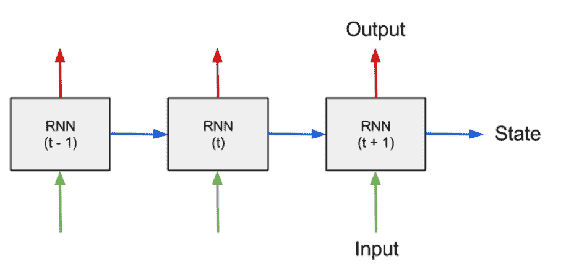

RNN 本质上是递归的，因为它们对序列中的每个元素执行相同的计算，输出依赖于之前的计算。另一种看待 RNN 的方式是，它们具有可以捕捉到迄今为止已计算信息的“记忆”。RNN 可以利用长序列中的信息或知识，但实际上它们只限于回顾几步之前的信息。

一个典型的 RNN 如下所示：

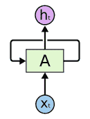

下图展示了未展开版本的 RNN；展开的意思是我们将神经网络写出以适应整个序列。考虑一个包含五个单词的序列；该网络将展开成一个五层的神经网络，每一层对应一个单词：

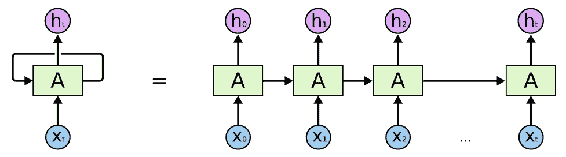

RNN 中的计算过程如下：

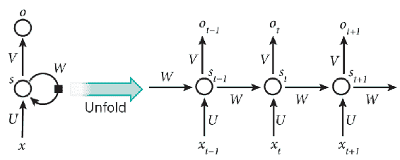

+   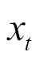 表示时间步  的输入。

+   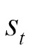 表示时间步 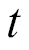 的隐藏状态。隐藏状态是网络的记忆。  是基于先前的隐藏状态和当前步骤的输入计算得出的， 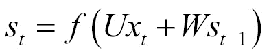。

+   函数 *f* 表示非线性，例如 *tanh* 或 ReLU。第一个隐藏状态通常初始化为全零。

+   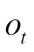 表示步骤  的输出。为了预测给定句子中的下一个单词，它将是一个遍历词汇表的概率向量， 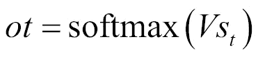。

# RNN 实现

以下程序处理一系列数字，目标是预测下一个值，并提供先前的值。在每个时间步，RNN 网络的输入是当前值和一个状态向量，该向量表示或存储了神经网络在之前时间步看到的内容。这个状态向量是 RNN 的编码记忆，最初设置为零。

训练数据基本上是一个随机的二进制向量。输出向右偏移。

```py
from __future__ import print_function, division
import tensorflow as tf
import numpy as np
import matplotlib.pyplot as plt

"""
define all the constants
"""
numEpochs = 10
seriesLength = 50000
backpropagationLength = 15
stateSize = 4
numClasses = 2
echoStep = 3
batchSize = 5
num_batches = seriesLength // batchSize // backpropagationLength

"""
generate data
"""
def generateData():
    x = np.array(np.random.choice(2, seriesLength, p=[0.5, 0.5]))
    y = np.roll(x, echoStep)
    y[0:echoStep] = 0

    x = x.reshape((batchSize, -1))
    y = y.reshape((batchSize, -1))

    return (x, y)

"""
start computational graph
"""
batchXHolder = tf.placeholder(tf.float32, [batchSize, backpropagationLength], name="x_input")
batchYHolder = tf.placeholder(tf.int32, [batchSize, backpropagationLength], name="y_input")

initState = tf.placeholder(tf.float32, [batchSize, stateSize], "rnn_init_state")

W = tf.Variable(np.random.rand(stateSize+1, stateSize), dtype=tf.float32, name="weight1")
bias1 = tf.Variable(np.zeros((1,stateSize)), dtype=tf.float32)

W2 = tf.Variable(np.random.rand(stateSize, numClasses),dtype=tf.float32, name="weight2")
bias2 = tf.Variable(np.zeros((1,numClasses)), dtype=tf.float32)

tf.summary.histogram(name="weights", values=W)

# Unpack columns
inputsSeries = tf.unstack(batchXHolder, axis=1, name="input_series")
labelsSeries = tf.unstack(batchYHolder, axis=1, name="labels_series")

# Forward pass
currentState = initState
statesSeries = []
for currentInput in inputsSeries:
    currentInput = tf.reshape(currentInput, [batchSize, 1], name="current_input")
    inputAndStateConcatenated = tf.concat([currentInput, currentState], 1, name="input_state_concat")

    nextState = tf.tanh(tf.matmul(inputAndStateConcatenated, W) + bias1, name="next_state")
    statesSeries.append(nextState)
    currentState = nextState

# calculate loss
logits_series = [tf.matmul(state, W2) + bias2 for state in statesSeries]
predictions_series = [tf.nn.softmax(logits) for logits in logits_series]

losses = [tf.nn.sparse_softmax_cross_entropy_with_logits(labels=labels, logits=logits) for logits, labels in zip(logits_series,labelsSeries)]
total_loss = tf.reduce_mean(losses, name="total_loss")

train_step = tf.train.AdagradOptimizer(0.3).minimize(total_loss, name="training")

"""
plot computation
"""
def plot(loss_list, predictions_series, batchX, batchY):
    plt.subplot(2, 3, 1)
    plt.cla()
    plt.plot(loss_list)

    for batchSeriesIdx in range(5):
        oneHotOutputSeries = np.array(predictions_series)[:, batchSeriesIdx, :]
        singleOutputSeries = np.array([(1 if out[0] < 0.5 else 0) for out in oneHotOutputSeries])

        plt.subplot(2, 3, batchSeriesIdx + 2)
        plt.cla()
        plt.axis([0, backpropagationLength, 0, 2])
        left_offset = range(backpropagationLength)
        plt.bar(left_offset, batchX[batchSeriesIdx, :], width=1, color="blue")
        plt.bar(left_offset, batchY[batchSeriesIdx, :] * 0.5, width=1, color="red")
        plt.bar(left_offset, singleOutputSeries * 0.3, width=1, color="green")

    plt.draw()
    plt.pause(0.0001)

"""
run the graph
"""
with tf.Session() as sess:
    writer = tf.summary.FileWriter("logs", graph=tf.get_default_graph())
    sess.run(tf.global_variables_initializer())
    plt.ion()
    plt.figure()
    plt.show()
    loss_list = []

    for epoch_idx in range(numEpochs):
        x,y = generateData()
        _current_state = np.zeros((batchSize, stateSize))

        print("New data, epoch", epoch_idx)

        for batch_idx in range(num_batches):
            start_idx = batch_idx * backpropagationLength
            end_idx = start_idx + backpropagationLength

            batchX = x[:,start_idx:end_idx]
            batchY = y[:,start_idx:end_idx]

            _total_loss, _train_step, _current_state, _predictions_series = sess.run(
                [total_loss, train_step, currentState, predictions_series],
                feed_dict={
                    batchXHolder:batchX,
                    batchYHolder:batchY,
                    initState:_current_state
                })

            loss_list.append(_total_loss)

            # fix the cost summary later
            tf.summary.scalar(name="totalloss", tensor=_total_loss)

            if batch_idx%100 == 0:
                print("Step",batch_idx, "Loss", _total_loss)
                plot(loss_list, _predictions_series, batchX, batchY)

plt.ioff()
plt.show()
```

# 计算图

计算图如下所示：

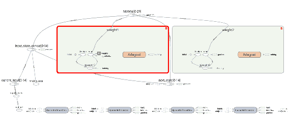

以下是列表的输出结果：

```py
New data, epoch 0
Step 0 Loss 0.777418
Step 600 Loss 0.693907
New data, epoch 1
Step 0 Loss 0.690996
Step 600 Loss 0.691115
New data, epoch 2
Step 0 Loss 0.69259
Step 600 Loss 0.685826
New data, epoch 3
Step 0 Loss 0.684189
Step 600 Loss 0.690608
New data, epoch 4
Step 0 Loss 0.691302
Step 600 Loss 0.691309
New data, epoch 5
Step 0 Loss 0.69172
Step 600 Loss 0.694034
New data, epoch 6
Step 0 Loss 0.692927
Step 600 Loss 0.42796
New data, epoch 7
Step 0 Loss 0.42423
Step 600 Loss 0.00845207
New data, epoch 8
Step 0 Loss 0.188478
Step 500 Loss 0.00427217
```

# 使用 TensorFlow 实现的 RNN

我们现在将使用 TensorFlow API；RNN 的内部工作机制隐藏在幕后。TensorFlow 的 `rnn` 包展开了 RNN 并自动创建图形，这样我们就可以去掉 for 循环：

```py
from __future__ import print_function, division
import tensorflow as tf
import numpy as np
import matplotlib.pyplot as plt

"""
define all the constants
"""
numEpochs = 10
seriesLength = 50000
backpropagationLength = 15
stateSize = 4
numClasses = 2
echoStep = 3
batchSize = 5
num_batches = seriesLength // batchSize // backpropagationLength

"""
generate data
"""
def generateData():
    x = np.array(np.random.choice(2, seriesLength, p=[0.5, 0.5]))
    y = np.roll(x, echoStep)
    y[0:echoStep] = 0

    x = x.reshape((batchSize, -1))
    y = y.reshape((batchSize, -1))

    return (x, y)

"""
start computational graph
"""
batchXHolder = tf.placeholder(tf.float32, [batchSize, backpropagationLength], name="x_input")
batchYHolder = tf.placeholder(tf.int32, [batchSize, backpropagationLength], name="y_input")

initState = tf.placeholder(tf.float32, [batchSize, stateSize], "rnn_init_state")

W = tf.Variable(np.random.rand(stateSize+1, stateSize), dtype=tf.float32, name="weight1")
bias1 = tf.Variable(np.zeros((1,stateSize)), dtype=tf.float32)

W2 = tf.Variable(np.random.rand(stateSize, numClasses),dtype=tf.float32, name="weight2")
bias2 = tf.Variable(np.zeros((1,numClasses)), dtype=tf.float32)

tf.summary.histogram(name="weights", values=W)

# Unpack columns
inputsSeries = tf.split(axis=1, num_or_size_splits=backpropagationLength, value=batchXHolder)
labelsSeries = tf.unstack(batchYHolder, axis=1)

# Forward passes
from tensorflow.contrib import rnn
cell = rnn.BasicRNNCell(stateSize)
statesSeries, currentState = rnn.static_rnn(cell, inputsSeries, initState)

# calculate loss
logits_series = [tf.matmul(state, W2) + bias2 for state in statesSeries]
predictions_series = [tf.nn.softmax(logits) for logits in logits_series]

losses = [tf.nn.sparse_softmax_cross_entropy_with_logits(labels=labels, logits=logits) for logits, labels in zip(logits_series,labelsSeries)]
total_loss = tf.reduce_mean(losses, name="total_loss")

train_step = tf.train.AdagradOptimizer(0.3).minimize(total_loss, name="training")

"""
plot computation
"""
def plot(loss_list, predictions_series, batchX, batchY):
    plt.subplot(2, 3, 1)
    plt.cla()
    plt.plot(loss_list)

    for batchSeriesIdx in range(5):
        oneHotOutputSeries = np.array(predictions_series)[:, batchSeriesIdx, :]
        singleOutputSeries = np.array([(1 if out[0] < 0.5 else 0) for out in oneHotOutputSeries])

        plt.subplot(2, 3, batchSeriesIdx + 2)
        plt.cla()
        plt.axis([0, backpropagationLength, 0, 2])
        left_offset = range(backpropagationLength)
        plt.bar(left_offset, batchX[batchSeriesIdx, :], width=1, color="blue")
        plt.bar(left_offset, batchY[batchSeriesIdx, :] * 0.5, width=1, color="red")
        plt.bar(left_offset, singleOutputSeries * 0.3, width=1, color="green")

    plt.draw()
    plt.pause(0.0001)

"""
run the graph
"""
with tf.Session() as sess:
    writer = tf.summary.FileWriter("logs", graph=tf.get_default_graph())
    sess.run(tf.global_variables_initializer())
    plt.ion()
    plt.figure()
    plt.show()
    loss_list = []

    for epoch_idx in range(numEpochs):
        x,y = generateData()
        _current_state = np.zeros((batchSize, stateSize))

        print("New data, epoch", epoch_idx)

        for batch_idx in range(num_batches):
            start_idx = batch_idx * backpropagationLength
            end_idx = start_idx + backpropagationLength

            batchX = x[:,start_idx:end_idx]
            batchY = y[:,start_idx:end_idx]

            _total_loss, _train_step, _current_state, _predictions_series = sess.run(
                [total_loss, train_step, currentState, predictions_series],
                feed_dict={
                    batchXHolder:batchX,
                    batchYHolder:batchY,
                    initState:_current_state
                })

            loss_list.append(_total_loss)

            # fix the cost summary later
            tf.summary.scalar(name="totalloss", tensor=_total_loss)

            if batch_idx%100 == 0:
                print("Step",batch_idx, "Loss", _total_loss)
                plot(loss_list, _predictions_series, batchX, batchY)

plt.ioff()
plt.show()
```

# 计算图

以下是计算图的图像：

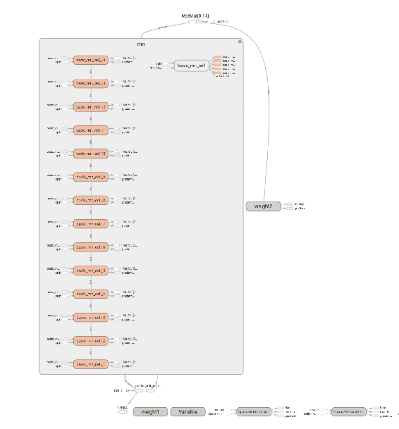

以下是列表的输出结果：

```py
New data, epoch 0
Step 0 Loss 0.688437
Step 600 Loss 0.00107078
New data, epoch 1
Step 0 Loss 0.214923
Step 600 Loss 0.00111716
New data, epoch 2
Step 0 Loss 0.214962
Step 600 Loss 0.000730697
New data, epoch 3
Step 0 Loss 0.276177
Step 600 Loss 0.000362316
New data, epoch 4
Step 0 Loss 0.1641
Step 600 Loss 0.00025342
New data, epoch 5
Step 0 Loss 0.0947087
Step 600 Loss 0.000276762
```

# 长短期记忆网络简介

梯度消失问题已成为循环网络最大的障碍。

随着直线沿 *x* 轴变化，*y* 轴的变化幅度较小，梯度显示了所有权重随误差变化的变化。如果我们不知道梯度，就无法调整权重以减少损失或误差，我们的神经网络将停止学习。

**长短期记忆**（**LSTM**）旨在克服梯度消失问题。保留信息更长时间实际上是它们的隐性行为。

在标准的 RNN 中，重复单元将具有一个基础结构，例如单一的 **tanh** 层：

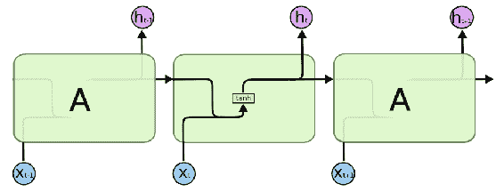

如前图所示，LSTM 也具有链式结构，但其递归单元具有不同的结构：

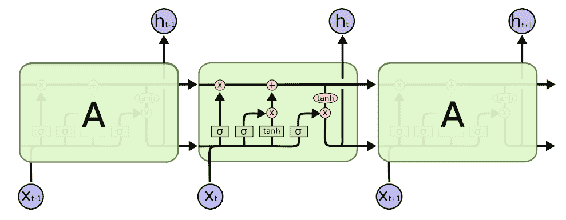

# LSTM 的生命周期

LSTM 的关键是单元状态，它像一个传送带。它通过轻微的线性交互沿着流动，数据可以轻松流动而不改变：

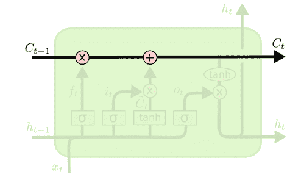

LSTM 网络能够有选择地从单元状态中删除或添加信息，而这些信息的操作由称为门的结构精心调控。

1.  LSTM 网络的第一步是确定我们将从单元状态中丢弃哪些信息。这个决策是通过一个称为**忘记门**层的 sigmoid 层来做出的。该层查看前一个状态 *h(t-1)* 和当前输入 *x(t)*，并为单元状态 *C(t−1)* 中的每个数字输出一个介于 0 和 1 之间的数值，其中 1 表示**绝对保留此信息**，而 0 表示**完全丢弃此信息**：

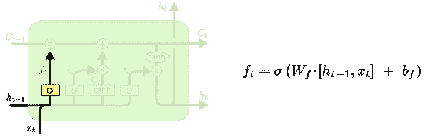

1.  下一步是确定我们将要在单元状态中保持哪些新信息。首先，一个称为输入门层的 sigmoid 层决定哪些值会被更新。其次，一个 *tanh* 层生成一个新的候选值向量 *C̃*，这些值可能会被添加到状态中。

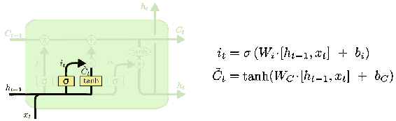

1.  现在我们将更新旧的单元状态 *C(t−1)* 为新的单元状态 *C(t)*。我们将旧状态乘以 *f(t)*，忘记我们之前决定要忘记的内容。然后我们添加 *i(t) ∗ C̃*；这些是新的候选值，按我们决定更新每个状态值的比例进行缩放。

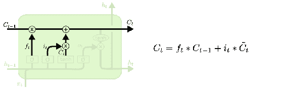

1.  最后，我们决定输出什么，这将基于我们的单元状态，但将是一个经过滤波或修改的版本。首先，我们执行一个 sigmoid 层来决定我们将输出单元状态的哪些部分。然后，我们将单元状态通过 tanh 层，以便将值压缩到 −1 和 1 之间，并将其与 sigmoid 门的输出相乘，这样我们只输出我们决定的部分。

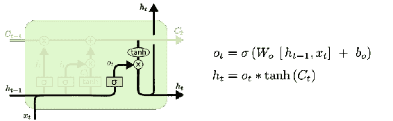

# LSTM 实现

LSTM 会记住、忘记，并根据当前的状态和输入选择要传递和输出的内容。一个 LSTM 具有更多的活动组件，但使用原生的 TensorFlow API，操作起来会非常直接：

```py
from __future__ import print_function, division
import tensorflow as tf
import numpy as np
import matplotlib.pyplot as plt
from tensorflow.contrib import rnn

"""
define all the constants
"""
numEpochs = 10
seriesLength = 50000
backpropagationLength = 15
stateSize = 4
numClasses = 2
echoStep = 3
batchSize = 5
num_batches = seriesLength // batchSize // backpropagationLength

"""
generate data
"""
def generateData():
    x = np.array(np.random.choice(2, seriesLength, p=[0.5, 0.5]))
    y = np.roll(x, echoStep)
    y[0:echoStep] = 0

    x = x.reshape((batchSize, -1))
    y = y.reshape((batchSize, -1))

    return (x, y)

"""
start computational graph
"""
batchXHolder = tf.placeholder(tf.float32, [batchSize, backpropagationLength], name="x_input")
batchYHolder = tf.placeholder(tf.int32, [batchSize, backpropagationLength], name="y_input")

# rnn replace
#initState = tf.placeholder(tf.float32, [batchSize, stateSize], "rnn_init_state")

cellState = tf.placeholder(tf.float32, [batchSize, stateSize])
hiddenState = tf.placeholder(tf.float32, [batchSize, stateSize])
initState = rnn.LSTMStateTuple(cellState, hiddenState)

W = tf.Variable(np.random.rand(stateSize+1, stateSize), dtype=tf.float32, name="weight1")
bias1 = tf.Variable(np.zeros((1,stateSize)), dtype=tf.float32)

W2 = tf.Variable(np.random.rand(stateSize, numClasses),dtype=tf.float32, name="weight2")
bias2 = tf.Variable(np.zeros((1,numClasses)), dtype=tf.float32)

tf.summary.histogram(name="weights", values=W)

# Unpack columns
inputsSeries = tf.split(axis=1, num_or_size_splits=backpropagationLength, value=batchXHolder)
labelsSeries = tf.unstack(batchYHolder, axis=1)

# Forward passes

# rnn replace
# cell = rnn.BasicRNNCell(stateSize)
# statesSeries, currentState = rnn.static_rnn(cell, inputsSeries, initState)

cell = rnn.BasicLSTMCell(stateSize, state_is_tuple=True)
statesSeries, currentState = rnn.static_rnn(cell, inputsSeries, initState)

# calculate loss
logits_series = [tf.matmul(state, W2) + bias2 for state in statesSeries]
predictions_series = [tf.nn.softmax(logits) for logits in logits_series]

losses = [tf.nn.sparse_softmax_cross_entropy_with_logits(labels=labels, logits=logits) for logits, labels in zip(logits_series,labelsSeries)]
total_loss = tf.reduce_mean(losses, name="total_loss")

train_step = tf.train.AdagradOptimizer(0.3).minimize(total_loss, name="training")

"""
plot computation
"""
def plot(loss_list, predictions_series, batchX, batchY):
    plt.subplot(2, 3, 1)
    plt.cla()
    plt.plot(loss_list)

    for batchSeriesIdx in range(5):
        oneHotOutputSeries = np.array(predictions_series)[:, batchSeriesIdx, :]
        singleOutputSeries = np.array([(1 if out[0] < 0.5 else 0) for out in oneHotOutputSeries])

        plt.subplot(2, 3, batchSeriesIdx + 2)
        plt.cla()
        plt.axis([0, backpropagationLength, 0, 2])
        left_offset = range(backpropagationLength)
        plt.bar(left_offset, batchX[batchSeriesIdx, :], width=1, color="blue")
        plt.bar(left_offset, batchY[batchSeriesIdx, :] * 0.5, width=1, color="red")
        plt.bar(left_offset, singleOutputSeries * 0.3, width=1, color="green")

    plt.draw()
    plt.pause(0.0001)

"""
run the graph
"""
with tf.Session() as sess:
    writer = tf.summary.FileWriter("logs", graph=tf.get_default_graph())
    sess.run(tf.global_variables_initializer())
    plt.ion()
    plt.figure()
    plt.show()
    loss_list = []

    for epoch_idx in range(numEpochs):
        x,y = generateData()

        # rnn remove
        # _current_state = np.zeros((batchSize, stateSize))

        _current_cell_state = np.zeros((batchSize, stateSize))
        _current_hidden_state = np.zeros((batchSize, stateSize))

        print("New data, epoch", epoch_idx)

        for batch_idx in range(num_batches):
            start_idx = batch_idx * backpropagationLength
            end_idx = start_idx + backpropagationLength

            batchX = x[:,start_idx:end_idx]
            batchY = y[:,start_idx:end_idx]

            _total_loss, _train_step, _current_state, _predictions_series = sess.run(
                [total_loss, train_step, currentState, predictions_series],
                feed_dict={
                    batchXHolder:batchX,
                    batchYHolder:batchY,
                    cellState: _current_cell_state,
                    hiddenState: _current_hidden_state
                })

            _current_cell_state, _current_hidden_state = _current_state

            loss_list.append(_total_loss)

            # fix the cost summary later
            tf.summary.scalar(name="totalloss", tensor=_total_loss)

            if batch_idx%100 == 0:
                print("Step",batch_idx, "Loss", _total_loss)
                plot(loss_list, _predictions_series, batchX, batchY)

plt.ioff()
plt.show()
```

# 计算图

以下是来自 TensorBoard 的计算图，描述了 LSTM 网络的工作原理：

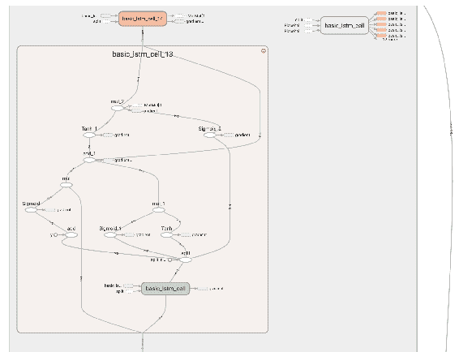

列表的输出如下所示：

```py
New data, epoch 0
Step 0 Loss 0.696803
Step 600 Loss 0.00743465
New data, epoch 1
Step 0 Loss 0.404039
Step 600 Loss 0.00243205
New data, epoch 2
Step 0 Loss 1.11536
Step 600 Loss 0.00140995
New data, epoch 3
Step 0 Loss 0.858743
Step 600 Loss 0.00141037
```

# 情感分析

现在我们将编写一个应用程序来预测电影评论的情感。评论由一系列单词组成，单词的顺序编码了预测情感的非常有用的信息。第一步是将单词映射到词嵌入。第二步是 RNN，它接收一个向量序列作为输入，并考虑向量的顺序来生成预测。

# 词嵌入

现在我们将训练一个神经网络来进行词到向量的表示。给定句子中心的特定单词，即输入词，我们查看附近的单词。网络将告诉我们，在我们的词汇表中，每个单词作为选择的邻近单词的概率。

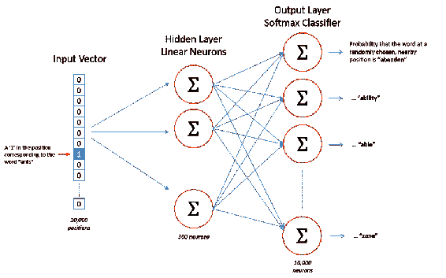

```py
import time
import tensorflow as tf
import numpy as np
import utility
from tqdm import tqdm
from urllib.request import urlretrieve
from os.path import isfile, isdir
import zipfile
from collections import Counter
import random

dataDir = 'data'
dataFile = 'text8.zip'
datasetName = 'text 8 data set'

'''
track progress of file download
'''

class DownloadProgress(tqdm):
    lastBlock = 0

    def hook(self, blockNum=1, blockSize=1, totalSize=None):
        self.total = totalSize
        self.update((blockNum - self.lastBlock) * blockSize)
        self.lastBlock = blockNum

if not isfile(dataFile):
    with DownloadProgress(unit='B', unit_scale=True, miniters=1, desc=datasetName) as progressBar:
        urlretrieve('http://mattmahoney.net/dc/text8.zip', dataFile, progressBar.hook)

if not isdir(dataDir):
    with zipfile.ZipFile(dataFile) as zipRef:
        zipRef.extractall(dataDir)

with open('data/text8') as f:
    text = f.read()

'''
pre process the downloaded wiki text
'''
words = utility.preProcess(text)
print(words[:30])

print('Total words: {}'.format(len(words)))
print('Unique words: {}'.format(len(set(words))))

'''
convert words to integers
'''
int2vocab, vocab2int = utility.lookupTable(words)
intWords = [vocab2int[word] for word in words]
print('test')

'''
sub sampling (***think of words as int's***)
'''
threshold = 1e-5
wordCounts = Counter(intWords)
totalCount = len(intWords)
frequency = {word: count / totalCount for word, count in wordCounts.items()}
probOfWords = {word: 1 - np.sqrt(threshold / frequency[word]) for word in wordCounts}
trainWords = [word for word in intWords if random.random() < (1 - probOfWords[word])]

'''
get window batches
'''

def getTarget(words, index, windowSize=5):
    rNum = np.random.randint(1, windowSize + 1)
    start = index - rNum if (index - rNum) > 0 else 0
    stop = index + rNum
    targetWords = set(words[start:index] + words[index + 1:stop + 1])

    return list(targetWords)

'''
Create a generator of word batches as a tuple (inputs, targets)
'''

def getBatches(words, batchSize, windowSize=5):
    nBatches = len(words) // batchSize
    print('no. of batches {}'.format(nBatches))

    # only full batches
    words = words[:nBatches * batchSize]

    start = 0
    for index in range(0, len(words), batchSize):
        x = []
        y = []
        stop = start + batchSize
        batchWords = words[start:stop]
        for idx in range(0, len(batchWords), 1):
            yBatch = getTarget(batchWords, idx, windowSize)
            y.extend(yBatch)
            x.extend([batchWords[idx]] * len(yBatch))
        start = stop + 1
        yield x, y

'''
start computational graph
'''
train_graph = tf.Graph()
with train_graph.as_default():
    netInputs = tf.placeholder(tf.int32, [None], name='inputS')
    netLabels = tf.placeholder(tf.int32, [None, None], name='labelS')

'''
create embedding layer
'''
nVocab = len(int2vocab)
nEmbedding = 300
with train_graph.as_default():
    embedding = tf.Variable(tf.random_uniform((nVocab, nEmbedding), -1, 1))
    embed = tf.nn.embedding_lookup(embedding, netInputs)

'''
Below, create weights and biases for the softmax layer. Then, use tf.nn.sampled_softmax_loss to calculate the loss
'''
n_sampled = 100
with train_graph.as_default():
    soft_W = tf.Variable(tf.truncated_normal((nVocab, nEmbedding)))
    soft_b = tf.Variable(tf.zeros(nVocab), name="softmax_bias")

    # Calculate the loss using negative sampling
    loss = tf.nn.sampled_softmax_loss(
        weights=soft_W,
        biases=soft_b,
        labels=netLabels,
        inputs=embed,
        num_sampled=n_sampled,
        num_classes=nVocab)

    cost = tf.reduce_mean(loss)
    optimizer = tf.train.AdamOptimizer().minimize(cost)

'''
Here we're going to choose a few common words and few uncommon words. Then, we'll print out the closest words to them. 
It's a nice way to check that our embedding table is grouping together words with similar semantic meanings.
'''
with train_graph.as_default():
    validSize = 16
    validWindow = 100

    validExamples = np.array(random.sample(range(validWindow), validSize // 2))
    validExamples = np.append(validExamples,
                               random.sample(range(1000, 1000 + validWindow), validSize // 2))

    validDataset = tf.constant(validExamples, dtype=tf.int32)

    norm = tf.sqrt(tf.reduce_sum(tf.square(embedding), 1, keep_dims=True))
    normalizedEmbedding = embedding / norm
    valid_embedding = tf.nn.embedding_lookup(normalizedEmbedding, validDataset)
    similarity = tf.matmul(valid_embedding, tf.transpose(normalizedEmbedding))

'''
Train the network. Every 100 batches it reports the training loss. Every 1000 batches, it'll print out the validation
words.
'''
epochs = 10
batch_size = 1000
window_size = 10

with train_graph.as_default():
    saver = tf.train.Saver()

with tf.Session(graph=train_graph) as sess:
    iteration = 1
    loss = 0
    sess.run(tf.global_variables_initializer())

    for e in range(1, epochs + 1):
        batches = getBatches(trainWords, batch_size, window_size)
        start = time.time()
        for x, y in batches:

            feed = {netInputs: x,
                    netLabels: np.array(y)[:, None]}
            trainLoss, _ = sess.run([cost, optimizer], feed_dict=feed)

            loss += trainLoss

            if iteration % 100 == 0:
                end = time.time()
                print("Epoch {}/{}".format(e, epochs),
                      "Iteration: {}".format(iteration),
                      "Avg. Training loss: {:.4f}".format(loss / 100),
                      "{:.4f} sec/batch".format((end - start) / 100))
                loss = 0
                start = time.time()

            if iteration % 1000 == 0:
                sim = similarity.eval()
                for i in range(validSize):
                    validWord = int2vocab[validExamples[i]]
                    topK = 8
                    nearest = (-sim[i, :]).argsort()[1:topK + 1]
                    log = 'Nearest to %s:' % validWord
                    for k in range(topK):
                        closeWord = int2vocab[nearest[k]]
                        logStatement = '%s %s,' % (log, closeWord)
                    print(logStatement)

            iteration += 1
    save_path = saver.save(sess, "checkpoints/text8.ckpt")
    embed_mat = sess.run(normalizedEmbedding)

'''
Restore the trained network if you need to
'''
with train_graph.as_default():
    saver = tf.train.Saver()

with tf.Session(graph=train_graph) as sess:
    saver.restore(sess, tf.train.latest_checkpoint('checkpoints'))
    embed_mat = sess.run(embedding)

'''
Below we'll use T-SNE to visualize how our high-dimensional word vectors cluster together. T-SNE is used to project 
these vectors into two dimensions while preserving local structure. 
'''
import matplotlib.pyplot as plt
from sklearn.manifold import TSNE
vizWords = 500
tsne = TSNE()
embedTSNE = tsne.fit_transform(embed_mat[:vizWords, :])

fig, ax = plt.subplots(figsize=(14, 14))
for idx in range(vizWords):
    plt.scatter(*embedTSNE[idx, :], color='steelblue')
    plt.annotate(int2vocab[idx], (embedTSNE[idx, 0], embedTSNE[idx, 1]), alpha=0.7)
```

列表的输出如下：

```py
Total words: 16680599
 Unique words: 63641
 no. of batches 4626
Epoch 1/10 Iteration: 100 Avg. Training loss: 21.7284 0.3363 sec/batch
 Epoch 1/10 Iteration: 1000 Avg. Training loss: 20.2269 0.3668 sec/batch

Nearest to but: universities, hungry, kyu, grandiose, edema, patty, stores, psychometrics,
 Nearest to three: sulla, monuc, conjuring, ontological, auf, grimoire, unpredictably, frenetic,

Nearest to world: turkle, spectroscopic, jules, servicio, sportswriter, kamikazes, act, earns,
Epoch 1/10 Iteration: 1100 Avg. Training loss: 20.1983 0.3650 sec/batch
 Epoch 1/10 Iteration: 2000 Avg. Training loss: 19.1581 0.3767 sec/batch

Nearest to but: universities, hungry, edema, kyu, grandiose, stores, patty, psychometrics,
 Nearest to three: monuc, sulla, unpredictably, grimoire, hickey, ontological, conjuring, rays,
 Nearest to world: turkle, spectroscopic, jules, sportswriter, kamikazes, alfons, servicio, act,
 ...... 
```

# 使用 RNN 进行情感分析

以下示例展示了使用 RNN 实现情感分析。它包含固定长度的电影评论，这些评论被编码为整数值，然后转换为词嵌入（嵌入向量），并以递归方式传递给 LSTM 层，最后选取最后的预测作为输出情感：

```py
import numpy as np
import tensorflow as tf
from string import punctuation
from collections import Counter

'''
movie review dataset for sentiment analysis
'''
with open('data/reviews.txt', 'r') as f:
    movieReviews = f.read()
with open('data/labels.txt', 'r') as f:
    labels = f.read()

'''
data cleansing - remove punctuations
'''
text = ''.join([c for c in movieReviews if c not in punctuation])
movieReviews = text.split('\n')

text = ' '.join(movieReviews)
words = text.split()

print(text[:500])
print(words[:100])

'''
build a dictionary that maps words to integers
'''
counts = Counter(words)
vocabulary = sorted(counts, key=counts.get, reverse=True)
vocab2int = {word: i for i, word in enumerate(vocabulary, 1)}

reviewsInts = []
for review in movieReviews:
    reviewsInts.append([vocab2int[word] for word in review.split()])

'''
convert labels from positive and negative to 1 and 0 respectively
'''
labels = labels.split('\n')
labels = np.array([1 if label == 'positive' else 0 for label in labels])

reviewLengths = Counter([len(x) for x in reviewsInts])
print("Min review length are: {}".format(reviewLengths[0]))
print("Maximum review length are: {}".format(max(reviewLengths)))

'''
remove the review with zero length from the reviewsInts list
'''
nonZeroIndex = [i for i, review in enumerate(reviewsInts) if len(review) != 0]
print(len(nonZeroIndex))

'''
turns out its the final review that has zero length. But that might not always be the case, so let's make it more
general.
'''
reviewsInts = [reviewsInts[i] for i in nonZeroIndex]
labels = np.array([labels[i] for i in nonZeroIndex])

'''
create an array features that contains the data we'll pass to the network. The data should come from reviewInts, since
we want to feed integers to the network. Each row should be 200 elements long. For reviews shorter than 200 words, 
left pad with 0s. That is, if the review is ['best', 'movie', 'renaira'], [100, 40, 20] as integers, the row will look 
like [0, 0, 0, ..., 0, 100, 40, 20]. For reviews longer than 200, use on the first 200 words as the feature vector.
'''
seqLen = 200
features = np.zeros((len(reviewsInts), seqLen), dtype=int)
for i, row in enumerate(reviewsInts):
    features[i, -len(row):] = np.array(row)[:seqLen]

print(features[:10,:100])

'''
lets create training, validation and test data sets. trainX and trainY for example. 
also define a split percentage function 'splitPerc' as the percentage of data to keep in the training 
set. usually this is 0.8 or 0.9.
'''
splitPrec = 0.8
splitIndex = int(len(features)*0.8)
trainX, valX = features[:splitIndex], features[splitIndex:]
trainY, valY = labels[:splitIndex], labels[splitIndex:]

testIndex = int(len(valX)*0.5)
valX, testX = valX[:testIndex], valX[testIndex:]
valY, testY = valY[:testIndex], valY[testIndex:]

print("Train set: {}".format(trainX.shape), "\nValidation set: {}".format(valX.shape), "\nTest set: {}".format(testX.shape))
print("label set: {}".format(trainY.shape), "\nValidation label set: {}".format(valY.shape), "\nTest label set: {}".format(testY.shape))

'''
tensor-flow computational graph
'''
lstmSize = 256
lstmLayers = 1
batchSize = 500
learningRate = 0.001

nWords = len(vocab2int) + 1

# create graph object and add nodes to the graph
graph = tf.Graph()

with graph.as_default():
    inputData = tf.placeholder(tf.int32, [None, None], name='inputData')
    labels = tf.placeholder(tf.int32, [None, None], name='labels')
    keepProb = tf.placeholder(tf.float32, name='keepProb')

'''
let us create the embedding layer (word2vec)
'''
# number of neurons in hidden or embedding layer
embedSize = 300

with graph.as_default():
    embedding = tf.Variable(tf.random_uniform((nWords, embedSize), -1, 1))
    embed = tf.nn.embedding_lookup(embedding, inputData)

'''
lets use tf.contrib.rnn.BasicLSTMCell to create an LSTM cell, later add drop out to it with 
tf.contrib.rnn.DropoutWrapper. and finally create multiple LSTM layers with tf.contrib.rnn.MultiRNNCell.
'''
with graph.as_default():
    with tf.name_scope("RNNLayers"):
        def createLSTMCell():
            lstm = tf.contrib.rnn.BasicLSTMCell(lstmSize, reuse=tf.get_variable_scope().reuse)
            return tf.contrib.rnn.DropoutWrapper(lstm, output_keep_prob=keepProb)

        cell = tf.contrib.rnn.MultiRNNCell([createLSTMCell() for _ in range(lstmLayers)])

        initialState = cell.zero_state(batchSize, tf.float32)

'''
set tf.nn.dynamic_rnn to add the forward pass through the RNN. here we're actually passing in vectors from the 
embedding layer 'embed'.
'''
with graph.as_default():
    outputs, finalState = tf.nn.dynamic_rnn(cell, embed, initial_state=initialState)

'''
final output will carry the sentiment prediction, therefore lets get the last output with outputs[:, -1], 
the we calculate the cost from that and labels.
'''
with graph.as_default():
    predictions = tf.contrib.layers.fully_connected(outputs[:, -1], 1, activation_fn=tf.sigmoid)
    cost = tf.losses.mean_squared_error(labels, predictions)

    optimizer = tf.train.AdamOptimizer(learningRate).minimize(cost)

'''
now we can add a few nodes to calculate the accuracy which we'll use in the validation pass.
'''
with graph.as_default():
    correctPred = tf.equal(tf.cast(tf.round(predictions), tf.int32), labels)
    accuracy = tf.reduce_mean(tf.cast(correctPred, tf.float32))

'''
get batches
'''
def getBatches(x, y, batchSize=100):
    nBatches = len(x) // batchSize
    x, y = x[:nBatches * batchSize], y[:nBatches * batchSize]
    for i in range(0, len(x), batchSize):
        yield x[i:i + batchSize], y[i:i + batchSize]

'''
training phase
'''
epochs = 1

with graph.as_default():
    saver = tf.train.Saver()

with tf.Session(graph=graph) as sess:
    writer = tf.summary.FileWriter("logs", graph=tf.get_default_graph())
    sess.run(tf.global_variables_initializer())
    iteration = 1
    for e in range(epochs):
        state = sess.run(initialState)

        for i, (x, y) in enumerate(getBatches(trainX, trainY, batchSize), 1):
            feed = {inputData: x, labels: y[:, None], keepProb: 0.5, initialState: state}

            loss, state, _ = sess.run([cost, finalState, optimizer], feed_dict=feed)

            if iteration % 5 == 0:
                print("Epoch are: {}/{}".format(e, epochs), "Iteration is: {}".format(iteration), "Train loss is: {:.3f}".format(loss))

            if iteration % 25 == 0:
                valAcc = []
                valState = sess.run(cell.zero_state(batchSize, tf.float32))
                for x, y in getBatches(valX, valY, batchSize):
                    feed = {inputData: x, labels: y[:, None], keepProb: 1, initialState: valState}
                    batchAcc, valState = sess.run([accuracy, finalState], feed_dict=feed)
                    valAcc.append(batchAcc)
                print("Val acc: {:.3f}".format(np.mean(valAcc)))
            iteration += 1
            saver.save(sess, "checkpoints/sentimentanalysis.ckpt")
    saver.save(sess, "checkpoints/sentimentanalysis.ckpt")

'''
testing phase
'''
testAcc = []
with tf.Session(graph=graph) as sess:
    saver.restore(sess, "checkpoints/sentiment.ckpt")

    testState = sess.run(cell.zero_state(batchSize, tf.float32))
    for i, (x, y) in enumerate(getBatches(testY, testY, batchSize), 1):
        feed = {inputData: x,
                labels: y[:, None],
                keepProb: 1,
                initialState: testState}
        batchAcc, testState = sess.run([accuracy, finalState], feed_dict=feed)
        testAcc.append(batchAcc)
    print("Test accuracy is: {:.3f}".format(np.mean(testAcc)))
```

# 计算图

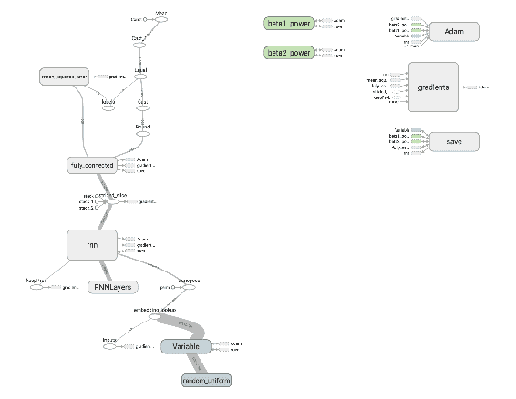

列表的输出如下所示：

```py
Train set: (20000, 200)
 Validation set: (2500, 200)
 Test set: (2500, 200)
 label set: (20000,)
 Validation label set: (2500,)
 Test label set: (2500,)
Val acc: 0.682
 Val acc: 0.692
 Val acc: 0.714
 Val acc: 0.808
 Val acc: 0.763
 Val acc: 0.826
 Val acc: 0.854
 Val acc: 0.872
```

# 摘要

在本章中，你学习了递归神经网络的基础知识，以及它为何是处理时间序列数据的有用机制。你学习了基本概念，如状态、词嵌入和长期记忆。接着是一个开发情感分析系统的示例。我们还使用 TensorFlow 实现了递归神经网络。

在下一章，我们将介绍一种不同类型的神经网络，称为**生成模型**。
