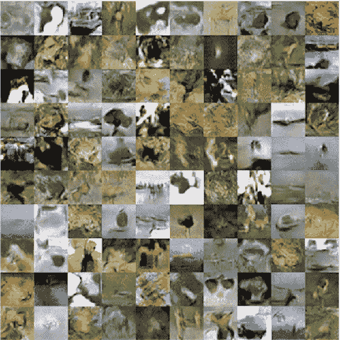
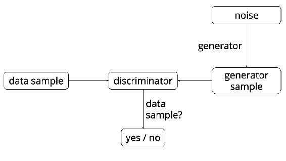
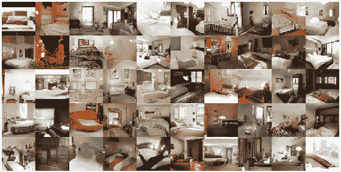
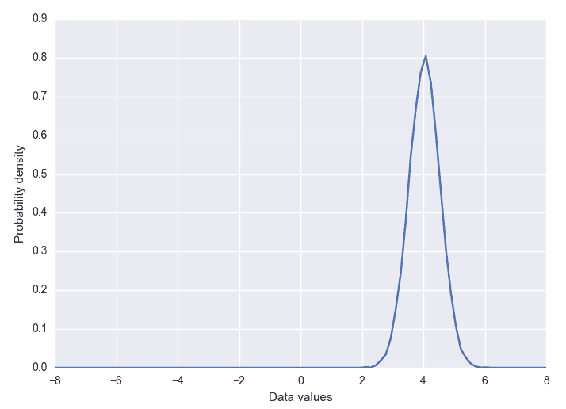
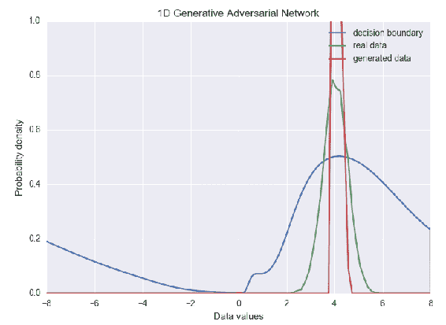

# 第六章：生成模型

生成模型是机器学习模型的一类，用于描述数据是如何生成的。为了训练一个生成模型，我们首先收集大量的领域数据，然后训练一个模型来生成类似的数据。

换句话说，这些模型可以学习生成与我们提供的数据相似的数据。一个这样的方式是使用**生成对抗网络（GANs）**，本章将详细讨论这一部分内容。

本章将涵盖以下主题：

+   生成模型简介

+   GANs

# 生成模型

机器学习模型有两种类型：生成模型和判别模型。我们来看以下分类器的列表：决策树、神经网络、随机森林、广义增强模型、逻辑回归、朴素贝叶斯和**支持向量机（SVM）**。其中大多数是分类器和集成模型，唯一的例外是朴素贝叶斯，它是列表中的唯一生成模型。其他的则是判别模型的例子。

生成模型和判别模型的根本区别在于它们的概率推理结构。在本章中，我们将学习生成模型的关键概念，如类型和 GANs，但在此之前，让我们先了解一下生成模型和判别模型之间的一些关键区别。

# 判别模型与生成模型的区别

判别模型学习 *P(Y|X)*，即目标变量 *Y* 和特征 *X* 之间的条件关系。这就是最小二乘回归的工作原理，也是使用的推理模式。它是一种用于解决变量之间关系的推理方法。

生成模型旨在对数据集进行完整的概率描述。使用生成模型时，目标是开发联合概率分布 *P(X, Y)*，可以直接计算 *P(Y | X)* 和 *P(X)*，然后推断分类新数据所需的条件概率。与回归模型相比，这种方法需要更为扎实的概率思维，但它提供了数据概率结构的完整模型。了解联合分布后，你可以生成数据；因此，朴素贝叶斯就是一个生成模型。

假设我们有一个监督学习任务，其中 *x[i]* 是数据点的给定特征，*y[i]* 是对应的标签。预测未来 *x* 上的 *y* 的一种方法是学习一个函数 *f()*，它从 *(x[i], y[i])* 中获取 *x* 并输出最可能的 *y*。这样的模型属于判别模型，因为你正在学习如何区分来自不同类别的 *x*。像 SVM 和神经网络这样的算法就属于这一类。即使你能够非常准确地分类数据，你也无法知道数据是如何生成的。

第二种方法是模拟数据可能是如何生成的，并学习一个函数 *f(x,y)*，为由 *x* 和 *y* 共同决定的配置打分。然后，你可以通过找到使得 *f(x,y)* 得分最大的 *y* 来预测新的 *x* 的 *y*。高斯混合模型是这一方法的典型例子。

另一个例子是：你可以将 *x* 想象成一张图像，将 *y* 想象成一个对象种类，如狗，即在图像中。写作 *p(y|x)* 的概率告诉我们，在给定输入图像的情况下，模型认为其中有一只狗的程度，相对于它所知道的所有可能性。尝试直接建模这个概率映射的算法被称为**判别模型**。

另一方面，生成模型试图学习一个称为联合概率 *p(y, x)* 的函数。我们可以将其理解为模型在多大程度上相信 *x* 是一张图像并且其中有一只狗 *y*。这两个概率是相关的，可以写作 *p(y, x) = p(x) p(y|x)*，其中 *p(x)* 是输入 *x* 为图像的可能性。*p(x)* 概率通常在文献中称为**密度函数**。

之所以最终称这些模型为生成模型，主要是因为模型能够同时访问输入和输出的概率。利用这一点，我们可以通过从 *p(y, x)* 中采样动物种类 *y* 和新的图像 *x* 来生成动物的图像。

我们主要可以学习密度函数 *p(x)*，它仅依赖于输入空间。

两种模型都有用；然而，相对而言，生成模型相较于判别模型有一个有趣的优势，即它们有潜力理解和解释输入数据的潜在结构，即使在没有标签的情况下也能做到。这在实际工作中是非常需要的。

# 生成模型的类型

判别模型一直是最近在机器学习领域取得成功的前沿。模型根据给定输入进行预测，尽管它们不能生成新的样本或数据。

最近生成模型进展背后的想法是将生成问题转换为预测问题，并使用深度学习算法来学习这种问题。

# 自编码器

将生成问题转化为判别问题的一种方式是通过学习从输入空间本身的映射。例如，我们希望学习一个恒等映射，对于每个图像 *x*，理想情况下预测相同的图像，即 *x = f(x)*，其中 *f* 是预测模型。

该模型在当前形式下可能没有什么用处，但我们可以从中创建一个生成模型。

在这里，我们创建一个由两个主要组件组成的模型：一个编码器模型 *q(h|x)*，它将输入映射到另一个空间，这个空间被称为隐藏空间或潜在空间，用 *h* 表示，另一个是解码器模型 *q(x|h)*，它学习从隐藏输入空间到原输入空间的反向映射。

这些组件——编码器和解码器——连接在一起，形成一个端到端可训练的模型。编码器和解码器模型都是具有不同架构的神经网络，例如 RNN 和注意力网络，以获得期望的结果。

随着模型的学习，我们可以从编码器中移除解码器，然后单独使用它们。为了生成新的数据样本，我们可以首先从潜在空间生成一个样本，然后将其输入解码器，从输出空间创建一个新的样本。

自编码器在第八章中有更详细的介绍，*自编码器*。

# GAN

如自编码器所示，我们可以将创建可以在关系中共同工作的网络的概念作为一般思路，训练这些网络将帮助我们学习潜在空间，从而生成新的数据样本。

另一种生成网络是 GAN，其中我们有一个生成模型*q(x|h)*，它将小维度的潜在空间*h*（通常表示为来自简单分布的噪声样本）映射到输入空间*x*。这与自编码器中解码器的作用非常相似。

现在的任务是引入一个判别模型*p(y| x)*，它试图将输入实例*x*与一个二元答案*y*关联起来，判断该输入是由生成器模型生成的，还是来自我们训练数据集中的真实样本。

让我们使用之前做的图像示例。假设生成器模型创建了一张新图像，我们也有来自实际数据集的真实图像。如果生成器模型做得正确，判别模型将难以区分这两张图像。如果生成器模型做得不好，判断哪张是假图像、哪张是真图像将变得非常简单。

当这两个模型结合在一起时，我们可以通过确保生成模型随着时间的推移变得更强，从而欺骗判别模型，同时训练判别模型去处理更难的任务——检测欺诈。最终，我们希望生成器模型的输出与我们用来训练的真实数据无法区分。

在训练的初期，判别模型可以轻松区分实际数据集中的样本与生成模型刚开始学习时所生成的样本。随着生成器在建模数据集方面的能力逐渐提升，我们开始看到越来越多与数据集相似的生成样本。下面的例子展示了一个 GAN 模型随着时间推移学习的生成图像：



在接下来的部分，我们将详细讨论 GAN。

# 序列模型

如果数据具有时间性，我们可以使用专门的算法，称为**序列模型**。这些模型可以学习形式为*p(y|x_n, x_1)*的概率，其中*i*是表示序列中位置的索引，*x_i*是第*i*个输入样本。

作为一个例子，我们可以将每个单词看作是一系列字符，每个句子看作是一系列单词，每个段落看作是一系列句子。输出*y*可以是句子的情感。

使用自编码器中的类似技巧，我们可以将*y*替换为序列或序列中的下一个项，即*y = x_n + 1*，从而让模型学习。

# GAN

GAN 是由蒙特利尔大学的一组研究人员提出的，该团队由*Ian Goodfellow*领导。GAN 模型的核心思想是有两个相互竞争的神经网络模型。一个网络以噪声为输入并生成样本（因此被称为**生成器**）。第二个模型（称为**判别器**）从生成器和实际的训练数据中获取样本，并应能区分这两种来源。生成模型和判别模型在不断地进行博弈，生成器学习生成更真实的样本，而判别器则学习更好地区分生成的数据和真实数据。这两个网络同时训练，目标是通过这种竞争，使得生成的样本与真实数据无法区分：



用来描述 GAN 的类比是：生成器就像一个伪造者，试图制造一些伪造的物品，而判别器模型则像警察，试图检测伪造的物品。这可能看起来与强化学习有些相似，在强化学习中，生成器从判别器那里获得奖励，帮助它知道生成的数据是否准确。GAN 的关键区别在于，我们可以将来自判别器网络的梯度信息反向传播到生成器网络，从而让生成器知道如何调整其参数，生成能够欺骗判别器的输出数据。

截至今天，GAN 主要被应用于建模自然图像。它们在图像生成任务中提供了最佳的结果，且在生成比其他基于最大似然训练目标的生成方法更清晰的图像方面也表现出色。

这里是一些由 GAN 生成的图像示例：



# GAN 示例

为了更深入理解 GAN 是如何工作的，我们将使用一个 GAN 在 TensorFlow 中解决一个简单的问题，即学习近似一维高斯分布。

首先，我们将创建实际数据分布，这是一个简单的高斯分布，均值为 4，标准差为 0.5。它有一个样本函数，返回来自该分布的指定数量的样本（按值排序）。我们学习的数据分布将类似于以下图示：



生成器输入的噪声分布也通过类似的样本函数定义，用于实际数据。

生成器和判别器网络都非常简单。生成器是一个线性变换，通过非线性函数（`softplus`函数）进行处理，随后是另一个线性变换。

我们保持判别器比生成器更强，否则它将没有足够的能力准确区分生成的样本和真实样本。因此，我们将判别器设计为一个更深的神经网络，拥有更高的维度。除最后一层外，我们在所有层使用*tanh*非线性函数，最后一层使用的是 sigmoid（其输出可以描述为概率）。

我们将这些网络连接到 TensorFlow 图中，并为每个网络定义损失函数，以便生成器网络能轻松欺骗判别器网络。我们使用 TensorFlow 的梯度下降优化器，并配合指数学习率衰减作为优化器。

为了训练模型，我们从数据分布和噪声分布中抽取样本，并交替优化判别器和生成器的参数。

我们会看到，在训练方法开始时，生成器生成的分布与真实数据非常不同。网络逐渐学习逼近真实数据，最终收敛到一个聚焦于输入分布均值的更窄分布。在训练完网络之后，两个分布大致如下图所示：



生成器网络陷入一种参数设置，导致它生成一个非常狭窄的分布或点模式，是 GANs 的主要失败之一。解决方案是允许判别器一次查看多个样本，这种技术称为小批量判别。小批量判别是一种方法，判别器可以查看一个完整的批次样本，判断它们是来自生成器网络还是来自真实数据。

该方法的总结如下：

+   获取判别器网络任何中间层的输出。

+   将该输出乘以一个 3D 张量，生成一个大小为*numOfKernels ** *kernelDim*的矩阵。

+   计算该矩阵中每一行之间的 L1 距离，并对批次中的所有样本应用负指数。

+   样本的小批量特征或属性是这些指数距离的总和。

+   将实际输入与小批量层连接，即将前一个判别器层的输出与创建的小批量特征进行合并，然后将其作为输入传递给判别器网络的下一个层。

小批量判别使得批量大小变得和超参数一样重要：

```py
import argparse
import numpy as np
import tensorflow as tf
import matplotlib.pyplot as plt
from matplotlib import animation
import seaborn as sns
from tensorflow.python.training.gradient_descent import GradientDescentOptimizer

sns.set(color_codes=True)

seed = 42
np.random.seed(seed)
tf.set_random_seed(seed)

# gaussian data distribution
class DataDist(object):
    def __init__(self):
        self.mue = 4
        self.sigma = 0.5

    def sample(self, N):
        samples = np.random.normal(self.mue, self.sigma, N)
        samples.sort()
        return samples

# data distribution with noise
class GeneratorDist(object):
    def __init__(self, rnge):
        self.rnge = rnge

    def sample(self, N):
        return np.linspace(-self.rnge, self.rnge, N) + \
               np.random.random(N) * 0.01

# linear method
def linearUnit(input, output_dim, scope=None, stddev=1.0):
    with tf.variable_scope(scope or 'linearUnit'):
        weight = tf.get_variable(
            'weight',
            [input.get_shape()[1], output_dim],
            initializer=tf.random_normal_initializer(stddev=stddev)
        )
        bias = tf.get_variable(
            'bias',
            [output_dim],
            initializer=tf.constant_initializer(0.0)
        )
        return tf.matmul(input, weight) + bias

# generator network
def generatorNetwork(input, hidden_size):
    hidd0 = tf.nn.softplus(linearUnit(input, hidden_size, 'g0'))
    hidd1 = linearUnit(hidd0, 1, 'g1')
    return hidd1

# discriminator network
def discriminatorNetwork(input, h_dim, minibatch_layer=True):
    hidd0 = tf.nn.relu(linearUnit(input, h_dim * 2, 'd0'))
    hidd1 = tf.nn.relu(linearUnit(hidd0, h_dim * 2, 'd1'))

    if minibatch_layer:
        hidd2 = miniBatch(hidd1)
    else:
        hidd2 = tf.nn.relu(linearUnit(hidd1, h_dim * 2, scope='d2'))

    hidd3 = tf.sigmoid(linearUnit(hidd2, 1, scope='d3'))
    return hidd3

# minibatch
def miniBatch(input, numKernels=5, kernelDim=3):
    x = linearUnit(input, numKernels * kernelDim, scope='minibatch', stddev=0.02)
    act = tf.reshape(x, (-1, numKernels, kernelDim))
    differences = tf.expand_dims(act, 3) - \
            tf.expand_dims(tf.transpose(act, [1, 2, 0]), 0)
    absDiffs = tf.reduce_sum(tf.abs(differences), 2)
    minibatchFeatures = tf.reduce_sum(tf.exp(-absDiffs), 2)
    return tf.concat([input, minibatchFeatures], 1)

# optimizer
def optimizer(loss, var_list):
    learning_rate = 0.001
    step = tf.Variable(0, trainable=False)
    optimizer = tf.train.AdamOptimizer(learning_rate).minimize(
        loss,
        global_step=step,
        var_list=var_list
    )
    return optimizer

# log
def log(x):
    return tf.log(tf.maximum(x, 1e-5))

class GAN(object):
    def __init__(self, params):
        with tf.variable_scope('Generator'):
            self.zee = tf.placeholder(tf.float32, shape=(params.batchSize, 1))
            self.Gee = generatorNetwork(self.zee, params.hidden_size)

        self.xVal = tf.placeholder(tf.float32, shape=(params.batchSize, 1))
        with tf.variable_scope('Discriminator'):
            self.Dis1 = discriminatorNetwork(
                self.xVal,
                params.hidden_size,
                params.minibatch
            )
        with tf.variable_scope('D', reuse=True):
            self.Dis2 = discriminatorNetwork(
                self.Gee,
                params.hidden_size,
                params.minibatch
            )

        self.lossD = tf.reduce_mean(-log(self.Dis1) - log(1 - self.Dis2))
        self.lossG = tf.reduce_mean(-log(self.Dis2))

        vars = tf.trainable_variables()
        self.dParams = [v for v in vars if v.name.startswith('D/')]
        self.gParams = [v for v in vars if v.name.startswith('G/')]

        self.optD = optimizer(self.lossD, self.dParams)
        self.optG = optimizer(self.lossG, self.gParams)

'''
Train GAN model
'''
def trainGan(model, data, gen, params):
    animFrames = []

    with tf.Session() as session:
        tf.local_variables_initializer().run()
        tf.global_variables_initializer().run()

        for step in range(params.numSteps + 1):
            x = data.sample(params.batchSize)
            z = gen.sample(params.batchSize)
            lossD, _, = session.run([model.lossD, model.optD], {
                model.x: np.reshape(x, (params.batchSize, 1)),
                model.z: np.reshape(z, (params.batchSize, 1))
            })

            z = gen.sample(params.batchSize)
            lossG, _ = session.run([model.lossG, model.optG], {
                model.z: np.reshape(z, (params.batchSize, 1))
            })

            if step % params.log_every == 0:
                print('{}: {:.4f}\t{:.4f}'.format(step, lossD, lossG))

            if params.animPath and (step % params.animEvery == 0):
                animFrames.append(
                    getSamples(model, session, data, gen.range, params.batchSize)
                )

        if params.animPath:
            saveAnimation(animFrames, params.animPath, gen.range)
        else:
            samps = getSamples(model, session, data, gen.range, params.batchSize)
            plotDistributions(samps, gen.range)

def getSamples(
        model,
        session,
        data,
        sampleRange,
        batchSize,
        numPoints=10000,
        numBins=100
):
    xs = np.linspace(-sampleRange, sampleRange, numPoints)
    binss = np.linspace(-sampleRange, sampleRange, numBins)

    # decision boundary
    db = np.zeros((numPoints, 1))
    for i in range(numPoints // batchSize):
        db[batchSize * i:batchSize * (i + 1)] = session.run(
            model.D1,
            {
                model.x: np.reshape(
                    xs[batchSize * i:batchSize * (i + 1)],
                    (batchSize, 1)
                )
            }
        )

    # data distribution
    d = data.sample(numPoints)
    pds, _ = np.histogram(d, bins=binss, density=True)

    zs = np.linspace(-sampleRange, sampleRange, numPoints)
    g = np.zeros((numPoints, 1))
    for i in range(numPoints // batchSize):
        g[batchSize * i:batchSize * (i + 1)] = session.run(
            model.G,
            {
                model.z: np.reshape(
                    zs[batchSize * i:batchSize * (i + 1)],
                    (batchSize, 1)
                )
            }
        )
    pgs, _ = np.histogram(g, bins=binss, density=True)

    return db, pds, pgs

def plotDistributions(samps, sampleRange):
    db, pd, pg = samps
    dbX = np.linspace(-sampleRange, sampleRange, len(db))
    pX = np.linspace(-sampleRange, sampleRange, len(pd))
    f, ax = plt.subplots(1)
    ax.plot(dbX, db, label='Decision Boundary')
    ax.set_ylim(0, 1)
    plt.plot(pX, pd, label='Real Data')
    plt.plot(pX, pg, label='Generated Data')
    plt.title('1D Generative Adversarial Network')
    plt.xlabel('Data Values')
    plt.ylabel('Probability Density')
    plt.legend()
    plt.show()

def saveAnimation(animFrames, animPath, sampleRange):
    f, ax = plt.subplots(figsize=(6, 4))
    f.suptitle('1D GAN', fontsize=15)
    plt.xlabel('dataValues')
    plt.ylabel('probabilityDensity')
    ax.set_xlim(-6, 6)
    ax.set_ylim(0, 1.4)
    lineDb, = ax.plot([], [], label='decision boundary')
    linePd, = ax.plot([], [], label='real data')
    linePg, = ax.plot([], [], label='generated data')
    frameNumber = ax.text(
        0.02,
        0.95,
        '',
        horizontalalignment='left',
        verticalalignment='top',
        transform=ax.transAxes
    )
    ax.legend()

    db, pd, _ = animFrames[0]
    dbX = np.linspace(-sampleRange, sampleRange, len(db))
    pX = np.linspace(-sampleRange, sampleRange, len(pd))

    def init():
        lineDb.set_data([], [])
        linePd.set_data([], [])
        linePg.set_data([], [])
        frameNumber.set_text('')
        return (lineDb, linePd, linePg, frameNumber)

    def animate(i):
        frameNumber.set_text(
            'Frame: {}/{}'.format(i, len(animFrames))
        )
        db, pd, pg = animFrames[i]
        lineDb.set_data(dbX, db)
        linePd.set_data(pX, pd)
        linePg.set_data(pX, pg)
        return (lineDb, linePd, linePg, frameNumber)

    anim = animation.FuncAnimation(
        f,
        animate,
        init_func=init,
        frames=len(animFrames),
        blit=True
    )
    anim.save(animPath, fps=30, extra_args=['-vcodec', 'libx264'])

# start gan modeling
def gan(args):
    model = GAN(args)
    trainGan(model, DataDist(), GeneratorDist(range=8), args)

# input arguments
def parseArguments():
    argParser = argparse.ArgumentParser()
    argParser.add_argument('--num-steps', type=int, default=5000,
                           help='the number of training steps to take')
    argParser.add_argument('--hidden-size', type=int, default=4,
                           help='MLP hidden size')
    argParser.add_argument('--batch-size', type=int, default=8,
                           help='the batch size')
    argParser.add_argument('--minibatch', action='store_true',
                           help='use minibatch discrimination')
    argParser.add_argument('--log-every', type=int, default=10,
                           help='print loss after this many steps')
    argParser.add_argument('--anim-path', type=str, default=None,
                           help='path to the output animation file')
    argParser.add_argument('--anim-every', type=int, default=1,
                           help='save every Nth frame for animation')
    return argParser.parse_args()

# start the gan app
if __name__ == '__main__':
    gan(parseArguments())
```

输出列表：

```py
0: 6.6300 0.1449
 10: 6.5390 0.1655
 20: 6.4552 0.1866
 30: 6.3789 0.2106
 40: 6.3190 0.2372
 50: 6.2814 0.2645
 60: 6.2614 0.2884
 70: 6.2556 0.3036
 80: 6.2814 0.3104
 90: 6.2796 0.3113
 100: 6.3008 0.3106
 110: 6.2923 0.3112
 120: 6.2792 0.3153
 130: 6.3299 0.3196
 140: 6.3512 0.3205
 150: 6.2999 0.3197
 160: 6.3513 0.3236
 170: 6.3521 0.3291
 180: 6.3377 0.3292
```

# GAN 的类型

以下部分展示了不同类型的 GAN，例如普通 GAN、条件 GAN 等。欲了解更多论文信息，请参考[`arxiv.org`](https://arxiv.org)。以下每种 GAN 网络的描述均来自相应的论文，论文地址为[`arxiv.org`](https://arxiv.org)。

# 普通 GAN

普通 GAN（Vanilla GAN）有两个网络，分别是生成器网络和判别器网络。两个网络同时训练，并且相互竞争或对抗，进行极小极大博弈。生成器网络被训练为能够通过根据输入生成真实图像来欺骗判别器网络，而判别器网络则被训练为不被生成器网络所欺骗。

如需进一步了解普通 GAN，请参考[`arxiv.org/abs/1406.2661`](https://arxiv.org/abs/1406.2661)。

# 条件 GAN

GAN（生成对抗网络）最初是作为一种新颖的生成训练模型方式出现的。这些是利用额外标签数据的 GAN 网络。它能够生成高质量的图像，并且在一定程度上控制生成图像的外观。该模型可以用于学习多模态模型。

如需进一步了解条件 GAN，请参考[`arxiv.org/abs/1411.1784.`](https://arxiv.org/abs/1411.1784.)

# Info GAN

GAN 可以以无监督的方式编码或学习重要的图像特征或解耦表示。一个例子是编码数字的旋转。Info GAN 还最大化潜在变量的小子集与观测值之间的互信息。

如需进一步了解 Info GAN，请参考[`arxiv.org/abs/1606.03657`](https://arxiv.org/abs/1606.03657)

# Wasserstein GAN

WGAN（Wasserstein 生成对抗网络）是对常规 GAN 训练的一种选择。WGAN 的损失函数与图像质量相关。此外，WGAN 的训练稳定性提高，不那么依赖于架构，并且提供了有助于调试的显著学习曲线。

如需进一步了解 Wasserstein GAN，请参考[`arxiv.org/abs/1701.07875`](https://arxiv.org/abs/1701.07875)

# 联合 GAN

联合 GAN（Coupled GANs）用于在两个独立领域中生成相似图像的集合。它由一组 GAN 组成，每个 GAN 负责在单一领域内生成图像。联合 GAN 学习两个领域中图像的联合分布，这些图像分别从各自领域的边缘分布中抽取。

如需进一步了解联合 GAN，请参考[`arxiv.org/abs/1606.07536`](https://arxiv.org/abs/1606.07536)

# 总结

生成模型是一个快速发展的研究领域。随着我们推进这些模型并扩展训练和数据集，我们可以期待最终生成出完全可信的图像数据示例。这可以应用于多种场景，如图像去噪、绘画、结构化预测以及强化学习中的探索。

这项努力的更深层次承诺是，在构建生成模型的过程中，我们将赋予计算机对世界及其组成元素的理解。
