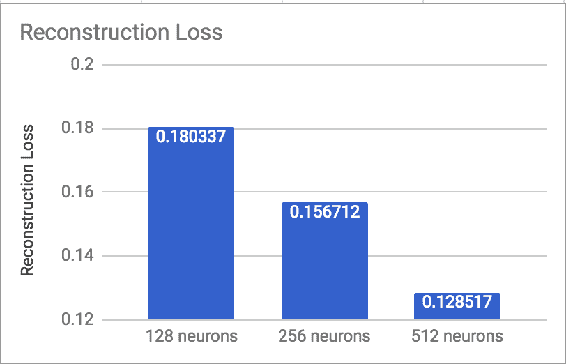
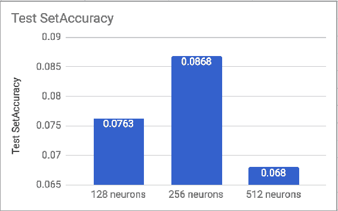

# 第七章：深度置信网络

**深度置信网络**（**DBN**）是一种深度神经网络，由多层隐藏单元组成，各层之间存在连接；DBN 的不同之处在于这些隐藏单元在每层内不会与其他单元交互。DBN 可以在没有监督的情况下，使用训练数据集进行训练，学习概率性地重建其输入。它是对大量相互作用的随机变量的联合（多变量）分布。这些表示位于统计学和计算机科学的交集处，依赖于概率论、图算法、机器学习等概念。

各层充当特征检测器。训练步骤完成后，DBN 可以通过监督训练来进行分类。

我们将在这一章节中涵盖以下内容：

+   理解深度置信网络

+   模型训练

+   预测标签

+   查找模型的准确率

+   MNIST 数据集的 DBN 实现

+   RBM 层中神经元数量对 DBN 的影响

+   带有两个 RBM 层的 DBN

+   使用 DBN 对 NotMNIST 数据集进行分类

# 理解深度置信网络

DBN 可以看作是简单无监督网络的组合，如 **限制玻尔兹曼机**（**RBM**）或自编码器；在这些网络中，每个子网络的隐藏层作为下一个子网络的可见层。RBM 是一种无向生成模型，具有一个输入层（可见）和一个隐藏层，层之间存在连接，但层内没有连接。这种拓扑结构使得逐层的无监督训练过程变得快速。对每个子网络应用对比散度，从最低层对开始（最低可见层为训练集）。

DBN 是逐层训练（贪婪式）进行的，这使其成为最早有效的深度学习算法之一。DBN 在现实应用和场景中有许多实现和用途；我们将研究如何使用 DBN 对 MNIST 和 NotMNIST 数据集进行分类。

# DBN 实现

该类实例化了限制玻尔兹曼机（RBN）层和成本函数。**DeepBeliefNetwork** 类本身是 **Model** 类的子类：


# 类初始化

在 DBN 初始化时，调用 `Model` 类的初始化方法 `__init__(self, name)`。`Model` 类引用了以下内容：

+   **输入数据**: `self.input_data`

+   **输入标签**: `self.input_labels`

+   **成本**: `` `self.cost` ``

+   **最终层中的节点数量**: `self.layer_nodes`

+   **TensorFlow 会话**: `self.tf_session`

+   **TensorFlow 图**: `self.tf_graph = tf.graph`

```py
class Model(object):
    """Class representing an abstract Model."""

    def __init__(self, name):
        """Constructor.

        :param name: name of the model, used as filename.
            string, default 'dae'
        """
        self.name = name
        self.model_path = os.path.join(Config().models_dir, self.name)

        self.input_data = None
        self.input_labels = None
>        self.keep_prob = None
        self.layer_nodes = []  # list of layers of the final network
        self.train_step = None
        self.cost = None

        # tensorflow objects
        self.tf_graph = tf.Graph()
        self.tf_session = None
        self.tf_saver = None
        self.tf_merged_summaries = None
        self.tf_summary_writer = None
```

定义的其他变量是损失函数，应为以下之一：

```py
["cross_entropy", "softmax_cross_entropy", "mse"]
```

**DeepBeliefNetwork** 类的代码列表如下所示。`__init__()`函数在下面的代码中显示。在这里，所有变量（例如每个 RBM 层的参数数组）都已指定。我们还调用了`SupervisedModel`的`__init__()`函数，`SupervisedModel`是`DeepBeliefNetwork`类的父类。

初始化时有两个重要的参数：

+   `self.rbms = []`：`RBM`类实例的数组

+   `self.rbm_graphs = []`：每个 RBM 的`tf.Graph`数组

```py
class DeepBeliefNetwork(SupervisedModel):
    """Implementation of Deep Belief Network for Supervised Learning.

    The interface of the class is sklearn-like.
    """

    def __init__(
        self, rbm_layers, name='dbn', do_pretrain=False,
        rbm_num_epochs=[10], rbm_gibbs_k=[1],
        rbm_gauss_visible=False, rbm_stddev=0.1, rbm_batch_size=[10],
        rbm_learning_rate=[0.01], finetune_dropout=1,
        finetune_loss_func='softmax_cross_entropy',
        finetune_act_func=tf.nn.sigmoid, finetune_opt='sgd',
        finetune_learning_rate=0.001, finetune_num_epochs=10,
            finetune_batch_size=20, momentum=0.5):

        SupervisedModel.__init__(self, name)

        self.loss_func = finetune_loss_func
        self.learning_rate = finetune_learning_rate
        self.opt = finetune_opt
        self.num_epochs = finetune_num_epochs
        self.batch_size = finetune_batch_size
        self.momentum = momentum
        self.dropout = finetune_dropout

        self.loss = Loss(self.loss_func)
        self.trainer = Trainer(
            finetune_opt, learning_rate=finetune_learning_rate,
            momentum=momentum)

        self.do_pretrain = do_pretrain
        self.layers = rbm_layers
        self.finetune_act_func = finetune_act_func

        # Model parameters
        self.encoding_w_ = []  # list of matrices of encoding weights per layer
        self.encoding_b_ = []  # list of arrays of encoding biases per layer

        self.softmax_W = None
        self.softmax_b = None

        rbm_params = {
            'num_epochs': rbm_num_epochs, 'gibbs_k': rbm_gibbs_k,
            'batch_size': rbm_batch_size, 'learning_rate': rbm_learning_rate}

        for p in rbm_params:
            if len(rbm_params[p]) != len(rbm_layers):
                # The current parameter is not specified by the user,
                # should default it for all the layers
                rbm_params[p] = [rbm_params[p][0] for _ in rbm_layers]

        self.rbms = []
        self.rbm_graphs = []

        for l, layer in enumerate(rbm_layers):
            rbm_str = 'rbm-' + str(l+1)

            if l == 0 and rbm_gauss_visible:
                self.rbms.append(
                    rbm.RBM(
                        name=self.name + '-' + rbm_str,
                        num_hidden=layer,
                        learning_rate=rbm_params['learning_rate'][l],
                        num_epochs=rbm_params['num_epochs'][l],
                        batch_size=rbm_params['batch_size'][l],
                        gibbs_sampling_steps=rbm_params['gibbs_k'][l],
                        visible_unit_type='gauss', stddev=rbm_stddev))

            else:
                self.rbms.append(
                    rbm.RBM(
                        name=self.name + '-' + rbm_str,
                        num_hidden=layer,
                        learning_rate=rbm_params['learning_rate'][l],
                        num_epochs=rbm_params['num_epochs'][l],
                        batch_size=rbm_params['batch_size'][l],
                        gibbs_sampling_steps=rbm_params['gibbs_k'][l]))

            self.rbm_graphs.append(tf.Graph())

```

请注意，RBM 层是如何从`rbm_layers`数组中构建的：

```py
for l, layer in enumerate(rbm_layers):
            rbm_str = 'rbm-' + str(l+1)

            if l == 0 and rbm_gauss_visible:
                self.rbms.append(
                    rbm.RBM(
                        name=self.name + '-' + rbm_str,
                        num_hidden=layer,
                        learning_rate=rbm_params['learning_rate'][l],
                        num_epochs=rbm_params['num_epochs'][l],
                        batch_size=rbm_params['batch_size'][l],
                        gibbs_sampling_steps=rbm_params['gibbs_k'][l],
                        visible_unit_type='gauss', stddev=rbm_stddev))

            else:
                self.rbms.append(
                    rbm.RBM(
                        name=self.name + '-' + rbm_str,
                        num_hidden=layer,
                        learning_rate=rbm_params['learning_rate'][l],
                        num_epochs=rbm_params['num_epochs'][l],
                        batch_size=rbm_params['batch_size'][l],
                        gibbs_sampling_steps=rbm_params['gibbs_k'][l]))
```

# RBM 类

对于每个 RBM 层，都会初始化一个**RBM**类。这个类扩展了**UnsupervisedModel**和**Model**类：


**RBM**类的`__init__(..)`函数的详细信息在以下代码中指定：

```py
class RBM(UnsupervisedModel):
    """Restricted Boltzmann Machine implementation using TensorFlow.

    The interface of the class is sklearn-like.
    """

    def __init__(
        self, num_hidden, visible_unit_type='bin',
        name='rbm', loss_func='mse', learning_rate=0.01,
        regcoef=5e-4, regtype='none', gibbs_sampling_steps=1,
            batch_size=10, num_epochs=10, stddev=0.1):
        """Constructor.

        :param num_hidden: number of hidden units
        :param loss_function: type of loss function
        :param visible_unit_type: type of the visible units (bin or gauss)
        :param gibbs_sampling_steps: optional, default 1
        :param stddev: default 0.1\. Ignored if visible_unit_type is not 'gauss'
        """
        UnsupervisedModel.__init__(self, name)

        self.loss_func = loss_func
        self.learning_rate = learning_rate
        self.num_epochs = num_epochs
        self.batch_size = batch_size
        self.regtype = regtype
        self.regcoef = regcoef

        self.loss = Loss(self.loss_func)

        self.num_hidden = num_hidden
        self.visible_unit_type = visible_unit_type
        self.gibbs_sampling_steps = gibbs_sampling_steps
        self.stddev = stddev

        self.W = None
        self.bh_ = None
        self.bv_ = None

        self.w_upd8 = None
        self.bh_upd8 = None
        self.bv_upd8 = None

        self.cost = None

        self.input_data = None
        self.hrand = None
        self.vrand = None
```

一旦`rbm`图初始化完成，它们会被附加到 TensorFlow 图中：

```py
self.rbm_graphs.append(tf.Graph())
```

# 预训练 DBN

在本节中，我们将查看如何预训练 DBN：

```py
class RBM(UnsupervisedModel):
...
  def pretrain(self, train_set, validation_set=None):
    """Perform Unsupervised pretraining of the DBN."""
    self.do_pretrain = True

    def set_params_func(rbmmachine, rbmgraph):
    params = rbmmachine.get_parameters(graph=rbmgraph)
     self.encoding_w_.append(params['W'])
     self.encoding_b_.append(params['bh_'])

    return SupervisedModel.pretrain_procedure(
     self, self.rbms, self.rbm_graphs, set_params_func=set_params_func,
     train_set=train_set, validation_set=validation_set)
```

这将进一步调用`SupervisedModel.pretrain_procedure(..)`，该函数接受以下参数：

+   `layer_objs`：模型对象的列表（自编码器或 RBM）

+   `layer_graphs`：模型`tf.Graph`对象的列表

+   `set_params_func`：预训练后用于设置参数的函数

+   `train_set`：训练集

+   `validation_set`：验证集

该函数返回由最后一层编码的数据：

```py
def pretrain_procedure(self, layer_objs, layer_graphs, set_params_func,
 train_set, validation_set=None):
   next_train = train_set
   next_valid = validation_set

   for l, layer_obj in enumerate(layer_objs):
     print('Training layer {}...'.format(l + 1))
     next_train, next_valid = self._pretrain_layer_and_gen_feed(
       layer_obj, set_params_func, next_train, next_valid,
       layer_graphs[l])

   return next_train, next_valid
```

这将进一步调用`self._pretrain_layer_and_gen_feed(...)`：

```py
def _pretrain_layer_and_gen_feed(self, layer_obj, set_params_func,
                                 train_set, validation_set, graph):
    layer_obj.fit(train_set, train_set,
                  validation_set, validation_set, graph=graph)

    with graph.as_default():
        set_params_func(layer_obj, graph)

        next_train = layer_obj.transform(train_set, graph=graph)
        if validation_set is not None:
            next_valid = layer_obj.transform(validation_set, graph=graph)
        else:
            next_valid = None

    return next_train, next_valid
```

在前面的函数中，每个`layer_obj`都会**迭代**调用。

# 模型训练

模型训练在`fit(..)`方法中实现。它接受以下参数：

+   `train_X`：`array_like, shape (n_samples, n_features)`，训练数据

+   `train_Y`：`array_like, shape (n_samples, n_classes)`，训练标签

+   `val_X`：`array_like, shape (N, n_features) optional, (default = None)`，验证数据

+   `val_Y`：`array_like, shape (N, n_classes) optional, (default = None)`，验证标签

+   `graph`：`tf.Graph`，可选（默认为 None），TensorFlow 图对象

接下来，我们将查看`fit(...)`函数的实现，其中模型会在由`model_path`指定的路径中训练并保存。

```py
def fit(self, train_X, train_Y, val_X=None, val_Y=None, graph=None):

    if len(train_Y.shape) != 1:
        num_classes = train_Y.shape[1]
    else:
        raise Exception("Please convert the labels with one-hot encoding.")

    g = graph if graph is not None else self.tf_graph

    with g.as_default():
        # Build model
        self.build_model(train_X.shape[1], num_classes)
        with tf.Session() as self.tf_session:
            # Initialize tf stuff
            summary_objs = tf_utils.init_tf_ops(self.tf_session)
            self.tf_merged_summaries = summary_objs[0]
            self.tf_summary_writer = summary_objs[1]
            self.tf_saver = summary_objs[2]
            # Train model
            self._train_model(train_X, train_Y, val_X, val_Y)
            # Save model
            self.tf_saver.save(self.tf_session, self.model_path)
```

# 预测标签

预测标签可以通过调用以下方法来完成：

```py
def predict(self, test_X):
    with self.tf_graph.as_default():
        with tf.Session() as self.tf_session:
            self.tf_saver.restore(self.tf_session, self.model_path)
            feed = {
                self.input_data: test_X,
                self.keep_prob: 1
            }
            return self.mod_y.eval(feed)
```

# 查找模型的准确度

模型的准确度是通过计算测试集的平均准确度来得到的。它在以下方法中实现：

```py
def score(self, test_X, test_Y):
  ...
```

在这里，参数如下：

+   `test_X`：`array_like, shape (n_samples, n_features)`，测试数据

+   `test_Y`：`array_like, shape (n_samples, n_features)`，测试标签

+   `return float`：测试集的平均准确度

```py
def score(self, test_X, test_Y):
    with self.tf_graph.as_default():
        with tf.Session() as self.tf_session:
            self.tf_saver.restore(self.tf_session, self.model_path)
            feed = {
                self.input_data: test_X,
                self.input_labels: test_Y,
                self.keep_prob: 1
            }
            return self.accuracy.eval(feed)
```

在下一节中，我们将看看如何在 MNIST 数据集上使用 DBN 实现。

# MNIST 数据集的 DBN 实现

让我们来看一下之前实现的 DBN 类如何用于 MNIST 数据集。

# 加载数据集

首先，我们将数据集从`idx3`和`idx1`格式加载到测试集、训练集和验证集中。我们需要导入在这里说明的 common 模块中定义的 TensorFlow 常用工具：

```py
import tensorflow as tf
from common.models.boltzmann import dbn
from common.utils import datasets, utilities
```

```py
trainX, trainY, validX, validY, testX, testY = 
     datasets.load_mnist_dataset(mode='supervised')
```

你可以在以下代码清单中找到有关`load_mnist_dataset()`的详细信息。由于设置了`mode='supervised'`，因此会返回训练集、测试集和验证集的标签：

```py
def load_mnist_dataset(mode='supervised', one_hot=True):
   mnist = input_data.read_data_sets("MNIST_data/", one_hot=one_hot)
   # Training set
   trX = mnist.train.images
   trY = mnist.train.labels
   # Validation set
   vlX = mnist.validation.images
   vlY = mnist.validation.labels
   # Test set
   teX = mnist.test.images
   teY = mnist.test.labels
   if mode == 'supervised':
     return trX, trY, vlX, vlY, teX, teY
   elif mode == 'unsupervised':
     return trX, vlX, teX
```

# 具有 256 神经元 RBM 层的 DBN 输入参数

我们将初始化 DBN 类所需的各种参数：

```py

 finetune_act_func = tf.nn.relu
 rbm_layers = [256]
 do_pretrain = True
 name = 'dbn'
 rbm_layers = [256]
 finetune_act_func ='relu'
 do_pretrain = True
 rbm_learning_rate = [0.001]
 rbm_num_epochs = [1]
 rbm_gibbs_k= [1]
 rbm_stddev= 0.1
 rbm_gauss_visible= False
 momentum= 0.5
 rbm_batch_size= [32]
 finetune_learning_rate = 0.01
 finetune_num_epochs = 1
 finetune_batch_size = 32
 finetune_opt = 'momentum'
 finetune_loss_func = 'softmax_cross_entropy'
 finetune_dropout = 1
 finetune_act_func = tf.nn.sigmoid
```

一旦定义了参数，让我们在 MNIST 数据集上运行 DBN 网络：

```py
srbm = dbn.DeepBeliefNetwork(
    name=name, do_pretrain=do_pretrain,
    rbm_layers=rbm_layers,
    finetune_act_func=finetune_act_func,
    rbm_learning_rate=rbm_learning_rate,
    rbm_num_epochs=rbm_num_epochs, rbm_gibbs_k = rbm_gibbs_k,
    rbm_gauss_visible=rbm_gauss_visible, rbm_stddev=rbm_stddev,
    momentum=momentum, rbm_batch_size=rbm_batch_size, 
    finetune_learning_rate=finetune_learning_rate,
    finetune_num_epochs=finetune_num_epochs, 
    finetune_batch_size=finetune_batch_size,
    finetune_opt=finetune_opt, finetune_loss_func=finetune_loss_func,
    finetune_dropout=finetune_dropout
    )

print(do_pretrain)
if do_pretrain:
    srbm.pretrain(trainX, validX)

# finetuning
print('Start deep belief net finetuning...')
srbm.fit(trainX, trainY, validX, validY)

# Test the model
print('Test set accuracy: {}'.format(srbm.score(testX, testY)))
```

# 具有 256 神经元 RBM 层的 DBN 输出

前面的清单输出显示了测试集的准确度：

```py
Reconstruction loss: 0.156712: 100%|██████████| 5/5 [00:49&lt;00:00, 9.99s/it]
Start deep belief net finetuning...
Tensorboard logs dir for this run is /home/ubuntu/.yadlt/logs/run53
Accuracy: 0.0868: 100%|██████████| 1/1 [00:04&lt;00:00, 4.09s/it]
Test set accuracy: 0.0868000015616
```

总体准确度和测试集准确度都相对较低。随着迭代次数的增加，它们有所提升。让我们使用 20 个 epoch 重新运行相同的示例

```py
Reconstruction loss: 0.120337: 100%|██████████| 20/20 [03:07<00:00, 8.79s/it]
Start deep belief net finetuning...
Tensorboard logs dir for this run is /home/ubuntu/.yadlt/logs/run80
Accuracy: 0.105: 100%|██████████| 1/1 [00:04<00:00, 4.16s/it]
Test set accuracy: 0.10339999944
```

如图所示，重构损失下降了，测试集的准确度提高了 20%，达到了 0.10339999944

让我们将 Epoch 数量增加到 40。输出如下所示：

```py
Reconstruction loss: 0.104798: 100%|██████████| 40/40 [06:20<00:00, 9.18s/it]
Start deep belief net finetuning...
Tensorboard logs dir for this run is /home/ubuntu/.yadlt/logs/run82
Accuracy: 0.075: 100%|██████████| 1/1 [00:04<00:00, 4.08s/it]
Test set accuracy: 0.0773999989033
As can be seen the accuracy again came down so the optimal number of iterations peaks somewhere between 20 and 40
```

# RBM 层中神经元数量对 DBN 的影响

让我们看看更改 RBM 层中神经元数量如何影响测试集的准确度：

# 一个包含 512 个神经元的 RBM 层

以下是一个包含 512 个神经元的 RBM 层的 DBN 输出。重构损失下降了，测试集的准确度也下降了：

```py
Reconstruction loss: 0.128517: 100%|██████████| 5/5 [01:32&lt;00:00, 19.25s/it]
Start deep belief net finetuning...
Tensorboard logs dir for this run is /home/ubuntu/.yadlt/logs/run55
Accuracy: 0.0758: 100%|██████████| 1/1 [00:06&lt;00:00, 6.40s/it]
Test set accuracy: 0.0689999982715
```

请注意，准确度和测试集准确度都下降了。这意味着增加神经元的数量并不一定能提高准确度。

# 一个包含 128 个神经元的 RBM 层

128 神经元的 RBM 层导致测试集准确度更高，但整体准确度较低：

```py
Reconstruction loss: 0.180337: 100%|██████████| 5/5 [00:32&lt;00:00, 6.44s/it]
 Start deep belief net finetuning...
 Tensorboard logs dir for this run is /home/ubuntu/.yadlt/logs/run57
 Accuracy: 0.0698: 100%|██████████| 1/1 [00:03&lt;00:00, 3.16s/it]
 Test set accuracy: 0.0763999968767
```

# 比较准确度指标

由于我们已经用多个神经元数量的 RBM 层训练了神经网络，现在来比较一下这些指标：



如前图所示，重构损失随着神经元数量的增加而减少。



测试集的准确度在 256 个神经元时达到峰值，然后下降。

# 具有两个 RBM 层的 DBN

在本节中，我们将创建一个具有两个 RBM 层的 DBN，并在 MNIST 数据集上运行。我们将修改`DeepBeliefNetwork(..)`类的输入参数：

```py
name = 'dbn'
rbm_layers = [256, 256]
finetune_act_func ='relu'
do_pretrain = True
rbm_learning_rate = [0.001, 0.001]
rbm_num_epochs = [5, 5]
rbm_gibbs_k= [1, 1]
rbm_stddev= 0.1
rbm_gauss_visible= False
momentum= 0.5
rbm_batch_size= [32, 32]
finetune_learning_rate = 0.01
finetune_num_epochs = 1
finetune_batch_size = 32
finetune_opt = 'momentum'
finetune_loss_func = 'softmax_cross_entropy'
finetune_dropout = 1
finetune_act_func = tf.nn.sigmoid
```

请注意，某些参数是数组形式，因此我们需要为两个层指定这些参数：

+   `rbm_layers = [256, 256]`：每个 RBM 层中的神经元数量

+   `rbm_learning_rate = [0.001, 0001]`：每个 RBM 层的学习率

+   `rbm_num_epochs = [5, 5]`：每层的 Epoch 数量

+   `rbm_batch_size= [32, 32]`：每个 RBM 层的批次大小

让我们看看 DBN 初始化和模型训练：

```py
srbm = dbn.DeepBeliefNetwork(
 name=name, do_pretrain=do_pretrain,
 rbm_layers=rbm_layers,
 finetune_act_func=finetune_act_func, rbm_learning_rate=rbm_learning_rate,
 rbm_num_epochs=rbm_num_epochs, rbm_gibbs_k = rbm_gibbs_k,
 rbm_gauss_visible=rbm_gauss_visible, rbm_stddev=rbm_stddev,
 momentum=momentum, rbm_batch_size=rbm_batch_size, finetune_learning_rate=finetune_learning_rate,
 finetune_num_epochs=finetune_num_epochs, finetune_batch_size=finetune_batch_size,
 finetune_opt=finetune_opt, finetune_loss_func=finetune_loss_func,
 finetune_dropout=finetune_dropout
 )
```

```py

 if do_pretrain:
   srbm.pretrain(trainX, validX)
```

```py
# 
finetuning
 print('Start deep belief net finetuning...')
 srbm.fit(trainX, trainY, validX, validY)
```

测试模型：

```py
print('Test set accuracy: {}'.format(srbm.score(testX, testY)))
```

完整的代码清单可以在这里找到：

[`github.com/ml-resources/neuralnetwork-programming/blob/ed1/ch08/implementation/boltzmann/run_dbn_mnist_two_layers.py`](https://github.com/ml-resources/neuralnetwork-programming/blob/ed1/ch08/implementation/boltzmann/run_dbn_mnist_two_layers.py)

以下是前面列表的输出：

```py
Reconstruction loss: 0.156286: 100%|██████████| 5/5 [01:03&lt;00:00, 13.04s/it]
Training layer 2...
Tensorboard logs dir for this run is /home/ubuntu/.yadlt/logs/run73
Reconstruction loss: 0.127524: 100%|██████████| 5/5 [00:23&lt;00:00, 4.87s/it]
Start deep belief net finetuning...
Tensorboard logs dir for this run is /home/ubuntu/.yadlt/logs/run74
Accuracy: 0.1496: 100%|██████████| 1/1 [00:05&lt;00:00, 5.53s/it]
Test set accuracy: 0.140300005674
```

从前面的列表中可以看出，测试集的准确率优于单层 RBM 的 DBN。

# 使用 DBN 分类 NotMNIST 数据集

让我们来看看 NotMNIST 数据集，之前我们在第二章的*深度前馈网络*部分中已经探讨过，并附带了图像，看看我们的 DBN 如何在该数据集上工作。

我们将利用在第二章的*深度前馈网络*部分中创建的相同 pickle 文件，`notMNIST.pickle`。初始化参数和导入的库如下所示：

```py
import tensorflow as tf
import numpy as np
import cPickle as pickle

from common.models.boltzmann import dbn
from common.utils import datasets, utilities

flags = tf.app.flags
FLAGS = flags.FLAGS
pickle_file = '../notMNIST.pickle'

image_size = 28
num_of_labels = 10

RELU = 'RELU'
RELU6 = 'RELU6'
CRELU = 'CRELU'
SIGMOID = 'SIGMOID'
ELU = 'ELU'
SOFTPLUS = 'SOFTPLUS'

```

实现方法与 MNIST 数据集大致相同。主要实现代码如下：

```py
if __name__ == '__main__':
    utilities.random_seed_np_tf(-1)
    with open(pickle_file, 'rb') as f:
        save = pickle.load(f)
        training_dataset = save['train_dataset']
        training_labels = save['train_labels']
        validation_dataset = save['valid_dataset']
        validation_labels = save['valid_labels']
        test_dataset = save['test_dataset']
        test_labels = save['test_labels']
        del save  # hint to help gc free up memory
        print 'Training set', training_dataset.shape, training_labels.shape
        print 'Validation set', validation_dataset.shape, validation_labels.shape
        print 'Test set', test_dataset.shape, test_labels.shape

    train_dataset, train_labels = reformat(training_dataset, training_labels)
    valid_dataset, valid_labels = reformat(validation_dataset, validation_labels)
    test_dataset, test_labels = reformat(test_dataset, test_labels)

    #trainX, trainY, validX, validY, testX, testY = datasets.load_mnist_dataset(mode='supervised')
    trainX = train_dataset
    trainY = train_labels

    validX = valid_dataset
    validY = valid_labels
    testX = test_dataset
    testY = test_labels

    finetune_act_func = tf.nn.relu
    rbm_layers = [256]
    do_pretrain = True

    name = 'dbn'
    rbm_layers = [256]
    finetune_act_func ='relu'
    do_pretrain = True

    rbm_learning_rate = [0.001]

    rbm_num_epochs = [1]
    rbm_gibbs_k= [1]
    rbm_stddev= 0.1
    rbm_gauss_visible= False
    momentum= 0.5
    rbm_batch_size= [32]
    finetune_learning_rate = 0.01
    finetune_num_epochs = 1
    finetune_batch_size = 32
    finetune_opt = 'momentum'
    finetune_loss_func = 'softmax_cross_entropy'

    finetune_dropout = 1
    finetune_act_func = tf.nn.sigmoid

    srbm = dbn.DeepBeliefNetwork(
        name=name, do_pretrain=do_pretrain,
        rbm_layers=rbm_layers,
        finetune_act_func=finetune_act_func, rbm_learning_rate=rbm_learning_rate,
        rbm_num_epochs=rbm_num_epochs, rbm_gibbs_k = rbm_gibbs_k,
        rbm_gauss_visible=rbm_gauss_visible, rbm_stddev=rbm_stddev,
        momentum=momentum, rbm_batch_size=rbm_batch_size, finetune_learning_rate=finetune_learning_rate,
        finetune_num_epochs=finetune_num_epochs, finetune_batch_size=finetune_batch_size,
        finetune_opt=finetune_opt, finetune_loss_func=finetune_loss_func,
        finetune_dropout=finetune_dropout
    )

    if do_pretrain:
        srbm.pretrain(trainX, validX)

    # finetuning
    print('Start deep belief net finetuning...')
    srbm.fit(trainX, trainY, validX, validY)

    # Test the model
    print('Test set accuracy: {}'.format(srbm.score(testX, testY)))
```

完整的代码列表可以在以下位置找到：

[`github.com/ml-resources/neuralnetwork-programming/blob/ed1/ch08/implementation/boltzmann/run_dbn_nomnist.py`](https://github.com/ml-resources/neuralnetwork-programming/blob/ed1/ch08/implementation/boltzmann/run_dbn_nomnist.py)。

前面列表的输出将展示我们模型在 NotMNIST 数据集上的表现：

```py
Reconstruction loss: 0.546223: 100%|██████████| 1/1 [00:00&lt;00:00, 5.51it/s]
Start deep belief net finetuning...
Tensorboard logs dir for this run is /home/ubuntu/.yadlt/logs/run76
Accuracy: 0.126: 100%|██████████| 1/1 [00:00&lt;00:00, 8.83it/s]
Test set accuracy: 0.180000007153
```

正如我们所看到的，该网络在 NotMNIST 数据集上的表现远超 MNIST 数据集。

# 摘要

在本章中，我们探讨了 DBN，并研究了如何利用这些模型通过一个或多个 RBM 层来构建分类管道。我们考察了 RBM 层中的各个参数及其对准确率、重构损失和测试集准确率的影响。我们还看了单层和多层 DBN，使用一个或多个 RBM。

在下一章中，我们将探讨生成模型，并讨论它们与判别模型的区别。
