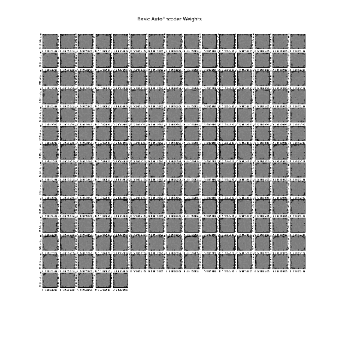

# 第八章：自编码器

自编码器是一种神经网络，它的训练目的是尝试将输入复制到输出。它有一个隐藏层（我们称之为*h*），该层描述了一种用于表示输入的编码。可以将网络视为由两个部分组成：

+   **编码器函数**：*h = f (x)*

+   **生成重建的解码器**：*r = g(h)*

下图显示了一个基本的自编码器，输入为 *n*，隐藏层的神经元为 *m*：


自编码器的基本表示

自编码器设计为不能完美地学习复制。它们受限于只能近似地复制，并且只能复制与训练数据相似的输入。由于模型被迫优先选择哪些输入方面应该被复制，它通常会学习到数据的有用属性。

本章将涵盖以下主题：

+   自编码器算法

+   欠完备自编码器

+   基本自编码器

+   加性高斯噪声自编码器

+   稀疏自编码器

# 自编码器算法

在以下符号中，`x` 是输入，`y` 是编码数据，`z` 是解码数据，`σ` 是非线性激活函数（通常是 Sigmoid 或双曲正切），`f(x;θ)` 表示由 `θ` 参数化的 `x` 的函数。

该模型可以总结如下：

输入数据被映射到隐藏层（编码）。该映射通常是一个仿射变换（允许或保持平行关系），后跟非线性处理：

```py
y = f(x;θ) = σ(Wx+b)y = f(x;θ) =σ(Wx+b)
```

隐藏层被映射到输出层，这也称为**解码**。该映射是一个仿射变换（仿射变换是一种保持点、直线和平面的线性映射方法），后面可选择非线性化处理。以下方程式说明了这一点：

```py
z = g(y;θ′) = g(f(x;θ);θ′) = σ(W′y+b′)
```

为了减小模型的大小，可以使用绑定权重，这意味着解码器权重矩阵受到约束，可以是编码器权重矩阵的转置，*θ'=θ^T*。

隐藏层的维度可以小于或大于输入/输出层的维度。

在低维情况下，解码器从低维表示中重建原始输入（也称为**欠完备表示**）。为了使整个算法有效，编码器应学习提供一个低维表示，该表示捕捉数据的本质（即分布中变化的主要因素）。它被迫找到一种有效的方式来总结数据。

参考文献：[`blackecho.github.io/blog/machine-learning/2016/02/29/denoising-autoencoder-tensorflow.html`](http://blackecho.github.io/blog/machine-learning/2016/02/29/denoising-autoencoder-tensorflow.html).

# 欠完备自编码器

从自编码器中获取有用特征的一种方式是通过将 *h* 的维度约束为比输入 `x` 更小。一个编码维度小于输入维度的自编码器被称为欠完备。

学习一个欠完备的表示迫使自编码器捕捉训练数据中最重要的特征。

学习过程描述为最小化损失函数 `L(x, g(f(x)))`，

其中 `L` 是一个损失函数，惩罚 `g(f (x))` 与 `x` 的不相似性，例如均方误差。

# 数据集

我们计划使用 `idx3` 格式的 MNIST 数据集作为输入来训练我们的自编码器。我们将测试自编码器在前 100 张图像上的表现。让我们首先绘制原始图像：

```py

from tensorflow.examples.tutorials.mnist import input_data
import matplotlib.pyplot as plt

mnist = input_data.read_data_sets('MNIST_data', one_hot = True)

class OriginalImages:

    def __init__(self):
        pass

    def main(self):
        X_train, X_test = self.standard_scale(mnist.train.images, mnist.test.images)

        original_imgs = X_test[:100]
        plt.figure(1, figsize=(10, 10))

        for i in range(0, 100):
            im = original_imgs[i].reshape((28, 28))
            ax = plt.subplot(10, 10, i + 1)
            for label in (ax.get_xticklabels() + ax.get_yticklabels()):
                label.set_fontsize(8)

            plt.imshow(im, cmap="gray", clim=(0.0, 1.0))
        plt.suptitle(' Original Images', fontsize=15, y=0.95)
        plt.savefig('figures/original_images.png')
        plt.show()

def main():
    auto = OriginalImages()
    auto.main()

if __name__ == '__main__':
    main()
```

上述代码的输出如下图所示：


原始 MNIST 图像的绘图

# 基本自编码器

让我们来看一个基本的自编码器示例，它恰好是一个基础自编码器。首先，我们将创建一个 `AutoEncoder` 类，并使用以下参数初始化它：

+   `num_input`: 输入样本的数量

+   `num_hidden`: 隐藏层神经元的数量

+   `transfer_function=tf.nn.softplus`: 激活函数

+   `optimizer = tf.train.AdamOptimizer()`: 优化器

你可以传递一个自定义的 `transfer_function` 和 `optimizer`，或者使用指定的默认值。在我们的示例中，我们使用 softplus 作为默认的 `transfer_function`（也叫做 **激活函数**）：`f(x)=ln(1+e^x)`。

# 自编码器初始化

首先，我们初始化类变量和权重：

```py
 self.num_input = num_input
 self.num_hidden = num_hidden
 self.transfer = transfer_function
 network_weights = self._initialize_weights()
 self.weights = network_weights
```

这里，`_initialize_weigths()` 函数是一个局部函数，用于初始化 `weights` 字典的值：

+   `w1` 是一个形状为 `num_input X num_hidden` 的二维张量

+   `b1` 是一个形状为 `num_hidden` 的一维张量

+   `w2` 是一个形状为 `num_hidden X num_input` 的二维张量

+   `b2` 是一个形状为 `num_input` 的二维张量

以下代码展示了如何将权重初始化为两个隐藏层的 TensorFlow 变量字典：

```py
def _initialize_weights(self):
    weights = dict()
    weights['w1'] = tf.get_variable("w1", shape=[self.num_input, self.num_hidden],
                      initializer=tf.contrib.layers.xavier_initializer())
    weights['b1'] = tf.Variable(tf.zeros([self.num_hidden], dtype=tf.float32))
    weights['w2'] = tf.Variable(tf.zeros([self.num_hidden, self.num_input],
      dtype=tf.float32))
    weights['b2'] = tf.Variable(tf.zeros([self.num_input], dtype=tf.float32))
    return weights
```

接下来，我们定义 `x_var`、`hidden_layer` 和 `reconstruction layer`：

```py
 self.x_var = tf.placeholder(tf.float32, [None, self.num_input])
 self.hidden_layer = self.transfer(tf.add(tf.matmul(self.x_var, 
   self.weights['w1']), self.weights['b1']))
 self.reconstruction = tf.add(tf.matmul(self.hidden_layer, 
   self.weights['w2']), self.weights['b2'])
```

```py
This is followed by the cost function and the Optimizer
# cost function
self.cost = 0.5 * tf.reduce_sum(
   tf.pow(tf.subtract(self.reconstruction, self.x_var), 2.0))
self.optimizer = optimizer.minimize(self.cost)
```


成本函数

实例化全局变量初始化器并将其传递给 TensorFlow 会话。

```py
initializer = tf.global_variables_initializer()
self.session = tf.Session()
self.session.run(initializer)
```

# AutoEncoder 类

以下代码展示了 `AutoEncoder` 类。该类将在接下来的几个部分实例化，以创建自编码器：

```py
import tensorflow as tf

class AutoEncoder:

    def __init__(self, num_input, num_hidden, 
      transfer_function=tf.nn.softplus, 
      optimizer = tf.train.AdamOptimizer()):
        self.num_input = num_input
        self.num_hidden = num_hidden
        self.transfer = transfer_function

        network_weights = self._initialize_weights()
        self.weights = network_weights

        # model for reconstruction of the image
        self.x_var = tf.placeholder(tf.float32, [None, self.num_input])
        self.hidden_layer = self.transfer(tf.add(tf.matmul(self.x_var, 
          self.weights['w1']), self.weights['b1']))
        self.reconstruction = tf.add(tf.matmul(self.hidden_layer, 
          self.weights['w2']), self.weights['b2'])

        # cost function
        self.cost = 
          0.5 * tf.reduce_sum(tf.pow(tf.subtract(self.reconstruction,
          self.x_var), 2.0))
        self.optimizer = optimizer.minimize(self.cost)

        initializer = tf.global_variables_initializer()
        self.session = tf.Session()
        self.session.run(initializer)

    def _initialize_weights(self):
        weights = dict()
        weights['w1'] = tf.get_variable("w1", 
                          shape=[self.num_input, 
                          self.num_hidden],
                          initializer=
                            tf.contrib.layers.xavier_initializer())
        weights['b1'] = tf.Variable(tf.zeros([self.num_hidden], 
                                    dtype=tf.float32))
        weights['w2'] = tf.Variable(
          tf.zeros([self.num_hidden, self.num_input],
          dtype=tf.float32))
        weights['b2'] = tf.Variable(tf.zeros(
                          [self.num_input], dtype=tf.float32))
        return weights

    def partial_fit(self, X):
        cost, opt = self.session.run((self.cost, self.optimizer), 
          feed_dict={self.x_var: X})
        return cost

    def calculate_total_cost(self, X):
        return self.session.run(self.cost, feed_dict = {self.x_var: X})

    def transform(self, X):
        return self.session.run(self.hidden_layer, 
          feed_dict={self.x_var: X})

    def generate(self, hidden = None):
        if hidden is None:
            hidden = self.session.run(
              tf.random_normal([1, self.num_hidden]))
        return self.session.run(self.reconstruction, 
               feed_dict={self.hidden_layer: hidden})

    def reconstruct(self, X):
        return self.session.run(self.reconstruction, 
                                feed_dict={self.x_var: X})

    def get_weights(self):
        return self.session.run(self.weights['w1'])

    def get_biases(self):
        return self.session.run(self.weights['b1'])
```

# 基本自编码器与 MNIST 数据

让我们使用 MNIST 数据集中的自编码器：`mnist = input_data.read_data_sets('MNIST_data', one_hot = True)`。

使用 Scikit Learn 的 `sklearn.``preprocessing` 模块中的 StandardScalar 来提取 `testmnist.test.images` 和训练图像 `mnist.train.images`：

```py
X_train, X_test = self.standard_scale(mnist.train.images, mnist.test.images).
```

预处理模块提供了一个工具类`StandardScaler`，它实现了 Transformer API。它计算并转换训练集的均值和标准差，并将相同的转换应用到测试集。默认情况下，Scaler 会将均值居中，并使方差为 1。

可以通过将`with_mean=False`或`with_std=False`传递给 StandardScaler 的构造函数来禁用中心化或标准化。

接下来，我们定义之前列出的 AutoEncoder 类的实例：

```py
 n_samples = int(mnist.train.num_examples)
 training_epochs = 5
 batch_size = 128
 display_step = 1

 autoencoder = AutoEncoder(n_input = 784,
   n_hidden = 200,
   transfer_function = tf.nn.softplus,
   optimizer = tf.train.AdamOptimizer(learning_rate = 0.001))
```

请注意，自编码器包括以下内容：

+   输入神经元的数量是`784`

+   隐藏层的神经元数量是`200`

+   激活函数是`tf.nn.softplus`

+   优化器是`tf.train.AdamOptimizer`

接下来，我们将遍历训练数据并显示成本函数：

```py
for epoch in range(training_epochs):
    avg_cost = 0.
    total_batch = int(n_samples / batch_size)
    # Loop over all batches
    for i in range(total_batch):
        batch_xs = self.get_random_block_from_data(X_train, batch_size)

        # Fit training using batch data
        cost = autoencoder.partial_fit(batch_xs)
        # Compute average loss
        avg_cost += cost / n_samples * batch_size

    # Display logs per epoch step
    if epoch % display_step == 0:
        print("Epoch:", '%04d' % (epoch + 1), "cost=", "{:.9f}".format(avg_cost))
```

打印总成本：

```py
print("Total cost: " + str(autoencoder.calc_total_cost(X_test)))
```

训练周期的输出如下所示；如预期，成本随着每次迭代而收敛：

```py
('Epoch:', '0001', 'cost=', '20432.278386364')
('Epoch:', '0002', 'cost=', '13542.435997727')
('Epoch:', '0003', 'cost=', '10630.662196023')
('Epoch:', '0004', 'cost=', '10717.897946591')
('Epoch:', '0005', 'cost=', '9354.191921023')
Total cost: 824850.0
```

# 基本自编码器权重图示

一旦训练完成，使用 Matplotlib 库绘制权重图，代码清单如下：

```py
print("Total cost: " + str(autoencoder.calc_total_cost(X_test)))
wts = autoencoder.getWeights()
dim = math.ceil(math.sqrt(autoencoder.n_hidden))
plt.figure(1, figsize=(dim, dim))

for i in range(0, autoencoder.n_hidden):
    im = wts.flatten()[i::autoencoder.n_hidden].reshape((28, 28))
    ax = plt.subplot(dim, dim, i + 1)
    for label in (ax.get_xticklabels() + ax.get_yticklabels()):
        label.set_fontname('Arial')
        label.set_fontsize(8)
    # plt.title('Feature Weights ' + str(i))
    plt.imshow(im, cmap="gray", clim=(-1.0, 1.0))
plt.suptitle('Basic AutoEncoder Weights', fontsize=15, y=0.95)
#plt.title("Test Title", y=1.05)
plt.savefig('figures/basic_autoencoder_weights.png')
plt.show()
```



基本自编码器权重图

在下一节中，我们将研究如何使用前面图像中显示的权重重建图像。

# 基本自编码器重建图像图示

在重建了图像后，让我们绘制它们，以感受它们的外观。首先，我们将使用之前创建的`autoencoder`实例重建图像：

```py
predicted_imgs = autoencoder.reconstruct(X_test[:100])

plt.figure(1, figsize=(10, 10))

for i in range(0, 100):
    im = predicted_imgs[i].reshape((28, 28))
    ax = plt.subplot(10, 10, i + 1)
    for label in (ax.get_xticklabels() + ax.get_yticklabels()):
                label.set_fontname('Arial')
                label.set_fontsize(8)

    plt.imshow(im, cmap="gray", clim=(0.0, 1.0))
plt.suptitle('Basic AutoEncoder Images', fontsize=15, y=0.95)
plt.savefig('figures/basic_autoencoder_images.png')
plt.show()
```

让我们来看一下神经网络创建的图像：


基本自编码器的输出图像图示

# 基本自编码器完整代码清单

完整代码清单可以在这里找到，也可以从 GitHub 下载--[`github.com/rajdeepd/neuralnetwork-programming/blob/ed1/ch07/basic_autoencoder_example.py`](https://github.com/rajdeepd/neuralnetwork-programming/blob/ed1/ch07/basic_autoencoder_example.py)：

```py
import numpy as np

import sklearn.preprocessing as prep
import tensorflow as tf
from tensorflow.examples.tutorials.mnist import input_data
from autencoder_models.auto_encoder import AutoEncoder
import math
import matplotlib.pyplot as plt

mnist = input_data.read_data_sets('MNIST_data', one_hot = True)

class BasicAutoEncoder:

    def __init__(self):
        pass

    def standard_scale(self,X_train, X_test):
        preprocessor = prep.StandardScaler().fit(X_train)
        X_train = preprocessor.transform(X_train)
        X_test = preprocessor.transform(X_test)
        return X_train, X_test

    def get_random_block_from_data(self,data, batch_size):
        start_index = np.random.randint(0, len(data) - batch_size)
        return data[start_index:(start_index + batch_size)]

    def main(self):
        X_train, X_test = self.standard_scale(mnist.train.images, mnist.test.images)

        n_samples = int(mnist.train.num_examples)
        training_epochs = 5
        batch_size = 128
        display_step = 1

        autoencoder = AutoEncoder(n_input = 784,
                                  n_hidden = 200,
                                  transfer_function = tf.nn.softplus,
                                  optimizer = tf.train.AdamOptimizer(
                                    learning_rate = 0.001))

        for epoch in range(training_epochs):
            avg_cost = 0.
            total_batch = int(n_samples / batch_size)
            # Loop over all batches
            for i in range(total_batch):
                batch_xs = self.get_random_block_from_data(X_train, batch_size)

                # Fit training using batch data
                cost = autoencoder.partial_fit(batch_xs)
                # Compute average loss
                avg_cost += cost / n_samples * batch_size

            # Display logs per epoch step
            if epoch % display_step == 0:
                print("Epoch:", '%04d' % (epoch + 1), "cost=", "{:.9f}".format(avg_cost))

        print("Total cost: " + str(autoencoder.calc_total_cost(X_test)))

        wts = autoencoder.getWeights()
        dim = math.ceil(math.sqrt(autoencoder.n_hidden))
        plt.figure(1, figsize=(dim, dim))

        for i in range(0, autoencoder.n_hidden):
            im = wts.flatten()[i::autoencoder.n_hidden].reshape((28, 28))
            ax = plt.subplot(dim, dim, i + 1)
            for label in (ax.get_xticklabels() + ax.get_yticklabels()):
                label.set_fontname('Arial')
                label.set_fontsize(8)
            # plt.title('Feature Weights ' + str(i))
            plt.imshow(im, cmap="gray", clim=(-1.0, 1.0))
        plt.suptitle('Basic AutoEncoder Weights', fontsize=15, y=0.95)
        #plt.title("Test Title", y=1.05)
        plt.savefig('figures/basic_autoencoder_weights.png')
        plt.show()

        predicted_imgs = autoencoder.reconstruct(X_test[:100])

        plt.figure(1, figsize=(10, 10))

        for i in range(0, 100):
            im = predicted_imgs[i].reshape((28, 28))
            ax = plt.subplot(10, 10, i + 1)
            for label in (ax.get_xticklabels() + ax.get_yticklabels()):
                        label.set_fontname('Arial')
                        label.set_fontsize(8)

            plt.imshow(im, cmap="gray", clim=(0.0, 1.0))
        plt.suptitle('Basic AutoEncoder Images', fontsize=15, y=0.95)
        plt.savefig('figures/basic_autoencoder_images.png')
        plt.show()

def main():
    auto = BasicAutoEncoder()
    auto.main()

if __name__ == '__main__':
    main()
```

# 基本自编码器总结

自编码器使用 200 个神经元的隐藏层创建了 MNSIT 图像的基本近似。下图展示了九张图像以及它们如何通过基本自编码器转换为近似：


基本自编码器输入和输出表示

在下一节中，我们将研究一种更先进的自编码器，**加性高斯噪声自编码器**。

# 加性高斯噪声自编码器

什么是去噪自编码器？它们与我们在前面章节中看到的基本模型非常相似，不同之处在于，输入在传递到网络之前会被破坏。通过在训练时将原始版本（而不是破坏后的版本）与重建版本进行匹配，这个自编码器被训练用来从破损图像中重建原始输入图像。能够从破损图像重建原始图像使自编码器变得非常智能。

加性噪声自编码器使用以下公式将噪声添加到输入数据中：

*x[corr] = x + scale*random_normal(n)*

以下是关于前面方程的详细描述：

+   *x* 是原始图像

+   *scale* 是乘以从 *n* 中生成的随机正态数的因子

+   *n* 是训练样本的数量

+   *x[corr]* 是损坏后的输出

# 自编码器类

我们通过传入以下参数来初始化在 `class AdditiveGaussianNoiseAutoEncoder` 中定义的自编码器：

+   `num_input`: 输入样本数量

+   `num_hidden`: 隐藏层中的神经元数量

+   `transfer_function=tf.nn.sigmoid`: 转换函数

+   `optimizer = tf.train.AdamOptimizer()`: 优化器

+   `scale=0.1`: 图像损坏的比例

```py
def __init__(self, num_input, num_hidden, 
                 transfer_function=tf.nn.sigmoid, 
                 optimizer=tf.train.AdamOptimizer(),
                 scale=0.1):
```

将传入的参数分配给实例变量：

```py
        self.num_input = num_input
        self.num_hidden = num_hidden
        self.transfer = transfer_function
        self.scale = tf.placeholder(tf.float32)
        self.training_scale = scale
        n_weights = self._initialize_weights()
        self.weights = n_weights
```

初始化隐藏层 `hidden_layer` 和重建层 `reconstruction`：

```py
self.x = tf.placeholder(tf.float32, [None, self.num_input])
self.hidden_layer = self.transfer(
            tf.add(tf.matmul(
                      self.x + scale * tf.random_normal((n_input,)),
                      self.weights['w1']),
                      self.weights['b1']))
self.reconstruction = tf.add(
                        tf.matmul(self.hidden_layer, self.weights['w2']),    
                        self.weights['b2'])
```

定义成本函数和优化器：

```py
self.cost = 0.5 * tf.reduce_sum(tf.pow(tf.subtract(
                           self.reconstruction, self.x), 2.0))
self.optimizer = optimizer.minimize(self.cost)
```

成本函数与基本自编码器相同


加性高斯自编码器的成本函数

最后，我们初始化全局变量，创建 TensorFlow 会话，并运行它来执行 `init` 图：

```py
init = tf.global_variables_initializer()
self.session = tf.Session()
self.session.run(init)

```

在下一节中，我们将研究如何使用该自编码器对 MNIST 数据进行编码。

# 加性高斯自编码器与 MNIST 数据集

首先，我们加载训练和测试数据集 `X_train` 和 `X_test`：

```py
mnist = input_data.read_data_sets('MNIST_data', one_hot=True)

def get_random_block_from_data(data, batch_size):
    start_index = np.random.randint(0, len(data) - batch_size)
    return data[start_index:(start_index + batch_size)]

X_train = mnist.train.images
X_test = mnist.test.images

```

定义每次训练迭代的样本数量 `n_samples`、训练纪元 `training_epoch` 和批次大小 `batch_size` 以及显示步数 `display_step`：

```py
n_samples = int(mnist.train.num_examples)
training_epochs = 2
batch_size = 128
display_step = 1
```

实例化自编码器和优化器。自编码器有 200 个隐藏单元，并使用 sigmoid 作为 `transfer_function`：

```py
autoencoder = AdditiveGaussianNoiseAutoEncoder(n_input=784,
                                               n_hidden=200,
                                               transfer_function=tf.nn.sigmoid,
                                               optimizer=tf.train.AdamOptimizer(learning_rate=0.001),
                                               scale=0.01)
```

# 训练模型

一旦神经网络层被定义，我们通过调用方法来训练模型：

`autoencoder.partial_fit(batch_xs)` 每次处理一批数据：

```py
for epoch in range(training_epochs):
    avg_cost = 0.
    total_batch = int(n_samples / batch_size)
    # Loop over all batches
    for i in range(total_batch):
        batch_xs = get_random_block_from_data(X_train, batch_size)

        # Fit training using batch data
        cost = autoencoder.partial_fit(batch_xs)
        # Compute average loss
        avg_cost += cost / n_samples * batch_size

    # Display logs per epoch step
    if epoch % display_step == 0:
        print("Epoch:", '%04d' % (epoch + 1), "cost=", avg_cost)

print("Total cost: " + str(autoencoder.calc_total_cost(X_test)))
```

每个纪元的成本已打印：

```py
('Epoch:', '0001', 'cost=', 1759.873304261363)
('Epoch:', '0002', 'cost=', 686.85984829545475)
('Epoch:', '0003', 'cost=', 460.52834446022746)
('Epoch:', '0004', 'cost=', 355.10590241477308)
('Epoch:', '0005', 'cost=', 297.99104825994351)
```

训练的总成本如下：

```py
Total cost: 21755.4
```

# 绘制权重

让我们通过 Matplotlib 可视化地绘制权重：

```py
wts = autoencoder.get_weights()
dim = math.ceil(math.sqrt(autoencoder.num_hidden))
plt.figure(1, figsize=(dim, dim))
for i in range(0, autoencoder.num_hidden):
    im = wts.flatten()[i::autoencoder.num_hidden].reshape((28, 28))
    ax = plt.subplot(dim, dim, i + 1)
    for label in (ax.get_xticklabels() + ax.get_yticklabels()):
        label.set_fontsize(8)
    #plt.title('Feature Weights ' + str(i))

    plt.imshow(im, cmap="gray", clim=(-1.0, 1.0))
plt.suptitle('Additive Gaussian Noise AutoEncoder Weights', fontsize=15, y=0.95)
plt.savefig('figures/additive_gaussian_weights.png')
plt.show()
```


加性高斯自编码器中隐藏层神经元的权重

# 绘制重建的图像

最后一步是打印重建的图像，给我们提供视觉证据，说明编码器如何根据权重重建图像：

```py
predicted_imgs = autoencoder.reconstruct(X_test[:100])

# plot the reconstructed images
plt.figure(1, figsize=(10, 10))
plt.title('Autoencoded Images')
for i in range(0, 100):
    im = predicted_imgs[i].reshape((28, 28))
    ax = plt.subplot(10, 10, i + 1)
    for label in (ax.get_xticklabels() + ax.get_yticklabels()):
        label.set_fontname('Arial')
        label.set_fontsize(8)

    plt.imshow(im, cmap="gray", clim=(0.0, 1.0))
plt.suptitle('Additive Gaussian Noise AutoEncoder Images', fontsize=15, y=0.95)
plt.savefig('figures/additive_gaussian_images.png')
plt.show()
```


使用加性高斯自编码器重建的图像

# 加性高斯自编码器完整代码列表

以下是加性高斯自编码器的代码：

```py
import numpy as np
import tensorflow as tf
def xavier_init(fan_in, fan_out, constant = 1):
    low = -constant * np.sqrt(6.0 / (fan_in + fan_out))
    high = constant * np.sqrt(6.0 / (fan_in + fan_out))
    return tf.random_uniform((fan_in, fan_out), minval = low, maxval = high, dtype = tf.float32)

class AdditiveGaussianNoiseAutoEncoder(object):
    def __init__(self, num_input, num_hidden, 
                 transfer_function=tf.nn.sigmoid, 
                 optimizer=tf.train.AdamOptimizer(),
                 scale=0.1):
        self.num_input = num_input
        self.num_hidden = num_hidden
        self.transfer = transfer_function
        self.scale = tf.placeholder(tf.float32)
        self.training_scale = scale
        n_weights = self._initialize_weights()
        self.weights = n_weights
      # model
</span>        self.x = tf.placeholder(tf.float32, [None, self.num_input])
        self.hidden_layer = self.transfer(
            tf.add(tf.matmul(
                      self.x + scale * tf.random_normal((n_input,)),
                      self.weights['w1']),
                      self.weights['b1']))
        self.reconstruction = tf.add(
                                tf.matmul(self.hidden_layer, self.weights['w2']),    
                                self.weights['b2'])

        # cost
        self.cost = 0.5 * tf.reduce_sum(tf.pow(tf.subtract(
                           self.reconstruction, self.x), 2.0))

        self.optimizer = optimizer.minimize(self.cost)

        init = tf.global_variables_initializer()
        self.session = tf.Session()
        self.session.run(init)

    def _initialize_weights(self):
        weights = dict()
        weights['w1'] = tf.Variable(xavier_init(self.num_input, self.num_hidden))
        weights['b1'] = tf.Variable(tf.zeros([self.num_hidden], dtype=tf.float32))
        weights['w2'] = tf.Variable(tf.zeros([self.num_hidden, self.num_input],
          dtype=tf.float32))
        weights['b2'] = tf.Variable(tf.zeros([self.num_input], dtype=tf.float32))
        return weights

    def partial_fit(self, X):
        cost, opt = self.session.run((self.cost, self.optimizer), 
            feed_dict={self.x: X,self.scale: self.training_scale})
        return cost

    def kl_divergence(self, p, p_hat):
        return tf.reduce_mean(
          p * tf.log(p) - p * tf.log(p_hat) + (1 - p) * tf.log(1 - p) - (1 - p) *        tf.log(1 - p_hat))

    def calculate_total_cost(self, X):
        return self.session.run(self.cost, feed_dict={self.x: X,
                                                      self.scale: self.training_scale
                                                      })

    def transform(self, X):
        return self.session.run(
          self.hidden_layer, 
          feed_dict = {self.x: X, self.scale: self.training_scale})

    def generate_value(self, _hidden=None):
        if _hidden is None:
            _hidden = np.random.normal(size=self.weights["b1"])
        return self.session.run(self.reconstruction, 
            feed_dict={self.hidden_layer: _hidden})

    def reconstruct(self, X):
        return self.session.run(self.reconstruction, 
          feed_dict={self.x: X,self.scale: self.training_scale })

    def get_weights(self):
        return self.session.run(self.weights['w1'])

    def get_biases(self):
        return self.session.run(self.weights['b1'])
```

# 将基本编码器的成本与加性高斯噪声自编码器进行比较

以下图表显示了两个算法在每个纪元中的成本。可以推断，基本自编码器比加性高斯噪声自编码器更昂贵：


成本比较：基本自编码器与加性高斯噪声自编码器

# 加性高斯噪声自编码器总结

你学习了如何创建带有高斯噪声的自编码器，与基础自编码器相比，这大大提高了模型的准确性。

# 稀疏自编码器

在这一节中，我们将研究如何通过向代价函数添加稀疏性来帮助降低训练代价。大多数代码保持不变，但主要的变化在于计算代价函数的方式。

# KL 散度

让我们首先尝试理解 KL 散度，它用于向代价函数添加稀疏性。

我们可以将一个神经元视为处于激活状态（或*发放*）当其输出值接近 1 时，处于*非激活*状态当其输出值接近零时。我们希望大多数时间神经元保持非激活状态。这个讨论假设使用 sigmoid 激活函数。

回想一下，*a^((2))[j]*表示自编码器中隐藏单元*j*的激活值。这个符号没有明确说明导致此激活的输入*x*是什么。我们将写作 *a^((2))j*，表示当网络给定特定输入*x*时，隐藏单元的激活值。此外，令  为隐藏单元*j*的平均激活值（在训练集上平均）。我们希望（大致）强制执行约束 ，其中 ![] 是一个稀疏性参数，通常是一个接近零的小值（例如，= *0.05*）。我们的目标是让每个隐藏神经元*j*的平均激活值接近*0.05*（作为一个例子）。为了满足前述约束，隐藏单元的激活必须大部分时间接近零。

为了实现这一点，我们在优化目标中加入了一个额外的惩罚项，该惩罚项会惩罚与![]的偏差过大的情况：


让我们看看 KL 散度如何随平均激活值的变化而变化：


平均激活值与 KL 散度图

# TensorFlow 中的 KL 散度

在我们实现的稀疏编码器中，我们在`SparseEncoder`类中的`kl_divergence`函数里定义了 KL 散度，这只是前述公式的实现：

```py
def kl_divergence(self, p, p_hat):
    return tf.reduce_mean(
           p*(tf.log(p)/tf.log(p_hat)) + 
           (1-p)*(tf.log(1-p)/tf.log(1-p_hat)))
```

# 基于 KL 散度的稀疏自编码器代价

与本章讨论的先前编码器相比，代价函数在重新定义时引入了两个新参数，`sparse_reg`和`kl_divergence`：

```py
self.cost = 0.5 * tf.reduce_sum(
  tf.pow(tf.subtract(self.reconstruction, self.x), 2.0)) + 
    self.sparse_reg * self.kl_divergence(self.sparsity_level, self.hidden_layer)
```

# 稀疏自编码器的完整代码列表

作为参考，下面给出了`SparseAutoEncoder`的代码列表，其中包括之前讨论过的`kl_divergence`和`cost`：

```py
class SparseAutoencoder(object):
    def __init__(self, num_input, num_hidden, 
                 transfer_function=tf.nn.softplus, 
                 optimizer=tf.train.AdamOptimizer(),
                 scale=0.1):
        self.num_input = num_input
        self.num_hidden = num_hidden
        self.transfer = transfer_function
        self.scale = tf.placeholder(tf.float32)
        self.training_scale = scale
        network_weights = self._initialize_weights()
        self.weights = network_weights
        self.sparsity_level = np.repeat([0.05], 
           self.num_hidden).astype(np.float32)
        self.sparse_reg = 0.0

        # model
        self.x = tf.placeholder(tf.float32, [None, self.num_input])
        self.hidden_layer = self.transfer(tf.add(tf.matmul(
            self.x + scale * tf.random_normal((num_input,)), 
                                               self.weights['w1']),
                                               self.weights['b1']))
        self.reconstruction = tf.add(tf.matmul(self.hidden_layer, 
            self.weights['w2']), self.weights['b2'])

        # cost
        self.cost = 0.5 * tf.reduce_sum(
            tf.pow(tf.subtract(self.reconstruction, self.x), 2.0)) + 
            self.sparse_reg * self.kl_divergence(
                self.sparsity_level, self.hidden_layer)

        self.optimizer = optimizer.minimize(self.cost)

        init = tf.global_variables_initializer()
        self.session = tf.Session()
        self.session.run(init)

    def _initialize_weights(self):
        all_weights = dict()
        all_weights['w1'] = tf.Variable(xavier_init(self.num_input, 
           self.num_hidden))
        all_weights['b1'] = tf.Variable(tf.zeros([self.num_hidden], 
           dtype = tf.float32))
        all_weights['w2'] = tf.Variable(tf.zeros([self.num_hidden, 
                            self.num_input], 
                            dtype = tf.float32))
        all_weights['b2'] = tf.Variable(tf.zeros([self.num_input], 
            dtype = tf.float32))
        return all_weights

    def partial_fit(self, X):
        cost, opt = self.session.run((self.cost, self.optimizer), 
                    feed_dict = {self.x: X,
                                 self.scale: self.training_scale})
        return cost

     def kl_divergence(self, p, p_hat):
         return tf.reduce_mean(p*(tf.log(p)/tf.log(p_hat)) + 
             (1-p)*(tf.log(1-p)/tf.log(1-p_hat)))

     def calculate_total_cost(self, X):
         return self.session.run(self.cost, feed_dict = {
             self.x: X,
             self.scale: self.training_scale
         })

     def transform(self, X):
         return self.session.run(self.hidden_layer, 
             feed_dict = {self.x: X, self.scale: self.training_scale})

     def generate(self, hidden = None):
         if hidden is None:
             hidden = np.random.normal(size = self.weights["b1"])
             return self.session.run(self.reconstruction, 
                 feed_dict = {self.hidden_layer: hidden})

     def reconstruct(self, X):
         return self.session.run(self.reconstruction, 
             feed_dict = {self.x: X, self.scale: self.training_scale})

     def get_weights(self):
         return self.session.run(self.weights['w1'])

     def get_biases(self):
         return self.session.run(self.weights['b1'])

```

在下一节中，我们将研究稀疏自编码器在特定数据集上的应用。

# 在 MNIST 数据上的稀疏自编码器

让我们在与其他示例中使用相同的数据集上运行这个编码器，并比较结果：

```py
class SparseAutoEncoderExample:
    def main(self):
        mnist = input_data.read_data_sets('MNIST_data', one_hot = True)

        def get_random_block_from_data(data, batch_size):
            start_index = np.random.randint(0, len(data) - batch_size)
            return data[start_index:(start_index + batch_size)]

        X_train = mnist.train.images
        X_test = mnist.test.images

        n_samples = int(mnist.train.num_examples)
        training_epochs = 5
        batch_size = 128
        display_step = 1

        autoencoder =SparseAutoencoder(num_input=784,
                                       num_hidden = 200,
                                       transfer_function = tf.nn.sigmoid,
                                       optimizer = tf.train.AdamOptimizer(
                                           learning_rate = 0.001),
                                       scale = 0.01)

        for epoch in range(training_epochs):
            avg_cost = 0.
            total_batch = int(n_samples / batch_size)
            # Loop over all batches
            for i in range(total_batch):
                batch_xs = get_random_block_from_data(X_train, batch_size)

                # Fit training using batch data
                cost = autoencoder.partial_fit(batch_xs)
                # Compute average loss
                avg_cost += cost / n_samples * batch_size

            # Display logs per epoch step
            if epoch % display_step == 0:
                print("Epoch:", '%04d' % (epoch + 1), "cost=", avg_cost)

        print("Total cost: " + 
            str(autoencoder.calculate_total_cost(X_test)))

        # input weights
        wts = autoencoder.get_weights()
        dim = math.ceil(math.sqrt(autoencoder.num_hidden))
        plt.figure(1, figsize=(dim, dim))
        for i in range(0, autoencoder.num_hidden):
            im = wts.flatten()[i::autoencoder.num_hidden].reshape((28, 28))
            ax = plt.subplot(dim, dim, i + 1)
            for label in (ax.get_xticklabels() + ax.get_yticklabels()):
                label.set_fontsize(6)
            plt.subplot(dim, dim, i+1)
            plt.imshow(im, cmap="gray", clim=(-1.0, 1.0))
        plt.suptitle('Sparse AutoEncoder Weights', fontsize=15, y=0.95)
        plt.savefig('figures/sparse_autoencoder_weights.png')
        plt.show()

        predicted_imgs = autoencoder.reconstruct(X_test[:100])

        # plot the reconstructed images
        plt.figure(1, figsize=(10, 10))
        plt.title('Sparse Autoencoded Images')
        for i in range(0,100):
            im = predicted_imgs[i].reshape((28,28))
            ax = plt.subplot(10, 10, i + 1)
            for label in (ax.get_xticklabels() + ax.get_yticklabels()):
                label.set_fontsize(6)

            plt.subplot(10, 10, i+1)
            plt.imshow(im, cmap="gray", clim=(0.0, 1.0))
        plt.suptitle('Sparse AutoEncoder Images', fontsize=15, y=0.95)
        plt.savefig('figures/sparse_autoencoder_images.png')
        plt.show()

def main():
    auto = SparseAutoEncoderExample()
    auto.main()

if __name__ == '__main__':
    main()
```

上述代码的输出如下：

```py
('Epoch:', '0001', 'cost=', 1697.039439488638)
('Epoch:', '0002', 'cost=', 667.23002088068188)
('Epoch:', '0003', 'cost=', 450.02947024147767)
('Epoch:', '0004', 'cost=', 351.54360497159115)
('Epoch:', '0005', 'cost=', 293.73473448153396)
Total cost: 21025.2
```

如图所示，成本低于其他编码器，因此 KL 散度和稀疏性确实起到了帮助作用。

# 比较稀疏编码器和加性高斯噪声编码器

下图显示了加性高斯噪声自编码器和稀疏自编码器的成本比较：


在 MNIST 数据集上运行五个周期的两个自编码器的成本比较

# 总结

在本章中，你学习了三种不同类型的自编码器：基本自编码器、加性高斯噪声自编码器和稀疏自编码器。我们理解了它们的应用场景，并在 MNIST 数据集上运行了它们，同时比较了这三种自编码器的成本。我们还绘制了权重以及近似输出。
