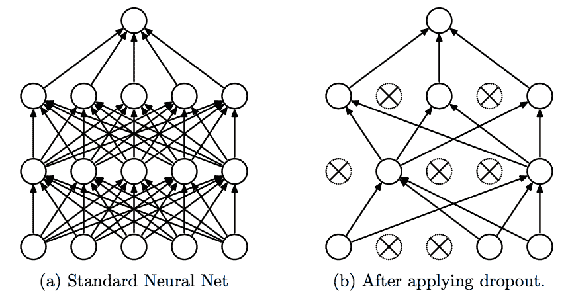
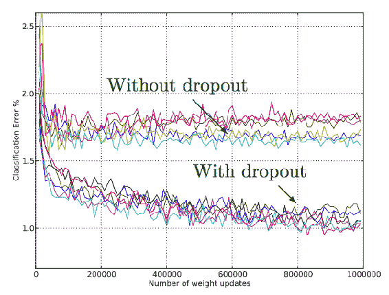
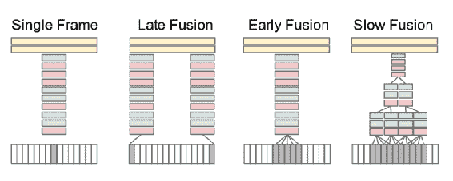
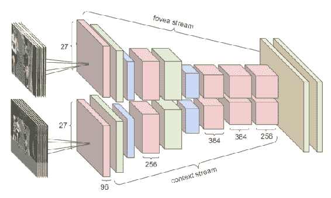
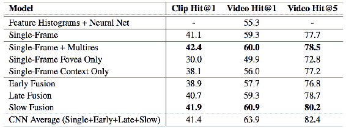
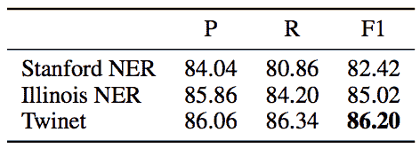
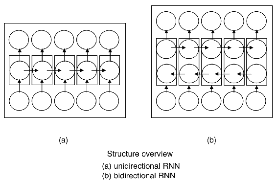
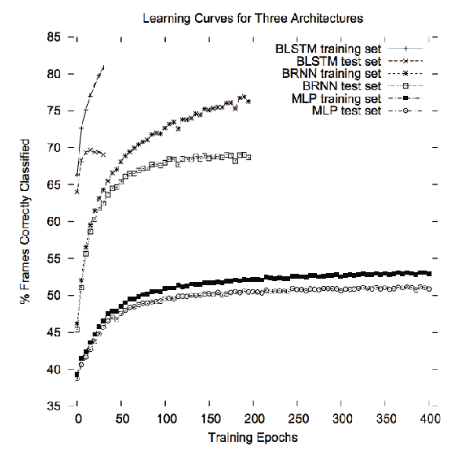

# 第九章：神经网络研究

在本章中，我们将看看神经网络中的一些活跃研究领域。以下问题从基础研究领域到复杂的现实问题进行了分析：

+   神经网络中的过拟合

+   使用神经网络进行大规模视频处理

+   使用扭曲神经网络进行命名实体识别

+   双向递归神经网络

# 避免神经网络中的过拟合

让我们理解过拟合的构成因素，以及如何在神经网络中避免它。Nitesh Srivastava、Geoffrey Hinton 等人于 2014 年发布了一篇论文，[`www.cs.toronto.edu/~hinton/absps/JMLRdropout.pdf`](https://www.cs.toronto.edu/~hinton/absps/JMLRdropout.pdf)，该论文展示了如何避免过拟合的案例。

# 问题陈述

深度神经网络包含非线性隐藏层，这使它们成为可以学习输入和输出之间非常复杂关系的表达性模型。然而，这些复杂的关系将是采样噪声的结果。这些复杂的关系可能在测试数据中不存在，从而导致过拟合。为减少这种噪声，已经开发了许多技术和方法。包括在验证集上的性能开始变差时立即停止训练，引入 L1 和 L2 正则化等权重惩罚，以及软权重共享（Nowlan 和 Hinton，1992）。

# 解决方案

Dropout 是一种解决一些其他技术性能问题的技术，例如在多个模型之间进行平均。它还防止了过拟合，并提供了一种有效地组合大量不同神经网络架构的方法。Dropout 一词意味着在神经网络中删除单元（隐藏和可见）。通过删除一个单元，意味着将其从网络及其输入和输出连接中移除，如下图所示。

删除哪些单元的选择通常是随机的。在简单的情况下，每个单元以独立于其他单元的概率 p 保留。选择 p 的技巧可以是验证集，也可以设置为 0.5；这个值对于广泛的网络和任务来说接近最优。

然而，对于输入单元，保留的最优概率通常更接近 1 而非 0.5。



Dropout 神经网络模型：

+   一个标准的具有两个隐藏层的神经网络

+   一个应用 dropout 后产生的稀疏神经网络，左侧的网络中已删除的单元用交叉标记表示

在 TensorFlow 中如何应用 Dropout 的示例

```py
cell = tf.nn.rnn_cell.LSTMCell(state_size, state_is_tuple=True)
cell = tf.nn.rnn_cell.DropoutWrapper(cell, output_keep_prob=0.5)
cell = tf.nn.rnn_cell.MultiRNNCell([cell] * num_layers, state_is_tuple=True)
```

如上所示，0.5 的 Dropout 已应用于`LSTMCell`，其中`output_keep_prob`：单位张量或介于 0 和 1 之间的浮动值，表示输出保持的概率；如果它是常数且为 1，则不会添加输出 dropout。

# 结果

让我们看看 dropout 策略如何影响模型的准确性：



如上所示，分类误差在使用 dropout 后显著下降。

# 使用神经网络进行大规模视频处理

在本文中，[`static.googleusercontent.com/media/research.google.com/en//pubs/archive/42455.pdf`](https://static.googleusercontent.com/media/research.google.com/en//pubs/archive/42455.pdf)，作者探讨了卷积神经网络（CNN）如何应用于大规模视频分类。在这种应用场景中，神经网络不仅可以访问单一静态图像中的外观信息，还能处理图像的复杂时间演化。将 CNN 应用于这一领域面临着一些挑战。

很少有（或者根本没有）视频分类基准能够匹配现有图像数据集的规模和多样性，因为视频数据集比图像数据集更难以收集、注释和存储。为了获得足够的数据以训练我们的 CNN 架构，作者收集了一个新的 Sports-1M 数据集。该数据集包含来自 YouTube 的 100 万个视频，属于 487 个体育类别的分类体系。Sports-1M 数据集也对研究界开放，以支持该领域未来的研究工作。

在这项工作中，作者将每个视频视为一个由多个短小的固定大小片段组成的袋子。每个片段包含几个时间上连续的帧，因此网络的连接性可以在时间维度上扩展，以学习时空特征。作者描述了三种广泛的连接模式类别（**早期融合**、**晚期融合**和**慢融合**）。之后，我们将探讨一种多分辨率架构，以提高计算效率。

下图解释了各种融合技术：



各种融合技术用于组合时间上分离的帧

# 分辨率改进

作者使用了一个多分辨率架构，旨在通过在两个空间分辨率上分别处理两条流（称为视网膜流和上下文流）来实现妥协（参见下图）。178 × 178 帧的视频片段作为网络的输入：



多分辨率卷积神经网络（CNN）

**上下文流**接收下采样后的帧，分辨率为原始空间分辨率的一半（89 × 89 像素）。**视网膜流**接收中心 89 × 89 区域，分辨率保持原始分辨率。通过这种方式，总输入维度被减半。

# 特征直方图基准

除了比较不同 CNN 架构之间的差异外，作者还报告了基于特征的方法的准确性。使用标准的词袋管道在视频的所有帧上提取了几种类型的特征，随后通过 k-means 向量量化对其进行离散化，并通过空间金字塔编码和软量化将词语累积成直方图。

# 定量结果

Sports-1M 数据集测试集结果（200,000 个视频和 4,000,000 个片段）总结如下表。多网络方法始终显著超越基于特征的基线方法。基于特征的方法在视频的持续时间内密集计算视觉词，并生成基于完整视频级特征向量的预测，而作者的网络仅单独查看 20 个随机采样的片段：



在 Sports-1M 测试集的 200,000 个视频上的结果。Hit@k 值表示测试样本中

至少包含了前 k 个预测中的一个真实标签。

网络拓扑采用的方法尽管存在标签噪声，依然能够良好地学习；训练视频可能会出现一些错误注释，即使是正确标注的视频，也往往包含大量伪影，如文本、特效、剪辑和徽标，而我们并没有专门尝试过滤这些内容。

# 使用扭曲神经网络的命名实体识别

在本文中，[`www.cs.cmu.edu/~leili/pubs/lu-baylearn2015-twinet.pdf,`](http://www.cs.cmu.edu/~leili/pubs/lu-baylearn2015-twinet.pdf) 作者探讨了在自然语言中识别实体的问题。这通常是问答、对话及其他多个 NLP 用例的第一步。对于一段文本序列，命名实体识别器识别出属于预定义类别的实体，如人物和组织。

# 命名实体识别示例

IOB 标记系统是命名实体识别的一种标准。

**IOB 标记** 系统包含如下格式的标签：

+   `B-{CHUNK_TYPE}`：表示**B**eginning 块中的词

+   `I-{CHUNK_TYPE}`: 用于块内部的词**I**nside

+   `O`：**O**utside 任何块

+   `B-PERSON` : 人物实体

+   `B-GPE` : 地缘政治实体

以下文本展示了句子中命名实体的示例：

```py
John    has lived in Britain  for    14        years   . 
B-PERSON O    O    O B-GPE     O B-CARDINAL I-CARDINAL O
```

然而，这个问题具有相当大的挑战，原因有二：

+   实体数据库往往不完整（考虑到新组织的不断成立）。

+   相同的短语可以根据上下文指代不同的实体（或没有实体）。

# 定义 Twinet

扭曲的 RNN（Twinet）使用两个并行分支。每个分支由一个递归网络层、一个非线性感知器层和一个反向递归网络层组成。分支是*扭曲的*：第二个分支中层的顺序被反转。所有递归层的输出在最后集中。

总结一下，**递归神经网络**（**RNN**）接受一系列输入向量 *x1..T*，并递归地计算隐藏状态（也称为**输出标签**）：

*h[t] = σ(U · x[t] + W · ht−1)*

其中，

+   *t* 是 1..T

+   *x[t]* 是外部信号

+   *W* 是权重

+   *h[t-1]* 是时间步 *t-1* 的隐藏层权重。

+   *h[t]* 为时间步 *t* 计算的权重

+   *U* 是 tan*h*层，用于为时间步 *t* 创建权重。

*σ(·)* 是一种非线性激活函数。在作者使用的实验中，我们使用了**修正线性单元**（**RELU**）。

# 结果

Twinet 与斯坦福 NER 和伊利诺伊 NER 进行了比较，结果相当有利。此处 NER 代表**命名实体识别器**（Named Entity Recognizer）。



从前面的图中可以看出，精确度-召回率（Precision-Recall）以及 F1 分数都更高。

# 双向循环神经网络（Bidirectional RNNs）

在本节中，我们将介绍一种在自然语言处理（NLP）领域越来越受到关注的新型神经网络拓扑结构。

Schuster 和 Paliwal 在 1997 年提出了**双向递归神经网络**（**BRNN**）。BRNN 有助于增加可供网络使用的输入信息量。**多层感知器**（**MLPs**）和**时间延迟神经网络**（**TDNNs**）被认为在输入数据灵活性方面存在局限性。RNN 也要求其输入数据是固定的。更先进的拓扑结构如 RNN 也有其限制，因为无法从当前状态预测未来的输入信息。相反，BRNN 不需要其输入数据是固定的，其未来的输入信息可以从当前状态中获取。BRNN 的基本思想是将两个相反方向的隐藏层连接到相同的输出层。通过这种结构，输出层可以同时获取来自过去和未来状态的信息。

当输入的上下文信息非常重要时，BRNN 非常有用。例如，在手写识别中，通过了解当前字母前后的位置字母，可以提高识别性能。



这图展示的是双向循环神经网络（Bidirectional RNN）

# TIMIT 数据集上的 BRNN

在本节中，我们将探讨双向 RNN（BRNN）如何在 TIMIT 数据集上为音素文本分类提供更高的准确度。

TIMIT 是一个包含美国英语发音者不同性别和方言的音素及词汇转录语音的语料库。每个转录元素都已标注时间。TIMIT 旨在推动声学-语音学知识和自动语音识别系统的发展：



从前面的图中可以看出，BRNN 比 MLP 在训练集和测试集上的准确度更高，能够正确识别更多的帧。BLSTM 的准确度更高。

# 总结

在本章中，我们讨论了一些已经进行研究以提高准确性并避免过拟合的领域。我们还探讨了一些新的领域，如视频分类。尽管本书的范围不涵盖所有研究领域的详细内容，但我们真诚建议你浏览谷歌、Facebook 和百度的研究网站，此外，还可以浏览顶级的 ACM 和 IEEE 会议，以便了解最新的研究进展。
