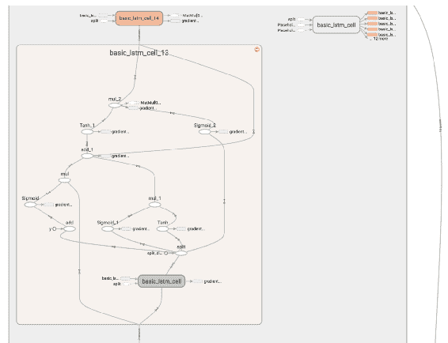

# 第十章：入门 TensorFlow

TensorFlow 是 Google 提供的一个开源深度学习库。它提供了用于定义张量函数并自动计算其导数的原语。张量可以表示为多维数字数组。标量、向量和矩阵是张量的类型。TensorFlow 主要用于设计计算图、构建和训练深度学习模型。TensorFlow 库通过数据流图执行数值计算，其中节点代表数学操作，边代表数据点（通常是多维数组或在这些边之间传输的张量）。

# 环境设置

最好使用像 PyCharm 这样的 IDE 来编辑 Python 代码；它提供更快的开发工具和编码辅助。代码自动完成和检查使得编码和调试更快、更简单，确保你可以专注于编程神经网络的最终目标。

TensorFlow 提供了多种语言的 API：Python、C++、Java、Go 等。我们将下载一个 TensorFlow 版本，使我们能够用 Python 编写深度学习模型的代码。在 TensorFlow 安装网站上，我们可以找到使用 virtualenv、pip 和 Docker 安装 TensorFlow 的最常见方法和最新说明。

以下步骤描述了如何设置本地开发环境：

1.  下载 Pycharm 社区版。

1.  在 Pycharm 中获取最新版本的 Python。

1.  进入“首选项”，设置 Python 解释器，并安装最新版本的 TensorFlow：


1.  TensorFlow 现在会出现在已安装的包列表中。点击“确定”。现在用如 hello world 这样的程序来测试你的安装：

```py
import TensorFlow  as tf
helloWorld = tf.constant("Hello World!")
sess = tf.Session()
print(sess.run(helloWorld))
```

# TensorFlow 与 Numpy 的对比

TensorFlow 和 Numpy 都是 N 维数组库。TensorFlow 还允许我们创建张量函数并计算导数。TensorFlow 已成为深度学习的主要库之一，因为它非常高效，且可以在 GPU 上运行。

以下程序描述了如何使用 `TensorFlow` 和 `numpy` 执行类似操作，如创建形状为 `(3,3)` 的张量：

```py
import TensorFlow  as tf
import numpy as np

tf.InteractiveSession()

# TensorFlow  operations
a = tf.zeros((3,3))
b = tf.ones((3,3))

print(tf.reduce_sum(b, reduction_indices=1).eval())
print(a.get_shape())

# numpy operations
a = np.zeros((3, 3))
b = np.ones((3, 3))
print(np.sum(b, axis=1))
print(a.shape)
```

上述代码的输出结果如下：

```py
[ 3\.  3\.  3.]
(3, 3)
[ 3\.  3\.  3.]
(3, 3)
```

# 计算图

TensorFlow 基于构建计算图。计算图是一个节点网络，每个节点定义了执行某个函数的操作；这些操作可以是简单的加法或减法，也可以是复杂的多变量方程。TensorFlow 程序在构建阶段组装图，在执行阶段利用会话对象执行图中的操作。

一个操作被称为 op，可以返回零个或多个张量，这些张量可以在图中稍后使用。每个 op 都可以给定常量、数组或 n 维矩阵。

# 图

默认图会在导入 TensorFlow 库时实例化。构建图对象而非使用默认图在创建多个不依赖于彼此的模型时非常有用。常量和操作会被添加到 TensorFlow 图中。

在`newGraph.as_default()`之外应用的变量和操作将被添加到默认图中，默认图会在库被导入时创建：

```py
newGraph = tf.Graph()
with newGraph.as_default():
    newGraphConst = tf.constant([2., 3.])

```

# 会话对象

TensorFlow 中的会话封装了张量对象求值的环境。会话可以有它们自己的私有变量、队列和指定的读取器。我们应该在会话结束时使用 close 方法。

会话有三个参数，这些参数是可选的：

+   `Target`：要连接的执行引擎

+   `graph`：要启动的图对象

+   `config`：这是一个 ConfigProto 协议缓冲区

要执行 TensorFlow 计算的单步操作，需调用步骤函数并执行图中的必要依赖：

```py
# session objects
a = tf.constant(6.0)
b = tf.constant(7.0)

c = a * b
with tf.Session() as sess:
   print(sess.run(c))
   print(c.eval())
```

当前活动会话中的`sess.run(c)`！

上述代码输出如下：

```py
42.0, 42.0
```

`tf.InteractiveSession()`函数是保持默认会话在`ipython`中打开的简便方法。`sess.run(c)`是 TensorFlow 获取操作的一个示例：

```py
session = tf.InteractiveSession()
cons1 = tf.constant(1)
cons2 = tf.constant(2)
cons3 = cons1 + cons2
# instead of sess.run(cons3)
cons3.eval()
```

# 变量

训练模型时，我们使用变量来保存和更新参数。变量就像内存缓冲区，包含张量。我们之前使用的所有张量都是常量张量，而不是变量。

变量由会话对象进行管理或维护。变量在会话之间持久存在，这非常有用，因为张量和操作对象是不可变的：

```py
# tensor variablesW1 = tf.ones((3,3))
W2 = tf.Variable(tf.zeros((3,3)), name="weights")

 with tf.Session() as sess:
   print(sess.run(W1))
   sess.run(tf.global_variables_initializer())
   print(sess.run(W2))
```

上述代码输出如下：

```py
[[ 1\.  1\.  1.] [ 1\.  1\.  1.] [ 1\.  1\.  1.]]
[[ 0\.  0\.  0.] [ 0\.  0\.  0.] [ 0\.  0\.  0.]]
```

TensorFlow 变量在赋值前必须初始化，这与常量张量不同：

```py
# Variable objects can be initialized from constants or random values
W = tf.Variable(tf.zeros((2,2)), name="weights")
R = tf.Variable(tf.random_normal((2,2)), name="random_weights")

with tf.Session() as sess:
   # Initializes all variables with specified values.
   sess.run(tf.initialize_all_variables())
   print(sess.run(W))
   print(sess.run(R))
```

上述代码输出如下：

```py
[[ 0\.  0.] [ 0\.  0.]]
[[ 0.65469146 -0.97390586] [-2.39198709  0.76642162]]
```

```py
state = tf.Variable(0, name="counter")
new_value = tf.add(state, tf.constant(1))
update = tf.assign(state, new_value)

with tf.Session() as sess:
   sess.run(tf.initialize_all_variables())
   print(sess.run(state))
   for _ in range(3):
      sess.run(update)
      print(sess.run(state))
```

上述代码输出如下：

```py
0 1 2 3
```

获取变量状态：

```py
input1 = tf.constant(5.0)
input2 = tf.constant(6.0)
input3 = tf.constant(7.0)
intermed = tf.add(input2, input3)
mul = tf.multiply(input1, intermed)

# Calling sess.run(var) on a tf.Session() object retrieves its value. Can retrieve multiple variables simultaneously with sess.run([var1, var2])
with tf.Session() as sess:
   result = sess.run([mul, intermed])
   print(result)
```

上述代码输出如下：

```py
[65.0, 13.0]
```

# 范围

TensorFlow 模型可能有成百上千个变量。`tf.variable_scope()`提供了一个简单的命名方式。

为了管理模型的复杂性并将其分解为独立的部分，TensorFlow 提供了作用域。作用域非常简单，并且在使用 TensorBoard 时非常有用。作用域也可以嵌套在其他作用域内：

```py
with tf.variable_scope("foo"):
     with tf.variable_scope("bar"):
         v = tf.get_variable("v", [1])
 assert v.name == "foo/bar/v:0" with tf.variable_scope("foo"):
     v = tf.get_variable("v", [1])
     tf.get_variable_scope().reuse_variables()
     v1 = tf.get_variable("v", [1])
 assert v1 == v
```

以下示例展示了如何使用重用选项来理解`get_variable`的行为：

```py
#reuse is falsewith tf.variable_scope("foo"):
     n = tf.get_variable("n", [1])
 assert v.name == "foo/n:0" *#Reuse is true* with tf.variable_scope("foo"):
     n = tf.get_variable("n", [1])
 with tf.variable_scope("foo", reuse=True):
     v1 = tf.get_variable("n", [1])
 assert v1 == n
```

# 数据输入

向 TensorFlow 对象输入外部数据：

```py
a = np.zeros((3,3))
ta = tf.convert_to_tensor(a)
with tf.Session() as sess:
   print(sess.run(ta))
```

上述代码输出如下：

```py
[[ 0\. 0\. 0.] [ 0\. 0\. 0.] [ 0\. 0\. 0.]]
```

# 占位符和输入字典

使用`tf.convert_to_tensor()`输入数据是方便的，但它不能扩展。使用`tf.placeholder`变量（虚拟节点，用于为计算图提供数据的入口）。`feed_dict`是一个 Python 字典映射：

```py
input1 = tf.placeholder(tf.float32)
 input2 = tf.placeholder(tf.float32)
 output = tf.multiply(input1, input2)

 with tf.Session() as sess:
    print(sess.run([output], feed_dict={input1:[5.], input2:[6.]}))
```

上述代码输出如下：

```py
[array([ 30.], dtype=float32)]
```

# 自动微分

自动微分也被称为**算法微分**，它是一种自动计算函数导数的方法。这对于计算梯度、雅可比矩阵和海森矩阵等在数值优化等应用中非常有用。反向传播算法是自动微分反向模式的一种实现，用于计算梯度。

在以下示例中，使用`mnist`数据集，我们使用其中一个`loss`函数计算损失。问题是：我们如何将模型拟合到数据上？

我们可以使用`tf.train.Optimizer`来创建优化器。`tf.train.Optimizer.minimize(loss, var_list)`将优化操作添加到计算图中，自动微分则无需用户输入即可计算梯度：

```py
import TensorFlow  as tf

# get mnist dataset
from TensorFlow .examples.tutorials.mnist import input_data
data = input_data.read_data_sets("MNIST_data/", one_hot=True)

# x represents image with 784 values as columns (28*28), y represents output digit
x = tf.placeholder(tf.float32, [None, 784])
y = tf.placeholder(tf.float32, [None, 10])

# initialize weights and biases [w1,b1][w2,b2]
numNeuronsInDeepLayer = 30
w1 = tf.Variable(tf.truncated_normal([784, numNeuronsInDeepLayer]))
b1 = tf.Variable(tf.truncated_normal([1, numNeuronsInDeepLayer]))
w2 = tf.Variable(tf.truncated_normal([numNeuronsInDeepLayer, 10]))
b2 = tf.Variable(tf.truncated_normal([1, 10]))

# non-linear sigmoid function at each neuron
def sigmoid(x):
    sigma = tf.div(tf.constant(1.0), tf.add(tf.constant(1.0), tf.exp(tf.negative(x))))
    return sigma

# starting from first layer with wx+b, then apply sigmoid to add non-linearity
z1 = tf.add(tf.matmul(x, w1), b1)
a1 = sigmoid(z1)
z2 = tf.add(tf.matmul(a1, w2), b2)
a2 = sigmoid(z2)

# calculate the loss (delta)
loss = tf.subtract(a2, y)

# derivative of the sigmoid function der(sigmoid)=sigmoid*(1-sigmoid)
def sigmaprime(x):
    return tf.multiply(sigmoid(x), tf.subtract(tf.constant(1.0), sigmoid(x)))

# automatic differentiation
cost = tf.multiply(loss, loss)
step = tf.train.GradientDescentOptimizer(0.1).minimize(cost)

acct_mat = tf.equal(tf.argmax(a2, 1), tf.argmax(y, 1))
acct_res = tf.reduce_sum(tf.cast(acct_mat, tf.float32))

sess = tf.InteractiveSession()
sess.run(tf.global_variables_initializer())

for i in range(10000):
    batch_xs, batch_ys = data.train.next_batch(10)
    sess.run(step, feed_dict={x: batch_xs,
                              y: batch_ys})
    if i % 1000 == 0:
        res = sess.run(acct_res, feed_dict=
        {x: data.test.images[:1000],
         y: data.test.labels[:1000]})
        print(res)
```

# TensorBoard

TensorFlow 具有一个强大的内置可视化工具，叫做**TensorBoard**。它允许开发者解释、可视化和调试计算图。为了自动在 TensorBoard 中可视化图形和指标，TensorFlow 会将与计算图执行相关的事件写入特定文件夹。

这个示例展示了之前分析的计算图：



要查看图形，请点击 TensorBoard 顶部面板中的图形标签。如果图形中有多个节点，单独查看可能会很困难。为了让我们的可视化更易访问，我们可以使用`tf.name_scope`并指定名称，将相关操作组织成组。
