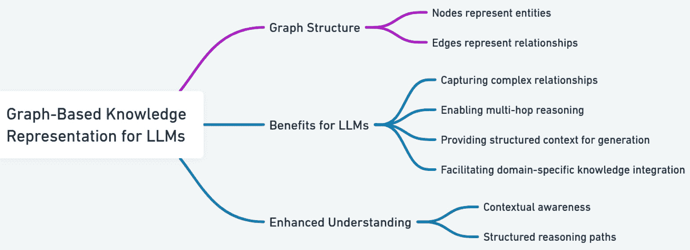

# 第二十七章：基于图的 RAG

在本章中，我们将学习如何利用 RAG 中的图结构化知识为 LLM。你将了解基于图的知識表示以及如何设计能够利用这种结构化信息的 RAG 架构。

基于图的知识表示将信息结构化为图中的节点和边，其中节点代表概念或事实，边捕获它们之间的关系。当与 RAG 结合使用时，这种方法通过利用信息片段及其相互连接，实现更丰富的信息检索，从而允许更上下文化和关系感知的响应。

我们将涵盖用于检索的图嵌入技术、使用图结构进行查询扩展以及将图信息集成到 LLM 生成中的方法。你还将探索 LLM 中图 RAG 的各种应用和用例。

到本章结束时，你将能够实现利用图结构化数据的丰富关系的先进 RAG 系统。

本章将涵盖以下主题：

+   基于图的 LLM 知識表示简介

+   为 LLM 设计图 RAG 架构

+   LLM 检索的图嵌入技术

+   在 LLM 中使用图结构进行查询扩展

+   将图信息集成到 LLM 生成中

+   LLM 中图 RAG 的应用和用例

+   基于图的 RAG 的挑战和未来方向

# 基于图的 LLM 知識表示简介

基于图的知識表示允许在概念和事实之间编码复杂关系，这可以显著增强 LLM 的上下文理解。在图中，节点代表实体，边代表它们之间的关系。



图 27.1 – 为 LLMs 的基于图的知識表示

以下是基于图的 LLM 知識表示的关键优势：

+   捕获复杂关系

+   实现多跳推理

+   为生成提供结构化上下文

+   促进特定领域知识的集成

让我们先从实现一个简单的图结构开始：

```py
from typing import Dict, List, Tuple
class KnowledgeGraph:
    def __init__(self):
        self.nodes: Dict[str, Dict] = {}
        self.edges: Dict[str, List[Tuple[str, str]]] = {}
    def add_node(self, node_id: str, properties: Dict):
        self.nodes[node_id] = properties
    def add_edge(self, source: str, target: str, relation: str):
        if source not in self.edges:
            self.edges[source] = []
        self.edges[source].append((target, relation))
    def get_neighbors(
        self, node_id: str) -> List[Tuple[str, str]
    ]:
        return self.edges.get(node_id, [])
# Example usage
kg = KnowledgeGraph()
kg.add_node("Paris", {"type": "City", "country": "France"})
kg.add_node("France", {"type": "Country", "continent": "Europe"})
kg.add_edge("Paris", "France", "capital_of")
print(kg.get_neighbors("Paris"))
```

此代码在 Python 中实现了一个基础的 `KnowledgeGraph` 类，允许将知识表示为相互连接的实体网络。该类使用字典来存储节点和边，其中节点通过唯一的 ID 识别并持有相关属性，边通过源、目标和关系标签定义节点之间的关系。`add_node` 方法填充 `nodes` 字典，而 `add_edge` 在 `edges` 字典中建立连接。`get_neighbors` 方法允许检索与给定节点直接相连的节点，以及相应的关联关系类型。

这个例子演示了如何创建一个图，添加代表 `Paris` 和 `France` 的节点，定义它们之间的 `capital_of` 关系，然后查询图以找到 `Paris` 的邻居。这种结构为编码复杂关系和促进知识感知应用提供了基础。

接下来，我们将讨论如何设计图 RAG 架构。

# 为 LLM 设计图 RAG 架构

为了设计一个图 RAG 系统，我们需要将我们的知识图谱与检索和生成组件集成：

```py
import networkx as nx
from sentence_transformers import SentenceTransformer
import torch
class GraphRAG:
    def __init__(self, kg: KnowledgeGraph, model_name: str):
        self.kg = kg
        self.model = SentenceTransformer(model_name)
        self.graph = self.build_networkx_graph()
        self.node_embeddings = self.compute_node_embeddings()
    def build_networkx_graph(self):
        G = nx.DiGraph()
        for node_id, properties in self.kg.nodes.items():
            G.add_node(node_id, properties)
        for source, edges in self.kg.edges.items():
            for target, relation in edges:
                G.add_edge(source, target, relation=relation)
        return G
    def compute_node_embeddings(self):
        embeddings = {}
        for node_id, properties in self.kg.nodes.items():
            text = f"{node_id} {' '.join(properties.values())}"
            embedding = self.model.encode(text)
            embeddings[node_id] = embedding
        return embeddings
    def retrieve(self, query: str, k: int = 5) -> List[str]:
        query_embedding = self.model.encode(query)
        similarities = {
            node_id: torch.cosine_similarity(
                torch.tensor(query_embedding),
                torch.tensor(emb), dim=0
            )
            for node_id, emb in self.node_embeddings.items()}
        return sorted(
            similarities, key=similarities.get, reverse=True
        )[:k]
# Example usage
kg = KnowledgeGraph()
# Add more nodes and edges to the knowledge graph
graph_rag = GraphRAG(kg, "all-MiniLM-L6-v2")
retrieved_nodes = graph_rag.retrieve("What is the capital of France?")
print("Retrieved nodes:", retrieved_nodes)
```

在前面的代码中，我们使用了 NetworkX Python 包。NetworkX 包旨在创建、操作和研究复杂网络的结构、动态和功能。它提供了用于处理图（节点集合和节点之间的连接）的工具，并提供了一系列分析网络属性的算法，对于社会网络分析、生物学和基础设施研究等领域来说非常有价值。

这段代码定义了一个 `GraphRAG` 类，它将 `KnowledgeGraph` 对象与 Sentence Transformer 模型结合，以实现上下文感知的信息检索。该类使用 `KnowledgeGraph` 对象和 Sentence Transformer 模型名称初始化，它使用这些名称来构建知识图谱的 `networkx` 图表示，并根据每个节点的 ID 和属性计算嵌入。`build_networkx_graph` 方法将自定义的 `KnowledgeGraph` 对象转换为 `networkx` 有向图，保留节点属性和边关系。`compute_node_embeddings` 方法通过将节点的 ID 和属性连接成一个文本字符串并使用 Sentence Transformer 模型对其进行编码来生成每个节点的嵌入。

`retrieve` 方法接受一个查询，使用相同的 Sentence Transformer 对其进行编码，计算查询嵌入与每个节点嵌入之间的余弦相似度，并返回最相似的 *k* 个节点 ID。这种架构利用图结构和语义嵌入，根据查询上下文检索相关知识，弥合了符号知识表示和神经信息检索之间的差距。

现在，让我们探索更多高级技术来表示我们的图数据，以进一步增强我们的 LLM 检索系统的性能。具体来说，我们将深入研究 LLM 检索的图嵌入技术。

# LLM 检索的图嵌入技术

图嵌入技术旨在将图中的节点表示为低维向量空间，捕捉图的结构属性和关系。存在几种方法，每种方法都有自己的方法——例如，**Node2Vec**通过有偏随机游走来探索邻域，平衡广度优先和深度优先探索。**DeepWalk**是另一种基于随机游走的方法，但执行的是均匀的游走。**图卷积网络**（**GCNs**）通过卷积操作从节点的邻居中聚合信息，根据图的结构和节点特征学习节点嵌入。**图注意力网络**（**GATs**）通过引入注意力机制来扩展 GCNs，在聚合信息时权衡不同邻居的重要性。**知识图谱嵌入翻译**（**TransE**）专门为知识图谱设计，将实体和关系表示为向量，使得如果(*h*, *r*, *t*)成立（头，关系，尾），则*h + r ≈* *t*。

让我们以**Node2Vec**为例。Node2Vec 旨在创建能够保留网络邻域的嵌入。它通过采用平衡**广度优先搜索**（**BFS**）和**深度优先搜索**（**DFS**）的有偏随机游走来实现这一点。BFS 优先探索最近的邻居并捕获局部结构信息，而 DFS 探索远程节点，从而捕获更高阶的依赖关系和社区结构。偏差由两个参数控制，*p*（返回参数）和*q*（出入参数），它们分别影响重新访问前一个节点或探索远程节点的可能性。通过学习反映这些有偏随机游走的嵌入，Node2Vec 能够捕捉局部和全局网络结构，从而实现有效的节点分类、链接预测和社区检测：

```py
from node2vec import Node2Vec
class AdvancedGraphRAG(GraphRAG):
    def __init__(self, kg: KnowledgeGraph, model_name: str):
        super().__init__(kg, model_name)
        self.node2vec_embeddings = self.compute_node2vec_embeddings()
    def compute_node2vec_embeddings(self):
        node2vec = Node2Vec(
            self.graph, dimensions=64, walk_length=30,
            num_walks=200, workers=4
        )
        model = node2vec.fit(window=10, min_count=1)
        return {node: model.wv[node]
            for node in self.graph.nodes()
        }
    def retrieve(self, query: str, k: int = 5) -> List[str]:
        query_embedding = self.model.encode(query)
        combined_similarities = {}
        for node_id in self.graph.nodes():
            text_sim = torch.cosine_similarity(
                torch.tensor(query_embedding),
                torch.tensor(self.node_embeddings[node_id]),
                dim=0
            )
            graph_sim = torch.cosine_similarity(
                torch.tensor(query_embedding),
                torch.tensor(self.node2vec_embeddings[node_id]),
                dim=0
            )
            combined_similarities[node_id] = \
                0.5 * text_sim + 0.5 * graph_sim
        return sorted(
            combined_similarities,
            key=combined_similarities.get,
            reverse=True
        )[:k]
# Example usage
advanced_graph_rag = AdvancedGraphRAG(kg, "all-MiniLM-L6-v2")
retrieved_nodes = advanced_graph_rag.retrieve("What is the capital of France?")
print("Retrieved nodes:", retrieved_nodes)
```

此代码通过结合 `Node2Vec` 嵌入来增强检索性能，在 `GraphRAG` 类的基础上进行了扩展。它引入了一个 `AdvancedGraphRAG` 类，该类继承自 `GraphRAG` 并在初始化期间计算 `Node2Vec` 嵌入。`compute_node2vec_embeddings` 方法使用 `node2vec` 库生成这些嵌入，创建一个具有指定维度、行走长度、行走次数和工作线程的 `Node2Vec` 对象；然后通过在图结构上使用随机游走来训练 Node2Vec 模型，并提取学习到的节点嵌入。`retrieve` 方法被重写，以结合原始基于文本的嵌入和 `Node2Vec` 嵌入进行相似度计算。对于每个节点，它计算查询嵌入与基于文本的嵌入和 `Node2Vec` 嵌入之间的余弦相似度，然后以相等的权重平均这两个相似度得分，以产生一个综合相似度得分。最后，它返回具有最高综合相似度得分的前 *k* 个节点，利用语义和结构信息进行更有效的检索。

现在，让我们探讨如何通过利用图结构来细化我们的查询，进一步提高检索效果。在下一节中，我们将实现一个简单而有效的技术来扩大搜索范围。

# 在 LLM 中使用图结构进行查询扩展

我们可以利用图结构来扩展查询并提高检索效果。让我们实现一个简单的查询扩展技术：

```py
import random
class QueryExpansionGraphRAG(AdvancedGraphRAG):
    def expand_query(
        self, query: str, num_expansions: int = 2
    ) -> List[str]:
        initial_nodes = super().retrieve(query, k=3)
        expanded_queries = [query]
        for node in initial_nodes:
            neighbors = list(self.graph.neighbors(node))
            if neighbors:
                random_neighbor = random.choice(neighbors)
                expanded_query = (
                    f"{query}"
                    f"{self.graph.nodes[random_neighbor].
                        get('type', '')}"
                    f"{random_neighbor}"
                )
                expanded_queries.append(expanded_query)
                if len(expanded_queries) >= num_expansions + 1:
                    break
        return expanded_queries
    def retrieve(self, query: str, k: int = 5) -> List[str]:
        expanded_queries = self.expand_query(query)
        all_retrieved = []
        for q in expanded_queries:
            all_retrieved.extend(super().retrieve(q, k))
        return list(dict.fromkeys(all_retrieved))[:k]
# Example usage
query_expansion_rag = QueryExpansionGraphRAG(kg, "all-MiniLM-L6-v2")
retrieved_nodes = query_expansion_rag.retrieve("What is the capital of France?")
print("Retrieved nodes:", retrieved_nodes)
```

此代码在基于图的结构化检索系统（RAG）中实现了查询扩展，以增强检索性能。`QueryExpansionGraphRAG` 类继承自 `AdvancedGraphRAG` 并引入了一个 `expand_query` 方法，该方法接受一个查询和期望的扩展次数作为输入。首先，此方法使用基类的 `retrieve` 方法根据初始查询检索出最相关的三个节点。然后，它遍历这些初始节点，为每个节点随机选择一个邻居，并通过将邻居的类型（如果可用）和邻居的 ID 添加到原始查询中来构建一个扩展查询。`retrieve` 方法被重写，首先使用 `expand_query` 方法扩展输入查询。然后，它使用基类的 `retrieve` 方法为每个扩展查询检索结果，合并结果，同时保留顺序并移除重复项，最后返回前 *k* 个独特的节点。这种方法利用图结构来探索相关概念并扩大搜索范围，可能比单独的直接查询捕获到更多相关信息。

查询扩展在初始查询过于狭窄或未充分指定时特别有用，导致召回率低。在基于图的检索设置中，这通常发生在查询没有明确提及与图中语义或结构上相关联的相关实体或概念时。通过将相邻节点纳入查询制定中，系统可以发现否则会被忽视的相关内容，这使得查询扩展在探索性搜索场景或数据稀疏或高度互联的领域中特别有益。

现在我们已经探讨了增强检索的技术，让我们将注意力转向改进生成阶段。我们将深入了解将图信息集成到 LLM 生成过程中的方法，探讨如何将图知识直接集成到生成过程中，以创建更全面和连贯的响应。集成图信息到 LLM 生成

要将图信息集成到 LLM 生成中，我们可以创建一个提示，其中包含检索到的图上下文：

```py
from transformers import AutoModelForCausalLM, AutoTokenizer
class GenerativeGraphRAG(QueryExpansionGraphRAG):
    def __init__(
        self, kg: KnowledgeGraph, retriever_model: 
        str, generator_model: str
    ):
        super().__init__(kg, retriever_model)
        self.generator = \
            AutoModelForCausalLM.from_pretrained(generator_model)
        self.generator_tokenizer = \
            AutoTokenizer.from_pretrained(generator_model)
    def generate_response(
        self, query: str, max_length: int = 100
    ) -> str:
        retrieved_nodes = self.retrieve(query)
        context = self.build_graph_context(retrieved_nodes)
        prompt = f"Graph Context:\n{context}\n\nQuestion: {query}\nAnswer:"
        inputs = self.generator_tokenizer(
            prompt, return_tensors="pt"
        )
        outputs = self.generator.generate(
            inputs, max_length=max_length
        )
        return self.generator_tokenizer.decode(
            outputs[0], skip_special_tokens=True
        )
    def build_graph_context(self, nodes: List[str]) -> str:
        context = []
        for node in nodes:
            context.append(f"Node: {node}")
            context.append(f"Properties: {self.graph.nodes[node]}")
            for neighbor, edge_data in self.graph[node].items():
                context.append(
                    f"  Related to {neighbor} by 
                    {edge_data['relation']}")
        return "\n".join(context)
# Example usage
generative_graph_rag = GenerativeGraphRAG(
    kg, "all-MiniLM-L6-v2", "gpt2-medium"
)
response = generative_graph_rag.generate_response("What is the capital of France?")
print("Generated response:", response)
```

此代码在基于图的 RAG 框架内集成了一个用于响应生成的 LLM。`GenerativeGraphRAG`类从`QueryExpansionGraphRAG`继承，并使用`KnowledgeGraph`（知识图谱）、检索器模型名称和生成器模型名称进行初始化。它使用`transformers`加载了一个预训练的因果语言模型及其相应的分词器。`generate_response`方法协调整个过程：首先，它使用从父类继承的`retrieve`方法从知识图谱中检索相关节点。然后，它通过调用`build_graph_context`构建一个上下文字符串，该字符串格式化检索到的节点、它们的属性以及它们与其他节点的关系，形成一个可读的文本。然后，这个上下文与原始查询一起纳入提示中，并输入到预训练的语言模型中。语言模型根据提示生成一个响应，生成的标记被解码回人类可读的字符串，有效地利用图结构来指导语言模型生成响应。`build_graph_context`方法将检索到的图信息格式化为提示，包括节点 ID、属性以及与邻居的关系，为 LLM 提供相关知识的结构化表示。

现在我们已经探讨了如何将图信息集成到生成过程中，让我们考虑这一方法的更广泛的应用和潜在用途。

# 图 RAG 在 LLM 中的应用和用例

基于图的 RAG 在多种应用中特别有效：

+   基于知识图谱的问答

+   个性化推荐系统

+   科学文献分析

+   药物发现和生物医学研究

+   社交网络分析

这里有一个如何使用图 RAG 构建推荐系统的例子：

```py
class RecommendationGraphRAG(GenerativeGraphRAG):
    def get_recommendations(
        self, user_id: str, num_recommendations: int = 5
    ) -> List[str]:
        user_node = self.retrieve(f"User {user_id}", k=1)[0]
        user_interests = self.graph.nodes[user_node].
            get('interests', [])
        potential_recommendations = set()
        for interest in user_interests:
            related_items = self.retrieve(interest, k=3)
            potential_recommendations.update(related_items)
        recommendations = list(
            potential_recommendations - set(user_interests)
        )[:num_recommendations]
        return recommendations
    def explain_recommendation(
        self, user_id: str, item_id: str
    ) -> str:
        query = f"Why would User {user_id} be interested in {item_id}?"
        return self.generate_response(query)
# Example usage
recommendation_rag = RecommendationGraphRAG(
    kg, "all-MiniLM-L6-v2", "gpt2-medium"
)
user_id = "12345"
recommendations = recommendation_rag.get_recommendations(user_id)
print(f"Recommendations for User {user_id}:", recommendations)
for item in recommendations[:2]:
    explanation = recommendation_rag.explain_recommendation(user_id,
        item)
    print(f"Explanation for recommending {item}:", explanation)
```

这个例子展示了如何使用图 RAG 生成个性化推荐，并利用图结构解释这些推荐。

# 基于图的 RAG 的挑战和未来方向

让我们考虑一些基于图的关系增强生成（RAG）的关键挑战和未来研究方向：

+   可扩展到非常大的图

+   处理动态和演变的图结构

+   结合不确定性和概率关系

+   提高基于图的检索和生成的可解释性

+   开发更复杂的图感知语言模型

这些是令人着迷且复杂的研究主题。在本章中，我们将关注基于图的 RAG 的可扩展性方面。我们鼓励您阅读标题为《图检索增强生成：综述》的研究论文[`arxiv.org/abs/2408.08921`](https://arxiv.org/abs/2408.08921)，以了解更多关于其他挑战和研究方向的信息。

实际世界的知识图谱可能包含数百万甚至数十亿个节点和边。查询和遍历这样的大规模图可能计算成本高昂，尤其是在实时 RAG 管道中。此外，向 LLM 提供巨大的子图作为上下文可能会超过其上下文窗口限制，并使相关信息与噪声稀释。

几个因素导致了这个可扩展性瓶颈：

+   **图遍历复杂性**：在大型图中找到相关节点及其连接可能耗时。随着图的增长，标准图算法如 BFS 或 DFS 可能变得效率低下。

+   **嵌入存储和检索**：存储和检索大规模图的节点嵌入需要大量的内存和计算资源。计算查询嵌入与所有节点嵌入之间的相似度分数成为瓶颈。

+   **上下文窗口限制**：LLM 有一个有限的范围，这意味着它们一次只能处理固定数量的文本。大型图上下文很容易超过这个限制，导致截断，并可能造成重要信息的丢失。

+   **上下文中的噪声**：将过多无关信息从图中作为上下文可能会混淆 LLM 并降低生成响应的质量。

为了解决这些可扩展性挑战，可以采用几种策略。我们将实施的一种策略是**子图采样**。这涉及到从整体知识图谱中提取一个更小、更易于管理的子图，该子图与用户的查询最相关。这降低了图遍历和嵌入检索的计算成本，同时确保 LLM 接收到的上下文是专注且信息丰富的。提高可扩展性的其他技术包括以下内容：

+   **图数据库**：使用专门的图数据库，如 Neo4j 或 Amazon Neptune，与通用数据库相比，可以显著提高查询性能和可扩展性。

+   **近似最近邻（ANN）搜索**：使用 ANN 算法进行嵌入检索可以通过牺牲一些精度显著加快搜索过程。

+   **知识图谱摘要**：将知识图谱压缩成更小、更易于管理的表示形式，同时保留其基本信息。

+   **硬件加速**：利用 GPU 或专用硬件加速器可以加快图计算和嵌入操作。

+   **上下文蒸馏**：如选择性上下文注入或分层检索等技术可以过滤并优先选择对 LLM 最相关的信息。

现在，让我们继续实现子图采样，看看它如何帮助解决可扩展性问题：

```py
import networkx as nx
class ScalableGraphRAG(GenerativeGraphRAG):
    def __init__(
        self, kg: KnowledgeGraph, retriever_model: str,
        generator_model: str, max_subgraph_size: int = 1000
    ):
        super().__init__(kg, retriever_model, generator_model)
        self.max_subgraph_size = max_subgraph_size
    def retrieve(self, query: str, k: int = 5) -> List[str]:
        initial_nodes = super().retrieve(query, k=k)
        subgraph = self.sample_subgraph(initial_nodes)
        return self.rank_nodes_in_subgraph(subgraph, query)[:k]
    def sample_subgraph(self, seed_nodes: List[str]) -> nx.Graph:
        subgraph = nx.Graph()
        frontier = set(seed_nodes)
        while len(subgraph) < self.max_subgraph_size and frontier:
            node = frontier.pop()
            if node not in subgraph:
                subgraph.add_node(node, self.graph.nodes[node])
                neighbors = list(self.graph.neighbors(node))
                for neighbor in neighbors:
                    if len(subgraph) < self.max_subgraph_size:
                        subgraph.add_edge(
                            node, neighbor,
                            self.graph[node][neighbor]
                        )
                        frontier.add(neighbor)
                    else:
                        break
        return subgraph
    def rank_nodes_in_subgraph(
        self, subgraph: nx.Graph, query: str
    ) -> List[str]:
        query_embedding = self.model.encode(query)
        node_scores = {}
        for node in subgraph.nodes():
            node_embedding = self.node_embeddings[node]
            score = torch.cosine_similarity(
                torch.tensor(query_embedding),
                torch.tensor(node_embedding), dim=0
            )
            node_scores[node] = score
        return sorted(node_scores, key=node_scores.get, reverse=True)
# Example usage
scalable_graph_rag = ScalableGraphRAG(
    kg, "all-MiniLM-L6-v2", "gpt2-medium"
)
retrieved_nodes = scalable_graph_rag.retrieve("What is the capital of France?")
print("Retrieved nodes:", retrieved_nodes)
```

此代码引入了一个`ScalableGraphRAG`类，该类通过实现子图采样技术来解决基于图 RAG 系统的可扩展性挑战。它从`GenerativeGraphRAG`继承，并包含一个`max_subgraph_size`参数来限制提取的子图大小。

重写的检索方法首先使用基类的检索机制确定一组初始相关节点。然后，它调用`sample_subgraph`方法构建一个以这些初始节点为中心的子图，限制其增长到指定的`max_subgraph_size`。

`sample_subgraph`方法从种子节点进行广度优先扩展，向子图添加节点和边，直到达到大小限制，优先考虑靠近种子节点的节点。

可以通过调整`max_subgraph_size`参数来调整子图采样，以平衡上下文丰富性和计算效率。较小的尺寸会导致处理速度更快，但可能会错过关键上下文信息，而较大的尺寸可以捕获更多上下文，但会增加计算成本。此外，算法在子图扩展期间的节点选择标准也可以进行调整——例如，优先考虑与查询具有更高语义相似度的节点或与种子节点具有更强连接性的节点。对这些参数进行实验对于优化 RAG 系统针对特定应用和图结构的性能是有用的。

最后，`rank_nodes_in_subgraph`方法通过计算查询嵌入与节点预先计算的嵌入之间的余弦相似度来计算子图内每个节点相对于查询的相关性。然后，它根据相似度分数返回一个节点排名列表，确保只考虑采样子图中最相关的节点进行上下文增强。

# 摘要

基于图的 RAG 通过利用知识图谱的丰富结构扩展了传统 RAG 系统的功能。通过实施本章讨论的技术和方法，您可以创建更复杂的 LLM 系统，这些系统能够对复杂关系进行推理并生成更符合语境的响应。在下一章中，我们将探讨 LLM 的高级 RAG 模式。这将基于我们在这里讨论的图技术，以便您创建更强大和灵活的 RAG 系统。
