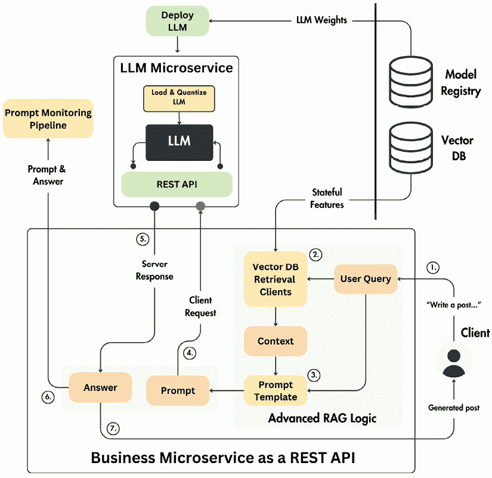

# 第十章：推理管道部署

部署**大型语言模型**（**LLM**）Twin 应用程序的推理管道是**机器学习**（**ML**）应用程序生命周期中的一个关键阶段。这是为您的业务增加最大价值的地方，使您的模型能够被最终用户访问。然而，成功部署 AI 模型可能具有挑战性，因为模型需要昂贵的计算能力和访问最新特征来运行推理。为了克服这些限制，精心设计您的部署策略至关重要。这确保了它满足应用程序的要求，例如延迟、吞吐量和成本。当我们与 LLM 合作时，我们必须考虑第八章中提出的推理优化技术，例如模型量化。此外，为了自动化部署流程，我们必须利用 MLOps 最佳实践，例如模型注册，它可以在我们的基础设施中版本控制和共享我们的模型。

为了理解如何设计 LLM Twin 的部署架构，我们首先将查看我们可以选择的三个部署类型：在线实时推理、异步推理和离线批量转换。为了更好地理解为我们的 LLM Twin 用例选择哪个选项，我们将快速带您了解在做出架构决策之前必须考虑的一组关键标准，例如延迟、吞吐量、数据和基础设施。此外，我们将权衡单体架构和微服务架构在模型服务中的优缺点，这个决定可以显著影响您服务的可扩展性和可维护性。一旦我们掌握了各种设计选择，我们将专注于理解 LLM Twin 推理管道的部署策略。随后，我们将带您完成部署 LLM Twin 服务的端到端教程，包括将我们的自定义微调 LLM 部署到 AWS SageMaker 端点和实现 FastAPI 服务器作为我们用户的中心入口点。然后，我们将以关于自动扩展策略及其在 SageMaker 上的使用方法的简短讨论来结束本章。

因此，在本章中，我们将涵盖以下主题：

+   选择部署类型的标准

+   理解推理部署类型

+   模型服务中的单体架构与微服务架构

+   探索 LLM Twin 的推理管道部署策略

+   部署 LLM Twin 服务

+   处理使用高峰的自扩展能力

# 选择部署类型的标准

当涉及到部署 ML 模型时，第一步是理解每个 ML 应用程序中存在的四个要求：吞吐量、延迟、数据和基础设施。

理解它们及其相互作用是至关重要的。在设计您模型的部署架构时，始终存在四个直接影响用户体验的权衡。例如，您的模型部署应该优化为低延迟还是高吞吐量？

## 吞吐量和延迟

**吞吐量**是指系统在给定时间内可以处理的推理请求数量。通常以每秒请求数（**RPS**）来衡量。当部署 ML 模型并预期处理大量请求时，吞吐量至关重要。它确保系统可以高效地处理大量请求，而不会成为瓶颈。

高吞吐量通常需要可扩展且健壮的基础设施，例如配备多个高端 GPU 的机器或集群。**延迟**是指系统从接收到单个推理请求到返回结果所需的时间。在需要快速响应时间的实时应用中，延迟至关重要，例如在实时用户交互、欺诈检测或任何需要即时反馈的系统。例如，OpenAI API 的平均延迟是从用户发送请求到服务提供可在您的应用程序中访问的结果的平均响应时间。

延迟是网络 I/O、序列化和反序列化以及 LLM 推理时间的总和。同时，吞吐量是 API 每秒处理的平均请求数量。

低延迟的系统需要优化且通常成本更高的基础设施，例如更快的处理器、更低的网络延迟，以及可能需要边缘计算来减少数据需要传输的距离。

当服务成功并行处理多个查询时，较低的延迟会转化为更高的吞吐量。例如，如果服务处理请求需要 100 毫秒，这相当于每秒 10 个请求的吞吐量。如果延迟达到每个请求 10 毫秒，吞吐量将上升到每秒 100 个请求。

然而，事情变得复杂，大多数 ML 应用采用批处理策略，同时将多个数据样本传递给模型。在这种情况下，较低的延迟可以转化为较低的吞吐量；换句话说，较高的延迟对应于较高的吞吐量。例如，如果您在 100 毫秒内处理 20 个批处理请求，延迟是 100 毫秒，而吞吐量是每秒 200 个请求。如果您在 200 毫秒内处理 60 个请求，延迟是 200 毫秒，而吞吐量上升到每秒 300 个请求。因此，即使在服务时间批处理请求时，考虑为良好的用户体验所接受的最低延迟也是至关重要的。

## 数据

如我们所知，数据在 ML 系统中无处不在。但当我们谈论模型服务时，我们主要关心的是模型的输入和输出。这包括处理数据的格式、体积和复杂性。数据是推理过程的基础。数据的特点，如其大小和类型，决定了系统需要如何配置和优化以实现高效处理。

数据的类型和大小直接影响延迟和吞吐量，因为更复杂或更广泛的数据可能需要更长的时间来处理。例如，设计一个接受结构化数据输入并输出概率的模型与接受文本（甚至图像）输入并输出字符数组的 LLM 完全不同。

基础设施

基础设施指的是支持 ML 模型部署和运行的底层硬件、软件、网络和系统架构。基础设施为部署、扩展和维护 ML 模型提供必要的资源。它包括计算资源、内存、存储、网络组件和软件栈：

+   对于**高吞吐量**，系统需要可扩展的基础设施来管理大量数据和高速请求，可能通过并行处理、分布式系统和高端 GPU。

+   基础设施必须优化以减少处理时间以实现**低延迟**，例如使用更快的 CPU、GPU 或专用硬件。在优化系统以实现低延迟并批量处理请求时，你通常必须牺牲高吞吐量以换取低延迟，这可能导致你的硬件无法充分利用其总容量。随着每秒处理的请求数量减少，会导致闲置计算，从而增加处理请求的整体成本。因此，选择适合您需求的机器对于优化成本至关重要。

设计满足特定数据要求的基础设施至关重要。这包括选择存储解决方案来处理大型数据集，并实施快速检索机制以确保高效的数据访问。例如，我们主要关注优化离线训练的吞吐量，而对于在线推理，我们通常关注延迟。

考虑到这一点，在选择特定的部署类型之前，你应该问自己一些问题，例如：

+   吞吐量需求是多少？你应该根据吞吐量的所需最小值、平均值和最大值统计数据来做出这个决定。

+   系统必须同时处理多少请求？（1，10，1,000，1 百万等）

+   延迟需求是多少？（1 毫秒，10 毫秒，1 秒等）

+   系统应该如何扩展？例如，我们应该查看 CPU 的工作负载、请求数量、队列大小、数据大小，或者它们的组合。

+   成本需求是什么？我们使用什么数据？例如，我们处理图像、文本还是表格数据？

+   我们处理的数据大小是多少？（100 MB，1 GB，10 GB）

深入思考这些问题会直接影响你应用程序的用户体验，这最终决定了产品成功与否。即使你推出一个令人惊叹的模型，如果用户需要等待很长时间才能得到响应，或者它经常崩溃，用户会转向使用更准确但可靠性较低的替代品。例如，谷歌在 2016 年的一项研究发现，如果移动网站加载时间超过三秒，53%的访问将被放弃：[`www.thinkwithgoogle.com/consumer-insights/consumer-trends/mobile-site-load-time-statistics/`](https://www.thinkwithgoogle.com/consumer-insights/consumer-trends/mobile-site-load-time-statistics/)。

让我们继续探讨我们可以利用的三个部署架构来服务我们的模型。

# 理解推理部署类型

如*图 10.1*所示，在服务模型时，你可以从三种基本的部署类型中选择：

+   在线实时推理

+   异步推理

+   离线批量转换

在选择一种设计而不是另一种设计时，需要在延迟、吞吐量和成本之间进行权衡。你必须考虑数据是如何访问的，以及你正在与之合作的基础设施。你必须考虑的另一个标准是用户将如何与模型交互。例如，用户是否会直接使用它，就像聊天机器人一样，或者它是否会被隐藏在你的系统中，就像一个检查输入（或输出）是否安全的分类器？

你还必须考虑预测的新鲜度。例如，如果你的用例中可以接受延迟预测，那么在离线批量模式下部署你的模型可能更容易实现。否则，你必须实时部署你的模型，这需要更多的基础设施。此外，你还必须考虑你的应用程序流量。问问自己，例如，“应用程序是否会持续使用，还是会有流量高峰然后平缓下来？”

考虑到这一点，让我们来探讨三种主要的机器学习部署类型。


图 10.1：推理部署类型的三个基本架构

## 在线实时推理

在实时推理中，我们有一个基于服务器的简单架构，可以通过 HTTP 请求访问。最受欢迎的选项是实现 REST API 或 gRPC 服务器。REST API 更易于访问但速度较慢，使用 JSON 在客户端和服务器之间传递数据。

当将模型部署到内部网络之外，面向更广泛的公众时，通常会采用这种方法。例如，OpenAI 的 API 实现了 REST API 协议。

另一方面，实现 gRPC 可以使您的机器学习服务器更快，尽管这可能会降低其灵活性和通用性。您必须在客户端应用程序中实现`protobuf`模式，这比 JSON 结构更繁琐。然而，好处是`protobuf`对象可以编译成字节，使网络传输更快。因此，该协议通常被采用于同一机器学习系统内的内部服务。

使用实时推理方法，客户端向机器学习服务发送 HTTP 请求，该服务立即处理请求并在同一响应中返回结果。这种同步交互意味着客户端在继续之前必须等待结果。

为了使这一过程高效运行，基础设施必须支持低延迟、高度响应的机器学习服务，通常部署在快速、可扩展的服务器上。负载均衡对于均匀分配传入流量至关重要，而自动扩展确保系统可以处理变化的负载。高可用性对于始终保持服务运行也是必不可少的。

例如，这种架构在与大型语言模型（LLM）交互时经常出现，例如在向聊天机器人或由 LLM（如 ChatGPT 或 Claude）驱动的 API 发送请求时，您可以直接消耗预测。LLM 服务，如 ChatGPT 或 Claude，通常使用 WebSockets 将每个标记单独流式传输到最终用户，这使得交互更加响应。其他著名的例子包括嵌入或重排序模型，这些模型用于**检索增强生成**（RAG）或 TikTok 等平台上的在线推荐引擎。

实时推理的简单性，以及其直接的客户端-服务器交互，使其成为需要即时响应的应用程序（如聊天机器人或实时推荐）的吸引人选择。然而，这种方法在扩展上可能具有挑战性，并且在低流量期间可能会导致资源利用率不足。

## 异步推理

在异步推理中，客户端向机器学习服务发送请求，该服务确认请求并将其放入队列以供处理。与实时推理不同，客户端不需要等待即时响应。相反，机器学习服务异步处理请求。这需要一个强大的基础设施，该基础设施将消息排队，以便稍后由机器学习服务处理。

当结果准备好时，您可以使用多种技术将它们发送到客户端。例如，根据结果的大小，您可以将它放入不同的队列或一个专门用于存储结果的对象存储。

客户端可以选择采用轮询机制，定期检查是否有新的结果，或者采用推送策略并实现一个通知系统，在结果准备好时通知客户端。

异步推理更有效地使用资源。它不必同时处理所有请求，但可以定义一个最大数量的机器，这些机器可以并行运行以处理消息。这是可能的，因为请求被存储在队列中，直到有机器可以处理它们。另一个巨大的好处是它可以处理请求的峰值而不会超时。例如，假设在一个电子商务网站上，我们通常每秒由两台机器处理 10 个请求。由于促销活动，许多人开始访问该网站，请求的数量激增到每秒 100 个。而不是通过增加 10 个**虚拟机**（VMs）的数量，这可能会增加巨大的成本，请求被排队，相同的两台 VMs 可以按其节奏处理它们，而不会出现任何故障。

异步架构的另一个流行优势是当请求的工作需要很长时间才能完成时。例如，如果工作需要超过五分钟，你不想让客户端等待响应。

虽然异步推理提供了显著的好处，但它也带来了一些权衡。它引入了更高的延迟，使其不太适合对时间敏感的应用。此外，它增加了实现和基础设施的复杂性。根据你的设计选择，这种架构类型介于在线和离线之间，提供了利益和权衡的平衡。

例如，这是一个健壮的设计，你不太关心推理的延迟，但想大幅度优化成本。因此，它对于诸如从文档中提取关键词、使用大型语言模型进行总结或在上面的视频上运行深度伪造模型等问题来说是一个流行的选择。但是，如果你仔细设计了自动扩展系统，以适中的速度处理队列中的请求，那么你可以利用这种设计来处理其他用例，例如电子商务的在线推荐。最终，它总结了为了满足应用程序的期望，你愿意支付多少计算能力。

## 离线批处理转换

批处理转换是关于同时处理大量数据，无论是按计划还是手动触发。在批处理转换架构中，机器学习服务从存储系统提取数据，一次性处理它，然后将结果存储在存储系统中。存储系统可以实施为对象存储，如 AWS S3，或数据仓库，如 GCP BigQuery。

与异步推理架构不同，批处理转换设计针对高吞吐量和可接受的延迟要求进行了优化。当实时预测不是必需时，这种方法可以显著降低成本，因为批量处理数据是最经济的方法。此外，批处理转换架构是提供模型的最简单方式，可以加速开发时间。

客户端直接从数据存储中拉取结果，解耦了它与机器学习服务的交互。采用这种方法，客户端永远不需要等待机器学习服务处理其输入，但与此同时，它也没有在任何时候请求新结果的灵活性。你可以看到数据存储，其中结果作为大缓存存储，客户端可以从那里获取所需的内容。如果你想使你的应用程序更响应，客户端可以在处理完成后被通知并检索结果。

不幸的是，这种方法总是在预测计算和消费之间引入延迟。这就是为什么并非所有应用程序都能利用这种设计选择。例如，如果我们为视频流应用程序实现一个推荐系统，对于预测的电影和电视节目有一天的延迟可能可行，因为你不会频繁地消费这些产品。但假设你为社交媒体平台实现一个推荐系统。在这种情况下，一天的延迟甚至一小时的延迟都是不可接受的，因为你始终希望向用户提供新鲜的内容。

批量转换在需要高吞吐量的场景中表现出色，如数据分析或定期报告。然而，由于其高延迟，它不适合实时应用程序，并且需要仔细规划和调度来有效地管理大数据集。这就是为什么它是一种离线服务方法。

总结来说，我们探讨了服务机器学习模型最常用的三种架构。我们首先从在线实时推理开始，当客户端请求预测时为客户端提供服务。然后，我们看了异步推理方法，它介于在线和离线之间。最终，我们介绍了离线批量转换，它用于处理大量数据并将它们存储在数据存储中，客户端稍后从那里消费它们。

# 模型服务中的单体架构与微服务架构

在上一节中，我们看到了部署机器学习服务的三种不同方法。架构上的差异主要基于客户端与机器学习服务之间的交互，例如通信协议、机器学习服务的响应性和预测的新鲜度。

但另一个需要考虑的方面是机器学习服务的架构本身，它可以实现为一个单体服务器或多个微服务。这将影响机器学习服务的实现、维护和扩展方式。让我们来探讨这两种选项。


图 10.2：模型服务中的单体架构与微服务架构

## 单体架构

在单体架构中，LLM（或任何其他 ML 模型）及其相关的业务逻辑（预处理和后处理步骤）被捆绑成一个单一的服务。这种方法在项目开始时易于实现，因为所有内容都放在一个代码库中。在小到中等规模的项目中，由于更新和更改可以在统一的系统中进行，因此简单性使得维护变得容易。

单体架构的一个关键挑战是独立扩展组件的困难。LLM 通常需要 GPU 性能，而其余的业务逻辑是 CPU 和 I/O 密集型。因此，基础设施必须针对 GPU 和 CPU 进行优化。这可能导致资源使用效率低下，当业务逻辑执行时 GPU 处于空闲状态，反之亦然。这种低效率可能导致额外的成本，这些成本本可以避免。

此外，这种架构可能会限制灵活性，因为所有组件必须共享相同的技栈和运行环境。例如，您可能希望使用 Rust 或 C++运行 LLM 或使用 ONNX 或 TensorRT 进行编译，同时保持业务逻辑在 Python 中。将所有代码放在一个系统中使得这种差异化变得困难。最后，将工作分配给不同的团队是复杂的，通常会导致瓶颈和敏捷性降低。

## 微服务架构

微服务架构将推理管道分解为独立的、独立的服务——通常将 LLM 服务和业务逻辑拆分为不同的组件。这些服务通过 REST 或 gRPC 等协议在网络中进行通信。

如*图 10.3*所示，这种方法的主要优势在于能够独立扩展每个组件。例如，由于 LLM 服务可能需要比业务逻辑更多的 GPU 资源，因此它可以水平扩展而不会影响其他组件。这优化了资源使用并降低了成本，因为可以根据每个服务的需求使用不同类型的机器（例如，GPU 与 CPU）。

例如，假设 LLM 推理需要更长的时间，因此您将需要更多的 ML 服务副本来满足需求。但请记住，GPU 虚拟机很昂贵。通过解耦这两个组件，您只需在 GPU 机器上运行所需的操作，而不会因为其他可以在更便宜的机器上完成的计算而阻塞 GPU 虚拟机。

因此，通过解耦组件，您可以按需水平扩展，成本最低，为您的系统需求提供经济有效的解决方案。


图 10.3：根据计算需求独立扩展微服务

此外，每个微服务都可以采用最合适的技术栈，使团队能够独立创新和优化。

然而，微服务在部署和维护中引入了复杂性。每个服务都必须单独部署、监控和维护，这可能比管理单体系统更具挑战性。

服务的增加网络通信也可能引入延迟和潜在的故障点，需要强大的监控和弹性机制。

注意，将机器学习和业务逻辑解耦到两个服务中的设计方案可以根据需要扩展。例如，你可以有一个服务用于数据预处理，一个用于模型，另一个用于数据后处理。根据四个支柱（延迟、吞吐量、数据和基础设施），你可以发挥创意，为你的应用程序需求设计最优化架构。

## 在单体架构和微服务架构之间进行选择

为服务机器学习模型选择单体架构和微服务架构主要取决于应用程序的具体需求。对于小型团队或更简单的应用程序，单体方法可能是理想的，在这些应用程序中，开发和维护的简便性是优先考虑的。它也是没有频繁扩展要求的项目的一个良好起点。此外，如果机器学习模型较小，不需要 GPU，或者不需要更小、更便宜的 GPU，那么在降低成本和复杂化你的基础设施之间的权衡是值得考虑的。

另一方面，微服务因其适应性和可扩展性，非常适合更大、更复杂的系统，其中不同的组件有不同的扩展需求或需要不同的技术堆栈。这种架构在扩展特定系统部分，如 GPU 密集型 LLM 服务时特别有利。由于 LLM 需要配备 GPU 的强大机器，如 Nvidia A100、V100 或 A10g，这些机器成本极高，微服务提供了优化系统的灵活性，以保持这些机器始终忙碌或当 GPU 空闲时快速缩放。然而，这种灵活性是以开发和运营复杂度增加为代价的。

一种常见的策略是在项目增长的过程中，从单一的设计开始，并将其进一步解耦为多个服务。然而，为了在不使过渡过于复杂和昂贵的情况下成功实现这一点，你必须考虑到这一点来设计单体应用程序。例如，即使所有代码都在单个机器上运行，你仍然可以在软件级别完全解耦应用程序的模块。这使得在需要的时候将这些模块移动到不同的微服务中变得更容易。例如，当使用 Python 时，你可以将机器学习和业务逻辑实现为两个不同的 Python 模块，这两个模块之间不相互交互。然后，你可以在更高的层次上将这些模块粘合在一起，例如通过服务类，或者直接粘合到你用来在互联网上公开应用程序的框架中，例如 FastAPI。

另一个选择是将机器学习和业务逻辑编写为两个不同的 Python 包，然后以与之前相同的方式将它们粘合在一起。这样做更好，因为它完全强制了两者之间的分离，但在开发时增加了额外的复杂性。因此，主要思想是，如果你从一个单体开始，并且最终想要迁移到微服务架构，那么在设计软件时必须考虑模块化。否则，如果逻辑混合，你可能不得不从头开始重写一切，这将增加大量的开发时间，这转化为浪费的资源。

总结来说，单体架构提供了简单性和易于维护性，但以灵活性和可扩展性为代价。同时，微服务提供了可扩展性和创新的敏捷性，但需要更复杂的管理和运营实践。

# 探索 LLM Twin 的推理管道部署策略

现在我们已经了解了实现 LLM Twin 推理管道部署策略的所有设计选择，让我们来探讨我们为了实现它所做出的具体决策。

我们的主要目标是开发一个促进内容创作的聊天机器人。为了实现这一目标，我们将按顺序处理请求，并强调低延迟。这需要选择一个在线实时推理部署架构。

在单体与微服务方面，我们将把机器学习服务分为一个包含业务逻辑的 REST API 服务器和一个针对运行给定 LLM 进行优化的 LLM 微服务。由于 LLM 需要强大的机器来运行推理，并且我们可以使用各种引擎进一步优化它以加快延迟和内存使用，因此采用微服务架构最有意义。通过这样做，我们可以根据不同的 LLM 大小快速调整基础设施。例如，如果我们运行一个 8B 参数模型，模型在量化后可以在单个机器上运行，配备 Nivida A10G GPU。但如果我们想运行一个 30B 模型，我们可以升级到 Nvidia A100 GPU。这样做允许我们只升级 LLM 微服务，同时保持 REST API 不变。

如*图 10.4*所示，在我们的特定用例中，大部分业务逻辑都集中在 RAG 上。因此，我们将执行 RAG 的检索和增强部分在业务微服务中。它还将包括上一章中介绍的所有的先进 RAG 技术，以优化预检索、检索和后检索步骤。

LLM 微服务严格优化了 RAG 生成组件。最终，业务层将用户查询、提示、答案和其他中间步骤组成的提示跟踪信息发送到提示监控管道，我们将在*第十一章*中详细说明。

总结来说，我们的方法涉及通过微服务架构实现一个在线实时 ML 服务，这有效地将 LLM 和业务逻辑分为两个不同的服务。



图 10.4：LLM Twin 推理管道的微服务部署架构

让我们回顾推理管道的接口，该接口由**特征/训练/推理**（**FTI**）架构定义。为了使管道运行，它需要两样东西：

+   用于 RAG 的实时特征，由特征管道生成，从我们的在线特征存储中查询，更具体地说，从 Qdrant 向量数据库（DB）中查询

+   由训练管道生成的经过微调的 LLM，该 LLM 从我们的模型注册库中提取

考虑到这一点，ML 服务的流程如下，如图 10.4 所示：

1.  用户通过 HTTP 请求发送查询。

1.  用户输入通过利用第四章中实现的先进 RAG 检索模块来检索适当的上下文。

1.  使用专用提示模板将用户输入和检索到的上下文打包到最终的提示中。

1.  通过 HTTP 请求将提示发送到 LLM 微服务。

1.  业务微服务等待生成的答案。

1.  生成答案后，它连同用户输入和其他重要信息一起发送到提示监控管道以进行监控。

1.  最终，生成的答案发送回用户。

现在，让我们探索我们用来实现图 10.4 中展示的架构的技术堆栈。正如我们所知，我们使用 Qdrant 作为向量数据库。我们将利用 Hugging Face 进行模型注册。通过这样做，我们可以与测试本书代码的每个人公开共享我们的模型。因此，如果您不想运行训练管道，可以节省高达 100 美元，您可以使用我们提供的模型。如您所见，可共享性和可访问性是将您的模型存储在模型注册库中的最美丽方面之一。

我们将使用 FastAPI 实现业务微服务，因为它受欢迎、易于使用且速度快。LLM 微服务将部署在 AWS SageMaker 上，我们将利用 SageMaker 与 Hugging Face 的**深度学习容器**（**DLCs**）的集成来部署模型。我们将在下一节讨论 Hugging Face 的 DLCs，但直观地说，它是一个用于在服务时间优化 LLM 的推理引擎。提示监控管道使用 Comet 实现，但我们将只在第十一章中查看该模块。

SageMaker 推理部署由以下组件组成，我们将向您展示如何实现这些组件：

+   **SageMaker 端点**：端点是一个可扩展且安全的 API，SageMaker 托管它以启用从部署模型进行实时预测。它本质上是应用程序与您的模型交互的接口。一旦部署，应用程序就可以向端点发送 HTTP 请求以接收实时预测。

+   **SageMaker 模型**：在 SageMaker 中，模型是训练算法后产生的工件。它包含进行预测所需的信息，包括权重和计算逻辑。您可以创建多个模型，并在不同的配置或用于各种预测中使用它们。

+   **SageMaker 配置**：此配置指定了托管模型所需的硬件和软件设置。它定义了端点所需资源，例如 ML 计算实例的类型和数量。在创建或更新端点时使用端点配置。它们允许在托管模型的部署和可扩展性方面具有灵活性。

+   **SageMaker 推理组件**：这是拼图中最后一块，将模型和配置连接到端点。您可以将多个模型部署到端点，每个模型都有自己的资源配置。一旦部署，模型可以通过 Python 中的 InvokeEndpoint API 轻松访问。

这些组件共同为在 SageMaker 中部署和管理机器学习模型提供了一个强大的基础设施，使可扩展、安全且高效的实时预测成为可能。

其他流行的云平台提供了确切解决方案。例如，在 Azure 上，您有 Azure OpenAI 代替 Bedrock，以及 Azure ML 代替 SageMaker。机器学习部署工具的列表，如 Hopsworks、Modal、Vertex AI、Seldon、BentoML 等，是无穷无尽的，并且可能会发生变化。然而，重要的是要了解您的用例需求，并找到一个适合您需求的工具。

## 训练与推理管道的比较

在部署推理管道之前，理解训练和推理管道之间的细微差别至关重要。虽然训练管道用于训练，推理管道用于推理可能看起来很简单，但我们需要充分理解这些差异，以全面理解我们讨论的技术方面。

一个关键的区别在于每个管道内部处理和访问数据的方式。在训练过程中，数据通常以批量模式从离线存储中访问，优化了吞吐量并确保了数据可追溯性。例如，我们的 LLM Twin 架构使用 ZenML 工件以批量方式访问、版本控制和跟踪训练循环中提供的数据。相比之下，推理管道需要一个针对低延迟优化的在线数据库。我们将利用 Qdrant 向量数据库来获取 RAG 所需的必要上下文。在这种情况下，重点从数据可追溯性和版本控制转移到快速数据访问，确保无缝的用户体验。此外，这些管道的输出也显著不同。训练管道输出存储在模型注册表中的训练模型权重。同时，推理管道输出直接提供给用户的预测。

此外，每个管道所需的架构也不同。训练管道需要配备尽可能多的 GPU 的更强大的机器。这是因为训练涉及批量处理数据并在内存中保留所有必要的梯度以进行优化步骤，这使得它非常计算密集。更多的计算能力和 VRAM 允许更大的批量（或吞吐量），从而减少训练时间并允许更广泛的实验。另一方面，推理管道通常需要的计算较少。推理通常涉及将单个样本或更小的批量传递到模型中，而不需要优化步骤。

尽管这两个管道之间存在一些差异，但在预处理和后处理步骤方面有一些重叠。在训练和推理过程中应用相同的预处理和后处理函数以及超参数至关重要。任何差异都可能导致所谓的训练-服务偏差，即模型在推理时的性能与其在训练时的性能不一致。

# 部署 LLM Twin 服务

最后一步是实现前一部分中提出的架构。更具体地说，我们将使用 AWS SageMaker 部署 LLM 微服务，使用 FastAPI 部署业务微服务。在业务微服务中，我们将把第九章中编写的 RAG 逻辑与我们的微调后的 LLM Twin 结合起来，最终能够端到端地测试推理管道。

在任何机器学习应用程序的生命周期中，提供机器学习模型是其中最关键的步骤之一，因为用户只能在完成此阶段后与我们的模型交互。如果服务架构设计不当或基础设施运行不正常，那么你即使实现了强大而优秀的模型也没有意义。只要用户不能适当地与之交互，从商业角度来看，它的价值几乎为零。例如，如果你拥有市场上最好的代码助手，但使用它的延迟太高，或者 API 调用不断崩溃，用户可能会转而使用性能较差但运行更快且更稳定的代码助手。

因此，在本节中，我们将向您展示如何：

+   将我们的微调后的 LLM Twin 模型部署到 AWS SageMaker

+   编写一个推理客户端与部署的模型交互

+   使用 FastAPI 编写业务服务

+   将我们的 RAG 逻辑与微调后的 LLM 集成

+   为 LLM 微服务实现自动扩展规则

## 使用 AWS SageMaker 实现 LLM 微服务

我们的目标是将存储在 Hugging Face 模型注册表中的 LLM Twin 模型部署到 Amazon SageMaker 作为在线实时推理端点。我们将利用 Hugging Face 的专用推理容器，称为 Hugging Face LLM **DLC**，来部署我们的 LLM。

### Hugging Face 的 DLC 是什么？

DLC 是预装了必要的深度学习框架和库的专用 Docker 镜像，包括来自 Hugging Face 的流行工具，如 transformers、datasets 和 tokenizers。这些容器旨在通过消除复杂环境设置和优化的需求来简化模型训练和部署的过程。特别是，Hugging Face Inference DLC 包括一个完全集成的服务栈，极大地简化了部署过程，并减少了在生产中部署深度学习模型所需的技术专业知识。

当涉及到模型部署时，DLC 由 Hugging Face 制作的**文本生成推理**（**TGI**）引擎提供支持：[`github.com/huggingface/text-generation-inference`](https://github.com/huggingface/text-generation-inference).

TGI 是一个开源解决方案，用于部署和托管 LLMs。它提供了使用张量并行性和动态批处理的高性能文本生成，适用于 Hugging Face 上最流行的开源 LLMs，如 Mistral、Llama 和 Falcon。总结一下，DLC 镜像提供的最强大功能包括：

+   **Tensor 并行性**，从而提高模型推理的计算效率

+   **优化后的推理 Transformer 代码**，利用 flash-attention 技术以最大化性能，适用于最广泛使用的架构：[`github.com/Dao-AILab/flash-attention`](https://github.com/Dao-AILab/flash-attention)

+   **使用`bitsandbytes`进行量化**，在保持性能的同时减小模型大小，使部署更加高效：[`github.com/bitsandbytes-foundation/bitsandbytes`](https://github.com/bitsandbytes-foundation/bitsandbytes)

+   **对传入请求进行连续批处理**，从而通过动态批处理请求来提高吞吐量

+   **通过利用`safetensors`加速权重加载**，以更快的模型初始化速度，减少启动时间：[`github.com/huggingface/safetensors`](https://github.com/huggingface/safetensors)

+   **支持通过** **Server-Sent Events**（**SSE**）**进行令牌流**，以支持实时交互

总结来说，我们的 LLM Twin 模型将在 DLC Docker 镜像中运行，监听请求，优化 LLM 以进行推理，并实时提供服务。DLC 的 Docker 镜像将托管在 AWS SageMaker 的推理端点上，可以通过 HTTP 请求访问。考虑到这一点，让我们继续实施。我们将从部署 LLM 开始，然后编写一个包装类来与 SageMaker Inference 端点交互。

### 配置 SageMaker 角色

第一步是创建适当的 AWS **身份和访问管理**（**IAM**）用户和角色，以便访问和部署 SageMaker 基础设施。AWS IAM 控制谁可以进行身份验证以及任何行为者可以访问什么。您可以通过 IAM 创建新的用户（分配给人员）和新的角色（分配给您基础设施中的其他行为者，例如 EC2 虚拟机）。

整个部署过程是自动化的。我们可能需要运行一些 CLI 命令，但首先，请确保您已正确配置 `.env` 文件中的 `AWS_ACCESS_KEY`、`AWS_SECRET_KEY` 和 `AWS_REGION` 环境变量。在这一步，最简单的方法是使用附加到管理员角色的凭证，因为在接下来的步骤中，我们将创建一组用于本章其余部分的更狭窄的 IAM 角色。

在您配置了 `.env` 文件之后，我们必须：

1.  创建一个 IAM 用户，该用户仅限于创建和删除我们部署所需的资源，例如 SageMaker 本身、**弹性容器注册库**（**ECR**）和 S3。要创建它，请运行以下命令：

    ```py
    poetry poe create-sagemaker-role 
    ```

此命令将生成一个名为 `sagemaker_user_credentials.json` 的 JSON 文件，其中包含新的 AWS 访问密钥和秘密密钥。从现在开始，我们将使用这些凭证来部署与 SageMaker 相关的所有内容，以确保我们只修改与 SageMaker 相关的资源。否则，我们可能会意外地使用管理员账户修改其他 AWS 资源，导致额外的费用或更改其他现有项目。因此，只针对您的用例拥有一个狭窄的角色是良好的实践。

最后一步是从 JSON 文件中获取新的凭证并更新 `.env` 文件中的 `AWS_ACCESS_KEY` 和 `AWS_SECRET_KEY` 变量。您可以在 [`github.com/PacktPublishing/LLM-Engineers-Handbook/blob/main/llm_engineering/infrastructure/aws/roles/create_sagemaker_role.py`](https://github.com/PacktPublishing/LLM-Engineers-Handbook/blob/main/llm_engineering/infrastructure/aws/roles/create_sagemaker_role.py) 查看实现。

1.  创建一个 IAM 执行角色。我们将把这个角色附加到 SageMaker 部署中，使其能够代表我们访问其他 AWS 资源。这是云部署的标准做法，因为您不需要为您的凭证中的每一台机器进行身份验证，而是附加一个角色，允许它们仅从您的基础设施中访问必要的资源。在我们的例子中，我们将为 SageMaker 提供访问 AWS S3、CloudWatch 和 ECR 的权限。要创建该角色，请运行以下命令：

    ```py
    poetry poe create-sagemaker-execution-role 
    ```

此命令将生成一个名为`sagemaker_execution_role.json`的 JSON 文件，其中包含新创建角色的**Amazon 资源名称**（**ARN**）。ARN 是附加到任何 AWS 资源上的 ID，用于在您的云基础设施中识别它。从 JSON 文件中获取 ARN 值，并用它更新`.env`文件中的`AWS_ARN_ROLE`变量。您可以在[`github.com/PacktPublishing/LLM-Engineers-Handbook/blob/main/llm_engineering/infrastructure/aws/roles/create_execution_role.py`](https://github.com/PacktPublishing/LLM-Engineers-Handbook/blob/main/llm_engineering/infrastructure/aws/roles/create_execution_role.py)查看实现。

如果您遇到问题，请使用与`.env`文件中相同的 AWS 凭证配置 AWS CLI，并重复此过程。安装 AWS CLI 的官方文档：[`docs.aws.amazon.com/cli/latest/userguide/install-cliv2.html`](https://docs.aws.amazon.com/cli/latest/userguide/install-cliv2.html)。

通过在`.env`文件中设置 IAM 用户和角色，我们将自动在 Python 设置对象中加载它们，并在以下步骤中使用它们。现在，让我们继续实际部署。

### 将 LLM Twin 模型部署到 AWS SageMaker

AWS SageMaker 的部署完全通过一组 Python 类实现自动化，我们将在本章中介绍这些类。本节旨在理解如何直接从 Python 配置 SageMaker 基础设施。因此，你不需要像在标准教程中那样一步一步运行所有内容，只需理解代码即可。

我们可以使用简单的 CLI 命令`poe deploy-inference-endpoint`启动和完成整个 SageMaker 部署。此命令将初始化*图 10.5*中展示的所有步骤，但不会创建我们在上一步中创建和配置的 SageMaker AWS IAMs。

在本节中，我们将向您展示*图 10.5*中呈现的代码，该代码帮助我们完全自动化部署过程，从`create_endpoint()`函数开始。最终，我们将测试 CLI 命令并检查 AWS 控制台，以查看部署是否成功。SageMaker 部署代码可在[`github.com/PacktPublishing/LLM-Engineers-Handbook/tree/main/llm_engineering/infrastructure/aws/deploy`](https://github.com/PacktPublishing/LLM-Engineers-Handbook/tree/main/llm_engineering/infrastructure/aws/deploy)找到。


图 10.5：AWS SageMaker 部署步骤

我们将采用自上而下的方法向您介绍实现过程，从将 LLM Twin 模型部署到 AWS SageMaker 的主函数开始。在下面的函数中，我们首先使用`get_huggingface_llm_image_uri()`函数获取 Docker DLC 镜像的最新版本，该函数随后传递给部署策略类，以及资源管理器和部署服务的实例：

```py
def create_endpoint(endpoint_type=EndpointType.INFERENCE_COMPONENT_BASED):
    llm_image = get_huggingface_llm_image_uri("huggingface", version=None)
    resource_manager = ResourceManager()
    deployment_service = DeploymentService(resource_manager=resource_manager)
    SagemakerHuggingfaceStrategy(deployment_service).deploy(
        role_arn=settings.ARN_ROLE,
        llm_image=llm_image,
        config=hugging_face_deploy_config,
        endpoint_name=settings.SAGEMAKER_ENDPOINT_INFERENCE,
        endpoint_config_name=settings.SAGEMAKER_ENDPOINT_CONFIG_INFERENCE,
        gpu_instance_type=settings.GPU_INSTANCE_TYPE,
        resources=model_resource_config,
        endpoint_type=endpoint_type,
    ) 
```

我们必须回顾 `create_endpoint()` 函数中使用的三个类，以全面了解部署过程。让我们从 `ResourceManager` 类开始。该类从初始化方法开始，使用 boto3（Python 的 AWS SDK）建立与 AWS SageMaker 的连接，它提供了与各种 AWS 服务（包括 SageMaker）交互所需的必要功能。

```py
class ResourceManager:
    def __init__(self) -> None:
        self.sagemaker_client = boto3.client(
            "sagemaker",
            region_name=settings.AWS_REGION,
            aws_access_key_id=settings.AWS_ACCESS_KEY,
            aws_secret_access_key=settings.AWS_SECRET_KEY,
        ) 
```

接下来，我们实现了 `endpoint_config_exists` 方法，用于检查是否存在特定的 SageMaker 端点配置：

```py
 def endpoint_config_exists(self, endpoint_config_name: str) -> bool:
        try:
            self.sagemaker_client.describe_endpoint_config(EndpointConfigName=endpoint_config_name)
            logger.info(f"Endpoint configuration '{endpoint_config_name}' exists.")
            return True
        except ClientError:
            logger.info(f"Endpoint configuration '{endpoint_config_name}' does not exist.")
            return False 
```

该类还包括 `endpoint_exists` 方法，用于检查特定 SageMaker 端点是否存在：

```py
def endpoint_exists(self, endpoint_name: str) -> bool:
        try:
            self.sagemaker_client.describe_endpoint(EndpointName=endpoint_name)
            logger.info(f"Endpoint '{endpoint_name}' exists.")
            return True
        except self.sagemaker_client.exceptions.ResourceNotFoundException:
            logger.info(f"Endpoint '{endpoint_name}' does not exist.")
            return False 
```

让我们转到 `DeploymentService`。在构造函数中，我们设置了 `sagemaker_client`，它将与 AWS SageMaker 以及我们之前提到的 `ResourceManager` 类实例进行接口：

```py
class DeploymentService:
    def __init__(self, resource_manager):
        self.sagemaker_client = boto3.client(
            "sagemaker",
            region_name=settings.AWS_REGION,
            aws_access_key_id=settings.AWS_ACCESS_KEY,
            aws_secret_access_key=settings.AWS_SECRET_KEY,
        )
        self.resource_manager = resource_manager 
```

`deploy()` 方法是 `DeploymentService` 类的核心。此方法协调将模型部署到 SageMaker 端点的整个过程。它检查是否已设置必要的配置，如果没有，则触发部署：

```py
def deploy(
    self,
    role_arn: str,
    llm_image: str,
    config: dict,
    endpoint_name: str,
    endpoint_config_name: str,
    gpu_instance_type: str,
    resources: Optional[dict] = None,
    endpoint_type: enum.Enum = EndpointType.MODEL_BASED,
) -> None:
    try:
        if self.resource_manager.endpoint_config_exists(endpoint_config_name=endpoint_config_name):
            logger.info(f"Endpoint configuration {endpoint_config_name} exists. Using existing configuration...")
        else:
            logger.info(f"Endpoint configuration{endpoint_config_name} does not exist.")
        self.prepare_and_deploy_model(
            role_arn=role_arn,
            llm_image=llm_image,
            config=config,
            endpoint_name=endpoint_name,
            update_endpoint=False,
            resources=resources,
            endpoint_type=endpoint_type,
            gpu_instance_type=gpu_instance_type,
        )
        logger.info(f"Successfully deployed/updated model to endpoint {endpoint_name}.")
    except Exception as e:
        logger.error(f"Failed to deploy model to SageMaker: {e}")
        raise 
```

deploy 方法首先使用 `resource_manager` 检查端点配置是否已存在。这一步至关重要，因为它可以避免在配置已设置的情况下进行不必要的重新部署。部署本身是通过调用 `prepare_and_deploy_model()` 方法来处理的，该方法负责将模型实际部署到指定的 SageMaker 端点。

`prepare_and_deploy_model()` 方法是 `DeploymentService` 类中的一个静态方法。此方法专注于设置和部署 Hugging Face 模型到 SageMaker：

```py
@staticmethod
def prepare_and_deploy_model(
    role_arn: str,
    llm_image: str,
    config: dict,
    endpoint_name: str,
    update_endpoint: bool,
    gpu_instance_type: str,
    resources: Optional[dict] = None,
    endpoint_type: enum.Enum = EndpointType.MODEL_BASED,
) -> None:
    huggingface_model = HuggingFaceModel(
        role=role_arn,
        image_uri=llm_image,
        env=config,
        transformers_version="4.6",
        pytorch_version="1.13",
        py_version="py310",
    )
    huggingface_model.deploy(
        instance_type=gpu_instance_type,
        initial_instance_count=1,
        endpoint_name=endpoint_name,
        update_endpoint=update_endpoint,
        resources=resources,
        tags=[{"Key": "task", "Value": "model_task"}],
        endpoint_type=endpoint_type,
    ) 
```

此方法首先创建一个 HuggingFaceModel 实例，这是一个 SageMaker 的专用模型类，用于处理 Hugging Face 模型。HuggingFaceModel 构造函数接受多个基本参数，例如角色 ARN（它为 SageMaker 提供必要的权限）、LLM DLC Docker 图像的 URI 以及 LLM 配置，该配置指定从 Hugging Face 加载哪个 LLM 以及其推理参数，例如最大令牌总数。

一旦实例化了 HuggingFaceModel，该方法就会使用 deploy 函数将其部署到 SageMaker。此部署过程包括指定使用的实例类型、实例数量以及是否更新现有端点或创建新端点。该方法还包括用于更复杂部署的可选资源，例如用于多模型端点的 `initial_instance_count` 参数和用于跟踪和分类的标签。

最后一步是向您介绍 `SagemakerHuggingfaceStrategy` 类，该类汇总了我们展示的所有内容。该类仅初始化一个部署服务实例，如上面所示。

```py
class SagemakerHuggingfaceStrategy(DeploymentStrategy):
def __init__(self, deployment_service):
    self.deployment_service = deployment_service 
```

`SagemakerHuggingfaceStrategy` 类的核心功能封装在其 `deploy()` 方法中。此方法协调部署过程，接受各种参数，这些参数定义了如何将 Hugging Face 模型部署到 AWS SageMaker：

```py
def deploy(
    self,
    role_arn: str,
    llm_image: str,
    config: dict,
    endpoint_name: str,
    endpoint_config_name: str,
    gpu_instance_type: str,
    resources: Optional[dict] = None,
    endpoint_type: enum.Enum = EndpointType.MODEL_BASED,
) -> None:
    logger.info("Starting deployment using Sagemaker Huggingface Strategy...")
    logger.info(
        f"Deployment parameters: nb of replicas: {settings.COPIES}, nb of gpus:{settings.GPUS}, instance_type:{settings.GPU_INSTANCE_TYPE}"
    ) 
```

传递给方法中的参数对于部署过程至关重要：

+   `role_arn`：提供 SageMaker 部署权限的 AWS IAM 角色。

+   `llm_image`：DLC Docker 图像的 URI。

+   `config`：包含模型环境配置设置的字典。

+   `endpoint_name` 和 `endpoint_config_name`：分别为 SageMaker 端点和其配置的名称。

+   `gpu_instance_type`：用于部署的 GPU EC2 实例的类型。

+   `resources`：用于多模型端点部署的可选资源字典。

+   `endpoint_type`：这可以是 `MODEL_BASED` 或 `INFERENCE_COMPONENT`，决定端点是否包含推理组件。

该方法将实际的部署过程委托给 `deployment_service`。这种委托是策略模式的关键方面，允许在不改变高级部署逻辑的情况下，灵活地执行部署。

```py
try:
    self.deployment_service.deploy(
        role_arn=role_arn,
        llm_image=llm_image,
        config=config,
        endpoint_name=endpoint_name,
        endpoint_config_name=endpoint_config_name,
        gpu_instance_type=gpu_instance_type,
        resources=resources,
        endpoint_type=endpoint_type,
    )
    logger.info("Deployment completed successfully.")
except Exception as e:
    logger.error(f"Error during deployment: {e}")
    raise 
```

此外，让我们回顾资源配置，以更好地了解基础设施。当设置使用多个副本来服务客户端并满足应用程序的延迟和吞吐量要求的多端点配置时，这些资源被利用。`ResourceRequirements` 对象使用一个字典初始化，该字典指定了各种资源参数。这些参数包括要部署的模型副本（副本）数量、所需的 GPU 数量、CPU 核心数以及以兆字节为单位的内存分配。这些参数中的每一个都在部署模型的性能和可扩展性中扮演着至关重要的角色。

```py
from sagemaker.compute_resource_requirements.resource_requirements import ResourceRequirements
    model_resource_config = ResourceRequirements(
    requests={
        "copies": settings.COPIES,
        "num_accelerators": settings.GPUS
        "num_cpus": settings.CPUS,
        "memory": 5 * 1024
    },
) 
ResourceRequirements is configured with four key parameters:
```

+   **copies**：此参数确定应部署多少个模型实例或副本。拥有多个副本可以帮助降低延迟并提高吞吐量。

+   **num_accelerators**：此参数指定要分配的 GPU 数量。由于 LLM 计算密集，通常需要多个 GPU 来加速推理过程。

+   **num_cpus**：这定义了部署应具有的 CPU 核心数。CPU 的数量影响模型处理数据预处理、后处理和其他任务的能力，这些任务虽然不太依赖于 GPU，但仍然是必不可少的。

+   **memory**：内存参数设置部署所需的最低 RAM 量。足够的内存对于确保模型可以加载和运行而不会遇到内存不足至关重要。

通过设置这些参数，该类确保当模型部署到 SageMaker 端点时，它有足够的资源来高效运行。这些值的精确调整将根据 LLM 的具体要求而变化，例如其大小、将要执行的任务的复杂性以及预期的负载。为了更好地理解如何使用它们，在部署端点后，我们建议修改它们并观察 LLM 微服务的性能如何变化。

最后，让我们回顾一下配置 LLM 引擎的设置。`HF_MODEL_ID` 识别要部署哪个 Hugging Face 模型。例如，在设置类中，我们将其设置为 `mlabonne/TwinLlama-3.1-8B-13` 以加载存储在 Hugging Face 中的自定义 LLM Twin 模型。`SM_NUM_GPUS` 指定每个模型副本分配的 GPU 数量，这对于将模型适配到 GPU 的 VRAM 中至关重要。`HUGGING_FACE_HUB_TOKEN` 提供对 Hugging Face Hub 的访问权限以检索模型。`HF_MODEL_QUANTIZE` 指定要使用的量化技术，而其余变量控制 LLM 令牌生成过程。

```py
hugging_face_deploy_config = {
    "HF_MODEL_ID": settings.HF_MODEL_ID,
    "SM_NUM_GPUS": json.dumps(settings.SM_NUM_GPUS),  # Number of GPU used per replica
    "MAX_INPUT_LENGTH": json.dumps(settings.MAX_INPUT_LENGTH),  # Max length of input text
    "MAX_TOTAL_TOKENS": json.dumps(settings.MAX_TOTAL_TOKENS),  # Max length of the generation (including input text)
    "MAX_BATCH_TOTAL_TOKENS": json.dumps(settings.MAX_BATCH_TOTAL_TOKENS),
    "HUGGING_FACE_HUB_TOKEN": settings.HUGGINGFACE_ACCESS_TOKEN,
    "MAX_BATCH_PREFILL_TOKENS": "10000",
    "HF_MODEL_QUANTIZE": "bitsandbytes",
} 
```

使用这两个配置，我们完全控制我们的基础设施，选择哪个 LLM 使用，以及它的行为方式。要启动具有上述配置的 SageMaker 部署，请按照以下方式调用 `create_endpoint()` 函数（本节开头介绍）：

```py
create_endpoint(endpoint_type=EndpointType.MODEL_BASED) 
```

为了方便起见，我们还将其封装在一个 `poe` 命令下：

```py
poetry poe deploy-inference-endpoint 
```

部署推理管道到 AWS SageMaker 所需的步骤就是这些。最困难的部分是找到适合您需求且能降低基础设施成本的正确配置。根据 AWS，这需要 15-30 分钟才能部署。您可以直接从 `.env` 文件中更改任何值，并使用不同的配置部署模型，而无需修改代码。例如，我们的默认值使用单个 `ml.g5.xlargeGPU` 类型的 GPU 实例。如果您需要更多副本，可以调整 `GPUS` 和 `SM_NUM_GPUS` 设置，或者通过更改 `GPU_INSTANCE_TYPE` 变量来更改实例类型。

在将 LLM 微服务部署到 AWS SageMaker 之前，请确保您已通过运行 `poetry poe create-sagemaker-role` 生成用户角色，并通过运行 `poetry poe create-sagemaker-execution-role` 生成执行角色。此外，请确保您已更新 `.env` 文件中的 `AWS_*` 环境变量，以包含由这两个步骤生成的凭证。您可以在存储库的 README 文件中找到更多关于此方面的详细信息。

在部署 AWS SageMaker 推理端点后，您可以通过 AWS 中的 SageMaker 仪表板来可视化它。首先，在左侧面板中点击**SageMaker 仪表板**，然后在**推理**列中点击**端点**按钮，如图 10.6 所示。


图 10.6：AWS SageMaker 推理端点示例

点击**端点**按钮后，您将看到您的**双端点**处于**创建中**或**已创建**状态，如图*图 10.7*所示。点击它后，您可以在 CloudWatch 中查看端点的日志并监控 CPU、内存、磁盘和 GPU 的利用率。

此外，它们提供了一个很好的方法，可以在一个地方监控所有 HTTP 错误，例如`4XX`和`5XX`。


图 10.7：AWS SageMaker 双端点推理端点示例

### 调用 AWS SageMaker Inference 端点

现在我们已经将 LLM 服务部署到 AWS SageMaker，让我们学习如何调用该服务。为此，我们将编写两个类，这些类将帮助我们为 SageMaker 准备提示，通过 HTTP 请求调用推理端点，并以客户端可以处理的方式解码结果。所有 AWS SageMaker Inference 代码均可在 GitHub 上找到，位于`llm_engineering/model/inference`。一切始于以下示例：

```py
text = "Write me a post about AWS SageMaker inference endpoints."
llm = LLMInferenceSagemakerEndpoint(
        endpoint_name=settings.SAGEMAKER_ENDPOINT_INFERENCE
    )
Answer = InferenceExecutor(llm, text).execute() 
```

如前所述，我们将向您介绍`LLMInferenceSagemakerEndpoint`和`InferenceExecutor`类。让我们从`LLMInferenceSagemakerEndpoint`类开始，该类直接与 SageMaker 交互。构造函数初始化了与 SageMaker 端点交互所需的所有基本属性：

```py
class LLMInferenceSagemakerEndpoint(Inference):
    def __init__(
        self,
        endpoint_name: str,
        default_payload: Optional[Dict[str, Any]] = None,
        inference_component_name: Optional[str] = None,
    ) -> None:
        super().__init__()
        self.client = boto3.client(
            "sagemaker-runtime",
            region_name=settings.AWS_REGION,
            aws_access_key_id=settings.AWS_ACCESS_KEY,
            aws_secret_access_key=settings.AWS_SECRET_KEY,
        )
        self.endpoint_name = endpoint_name
        self.payload = default_payload if default_payload else self._default_payload()
        self.inference_component_name = inference_component_name 
```

`endpoint_name`对于识别我们想要请求的 SageMaker 端点是至关重要的。此外，该方法使用提供的值初始化有效负载，如果没有提供，则通过调用生成默认有效负载的方法。

该类的一个关键特性是它能够为推理请求生成默认的有效负载。这由`_default_payload()`方法处理：

```py
def _default_payload(self) -> Dict[str, Any]:
    return {
        "inputs": "",
        "parameters": {
            "max_new_tokens": settings.MAX_NEW_TOKENS_INFERENCE,
            "top_p": settings.TOP_P_INFERENCE,
            "temperature": settings.TEMPERATURE_INFERENCE,
            "return_full_text": False,
        },
    } 
```

此方法返回一个字典，表示要发送进行推理的有效负载的默认结构。参数部分包括影响推理期间模型行为的设置，例如要生成的标记数、采样策略（`top_p`）和温度设置，该设置控制输出中的随机性。这些参数从应用程序的设置中获取，确保不同推理任务之间的一致性。

该类允许通过`set_payload()`方法自定义有效负载，这使用户能够在发送推理请求之前修改输入和参数：

```py
def set_payload(self, inputs: str, parameters: Optional[Dict[str, Any]] = None) -> None:
    self.payload["inputs"] = inputs
    if parameters:
        self.payload["parameters"].update(parameters) 
```

此方法将有效负载的`inputs`字段更新为用户提供的新的输入文本。此外，如果提供了任何推理参数，它还允许修改推理参数。

最终，我们利用`inference()`方法调用 SageMaker 端点，并使用自定义的有效负载：

```py
def inference(self) -> Dict[str, Any]:
    try:
        logger.info("Inference request sent.")
        invoke_args = {
            "EndpointName": self.endpoint_name,
            "ContentType": "application/json",
            "Body": json.dumps(self.payload),
        }
        if self.inference_component_name not in ["None", None]:
            invoke_args["InferenceComponentName"] = self.inference_component_name
        response = self.client.invoke_endpoint(**invoke_args)
        response_body = response["Body"].read().decode("utf8")
        return json.loads(response_body)
    except Exception:
        logger.exception("SageMaker inference failed.")
        raise 
```

在这个方法中，推理方法构建要发送到 SageMaker 端点的请求。该方法将有效载荷和其他必要细节打包成 SageMaker 期望的格式。如果指定了`inference_component_name`，它将被包含在请求中，如果需要，允许对推理过程进行更细粒度的控制。请求通过`invoke_endpoint()`函数发送，响应被读取、解码并返回为 JSON 对象。

让我们了解`InferenceExecutor`如何使用我们之前展示的`LLMInferenceSagemakerEndpoint`类来向 AWS SageMaker 端点发送 HTTP 请求。

`InferenceExecutor`类从构造函数开始，该构造函数输入调用 LLM 所需的关键参数。`llm`参数接受任何实现 Inference 接口的实例，例如用于执行推理的`LLMInferenceSagemakerEndpoint`类。

此外，它接受查询参数，该参数表示用户输入。最终，如果您想进行 RAG，它还接受一个可选的上下文字段，并且您可以自定义提示模板。如果没有提供提示模板，它将默认为一种通用的版本，这种版本不针对任何 LLM 进行专门化：

```py
class InferenceExecutor:
    def __init__(
        self,
        llm: Inference,
        query: str,
        context: str | None = None,
        prompt: str | None = None,
    ) -> None:
        self.llm = llm
        self.query = query
        self.context = context if context else ""
        if prompt is None:
            self.prompt = """
    You are a content creator. Write what the user asked you to while using the provided context as the primary source of information for the content.
User query: {query}
Context: {context}
            """
        else:
            self.prompt = prompt 
```

`execute()`方法是`InferenceExecutor`类的关键组件。该方法负责实际执行推理。当调用`execute`时，它会通过使用用户的查询和上下文格式化提示来准备发送给 LLM 的有效载荷。

然后，它配置了影响 LLM 行为的一些参数，例如模型允许生成的最大新令牌数、一个重复惩罚以阻止模型生成重复文本，以及控制输出随机性的温度设置。

一旦设置好有效载荷和参数，该方法就会调用`LLMInferenceSagemakerEndpoint`中的`inference`函数，并等待生成的答案：

```py
def execute(self) -> str:
    self.llm.set_payload(
        inputs=self.prompt.format(query=self.query, context=self.context),
        parameters={
            "max_new_tokens": settings.MAX_NEW_TOKENS_INFERENCE,
            "repetition_penalty": 1.1,
            "temperature": settings.TEMPERATURE_INFERENCE,
        },
    )
    answer = self.llm.inference()[0]["generated_text"]
    return answer 
```

通过通过实现 Inference 接口的对象进行推理，我们可以轻松注入其他推理策略和上面展示的`LLMInferenceSagemakerEndpoint`实现，而无需修改代码的不同部分。

运行测试示例非常简单。只需调用以下 Python 文件，如下所示：

```py
poetry run python -m llm_engineering.model.inference.test 
```

此外，为了方便，我们将其封装在一个`poe`命令下：

```py
poetry poe test-sagemaker-endpoint 
```

现在，我们必须了解我们如何使用 FastAPI 实现业务微服务。这个微服务将向上面定义的 LLM 微服务发送 HTTP 请求，并调用在*第九章*中实现的 RAG 检索模块。

## 使用 FastAPI 构建业务微服务

为了实现一个简单的 FastAPI 应用程序来证明我们的部署策略，我们首先必须定义一个 FastAPI 实例，如下所示：

```py
from fastapi import FastAPI
app = FastAPI() 
```

接下来，我们使用 Pydantic 的`BaseModel`定义`QueryRequest`和`QueryResponse`类。这些类代表 FastAPI 端点的请求和响应结构：

```py
class QueryRequest(BaseModel):
    query: str
class QueryResponse(BaseModel):
    answer: str 
```

既然我们已经定义了我们的 FastAPI 组件，并且已经将所有 SageMaker 元素就绪，那么让我们回顾一下在第九章中介绍的 `call_llm_service()` 和 `rag()` 函数，因为我们尚未部署我们的微调 LLM 而无法运行。因此，作为一个复习，`call_llm_service()` 函数封装了用于调用 SageMaker LLM 微服务的推理逻辑：

```py
def call_llm_service(query: str, context: str | None) -> str:
    llm = LLMInferenceSagemakerEndpoint(
        endpoint_name=settings.SAGEMAKER_ENDPOINT_INFERENCE, inference_component_name=None
    )
    answer = InferenceExecutor(llm, query, context).execute()
    return answer 
```

接下来，我们定义了一个名为 `rag()` 的函数，该函数实现了所有的 RAG 业务逻辑。为了避免重复，请查看*第九章*以获取完整的函数说明。需要强调的是，`rag()` 函数仅实现了执行 RAG 所需的业务步骤，这些步骤受 CPU 和 I/O 限制。例如，`ContextRetriever` 类调用 OpenAI 和 Qdrant 的 API，这些是网络 I/O 限制的，并调用嵌入模型，该模型直接在 CPU 上运行。此外，由于 LLM 推理逻辑被移动到不同的微服务中，`call_llm_service()` 函数仅受网络 I/O 限制。总之，整个函数运行起来很轻量，重计算在其他服务上完成，这使得我们可以在不需要 GPU 且低延迟的情况下，在轻量且便宜的机器上托管 FastAPI 服务器：

```py
def rag(query: str) -> str:
    retriever = ContextRetriever(mock=False)
    documents = retriever.search(query, k=3 * 3)
    context = EmbeddedChunk.to_context(documents)
    answer = call_llm_service(query, context)
    return answer 
```

最终，我们定义了 `rag_endpoint()` 函数，用于将我们的 RAG 逻辑作为 HTTP 端点暴露到互联网上。我们在 FastAPI 应用程序中使用 Python 装饰器将其暴露为 POST 端点。此端点映射到 `/rag` 路由，并期望输入一个 `QueryRequest`。该函数通过调用 rag 函数并使用用户的查询来处理请求。如果成功，它将答案封装在 `QueryResponse` 对象中返回。如果发生异常，它将抛出一个带有异常详细信息的 HTTP *500* 错误：

```py
@app.post("/rag", response_model=QueryResponse)
async def rag_endpoint(request: QueryRequest):
    try:
        answer = rag(query=request.query)
        return {"answer": answer}
    except Exception as e:
        raise HTTPException(status_code=500, detail=str(e)) from e 
```

这个 FastAPI 应用程序展示了如何有效地将托管在 AWS SageMaker 上的 LLM 集成到 Web 服务中，利用 RAG 来增强模型响应的相关性。代码的模块化设计，利用自定义类如 `ContextRetriever`、`InferenceExecutor` 和 `LLMInferenceSagemakerEndpoint`，使得它易于定制和扩展，成为在生产环境中部署 ML 模型的一个强大工具。

我们将利用 `uvicorn` Web 服务器，这是 FastAPI 应用程序的常用方法，来启动服务器。为此，您必须运行以下命令：

```py
uvicorn tools.ml_service:app --host 0.0.0.0 --port 8000 --reload 
```

此外，您可以使用以下 `poe` 命令达到相同的效果：

```py
poetry poe run-inference-ml-service 
```

要调用 `/rag` 端点，我们可以利用 `curl` CLI 命令向我们的 FastAPI 服务器发送 POST HTTP 请求，如下所示：

```py
curl -X POST 'http://127.0.0.1:8000/rag' -H 'Content-Type: application/json' -d '{\"query\": \"your_query \"}' 
```

如同往常，我们提供了一个使用 `poe` 命令的示例，其中包含一个实际的用户查询：

```py
poetry poe call-inference-ml-service 
```

此 FastAPI 服务器仅在本地运行。下一步将是将其部署到 AWS **弹性 Kubernetes 服务**（**EKS**），这是 AWS 的自托管 Kubernetes 版本。另一个选择是将它部署到 AWS **弹性容器服务**（**ECS**），它与 AWS EKS 类似，但底层不使用 Kubernetes，而是 AWS 的实现。不幸的是，这并不特定于 LLM 或 LLMOps。因此，我们不会在本书中介绍这些步骤。但为了让你了解你需要做什么，你必须从仪表板创建一个 AWS EKS/ECS 集群，或者利用像 Terraform 这样的 **基础设施即代码**（**IaC**）工具。之后，你将不得不将上面展示的 FastAPI 代码 Docker 化。最终，你必须将 Docker 镜像推送到 AWS ECR，并使用托管在 ECR 上的 Docker 镜像创建 ECS/EKR 部署。如果这听起来很多，好消息是我们在第十一章中会带你通过一个类似的例子，我们将部署 ZenML 管道到 AWS。

一旦你完成测试你的推理管道部署，删除用于部署 LLM 的所有 AWS SageMaker 资源是至关重要的。由于几乎所有 AWS 资源都使用按使用付费的策略，使用 SageMaker 几小时不会让你的钱包破费，但如果你忘记并让它保持开启状态，几天后，成本可能会呈指数增长。因此，一个好的经验法则是始终在测试完你的 SageMaker 基础设施（或任何 AWS 资源）后删除所有内容。幸运的是，我们提供了一个脚本，可以为你删除所有 AWS SageMaker 资源：

```py
poetry poe delete-inference-endpoint 
```

为了确保一切都被正确删除，请访问您的 SageMaker 仪表板并自行检查。

# 自动扩展功能以处理使用高峰

到目前为止，SageMaker LLM 微服务一直使用静态数量的副本为我们用户提供服务，这意味着无论流量如何，它始终有相同数量的实例在运行。正如我们在整本书中强调的那样，带 GPU 的机器很昂贵。因此，在大多数副本空闲时，我们会在停机期间损失大量资金。此外，如果我们的应用程序出现流量高峰，服务器将无法处理请求的数量，应用程序的表现将很差。这对我们应用程序的用户体验是一个巨大的问题，因为在那些高峰期，我们带来了大部分新用户。因此，如果他们对我们的产品有糟糕的印象，我们将大大降低他们返回我们平台的机会。

以前，我们使用 SageMaker 的 `ResourceRequirements` 类来配置我们的多端点服务。例如，假设我们请求了以下计算需求的四个副本：

```py
model_resource_config = ResourceRequirements(
    requests={
        "copies": 4,  # Number of replicas.
        "num_accelerators": 4, # Number of GPUs required.
        "num_cpus": 8, # Number of CPU cores required.
        "memory": 5 * 1024,  # Minimum memory required in Mb (required)
    },
) 
```

使用此配置，无论空闲时间或流量高峰，我们始终有四个副本在为客户端提供服务。解决方案是实现一个自动扩展策略，根据各种指标（如请求数量）动态地调整副本的数量。

例如，*图 10.8* 展示了一个标准架构，其中 SageMaker Inference 端点根据请求数量进行扩展和缩减。当没有流量时，我们可以有一个在线副本，以便服务器能够响应用户的新请求，或者在延迟不是特别关键的情况下缩减到零。然后，假设当我们每秒有大约 10 个请求时，我们必须保持两个副本在线，而当请求的数量激增到每秒 100 个时，自动扩展服务应该启动 20 个副本以满足需求。请注意，这些是虚构的数字，应该根据您的具体用例进行调整。


图 10.8：自动扩展的可能用例

不深入云网络的小细节，当与多副本系统一起工作时，客户端和副本之间有一个 **应用程序负载均衡器**（**ALB**）或另一种类型的负载均衡器。

所有请求首先发送到 ALB，它知道将它们路由到副本。ALB 可以采用各种路由策略，其中最简单的一种称为轮询，它依次将请求发送到每个副本。例如，第一个请求被路由到副本一，第二个到副本二，依此类推。采用这种方法，无论您有多少在线副本，客户端调用的端点始终由充当集群入口点的负载均衡器表示。因此，添加或删除新副本不会影响服务器和客户端通信协议。

让我们快速学习如何为我们的 AWS SageMaker Inference 端点实现自动扩展策略。SageMaker 提供了一个名为 **应用程序自动扩展** 的功能，允许您根据预定义的策略动态扩展资源。有效地利用此功能涉及两个基础步骤：注册可扩展目标和创建可扩展策略。

## 注册可扩展目标

启用资源自动扩展的第一步是使用 AWS 提供的 **应用程序自动扩展** 功能注册一个可扩展的目标。想象一下，这是在通知 AWS 关于您打算扩展的具体资源，以及设置扩展应发生的边界。然而，这一步并不规定扩展应该如何或何时发生。

例如，当与 SageMaker Inference 组件一起工作时，您将定义以下内容：

+   **资源 ID**：这作为您想要扩展的资源的一个唯一标识符，通常包括 SageMaker Inference 组件的名称。

+   **服务命名空间**：这标识了资源所属的 AWS 服务，在本例中是 **SageMaker**。

+   **可扩展维度**：这指定了要扩展的资源，例如所需的副本数量。

+   **MinCapacity 和 MaxCapacity**：这些参数定义了自动扩展策略的边界，例如副本数量的最小和最大限制。

通过注册可缩放目标，你为 SageMaker 推理组件的未来缩放操作做好准备，而无需确定这些操作何时或如何发生。

## 创建可缩放策略

一旦你的可缩放目标注册成功，下一步就是定义缩放应该如何发生。这就是创建缩放策略的地方。缩放策略定义了触发缩放事件的特定规则。在创建策略时，你必须定义指标以了解要监控什么，以及阈值以了解何时触发缩放事件。

在我们的 SageMaker 推理组件的上下文中，可缩放策略可能包括以下元素：

+   **策略类型**：例如，你可能选择 **TargetTrackingScaling**，这是一种调整资源容量以维持所选指标特定目标值的策略。

+   **目标跟踪配置**：这涉及到选择要监控的指标（例如 *SageMakerInferenceComponentInvocationsPerCopy*），设置期望的目标值，并指定冷却期，以控制在前一个操作之后缩放操作可以多快发生。

缩放策略定义了你的缩放入和缩放出策略的规则。它持续监控指定的指标，并根据指标是否超过或低于目标值，触发操作以调整推理组件副本的数量上下，始终在注册的可缩放目标定义的范围内。

让我们更深入地解释一下 **TargetTrackingScaling** 缩放策略是如何工作的。想象一下，你有一个代表应用程序理想平均利用率或吞吐量水平的指标。使用目标跟踪，你选择这个指标并设置一个反映应用程序最佳状态的目标值。一旦定义，**应用程序自动缩放** 将创建并管理必要的 CloudWatch 警报来监控这个指标。当出现偏差时，会触发缩放操作，类似于恒温器调整以保持室内温度一致。

例如，考虑一个运行在 SageMaker 上的应用程序。假设我们设定了一个目标，即保持 GPU 利用率在 70% 左右。这个目标允许你在管理突发流量峰值的同时保持足够的余量，同时防止闲置资源的无必要成本。当 GPU 使用率超过目标时，系统会进行扩展，增加资源以管理增加的负载。相反，当 GPU 使用率低于目标时，系统会进行缩减，减少容量以在较安静的时期最小化成本。

使用应用程序自动缩放设置目标跟踪策略的一个显著优势是它们简化了缩放过程。你不再需要配置 CloudWatch 警报和手动定义缩放调整。

## 最小和最大缩放限制

当为您的 SageMaker Inference 端点设置自动扩展时，在创建扩展策略之前，建立最大和最小扩展限制至关重要。最小值代表您的模型可以运行的最少资源。此值必须至少为 1，确保您的模型始终有一定的容量。

接下来，配置最大值，它定义了模型可以扩展到的资源上限。虽然最大值必须等于或大于最小值，但它不设定任何上限。因此，您可以在 AWS 提供的范围内根据应用程序的需求进行扩展。

### 冷却期

扩展策略的另一个重要方面是冷却期，在此期间，保持响应性和稳定性之间的平衡至关重要。这个冷却期充当一个保护措施，确保在扩展事件（无论是减少容量（扩展入）还是增加容量（扩展出））期间，您的系统不会过度反应。通过引入计算暂停，冷却期防止实例数量的快速波动。具体来说，它延迟了在扩展入请求中移除实例，并限制了在扩展出请求中创建新副本。这种策略有助于为 LLM 服务维护一个稳定和高效的环境。

这些实用的基础知识被广泛应用于大多数自动扩展的 Web 服务器，包括在线实时 ML 服务器。一旦您了解了如何为 SageMaker 配置扩展策略，您就可以立即将您学到的策略应用到其他流行的部署工具，如 Kubernetes 或 AWS ECS。

关于如何配置本章中实现的 AWS SageMaker 端点的自动扩展的逐步指南，您可以遵循 AWS 的官方教程：[`docs.aws.amazon.com/sagemaker/latest/dg/endpoint-auto-scaling-prerequisites.html`](https://docs.aws.amazon.com/sagemaker/latest/dg/endpoint-auto-scaling-prerequisites.html)。

自动扩展是任何云架构中的关键组件，但您应该注意一些陷阱。第一个也是最危险的是过度扩展，这直接影响了您的基础设施成本。如果您的扩展策略或冷却时间太敏感，您可能会无用地启动新的机器，这些机器将保持空闲或资源利用率不足。另一个原因是相反的一端，您的系统扩展不足，导致最终用户体验不佳。

因此，一个好的做法是了解您系统的需求。基于这些需求，您应该在开发或测试环境中调整和实验自动扩展参数，直到找到最佳平衡点（类似于训练模型时的超参数调整）。例如，假设您预计您的系统每分钟支持平均 100 个用户，在异常事件（如假日）的情况下，每分钟扩展到 10,000 个用户。使用这个规范，您可以压力测试您的系统，并监控您的资源，以找到支持标准用例和异常用例的最佳成本、延迟和吞吐量之间的平衡。

# 摘要

在本章中，我们通过向您介绍 ML 模型的三个基本部署类型：在线实时推理、异步推理和离线批量转换，学习了在部署 ML 模型（无论是 LLM 还是其他类型）之前应做出的设计决策。然后，我们考虑了将我们的 ML 服务作为单体应用程序构建是否合理，或者将其拆分为两个微服务，例如 LLM 微服务和业务微服务。为此，我们权衡了在模型服务中单体架构与微服务架构的优缺点。

接下来，我们向您展示了如何将我们的微调后的 LLM Twin 部署到 AWS SageMaker 推理端点。我们还看到了如何使用 FastAPI 实现业务微服务，该服务包含基于第九章中实现的检索模块的所有 RAG 步骤，以及部署在 AWS SageMaker 上的 LLM 微服务。最终，我们探讨了为什么我们必须实现自动扩展策略。我们还回顾了一种流行的基于给定一组指标进行扩展和缩小的自动扩展策略，并展示了如何在 AWS SageMaker 中实现它。

在下一章中，我们将学习 MLOps 和 LLMOps 的基础知识，然后探索如何将 ZenML 管道部署到 AWS，并实现**持续训练**、**持续集成**和**持续交付**（**CT**/**CI**/**CD**）以及监控管道。

# 参考文献

+   AWS 开发者。（2023 年 9 月 22 日）。*15 分钟机器学习：Amazon SageMaker 低成本高性能推理* [视频]。YouTube。[`www.youtube.com/watch?v=FRbcb7CtIOw`](https://www.youtube.com/watch?v=FRbcb7CtIOw)

+   bitsandbytes-foundation.（n.d.）。GitHub—bitsandbytes-foundation/bitsandbytes：通过 PyTorch 的 k 位量化访问可访问的大语言模型。GitHub。[`github.com/bitsandbytes-foundation/bitsandbytes`](https://github.com/bitsandbytes-foundation/bitsandbytes)

+   *AWS 中 IAM 角色与 IAM 用户的区别*。（n.d.）。Stack Overflow。[`stackoverflow.com/questions/46199680/difference-between-iam-role-and-iam-user-in-aws`](https://stackoverflow.com/questions/46199680/difference-between-iam-role-and-iam-user-in-aws)

+   Huggingface. (n.d.-a). GitHub—huggingface/safetensors: 简单、安全地存储和分发张量。GitHub. [`github.com/huggingface/safetensors`](https://github.com/huggingface/safetensors)

+   Huggingface. (n.d.-b). GitHub—huggingface/text-generation-inference: 大型语言模型文本生成推理。GitHub. [`github.com/huggingface/text-generation-inference`](https://github.com/huggingface/text-generation-inference)

+   Huyen, C. (n.d.). *设计机器学习系统*. O’Reilly Online Learning. [`www.oreilly.com/library/view/designing-machine-learning/9781098107956/`](https://www.oreilly.com/library/view/designing-machine-learning/9781098107956/)

+   Iusztin, P. (2024, August 20). 架构 LLM & RAG 推理管道 | 解码机器学习. *Medium*. [`medium.com/decodingml/architect-scalable-and-cost-effective-llm-rag-inference-pipelines-73b94ef82a99`](https://medium.com/decodingml/architect-scalable-and-cost-effective-llm-rag-inference-pipelines-73b94ef82a99)

+   Lakshmanan, V., Robinson, S., and Munn, M. (n.d.). *机器学习设计模式*. O’Reilly Online Learning. [`www.oreilly.com/library/view/machine-learning-design/9781098115777/`](https://www.oreilly.com/library/view/machine-learning-design/9781098115777/)

+   Mendoza, A. (2024, August 21). *机器学习模型部署的最佳工具*. neptune.ai. [`neptune.ai/blog/ml-model-serving-best-tools`](https://neptune.ai/blog/ml-model-serving-best-tools)

# 加入我们书籍的 Discord 空间

加入我们社区的 Discord 空间，与作者和其他读者进行讨论：

[`packt.link/llmeng`](https://packt.link/llmeng)


