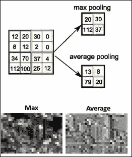

# 第一章：深度学习简介

深度神经网络目前能够为许多问题提供接近人类水平的解决方案，例如图像识别、语音识别、机器翻译、自然语言处理等等。

本章我们将探讨神经网络这一生物启发式架构是如何在这些年中发展的。接下来，我们将回顾一些与深度学习相关的重要概念和术语，为后续章节做准备。最后，我们将通过生成模型理解深度网络的创造性本质背后的直觉。

本章我们将讨论以下主题：

+   深度学习的演变

+   随机梯度下降、ReLU、学习率等

+   卷积网络、递归神经网络和长短期记忆网络（LSTM）

+   判别模型与生成模型的区别

# 深度学习的演变

许多关于神经网络的重要研究发生在 80 年代和 90 年代，但那时计算机速度很慢，数据集非常小。这些研究在现实世界中并没有找到很多应用。因此，在 21 世纪的第一个十年，神经网络完全从机器学习的世界中消失了。直到最近几年，首先是在 2009 年左右的语音识别，然后是在 2012 年左右的计算机视觉领域，神经网络才迎来了一次大的复兴（比如 LeNet、AlexNet 等）。发生了什么变化？

大量数据（大数据）和廉价、高速的 GPU。如今，神经网络无处不在。因此，如果你从事任何与数据、分析或预测相关的工作，深度学习绝对是你需要熟悉的领域。

请参见以下图示：

图 1：深度学习的演变

深度学习是机器学习的一个令人兴奋的分支，它利用大量的数据来教会计算机执行以前只有人类能够完成的任务，比如识别图像中的内容、理解人们在打电话时说的话、将文档翻译成另一种语言，以及帮助机器人探索世界并与之互动。深度学习已成为解决感知问题的核心工具，并且在计算机视觉和语音识别领域处于最前沿。

如今，许多公司已经将深度学习作为其机器学习工具包的核心部分——Facebook、百度、亚马逊、微软和谷歌都在其产品中使用深度学习，因为深度学习在数据量大且问题复杂的场景中具有显著优势。

深度学习通常是我们用来指代由多个层组成的“深度神经网络”的名称。每一层由节点组成。计算发生在节点中，它们将输入数据与一组参数或权重结合起来，这些参数或权重要么放大输入，要么减少输入。然后将这些输入权重的乘积求和，并通过`activation`函数传递，以确定数值应如何通过网络以影响最终预测，如分类等操作。一层由一行节点组成，这些节点在输入通过网络时打开或关闭。第一层的输入成为第二层的输入，依此类推。以下是神经网络可能看起来的图示：

让我们熟悉一些深度神经网络的概念和术语。

## sigmoid 激活

在神经网络中使用的 sigmoid 激活函数具有输出边界*(0, 1)*，*α*是偏移参数，用于设置 sigmoid 评估为 0 的值。

对于梯度下降来说，sigmoid 函数在输入数据*x*保持在限制范围内时通常效果良好。对于*x*的大值，*y*是常数。因此，导数*dy/dx*（梯度）等于*0*，这通常称为**梯度消失**问题。

这是一个问题，因为当梯度为 0 时，将其与损失（实际值-预测值）相乘也会得到 0，最终网络停止学习。

## 修正线性单元（ReLU）

可以通过将一些线性分类器与一些非线性函数组合来构建神经网络。**修正线性单元**（ReLU）在过去几年中变得非常流行。它计算函数*f(x)=max(0,x)*。换句话说，激活在零处被阈值化。不幸的是，ReLU 单元在训练过程中可能会变得脆弱并死亡，因为 ReLU 神经元可能导致权重更新的方式使得神经元永远不会在任何数据点上激活，因此从那时起通过单元的梯度将永远为零。

为了克服这个问题，一个带有小负斜率（大约 0.01）的渗漏`ReLU`函数将在*x<0*时具有非零斜率：

其中*αα*是一个小常数。

图-2：修正线性单元

## 指数线性单元（ELU）

ReLU 激活的均值不为零，因此有时会使网络学习困难。**指数线性单元**（ELU）与 ReLU 激活函数类似，当输入*x*为正时，但对于负值，它是一个被固定值*-1*界定的函数，对于*α=1*（超参数*α*控制 ELU 对负输入饱和的值）。这种行为有助于将神经元的均值激活推向接近零的位置；这有助于学习更能抵抗噪声的表示。

## 随机梯度下降（SGD）

批量梯度下降的扩展比较繁琐，因为当数据集较大时，需要进行大量的计算。作为经验法则，如果计算损失需要 *n* 次浮点运算，那么计算梯度大约需要三倍的运算量。

但在实际操作中，我们希望能够训练大量的数据，因为在真实问题中，我们总是能从使用更多数据中获得更多的收益。而且因为梯度下降是迭代的，并且需要进行许多步更新，这意味着为了在单步中更新参数，必须遍历所有数据样本，然后对数据进行数十次或数百次的迭代。

与其在每一步都计算整个数据集的损失，我们可以计算一个非常小的随机训练数据子集的平均损失。每次选择的样本数在 1 到 1000 之间。这种技术叫做**随机梯度下降**（**SGD**），是深度学习的核心。这是因为 SGD 在数据和模型大小上都能很好地扩展。

SGD 因其有很多超参数需要调整而被认为是黑魔法，例如初始化参数、学习率参数、衰减和动量，你必须正确调整这些参数。

AdaGrad 是 SGD 的一个简单修改，它隐式地实现了动量和学习率衰减。使用 AdaGrad 通常使学习对超参数的敏感度降低。但它往往比精确调优的带动量的 SGD 要稍微差一点。不过，如果你只是想让模型运行起来，它仍然是一个非常好的选择：

图 4a：批量梯度下降和 SGD 中的损失计算

*来源*：[`www.coursera.org/learn/machine-learning/lecture/DoRHJ/stochasticgradient-descent`](https://www.coursera.org/learn/machine-learning/lecture/DoRHJ/stochasticgradient-descent)

图 4b：随机梯度下降和 AdaGrad

从 *图 4a* 中可以看出，批量梯度下降的 `loss`/`优化` 函数已经得到很好的最小化，而 SGD 在每一步随机选择数据子集来计算损失，往往在该点附近震荡。在实际应用中，这并不算太糟，SGD 往往会更快地收敛。

## 学习率调优

神经网络的 `loss` 函数可以与一个表面相关联，其中网络的权重表示可以移动的每个方向。梯度下降提供了当前坡度方向上的步长，而学习率则决定了每一步的长度。学习率帮助网络抛弃旧的信念，接受新的信念。

学习率调优可能非常奇怪。例如，你可能认为使用较高的学习率意味着学习更多，或者学习更快。实际上并非如此。事实上，你常常可以通过降低学习率，快速得到更好的模型。

图-3：学习率

你可能会想查看显示损失随时间变化的学习曲线，看看网络学习的速度有多快。这里较高的学习率一开始学习较快，但随后趋于平稳，而较低的学习率则持续进行并且变得更好。对于任何训练过神经网络的人来说，这都是一个非常熟悉的画面。*永远不要相信你学习的速度有多快*。

## 正则化

防止过拟合的第一种方法是查看验证集上的表现，并在表现不再提升时停止训练。这被称为早停法，它是防止神经网络在训练集上过度优化的一种方法。另一种方法是应用正则化。正则化意味着对网络施加人工约束，这些约束在不增加优化难度的情况下，隐性地减少自由参数的数量。

图 6a：早停法

在瘦身牛仔裤类比中，如图*6b*所示，想象弹力裤。它们同样合身，但由于具有弹性，它们不会让物品更难放入其中。深度学习中的弹力裤有时被称为**L2 正则化**。其思路是向损失函数中添加另一个项，从而惩罚较大的权重。

图 6b：深度学习的弹力裤类比

图 6c：L2 正则化

目前，在深度学习实践中，防止过拟合的广泛使用的方法是将大量数据输入到深度网络中。

## 共享权重与池化

假设一张图像中有一只猫，而猫的位置不重要，因为它仍然是一张包含猫的图片。如果网络必须独立学习左上角和右上角的猫，那就需要做很多工作。但无论对象或图像位于图片的左侧还是右侧，它们在本质上是相同的。这就叫做**平移不变性**。

在网络中实现这一点的方法叫做**权重共享**。当网络知道两个输入可以包含相同类型的信息时，就可以共享权重，并共同训练这些输入的权重。这是一个非常重要的概念。统计不变性是指在时间或空间上平均而言不发生变化的事物，并且它们无处不在。对于图像来说，权重共享的概念将引导我们研究卷积神经网络。对于文本和一般的序列，它将引导我们研究循环神经网络：

图 7a：平移不变性

图 7b：权重共享

为了减少卷积金字塔中特征图的空间范围，可以使用非常小的步幅，并在邻域内进行所有卷积操作，并以某种方式将它们结合起来。这被称为**池化**。

在最大池化中，如*图 7d*所示，在特征图的每个点上，查看该点周围的小邻域，并计算该邻域内所有响应的最大值。使用最大池化有一些优势。首先，它不会增加你的参数数量，因此不会导致过拟合的风险。其次，它通常能产生更准确的模型。然而，由于卷积操作在较低的步幅下运行，模型的计算成本会大幅增加。最大池化提取最重要的特征，而平均池化有时无法提取好的特征，因为它会考虑所有特征并产生一个平均值，而这个平均值可能对物体检测类任务来说并不重要。

图 7c：池化

图 7d：最大池化与平均池化

## 局部感受野

一种简单的编码局部结构的方法是将相邻输入神经元的子矩阵连接成一个属于下一层的单一隐藏神经元。这个单一的隐藏神经元代表一个局部感受野。假设我们考虑 CIFAR-10 图像，其输入特征为[32 x 32 x 3]。如果感受野（或滤波器大小）为 4 x 4，那么卷积层中的每个神经元将有权重连接到输入特征中的[4 x 4 x 3]区域，总共有 4*4*3 = 48 个权重（再加一个偏置参数）。沿深度轴的连接程度必须为 3，因为这是输入特征的深度（或通道数：RGB）。

## 卷积神经网络（ConvNet）

**卷积神经网络**（**ConvNets**）是通过在空间上共享其参数/权重的神经网络。一幅图像可以表示为一个平的煎饼，具有宽度、高度和深度或通道数（对于 RGB 图像，深度是 3，表示红、绿、蓝三个通道，而对于灰度图像，深度是 1）。

现在让我们将一个输出为*K*的小型神经网络滑过图像，且不改变权重。

图 8a：空间上的权重共享

图 8b：具有卷积层的卷积金字塔

在输出端，将绘制一幅不同的图像，具有不同的宽度、不同的高度和不同的深度（从仅有的 RGB 颜色通道到*K*个通道）。这个操作被称为卷积。

卷积神经网络（ConvNet）基本上是一个深度网络，包含多个卷积层，这些卷积层堆叠在一起形成类似金字塔的结构。从前面的图可以看到，网络将图像作为输入（维度为宽度 x 高度 x 深度），然后逐步对其应用卷积操作，以减少空间维度，同时增加深度，这大致等同于其语义复杂度。让我们理解一下卷积神经网络中的一些常见术语。

图像堆栈中的每一层或深度叫做特征图（feature map），并且使用补丁或卷积核（kernels）将三个特征图映射到*K*个特征图。步幅（stride）是指每次移动滤波器时，像素的移动数量。根据填充方式，步幅为 1 时，输出的大小大致与输入相同；步幅为 2 时，输出约为输入的一半。对于有效填充（valid padding），滑动滤波器不会越过图像的边缘，而在同样填充（same-padding）情况下，滤波器会越过边缘，并且用零填充，使得输出图的大小与输入图的大小完全相同：

图 8c：与卷积网络相关的不同术语

# 反卷积或转置卷积

对于需要最终输出分辨率大于输入的计算机视觉应用，反卷积/转置卷积是事实上的标准。这一层被广泛应用于如 GAN、图像超分辨率、从图像估计表面深度、光流估计等热门应用中。

CNN 通常执行下采样，即输出分辨率低于输入，而在反卷积中，层会对图像进行上采样，使其获得与输入图像相同的分辨率。需要注意的是，由于简单的上采样不可避免地会丢失细节，因此一个更好的选择是使用可训练的上采样卷积层，其参数会在训练过程中发生变化。

Tensorflow 方法：`tf.nn.conv2d_transpose(value, filter, output_shape, strides, padding, name)`

## 递归神经网络和 LSTM

**递归神经网络**（**RNN**）的关键思想是共享参数。假设你有一系列事件，在每个时刻你需要根据到目前为止发生的事件做出决策。如果序列是相对稳定的，你可以在每个时刻使用相同的分类器，这样就简化了很多。但由于这是一个序列，你还需要考虑过去——即在某个时刻之前发生的所有事情。

RNN 将拥有一个单一模型，负责总结过去的内容并将这些信息提供给分类器。它基本上形成了一个具有相对简单重复模式的网络，其中分类器的一部分在每个时间步连接到输入，而另一部分叫做递归连接，在每一步将你与过去的内容连接，如下图所示：

图 9a：递归神经网络

图-9b：长短期记忆（LSTM）

**LSTM**代表**长短期记忆**。从概念上讲，循环神经网络由简单的重复单元组成，这些单元以过去的信息、一个新的输入为输入，产生新的预测并与未来连接。其中心通常是一组简单的层，带有一些权重和线性激活。

在 LSTM 中，如*图 9b*所示，每个门的门控值都由输入参数上的一个小型逻辑回归控制。每个门都有自己的一组共享参数。此外，还额外加入了双曲正切函数，以保持输出值在-1 和 1 之间。并且它是可微分的，这意味着它可以很容易地优化参数。所有这些小门帮助模型在需要时保持更长时间的记忆，并在应该时忽略不重要的内容。

## 深度神经网络

深度学习的核心思想是增加更多的层次，使模型更深。这样做有很多好的理由。其中之一就是参数效率。通常，通过增加网络深度而非宽度，你可以用更少的参数获得更好的性能。

另一个原因是，许多你可能感兴趣的自然现象，通常具有层次结构，而深度模型自然能够捕捉这一点。例如，如果你探究一个图像模型，并可视化模型学习到的内容，你通常会发现在最底层学到的是非常简单的东西，比如线条或边缘。

图 10a：深度神经网络

图 10b：网络层捕捉图像的层次结构

卷积神经网络（ConvNet）的一种典型架构是几层交替进行卷积和最大池化，最后顶部接几层全连接层。第一个使用这种架构的著名模型是 1998 年 Yann Lecun 为字符识别设计的 LeNet-5。

现代卷积神经网络，如 AlexNet，在 2012 年著名赢得了 ImageNet 物体识别挑战赛，采用了与之非常相似的架构，并进行了一些调整。另一种值得注意的池化方式是平均池化。与其选择最大值，不如在特定位置周围的像素窗口上取平均值。

## 判别式模型与生成式模型

判别式模型学习条件概率分布*p(y|x)*，这可以解释为*x 给定 y 的概率*。判别式分类器通过观察数据来学习。它对分布的假设较少，但严重依赖数据的质量。分布*p(y|x)*简单地将给定的样本 x 直接分类到标签*y*中。例如，在逻辑回归中，我们所要做的就是学习能够最小化平方损失的权重和偏差。

而生成模型学习的是联合概率分布*p(x,y)*，其中*x*是输入数据，*y*是你希望分类的标签。生成模型可以根据对数据分布的假设，自行生成更多样本。例如，在朴素贝叶斯模型中，我们可以从数据中学习*p(x)*，还可以学习*p(y)*，即先验类别概率，我们也可以使用最大似然估计从数据中学习*p(x|y)*。

一旦我们有了*p(x)*，*p(y)*和*p(x|y)*，那么*p(x, y)*就不难找出来了。现在使用贝叶斯定理，我们可以将*p(y|x)*替换为*(p(x|y)p(y))/p(x)*。由于我们只关心*arg max*，分母可以被去掉，因为对于每个*y*来说它都是相同的：

这是我们在生成模型中使用的方程，*p(x, y) = p(x | y) p(y)*，它明确地建模了每个类别的实际分布。

实际上，判别模型通常在分类任务中优于生成模型，但在创作/生成任务中，生成模型则胜过判别模型。

# 总结

到目前为止，你已经刷新了与深度学习相关的各种概念，并且学习了深度网络如何从监督任务的领域（例如分类图像、语音识别、文本等）演变到通过生成模型展现创作能力。在下一章中，我们将看到深度学习如何在无监督领域中利用**生成对抗网络**（**GANs**）执行精彩的创作任务。
