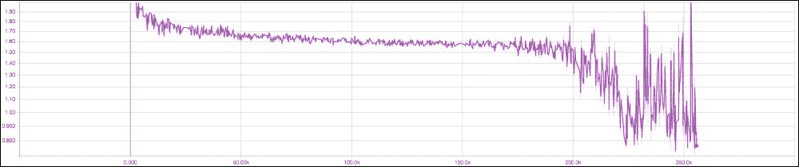

# 第二章：使用 GAN 进行无监督学习

最近，随着生成模型的进步，神经网络不仅能识别图像，还能用来生成音频和逼真的图像。

在这一章中，我们将通过**生成对抗网络**（Generative Adversarial Network），也就是通常所说的**GAN**，深入探讨深度学习的创造性特点。你将通过动手实例学习如何利用神经网络的生成能力，从各种现实世界的数据集（如`MNIST`和`CIFAR`）中生成逼真的图像。同时，你将理解如何通过半监督学习方法克服深度网络在无监督学习中的主要挑战，并将其应用到自己的问题领域。在本章的最后，你将学习一些训练中遇到的障碍，并获得一些实用的 GAN 模型工作技巧和窍门。

本章将覆盖以下主题：

+   什么是 GAN？它的应用、技巧与窍门

+   通过 TensorFlow 解释 GAN 的概念，使用双层神经网络生成图像

+   使用 Keras 生成**深度卷积 GAN**（**DCGAN**）的图像

+   使用 TensorFlow 实现半监督学习

# 用深度神经网络自动化人类任务

在过去的几年里，深度神经网络的爆炸式发展使得它们能够在图像分类、语音识别和自然语言理解方面取得良好的准确性。

当前深度神经网络领域的先进算法能够学习数据集中的高度复杂的模式模型。虽然这些能力令人印象深刻，但人类能够做的远不止图像识别或理解人们在说什么，自动化这些任务通过机器实现似乎仍然遥不可及。

让我们看一些需要人类创造力的应用场景（至少目前是这样）：

+   训练一个人工作者，能够写文章并以非常简单的方式向社区解释数据科学概念，通过学习 Wikipedia 中过去的文章

+   创建一个人工画家，能够通过学习某位著名艺术家的过去作品来像他/她一样作画

你相信机器能够完成这些任务吗？令你惊讶的是，答案是“YES”。

当然，这些任务很难自动化，但 GAN 已经开始让其中一些任务成为可能。

Yann LeCun，深度学习领域的知名人物（Facebook AI 的总监）曾说：

> 生成对抗网络（GANs）及其目前提出的各种变体是过去 10 年中机器学习领域最有趣的想法。

如果你觉得 GAN 这个名字让你感到害怕，别担心！到本书结束时，你将掌握这项技术，并能将其应用于现实问题。

## GAN 的目的

一些生成模型能够从模型分布中生成样本。GAN 是生成模型的一个例子。GAN 主要集中在从分布中生成样本。

你可能会想知道为什么生成模型值得研究，尤其是那些只能生成数据，而不是提供密度函数估计的生成模型。

学习生成模型的一些原因如下：

+   采样（或生成）是直接的

+   训练不涉及最大似然估计

+   对过拟合具有鲁棒性，因为生成器从不接触训练数据

+   GAN 擅长捕捉分布的模式

## 现实世界的类比

让我们考虑现实世界中，一个伪造货币的罪犯和警察之间的关系。让我们从金钱的角度列举罪犯和警察的目标：


图 1a：GAN 的现实世界类比

+   要成为一名成功的伪造货币者，罪犯需要欺骗警察，使警察无法分辨伪造/假币和真币之间的区别。

+   作为正义的典范，警察希望尽可能有效地检测假币。

这可以被建模为博弈论中的极小化最大化博弈。这种现象被称为**对抗过程**。GAN，由 Ian Goodfellow 于 2014 年在*arXiv: 1406.2661*中提出，是对抗过程的一个特例，其中两个神经网络相互竞争。第一个网络生成数据，第二个网络尝试找出真实数据和第一个网络生成的假数据之间的差异。第二个网络将输出一个标量[0, 1]，表示真实数据的概率。

## GAN 的构建模块

在 GAN 中，第一个网络被称为生成器，通常表示为*G(z)*，第二个网络被称为判别器，通常表示为*D(x)*：


图 1b：生成对抗网络

在平衡点上，这是极小化最大化博弈中的最优点，第一个网络将建模真实数据，第二个网络将输出一个概率 0.5，作为第一个网络 = 真实数据的输出：


有时两个网络最终达到平衡，但这并不总是保证的，两个网络可能会继续学习很长时间。下面的图示展示了生成器和判别器损失的学习过程：


图 1c：两个网络的损失，生成器和判别器

### 生成器

生成器网络以随机噪声作为输入，尝试生成一个数据样本。在前面的图中，我们可以看到生成器*G(z)*从概率分布*p(z)*中获取输入`z`，然后生成数据，数据随后被输入到判别器网络*D(x)*。

### 判别器

判别器网络输入可以来自真实数据或生成器生成的数据，并试图预测输入是否为真实数据还是生成数据。它从真实数据分布 `P` *[data]* *(x)* 中获取输入 `x`，然后解决一个二分类问题，输出在 0 到 1 的标量范围内。

GANs 正在获得大量的关注，因为它们能够解决无监督学习中的重要挑战，毕竟可用的无标签数据远远大于有标签数据的数量。另一个它们受欢迎的原因是 GANs 能够生成在生成模型中最真实的图像。虽然这是主观的，但这是大多数从业者的共同观点。


图-1d：GAN 中的向量算术

除此之外，GAN 通常非常具有表现力：它能够在潜在空间中执行算术操作，即 z 向量的空间，并将这些操作转换为特征空间中的相应操作。如 *图 1d* 所示，如果你在潜在空间中取一个戴眼镜的男人的表示，减去 `中性男人` 向量并加上 `中性女人` 向量，你会在特征空间中得到一个戴眼镜的女人的图像。这真是令人惊叹。

# GAN 实现

根据 GAN 的定义，我们基本上需要两个网络，无论是像 ConvNet 这样的复杂网络，还是简单的两层神经网络。为了实现目的，让我们使用简单的两层神经网络和 `MNIST` 数据集来进行 TensorFlow 的实现。`MNIST` 是一个手写数字数据集，每个图像是 28x28 像素的灰度图：

```py
# Random noise setting for Generator
Z = tf.placeholder(tf.float32, shape=[None, 100], name='Z')

#Generator parameter settings
G_W1 = tf.Variable(xavier_init([100, 128]), name='G_W1')
G_b1 = tf.Variable(tf.zeros(shape=[128]), name='G_b1')
G_W2 = tf.Variable(xavier_init([128, 784]), name='G_W2')
G_b2 = tf.Variable(tf.zeros(shape=[784]), name='G_b2')
theta_G = [G_W1, G_W2, G_b1, G_b2]

# Generator Network
def generator(z):
    G_h1 = tf.nn.relu(tf.matmul(z, G_W1) + G_b1)
    G_log_prob = tf.matmul(G_h1, G_W2) + G_b2
    G_prob = tf.nn.sigmoid(G_log_prob)

    return G_prob
```

`generator(z)` 接受一个来自随机分布的 100 维向量（在这种情况下我们使用均匀分布）作为输入，并返回一个 786 维的向量，这就是一个 `MNIST` 图像（28x28）。这里的 `z` 是 *G(z)* 的先验。通过这种方式，它学习了先验空间到 `p` [*数据*]（真实数据分布）之间的映射关系：

```py
#Input Image MNIST setting for Discriminator [28x28=784]
X = tf.placeholder(tf.float32, shape=[None, 784], name='X')

#Discriminator parameter settings
D_W1 = tf.Variable(xavier_init([784, 128]), name='D_W1')
D_b1 = tf.Variable(tf.zeros(shape=[128]), name='D_b1')
D_W2 = tf.Variable(xavier_init([128, 1]), name='D_W2')
D_b2 = tf.Variable(tf.zeros(shape=[1]), name='D_b2')
theta_D = [D_W1, D_W2, D_b1, D_b2]

# Discriminator Network
def discriminator(x):
    D_h1 = tf.nn.relu(tf.matmul(x, D_W1) + D_b1)
    D_logit = tf.matmul(D_h1, D_W2) + D_b2
    D_prob = tf.nn.sigmoid(D_logit)

return D_prob, D_logit
```

`discriminator(x)` 将 `MNIST` 图像作为输入并返回一个标量，表示真实图像的概率。现在，让我们讨论一个训练 GAN 的算法。以下是论文 *arXiv: 1406.2661, 2014* 中的训练算法伪代码：


图 1e：GAN 训练算法伪代码

```py
G_sample = generator(Z)

D_real, D_logit_real = discriminator(X)
D_fake, D_logit_fake = discriminator(G_sample)

# Loss functions according the GAN original paper
D_loss = -tf.reduce_mean(tf.log(D_real) + tf.log(1\. - D_fake))
G_loss = -tf.reduce_mean(tf.log(D_fake))
```

TensorFlow 优化器只能进行最小化操作，因此为了最大化 `loss` 函数，我们使用负号来表示损失函数，如前所述。此外，根据论文的伪算法，最好最大化 `tf.reduce_mean(tf.log(D_fake))`，而不是最小化 `tf.reduce_mean(1 - tf.log(D_fake))`。然后，我们逐个训练这些网络，并使用前述的 `loss` 函数进行训练：

```py
# Only update D(X)'s parameters, so var_list = theta_D
D_solver = tf.train.AdamOptimizer().minimize(D_loss, var_list=theta_D)
# Only update G(X)'s parameters, so var_list = theta_G
G_solver = tf.train.AdamOptimizer().minimize(G_loss, var_list=theta_G)

def sample_Z(m, n):
    '''Uniform prior for G(Z)'''
    return np.random.uniform(-1., 1., size=[m, n])

for it in range(1000000):
    X_mb, _ = mnist.train.next_batch(mb_size)

    _, D_loss_curr = sess.run([D_solver, D_loss], feed_dict={X: X_mb, Z: sample_Z(mb_size, Z_dim)})
    _, G_loss_curr = sess.run([G_solver, G_loss], feed_dict={Z: sample_Z(mb_size, Z_dim)})
```

之后，我们从随机噪声开始，随着训练的进行，`G(Z)` 开始向 `p` [*数据*] 移动。这一点可以通过 `G(Z)` 生成的样本与原始 MNIST 图像的相似度来证明。

以下展示了经过 60,000 次迭代后生成的一些输出：


图 1f：GAN 生成输出图像的实现

## GAN 的应用

GAN 在多个领域引起了广泛的关注。近年来，GAN 的一些令人兴奋的应用如下所示：

+   使用 CycleGAN 将一种图像转换为另一种图像（例如从马到斑马），并通过条件 GAN 进行图像编辑。具体内容将在第三章，*跨领域转移图像风格*中介绍。

+   使用 StackGAN 从文本句子自动合成逼真的图像，并使用**Discovery GAN**（**DiscoGAN**）将一种风格转移到另一个领域。具体内容将在第四章，*从文本生成逼真的图像*中介绍。

+   使用预训练模型通过 SRGAN 提高图像质量并生成高分辨率图像。具体内容将在第五章，*使用各种生成模型生成图像*中介绍。

+   **根据属性生成逼真图像**：假设一个小偷闯入你的公寓，但你没有他的照片。现在，警察局的系统可以根据你提供的描述生成小偷的逼真图像，并在数据库中进行搜索。更多信息请参考*arXiv: 1605.05396, 2016*。

+   预测视频中的下一帧或动态视频生成：（[`carlvondrick.com/tinyvideo/`](http://carlvondrick.com/tinyvideo/)）。

## 使用 Keras 实现 DCGAN 生成图像

论文中介绍了**深度卷积生成对抗网络**（**DCGAN**）：*无监督表示学习与深度卷积生成对抗网络*，由*A. Radford, L. Metz, 和 S. Chintala，arXiv:1511.06434, 2015*。

生成器使用一个 100 维的均匀分布空间，`Z`，然后通过一系列卷积操作将其映射到一个更小的空间。以下图示为例：


图 2：生成器的 DCGAN 架构

来源：arXiv, 1511.06434, 2015

DCGAN 通过以下架构约束来稳定网络：

+   在鉴别器中用步长卷积替换所有池化层，在生成器中用分数步长卷积替换

+   在生成器和鉴别器中都使用批量归一化（batchnorm）

+   删除深层架构中的全连接隐藏层，只在末尾使用平均池化

+   在生成器的所有层中使用 ReLU 激活函数，输出层使用`tanh`

+   在鉴别器的所有层中使用 leaky ReLU 激活函数

在 Keras 中实现的 DCGAN 生成器可以通过以下代码描述，代码位于：[`github.com/jacobgil/keras-dcgan`](https://github.com/jacobgil/keras-dcgan)。

使用以下命令启动训练/生成过程：

```py
python dcgan.py --mode train --batch_size <batch_size>
python dcgan.py --mode generate --batch_size <batch_size> --nice

```


请注意，先前打印的批次数是基于输入图像形状/批次大小（提供的）计算的。

现在让我们来看看代码。生成器可以通过以下方式描述：

```py
def generator_model():
    model = Sequential()
    model.add(Dense(input_dim=100, output_dim=1024))
    model.add(Activation('tanh'))
    model.add(Dense(128`7`7))
    model.add(BatchNormalization())
    model.add(Activation('tanh'))
    model.add(Reshape((7, 7, 128), input_shape=(128`7`7,)))
    model.add(UpSampling2D(size=(2, 2)))
    model.add(Conv2D(64, (5, 5), padding='same'))
    model.add(Activation('tanh'))
    model.add(UpSampling2D(size=(2, 2)))
    model.add(Conv2D(1, (5, 5), padding='same'))
    model.add(Activation('tanh'))
    return model
```

生成器的第一个密集层接受一个 100 维向量作为输入，并使用 `tanh` 激活函数生成 1,024 维的输出。

网络中的下一个稠密层通过批量归一化生成 128 x 7 x 7 的输出数据（参考*S. Ioffe*和*C.Szegedy*的文章*《Batch Normalization Accelerating Deep Network Training by Reducing Internal Covariate Shift》*，*arXiv: 1502.03167*，2014），这种技术通常通过将输入归一化为零均值和单位方差来帮助稳定学习。经验表明，批量归一化在许多情况下可以加快训练速度，减少糟糕初始化的问题，并且通常产生更精确的结果。还有一个 `Reshape()` 模块生成了 128 x 7 x 7（128 个通道，7 宽，7 高）的数据，`dim_ordering` 设置为 `tf`，并且 `UpSampling()` 模块将每个数据重复成一个 2 x 2 的方块。随后是一个卷积层，使用 5 x 5 的卷积核生成 64 个滤波器，激活函数为 `tanh`，具有相同填充，然后是一个新的 `UpSampling()` 和一个最终的卷积层，使用一个滤波器，大小为 5 x 5，激活函数为 `tanh`。请注意，在 ConvNet 中没有池化操作。

以下代码描述了判别器：

```py
def discriminator_model():
    model = Sequential()
    model.add(Conv2D(64, (5, 5), padding='same',input_shape=(28, 28, 1)))
    model.add(Activation('tanh'))
    model.add(MaxPooling2D(pool_size=(2, 2)))
    model.add(Conv2D(128, (5, 5)))
    model.add(Activation('tanh'))
    model.add(MaxPooling2D(pool_size=(2, 2)))
    model.add(Flatten())
    model.add(Dense(1024))
    model.add(Activation('tanh'))
    model.add(Dense(1))
    model.add(Activation('sigmoid'))
    return model
```

判别器使用形状为(`1, 28, 28`)的标准 MNIST 图像，并应用了包含 64 个 5 x 5 大小滤波器和 `tanh` 激活函数的卷积。接着是一个大小为 2 x 2 的最大池化操作，然后是进一步的卷积最大池化操作。

最后两个阶段是密集的，最后一个是关于伪造预测的，仅包含一个使用 `sigmoid` 激活函数的神经元。对于给定的周期数，生成器和判别器使用 `binary_crossentropy` 作为 `loss` 函数进行训练。在每个周期中，生成器预测一个数字（例如，创建伪造的 MNIST 图像），判别器试图在将预测与真实的 MNIST 图像混合后进行学习。经过几个周期，生成器自动学习伪造这组手写数字：


图-3：深度卷积 GAN 生成的手写数字输出

请注意，训练 GAN 可能非常困难，因为需要在两个参与者之间找到平衡，因此，实践者使用的一些有价值的技术和提示将在本章的最后部分给出。

## 使用 TensorFlow 实现 SSGAN

**半监督学习生成对抗网络**（**SSGAN**）的基本直觉是利用生成器生成的样本，通过提高泛化能力，增强判别器在图像分类任务中的表现。关键思想是将其中一个网络训练为图像分类器和判别器（用于区分生成的图像与真实图像）。

对于一个具有`n`类的数据集，经过双重训练（判别器/分类器）的网络将图像作为输入，真实图像分类为前`n`类，生成图像分类为*n+1*类，如下图所示：


来源：[`github.com/gitlimlab/SSGAN-Tensorflow/blob/master/figure/ssgan.png`](https://github.com/gitlimlab/SSGAN-Tensorflow/blob/master/figure/ssgan.png)

这个多任务学习框架由两个损失组成，第一个是监督损失：


其次是判别器的 GAN 损失：


在训练阶段，这两个损失函数将一起最小化。

### 环境设置

执行以下步骤以在 Cifar-10 数据集上运行 SSGAN：

1.  克隆`git`仓库：[`github.com/gitlimlab/SSGAN-Tensorflow`](https://github.com/gitlimlab/SSGAN-Tensorflow)：

1.  更改目录：

    ```py
    cd SSGAN-Tensorflow/

    ```

1.  下载`CIFAR-10`数据集：

1.  训练模型：

1.  测试或评估模型：

    ```py
    python evaler.py --dataset CIFAR10 --checkpoint ckpt_dir

    ```

现在让我们深入代码。生成器从均匀分布中获取随机噪声：

```py
z = tf.random_uniform([self.batch_size, n_z], minval=-1, maxval=1, dtype=tf.float32)
```

然后，生成器模型使用`reshape`方法将输入噪声展平为一维向量。接着，它对输入噪声应用三层反卷积，激活函数为`ReLU`，然后再应用一次反卷积，激活函数为`tanh`，以生成输出图像，尺寸为[`h`=高度, `w`=宽度, `c`]，其中`c`为通道数（灰度图像：1，彩色图像：3）：

```py
# Generator model function
        def G(z, scope='Generator'):
            with tf.variable_scope(scope) as scope:
                print ('\033[93m'+scope.name+'\033[0m')
                z = tf.reshape(z, [self.batch_size, 1, 1, -1])
                g_1 = deconv2d(z, deconv_info[0], is_train, name='g_1_deconv') 
                print (scope.name, g_1)
                g_2 = deconv2d(g_1, deconv_info[1], is_train, name='g_2_deconv')
                print (scope.name, g_2)
                g_3 = deconv2d(g_2, deconv_info[2], is_train, name='g_3_deconv')
                print (scope.name, g_3)
                g_4 = deconv2d(g_3, deconv_info[3], is_train, name='g_4_deconv', activation_fn='tanh')
                print (scope.name, g_4)
                output = g_4
                assert output.get_shape().as_list() == self.image.get_shape().as_list(), output.get_shape().as_list()
            return output

# Deconvolution method
def deconv2d(input, deconv_info, is_train, name="deconv2d", stddev=0.02,activation_fn='relu'):
    with tf.variable_scope(name):
        output_shape = deconv_info[0]
        k = deconv_info[1]
        s = deconv_info[2]
        deconv = layers.conv2d_transpose(input,
            num_outputs=output_shape,
            weights_initializer=tf.truncated_normal_initializer(stddev=stddev),
            biases_initializer=tf.zeros_initializer(),
            kernel_size=[k, k], stride=[s, s], padding='VALID')
        if activation_fn == 'relu':
            deconv = tf.nn.relu(deconv)
            bn = tf.contrib.layers.batch_norm(deconv, center=True, scale=True, 
                decay=0.9, is_training=is_train, updates_collections=None)
        elif activation_fn == 'tanh':
            deconv = tf.nn.tanh(deconv)
        else:
            raise ValueError('Invalid activation function.')
        return deconv
```

判别器将图像作为输入，并尝试输出`n+1`类标签。它应用一些具有泄漏 ReLU 和批归一化的卷积层，接着对输入图像进行 dropout，最后使用`softmax`函数输出类`label`：

```py
# Discriminator model function
        def D(img, scope='Discriminator', reuse=True):
            with tf.variable_scope(scope, reuse=reuse) as scope:
                if not reuse: print ('\033[93m'+scope.name+'\033[0m')
                d_1 = conv2d(img, conv_info[0], is_train, name='d_1_conv')
                d_1 = slim.dropout(d_1, keep_prob=0.5, is_training=is_train, scope='d_1_conv/')
                if not reuse: print (scope.name, d_1)
                d_2 = conv2d(d_1, conv_info[1], is_train, name='d_2_conv')
                d_2 = slim.dropout(d_2, keep_prob=0.5, is_training=is_train, scope='d_2_conv/')
                if not reuse: print (scope.name, d_2)
                d_3 = conv2d(d_2, conv_info[2], is_train, name='d_3_conv')
                d_3 = slim.dropout(d_3, keep_prob=0.5, is_training=is_train, scope='d_3_conv/')
                if not reuse: print (scope.name, d_3)
                d_4 = slim.fully_connected(
                    tf.reshape(d_3, [self.batch_size, -1]), n+1, scope='d_4_fc', activation_fn=None)
                if not reuse: print (scope.name, d_4)
                output = d_4
                assert output.get_shape().as_list() == [self.batch_size, n+1]
                return tf.nn.softmax(output), output

# Convolution method with dropout
def conv2d(input, output_shape, is_train, k_h=5, k_w=5, stddev=0.02, name="conv2d"):
    with tf.variable_scope(name):
        w = tf.get_variable('w', [k_h, k_w, input.get_shape()[-1], output_shape],
                initializer=tf.truncated_normal_initializer(stddev=stddev))
        conv = tf.nn.conv2d(input, w, strides=[1, 2, 2, 1], padding='SAME')

        biases = tf.get_variable('biases', [output_shape], initializer=tf.constant_initializer(0.0))
        conv = lrelu(tf.reshape(tf.nn.bias_add(conv, biases), conv.get_shape()))
        bn = tf.contrib.layers.batch_norm(conv, center=True, scale=True, 
            decay=0.9, is_training=is_train, updates_collections=None)
    return bn

# Leaky Relu method
def lrelu(x, leak=0.2, name="lrelu"):
   with tf.variable_scope(name):
   f1 = 0.5 * (1 + leak)
   f2 = 0.5 * (1 - leak)
return f1 * x + f2 * abs(x)
```

判别器网络有两个`loss`函数，一个（`s_loss`）用于使用 Huber 损失对 CIFAR-10 图像中的真实数据进行监督分类（Huber 损失比平方误差损失更能抵抗异常值），另一个（`d_loss`）用于使用`softmax`函数和交叉熵对生成的图像进行真/假分类，以标量形式表示：

```py
# Discriminator/classifier loss
s_loss = tf.reduce_mean(huber_loss(label, d_real[:, :-1]))
```


图：4a：监督判别器的损失

```py
d_loss_real = tf.nn.softmax_cross_entropy_with_logits(logits=d_real_logits, labels=real_label)
 d_loss_fake = tf.nn.softmax_cross_entropy_with_logits(logits=d_fake_logits, labels=fake_label)
d_loss = tf.reduce_mean(d_loss_real + d_loss_fake)
```



图：4b：总判别器损失（真实 + 假损失）

```py
# Huber loss
def huber_loss(labels, predictions, delta=1.0):
    residual = tf.abs(predictions - labels)
    condition = tf.less(residual, delta)
    small_res = 0.5 * tf.square(residual)
    large_res = delta * residual - 0.5 * tf.square(delta)
    return tf.where(condition, small_res, large_res)

# Generator loss
g_loss = tf.reduce_mean(tf.log(d_fake[:, -1]))

g_loss += tf.reduce_mean(huber_loss(real_image, fake_image)) * self.recon_weight
```

### 注释

注：权重退火作为辅助损失帮助生成器摆脱初始的局部最小值。


图：4c：生成器损失

生成器和判别器网络的`loss`函数使用`AdamOptimizer`进行优化，并且应用梯度裁剪（`clip_gradients`）来稳定训练过程：

```py
# Optimizer for discriminator
self.d_optimizer = tf.contrib.layers.optimize_loss(
loss=self.model.d_loss,
global_step=self.global_step,
learning_rate=self.learning_rate*0.5,
optimizer=tf.train.AdamOptimizer(beta1=0.5),
clip_gradients=20.0,
name='d_optimize_loss',
variables=d_var
)

# Optimizer for generator
self.g_optimizer = tf.contrib.layers.optimize_loss(
loss=self.model.g_loss,
global_step=self.global_step,
learning_rate=self.learning_rate,
optimizer=tf.train.AdamOptimizer(beta1=0.5),
clip_gradients=20.0,
name='g_optimize_loss',
variables=g_var
)
```

最终，监督损失（`s_loss`）和生成对抗损失（即判别器损失（`d_loss`）和生成器损失（`g_loss`）的组合）一起训练，以最小化总损失：

```py
for s in xrange(max_steps):
             step, accuracy, summary, d_loss, g_loss, s_loss, step_time, prediction_train, gt_train, g_img = \
               self.run_single_step(self.batch_train, step=s, is_train=True)
```

经过 150 个 epochs 后生成的样本输出如下：


# GAN 模型的挑战

训练 GAN 基本上是两个网络，生成器*G(z)*和判别器*D(z)*，相互竞争，试图达到最优解，更具体地说，是达到纳什均衡。根据维基百科（在经济学和博弈论中），纳什均衡的定义是：一个系统的稳定状态，涉及不同参与者之间的相互作用，在这种状态下，如果其他参与者的策略保持不变，则没有参与者能够通过单方面改变策略来获益。

## 设置失败和坏的初始化

如果你仔细想一想，这正是 GAN 试图做的事情；生成器和判别器达到一种状态，即在另一个保持不变的情况下，它们无法进一步改进。现在，梯度下降的设置是沿着一个方向迈出一步，从而减少定义在问题上的损失度量——但是我们并不强迫网络在 GAN 中达到纳什均衡，毕竟 GAN 具有非凸目标且包含连续的高维参数。网络试图通过连续的步骤来最小化一个非凸目标，结果进入了一个振荡过程，而不是减少潜在的真实目标。

在大多数情况下，当判别器的损失接近零时，你可以立刻发现模型存在问题。但最大的问题是弄清楚问题出在哪里。

训练 GAN 时，另一个常见的做法是故意让其中一个网络停滞或学习得更慢，以便另一个网络能够赶上。在大多数情况下，落后的通常是生成器，因此我们通常让判别器等待。这在一定程度上可能是可以接受的，但请记住，为了让生成器变得更好，它需要一个好的判别器，反之亦然。理想情况下，系统希望两个网络都以一种互相促进的速度学习，让两者随时间不断进步。判别器的理想最小损失接近 0.5——这意味着从判别器的角度看，生成的图像与真实图像无法区分。

## 模式崩溃

训练生成对抗网络时的主要失败模式之一叫做模式崩溃，或者有时称为 Helvetica 情境。基本思想是生成器可能会不小心开始生成完全相同的多个副本，原因与博弈论的设定有关。我们可以把训练生成对抗网络的方式看作是先相对于判别器进行最大化，然后再相对于生成器进行最小化。如果我们在开始最小化生成器之前，完全相对于判别器进行最大化，一切都会顺利进行。但如果我们反过来，先最小化生成器，再最大化判别器，一切就会崩溃。原因是，如果我们保持判别器不变，它会将空间中的单一区域描述为最可能是真实的点，而不是虚假的点，然后生成器会选择将所有噪声输入值映射到那个最可能是真实的点。

## 计数问题

GAN 有时会出现远视现象，无法区分某个位置应出现的特定物体数量。如我们所见，它给头部生成了比原本更多的眼睛：


来源：NIPS 2016- arXiv: 1701.00160, 2017

## 透视问题

GAN 有时无法区分前后视角，因此在从 3D 物体生成 2D 表示时，未能很好地适应，如下所示：


来源：NIPS 2016- *arXiv: 1701.00160, 2017*

## 全球结构问题

GAN（生成对抗网络）无法理解整体结构，类似于透视问题。例如，在左下方的图像中，它生成了一只四条腿的牛，也就是一只同时用后腿站立并且四条腿都着地的牛。这显然是不现实的，现实生活中是无法做到的！


来源：NIPS 2016- *arXiv: 1701* *.00160, 2017*

# 改进的 GAN 训练方法和技巧

为了克服 GAN 模型的困难，深度学习实践者根据问题的性质采取各种方法。一些改进技巧将在以下部分中提到。

## 特征匹配

GAN 的不稳定性通过为生成器指定一个新的目标来解决，该目标防止生成器在当前判别器上过度训练。

这个想法是使用判别器中间层的特征来匹配真实和虚假图像，并将其作为监督信号来训练生成器。

具体来说，我们训练生成器生成与真实数据统计特征匹配的数据，并匹配判别器中间层特征的期望值。通过训练判别器，我们要求它找到最能区分真实数据与当前模型生成数据的特征。

## 小批量

模式崩塌问题可以通过向判别器添加一些额外的特征来解决，其中判别器实际上一次查看一个完整的“样本小批量”，而不是只查看单个样本。如果这些特征测量的是与其他样本的距离，那么判别器就能检测到生成器是否开始以这种方式崩塌，而不是鼓励生成器的每个样本都向最可能的单一点逼近。小批量整体必须看起来真实，并且不同样本之间要有适当的间隔。

## 历史平均

历史平均的思想是添加一个惩罚项，惩罚那些远离其历史平均值的权重。例如，损失函数是：

```py
distance (current parameters, average of parameters over the last t batches)
```

## 单边标签平滑

通常会使用标签 0（图像为真实）和 1（图像为虚假）。然而，使用一些更平滑的标签（0.1 和 0.9）似乎能使网络更能抵抗对抗样本。

## 输入归一化

大多数情况下，将图像归一化到-1 和 1 之间，并使用`tanh`作为生成器输出的最后一层是一个不错的选择。

## 批量归一化

这个想法是为真实和虚假数据构建不同的小批量，即每个小批量只包含所有真实图像或所有生成图像。但当批量归一化不可用时，可以使用实例归一化（对于每个样本，减去均值并除以标准差）。

## 避免使用 ReLU、MaxPool 时的稀疏梯度

如果梯度稀疏，GAN 的稳定性会受到影响。Leaky ReLU 对于生成器和判别器都是一个不错的选择。

在下采样时，使用平均池化和`Conv2d + stride`的组合，而在上采样时，使用`PixelShuffle`、`ConvTranspose2d + stride`的组合：

```py
PixelShuffle- arXiv: 1609.05158, 2016 
```

## 优化器与噪声

使用 ADAM 优化器用于生成器，使用 SGD 用于判别器。同时，在生成器的多个层中引入 dropout 形式的噪声。

## 不要仅通过统计量来平衡损失

相反，采用有原则的方法，而非直觉：

```py
while lossD > A:
  train D
while lossG > B:
  train G
```

### 注意

注意：尽管有这些技巧和训练增强步骤，生成对抗模型在人工智能和深度学习领域仍然相对较新，因此像任何其他快速发展的领域一样，它也需要大量的改进。

# 摘要

到目前为止，你已经了解了深度学习是如何通过 GAN 的概念进入无监督学习领域的。你已经使用`MNIST`、`CIFAR`数据集生成了一些逼真的图像，比如手写数字、飞机、汽车、鸟类等。此外，你还了解了与生成对抗网络相关的各种挑战，并学会了如何通过实际的调整技巧克服这些挑战。

在接下来的几章中，我们将继续探索基于 GAN 的不同架构，利用真实数据集执行一些令人惊叹的任务。
