# 第三章：在各个领域之间传递图像风格

生成对抗网络是深度学习中最迅速发展的分支之一，适用于各种创意应用（如图像编辑或绘画、风格转移、物体变换、照片增强等）。

在本章中，您将首先学习根据特定条件或特征生成或编辑图像的技术。然后，您将通过边界平衡方法稳定 GAN 训练，以克服模式崩溃问题，并应用收敛度量度量标准。最后，您将使用 Cycle Consistent 生成网络在各个领域进行图像到图像的翻译（例如将苹果变成橙子或马变成斑马）。

本章节将涵盖以下主题：

+   什么是 CGAN？其概念和架构

+   使用 CGAN 从 Fashion-MNIST 数据生成时尚衣橱

+   使用边界平衡 GAN 与 Wasserstein 距离稳定 GAN 训练

+   使用 CycleGAN 在不同领域之间传递图像风格

+   使用 Tensorflow 从苹果生成橙子

+   自动将马的图像转换为斑马

# 架起监督学习和无监督学习之间的桥梁

人类通过观察和体验物理世界来学习，我们的大脑非常擅长在不进行显式计算的情况下进行预测以得出正确答案。监督学习是关于预测与数据相关联的标签，其目标是泛化到新的未见数据。在无监督学习中，数据没有标签，并且其目标通常不是对新数据进行任何形式的泛化预测。

在现实世界中，标记数据通常稀缺且昂贵。生成对抗网络采用监督学习方法进行无监督学习，通过生成看起来伪造的数据，试图确定生成的样本是虚假还是真实的。这部分（分类器进行分类）是一个监督组件。但 GAN 的实际目标是理解数据的外观（即其分布或密度估计），并能够生成其学习到的新样本。

# 条件 GAN 简介

生成对抗网络（GAN）同时训练两个网络——生成器学习从未知分布或噪声生成伪样本，鉴别器学习区分虚假和真实样本。

在条件 GAN（CGAN）中，生成器学习根据特定条件或特征（例如与图像相关联的标签或更详细的标签）生成伪样本，而不是从未知噪声分布生成通用样本。现在，为了向生成器和鉴别器添加这样的条件，我们将简单地向两个网络提供一些向量*y*。因此，鉴别器*D(X,y)*和生成器*G(z,y)*都联合条件于两个变量*z*或*X*和*y*。

现在，CGAN 的目标函数是：

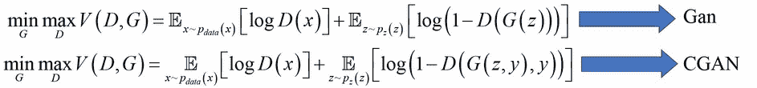

GAN 损失和 CGAN 损失之间的区别在于判别器和生成器函数中额外的参数*y*。下面的 CGAN 架构现在有一个额外的输入层（以条件向量**C**的形式），该层同时输入到判别器网络和生成器网络中。

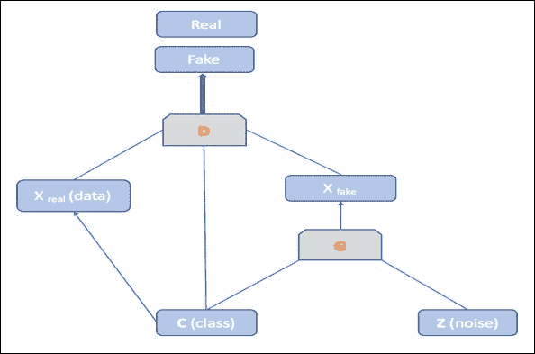

## 使用 CGAN 生成时尚衣橱

在这个例子中，我们将实现条件 GAN，使用`Fashion-MNIST`数据集（[`github.com/zalandoresearch/fashion-mnist`](https://github.com/zalandoresearch/fashion-mnist)）来生成时尚衣橱。`Fashion-MNIST`数据集类似于原始的`MNIST`数据集，但使用了一组新的灰度图像和标签。

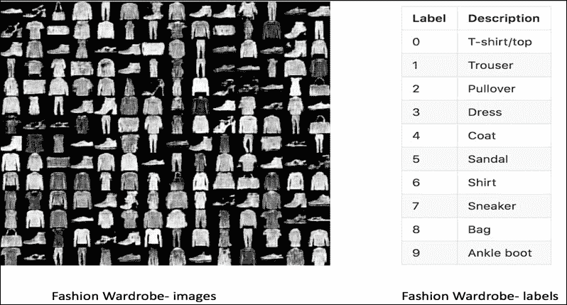

让我们进入代码，了解使用简单的神经网络架构来实现 CGAN 的工作原理，其中生成器和判别器都采用这种架构。

首先，我们将定义一个新的输入变量来保存我们的条件：

```py
Y = tf.placeholder(tf.float32, shape=(None, num_labels))
```

接下来，我们将新的变量`y`加入到判别器`D(X)`和生成器`G(z)`中。现在，判别器`(x,y)`和生成器`(z,y)`与原始的 GAN 不同：

```py
Dhidden = 256  # hidden units of Discriminator's network
Ghidden = 512  # hidden units of Generator's network
K = 8          # maxout units of Discriminator

# Discriminator Network

def discriminator(x, y):
    u = tf.reshape(tf.matmul(x, DW1x) + tf.matmul(y, DW1y) + Db1, [-1, K, Dhidden])
    Dh1 = tf.nn.dropout(tf.reduce_max(u, reduction_indices=[1]), keep_prob)
    return tf.nn.sigmoid(tf.matmul(Dh1, DW2) + Db2)

# Generator Network

def generator(z,y):
    Gh1 = tf.nn.relu(tf.matmul(Z, GW1z) + tf.matmul(Y, GW1y) + Gb1)
    G = tf.nn.sigmoid(tf.matmul(Gh1, GW2) + Gb2)
    return G
```

接下来，我们将使用我们的新网络，并定义一个`loss`函数：

```py
G_sample = generator(Z, Y)
DG = discriminator(G_sample, Y)

Dloss = -tf.reduce_mean(tf.log(discriminator(X, Y)) + tf.log(1 - DG))
Gloss = tf.reduce_mean(tf.log(1 - DG) - tf.log(DG + 1e-9)) 
```

在训练过程中，我们将`y`的值同时输入到生成器网络和判别器网络：

```py
X_mb, y_mb = mnist.train.next_batch(mini_batch_size)

Z_sample = sample_Z(mini_batch_size, noise_dim)

_, D_loss_curr = sess.run([Doptimizer, Dloss], feed_dict={X: X_mb, Z: Z_sample, Y:y_mb, keep_prob:0.5})

_, G_loss_curr = sess.run([Goptimizer, Gloss], feed_dict={Z: Z_sample, Y:y_mb, keep_prob:1.0})
```

最后，我们根据特定条件生成新的数据样本。在这个例子中，我们使用图像标签作为条件，并将标签设置为`7`，即生成`Sneaker`的图像。条件变量`y_sample`是一个集合，包含在第七索引位置值为`1`的独热编码向量：

```py
nsamples=6

      Z_sample = sample_Z(nsamples, noise_dim)
        y_sample = np.zeros(shape=[nsamples, num_labels])
        y_sample[:, 7] = 1 # generating image based on label

        samples = sess.run(G_sample, feed_dict={Z: Z_sample, Y:y_sample})
```

现在，让我们执行以下步骤，根据类别标签条件生成衣橱图像。首先，下载`Fashion-MNIST`数据集，并通过运行`download.py`脚本将其保存到`data`/`fashion`目录下：

```py
python download.py

```

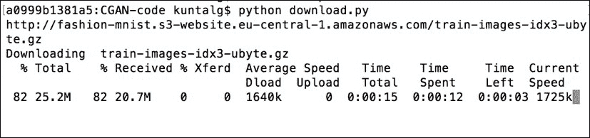

接下来，使用以下命令训练 CGAN 模型，这将生成每 1000 次迭代后的示例图像，并保存在`output`目录下：

```py
python simple-cgan.py

```

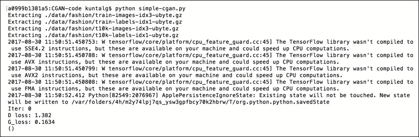

以下是使用条件标签设置为**4（外套）**在**80k**次迭代后和**7（运动鞋）**在**60k**次迭代后运行 CGAN 的输出结果：

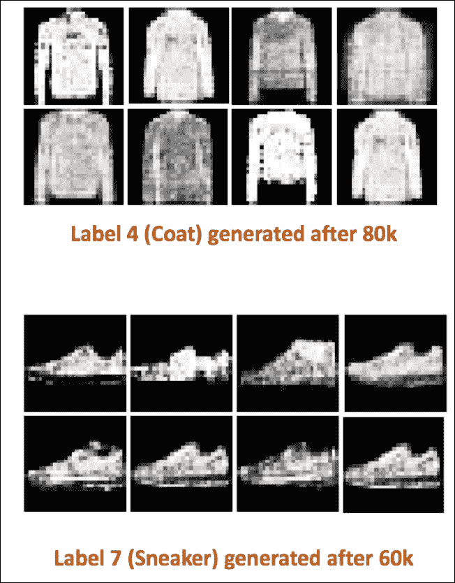

## 使用边界平衡 GAN 稳定训练

GAN 在机器学习研究人员中迅速流行。GAN 的研究可以分为两类：一类是将 GAN 应用于具有挑战性的问题，另一类是尝试稳定训练。稳定 GAN 训练至关重要，因为原始的 GAN 架构存在许多缺点和不足：

+   **模式崩塌**：生成器崩塌到非常窄的分布中，生成的样本缺乏多样性。当然，这个问题违反了 GAN 的精神。

+   **收敛度量评估**：没有一个明确的度量可以告诉我们判别器损失和生成器损失之间的收敛情况。

改进的**Wasserstein GAN**（*arXiv: 1704.00028,2017*）是一种新提出的 GAN 算法，通过最小化 Wasserstein 距离（或地球搬运距离）来解决前述问题，通过为网络提供简单的梯度（如果输出被认为是真实的，则为+1；如果输出被认为是假的，则为-1）。

**BEGAN**（*arXiv: 1703.10717,2017*）的主要思想是使用**自动编码器**作为判别器，提出一种新的`损失`函数，其中真实损失是由真实图像和生成图像的重建损失之间的 Wasserstein 距离（以解决模式崩塌问题）得出的：

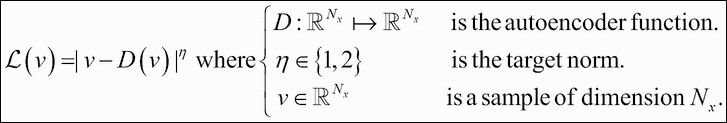

通过使用加权参数 *k* 添加超参数 gamma，使用户能够控制期望的多样性：

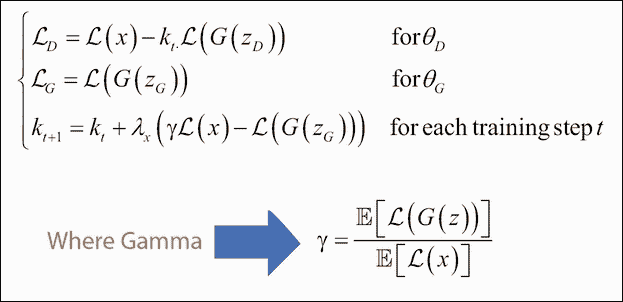

与大多数 GAN 不同，BEGAN 允许在每个时间步骤同时对这两个网络进行对抗性训练：

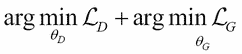

最终，它允许对收敛的近似度量 *M* 进行评估，以理解整个网络的性能：

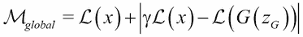

# BEGAN 的训练过程

BEGAN 训练过程中涉及的步骤如下：

1.  判别器（自动编码器）更新其权重，以最小化真实图像的重建损失，从而开始更好地重建真实图像。

1.  与此同时，判别器开始最大化生成图像的重建损失。

1.  生成器以对抗性方式工作，最小化生成图像的重建损失。

## BEGAN 架构

如下图所示，判别器是一个卷积网络，具有深度的编码器和解码器。解码器有多个 3x3 卷积层，后跟**指数线性单元**（**ELU**）。下采样通过步幅为 2 的卷积完成。自动编码器的嵌入状态被映射到全连接层。生成器和解码器都是深度反卷积，具有相同的架构，但权重不同，上采样通过最近邻方法完成：

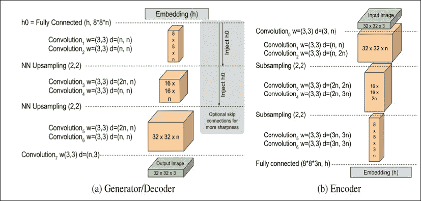

图-1：BEGAN 架构。

来源：*arXiv: 1703.10717,2017,2017*

在前面的图中，判别器的生成器和解码器显示在左侧。判别器的编码器网络显示在右侧。

## 使用 Tensorflow 实现 BEGAN

现在让我们深入研究代码，并实现上述概念及架构，以生成逼真且具有吸引力的图像。

生成器网络具有多个 3x3 卷积层，并使用`elu 激活`函数，接着进行最近邻上采样，除最后一层外。卷积层的数量是根据图像的高度计算的：

```py
self.repeat_num = int(np.log2(height)) – 2.

def GeneratorCNN(z, hidden_num, output_num, repeat_num, data_format, reuse):
    with tf.variable_scope("G", reuse=reuse) as vs:
        num_output = int(np.prod([8, 8, hidden_num]))
        x = slim.fully_connected(z, num_output, activation_fn=None)
        x = reshape(x, 8, 8, hidden_num, data_format)

        for idx in range(repeat_num):
            x = slim.conv2d(x, hidden_num, 3, 1, activation_fn=tf.nn.elu, data_format=data_format)
            x = slim.conv2d(x, hidden_num, 3, 1, activation_fn=tf.nn.elu, data_format=data_format)
            if idx < repeat_num - 1:
                x = upscale(x, 2, data_format)

        out = slim.conv2d(x, 3, 3, 1, activation_fn=None, data_format=data_format)

    variables = tf.contrib.framework.get_variables(vs)
    return out, variables
```

判别器网络的编码器具有多个卷积层，并使用`elu 激活`函数，接着进行最大池化下采样，除最后一层卷积层外：

```py
def DiscriminatorCNN(x, input_channel, z_num, repeat_num, hidden_num, data_format):
    with tf.variable_scope("D") as vs:
        # Encoder
        x = slim.conv2d(x, hidden_num, 3, 1, activation_fn=tf.nn.elu, data_format=data_format)

        prev_channel_num = hidden_num
        for idx in range(repeat_num):
            channel_num = hidden_num * (idx + 1)
            x = slim.conv2d(x, channel_num, 3, 1, activation_fn=tf.nn.elu, data_format=data_format)
            x = slim.conv2d(x, channel_num, 3, 1, activation_fn=tf.nn.elu, data_format=data_format)
            if idx < repeat_num - 1:
                x = slim.conv2d(x, channel_num, 3, 2, activation_fn=tf.nn.elu, data_format=data_format)
                #x = tf.contrib.layers.max_pool2d(x, [2, 2], [2, 2], padding='VALID')

        x = tf.reshape(x, [-1, np.prod([8, 8, channel_num])])
        z = x = slim.fully_connected(x, z_num, activation_fn=None)
```

判别器网络的解码器与生成器网络相似，具有多个卷积层，并使用`elu 激活`函数，接着进行最近邻上采样，除最后一层卷积层外：

```py
        num_output = int(np.prod([8, 8, hidden_num]))
        x = slim.fully_connected(x, num_output, activation_fn=None)
        x = reshape(x, 8, 8, hidden_num, data_format)

        for idx in range(repeat_num):
            x = slim.conv2d(x, hidden_num, 3, 1, activation_fn=tf.nn.elu, data_format=data_format)
            x = slim.conv2d(x, hidden_num, 3, 1, activation_fn=tf.nn.elu, data_format=data_format)
            if idx < repeat_num - 1:
                x = upscale(x, 2, data_format)

        out = slim.conv2d(x, input_channel, 3, 1, activation_fn=None, data_format=data_format)

    variables = tf.contrib.framework.get_variables(vs)
```

现在，通过执行以下代码块，使用**Adam 优化器**优化之前讨论的真实和伪图像的生成器损失和判别器损失：

```py
d_out, self.D_z, self.D_var = DiscriminatorCNN(
                tf.concat([G, x], 0), self.channel, self.z_num, self.repeat_num,
                self.conv_hidden_num, self.data_format)
        AE_G, AE_x = tf.split(d_out, 2)

        self.G = denorm_img(G, self.data_format)
        self.AE_G, self.AE_x = denorm_img(AE_G, self.data_format), denorm_img(AE_x, self.data_format)

if self.optimizer == 'adam':
            optimizer = tf.train.AdamOptimizer
        else:
            raise Exception("[!] Caution! Paper didn't use {} opimizer other than Adam".format(config.optimizer))

        g_optimizer, d_optimizer = optimizer(self.g_lr), optimizer(self.d_lr)

        self.d_loss_real = tf.reduce_mean(tf.abs(AE_x - x))
        self.d_loss_fake = tf.reduce_mean(tf.abs(AE_G - G))

        self.d_loss = self.d_loss_real - self.k_t * self.d_loss_fake
        self.g_loss = tf.reduce_mean(tf.abs(AE_G - G))
```

现在是时候执行代码来生成令人印象深刻的名人图像了：

1.  首先克隆以下仓库，并切换到相应的目录：

    ```py
    git clone https://github.com/carpedm20/BEGAN-tensorflow.git
    cd BEGAN-tensorflow

    ```

1.  接下来，运行以下脚本下载`CelebA`数据集到`data`目录，并将其划分为训练集、验证集和测试集：

    ```py
    python download.py

    ```

1.  请确保您的机器上已安装 p7zip。

1.  现在开始训练过程，训练过程中生成的样本将保存在`logs`目录下：

    ```py
    python main.py --dataset=CelebA --use_gpu=True

    ```

### 注意

如果您遇到错误**Conv2DCustomBackpropInputOp 仅支持 NHWC**，请参考以下问题：

[`github.com/carpedm20/BEGAN-tensorflow/ issues/29`](https://github.com/carpedm20/BEGAN-tensorflow/ issues/29)

执行上述命令后，在训练过程中，您将看到如下信息，包括`Model`目录、日志目录和各种损失值：

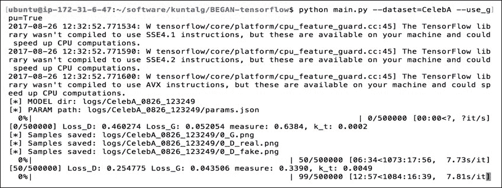

BEGAN 生成的输出人脸在视觉上非常逼真且具有吸引力，如下图所示：

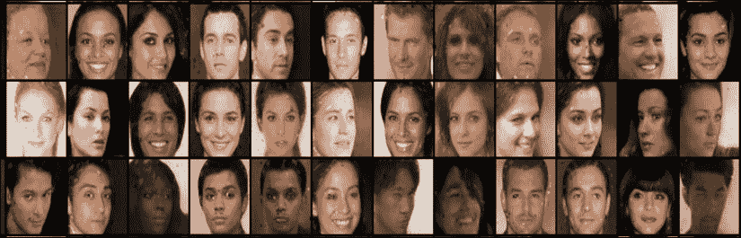

图 2：经过 350k 步后，生成器输出的图像（64x64），gamma=0.5

以下是经过 250k 步后生成的示例输出图像（128x128）：

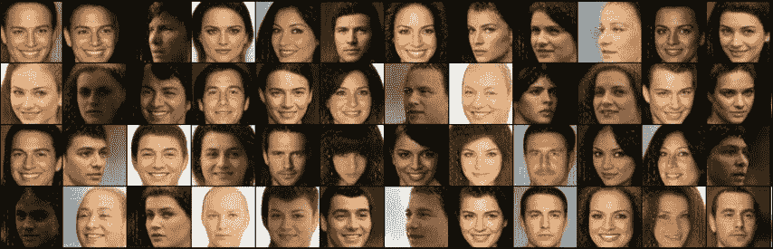

图 3：经过 250k 步后，生成器输出的图像（128x128），gamma=0.5

# 基于 CycleGAN 的图像到图像风格转换

**循环一致生成网络**（**CycleGAN**），最初在论文《*Unpaired image-to-image translation using CycleGAN*—*arXiv: 1703.10593, 2017*》中提出，旨在为给定的图像寻找源领域和目标领域之间的映射，而无需任何配对信息（例如灰度到彩色、图像到语义标签、边缘图到照片、马到斑马等）。

CycleGAN 背后的关键思想是拥有两个转换器 F 和 G，其中 F 将图像从领域*A*转换为领域*B*，而 G 将图像从领域*B*转换为领域*A*。因此，对于领域*A*中的图像*x*，我们应期望函数*G(F(x))*与*x*等效；同样，对于领域*B*中的图像*y*，我们应期望函数*F(G(y))*与*y*等效。

## CycleGAN 的模型公式

CycleGAN 模型的主要目标是学习使用训练样本*{xi}Ni=1* *∈* *X*和*{yj}Mj=1* *∈* *Y*之间的映射，领域*X*和*Y*之间的关系。它还有两个对抗判别器*D*[X]和*D*[Y]：其中*D*[X]试图区分原始图像*{x}*和翻译后的图像*{F(y)}*，同样，*D*[Y]试图区分*{y}*和*{G(x)}*。

CycleGAN 模型有两个`loss`函数：

+   **对抗损失**：它将生成图像的分布与目标领域的分布匹配：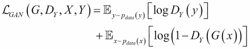

+   **循环一致性损失**：它防止学习到的映射*G*和*F*相互矛盾：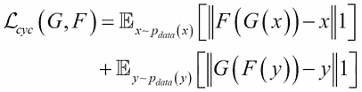

完整的 CycleGAN 目标函数如下所示：

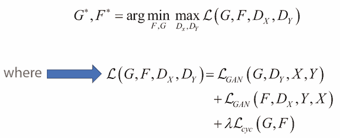

## 使用 Tensorflow 将苹果转化为橙子

在这个例子中，我们将把领域*A*中的图像风格迁移到另一个领域*B*中的图像：更具体地说，我们将应用 CycleGAN 将苹果转化为橙子，或将橙子转化为苹果，步骤如下：

1.  首先，克隆以下`git`仓库并将目录更改为 CycleGAN-tensorflow：

    ```py
    git clone https://github.com/xhujoy/CycleGAN-tensorflow
    cd CycleGAN-tensorflow
    ```

1.  现在，使用`download_dataset.sh`脚本下载`apple2orange`数据集 ZIP 文件，解压并将其保存在`datasets`目录下：

    ```py
    bash ./download_dataset.sh apple2orange

    ```

1.  接下来，使用下载的`apple2orange`数据集训练 CycleGAN 模型。在训练阶段，模型将保存在`checkpoint`目录中，并在`logs`目录中启用日志记录，以便通过 TensorBoard 进行可视化：

    ```py
    python main.py --dataset_dir=apple2orange

    ```

    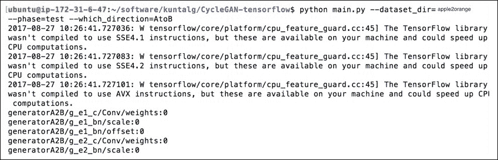

1.  运行以下命令以在浏览器中可视化训练阶段的各种损失（判别器损失和生成器损失），通过访问`http://localhost:6006/`：

    ```py
    tensorboard --logdir=./logs

    ```

    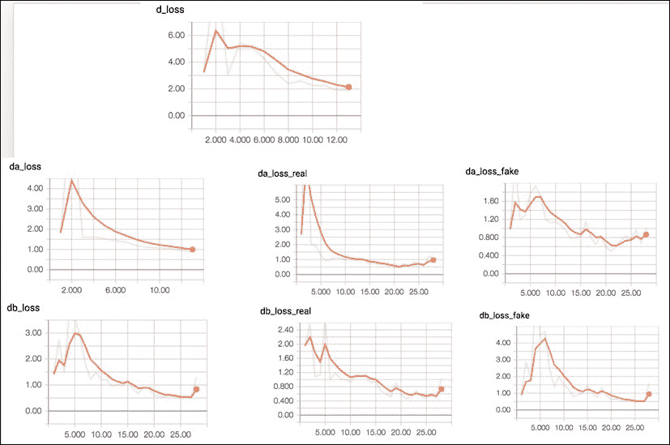

1.  最后，我们将从`checkpoint`目录加载训练好的模型，将风格从一种图像传递到另一种图像，从而生成橙子（或者相反，取决于传递的值（`AtoB`或`BtoA`）来指示从领域 1 到领域 2 的风格迁移）：

    ```py
    python main.py --dataset_dir=apple2orange --phase=test --which_direction=AtoB

    ```

1.  以下是`test`阶段生成的样本输出图像：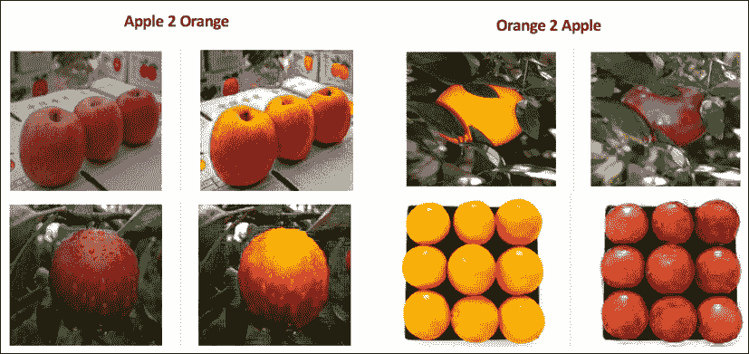

    图 4：左侧显示通过传递 AtoB 在方向参数中将苹果转变为橘子，而右侧显示通过传递 BtoA 在方向参数中生成的输出。

## 使用 CycleGAN 将马转变为斑马

就像之前的示例一样，在本节中，我们将使用 CycleGAN 通过执行以下步骤将马转变为斑马，或将斑马转变为马：

1.  首先克隆以下`git`仓库并切换目录到`CycleGAN-tensorflow`（如果你已经执行了前面的示例，可以跳过此步骤）：

    ```py
    git clone https://github.com/xhujoy/CycleGAN-tensorflow
    cd CycleGAN-tensorflow

    ```

1.  现在从伯克利下载`horse2zebra`压缩包，解压并通过`download_dataset.sh`脚本将其保存到`datasets`目录下：

    ```py
    bash ./download_dataset.sh horse2zebra

    ```

1.  接下来，我们将使用`horse2zebra`数据集训练我们的 CycleGAN 模型，并使用 TensorBoard 可视化训练过程中的损失：

    ```py
    python main.py --dataset_dir=horse2zebra

    ```

    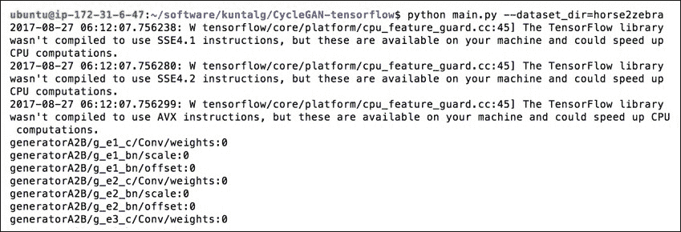

1.  运行以下命令并导航到`http://localhost:6006/`以可视化各种生成器或判别器损失：

    ```py
    tensorboard --logdir=./logs

    ```

    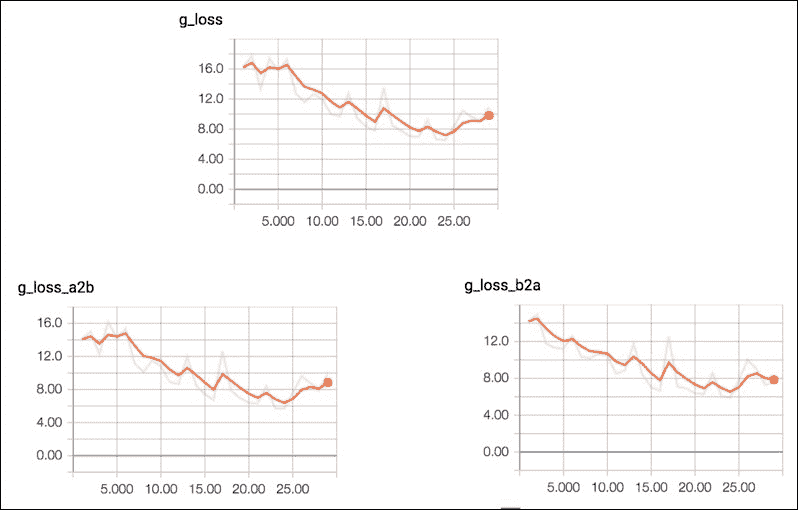

1.  最终，我们将使用`checkpoint`目录中的训练模型，将马转变为斑马，或将斑马转变为马，这取决于传递给`which_direction`参数的值是`AtoB`还是`BtoA`：

    ```py
    python main.py --dataset_dir=horse2zebra --phase=test --which_direction=AtoB

    ```

以下是`test`阶段生成的示例输出图像：

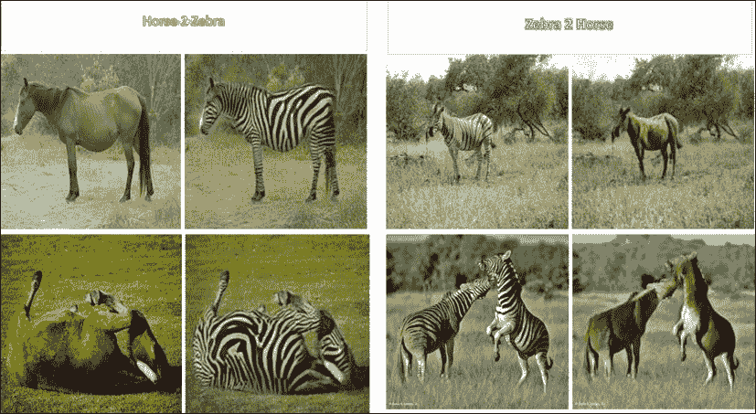

图 5：左侧显示将马转变为斑马，而右侧显示将斑马转变为马。

# 总结

到目前为止，你已经学会了通过将条件向量传递给生成器和判别器，基于特定的特征或条件来创建图像。同时，你也理解了如何通过使用 BEGAN 稳定网络训练来克服模型崩溃问题。最后，你已经实现了图像到图像的风格迁移，通过使用 CycleGAN 将苹果变成橘子，将马变成斑马，或者反过来。在下一章中，我们将通过堆叠或结合两个或更多 GAN 模型来解决复杂的现实问题，如文本到图像合成和跨领域发现。
