# 第四章：从文本构建逼真的图像

对于许多现实中的复杂问题，单一的生成对抗网络可能不足以解决问题。相反，最好将复杂问题分解为多个更简单的子问题，并使用多个 GAN 分别解决每个子问题。最后，你可以将这些 GAN 堆叠或连接在一起，以找到解决方案。

在本章中，我们将首先学习如何堆叠多个生成网络，从文本信息中生成逼真图像。接下来，你将将两个生成网络结合起来，自动发现不同领域之间的关系（如鞋子和手袋或男女演员之间的关系）。

本章我们将讨论以下主题：

+   什么是 StackGAN？它的概念和架构

+   使用 TensorFlow 从文本描述合成逼真图像

+   使用 DiscoGAN 发现跨领域关系

+   使用 PyTorch 从边缘生成手袋图像

+   使用 facescrub 数据转换性别（演员到女演员或反之）

# StackGAN 简介

StackGAN 的思想最初由*Han Zhang*、*Tao Xu*、*Hongsheng Li*、*Shaoting Zhang*、*Xiaolei Huang*、*Xiaogang Wang*和*Dimitris Metaxas*在论文《*Text to Photo-realistic Image Synthesis with Stacked Generative Adversarial Networks*》[*arXiv: 1612.03242, 2017*]中提出，其中使用了 GAN 从文本描述生成伪造图像。

从文本合成逼真图像是计算机视觉中的一个挑战性问题，具有巨大的实际应用。使用 StackGAN，生成图像的问题可以分解成两个可管理的子问题。在这种方法中，我们基于某些条件（如文本描述和前一阶段的输出）将生成网络的两个阶段进行堆叠，从而实现从文本输入生成逼真图像的这一挑战性任务。

在深入讨论模型架构和实现细节之前，让我们先定义一些概念和符号：

+   *Io*: 这是原始图像

+   *t*: 文本描述

+   *t*: 文本嵌入

+   *µ(t)*: 文本嵌入的均值

+   *∑(t)*: 文本嵌入的对角协方差矩阵

+   *pdata*: 真实数据分布

+   *pz*: 噪声的高斯分布

+   *z*: 从高斯分布随机采样的噪声

## 条件增强

正如我们在第二章《无监督学习与 GAN》中所知道的，*无监督学习与 GAN*，在条件 GAN 中，生成器和判别器网络都接收附加的条件变量 *c* 来生成 *G(z;c)* 和 *D(x;c)*。这种公式化帮助生成器根据变量 *c* 生成图像。条件增强可以在给定少量图像-文本对的情况下生成更多的训练对，并且对于建模文本到图像的转换非常有用，因为同一句话通常会映射到具有不同外观的物体。文本描述首先通过编码器转换为文本嵌入 *t*，然后通过 char-CNN-RNN 模型非线性地转换，生成作为第一阶段生成器网络输入的条件潜变量。

由于文本嵌入的潜空间通常是高维的，为了缓解有限数据量下潜在数据流形不连续的问题，应用条件增强技术以生成从高斯分布 *N(µ(t), ∑(t))* 中采样的附加条件变量 *c^*。

### 第一阶段

在这一阶段，GAN 网络学习以下内容：

+   生成粗略形状和基本颜色，用于根据文本描述创建物体

+   从从先验分布采样的随机噪声生成背景区域

在这一阶段生成的低分辨率粗略图像可能看起来不真实，因为它们有一些缺陷，比如物体形状畸变、缺失物体部分等。

第一阶段 GAN 交替训练判别器 *D0*（最大化损失）和生成器 *G0*（最小化损失），如以下方程所示：

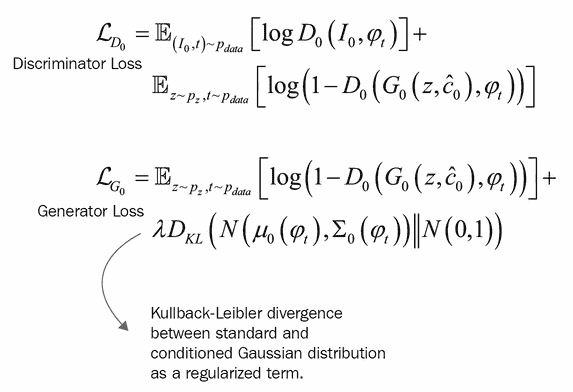

### 第二阶段

在这一阶段，GAN 网络仅专注于绘制细节并修正从第一阶段生成的低分辨率图像中的缺陷（例如缺乏生动的物体部分、形状畸变以及文本中遗漏的一些细节），以生成基于文本描述的高分辨率真实图像。

第二阶段 GAN 交替训练判别器 *D*（最大化损失）和生成器 *G*（最小化损失），以低分辨率 *G*[*0*]*(z; c⁰)* 结果和高斯潜变量 *c^* 为条件：

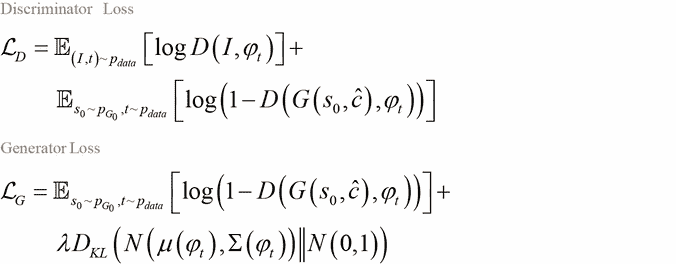

### 注意

在第二阶段，随机噪声 *z* 被高斯条件变量 *c^* 替代。此外，第二阶段中的条件增强具有不同的全连接层，用于生成文本嵌入的不同均值和标准差。

## StackGAN 的架构细节

如下图所示，对于第一阶段的生成器网络 *G*[0]，文本嵌入 *t* 首先输入一个全连接层生成高斯分布 *N(µ0(t); ∑0(t))* 的 *µ0* 和 *σ0*（*σ0* 是 *∑0* 的对角线值），然后从高斯分布中采样文本条件变量 *c⁰*。

对于第一阶段的判别器网络 *D0*，文本嵌入 *t* 首先通过全连接层被压缩至 *Nd* 维度，然后在空间上复制成 *Md* x *Md* x *Nd* 的张量。图像通过一系列下采样块被压缩到 *Md* x *Md* 的空间维度，然后通过与文本张量沿通道维度拼接的滤波器映射。最终，所得张量通过 1x1 卷积层共同学习图像和文本中的特征，并最终通过一个单节点全连接层输出决策得分。

第二阶段的生成器设计为一个带有残差块的编码器-解码器网络，并使用文本嵌入 *t* 来生成 *Ng* 维度的文本条件向量 *c^*，该向量被空间上复制成 *Md* x *Md* x *Nd* 的张量。然后，将第一阶段生成的结果 *s0* 输入到几个下采样块（即编码器），直到压缩到 *Mg* x *Mg* 的空间大小。图像特征与文本特征沿通道维度拼接后，通过多个残差块，学习图像和文本特征之间的多模态表示。最后，所得张量通过一系列上采样层（即解码器），生成一个 *W* x *H* 的高分辨率图像。

第二阶段的判别器与第一阶段相似，只是增加了额外的下采样块，以适应这一阶段的大尺寸图像。在训练判别器时，正样本对由真实图像及其相应的文本描述构成，而负样本则由两组组成：一组是包含文本嵌入不匹配的真实图像，另一组是包含合成图像及其相应文本嵌入的图像：

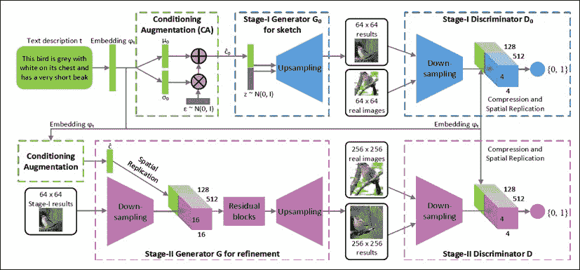

图 1. StackGAN 的架构。

来源：*arXiv: 1612.03242, 2017*

第一阶段生成器首先通过从给定文本草绘物体的粗略形状和基本颜色，并从随机噪声向量绘制背景，来绘制一张低分辨率的图像。第二阶段生成器则修正缺陷并为第一阶段的结果添加引人注目的细节，从而生成一张更为真实的高分辨率图像，并以第一阶段的结果为条件。

上采样块由最近邻上采样和 33 卷积层组成，每层步长为 1。每次卷积后应用批归一化和`ReLU`激活函数，最后一层除外。残差块再次由 33 卷积层组成，每层步长为 1，之后是批归一化和`ReLU`激活函数。下采样块由 44 卷积层组成，每层步长为 2，后接批归一化和 Leaky-ReLU 激活函数，第一卷积层不进行批归一化。

## 使用 TensorFlow 从文本合成图像

让我们实现代码，从文本合成现实图像并产生令人震惊的结果：

1.  首先克隆`git`仓库：[`github.com/Kuntal-G/StackGAN.git`](https://github.com/Kuntal-G/StackGAN.git)，然后切换到`StackGAN`目录：

    ```py
    git clone https://github.com/Kuntal-G/StackGAN.git
    cd StackGAN

    ```

    ### 注意

    当前代码与旧版本的 TensorFlow（0.11）兼容，因此您需要安装低于 1.0 版本的 TensorFlow 才能成功运行此代码。您可以使用以下命令修改 TensorFlow 版本：`sudo pip install tensorflow==0.12.0`。

    另外，请确保您的系统中已安装 torch。更多信息请参见此链接：[`torch.ch/docs/getting-started.html`](http://torch.ch/docs/getting-started.html)。

1.  然后，使用`pip`命令安装以下软件包：

    ```py
    sudo pip install prettytensor progressbar python-dateutil easydict pandas torchfile requests

    ```

1.  接下来，通过以下命令从以下链接下载预处理的 char-CNN-RNN 文本嵌入鸟类模型：[`drive.google.com/file/d/0B3y_msrWZaXLT1BZdVdycDY5TEE/view`](https://drive.google.com/file/d/0B3y_msrWZaXLT1BZdVdycDY5TEE/view)：

    ```py
    python google-drive-download.py 0B3y_msrWZaXLT1BZdVdycDY5TEE Data/ birds.zip

    ```

1.  现在，使用`unzip`命令解压下载的文件：

    ```py
    unzip Data/birds.zip

    ```

1.  接下来，下载并解压来自 Caltech-UCSD 的鸟类图像数据：

    ```py
    wget http://www.vision.caltech.edu/visipedia-data/CUB-200-2011/
    CUB_200_2011.tgz -O Data/birds/CUB_200_2011.tgz
    tar -xzf CUB_200_2011.tgz

    ```

1.  现在，我们将对图像进行预处理，拆分为训练集和测试集，并将图像保存为 pickle 格式：

    ```py
    python misc/preprocess_birds.py

    ```

    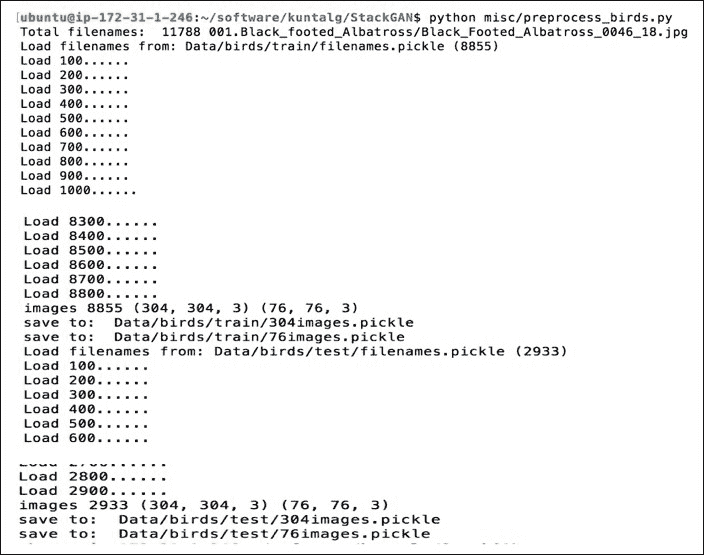

1.  现在，我们将从以下链接下载预训练的 char-CNN-RNN 文本嵌入模型：[`drive.google.com/file/d/0B3y_msrWZaXLNUNKa3BaRjAyTzQ/view`](https://drive.google.com/file/d/0B3y_msrWZaXLNUNKa3BaRjAyTzQ/view)，并将其保存到`models/`目录中，使用以下命令：

    ```py
    python google-drive-download.py 0B3y_msrWZaXLNUNKa3BaRjAyTzQ models/ birds_model_164000.ckpt

    ```

1.  同样从[`drive.google.com/file/d/0B0ywwgffWnLLU0F3UHA3NzFTNEE/view`](https://drive.google.com/file/d/0B0ywwgffWnLLU0F3UHA3NzFTNEE/view)下载鸟类的 char-CNN-RNN 文本编码器，并将其保存在`models/text_encoder`目录下：

    ```py
    python google-drive-download.py 0B0ywwgffWnLLU0F3UHA3NzFTNEE models/text_encoder/  lm_sje_nc4_cub_hybrid_gru18_a1_c512_0.00070_1_10_trainvalids.txt_iter30000.t7

    ```

1.  接下来，我们将在`example_captions.txt`文件中添加一些句子，以生成一些令人兴奋的鸟类图像：

    `一只白色的鸟，有黑色的头顶和红色的喙`

    `这只鸟有红色的胸部和黄色的腹部`

1.  最后，我们将在`demo`目录下执行`birds_demo.sh`文件，从`example_captions.txt`文件中的文本描述生成真实的鸟类图像：

    ```py
    sh demo/birds_demo.sh

    ```

    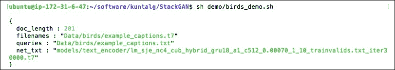

1.  现在，生成的图像将保存在`Data/birds/example_captions/`目录下，以下是相应的截图：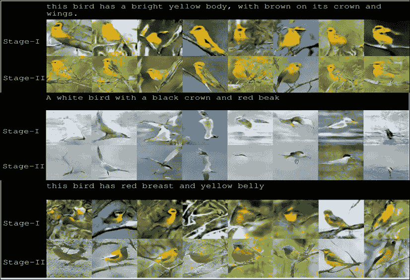

就这样，您已经根据文本描述生成了令人印象深刻的鸟类图像。您可以尝试自己的句子来描述鸟类，并通过描述来视觉验证结果。

# 通过 DiscoGAN 发现跨领域关系

跨领域关系对人类来说通常是自然的，他们可以轻松地识别来自不同领域的数据之间的关系而无需监督（例如，识别英文句子与其西班牙语翻译句子之间的关系，或者选择一双鞋来搭配一件衣服），但是自动学习这种关系是非常具有挑战性的，且需要大量的真实配对信息来说明这些关系。

**发现生成对抗网络**（**DiscoGAN**） *arXiv: 1703.05192 ,2017* 发现了两个视觉领域之间的关系，并通过生成一个领域的新图像来成功地将样式从一个领域转移到另一个领域，无需任何配对信息。DiscoGAN 的目标是将两个 GAN 模型耦合在一起，使每个领域都能映射到其对应的领域。DiscoGAN 背后的关键思想是确保领域 1 中的所有图像都能通过领域 2 中的图像表示，并使用重构损失来衡量在进行两次转换后——即从领域 1 到领域 2，再回到领域 1——原始图像的重构效果。

## DiscoGAN 的架构和模型构造

在深入探讨与 DiscoGAN 相关的模型构造和各种`损失`函数之前，让我们首先定义一些相关的术语和概念：

+   *G*[*AB*]：`生成器`函数，将输入图像 *x*[*A*]从领域 A 转换为领域 B 中的图像 *x*[*AB*]

+   *G*[*BA*]：`生成器`函数，将输入图像 *x*[*B*]从领域 B 转换为领域 A 中的图像 *x*[*BA*]

+   *G**AB*：这是领域 A 中所有* x *[*A*]值的完整集合，这些值应该包含在领域 B 中

+   *G**BA*：这是领域 B 中所有* x *[*B*]值的完整集合，这些值应该包含在领域 A 中

+   *D*[*A*]：领域 A 中的`判别器`函数

+   *D*[*B*]：领域 B 中的`判别器`函数！DiscoGAN 的架构和模型构造

    图 2：DiscoGAN 架构，包含两个耦合的 GAN 模型

    来源：*arXiv- 1703.05192, 2017*

DiscoGAN 的生成器模块由一个编码器-解码器对组成，用于执行图像翻译。生成器 *G*[*AB*]首先将输入图像 *x*[*A*]从领域 A 转换为领域 B 中的图像 *x*[*AB*]。然后，生成的图像被转换回领域 A 的图像 *x*[*ABA*]，以使用重构损失（方程式-3）和某种形式的距离度量（如 MSE、余弦距离、铰链损失）与原始输入图像匹配。最后，生成器转换后的输出图像 *x*[*AB*]被输入到判别器中，并通过与领域 B 的真实图像进行比较进行评分：

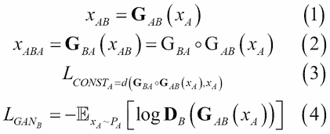

生成器 *GAB* 接收两种类型的损失，如下所示（方程式-5）：

+   *L*[*CONSTA*]：一种重建损失，衡量在两次翻译过程中，原始图像从领域 A->领域 B->领域 A 后重建得有多好

+   *L*[*GANB*]：标准的 GAN 损失，衡量生成的图像在 B 领域中的逼真度

而判别器*D*[*B*]接收标准的 GAN 判别器损失，如下所示（方程-6）：

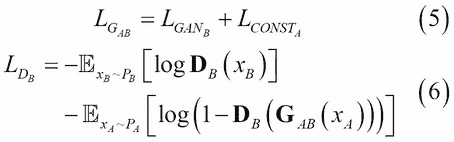

这两个耦合的 GANs 是同时训练的，两个 GANs 都学习从一个领域到另一个领域的映射，并且使用两个重建损失：*L*[*CONSTA*]和*L*[*CONSTB*]，通过反向映射从两个领域重建输入图像。

生成器*G*[*AB*]和*G*[*BA*]的参数在两个 GANs 之间是共享的，生成的图像*x*[*BA*]和*x*[*AB*]分别输入到各自的判别器*L*[*DA*]和*L*[*DB*]中：

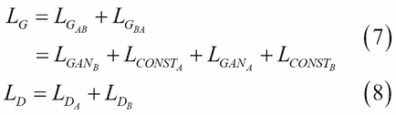

总生成器损失*L*[*G*]是耦合模型的两个 GAN 损失和每个部分模型的重建损失之和，如下所示（方程-7）。总判别器损失*L*[*D*]是两个判别器损失*L*[*DA*]和*L*[*DB*]的和，它们分别用于判别领域 A 和领域 B 中的真实和伪造图像（方程-8）。为了实现双射映射并保持一一对应，DiscoGAN 模型通过两个*L*[*GAN*]损失和两个*L*[*CONST*]重建损失进行约束。

注射映射意味着**A**中的每个成员都有其在**B**中的唯一匹配成员，而满射映射意味着**B**中的每个成员至少有一个匹配的**A**成员。

双射映射意味着注射和满射同时存在，且两个集合之间的成员有完美的一一对应关系。

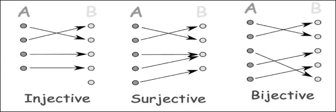

## DiscoGAN 的实现

现在让我们深入代码，理解 DiscoGAN 的概念（损失函数和衡量标准），以及 DiscoGAN 的架构。

生成器接收一个大小为 64x64x3 的输入图像，并将其通过一个编码器-解码器对进行处理。生成器的编码器部分由五个 4x4 卷积层组成，每个卷积层后跟着批量归一化和 Leaky ReLU。解码器部分由五个 4x4 的反卷积层组成，每个反卷积层后跟着批量归一化和`ReLU`激活函数，并输出一个目标领域的图像，大小为 64x64x3。以下是生成器的代码片段：

```py
class Generator(nn.Module):

            self.main = nn.Sequential(
            # Encoder
                nn.Conv2d(3, 64, 4, 2, 1, bias=False),
                nn.LeakyReLU(0.2, inplace=True),
                nn.Conv2d(64, 64 * 2, 4, 2, 1, bias=False),
                nn.BatchNorm2d(64 * 2),
                nn.LeakyReLU(0.2, inplace=True),
                nn.Conv2d(64 * 2, 64 * 4, 4, 2, 1, bias=False),
                nn.BatchNorm2d(64 * 4),
                nn.LeakyReLU(0.2, inplace=True),
                nn.Conv2d(64 * 4, 64 * 8, 4, 2, 1, bias=False),
                nn.BatchNorm2d(64 * 8),
                nn.LeakyReLU(0.2, inplace=True),
                nn.Conv2d(64 * 8, 100, 4, 1, 0, bias=False),
                nn.BatchNorm2d(100),
                nn.LeakyReLU(0.2, inplace=True),

             # Decoder
                nn.ConvTranspose2d(100, 64 * 8, 4, 1, 0, bias=False),
                nn.BatchNorm2d(64 * 8),
                nn.ReLU(True),
                nn.ConvTranspose2d(64 * 8, 64 * 4, 4, 2, 1, bias=False),
                nn.BatchNorm2d(64 * 4),
                nn.ReLU(True),
                nn.ConvTranspose2d(64 * 4, 64 * 2, 4, 2, 1, bias=False),
                nn.BatchNorm2d(64 * 2),
                nn.ReLU(True),
                nn.ConvTranspose2d(64 * 2, 64, 4, 2, 1, bias=False),
                nn.BatchNorm2d(64),
                nn.ReLU(True),
                nn.ConvTranspose2d(64,3, 4, 2, 1, bias=False),
                nn.Sigmoid()

                . . . 

            )
```

判别器与生成器的编码器部分相似，由五个 4x4 卷积层组成，每个卷积层后跟着批量归一化和`LeakyReLU`激活函数。最后，我们对最终的卷积层（`conv-5`）应用`sigmoid`函数，生成一个在[0,1]之间的标量概率值，用于判断数据的真假。以下是判别器的代码片段：

```py
class Discriminator(nn.Module):

        self.conv1 = nn.Conv2d(3, 64, 4, 2, 1, bias=False)
        self.relu1 = nn.LeakyReLU(0.2, inplace=True)

        self.conv2 = nn.Conv2d(64, 64 * 2, 4, 2, 1, bias=False)
        self.bn2 = nn.BatchNorm2d(64 * 2)
        self.relu2 = nn.LeakyReLU(0.2, inplace=True)

        self.conv3 = nn.Conv2d(64 * 2, 64 * 4, 4, 2, 1, bias=False)
        self.bn3 = nn.BatchNorm2d(64 * 4)
        self.relu3 = nn.LeakyReLU(0.2, inplace=True)

        self.conv4 = nn.Conv2d(64 * 4, 64 * 8, 4, 2, 1, bias=False)
        self.bn4 = nn.BatchNorm2d(64 * 8)
        self.relu4 = nn.LeakyReLU(0.2, inplace=True)

        self.conv5 = nn.Conv2d(64 * 8, 1, 4, 1, 0, bias=False)

        . . . .

   return torch.sigmoid( conv5 ), [relu2, relu3, relu4]
```

然后我们定义生成器和重构的损失标准，使用均方误差和二元交叉熵度量：

```py
recon_criterion = nn.MSELoss()
gan_criterion = nn.BCELoss()

optim_gen = optim.Adam( gen_params, lr=args.learning_rate, betas=(0.5,0.999), weight_decay=0.00001)
optim_dis = optim.Adam( dis_params, lr=args.learning_rate, betas=(0.5,0.999), weight_decay=0.00001)
```

现在我们开始从一个领域生成图像到另一个领域，并计算重构损失，以了解在两次翻译（`ABA` 或 `BAB`）后原始图像的重构效果：

```py
AB = generator_B(A)
BA = generator_A(B)

ABA = generator_A(AB)
BAB = generator_B(BA)

# Reconstruction Loss
recon_loss_A = recon_criterion( ABA, A )
recon_loss_B = recon_criterion( BAB, B )
```

接下来，我们计算每个领域的生成器损失和判别器损失：

```py
# Real/Fake GAN Loss (A)
A_dis_real, A_feats_real = discriminator_A( A )
A_dis_fake, A_feats_fake = discriminator_A( BA )

dis_loss_A, gen_loss_A = get_gan_loss( A_dis_real, A_dis_fake, gan_criterion, cuda )
fm_loss_A = get_fm_loss(A_feats_real, A_feats_fake, feat_criterion)

# Real/Fake GAN Loss (B)
B_dis_real, B_feats_real = discriminator_B( B )
B_dis_fake, B_feats_fake = discriminator_B( AB )

dis_loss_B, gen_loss_B = get_gan_loss( B_dis_real, B_dis_fake, gan_criterion, cuda )
fm_loss_B = get_fm_loss( B_feats_real, B_feats_fake, feat_criterion )

gen_loss_A_total = (gen_loss_B*0.1 + fm_loss_B*0.9) * (1.-rate) + recon_loss_A * rate
gen_loss_B_total = (gen_loss_A*0.1 + fm_loss_A*0.9) * (1.-rate) + recon_loss_B * rate
```

最后，通过将两个跨域（`A` 和 `B`）的损失相加，计算 `discogan` 模型的总损失：

```py
if args.model_arch == 'discogan':
    gen_loss = gen_loss_A_total + gen_loss_B_total
    dis_loss = dis_loss_A + dis_loss_B
```

# 使用 PyTorch 从边缘生成手袋

在本示例中，我们将使用来自伯克利的 `pix2pix` 数据集，根据相应的边缘生成逼真的手袋图像。在执行以下步骤之前，请确保已在计算机上安装了 PyTorch（[`pytorch.org/`](http://pytorch.org/)）和 OpenCV（[`docs.opencv.org/trunk/d7/d9f/tutorial_linux_install.html`](http://docs.opencv.org/trunk/d7/d9f/tutorial_linux_install.html)）：

1.  首先克隆 `git` 仓库并切换到 `DiscoGAN` 目录：

    ```py
    git clone https://github.com/SKTBrain/DiscoGAN.git
    cd DiscoGAN

    ```

1.  接下来使用以下命令下载 `edges2handbags` 数据集：

    ```py
    python ./datasets/download.py edges2handbags

    ```

1.  然后在两个领域之间应用图像翻译：边缘和手袋，使用下载的数据集：

    ```py
    python ./discogan/image_translation.py --task_name='edges2handbags'
    ```

    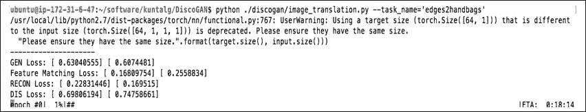

1.  现在，图像将在每个 epoch 后每 1,000 次迭代保存一次（根据 `image_save_interval` 参数），保存在 `results` 目录下，文件名包括在图像翻译步骤中之前使用的任务名称：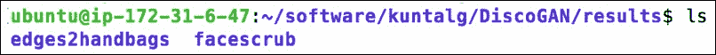

以下是从域 A 到域 B 生成的跨域图像的示例输出：

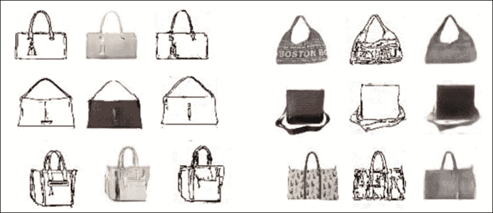

图-3：左侧是跨域（A -> B -> A）生成的图像（边缘 -> 手袋 -> 边缘），而右侧是跨域（B -> A -> B）生成的图像（手袋 -> 边缘 -> 手袋）

# 使用 PyTorch 进行性别转换

在本示例中，我们将使用 `facescrub` 数据集中的名人面部图像，将演员和女演员之间的性别进行转换，或反之。和之前的示例一样，请确保你在执行以下步骤之前已在计算机上安装了 PyTorch 和 OpenCV：

1.  首先克隆 `git` 仓库并切换目录到 `DiscoGAN`（如果你已经执行过之前的从边缘生成手袋示例，可以跳过这一步）：

    ```py
    git clone https://github.com/SKTBrain/DiscoGAN.git
    cd DiscoGAN

    ```

1.  接下来使用以下命令下载 `facescrub` 数据集：

    ```py
    python ./datasets/download.py facescrub

    ```

1.  然后在两个领域之间应用图像翻译，男性和女性，使用下载的数据集：

    ```py
    python ./discogan/image_translation.py --task_name= facescrub

    ```

    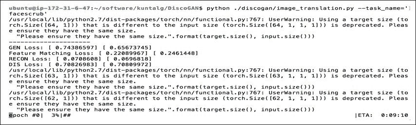

1.  现在，图像将在每个 epoch 后每 1,000 次迭代保存一次（根据 `image_save_interval` 参数），保存在 `results` 目录下，文件名包括相应的任务名称（`facescrub`）和 epoch 间隔：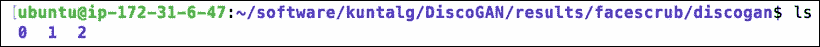

下面是从域 A（男性）到域 B（女性）生成的跨域图像的示例输出：

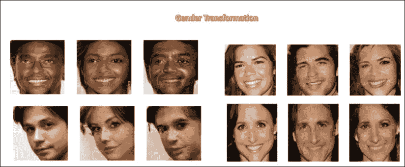

图 4：左侧是跨域（A -> B -> A）生成的图像（男性 -> 女性 -> 男性），右侧是跨域（B -> A -> B）生成的图像（女性 -> 男性 -> 女性）

# DiscoGAN 对比 CycleGAN

DiscoGAN（之前讨论过）和 CycleGAN（在 第二章 中讨论，*GAN 的无监督学习*）的主要目标是通过找到源域 X 和目标域 Y 之间的映射来解决图像到图像的转换问题，而不需要配对信息。

从架构角度来看，这两个模型都由两个将一个域映射到其对应域的 GAN 组成，并将它们的损失组合为传统生成器损失的函数（通常在 GAN 中看到）和重建损失/循环一致性损失。

这两个模型之间并没有很大的不同之处，除了 DiscoGAN 使用两个重建损失（衡量在两个转换 X->Y->X 后原始图像的重建效果），而 CycleGAN 使用单一的循环一致性损失，其中包括两个翻译器 F 和 G（F 将图像从域 X 翻译到域 Y，G 执行相反操作），以确保保持两个平衡（*F(G(b)) = b 和 G(F(a)) = a*，其中 *a*，*b* 分别为域 X、Y 中的图像）。

# 摘要

到目前为止，您已经学习了通过使用 StackGAN 和 DiscoGAN 将多个 GAN 模型结合起来解决复杂现实生活中的问题（例如从文本合成图像和发现跨域关系）。在下一章中，您将学习一种处理深度学习中小数据集的重要技术，即使用预训练模型和特征转移，以及如何在分布式系统上大规模运行您的深度模型。
