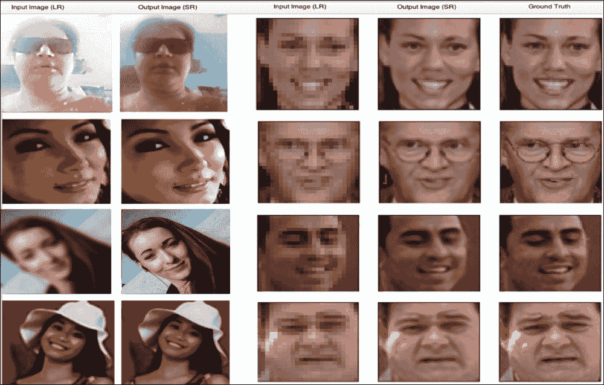
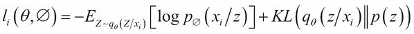

# 第五章：使用各种生成模型生成图像

深度学习在大数据和更深层模型中展现出巨大的优势。它拥有数百万个参数，训练可能需要数周的时间。一些现实场景可能没有足够的数据、硬件或资源来训练更大的网络，以达到所需的准确性。是否存在其他的解决方案，还是我们每次都需要从头开始重新发明训练的方法？

在本章中，我们将首先通过使用真实数据集（`MNIST`，`cars vs cats vs dogs vs flower`，`LFW`）的实际操作示例，了解现代深度学习应用中一种强大且广泛使用的训练方法——**迁移学习**。此外，您还将使用 Apache Spark 和 BigDL 在大型分布式集群上构建基于深度学习的网络。然后，您将结合迁移学习和 GAN，利用面部数据集生成高分辨率的真实图像。最后，您还将了解如何在图像上创造艺术性的幻觉，超越 GAN 的范畴。

本章将覆盖以下主题：

+   什么是迁移学习？——其优势和应用

+   使用预训练 VGG 模型和 Keras 对`cars vs dog vs flower`进行分类

+   使用 Apache Spark 在大型分布式集群上训练和部署深度网络——深度学习流水线

+   通过特征提取和使用 BigDL 微调来识别手写数字

+   使用预训练模型和 SRGAN 生成高分辨率图像

+   使用 DeepDream 生成艺术性幻觉图像，并通过 VAE 进行图像生成

从零开始构建一个深度学习模型需要复杂的资源，并且非常耗时。因此，您不一定要从零开始构建这样的深度模型来解决手头的问题。您可以通过重用已经为类似问题构建的现有模型来满足您的需求，而不是重新发明同样的轮子。

假设您想要构建一辆自动驾驶汽车。您可以选择花费数年时间从零开始构建一个合适的图像识别算法，或者您可以直接使用 Google 基于 ImageNet 大数据集构建的预训练 Inception 模型。预训练模型可能无法达到您应用所需的准确度，但它能节省大量重新发明轮子的工作。通过一些微调和技巧，您的准确度水平肯定会提高。

# 迁移学习简介

预训练模型并不是针对特定用户数据集进行优化的，但对于与训练模型任务相似的当前任务，它们非常有用。

例如，一个流行的模型 InceptionV3 经过优化用于对 1000 个类别的图像进行分类，但我们的领域可能是分类某些狗的品种。深度学习中常用的技术之一就是迁移学习，它将一个已经训练好的模型适应于类似任务的当前任务。

这就是为什么迁移学习在深度学习从业者中获得了广泛的关注，并且近年来在许多实际应用中成为了首选技术的原因。它的核心是将知识（或特征）在相关领域之间进行迁移。

## 迁移学习的目的

假设你已经训练了一个深度神经网络来区分新鲜芒果和烂芒果。在训练过程中，网络需要成千上万张新鲜和烂芒果的图片以及数小时的训练，以学习一些知识，例如，如果任何水果腐烂，液体会流出来并产生难闻的气味。现在，凭借这一训练经验，网络可以用于其他任务/用例，利用在芒果图片训练过程中学到的腐烂特征知识来区分烂苹果和新鲜苹果。

迁移学习的一般方法是训练一个基础网络，然后将其前 n 层复制到目标网络的前 n 层。目标网络的剩余层随机初始化并朝着目标用例进行训练。

使用迁移学习的主要场景如下：

+   **较小的数据集**：当你拥有较小的数据集时，从头开始构建深度学习模型效果不好。迁移学习提供了一种方法，能够将预训练的模型应用于新类别的数据。例如，一个从 ImageNet 数据的百万张图片中训练出来的预训练模型，相较于一个从小数据集从头开始训练的深度学习模型，即使只用一小部分较小训练数据（例如 CIFAR-10），也能收敛到一个不错的解决方案。

+   **更少的资源**：深度学习过程（如卷积）需要大量的资源和时间。深度学习过程非常适合在高性能基于 GPU 的机器上运行。但是，通过使用预训练模型，你可以轻松地在不到一分钟的时间内，利用没有 GPU 的笔记本电脑/笔记本对完整的训练集（比如说 50,000 张图片）进行训练，因为大多数时候，模型仅在最终层进行修改，通过简单地更新一个分类器或回归器来完成。

## 使用预训练模型的各种方法

我们将讨论如何以不同的方式使用预训练模型：

+   **使用预训练架构**：我们可以仅使用架构并为新的数据集初始化随机权重，而不是转移训练好的模型的权重。

+   **特征提取器**：预训练模型可以作为特征提取机制使用，只需简单地去除网络的输出层（即提供每个类别的概率），然后冻结网络的所有前层，将其作为新数据集的固定特征提取器。

+   **部分冻结网络**：有时我们会训练我们的新模型的部分网络（即保持网络初始层的权重被冻结，只重新训练较高层的权重），而不是仅替换最后一层并从所有前一层提取特征。冻结的层数可以看作是另一个超参数。

    图-1：使用预训练模型进行迁移学习

主要取决于数据大小和数据集的相似性，您可能需要决定如何进行迁移学习。以下表格讨论了这些场景：

|   | 高数据相似性 | 低数据相似性 |
| --- | --- | --- |
| **数据集较小** | 在数据量小但数据相似性高的情况下，我们只会修改预训练模型的输出层，并将其作为特征提取器使用。 | 当数据量和数据相似性都较低时，我们可以冻结预训练网络的前`k`层，只重新训练剩余的*(n-k)*层。这样，顶层可以根据新数据集进行定制，而小数据量也可以通过冻结的初始`k`层得到补偿。 |
| **数据集较大** | 在这种情况下，我们可以使用预训练模型的架构和初始权重。 | 尽管我们有一个较大的数据集，但与用于训练预训练模型的数据相比，数据差异很大，因此在这种情况下使用预训练模型效果不佳。相反，最好从头开始训练深度网络。 |

在图像识别中，迁移学习利用预训练的卷积层提取新输入图像的特征，这意味着只有原始模型的一小部分（主要是全连接层）需要重新训练。其余的网络保持冻结。通过这种方式，它通过仅将原始图像传递给冻结部分的网络一次，并且以后再也不会经过这部分网络，节省了大量时间和资源。

## 使用 Keras 进行汽车、猫、狗和花的分类

让我们实现迁移学习和微调的概念，使用定制数据集识别可定制的物体类别。每个类别（汽车、猫、狗和花）有 150 张训练图像和 50 张验证图像。

请注意，数据集是通过采集来自*Kaggle Dogs vs.Cats*（[`www.kaggle.com/c/dogs-vs-cats`](https://www.kaggle.com/c/dogs-vs-cats)）、斯坦福汽车数据集（[`ai.stanford.edu/~jkrause/cars/car_dataset.html`](http://ai.stanford.edu/~jkrause/cars/car_dataset.html)）和`Oxford flower`数据集（[`www.robots.ox.ac.uk/~vgg/data/flowers`](http://www.robots.ox.ac.uk/~vgg/data/flowers)）的图像准备的。


图-2：汽车 vs 猫 vs 狗 vs 花的数据集结构

我们需要使用`preprocessing`函数进行一些预处理，并通过`rotation`、`shift`、`shear`、`zoom`和`flip`等参数应用各种数据增强变换：

```py
train_datagen = ImageDataGenerator(
	preprocessing_function=preprocess_input,
	rotation_range=30,
	width_shift_range=0.2,
	height_shift_range=0.2,
	shear_range=0.2,
	zoom_range=0.2,
	horizontal_flip=True
)
test_datagen = ImageDataGenerator(
	preprocessing_function=preprocess_input,
	rotation_range=30,
	width_shift_range=0.2,
	height_shift_range=0.2,
	shear_range=0.2,
	zoom_range=0.2,
	horizontal_flip=True
)
train_generator = train_datagen.flow_from_directory(
	args.train_dir,
	target_size=(IM_WIDTH, IM_HEIGHT),
	batch_size=batch_size,
)
validation_generator = test_datagen.flow_from_directory(
	args.val_dir,
	target_size=(IM_WIDTH, IM_HEIGHT),
	batch_size=batch_size,
)
```

接下来，我们需要从`keras.applications`模块加载 InceptionV3 模型。`include_top=False`标志用于省略最后一层全连接层的权重：

```py
base_model = InceptionV3(weights='imagenet', include_top=False)
```

通过添加大小为 1024 的全连接`Dense`层并在输出上应用`softmax`函数来初始化一个新的最后一层，以将值压缩到`[0,1]`之间：

```py
def addNewLastLayer(base_model, nb_classes):
	x = base_model.output
	x = GlobalAveragePooling2D()(x)
	x = Dense(FC_SIZE, activation='relu')(x)
	predictions = Dense(nb_classes, activation='softmax')(x)
	model = Model(input=base_model.input, output=predictions)
	return model

```

一旦网络的最后一层稳定下来（迁移学习），我们就可以开始重新训练更多的层（微调）。

使用一个实用方法冻结所有层并编译模型：

```py
def setupTransferLearn(model, base_model):
	for layer in base_model.layers:
	  layer.trainable = False
model.compile(optimizer='rmsprop',
			  loss='categorical_crossentropy',
              metrics=['accuracy'])

```

这是另一个实用方法，用于冻结 InceptionV3 架构中前两个 Inception 模块的底部并重新训练剩余的顶部：

```py
def setupFineTune(model):
   for layer in model.layers[:NB_IV3_LAYERS_TO_FREEZE]:
      layer.trainable = False
   for layer in model.layers[NB_IV3_LAYERS_TO_FREEZE:]:
	  layer.trainable = True
   model.compile(optimizer=SGD(lr=0.0001, momentum=0.9),
loss='categorical_crossentropy')

```

现在我们已准备好使用`fit_generator`方法进行训练，并最终保存我们的模型：

```py
history = model.fit_generator(
	train_generator,
	samples_per_epoch=nb_train_samples,
	nb_epoch=nb_epoch,
	validation_data=validation_generator,
	nb_val_samples=nb_val_samples,
	class_weight='auto')
model.save(args.output_model_file)

```

运行以下命令进行训练和微调：

```py
python training-fine-tune.py --train_dir <path to training images> --val_dir <path to validation images>
```


即使数据集如此小，我们仍然能够利用预训练模型和迁移学习的优势，在验证集上实现 98.5%的准确率：


完成了！现在我们可以使用保存的模型来预测图像（无论是来自本地文件系统还是 URL）并进行测试：

```py
python predict.py --image_url https://goo.gl/DCbuq8 --model inceptionv3-ft.model
```


# 使用 Apache Spark 进行大规模深度学习

深度学习是一个资源密集且计算密集的过程，拥有更多数据和更大的网络可以获得更好的结果，但其速度也会受到数据集大小的影响。在实践中，深度学习需要通过调整训练参数（即超参数调整）来进行实验，在这个过程中，你需要多次迭代或运行深度网络并且速度至关重要。常见的解决方法是使用更快的硬件（通常是 GPU）、优化的代码（使用适合生产环境的框架）和通过分布式集群扩展来实现某种形式的并行性。

数据并行性是将大型数据集分割成多个数据块，然后在分布式集群的独立节点上运行神经网络处理这些数据块的概念。

Apache Spark 是一个快速、通用、容错的框架，用于在大规模分布式数据集上进行交互式和迭代计算，它通过对 RDD 或 DataFrame 进行内存处理，而不是将数据保存到硬盘中，来实现大数据集的处理。它支持多种数据源以及存储层，并提供统一的数据访问，能够结合不同的数据格式、流数据，并使用高级可组合操作符定义复杂的操作。

今天，Spark 是大数据处理的超能力，使每个人都能访问大数据。但仅凭 Spark 或其核心模块无法在集群上训练或运行深度网络。在接下来的几个部分，我们将利用优化后的库在 Apache Spark 集群上开发深度学习应用程序。

### 注意

出于编码目的，我们将不涵盖分布式 Spark 集群的设置，而是使用 Apache Spark 独立模式。有关 Spark 集群模式的更多信息，请参见：[`spark.apache.org/docs/latest/cluster-overview.html`](https://spark.apache.org/docs/latest/cluster-overview.html)。

## 使用 Spark 深度学习运行预训练模型

深度学习管道是一个开源库，利用 Apache Spark 集群的强大功能，轻松将可扩展的深度学习集成到机器学习工作流中。它建立在 Apache Spark 的 ML 管道之上进行训练，并使用 Spark DataFrame 和 SQL 部署模型。它提供高级 API，通过将预训练模型作为转换器集成到 Spark ML 管道中，以分布式方式运行迁移学习。

深度学习管道通过特征提取器的概念简化了迁移学习。特征提取器（在图像操作中是`DeepImageFeaturizer`）自动去除预训练神经网络模型的最后一层，并将所有前面的层输出作为特征，供特定于新问题领域的分类算法（例如逻辑回归）使用。

让我们在 Spark 集群上实现深度学习管道，预测`flower`数据集（[`download.tensorflow.org/example_images/flower_photos.tgz`](http://download.tensorflow.org/example_images/flower_photos.tgz)）的示例图像，使用预训练模型：

1.  首先，启动带有深度学习管道包的 PySpark：

    ```py
    pyspark --master local[*] --packages databricks:spark-deep-learning:0.1.0-spark2.1-s_2.11
    ```

    ### 提示

    注意：如果在启动 PySpark 时遇到**No module named sparkdl**的错误，请查看 GitHub 页面以获取解决方法：

    [`github.com/databricks/spark-deep-learning/issues/18`](https://github.com/databricks/spark-deep-learning/issues/18)

1.  首先，读取图像并将其随机拆分为`train`和`test`集。

    ```py
    img_dir= "path to base image directory"
    roses_df = readImages(img_dir + "/roses").withColumn("label", lit(1))
    daisy_df = readImages(img_dir + "/daisy").withColumn("label", lit(0))
    roses_train, roses_test = roses_df.randomSplit([0.6, 0.4])
    daisy_train, daisy_test = daisy_df.randomSplit([0.6, 0.4])
    train_df = roses_train.unionAll(daisy_train)
    ```

1.  然后使用`InceptionV3`模型通过`DeepImageFeaturizer`创建一个管道：

    ```py
    featurizer = DeepImageFeaturizer(inputCol="image", outputCol="features", modelName="InceptionV3")
    lr = LogisticRegression(maxIter=20, regParam=0.05, elasticNetParam=0.3, labelCol="label")
    p = Pipeline(stages=[featurizer, lr])
    ```

1.  现在，使用现有的预训练模型来拟合图像，其中`train_images_df`是图像和标签的数据集：

    ```py
    p_model = p.fit(train_df)   
    ```

1.  最后，我们将评估准确性：

    ```py
    tested_df = p_model.transform(test_df)
    evaluator = MulticlassClassificationEvaluator(metricName="accuracy")
    print("Test set accuracy = " + str(evaluator.evaluate(tested_df.select("prediction", "label"))))
    ```

    

除了`DeepImageFeaturizer`，我们还可以仅使用预先存在的模型进行预测，无需任何重新训练或微调，使用`DeepImagePredictor`：

```py
sample_img_dir=<path to your image>

image_df = readImages(sample_img_dir)

predictor = DeepImagePredictor(inputCol="image", outputCol="predicted_labels", modelName="InceptionV3", decodePredictions=True, topK=10)
predictions_df = predictor.transform(image_df)

predictions_df.select("filePath", "predicted_labels").show(10,False)
```

输入图像及其前五个预测结果如下所示：


除了使用内置的预训练模型外，深度学习管道还允许用户在 Spark 预测管道中插入 Keras 模型或 TensorFlow 图。这实际上将任何在单节点机器上运行的单节点深度模型转化为可以在分布式环境下进行训练和部署的模型，并能够处理大量数据。

首先，我们将加载 Keras 内置的 InceptionV3 模型，并将其保存到文件中：

```py
model = InceptionV3(weights="imagenet")
model.save('model-full.h5')
```

在预测阶段，我们只需加载模型并将图像传递给它，以获得期望的预测结果：

```py
def loadAndPreprocessKerasInceptionV3(uri):
    # this is a typical way to load and prep images in keras
    image = img_to_array(load_img(uri, target_size=(299, 299)))
    image = np.expand_dims(image, axis=0)
    return preprocess_input(image)

transformer = KerasImageFileTransformer(inputCol="uri", 
  outputCol="predictions",
                                        modelFile="model-full.h5",
                                    imageLoader=loadAndPreprocessKerasInceptionV3,
                                        outputMode="vector")
dirpath=<path to mix-img>

files = [os.path.abspath(os.path.join(dirpath, f)) for f in os.listdir(dirpath) if f.endswith('.jpg')]
uri_df = sqlContext.createDataFrame(files, StringType()).toDF("uri")

final_df = transformer.transform(uri_df)
final_df.select("uri", "predictions").show()
```

深度学习管道是一种在分布式 Spark 集群上进行迁移学习的非常快速的方法。但你一定注意到，特征提取器仅允许我们更改预训练模型的最终层。但是在某些场景下，你可能需要修改预训练网络的多个层以获得期望的结果，而深度学习管道并未提供这种完整的能力。

## 使用 BigDL 进行大规模手写数字识别

BigDL 是一个开源的分布式高性能深度学习库，可以直接运行在 Apache Spark 集群上。其高性能通过结合**Intel® 数学核心库**（**MKL**）和每个 Spark 任务中的多线程编程来实现。BigDL 提供类似 Keras 的高级 API（包括顺序和功能模型），用于构建深度学习应用并扩展以执行大规模的分析。使用 BigDL 的主要目的包括：

+   在 Spark 或 Hadoop 集群中运行深度学习模型并分析大量数据（比如在 Hive、HDFS 或 HBase 中）

+   将深度学习功能（包括训练和预测）添加到你的大数据工作流中！使用 BigDL 进行大规模手写数字识别

    图 3：BigDL 在 Spark 集群上的执行

如图所示，BigDL 驱动程序首先在集群的 Spark 主节点上启动。然后，在**集群管理器**和驱动程序的帮助下，Spark 任务会分配到工作节点上的 Spark 执行器。BigDL 与 Intel MKL 交互，以加快这些任务的执行速度。

让我们使用`mnist`数据集实现一个大规模的深度神经网络，用于识别手写数字。首先，我们将准备训练和验证样本：

```py
mnist_path = "datasets/mnist"
(train_data, test_data) = get_mnist(sc, mnist_path)
print train_data.count()
print test_data.count()
```

然后，我们将创建 LeNet 架构，包含两组卷积层、激活层和池化层，接着是一个全连接层、激活层、另一个全连接层，最后是一个`SoftMax`分类器。LeNet 小巧但足够强大，能够提供有趣的结果：

```py
def build_model(class_num):
    model = Sequential()
    model.add(Reshape([1, 28, 28]))
    model.add(SpatialConvolution(1, 6, 5, 5).set_name('conv1'))
    model.add(Tanh())
    model.add(SpatialMaxPooling(2, 2, 2, 2).set_name('pool1'))
    model.add(Tanh())
    model.add(SpatialConvolution(6, 12, 5, 5).set_name('conv2'))
    model.add(SpatialMaxPooling(2, 2, 2, 2).set_name('pool2'))
    model.add(Reshape([12 * 4 * 4]))
    model.add(Linear(12 * 4 * 4, 100).set_name('fc1'))
    model.add(Tanh())
    model.add(Linear(100, class_num).set_name('score'))
    model.add(LogSoftMax())
    return model
lenet_model = build_model(10)
```

现在，我们将配置一个`优化器`并设置验证逻辑：

```py
optimizer = Optimizer(
    model=lenet_model,
    training_rdd=train_data,
    criterion=ClassNLLCriterion(),
    optim_method=SGD(learningrate=0.4, learningrate_decay=0.0002),
    end_trigger=MaxEpoch(20),
    batch_size=2048)

optimizer.set_validation(
    batch_size=2048,
    val_rdd=test_data,
    trigger=EveryEpoch(),
    val_method=[Top1Accuracy()]
)

trained_model = optimizer.optimize()
```

然后，我们将取几个测试样本，并通过检查预测标签和真实标签来进行预测：

```py
predictions = trained_model.predict(test_data)
```

最后，我们将在 Spark 集群中使用`spark-submit`命令训练 LeNet 模型。根据你的 Apache Spark 版本下载 BigDL 发行版（[`bigdl-project.github.io/master/#release-download/`](https://bigdl-project.github.io/master/#release-download/)），然后执行代码中提供的文件（`run.sh`），以在 Spark 集群中提交任务：

```py
SPARK_HOME= <path to Spark>
BigDL_HOME= <path to BigDL>
PYTHON_API_ZIP_PATH=${BigDL_HOME}/bigdl-python-<version>.zip
BigDL_JAR_PATH=${BigDL_HOME}/bigdl-SPARK-<version>.jar
export PYTHONPATH=${PYTHON_API_ZIP_PATH}:${BigDL_HOME}/conf/spark-bigdl.conf:$PYTHONPATH

${SPARK_HOME}/bin/spark-submit \
      --master <local or spark master url>\
      --driver-cores 5  \
      --driver-memory 5g  \
      --total-executor-cores 16  \
      --executor-cores 8  \
      --executor-memory 10g \
      --py-files ${PYTHON_API_ZIP_PATH},${BigDL_HOME}/BigDL-MNIST.py\
      --properties-file ${BigDL_HOME}/conf/spark-bigdl.conf \
      --jars ${BigDL_JAR_PATH} \
      --conf spark.driver.extraClassPath=${BigDL_JAR_PATH} \
      --conf spark.executor.extraClassPath=bigdl-SPARK<version>.jar \
      ${BigDL_HOME}/BigDL-MNIST.py
```

有关`spark-submit`的更多信息，请访问：[`spark.apache.org/docs/latest/submitting-applications.html`](https://spark.apache.org/docs/latest/submitting-applications.html)。

一旦你提交了任务，你可以通过**Spark Master**应用页面跟踪任务进度，如下所示：


图 4：在 Apache Spark 集群上运行的 BigDL LeNet5 模型任务

任务成功完成后，你可以查看 Spark 工作节点的日志，以验证你的模型的准确性，类似于下图所示：

```py
INFO  DistriOptimizer$:536 - Top1Accuracy is Accuracy(correct: 9568, count: 10000, accuracy: 0.9568)
```

## 使用 SRGAN 生成高分辨率图像

**超分辨率生成网络**（**SRGAN**）在从低分辨率图像生成高分辨率图像方面表现出色。在训练阶段，通过对高分辨率图像应用高斯滤波器后进行下采样操作，将高分辨率图像转化为低分辨率图像。

在深入了解网络架构之前，让我们定义一些符号：

+   `I`^(*LR*): 低分辨率图像，大小为宽度(`W`) × 高度(`H`) × 颜色通道(`C`)

+   `I`^(*HR*): 高分辨率图像，大小为*rW × rH × C*

+   `I`^(*SR*): 超分辨率图像，大小为*rW × rH × C*

+   `r`: 下采样因子

+   `G`[*θG*]: 生成器网络

+   `D`[*θD*]: 判别器网络

为了实现从低分辨率图像估计高分辨率输入图像的目标，生成器网络作为一个前馈卷积神经网络进行训练，`G`[*θG*]由*θG*参数化，其中*θG*由深度网络 L 层的权重（*W1:L*）和偏置（*b1:L*）表示，并通过优化超分辨率特定的`loss`函数得到。对于具有高分辨率的训练图像！使用 SRGAN 生成高分辨率图像，*n=1*；N 及其对应的低分辨率图像！使用 SRGAN 生成高分辨率图像，*n=1*，N，我们可以按如下方式求解*θG*：


### 注意

感知损失函数*lSR*的公式对生成器网络的性能至关重要。通常，感知损失基于**均方误差**（**MSE**）建模，但为了避免过于平滑的纹理带来的不理想结果，提出了一种新的基于预训练 19 层 VGG 网络的 ReLU 激活层的内容损失函数。

感知损失是几种`损失`函数的加权组合，这些损失函数映射超分辨率图像的重要特征，如下所示：


+   **内容损失**：基于 VGG 的内容损失定义为重建图像`G`*[θG]* (`I`^(*LR*))与对应高分辨率图像`I`*HR*之间的欧氏距离。这里[*i,j*]表示在 VGG19 网络中第 i 个最大池化层前的第 j 个卷积层（激活后）获得的特征图。而*Wi,j*、*Hi,j*描述了*VGG*网络中各个特征图的维度：

+   **对抗损失**：生成损失基于判别器`D`[*θD*]*(G*[*θG*]*(I*[*LR*]*))对所有训练图像的概率，鼓励网络选择位于自然图像流形上的解决方案，以此来欺骗判别器网络：

类似于对抗网络的概念，SRGAN 方法背后的总体思想是训练一个生成器`G`，其目标是欺骗一个判别器`D`，该判别器经过训练，能够区分超分辨率图像和真实图像：


基于这一方法，生成器学习创造出与真实图像高度相似的解决方案，从而使判别器`D`很难进行分类。这也鼓励感知上优越的解决方案位于自然图像的子空间流形上。

## SRGAN 架构

如下图所示，生成器网络`G`由`B`个**残差块**组成，布局相同。每个块包含两个卷积层，使用小的 3×3 核和 64 个特征图，随后是批归一化层[32]和 ParametricReLU[28]作为`激活`函数。输入图像的分辨率通过两个训练过的子像素卷积层增加。

判别器网络使用 Leaky ReLU 激活函数（*α* = 0.2），并由八个卷积层组成，卷积核的数量逐渐增加，从 64 个 3×3 卷积核增加到 512 个，每次特征数量翻倍，使用步幅卷积来减少图像分辨率。

结果的 512 个特征图通过两个全连接层，随后通过最终的 sigmoid 激活层，获得生成图像样本的分类概率：


图 5：生成器和判别器网络的架构，标注了每个卷积层的对应核大小（k）、特征图数量（n）和步幅（s）。

来源：*arXiv, 1609.04802, 2017*

现在是时候深入了解 TensorFlow 代码，并使用 LFW 人脸数据集生成高分辨率图像了。

生成器网络首先构建为一个单独的反卷积层，具有 3×3 的内核和 64 个特征图，后接 ReLU 作为`activation`函数。接下来是五个残差块，每个块具有两个卷积层，后接批量归一化和 ReLU。最后，通过两个训练过的像素洗牌层增加输入图像的分辨率：

```py
def generator(self, x, is_training, reuse):
    with tf.variable_scope('generator', reuse=reuse):
      with tf.variable_scope('deconv1'):
          x = deconv_layer(
               x, [3, 3, 64, 3], [self.batch_size, 24, 24, 64], 1)
          x = tf.nn.relu(x)
          shortcut = x
# 5 Residual block with identical layout of deconvolution layers having batch norm and relu as activation function.
    for i in range(5):
       mid = x
       with tf.variable_scope('block{}a'.format(i+1)):
         x = deconv_layer(x, [3, 3, 64, 64], [self.batch_size, 24, 
24, 64], 1)
         x = batch_normalize(x, is_training)
         x = tf.nn.relu(x)

# 2 deconvolution layers having pixel-suffle and relu as activation function. 
     with tf.variable_scope('deconv3'):
         x = deconv_layer(x, [3, 3, 256, 64], [self.batch_size, 24, 
24, 256], 1)
         x = pixel_shuffle_layer(x, 2, 64) # n_split = 256 / 2 ** 2
         x = tf.nn.relu(x)
     with tf.variable_scope('deconv4'):
         x = deconv_layer(x, [3, 3, 64, 64], [self.batch_size, 48, 
48, 64], 1)
         x = pixel_shuffle_layer(x, 2, 16)
         x = tf.nn.relu(x)

     . . . . . . . . [code omitted for clarity]

return x	
```

`deconvolution layer`函数使用 TensorFlow 的`conv2d_transpose`方法定义，并采用 Xavier 初始化，具体如下：

```py
def deconv_layer(x, filter_shape, output_shape, stride, trainable=True):
    filter_ = tf.get_variable(
        name='weight',
        shape=filter_shape,
        dtype=tf.float32,
        initializer=tf.contrib.layers.xavier_initializer(),
        trainable=trainable)
    return tf.nn.conv2d_transpose(
        value=x,
        filter=filter_,
        output_shape=output_shape,
        strides=[1, stride, stride, 1])
```

判别器网络由八个卷积层组成，使用 3×3 的滤波器内核，内核数量从 64 逐步增加至 512。最终的 512 个特征图被拉平，并通过两层密集的全连接层，最后通过一个 softmax 层以获得生成图像样本的分类概率：

```py
def discriminator(self, x, is_training, reuse):
        with tf.variable_scope('discriminator', reuse=reuse):
            with tf.variable_scope('conv1'):
                x = conv_layer(x, [3, 3, 3, 64], 1)
                x = lrelu(x)
            with tf.variable_scope('conv2'):
                x = conv_layer(x, [3, 3, 64, 64], 2)
                x = lrelu(x)
                x = batch_normalize(x, is_training)

         .  .   .   .   .   . [code omitted for clarity]

            x = flatten_layer(x)
            with tf.variable_scope('fc'):
                x = full_connection_layer(x, 1024)
                x = lrelu(x)
            with tf.variable_scope('softmax'):
                x = full_connection_layer(x, 1)

return x
```

网络使用 LeakyReLU（*α* = 0.2）作为卷积层的`activation`函数：

```py
def lrelu(x, trainbable=None):
    alpha = 0.2
    return tf.maximum(alpha * x, x)
```

`convolution layer`函数使用 TensorFlow 的`conv2d`方法定义，并采用 Xavier 初始化，具体如下：

```py
def conv_layer(x, filter_shape, stride, trainable=True):
    filter_ = tf.get_variable(
        name='weight', 
        shape=filter_shape,
        dtype=tf.float32, 
        initializer=tf.contrib.layers.xavier_initializer(),
        trainable=trainable)
    return tf.nn.conv2d(
        input=x,
        filter=filter_,
        strides=[1, stride, stride, 1],
        padding='SAME')
```

请注意，代码实现使用了最小二乘`loss`函数（以避免梯度消失问题）来代替 SRGAN 原论文中提出的 sigmoid 交叉熵`loss`函数（*arXiv, 1609.04802, 2017*）：

```py
def inference_adversarial_loss(real_output, fake_output):
alpha = 1e-5
g_loss = tf.reduce_mean(
tf.nn.l2_loss(fake_output - tf.ones_like(fake_output)))
d_loss_real = tf.reduce_mean(
tf.nn.l2_loss(real_output - tf.ones_like(true_output)))
d_loss_fake = tf.reduce_mean(
tf.nn.l2_loss(fake_output + tf.zeros_like(fake_output)))
d_loss = d_loss_real + d_loss_fake
return (g_loss * alpha, d_loss * alpha)

generator_loss, discriminator_loss = (
inference_adversarial_loss(true_output, fake_output))
```

有关**最小二乘 GAN**的更多信息，请访问：[`arxiv.org/abs/1611.04076`](https://arxiv.org/abs/1611.04076)

运行 SRGAN 的`code`目录结构如下：


首先让我们下载一个`LFW 人脸`数据集并进行一些预处理（正面人脸检测以及将数据集拆分为训练集和测试集），并将数据集存储在`data/`目录下：

```py
python download-preprocess-lfw.py

```


接下来从以下链接下载预训练的 VGG19 模型，解压后保存在`backup/`目录下：

[`drive.google.com/open?id=0B-s6ok7B0V9vcXNfSzdjZ0lCc0k`](https://drive.google.com/open?id=0B-s6ok7B0V9vcXNfSzdjZ0lCc0k)

接下来执行`trainSrgan.py`文件，使用 VGG19 模型开始 SRGAN 操作：

```py
python trainSrgan.py

```

一旦训练开始，生成器网络将开始在`result/`目录中生成超分辨率图像。以下是从`result/`目录中展示的一些示例图像：



# 使用 DeepDream 生成艺术化的幻觉图像

DeepDream 算法是一种改进的神经网络，通过改变图像以适应训练数据的方向，从而能够产生令人印象深刻的超现实、梦幻般的幻觉效果。它使用反向传播改变图像，而不是通过网络改变权重。

大致上，算法可以概括为以下步骤：

1.  选择一个你认为有趣的网络层和滤波器。

1.  然后计算图像在该层的激活值。

1.  将滤波器的激活反向传播回输入图像。

1.  将梯度与学习率相乘，并将其添加到输入图像中。

1.  重复步骤 2 到 4，直到对结果满意为止。

在输出上迭代地应用算法，并在每次迭代后进行一些缩放，帮助网络通过探索它已知的事物集合，生成源源不断的新印象。

让我们深入代码，生成一个致幻的梦幻图像。我们将对 Keras 中预训练的 VGG16 模型的各个层应用以下设置。请注意，除了使用预训练模型外，我们也可以将这个设置应用于你选择的全新神经网络架构：

```py
settings_preset = {
    'dreamy': {
        'features': {
            'block5_conv1': 0.05,
            'block5_conv2': 0.02
        },
        'continuity': 0.1,
        'dream_l2': 0.02,
        'jitter': 0
    }
}

settings = settings_preset['dreamy']
```

这个实用函数基本上加载、调整大小并将图像格式化为适当的张量格式：

```py
def preprocess_image(image_path):
    img = load_img(image_path, target_size=(img_height, img_width))
    img = img_to_array(img)
    img = np.expand_dims(img, axis=0)
    img = vgg16.preprocess_input(img)
    return img
```

然后我们计算连续性损失，以使图像具有局部连贯性，并避免出现像论文中讨论的全变差损失变体那样的模糊混乱（[`www.robots.ox.ac.uk/~vedaldi/assets/pubs/mahendran15understanding.pdf`](http://www.robots.ox.ac.uk/~vedaldi/assets/pubs/mahendran15understanding.pdf)）：

```py
def continuity_loss(x):
    assert K.ndim(x) == 4
    a = K.square(x[:, :img_height-1, :img_width-1, :] -
                 x[:, 1:, :img_width-1, :])
    b = K.square(x[:, :img_height-1, :img_width-1, :] -
                 x[:, :img_height-1, 1:, :])

# (a+b) is the squared spatial gradient, 1.25 is a hyperparameter # that should be >1.0 as discussed in the aforementioned paper
    return K.sum(K.pow(a+b, 1.25))
```

接下来，我们将加载 VGG16 模型，并使用预训练的权重：

```py
model = vgg16.VGG16(input_tensor=dream, weights='imagenet', include_top=False)
```

之后，我们将添加层特征的`l2`范数到`loss`中，然后再添加连续性损失，以提供图像的局部连贯性，接着再次将`l2`范数添加到损失中，以防止像素值过高，然后计算与损失相关的梦境梯度：

```py
loss += settings['continuity'] * continuity_loss(dream) / np.prod(img_size)
loss += settings['dream_l2'] * K.sum(K.square(dream)) / np.prod(img_size)
grads = K.gradients(loss, dream)
```

最后，我们将在输入图像上添加`random_jitter`，并对生成图像的像素运行`L-BFGS`优化器，以最小化损失：

```py
random_jitter = (settings['jitter']*2) * (np.random.random(img_size)-0.5)
x += random_jitter

# run L-BFGS 
x, min_val, info = fmin_l_bfgs_b(evaluator.loss, x.flatten(),
                              fprime=evaluator.grads, maxfun=7)
```

最后，我们将解码梦境并将其保存在输出图像文件中：

```py
    x = x.reshape(img_size)
    x -= random_jitter
    img = deprocess_image(np.copy(x))
    fn = result_prefix + '_at_iteration_%d.png' % i
    imsave(fn, img)
```

仅经过五次迭代生成的梦幻输出如下所示：


图-6：左侧显示原始输入图像，右侧显示由 DeepDream 创建的梦幻艺术图像

# 使用 TensorFlow 生成手写数字与 VAE

**变分自编码器**（**VAE**）将无监督学习与变分贝叶斯方法巧妙地结合在一起，形成一个精简的包。它通过将输入、隐藏表示和重建输出视为有向图模型中的概率随机变量，在基本的自编码器方法上加入了概率化的转折。

从贝叶斯的角度来看，编码器变成了一个变分推理网络，它将观察到的输入映射到潜在空间的后验分布，而解码器则变成了一个生成网络，将任意的潜在坐标映射回原始数据空间的分布。

VAE 的核心在于对编码网络添加约束，使其生成的大致遵循单位高斯分布的潜在向量（这个约束使得 VAE 与标准自编码器有所区别），然后通过解码器网络将潜在向量重新构建成图像：


# VAE 的现实世界类比

假设我们想生成数据（一个动物），一种有效的方式是先决定我们想生成什么样的数据，再实际生成数据。因此，我们必须想象一些关于如何描述动物的标准，比如它应该有四条腿并能够游泳。一旦我们有了这些标准，我们就可以通过从动物王国中采样来生成动物。我们的想象标准类似于潜在变量。一开始决定潜在变量有助于很好地描述数据，否则就像是盲目地生成数据。

VAE 的基本思想是通过 *p(z|x)* 推断 *p(z)*。现在让我们使用一些数学符号来展开：

+   `x`：表示我们想生成的数据（即动物）

+   `z`：表示潜在变量（即我们的想象力）

+   *p(x)*：表示数据的分布（即动物王国）

+   *p(z)*：表示潜在变量的正态概率分布（即想象力的来源——我们的脑袋）

+   *p(x|z)*：给定潜在变量生成数据的概率分布（即将想象力转化为现实的动物）

根据类比示例，我们希望将想象力仅局限于动物王国领域，因此我们不应该去想诸如根、叶、金钱、玻璃、GPU、冰箱、地毯等事物，因为这些东西与动物王国几乎没有任何共同点。

VAE 的`loss`函数基本上是负对数似然函数，并带有一个正则项，如下所示：



第一个项是第 i 个数据点的期望负对数似然或重建损失，其中期望是根据编码器对表示的分布进行计算的。这个项帮助解码器很好地重建数据，如果解码失败则会产生很大的损失。第二个项表示编码器分布 *q(z|x)* 和 *p(z)* 之间的 Kullback-Leibler 散度，并充当正则项，当编码器的输出表示 `z` 偏离正态分布时会对损失加上惩罚。

现在让我们深入研究如何使用 TensorFlow 从 MNIST 数据集生成手写数字的代码。首先，我们创建一个具有单隐藏层的编码器网络 *Q(z|X)*，它将 `X` 作为输入，并输出 *μ(X)* 和 *Σ(X)* 作为高斯分布的一部分：

```py
X = tf.placeholder(tf.float32, shape=[None, X_dim])
z = tf.placeholder(tf.float32, shape=[None, z_dim])

Q_W1 = tf.Variable(xavier_init([X_dim, h_dim]))
Q_b1 = tf.Variable(tf.zeros(shape=[h_dim]))

Q_W2_mu = tf.Variable(xavier_init([h_dim, z_dim]))
Q_b2_mu = tf.Variable(tf.zeros(shape=[z_dim]))
Q_W2_sigma = tf.Variable(xavier_init([h_dim, z_dim]))
Q_b2_sigma = tf.Variable(tf.zeros(shape=[z_dim]))

def Q(X):
    h = tf.nn.relu(tf.matmul(X, Q_W1) + Q_b1)
    z_mu = tf.matmul(h, Q_W2_mu) + Q_b2_mu
    z_logvar = tf.matmul(h, Q_W2_sigma) + Q_b2_sigma
    return z_mu, z_logvar
```

现在我们创建解码器网络 *P(X|z)*：

```py
P_W1 = tf.Variable(xavier_init([z_dim, h_dim]))
P_b1 = tf.Variable(tf.zeros(shape=[h_dim]))

P_W2 = tf.Variable(xavier_init([h_dim, X_dim]))
P_b2 = tf.Variable(tf.zeros(shape=[X_dim]))

def P(z):
    h = tf.nn.relu(tf.matmul(z, P_W1) + P_b1)
    logits = tf.matmul(h, P_W2) + P_b2
    prob = tf.nn.sigmoid(logits)
    return prob, logits
```

然后我们计算重构损失和 Kullback-Leibler 散度损失，并将它们相加得到 VAE 网络的总损失：

```py
recon_loss = tf.reduce_sum(tf.nn.sigmoid_cross_entropy_with_logits(logits=logits, labels=X), 1)
kl_loss = 0.5 * tf.reduce_sum(tf.exp(z_logvar) + z_mu**2 - 1\. - z_logvar, 1)
# VAE loss
vae_loss = tf.reduce_mean(recon_loss + kl_loss)
```

然后使用 `AdamOptimizer` 来最小化损失：

```py
solver = tf.train.AdamOptimizer().minimize(vae_loss)
```

运行文件（`VAE.py` 或 `VAE.ipynb`）以启动 VAE 操作，并使用 `MNIST` 数据集，图像将生成在输出文件夹中。样本手写数字图像在经过 10,000 次迭代后生成：


# 两种生成模型——GAN 和 VAE 的比较

尽管生成模型的这两种方法都非常激动人心，并且帮助研究人员在无监督领域取得了进展，同时具备生成能力，但这两种模型在训练方式上有所不同。GAN 根植于博弈论，目标是找到判别网络和生成网络之间的纳什均衡。而 VAE 基本上是一个基于贝叶斯推断的概率图模型，其目标是潜在建模，也就是说，它尝试对底层数据的概率分布进行建模，从而从该分布中采样生成新数据。

与 GAN 相比，VAE 有一种明确已知的评估模型质量的方式（例如对数似然，通常通过重要性采样或下界估算），但 VAE 的问题在于它在计算潜在损失时使用直接的均方误差，而不是使用对抗网络，因此它们过度简化了目标任务，因为它们只能在潜在空间中工作，结果生成的图像通常比 GAN 更模糊。

# 总结

迁移学习解决了如何有效处理小数据的问题，而无需从头开始重新发明训练轮子。你已经学会了从预训练模型中提取并迁移特征，并将其应用于自己的问题领域。此外，你还掌握了在大规模分布式系统中使用 Spark 及其相关组件训练和运行更深层的模型。然后，你利用迁移学习的力量，在 SRGAN 中生成了一个逼真的高分辨率图像。此外，你还掌握了其他生成模型方法的概念，如 VAE 和 DeepDream，用于艺术图像生成。在最后一章中，我们将把焦点从训练深度模型或生成模型转移到学习在生产环境中部署基于深度学习的应用程序的各种方法。
