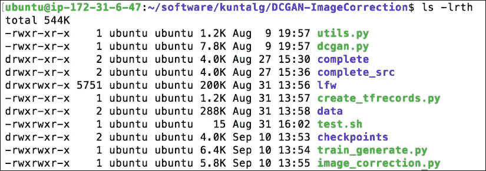

# 第六章：将机器学习带入生产环境

许多机器学习和深度学习的教程、教材和视频只专注于模型的训练和评估。但如何将训练好的模型投入生产，并在实时场景中使用或让客户访问呢？

在本章中，您将使用 `LFW` 数据集开发一个面部图像修正系统，通过您训练的 GAN 模型自动修复损坏的图像。接下来，您将学习几种将机器学习或深度学习模型投入生产的技术，包括在数据中心和云端的微服务容器化环境中部署模型。最后，您将学习如何在无服务器环境和托管的云服务中运行深度模型。

本章我们将讨论以下内容：

+   使用 DCGAN 构建图像修正系统

+   部署机器学习模型的挑战

+   基于容器的微服务架构

+   部署深度学习模型的各种方法

+   在 Docker 上服务 Keras 基础的深度模型

+   在 GKE 上部署深度模型

+   使用 AWS Lambda 和 Polly 进行无服务器的图像识别与语音处理

+   在云托管服务上运行人脸检测

# 使用 DCGAN 构建图像修正系统

图像修正和图像修复是相关的技术，用于填充或补全图像中缺失或损坏的部分。构建一个能够填补缺失部分的系统通常需要两类信息：

+   **上下文信息**：帮助根据周围像素提供的信息推断缺失的像素

+   **感知信息**：帮助解释填充/补全的部分看起来是正常的，就像在现实生活中或其他图片中看到的一样

在本例中，我们将使用 **Labeled Face in the Wild**（`LFW`）数据集和 DCGAN 开发一个图像修正或补全系统。有关 DCGAN 及其架构，请参考第二章，*无监督学习与 GAN*。

在开始构建图像修正系统的步骤之前，我们先定义一些符号和 `loss` 函数：

+   `x`: 损坏的图像。

+   `M`: 表示一个二进制掩码，其值为 1（表示我们想保留的图像部分）或 0（表示我们想修复/补全的图像部分）。`x`和`M`这两个矩阵的逐元素相乘，如所示，将返回图像的原始部分。

+   *pdata*: 被采样数据的未知分布。

一旦我们训练好 DCGAN 的判别器 *D(x)* 和生成器 *G(z)*，就可以利用它通过最大化 *D(x)* 来完成图像 `x` 中缺失的像素。

上下文损失惩罚 *G(z)*，如果其没有为输入图像中已知像素位置创建相似图像，方法是逐元素地将 `x` 中的像素从 *G(z)* 中减去，并计算它们之间的差异：


感知损失使用与训练 DCGAN 时相同的标准，以确保恢复的图像看起来真实：


接下来，我们需要从生成器中找到一个图像，*G(z)*，它能提供合理的缺失像素重建。然后，可以将完成的像素  添加到原始像素中，从而生成重建图像：


### 提示

在 CPU 上训练深度卷积网络可能会非常慢，因此建议使用支持 CUDA 的 GPU 进行涉及卷积或反卷积的图像深度学习活动。

## 构建图像修正系统的步骤

确保你已下载本章的代码：

1.  `DCGAN-ImageCorrection`项目将具有以下目录结构：

1.  现在从[`vis-www.cs.umass.edu/lfw`](http://vis-www.cs.umass.edu/lfw)下载`LFW`数据集（已对深度漏斗进行对齐），并将其内容解压到`lfw`目录下：

    ```py
    wget http://vis-www.cs.umass.edu/lfw/lfw-funneled.tgz 
    tar -xvzf lfw-funneled.tgz

    ```

1.  接下来，执行`create_tfrecords.py`，将`LFW`图像转换为 TensorFlow 标准格式。修改 Python 文件中`LFW`图像路径的位置：

    ```py
    base_path = <Path to lfw directory>
    python create_tfrecords.py

    ```

    这将生成`data`目录下的`tfrecords`文件，如下所示：

    

1.  现在，执行以下命令训练 DCGAN 模型：

    ```py
    python train_generate.py

    ```

    你可以在 Python 文件中修改`max_itr`属性，确定训练应持续的最大迭代次数。一旦训练开始，每进行 5000 次迭代，你将在`lfw-gen`目录下找到生成的图像，如下所示：

    

1.  最后，你可以使用训练好的 DCGAN 模型来修正损坏的图像。你需要将损坏的图像放在`complete_src`目录下，并执行以下命令：

    ```py
    python image_correction.py --is_complete True --latest_ckpt  <checkpoint number>

    ```

你还可以通过在上述命令中指定`center`或`random`来修改遮罩类型，使用`masktype`属性。


上述命令将在完整目录下生成修正或完成的图像，如下所示：


## 将模型部署到生产环境中的挑战

大多数研究人员和机器学习从业者专注于机器学习或深度学习模型的训练和评估。研究中构建模型的现实世界类比类似于在家做饭，而在生产环境中构建或部署该模型则类似于在餐厅为各种不同的顾客（他们的口味随时间变化）做饭。

以下是模型在生产部署过程中常见的一些挑战：

+   **可扩展性**：真实的生产环境与训练或研究环境有很大的不同。你通常需要应对大量的请求而不影响性能。你的模型应该能够根据流量自动扩展（向上/向外），并在流量低时自动缩减（向下/向内）。

+   **自动化模型训练或更新**：现实世界中的数据具有时间动态性，随着模型进入真实的生产环境，数据开始与最初用于训练模型的数据有所不同。这意味着你需要重新训练模型（有时是自动化的），并在模型之间无缝切换。

+   **开发语言之间的互操作性**：通常，由两个人或不同的团队负责模型的研究（训练）和生产化，而研究使用的语言可能与生产所偏好的语言不同。这会导致许多问题，因为机器学习模型在不同的编程语言中有不同的实现，尽管模型本质上是相同的。

+   **训练集元数据的知识**：现实世界中的生产数据可能会缺失值，你需要使用缺失值填充技术来处理这个问题。虽然在生产系统中你不保留训练数据的信息，但为了正确地填充生产环境中到达的缺失值，你必须存储用于填充的训练集统计信息。

+   **实时评估模型性能**：在生产环境中评估模型性能通常需要收集实际数据（或其他实时指标），并随着模型处理更多数据而生成动态页面。此外，你可能需要进行**A/B**测试，通过同时部署两个或更多具有相同功能的模型来评估生产中的性能。

# 使用容器的微服务架构

在传统的**单体**架构中，应用程序将所有功能打包到单一的包（如 EAR 或 WAR）中，并将其部署到应用服务器（如 JBoss、Tomcat 或 WebLogic）上。尽管单体应用程序有各自独立且可区分的组件，但所有组件都打包在一个框架下。

## 单体架构的缺点

单体设计的一些常见陷阱如下：

+   单体架构中的功能组件被打包在一个应用程序下，并且没有隔离。因此，修改单个组件需要更新整个应用程序，从而使整个应用程序停机。在生产环境中，这是不希望出现的情况。

+   扩展单体应用程序效率低下，因为为了扩展，你必须在多个服务器上部署应用程序的每一个副本（WAR 或 EAR），这将占用相同数量的资源。

+   在现实世界中，通常一两个功能组件相比其他组件使用频繁。但是在单体设计中，所有组件将使用相同的资源，因此很难将高度使用的组件分离开来，从而提升整个应用程序的性能。

**微服务**是一种技术，它将大型软件项目分解为松散耦合的模块/服务，这些模块/服务通过简单的 API 相互通信。基于微服务的架构将每个功能放入独立的服务中，从而克服了单体设计的缺点。

## 微服务架构的好处

微服务设计模式的一些优势如下：

+   **单一责任原则**：微服务架构确保每个功能通过简单的 API 作为独立的服务进行部署或暴露。

+   **高可扩展性**：高度使用或需求量大的服务可以部署在多个服务器上，以处理大量请求/流量，从而提高性能。这对于单一的大型单体服务来说是很难实现的。

+   **提高容错性**：单个模块/服务的故障不会影响整个应用程序，并且可以快速恢复或重启故障模块，因为该模块作为独立服务运行。而在单体或庞大的服务中，某个组件/模块出现错误可能会影响到其他模块/功能。

+   **技术栈的自由度**：微服务允许您为特定功能选择最适合的技术，并帮助您在单个服务上尝试新的技术栈。

部署基于微服务的应用程序的最佳方式是将其放入容器中。

### 容器

容器是可共享的、轻量级的进程，运行在主机操作系统之上，并共享主机操作系统的内核（二进制文件和库）。容器通过一层抽象同时解决了许多复杂的问题。容器的流行可以用这个美妙的三位一体来描述：*隔离性*！*可移植性*！*可重复性*！

### Docker

Docker 是最受欢迎的开源项目之一，是一种非常流行的容器化引擎，允许将服务/应用程序及其所有依赖项打包在一起，便于在本地或云中部署。

### Kubernetes

Kubernetes 是 Google 的另一个开源项目，它为容器提供了编排服务，支持自动水平扩展、服务发现、负载均衡等功能。简而言之，它自动化了在云中管理容器化应用程序/服务的过程。

### 注意

在本节中，我们将 Docker 作为容器引擎进行说明，尽管其他容器引擎也提供类似的功能或特性。

## 使用容器的好处

使用容器的一些优点如下所述：

+   **持续部署和测试**：通常，涉及不同环境（如开发和生产）的发布生命周期会因为不同的包版本或依赖关系而有所不同。Docker 通过确保环境的一致性来弥补这一差距，从开发到生产都保持内部配置和依赖关系。因此，您可以在开发和生产之间使用相同的容器，而不会出现任何差异或手动干预。

+   **多云平台**：Docker 的最大优点之一是它在各种环境和平台上的可移植性。所有主要的云服务提供商，如**亚马逊网络服务**（**AWS**）和**谷歌计算平台**（**GCP**），都通过增加个别支持（AWS ECS 或 Google GKE）来支持 Docker 的可用性。只要主机操作系统支持 Docker，Docker 容器就可以在虚拟机 VM 实例（如 Amazon EC2 或 Google Compute Engine）中运行。

+   **版本控制**：Docker 容器像 `Git`/`SVN` 仓库一样充当版本控制系统，您可以将更改提交到 Docker 镜像并进行版本控制。

+   **隔离与安全性**：Docker 确保容器内运行的应用程序彼此完全隔离，提供对流量流动和管理的完全控制。没有任何 Docker 容器能够访问另一个容器内运行的进程。从架构角度看，每个容器都有自己的一套资源。

您可以将高级机器学习或深度学习应用程序与容器的部署能力相结合，使系统更高效、可共享。

# 部署深度模型的各种方法

机器学习既令人兴奋又有趣！不过它也有挑战，无论是在建模阶段还是在部署阶段，尤其是当您希望模型为真实用户和系统提供服务时。

将机器学习模型部署到生产环境中可以通过多种方式完成，生产化机器学习模型的不同方式实际上受到各种因素的影响：

+   您希望您的模型成为实时流分析的一部分，还是批量分析的一部分？

+   您是否希望有多个模型提供相同的功能，或者您需要对模型进行 A/B 测试？

+   您希望您的模型多久更新一次？

+   您如何根据流量扩展您的模型？

+   您如何与其他服务集成或将机器学习服务嵌入到管道中？

## 方法 1 - 离线建模和基于微服务的容器化部署

在这种方法中，您将在离线训练并评估模型后，使用预训练的模型构建一个 RESTful 服务，并将其部署在容器内。接下来，您可以根据成本、安全性、扩展性和基础设施需求，选择在数据中心或云端运行该容器。当您的机器学习或深度学习服务需要持续流量并根据请求激增动态扩展时，这种方法非常适合。

## 方法 2 - 离线建模与无服务器部署

在这种方法中，您将在离线训练模型，并将服务部署在无服务器环境中，如 AWS Lambda（您只需为调用 API 付费；无需为容器或虚拟机实例按小时/分钟支付费用）。当您的模型服务不会持续使用，而是会在某个时间后被调用时，这种方法非常适合。但即使有持续流量（取决于请求数量），与方法 1 相比，这种方法仍可能具有成本效益。

## 方法 3 - 在线学习

有时，您需要通过将机器学习服务与数据流管道集成来执行实时流式分析（例如将其放在具有 IOT 传感器数据的消息队列的消费端）。在实时流式场景中，数据可能会非常频繁地变化。在这种情况下，离线模型训练并不是最佳选择。相反，您需要让模型能够自动适应数据——即它将基于数据使用类似 SGD 或其小批量变体来更新权重/参数。

## 方法 4 - 使用托管的机器学习服务

当您没有资源或团队成员来内部构建机器学习模型时，这种方法非常合适。相反，您可以利用现有的云端托管机器学习或深度学习服务，如 Google Cloud ML、Azure ML、AWS Rekognition、AWS Polly、Google Cloud Vision 等，通过简单的 API 调用满足您的需求。

接下来，我们将通过实践示例来展示之前提到的部署方法。

# 在 Docker 上部署基于 Keras 的深度模型

在这个示例中，我们将构建一个图像识别系统，使用预训练的 Keras InceptionV3 模型，并将其部署在本地机器的容器中。有关预训练模型的更多信息，请参考第四章，*从文本生成真实图像*。我们的预训练 Keras 模型将在 Docker 容器内运行，并通过 Flask 以 REST API 形式暴露出来。


确保您有可用的 `keras-microservice` 项目，然后执行以下步骤以在 `docker` 容器中运行基于 Keras 的深度模型：

1.  首先，检查 Dockerfile 是否在当前工作目录中，然后构建一个 Docker 镜像：

    ```py
    docker build -t keras-recognition-service .

    ```

1.  一旦 Docker 镜像成功构建，使用该镜像运行容器，命令是`docker run`：

    ```py
    docker run -it --rm -d -p <host port>:<container port> -v <host path>:<container path> keras-recognition-service

    ```

    例如：

    ```py
    docker run -it --rm -d -p 5000:80 -v /Users/kuntalg/knowledge:/deep/model keras-recognition-service

    ```

    ### 注意

    在`docker`容器内，Keras 模型运行在名为**Gunicorn**的 WSGI HTTP Python 服务器的`5001`端口上，且由**Nginx**代理服务器在`80`端口进行负载均衡。我们之前使用`–p`属性将主机端口与容器端口映射。此外，我们使用了`-v`卷属性，将主机路径与容器路径映射，以便从该路径加载预训练模型。

    现在是通过执行`test.sh`脚本来测试我们的图像识别服务的时候了。该脚本包含一个`curl`命令，用于调用并测试我们公开的图像识别服务的 REST API：

    ```py
    #!/bin/bash
    echo "Prediction for 1st Image:"
    echo "--------------------------------"
    (echo -n '{"data": "'; base64 test-1.jpg; echo '"}') | curl -X POST -H "Content-Type: application/json" -d @- http://127.0.0.1:5000

    echo "Prediction for 2nd Image:"
    echo "--------------------------------"
    (echo -n '{"data": "'; base64 test-1.jpg; echo '"}') | curl -X POST -H "Content-Type: application/json" -d @- http://127.0.0.1:5000
    ```

1.  最后，执行脚本以从我们的 Keras 服务生成预测：

    ```py
     ./test_requests.sh

    ```

    

Voilà！我们已经成功将第一个基于 Keras 的深度学习模型部署到容器内。

# 在云上使用 GKE 部署深度模型

一旦深度学习模型创建完成，部署在容器内并在本地生成预测结果，就可以使用 Docker 和 Kubernetes 将模型迁移到云端（例如，本示例中的 Google Cloud）。

执行以下步骤将本地创建的容器化模型带到云端：

1.  注册 Google Cloud 免费试用账户（[`cloud.google.com/free`](https://cloud.google.com/free)），然后通过输入相关的**项目名称**创建一个**新项目**：

    请记下包含**项目名称**及一些数字的**项目 ID**，格式为`<项目名称>-xxxxxx`。稍后我们需要使用**项目 ID**将本地模型部署到云端。

1.  在你的机器上安装 SDK（[`cloud.google.com/sdk`](https://cloud.google.com/sdk)）。然后安装 kubectl 以管理 Kubernetes 集群：

    ```py
    gcloud components install kubectl

    ```

    `gcloud`命令包含在 Google Cloud SDK 中。

1.  使用`gcloud`命令行工具的`config`命令设置一些环境变量：

    ```py
    gcloud config set project <project ID>
    gcloud config set compute/zone <zone name such as us-central1-b>
    export PROJECT_ID="$(gcloud config get-value project -q)

    ```

1.  现在使用标签或版本（此示例中的`v1`）构建 Docker 镜像：

    ```py
    docker build -t gcr.io/<project ID>/keras-recognition-service:v1 .

    ```

    例如：

    ```py
    docker build -t gcr.io/deeplearning-123456/keras-recognition-service:v1 .

    ```

1.  接下来，使用`docker push`命令将之前构建的镜像上传到 Google 容器注册表：

    ```py
    gcloud docker -- push gcr.io/<project ID>/keras-recognition-service:v1

    ```

    例如：

    ```py
    gcloud docker -- push gcr.io/deeplearning-123456/keras-recognition-service:v1

    ```

    

1.  一旦容器镜像存储在注册表中，我们需要通过指定计算引擎虚拟机实例的数量来创建容器集群。该集群将由 Kubernetes 协调和管理。执行以下命令以创建一个名为`dl-cluster`的两节点集群：

    ```py
    gcloud container clusters create dl-cluster --num-nodes=2

    ```

1.  我们将使用 Kubernetes 的`kubectl`命令行工具在容器引擎集群上部署并运行应用，监听`80`端口：

    ```py
    gcloud container clusters get-credentials dl-cluster

    kubectl run keras-recognition-service --image=gcr.io/deeplearning-123456/keras-recognition-service:v1 --port 80

    ```

    

1.  现在，将容器集群内运行的应用程序附加到负载均衡器，以便我们可以将图像识别服务暴露给真实世界的用户：

    ```py
    kubectl expose deployment keras-recognition-service --type=LoadBalancer --port 80 --target-port 80

    ```

1.  接下来，运行以下 `kubectl` 命令以获取我们服务的外部 IP：

    ```py
    kubectl get service

    ```

1.  最后，执行以下命令，以从托管在云中容器集群中的图像识别服务获取预测：

    ```py
    (echo -n '{"data": "'; base64 test-1.jpeg; echo '"}') | curl -X POST -H "Content-Type: application/json" -d @- http://<External IP>:80

    ```

    

# 使用 AWS Lambda 和 Polly 进行无服务器音频图像识别

在这个示例中，我们将构建一个基于音频的图像预测系统，使用 TensorFlow 预训练的 InceptionV3 模型，并将其部署在 AWS Lambda 的无服务器环境中。我们将在 AWS Lambda 上运行我们的图像预测代码，并从 S3 加载预训练的模型，然后通过 AWS API 网关将服务暴露给我们的真实客户。


执行以下步骤以在无服务器平台上构建基于音频的图像识别系统：

1.  注册一个 AWS 免费试用账户（[`aws.amazon.com/free/`](https://aws.amazon.com/free/)），并进入 **IAM** 服务创建一个新的角色用于 AWS Lambda。附加两个新的托管策略：**S3FullAccess** 和 **PollyFullAccess**，以及 **lambda_basic_execution** 的内联策略。

1.  接下来，创建一个 S3 桶，用于存储我们的 lambda 代码（包括自定义 Python 包，如 `numpy`、`scipy`、`tensorflow` 等）。还需在 S3 桶内创建三个文件夹：

    +   `code`：我们将在这里存储 lambda 环境的代码

    +   `audio`：我们的预测音频将保存在此位置

    +   `model`：我们将把预训练的模型保存在此位置

    

1.  下载预训练的 TensorFlow 模型（[`download.tensorflow.org/models/image/imagenet/inception-2015-12-05.tgz`](http://download.tensorflow.org/models/image/imagenet/inception-2015-12-05.tgz)），解压缩后，将以下文件上传到 `S3` 桶中的 `model` 目录：

    ```py
    classify_image_graph_def.pb
    imagenet_synset_to_human_label_map.txt
    imagenet_synset_to_human_label_map.txt
    ```

    

1.  `lambda_tensorflow.zip` 包含一个 `classify.py` 文件，该文件将在 `lambda` 函数执行期间被调用。更改桶名称，并在 `classify.py` 中再次打包，然后将其上传到 S3 桶中的 `code` 目录：

    ```py
    def lambda_handler(event, context):

        if not os.path.exists('/tmp/imagenetV3/'):
            os.makedirs('/tmp/imagenetV3/')

        # imagenet_synset_to_human_label_map.txt:
        #   Map from synset ID to a human readable string.
        strBucket = 'kg-image-prediction'
        strKey = 'models/imagenetV3/imagenet_synset_to_human_label_map.txt'
        strFile = '/tmp/imagenetV3/imagenet_synset_to_human_label_map.txt'
        downloadFromS3(strBucket,strKey,strFile)  
        print(strFile)

        # imagenet_2012_challenge_label_map_proto.pbtxt:
        #   Text representation of a protocol buffer mapping a label to synset ID.

        strBucket = 'kg-image-prediction'
        strKey = 'models/imagenetV3/imagenet_2012_challenge_label_map_proto.pbtxt'
        strFile = '/tmp/imagenetV3/imagenet_2012_challenge_label_map_proto.pbtxt'
        downloadFromS3(strBucket,strKey,strFile)
        print(strFile) 

        # classify_image_graph_def.pb:
        #   Binary representation of the GraphDef protocol buffer.
        strBucket = 'kg-image-prediction'
        strKey = 'models/imagenetV3/classify_image_graph_def.pb'
        strFile = '/tmp/imagenetV3/classify_image_graph_def.pb'
        downloadFromS3(strBucket,strKey,strFile)
        print(strFile)
        data = base64.b64decode(event['base64Image'])
        imageName= event['imageName']

        image=io.BytesIO(data)
        strBucket = 'kg-image-prediction'

        strKey = 'raw-image/tensorflow/'+imageName+'.png'
        uploadToS3(image, strBucket, strKey)
        print("Image file uploaded to S3")

        audioKey=imageName+'.mp3'
        print(audioKey)
        print("Ready to Run inference")

        strBucket = 'kg-image-prediction'
        strKey = 'raw-image/tensorflow/'+imageName+'.png'
        imageFile = '/tmp/'+imageName+'.png'
        downloadFromS3(strBucket,strKey,imageFile)
        print("Image downloaded from S3")

        strResult = run_inference_on_image(imageFile)

        # Invoke AWS Polly to generate Speech from text
        polly_client=boto3.client('polly')
        response = polly_client.synthesize_speech(Text =strResult,OutputFormat = "mp3",VoiceId = "Joanna")
        if "AudioStream" in response:
            output = os.path.join("/tmp", audioKey)
            with open(output, "wb") as file:
                file.write(response["AudioStream"].read())

        #Upload speech to S3
        print("Ready upload to S3 audio")
        strBucket = 'kg-image-prediction'
        strKey = 'audio/'+audioKey
        strFile = '/tmp/'+audioKey

        with open(strFile, 'rb') as data:
            uploadToS3(data,strBucket,strKey)
        # Clean up directory
        os.remove(imageFile)
        os.remove(strFile)

        return strResult
    ```

    

1.  现在，从 Web 控制台导航到 **Lambda** 服务，创建一个新的 Lambda 函数。从头开始创建时，提供 **名称** 和 **描述**，选择 **运行时** 为 **Python 2.7**，并将之前创建的 `IAM` 角色附加到此 Lambda 函数中。

1.  然后，在 Lambda 函数配置中指定代码文件（`lambda_tensorflow.zip`）的位置：

1.  还需在 **高级设置** 标签下增加 Lambda 函数的 **内存（MB）** 和 **超时时间**。第一次执行时，由于从 S3 加载预训练模型，Lambda 执行可能会花费一些时间。

1.  接下来，导航到 **API 网关** 服务，创建一个新的 API：

1.  然后，点击 API 左侧面板中的 **二进制支持** 标签，添加以下内容类型：

    +   **image/png**

    +   **image/jpeg**

    

1.  接下来，创建一个 **新子资源**，指定 **资源路径**（例如，`tensorflow-predict`）：

1.  接下来，点击 **操作** 菜单中的 **创建方法**，为子资源添加一个 **POST** 方法。将我们之前创建的 Lambda 函数添加到此 API 资源的 AMP 中。你可能需要选择正确的区域，以从下拉菜单中找到你的 Lambda 函数。

1.  一旦 **POST** 方法创建完成，点击 **集成请求** 并展开 **请求体映射模板** 标签。在 **请求体直通** 下，选择 **当没有定义模板时（推荐）**。然后，在 **Content-Type** 下添加 `image/jpeg`，并在 **生成模板** 部分添加如下内容：

    ```py
    {
    "base64Image": "$input.body",
    "imageName": "$input.params(imageName)"
    }
    ```

    

1.  最后，从 **操作** 菜单部署 API，并定义 **阶段名称**（例如 `prod` 或 `dev`）。API 部署完成后，你将得到如下 API URL：

    `https://<API ID>.execute-api.<region>.amazonaws.com/`

1.  接下来，从 REST 客户端（例如本示例中的 **POSTMAN**）访问你的 API，调用图像预测服务。在 **API 请求** 中，将 **Content-Type** 设置为 **image/jpeg**，并添加参数名 **imageName**，值为（例如 `animal`）。在请求体中添加一个图像作为 `binary` 文件，我们的服务将进行预测：

    `https://<API ID>.execute-api.<region>.amazonaws.com/prod/tensorflow-predict?imageName=animal`

    

太好了！你将在 Postman 响应中看到以下来自无服务器服务的输出：

**"该图像被识别为大熊猫、熊猫、熊猫熊、浣熊熊、熊猫（得分 = 0.89107）"**


此外，预测响应的音频将被生成并存储在 S3 桶中的`audio`文件夹下。


## 修改代码和包以适应 Lambda 环境的步骤

如果需要为你的服务添加额外的 Python 包或更新任何现有包，请执行以下操作：

1.  启动一个 EC2 实例，选择**Amazon Linux AMI 2017.03.1 (HVM)，SSD 卷类型**：

1.  登录到 EC2 实例并将当前 Lambda 代码复制到实例中。然后，创建一个目录，并在该目录中解压 ZIP 文件：

    ```py
    mkdir lambda
    cd lambda
    unzip lambda_tensorflow.zip

    ```

    

1.  若要更新任何现有包，首先删除它，然后使用`pip`命令重新安装。若要添加新的包，请使用`pip`安装（如果该包依赖共享的`.so`库，则需要创建一个`lib`文件夹，并将这些文件从`//usr/lib`和`/usr/lib64`目录中复制到该文件夹中）：

    ```py
    rm -rf tensorflow*
    pip install tensorflow==1.2.0 -t /home/ec2-user/lambda

    ```

1.  然后创建整个目录的 ZIP 文件：

    ```py
    zip –r lambda_tensorflow.zip *

    ```

1.  最后，将 ZIP 文件复制到 S3，并通过提及 S3 上的新 ZIP 文件位置来更新 Lambda 函数。

### 注意

你可能需要去除一些包或不相关的目录，以确保`code`目录中解压后的文件总大小小于 250 MB；否则，Lambda 将无法部署你的代码。

前往以下链接，获取更多关于 Lambda 上自定义包部署的信息：[`docs.aws.amazon.com/lambda/latest/dg/lambda-python-how-to-create-deployment-package.html`](http://docs.aws.amazon.com/lambda/latest/dg/lambda-python-how-to-create-deployment-package.html)

## 使用云托管服务进行面部检测

在这个示例中，我们将使用基于深度学习的托管云服务来进行标签识别和面部检测系统的开发。我们将继续利用无服务器环境 AWS Lambda，并使用深度学习基础的云托管服务 AWS Rekognition 来进行面部属性识别。

执行以下步骤，使用云端托管深度学习服务在无服务器平台上构建面部检测系统：

1.  首先，更新前述示例中的 IAM Lambda 执行角色，并附加一个新的托管策略**AmazonRekognitionFullAccess**，如下所示：

1.  接下来，创建一个新的 Lambda 函数，用于构建人脸检测服务。选择**Runtime**为**Python 2.7**，并保持所有其他设置为默认。将更新后的 IAM 角色附加到此 Lambda 函数：

1.  然后，将以下代码粘贴到**Lambda 函数代码**区域。在代码中的`boto3.client`部分，更新 S3**桶名称**和 AWS**区域**信息，如下所示：

    ```py
    from __future__ import print_function

    import json
    import urllib
    import boto3
    import base64
    import io

    print('Loading function')

    s3 = boto3.client('s3')
    rekognition = boto3.client("rekognition", <aws-region name like us-west-1>)

    bucket=<Put your Bucket Name>
    key_path='raw-image/'

    def lambda_handler(event, context):

        output={}
        try:
            if event['operation']=='label-detect':
                print('Detecting label')
                fileName= event['fileName']
                bucket_key=key_path + fileName
                data = base64.b64decode(event['base64Image'])
                image=io.BytesIO(data)
                s3.upload_fileobj(image, bucket, bucket_key)
                rekog_response = rekognition.detect_labels(Image={"S3Object": {"Bucket": bucket,"Name": bucket_key,}},MaxLabels=5,MinConfidence=90,)
                for label in rekog_response['Labels']:
                    output[label['Name']]=label['Confidence']
            else:
                print('Detecting faces')
                FEATURES_BLACKLIST = ("Landmarks", "Emotions", "Pose", "Quality", "BoundingBox", "Confidence")
                fileName= event['fileName']
                bucket_key=key_path + fileName
                data = base64.b64decode(event['base64Image'])
                image=io.BytesIO(data)
                s3.upload_fileobj(image, bucket, bucket_key)
                face_response = rekognition.detect_faces(Image={"S3Object": {"Bucket": bucket,  "Name": bucket_key, }}, Attributes=['ALL'],)
                for face in face_response['FaceDetails']:
                    output['Face']=face['Confidence']
                    for emotion in face['Emotions']:
                        output[emotion['Type']]=emotion['Confidence']
                    for feature, data in face.iteritems():
                        if feature not in FEATURES_BLACKLIST:
                            output[feature]=data
        except Exception as e:
            print(e)
            raise e    

        return output      
    ```

1.  一旦你创建了 Lambda 函数，我们将为此服务创建一个 API 网关子资源，如下所示：

1.  接下来，我们将向新子资源（**predict**）添加一个方法（此处为**PUT**），然后点击**PUT**方法的**Integration Request**。

1.  现在，将先前创建的**Lambda Function**附加到此资源方法上。你需要选择创建 Lambda 函数的 AWS**Lambda Region**，以便在下拉列表中获取 Lambda 函数名称：

1.  接下来，展开**Body Mapping Templates**部分，并在**Request body passthrough**部分选择**When there are no templates defined (recommended)**。然后，在**Content-Type**中添加映射模板**image/png**，并将以下代码粘贴到**General template**区域：

    ```py
    {
    "base64Image": "$input.body",
    "operation": "$input.params('activity')",
    "fileName": "$input.params('fileName')"
    }
    ```

    

1.  现在，通过点击**Action**菜单中的**Deploy API**，部署你的 API Gateway 资源 API。一旦资源部署完成，你将获得一个 API 网关，使用该网关可以调用人脸检测服务。我们将继续使用之前的 REST 客户端**Postman**（[`chrome.google.com/webstore/detail/postman/fhbjgbiflinjbdggehcddcbncdddomop?hl=en`](https://chrome.google.com/webstore/detail/postman/fhbjgbiflinjbdggehcddcbncdddomop?hl=en)），但你也可以使用任何你喜欢的其他 REST 客户端。API 网关的 URL 将如下所示：

    `https://<API ID>.execute-api.<AWS Region>.amazonaws.com/prod/predict`

1.  添加**Content-Type**为**image/png**，并在请求中添加两个请求参数：activities 和 filenames。参数**activity**有两个取值（**label-detect**用于图像识别或标签检测）和（**face-detect**用于人脸检测）。**fileName**参数将用于将原始图像以该名称保存到 S3 中。

1.  现在，调用你的服务来检测标签或人脸，并获得以下 JSON 格式的响应输出：

# 概要

到目前为止，你已经学习并实现了多种方式来部署训练好的深度模型，并为新的数据样本进行预测。你还学会了如何使用 Docker 容器将模型从本地计算机或数据中心顺利迁移到云端。希望通过本书中大量使用真实世界公共数据集的动手示例，你已经很好地理解了生成对抗网络（GANs）的概念及其变体架构（SSGAN、BEGAN、DCGAN、CycleGAN、StackGAN、DiscoGAN）。一旦你动手实验了本书中的代码和示例，我肯定会鼓励你做以下事情：

参与 Kaggle 对抗网络比赛: [`www.kaggle.com/c/nips-2017-defense-against-adversarial-attack`](https://www.kaggle.com/c/nips-2017-defense-against-adversarial-attack)。

通过参加或观看以下会议，保持你对深度学习和生成对抗网络（GANs）的知识更新：

+   **神经信息处理系统** (**NIPS**): [`nips.cc/`](https://nips.cc/)

+   **国际学习表征会议** (ICLR): HTTP://WWW.ICLR.CC/
