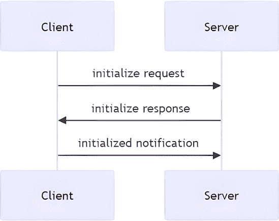
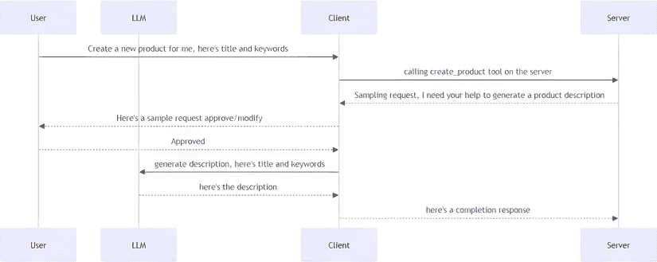
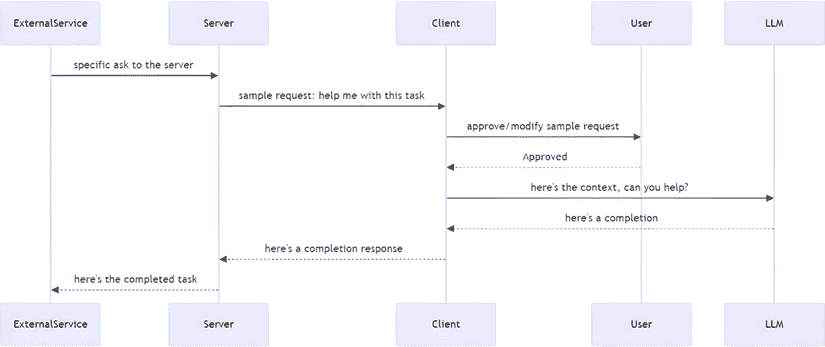
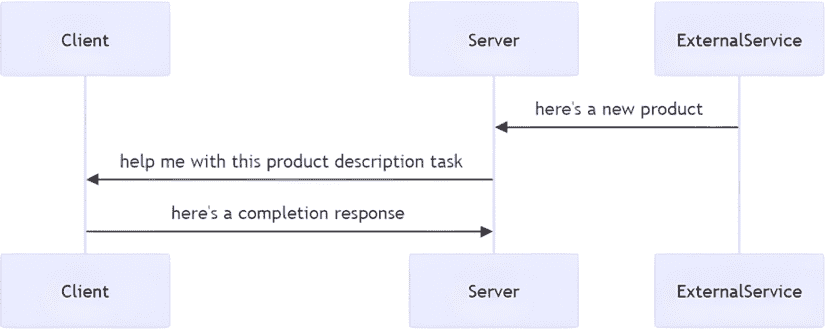
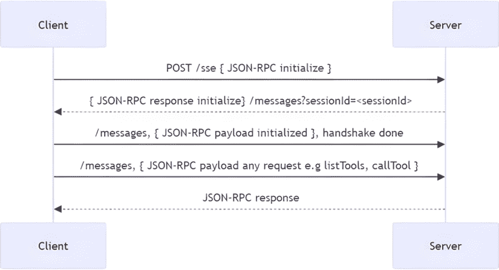
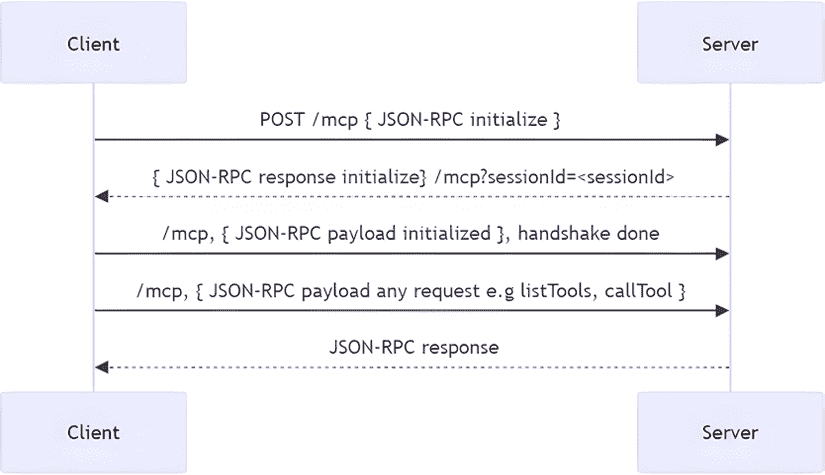

# 第二章：解释模型上下文协议

MCP 由许多部分组成。简而言之，**JavaScript 对象表示法-远程过程调用**（**JSON-RPC**）消息在客户端和服务器之间交换。JSON-RPC 消息遵循 JSON-RPC 规范的消息，这意味着它有`jsonrpc`、`id`、`method`和`params`字段，数据类型是 JSON。一个例子可能如下所示：

```py
{
  "jsonrpc": "2.0",
  "id": 1,
  "method": "doSomething",
  "params": {
    "foo": "bar"
  }
} 
```

**快速提示**：使用**AI 代码解释器**和**快速复制**功能增强您的编码体验。在下一代 Packt Reader 中打开此书。点击**复制**按钮

（**1**）快速将代码复制到您的编码环境中，或点击**解释**按钮

（**2**）让 AI 助手为您解释一段代码。


**新一代 Packt Reader**随本书免费赠送。扫描二维码或访问[`packtpub.com/unlock`](https://packtpub.com/unlock)，然后使用搜索栏通过书名查找本书。仔细核对显示的版本，以确保您获得正确的版本。


为了更容易理解并更有趣，本章尝试通过带您了解协议的实现来解释该协议。因此，我们希望本章更容易阅读（不仅仅是架构图）并一窥*事物是如何工作的*。如果您想立即开始构建 MCP 服务器，请直接跳转到*第三章*，但如果您想更深入地了解 MCP 协议，请继续阅读。您也可以稍后返回本章。

在本章中，您将学习以下内容：

+   MCP 中最常见的消息流及其消息类型

+   基础 SDK 实现的大致工作原理

本章涵盖了以下主题：

+   通过实现来了解协议

+   MCP 中的传输

# 通过实现来了解协议

我们不打算将本章写成关于协议及其不同消息的枯燥章节，而是通过实际讨论实现过程中的过程和消息来使其变得有趣。作为解释过程及其流程的一部分，您将看到流程图以及作为代码实现的流程。让我们开始吧。

# MCP 中的传输

MCP 中传输的理念是定义客户端和服务器如何通信。MCP 是传输无关的，这意味着它可以通过 HTTP、WebSockets、STDIO 等方式工作。传输是处理底层消息交换的层。它交换类型为 JSON-RPC 的消息。

MCP 支持一系列传输，从 STDIO（用于本地运行的服务器）到可流式传输的 WebSockets 和**服务器发送事件**（**SSEs**），最后是请求/响应传输，如 HTTP。

对于指定的每个传输，它们都有一个共同点，即它们都在流上操作。所有传输都有一个方法来暴露这些流，如下所示：

```py
async with anyio.create_task_group() as tg
    ...
    yield (read_stream, write_stream) 
```

此外，还有一个名为 `BaseSession` 的类，所有传输都使用它来发送原始 JSON-RPC 消息，其格式如下。

```py
class BaseSession(
    Generic[
        SendRequestT,
        SendNotificationT,
        SendResultT,
        ReceiveRequestT,
        ReceiveNotificationT,
    ],
):
  ...
def send_request():
  ...
def send_notification():
  ...
def response():
  ...
def _send_response():
  ... 
```

这个类定义了 `send_request`、`send_notification` 和 `response` 等方法，这些方法用于发送 JSON-RPC 消息。

## STDIO 传输

好吧，让我们开始了解和实现 MCP 中的消息流。我们将使用 STDIO 传输作为这个练习的例子。让我们开始吧！

我相信你对在控制台看到消息甚至键入控制台很熟悉——那就是 **标准输入和输出**，或简称 **STDIO**。但我们是如何利用这些 *流* 来为程序服务的呢？好吧，让我们从服务器和客户端的角度来思考。客户端会向服务器发送消息，服务器会做出响应。让我们看看 STDIO 的一个非常简单的服务器实现：

服务器需要监听 **标准输入**（**stdin**）以接收传入的消息。在 Python 中，你可以使用 `sys.stdin` 并迭代它以获取下一个消息，如下所示：

```py
import sys
for line in sys.stdin:
    message = line.strip() 
```

我们还希望区分简单文本消息和 JSON-RPC 消息。简单文本消息可以直接处理，而 JSON-RPC 消息则需要根据 JSON-RPC 规范进行解析并做出响应。让我们通过以下代码来识别 JSON-RPC 消息的结构：

```py
if line.startswith('{"jsonrpc":'):
    json_message = json.loads(line)
    # do something with message 
```

此外，我们还需要向调用客户端发送消息。我们可以使用 `print` 和 `sys.stdout.flush()` 来实现，如下所示：

```py
print("message")
sys.stdout.flush() 
```

现在我们已经确定了要实现的关键元素，让我们创建第一个服务器：

```py
import sys
import json
while True:
    for line in sys.stdin:
        message = line.strip()
        if message == "hello":
            # send message to client
            print("hello there")
            sys.stdout.flush()  # Ensure output is sent immediately
        elif message.startswith('{"jsonrpc":'):
            # parse it as a JSON message
            json_message = json.loads(message)
            # identify what type of JSON-RPC message it is and
            # respond accordingly
            match json_message['method']:
                case "tools/list":
                    response = {
                        "jsonrpc": "2.0",
                        "id": json_message["id"],
                        "result": ["tool1", "tool2"]
                    }
                    print(json.dumps(response))
                    sys.stdout.flush()
                    break
                case _:
                    print(f"Unknown method: {json_message['method']}")
                    sys.stdout.flush()
                    break
        elif message == "exit":
            print("Exiting server.")
            sys.stdout.flush()
            sys.exit(0)
        else:
            print(f"Unknown message: {message}") 
```

在前面的代码中，我们做了以下操作：

+   创建了监听 `sys.stdin` 的代码

+   如果发送的是 `hello`，则响应 `hello there`；如果给定 JSON 消息，则解析它并检查其 `method` 属性，然后根据其值做出不同的响应

+   添加了代码，如果输入文本为 `exit`，则使程序关闭

注意我们如何打印和刷新代码如下：

```py
print(json.dumps(response))
sys.stdout.flush() 
```

这可以重写为一个 `send_response` 函数，如下所示：

```py
def send_response(response):
    print(json.dumps(response))
    sys.stdout.flush() 
```

这意味着我们的服务器代码现在将看起来像这样：

```py
#server.py
import sys
import json
def send_response(response):
    print(json.dumps(response))
    sys.stdout.flush()
while True:
    for line in sys.stdin:
        message = line.strip()
        if message == "hello":
            send_response("hello there")
        elif message.startswith('{"jsonrpc":'):
            json_message = json.loads(message)
            match json_message['method']:
                case "tools/list":
                    response = {
                        "jsonrpc": "2.0",
                        "id": json_message["id"],
                        "result": ["tool1", "tool2"]
                    }
                    send_response(response)
                    break
                case _:
                    send_response(f"Unknown method:
                        {json_message['method']}")
                    break
        elif message == "exit":
            send_response("Exiting server.")
            sys.exit(0)
        else:
            send_response(f"Unknown message: {message}") 
```

### 创建客户端

那么，我们如何为这个创建一个客户端呢？好吧，客户端应该发送消息并能够接收服务器消息。实现这一点的办法是将服务器作为一个子进程创建，客户端作为父进程向服务器发送消息。然后，我们可以通过标准输入和输出与之通信。

下面是一个实现示例：

作为客户端向服务器发送消息的方式是通过写入其 `stdin` 并从其 `stdout` 读取。以下是一个简单的示例：

```py
proc.stdin.write(message)
proc.stdin.flush() 
```

这段代码可以被重构为一个 `send_message` 函数，如下所示：

```py
def send_message(proc, message):
    proc.stdin.write(message)
    proc.stdin.flush() 
```

当我们创建客户端时，让我们在客户端代码中使用 `send_message` 函数。

```py
#client.py
import subprocess
import json
# Start the child process
proc = subprocess.Popen(
    ['python3', 'server.py'],  # Replace with your child script
    stdin=subprocess.PIPE,
    stdout=subprocess.PIPE,
    text=True
)
list_tools_message = {
    "jsonrpc": "2.0",
    "id": 1,
    "method": "tools/list",
    "params": {}
};
message = 'hello\n'
def send_message(message):
    """Send a message to the child process."""
    print(f'[CLIENT] Sending message to server...
        Message: {message.strip()}')
    proc.stdin.write(message)
    proc.stdin.flush()
def serialize_message(message):
    """Serialize a message to JSON format."""
    return json.dumps(message) + '\n'
# Send a message to the child
send_message(message)
# Read response from child
response = proc.stdout.readline()
print('[SERVER]:', response.strip())
# send a JSON-RPC message
send_message(serialize_message(list_tools_message))
response = proc.stdout.readline()
print('[SERVER]:', response.strip())
# this closes down the child process aka server
send_message('exit\n')
proc.stdin.close()
exit_code = proc.wait()
print(f"Child exited with code {exit_code}") 
```

在这里，你可以看到以下情况发生：

+   客户端创建一个服务器作为子进程，并通过使用`send_message`方法写入`stdin`来向这些进程写入出站消息

+   相反，它监听`stdout`以接收子进程（服务器）通过`proc.stdout.readline()`代码发送的响应

这段代码是构建 MCP 和 STDIO 传输的绝佳起点。实际上，这正是发生的事情，只不过 MCP 是通过 JSON-RPC 消息进行通信的，所以让我们让它更像 MCP。

### MCP 和 STDIO 传输

我们在上一节中的代码基本上就像 STDIO 传输对 MCP 所做的那样。然而，为了完全真实，客户端和服务器需要交换 JSON-RPC 消息。那么，这些是什么？

让我们看看一个示例`jsonrpc`消息：

```py
const listTools = {
    "jsonrpc": "2.0",
    "id": 1,
    "method": "tools/list",
    "params": {}
}; 
```

在这里，我们有一个 JSON-RPC 消息，它之所以是一个，首先是因为它是以 JSON 格式编写的，其次是因为它有一个名为`jsonrpc`的属性。此外，它应该有一个`id`属性、`method`和`params`。前面的`tools/list`消息是客户端发送给服务器的内容，服务器应该响应其可用的工具，因为这个命令用于确定服务器有什么工具。

那么，构建 MCP 服务器时的第一步是什么？嗯，它是初始化过程，也称为**握手**，所以让我们接下来处理它。

在解决方案文件夹中查看此代码的运行示例——检查[`github.com/PacktPublishing/Learn-Model-Context-Protocol-with-Python/blob/main/Chapter02/Solutions/README.md`](https://github.com/PacktPublishing/Learn-Model-Context-Protocol-with-Python/blob/main/Chapter02/Solutions/README.md)。

## MCP 中的初始化过程

接下来，现在我们有了简单的客户端和服务器代码，我们应该专注于 MCP 中的初始化过程，有时也称为握手。

在这个高度上，初始化看起来是这样的：



图 2.1 – 初始化过程

在前面的过程中发生的事情是这样的：

+   首先，客户端发送一个*initialize*请求，这意味着它想从服务器了解其能力。

+   然后，服务器响应其能力——即它拥有的功能。

+   最后，客户端通过发送一个*initialized*通知来让服务器知道它已准备好执行操作。在提到的通知之前，任何其他类型的消息，如列出或运行工具，都应该产生一个错误响应，因为*握手*尚未完全完成。

让我们看看每一步的消息：

1.  **客户端发送 initialize 请求**：这是客户端发送给服务器的：

    ```py
    {
      "jsonrpc": "2.0",
      "id": 1,
      "method": "initialize",
      "params": {
        "protocolVersion": "2024-11-05",
        "capabilities": {
          "roots": {
            "listChanged": true
          },
          "sampling": {}
        },
        "clientInfo": {
          "name": "ExampleClient",
          "version": "1.0.0"
        }
      }
    } 
    ```

这是一个*initialize*消息，你可以从`method`的值`initialize`中看到。客户端还必须发送其`capabilities`，在这个例子中包括`roots`和`sampling`。让我们更仔细地看看客户端的能力：

```py
"capabilities": {
    "roots": {
      "listChanged": true
    },
    "sampling": {}
  } 
```

1.  **服务器初始化响应**：另一方面，服务器必须以类似的消息回答其功能——即它是否支持工具、资源、提示、通知等。以下是一个典型的服务器响应示例：

    ```py
    {
      "jsonrpc": "2.0",
      "id": 1,
      "result": {
        "protocolVersion": "2024-11-05",
        "capabilities": {
          "logging": {},
          "prompts": {
            "listChanged": true
          },
          "resources": {
            "subscribe": true,
            "listChanged": true
          },
          "tools": {
            "listChanged": true
          }
        },
        "serverInfo": {
          "name": "ExampleServer",
          "version": "1.0.0"
        }
      }
    } 
    ```

观察响应中的`capabilities`属性，其中包含诸如日志记录、提示、资源和工具等内容。**日志记录**是服务器向客户端发送日志消息的能力。我们将在*第五章*中展示日志通知的示例。其他功能——提示、资源和工具——是服务器可以拥有的基本功能——更多关于这些内容将在*第三章*中介绍。

这个答案将帮助客户端确定它可以和不可以使用什么。它还提供了有关协议版本和服务器信息。

让我们来看看客户端发送的`initialized`消息，然后我们将尝试实现前面的消息流程。

1.  **完成握手**：作为最后一步，客户端发送一个`initialized`消息。这是*握手*的最终消息。一旦收到，服务器就可以准备处理客户端关于工具、资源或提示的任何类型的 JSON-RPC 消息。客户端的这条消息不应产生服务器的响应。然而，服务器应该记住它已经被初始化。一旦初始化完成，*正常*操作就可以进行，例如调用工具、提示等。以下是详细的`initialized`消息——如您所见，它携带的信息不多，但对于客户端和服务器正常操作至关重要。在发送此通知之前，您无法做很多事情。

    ```py
    {
      "jsonrpc": "2.0",
      "method": "notifications/initialized"
    } 
    ```

我们如何实现这一点？让我们接下来看看。

### 实现初始化

双方交换了一些信息。实际上，客户端只需向服务器发送`initialized`即可完成，但通过`initialize`首先交换功能被认为是一种良好的实践。

之前小节中的客户端代码只是发送文本消息和 JSON-RPC 消息，但并没有真正遵循初始化过程的流程。为了解决这个问题，我们需要修改客户端，使其能够正确处理初始化序列。初始化序列完成后，客户端可以发送其他类型的消息，例如列出工具等。

让我们在客户端添加一个`connect`函数，并确保它首先请求服务器功能，然后通知服务器初始化已完成。

```py
# client.py
def connect():
    print("Connecting to the server...")
    # 1\. Ask for capabilities
    send_message(serialize_message(initialize_message))
    # Read response from child/server
    response = proc.stdout.readline()
    print_response(response, prefix='[SERVER]: \n')  
    # 2\. Send initialized notification, handshake is done
    send_message(serialize_message(initialized_message)) 
```

让我们来解释一下实现方法：

+   它创建了一个`connect`函数，请求功能并发送了`initialized`通知。

+   它设置了一个调用链，从通过派发`initialize`消息请求功能开始，然后派发`initialized`，从而结束*握手*过程。

让我们通过一个`main`函数进一步改进事情，如下所示：

```py
def list_tools():
    # 3\. send a message to list tools
    # send a JSON-RPC message
    send_message(serialize_message(list_tools_message))
    response = proc.stdout.readline()
    print_response(response, prefix='[SERVER]: \n')
def close_server():
    send_message('exit\n')
    exit_code = proc.wait()
    print(f"Child exited with code {exit_code}")
def main():
    connect()
    list_tools()
    close_server()
main() 
```

这是我们的创建结果：

+   我们创建了一个`main`函数，该函数连接到服务器，列出工具，并在完成后关闭服务器连接

+   我们定义了`list_tools`，它发送一个特定的 JSON-RPC 消息，请求服务器列出其工具

+   此外，我们还创建了`close_server`方法，它向服务器发送一个*退出*消息。

让我们专注于服务器部分：

对于服务器，我们需要确保它做出相应的反应。这意味着服务器只需要接受带有`initialize`或`notifications/initialized`方法的消息。初始化之前的所有其他消息应引发错误。初始化之后，我们支持的所有其他消息都应该允许客户端发送。

为了处理客户端尝试执行初始化之外的操作的情况，这里有一些代码来处理这种情况：

```py
if method != "initialize" and method != "notifications/initialized":
    print(f"Server not initialized. Please send an 'initialized'
        notification first. You sent {method}")
    sys.stdout.flush()

    continue 
```

此代码将停止对消息的进一步处理，并等待下一个传入的消息。

对于`initialize`和`notifications/initialized`消息，我们可以这样处理：

```py
match method:
      case "notifications/initialized":
        # print("Server initialized successfully.")
        sys.stdout.flush()
        initialized = True
        break
      case "initialize":
        print(json.dumps(initializeResponse))
        sys.stdout.flush()
        # initialized = True
        break
        # should return capabilities 
```

让我们把代码放在一起，看看完整的服务器是什么样的：

```py
# server.py
# code omitted for brevity
elif message.startswith('{"jsonrpc":'):
  json_message = json.loads(message)
  method = json_message.get('method', '')
  if not initialized:
    if method != "initialize" and method != "notifications/initialized":
        print(f"Server not initialized. Please send an 'initialized'
            notification first. You sent {method}")
      sys.stdout.flush()

      continue
    match method:
      case "notifications/initialized":
        # print("Server initialized successfully.")
        sys.stdout.flush()
        initialized = True
        break
      case "initialize":
        print(json.dumps(initializeResponse))
        sys.stdout.flush()
        # initialized = True
        break
        # should return capabilities
      case "tools/list":
        response = {
          "jsonrpc": "2.0",
          "id": json_message["id"],
          "result": ["tool1", "tool2"]
        }
        print(json.dumps(response))
        sys.stdout.flush()
        break
      case _:
        print(f"Unknown method: {json_message['method']}")
        sys.stdout.flush()
        break 
```

作为练习，建议你根据需要改进前面的解决方案。你可以将此代码重写为`send_response`方法，如下所示：

```py
def send_response(response):
  print(json.dumps(response))
  sys.stdout.flush() 
```

在前面的代码中，我们做了以下操作：

+   定义了一个`elif`，表示如果我们收到一个 JSON-RPC 消息，我们将尝试正确路由该消息

+   添加了一个检查，表示如果我们尚未初始化，并且消息不是请求功能或客户端发送的`"notifications/initialized"`通知，那么我们发送一条消息回显这不是一个合适的消息类型。

+   初始化之后，我们可以接受列出工具等消息，在这种情况下，我们以我们的工具作为响应。

在解决方案文件夹中查看此代码的运行示例。检查*初始化*（[`github.com/PacktPublishing/Learn-Model-Context-Protocol-with-Python/blob/main/Chapter02/Solutions/README.md`](https://github.com/PacktPublishing/Learn-Model-Context-Protocol-with-Python/blob/main/Chapter02/Solutions/README.md)）。

## 支持的功能

现在我们有了更健壮的代码，让我们支持工具、资源和提示等功能。

你已经看到了`connect`是一个我们用来与服务器握手的函数。之后，我们想要调用一个工具、一个资源和一个提示，并在继续下一步操作之前等待它们的响应。因此，为了使这种行为成为可能，我们需要做以下操作：

1.  将消息放置在流中。

1.  等待响应到达。

1.  如果我们得到一个正常的响应，显示它；如果是通知，则忽略它。服务器通知通常是特殊消息或进度更新，我们将在下一节中实现对该功能的支持。

太好了，我们有一个计划。让我们回顾一下`main`方法，看看我们有哪些内容。

现在，我们需要考虑如何处理`list_tools()`调用返回的响应，如下面的代码所示：

```py
def main():
    connect()
    list_tools()
    close_server()
main() 
```

理想情况下，我们希望捕获响应并对其进行处理，例如，将这些工具存储起来，以便我们稍后可以通过例如`call_tool`（我们还没有但计划创建的方法）来调用它们。

因此，我们希望以下代码能够被编写：

```py
def main():
    connect()
    tools = list_tools()
    call_tool(tools[0], args) # should specify args to call_tool
    close_server()
main() 
```

在这一点上，我们需要捕获`list_tools`的响应，并且我们需要打印它。为了实现这一点，我们需要确保服务器和客户端都进行了更改。客户端需要将响应存储在`tools`变量中，服务器需要识别正在发送`list tools`命令，并响应适当的 JSON-RPC 消息。

让我们先看看服务器。在这里，我们需要添加一个新的情况，`tools/list`，列出所有工具：

```py
# server.py
# code omitted for brevity
case "tools/list":

    response = {
        "jsonrpc": "2.0",
        "id": json_message["id"],
        "result": {
            "tools": [
                {
                    "name": "example_tool",
                    "description": "An example tool that does something.",
                    "inputSchema": {
                        "type": "object",
                        "properties": {
                            "arg1": {
                                "type": "string",
                                "description": "An example argument."
                            }
                        },
                        "required": ["arg1"]
                    }
                }
            ]
        }
    }
    print(json.dumps(response))
    sys.stdout.flush()
    break 
```

在前面的代码中，值得指出的是以下内容：

+   `tools`属性：这应该指向工具列表。

+   `inputSchema`：这个模式应该描述这个工具接受的参数以及它们是否是必须发送的。对于这个特定的工具，它被称为`example_tool`，它有一个参数`arg1`，这是必需的。

现在我们已经完成了服务器端，让我们接下来关注客户端。首先，让我们定义`list_tools`方法：

```py
# client.py
def list_tools():
    # 3\. send a message to list tools
    # send a JSON-RPC message
    send_message(serialize_message(list_tools_message))
    response = proc.stdout.readline()
    return json.loads(response)['result']['tools'] 
```

接下来，让我们使用`main`方法中的`list_tools`：

```py
# client.py
tools = []
def main():
    connect()
    tool_response = list_tools()
    tools.extend(tool_response)

    print("Tools available:", tools) 
```

在`main`方法中，我们调用`list_tools`，保存`tool_response`响应，并将其添加到我们将要稍后用于尝试调用服务器上工具的`tools`列表中。

我们还需要支持如何调用工具。就像之前一样，我们先添加服务器部分：

```py
# server.py
case "tools/call":
    tool_name = json_message['params']['name']
    args = json_message['params']['args']
    # todo create a response for the tool call, i.e call the right tool
    response = {
        "jsonrpc": "2.0",
        "id": json_message["id"],
        "result": {
            "properties": {
                "content": {
                    "description": "description of the content",
                    "items": [
                        { "type": "text", "text": f"Called tool
                            {tool_name} with arguments {args}" }
                    ]
                }
            }
        }
    }
    print(json.dumps(response))
    sys.stdout.flush()
    break 
```

在前面的代码中，我们做了以下操作：

+   构建了一个 JSON-RPC 消息。

+   添加了具有`properties`属性的`result`，它本身有一个属性，即`content`。该属性有一个包含描述调用工具结果的多个文本块的`items`数组。在更实际的实现中，应该调用相关的工具，并将结果列在这里。

接下来，让我们关注客户端部分。我们需要一个`call_tool`方法：

```py
# omitting code for brevity
def call_tool(tool_name, args):
    # 4\. call a tool
    # send a JSON-RPC message
    tool_message = {
        "jsonrpc": "2.0",
        "method": "tools/call",
        "params": {
            "name": tool_name,
            "args": args
        },
        "id": 1
    }
    send_message(serialize_message(tool_message))
    response = proc.stdout.readline()
    return
        json.loads(response)["result"]["properties"]["content"]["items"] 
```

在这里，我们做以下操作：

+   构建一个 JSON-RPC 消息，并将`tool_name`和`args`作为消息的一部分传递。

+   通过将响应加载为 JSON 并深入响应以获取包含相关响应部分的`items`来处理响应。

在`main`方法中，我们需要添加以下代码：

```py
def main():
    connect()
    tool_response = list_tools()
    tools.extend(tool_response)

    print("Tools available:", tools)
    tool = tools[0]
    tool_call_response = call_tool(tool["name"],{"args1": "hello"})
    for content in tool_call_response:
        print_response(content['text'], prefix='[SERVER] tool response: \n')
    # print_response(tool_call_response['result'], prefix='[SERVER]: \n')
    # call tool, we need a name and arguments
    close_server() 
```

在前面的代码中，我们做了以下操作：

+   使用工具的名称调用`call_tool`，并且我们也传递了参数。我们硬编码了参数。

+   遍历响应以获取我们在服务器上定义的文本块响应。

在所有这些部分就绪后，运行程序现在也应该将其作为输出的一部分列出：

```py
[CLIENT]:  {
  "jsonrpc": "2.0",
  "method": "tools/call",
  "params": {
    "name": "example_tool",
    "args": {
      "arg1": {
        "type": "string",
        "description": "An example argument."
      }
    }
  },
  "id": 1
}
[SERVER] tool response:
 Called tool example_tool with arguments {'args1': 'hello'} 
```

太好了，现在我们有了列出服务器上的工具和调用工具所需的所有功能。不过，应该指出的是，调用工具也应该执行计算。目前，我们只是列出调用了哪些工具以及传递了什么参数，所以这是一个好的开始，但我们应该进一步改进。

让我们继续讨论通知。通知可以从服务器发送到客户端，也可以从客户端发送到服务器。

在解决方案文件夹中查看此代码的运行示例——检查*功能* ([`github.com/PacktPublishing/Learn-Model-Context-Protocol-with-Python/blob/main/Chapter02/Solutions/README.md`](https://github.com/PacktPublishing/Learn-Model-Context-Protocol-with-Python/blob/main/Chapter02/Solutions/README.md))。

## 通知、报告进度和重要更新

通知是客户端和服务器都可以相互发送的东西。通常，他们想要告诉对方发生了重要的事情——例如，一个长时间运行的工具响应可能会报告进度，或者服务器可能会发送消息来报告其功能的变化。那么，我们如何支持通知呢？好吧，它有两个方面：

+   **从客户端或服务器发送通知类型消息**。这看起来是这样的：

    ```py
    {
      "jsonrpc": "2.0",
      "method": "notifications/[type]",
      "params": {}
    } 
    ```

`[type]`通常是`cancelled`或`progress`。有关类型的完整规范，请查看[`github.com/modelcontextprotocol/modelcontextprotocol/blob/main/schema/2025-03-26/schema.ts`](https://github.com/modelcontextprotocol/modelcontextprotocol/blob/main/schema/2025-03-26/schema.ts)。

+   **通知的作用**。对于客户端来说，通知被视为一个额外的事物，你应该在用户界面中展示出来，以改善用户体验。然而，客户端向服务器发送的通知则有所不同。例如，客户端向服务器发送通知以将状态设置为`"initialized"`。

那么，我们如何实现这一点呢？好吧，我们大部分已经准备好了。尽管如此，我们将在我们的代码中添加以下内容：

+   从服务器向客户端发送通知，在这种情况下，报告等待调用工具的结果时的进度

+   在我们的`list_tools`和`call_tool`函数中添加逻辑以支持处理到达的通知。

首先，让我们看看我们如何支持客户端上的通知：

```py
# client.py
# code omitted for brevity
def list_tools():
    # 3\. send a message to list tools
    # send a JSON-RPC message
    send_message(serialize_message(list_tools_message))
    has_result = False
    while not has_result:
        response = proc.stdout.readline()
        # check if message has result attribute, if so break out of loop

        parsed_response = json.loads(response)
        if 'result' in parsed_response:
            has_result = True
            return parsed_response['result']['tools']
        else:
            # this is a notification, we can print it
            print_response(response, prefix='[SERVER] notification: \n') 
```

在这里，我们重写了`list_tools`并为其添加了一个循环。只要我们接收到的不是最终结果，我们就将其打印出来（因为它是一个通知）。然后，一旦我们得到最终结果——也就是说，它包含一个`result`属性——我们就从函数中返回它。

我们如何在服务器端处理这个问题呢？我们需要几件事情：

+   需要创建一个通知消息。我们可以将其放置在我们的`utils`文件夹中的`messages.py`文件里。

    ```py
    # utils/messages.py
    progress_notification = {
        "jsonrpc": "2.0",
        "method": "notifications/progress",
        "params": {
            "message": "Working on it..."
        }
    }; 
    ```

+   我们需要从我们希望它发生的地方发送实际的通知。为了展示它是如何工作的，让我们将其添加到`tools/list`案例中，如下所示：

    ```py
    # server.py
    # code omitted for brevity
    case "tools/list":
        # send notification about progress first, then later the
        #response
        print(json.dumps(progress_notification))
        sys.stdout.flush() 
    ```

应该指出的是，进度通知，尤其是当调用工具时，应该使用，而不是列出你拥有的工具，因为调用工具在某些情况下可能是一个耗时的操作，所以让我们添加这一点。首先，让我们以与客户端上的`list_tools`相同的方式重做`call_tool`：

```py
# client.py
# code omitted for brevity
def call_tool(tool_name, args):
    # 4\. call a tool
    # send a JSON-RPC message
    tool_message = {
        "jsonrpc": "2.0",
        "method": "tools/call",
        "params": {
            "name": tool_name,
            "args": args
        },
        "id": 1
    }
    has_result = False
    send_message(serialize_message(tool_message))
    while not has_result:
        response = proc.stdout.readline()
        parsed_response = json.loads(response)
        if 'result' in parsed_response:
            has_result = True
            return
                parsed_response["result"]["properties"]
                    ["content"]["items"]
        else:
            # this is a notification, we can print it
            print_response(response, prefix='[SERVER]
                notification: \n') 
```

就像在 `list_tools` 中一样，我们添加了一个循环，只打印通知，除非最终结果显示出来。这里确实有一些代码重复，所以我们可能想在某个时候将其拆分成一个实用函数。让我们看看服务器上需要添加什么：

```py
# server.py
# code omitted for brevity
case "tools/call":
    tool_name = json_message['params']['name']
    args = json_message['params']['args']
    print(json.dumps(progress_notification))
    sys.stdout.flush()
    print(json.dumps(progress_notification))
    sys.stdout.flush() 
```

好的，所以现在我们已经添加了代码，向处理类型为 `tools/call` 的传入消息的案例发送两条通知。

当我们再次尝试运行它时，我们应该在输出末尾看到以下内容：

```py
[SERVER] notification:
 {
  "jsonrpc": "2.0",
  "method": "notifications/progress",
  "params": {
    "message": "Working on it..."
  }
}
[SERVER] notification:
 {
  "jsonrpc": "2.0",
  "method": "notifications/progress",
  "params": {
    "message": "Working on it..."
  }
}
[SERVER] tool response:
 Called tool example_tool with arguments {'args1': 'hello'} 
```

显然，两条通知在调用工具响应之前到达。

应该说，从性能的角度来看，如果我们将其视为 SDK 实现，我们可能会更改并添加`asyncio`库以确保非阻塞。为了演示消息如何来回流动，它已经起到了作用，但可以稍作改进。

太好了——我们已经成功实现了通知并进行了一些很好的重构。让我们看看下一个采样。

在解决方案文件夹中查看此代码的运行示例——检查*通知*([`github.com/PacktPublishing/Learn-Model-Context-Protocol-with-Python/blob/main/Chapter02/Solutions/README.md`](https://github.com/PacktPublishing/Learn-Model-Context-Protocol-with-Python/blob/main/Chapter02/Solutions/README.md))。

## 采样 – 帮助服务器完成请求

**采样**是一个有趣的功能。它的意思就是服务器在告诉客户端，“我不知道如何做这件事”，或者“你做得更好——你能帮我完成这个请求吗？”更具体地说，服务器要求客户端使用客户端的**大型语言模型**（**LLM**）来完成请求。

好的，所以我们已经确定服务器有时需要客户端帮助它完成请求。客户端帮助的方式是通过向其 LLM 请求响应，然后将响应传递回服务器。

那么，起点是什么呢？好吧，它可能是一个调用服务器上工具的客户端，然后该工具生成一个采样请求。然后流程可能看起来是这样的：



图 2.2 – 采样流程，场景 1

**快速提示**：需要查看此图像的高分辨率版本吗？在下一代 Packt Reader 中打开此书或在其 PDF/ePub 副本中查看。

**下一代 Packt Reader**以及本书的**免费 PDF/ePub 副本**包含在您的购买中。扫描二维码或访问[`packtpub.com/unlock`](https://packtpub.com/unlock)，然后使用搜索栏通过名称查找本书。请仔细检查显示的版本，以确保您获得正确的版本。


或者，它可能是一个生成事件的外部服务，服务器会监听这个事件。以下是该场景的流程：



图 2.3 – 采样流程，场景 2

从消息的角度来看，以下是服务器发送给客户端的内容：

```py
{
  messages: [
    {
      role: "user" | "assistant",
      content: {
        type: "text" | "image",
        // For text:
        text?: string,
        // For images:
        data?: string,             // base64 encoded
        mimeType?: string
      }
    }
  ],
  modelPreferences?: {
    hints?: [{
      name?: string                // Suggested model name/family
    }],
    costPriority?: number,         // 0-1, importance of minimizing cost
    speedPriority?: number,        // 0-1, importance of low latency
    intelligencePriority?: number  // 0-1, importance of capabilities
  },
  systemPrompt?: string,
  includeContext?: "none" | "thisServer" | "allServers",
  temperature?: number,
  maxTokens: number,
  stopSequences?: string[],
  metadata?: Record<string, unknown>
} 
```

在先前的请求中包含了一些信息：

+   `messages` 是助手和用户之间的聊天对话，并为请求提供了所需上下文。

+   `modelPreferences`：在这里，服务器可以指定诸如首选模型名称以及决定成本、速度和能力优先级的事情

此外，还有关于模型配置的数据正在发送，包括温度、要使用的标记数量等。值得注意的是，这些是客户可以选择接受或修改的建议。

客户随后应该以完成消息的形式响应，如下所示：

```py
{
  model: string,  // Name of the model used
  stopReason?: "endTurn" | "stopSequence" | "maxTokens" | string,
  role: "user" | "assistant",
  content: {
    type: "text" | "image",
    text?: string,
    data?: string,
    mimeType?: string
  }
} 
```

在先前的响应中，以下信息被涵盖：

+   `model` 是使用的模型。它不必与服务器请求的相同。

+   `stopReason` – 了解你是否得到了完整的响应，或者是否因为其他原因而停止，这是很好的。

+   `content` 是内容响应。

### 介绍一个场景：电子商务

然而，这发生在什么时候呢？好吧，服务器可能会监听它应该做出反应的事件。例如，假设你有一个电子商务场景，某个系统正在注册新产品。然而，在这些产品可以销售之前，它们需要一个合适的描述。这个描述是客户及其 LLM 可以帮助完成的事情。



图 2.4 – 电子商务场景流程

在最后一步，服务器记录、存储并可能缓存响应。

让我们看看这个上下文中的一个请求。以下是一个来自服务器的示例请求：

```py
{
  "method": "sampling/createMessage",
  "params": {
    "messages": [
      {
        "role": "user",
        "content": {
          "type": "text",
          "text": "Create a selling product description for this sweater,
            keywords autumn, cozy, knitted"
        }
      }
    ],
    "systemPrompt": "You are a helpful assistant assisting with
      product descriptions",
    "includeContext": "thisServer",
    "maxTokens": 300
  }
} 
```

如您所见，我们决定只提供上下文，并省略了关于使用哪种模型或配置的建议，但如果我们想的话，我们可以添加这些。

现在取决于客户端如何解释这个请求并做出响应。

### 实现采样

让我们在代码中实现采样，我们将使用产品描述场景，这样你可以看到它是如何被使用的。以下是我们需要的内容：

+   **外部服务**：此服务应生成一个需要产品描述的新产品。这个产品已被另一个系统中的某人注册，并作为监听事件的结果出现在这个服务器上作为消息有效负载。这是特定场景的代码。

+   **服务器 – 样本请求**：我们只需要发送`json-rpc`请求的能力。

+   **客户响应**：我们需要监听这种特定的消息类型，使用消息的有效负载调用 LLM，并将响应返回给服务器。

让我们从外部服务开始。这实际上不是 MCP 的一部分，但它可能会让你对如何集成一个生成你感兴趣消息的外部组件有一个概念：

在这里，我们正在添加一个外部服务，它最终将注册新产品。它将在随机的时间间隔内生成新产品并发送给任何监听者。

```py
# server.py
# code omitted for brevity
class ProductStore:
    def __init__(self):
        self.started = False
        self.listeners = {}
        # create timer that adds a product to the queue every 5 seconds
    def add_product(self):
        """Add a product to the store and notify listeners."""
        product = {
            "id": str(random.randint(10000, 99999)),
            "name": f"Product {random.randint(1, 100)}",
            "price": round(random.uniform(10.0, 100.0), 2),
            "keywords": [f"keyword{random.randint(1, 5)}" for _ in
                range(random.randint(1, 3))]
        }
        self.dispatch_message("new_product", product)
    def start_product_queue_timer(self):
        """Start a timer that adds a product to the queue
            every 5 seconds."""
        def schedule_next():
            delay = random.uniform(1, 2)
            self.product_timer = threading.Timer(delay, self.add_product)
            self.product_timer.start()
        def add_twice():
            schedule_next()
            schedule_next()
        add_twice()
    def add_listener(self, message, callback):
        if not self.started:
            self.started = True
            self.start_product_queue_timer()
        """Add a listener for product updates."""
        # In a real application, this would register the callback
        #to be called when a new product is added
        callbacks = self.listeners.get(message, [])
        callbacks.append(callback)
        self.listeners[message] = callbacks
    def dispatch_message(self, message, payload):
        """Dispatch a message to all registered listeners."""
        callbacks = self.listeners.get(message, [])
        for callback in callbacks:
            callback(payload) 
```

首先，我们创建一个能够创建和分发我们希望客户帮助的产品类。在之前提到的场景中，我们需要客户及其 LLM 为我们生成描述。

下面是产品存储库代码的组成部分：

+   `ProductStore`类：这个存储库应该模拟一个外部源，该源可以随时发送需要增强产品描述的新产品。将这个存储库视为一个队列，例如，它可以长时间轮询 API 或监听消息队列。关键是它只是一个占位符，只有你知道这个结构是什么，因为它针对特定的解决方案。

+   几个辅助方法，例如`add_listener`、`dispatch_message`和`start_product_queue_timer`：后者负责在特定时间间隔调度产品。 

现在我们将通过首先创建产品存储库，然后向其添加监听器来与产品存储库进行交互。每当添加新产品时，监听器应向客户发送消息。

```py
def create_sampling_message(product):
    sampling_message = {
        "jsonrpc": "2.0",
        "id": 1,
        "method": "sampling/createMessage",
        "params": {
            "messages": [{
                "role": "system",
                "content": {
                    "type": "text",
                    "text": f"New product available:
                        {product['name']} (ID: {product['id']},
                            Price: {product['price']}). Keywords:
                                {', '.join(product['keywords'])}"
                }
            }],
            "systemPrompt": "You are a helpful assistant assisting
                with product descriptions",
            "includeContext": "thisServer",
            "maxTokens": 300
        }
    }
    return sampling_message
store = ProductStore()
store.add_listener("new_product", lambda product:
    print(json.dumps(create_sampling_message(product)))) 
```

我们还需要一种方式在服务器上接收来自客户端的采样响应。让我们看看我们如何处理这个问题。我们目前与客户端的主要问题是，我们并没有真正设置好来处理可以随时到达的消息。我们现在所拥有的是，我们明确地从客户端发送调用到服务器，并期望得到一个响应，然后我们处理这个响应。为了解决这个问题，我们需要稍微改变我们的架构，使用一个后台线程。它的工作方式如下：

1.  线程监听`stdout`上的消息。

1.  如果收到消息（来自服务器），则将其放入队列以供后续处理。

1.  对于样本消息，我们不会将它们放入队列，而是直接处理，对于通知和常规响应，我们将它们放入队列，并让它们在相应的方法（例如`list_tools`、`call_tool`等）中处理。

让我们看看我们如何设置线程：

```py
# client.py
def listen_to_stdout():
    """Listen to the stdout of the child process and handle messages."""
    while True:
        response = proc.stdout.readline()
        if not response:
            break  # Exit if no more output
        try:
            parsed_response = json.loads(response)
            if is_sampling_message(parsed_response):
                handle_sampling_message(parsed_response)
                # consume message if it is a sampling message
            else:
                # put message in the queue for further processing
                message_queue.put(response.strip())
        except json.JSONDecodeError:
            # If the response is not JSON, just print it
            print("[THREAD] Non-JSON response received:",
                response.strip())
            # print_response(response, prefix='[THREAD]: \n')
# create thread and start it
listener_thread = threading.Thread(target=listen_to_stdout, daemon=True)
listener_thread.start() 
```

上述代码执行以下操作：

+   从`stdout`读取。

+   检查是否有采样消息。如果有，它将尝试通过调用`handle_sampling_message`来处理它。如果不是采样消息，则将其放入队列。

这里还有一些我们也需要的辅助方法：

```py
def is_sampling_message(message):
    """Check if a message is a sampling message."""
    return message.get('method', '').startswith('sampling')
def create_sampling_message(llm_response):
    """Create a sampling message for a product."""
    sampling_message = {
        "jsonrpc": "2.0",
        "result": {
            "content": {
                "text": llm_response
            }
        }
    }
    return sampling_message
def call_llm(message):
    return "LLM: " + message
def handle_sampling_message(message):
    """Handle a sampling message."""
    print("[CLIENT] Calling LLM to complete request", message)
    # get content info from message, send that to LLM
    content = message['params']['messages'][0]['content']['text']
    llm_response = call_llm(content)
    message = create_sampling_message(llm_response)
    send_message(serialize_message(message))
    # should call LLM to complete request 
```

尤其值得注意的是`handle_sampling_message`，它从服务器接收消息并调用`call_llm`（我们已模拟此方法；你应该确保在实际实现中它调用实际的 LLM）。然后构建响应并将其发送回服务器进行缓存、记录或服务器需要对其进行的其他操作。

由于我们现在依赖于这个队列来接收消息，我们需要修改`list_tools`和`call_tool`以从该队列读取，而不是从流中读取，如下所示：

```py
while not has_result:
    # response = proc.stdout.readline()
    response = message_queue.get() 
```

在这里，我们注释了如何请求最新的消息，调用`readline`，而现在我们调用`message_queue.get`。

就这样 – 这就是采样的工作方式。它起源于服务器，作为事件的结果，然后它请求客户端的帮助，客户端做出响应。应该强调的是，客户端不必完全按照服务器的要求去做 – 那就是使用特定的模式或配置。你应该在平等用户面前展示服务器请求，这样他们就有机会做出响应并配置客户端发送的内容 – 那就是有人工干预。

在解决方案文件夹中查看此代码的运行示例 – 检查 *采样* ([`github.com/PacktPublishing/Learn-Model-Context-Protocol-with-Python/blob/main/Chapter02/Solutions/README.md`](https://github.com/PacktPublishing/Learn-Model-Context-Protocol-with-Python/blob/main/Chapter02/Solutions/README.md))。

## SSE 传输

到目前为止，我们已经走过了 MCP 的很大一部分。那么，SSE 和 STDIO 之间的区别是什么？主要区别在于消息的流动方式。在 STDIO 中，消息在本地机器的 `stdin` 和 `stdout` 流之间传递；对于 SSE，消息通过 HTTP 在网络上流动。这意味着所有主要动作，如握手、初始化、工具调用等，都需要重新考虑为客户端和服务器之间的网络请求。

从概念上讲，SSE 传输被实现为一个具有 `/messages` 和 `/sse` 路由的网络服务器。前者处理传入的 MCP 消息，而后者用于建立流式传输事件的连接。

这是从宏观层面看的样子：



图 2.5 – SSE 传输流程

我们将在 *第四章* 中更详细地介绍 SSE，但现在我们已经在宏观层面上很好地理解了与 STDIO 相比的不同之处。

## Streamable HTTP

在某种程度上，Streamable HTTP 与 SSE 类似，因为使用 Streamable HTTP 的 MCP 服务器可以通过网络上的 URL 访达。有一些差异和相似之处。让我们使这一点更加清晰：

+   SSE 和 Streamable HTTP 都需要客户端接受 `text/event-stream`。对于 Streamable HTTP，客户端还需要接受 `application/json`，因为服务器可以选择是流式传输响应还是以 JSON 格式发送它们。对于 SSE，服务器始终以 `text/event-stream` 格式发送内容。

+   SSE 连接通常是长生命周期的 `GET` 请求，而 Streamable HTTP 通常为 `POST`。

从实现的角度来看，它与 SSE 非常相似 – 即，它被实现为一个网络服务器。然而，对于 Streamable HTTP，在 MCP 的上下文中，你应该设置一个路由，`/mcp`，该路由处理连接和消息，并且它也应该设置为 `POST`。



图 2.6 – Streamable HTTP 流程

因此，实现 Streamable HTTP 比 SSE 简单一些，因为你只需要跟踪一个端点，`/mcp`。关于 Streamable HTTP 的更多内容请参阅 *第五章*。

# 摘要

在本章中，我们涵盖了大量的信息。最重要的收获是，客户端和服务器通信需要在进一步操作之前进行初始化。幸运的是，大多数 SDK 都负责初始化部分，您通常可以通过调用和列出工具等方式开始客户端-服务器通信。希望这对那些认为图表有助于理解的人和喜欢看到代码样子的人都有所帮助。代码 *是有效的*，但当然可以为了性能、可维护性等方面进行改进。请尝试运行代码 – 检查解决方案文件夹。

在下一章中，我们将学习如何构建和测试我们的第一个服务器。本章将作为 MCP 动手实践的良好介绍。

# 作业

尝试运行提供的代码[`github.com/PacktPublishing/Learn-Model-Context-Protocol-with-Python/blob/main/Chapter02/Solutions/README.md`](https://github.com/PacktPublishing/Learn-Model-Context-Protocol-with-Python/blob/main/Chapter02/Solutions/README.md)，以查看事物是如何工作的。代码应该执行以下操作：

+   初始化连接

+   发送初始化通知

+   列出工具

+   调用一个工具并生成通知

+   生成示例消息

代码是分步骤构建的，因此值得查看您选择的运行时所有子文件夹。

# 解决方案

您可以通过[`github.com/PacktPublishing/Learn-Model-Context-Protocol-with-Python/blob/main/Chapter02/Solutions/README.md`](https://github.com/PacktPublishing/Learn-Model-Context-Protocol-with-Python/blob/main/Chapter02/Solutions/README.md)访问解决方案。

# 测验

在服务器和客户端之间的 *握手* 被视为完成之前，需要发生什么？

+   A: 客户端需要首先发送 *initialize*，等待服务器响应，然后发送 *initialized*。

+   B: 客户端和服务器可以立即调用，例如，列出工具。

+   C: 客户端需要向服务器发送 *initialized*。

您可以通过[`github.com/PacktPublishing/Learn-Model-Context-Protocol-with-Python/blob/main/Chapter02/Solutions/solution-quiz.md`](https://github.com/PacktPublishing/Learn-Model-Context-Protocol-with-Python/blob/main/Chapter02/Solutions/solution-quiz.md)访问解决方案。

|

#### 现在解锁这本书的独家优惠

扫描此二维码或访问[`packtpub.com/unlock`](https://packtpub.com/unlock)，然后通过名称搜索此书。 |  |

| **注意**：在开始之前准备好您的购买发票。* |
| --- |
