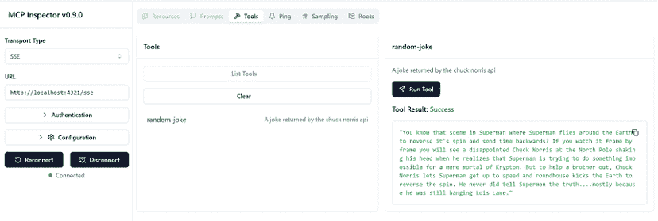

# 第四章：构建 SSE 服务器

到目前为止，你已经看到了如何使用 STDIO 作为传输构建 MCP 服务器。这是一个为本地运行的服务器而选择的优秀传输方式。然而，如果你想要通过 HTTP 远程连接到服务器，或者如果你想要从 LLM 流式传输响应，那么还有一种称为 **Server-Sent Events** （**SSE**）的传输方式更适合这种情况。

在本章中，我们将专注于使用 SSE 作为传输构建和测试 MCP 服务器。

本章涵盖了以下主题：

+   SSE 概念

+   创建一个作为 web 应用的 SSE 服务器

+   使用 SSE 进行测试

+   创建 SSE 服务器

让我们深入了解 SSE 的细节以及如何使用它构建服务器。

# SSE 概念

在我们开始构建服务器之前，有一些概念我们需要理解。首先，使用 SSE 作为传输的服务器是一个可以通过 HTTP 访问的服务器。这意味着，即使它可以在本地运行，也可以远程访问。这一点的含义是，这是一个我们需要通过 web 服务器公开的服务器。

SSE 是一个标准，用于在单个长连接上从服务器到客户端的单向通信。它允许服务器在不要求客户端轮询更改的情况下向客户端推送实时更新。以下是一些更详细的说明：

+   **协议**：SSE 使用标准的 HTTP，MIME 类型为 text/event-stream

+   **客户端 API**：浏览器使用 EventSource API 接收事件

+   **格式**：消息以纯文本形式发送，字段如 `event`、`data` 和 `id`，每个字段由两个换行符终止

它通常用于需要实时更新的仪表板类应用程序。

在 MCP 中，SSE 被分为两部分：我们连接到服务器并执行初始化（例如，*握手*）的部分，以及一个消息部分，我们将消息应用到服务器，最终读取或写入数据。因此，我们需要实现以下端点：

+   **SSE 端点**：这个端点用作客户端和服务器之间建立连接握手的方式。通过向这个端点发送请求，客户端将收到一个响应，这将保持连接打开。

+   **消息端点**：这个端点用于将消息路由到 MCP 服务器及其功能。

应该指出的是，根据选择的运行时和 SDK，你可能需要自己实现这些端点，但对于某些运行时，这些操作是在幕后完成的。无论如何，了解它是如何工作的以及端点在做什么是很好的。

# 创建一个作为 web 应用的 SSE 服务器

与使用 STDIO 传输相比，最大的不同之处在于我们需要将 SSE 服务器公开为 web 应用程序。根据我们是否使用 Python 或 TypeScript，这意味着我们需要实现必要的 HTTP 端点。

特别对于 Python 来说，我们需要利用支持 **异步服务器网关接口**（**ASGI**）的框架。ASGI 是一个规范，它允许 Python 网络框架处理异步和同步代码，使其非常适合现代网络应用程序。让我们看看 Starlette。

## Starlette

**Starlette** 是一个轻量级的 ASGI 框架，我们将用它来构建我们的 SSE 服务器。之前我们提到了需要实现端点，Starlette 将帮助我们实现这些。它提供了一个简单的方法来创建 ASGI 应用程序并处理路由、中间件和其他功能。

让我们看看 Starlette 的工作原理，然后更详细地解释如何使用它构建 SSE 服务器。

使用 Starlette 的典型应用程序将看起来像这样：

```py
from starlette.applications import Starlette
from starlette.responses import JSONResponse
from starlette.routing import Route
async def homepage(request):
    return JSONResponse({'hello': 'world'})
app = Starlette(debug=True, routes=[
    Route('/', homepage),
]) 
```

在前面的代码中，我们做了以下操作：

+   从 Starlette 导入了必要的模块

+   定义了一个简单的 `homepage` 函数，它返回一个 JSON 响应

下一步是运行它。我们可以使用 `uvicorn` 这样的服务器来运行我们的 Starlette 应用程序：

```py
uvicorn main:app 
```

在这里，我们使用 `uvicorn` 来运行应用程序。语法是 `uvicorn <filename>:<name of app instance>`。在这种情况下，文件名是 `main.py`，应用程序实例是 `app`。

## Starlette 和 MCP

要使用 Starlette 与 MCP，我们可以创建以下应用程序：

```py
from starlette.applications import Starlette
from starlette.routing import Mount, Host
from mcp.server.fastmcp import FastMCP
mcp = FastMCP("My App")
# Mount the SSE server to the existing ASGI server
app = Starlette(
    routes=[
        Mount('/', app=mcp.sse_app()),
    ]
)
# or dynamically mount as host
app.router.routes.append(Host('mcp.acme.corp', app=mcp.sse_app())) 
```

在前面的代码中，我们正在做以下操作：

+   从 Starlette 和 MCP 导入必要的模块。

+   使用 `FastMCP` 创建应用程序的实例。请注意 `mcp.sse_app()` 方法。这是创建 SSE 服务器并将其挂载到现有 ASGI 服务器的方法。幕后发生的事情是，它为您创建了 SSE 端点和消息端点。

如果您想深入了解 Python SDK 来查看这是如何实现的，您可以查看 [`github.com/modelcontextprotocol/python-sdk/blob/e80c0150e1c2e45f66195d3cf7d209be31ce6e5d/src/mcp/server/fastmcp/server.py#L747`](https://github.com/modelcontextprotocol/python-sdk/blob/e80c0150e1c2e45f66195d3cf7d209be31ce6e5d/src/mcp/server/fastmcp/server.py#L747)，您将看到以下代码作为 `sse_app()` 方法的一部分：

```py
routes.append(
    Route(
        self.settings.sse_path,
        endpoint=sse_endpoint,
        methods=["GET"],
    )
)
routes.append(
    Mount(
        self.settings.message_path,
        app=sse.handle_post_message,
    )
) 
```

如您所见，通过调用 `sse_app()` 方法，为您创建了 SSE 端点和消息端点。

那么，使用 SSE 的功能是否与 STDIO 的工作方式相同？是的，它们是相同的。您可以使用相同的装饰器和方法来创建功能。唯一的区别是您需要使用 `mcp.sse_app()` 方法来创建 SSE 服务器并将其挂载到现有的 ASGI 服务器。

# 使用 SSE 进行测试

然而，当涉及到使用 SSE 的测试工具时，它们之间还是存在一些差异。让我们列出这些差异：

+   **检查工具**：**检查工具**是一个命令行工具，允许您使用视觉界面和命令行界面测试您的服务器。STDIO 和 SSE 之间的区别在于您需要将**传输类型**指定为**SSE**，将**URL**指定为`http://<address>:<port>/sse`。这是在使用视觉界面时需要做的事情。

对于 CLI 模式，您需要指定一个 URL 而不是运行服务器的方式。因此，以下命令将有效，前提是您的服务器正在`localhost:8000`上运行：

```py
npx @modelcontextprotocol/inspector --cli http:localhost:8000/sse --method tools/list 
```

让我们看看视觉界面中的区别：



图 4.1 – 检查工具，视觉模式，SSE

**快速提示**：需要查看此图像的高分辨率版本吗？在下一代 Packt Reader 中打开此书或在其 PDF/ePub 副本中查看。

**下一代 Packt Reader**以及本书的**免费 PDF/ePub 副本**包含在您的购买中。扫描二维码或访问[`packtpub.com/unlock`](https://packtpub.com/unlock)，然后使用搜索栏通过名称查找此书。请仔细核对显示的版本，以确保您获得正确的版本。


注意**传输类型**设置为`SSE`，**URL**设置为`http://localhost:8000/sse`。记住，在使用 STDIO 时我们没有**URL**字段，而是有一个指定如何运行服务器的字段？这是 STDIO 和 SSE 在检查工具中的区别。

+   **Web 客户端**：因为 SSE 服务器运行在 HTTP 上，您可以使用任何 HTTP 客户端来测试它。这包括 Postman、cURL 或甚至您的网络浏览器。要使用 cURL，您可以使用以下命令：

    1.  获取会话 ID：

        ```py
        export MCP_SERVER="http://0.0.0.0:8000"
        curl "${MCP_SERVER}/sse" 
        ```

    这将产生如下响应：

    ```py
     ```文本

    event: endpoint

    data: http://localhost:5001/messages?session_id=<my session id>

    ```py 
    ```

1.  使用会话 ID 向消息端点的服务器发送消息。

确保您在另一个终端实例中发送此命令。此请求的答案将出现在第一个终端中。

```py
export MCP_ENDPOINT="http://localhost:8000/messages?session_id=<my session id>" 
```

1.  在发送初始化请求的不同终端中发送消息到服务器，例如列出工具。

    ```py
    curl -X POST "${MCP_ENDPOINT}" -H "Content-Type: application/json" -d '{
      "jsonrpc": "2.0",
      "id": 1,
      "method": "tools/list"
    }' 
    ```

因此，是的，使用 cURL 可以做到这一点，但操作略显繁琐，这使得检查工具成为测试服务器的绝佳选择——同样也适用于 SSE。

# 创建 SSE 服务器

好的，所以我们理解了 SSE 的概念以及如何构建服务器，甚至测试工具的工作原理以及与 STDIO 的不同之处。现在是我们构建自己的 SSE 服务器的时候了。我们将学习如何做以下事情：

1.  设置项目

1.  添加服务器代码

1.  测试服务器

## 创建项目

让我们创建一个新项目，如下所示：

1.  创建虚拟环境：

    ```py
    python -m venv venv 
    ```

1.  激活虚拟环境：

    ```py
    source venv/bin/activate 
    ```

1.  安装依赖项：

    ```py
    pip install "mcp[cli]" 
    ```

在那里，您应该已经准备好开始构建您的 SSE 服务器。

## 添加服务器代码

现在将以下代码添加到您的项目中：

在 `server.py` 中添加以下代码：

```py
from starlette.applications import Starlette
from starlette.routing import Mount, Host
from mcp.server.fastmcp import FastMCP
mcp = FastMCP("My App")
# Mount the SSE server to the existing ASGI server
app = Starlette(
    routes=[
        Mount('/', app=mcp.sse_app()),
    ]
) 
```

在前面的代码中，我们做了以下操作：

+   从 Starlette 和 MCP 导入了必要的模块。

+   使用应用程序的名称创建了一个 `FastMCP` 实例。特别注意 `mcp.sse_app()` 方法帮助我们挂载 SSE 握手和消息路由的端点。

## 添加功能

下一步是向你的服务器添加功能。如前所述，当涉及到功能时，STDIO 和 SSE 之间没有区别。你可以使用相同的装饰器和方法来创建功能。

在同一文件中添加以下代码：

```py
@mcp.tool()
def add(a: int, b: int) -> int:
    """calc"""
    return a + b 
```

你将有机会在作业的后期添加更多功能，但到目前为止，你有一个具有添加两个数字功能的工作服务器。

## 运行它

下一步是运行服务器。

1.  使用命令行启动服务器：

    ```py
    uvicorn main:app --port 3000 
    ```

语法是 `uvicorn <filename>:<app>`，其中 `<filename>` 是你的 Python 文件名，而 `<app>` 是你的 ASGI 应用程序名。

1.  使用命令行启动 **检查** 工具：

    ```py
    mcp dev server.py 
    ```

在 UI 中设置以下字段：

+   **传输类型**：**SSE**

+   **URL**：`http://localhost:3000/sse`

按照常规尝试你的功能，但现在使用 SSE 服务器。

## 测试它

我们将以三种不同的方式测试我们的服务器。

+   **检查工具，作为可视化界面**：这是一种测试服务器并查看其工作方式的好方法

+   **带有 CLI 选项的检查工具**：CLI 选项直接在命令行中提供响应。这是一种在例如 CI/CD 管道中测试服务器的好方法。

+   **使用客户端**：在这里，我们将使用 cURL 来测试我们的服务器是否能够响应请求。这是一种快速测试服务器的好方法。

### 检查工具

让我们尝试使用可视化界面使用检查工具。使用命令行启动检查工具：

在运行服务器的新的终端窗口中运行以下命令。

```py
npx @modelcontextprotocol/inspector 
```

在 UI 中设置以下字段：

+   **传输类型**：**SSE**

+   **URL**：`http://localhost:3000/sse`

在 **工具** 部分中选择 **添加** 并输入 **a** 和 **b** 的值：

```py
5
10 
```

### 检查工具作为 CLI 选项

对于这个选项，我们将像之前一样使用检查工具，但这次添加了 `--cli` 选项以在 CLI 模式下运行。记住，我们将直接在命令行中获取响应，而不是在 UI 中：

```py
npx @modelcontextprotocol/inspector --cli http://127.0.0.1:3000/sse --method tools/call --tool-name add --tool-arg a=5 --tool-arg b=10 
```

你应该会看到以下输出：

```py
{
  "content": [
    {
      "type": "text",
      "text": "15"
    }
  ],
  "structuredContent": {
    "result": 15
  },
  "isError": false
} 
```

### cURL 命令

要使用 cURL 进行测试，我们需要进行三个调用：

1.  对 `/sse` 的调用。这应该会返回一个会话 ID：

    ```py
    curl http://127.0.0.1:3000/sse 
    ```

你应该会看到类似于以下输出的内容：

```py
 event: endpoint
 data: /messages/?session_id=53ddee76d5ec4b4aaa9420f24462210a 
```

1.  对 `/messages` 的调用，其中包含初始化的 MCP 消息和会话 ID。

应在运行服务器的单独终端中运行以下命令。

```py
 curl -X POST "http://127.0.0.1:3000/messages/?session_id=53ddee76d5ec4b4aaa9420f24462210a" -H "Content-Type: application/json" -d '{
   "jsonrpc": "2.0",
   "method": "notifications/initialized"
 }' 
```

这将告诉服务器我们已准备好进行通信。

1.  **功能请求**：以下 `curl` 命令是请求列出 MCP 服务器上的工具。

以下命令应在与上一个命令相同的终端中运行。

```py
curl -X POST "http://127.0.0.1:3000/messages/?sessionId=53ddee76d5ec4b4aaa9420f24462210a" -H "Content-Type: application/json" -d '{
  "jsonrpc": "2.0",
  "id": 1,
  "method": "tools/list",
  "params": {}
}' 
```

现在，你应该会在初始化连接时使用的第一个终端中看到响应。它应该看起来类似于以下内容：

```py
event:message
data: {"result":{"tools":[{"name":"products","description":"get products by category","inputSchema":{"type":"object","properties":{"category":{"type":"string"}},"additionalProperties":false,"$schema":"http://json-schema.org/draft-07/schema#"}},{"name":"cart-list","description":"get products in cart","inputSchema":{"type":"object","properties":{},"additionalProperties":false,"$schema":"http://json-schema.org/draft-07/schema#"}},{"name":"cart-add","description":"Adding products to cart","inputSchema":{"type":"object","properties":{"title":{"type":"string"}},"additionalProperties":false,"$schema":"http://json-schema.org/draft-07/schema#"}},{"name":"add","inputSchema":{"type":"object","properties":{"a":{"type":"number"},"b":{"type":"number"}},"required":["a","b"],"additionalProperties":false,"$schema":"http://json-schema.org/draft-07/schema#"}}]},"jsonrpc":"2.0","id":1} 
```

作为建议，我更喜欢使用检查器工具，因为它提供了更好的体验并且更容易使用。`curl` 命令更像是低级方法，可以用来获取初始会话 ID。它确实告诉你底层协议是如何工作的，这对于调试可能很有帮助。

# 摘要

在本章中，我们学习了 SSE 以及如何使用它构建服务器。

我们还学习了在测试工具方面 STDIO 和 SSE 的区别，以及如何使用检查器工具与 SSE 一起使用。区别在于 STDIO 监听 `stdin` 和 `stdout`，而 SSE 监听 HTTP 请求。SSE 还可以用来从 LLMs 流式传输响应。

最后，我们构建了自己的 SSE 服务器，并使用检查器工具和 cURL 进行了测试。

在下一章中，我们将探讨另一种名为可流式 HTTP 的传输方式，这是通过 URL 公开服务器时首选的传输方式。

# 任务 – SSE 服务器

在这个任务中，你将构建一个具有一些功能的 SSE 服务器，以支持以下用例：

+   按类别列出产品

+   将产品添加到购物车

+   列出购物车中的产品

您可以使用本章提供的代码作为起点。

# 解决方案

你可以在 [`github.com/PacktPublishing/Learn-Model-Context-Protocol-with-Python/blob/main/Chapter04/solutions/README.md`](https://github.com/PacktPublishing/Learn-Model-Context-Protocol-with-Python/blob/main/Chapter04/solutions/README.md) 访问解决方案。

# 测验

SSE 传输用于什么？

+   A: 通过 HTTP 公开服务器

+   B: 通过 STDIO 公开服务器

+   C: 启用从 LLMs 的响应流

哪些路由用于 SSE？

+   A: `/mcp`

+   B: `/sse`

+   C: `/messages`

你可以在 [`github.com/PacktPublishing/Learn-Model-Context-Protocol-with-Python/blob/main/Chapter04/solutions/solution-quiz.md`](https://github.com/PacktPublishing/Learn-Model-Context-Protocol-with-Python/blob/main/Chapter04/solutions/solution-quiz.md) 访问解决方案。

# 参考文献

+   生命周期: [`modelcontextprotocol.info/specification/draft/basic/lifecycle/`](https://modelcontextprotocol.info/specification/draft/basic/lifecycle/ )

+   Starlette: [`www.starlette.io/`](https://www.starlette.io/ )

+   传输方式: [`modelcontextprotocol.io/docs/concepts/transports`](https://modelcontextprotocol.io/docs/concepts/transports )

|

#### 现在解锁此书的独家优惠

扫描此二维码或访问 [`packtpub.com/unlock`](https://packtpub.com/unlock)，然后通过名称搜索此书。 |  |

| **注意**：在开始之前准备好您的购买发票。 |
| --- |
