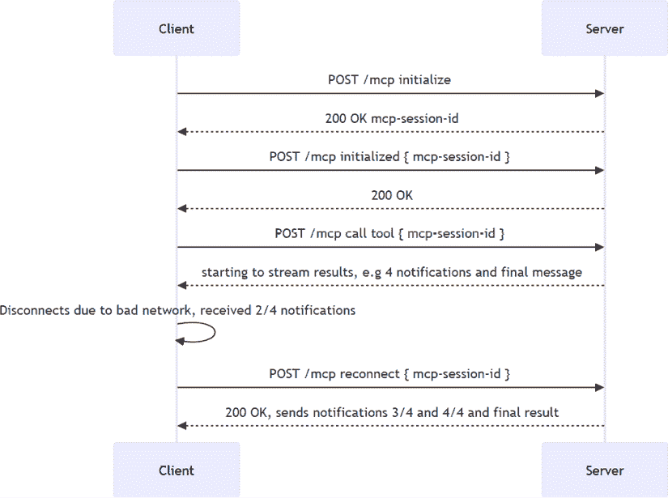
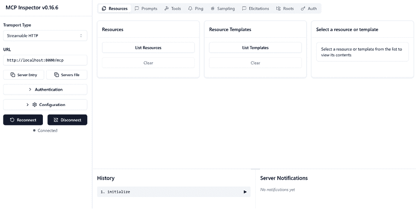
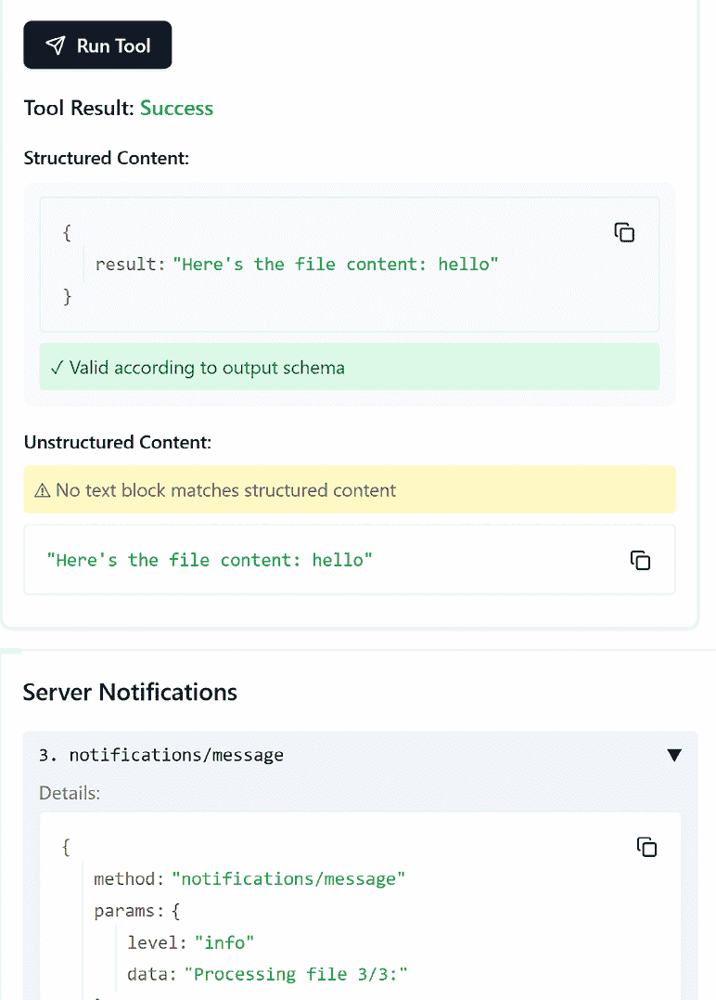

# 第五章：可流式 HTTP

在 *第四章* 中，我们讨论了使用**服务器发送事件**（**SSE**）传输构建 MCP 服务器。在那个章节中，您了解到如果您想用户通过 Web 访问您的 MCP 服务器，您不能使用 STDIO，而需要使用 SSE 或，如本章所述，可流式 HTTP。

因此，在本章中，您将学习以下内容：

+   可流式 HTTP 传输

+   为什么应该使用这种传输而不是 SSE

+   如何处理诸如通知和可恢复性等概念

本章涵盖了以下主题：

+   可流式 HTTP 与 SSE 的比较，以及为什么它是新标准

+   可流式 HTTP 在 MCP 中的应用

+   可恢复性

+   通知

+   创建和测试使用可流式 HTTP 的服务器

+   测试服务器

+   测试可恢复性

# 可流式 HTTP 与 SSE 的比较，以及为什么它是新标准

在选择适合您应用程序的正确技术时，理解 SSE 和可流式 HTTP 之间的差异非常重要。

有一些关键的区别。第一个原因是 MCP 中的 SSE 被认为是**已弃用**的；您应该使用可流式 HTTP。

那么，为什么这本书中有一个叫做 *SSE* 的章节呢？原因在于这本书是为您编写的，您既是 MCP 服务器的开发者，也是服务器的消费者，您可能正在编写一个客户端，该客户端针对可能使用 SSE 的现有服务器。简而言之，您应该知道如何处理这两种类型的传输，因为您可能需要与遗留代码一起工作。实际上，[`github.com/modelcontextprotocol/modelcontextprotocol/discussions/308`](https://github.com/modelcontextprotocol/modelcontextprotocol/discussions/308) 上的文章指出，当宣布 SSE 被弃用时，有 20 个参考服务器、超过 50 个官方集成和 186 个社区开发的服务器和客户端正在使用 SSE。这意味着当您为 MCP 开发时，确保您记住您需要处理 SSE 和可流式 HTTP，即使您在可流式 HTTP 中开发新服务器。

好吧，但为什么会有弃用决定呢？好吧，有几个原因说明为什么可流式 HTTP 是一个更好的选择：

+   **单端点简单性**：客户端和服务器通过单个端点（例如，`/mcp`）进行通信，支持`POST`和`GET`方法。这简化了实现并减少了连接开销。

+   **可恢复性支持**：可流式 HTTP 支持使用`Last-Event-ID`和`Mcp-Session-ID`等头部进行可恢复会话，允许客户端重新连接并可靠地恢复流。这是一个强大的功能，当客户端丢失连接时，它们可以从断开前的位置恢复连接并开始接收数据，而不是从头开始。

+   **更好的兼容性**：它与现代 HTTP 基础设施（如负载均衡器、代理和 API 网关）无缝工作，而 SSE 通常失败或需要解决方案。

+   **双向通信**：虽然 SSE 是单向的，但可流式 HTTP 可以升级以支持双向流，使其在代理到代理或客户端到服务器交互中更加灵活。

+   **未来兼容性**：可流式 HTTP 与不断发展的 MCP 标准和社区最佳实践保持一致。它是模块化的、可扩展的，并设计用于无状态或基于会话的模型。无状态服务器更轻量级且更容易构建，能够根据不同场景选择合适的模型是一个有说服力的论点。

# MCP 中的可流式 HTTP

好的，通常当我们谈论流式传输时，有些人可能会想到如何将文件分成块，或者 AI 模型如何以更小的部分返回其响应。然而，在 MCP 的上下文中，流式传输更多地关乎我们在遵循**可流式**标准的同时如何通过 HTTP 传输数据，这意味着使用可流式 HTTP 的客户端通常发送以下`Accept`头信息：`Accept: application/json, text/event-stream`。

这告诉服务器客户端可以处理批量 JSON 响应和流式事件（通过 SSE）。服务器可以根据请求类型和上下文选择适当响应模式。

这就是全部的流式传输，只是发送简单的响应吗？其实还有更多，特别是可恢复性。

# 可恢复性

**可恢复性**是一个概念，意味着如果客户端在数据传输过程中与服务器断开连接，在重新连接到服务器后，它可以从上次断开的地方恢复数据交换，而不是从头开始。对于长时间运行的操作，这可能会带来变革。技术上，可恢复性可以通过 SSE 和可流式 HTTP 实现，但在 MCP 协议的上下文中，它仅支持可流式 HTTP。

让我们用一个图例来说明：



图 5.1 – 可恢复性

如前图所示，客户端不必从头开始，而可以从中断的地方恢复。这是因为客户端在重新连接时发送`mcp-session-id`和`last-event-id`头信息。需要注意的是，在断开连接时，客户端需要优雅地断开，因此它存储这两个头信息以备后用。

那么服务器端需要做些什么来支持这一点呢？嗯，为了使可恢复性工作，服务器需要执行以下操作：

1.  创建一个会话存储，这是放置生成消息的地方。

1.  设置一个中间件来处理传入请求和传出响应，以确保消息被正确存储并且可以用于恢复会话。具体如何实现这取决于不同的框架：

    ```py
    # 1\. Creates an in-memory store, you should use a persistent store in a production scenario
    event_store = InMemoryEventStore()
    # 2\. Create the session manager with our app and event store
    session_manager = StreamableHTTPSessionManager(
        app=app,
        event_store=event_store,  # Enable resumability
        json_response=json_response,
    )
    # 3\. Starts a session manager
    @contextlib.asynccontextmanager
        async def lifespan(app: Starlette) -> AsyncIterator[None]:
            """Context manager for managing session
                manager lifecycle."""
            async with session_manager.run():
                logger.info("Application started with
                    StreamableHTTP session manager!")
                try:
                    yield
                finally:
                    logger.info("Application shutting down…")
    # 4\. Creating the web server and assigning a lifespan handler
    starlette_app = Starlette(
        debug=True,
        routes=[
            Mount("/mcp", app=handle_streamable_http),
        ],
        lifespan=lifespan,
    ) 
    ```

**小贴士**：使用**AI 代码解释器**和**快速复制**功能增强您的编码体验。在下一代 Packt Reader 中打开此书。点击**复制**按钮

（**1**）快速将代码复制到您的编码环境，或点击**解释**按钮

（**2**）让 AI 助手为你解释一段代码。


，然后使用搜索栏通过名称查找此书。请仔细检查显示的版本，以确保您获得正确的版本。](img/2.png)


让我们分解一下这段代码：

+   我们首先创建一个会话存储，这将有助于存储和检索消息。

+   然后，我们创建一个会话管理器，它控制对`StreamableHTTPSessionManager`类型存储的访问。

+   我们启动会话管理器并创建具有适当生命周期处理器的网络服务器。

+   最后，我们创建网络服务器并分配生命周期处理器。

到这里，一切都已经设置好了，任何客户端现在都可以连接到服务器并开始会话。

好的，现在我们更了解了一些关于可恢复性如何真正改善用户体验的情况，因为客户端可以在断开连接的地方接收到消息，让我们谈谈另一个概念，即通知。

# 通知

**通知**并非 Streamable HTTP 的独特概念，也可以用于 SSE。然而，与可恢复性结合使用时，它们突然变得非常强大。让我们首先描述一下它们是什么，然后讨论它们与可恢复性的关系。

通知以多种不同的形式出现，以传达发生了重要的事情。它们是实时更新，并且为了 SDK 的便利，被视为一个独立的事物。这意味着 SDK 通过实现一个处理器的特殊方式来监听通知，正如你很快就会看到的。

这里有一些场景，在这些场景中使用通知是有意义的：

+   状态更新

+   进度通知

+   错误消息

+   信息性消息

例如，客户端发送给服务器的最后一条消息是一个名为`notifications/initialized`的通知，表示客户端和服务器可以交换非握手消息以及更正常的操作，如列出工具、读取资源等。以下是对`notifications/initialized`消息的 JSON-RPC 形状：

```py
{
  "jsonrpc": "2.0",
  "method": "notifications/initialized"
} 
```

## 生成通知

我们如何生成一个通知？嗯，通知不过是一个 JSON-RPC 消息，而你的 SDK 通常有一个专门的方法来简化发送通知的过程。由于存在不同类型的通知，这更多是关于使用正确的方法和相应的参数。

要生成通知，我们需要对上下文对象进行引用，例如，我们可以将其作为输入参数添加到我们的工具中。一旦我们有了这个引用，我们就可以调用特定的通知方法，如 `debug`、`info`、`warning` 和 `error`。每种方法都有自己的用途，例如发送调试信息、信息性消息、警告消息和错误消息：

```py
from mcp.server.session import ServerSession
# 1\. Get a hold of the context object
@mcp.tool(description="A simple tool returning file content")
async def echo(message: str,
    ctx: ctx: Context[ServerSession, None]) -> str:
    # 2\. Select the appropriate method for sending the correct     notification type
    await ctx.debug(f"Debug: Processing '{data}'")
    await ctx.info("Info: Starting processing")
    await ctx.warning("Warning: This is experimental")
    await ctx.error("Error: (This is just a demo)")
    return "Final result" 
```

在此代码中，`echo` 工具将生成四种不同的通知和一个最终结果。

## 处理通知

当你作为客户端消费通知时，它们出现在你通常预期的地方之外。它们不是常规消息流的一部分，而是通过它们自己的回调单独处理：

```py
# 1\. Define the message handler
def message_handler(
    message: RequestResponder[types.ServerRequest, types.ClientResult]
    | types.ServerNotification
    | Exception,) -> None:
    print("Received message:", message)
    if isinstance(message, Exception):
        raise message
    else:
        if isinstance(message, types.ServerNotification):
            print("NOTIFICATION:", message)
        elif isinstance(message, RequestResponder):
            print("REQUEST_RESPONDER:", message)
        else:
            print("SERVER_REQUEST:", message)
# 2\. Create the client session and assign message handler to message_handler property
async with ClientSession(
    read_stream,
    write_stream,

    message_handler=message_handler,
) as session:
    await session.initialize()
    print("Session initialized, ready to call tools.")
    # Call a tool
    tool_result = await session.call_tool("echo", {"message": "hello"}) 
```

在此客户端中，我们执行以下操作：

1.  定义消息处理器；处理器能够接收不同类型的消息并相应地处理它们。

1.  创建客户端会话并将消息处理器分配给 `message_handler` 属性。

我们还观察到，正常的特性响应，如调用工具或读取资源，是以正常方式处理的，而通知则是通过消息处理器 `message_handler` 处理的。

## 检查器工具中的通知

太好了，现在我们已经对如何设置发送通知和接收通知有了感觉，让我们看看通知在我们的检查器工具中是如何出现的，因为我们需要学会在正确的位置寻找它们。

如果你以视觉模式启动检查器工具，你会看到一个像这样的屏幕：



图 5.2 – 检查器工具

**快速提示**：需要查看此图像的高分辨率版本？在下一代 Packt Reader 中打开此书或在其 PDF/ePub 版本中查看。**快速提示**：需要查看此图像的高分辨率版本？在下一代 Packt Reader 中打开此书或在其 PDF/ePub 版本中查看。

**下一代 Packt Reader** 和此书的**免费 PDF/ePub 版本**包含在您的购买中。扫描二维码或访问 [`packtpub.com/unlock`](https://packtpub.com/unlock)，然后使用搜索栏通过名称查找此书。请仔细检查显示的版本，以确保您获得正确的版本。


现在，如果你运行一个工具，你会看到工具结果，你会在其下方看到一个显示通知的区域，如下所示：



图 5.3 – 通知

## 可恢复的通知

正如我们之前所说的，通知可以通过 SSE 和 Streamable HTTP 发送，但后者尤为重要。想象一下，由于网络连接不稳定，客户端多次断开连接，但多亏了客户端中执行的重新连接逻辑和服务器中的可恢复性支持，最终用户仍然拥有良好的体验，因为他们不会错过通知或正常消息，例如工具响应等。

现在，让我们继续创建服务器。

# 使用 Streamable HTTP 创建和测试服务器

让我们创建一个服务器，在这个过程中，我们还将集成通知。服务器构建完成后，在下一节中，我们将尝试使用我们可用的不同工具对其进行测试，例如编写我们自己的客户端，使用检查器工具，以及使用 cURL 进行测试。

要创建服务器代码，我们需要做一些事情：

1.  将传输设置为可流式传输 HTTP。

1.  添加功能。

1.  添加在调用工具时发送通知的代码。

太好了，现在我们已经制定了计划，让我们开始实施。以下是我们计划前两点的尝试性实施：

```py
# server.py
from mcp.server.fastmcp import FastMCP, Context
from typing import Optional, Dict, Any, List, AsyncGenerator
from mcp.types import (
    LoggingMessageNotificationParams,
    TextContent
)
# Create an MCP server
mcp = FastMCP("Streamable DEMO")
# 2\. Adding features
@mcp.tool(description="A simple tool returning file content")
async def echo(message: str, ctx: Context) -> str:
    return f"Here's the file content: {message}"
# 1\. Set up the transport as streamable HTTP.
mcp.run(transport="streamable-http") 
```

要添加发送通知的功能，我们需要将`Context`对象添加到我们的方法签名中，如下所示：

```py
@mcp.tool(description="A simple tool returning file content")
async def echo(message: str, ctx: Context) -> str: 
```

最后，让我们在工具中添加使用`Context`对象生成通知的部分：

```py
@mcp.tool(description="A simple tool returning file content")
async def echo(message: str, ctx: Context) -> str:
    # 3\. Send a notification
    await ctx.info(f"Processing file 1/3:")
    await ctx.info(f"Processing file 2/3:")
    await ctx.info(f"Processing file 3/3:")
    return f"Here's the file content: {message}" 
```

我们完整的代码现在看起来是这样的：

```py
from mcp.server.fastmcp import FastMCP, Context
from typing import Optional, Dict, Any, List, AsyncGenerator
from mcp.types import (
    LoggingMessageNotificationParams,
    TextContent
)
# Create an MCP server
mcp = FastMCP("Streamable DEMO")
# 2\. Adding features
@mcp.tool(description="A simple tool returning file content")
async def echo(message: str, ctx: Context) -> str:
    # 3\. Send a notification
    await ctx.info(f"Processing file 1/3:")
    await ctx.info(f"Processing file 2/3:")
    await ctx.info(f"Processing file 3/3:")
    return f"Here's the file content: {message}"
# 1\. Set up the transport as streamable HTTP.
mcp.run(transport="streamable-http") 
```

让我们看看如何测试我们的服务器。

# 测试服务器

和往常一样，我们有不同的选择来测试服务器功能：

+   创建客户端

+   使用检查器工具

+   使用 cURL 进行测试

让我们尝试每个选项。

## 使用检查器工具

我们在本章前面介绍了检查器工具，但让我们快速回顾一下它是如何与我们的新创建的服务器一起工作的。我们可以像这样调用检查器工具来启动一个 Web 服务器。选择以下字段：

+   **传输类型**：**HTTP**

+   **服务器 URL**：`http://localhost:8000/mcp`（如有必要，调整端口号）

点击**连接**按钮连接到服务器，以便使用其功能，然后输入以下内容：

```py
npx @modelcontextprotocol/inspector 
```

如您所见，它与测试 SSE 服务器非常相似；只需更改传输类型，并确保您的 URL 以`/mcp`结尾而不是`/sse`。

## 使用 cURL 进行测试

我们在上一章介绍了 cURL；我们也可以在这里使用它。要获取会话 ID，您需要发送一个`initialize`消息。消息应包含您支持的功能，例如`tools`。

这里是您需要发送的消息：

```py
curl -X POST "http://127.0.0.1:8000/mcp" -H "Accept: text/event-stream, application/json" -H "Content-Type: application/json" -d '{
  "jsonrpc": "2.0",
  "id": 1,
  "method": "initialize",
  "params": { "protocolVersion": "2025-03-26", "capabilities": { "tools": {} }, "clientInfo": { "name": "ExampleClient", "version": "1.0.0" } }
}' 
```

注意您需要发送`Accept`头部和内容类型。记下返回的会话 ID，因为您将在所有剩余的调用中使用它。

创建第二个终端窗口，然后运行以下命令，但将`mcp-session-id`值替换为上一步中获取的会话 ID：

```py
curl -X POST "http://127.0.0.1:8000/mcp" -H "Content-Type: application/json" -H "Accept: text/event-stream, application/json" -H "`mcp-session-id`: 39a0b504364140ce97d8eded79b1c244" -d '{
    "jsonrpc": "2.0",
    "method": "notifications/initialized"
}' 
```

注意到会话 ID 不再是名为`session_id`的查询参数，而是一个名为`mcp-session-id`的头部值。您发送的消息是`notifications/initialized`类型的通知，这意味着它是握手过程的最后一条消息。在这条消息之后，我们现在可以做一些更正常的事情，比如列出工具、调用它们等等，所以让我们继续这样做。

替换`mcp-session-id`的值，并继续使用第二个终端窗口，然后运行以下命令：

```py
curl -X POST "http://127.0.0.1:8000/mcp" -H "Content-Type: application/json" -H "Accept: text/event-stream, application/json" -H "mcp-session-id: 39a0b504364140ce97d8eded79b1c244" -d '{
    "jsonrpc": "2.0",
    "id": 1,
    "method": "tools/call",
    "params": {
      "name": "echo",
      "arguments": { "message": "chris" }
    }
}' 
```

在这个`tools/call`类型的消息中，我们使用`chris`参数调用特定的工具`echo`，我们应该看到类似于以下工具响应：

```py
event: message
data: {"method":"notifications/message","params":{"level":"info","data":"Processing file 1/3:"},"jsonrpc":"2.0"}
event: message
data: {"method":"notifications/message","params":{"level":"info","data":"Processing file 2/3:"},"jsonrpc":"2.0"}
event: message
data: {"method":"notifications/message","params":{"level":"info","data":"Processing file 3/3:"},"jsonrpc":"2.0"}
event: message
data: {"jsonrpc":"2.0","id":1,"result":{"content":[{"type":"text","text":"Here's the file content: chris"}],"structuredContent":{"result":"Here's the file content: chris"},"isError":false}} 
```

第二个终端窗口中的响应表明我们收到了三个通知和一个最终的工具响应，这表明我们的 MCP 服务器按预期工作。

如您所见，Inspector 和 cURL 都是用于测试服务器的好工具。然而，构建客户端可能是我们将 MCP 服务器集成到工作解决方案中的方法，所以让我们在下一节中看看这一点。

## 创建一个处理通知的客户端

让我们谈谈客户端。客户端通常需要被指示也处理通知。这被视为除了正常功能之外额外需要的东西。让我们制定一个实施计划。让我们首先定义我们的计划：

1.  创建一个可流式传输的 HTTP 传输和客户端。

1.  设置通知处理器。

1.  调用一个工具。

解决计划中的第一个问题，我们的代码如下所示：

```py
# 1\. Create a streamable HTTP transport and client
async with streamablehttp_client(f"http://localhost:{port}/mcp") as (
        read_stream,
        write_stream,
        session_callback,
    ):
        # Create a session using the client streams
        async with ClientSession(
            read_stream,
            write_stream
        ) as session: 
```

在这里，我们使用`streamablehttp_client`函数创建一个可流式传输的 HTTP 客户端。然后，我们通过初始化`ClientSession`创建一个客户端实例。

为了支持传入的通知，我们需要通过将一个函数分配给一个名为`message_handler`的属性来配置客户端会话：

```py
# 2\. Set up a notification handler
async def message_handler(
        message: RequestResponder[types.ServerRequest, types.ClientResult]
        | types.ServerNotification
        | Exception,
    ) -> None:
        print("Received message:", message)
        if isinstance(message, Exception):
            raise message
        else:
            if isinstance(message, types.ServerNotification):
                print("NOTIFICATION:", message)
            elif isinstance(message, RequestResponder):
                print("REQUEST_RESPONDER:", message)
            else:
                print("SERVER_REQUEST:", message)
# omitted code for brevity
async with ClientSession(
            read_stream,
            write_stream,
            message_handler=message_handler,
        ) as session: 
```

注意`message_handler`是如何分配给`ClientSession`的，以及它指向一个名为`message_handler`的函数。该函数处理传入的消息并将它们打印出来。

就这样，这就是我们创建可流式传输的 HTTP 客户端并支持传入通知所需的所有内容。让我们看看完整的代码：

```py
from mcp.client.streamable_http import streamablehttp_client
from mcp import ClientSession
import asyncio
from typing import Optional, Dict, Any, List
import mcp.types as types
from mcp.types import (
    LoggingMessageNotificationParams,
    TextContent,
)
from mcp.shared.session import RequestResponder
port = 8000
# I get normal messages, notifications, and exceptions
# 2\. Set up a notification handler
async def message_handler(
        message: RequestResponder[types.ServerRequest, types.ClientResult]
        | types.ServerNotification
        | Exception,
    ) -> None:
        print("Received message:", message)
        if isinstance(message, Exception):
            raise message
async def main():
    print("Starting client...")

    # 1\. Create a streamable HTTP transport and client
    async with streamablehttp_client(f"http://localhost:{port}/mcp") as (
        read_stream,
        write_stream,
        session_callback,
    ):
        # 2\. Set up a notification handler
        async with ClientSession(
            read_stream,
            write_stream,
            message_handler=message_handler,
        ) as session:
            # Initialize the connection
            await session.initialize()

            # 3\. Call a tool
            results = []
            tool_result = await session.call_tool("echo",
                {"message": "hello"})
            print("Tool result:", tool_result)

asyncio.run(main()) 
```

现在，如果我们运行客户端，它会告诉我们通知确实是通知：

```py
NOTIFICATION: root=LoggingMessageNotification(method='notifications/message', params=LoggingMessageNotificationParams(meta=None, level='info', logger=None, data='Processing file 3/3:'), jsonrpc='2.0') 
```

结论是，通过使用`message_handler`方法，我们可以捕获从服务器发送的所有消息、通知和异常。这使我们能够适当地处理它们并向用户提供反馈。

# 测试可恢复性

SDK 中实际上有一个关于可恢复性的示例实现。让我们尝试这段代码并看看它有何不同。您可以在[`github.com/PacktPublishing/Learn-Model-Context-Protocol-with-Python/blob/main/Chapter05/solutions/resumability/README.md`](https://github.com/PacktPublishing/Learn-Model-Context-Protocol-with-Python/blob/main/Chapter05/solutions/resumability/README.md)找到它的简化版本。

代码所做的是使用一个工具`process-files`定义一个服务器。在调用该工具时，你会收到三个通知和一个最终响应。测试服务器的最简单方法是通过使用 cURL。使用 cURL，我们可以执行握手过程，调用工具，甚至进行所需的定制请求，以便重放事件。让我们一步一步来：

1.  首先启动服务器。

1.  在第二个终端中启动并使用以下有效载荷调用`curl`，以交换客户端和服务器都有的功能：

    ```py
    curl -X POST "http://127.0.0.1:8000/mcp" -H "Accept: text/event-stream, application/json" -H "Content-Type: application/json" -d '{
      "jsonrpc": "2.0",
      "id": 1,
      "method": "initialize",
      "params": { "protocolVersion": "2025-03-26", "capabilities": { "tools": {}, "logging": {} }, "clientInfo": { "name": "ExampleClient", "version": "1.0.0" } }
    }' 
    ```

检查第一个终端窗口中的终端响应。您应该看到服务器显示会话 ID；复制该字段以供以后使用。

1.  通过发送一个 `initialized` 通知来结束服务器-客户端握手；将 `mcp-session-id` 的值替换为上一步中复制的值：

    ```py
    curl -X POST "http://127.0.0.1:8000/mcp" -H "Content-Type: application/json" -H "Accept: text/event-stream, application/json" -H "mcp-session-id: 957f11af-4766-4c1c-a1f2-5bd6776cca6a" -d '{
        "jsonrpc": "2.0",
        "method": "notifications/initialized"
    }' 
    ```

1.  通过在第二个终端窗口粘贴以下命令来调用工具，确保首先替换 `"mcp-session-id"` 的值：

    ```py
    curl -X POST "http://127.0.0.1:8000/mcp" -H "Content-Type: application/json" -H "Accept: text/event-stream, application/json" -H "mcp-session-id: 957f11af-4766-4c1c-a1f2-5bd6776cca6a" -d '{
        "jsonrpc": "2.0",
        "id": 1,
        "method": "tools/call",
        "params": {
          "name": "process-files",
          "arguments": { "message": "chris" }
        }
    }' 
    ```

到目前为止，你应该在第二个终端窗口中看到一系列通知和最终结果，如下所示：

```py
event: message
id: 3a9d76c3-36d8-45f3-bd6e-8b9c82826de8_1757284976937_z6m5xbyc
data: {"method":"notifications/message","params":{"level":"info","data":"sales1.csv processed"},"jsonrpc":"2.0"}
event: message
id: 3a9d76c3-36d8-45f3-bd6e-8b9c82826de8_1757284976940_meh2n52f
data: {"method":"notifications/message","params":{"level":"info","data":"sales2.csv processed"},"jsonrpc":"2.0"}
event: message
id: 3a9d76c3-36d8-45f3-bd6e-8b9c82826de8_1757284976943_e3v55tmn
data: {"method":"notifications/message","params":{"level":"info","data":"sales3.csv processed"},"jsonrpc":"2.0"}
event: message
id: 3a9d76c3-36d8-45f3-bd6e-8b9c82826de8_1757284976946_sgpvardt
data: {"result":{"content":[{"type":"text","text":"Files processed: 3"}]},"jsonrpc":"2.0","id":1} 
```

让我们关注以下消息，一个表示我们处于文件 2/3 的通知。想象一下，我们进入了一个隧道并失去了网络连接。注意 ID，因为这个 ID 是你在失去连接之前看到的最后一个 ID：

```py
event: message
id: 3a9d76c3-36d8-45f3-bd6e-8b9c82826de8_1757284976940_meh2n52f
data: {"method":"notifications/message","params":{"level":"info","data":"sales2.csv processed"},"jsonrpc":"2.0"} 
```

1.  在我们的最后一步，我们需要向 `/mcp` 端点发送一个 `GET` 请求，并在头部传递会话 ID 和最后事件 ID。这应该会导致服务器重新播放我们错过的所有消息，这些消息应该是 `sales3.csv` 文件通知和最终工具结果。记住在将以下内容粘贴到第二个终端窗口之前，替换掉 `mcp-session-id` 和 `last-event-id`：

    ```py
    curl "http://127.0.0.1:8000/mcp" -H "Content-Type: application/json" -H "Accept: text/event-stream, application/json" -H "mcp-session-id: 957f11af-4766-4c1c-a1f2-5bd6776cca6a" -H "last-event-id: 3a9d76c3-36d8-45f3-bd6e-8b9c82826de8_1757284976940_meh2n52f" 
    ```

将此结果粘贴意味着你应该在第二个终端窗口中看到以下内容：

```py
event: message
id: 3a9d76c3-36d8-45f3-bd6e-8b9c82826de8_1757284976943_e3v55tmn
data: {"method":"notifications/message","params":{"level":"info","data":"sales3.csv processed"},"jsonrpc":"2.0"}
event: message
id: 3a9d76c3-36d8-45f3-bd6e-8b9c82826de8_1757284976946_sgpvardt
data: {"result":{"content":[{"type":"text","text":"Files processed: 3"}]},"jsonrpc":"2.0","id":1} 
```

我们缺失的一个通知和工具结果！这不是很棒吗？我们没有丢失任何消息。

应该说，尽管如此，如果你编写的代码可以利用可重放性，那么当失去网络连接时，你应该监听浏览器事件，这样你就有机会保存会话 ID 和最后事件 ID，并记得用 `GET /mcp` 而不是 `POST /mcp` 调用服务器，因为后者会启动一个新的会话。

此外，如果你使用我使用的事件存储，请记住它不适合生产，并且它需要在数据库或类似的地方持久化消息，才能被认为是生产就绪的。

# 摘要

在本章中，我们探讨了可流式 HTTP 的概念以及它与 SSE 的区别。我们了解到流式传输允许实时数据传输，这对于需要立即访问数据的程序很有益，例如现场活动或大文件。

此外，我们还实现了一个支持可流式 HTTP 的 MCP 服务器，并演示了如何使用 MCP SDK 消费流式数据。我们还讨论了通知在向客户端提供实时更新中的重要性以及如何有效地处理它们。

在下一章中，我们将解释如何使用低级服务器 API，因为有些用例你可能想要这样做。

# 作业

对于这个作业，我们再次关注电子商务。想象一下，服务器上有需要处理的 CSV 文件。处理发生在服务器上的所有 CSV 文件逐个作为输入发送到 Web API 时。这个想法是这个过程将通过调用一个工具来启动。想象以下程序输出：

```py
Type command> process-files
Notification: info - sales.csv processed
Notification: info - sales.csv processed
Notification: info - sales.csv processed
Files processed: 3
Type command> process-files
Files processed: 0 
```

本作业的目的是学习如何使用通知。文件可以是内存中的条目列表，在处理时会移除。您需要创建一个服务器，其中包含要处理的文件，以及一个可以处理输入命令的客户端。

# 解决方案

您可以在[`github.com/PacktPublishing/Learn-Model-Context-Protocol-with-Python/blob/main/Chapter05/solutions/README.md`](https://github.com/PacktPublishing/Learn-Model-Context-Protocol-with-Python/blob/main/Chapter05/solutions/README.md)访问解决方案。

# 问答

使用可流式 HTTP 的主要好处是什么？

+   A: 它允许更快地访问数据

+   B: 它需要更少的服务器资源

+   C: 它比其他协议更安全

可流式 HTTP 与 SSE 有何不同？

+   A: 可流式 HTTP 使用基于文本的格式，而 SSE 使用 JSON。

+   B: 可流式 HTTP 可以发送二进制数据，而 SSE 仅限于文本。

+   C: 可流式 HTTP 是单向的，而 SSE 是双向的。

您可以在[`github.com/PacktPublishing/Learn-Model-Context-Protocol-with-Python/blob/main/Chapter05/solutions/solution-quiz.md`](https://github.com/PacktPublishing/Learn-Model-Context-Protocol-with-Python/blob/main/Chapter05/solutions/solution-quiz.md)访问解决方案。

# 参考文献

+   **流式传输**: [`mcp-framework.com/docs/Transports/http-stream-transport/`](https://mcp-framework.com/docs/Transports/http-stream-transport/)

    |

    #### 现在解锁本书的独家优惠

    扫描此二维码或访问[`packtpub.com/unlock`](https://packtpub.com/unlock)，然后通过书名搜索本书。 |  |

    | **注意**：在开始之前准备好您的购买发票。* |
    | --- |
