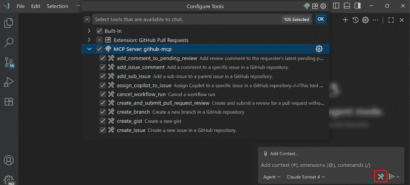
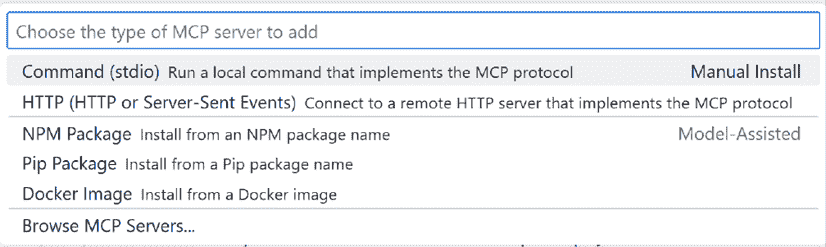
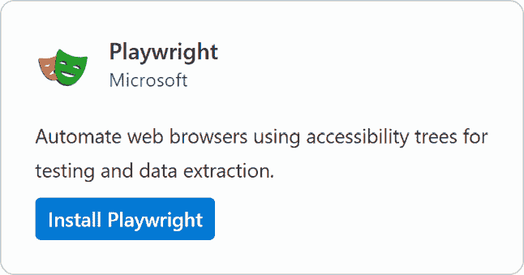
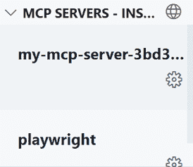
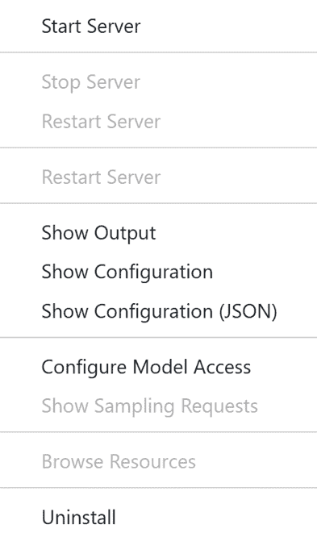
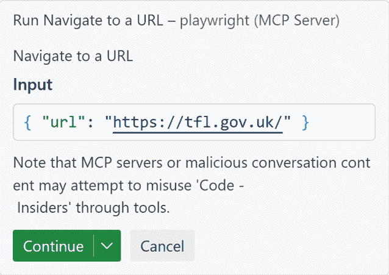
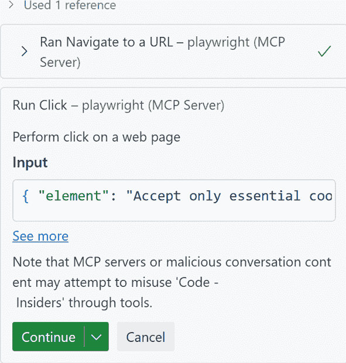
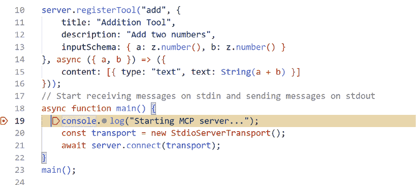
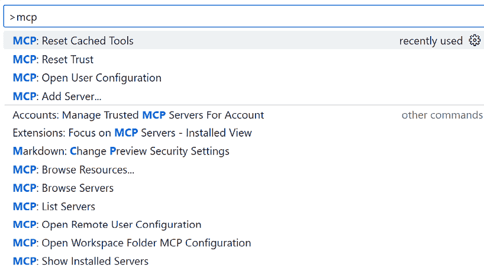
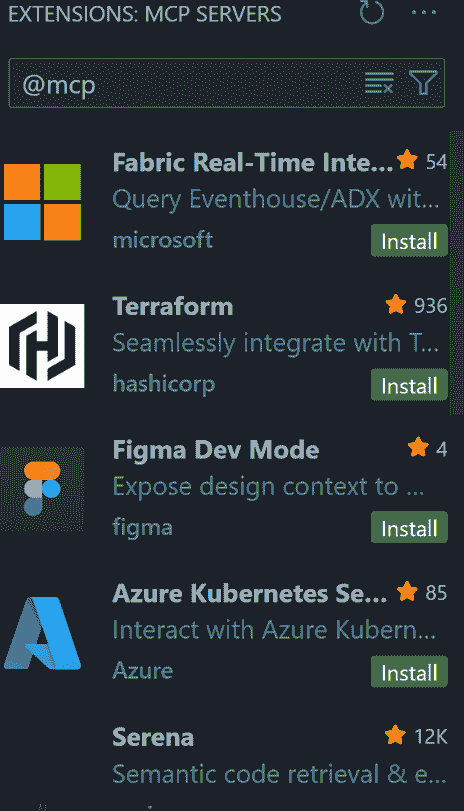

# 第八章：消费服务器

到目前为止，我们已经探讨了如何创建服务器，但也通过您必须自己编写的定制客户端来消费它们。在本节中，我们将探讨如何使用现有软件，如**Visual Studio Code**（**VS Code**）或**Claude Desktop**来消费服务器。当我们说“消费”时，我们的意思是指安装服务器、配置它们，然后使用它们来运行工具或以某种方式与服务器交互。

在本章中，您将学习以下内容：

+   理解如何使用现有工具消费服务器

+   在 VS Code 中安装和配置服务器

+   使用`mcp.json`文件进行服务器管理

+   管理服务器机密和配置

+   使用 VS Code 测试和与服务器交互

+   在消费服务器时应用安全最佳实践

本章涵盖了以下主题：

+   使用 Claude Desktop 和 VS Code 等主机消费

+   安装过程

+   添加服务器

+   本地与全局安装

+   小贴士和技巧

+   安全方面

+   服务器建议

# 使用 Claude Desktop 和 VS Code 等主机消费

消费服务器，好吧，这意味着什么？所以为了使用 MCP 服务器及其功能，您需要一种与之交互的方式。您在*第七章*中看到了如何创建服务器以及如何编写可以与之交互的客户端。这是一个完全有效的方式来消费服务器，但您需要编写代码。

另一种方法是使用现有的软件，如 Claude Desktop 或 VS Code。这些工具旨在与 MCP 服务器协同工作，并且它们还提供了一个大型语言模型，确保您可以通过提示以更用户友好的方式与服务器交互。

我们将这些两款软件视为主机，因为它们内置了 MCP 客户端，但它们也使用配置文件来跟踪已安装的服务器、可用的工具等等。

它们是如何工作的？好吧，它们是这样工作的：

+   通过选定的传输类型，如 STDIO、SSE 或 Streamable HTTP，启动与 MCP 服务器的连接

+   提供一个用户界面与服务器交互，并允许您输入提示、与工具、配置等进行交互

+   使用配置文件跟踪已安装的服务器、可用的工具和其他设置

这里的例子是 VS Code 的用户界面，它代表了这些主机的工作方式：



图 8.1 – VS Code 界面

在前面的图中，您可以看到以下内容：

+   列出通过已安装的服务器当前可用的工具

+   一个可以输入提示的聊天界面

接下来，让我们讨论特定的主机及其功能。

## VS Code 中的 MCP 支持

VS Code 与 GitHub Copilot 一起，为 MCP 服务器提供了广泛的支持。有许多功能可以帮助您安装、配置和确保服务器的安全性。它支持使用案例，例如尝试您正在构建的服务器，以及将 VS Code 变成一个可以通过您的提示运行工具的代理应用程序。

这里是 VS Code 为 MCP 服务器提供的一些功能列表：

+   **安装服务器**：VS Code 允许您在全局级别和工作区级别安装服务器。它支持三种传输类型：STDIO、SSE 和可流式 HTTP。

+   **管理工具**：您可以为服务器启用和禁用工具，这对于确保客户端拥有所需的上下文非常有用。

+   **与功能交互**：除了工具之外，它还支持用户提示和资源等功能。

+   **管理服务器**：您可以添加和删除服务器并对其进行配置。

+   **采样**：它支持采样，这意味着当服务器发送样本请求时，您可以在发送响应之前与之交互并调整请求。

+   **引申请求**：它还支持引申请求，这是服务器需要从用户那里获取更多信息以继续请求的场景。

+   **日志记录和调试**：它还支持日志记录和调试，这在开发服务器或客户端时非常有用。

正在不断地提供额外的功能，如果您想尽早尝试这些功能，建议您使用**VS Code Insiders**，因为这些功能首先在那里发布。

## 克劳德桌面版

您还可以使用克劳德桌面版来使用 MCP 服务器。前往下载页面（[`claude.ai/download`](https://claude.ai/download)）以安装适用于您操作系统的客户端。就像 VS Code 一样，它提供了一个用户界面和一系列功能，用于与 MCP 服务器交互。

克劳德（Claude）的功能远不止与 MCP 服务器（MCP servers）协作；它是一个功能齐全的 AI 助手，或许可以与类似的产品如 ChatGPT 或 Copilot 相媲美。要查看完整的功能列表，请访问此页面：[`claude.ai/login?returnTo=%2F%3F#features`](https://claude.ai/login?returnTo=%2F%3F#features)。

# 安装过程

对于克劳德和 VS Code 来说，安装服务器有一个中心概念，即`mcp.json`文件。这是您的主要配置文件，您在其中添加有关服务器位置和所需额外配置的信息。实际上，这个 JSON 文件就像一个清单文件，列出了已安装的服务器。安装文件的行为是将条目添加到该文件中。以下是一个`mcp.json`文件的示例：

```py
{
    "inputs": [

    ],
    "servers": {
        "docs": {
            "type": "http",
            "url": "https://learn.microsoft.com/api/mcp"
        }
    }
} 
```

 **快速提示**：使用**AI 代码解释器**和**快速复制**功能来增强您的编码体验。在下一代 Packt Reader 中打开此书。点击**复制**按钮

（**1**）快速将代码复制到您的编码环境，或点击**解释**按钮

（**2**）让 AI 助手为您解释代码块。


 **下一代 Packt Reader** 随本书免费赠送。扫描二维码 OR 访问 [`packtpub.com/unlock`](https://packtpub.com/unlock)，然后使用搜索栏通过名称查找此书。请仔细检查显示的版本，以确保您获得正确的版本。


在此文件中，我们有一个 `servers` 属性，包含一个指向 [`learn.microsoft.com/api/mcp`](https://learn.microsoft.com/api/mcp) 的服务器条目；现在这个 MCP 服务器被认为是已安装的。

在服务器上安装和运行功能的完整安装过程看起来是这样的：

1.  通过在 `servers` 属性中添加 `mcp.json` 文件条目来安装服务器。

1.  启动服务器。

1.  通过输入与服务器中工具匹配的提示来使用服务器。

我们将在本章后面探讨这样一个场景，但现在你对它已经有了高屋建瓴的理解。让我们更深入地探讨 `mcp.json` 文件。

## `mcp.json` 文件

`mcp.json` 文件有两个主要属性：

+   `inputs`：这用于定义敏感信息的占位符，例如 API 密钥或令牌。想法是定义你想要一个输入提示出现，并且答案应该被存储在一个你可以稍后引用的变量中。以下是一个例子：

    ```py
    [
        {
        "id": "my_api_key",
        "description": "The API key that my MCP server needs",
        "type": "promptString",
        "password": true
        }
    ] 
    ```

根据前面的定义，VS Code 中的用户界面将启动一个输入提示，要求您填写此信息。然后需要与服务器条目配对，如下所示：

```py
"my_mcp_server": {
  "type": "http",
  "url": "http://localhost:8000/mcp",
  "headers": {
    "Authorization": "Bearer ${my_api_key}"
  }
} 
```

注意 `my_api_key` 现在作为头属性传递，这样每次我们调用 `"http://localhost:8000/mcp"` 时，它也会传递 API 密钥，确保我们可以安全地访问我们的 MCP 服务器。以这种方式设置确保秘密不会出现在 `mcp.json` 中。

+   `servers`：此属性接受一个包含服务器条目的 JSON 对象。你需要知道的是，这些条目根据服务器使用的传输方式而有所不同。让我们为每种传输类型展示一些例子：

    +   **使用可流式 HTTP**：

        ```py
        "my_mcp_server": {
          "type": "http",
          "url": "http://localhost:8000/mcp"
        } 
        ```

    在这种情况下，它使用可流式 HTTP；我们可以看到，因为 `type` 值是 `http`，并且指定了 `url` 值。让我们看看 SSE。

    +   **SSE**：

        ```py
        "my_mcp_server": {
          "type": "sse",
          "url": "http://localhost:8000/sse"
        } 
        ```

    SSE，就像可流式 HTTP 一样，是一种用于远程访问服务器的传输方式。因此，在这两种情况下都使用 `url` 值来指出这些服务器所在的位置。

    +   **STDIO**：

        ```py
        "playwright": {
            "command": "npx",
            "args": ["-y", "@executeautomation/playwright-mcp-server"]
        } 
        ```

    **STDIO**，或**标准 I/O**，需要指定一个 `command` 和 `args` 属性，因为它需要指出如何启动所讨论的服务器。对于 SSE 或可流式 HTTP，则不需要，因为这些服务器位于远程。

# 添加服务器

你在上一节中已经看到如何添加各种服务器，但让我们来实际操作一下添加和使用服务器。让我们以**Playwright**，一个**端到端**（**E2E**）测试框架为例。要将它作为 MCP 服务器安装，你通常需要找到它的 GitHub 仓库并查看其安装说明。对于 Playwright，其仓库在这里：[`github.com/microsoft/playwright-mcp`](https://github.com/microsoft/playwright-mcp)。

由于该服务器提供了许多功能，所以有很多说明，但让我们从其*入门*部分获取安装说明，它看起来如下：

```py
"playwright": {
    "command": "npx",
    "args": [
    "@playwright/mcp@latest"
    ]
} 
```

这里，我们看到它显然是一个 STDIO 类型的服务器，因为其`command`和`args`属性已被填充。

## 步骤 1：安装服务器

让我们通过 VS Code 来安装它。这样做，我们就有几种不同的安装方式：

+   直接将条目添加到`mcp.json`文件中。

+   使用用户界面，无论是通过查看`mcp.json`文件时出现的**添加服务器**按钮，还是通过从命令面板运行`MCP: 添加服务器`命令，都可以触发用户界面，让你决定使用哪种传输方式，以及根据选择的传输方式提供`url`或`command`和`args`信息。

例如，让我们点击**添加服务器**；你应该会看到一个以下界面：



图 8.2 – 安装服务器

如你所见，安装服务器有无数种选项：不同的传输方式，一些也来自不同的包管理器，甚至 Docker。

事实上，如果你选择**浏览 MCP 服务器…**选项，它将带你去一个经过审查的 MCP 服务器列表([`code.visualstudio.com/insider/mcp`](https://code.visualstudio.com/insider/mcp))，并允许你从中选择一个服务器。

我们可以从其 GitHub 仓库获取与 Playwright 相关的完整说明，但让我们通过选择安装它来从服务器列表中安装，如下所示，点击**安装 Playwright**：



图 8.3 – 安装 Playwright

现在，你应该在 VS Code 中看到一个对话框打开，它提供了有关服务器的更多信息，以及安装说明。我们之前通过访问其 GitHub 仓库找到了安装信息，但这也是一种很好的方法。

好的，所以答案似乎是手动复制粘贴`mcp.json`中你需要的内容，或者使用 VS Code 中的许多选项之一。

## 步骤 2：管理服务器

现在，你已经添加了服务器，所以你的`mcp.json`看起来类似于以下 JSON（注意 Playwright 是如何被添加的）：

```py
{
    "servers": {
        "playwright": {
            "command": "npx",
            "args": [
            "@playwright/mcp@latest"
            ]
        }
    },
    "inputs": []
} 
```

现在是时候看看用户界面如何支持我们了。我们可以做的一件事是选择**扩展**；我们应该看到我们的已安装服务器列表如下：



图 8.4 – 已安装的服务器

从这个视图，我们可以点击服务器上的齿轮图标来与之交互：



图 8.5 – 与服务器交互

如您所见，有多个选项，从启动服务器到查看其日志，甚至 JSON 配置。您也可以从 `mcp.json` 文件中执行这些操作。

## 第 3 步：与服务器交互

让我们启动服务器，现在让我们转向从安装 GitHub Copilot 获得的聊天界面。确保代理已在下拉列表中选中，然后输入以下提示：

```py
Navigate to https://tfl.gov.uk/. I want to go from Paddington to Heathrow, show me how to get there by underground, important use playwright tool 
```

有时，VS Code 可能不太愿意使用工具，因此花些时间在提示上确保它确实使用了它。我已经添加了 `important use playwright tool` 来确保工具被触发。

您应该在聊天界面中看到以下内容：



图 8.6 – 使用工具

这显示了工具被触发，并要求您允许该工具作为此部分运行。您可以看到如何从您的提示中解析出 URL 并将其匹配为 Playwright 工具的输入。这将触发一系列工具调用，因为 Playwright 将遍历网站，定位输入字段，并尝试完成提示中设定的任务。

您可能需要有时重新启动聊天，但一旦它按预期工作，您应该会看到以下类似图示，表明 Playwright 已正确开始导航网站，并试图将您从 Paddington 带到 Heathrow：



图 8.7 – Playwright 查询

一旦完成，您可以通过各种方式与之交互以获取所需内容，甚至可以要求它从这个交互中生成 Playwright 测试，这正是其真正价值所在。

# 本地与全局安装

到目前为止，我们已在 `.vscode/mcp.json` 中安装了服务器，这意味着它们只安装在这个工作区中。您也可以在您的机器上全局安装服务器。要选择全局安装，请从命令面板中选择 `MCP: Add Server`。在最后一步，选择 **Global**，它将在 `(Settings)/User/mcp/json` 中创建一个 `mcp.json` 文件，这意味着它已将服务器条目添加到用户设置而不是这个特定的工作区实例。这意味着如果您打开 VS Code 的另一个实例，您将不需要再次安装此服务器。

这是服务器全局安装后用户级 `mcp.json` 文件的外观：

```py
{
    "servers": {
        "my-mcp-server-6801ea17": {
            "url": "https://learn.microsoft.com/api/mcp",
            "type": "http"
        }
    },
    "inputs": []
} 
```

如您所见，它在实际的 `mcp.json` 文件中的安装方式没有区别，但区别在于 `mcp.json` 文件的位置。一般规则是，如果您经常使用服务器，则全局安装它；如果不经常使用，则在工作区中的 `.vscode/mcp.json` 中安装。

# 小贴士和技巧

到目前为止，我们已经了解了基础知识，但还有其他什么需要了解的吗？嗯，还有很多不同的设置。完整的特性列表可以在以下文档页面找到：[`code.visualstudio.com/docs/copilot/chat/mcp-servers`](https://code.visualstudio.com/docs/copilot/chat/mcp-servers)。

## 调试

作为一名开发者，了解如何调试是一项关键技能，所以让我们来看看如何做到这一点。根据文档，目前支持 Node.js 调试（[`code.visualstudio.com/docs/copilot/customization/mcp-servers#_debug-an-mcp-server`](https://code.visualstudio.com/docs/copilot/customization/mcp-servers#_debug-an-mcp-server)）：

```py
"server-ts": {
    "command": "node",
    "args": ["08 - consuming servers/code/build/index.js"],
    "dev": {
        "watch": "08 - consuming servers/code/build/**/*.js",
        "debug": { "type": "node" }
    }
} 
```

根据前面的配置，您需要做的是以下这些：

1.  设置您的 `command` 和 `args` 属性以指导如何运行服务器。

1.  添加具有两个不同属性的 `dev`：`watch`，这是一个 **全局模式**（**GLOB**），用于检查您的 JavaScript 文件是否有更改，以及 `debug`，您在这里指定哪个进程正在调试它。在这种情况下，是 Node。一旦设置好并且服务器正在运行，应该会在上方有一个灰色的 **debug** 文本。请确保您已在合适的位置添加了断点，例如启动服务器、运行工具等。以下是您如何测试不同场景的方法：

    1.  **测试启动**：在这里，我们已经在启动代码中添加了一个断点，我们只需要从 `mcp.json` 启动服务器。您应该看到断点是如何被触发的，如下所示：

    图 8.8 – 断点启动

 **快速提示**：需要查看此图像的高分辨率版本吗？在下一代 Packt Reader 中打开此书或在其 PDF/ePub 复印本中查看。

 **新一代 Packt Reader** 以及本书的 **免费 PDF/ePub 复印本** 包含在您的购买中。扫描二维码或访问 [`packtpub.com/unlock`](https://packtpub.com/unlock)，然后使用搜索栏通过名称查找此书。请仔细检查显示的版本，以确保您获得正确的版本。


1.  **测试工具**：测试工具的一个好方法是运行 CLI 模式下的检查器。以下是一个测试具有输入参数 `a` 和 `b` 的工具 `add` 的命令。将此命令应用于匹配您服务器上的操作和参数：

    ```py
    npx @modelcontextprotocol/inspector --cli node ./build/index.js --method tools/call --tool-name add --tool-arg a=1 --tool-arg b=2 
    ```

您应该在终端中直接看到类似以下内容的响应：

```py
{
    "content": [
        {
        "type": "text",
        "text": "3"
        }
    ]
} 
```

## 故障排除

有时，您会在聊天区域的 **工具** 图标上看到错误指示。如果发生这种情况，打开终端区域的 **输出** 部分，您将看到问题所在。这个区域是一个很好的检查地方，因为您将看到 VS Code 和您的服务器之间的每一次交互，例如当它启动和停止服务器时，以及当它初始化、列出工具等。

当我们运行调试器并将其连接到服务器时，我们得到了以下信息写入**输出**：

```py
2025-08-03 19:18:56.856 [info] Connection state: Starting
2025-08-03 19:18:56.857 [info] Connection state: Running
2025-08-03 19:18:56.857 [info] [editor -> server] {"jsonrpc":"2.0","id":1,"method":"initialize","params":{"protocolVersion":"2025-06-18","capabilities":{"roots":{"listChanged":true},"sampling":{},"elicitation":{}},"clientInfo":{"name":"Visual Studio Code - Insiders","version":"1.103.0-insider"}}}
2025-08-03 19:18:56.888 [warning] [server stderr] Debugger listening on ws://127.0.0.1:9230/7b07fce3-e6cc-46c7-a0b8-7b782fbe853a
2025-08-03 19:18:56.888 [warning] [server stderr] For help, see: https://nodejs.org/en/docs/inspector
2025-08-03 19:18:57.052 [warning] [server stderr] Debugger attached.
2025-08-03 19:19:01.960 [info] Waiting for server to respond to `initialize` request...
2025-08-03 19:19:06.960 [info] Waiting for server to respond to `initialize` request...
2025-08-03 19:19:10.858 [warning] Failed to parse message: "Starting MCP server...\n"
2025-08-03 19:19:10.874 [info] [server -> editor] {"result":{"protocolVersion":"2025-06-18","capabilities":{"tools":{"listChanged":true}},"serverInfo":{"name":"demo-server","version":"1.0.0"}},"jsonrpc":"2.0","id":1}
2025-08-03 19:19:10.874 [info] [editor -> server] {"method":"notifications/initialized","jsonrpc":"2.0"}
2025-08-03 19:19:10.874 [info] [editor -> server] {"jsonrpc":"2.0","id":2,"method":"tools/list","params":{}}
2025-08-03 19:19:10.891 [info] [server -> editor] {"result":{"tools":[{"name":"add","title":"Addition Tool","description":"Add two numbers","inputSchema":{"type":"object","properties":{"a":{"type":"number"},"b":{"type":"number"}},"required":["a","b"],"additionalProperties":false,"$schema":"http://json-schema.org/draft-07/schema#"}}]},"jsonrpc":"2.0","id":2}
2025-08-03 19:19:10.891 [info] Discovered 1 tools
2025-08-03 19:26:34.115 [warning] [server stderr] Debugger ending on ws://127.0.0.1:9230/7b07fce3-e6cc-46c7-a0b8-7b782fbe853a
2025-08-03 19:26:34.115 [warning] [server stderr] For help, see: https://nodejs.org/en/docs/inspector 
```

让我们从前面的响应中突出一些有趣的点：

+   **编辑器与服务器握手**：在这里，编辑器向服务器发送关于它支持哪些功能/能力的信息。它告诉服务器它支持`roots`、`sampling`和`elicitation`：

    ```py
    2025-08-03 19:18:56.857 [info] [editor -> server] {"jsonrpc":"2.0","id":1,"method":"initialize","params":{"protocolVersion":"2025-06-18","capabilities":{"roots":{"listChanged":true},"sampling":{},"elicitation":{}},"clientInfo":{"name":"Visual Studio Code - Insiders","version":"1.103.0-insider"}}} 
    ```

+   **服务器响应编辑器握手**：在这里，响应返回表示工具是受支持的：

    ```py
    2025-08-03 19:19:10.874 [info] [server -> editor] {"result":{"protocolVersion":"2025-06-18","capabilities":{"tools":{"listChanged":true}},"serverInfo":{"name":"demo-server","version":"1.0.0"}},"jsonrpc":"2.0","id":1} 
    ```

+   **服务器发送初始化通知**：握手过程中的最后一步是发送`initialized`通知。这是客户端发送给服务器以表明它已准备好交换数据的事情。在这种情况下，我们的客户端是 VS Code：

    ```py
    2025-08-03 19:19:10.874 [info] [editor -> server] {"method":"notifications/initialized","jsonrpc":"2.0"} 
    ```

+   **告诉我你的工具**：现在客户端请求服务器提供其工具：

    ```py
    2025-08-03 19:19:10.874 [info] [editor -> server] {"jsonrpc":"2.0","id":2,"method":"tools/list","params":{}} 
    ```

+   **服务器响应工具请求**：最后，服务器响应请求列出其工具，如下所示：

    ```py
    2025-08-03 19:19:10.891 [info] [server -> editor] {"result":{"tools":[{"name":"add","title":"Addition Tool","description":"Add two numbers","inputSchema":{"type":"object","properties":{"a":{"type":"number"},"b":{"type":"number"}},"required":["a","b"],"additional Properties":false,"$schema":"http://json-schema.org/draft-07/schema#"}}]},"jsonrpc":"2.0","id":2} 
    ```

## 工具管理

工具管理是使用 VS Code 的重要方面。在工具方面有一些有趣的场景，你的编辑器会提供帮助：

+   **选择和取消选择工具**：当你添加服务器时，可能会一次性添加很多工具。在两种情况下，无论是使用你的编辑器作为代理工具，还是确保调用正确的工具，你都可以选择哪些工具是激活的。你可以通过点击聊天中的*工具*图标来做出选择，这将显示所有工具的用户界面。选择/取消选择你想要激活或停用的工具。

+   **运行特定工具**：通常，当你想要运行工具时，你会尝试输入一个尽可能匹配特定工具描述的提示。如果你想确保选择了正确的工具，你可以在前面加上`#`，这将标识该特定工具。例如，要运行名为`add`的工具，你可以构建一个这样的提示：

    ```py
    #add 2 and 7 
    ```

+   **管理工具数量**：一些模型对它们可以接受多少工具有限制。为了解决这个问题，有一个名为`github.copilot.chat.virtualTools.enabled`的设置，它将分析提示并仅提交与提示匹配的工具。这是一个避免使用过多提示导致任何错误的好方法。确保你使用的是最新版本的 VS Code Insider。此功能正在积极开发中，可能会随时间而变化。

+   **处理工具批准**：当 VS Code 决定要运行一个工具时，它会显示为一个询问你点击**继续**的查询。在这个时候，你可以选择仅为此提示会话、为此工作区或始终允许。以下是工作原理：

    1.  输入以下提示：

        ```py
        #add 2 and 7 
        ```

    这会使 VS Code 要求你点击**继续**。现在，从下拉菜单中选择以允许此工作区。让我们再次运行它。

1.  输入以下提示：

    ```py
    #add 2 and 9 
    ```

这在没有征求我同意的情况下运行了工具，因为我之前已经授予它在工作区中运行的权限。要撤销此同意，我可以从命令面板运行`Chat: Reset Tool Confirmations`。

## 其他设置

不断有设置被添加到 Copilot 和 VS Code 中。确保你处于 VS Code Insiders 状态，在命令面板中输入`MCP`，你会看到许多专门针对 MCP 的设置：



图 8.9 – MCP 命令

如你所见，有很多可用的命令。也可以尝试输入`Copilot`，因为它与 MCP 一起使用。这是一个不断变化的部分，但如果你正在开发 MCP 服务器，那么充分利用你的编辑器就是你的工作之一。

# 安全方面

安全性是一个巨大的话题，但让我们在编辑器的使用背景下来讨论它。你可以做些一般性的事情来保持更安全，所以让我们尝试总结一份良好的实践清单：

+   **将秘密排除在配置之外**：这是如何在`mcp.json`文件中指定配置以做到这一点的示例：

    ```py
    {
      "mcp": {
        "inputs": [
          {
            "type": "promptString",
            "id": "my-key",
            "description": "Token for my API",
            "password": true
          }
        ],
        "servers": {
          "my-server": {
            "type": "http",
            "url": "https://my-secure-api/mcp",
            "headers" : {
              "Authorization": "Bearer ${input:my-key}"
            }
          }
        }
      }
    } 
    ```

通过使用`inputs`元素，你可以确保秘密不会出现在配置文件中。其工作原理是，当服务器启动时，用户界面会提示你填写`my-key`的值，并且它会被安全地存储。然后你可以通过`${input:my-key}`在服务器条目中引用这个值。对于对`https://my-secure-api/mcp`的每个请求，都会添加一个包含你提供的值的`Authorization`头。

+   **工具运行访问**：建议不允许在工作区中运行的工具持续访问。最好每次请求时都给它访问权限。这也给你检查解析输入的机会。

+   **限制服务器可以做什么**：有方法可以限制服务器可以访问的内容。例如，有一个用于文件访问的 MCP 服务器。你应该将其限制在最多一个文件夹或你确信它不会造成任何损害的文件夹中。

+   **使用受信任的服务器**：GitHub 最近发布了一个经过审查的 MCP 服务器注册表。使用 VS Code Insiders 的最新版本，你可以输入`@mcp`，它会显示一个你可以安装的 MCP 服务器列表。你也可以通过选择`MCP: Add Server`命令然后选择**浏览 MCP 服务器**来访问相同的列表。你的服务器列表应该看起来与这个图相似：



图 8.10 – MCP 注册表

通常，确保服务器背后的作者是可信赖的来源（例如，Stripe 是 Stripe MCP 服务器背后的公司，等等）。即便如此，也要求助于代码扫描工具并关注最新的安全新闻；漏洞总是时有发生。同样的注册表也可以通过这个链接找到（[`code.visualstudio.com/insider/mcp`](https://code.visualstudio.com/insider/mcp)），但我更喜欢使用 VS Code 中的内置体验。还可以查看 GitHub 上的服务器仓库，因为它允许你通过它们的`README`文件了解更多关于每个服务器的信息（[`github.com/modelcontextprotocol/servers`](https://github.com/modelcontextprotocol/servers)）。

# 服务器建议

那么，推荐哪些服务器？嗯，这取决于您的需求，但我会个人使用以下这些：

+   **GitHub** ([`github.com/github/github-mcp-server`](https://github.com/github/github-mcp-server)): 这个服务器使我的生活变得更加轻松，因为我可以与问题、**拉取请求**（**PRs**）、委托工作给代理等交互

+   **Playwright** ([`github.com/microsoft/playwright-mcp`](https://github.com/microsoft/playwright-mcp)): 这对于导航网站非常棒，还可以从导航中生成测试，从而节省大量时间

+   **Microsoft Learn MCP 服务器** ([`github.com/microsoftdocs/mcp`](https://github.com/microsoftdocs/mcp)): 这是官方的 Microsoft Docs 和 Learn 服务器，它直接在您的编辑器中提供文档

还有更多，但先从这些开始，看看哪些适合您的场景。

# 摘要

在本章中，我们介绍了如何消费 MCP 服务器，包括您创建的和外部的服务器。此外，我们还讨论了安装后的服务器管理、配置、工具使用等。

最后，我们提供了一些关于安全实践的建议。这应该被视为一组最基本的做法，您应该做更多。

在下一章中，我们将介绍采样，这是一个高级主题，但在服务器需要将工作委托给您作为用户时非常有用。

# 作业

安装您选择的任何服务器，并通过提示尝试它。尝试从这里安装服务器：[`code.visualstudio.com/insider/mcp`](https://code.visualstudio.com/insider/mcp)。

# 问答

如何安装 MCP 服务器？

+   A: 您可以像在 VS Code 中安装扩展一样安装它。

+   B: 您在终端中运行 `mcp install <服务器名称>`。

+   C: 服务器通过在 `mcp.json` 中添加文本条目来安装。您还需要指定如何启动它或服务器所在的位置。

您可以在 [`github.com/PacktPublishing/Learn-Model-Context-Protocol-with-Python/blob/main/Chapter08/solutions/solution-quiz.md`](https://github.com/PacktPublishing/Learn-Model-Context-Protocol-with-Python/blob/main/Chapter08/solutions/solution-quiz.md) 访问解决方案。

|

#### 现在解锁此书的独家优惠

扫描此二维码或访问 [`packtpub.com/unlock`](https://packtpub.com/unlock)，然后通过名称搜索此书。 |  |

| **注意***: 在开始之前准备好您的购买发票。* |
| --- |
