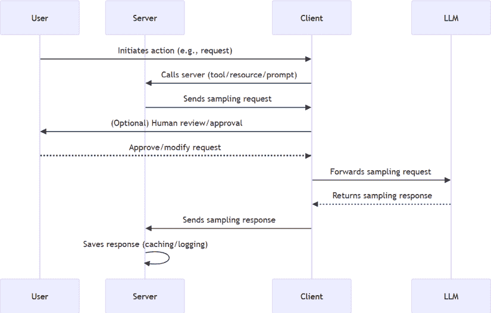
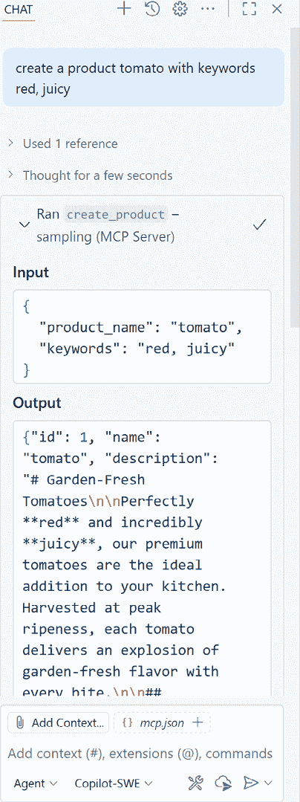

# 第九章：采样

MCP 最强大的功能之一是**采样**。首先，这意味着什么？好吧，让我们看看这个词的定义，并从中推断。梅里尔-韦伯斯特将采样定义为如下：

“对某物进行采样的行为或过程”

好的，所以我们需要一个样本，并且我们最终分析了这个样本，明白了。带着这个定义，让我们在 MCP 的背景下讨论它。在 MCP 中，采样意味着服务器正在向客户端发送一个采样请求，一个用于分析的*样本*。服务器为什么要这样做呢？很简单；服务器需要客户的帮助做一些事情。因为客户端拥有 LLM（即使服务器有时也可以拥有 LLM），服务器将任务委托给客户端，在那里 LLM 可以提供帮助。

到目前为止，这听起来合理，对吧？但我敢打赌你正在问为什么服务器会这样做。

在本章中，我们将进行以下操作：

+   理解采样的主题以及何时使用它

+   使用采样构建服务器实现并使用 VS Code 进行消费

+   在我们想要将此功能集成到我们的应用程序中时，将服务器实现连接到客户端实现。

本章涵盖了以下主题：

+   为什么需要采样？

+   实现采样

# 为什么需要采样？

正如我们一开始所说的，服务器想要将一些问题委托给客户端，特别是客户端的 LLM。那么，LLM 能帮助解决哪些服务器无法解决的问题呢？如果你思考这个问题，会发现有很多例子：生成产品描述、摘要、标签等等。

让我们先了解一下采样流程，以便我们了解在高级别上交互是如何发生的。

## 采样流程

在进行采样时，以下参与者会参与其中：

+   **用户**：用户通常在两个地方参与，作为初始动作的发起者，甚至作为*人机交互*中的接受者或修改采样请求。

+   **服务器**：服务器是发送采样请求的参与者。这个请求通常是从服务器功能中发送的，比如工具调用、读取资源或提示模板的请求。

+   **客户端**：客户端的职责是接收采样请求并向用户展示，以便用户可以决定如何处理它。用户将采样请求视为一项行动的建议。如果请求要求特定的模型、令牌数量等，那么这就是用户可以参考并接受或修改的内容。

+   **LLM**：客户端上的 LLM 负责完成采样请求，并接收来自服务器的提示，然后使用其生成能力生成响应。

下面是一个描述整体流程的图：



图 9.1 – 采样流程

**快速提示**：需要查看此图像的高分辨率版本吗？在下一代 Packt Reader 中打开此书或在其 PDF/ePub 副本中查看。

**下一代 Packt Reader**以及本书的**免费 PDF/ePub 副本**包含在您的购买中。扫描二维码或访问[`packtpub.com/unlock`](https://packtpub.com/unlock)，然后使用搜索栏通过名称查找本书。仔细检查显示的版本，以确保您获得正确的版本。


值得明确的是，采样请求并非没有原因，而是有一个初始动作最终触发了它。例如，用户想要创建产品，或需要帮助写博客文章等，这反过来又导致服务器将部分任务委托给客户端。

让我们看看一些具体的场景，以便更好地理解。

## 场景

到目前为止，我们已经简要提到了一些场景，但让我们详细讨论它们。

### 写博客文章

写博客文章的行为是一个很好的案例，因为它有一些方面肯定属于用户，例如撰写草稿。然而，也有一些方面 LLM 做得更好，例如为摘要总结或甚至生成关键词（感谢 Kent Dodds 为此用例提供灵感）：

1.  用户将草稿博客文章提交到服务器。

1.  服务器存储草稿，但请求帮助生成标签，因此发送了一个样本请求。

1.  客户使用其 LLM 分析草稿并生成响应。

### 后台电子商务

在电子商务后台工作的人员的一个常见任务是产品的管理。通常，您从注册产品标题开始，并捕获其他可能合理的属性。然而，撰写引人入胜的描述可能是一项耗时的工作，而 LLM 在这方面可能比人类做得更好。以下是如何作为一个采样场景的用例：

1.  管理员用户通过客户端添加一个带有标题和关键词的新产品。

1.  服务器请求客户端帮助创建一个具有关键词上下文的引人入胜的产品描述。

1.  客户生成这样的描述，服务器用更好的描述更新产品。

### 悬疑游戏

在玩游戏时，你经常会遇到你想要与之交谈的游戏角色；其中一些角色被称为**NPC**或**非玩家角色**。通常，这些角色的说话能力有限，因为这正是它们被编程的方式。这种限制减少了游戏体验，这正是 LLM 可以介入并做得更好的地方。以下是如何实现这一点的流程：

1.  用户要求与一个角色交谈。

1.  服务器检索角色信息，如姓名、描述、动机、线索等，并将其作为样本请求发送。

1.  客户端从提示请求中检索字符信息，并使用该信息作为系统消息来生成一个愉快的对话响应。

现在我们对合适的场景有了更多的了解，让我们来讨论实际的消息看起来是什么样子的，因为理解正在发送和接收的内容非常重要。更重要的是，理解在向客户端发送样本请求时可以配置哪些信息非常重要。

## 消息

如果你使用 SDK，你几乎永远不会遇到 JSON-RPC，但有趣的是要知道可以作为采样请求一部分发送的内容，这样你就知道可以向客户端发送什么类型的指导。让我们看看以下消息：

**请求**

```py
{
  "jsonrpc": "2.0",
  "id": 1,
  "method": "sampling/createMessage",
  "params": {
    "messages": [
      {
        "role": "user",
        "content": {
          "type": "text",
          "text": "Write a compelling description of this product:
            tomato, here's some keywords: red, vegetable, fresh"
        }
      }
    ],
    "modelPreferences": {
      "hints": [
        {
          "name": "claude-3-sonnet"
        }
      ],
      "intelligencePriority": 0.8,
      "speedPriority": 0.5
    },
    "systemPrompt": "You're a professional writing assistant and
      tend to want to write descriptions in a poetic way",
    "maxTokens": 100
  }
} 
```

在前面的消息中，以下内容特别引人关注：

+   `messages`: 这里是你发送的消息，这些消息将被输入到 LLM 中。

+   `modelPreferences`: 这个属性只是对理想中应该使用哪个模型的*建议*。用户是最终决定的人，但应将其视为建议。还要注意我们可以设置的其他属性，例如`intelligencePriority`和`speedPriority`。

+   `systemPrompt`: 这是一个重要的属性，因为这是 LLM 的*个性*，它可以极大地影响消息的结果。

+   `maxTokens`: 这个属性决定了将用于此任务多少个标记。

现在我们已经仔细查看服务器发送给客户端的内容，让我们看看客户端发送回的内容：

**响应**

```py
{
  "jsonrpc": "2.0",
  "id": 1,
  "result": {
    "role": "assistant",
    "content": {
      "type": "text",
      "text": "The capital of France is Paris."
    },
    "model": "claude-3-sonnet-20240307",
    "stopReason": "endTurn"
  }
} 
```

在这里，我们可以看到 LLM 的响应是如何在`content`属性中返回的，它还告诉我们最终使用了哪个模型，以及其他细节。

# 实现采样

现在，我们已经来到了本章最激动人心的部分，即如何实现采样。

我们将涵盖以下实施部分：

+   **服务器端**: 如何将其添加到 MCP 服务器

+   **客户端**: 如何启用它以及代码看起来像什么，包括接收请求和发送响应

## 服务器实现

要在服务器端实现采样，我们需要考虑采样请求应该在何时进行。通常，采样请求不会无中生有，而是在某个动作的上下文中发生。想象以下场景。一个在电子商务网站后台工作的用户添加新的销售产品。他们需要帮助编写描述，并且希望描述尽可能吸引人。因此，他们将使用客户端及其 LLM 的帮助。以下是它将如何展开：

1.  用户的客户端调用服务器上的一个工具，请求创建一个新的产品。

1.  服务器工具随后发送一个带有操作说明的样本请求，这被称为提示。

1.  客户端随后从样本请求中获取提示，调用他们的 LLM，并返回答案：

    ```py
    from mcp.server.fastmcp import Context, FastMCP
    from mcp.server.session import ServerSession
    from mcp.types import SamplingMessage, TextContent
    from uuid import uuid4
    mcp = FastMCP(name="Sampling Example")
    products = []
    @mcp.tool()
    async def create_product(product_name: str, keywords: str,
        ctx: Context[ServerSession, None]) -> str:
        """Create a product and generate a product
            description using LLM sampling."""

        # 1\. A new product is being created

        product = { "id": uuid4(), "name": product_name, "description":         "" }
        prompt = f"Create a product description about {keywords}"
        # 2\. Creates a sampling message and passes the prompt as the     payload
        result = await ctx.session.create_message(
            messages=[
                SamplingMessage(
                    role="user",
                    content=TextContent(type="text", text=prompt),
                )
            ],
            max_tokens=100,
        )
        product["description"] = result.content.text
        products.append(product)
        # return the complete product
        return product 
    ```

在前面的代码步骤 `1` 和 `2` 中，注意 `ctx`（上下文）对象的使用，调用 `session.create_message` 并传入 `SamplingMessage`，其中包含 `user` 值，以及 `messages` 被填充了你发送给客户端的提示：

```py
result = await ctx.session.create_message(
    messages=[
        SamplingMessage(
            role="user",
            content=TextContent(type="text", text=prompt),
        )
    ],
    max_tokens=100,
)
if __name__ == "__main__":
    print("Starting server…")
    mcp.run() 
```

此外，请注意，我们在返回之前正在等待客户端回复。一旦客户端的消息返回，我们将结果分配给产品描述，最后返回产品：

```py
product["description"] = result.content.text
products.append(product)
# return the complete product
return product 
```

让我们在 VS Code 中测试一下。请确保执行以下操作：

1.  在 `mcp.json` 中创建一个服务器条目，如下所示：

    ```py
    "sample-server": {
        "command": "python",
        "args": ["path/to/server/sample-server.py"]
    } 
    ```

通过点击服务器条目顶部的 **Start Server** 链接确保服务器正在运行。

1.  你还需要选择哪些模型可以与采样一起使用。为了进行选择，打开 **扩展** 视图，并注意底部的 **MCP Servers – installed** 部分。点击齿轮图标，为已安装的服务器配置 **Model Access**，并选择允许用于采样的模型，例如 **Claude Sonnet**。

1.  在 VS Code 中打开 **GitHub Copilot Chat** 窗口，并确保聊天中选择了 **Agent** 模式（在顶部选择该图标或通过命令面板运行 **Chat: Open Chat** 命令）。现在，输入以下提示：

    ```py
    "create product called tomato with keywords red and vegetable and delicious" 
    ```

你应该看到一个对话框请求你的权限来运行它，一旦允许，就会从 `create_product` 产生工具响应。以下是底层的操作过程：

1.  提示已解析。以下是发送给工具的内容：

    ```py
    {
      "keywords": "red, vegetable, delicious",
      "product_name": "tomato"
    } 
    ```

1.  调用了 `create_product` 工具。

1.  样本请求已发送到客户端。因为 VS Code 中的客户端有自己的 LLM，它会像这样对样本请求产生响应：



图 9.2 – VS Code 中的采样

让我们看看生成的描述：

```py
Introducing our **Red Garden Medley**—a vibrant selection of the freshest, most delicious red vegetables nature has to offer! Each hand-picked assortment features juicy tomatoes, crisp red bell peppers, and sweet red radishes, bursting with flavor and color. Perfect for salads, roasting, or snacking, these vegetables not only brighten your plate but also deliver a powerhouse of vitamins and antioxidants. Enjoy the taste of freshness with every bite—delicious, nutritious, and naturally red! 
```

你不会买那个番茄吗？ :)

好的，太棒了。我们在 MCP 服务器上成功实现了采样，VS Code 作为客户端运行，确保了其正常工作。那么，在实际解决方案中集成这一功能时，我们如何实际构建一个客户端呢？这是一个很好的问题，我们将在下一节中讨论。

## 客户端实现

首先，你需要让服务器知道你支持采样作为一项功能。为此，你需要在创建客户端实例时传递配置，如下所示：

```py
{
  "capabilities": {
    "sampling": {}
  }
} 
```

好的，我们需要了解什么？首先，采样是在你调用工具、资源和提示的正常流程之外的。你可能会想，这意味着什么。让我们看看我们如何监听传入的采样请求：

```py
async def run():
    async with stdio_client(server_params) as (read, write):
        async with ClientSession(read, write,
            sampling_callback=handle_sampling_message) as session:
        await session.initialize()
        # call tools, resource and prompts and read responses 
```

这段代码展示了我们通常如何连接到 MCP 服务器并初始化进程，以便我们稍后可以调用工具或执行我们想要的任何操作。不过，有一个区别：注意 `sampling_callback=handle_sampling_message`。这很重要，因为它允许我们监听传入的消息。

让我们看看 `handle_sampling_message`：

```py
async def call_llm(prompt: str, system_prompt: str) -> str:
    client = OpenAI(
    base_url="https://models.github.ai/inference",
    api_key=os.environ["GITHUB_TOKEN"],
)
    response = client.chat.completions.create(
        messages=[
            {
                "role": "system",
                "content": system_prompt,
            },
            {
                "role": "user",
                "content": prompt,
            }
        ],
        model="openai/gpt-4o-mini",
        temperature=1,
        max_tokens=200,
        top_p=1
    )
    return response.choices[0].message.content
async def handle_sampling_message(
    context: RequestContext[ClientSession, None], params:
        types.CreateMessageRequestParams
) -> types.CreateMessageResult:
    print(f"Sampling request: {params.messages}")
    # 1\. parse out the incoming prompt
    message = params.messages[0].content.text
    # 2\. call the llm to get a response on our prompt query
    response = await call_llm(message, "You're a helpful assistant,
        keep to the topic, don't make things up too much but
            definitely create a compelling product description")
    # 3\. create the sample response
    return types.CreateMessageResult(
        role="assistant",
        content=types.TextContent(
            type="text",
            text=response,
        ),
        model="gpt-3.5-turbo",
        stopReason="endTurn",
    ) 
```

在前面的代码中，有三件事情我们应该注意：

+   在步骤 `1` 中，这是我们对传入的产品消息（如果你愿意，可以称之为我们的任务）进行解析的方式。这是我们将其发送给 LLM 以获取响应的内容。在这种情况下，我们的响应应该是一个产品描述。

+   在步骤 `2` 中，我们调用 LLM 以获取响应。

+   最后，我们构建一个样本响应并将其发送回 MCP 服务器。

辅助函数使用提示和系统消息调用 GitHub 模型，并解析出 LLM 的响应。

就这样，如果你现在测试运行客户端：[`github.com/PacktPublishing/Learn-Model-Context-Protocol-with-Python/blob/main/Chapter09/code/python/README.md`](https://github.com/PacktPublishing/Learn-Model-Context-Protocol-with-Python/blob/main/Chapter09/code/python/README.md)

你应该看到以下类似的响应：

```py
[08/16/25 19:31:40] INFO     Processing request of type CallToolRequest               server.py:624
Sampling request: [SamplingMessage(role='user', content=TextContent(type='text', text='Create a product description about paprika described by as red, juicy, vegetable', annotations=None, meta=None))]
[08/16/25 19:31:43] INFO     Processing request of type ListToolsRequest              server.py:624
result: {"id": 1, "name": "paprika", "description": "**Product Description: Paprika \u2013 The Vibrant Touch of Flavor**\n\nElevate your culinary creations with our premium Paprika, a stunning red spice derived from the most luscious, juicy peppers. This vibrant addition is more than just a seasoning; it\u2019s a burst of color and taste that brings warmth and depth to every dish.\n\nOur Paprika is sourced from high-quality, sun-ripened vegetables, meticulously harvested at their peak to ensure maximum flavor. With its rich, sweet notes and subtle smokiness, this natural spice delivers a delightful punch that enhances everything from savory stews and roasted meats to vibrant vegetable dishes and sauces.\n\nNot only is our Paprika a feast for the eyes with its brilliant red hue, but it's also packed with antioxidants and vitamins, making it a nutritious choice for health-conscious cooks. Whether you sprinkle it onto a beloved family recipe or use it to create something intentionally new, our Paprika is versatile enough to brighten any meal.\n\nTransform everyday cooking into an extraordinary experience with the irresistible"}
                    INFO     Processing request of type CallToolRequest               server.py:624
result: {
  "id": 1,
  "name": "paprika",
  "description": "**Product Description: Paprika – The Vibrant Touch of Flavor**\n\nElevate your culinary creations with our premium Paprika, a stunning red spice derived from the most luscious, juicy peppers. This vibrant addition is more than just a seasoning; it's a burst of color and taste that brings warmth and depth to every dish.\n\nOur Paprika is sourced from high-quality, sun-ripened vegetables, meticulously harvested at their peak to ensure maximum flavor. With its rich, sweet notes and subtle smokiness, this natural spice delivers a delightful punch that enhances everything from savory stews and roasted meats to vibrant vegetable dishes and sauces.\n\nNot only is our Paprika a feast for the eyes with its brilliant red hue, but it's also packed with antioxidants and vitamins, making it a nutritious choice for health-conscious cooks. Whether you sprinkle it onto a beloved family recipe or use it to create something intentionally new, our Paprika is versatile enough to brighten any meal.\n\nTransform everyday cooking into an extraordinary experience with the irresistible"
} 
```

客户端执行以下两个操作：

+   它使用产品名称和关键词调用 `create_product` 工具，并最终生成一个具有 LLM 生成的描述的产品，如下所示：

    ```py
    Product Description: Paprika – The Vibrant Touch of Flavor**\n\nElevate your culinary creations with our premium Paprika, a stunning red spice derived from the most luscious, juicy peppers. This vibrant addition is more than just a seasoning; it's a burst of color and taste that brings warmth and depth to every dish.\n\nOur Paprika is sourced from high-quality, sun-ripened vegetables, meticulously harvested at their peak to ensure maximum flavor. With its rich, sweet notes and subtle smokiness, this natural spice delivers a delightful punch that enhances everything from savory stews and roasted meats to vibrant vegetable dishes and sauces.\n\nNot only is our Paprika a feast for the eyes with its brilliant red hue, but it's also packed with antioxidants and vitamins, making it a nutritious choice for health-conscious cooks. Whether you sprinkle it onto a beloved family recipe or use it to create something intentionally new, our Paprika is versatile enough to brighten any meal.\n\nTransform everyday cooking into an extraordinary experience with the irresistible 
    ```

难道这不像是你想要购买的辣椒吗？想象一下将这个发送给 LLM 并要求它生成一张图片（可选作业）。那会是一张多么令人惊叹的图片。

+   它调用 `get_products` 工具，列出新添加的产品。

如你所见，这是一种将任务委托给客户端的绝佳方式，因为客户端更适合处理这些任务。

# 摘要

关于“采样”一词的含义，是指分析一个小样本。在 MCP 的上下文中，这涉及到委托，即服务器如何将部分工作委托给客户端。

一个场景通常由用户启动，例如撰写博客文章或希望在后台解决方案中创建产品。服务器最终创建一个采样请求，并将其作为需要帮助的任务的一部分发送给客户端。然后，客户端能够使用 LLM 响应来回应该请求。

应该还指出，样本请求包含有关模型、令牌使用、系统提示等方面的建议，并且应该涉及一个人类，该人类可以接受这些建议或根据他们的喜好进行更改。

这是一个很棒的功能，其中客户端的 LLM 可以被调用以提供帮助。

在下一章中，我们将深入探讨 MCP 的另一个强大功能，即“诱导”，这是通过设置一个流程来改善用户体验，在该流程中，用户被要求选择另一个选项或提供更多信息以帮助服务器更好地完成任务。

# 任务

在这个任务中，我们将把我们对在客户端和服务器中添加采样实现的所有知识应用到有趣的应用领域，即神秘游戏和对话部分。我们的想法是创建一个有趣的对话角色，它可以通过预编程的响应进行交谈。

这就是它的工作方式：

+   **用户**：与角色 *N* 交谈

+   **服务器**：检索角色信息

+   **服务器**：发送带有字符信息的采样请求

+   **客户端**：接收采样请求并使用 LLM 生成响应

+   **服务器**：存储响应以进行缓存和记录

为了帮助您，想象一下一个角色在 JSON 文件中定义如下：

```py
[
  {
    "id": "1",
    "name": "Monsieur Lestrange",
    "description": "a 600 year old vampire",
    "personality": "very polite and will tell you a great deal of what
      it's like paying the electricity bill of a 1200 year old castle
      with bad insulation. In fact, he's quite boring and would rather
      talk about that over what you would expect like vampire hunters,
      stakes etc"
  }
] 
```

# 解决方案

您可以在[`github.com/PacktPublishing/Learn-Model-Context-Protocol-with-Python/blob/main/Chapter09/solution/README.md`](https://github.com/PacktPublishing/Learn-Model-Context-Protocol-with-Python/blob/main/Chapter09/solution/README.md)访问解决方案。

# 测验

使用抽样的原因是什么？

+   A: 您想从大量数据集中采样一小部分信息

+   B: 服务器需要帮助完成一个生成式 AI 类型的任务，客户可以使用其 LLM 来生成响应

+   C: 客户需要服务器的帮助来完成一项任务

谁发起抽样请求？

+   A: 两者之一

+   B: 客户

+   C: 服务器

您可以在[`github.com/PacktPublishing/Learn-Model-Context-Protocol-with-Python/blob/main/Chapter09/solution/solution-quiz.md`](https://github.com/PacktPublishing/Learn-Model-Context-Protocol-with-Python/blob/main/Chapter09/solution/solution-quiz.md)访问解决方案。

|

#### 现在解锁这本书的独家优惠

扫描此二维码或访问[`packtpub.com/unlock`](https://packtpub.com/unlock)，然后通过书名搜索此书。 |  |

| **注意***: 在开始之前准备好您的购买发票。* |
| --- |
