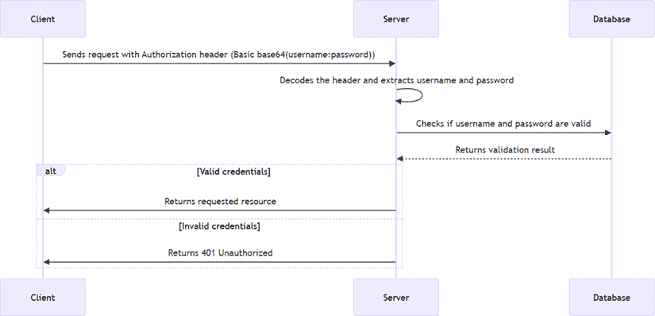
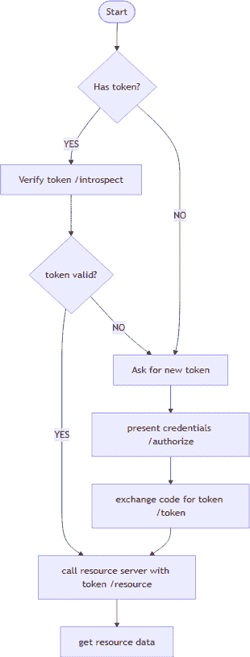

# 第十一章：保护您的应用程序

在许多情况下，在将 Web 应用程序投入生产之前，确保其安全是一个先决条件。当然，有些情况下你可能不需要这样做，但在大多数情况下，你想要确保你的应用程序是安全的，并且只有授权用户可以访问其某些部分。

让我们看看一些场景以及针对每个场景应考虑的安全措施：

| **场景** | **敏感度级别** | **安全措施** | **理由** |
| --- | --- | --- | --- |
| 任何人都可以访问的公开数据 | 极小风险暴露 | 基本安全措施或无 | 如果你想要防止机器人或类似程序过度使用你的 API，可以选择让用户注册 API 密钥 |
| 一些公开数据和一些受保护数据 | 中等风险暴露 | 基本安全措施（HTTPS 和 API 密钥） | 在允许公开访问非敏感数据的同时保护敏感数据 |
| 敏感个人信息（例如，健康记录和财务信息） | 高风险暴露 | 高级安全措施（HTTPS、OAuth 2.0/2.1、加密和 RBAC） | 遵守**通用数据保护条例**（**GDPR**）和**健康保险可携带性和问责法案**（**HIPAA**）等规定，并确保数据隐私和完整性 |

表 11.1 – 安全措施场景

考虑到这一点，让我们看看你可以在 Web 应用程序中实施的一些常见安全措施。

在本章中，您将学习以下内容：

+   在你的应用程序中添加基本认证

+   使用**JSON Web Token**（**JWT**）来保护您的应用程序

+   使用 OAuth2 来为您的应用程序提供更好的安全态势

本章涵盖了以下主题：

+   基本认证

+   使用 JWT 强化安全

+   JWT 是如何工作的？

+   创建 JWT

+   在我们的中间件（和 MCP 服务器）中集成 JWT

+   OAuth2

# 基本认证

基本认证是保护应用程序的最简单方法。它涉及在每个请求中向服务器发送用户名和密码。这绝对不是最安全的方法。如果它不够安全，为什么还要使用它？好吧，有些情况下，至少有一些安全比完全没有安全要好。例如，如果你有一个 API，它通常对公众开放，但你希望限制对某些端点的访问，基本认证可能是一个不错的选择。

它在底层是如何工作的？客户端在每个请求中发送一个`Authorization`头。这个头的值是单词`Basic`后跟一个空格和一个 Base64 编码的字符串，格式为`username:password`。然后服务器解码这个字符串并检查用户名和密码是否有效。以下是它的工作流程：



图 11.1 – 基本认证流程

有时基本认证由 API 密钥而不是用户名和密码组成。API 密钥以与用户名和密码相同的方式发送，但它只是一个标识客户端的单个字符串。然后服务器检查 API 密钥是否有效。

从代码的角度来看，以下是客户端发送带有基本认证的请求时的样子：

```py
# send api key
import requests
import base64
api_key = 'your_api_key'
encoded_api_key = base64.b64encode(api_key.encode()).decode()
headers = {'Authorization': f'Basic {encoded_api_key}'}
response = requests.get('https://api.example.com/endpoint',
    headers=headers)
print(response.json())
// send api key
const apiKey = 'your_api_key';
const encodedApiKey = btoa(apiKey);
const headers = new Headers();
headers.append('Authorization', `Basic ${encodedApiKey}`);
fetch('https://api.example.com/endpoint', { headers })
    .then(response => response.json())
    .then(data => console.log(data)); 
```

**快速提示**：使用**AI 代码解释器**和**快速复制**功能增强您的编码体验。在下一代 Packt Reader 中打开此书。点击**复制**按钮

（**1**）快速将代码复制到您的编码环境，或点击**解释**按钮

（**2**）让 AI 助手为您解释代码块。


**新一代 Packt Reader**随本书免费赠送。扫描二维码或访问[`packtpub.com/unlock`](https://packtpub.com/unlock)，然后使用搜索栏通过书名查找本书。请仔细核对显示的版本，以确保您获得正确的版本。


## 为我们的 MCP 服务器使用基本认证

让我们利用这项技术来保护我们的 MCP 服务器。毕竟，我们不想让任何人都能访问我们的服务器，并可能滥用它。为了使这项技术生效，我们需要两样东西：

+   一个检查`Authorization`头部并验证凭证的服务器中间件

+   发送带有`Authorization`头部的客户端请求

## 实现 MCP 服务器并将其作为 Web 应用程序启动

首先，我们需要实现 MCP 服务器并将其作为 Web 应用程序启动。这样做，我们将有一个可以处理 MCP 请求和响应的 Web 服务器。完成这项工作后，我们可以向服务器添加中间件，以增加安全层。

这使用 Starlette；然而，对于您的 MCP 服务器来说，获取这个服务器并不容易。因此，您需要控制服务器的启动，并自己添加中间件。

首先，让我们创建我们的 MCP 服务器实例：

```py
app = FastMCP(
    name="MCP Resource Server",
    instructions="Resource Server that validates tokens
        via Authorization Server introspection",
    host=settings["host"],
    port=settings["port"],
    debug=True,
) 
```

其次，让我们看看我们如何创建 Starlette MCP 应用程序，它应该使用 Streamable HTTP 传输：

```py
starlette_app = app.streamable_http_app() 
```

接下来，我们需要运行服务器的启动代码。这是使用 Uvicorn 完成的：

```py
async def run(starlette_app):
    import uvicorn
    config = uvicorn.Config(
            starlette_app,
            host=app.settings.host,
            port=app.settings.port,
            log_level=app.settings.log_level.lower(),
        )
    server = uvicorn.Server(config)
    await server.serve()
run(starlette_app) 
```

## 创建中间件

要创建我们的中间件，我们需要记住它应该如何工作。中间件应该检查`Authorization`头部，验证凭证，然后允许请求继续或返回错误响应。

考虑到这一点，以下是中间件可能的样子。我们需要中间件本身和一个验证令牌的函数。在 Starlette 中创建中间件是通过从`BaseHTTPMiddleware`派生来实现的。它有一个请求和一个`call_next`函数，如果验证成功，你应该调用它来继续请求。如果不成功，你应该返回一个带有错误代码的响应：

```py
def valid_token(token: str) -> bool:
    # remove the "Bearer " prefix
    if token.startswith("Bearer "):
        token = token[7:]
        return token == "secret-token"
    return False
class CustomHeaderMiddleware(BaseHTTPMiddleware):
    async def dispatch(self, request, call_next):
        has_header = request.headers.get("Authorization")
        if not has_header:
            print("-> Missing Authorization header!")
            return Response(status_code=401, content="Unauthorized")
        if not valid_token(has_header):
            print("-> Invalid token!")
            return Response(status_code=403, content="Forbidden")
        print("Valid token, proceeding...")
        print(f"-> Received {request.method} {request.url}")
        response = await call_next(request)
        response.headers['Custom'] = 'Example'
        return response 
```

中间件的逻辑如下：

+   检查`Authorization`头是否存在。如果不存在，则返回`401 Unauthorized`响应。

+   验证令牌；如果令牌无效，则返回`403 Forbidden`响应。

+   如果令牌有效，继续请求并添加一个自定义头到响应中。我们通过调用`call_next(request)`来继续请求，这将把请求传递给下一个中间件或实际的端点处理器。

最后的部分是将中间件添加到 Starlette 应用中：

```py
middleware = [
    Middleware(CustomHeaderMiddleware, header_value='Customized')
]
async def main():
    print("Running MCP Resource Server...")
    starlette_app = await setup(app)
    print("Adding custom middleware...")
    starlette_app.add_middleware(CustomHeaderMiddleware) 
```

在此代码中，我们创建了一个中间件列表，并将`CustomHeaderMiddleware`添加到其中。然后，在`main`函数中，我们使用`starlette_app.add_middleware(CustomHeaderMiddleware)`将中间件添加到 Starlette 应用中。

## 测试中间件

要测试中间件，我们可以使用之前相同的客户端代码，但这次我们需要包含带有有效令牌的`Authorization`头。

下面是客户端代码可能的样子：

```py
import requests
import base64
def get_auth_token():
    api_key = "my_api_key"
    token = base64.b64encode(api_key.encode()).decode()
    return f"Bearer {token}"
headers = {'Authorization': get_auth_token()}
response = requests.get('http://127.0.0.1:8000/protected', headers=headers)
print(response.status_code)
print(response.text) 
```

要使用 MCP 客户端进行测试，思路相同，但我们需要知道如何使用 MCP 客户端传递自定义头。下面是如何做到这一点的方法。

在这里，我们使用 MCP SDK 中的`streamablehttp_client`来创建一个客户端。我们通过`headers`参数传递`Authorization`头：

```py
token = "secret-token"
async with streamablehttp_client(
        url = f"http://localhost:{port}/mcp",
        headers = {"Authorization": f"Bearer {token}"}
    ) as (
        read_stream,
        write_stream,
        session_callback,
    ):
        async with ClientSession(
            read_stream,
            write_stream
        ) as session:
            await session.initialize()

            # TODO, what you want done in the client,
            e.g list tools, call tools etc. 
```

让我们来看看 JWT。

# 使用 JWT 强化安全性

JWT 与基本认证相比有什么好处？嗯，使用 JWT，你可以对客户端可以做什么有更细粒度的控制。你可以在令牌中包含声明，指定客户端被允许做什么。例如，你可以包含一个声明，指定客户端只能读取数据，但不能写入数据。这看起来可能像这样：

```py
{
  "sub": "1234567890",
  "name": "User Userson",
  "admin": true,
  "iat": 1516239022,
  "exp": 1516242622,
  "scopes": ["User.Read"]
} 
```

此令牌负载指定客户端被允许读取用户数据。然后服务器可以检查令牌，看客户端是否有执行请求操作所需的范围。还有许多其他好处，例如以下内容：

+   **无状态**：服务器不需要存储任何会话信息。令牌包含所有用于验证客户端所需的信息。

+   **可扩展性**：由于服务器不需要存储任何会话信息，它可以轻松地进行横向扩展。

+   **安全性**：令牌可以被签名和/或加密，以确保其完整性和机密性。

+   **灵活性**：令牌可以包含任意数量的自定义声明，允许广泛的应用场景。

+   **互操作性**：JWT 是一个广泛采用的标准，使其与其他系统和服务的集成变得容易。

好的，所有这些都听起来很棒，但让我们来了解一下您需要做什么来将基本身份验证升级到 JWT。首先，让我们谈谈 JWT 是如何工作的。

## JWT 是如何工作的？

JWT 是一种紧凑、URL 安全的表示声明的方式，用于在双方之间传输。JWT 中的声明编码为 JSON 对象。此 JSON 对象由三个部分组成，由点（`.`）分隔：

+   **头部**：这通常由两部分组成：令牌的类型（`JWT`）和所使用的签名算法，例如 HMAC SHA256 或 RSA。头部通常看起来像这样：

    ```py
    {
      "alg": "HS256",
      "typ": "JWT"
    } 
    ```

我们可以看到使用的算法是 HMAC SHA256，类型是`JWT`。这些信息对于服务器来说很重要，因为服务器需要知道如何验证令牌。

+   **有效载荷**：这包含声明。声明是关于实体（通常是用户）和附加数据的陈述。有三种类型的声明：注册、公共和私有声明。有效载荷通常看起来像这样：

    ```py
    {
      "sub": "1234567890",
      "name": "User Userson",
      "admin": false,
      "iat": 1516239022,
      "exp": 1516242622,
      "scopes": ["User.Write", "User.Write"]
    } 
    ```

此有效载荷代表一个 ID 为`1234567890`的用户，名为`User Userson`，不是管理员，并且具有`User.Write`和`User.Read`作用域。`iat`声明表示令牌签发的时间，而`exp`声明表示令牌过期的时间。

+   **签名**：这用于验证 JWT 的发送者是否为声明者本人，并确保消息在传输过程中未被更改。

## 创建 JWT

好的，所以我们知道了我们有哪些部分，但我们如何创建 JWT 呢？实际上，这相当简单。您可以使用库为您创建 JWT。以下是您如何做到这一点的示例：

```py
# pip install PyJWT
import jwt
import datetime
def create_jwt():
    header = {
        "alg": "HS256",
        "typ": "JWT"
    }
    payload = {
        "sub": "1234567890",               # Subject (user ID)
        "name": "User Userson",                # Custom claim
        "admin": True,                     # Custom claim
        "iat": datetime.datetime.utcnow(),# Issued at
        "exp": datetime.datetime.utcnow() +
            datetime.timedelta(hours=1),  # Expiry
        "scopes": ["Admin.Write", "User.Read"]  # Custom claim for
            scopes/permissions
    }
    secret = "your-256-bit-secret"
    token = jwt.encode(payload, secret, algorithm="HS256", headers=header)
    return token 
```

使用这段代码，您可以创建一个包含头部、有效载荷和签名的 JWT。`jwt.encode`函数负责编码头部和有效载荷，并使用密钥对令牌进行签名。签名是作为`jwt.encode`函数的一部分创建的。现在，`token`变量是 Base64 编码格式，可以用作`Authorization`头部的承载令牌。如果您移除 Base64 编码，您会看到令牌由三个部分组成，由点（`.`）分隔，即头部、有效载荷和签名，如前所述。但是，要解码令牌，您会看到头部和有效载荷以 JSON 格式显示。

### 验证 JWT

我们还需要了解如何验证 JWT。我们在验证时确保令牌有效、未过期，以及签名正确。这绝对不是我们能做的全部，但这是一个良好的开始。以下是您如何验证 JWT 的方法：

```py
import jwt
def validate_jwt(token: str) -> bool:
    secret = "your-256-bit-secret"
    try:
        decoded = jwt.decode(token, secret, algorithms=["HS256"])
        print("Decoded claims:")
        for key, value in decoded.items():
            print(f"  {key}: {value}")
        return True
    except jwt.ExpiredSignatureError:
        print("Token has expired")
        return False
    except jwt.InvalidTokenError:
        print("Invalid token")
        return False 
```

此代码检查令牌是否有效、未过期，以及签名是否正确。如果令牌有效，它将打印解码的声明。如果令牌已过期或无效，它将打印错误信息。

我们之前提到，这些结构检查是一个良好的开始。我们还应该进行哪些其他检查？以下是一些您可以检查的想法：

+   `iss`（发行者）声明，以确保令牌是由受信任的权威机构签发的，例如您的认证服务器。

+   `aud`（受众）声明确保令牌是针对你的应用的。有效的值可以是你的 MCP 服务器 URL。

+   `nbf`（not before）声明确保令牌在特定时间之前不被使用。

+   范围或角色，以确保客户端具有执行请求操作所需的权限。范围示例可以是`User.Read`、`User.Write`、`Admin.Read`和`Admin.Write`，角色可以是`User`、`Admin`等。它们看起来很相似，但范围通常比角色更细粒度。

## 在我们的中间件（和 MCP 服务器）中集成 JWT

到目前为止，你已经看到了我们如何执行基本身份验证并检查凭证是否有效，作为我们中间件的一部分。现在，让我们看看我们如何集成 JWT 验证。我们的计划如下：

+   创建一个用于测试的 JWT。我们将使用实用脚本来完成。在实际应用中，你会从**身份提供者**（**IDP**）如 Auth0、Keycloak 或 Entra ID 获取令牌。

+   更新中间件以验证 JWT。

+   更新客户端以在`Authorization`头部发送 JWT。

### 创建用于测试的 JWT

这里是我们将用于创建 JWT 测试令牌的实用代码，包括生成 JWT 和验证它的函数：

```py
import jwt
import datetime
def create_jwt():
    header = {
        "alg": "HS256",
        "typ": "JWT"
    }
    payload = {
        "sub": "1234567890",               # Subject (user ID)
        "name": "User Userson",                # Custom claim
        "admin": True,                     # Custom claim
        "iat": datetime.datetime.utcnow(),# Issued at
        "exp": datetime.datetime.utcnow() +
            datetime.timedelta(hours=1),  # Expiry
        "scopes": ["Admin.Write", "User.Read"]  # Custom claim for
            scopes/permissions
    }
    token = jwt.encode(payload, "your-256-bit-secret",
        algorithm="HS256", headers=header)
    with open(".env", "w") as f:
        f.write(f"JWT_TOKEN={token}\n")
def validate_jwt(token: str) -> str | None:
    secret = "your-256-bit-secret"
    try:
        decoded = jwt.decode(token, secret, algorithms=["HS256"])

        return decoded
    except jwt.ExpiredSignatureError:
        print("Token has expired")
        return None
    except jwt.InvalidTokenError:
        print("Invalid token")
        return None 
if __name__ == "__main__":
    create_jwt() 
```

在此代码中，我们创建了一个包含头部、有效载荷和签名的 JWT。`create_jwt`函数生成令牌并将其写入`.env`文件。注意`validate_jwt`函数如何验证令牌，并在令牌有效时返回解码后的声明。

### 更新客户端以发送 JWT

让我们转到客户端。它需要从`.env`文件中加载令牌并将其发送到`Authorization`头部。以下是你可以这样做的方法：

```py
import os
from dotenv import load_dotenv
load_dotenv()
def get_auth_token():
    token = os.getenv("JWT_TOKEN")
    return f"Bearer {token}"
headers = {'Authorization': get_auth_token()}
# omitted, creating and connecting the MCP client 
```

### 更新服务器中间件以验证 JWT

最后，我们需要更新服务器中间件以验证 JWT。以下是我们可以这样做的方法：

```py
from your_jwt_utility import validate_jwt  # import the validate_jwt
    function
```python

from starlette.middleware.base import BaseHTTPMiddleware

from starlette.responses import Response

class JWTMiddleware(BaseHTTPMiddleware):

    async def dispatch(self, request, call_next):

        token = request.headers.get("Authorization")

        if not token or not token.startswith("Bearer "):

            return Response("Unauthorized", status_code=401)

        jwt_token = token.split(" ")[1]

        decoded = validate_jwt(jwt_token)

        if not decoded:

            return Response("Unauthorized", status_code=401)

        # TODO，检查现有用户、作用域等。

        # 可选地将用户信息附加到 request.state

        request.state.user = decoded

        response = await call_next(request)

        return response

```py

Now, the middleware checks for the `Authorization` header, validates the JWT, and either allows the request to proceed or returns a `401 Unauthorized` response. We’re also leaving a `TODO` task for you to check things such as existing users, scopes, and so on.

# OAuth2

We’ve definitely improved our security posture by moving from basic authentication to JWT. However, there’s still room for improvement. **OAuth2** is a widely adopted authorization framework that provides a more robust and flexible way to secure your application.

It allows you to delegate access to your resources without sharing credentials. What that means concretely is that there are three parties involved when accessing a resource:

*   **Resource server**: This is the server that hosts the protected resources, in our case, the MCP server
*   **Client**: This is the application that wants to access the protected resources, in our case, the MCP client
*   **Authorization server**: This is the server that issues access tokens to the client after successfully authenticating the resource owner and obtaining authorization

What about the delegation part? Well, the resource owner (typically the user) can delegate access to the client by granting it an access token. The client can then use this access token to access the protected resources on behalf of the resource owner. This way, the client doesn’t need to know the resource owner’s credentials, and the resource owner can revoke access at any time by invalidating the access token. This is clearly a better approach than basic authentication. JWT, however, is often used to represent the access token in OAuth2\. So the real improvement with OAuth2 is that it represents a complete framework for managing access tokens, including how they are issued, validated, and revoked.

## OAuth2.1 code flow

OAuth2.1 is what’s supported by the MCP SDK. Or rather, the way it’s supported is by providing a middleware that lets you point out the following:

*   **The authorization server**: This is used to issue and validate tokens
*   **The resource server**: This is where your data lives and is typically your MCP server
*   **The scopes you want to request**: This is where you define what access you want to the resource server

Here’s what the flow looks like:



Figure 11.2 – OAuth2.1 flow

**Quick tip**: Need to see a high-resolution version of this image? Open this book in the next-gen Packt Reader or view it in the PDF/ePub copy.

**The next-gen Packt Reader** and a **free PDF/ePub copy** of this book are included with your purchase. Scan the QR code OR visit [`packtpub.com/unlock`](https://packtpub.com/unlock), then use the search bar to find this book by name. Double-check the edition shown to make sure you get the right one.


The preceding flow tells us that the client will first check whether it has a valid token. If it does, it will use it to access the resource server. If not, it will ask the user to authenticate and authorize the client to access the resource server on its behalf. Once the client has a valid token, it can use it to access the resource server.

So, what does the MCP SDK do for us then? It provides middleware that lets us easily integrate OAuth2.1 into our MCP server. All we need to do is provide the following configuration options:

```

auth=AuthSettings(

        issuer_url=AnyHttpUrl("https://auth.example.com"),  #

            授权服务器 URL

        resource_server_url=AnyHttpUrl("http://localhost:3001"),  # This

            服务器 URL

        required_scopes=["user"],

    )

```py

These are the fields of the middleware configuration:

*   `issuer_url`: This is the URL of the authorization server that issues the tokens. In a real-world application, this would be the URL of your IdP, such as Auth0, Keycloak, Entra ID, and so on.
*   `resource_server_url`: This is the URL of the resource server, in our case, the MCP server. This is used to validate that the token is intended for this resource server.
*   `required_scopes`: This is a list of scopes that the client must have to access the resource server.

This middleware takes care of validating the token, checking the scopes, and ensuring that the token is intended for the resource server. It also handles the OAuth2 flow, including redirecting the user to the authorization server to obtain an access token if needed.

## OAuth 2.1 under the hood

To understand how the OAuth2.1 middleware works under the hood, let’s explain the OAuth2.1 code flow in more detail. Here’s how the flow works:

1.  **Validate token or obtain authorization code**: The client checks whether it has a valid access token. If it does, it uses it to access the resource server. If not, it calls the `/authorize` endpoint on the authorization server to obtain an authorization code. This code is obtained when the client presents valid credentials and performs a login. The user is then redirected back to the client with the authorization code.
2.  **Call** `/token` **to exchange authorization code for access token**: The client then calls the `/token` endpoint on the authorization server to exchange the authorization code for an access token. At this point, it’s ready to access the resource server.
3.  **Access resource server**: Accessing the resource server is done by calling the desired endpoint and providing the access token in the `Authorization` header as a bearer token. The resource server then validates the token, checks the scopes, and ensures that the token is intended for this resource server. If everything checks out, it allows the request to proceed.

Just to get a sense of roughly what code is involved, here’s a simplified version of the OAuth2.1 middleware flow:

```

# 第 1 步：模拟浏览器重定向到/authorize

authorize_url = f"{AUTH_SERVER}/authorize?client_id={CLIENT_ID}

    &redirect_uri={REDIRECT_URI}&state={STATE}

        &code_challenge={CODE_CHALLENGE}&code_challenge_method=plain"

print(f"Requesting authorization: {authorize_url}")

response = requests.get(authorize_url, allow_redirects=False)

# 第 2 步：从重定向中提取授权代码

redirect_location = response.headers.get("Location")

如果没有重定向位置：

    print("授权服务器未重定向。它是否正在运行？")

    exit(1)

parsed_url = urlparse(redirect_location)

query_params = parse_qs(parsed_url.query)

auth_code = query_params.get("code", [None])[0]

print(f"收到授权代码: {auth_code}")

# 第 3 步：用代码交换访问令牌

token_response = requests.post(f"{AUTH_SERVER}/token", data={

    "grant_type": "authorization_code",

    "code": auth_code,

    "redirect_uri": REDIRECT_URI,

    "client_id": CLIENT_ID,

    "code_verifier": CODE_VERIFIER

})

token_data = token_response.json()

access_token = token_data.get("access_token")

print(f"访问令牌: {access_token}")

# 第 4 步：调用资源服务器

resource_response = requests.get(f"{RESOURCE_SERVER}/userinfo", headers={

    "Authorization": f"Bearer {access_token}"

})

print("用户信息响应:")

print(resource_response.json())

```py

Here’s the code explained:

*   **Step 1**: The client constructs the authorization URL and makes a `GET` request to the `/authorize` endpoint on the authorization server. The user is redirected to this URL to authenticate and authorize the client. The response contains a redirect URL with an authorization code.
*   **Step 2**: The client extracts the authorization code from the redirect URL.
*   **Step 3**: The client makes a `POST` request to the `/token` endpoint on the authorization server to exchange the authorization code for an access token.
*   **Step 4**: The client makes a `GET` request to the resource server, providing the access token in the `Authorization` header as a bearer token. The resource server validates the token and returns the requested resource if the token is valid.

The MCP SDK provides a sample implementation of OAuth2.1 ([`github.com/modelcontextprotocol/python-sdk/blob/main/examples/servers/simple-auth/mcp_simple_auth/auth_server.py`](https://github.com/modelcontextprotocol/python-sdk/blob/main/examples/servers/simple-auth/mcp_simple_auth/auth_server.py)) that you’re encouraged to check out.

## Concluding thoughts on security with OAuth2.1

In a production scenario, the only code you would write yourself would be the client and the resource server. The authorization server would be a separate component/service, for example, handled via Entra ID if you’re using Azure, or Amazon Cognito if you’re on AWS. Auth0 is another good choice.

You need to decide what you are putting the authorization component in front of:

*   **The web server**: If so, you can use standard web server middleware approaches with your chosen IdP, such as Entra ID, Amazon Cognito, Auth0, or similar.
*   **The MCP server**: If choosing this, by all means, leverage auth components in the MCP SDK. You can still use standard middleware approaches here as well, but you will use the MCP SDK’s built-in authentication features.
*   **A gateway (a reverse proxy)**: A gateway is a service such as Azure API Management or Gateway from AWS. Both of these services are capable of handling authentication and can simplify the architecture. Additionally, these services have features you might want to use around AI usage, such as content safety and semantic caching, and also features that help with resiliency and scaling.

Also, when it comes to authorization per tool, you might need to add extra code checks for the call to a tool to ensure that the user has the right scopes/permissions to use that tool. Different tools might require different scopes/permissions. This is not something that’s supported out of the box in the MCP SDK, but it’s something you can easily add yourself. Something such as the following, where `has_permission` is a function you implement to check whether the user has the required permission to call the tool:

```

PermissionToolMapping = {

    "User.Read": ["GetUser", "ListUsers"],

    "User.Write": ["CreateUser", "UpdateUser", "DeleteUser"],

    "Admin.Read": ["GetAdmin", "ListAdmins"]

}

def has_permission(token: str, tool: str) -> bool:

    decoded = validate_jwt(token)

    if not decoded or "scopes" not in decoded:

        return False

    user_scopes = decoded["scopes"]

    required_scopes = [scope for scope, tools in

        PermissionToolMapping.items() if tool in tools]

    return any(scope in user_scopes for scope in required_scopes)

@server.call_tool)

def call_tool((name: str, arguments: dict[str, Any], request:

    types.CallToolRequest) -> types.CallToolResponse:

    if(has_permission(token=request.headers["token"], tool=name):

        # proceed with calling tool

    else:

        raise Exception)

```

# 摘要

在本章中，你学习了保护你的 MCP 服务器和客户端的重要性。你看到了如何实现基本身份验证、JWT 和 OAuth2.1 以增强你应用程序的安全性。请记住，安全性是一个持续的过程，并且保持对最新最佳实践和技术更新的了解对于保护你的应用程序和数据至关重要。在我们的下一章和最后一章中，我们将探讨如何将你的 MCP 服务器推向生产并确保它是健壮和可扩展的。

# Assignment 1: 使用基本身份验证保护你的 MCP 服务器

在这个任务中，你被要求在你的 MCP 服务器中实现基本身份验证，这涉及到创建一个中间件来检查传入请求中的`Authorization`头。客户端应在`Authorization`头中发送凭证。这是保护你的 MCP 服务器的一个好步骤，但请记住，基本身份验证有其局限性，理想情况下应替换为更安全的方法。

请参考本节中关于基本身份验证提供的代码片段以获取指导。

# 解决方案 1

你可以在[`github.com/PacktPublishing/Learn-Model-Context-Protocol-with-Python/blob/main/Chapter11/code/basic/README.md`](https://github.com/PacktPublishing/Learn-Model-Context-Protocol-with-Python/blob/main/Chapter11/code/basic/README.md)访问解决方案。

# 任务 2：使用 JWT 保护你的 MCP 服务器

在这个任务中，你被要求通过在你的 MCP 服务器中实现 JWT 身份验证来改进你之前的任务。请参考本章关于 JWT 的部分以获取指导。

# 解决方案 2

你可以在[`github.com/PacktPublishing/Learn-Model-Context-Protocol-with-Python/blob/main/Chapter11/solutions/README.md`](https://github.com/PacktPublishing/Learn-Model-Context-Protocol-with-Python/blob/main/Chapter11/solutions/README.md)访问解决方案。

# 测验

以下哪种方法最安全？

+   A: 通过 HTTP 的基本身份验证

+   B: 通过 HTTP 的 JWT

+   C: OAuth 2.1

以下哪个选项最好地描述了在身份验证和授权上下文中的“范围”？

+   A: 客户端应用程序从资源服务器请求的具体权限或访问权限。

+   B: 用户会话的唯一标识符

+   C: 用于保护令牌的一种加密算法

你可以在[`github.com/PacktPublishing/Learn-Model-Context-Protocol-with-Python/blob/main/Chapter11/solutions/solution-quiz.md`](https://github.com/PacktPublishing/Learn-Model-Context-Protocol-with-Python/blob/main/Chapter11/solutions/solution-quiz.md)访问解决方案。

# 资源

+   在这个免费课程中，整章内容都讲述了问题、攻击以及如何减轻它们：[`github.com/microsoft/mcp-for-beginners/tree/main/02-Security`](https://github.com/microsoft/mcp-for-beginners/tree/main/02-Security )

+   本节课涵盖使用 MCP 的 Entra ID 安全：[`github.com/microsoft/mcp-for-beginners/tree/main/05-AdvancedTopics/mcp-security-entra`](https://github.com/microsoft/mcp-for-beginners/tree/main/05-AdvancedTopics/mcp-security-entra )

+   此存储库展示了使用 Azure API Management 和 GitHub 上的 OAuth 的解决方案：[`github.com/Azure-Samples/mcp-auth-servers/blob/main/README.md`](https://github.com/Azure-Samples/mcp-auth-servers/blob/main/README.md )

+   本章涵盖了安全最佳实践：[`github.com/microsoft/mcp-for-beginners/blob/main/05-AdvancedTopics/mcp-security/README.md`](https://github.com/microsoft/mcp-for-beginners/blob/main/05-AdvancedTopics/mcp-security/README.md)

|

#### 现在解锁这本书的独家优惠

扫描此二维码或访问 https://packtpub.com/unlock，然后通过书名搜索此书。 |  |

| **注意***: 在开始之前准备好你的购买发票。 |
| --- |
