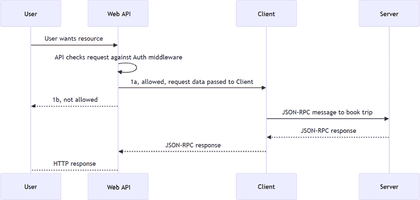

# 第十二章：将 MCP 应用投入生产

欢迎来到本书的最后一章。很高兴你能走到这一步！你已经学会了如何构建服务器和客户端，也许你现在想知道如何迈出最后一步，将你所构建的内容与世界分享。

这是一个很好的问题，本章将指导你考虑所有应该考虑的事项，以确保你的 MCP 应用经过充分测试、可靠、安全，并在生产环境中表现良好。让我们开始吧！

本章涵盖了以下主题：

+   **架构和设计**：在这里，我们将探讨模块化设计、集成模式和由于 AI 带来的特定架构影响

+   **打包和分发**：在这里，我们将讨论不同的打包选项，包括独立、嵌入式、部署渠道和语义版本控制

+   **测试和部署自动化**：在这里，我们将探讨不同的测试策略，如单元测试、集成测试和 AI 测试，并确保这些测试在 CI/CD 管道中使用，以便有信心地部署

+   **运维和可观察性**：在这里，我们将讨论扩展、弹性模式、可观察性、治理和未来证明

# 架构和设计

在设计你的 MCP 应用时，有几个架构考虑因素需要记住。这包括模块化设计、集成模式和 AI 对架构的影响。在本节中，我们将探讨以下主题：

+   **集成模式**：MCP 如何融入你的现有架构，你可以使用哪些模式来确保无缝集成？

+   **文档**：你如何记录你的架构和设计决策，以确保清晰性和可维护性？

+   **架构审查**：在审查你的架构以确保它满足你的要求、可扩展、可维护和安全的时，需要考虑哪些关键方面？

现在我们有了概述，让我们深入探讨每个主题。

## 集成模式

MCP 自带一套集成模式，以促进客户端和服务器之间的无缝通信。然而，如果你使用流式 HTTP 或 SSE 这样的传输方式，那么这个服务器将通过一个使用 HTTP 的 Web 应用托管，很可能组织成一个 RESTful API。这可能意味着你需要开发或使用特定的中间件来处理 Web API 到 MCP 通信，以实现日志记录、安全等功能。以下是它可能的工作方式。注意 Web API 中使用的中间件。同时注意 Web API 很可能是 RESTful API，客户端和服务器使用 JSON-RPC，这是由 MCP 协议规定的：



图 12.1 – 集成模式流程

在这个序列图中，你可以看到不同的组件是如何相互交互的。用户向 Web API 发出请求，然后 Web API 将请求与其身份验证中间件进行比对。如果请求被允许，Web API 将请求数据转发给客户端。然后客户端使用 JSON-RPC 消息与服务器通信。

## 文档

我们很好地记录代码是很重要的，这样我们才能理解所有更大的部分以及它们是如何相互配合的。这将帮助当前和未来的开发者理解系统，并使其更容易维护和扩展。

文档对于开发者和用户来说都非常重要。良好的文档使代码更容易理解、维护和使用。在考虑文档时，需要考虑以下方面：

+   **记录代码并生成文档**：所有代码通常都应该有良好的文档，这意味着我们应该努力记录所有输入和输出的操作。作为开发者，我们知道过时的信息有时比没有文档更糟，因此我们应该努力从代码中生成文档。你想要的是让代码以 Open API 格式（以前称为 Swagger）生成文档。例如，这段代码的路线以易于使用框架从中生成文档的方式进行了记录：

    ```py
    from fastapi import FastAPI
    from pydantic import BaseModel
    from typing import List
    app = FastAPI()
    class Booking(BaseModel):
       id: int
       title: str
       description: str = False
       when: str
    @app.get("/booking/", response_model=Booking, tags=["bookings"],
        summary="Book a trip",  description="Lets user book a trip[]")
    def book_trip():
        return Booking(id=1, title="Trip to Paris", description="A
            wonderful trip to Paris", when="2023-09-15") 
    ```

当代码以 `tags`、`summary` 等方式记录时，这将用于自动生成 Open API 文档。无论你选择什么框架和运行时，都要确保你的代码易于记录且易于从代码中生成文档。

+   **测试也是文档**：测试有时是了解一个功能应该如何工作的最佳方式。它们提供了预期行为的具体示例，并有助于阐明复杂逻辑背后的意图。确保包含全面的测试，涵盖各种场景和边缘情况。

+   **包含上下文流程图和边缘情况处理**：Mermaid 图表正成为标准，并且 GitHub 也支持渲染各种流程图、序列图等，因此考虑使用 Mermaid 或其他创建这些图表的方法。直观地看到某物的工作方式可以节省开发者和代码使用者数小时的时间。

## 架构审查

你的架构应考虑以下方面：

+   **模块化设计**：确保所有功能都分离到逻辑边界内，以便所有区域都在它们自己的模块中。不同的运行时以不同的方式做这件事，但一个好的经验法则是你的代码应该以易于理解和维护的方式组织。此外，你应该努力将相关的代码放在一起，并最小化模块之间的依赖。最后，只有一个理由需要改变，这意味着每个模块应该只有一个职责。例如，你不会将解析逻辑和业务逻辑放在同一个模块中。

+   **验证**：实施强大的验证机制以确保数据完整性和正确性。这包括输入验证、输出验证以及不同组件之间的合同验证。这也有一个安全方面，因为恶意行为者可能会尝试利用系统中的漏洞。Python 使用 Pydantic 进行数据验证和设置管理，其 MCP SDK 利用这些验证库进行输入和输出，以解决正确性和安全问题。以下是一个使用输入验证的示例：

    ```py
    from mcp.server.fastmcp import FastMCP
    from uuid import uuid4
    mcp = FastMCP(name="Tool Example")
    from pydantic import BaseModel
    class User(BaseModel):
        id: int
        name: str
        email: str
    users = []
    @mcp.tool()
    def create_user(user: User):
        # Create user logic here
        user.id = len(users) + 1
        users.append(user)
        return user
    if __name__ == "__main__":
        print("Starting MCP server...")
        mcp.run() 
    ```

在这个例子中，您可以看到有一个名为`create_user`的工具。它接受一个`User`模型作为输入，这将立即帮助进行验证和序列化。以下有效载荷将导致创建一个新用户：

```py
{
  "id": 0,
  "name": "chris",
  "email": "chris@example.com"
} 
```

另一方面，以下有效载荷将导致验证错误，因为缺少`id`：

```py
{
  "name": "chris",
  "email": "chris@example.com"
} 
```

这样，您可以设置对所有传入数据的验证，并确保只有正确数据进入您的系统。当然，从业务和安全的角度来看，在最终持久化数据之前，您可以根据需要添加更多验证规则。

+   **AI 对架构的影响**：如果您发布客户端和服务器，客户端很可能可以访问 AI 模型，这意味着从架构角度来看需要考虑一些特定的事情。这包括客户端如何与 AI 模型通信，如何管理客户端和服务器之间的上下文，以及如何处理任何潜在的故障或超时：

    +   **解耦架构**：确保您解耦内容管理、模型调用和 UI。

    +   **延迟和可靠性，以及它们对 UI 的影响**：在设计与 AI 模型交互时，也要考虑延迟和可靠性的影响。这意味着，例如，如果 AI 模型需要时间来返回响应，确保 UI 保持响应性并向用户提供反馈。如果 AI 因故障或速率限制而停止响应，需要优雅地处理这种情况。此外，确保您有回退机制，例如重试逻辑和断路器。我们将在本章后面更详细地讨论这一点。

    +   **令牌预算**：令牌预算不仅是 AI 模型的运行成本需要考虑的因素，从架构角度来看也非常重要，因为我们需要实施缓存策略和其他机制来优化令牌使用。

+   **安全**：实施最佳安全实践以保护您的应用程序及其数据。这包括保护 API、管理用户身份验证和授权，并确保数据隐私以及符合法规。考虑您如何采用*最小权限*来最小化用户和服务器的访问权限。这意味着确保用户和服务只访问他们绝对需要的资源。这的一个后果是，您可能需要实施更细粒度的访问控制，并持续监控任何未经授权的访问尝试。

# 打包和分发

在你甚至输入第一行代码之前，你需要考虑你正在构建的内容。使用 MCP，你有不同的选项来打包和分发你的应用程序。

## 打包选项

让我们看看一些打包选项。

+   **独立服务器**：这是为公共访问或私人使用设计的。无论访问是私人的还是公共的，你都需要考虑身份验证、授权和数据隐私。但对于公司或组织内部的私人分发，你需要考虑可发现性，内部团队将如何找到并使用这项服务，以及是否符合内部政策。

+   **嵌入式客户端/服务器**：这样的系统可能由客户端和服务器组件组成，客户端很可能带有 AI 功能，因此请确保你考虑了这一点的影响，例如数据隐私和安全以及负责任的 AI 使用，以及可能适用的任何监管要求。

### 独立服务器

假设你的目标是仅构建一个 MCP 服务器；这意味着你很可能会专注于构建一个在你包装现有 API 之前不存在的 API。由于这是 MCP，你需要决定这个服务器应该在何处运行。以下是一些考虑因素：

+   **本地机器**：在这种情况下，服务器需要使用 STDIO 传输。此外，由于它运行在用户的机器上，从安全的角度来看，你如何确保它是沙盒化的并且无法访问它不应访问的资源？实际上，你是否应该允许它访问网络？这取决于你，但你应该考虑这些方面。参见这个文件系统 MCP 服务器，其中服务器附带配置，既限制了访问权限，指定了它有权访问的目录，还提供了如何在容器环境中运行它的说明，以确保 MCP 服务器尽可能少地访问（[`github.com/modelcontextprotocol/servers/tree/main/src/filesystem`](https://github.com/modelcontextprotocol/servers/tree/main/src/filesystem)）。

+   **通过 URL 远程访问**：如果你的服务器是远程访问的，你可能不需要过多关注沙盒化，但你确实需要考虑身份验证和授权，以及确保 API 端点安全的各个方面。对于身份验证/授权，考虑使用 OAuth2 或 API 密钥，并始终验证传入的请求。此外，考虑**基于角色的访问控制**（**RBAC**）以确保用户不会获得比他们需要的更多对各种服务器功能的访问权限。也就是说，考虑你是否需要管理员用户、普通用户或访客访问，以及所有资源应该具有什么类型的权限级别。

在这两种情况下，你很可能会将源代码存储在 GitHub 或类似的版本控制系统中的某个地方。

### 嵌入式客户端/服务器

将 MCP 集成到现有的架构中需要仔细规划。从分发角度来看，您的 MCP 实现可能会与您现有的服务和应用程序以相同的方式部署。从代码组织角度来看，您仍然可以将其创建为可调用的 API 或微服务架构的独立服务；选择权在您手中。但您需要意识到的是，交付 MCP 集成意味着您交付的不仅仅是服务器；您还需要交付一个 MCP 客户端。客户端将负责与 MCP 服务器通信、处理请求和管理上下文。

## 分发渠道

当涉及到分发渠道时，您有几个选择：

+   **将服务器打包为 Docker 容器**：如果您希望确保服务器在部署到任何位置时都能在一致的环境中运行，这是一个很好的选择。您可以将 Docker 镜像推送到容器注册库，如 Docker Hub 或 GitHub Container Registry，用户可以轻松地拉取并运行容器。使用此选项时，您应指定如何配置容器以及需要设置的任何环境变量，如下例所示：

    ```py
    FROM node:22.12-alpine AS builder
    WORKDIR /app
    COPY src/filesystem /app
    COPY tsconfig.json /tsconfig.json
    RUN --mount=type=cache,target=/root/.npm npm install
    RUN --mount=type=cache,target=/root/.npm-production npm ci --ignore-scripts --omit-dev
    FROM node:22-alpine AS release
    WORKDIR /app
    COPY --from=builder /app/dist /app/dist
    COPY --from=builder /app/package.json /app/package.json
    COPY --from=builder /app/package-lock.json /app/package-lock.json
    ENV NODE_ENV=production
    RUN npm ci --ignore-scripts --omit-dev
    ENTRYPOINT ["node", "/app/dist/index.js"] 
    ```

上述示例来自示例文件系统 MCP 服务器（[`github.com/modelcontextprotocol/servers/tree/main/src/filesystem`](https://github.com/modelcontextprotocol/servers/tree/main/src/filesystem)）。

+   **通过包管理器分发**：如果您的服务器是用 Node.js 或 Python 构建的，您可以分别将其打包为`npm`模块或 PyPI 包。这使用户能够轻松地将您的服务器作为依赖项安装和管理在自己的项目中。对于.NET，相应的包管理器将是 NuGet，对于 Java，将是 Maven 或 Gradle。不同的包管理器对打包和分发您的代码有不同的规则，但通常涉及创建 README 文件、许可证以及将代码压缩成捆绑包。这对于您的 MCP 服务器用户查找和使用您所构建的内容来说是一个很好的方式。

+   **仓库分发**：您还可以通过直接提供源代码仓库的访问权限来分发您的服务器。这使用户能够克隆仓库并自行构建服务器，从而让他们对构建过程和依赖项有更多的控制。请确保您提供了如何运行和配置它的说明。Playwright 的 MCP 服务器（[`github.com/RBC/microsoft-playwright-mcp`](https://github.com/RBC/microsoft-playwright-mcp)）的此配置指令是一个很好的例子，展示了如何从 VS Code 或 Claude Code 等宿主开始使用它：

    ```py
    {
      "mcpServers": {
        "playwright": {
          "command": "npx",
          "args": [
            "@playwright/mcp@latest"
          ]
        }
      }
    } 
    ```

在本指令中，您可以看到如何使用`npx`启动服务器以及如何通过`args`提供参数。

## 采用语义版本控制

语义版本控制是我们应该采用的另一个代码规范。这是因为它使您和您的代码消费者更容易理解每个版本中变化的性质。

它支持以下版本：

+   当你进行不兼容的 API 更改时，这是一个主要版本

+   当你以向后兼容的方式添加功能时，这是一个次版本

+   当你进行向后兼容的错误修复时，这是一个补丁版本

你如何在软件中编码这取决于你对软件进行版本控制；例如，在版本 1.3.0 中，1 是主版本，3 是次版本，0 是修订版本。如果你只通过应用补丁来修复软件，那么你应该将其从 1.3.0 增加到 1.3.1。添加新功能应被视为次版本，因此你会将其从 1.3.0 增加到 1.4.0。许多更改，包括导致代码损坏的更改，被视为主要更改，因此版本应从 1.3.0 增加到 2.0.0。

通过这种方式编码，你创建了一个清晰且可预测的版本控制方案，向用户和开发者 alike 传达了更改的性质。因此，开发团队可以选择是否停留在 1.3.x（在这种情况下，他们只更新软件以修复错误和补丁更改），或者如果他们想要新功能但优先考虑稳定性，他们可以接受任何匹配 1.x.x 的版本，这将允许他们接收新功能，同时仍然处于一个稳定的基座上，不会带来破坏性更改的风险。

# 测试和部署自动化

测试是软件开发的关键部分，尤其是在与 AI 模型合作时尤为重要。自动测试有助于确保你的代码按预期运行，并能及早发现开发过程中的问题。此外，部署你的应用程序也应自动化，以确保一致性和可靠性。

## 测试策略

我们已经将测试作为一种文档形式提出来了。它也是确保代码按预期行为的关键部分。确保你编写的测试是全面的，并覆盖各种场景。你可能需要考虑以下测试：

+   **单元测试**：这些测试有助于确保单个组件按预期工作。在 MCP 的上下文中，考虑将解析逻辑拆分为单独的模块，以方便更容易地进行测试。

+   **集成测试**：这些测试验证了不同组件之间的交互，并确保它们按预期协同工作。对于 MCP，如果你的 MCP 集成是 Web 应用程序的一部分，那么设置端到端测试模拟用户与 UI 的交互可能是一个好主意。这样的测试将调用一个 Web 端点，该端点调用客户端，然后该客户端将调用 MCP 服务器功能来处理请求并返回响应。

+   **AI 测试**：由于 AI 模型可能表现出不可预测的行为，因此拥有专门验证其输出的测试至关重要。这包括测试各种输入场景和边缘情况，并确保模型的响应在可接受的参数范围内。考虑使用如对抗测试等技术来探测模型的弱点。对抗测试涉及创建旨在欺骗模型犯错的特定输入。同时，拥有一系列用于测试的提示也很不错，在这些提示下，系统应该运行良好或触发工具或其他功能。

通常，在测试中，关注各种方面，如性能、安全性和可用性。

## 部署自动化

构建应用、保护它、良好地架构和记录……这些都是好的，但没有一个稳健的部署流程，这一切都没有意义。那么，什么是**稳健的**呢？2025 年的稳健意味着我们可以点击一下按钮就部署某些东西，一天可以多次这样做，并且我们在部署时设置了多个安全措施。**安全措施**是我们确保测试运行并通过、遵循政策，并保持在某些指标内的步骤，例如，我们不使代码变慢，等等。

部署的方式有很多，例如 GitHub Actions 或 Jenkins。尽管如此，它们有一个共同点：要部署，你需要定义一个包含步骤的管道，并确保最终步骤导致一个可以部署的工件，或者你最终在生产中获得一个新的部署。

除了能够部署之外，我们还需要确保部署过程是可靠的并且可以一致地重复。此外，错误是会发生的，因此我们需要能够在出现问题的情况下回滚更改。

这对我们代码意味着什么？嗯，通常会导致创建一个`.yml`文件来表示之前提到的管道。

然后，你可能需要一个不同的配置或不同的环境，这也是需要考虑的。

对于 MCP 与普通软件相比，情况是否不同？嗯，区别在于意识到你可能需要发布 AI，因此你可能需要一个独立的 AI 部署管道，考虑模型性能、上下文管理等方面。

# 运营和可观察性

一旦你的应用程序投入生产，我们需要解决一系列问题：

+   **可观察性**：你知道你的应用表现如何吗？它是否在负载下运行，是否运行缓慢，是否失败，以及是否安全？

+   **可扩展性和弹性**：你的应用能否处理流量峰值？它能否进行扩展和缩减，并且对故障具有弹性？

+   **监控和反馈**：你知道何时出现问题吗？你能通知正确的人，并且你有反馈循环来随着时间的推移改进应用吗？

+   **治理和合规性**：你是否遵守了法规？你是否实施了正确的政策，并且是否负责任地管理数据？

+   **未来证明**：您为未来的变化做好准备了吗？您能否适应新技术，并且您是否持续改进您的应用？

## 可观测性

您真的知道您的应用表现如何吗？如果您知道，这意味着您在添加日志、追踪和指标方面非常勤奋。您可能已经添加了一个仪表板，以便您可以轻松地可视化所有这些，并且您甚至知道在需要时如何进行优化。我们大多数人渴望对我们的应用及其表现有这种程度的了解。当您为商业、客户等开发软件时，有很多风险。我们需要确保数据安全，应用需要以合理的速度响应并使用其被限制的资源，并且它需要正常工作。这听起来并不难，对吧？但实际上，尤其是当您开始为成千上万的客户或甚至数百万客户提供服务时，这尤其困难。但与其关注所有这些正确无误的难度，不如让我们谈谈我们至少需要实施的最重要的事情，以便能够观察我们的应用：

+   **日志记录**：日志记录对于理解您应用程序的行为至关重要。它有助于了解什么进入，什么出去，以及希望地，它通过应用程序的各个部分花费了多长时间。在适当的位置拥有日志记录可以帮助您识别瓶颈并优化性能。需要考虑的重要事项是日志级别（例如，info、debug 或 error）以及您包含的上下文（例如，用户 ID、请求 ID 等），以使您的日志更有用。

+   **追踪**：追踪对于理解请求通过您系统的流程至关重要。它允许您看到不同的服务如何交互以及瓶颈可能出现在哪里。实施分布式追踪以获得请求路径和延迟的完整视图。追踪与日志记录的不同之处在于它捕捉了请求的旅程。因此，它通常包含额外的信息，例如起源、目的地以及任何涉及的中间服务。

+   **指标**：指标关乎了解您服务器的健康状况、性能和可扩展性。因此，需要捕获的重要指标包括 CPU 和内存使用情况、请求吞吐量、响应时间和甚至错误率。捕获所有这些将为您提供对系统表现的良好理解。

对于可观测性，MCP 与传统应用并没有太大不同，但有一些独特的方面需要考虑，例如模型性能和令牌使用。对于 MCP 特别感兴趣的测量可能包括每个请求的令牌使用量与它被缓存或重用时的比较。此外，为了日志记录，MCP 内置了不同的日志，我们应该利用这些日志来指示错误、警告、正常日志等（[`modelcontextprotocol.io/specification/2025-03-26/server/utilities/logging`](https://modelcontextprotocol.io/specification/2025-03-26/server/utilities/logging)))。

## 可扩展性和弹性

部署 MCP 应用程序的另一个非常重要的方面是确保它们在负载下可以伸缩并保持弹性。您要解决的问题是要确保以下内容：

+   **流量激增（Traffic spikes）**：您可以在不降低性能的情况下应对流量的突然增加。如果您是一家电子商务公司，这在业务关键时期尤为重要，您需要能够处理购物高峰时段购买量的增加。

+   **弹性伸缩（Scaling up and down）**：您可以高效地管理资源以处理不同的负载。

+   **弹性（Resilience）**：您可以从故障中快速恢复并最小化停机时间。做得好意味着用户几乎不会注意到故障，或者根本不会注意到。相反，用户将经历中断和服务的降级，可能会将业务转移到其他地方。

现在我们已经了解了主要问题和为什么我们应该关注这些问题，那么解决方案是什么呢？对于流量激增，我们需要能够快速地进行弹性伸缩。大多数云服务提供商都内置了这一功能。您需要决定您想要控制多少。例如，您是否希望指定在特定的 CPU 或内存负载上进行伸缩，或者您是否可以接受所选平台来处理这个问题？

此外，作为一名架构师，您还可以设计出这样的系统，例如，您可以通过消息队列而不是直接与数据库通信，等等。有几种方法可以做到这一点，只有您知道需要考虑多大的规模：

+   **负载均衡（Load balancing）**：负载均衡的理念是将进入的流量分配到您的应用程序或服务的多个实例中，以确保没有单个实例被压垮。这提高了响应性和可用性。然而，为了您的解决方案，您可能将应用程序和人工智能视为不同的实体，因此为您的 MCP 服务器和人工智能模型端点设置不同的负载均衡方案。

+   **速率限制（Rate limiting）**：速率限制是一种在特定时间框架内控制服务接收请求数量的技术。这有助于防止滥用，确保公平使用，并管理 API 成本。同样，就像负载均衡一样，您可能为您的 Web 应用程序和人工智能端点有不同的方案。

+   **断路器（Circuit breakers）**：断路器的理念是检测故障并防止系统发出可能导致失败的请求。当达到一定的故障阈值时，断路器跳闸，随后一段时间内的请求将自动被拒绝。这允许系统恢复，并防止它被失败的请求所淹没。从用户体验的角度来看，断路器可以通过提供回退选项或优雅降级来帮助维持流畅的体验，当某些服务不可用时。

那么，我们如何实现这些机制呢？好吧，其中一些可以在应用层面完成，而其他一些可能需要基础设施支持。以下是一些策略：

+   **负载均衡**：使用负载均衡器将流量分配到您的应用程序或服务的多个实例。这可以通过云提供商的功能或专用负载均衡解决方案来完成。

+   **速率限制**：在 API 网关或应用级别实施速率限制，以控制用户或服务的请求数量。这有助于防止滥用并确保公平使用。

+   **断路器**：这些可以通过 API 网关来实现。

如果您使用云提供商，您应该考虑使用 Azure API Management 或 Amazon API Gateway 来有效地实施这些策略。这些服务将解决安全、可扩展性和可靠性问题，甚至具有帮助您处理 AI 问题的功能。它们共同的特点是使用声明性方法来定义这些策略。例如，Azure API Management 使用 XML 来定义速率限制、缓存和其他功能的策略。这使得应用和配置变得容易，而无需更改任何代码。

因此，这里的建议是调查您选择的云提供商，并利用他们的 API 管理解决方案来实施这些策略。请查看本章*资源*部分末尾的链接以获取更多信息。

## 监控和反馈

对于监控，我们已经提到了您可能会遇到的问题，例如性能瓶颈、错误率和用户行为模式。以下是一些解决这些问题的策略：

+   **实施应用程序性能监控（APM）工具**：使用 APM 工具来深入了解性能瓶颈和错误率。

+   **解决错误率**：实施自动错误跟踪和警报，以便快速识别和解决问题。

+   **用户行为分析**：利用分析工具来了解用户交互并识别潜在的改进领域。

+   **AI 使用**：您希望确保您的 AI 按预期使用，没有被滥用或误用，并且能够产生您期望的响应。为了解决这个问题，您应该定期采样请求并分析它们，以确保符合使用政策和性能预期。此外，添加反馈循环，让用户对 AI 生成的内容提供反馈。这样，您可以进行提示调整和上下文细化。您想要设置系统以减轻的事项还包括减轻提示注入攻击、不安全的内容生成以及其他潜在风险，如提及竞争对手的名称等。无论您最终选择哪种服务，都应该能够应对所有这些问题。

主要云提供商都有监控解决方案，可以帮助您设置仪表板、警报等。此外，对于 AI 服务使用，还有专门的分析工具可以帮助您分析提示。更多相关信息请参阅本章的*资源*部分。

## 管理和合规性

管理是确保你的应用程序在法律和道德标准的范围内运行。你需要遵守这些标准的程度取决于你所在的行业。有 GDPR 用于数据保护，HIPAA 用于健康信息，以及其他可能适用的法规。确保你有一个强大的合规框架。

从软件的角度来看，通过确保记录所有交互并创建一个 *审计轨迹* 以了解谁改变了什么以及何时改变，使遵守这些政策变得容易。你也可能考虑实施访问控制和数据加密，以进一步保护敏感信息。如果你正在提供人工智能，你需要关注你模型中的偏见和公平性。因此，你可能需要诸如健壮的系统提示和内容安全服务的使用，这些服务有助于实施你需要遵守的政策，无论是 GDPR 还是其他法规。

## 防御未来

好吧，所以你已经成功部署了一个满足你当前需求的系统。但未来怎么办？你如何保持安全、合规，以及你定义的成功所涉及的任何其他方面？

MCP 是一个相对较新的协议，因此它将继续发展。你需要跟踪这些变化；如果没有你应该应用的构造，也许有你应该停止使用的传输（SSE 已经被 Streamable HTTP 取代）。也可能会有关于某些功能使用的新的指导。你需要跟上所有这些。

与 MCP 相关的工具（例如，检查器工具）也可能发生变化，无论是工具数量的增加还是你与之交互的方式的变化。

然后，你有 SDKs，作为软件，它们正在不断变化。一些变化如此重大，以至于可能会破坏你的代码。你可能考虑至少保持某个主要版本一段时间，但确保你获得所有安全更新。结合 Dependabot、GitHub 高级安全等公认的工具，以确保你做出明智的选择，并了解通过保持某个 SDK 版本或转向新版本所承担的风险。

预见未来很难，但你可以在加强安全方面采取负责任的态度。软件变化迅速，新的威胁被定期发现。了解最新的安全实践，并准备好根据需要调整你的系统。

# 摘要

这是一个内容丰富的章节，有很多内容需要覆盖，但希望你已经通过提供的指导感到有所帮助。只要你知道你面临的问题，并积极努力解决它们，那么选择通过库、云服务或其他方式来解决它们的选择权在你手中。你可能需要比你想的更多的时间来关注安全，因为它正成为全球公司的主要关注点。

确保你根据生产前、生产中和后期制作需要做的事情来制定计划，并为未来做好准备。保持信息畅通。事情总会出问题；问题在于你如何应对这些意外，以及你采取了哪些措施来减轻任何潜在问题。

如果你读到这儿，这意味着你已经从这本书中学到了很多，从构建你的第一个服务器和客户端，与 LLM 交互，使用 VS Code 等工具消费服务器，最后以负责任的方式部署它。恭喜！我也很高兴在 LinkedIn 上与你联系，[`uk.linkedin.com/in/christoffer-noring-3257061`](https://uk.linkedin.com/in/christoffer-noring-3257061)。

# 资源

这里有一些有用的资源：

+   *Azure AI Management 中的 API 网关*：[`docs.azure.cn/en-us/api-management/api-management-gateways-overview`](https://docs.azure.cn/en-us/api-management/api-management-gateways-overview)

+   这是一个展示如何添加许多功能（如速率限制、监控、安全等）的出色仓库 – *AI 网关*：[`github.com/Azure-Samples/AI-Gateway`](https://github.com/Azure-Samples/AI-Gateway)

    |

    #### 现在解锁这本书的独家优惠

    扫描此二维码或访问[`packtpub.com/unlock`](https://packtpub.com/unlock)，然后通过书名搜索这本书。 |  |

    | **注意**：在开始之前，请准备好您的购买发票。* |
    | --- |
