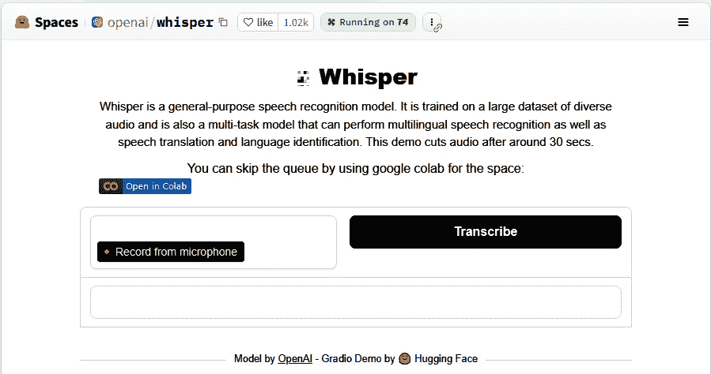

# 第一章：揭开 Whisper 的面纱——介绍 OpenAI 的 Whisper

**自动语音识别**（**ASR**）是**人工智能**（**AI**）的一个领域，专注于通过语音实现计算机与人类之间的互动。多年来，ASR 在语音处理方面取得了显著进展，**Whisper**就是一个近期广受欢迎的革命性 ASR 系统。

Whisper 是由 OpenAI 开发的先进**语音识别**模型，训练于一个庞大的多语言数据集。凭借其准确的语音转录能力，Whisper 已成为语音应用程序的首选工具，如助手、转录服务等。

本章将探索 Whisper 的基础知识及其功能。我们将从介绍 Whisper 及其在 ASR 领域的重要性开始。接着，我们将揭示 Whisper 的关键特性和优势，了解它与其他语音模型的不同之处。然后，我们将讲解实现 Whisper 的基本指导原则，包括初步的系统配置和基础使用教程，帮助你快速上手。

本章将涵盖以下主题：

+   解构 OpenAI 的 Whisper

+   探索 Whisper 的关键特性和功能

+   设置 Whisper

在本章结束时，你将亲自体验 Whisper，并了解如何利用其核心功能来满足你的语音处理需求。

# 技术要求

如本章所述，你只需要一个 Google 帐户和互联网连接即可在**Google Colaboratory**中运行 Whisper AI 代码。使用免费的 Colab 和 GPU 版本不需要付费订阅。熟悉 Python 的人可以在自己的环境中运行此代码示例，而不必使用 Colab。

本章我们使用 Colab，因为它允许快速设置并运行代码，而无需在本地安装 Python 或 Whisper。本章中的代码使用的是小型 Whisper 模型，适用于测试目的。在后续章节中，我们将完成 Whisper 的安装，以利用更高级的自动语音识别（ASR）模型和技术。

本章中的代码示例可以在 GitHub 上找到，链接为[`github.com/PacktPublishing/Learn-OpenAI-Whisper/tree/main/Chapter01`](https://github.com/PacktPublishing/Learn-OpenAI-Whisper/tree/main/Chapter01)。

# 解构 OpenAI 的 Whisper

在本节中，我们将踏上探索语音与言语的复杂世界，揭示人类发声的奇迹。语音与言语不仅仅是声音；它们是人类沟通的交响乐，通过生理过程的和谐交互来演绎。本节旨在为你提供对这些过程的基础理解，以及它们在语音识别技术中的重要性，特别是在 Whisper 中。你将学习到，Whisper 作为一个先进的语音识别系统，如何模拟人类的听觉敏锐度，以准确解读和转录语音。这种理解至关重要，因为它为理解 Whisper 的复杂性和功能奠定了基础。

本节的课程有多个价值。首先，它们提供了对语音与言语生物学和认知复杂性的深刻理解，而这些复杂性是理解语音识别技术的基础。其次，它们清晰地展示了这些技术固有的挑战与局限性，以 Whisper 为典型例子。这些知识不仅仅是学术性的；它们直接适用于现实生活中，尤其是在语音识别能发挥变革作用的各种场景中，从提升可访问性到打破语言障碍。

在我们继续前进时，请记住，语音与言语的旅程是艺术与科学的融合——理解自然和掌握技术的结合。本节是你进入广阔且令人兴奋的语音识别世界的第一步，Whisper 将作为你的引路人。

## 人类发声的奇迹——理解语音与言语

在人类能力的广阔范围内，发声和言语的能力是我们生物结构复杂性的见证。这是一个超越单纯声音产生的现象，将生物学、情感和认知交织在一起，创造了一种我们用来表达内心思想和感受的媒介。本节邀请你探索发声与言语产生的迷人世界，不通过解剖学家的视角，而是以技术专家的好奇心去惊叹大自然最复杂的工具之一。当我们深入探讨这一课题时，请思考像 OpenAI 的 Whisper 这样的技术，在解读和理解这些独特的人的特性时所面临的巨大挑战。

你是否曾想过，当你随意交谈时，背后运作的复杂系统？说话的轻松掩盖了支撑这一过程的复杂生理机制。类似地，当你与像 Whisper 这样的语音识别系统互动时，你是否考虑过支撑它理解和处理你话语的精密编码和算法精确性？

语言和语音的起源根源于呼吸的行为。横膈膜和肋骨在吸气和呼气中扮演着关键角色，为发声提供必要的气流。这个过程从声带在喉部内的战略性开合开始，喉部是发声的核心。当来自肺部的空气通过声带时，它会导致声带振动，从而产生声音。

另一方面，语言的产生是通过各种解剖结构的精确协调来实现的，包括软腭、舌头、下颚和嘴唇。这些结构将声带产生的原始声音雕刻成可识别的语言模式，使得思想和情感得以表达。掌握为了清晰交流所需的肌肉控制的微妙平衡是一个漫长的过程，需要大量的练习。

理解人类声音和语言产生的复杂性在 OpenAI 的 Whisper 中至关重要。作为一个先进的语音识别系统，Whisper 被设计用来模拟人耳的听觉敏锐度，准确地解释和转录人类语言。Whisper 面临的挑战反映了人类语言发展的复杂性，凸显了这一任务的复杂程度。

## 理解语音识别的复杂性

人类大脑在语言理解方面的能力是认知处理的一个奇迹，几十年来一直吸引着科学家和语言学家的关注。估计一个 20 岁的人大约知道 27,000 到 52,000 个词汇，通常到 60 岁时，这个数字会增加到 35,000 到 56,000 个词汇。每一个词在说出时都会存在一个短暂的瞬间——通常不到一秒钟。然而，大脑能够迅速做出决策，正确识别所说词汇的概率大约为*98%*。大脑是如何以如此高的精度和速度完成这一壮举的呢？

### 大脑作为并行神经处理器

大脑作为**并行处理器**的功能是我们语言理解能力的核心。并行处理意味着它可以同时处理多个任务。与一次处理一个操作的顺序处理器不同，大脑的并行处理能力允许同时激活多个可能的词汇匹配。那么，这在神经活动的背景下是怎样的呢？

一般认为，我们词汇中的每个单词都由大脑中的一个独特处理单元表示。这些单元不是物理实体，而是大脑皮层中的神经元放电模式，**单词的神经表征**。当我们听到一个单词的开头时，这些单元中的成千上万会立即启动，每个单元都在评估即将到来的听觉信号与它们所对应的单词的匹配可能性。随着单词的推进，许多单元会因为发现不匹配而停用，从而缩小可能性范围。这个过程会持续，直到只剩下一个放电活动模式——这就是**识别点**。活跃的单元抑制其他单元的活动，这是一个节省宝贵毫秒的机制，使我们能够以每秒最多八个音节的速度理解语言。

### 获取意义和语境

语音识别的目标不仅仅是识别单词本身；它还涉及获取单词的意义。令人惊讶的是，大脑在单词完全发音之前就开始考虑多重含义。例如，当听到“cap”这个片段时，大脑同时考虑到多个可能性，如“captain”或“capital”。这种潜在意义的爆发最终会被识别点精炼为单一解释。

语境在引导我们理解中起着至关重要的作用。它能加快识别速度，并帮助消除多义词或同音异义词的歧义。对于双语或多语使用者来说，语言语境是一个额外的提示，能够过滤掉其他语言的单词。

### 晚上的整合过程

大脑如何在不破坏词汇表的情况下整合新词汇？答案在于**海马体**，这是大脑中最初储存新词的区域，独立于大脑皮层的中心词库。通过一种在睡眠过程中发生的被认为的过程，这些新词逐渐融入大脑皮层的网络，确保现有词汇的稳定性。

当我们的意识在夜间休息时，大脑却在积极地将新词汇融入我们的语言框架。这一夜间活动对保持我们语言能力的动态性至关重要，为我们应对不断发展的交流景观做好准备。

## OpenAI 的 Whisper – 一个技术平行体

在人工智能领域，OpenAI 的 Whisper 提供了一个与人类大脑语音识别能力相似的技术平行体。Whisper 是一款最先进的语音识别系统，通过深度学习技术以惊人的准确性转录和理解口语。像大脑通过并行处理来处理语言一样，Whisper 利用**神经网络**来分析和解释音频信号。

Whisper 的神经网络在庞大的数据集上进行训练，使得系统能够识别不同语言和口音中的各种词汇和短语。该系统的架构与大脑的识别机制相似，通过不断缩小可能的转录范围，直到选择最可能的那一个。

Whisper 还展示了大脑将上下文融入理解的能力。该系统能够从周围的语音中辨别出上下文，从而提高其实时转录的准确性。此外，Whisper 被设计为不断学习和适应，就像人类大脑将新词汇纳入词汇表一样。

Whisper 的算法必须应对各种变量，从口音、语调到背景噪声和语音不规则性，以便准确地将语音转换为文本。通过解剖语音和语音识别的细微差异，我们可以深入了解 Whisper 在处理和理解人类语言时必须克服的挑战和复杂性。

随着我们展望未来，像 Whisper 这样的语音识别技术潜力无穷。它有望打破语言障碍，提升可访问性，并创造更加自然的人机互动。Whisper 与人类大脑语音识别过程的相似性突显了我们认知能力的复杂性，并彰显了人工智能的显著成就。

## 语音识别的演变与 OpenAI 的 Whisper 的出现

为机器赋予识别和理解人类语音的能力一直是一个巨大的挑战，吸引了过去一个多世纪里技术领域最聪明的头脑。从 19 世纪末期的简单听写机到如今复杂的算法，语音识别技术的发展见证了人类的智慧和毅力。

### 语音识别的起源

最早的语音识别工作集中在创建元音发音上，为能够破译音素——语音的基本单位——的系统奠定了基础。著名的托马斯·爱迪生在这一领域开创了先河，他发明的听写机能够录制语音，这项技术在大量文书工作中的专业人士中得到了广泛应用。

什么是音素？

音素是语言中最小的有意义的声音单位。改变一个音素可以改变一个词的全部含义。以下是一些音素的例子：

- 词汇“cat”有三个音素：/c/，/a/，和/t/。

- 词汇“bat”也有三个音素：/b/，/a/，和/t/。/b/音素将其含义与“cat”区分开来。

- 词汇“sit”有三个音素：/s/，/i/，和/t/。/s/和/i/音素使其与“cat”有所不同。

语音识别领域在 1950 年代取得了重大进展。1952 年，贝尔实验室创造了第一个可行的语音识别系统 Audrey，能够以 90%的准确率识别由一个人发音的 0 至 9 的数字。1962 年，IBM 推出了 Shoebox，能够识别 16 个英语单词。在 1960 年代，日本研究人员在音素和元音识别方面取得了进展。然而，这种准确性取决于说话者，突显了语音识别固有的挑战：声音、口音和发音在不同个体之间的差异性。

### 机器理解的到来

一个重要的突破出现在 1970 年代，来自**国防高级研究计划局**（**DARPA**）的**语音理解研究**（**SUR**）计划。在卡内基梅隆大学，Alexander Waibel 开发了 Harpy 系统，该系统能够理解超过 1000 个单词，词汇量相当于一个小孩子。Harpy 的亮点是使用**有限状态网络**来减少搜索空间，并使用**光束搜索**来追求最有前景的解释。

有限状态网络

有限状态网络是由状态和它们之间的转换组成的计算模型。它们可以在保持在定义的状态内的同时识别输入中的模式。它们的作用是通过限制语音组件之间有效的转换，来减少语音识别的搜索空间。这简化了可能解释的解码过程。

示例包括以下内容：

- 限制有效相邻声音之间转换的音素网络。

- 连接语法中允许的单词的词汇网络。

- 语音识别使用嵌套的有限状态网络，跨越不同的语言层次。

光束搜索

光束搜索是一种优化算法，它只追求满足某些标准的最有前景的解决方案，剔除不太可能的候选项。它将计算集中在可能最大化目标指标的解释上。这比穷举地评估所有选项更高效。

示例包括以下内容：

- 语音识别光束搜索，追求可能的转录，同时过滤掉不太可能的词序列。

- 机器翻译光束搜索，确保翻译符合目标语言规则。

- 视频字幕光束搜索，偏向符合预期语法和语义的字幕。

Waibel 的动机是开发 Harpy 和后续系统，如 Hearsay-II，以实现语音翻译，将语音直接转化为另一种语言的文本，而不是使用字典。语音翻译需要通过利用语言学知识来应对自然语言的复杂性。

1970 年代的其他关键发展包括贝尔实验室建立了第一个多语音系统。1980 年代，**隐马尔可夫模型**（**HMMs**）和统计语言模型的引入推动了技术进步。到 1980 年代中期，IBM 的 Tangora 能够识别 20,000 个单词，为早期的商业化应用奠定了基础。Tangora 最初被设计为一款为办公室使用的语音操作打字机，用户可以口述文本，然后由系统转录。这项功能大幅提升了办公人员的工作效率。这项技术标志着我们今天所知的语音听写系统的重大进展。

### 连续语音识别的时代

直到 1990 年代，语音识别系统主要依赖于模板匹配技术，这要求语音必须清晰且缓慢，并且需要在无噪音的环境中进行。这种方法有明显的局限性，因为它缺乏足够的灵活性来适应人类语音的自然变化。

1990 年代，随着神经网络和计算能力的提升，语音识别的准确性和速度迅速提高。IBM 的 Tangora 利用隐马尔可夫模型（HMMs），标志着一个重要进展。这项技术使得语音单元序列可以进行一定程度的预测，从而提高了系统对个体语音模式的适应性。尽管需要大量的训练数据，Tangora 仍能识别出令人印象深刻的英语单词词汇表，开始了商业化应用。

1997 年，Dragon 公司的 NaturallySpeaking 软件——世界上首个连续语音识别器——问世，成为一个分水岭时刻。这一创新消除了单词之间的停顿，使得与机器的互动更加自然。随着计算能力的提升，神经网络提高了识别准确性。像 Dragon NaturallySpeaking 这样的系统可以以 97%的准确率每分钟处理 100 个单词。

谷歌进军语音识别领域，推出了适用于 iPhone 的 Voice Search 应用，利用机器学习和云计算达到了前所未有的准确度。谷歌通过推出 Google Assistant 进一步完善了语音识别技术，现在这个助手已被安装在全球许多智能手机中。到 2001 年，通过像 BellSouth 的语音激活门户这样的系统，消费者的使用不断增加。

然而，最重大影响出现在 2007 年智能设备普及后，准确的语音助手使用基于云的深度学习。2010 年，苹果的 Siri 通过在语音识别中加入某种人性化元素，激发了公众的想象。2014 年，微软的 Cortana 和亚马逊的 Alexa 相继推出，在语音识别领域激起了科技巨头之间的竞争。

### 与 OpenAI 的 Whisper 的关系

在这一创新的连续性中，OpenAI 的 Whisper 成为一个关键的进展。Whisper 是一个基于深度学习的语音识别系统，建立在前述历史进步和挑战的基础上。它利用庞大的数据集和复杂的模型，能够准确地识别多种语言和方言的语音。Whisper 体现了为创造一个不仅能高度适应个人语音模式，还能具备上下文理解能力的系统而付出的努力，这一关键特性是此前技术所难以实现的。

从爱迪生的听写机到 OpenAI 的 Whisper，语音识别技术的演变代表了人类与机器之间更加直观和无缝的界面追求。回顾这一历程，我们或许该问问自己：下一代语音识别技术将探索哪些新的前沿？进一步发展的潜力巨大，预示着一个未来，在那里人类交流与机器解读之间的障碍几乎无法区分。到目前为止，我们所见证的进步仅仅是一个序章，标志着一个语音识别技术将成为我们日常生活中不可或缺、普遍存在的时代的开始。

在下一节中，你将了解 Whisper 的关键特性和功能，这些特性使其具备了精确的语音识别能力。你将发现 Whisper 强大的功能，使其在各种应用中脱颖而出。从其卓越的**语音转文字**（**STT**）转换到其处理多种语言和口音的能力，Whisper 在自动语音识别（ASR）领域展示了最前沿的性能。我们将深入探讨 Whisper 如何利用先进的技术，将语音转化为文字，包括编码器-解码器变换器模型及其在庞大且多样化的数据集上进行的训练。

# 探索 Whisper 的关键特性和能力

在本节中，我们将深入探讨 OpenAI 的 Whisper，揭示其在自动语音识别（ASR）中脱颖而出的核心要素。这一探索不仅仅是功能的罗列；它是一次深入理解 Whisper 如何超越传统语音转文字（STT）转换界限的洞察之旅，提供了无与伦比的准确性、多功能性和易用性。

Whisper 的功能不仅限于转录。你将了解它在实时翻译中的强大能力，支持多种文件格式，并且能够轻松集成到各种应用中。这些功能共同使 Whisper 不仅仅是一个转录工具，而是一个全球通信和无障碍解决方案。

本部分对于那些寻求理解 Whisper 功能实际意义的人至关重要。无论你是开发者，想将 Whisper 集成到项目中，还是研究人员，探索语音识别技术的前沿，或仅仅是一个热衷于理解最新人工智能进展的爱好者，这里的知识都是无价的。它们为理解 Whisper 这一技术奇迹及其改变我们与口语语言互动和处理方式的潜力提供了坚实的基础。

在学习这一部分内容时，请记住，深入了解 Whisper 的功能不仅仅是一次学术练习。这是一本实践指南，旨在帮助您利用目前最先进的语音识别技术之一，该技术有望推动各个领域和应用的创新。

## 语音转文本

Whisper 的核心功能是将口语转录为文本。想象一下，一个记者在现场录制采访时，可以迅速将每一句话转换成可编辑、可搜索和可共享的文本格式。这一功能不仅方便；它在快速传播口语信息至关重要的环境中是一个游戏改变者。

最新版本的 Whisper，称为`large-v3`（Whisper-v3），于 2023 年 11 月 6 日发布。它的架构使用了一个编码器-解码器变换器模型，经过 1 百万小时的弱标注音频和 4 百万小时的伪标注音频训练，这些音频来自互联网上真实世界的语音数据，使其能够应对多种录音条件。以下是 Whisper 如何将语音转化为文本：

1.  输入音频被分割成 30 秒的片段，并转换成对数-梅尔频谱图。

1.  编码器接收频谱图，创建音频表示。

1.  解码器的训练是根据编码器的表示预测相应的文本转录，包括语言识别和时间戳等任务的独特标记。

对数-梅尔频谱图

对数-梅尔频谱图是通过对**梅尔频谱图**中的数值取对数得到的。这会压缩频谱图的动态范围，并使其更适合输入到机器学习模型中。

梅尔频谱图表示音频信号在频域中的功率谱。它们是通过将**梅尔滤波器组**应用于信号的功率谱获得的，将频率分组到一组**梅尔频率桶**中。

梅尔频率桶以模拟低级听觉感知的方式表示声音信息。它们捕捉每个频带的能量，并近似频谱形状。

Whisper-v3 的架构与之前的大型模型相同，只是输入使用了 128 个梅尔频率桶，而不是 80 个。在 Whisper-v3 中，梅尔频率桶数量从 80 个增加到 128 个，这在多个方面都具有重要意义：

- **改善频率分辨率**：Whisper-v3 可以使用更多的 Mel 频率单元捕捉音频频谱中的更精细细节。更高的分辨率使得模型能够区分彼此接近的频率，这有助于提高其识别音素或单词之间微妙声学差异的能力。

- **增强语音表示**：增加的 Mel 频率单元数提供了更详细的语音信号表示。这种更丰富的表示可以帮助模型学习到更多区分性特征，从而提高语音识别的性能。

- **提高与人类听觉感知的兼容性**：Mel 尺度旨在模仿人类对声音频率的非线性感知。通过使用 128 个 Mel 频率单元，Whisper-v3 能够更接近地模拟人类听觉系统对不同频率范围的敏感性。这种与人类感知的对齐可能有助于提高语音识别的准确性。

- **允许学习复杂模式**：128 个 Mel 频率单元提供的高维输入为 Whisper-v3 提供了更多的数据。这种增加的输入维度可能使得模型能够学习语音信号中的更复杂和微妙的模式，可能有助于提高其在困难的声学条件或说话风格下的处理能力。

尽管增加 Mel 频率单元数可以带来这些好处，但也伴随着计算成本。处理更高维度的输入需要更多的内存和计算，这可能会影响模型的训练和推理速度。然而，增加的频率分辨率所带来的语音识别性能提升，在许多应用中可能会抵消这些计算考虑。

这种端到端的方式允许 Whisper 直接将语音转化为文本，而不需要任何中间步骤。庞大且多样化的训练数据集使得 Whisper 比以往的语音识别系统更好地应对口音、背景噪音和技术性语言。以下是一些关于语音转文本（STT）转换的关键能力：

+   Whisper 可以将语音转录为近 100 种语言的文本，包括英语、普通话、西班牙语、阿拉伯语、印地语和斯瓦希里语。Whisper-v3 新增了粤语的语言标记。这种多语言转录使其在国际交流中非常有用。

+   该模型对口音、背景噪音和技术术语具有强大的鲁棒性，使其能够有效处理多样化的录音条件。

+   Whisper 在许多语音识别基准测试中实现了最先进的性能，无需任何微调。这种零样本学习能力使得其能够转录在训练过程中未见过的新语言。

+   转录内容包括标点符号和大写字母，提供了格式化良好的文本输出。如果目标是将转录文本与原始音频对齐，可以选择使用时间戳。

+   一个流式 API 可以实现低延迟的实时转录，这对于实时字幕和其他需要快速处理的应用至关重要。

+   开源发布促进了对语音识别改进的研究，并帮助构建定制化解决方案。

总的来说，Whisper 在许多语言和使用场景中提供了高度强大和准确的 STT 转录质量。其转录质量超过了许多商业产品，且无需任何定制化。

## 翻译功能

除了转录，Whisper 还可以将语音从一种语言翻译成另一种语言。其翻译能力的关键特点如下：

+   Whisper 支持将近 100 种输入语言的 STT 翻译成英文文本。该功能可以在一步操作中实现非英语音频的转录和翻译。

+   该模型会自动检测输入语言，因此用户在翻译过程中无需手动指定语言。

+   翻译输出旨在传达原始音频的整体意义，而不仅仅是逐字替换。这一特性有助于捕捉细微差别和上下文。

+   在对齐的语音和文本数据上进行多任务训练，使得开发了一个用于转录和翻译的单一模型，而非多个独立的系统。

+   翻译质量方法采用了专门针对特定语言对的机器翻译模型。然而，Whisper 使用一个模型支持更多的语言。

总结来说，Whisper 通过在一个多任务模型中实现对多种语言的直接 STT 翻译，突破了语音翻译的边界，且没有妥协准确性。Whisper 使得英语使用者能够访问全球内容，并促进国际间的交流。

## 支持多种文件格式

Whisper 的多样性扩展到了支持多种音频文件格式，包括 MP3、MP4、MPEG、MPGA、M4A、WAV 和 WebM。这种灵活性在当今的数字环境中至关重要，因为音频内容形式多样。对于处理各种媒体文件的内容创作者来说，这意味着无需额外的文件转换步骤，确保了更流畅的工作流程。

具体而言，Whisper 在后台利用 FFmpeg 加载音频文件。由于 FFmpeg 支持读取多种文件容器和编解码器，Whisper 继承了这一多样性，可以处理各种输入。用户甚至可以提供如`.mp4`这样的视听格式作为输入，Whisper 会提取其中的音频流进行处理。

最近，官方支持的格式新增了开源 OGG/OGA 和 FLAC 编码格式。它们的加入彰显了 Whisper 在支持社区驱动和自由授权的媒体格式方面的承诺，同时也支持更多专有格式选项。

当前上传文件到 Whisper 的 API 服务的文件大小限制为 25 MB。Whisper 通过将较大的本地文件拆分为每个小于 25 MB 的片段来处理更大的文件。各种格式——从标准压缩格式到 CD 质量的无损格式——再加上宽松的文件大小限制，满足了使用 Whisper 时几乎所有音频内容的需求。

总结来说，Whisper 通过支持多种音频格式，同时保持领先的语音识别能力，脱颖而出。Whisper 使用户能够直接输入内容，而无需繁琐的转换或预处理步骤。无论是制作播客、有声书、讲座，还是其他以语音为核心的媒体，Whisper 都能提供文件支持。

## 易用性

OpenAI 发布 Whisper 标志着将自动语音识别（ASR）功能集成到应用程序中的重要一步。OpenAI 和其他网站提供的 Python 代码示例展示了开发者如何轻松地将 Whisper 的功能融入应用程序。这种简便性使创新者能够相对简单地利用 ASR 技术创造新的工具和服务。

具体来说，调用 Whisper API 并传递音频输入的简单过程展示了该技术的可接触性。开发者只需几分钟即可集成一套生产级的语音识别系统。多种模型大小可根据基础设施的需求调整语音处理能力。Whisper 可根据使用场景扩展，从轻量级的移动设备应用到云端的重型后端系统。

超越单纯的技术集成，Whisper 简化了利用语音数据的过程。庞大的训练数据集提供了出色的现成准确性，无需用户进行微调，内建的多语言支持也免除了语言专业化的需求。综合这些特点，Whisper 降低了高强度 ASR 技术生产性应用的门槛。

总结来说，通过提供最先进的语音识别技术，并便于轻松融入新系统，Whisper 有望推动语音启用应用程序在各个领域的“寒武纪大爆发”。其解锁创新的潜力与任何人都能轻松使用它的便捷性不相上下。Whisper 所提供的强大功能与易用性相结合，预示着一个新的时代——语音处理成为发明性问题解决者随时可以利用的关键元素。OpenAI 已全面开放创新的大门。

## 多语言能力

Whisper 最令人印象深刻的特点之一是其在多种语言上的高效能。截至 2023 年 11 月，它支持从南非荷兰语到威尔士语的 100 种语言。这种多语言能力使 Whisper 成为全球通信、教育和媒体领域中不可或缺的工具。

例如，教育工作者可以使用 Whisper 将讲座转录成多种语言，帮助学生进行语言学习和理解。采访记者可以转录并翻译对话，消除语言障碍。客服代表可以使用 Whisper 的语音翻译与客户用母语沟通。

Whisper 通过对来自互联网的 68 万小时、涵盖 100 种语言的音频数据集进行训练，展现了其多语言能力。这些数据使模型能够处理多种口音、音频质量以及专业术语的转录和翻译。

尽管 Whisper 在不同语言的准确性有所差异，但即便是低资源语言如斯瓦希里语，它也展现了竞争力的表现。Whisper 利用其对其他语言的理解，在训练数据较少的语言上进行推断。然而，要在所有语言中实现相等的专业水平仍然面临挑战。对于像普通话这样的声调语言，性能最弱。通过扩大 Whisper 训练数据的多样性，可能进一步增强其多语言能力。

Whisper 支持在单一模型中处理近 100 种语言，这一点非常了不起。随着 Whisper 的多语言性能不断提升，它可能帮助我们更接近无缝的全球沟通。

## 大文件输入处理

Whisper 能够处理最大 25 MB 的音频文件，直接满足了处理长时间录音（如播客或口述历史学家）的需求。Whisper 可以处理更长文件的分段音频，确保没有上下文或内容质量的丢失。

### 灵活的文件大小限制

默认的 25 MB 文件大小限制涵盖了许多标准音频长度，同时优化了快速处理。对于超过 25 MB 的文件，Whisper 提供了将音频分割成小于 25 MB 每段的选项。这种分块方式使 Whisper 能够处理任何长度的文件。推荐将较长文件分段，而非压缩，以避免降低音频质量和识别准确度。在分段时，最好在停顿或发言者之间进行拆分，以最大限度地减少上下文丢失。像 `pydub` 这样的库可以简化音频分段过程。

### 保持段落质量

Whisper 使用内部算法重建音频段之间的上下文，为大文件提供高质量的转录。OpenAI 团队持续改进 Whisper，在不同段落之间提供连贯转录的能力，最大限度减少差异。

### 扩展对长篇内容的访问

Whisper 对大文件的强大处理能力解锁了长篇内容的转录功能，例如讲座、访谈和有声书。较长的文件使创作者、研究人员等能够高效地利用音频内容进行各种下游应用，无论规模大小。随着 Whisper 的分段能力提升，用户可以准确转录甚至是极其冗长的录音，如多日的会议记录。

总结来说，Whisper 通过其分段处理能力，为短音频和长音频提供了灵活的转录解决方案。精心的分段处理能保持质量，同时让 Whisper 能够处理任何长度的音频文件。

## 专业词汇的提示词

Whisper 利用提示词来提高转录准确性的能力使其在医学、法律或技术等专业领域极具价值。通过提供包含相关术语的提示词，模型能更好地识别转录过程中涉及的专业词汇和技术术语。

例如，放射科医生可以为 Whisper 提供一个包含医学术语、解剖结构和影像学技术的提示词。这个提示词将帮助 Whisper 准确转录放射学报告和解释性发现。类似地，律师可以在提示词中加入法律术语和案件引用，以改善证词或法庭程序的转录。

这里有一个放射科医生可以提供给 Whisper 的提示例子，用于准确转录放射学报告和解释性发现：

```py
"Patient is a 45-year-old male with a history of hypertension and hyperlipidemia. The patient presented with chest pain and shortness of breath. A CT scan of the chest was performed with contrast. The scan revealed a 2.5 cm mass in the right upper lobe of the lung. The mass is well-circumscribed and has spiculated margins. There is no evidence of mediastinal lymphadenopathy. The patient will undergo a biopsy of the mass for further evaluation."
```

该提示词包含了“高血压”、“高脂血症”、“CT 扫描”、“对比剂”、“肿块”、“右上叶”、“分叶缘”、“纵隔淋巴结肿大”和“活检”等医学术语。它还包括“肺”和“纵隔”等解剖结构。最后，它还涉及了“CT 扫描”和“对比剂”等影像学技术。

通过提供这样的提示，放射科医生可以训练 Whisper 准确识别和转录这些术语。这有助于提高转录放射学报告和解释性发现的准确性和速度，最终节省时间并改善放射科医生的工作流程。

提示词不需要是实际的抄本——即使是包含相关词汇的虚构提示词也能引导 Whisper 的输出。以下是一些有效提示的技巧：

+   使用 GPT-3 生成包含目标术语的模拟抄本，以供 Whisper 模仿。这能训练 Whisper 掌握相关词汇。

+   提供一个*拼写指南*，列出行业特有名称、产品、程序、少见词汇、缩略语等的正确拼写。这有助于 Whisper 学习专业的拼写规范。

+   提供长篇详细的提示词。更多的上下文帮助 Whisper 适应所需的风格和词汇。

+   基于 Whisper 的输出反复编辑提示词，包括补充遗漏的术语或纠正错误，进一步完善模型。

提示词不是万能的，但可以提高专业转录任务的准确性。通过提前提供技术性词汇，Whisper 能够生成高度准确的抄本，甚至对于专业的音频内容也不例外。其在提示词使用上的灵活性是 Whisper 相对于传统自动语音识别（ASR）系统的关键优势。

## 与 GPT 模型的集成

Whisper 与像 GPT-4 这样的大型语言模型的整合显著增强了其能力，通过精细化转录使其更加精确。GPT-4 可以纠正拼写错误、添加适当的标点符号，并改善 Whisper 初始转录的整体质量。这种先进的语音识别与高级语言处理的结合，创造了一个强大的自动化转录和文档创建系统。

通过利用 GPT-4 的上下文理解和语言生成优势，来精细化 Whisper 的语音转文本输出，该解决方案可以以可扩展的方式从音频生成高度准确的书面文件。使用 GPT-4 的后处理技术尤其比单纯依赖 Whisper 的提示参数（其有令牌限制）更具可扩展性。

这一整合为会议、访谈、播客及其他口语内容的自动化文档制作铺平了道路。生成的文字稿可以输入到不同的系统中，例如搜索引擎，以提高可发现性。这些转录也能通过 **自然语言处理** (**NLP**) 技术进行详细分析。

总体而言，将 Whisper 和 GPT-4 结合起来形成了一个端到端的解决方案，能够挖掘音频数据的丰富性，并使其可应用于从个人生产力到企业知识管理的广泛应用领域。这个结合展示了将多个 AI 系统组合在一起以创造新兴能力的巨大潜力。

## 微调能力

微调是一种很好的方式来定制 Whisper，以提高准确性、支持新语言，并使模型适应特定的用例。高层次上，微调是对预训练模型（如 Whisper）进行进一步训练，使用额外的数据来完成下游任务。要进行微调，我们需要一个包含三个组件的 ASR 管道：

+   用于预处理原始音频输入的特征提取器

+   执行序列到序列映射的模型

+   用于后处理模型输出并转换为文本格式的分词器

幸运的是，Whisper 模型配有一个名为 *WhisperFeatureExtractor* 和 *WhisperTokenizer* 的特征提取器和分词器。我们将在 *第四章* 中更深入地讨论这一主题，*为领域和* *语言特定性微调 Whisper*。

微调允许模型专门化并适应特定的用例。微调 Whisper 的主要原因如下：

+   提高特定领域或用例的准确性，如会议、呼叫中心数据等

+   支持原始训练数据中未包含的新语言

+   根据应用的特定词汇、音频条件等定制模型

+   利用迁移学习，在数据量较少的情况下表现得比从零开始训练更好

对 Whisper 进行微调非常适合，因为它是在多样化数据上训练的，并且可以从进一步专门化于特定任务或数据集中受益。调整可以在整个 Whisper 模型上或最接近输出的高层次进行。

利用迁移学习而非从头训练，微调使得可以在较少的数据和计算资源下开发高质量的语音识别。活跃的开源社区提供丰富的资源，可用于使用 Hugging Face Transformers 对 Whisper 进行微调。

## 语音合成

Whisper 在一次性语音合成工作流中扮演重要角色，将小语音样本转录为文本用于模型训练。结合 Ozen 和 Tortoise TTS，它能够以最小的数据实现高质量的语音合成。

一次性语音合成

一次性语音合成是一种创建**文本到语音**（**TTS**）系统的技术，它可以仅使用目标说话者声音的单个录音来合成目标语音。该过程涉及在目标说话者的语音语料库上训练 ML 模型，然后使用该模型基于文本输入生成新的语音。一次性语音合成是一个活跃的研究领域，有许多不同的实现方法。

Ozen 工具包利用 Whisper 对音频数据进行预处理，通过提取语音片段、使用 Whisper 转录并将其保存为 LJSpeech 格式。Tortoise TTS 使用预处理后的数据对个性化语音合成模型进行微调。

LJSpeech 格式

此格式源自 *LJSpeech 数据集*，一个公有领域的语音数据集，包含一位发音者朗读 7 本非虚构书籍中的段落的 13,100 个短音频剪辑。每个剪辑都提供了转录。这些剪辑长 1 到 10 秒不等，总长度约为 24 小时 ([`keithito.com/LJ-Speech-Dataset`](https://keithito.com/LJ-Speech-Dataset))。

Tortoise TTS 是一种神经 TTS 模型，可以利用最少的数据实现高质量的语音合成，甚至是目标语音的单个音频样本。在使用 Ozen 和 Whisper 预处理数据后，Tortoise TTS 可以对新的语音进行微调，并用于合成模仿该语音的语音。

Whisper、Ozen 和 Tortoise TTS 的结合，可以从仅有几秒的音频数据中构建个性化语音合成推理，无需进行大量的数据收集或清理。Whisper 的强大 ASR 处理转录，Ozen 预处理数据，而 Tortoise TTS 调节语音合成。

## 语音分离

Whisper 提供强大的语音识别能力，而像 `pyannote.audio` 这样的外部库可以在 Whisper 之上通过利用 Whisper 的单词级时间戳来进行说话者分离。

说话者分段（Diarization）是根据说话者的身份将音频记录划分为同质化的片段。它回答了“谁在什么时候说话？”这个问题。目标是将属于不同说话者的语音片段分开，而不需要知道说话者是谁。

默认情况下，Whisper 不支持说话者分段。它生成的转录没有说话者标签。然而，Whisper 在转录中输出了按单词级别的时间戳。通过这些时间戳，以及 `pyannote.audio` 等外部说话者分段库，可以将转录与说话者片段匹配，从而实现说话者标注。

总结来说，OpenAI 的 Whisper 是语音识别技术惊人进步的见证。它的功能，从多语言转录到与高级语言模型的集成，展示了一个未来的前景——在这个未来，口语与数字世界无缝融合。随着我们继续探索和拓展它的应用，Whisper 有望彻底改变我们理解和利用人类语言的方式。

在下一部分，我们将转向实际操作，指导您部署 OpenAI 的 Whisper 的第一步。这一部分对于那些渴望利用 Whisper 进行音频转录的人来说至关重要，因为它为入门提供了简便的步骤。在这里，您将学习如何通过用户友好的 Web 界面和更为动手的方式使用 Google Colab 来设置和使用 Whisper。

# 设置 Whisper

这段旅程从探索如何通过 Hugging Face 的 Web 界面访问 Whisper 开始，该界面设计简洁便捷，非常适合那些希望避免编码和软件安装复杂性的用户。您将学会轻松上传音频文件，并通过网页浏览器直接接收转录结果，使 Whisper 更加容易被更广泛的用户群体使用。

接下来，我们将向您展示如何在 Google Colab 等云环境中安装和运行 Whisper。此方法适用于那些希望更深入了解 Whisper 工作原理的用户。我们将介绍如何安装 Whisper 和 FFmpeg 以支持音频和视频功能，并演示如何转录文件以及如何在 Colab 环境中查看结果。

重要的是，这一部分涉及到 *如何做* 和 *为什么做*。设置 Whisper 的简便性突显了它在各个领域广泛应用的潜力，从学术研究到现实世界的商业解决方案。到这一部分结束时，您将掌握开始使用 Whisper 的技术知识，并且能够欣赏到它的可达性和多功能性。在继续前进的过程中，请记住，这些初步步骤对于解锁 Whisper 的全部潜力至关重要，为更高级的探索和语音识别创新铺平道路。

## 通过 Hugging Face 的 Web 界面使用 Whisper

要使用 Whisper 进行音频转录，你无需创建 OpenAI 账户或获取 API 密钥。Whisper 是一个开源项目，托管在 GitHub 上，因此你可以独立于 OpenAI API 使用它。你可以在本地机器或像 Google Colab 这样的云环境中安装和运行 Whisper，而不需要任何 OpenAI 账户或 API 密钥。正是这种便捷性使得 Whisper 成为一个适用于语音转文字（STT）转录的工具。

为了提供更简便和用户友好的体验，我们将通过 Web 界面访问 Whisper，这样无需处理代码库或 Python 库。

这是一个简化的指南：

1.  **访问 Whisper**：访问 Hugging Face Whisper 空间，网址为 [`huggingface.co/spaces/openai/whisper`](https://huggingface.co/spaces/openai/whisper)。

1.  **上传音频**：直接在网站上上传或录制你的音频文件。可以在 [`github.com/PacktPublishing/Learn-OpenAI-Whisper/blob/main/Chapter01/Learn_OAI_Whisper_Sample_Audio01.m4a`](https://github.com/PacktPublishing/Learn-OpenAI-Whisper/blob/main/Chapter01/Learn_OAI_Whisper_Sample_Audio01.m4a) 找到一个音频文件。

1.  **转录**：Whisper 会自动将音频转录为文本。

1.  **查看并下载**：如果需要，你可以查看并下载转录内容。

你可以在此查看 Hugging Face Whisper 空间的概述：



图 1.1 – Whisper：OpenAI 提供的 Hugging Face 空间

这种方法提供了一种简便的方式来访问 Whisper 的功能，无需在本地设置软件的技术要求。它非常适合那些希望快速转录音频而不需要安装的用户。

## 通过 Google Colaboratory 使用 Whisper

以下是一步一步的指南，将帮助你在 Google Colab 中有效使用 Whisper AI 进行语音转文字。这里有一个基于你提供的文本的指南，已使用 markdown 格式化，以便于理解：

1.  安装 Google Colab：

    1.  访问 Google Drive 并设置你的 Google 账户，如果你还没有的话。

    1.  在左上角，点击 `Google Colaboratory`。

    1.  选择第一个选项，**Colaboratory**，然后点击 **安装**。

    1.  安装完成后，点击 **完成** 并关闭 **连接更多** **应用** 窗口。

1.  配置 Google Colab：

    1.  打开 Google Drive。

    1.  点击 `Untitled.ipynb` 并给它起一个更具描述性的名字。

    1.  点击 **运行时** 菜单，选择 **更改运行时类型**，并将 **硬件加速器** 选项设置为 **T4 GPU**。（如果你使用的是 Google Colab 的免费版本，那么 T4 GPU 应该是一个可选项。）

1.  在 Google Colab 上安装 Whisper AI：

    1.  打开你的 Colab 笔记本。

    1.  粘贴以下代码来安装 Whisper 和 FFmpeg（用于音频和视频文件支持）：

    ```py
    !pip install git+https://github.com/openai/whisper.git
    !sudo apt update && sudo apt install ffmpeg
    ```

    1.  点击 **运行** 图标运行代码。

1.  运行 Whisper AI：

    1.  在 Colab 中，点击左侧导航菜单中的 **文件** 图标。

    1.  拖动并放下您要转录的音频或视频文件。

    1.  点击 **确定** 以确认上传的文件将在运行时回收时被删除。

    1.  现在，您的文件应出现在 **Files** 部分。您可能需要按下 **刷新** 图标才能使文件显示出来。

    1.  将以下代码粘贴到 Whisper 中以转录文件：

        ```py
        your-audio-file-here with the name of your filename, including path, no quotes.
        ```

    1.  根据您的内存、处理能力和 GPU 可用性，使用 `small.en` Whisper 模型进行测试。不过，还有其他模型大小：tiny、base、small、medium 和 large。

    1.  通过点击 `your-audio-file-here.txt`（显示转录文本）、`your-audio-file-here.vtt`（以 WEBVTT 格式显示时间化文本）、`your-audio-file-here.tsv`（以制表符分隔格式显示文本轨道）、`your-audio-file-here.json`（以 JSON 格式显示转录文本）和 `your-audio-file-here.srt`（以 SubRip 格式显示转录文本）来运行代码，这些文件位于 Colab 的 **Files** 部分。如果您没有看到这些文件，您可能需要按下 Colab 中的 **刷新** 图标。要下载这些文件中的任何一个，将鼠标悬停在文件上，选择省略号菜单，然后点击 **下载**。

    Whisper 的输出格式

    除了纯文本（TXT）格式外，Whisper 还支持多种输出格式，包括 JSON、WEBVTT、SRT 和 TSV。每种格式具有不同的用途，并适用于不同的使用场景：

    - **JSON（JavaScript 对象表示法）**：这是一种多用途且广泛使用的数据交换格式。在 Whisper 中，JSON 输出包含有关转录的详细信息，如任务、语言、持续时间、片段和其他元数据。每个片段包含开始和结束时间、转录文本以及其他细节，如平均对数概率、压缩比率和无语音概率。

    - **WEBVTT（网页视频文本轨道）**：这是一种流行的格式，用于显示 HTML5 视频的字幕或说明。它旨在易于阅读和编写，是 Web 开发人员的不错选择。Whisper 以此格式输出的内容可以直接用作视频字幕。

    - **SRT（SubRip 字幕文本）**：这是另一种广泛使用的字幕和说明格式。大多数视频播放器和视频编辑软件都支持它。SRT 文件中的每个条目包括序列号、开始和结束时间以及相应的文本。Whisper 可以生成 SRT 文件，这些文件可以用于为视频添加字幕。

    - **TSV（制表符分隔值）**：这是一种简单的文本格式，用于以表格结构存储数据，类似于 CSV，但使用制表符作为分隔符。在 Whisper 的上下文中，它不像其他格式那样常用，但在需要简单表格格式的特定应用中可能会很有用。

    这些格式各有优点，适用于不同的应用场景。JSON 适合需要详细转录元数据的应用，而 WEBVTT 和 SRT 则非常适用于视频字幕或字幕应用。另一方面，TSV 提供了简单的表格化数据表示。

    现在你已经掌握了在 Google Colab 中使用 OpenAI 的 Whisper AI 的基础知识，是时候探索其更高级的功能了。以下部分将介绍你可以在 Google Colab 中运行的额外参数和选项。这些增强功能使你能够更精确地自定义转录过程，满足特定语言需求，并处理各种音频条件。让我们深入了解，释放 Whisper 高级功能的全部潜力。

    ## 扩展 Whisper 的基本用法

    你可以在 Google Colab 中使用 `!whisper` 命令利用更多高级参数，来自定义转录过程。以下是一些你可以使用的附加选项：

    +   `–model small.en` 与语言代码。例如，对于西班牙语，使用 `--model small –-``language Spanish`。

    +   `正在检测语言，最多使用前 30 秒…`。例如，可以通过运行以下命令来试试：

        ```py
        --verbose flag to suppress some of the output, including confidence scores and other metadata:

        ```

        --output_dir 标志：

        ```py
        --task flag. Use -- task translate for translation from foreign audio to English transcription. Whisper will not translate to any other target language than English. Whisper will always transcribe from whatever source spoken language to the same language:

        ```

        –-clip_timestamps 用于处理音频片段的前 5 秒：

        ```py
        --best-of parameter controls how many candidate transcriptions Whisper returns during decoding. The default value is 1, which returns just the top predicted transcription. Increasing to 3–5 provides some alternative options:

        ```

        temperature 参数控制生成任务（如翻译）中的随机性。较低的值会产生更可预测的结果：

        ```py
        --beam-size flag controls the beam search size during decoding. Beam size affects the accuracy and speed of transcription. A larger beam size might improve accuracy but will slow down processing:

        ```

        !whisper "YOUR_FILE_NAME.mp3" –model medium –-temperature 0 --beam-size 2

        ```py

        ```

        ```py

        ```

        ```py

        ```

        ```py

        ```

    这些高级参数允许你根据特定需求对 Whisper AI 转录进行微调，提高准确性并根据要求定制输出。可以尝试这些选项，看看哪种组合最适合你的音频文件。

    # 总结

    随着我们结束 *第一章*，我们已经走过了一段全面的旅程，为理解和利用这个先进的语音识别系统奠定了基础。以下是我们共同旅程的里程碑。

    我们从深入探讨人类发声的奇迹开始，探索了生物学、情感和认知在语音和语言产生中的复杂相互作用。这一探索旨在理解生理过程，并欣赏像 OpenAI 的 Whisper 这样技术在解读这些独特的人类特征时所面临的巨大挑战。这一理解对于享受 Whisper 的功能以及准确转录人类语音所需的复杂性至关重要。

    接下来，我们深入探讨了 Whisper 的关键特性和能力，这些特性使其成为自动语音识别（ASR）领域的一次重要飞跃。Whisper 展示了其强大的稳定性和多功能性，从其卓越的语音转文本能力，涵盖近 100 种语言、处理各种口音和背景噪音，到实时转录的能力和对多种音频文件格式的支持。本节阐明了 Whisper 在各种应用中的变革性力量，从新闻业到国际通信，展示了其最先进的性能以及轻松融入各种项目的能力。

    最后，我们探讨了通过 Hugging Face 的 Web 界面和通过 Google Colab 的更动手式方式，如何设置和使用 Whisper，以便获得更简便的体验。本节提供了一个逐步指南，帮助用户有效地使用 Whisper 进行语音转文本，突出其易用性和便捷性。

    完成本章后，你应该对 Whisper 的功能有了全面的了解，并掌握了在不同场景中应用这项技术的技能。这里获得的知识和见解对于任何希望利用先进语音识别技术的人来说都具有不可估量的价值。

    当我们展望*第二章*，*理解 Whisper 的核心机制*时，我们将深入研究 Whisper 的 ASR 系统的基本构造。该章将揭示 Whisper 的关键组件和功能，提升我们优化其性能和实施最佳实践的能力。无论是用于语音助手、转录服务，还是其他创新应用，这些基础知识对于高效利用 Whisper 的能力至关重要。准备好深入了解 Whisper 如何在高级层面上运作，剖析其组件，并发现优化其性能的实用技巧。
