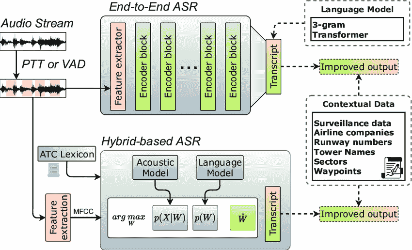
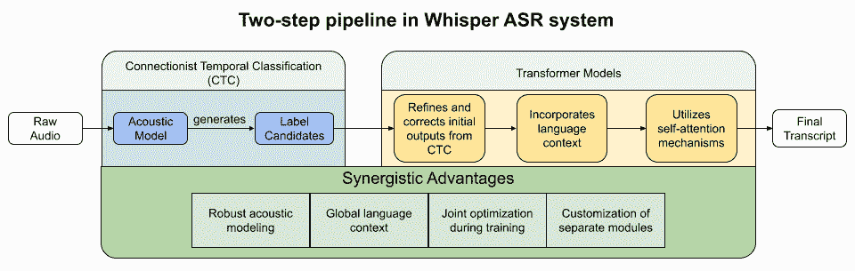

# 第二章：理解 Whisper 的核心机制

欢迎来到我们掌握 Whisper 开创性语音识别能力之旅的*第二章*。在上一章，我们探讨了生产级语音识别的价值主张以及为什么 Whisper 标志着对对话式 AI 的一次重要进展。

现在，是时候揭开技术背后的面纱了。本章提供了 Whisper 技术架构和功能的全面而易懂的概述。把它当作你在 ASR 领域航行的指南，我们将一块一块地解剖 Whisper。

本章的目标有三个：

+   **培养现代 ASR 系统关键组件的识别能力**，包括 Whisper 独特的方法。我们将调查当前语音识别的技术和数据流。

+   **培养直觉**，理解将语音转化为文本以及后续自然语言理解所涉及的系统性交互。我们将描绘出 **声学模型**、**语言模型**和**解码器**等关键组件之间的关联和数据流，揭示它们在语音识别流程中的复杂相互依赖关系。通过追踪音频输入在逐步处理阶段的演变，并展示后续阶段如何依赖于前期步骤，你将自然地理解这些相互连接的系统协同工作的累积效果。

+   **启用优化**，通过揭示 Whisper 的内部机制，帮助优化其性能。理解 Whisper 的优点、局限性和权衡取舍，可以精确调整系统配置，以实现理想的准确性、速度和成本目标。

我们不会深入探讨推动 **递归神经网络**（**RNNs**）和 **变压器**（**transformers**）等创新的复杂数学原理。相反，我们将专注于易于消化的概念框架，让你能够快速应用 Whisper。随着技术的去神秘化，随之而来的是信息化的战略和影响。

本章将涵盖以下主题：

+   深入探讨 ASR 系统

+   探索 Whisper ASR 系统

+   理解 Whisper 的组件和功能

+   应用最佳实践进行性能优化

到本章结束时，你将了解 Whisper ASR 系统的关键要素，分析其组件和功能，并学习优化性能的实用技巧。

# 技术要求

为了利用 OpenAI 的 Whisper 实现高级应用，本章采用 Python 和 Google Colab 来提高使用便捷性和可访问性。Python 环境设置包括 Whisper 库，用于转录任务。

**关键要求**：

+   **Google Colab 笔记本**：这些笔记本已经设置好，以便用最低要求的内存和容量运行我们的 Python 代码。如果可以选择 **T4 GPU** 运行类型，请选择它以获得更好的性能。

+   **Python 环境**：每个笔记本中都包含指令来加载所需的 Python 库，包括 Whisper。

+   **GitHub 库访问**：所有的 Python 代码，包括示例，已上传至本章的 GitHub 库([`github.com/PacktPublishing/Learn-OpenAI-Whisper/tree/main/Chapter02)`](https://github.com/PacktPublishing/Learn-OpenAI-Whisper/tree/main/Chapter02)。这些 Colab 笔记本已准备好运行，提供了一种实用的动手学习方法。

通过满足这些技术要求，你将准备好在不同情境下探索 Whisper，同时享受 Google Colab 的流畅体验和 GitHub 上丰富的资源。

# 深入探讨自动语音识别（ASR）系统

当我们与 Siri 或 Alexa 对话时，幕后究竟发生了什么？计算机是如何将自然语言的模糊声音转化为准确的单词和短语的？这就是 ASR 系统的作用所在。

ASR 在我们日常生活中的作用越来越重要。ASR 支持与技术的许多互动，从智能音响到手机上的语音助手。它支持免提控制、语音搜索，并支持其他语音驱动的功能。对话式 AI 的崛起，包括聊天机器人和虚拟助手，极大依赖于准确且高效的语音识别。

ASR 系统能够识别和处理人类的语音，并将其转换为机器可读的文本。换句话说，它们将口语音频转录为书面文字。这项技术使得语音接口和与计算机系统的口头交流成为可能。

## ASR 系统的定义和目的

从基本层面来看，ASR 系统弥合了人类语言和机器理解之间的鸿沟。它们的作用是分析声学音频信号，识别语言内容，并输出计算机可以处理的文本翻译。

更具体地说，以下是 ASR 解决方案所要实现的关键目标：

+   **将音频转换为文本**：核心目的是将口语转录为等效的书面文本，供软件应用程序处理。然后，这些文本可以进一步进行自然语言处理（NLP）。

+   **理解自然语言**：人类的语言表达有时是不同的。我们可能会吞音、结巴，或者互相打断。ASR 必须处理这些复杂情况，并从模糊的音频中辨析出意义。

+   **启用语音接口**：ASR 支持语音**用户界面**（**UIs**），让我们通过语音与技术互动。这些用户界面包括语音助手、智能音响和对话系统。

+   **改善可访问性**：对于有视力障碍或运动功能障碍的用户，ASR 提供了超越键盘或触摸屏的替代输入方式。语音控制大大拓展了可访问性。

+   **提高效率**：自动化语音转录解放了人类，免去繁琐的音频/视频字幕和文档工作。ASR 节省了大量的时间和精力。

ASR 提供的语音分析推动了 **语音用户界面** (**VUIs**)、量化自我应用程序和其他语音驱动的交互。随着对无处不在的语音界面的需求激增，提高 ASR 的准确性和能力仍然至关重要。

当 ASR 与其他互补技术如 **自然语言理解** (**NLU**)、对话管理和 **语音合成** (**TTS**) 协同工作时，它使我们能够像与其他人类一样与机器进行沟通。这种自然交互范式对于每个家庭中智能助手的愿景至关重要。

## 现实世界中的 ASR

自动语音识别已经通过一种被称为 VUI 的范式，实现了许多常见的免提界面。

语音用户界面

VUI 使人们能够通过对话式语音与设备互动，而不是触摸、打字或点击。它们包括语音识别和 NLU 技术栈，使系统如 Alexa 和 Siri 能够在响应之前接收原始语音查询。有效的 VUI 将 ASR 转录与下游对话系统结合使用，通过语音指令处理自然的命令、问题和指示。这种由语音驱动的免提控制范式使得与技术互动变得更快、更简便、更易于访问。

虽然对于用户来说大多是隐形的，但 ASR 已经通过 VUI 实现了许多常见场景：

+   **智能音响**如 Amazon Echo 和 Google Home 依靠 ASR 理解并响应语音命令，支持免提播放音乐、通过 **物联网** (**IoT**) 控制家庭设备、查询信息等功能。

+   **虚拟助手**如 Siri、Alexa、Cortana 和 Google Assistant 使用 ASR 来转录用户查询。在语音识别后，它们执行命令、回答问题或通过下游的自然语言和对话处理进行推荐。

+   **字幕和文档**工具利用 ASR 快速转录视频、播客、讲座、医疗报告、法律程序等内容。

+   通过 ASR **应用程序接口** (**API**)，**免提控制**智能手机、平板电脑、笔记本电脑、电视和车载娱乐系统，用户可以通过语音指令导航应用程序、输入文本、拨打电话、调整音量等，而不需要触摸屏。

+   **语音分析**解决方案通过 ASR 生成的客户通话转录提取见解，以了解情感、趋势、合规性、代理表现和其他指标。

因此，ASR 在人机交互中发挥着深远的作用。其准确性和鲁棒性直接影响到许多流行智能产品和服务的用户体验。在背后，ASR 通过语音转录能力为语音驱动的革命提供动力，使得口头系统控制和分析成为可能。

看到现代 ASR 系统如虚拟助手和智能音响在现实世界中的深远影响后，人们不禁会问，我们是如何走到今天的？在算法、数据和计算架构方面有哪些开创性的突破催生了今天灵活且精准的语音识别解决方案？接下来的章节将回顾核心方法学在关键时代的快速进展，带领我们走到驱动 Whisper 的神经网络的尖端创新。了解这一发展历程，可以帮助我们更好地理解当前的挑战和剩余的发展空间，因为该领域正在不断推动新的边界。借助历史的视角，我们可以更好地预见未来的方向，在这一技术的寒武纪大爆发中找到立足之地。

# ASR 技术的简史与演变

自动语音识别的概念可以追溯到 20 世纪 30 年代，当时贝尔实验室开发了能够识别通过电话传递的数字的机器。然而，今天我们所知的技术的广泛商业化应用，直到 90 年代和 2000 年代才得以实现。

经过近一个世纪的创新，语音识别技术在机器学习的变革性方法和大数据的可用性推动下，取得了巨大的进展。自动语音识别（ASR）的准确性和多样性持续以惊人的速度发展。

## 早期阶段——模式识别方法

ASR 的第一次重大创新浪潮出现在 1950 年代的贝尔实验室。研究人员集中于使用启发式技术，通过分析音频波形并识别可区分的语音成分来匹配声学模式，从而实现孤立词识别。

贝尔实验室开发了专用的机器，用来解读通过电话传输的数字序列。例如，用户可以口头提供银行账户号码，以便路由他们的请求。这些原始的 Audrey 系统代表了没有现代机器学习技术的早期模式匹配实例。

Audrey 系统

贝尔实验室在 1950 年代开发的 Audrey 系统是开创性的语音识别设备，旨在解读通过电话传输的数字。它们使用模拟电路将声学模式与个别数字进行匹配，从而根据口头提供的账户或联系方式对电话进行路由。虽然功能有限，但这些专用机器代表了通过模板匹配进行 ASR 的早期尝试。Audrey 标志着一个早期的里程碑，尽管为了实现能够处理连续语音的更灵活系统，仍然需要大量的创新。

在接下来的几十年中，研究人员发展出了基于规则的方法，使用信号处理和声学指纹识别技术。然而，这些方法难以完全适应自然语言的动态复杂性以及不同说话者之间的语音模式变异性。同时，这些方法还依赖于大量的专家特征工程，难以在不同语言间进行规模化应用。

早期的进展很有前景，但需要更复杂的技术来处理连续语音、多样的口音、环境以及超出几个单词的词汇。为了实现今天灵活的自动语音识别（ASR），需要采用更先进的技术。

## 统计方法的出现——隐马尔可夫模型与*n*-gram 模型

在 1970 年代和 1980 年代，随着**隐马尔可夫模型**（**HMMs**）和*n*-gram 语言模型的引入，概率建模技术发生了范式转变。

隐马尔可夫模型

HMM 是统计模型，通过对序列进行分析，建模观察者无法看到的潜在状态。在自动语音识别中，它们将生成语音的声音建模为隐藏状态之间的转移，跟踪在给定前一个声学提示的情况下特定音素或单词出现的概率。HMM 不是确定性规则，而是提供了一种计算框架，用于统计地处理语音中的歧义。

*N*－gram 语言模型

*N*-gram 语言模型通过分析前 1–3 个单词的历史序列，计算条件词概率。例如，3-gram 模型估算每个可能的下一个单词在每对独特连续单词后的出现概率。语言模型可以利用这些概率分布来预测并改进临时的 ASR 转录，使其更加符合可能的短语。然而，*n*-gram 无法建模长距离的上下文。

研究人员不再仅仅依赖模式匹配，而是采用*贝叶斯统计*的原理来计算似然得分，并在不确定性下进行预测。这种方法使得能够更优雅地处理语音信号固有的歧义和变异。

使用 HMM，研究人员将语音组件（如音素和单词）建模为马尔可夫过程，从而跟踪从一个声音到另一个声音的转移概率。*N*-gram 语言模型则根据之前的单词序列预测后续单词。结合声学模型，这些关键创新可以处理小词汇量的连续语音识别。

在商业领域，Dragon Systems 于 1990 年推出了基于 HMM 的 Dragon NaturallySpeaking 语音输入软件。这一发布代表了一个重要的里程碑，是首批支持大词汇量连续语音识别的**个人** **计算机**（**PCs**）系统之一。

然而，成功的应用面临着诸如精度有限、缺乏环境鲁棒性、需要大量训练以及语言上下文不足等挑战。在接下来的几十年里，神经网络和计算能力的提高将带来显著的改进。

## 深度学习突破

尽管 HMM/*n*-gram 系统代表了显著进展，但它们在很大程度上依赖手动特征工程，且模型能力有限。相比之下，深度学习方法可以在大规模数据中自动发现复杂的表示和模式。

2000 年代末期，**深度神经网络**（**DNNs**）被引入语音识别，显著提高了准确度。深度前馈和递归网络通过多层人工神经元克服了以前的局限性。

然后，在 2016 年，微软达成了一个行业里程碑，通过大量神经网络训练，使用他们的专有**计算网络工具包**（**CNTK**）框架（现在被称为微软认知工具包），在对话语音识别方面达到了人类水平。研究人员报告的**词错误率**（**WER**）为 5.9%，与被要求转录同一对话的人类相当。微软成功的关键在于使用**长短期记忆**（**LSTM**）声学模型，结合新颖的空间平滑方法和**无格最大互信息**（**LF-MMI**）声学训练。他们还采用了多个 RNN 语言模型和大量数据，包括必应语音搜索日志，来训练他们的 DNN。这种数据驱动的方法使系统能够从语音中的变化和细微差别中学习，从而提高了准确识别和转录口语的能力。微软的突破展示了与人类听众相当的能力，为商业语音助手和对话代理释放了新的潜力，赋予其更强的多功能性和实用性。

词错误率

WER 是一个标准的度量指标，用于衡量语音识别或机器翻译系统的性能。它通过计算文字记录中的错误与总的发言单词数的比例来得出。错误分为三种类型：替换（当一个单词被另一个单词替代时）、插入（当一个未曾说出的单词被添加时）和删除（当一个单词被省略时）。WER 的公式如下：

*词错误率 = (替换 + 插入 + 删除) / 发言的单词数*

例如，如果在 100 个单词的文字记录中有 10 个替换、5 个插入和 5 个删除，则 WER 为 20%。较低的 WER 表示语音识别的准确度更高。需要注意的是，虽然 WER 是广泛使用的度量标准，但它并不是衡量语音识别系统效果的唯一标准。

长短期记忆

LSTM 是一种 RNN，设计用于长期记忆信息。与传统的 RNN 不同，后者由于梯度消失问题难以维持长期依赖关系，LSTM 可以学习这些依赖关系，使其非常适合处理涉及长期时间依赖性的序列数据任务。这些任务包括语言翻译、语音识别和时间序列预测应用。LSTM 网络包含记忆块，这些记忆块是递归连接的，包含一个或多个记忆单元以及三个乘法单元，允许网络调节信息流。

无格最大互信息

LF-MMI 是一种用于语音识别声学模型序列级训练的方法。MMI 目标函数旨在最大化观察到的声学特征与训练数据中对应词序列之间的互信息。*无格*这一特点指的是该方法在训练过程中无需生成格图（传统语音识别系统使用的一种图形），这使得它更高效，且适合基于 GPU 的训练。LF-MMI 已被证明在许多语音识别任务中取得了最先进的成果，并且特别适用于训练用于 ASR 系统的 DNN。

目前的最先进系统采用了不同的神经网络架构：

+   卷积层直接从频谱图中学习平移不变特征。

+   循环层包括 LSTM，建模语音序列和长距离上下文。

+   Transformers 通过自注意力机制捕捉全局依赖，去除了递归约束。

除了卓越的统计学基础，这些神经网络进展催化了虚拟助手的商业成功以及语音界面的广泛应用。

## 持续创新

语音识别仍然是一个高度活跃的研究领域，我们不断探索新的方法来提高灵活性、减少延迟并增强准确性。令人兴奋的创新不断涌现，例如以下内容：

+   **端到端建模**：原先独立的声学和语言模型已被单一集成网络所替代，从而简化了训练并优化了整个流程。

+   **多模态学习**：音频、视觉和文本数据现在可以结合使用，以提高鲁棒性。嘴唇动作和其他视觉线索提供了额外的信号。

+   **个性化**：模型可以根据个人发音和口音进行适配，提供定制化的表现。独特的声纹档案增强了识别能力。

+   **低资源语言**：通过*跨语言迁移学习*，在有限训练数据的语言上取得了语音识别的进展。这意味着高资源语言（例如英语）有助于启动那些训练数据有限的语言。

+   **设备端部署**：得益于模型压缩和加速硬件，实时语音识别（ASR）现已可以在手机和边缘设备上实现。

得益于机器学习的进展，经过几十年的迭代，ASR 技术如今提供了惊人的实用性。通过增强对不同语音和环境的鲁棒性，广泛的语言支持以及可扩展的部署，ASR 有望在未来几年推动更多基于语音的体验。Whisper 位于技术前沿，持续突破边界。

最相关的是，Whisper 在应用最先进的自监督学习方面取得了巨大的飞跃，使用仅限开放数据集实现了人类级别的能力。这种前所未有的准确性和语言覆盖范围为生产级语音识别系统设定了新的标准。

# 探索 Whisper ASR 系统

现在我们已经了解了自动语音识别的全貌和能力，是时候揭开 Whisper 技术内在机制的面纱了。本节提供了一个既简明又全面的概述，介绍了 Whisper 如何通过其算法、数据管道和创新实现前所未有的转录能力。

我们将重点介绍声学建模、自监督预训练策略、模型架构和性能优化等方法，这些方法使 Whisper 与众不同。综合起来，这些技术实现了跨语言、环境和硬件的强大现实语音识别能力。

虽然我们不会深入探讨具体的数学公式，但你将直观地理解 Whisper 的竞争优势，例如以下几点：

+   使用**连接主义时序分类**（**CTC**）声学模型处理模糊的语音到符号映射

+   通过变压器（transformers）整合全球语言上下文

+   精简跨设备的低延迟部署

理解 Whisper 的机制有助于你针对准确性、速度和成本等目标进行实际调优。架构知识能帮助制定明智的策略。

连接主义时序分类

CTC 声学模型在语音识别系统中处理模糊的语音到符号映射。这些模型旨在处理将输入序列（如音频帧）与输出序列（如音素或单词）对齐时的固有不确定性。这在语音识别中尤为具有挑战性，因为口语单词之间的边界不明确，而且同一个单词的发音可能因上下文而不同。

让我们深入探讨！我们将探索 Whisper 如何与 CTC 和变压器融合，以及如何整合语言学知识，了解它是如何将端到端和混合技术结合起来的。这些讨论不是独立的，而是 Whisper 架构中相互关联的各个方面。

## 理解权衡——端到端方法与混合模型

在设计 ASR 系统时，架构师面临一个关键决策：端到端方法还是混合建模策略。这一初步选择会影响到准确性、速度和适应性等方方面面。在实施 Whisper 或任何生产级语音平台之前，开发人员应考虑两种方法之间的深层权衡。

Whisper 是一个端到端还是混合型自动语音识别（ASR）系统？

OpenAI 的 Whisper 是一个使用端到端方法的 ASR 系统。Whisper 的架构采用编码器-解码器变压器（transformer）实现，输入的音频经过两步处理。首先，它生成音频的数学表示，然后将该表示解码为一系列文本标记。这一过程是端到端方法的典型特征，即整个任务——从原始音频输入到文本输出——都由单一集成的模型处理。因此，Whisper 可以被归类为一个端到端的 ASR 系统。

一些混合型 ASR 系统的例子包括：

- *基于 Kaldi 的 ASR 系统*：Kaldi 是一个用于语音识别研究的开源工具包。它支持 DNN-HMM 混合模型和端到端深度学习模型，通常为其混合模型使用 LF-MMI 训练。

- *Vicomtech 语音转录系统*：这些系统曾用于 *Albayzín-RTVE 2020 语音到文本转录挑战*，并且很可能包含了混合 ASR 组件。

- *Wav2Vec 2.0*：这是由 Facebook AI 开发的自监督学习模型，用于语音识别，可应用于端到端和混合 ASR 系统。在混合 ASR 模型中，Wav2Vec 2.0 可以生成高质量的声学表示，作为传统 ASR 系统（如 HMM 或 DNN）的输入。

这些混合系统旨在通过利用神经网络的判别训练能力和深度特征提取，同时利用 HMM 的强大序列建模能力，来有效处理语音信号中的时间变异性。

理论上，端到端建模看起来是理想的。一个统一的模型可以优化声学信号到转录的完整映射，这巧妙地避免了胶水代码和中间表示。然而，正如我们在本节中探讨的，混合架构仍然主导着行业系统，因为存在延迟、定制性和鲁棒性等其他限制。

*图 2.1* 比较了传统的混合基础和更现代的端到端 ASR 系统。两个系统都以空中交通管制员（ATCO）的语音通信作为输入，并生成转录作为输出。

图 2.1 – 传统的混合基础和更现代的端到端 ASR 系统（《虚拟仿真-飞行员代理用于空中交通管制员培训 - ResearchGate 上的科学图表》。可从以下网址获取：https://www.researchgate.net/figure/Traditional-hybrid-based-and-more-recent-end-to-end-automatic-speech-recognition-systems_fig1_370961598)

在传统的混合基础 ASR 系统中，处理过程从输入语音通信的特征提取开始。接着进行声学建模，将声学特征映射到音位单元。下一步是发音建模，将音位单元映射到单词。最后，使用语言建模来预测单词序列的概率，生成最终的转录结果。

另一方面，端到端 ASR 系统直接将输入的语音通信映射到输出的转录，跳过了声学、发音和语言建模的中间步骤。这简化了系统，并可能提高性能。

该图还显示了可以添加的可选模块（以虚线块表示），以提高系统的整体性能。这些包括监视数据或其他数据类型，如部门或航点。这些附加数据源可以提供上下文，帮助 ASR 系统更好地理解和转录空中交通管制员（ATCO）的语音通信。

总结来说，*图 2.1*展示了传统混合基础与端到端 ASR 系统之间的差异，并展示了如何通过额外的数据源来提升其在空中交通管制背景下的性能。

在端到端与混合基础的 ASR 系统之间没有绝对优越的选择。所采取的方案会影响适应性、部署需求和可扩展性。让我们分析在确定正确战略方向时的关键考虑因素。

### 准确性和输出质量

对于许多应用来说，识别精度至关重要。架构决策对输出质量有显著影响：

+   **端到端优势**：联合训练的组件直接针对最终目标：没有次优的流水线或割裂的错误。

+   **混合优势**：混合搭配最佳的声学和语言组件。定制错误的平衡。

在实践中，混合模型通过将最佳的声学模型如*Wav2Vec 2.0*与先进的变换器语言模型结合，实现了最先进的准确性。专门化优于泛化，但端到端模型正在迅速追赶。

输出质量还取决于诸如训练数据量、模型大小和个性化技术等因素。但在规模上，混合系统超越端到端系统，部分原因在于其可定制性。

### 延迟和吞吐量

实时识别需要优化低延迟，而流式自动语音识别（ASR）要求快速增量输出，而不仅仅是批量离线解码。端到端网络通常更为庞大，且计算密集，没有模块化组件。这为实时系统引入了延迟挑战：

+   **端到端困难**：联合模型应用全序列上下文，输出滞后于音频输入。

+   **混合优势**：独立的声学和语言模型使流式低延迟识别成为可能。

尽管如此，卷积神经网络架构和模型蒸馏等创新仍在持续改善端到端的延迟表现。云加速硬件缓解了计算约束。

吞吐量问题较小，因为现代系统可以并行处理大量音频流。总体来说，混合方法目前能实现更快的增量输出。

### 定制与控制

可定制性允许将 ASR 能力量身定制为特定领域，如医学、法律或客户支持中心。这需要接口化的独立语音和语言组件。端到端系统在替换专用模块或注入领域知识时，灵活性较低：

+   **端到端困难**：纠缠的组件限制了模块化和自定义输入。

+   **混合优势**：混合和匹配声学、发音和语言模型。

模块交换的能力使得在混合系统中将模型偏向特定词汇或格式变得更简单。这种更大的控制力和专业化提高了在特定应用场景中的适用性。

### 部署要求

硬件限制（如内存、计算能力和功耗）决定了语音识别系统的可行部署环境。

+   **端到端困难**：大型、资源密集型的模型给边缘设备带来了压力。

+   **混合优势**：将管道分布到不同的系统和专业设备上。

例如，研究人员在低功耗的终端设备上执行声学模型，同时将语言模型卸载到云端，有效地实现了分布式处理。诸如*量化*等压缩技术可以缩小模型，但混合系统提供了更多的部署灵活性。

从多个方面来看，端到端建模代表了一种哲学上更纯粹的方法。但混合系统则做出了实际的折衷，解锁了模块化、可定制的架构。这使得它们能够在多种语音识别应用中提供更高的准确性、更低的延迟和更灵活的部署。

Whisper 为未来铺设了一条激动人心的发展道路，在保留混合声学/语言分割的同时，解锁了端到端建模的诸多优势。随着对话式 AI 研究的快速发展，未来我们或许会看到端到端网络能够与混合方法相媲美，甚至超过它们，这得益于足够的数据和计算能力。但目前，混合架构在生产环境中的语音识别中占据主导地位，因为它们在质量、速度和控制之间达到了平衡。

正如我们刚刚探讨的，Whisper 通过融合端到端和模块化组件找到了最佳的平衡。让我们深入了解 Whisper 整合的具体神经网络架构，包括 CTC 模型和 Transformer，以创建这样一个高性能的混合语音识别管道。

## 在 Whisper 中结合了连接时序分类（CTC）和 Transformer 模型。

在幕后，Whisper 融合了两种强大的神经网络架构，解锁了强大的语音识别能力：

+   CTC 擅长标注未分割的序列数据，如音频流。

+   Transformer 通过自注意力机制编码序列中的全局依赖，捕捉长距离的语言上下文。

这种混合 CTC/Transformer 方案基于几十年对递归网络、计算机视觉和自然语言处理（NLP）领域的研究。由此产生的系统能更好地处理对齐和未对齐的语音，具有更强的上下文理解能力。让我们来探讨一下 Whisper 的技术基础。

### 连接时序分类（CTC）

CTC 算法于 2006 年提出，为转录未分割的序列提供了一种优雅的框架。它可以在不知道对齐边界的情况下，从原始流中识别标签。

语音识别必须处理连续输入，其中单词和声音之间的过渡模糊不清。与文本不同，音频信号并没有预先按语义单元分割。CTC 学会从特征序列中直接检测音素和转录文本。

CTC 将标签任务框定为预测所有可能标签序列的概率分布。初始输出层为每个时间步发出标签候选项。后处理则使用动态规划将这些候选项整合为最终的、最可能的转录文本。

例如，CTC 的初始网络层可能输出类似于“*th**―**e c**―**a**―**t s**―**a**―**t.”* 的杂乱序列。重复的标签和空白会被压缩成最终的预测结果：“*the* *cat sat.”*

CTC 的算法方法本质上是将预测“扭曲”到正确的真实标签序列上。像 *Wav2Vec 2.0* 这样的强大声学模型现在利用 CTC 将语音识别框定为一个通过深度学习解决的序列转导问题。

### Transformer 和自注意力机制

Transformer 于 2017 年首次引入用于机器翻译。通过以全新的方式建模序列，它们实现了突破性的成果。与递归和卷积不同，Transformer 使用多头自注意力机制处理输入。

该机制通过将序列位置与每个其他元素关联，计算序列位置的表示。模型学会了哪些上下文关系对专注的任务（如翻译）最为重要。

例如，Transformer 通过大量加权关键自注意力机制，基于输入生成下一个输出词。这使得它能够全面理解长距离依赖关系，而这些在 RNN 和 **卷积神经** **网络**（**CNNs**）中是无法实现的。

现在，Transformer 支撑着最先进的自然语言处理技术，涵盖了机器翻译、问答、对话系统等领域。像 *GPT-4* 这样的模型展现了它们出色的语言能力。

### CTC、Transformer 和语音的结合

现代的 ASR 系统结合了这些先进的神经网络架构。CTC 处理带有模糊声音对齐的未标记音频流，Transformer 则编码稳健的语言表示并输出文本修正。

具体而言，Whisper 在解码过程中将 Transformer 融合到 CTC 声学模型之后。这个两步管道最大化了听觉和语言学习：

图 2.2 – Whisper ASR 系统中的两步管道

CTC 模型首先从原始音频生成标签候选项。这解决了模糊的声音到符号的转化挑战。下游的 Transformer 则通过更好地结合语言上下文，细化和纠正初始 CTC 输出。由于人类语音通常偏离正式的文本语言，因此需要额外的语言特定条件化来提高转录准确性。

在训练过程中联合优化，该架构将语言结构适配到不完美的声学输出上。Whisper 架起了听觉和语言领域的桥梁，处理现实世界中的语音识别。

总结来说，融合 CTC、变换器和语音技术能够释放协同效应的优势：

+   来自 CTC 专业化的强大声学建模

+   来自变换器自注意力的全球语言上下文

+   所有组件之间的联合优化

+   分模块定制

CTC 和注意力机制共同提供了二者的最佳优势。Whisper 依靠它们互补的超级能力来推动最先进的功能。这一技术组合为 Whisper 在复杂环境中进行语音识别提供了可靠性和准确性。全神经网络的设计也通过端到端的联合优化简化了训练过程。

预计变换器架构将在推动对话 AI 的基础上占主导地位。结合如 Whisper 所示的互补专业技术，它们灵活的建模能力解锁了不断改进的语言感知语音识别系统。

现在我们已经探讨了 Whisper 如何结合 CTC 和变换器模型的优势，以应对转录语音信号的声学挑战，接下来我们准备研究方程的另一半——整合语言学知识，将信号转化为连贯的语言。毕竟，精确的语音识别不仅需要精准的声学信号解码——输出还必须符合自然语言（如英语）的构造和惯例，才能使用。

## 语言学知识在 Whisper 中的作用

强大的语音识别不仅仅需要解码音频信号。系统必须考虑到人类语言的复杂性，以应对现实世界中的变化和模糊性。这正是整合有意义的语言学知识变得至关重要的地方。

最先进的解决方案，如 Whisper，通过将声学预测与**语言特定的调节**相结合，提升了准确性。语言模型提供了基于语言构造的潜在单词或音素序列的统计概率。这使得在多个候选结果中，能够选择最符合声学信号的最可能的文本转录。

语言特定的调节随后将模型调整到目标语言的特征和惯例，包括以下内容：

+   词汇表——有效的单词和词汇结构

+   语法——词语如何组合成短语结构

+   发音建模——合理的语音音素和模式

+   非母语发音挑战——适应第二语言使用者的口音

+   方言——处理全球不同方言

通过量身定制这些语言学属性，Whisper 开发了丰富的理解能力，有助于从核心音素到语义等方面强健地识别语言元素。这一定制使得能够优雅地处理现实世界中复杂的语音特征。

语言特定条件化

语言特定条件化通过解决声学不确定性，使转录更加精确，例如减少同音异义词之间的混淆，如“they’re”，“their”和“there”。ASR 系统从潜在单词和语言特定条件化提供的上下文中建模概率分布。例如，**音系约束**描述了特定语言中音素的可组合性，可以在声学线索丢失或失真的情况下引导 ASR 系统。**语义分析**还可以使语音识别系统偏向于适合特定任务或领域的句子，而远离没有意义的单词序列。

让我们探讨一下赋能 Whisper 的监督和半监督训练的各种语言特定条件化方面。

### 词汇编码

语音识别需要将音频映射到语义符号，如单词或子词单元。Whisper 从涵盖网页、书籍、代码等多种文本数据集对词汇进行编码。

在写作时，Whisper 的最新版本 `large-v3` 于 2022 年 11 月 6 日发布。该模型在 100 万小时的弱标签音频（弱监督预训练）和 400 万小时使用 `large-v2` 收集的伪标签音频上进行了训练。Whisper 的弱监督预训练过程将**可解析的语言结构**刻录到模型中。这些结构本质上是语言中的模式和结构，模型学习识别并再现这些模式。这个学习过程不像完全监督学习那样精确，但它为模型提供了足够的信息，使其能够有效学习。当模型在下游语音识别任务中进一步微调时，这些学习到的语言结构会转移到新任务上。这意味着模型可以将预训练期间发现的模式和结构应用到下游任务中，从而识别和转录语音。实质上，弱监督预训练过程使得 Whisper 能够从一个大型多样化的数据集学习语言词汇的广泛理解，并在微调时将这种词汇理解应用于特定任务。

Whisper 的语言特定条件化和词汇编码是围绕词汇和短语的*形状*在语言模型中刻录细微统计表示的关键。通过编码允许的语言形式和结构，Whisper 能够对连续的语音信号进行分段，并选择性地呈现符合学习到的词汇模式的合理单词候选项。这种语言熟悉性有助于通过将输出限制为与编码词汇一致的合理词汇选择，来解决声学解码中的不确定性。换句话说，通过彻底建模语言词汇规范的形状和轮廓，Whisper 能够将噪声语音信号平滑地映射到与其词汇知识一致的有效文本候选项。

### 语法和结构

除了单个单词外，处理自然语言还需要编码允许的语法模式。诸如词性顺序（例如，名词→动词→副词）和多词短语（例如，“on the other hand”）等结构构成了允许的句法。

Whisper 的预训练暴露包含了跨多个领域的常见英文文本结构，如新闻文章、文学作品、电子邮件、代码等。这种多样性涵盖了简单和复杂的构造。

结果生成的语言模型会引导输出向有效的表达靠拢。例如，语法知识有助于根据上下文正确扩展缩写和首字母缩略词（例如，知道 NASA 指的是美国国家航空航天局）。这不仅仅是基础词汇的熟悉。

结构化的语言表示减少了那些不符合接受的语法和表述规范的错误转录。

### 发音建模

人类在不同地区和情境下发音有所不同。建模多种口音、语音障碍、连读以及其他变异性有助于提高识别能力。

Whisper 展现了对独特发音风格的显著适应能力。其自监督预训练利用了包含多种声音的音频叙述数据。

与不同说话者的接触教会了原始声学信号与其相关单词之间的关联，不管是微小的变化。即便如此，关于习惯发音偏差的模式依然会显现。

通过吸收大量语音数据，Whisper 建立了抗合理偏差的声学语言连接。这赋予了解码灵活性，而不至于过于脆弱。

### 非母语发音挑战

然而，建模流利的非母语发音会带来更多的挑战。第二语言学习者的发音模式可能与母语规范有较大偏差。

例如，普通话中文说话者在讲英语时会始终将*/l/*发音替代为*/r/*。其他音节不匹配会让语言学习者在相对有规律的方式下出错。

处理这些非母语的发音模式需要在训练过程中进行更多的多样化，以捕捉各种口音的长尾。幸运的是，Whisper 的自监督预训练利用了来自国际来源的英语叙述数据。

该模型编码了常见的第二语言发音偏差与正确标准转录之间的关联。这种暴露帮助模型学习关联，即便是发音不准确的单词或错序的*视觉音素*。

结果是一个更具全球相关性的系统，能够宽容地处理非母语、受口音影响的发音。与以前在训练中缺乏足够方言范围的基准相比，Whisper 在识别学习者方面表现出了显著的提升。

### 方言流利度

除了发音外，同一种语言的群体之间往往有更显著的方言差异，无论是英式英语、还是新加坡英语；支持多种方言需要方言调优的建模。

Whisper 接收了涵盖国际出版物、书籍、网络文章等的英语数据。这使得其语言能力不仅限于美式英语，涵盖了更多包容性方言。其词汇、语法和措辞体现了多样的英语方言。

这种广泛的接触让它能够优雅地适应全球用户。性能依然强劲，而不仅仅是过度拟合到某一种英语口音。该模型能够在各个方言之间进行泛化。这种方言灵活性防止了在不同地区和使用领域的准确度碎片化。Whisper 旨在其语言基础上实现方言无关的流畅性。

Whisper 通过将语音识别与多方面的语言知识结合，轻松应对现实世界中的语音复杂性。其前所未有的词汇容量、方言范围和句法掌握能力使其能够高精度和高召回地解码各个领域中极为多样的音频内容。

很快你就会理解从声学特征提取到语言模型解码和优化的整个过程。这个系统性的视角将不同模块的工作方式联系起来，推动 Whisper 的端到端流程。

掌握了架构知识后，我们将根据你具体的精度、延迟和成本等使用场景要求优化配置。但在此之前，让我们先将 Whisper 拆解成其关键子系统。

# 理解 Whisper 的组件和功能

现在我们已经解密了 Whisper 的架构和优化设计，接下来是深入探讨其功能组件的时候了。本节内容将详细解析驱动 Whisper 语音识别流程的模块，从音频输入到文本输出。

我们将探讨将口语转化为机器可读转录的过程。我们的目标是通过系统性直觉，理解 Whisper 各部分如何流畅合作，处理大规模的现实世界语音翻译挑战。

尽管数学复杂性在幕后操作，但你将获得以下内容的清晰理解：

+   原始音频信号的预处理

+   声学模式的编码

+   语言建模

+   搜索输出空间

+   转录文本的优化

理解这些功能模块能为调整配置和组件提供直觉，优化配置以适应你的使用场景要求。架构知识可以促进战略性优化，微调调整可能带来显著提升。

让我们像拆解一只复杂的瑞士手表一样，开始探索 Whisper 的组件。

## 音频输入与预处理

从语音到转录的旅程始于音频输入。Whisper 通过麦克风或其他音频捕捉设备获取原始波形信号。这些模拟音频信号经过前端处理，包括噪声过滤和数字化，提取干净的特征并编码语言内容。

理解 Whisper 的音频处理阶段对于配置合适的数据采集管道至关重要。我们必须为系统提供优质的输入，重点关注语言本质，而非干扰特征。

让我们来探索音频输入硬件的作用、预处理考虑事项以及 Whisper 的特征提取过程，这些构成了关键的基础。

### 音频输入源

高性能语音识别要求从一开始就获取优质的信号。尽管环境中的噪声条件各异，但 Whisper 理想的音频捕捉设备包括以下内容：

+   **麦克风**：专用麦克风硬件具有清晰的定向输入，确保能够捕捉到用户的清晰语音。消费类设备通常配备的麦克风组件不足，无法有效隔离人声。优先选择领夹麦克风或麦克风阵列，专注于捕捉说话者的声音而非环境噪声。

+   **近场源**：尽可能将麦克风放置在目标说话者附近，以减少干扰。这可以防止远场声音的污染。让用户直接对着设备说话。

+   **低噪声条件**：选择安静的室内环境，避免干扰性背景噪音。回音较大的房间也会扭曲音频——如果可能的话，尽量在经过声学处理的环境中录音，以减少噪声。

### 预处理和滤波

在分析之前，原始音频需要预处理，以提高信号质量并提取关键特征。Whisper 会进行以下重要调整：

+   **噪声减少**：环境噪音如电器的嗡嗡声会降低性能。自适应滤波器能够识别并减去可预测的背景噪音频谱。

+   **增益归一化**：录音音量的变化应归一化到标准强度范围——仅靠响度无法传达语言意义。目标是将音量控制在-20 到-10 dBFS 之间，以确保语音峰值清晰且未压缩。

+   **频率均衡**：通过平衡低频、中频和高频段的相对能量分布，锐化语音成分如辅音和元音的声学特征，以便算法更好地识别。

### 音频特征提取

最终的前端步骤通过信号处理技术提取音频数据的有用数值表示，然后再输入到 Whisper 模型中。基本的特征提取方法包括以下内容：

+   **频谱图**：通过视觉方式映射音频频率随时间变化的信号能量差异，揭示语音成分。

+   **对数梅尔滤波器组**：通过压缩和平滑关键频段，模拟人类听觉系统的频率感知。

+   **梅尔频率倒谱系数**（**MFCCs**）：通过 MFCC 变换器，统计性地将频率数据压缩到最具变异性的潜在维度。

结合像像素一样的时间帧序列，这些高级特征以模型可消费的张量形式编码音频，同时进行去噪。由此产生的紧凑预处理捕捉了核心语音本质，以便为声学建模提供信息。确保前端处理正确，确保 Whisper 获得干净的数据。

接下来，我们将看到 Whisper 如何利用这些输出解码语音成分为文本。

## 声学建模

下一阶段是音频预处理后进行声学建模，将音频转换成有用的特征表示。这通过统计学习将低级语音信号转化为更高级的语言单元——这是将声音转化为语言符号的第一步。

声学建模揭示并编码原始语音音频模式与相应文本产物（如单词、音素或字符）之间的关联。模型捕捉以下内容的系统关系：

+   口语化声音

+   单词拼写

+   语言语义

通过数学表示这些关联，像 Whisper 这样的系统将语音波形解码为可能的转录文本，架起了声学与语言学领域之间的桥梁。

### 用于声学建模的语音单元

理想情况下，声学模型应直接将波形信号转换为完整的转录文本。然而，可靠地建模如此复杂的条件概率需要涵盖所有变异的大规模数据集。因此，架构师插入中间步骤，将声学信号与更小的构建单元连接起来：

+   **音素级建模**

    HMM（隐马尔可夫模型）历史上将音频解码成构成音素，作为下游处理的过渡输出。然而，这需要预先对语音信号进行分段，这依赖于先前的声学理解。

+   **字符级建模**

    现代的端到端架构，如 Deep Speech，直接将声学信号翻译成字符。但单纯聚焦于字符可能会失去对更高级结构（如单词和短语）的敏感性。

Whisper 采用了一种折中的方式——将定制的子词建模为目标声学调节标签。这些数据驱动的词汇单元在原子信号与复杂短语之间找到了平衡，使得声音细节与语言结构得以充分展现。

### Whisper 的声学模型架构

使用 CTC 损失函数，Whisper 的声学模型将因果卷积层与递归变换器融合。这种独特的组合处理局部音频模式，同时学习长期依赖关系：

1.  卷积操作检测与字符序列相关的局部声学模式，同时在小的原始音频窗口上进行操作。不同的滤波器学习不同的语音属性。

1.  循环层通过使用变换器对顺序卷积表示进行上下文处理，跨越更长时间段。注意力分布将当前音频与前一段联系起来，以处理从单个声音到完整多词语句的连续信号动态。

1.  CTC 损失函数提供了训练监督，将低级音频模式与目标单元标签（如子词）进行连接。对齐操作被隐式处理。

Whisper 的声学模型架构提供了一个强大的深度神经网络映射，将声学信号直接转换为语言结构，用于下游解释。这构成了语音识别的基本声音到语义的基础。

## 语言建模

声学模型处理第一阶段，将语音音频转化为语言符号。但理解这些符号需要理解词汇、语义、语法等语言规则。进入语言模型——Whisper 的上下文专家。

当声学模型解码音频信号时，语言模型解释符号序列，提供关于允许语句的上下文。它们使用训练期间看到的统计模式和固有规则，对来自上游声学模型的临时转录进行评分和优化。

这意味着根据可能的语言结构消除歧义。例如，语言模型知道，“The clouds are in the ____”更可能填入“sky”而不是随机的无意义词语——模型通过评估合理性来缩小不确定性。

### Whisper 的变换器语言模型

Whisper 采用了一个独立的*基于变换器的语言模型*，它处理声学模型的临时输出。该变换器包含了学习到的表示，描述了英语中单词与多词词组之间的统计关系。它通过堆叠的自注意力层建模复杂的语言上下文，将当前符号与周围符号相关联。

具体来说，Whisper 的语言模型利用**掩码语言建模**（**MLM**）来预测给定上下文中随机隐藏的词。这种方法使得模型能够根据可见的上下文和学习到的模式进行推理。

掩码语言建模

MLM 是一种在自然语言处理中的训练技术，在训练过程中会故意掩盖或隐藏输入数据的部分内容，模型需要基于未掩盖的词语上下文来预测被隐藏的词语。在 Whisper 和其他语音识别系统的上下文中，MLM 可以用来训练模型更好地理解语言结构和语义，尤其是在噪音环境、方言或技术性语言等复杂条件下。归根结底，MLM 使得模型能够学习语言的基本结构，提高其在困难条件下准确转录语音的能力。

通过将声学信号的可能转录与对语言约定的强大理解进行对比，模型重新评分并优化输出，以确保一致性。流利性和语义精度得到了显著提高。

相较于*N*-gram 的优势

历史上，语音系统使用简单的历史*n-gram 计数*来建模语言——即每个词后跟随观察到的序列的概率。例如，3-gram 编码了每个词基于前一个唯一的词对出现的概率。

然而，这些马尔可夫模型无法利用更长范围的上下文和结构复杂性。人类语言比截断的历史统计更为复杂。

相反，变换器语言模型学习整体表示，其中每个符号与周围的符号在上下文中相关联。没有独立假设。变换器能够处理*n-gram 所忽视的复杂性，如层次短语结构。

这使得 Whisper 在将声学转录精炼成有效的、连贯的文本结果时，能更加深入地理解语言行为。强大的现代语言建模处理了超出表面统计的复杂性。

接下来，我们将探讨所有上游组件在解码阶段如何协同工作，生成最终的语音识别输出。

## 解码

在继续解码之前，让我们回顾一下之前的管道阶段。**音频输入与预处理**阶段将原始波形转换为信息丰富的数字表示，提取相关的音频特征。接下来，**声学建模**阶段从音频特征中预测语言标签输出，如字符或子词，生成一组估算标签序列。接下来的阶段是**语言建模**，通过融入上下文知识评估和重新评分声学模型的初始标签序列预测，确保更大的连贯性，从而得到中间转录。

所以，总结一下：

+   **音频预处理**提供输入特征。

+   **声学建模**做出初步的标签序列预测。

+   **语言建模**重新评分这些中间输出。

现在，让我们了解解码阶段如何搜索最优的文本转录，既符合声学指导，又符合语言指导。

在提取语音特征、估算标签序列并评分中间转录后，最终阶段生成最优的文本输出——这一过程叫做解码。这个推理阶段结合了所有上游组件。

解码器采用声学模型标签预测，并根据语言模型的指导找到最合适的词序列。高效的搜索对于在可能的转录空间中导航至关重要。

让我们探索 Whisper 的解码方法。

### 束搜索

OpenAI 采用了**束搜索**——一种快速的启发式算法，它近似最可能的序列，同时修剪掉不太可能的候选序列。这样可以将计算集中在最有前途的解码文本结果上。

束搜索示例

这里有一个简化的示例，展示了束搜索在 Whisper 中的工作原理。

假设我们有一个音频输入，内容是“Hello, world”，并且我们使用宽度为二的束搜索（意味着在每一步我们保留两个最可能的序列）。

在第一步中，模型可能会根据音频输入的声学特征预测最可能的首个单词是“Hello”和“Yellow”。

在下一步中，模型会考虑两个序列的扩展。它可能预测“Hello, world”和“Hello, word”是“Hello”的最可能延续，而“Yellow world”和“Yellow word”是“Yellow”的最可能延续。然后，模型会比较这些序列，并保留两个最可能的整体。假设它保留了“Hello, world”和“Yellow world”。

这一过程会持续，直到满足停止条件。最终，模型可能会输出“Hello, world”作为音频输入的最可能转录结果。

需要注意的是，这是一个简化的例子，实际过程涉及基于模型学习的参数进行复杂的概率计算。此外，束宽度可以调整，以在计算效率和转录精度之间进行权衡。

束搜索逐步构建部分转录，每次添加一个标记，并根据条件模型分数保留每一步的最顶端候选项。单词会按概率顺序添加到活动假设中。

通过丢弃不太可能最大化最终目标的低评分链条，搜索仍然可控，而无需穷尽地分析所有选项。束宽度决定了处理的广度。更宽的束改善了准确性，但代价是效率下降。

Whisper 利用动态束搜索修剪来实现最佳的权衡。束宽度根据中间置信度分数扩展和收缩。在不确定的片段中，会保留更多候选项，随着清晰度的提高再进行缩小。

### 重新评分和重排序

在生成候选转录后，Whisper 通过更重的处理重新评分输出，以进一步提升效果。二次评估更好地融入了最初被忽略的更丰富上下文。为了进一步优化准确性，Whisper 采用了以下额外技术：

+   *N*-最佳列表重排序，它会在通过更强大的语言模型评估后重新排列最顶端的假设，而不是在束搜索中使用的快速近似器。这提高了精度。

+   LSTM 重新评分，它超越了重排序；这种技术涉及将声学输出输入到辅助 LSTM 网络，这些网络充当替代解码器。这捕捉了基线模型未能捕捉到的不同语音细微差别。

结合不同的搜索、评分和解码策略，使 Whisper 的整体流程能够自我纠正——这是深度学习系统设计的一个标志。没有单一的方法能够垄断性能。

接下来，我们将看到最终阶段，重点是对这些解码结果进行后处理，以准备清洁的机器可读文本供下游使用。

## 后处理

在将音频解码为最终文本转录后，Whisper 应用各种后处理方法进一步润色和结构化输出——这是在呈现识别的语音之前的最后一步。

后处理器处理格式、准确度优化、实体链接等。这个关键但常常被忽视的处理阶段完成了语音到语言的转换，将粗略的解码文本转变为可消费的、可操作的信息。让我们一起探索 Whisper 的一些关键后处理能力。

### 文本规范化

首先，原始解码文本被规范化为符合书面语言惯例的格式。文本规范化在将原始解码文本转换为符合适当书面语言惯例的格式时至关重要。以下是文本规范化应用的一些示例：

+   **数字被扩展为单词**：例如，文本中的数字“2023”将被扩展为“两千二十-three”，以便在转换为语音时更易于阅读和理解。

+   **去除流畅性障碍，如填充词**：在语音转录中可能会出现“嗯”或“啊”之类的填充词，这些在文本规范化过程中会被去除，从而创建出更清晰、更流畅的书面表达。

+   **标点和大小写得到标准化**：文本规范化确保标点符号正确放置，单词按照书面语言规则恰当地大写。例如，句首的单词会大写，句末会加上句号或逗号，以反映自然的停顿和句子结束。

通过将反映实际口音的字面转录转换为具有自然阅读流畅度的格式，文本规范化在保持意义的同时，增强了可读性和整体用户体验。

### 准确度优化

接下来，为了进一步增强准确性，检测到的错误会通过辅助模型自动修正，这些模型经过训练以识别和修正常见错误：

+   同音词如“*they’re*”（他们）/“*there*”（那里）/“*their*”（他们的）会得到纠正。

+   类似“*the the*”这样的冗余问题会被修复。

+   常见的替换通过混淆矩阵处理（例如，纠正频繁出现的“*pat*”（拍）/“*bat*”（蝙蝠）混淆）。

与最终的语法检查一起，精准度精炼网络通过学习人类编辑过的转录中的修正模式来不断提高修正精度。

### 实体链接

Whisper 的语音理解能力不仅限于文字输出。它涉及到一个至关重要的步骤——实体链接，将解码后的单词与现实世界中的对应实体连接起来。将单词与数据关联是解锁上下文理解的关键。

当 Whisper 在语音中遇到品牌名称时，它不仅仅转录这些单词；它还将这些单词映射到知识库中的标准 ID。这种链接让 Whisper 理解品牌的背景、产品和市场。同样，当提到某个人时，Whisper 会利用人脸识别技术识别该个体，并将名字与丰富的个人信息档案关联起来。

地理参考是实体链接展现优势的另一个领域。通过将地点名称与地理数据库连接，Whisper 能够理解语音的空间上下文，并将提到的地点与其坐标、人口以及其他相关数据点关联起来。

通过将词语与数据结合，Whisper 能够将语音理解为一连串的单词和一个互联的概念网络。它可以利用这些关联信息更准确地解读语音的意义和上下文。因此，实体链接是 Whisper 弥合原始语音和真正理解之间差距的关键组件。

### 结构化输出

最后，Whisper 使用针对目标用例量身定制的语义架构来构建已识别的内容：

+   **标注问题以生成对话回复**：假设用户向语音助手询问：“今天的天气怎么样？”Whisper 可以将这个输入标注为问题，从而允许语音助手生成类似于“今天的天气晴，最高气温 75 华氏度”的对话式回答。

+   **标记命令以触发动作**：如果用户说“设置早上 7 点的闹钟”，Whisper 可以将其标记为命令。这个标记告诉语音助手设置闹钟，而不是将语音转录。

+   **标记关键词以进行内容分析**：在一次商务会议中，某个参与者可能会说：“我们的 Q1 收入超出预期，但我们需要在 Q2 改善市场营销策略。”Whisper 可以将“Q1 收入”、“超出预期”和“改善 Q2 市场营销策略”标记为关键词。这些关键词随后可用于内容分析，帮助企业追踪会议中的重要话题和趋势。

这种输出框架简化了下游的消费、索引和学习。

正确完成最后一公里的后处理，为 Whisper 的语音识别做好实际应用准备。解码器将音频信号转录，后处理器将这些信号转码为可用的、易访问的语言。

通过最后的后处理阶段，我们已经涵盖了 Whisper 语音识别管道的全貌——从音频输入处理器到声学分类器、语言模型、解码器和输出优化器。

当这些组件结合在一起时，它们将口语自然语言吸收并系统地将信号转换为下游应用程序可处理的精确文本记录。

我们已经围绕模块之间的数据流构建了强大的直觉，使 Whisper 在大规模应用中具有前所未有的准确性和速度。理解这些机制为优化路径的开辟提供了可能。

现在，具备了架构知识，我们准备将重点转向针对基础设施限制和用例目标的 Whisper 实施的定制配置、故障排除和进展。

下一部分将介绍有关权衡和加速 Whisper 以适应成功场景的专门指南，同时保持准确性、可用性和效率标准。

# 应用最佳实践进行性能优化

现在，凭借对 Whisper 架构和数据流的扎实理解，我们准备将重点转向实际部署。本节内容提炼了基础性指南、权衡和操作智慧，加速生产成功。

我们将涵盖超越基本设置的专题——从战略性配置基础设施到监控指标、集成下游 NLP、调整配置和排除常见故障。将其视为有效扩展 Whisper 基础解决方案的手册。

虽然基础设施提供了坚实的基础，但环境的复杂性决定了最终结果。通过根据您的上下文量身定制和简化系统范围的堆栈配置，我们能够解锁更高层次的可靠性、效率和**投资回报**（**ROI**）。具体而言，这包括以下步骤：

+   优化分配云端、边缘或设备端的计算资源

+   在不发生拥塞的情况下平衡数据管道

+   调整精度和延迟以满足用例需求

+   与相邻工作流程平滑互操作

+   快速处理异常情况

让我们为现实条件的需求准备实施方案！

## 理解计算需求

在部署高性能 Whisper 驱动的应用程序时，计算资源的配置至关重要。分配的 CPU、GPU、内存和存储资源直接影响吞吐量、延迟和并发性。

不幸的是，Whisper 的规模使得许多人低估了其生产基础设施的需求。拥有超过 5 亿个参数，该模型需要大量硬件加速，才能在用户间提供实时语音识别。

本节内容提供了优化 Whisper 部署的计算指南。我们将揭示其架构的考虑因素，从设备端点到云加速请求，目标是找到最佳的基础设施匹配。

Whisper 的核心工作负载包括神经网络推理中的矩阵乘法。这些操作对不同的硬件组件产生压力，具体包括：

+   **GPU** 加速深度学习矩阵计算并行处理，能够同时处理数百个操作——其成千上万的核心非常适合机器学习的数值处理。对于 Whisper 来说，GPU 驱动着更快的声学模型推理。

+   **CPU** 也提供并行化能力，但它们更适合于通用分支逻辑的处理，而非专用数学运算。Whisper 依赖 CPU 进行音频解码、束搜索和语言模型计算。

+   **内存**为模型参数和音频输入提供支持。Whisper 需要 GB 级的存储空间和在处理单元之间进行数据传输。高带宽有助于减少传输瓶颈。

+   **存储**用于保存预训练的权重和缓冲预测输出。高吞吐量的*NVMe* SSD 处理着重的读写 Whisper 工作负载。

补充笔记本 `LOAIW_ch02_exploring_audio_data_workflows.ipynb` （[`github.com/PacktPublishing/Learn-OpenAI-Whisper/blob/main/Chapter02/LOAIW_ch02_exploring_audio_data_workflows.ipynb`](https://github.com/PacktPublishing/Learn-OpenAI-Whisper/blob/main/Chapter02/LOAIW_ch02_exploring_audio_data_workflows.ipynb)）提供了有关 Whisper 的计算考虑事项的更多细节，包括本地设备、边缘和云部署的架构权衡。

平衡这些资源可以防止系统瓶颈，从而提高性能。要仔细考虑整个技术栈。

考虑到这些资源需求和硬件能力，我们现在探讨针对不同终端目标的专业化优化指南。

## 优化部署目标

在不同环境中优化 OpenAI 的 Whisper 模型部署需要一种战略性的方法，考虑到每个目标平台的独特需求。以下是关于在不同环境中部署 Whisper 的中级最佳实践说明。

### 设备本地部署（手机和物联网设备）

在移动电话和物联网设备上的部署，重点应放在效率上，因为这些设备的计算资源有限。Whisper 模型的选择应基于大小与精度之间的平衡。使用 `whisper.tflite` 在 Android 移动设备上进行的 40 MB 量化模型推理（[`github.com/openai/whisper/discussions/506`](https://github.com/openai/whisper/discussions/506)）是一个适合此类设备的轻量级模型示例。利用平台特定的神经加速器，如 Apple 的神经引擎或 Google 的边缘张量处理单元（TPU），对提升性能至关重要。内存管理同样至关重要，因为这些设备的 RAM 限制，因此开发人员必须确保 Whisper 模型不会耗尽可用内存。

### 边缘服务器部署

边缘服务器是私有节点，能够在提供类似云基础设施的可扩展性的同时提供模型容器化。对于边缘部署，建议使用多核 CPU 和深度内存缓冲区来处理计算负载。负载均衡的 GPU 可以加速推理任务，低延迟的存储解决方案如 NVMe SSD 集群可以提升系统的整体响应速度。*Whispering*（*Whispering: Joint Service Offloading and Computation Reuse in Cloud-Edge Networks* - [`www.ncbi.nlm.nih.gov/pmc/articles/PMC8528222/`](https://www.ncbi.nlm.nih.gov/pmc/articles/PMC8528222/)）涉及在边缘进行计算重用，通过避免冗余计算显著减少任务完成时间。

### 云基础设施部署

在云环境中，虚拟机提供了按需扩展资源的灵活性。对于 Whisper，选择为机器学习优化的机器镜像（例如 AWS 的 *inf1* 实例，配备 *Inferentia* 芯片）是有益的，因为它们能提供具有成本效益的高性能推理。自动扩展组对于管理需求波动至关重要，确保在需求高峰时扩展资源，在需求下降时缩减资源，从而控制成本。

### 一般考虑事项

无论部署环境如何，分析流量、性能基准和预算对于有效规划至关重要。过度配置会导致不必要的开支，而配置不足则可能影响服务质量。成本和性能之间的平衡至关重要。应配备监控工具和性能指标，以确保部署满足所需的服务水平，并便于做出扩展决策。

总结来说，在不同环境中部署 Whisper 的最佳实践包括选择合适的模型大小、利用专用硬件加速器、有效管理内存，并合理使用云资源。同时，还需要考虑延迟、成本和性能指标之间的权衡，以确保优化部署，满足各环境的特定需求。

在建立好基础设施后，我们将探讨有效地路由通过 Whisper 推理管道流动的数据流量的专业实践。

## 管理数据流

在 AI 系统中，尤其是在 OpenAI 的 Whisper 中，管理数据流涉及一些最佳实践，这些实践确保了系统的高效运行。它们对于处理复杂的队列、缓存、缓冲区、微批次、并行流和竞争资源调度至关重要，这些构成了 AI 数据流动的神经系统。

让我们探索优化这些 AI 数据流的各种技术，包括战略协调、路由和扩展。

### 理解基本数据类型和数据流动

Whisper 的核心数据转换涉及几种关键数据类型：

+   **音频流**：这些音频流从录音设备中分段，并附带元数据用于在异步阶段之间追踪。

+   **特征**：这些特征将音频频率和时间特性编码为数字矩阵。

+   **标签**：在声学模型推理过程中，这些标签会附加临时的语音和词汇表示。

+   **转录文本**：这些构成最终的文本输出，包含解码后的语音内容。

理解这些数据类型可以帮助我们进行战略优化，例如为每种类型的数据进行优先路由和定制存储。

### 协调共享数据存储

共享数据访问的并行处理需要精心协调。Whisper 使用了多个工具来实现这一点：

+   **消息队列**：这些队列缓冲并异步处理跨系统的音频片段和转录文本。

+   **NoSQL 存储**：这些提供对大型特征集和音频批处理元数据的低延迟查找。

+   **内存数据网格**：这些缓存高开销的模型输出，如标签序列，以便快速重用。

### 战略性地路由数据

最小化数据传输和复制对于高效运行至关重要。Whisper 通过几种策略优化数据流：

+   **局部处理**：这涉及在模块内处理操作，如语言模型重新评分，目的是限制过度的移动或计算。

+   **压缩**：这通过编码减少了传输的字节数。

+   **优先级**：这允许在批量特征集之外优先处理音频片段。

+   **缓存**：这有助于在可能的情况下重用存储的工件，例如滤波器组。

接下来，参考补充笔记本。你将在那里找到使用 Python 库（如`librosa`）加载、可视化和处理音频数据的代码示例。该笔记本涵盖了与 Whisper 管道中数据摄取相关的音频数据工作流程（[`github.com/PacktPublishing/Learn-OpenAI-Whisper/blob/main/Chapter02/LOAIW_ch02_exploring_audio_data_workflows.ipynb`](https://github.com/PacktPublishing/Learn-OpenAI-Whisper/blob/main/Chapter02/LOAIW_ch02_exploring_audio_data_workflows.ipynb)）。

### 横向扩展

在需求激增时，战略性的数据流平衡至关重要，比如智能家居利用 Whisper 实现跨房间的多用户语音控制。这可能涉及缓存由声学模型提取的音频特征以避免冗余计算、压缩数据以减少网络带宽压力、优先处理来自活跃发言者的音频片段，并动态提供额外的下游容器来分担负载，防止瓶颈。

总结来说，管理像 Whisper 这样的 AI 系统中的数据流，涉及理解基本的数据类型和流向，协调共享的数据存储，战略性地路由数据，并在必要时进行横向扩展。这些实践有助于解决可扩展性、稳定性和效率问题，确保 AI 系统能够在用户行为波动的情况下，提供高质量、实时的交互速度，从而为消费者提供可接受的体验。

接下来，我们将探索监控关键通道和基础设施，以确保平稳操作。

## 监控指标与优化

监控指标与优化对于管理和改进 OpenAI Whisper 的性能至关重要。该过程涉及跟踪各个领域的**关键性能指标**（**KPI**），包括模型性能、硬件利用率和数据流健康。

### 模型性能指标

模型性能指标确保 Whisper 系统准确转录语音。以下是这些指标：

+   **WER**：这是自动语音识别（ASR）系统的主要基准。它通过将系统输出与标准转录进行比较，量化单词错误的数量。较低的 WER 表示更好的性能。

+   **字符错误率**（**CER**）：这一指标比 WER 更为细致，尤其在需要高精度的环境下（如临床或技术场景）非常有用。

+   **延迟**：这是指语音输入到最终输出之间的时间延迟。在各个处理阶段，如声学建模和整个管道中，监控延迟是至关重要的。

+   **吞吐量**：该指标衡量每单位时间处理的转录数量。它提供了关于请求量和并发会话的扩展需求的见解。

### 监控基础设施健康

监控底层硬件的健康状况对保持 Whisper 系统的性能至关重要。该领域的关键指标包括：

+   **GPU/CPU 利用率**：监控 GPU 和 CPU 的利用率可以帮助识别过载的加速器，并平衡负载，避免资源闲置。

+   **RAM 利用率**：监控 RAM 利用率有助于防止超出限制，避免内存交换到磁盘导致处理速度变慢。

+   **带宽/吞吐量**：监控网络容量可以帮助识别数据传输是否变慢，提示是否需要进行网络升级。

+   **存储延迟**：存储延迟的峰值可能表明硬盘出现问题，无法快速将数据传输给模型。

### 数据管道分析

优化组件之间的数据流动是 Whisper 优化的另一个关键方面。该领域的关键指标包括：

+   **队列深度**：队列积压增加可能表明下游组件跟不上进度，提示需要解决瓶颈问题。

+   **缓存命中率**：低于预期的缓存命中率可能表明缓存效果不佳，从而导致数据重用变慢。

+   **数据新鲜度**：该指标量化了音频片段在多阶段管道中传输的延迟。

+   **错误**：跟踪管道故障和日常恢复事件可以提供系统脆弱性的见解。

我们可以通过仔细监控这些指标来实现模型的工业化，并释放潜在的先进能力。例如，依赖 Whisper 进行客户咨询转录的客户支持聊天机器人，可以通过主动监控如高 GPU 利用率、WER 增加、数据新鲜度变慢以及低缓存命中率等信号，在流量高峰期间保持客户满意度。

总结，监控和优化是确保 Whisper 系统性能和可靠性的关键。通过跟踪模型性能、硬件利用率和数据流健康的关键指标，可以识别瓶颈，进行必要的调整，并提高系统的性能和效率。如果没有对基础设施和模型指标进行监控并提供可操作的洞察，依靠数据资产如 Whisper 来维持客户服务质量将变得不可能。衡量是进步的关键。

# 摘要

在这一章中，我们揭开了 Whisper 卓越语音识别能力的面纱。现在，你已经了解了从音频输入到语言解码的内部过程，你可以战略性地为特定用例需求微调实现方案。

我们在探索 Whisper 的混合设计之前，先调查了技术领域，融合了端到端优化与模块化定制化。你已经掌握了 CTC 声学模型处理模糊声音对齐以及变换器集成，这为语言表示提供了强大的支持。

这些构件通过指标监控、参数调优、瓶颈解除等方式，解锁了性能提升、可用性和成本效益。在未来，精度提升可以通过再训练过程实现，将洞察融入模型权重，从而将学习和精炼制度化。

具备架构理解后，你可以自信地雕刻部署方案，满足延迟约束、精度门限、基础设施现实和预算限制。理解数据流和权衡带来一个信息丰富的战略，从而优化商业成果。

在实现了功能性素养后，我们现在准备提升技术精通度。

在下一章中，我们将深入探讨 Whisper 的神经架构、多任务策略和弱监督训练方法，这些都推动了它在不同语言和环境中的卓越表现。

我们将剖析变换器在处理顺序数据中的机制，同时解释学习语言关系的编码器-解码器注意力模式。我们还将掌握处理语言变异的技巧——无论是词汇、发音、方言还是任务。最后，我们将揭示如何通过巧妙的预训练目标，让有限的标注数据驱动大型模型。

这些先进的洞察扩展了 Whisper 在创新下游应用中的互操作可能性——从多语言客户支持机器人到融合的视频/语音分析。理解促使创造性整合。

现在，让我们通过更深入地研究内部建模技术来提升我们的技术水平！

# 第二部分：底层架构

在这一部分，你将探索 OpenAI Whisper 的技术支柱，研究它的架构以及推动其前沿语音识别能力的变换器模型。你将全面理解 Whisper 的内部运作，包括它的编码器-解码器机制、多任务和多语言能力，以及使用弱监督对大规模数据进行训练的技巧。此外，你将学习如何为特定领域和语言需求微调 Whisper，使其能够有效地定制并集成到各种应用中。

本部分包括以下章节：

+   *第三章*，*深入探索 Whisper 架构*

+   *第四章**，针对领域和语言特定性的微调 Whisper*
