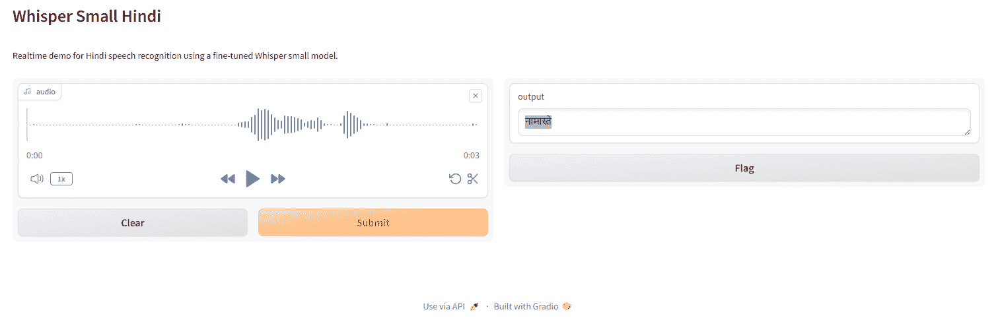

# 第四章：针对领域和语言特定性微调 Whisper

OpenAI 的 Whisper 是语音识别（ASR）领域的一项突破性创新，能够以前所未有的准确性将语音转录为文本。然而，像任何机器学习模型一样，Whisper 在特定小众语境下的初始表现仍然存在局限。例如，在 COVID-19 大流行初期，Whisper 数月未能识别这一术语。类似地，该模型还未能准确转录与俄乌冲突相关的关键人物和地点的名称，这需要事先的训练数据。

因此，为了充分挖掘该模型的潜力，我们必须针对特定情况进行定制化。本章将揭示将 Whisper 的能力适应特定业务问题的技巧。我们的冒险将跨越多个里程碑，从系统设置到评估改进。

首先，我们将建立并配置 Python 资源，为即将进行的工作提供支持，整合数据集/建模/实验库，形成一个坚实的基础。接下来，我们将聪明地选择多语言语音数据源，例如**Common Voice**，进一步丰富 Whisper 在特定领域的知识。更加专注的数据可以提升训练质量。

现在，通过工具和增强数据的准备工作，我们可以调整 Whisper 的预测，使其更适合目标应用。例如，我们将探索如何调整置信度、输出类别和时间限制，以便在特定用例中实现预期的结果。我们还将解锁一些工具，使用标准设备对 Whisper 进行深度微调。

跟踪进展依赖于简单明了的测试。我们将设定固定的基准，以客观评估我们微调的进展。设立高标准的评估完整性有助于建立对结果的信任。最终，我们将在改进 Whisper 和通过构建并测试轻量级演示来双重检查声音适配如何转化为现实世界应用之间循环。

我们将致力于通过微调低资源语言来让每个人都能参与进来，而不是无意中忽视那些资源较少的群体。

本章将涵盖以下主题：

+   准备环境和数据进行微调

+   准备特征提取器、分词器和数据

+   训练和评估指标

+   跨数据集评估性能

通过本章中介绍的先进微调方法以及配套的 GitHub 仓库，我们将学习微调 Whisper 在行业特定词汇、地区口音以及实时学习新兴术语方面的基础过程。让我们开始这段实践冒险吧！

# 技术要求

在本章中，我们将利用 Google Colaboratory。我们将尽量确保能获得最好的 GPU，至少需要 12 GB 的 GPU 内存。

要获取 GPU，在 Google Colab 的主菜单中，点击 **Runtime** | **Change runtime type**，然后将 **Hardware accelerator** 从 **None** 更改为 **GPU**。

请记住，微调 Whisper 需要数小时。因此，您必须定期监控 Colab 中运行的笔记本。

本章将教您如何微调 Whisper 模型，使其能够使用如 Hugging Face 数据集、Transformers 和 Hugging Face Hub 等工具识别多种语言的语音。请查看本书 GitHub 仓库中的 Google Colab Python 笔记本（[`github.com/PacktPublishing/Learn-OpenAI-Whisper/tree/main/Chapter04`](https://github.com/PacktPublishing/Learn-OpenAI-Whisper/tree/main/Chapter04)），并尝试自己进行微调。

一般推荐按照 Colab 笔记本的步骤进行操作，并在训练过程中将模型检查点直接上传至 Hugging Face Hub。Hub 提供以下功能：

+   **集成版本控制**：您可以确保在训练过程中不会丢失任何模型检查点。

+   **TensorBoard 日志**：跟踪训练过程中的重要指标。

+   **模型卡片**：记录模型的功能和预期的使用案例。

+   **社区**：与社区共享和协作的简便方式！

将笔记本链接到 Hub 非常简单——在提示时输入您的 Hub 认证令牌即可。Colab 笔记本提供了具体的操作说明。

# 引入 Whisper 微调过程。

实现 Whisper 的最大潜力需要超越开箱即用的功能，通过有目的的微调，配置和增强模型以捕捉精确的细分需求。这一专门优化过程跨越了九个关键里程碑：

1.  准备强大的 Python 环境，包含必要的库，如 Transformers 和数据集，以支持严谨的实验。

1.  纳入多样化的多语种数据集，包括 Common Voice，以扩大语言广度。

1.  设置 Whisper 管道组件，如分词器，以便更轻松地进行预处理和后处理。

1.  将原始语音数据转换为模型可处理的对数 Mel 频谱图特征。

1.  定义与目标模型大小相匹配的训练参数和硬件配置。

1.  建立标准化的测试集和指标，以便进行可靠的性能基准测试。

1.  执行训练循环，将配置的超参数、数据和硬件结合起来。

1.  根据测试语料和基准排行榜评估微调后的模型。

1.  构建展示定制化语音识别效果的应用程序。

我们在穿越这些里程碑的过程中，最终目标始终如一：通过专门的优化，将模型能力与独特的生产需求相匹配。

在概述了微调过程之后，接下来的部分将介绍如何利用 Whisper 检查点。需要明确的是，Whisper 检查点是预训练模型，专门针对不同的计算和语言要求进行调整。在我们的演示中，我们选择了**小型**检查点，因为它在大小和性能之间提供了平衡——即使在计算能力有限的情况下，它也能为我们提供一个高效的微调选项，确保我们能在不广泛使用的语言的语音识别中取得显著成果。

# 利用 Whisper 检查点

Whisper 检查点有五种不同配置，分别对应不同的模型大小（微型、基础、小型、中型和大型）。前四种最小配置的检查点是用仅包含英语或多语言数据训练的。最大配置的检查点仅用于多语言。所有 11 个预训练的检查点都可以在 Hugging Face Hub 上找到（[`huggingface.co/models?search=openai/whisper`](https://huggingface.co/models?search=openai/whisper)）。以下表格总结了这些检查点，并提供了 Hub 上模型的链接：

| **大小** | **层数** | **宽度** | **头数** | **参数** | **仅英语** | **多语言** |
| --- | --- | --- | --- | --- | --- | --- |
| 微型 | 4 | 384 | 6 | 39M | ✓ | ✓ |
| 基础 | 6 | 512 | 8 | 74M | ✓ | ✓ |
| 小型 | 12 | 768 | 12 | 244M | ✓ | ✓ |
| 中型 | 24 | 1,024 | 16 | 769M | ✓ | ✓ |
| 大型-v1 | 32 | 1,280 | 20 | 1550M | x | ✓ |
| 大型-v2 | 32 | 1,280 | 20 | 1550M | x | ✓ |
| 大型-v3 | 32 | 1,280 | 20 | 1550M | x | ✓ |

表 4.1 – Whisper 检查点

我们将微调具有 244M 参数（约 1 GB）的多语言版本小型检查点，用于演示目的。我们将使用一种不广泛使用的语言，这种语言来自 Common Voice 数据集，用于训练和测试我们的系统。我们将演示即使只有约 8 小时的专业训练数据，我们仍能在这种语言中取得良好结果。

现在我们已经介绍了如何战略性地使用 Whisper 的检查点，接下来我们将准备微调的环境和数据。这个至关重要的步骤要求我们仔细设置工作环境并整理数据，确保为即将到来的微调过程打下坚实基础。这个过渡过程遵循从理解到行动的原则，为在 Whisper 中进行实际应用和创新做好准备。

# 里程碑 1 – 准备微调的环境和数据

训练一个前沿的语音识别模型，比如 Whisper，要求极高的计算能力——专门的硬件配置对可行的微调至关重要。本节内容需要具备一定的编程基础——我们将深入使用底层 API。即使调整参数并非你的强项，也不必担心！我们将以结构化的方式进行解释，逐步解开概念的谜团，而不是直接进入技术细节。你不必立即动手编写代码——而是通过这里揭示的见解，帮助你将这些过程应用到自己独特的 Whisper 微调需求中。

如果你真的渴望动手操作，本书的 GitHub 仓库 [`github.com/PacktPublishing/Learn-OpenAI-Whisper/tree/main/Chapter04`](https://github.com/PacktPublishing/Learn-OpenAI-Whisper/tree/main/Chapter04) 中包含了一个补充的笔记本，其中的代码块与章节内容相对应。打开笔记本，随着章节的进行，直接进行参数调整概念的实验。

## 利用 GPU 加速

尽管 Whisper 可以在 CPU 上训练，但即便是小的检查点，收敛时间也大约需要 100 小时，因此 **GPU 加速** 对于可行的迭代周期至关重要。

GPU 提供大规模并行计算，通过成千上万的处理核心在专用张量上提供 100 倍速度的训练。像 Whisper 这样拥有十亿级参数的模型，特别受益于额外的吞吐量。

在我们继续进行 Whisper 微调的过程中，我将使用本书 GitHub 仓库中的 Python 笔记本摘录。这些代码是为了说明和解释而提供的。如果你想查看完整的代码序列，请参考本章的 Python 笔记本。以下代码摘录展示了如何跟踪并确认 GPU 的可用性：

```py
import torch
print(torch.cuda.is_available())
```

大多数云计算实例类型都配备了 GPU——选择适当大小的资源至关重要。

## 安装适当的 Python 库

我们将使用几个知名的 Python 包来调整 Whisper 模型：

```py
!pip install --upgrade pip
!pip install --upgrade datasets transformers accelerate soundfile librosa evaluate jiwer tensorboard gradio
```

让我们仔细看看：

+   `datasets` 和 `transformers` 提供对语音数据和最先进模型的结构化访问

+   `accelerate` 和 `tensorboard` 利用可用的 **GPU/TPU** 硬件优化模型训练并跟踪实验结果

+   `librosa` 和 `soundfile` 用于预处理音频文件，这是将数据输入 Whisper 前的关键步骤

+   `jiwer` 和 `evaluate` 支持量化语音识别的有效性

+   `gradio` 将帮助我们创建一个引人注目的演示，展示我们精炼后的模型

我们还将这个环境链接到 Hugging Face Hub，以便我们可以轻松地与社区共享微调后的模型：

```py
from huggingface_hub import notebook_login
notebook_login()
```

Hugging Face 提供版本控制、模型文档和公共访问，从而确保完全可复现，同时允许我们在彼此的工作基础上进行构建。

Hugging Face 和 Whisper

Hugging Face 是一家数据科学公司，提供一个分享和协作机器学习模型的平台，特别是在自然语言处理（NLP）领域。它因其 Transformers 库而广受认可，该库提供了一系列预训练模型和工具，适用于各种 NLP 任务，包括文本分类、翻译、总结，以及与我们的讨论相关的自动语音识别（ASR）。

Hugging Face 提供了一个简化的 Whisper 微调流程。它允许你加载和准备训练数据，执行数据准备和微调步骤，并评估模型的表现。它还提供了集成的版本控制、TensorBoard 日志、模型卡以及一个用于分享和协作的社区。

尽管 Whisper 已经掌握了很多语言的知识，但仍然有成长的空间——尤其是在处理特定情况时，例如行业术语。我们将介绍一些方法，将补充的语音数据引入，以填补这些空白。

Mozilla 主导的 Common Voice 项目在这里非常适用，它提供了 100 多种语言的数据，直接来自全球志愿者。我们将探讨如何轻松利用这些众包数据集，平衡 Whisper 的准确性和在特定国际应用中的包容性。

除了 Common Voice，我们还可以从全球多个数据集中创建自定义混合数据，以测试 Whisper 的边界。巧妙的混合强调灵活性，这对商业成功至关重要。但我们不能只追求庞大的数据集——多样性带来韧性。我们将为自己配备建设性代表的最佳实践和适应各种语言部署需求的多样化组合。

让我们开始将一些 Common Voice 数据导入 Whisper。

# 里程碑 2 – 融入 Common Voice 11 数据集

由 Mozilla 主导的 Common Voice 数据集代表了一项通过开放和多样化的语音语料库使语音技术大众化的开创性努力。**数据集**是一个结构化的数据集合，其中的行通常代表单个观测或实例，而列代表这些实例的特征或变量。对于 Common Voice 来说，每一行代表一个音频记录，每一列代表适用于该音频记录的特征或属性。作为一个跨越 100 多种语言、不断扩展的社区驱动项目，Common Voice 理想地增强了像 Whisper 这样的多语种语音识别系统。

使用 Hugging Face 的`Datasets`库集成 Common Voice 数据非常简单。我们以流式模式加载所需的语言分割，避免了大量存储需求，并加速了微调工作流程：

```py
from datasets import load_dataset, DatasetDict
common_voice = DatasetDict()
common_voice["train"] = load_dataset("mozilla-foundation/common_voice_11_0", "hi", split="train+validation", use_auth_token=True)
common_voice["test"] = load_dataset("mozilla-foundation/common_voice_11_0", "hi", split="test", use_auth_token=True)
print(common_voice)
```

当我们最初加载 Common Voice 数据集时，它包含了许多额外的信息，比如说话者的口音、性别、年龄等。它还包括了磁盘音频文件的路径、ID 和数据质量保证的投票信息。

但我们并不关心 Whisper 在语音识别中使用的那些额外元数据细节。Whisper 需要预测的唯一数据就是音频本身和匹配的文本转录。其他所有的内容对于我们的目的来说都是不必要的。

所以，这行代码通过去除那些与我们的语音识别任务无关的额外列或特征，创建了一个精简版的 Common Voice 数据集。我们将其精简为只有 Whisper 所需的核心*音频*和*句子*文本。这简化了数据管道：

```py
common_voice = common_voice.remove_columns(["accent", "age", "client_id", "down_votes", "gender", "locale", "path", "segment", "up_votes"])
```

通过剥离无关的元数据，我们确保只有有意义的特征被输入到 Whisper 中。这帮助模型专注于学习语音到文本的映射，而不是来自说话人细节的无关模式。最终结果是一个更加精简的数据集，更加紧密地与我们的最终目标对齐。

Common Voice 包含了显著的领域多样性、录音条件和说话人群体统计数据。这些数据集展示了相当大的音频质量和口音变化性，因为它们是来自全球贡献者的众包集合。现实世界录音中的不完美使得 Common Voice 成为评估模型鲁棒性的一个具有挑战性的基准。

尽管广泛的多样性带来了挑战，但也使得语音识别系统更具韧性。仅仅在像 LibriSpeech 这样的纯净语料库上训练的系统，在应用于嘈杂环境时往往会出现问题。因此，集成噪音的异质数据对于生产级性能至关重要。

通过涵盖数据多样性，Common Voice 补充了 Whisper 的基础。该模型的广泛多语言预训练提供了全面的语言覆盖；将这一知识适应到 Common Voice 的变异性和低资源语言，是为定制企业应用量身定制的最佳方向。

例如，处理客户咨询的呼叫中心需要能够应对口音、录音伪影和领域词汇的 ASR。当前，联系中心分析在处理专业术语时存在困难。联系中心的客服人员讨论的是一些专业的概念，从 CDMA/GSM 这样的通信缩写到 iPhone 14 Pro Max 这样的专有名词。提升 Whisper 的语境掌握能力需要领域特定的数据。联系中心有其特定的词汇——模型必须理解这些特定的词汇。通过拥有领域内的数据，模型将学习该行业的细节。因此，在 Common Voice 呼叫中心录音上进行微调将提高其在联系中心的效能。

除了领域优化，多语言支持仍然是全球业务的必要条件。尽管 Whisper 展示了令人印象深刻的零样本跨语言能力，但将声学和语言知识适应到不足代表的语言对于公平的人工智能至关重要。

## 扩展语言覆盖范围

尽管 Whisper 的多语言设计提供了全面的语言覆盖，但在低资源语言中提升表现仍然是包容性语音技术的伦理命题。战略性地微调目标语言数据对于全球公平部署至关重要。

Common Voice 项目分享了多语言表征的这些动机。该计划提供了 100 多种语言的数据集，包括许多资源匮乏的语言。这为增强 Whisper 在需要更多训练数据的语言中的知识提供了独特的机会。

例如，立陶宛语子集包含大约 50 小时的标注语音。从零开始构建一个自动化的立陶宛语转录器对于灵活的波罗的海初创公司来说是不可行的。然而，通过利用 Whisper 的迁移学习能力，可以通过微调快速构建一个高效的立陶宛语优化系统。

对于那些通常被 AI 服务不足的低收入地区的企业而言，这些影响是深远的。与其构建昂贵的定制化模型，不如通过适应 Whisper 来消除进入语音技术的经济障碍。

将这些数据集建设性地整合起来，提供了一种通过语言技术传播社会福祉的途径。战略性地整合必须平衡准确性、速度和包容性。虽然通过增加所有 100 多种 Common Voice 语言可以最大化覆盖范围，但对大多数应用来说，趋同将是不可行的。我们必须有所选择。对于全球企业，仔细选择大约 10 种不同语言进行增强，确保可持续的商业可行性，同时不排除服务不足的群体。

这种战略平衡贯穿于所有形式的算法偏见缓解中。应避免出现带有偏见的解决方案，比如故意削弱特定语言的表现。相反，我们可以通过有针对性的数据增强，主动改善排除群体的技术。Common Voice 提供了可持续实现这一目标的数据资源。

## 提升翻译能力

语音翻译涉及重大的复杂性——系统不仅需要将音频信号映射为文本，还需要将文本映射为另一种语言的文本。这个任务需要多方面的模型能力，从源语言理解到目标语言流利度。

Whisper 的架构提供了强大的基础，整合了编码器-解码器结构，并在音频语义与语言生成之间实现了深度注意力融合。然而，没有任何一个组织能够独立跟上多样化的声学环境和低资源语言的持续演变。

Mozilla 的 Common Voice 项目成员正在建设可访问的多语言语料库。该项目即将发布的第 12 版将包含 50 种语言的语音翻译数据对，进一步推动普及化工作。整合这些数据集可以优化 Whisper 在生产翻译应用中的表现。

例如，呼叫中心再次呈现了一个既有吸引力又具挑战性的应用领域。客服人员必须处理来自不同语言的全球客户咨询——仅在单一高资源语言上训练模型存在风险，会排除那些资源较少的语言和口音。

因此，语言的构建性平衡对于伦理性的部署至关重要。实现平等需要战略性地融入多样的语言数据。像 Common Voice 这样的来源，通过全球众包录音，提供了现实世界语言多样性的缩影。基于这些数据集训练的模型学会解析多样的口音和语调节奏。

自动语音翻译的进展最近通过自监督技术加速。像 XLSR-Wav2vec2 这样的模型，在跨 50 种语言的 56k 小时 Common Voice 数据上进行了预训练，并在直接语音到语音的翻译中取得了突破。

通过我们增强 Whisper 翻译能力的新策略，我们将开始设置 Whisper 流水线组件。这个聚焦的转变为深入审视 Whisper ASR 工作流中至关重要的工具和过程奠定了基础。通过深入探讨 Whisper 流水线组件的设置，我们正在为微调方法做准备，确保项目成功，并以扎实、实际的基础进行。

# 里程碑 3 – 设置 Whisper 流水线组件

ASR 过程可以分为三个主要部分：

+   **特征提取器**：这是处理原始音频输入的初步步骤。可以把它看作是为音频文件做准备，以便模型可以轻松理解和使用它们。特征提取器将音频转换为一种格式，突出显示音频的关键特征，例如音调或音量，这对于模型识别不同的单词和声音至关重要。

+   **模型**：这是自动语音识别（ASR）过程的核心部分。它执行我们所说的序列到序列的映射。简单来说，它接收来自特征提取器的处理过的音频，并将其转换为一系列文本。就像是将声音的语言翻译成文本的语言。这一部分涉及复杂的计算和模式，以准确确定音频内容。

+   **分词器**：在模型完成将声音映射为文本的工作后，分词器介入。它对模型的输出进行后处理，将其格式化为可读的文本。就像是对翻译做最后的修饰，确保其在文本形式中有意义，并遵循语言规则，如正确的空格和标点。

在 Hugging Face Transformers 中，这是一个处理 NLP 任务（如文本分类、语言翻译和语音识别）流行的工具包，Whisper 模型有一个特征提取器和一个分词器，分别命名为 *WhisperFeatureExtractor* 和 *WhisperTokenizer*。

我们将分别深入探讨特征提取器和分词器的具体细节。理解这些组件至关重要，因为它们每个都在将语音转换为书面文本的过程中扮演着关键角色。我们将探讨特征提取器如何将原始音频进行微调，以便为模型提供数据，以及分词器如何确保输出文本的准确性和连贯性。这一详细的探讨将让你对 Whisper 模型如何处理语音、将复杂的语音识别任务转化为流畅、高效的过程有更清晰的认识。

我们将回到*WhisperFeatureExtractor*。现在，先让我们了解一下*WhisperTokenizer*组件。

## 加载 WhisperTokenizer

Whisper 分词器帮助将文本标记序列（数字）转换为实际可读的文本。例如，它可以将像[1169, 3797, 3332]这样的序列转换为句子“the cat sat”。

在传统的语音识别模型中，我们使用一种叫做**连接主义时间分类（CTC）**的方式来解码语音，并且每个数据集都需要一个特定的 CTC 分词器。然而，Whisper 模型采用了不同的架构（编码器-解码器），允许我们直接使用其预训练的分词器。

这个 Whisper 分词器已经在多种语言中进行了训练，使其适用于几乎所有的多语言语音识别任务。例如，如果你在处理印地语，你可以直接加载 Whisper 分词器而无需任何修改。你需要指定你正在使用的语言（例如，印地语）和任务（例如，转录）。这会告诉分词器在处理的序列开头添加特定的语言和任务标记。

这是一个如何加载印地语 Whisper 分词器的示例：

```py
from transformers import WhisperTokenizer
tokenizer = WhisperTokenizer.from_pretrained("openai/whisper-small", language="Hindi", task="transcribe")
```

你还可以通过将任务更改为`translate`并将语言设置为目标语言，来将其适应于语音翻译。这将确保分词器为翻译语音添加适当的标记。

为了检查分词器是否正确处理印地语，可以在 Common Voice 数据集中的样本上进行测试。当然，这并不一定意味着分词器能够识别文本的含义。相反，它将文本标记序列（数字）转换为实际可读的文本，指示语言和其他特征。在对语音进行编码时，分词器会在序列的开始和结束添加*特殊标记*，例如转录的开始/结束标记、语言和任务标记。在解码时，你可以忽略这些独特的标记，以恢复干净、原始的文本字符串。这确保了分词器能够准确处理印地语在语音识别任务中的应用。以下 Python 代码片段展示了一个处理语音数据的基本工作流，适用于使用分词器的语音识别任务——在这种情况下，是在 Common Voice 11 数据集的上下文中：

```py
input_str = common_voice["train"][0]["sentence"]
labels = tokenizer(input_str).input_ids
decoded_with_special = tokenizer.decode(labels, skip_special_tokens=False)
decoded_str = tokenizer.decode(labels, skip_special_tokens=True)
print(f"Input:                 {input_str}")
print(f"Decoded w/ special:    {decoded_with_special}")
print(f"Decoded w/out special: {decoded_str}")
print(f"Are equal:             {input_str == decoded_str}")
```

这是每个步骤的高级解释：

+   **提取输入句子**：

    ```py
    input_str = common_voice["train"][0]["sentence"]
    ```

    这一行代码从 Common Voice 11 数据集的训练集（`common_voice["train"][0]["sentence"]`）中提取第一句话。这是一个字典访问模式，其中`"train"`表示数据集的子集（此例中为训练数据），`[0]`选择第一条记录，`["sentence"]`提取句子文本。我们希望处理这个句子进行语音识别。

+   **对** **输入句子**进行分词：

    ```py
    labels = tokenizer(input_str).input_ids
    ```

    分词器将输入字符串转换为一系列的标记。这些标记是句子中单词或子词的数值表示。`input_ids`是分词器分配给每个标记的索引，实质上将句子转换为模型可以理解的格式。这个步骤对于准备神经网络处理的文本数据至关重要，因为神经网络需要数值输入。

+   **解码标记（包括和不包括** **特殊标记）**：

    ```py
    decoded_with_special = tokenizer.decode(labels, skip_special_tokens=False)
    decoded_str = tokenizer.decode(labels, skip_special_tokens=True)
    ```

    在这里，解码后的字符串不包含特殊标记。这个版本更接近原始的人类可读句子，因为它去除了与原始文本内容无关的标记。

+   `print`语句显示原始输入句子、解码后的句子（包括和不包括特殊标记）以及一个布尔值，指示原始句子和解码后的句子（不包括特殊标记）是否相同。这个比较帮助我们检查分词和解词过程的准确性。这是验证分词器在将句子转换为标记后，能够准确地重现原始句子的简单方法，除去处理时使用的任何特殊标记。

这个代码片段展示了在语音识别和处理过程中，如何准备和处理文本数据，使用的是 Common Voice 11 数据集。这个过程是更大工作流的一部分，可能包括将音频转换为文本，处理文本以用于机器学习模型的训练或推理，并评估模型在自动语音识别（ASR）等任务中的表现。理解分词器的作用至关重要，因为它们在原始文本数据和有效模型训练和操作所需的数值格式之间架起了桥梁。

这是你在运行上述代码片段后看到的打印输出：

```py
Input:                 खीर की मिठास पर गरमाई बिहार की सियासत, कुशवाहा ने दी सफाई
Decoded w/ special:
<|startoftranscript|><|hi|><|transcribe|><|notimestamps|>खीर की मिठास पर गरमाई बिहार की सियासत, कुशवाहा ने दी सफाई<|endoftext|>
Decoded w/out special: खीर की मिठास पर गरमाई बिहार की सियासत, कुशवाहा ने दी सफाई
Are equal:             True
```

通过更好地理解*WhisperTokenizer*的目的和功能，让我们在下一个里程碑中探索*WhisperFeatureExtractor*。

# 里程碑 4 - 将原始语音数据转化为 Mel 频谱特征

语音可以被看作是一个随时间变化的单维数组，数组中的每个点表示声音的响度或振幅。为了理解语音，我们需要捕捉它的频率和声学特征，可以通过分析振幅来实现。

然而，语音是一个连续的声音流，而计算机无法处理无限的数据。因此，我们必须通过在规律的时间间隔对语音进行采样，将这个连续的流转换为一系列离散值。这种采样是以每秒样本数或赫兹（Hz）来衡量的。采样率越高，语音捕捉得越精确，但这也意味着每秒要存储更多的数据。

确保音频的采样率与语音识别模型的要求相匹配是非常重要的。如果采样率不匹配，可能会导致错误。例如，以 8 kHz 播放一个 16 kHz 采样的声音，会使其听起来变慢。以 Whisper 模型为例，它期望的采样率是 16 kHz，因此我们需要确保我们的音频符合这个采样率。否则，我们可能会在失真的音频上训练模型，例如慢动作的语音。

Whisper 特征提取器是一个用于语音识别的工具，它对音频样本做了两件事。首先，它确保所有音频样本的时长恰好为 30 秒。如果样本较短，它会在末尾添加静音以达到 30 秒。如果样本过长，它会将其裁剪为 30 秒。这意味着我们不需要为 Whisper 模型提供注意力掩码，这一点非常独特。通常在音频模型中，你需要提供注意力掩码来标识添加了静音的位置，但 Whisper 能够自行识别。

Whisper 特征提取器做的第二件事是将这些调整后的音频样本转换为**log-Mel**声谱图。这些是显示声音频率随时间变化的视觉图表，其中不同的颜色代表不同强度的频率。Whisper 模型使用这些图表来理解和处理语音。它们的设计模仿人类的听觉，重点关注对理解语音更为重要的特定频率。

总结来说，在使用语音识别和 Whisper 模型时，确保你的音频样本具有正确的采样率（Whisper 的采样率是 16 kHz）是至关重要的。特征提取器接着会通过添加静音或剪切多余部分，将这些样本标准化为每个 30 秒。最后，它将这些样本转换为 log-Mel 声谱图，声频的可视化表示，Whisper 模型利用这些图表来识别和处理语音。这些步骤对于准确的语音识别至关重要。

幸运的是，Hugging Face Transformers 中的 Whisper 特征提取器只需一行代码就能完成填充和声谱图转换！让我们从预训练检查点加载特征提取器，以便为我们的音频数据做好准备：

```py
from transformers import WhisperFeatureExtractor
feature_extractor = WhisperFeatureExtractor.from_pretrained("openai/whisper-small")
```

## 合并创建一个 WhisperProcessor 类

为了方便与特征提取器和分词器一起工作，我们可以将它们组合成一个名为`WhisperProcessor`的类。这个处理器同时充当`WhisperFeatureExtractor`和`WhisperTokenizer`。它可以根据需要在音频输入和模型预测上使用。这样，在训练过程中，我们只需要关注两个主要组件：*处理器*和*模型*。以下 Python 代码片段展示了如何为`openai/whisper-small`模型初始化`WhisperProcessor`，并特别配置为转录印地语音频：

```py
from transformers import WhisperProcessor
processor = WhisperProcessor.from_pretrained("openai/whisper-small", language="Hindi", task="transcribe")
```

让我们查看 Common Voice 数据集中的第一条记录，以了解数据格式：

```py
print(common_voice["train"][0])
Print output:
{'audio': {'path': '/home/sanchit_huggingface_co/.cache/huggingface/datasets/downloads/extracted/607848c7e74a89a3b5225c0fa5ffb9470e39b7f11112db614962076a847f3abf/cv-corpus-11.0-2022-09-21/hi/clips/common_voice_hi_25998259.mp3',
           'array': array([0.0000000e+00, 0.0000000e+00, 0.0000000e+00, ..., 9.6724887e-07,
       1.5334779e-06, 1.0415988e-06], dtype=float32),
           'sampling_rate': 48000},
 'sentence': 'खीर की मिठास पर गरमाई बिहार की सियासत, कुशवाहा ने दी सफाई'}
```

在这里，我们看到了一维音频数组和对应的书面转录。请记住，我们的音频采样率必须与 Whisper 模型的采样率（16 kHz）匹配。我们的示例音频以 48 kHz 录制，因此在使用 Whisper 特征提取器之前，必须将其调整为 16 kHz。

我们将使用数据集的`cast_column`方法将音频转换为合适的采样率。该方法对给定列中的数据应用转换，例如将音频数据重新采样到不同的采样率。当在机器学习任务中处理音频数据集时，这是非常有益的。`cast_column`方法不会修改原始音频文件；它只是告诉数据集在首次加载音频时改变采样率：

```py
from datasets import Audio
common_voice = common_voice.cast_column("audio", Audio(sampling_rate=16000))
```

这是打印输出：

```py
{'audio': {'path': '/home/sanchit_huggingface_co/.cache/huggingface/datasets/downloads/extracted/ted/607848c7e74a89a3b5225c0fa5ffb9470e39b7f11112db614962076a847f3abf/cv-corpus-11.0-2022-09-21/hi/clips/common_voice_hi_25998259.mp3',
           'array': array([ 0.0000000e+00,  0.0000000e+00,  0.0000000e+00, ...,
       -3.4206650e-07,  3.2979898e-07,  1.0042874e-06], dtype=float32),
           'sampling_rate': 16000},
 'sentence': 'खीर की मिठास पर गरमाई बिहार की सियासत, कुशवाहा ने दी सफाई'}
```

当我们重新加载第一个音频样本时，它将以我们需要的 16 kHz 采样率呈现。

现在，采样率已降至 16 kHz。数组中的值也发生了变化——我们现在大约每三个原来的值对应一个新值。

接下来，让我们编写一个函数，准备我们的数据供模型使用：

```py
def prepare_dataset(batch):
    # load and resample audio data from 48 to 16kHz
    audio = batch["audio"]
    # compute log-Mel input features from input audio array
    batch[«input_features"] = feature_extractor(audio["array"], sampling_rate=audio["sampling_rate"]).input_features[0]
    # encode target text to label ids
    batch[«labels»] = tokenizer(batch[«sentence»]).input_ids
    return batch
```

在前面的代码片段中，我们执行了以下操作：

+   通过调用`batch["audio"]`加载并重新采样音频。如前所述，Hugging Face Datasets 将自动重新采样音频。

+   使用特征提取器将一维音频数组转换为 log-Mel 谱图输入特征。

+   使用分词器将转录文本转换为标签 ID。

现在，我们已经定义了`prepare_dataset()`函数，可以使用数据集的`.map`方法将该数据准备函数应用于所有训练样本：

```py
common_voice = common_voice.map(prepare_dataset, remove_columns=common_voice.column_names["train"], num_proc=4)
```

完成了！我们的数据现在已经完全准备好用于训练。接下来我们将讲解如何使用这些数据来微调 Whisper。

注意

目前，数据集使用`torchaudio`和`librosa`来处理音频。如果你想自行加载音频或进行采样，可以使用`path`列找到音频文件的位置，并忽略`audio`列。

在我们完成合成 `WhisperProcessor` 的探索，融合特征提取器和标记器为统一的工作流后，我们将过渡到定义训练参数和硬件配置。这一关键的转折点标志着我们为微调的复杂任务做好了准备，强调了选择与我们的学习项目规模和复杂性相匹配的训练参数和硬件配置。

# 里程碑 5 – 定义训练参数和硬件配置

现在我们的数据已经准备好，我们可以开始训练模型了。我们将使用 Hugging Face Trainer 来帮助完成大部分工作。Hugging Face 的 `Trainer` 类提供了一个功能完整的训练和评估循环，专为优化 Transformer 的 PyTorch 模型而设计。它支持在多个 GPU/TPU 上进行分布式训练和混合精度，并且提供了大量的可定制选项。`Trainer` 类抽象了训练循环的复杂性，使用户能够专注于提供训练所需的基本组件，比如模型和数据集。我们需要做的是：

1.  **设置数据整理器**：这个工具将我们准备好的数据转化为模型可以使用的 PyTorch tensors。

1.  **选择评估指标**：我们希望通过 **字错误率** (**WER**) 指标来查看模型的表现。为了进行这个计算，我们将创建一个名为 `compute_metrics` 的函数。

1.  **加载预训练模型**：我们将从一个已经训练好的模型开始，并将其设置为继续训练。由于从头开始训练 Whisper 需要大量的计算资源和数据，这个选项不可行。

1.  **定义训练参数**：这些参数将指导 Hugging Face Trainer 如何训练模型。

在微调模型后，我们将对新的数据进行测试，以确保它能够准确地转录印地语的语音。

## 设置数据整理器

对于像我们这样的语音模型，数据整理器有点特殊。它分别处理 *输入特征* 和 *标签*：特征提取器处理 *输入特征*，而标记器处理 *标签*。

输入特征设置为 30 秒，并已转换为固定大小的对数 Mel 频谱图。我们只需要将其转换为分组的 *PyTorch tensors*。我们可以使用特征提取器的 `self.processor.tokenizer.pad` 方法，参数设置为 `return_tensors="pt"` 来完成此操作。由于输入特征已经是固定大小，我们只是将其转换为 *PyTorch tensors*，而不添加额外的填充。

然而，标签仍然需要进行填充。首先，我们必须将标签填充到我们批次中的最长长度，使用 `self.processor.tokenizer.pad` 方法。我们将填充标记替换为 `-100`，以避免它们影响损失计算。我们还需要从标签序列的开头删除转录起始标记，因为我们将在训练期间将其重新添加回来。

我们可以使用之前定义的`WhisperProcessor`类来处理特征提取和分词任务：

```py
import torch
from dataclasses import dataclass
from typing import Any, Dict, List, Union
@dataclass
class DataCollatorSpeechSeq2SeqWithPadding:
    processor: Any
    def __call__(self, features: List[Dict[str, Union[List[int], torch.Tensor]]]) -> Dict[str, torch.Tensor]:
        # split inputs and labels since they have to be of different lengths and need different padding methods
        # first treat the audio inputs by simply returning torch tensors
        input_features = [{"input_features": feature["input_features"]} for feature in features]
        batch = self.processor.feature_extractor.pad(input_features, return_tensors="pt")
        # get the tokenized label sequences
        label_features = [{"input_ids": feature["labels"]} for feature in features]
        # pad the labels to max length
        labels_batch = self.processor.tokenizer.pad(label_features, return_tensors="pt")
        # replace padding with -100 to ignore loss correctly
        labels = labels_batch["input_ids"].masked_fill(labels_batch.attention_mask.ne(1), -100)
        # if bos token is appended in previous tokenization step,
        # cut bos token here as it's append later anyways
        if (labels[:, 0] == self.processor.tokenizer.bos_token_id).all().cpu().item():
            labels = labels[:, 1:]
        batch["labels"] = labels
        return batch
```

现在，让我们实例化刚才定义的数据整理器：

```py
data_collator = DataCollatorSpeechSeq2SeqWithPadding(processor=processor)
```

# 里程碑 6 - 为性能基准测试建立标准化的测试集和度量标准

现在，让我们学习如何检查模型的性能。我们将使用 WER（词错误率）指标，这是评估语音识别系统的常用方法。我们将从 Hugging Face `evaluate`加载 WER 指标：

```py
import evaluate
metric = evaluate.load("wer")
```

接下来，我们将创建一个名为`compute_metrics`的函数来计算 WER：

```py
def compute_metrics(pred):
    # [Code to replace -100, decode predictions and labels, and compute WER]
    return {"wer": wer}
```

这个函数修复了我们的`label_ids`（我们将填充 token 替换为`-100`）。然后，它将预测的 ID 和标签 ID 转化为文本字符串。最后，它计算这两者之间的 WER。

## 加载预训练模型检查点

我们将从一个预训练的 Whisper 模型开始。这在 Hugging Face Transformers 中很容易实现：

```py
from transformers import WhisperForConditionalGeneration
model = WhisperForConditionalGeneration.from_pretrained("openai/whisper-small")
```

该模型有一些设置需要我们调整以进行训练。我们将特定的 tokens 设置为`None`，并确保没有 tokens 被抑制：

```py
model.config.forced_decoder_ids = None
model.config.suppress_tokens = []
```

## 定义训练参数

我们必须定义训练细节，例如模型保存的位置、检查性能的频率以及其他设置。这里有一个特别的类叫做`Seq2SeqTrainingArguments`，用于明确声明训练参数。这里解释了一部分参数：

+   `output_dir`：保存模型权重的本地目录。这也将是 Hugging Face Hub 上的仓库名称（[`huggingface.co/`](https://huggingface.co/)）。

+   `generation_max_length`：在评估期间，自回归生成的最大 token 数量。

+   `save_steps`：在训练过程中，每经过`save_steps`步训练，中间检查点将被保存并异步上传到 Hub。

+   `eval_steps`：在训练过程中，每经过`eval_steps`步训练，就会执行一次中间检查点。

+   `report_to`：用于保存训练日志的地方。支持的平台有`azure_ml`、`comet_ml`、`mlflow`、`neptune`、`tensorboard`和`wand`。选择你喜欢的平台，或者将其保留为`tensorboard`以便将日志记录到 Hub 中。

欲了解更多其他训练参数的详细信息，请参阅`Seq2SeqTrainingArguments`文档（[`huggingface.co/docs/transformers/v4.40.1/en/main_classes/trainer#trainer`](https://huggingface.co/docs/transformers/v4.40.1/en/main_classes/trainer#trainer)）。

以下代码片段展示了如何声明`Seq2SeqTrainingArguments`及其部分参数。你可以在本书 GitHub 仓库中的 Python 笔记本中找到完整的工作示例：

```py
from transformers import Seq2SeqTrainingArguments
training_args = Seq2SeqTrainingArguments(
    output_dir="./whisper-small-hi",
    per_device_train_batch_size=16,
    gradient_accumulation_steps=1,
    learning_rate=1e-5,
    warmup_steps=500,
    max_steps=4000,
    gradient_checkpointing=True,
    fp16=True,
    evaluation_strategy="steps",
    per_device_eval_batch_size=8,
    predict_with_generate=True,
    generation_max_length=225,
    save_steps=1000,
    eval_steps=1000,
    logging_steps=25,
    report_to=["tensorboard"],
    load_best_model_at_end=True,
    metric_for_best_model="wer",
    greater_is_better=False,
    hub_model_id = "your-huggingface-id/whisper-small-hi",
    push_to_hub=True,
)
```

注意

如果你不想将模型上传到 Hub，可以将`push_to_hub=False`。

我们将这些训练细节提供给 Hugging Face Trainer，并与我们的`model`、`dataset`、`data collator`以及`compute_metrics`函数一起使用：

```py
from transformers import Seq2SeqTrainer
trainer = Seq2SeqTrainer(
# [Details of the trainer setup]
trainer = Seq2SeqTrainer(
    args=training_args,
    model=model,
    train_dataset=common_voice["train"],
    eval_dataset=common_voice["test"],
    data_collator=data_collator,
    compute_metrics=compute_metrics,
    tokenizer=processor.feature_extractor,
)
```

通过强大的模型性能评估指标和定义明确的透明训练过程，我们现在将重点关注实际实现——在利用已配置的超参数、数据集和硬件的基础上，执行优化的训练循环。

# 里程碑 7 – 执行训练循环

要开始训练，只需运行以下命令：

```py
trainer.train()
```

*图 4.1* 显示了你可以期望从 `trainer.train()` 命令执行中看到的输出示例：


图 4.1 – Google Colab 中 `trainer.train()` 的示例输出

每个训练批次都将包含一个评估步骤，计算并显示训练/验证损失和 WER 指标。根据你的 GPU，训练可能需要 5 到 10 小时。如果遇到内存问题，尝试减小批量大小，并在 `Seq2SeqTrainingArguments` 的声明中调整 `gradient_accumulation_steps`。

由于我们在声明 `Seq2SeqTrainingArguments` 时设定的参数，我们的模型指标和性能将在每次训练迭代后推送到 Hugging Face Hub。驱动推送到 Hub 的关键参数如下所示：

```py
from transformers import Seq2SeqTrainingArguments
training_args = Seq2SeqTrainingArguments(
    [… previous parameters here]
    report_to=["tensorboard"],
    load_best_model_at_end=True,
    metric_for_best_model="wer",
    greater_is_better=False,
    hub_model_id = "your-huggingface-id/whisper-small-hi",
    push_to_hub=True,
)
```

以下截图展示了如何导航到 Hugging Face TensorBoard，并展示了我的某个微调模型的指标面板示例：


图 4.2 – 在 Hugging Face 仓库中，选择“训练指标”以显示 TensorBoard


图 4.3 – Hugging Face TensorBoard 中一些指标的示例

成功训练后，任何人都可以通过 Hugging Face Hub 访问并使用你的模型。他们可以通过 Hub 的链接加载模型，或使用 `your-hugging-face-id/the-name-you-picked` 标识符加载模型。以下是加载模型的示例：

```py
from transformers import WhisperForConditionalGeneration, WhisperProcessor
model = WhisperForConditionalGeneration.from_pretrained("jbatista79/whisper-small-hi")
processor = WhisperProcessor.from_pretrained("jbatista79/whisper-small-hi")
```

尽管我们微调的模型在 Common Voice Hindi 测试数据上表现良好，但它并不完美。本指南旨在展示如何在多语言的任何语音识别数据集上微调预训练的 Whisper 模型。通过调整训练设置，如学习率和 dropout，或使用更大的预训练模型（例如中型或大型版本），你可能会获得更好的结果。

在优化的训练过程完成并且我们的微调模型上传后，我们将过渡到评估我们增强的语音识别能力在现实世界中的有效性。我们将通过在不同数据集上进行性能基准测试，验证我们定制的 Whisper 模型在语言、领域和声学环境中的泛化能力。

# 里程碑 8 – 在数据集之间评估性能

在结束 Whisper 微调之旅时，验证模型在各种真实世界条件下的表现是一个关键的最终里程碑。在将我们的优化语音识别器投入生产环境之前，全面评估其在不同数据集、语言、口音和声学环境中的有效性对于增强信心至关重要。这一测试阶段揭示了模型的实际能力，揭示了可能需要额外调整的地方，同时突出了适合立即应用的领域。本节中概述的严格评估过程旨在验证定制的性能提升，同时通过涵盖偏见缓解、领域优化、翻译能力和期望管理等关键方面，指导伦理和包容性部署。

## 减少人口统计偏见

机器学习模型，包括语音识别模型，有时会检测到对某些性别、种族或年龄群体的偏见。这是因为它们学习的音频数据在不同群体之间可能差异很大。为防止这种情况，我们必须用广泛的数据来训练模型，并使用独特的方法来检查偏见。

我们应该仔细检查模型在哪些群体中可能表现更好。这将帮助我们了解哪些群体可能需要模型提供更多支持。我们还可以改变模型学习的数据，看看它是否对不同的群体表现不同。这将帮助我们找出不公平现象的真正原因。

发现问题还不够，我们还需要向模型中添加多样化的数据。这意味着需要从多个不同来源获取数据，尤其是那些之前未被充分包含的数据。我们可以使用网页抓取等方法来寻找新的语音数据。我们还可以创建人工语音，但必须小心并且在这方面保持透明。

我们需要小心避免过度修正并创造出新的问题。我们的目标是改善每个人的模型。我们可以通过对不同群体进行平等测试，确保它适用于所有人，从而实现这一目标。

我们应该致力于使用语言技术来团结人们，而不是将人们分开。我们应该专注于开发公平且对每个人都有帮助的语音技术。这意味着我们需要不断检查和改进我们的模型，以确保它们对所有不同群体都公平且有帮助。

## 优化内容领域

虽然 Whisper 的广泛预训练提供了丰富的语言能力，但将其知识针对特定领域进行定制对竞争性的企业应用至关重要。呼叫中心、律师事务所、金融经纪人、远程医疗服务商——语音识别已经渗透到各个行业，每个行业都有其独特的挑战。除了词汇量，准确建模非语言提示、话语模式和微妙的暗示也在特定领域的上下文理解中起着基础性作用。

然而，现成的自动语音识别（ASR）系统常常在面对专业术语时碰壁，并且难以传达隐含的层次化意义。例如，在法律语境中，精确理解条款具有重要意义。仅用通用数据集训练的模型无法提炼出这些专业含义。因此，将系统暴露于特定领域的数据对于注入领域上下文掌握至关重要。

领域优化的核心在于术语掌握。法律、医学和金融等领域涉及大量的特殊词汇，这些词汇塑造了具体任务的能力。然而，仅仅依靠术语表无法概括专家词典中编码的层次化语义。

一种选择是采用**显式语义分析**（**ESA**），这是一种通过数学表示人类语言意义的计算方法。ESA 是从大量文本语料库中衍生出的高维概念空间，广泛应用于自然语言处理和信息检索。

简单来说，ESA 是一种通过将文本与其已经分析过的大量文本数据进行对比，帮助计算机理解文本含义的方法。它通过将文本映射到一个由大量文本数据衍生的概念或主题集来实现这一点。这种映射发生在一个高维空间中，其中每个维度代表不同的概念或主题。

例如，如果文本关于“狗”，ESA 可能会将其映射到“动物”、“宠物”、“犬类”等概念上。通过这样做，ESA 可以理解文本的语义，这些语义可以用于信息检索、文本分类等任务。ESA 的好处在于它能够捕捉文本的意义，即使使用的词汇不同。例如，可以理解“狗”和“犬类”指的是相同的概念，尽管这两个词不同。这使得它成为理解和处理自然语言的强大工具。

## 管理用户期望

负责任地使用 AI 语音识别技术需要确保用户理解该技术的能与不能。对技术的能力和局限性保持透明至关重要，这样人们才能做出关于是否使用它的明智选择。对于那些可能缺乏数字经验的人来说，这一点尤为重要。

有效地传达技术能力有助于建立信任。这可以通过易于理解的总结和解释来实现，针对特定用户需求进行阐述，而不会让他们感到过于复杂。诸如模型置信度评分和可视化工具可以帮助用户评估技术预测的可靠性，使其在何时何种情况下最佳使用更加透明。

公开技术的局限性同样重要。认识到局限性并非失败的标志，而是成长和改进的机会。例如，Whisper 在嘈杂环境中的实时识别可能存在困难，这应被视为通过协作努力解决的挑战，而不是永久的缺陷。

听取用户反馈并将其纳入技术改进至关重要，以便为每个人提升语音识别技术。定期检查技术在实际应用中的表现，有助于防止它偏离用户需求。通过让用户参与这个过程，我们能够专注于解决最紧迫的问题，并更高效地进行改进。

# 里程碑 9 – 构建展示定制语音识别的应用程序

现在我们的模型已经完成微调，让我们展示它在语音识别（ASR）方面的表现！我们将使用 Hugging Face Transformers 流水线来处理所有的工作，从准备音频到解码模型所认为音频的内容。为了展示，我们将使用**Gradio**，一个让构建机器学习演示变得超级简单的工具。你只需要几分钟就能用 Gradio 创建一个演示！

这里是 Gradio 演示的一个示例。在这个演示中，你可以使用电脑麦克风录音，然后经过微调的 Whisper 模型会将其转录成文本：

```py
from transformers import pipeline
import gradio as gr
pipe = pipeline(model="jbatista79/whisper-small-hi")  # change to "your-username/the-name-you-picked"
def transcribe(audio):
    text = pipe(audio)["text"]
    return text
iface = gr.Interface(
    fn=transcribe,
    inputs=gr.Audio(source="microphone", type="filepath"),
    outputs="text",
    title="Whisper Small Hindi",
    description="Realtime demo for Hindi speech recognition using a fine-tuned Whisper small model.",
)
iface.launch()
```

这是输出结果：



图 4.4 – Hugging Face 中微调 Whisper 模型的 Gradio 用户界面示例

使用麦克风录制音频，直接从 Google Colab 测试模型；然后点击`Namaste`，它会被完美地转录为印地语单词`नामास्ते`。

# 总结

随着我们进入 OpenAI Whisper 技术的细节，我们的探索已经超越了理论的讨论，变成了一个实际的体验过程，赋予了你微调 Whisper 以满足特定领域和语言需求的能力，并帮助你克服语音识别技术中固有的挑战。

我们从建立一个强大的 Python 环境的基础工作开始，通过整合诸如 Common Voice 等多语言数据集，增强了 Whisper 的知识。这一步至关重要，因为它扩展了 Whisper 的语言广度，并为后续的微调过程奠定了基础。

本章的核心围绕着将 Whisper 的预测结果调整得与目标应用完美对接。你已经学会了如何调整置信度、输出类别和时间限制，以便在特定用例中匹配预期结果。你在这里获得的知识非常宝贵，尤其是在处理专业术语和多样化语言数据集时。

我们的大部分努力都集中在通过简明的测试跟踪进展。我们设立了固定的基准，客观地衡量不同语言和使用场景中的进展，确保我们的微调工作是有根据的，并且没有数据偏差。

我们讨论的一个关键方面是技术的伦理使用。我们强调了确保跨人口群体实现公平表现的必要性，确保语音技术的进步不会无意中排除那些处于不利地位的群体。

如你所见，微调 Whisper 涉及对其架构和训练方法的深入探讨。你已经了解了如何处理不同语言，如何为各种内容领域优化 Whisper，以及如何平衡准确性和效率。我们还解决了诸如人口偏差、技术和语言障碍以及快速适应新词汇的挑战。

此外，我们还讨论了管理用户期望，这是部署 AI 技术的一个重要方面。必须透明地说明技术能做什么以及其局限性，确保用户能够做出明智的决策并对其产生信任。

展望本书的下一部分，*第三部分 - 现实世界的应用和使用案例*，我们即将踏上新的冒险旅程。在这里，我们将探索如何在各个行业中有效地应用 Whisper，并将其整合到实际场景中。你将发现如何在医疗保健和语音辅助技术等领域中利用 Whisper，并运用你在本章中获得的技能和知识，在自动语音识别（ASR）中产生实际影响。

因此，让我们继续带着本章的知识和经验，看看如何以多种有影响力的方式应用 Whisper。旅程仍在继续，可能性既令人兴奋又无限。

# 第三部分：现实世界的应用和使用案例

在本部分中，你将探索 OpenAI 的 Whisper 在现实世界中的多种应用场景，学习如何将这一强大工具有效地整合到不同的环境中。从转录服务、语音助手到无障碍功能和客户服务，你将深入了解如何利用 Whisper 的功能来提升多个行业。你还将深入学习一些高级技术，如量化、实时语音识别和说话人分离，使用**WhisperX**和 NVIDIA 的 **NeMo** 框架。此外，你将发现如何利用 Whisper 进行个性化语音合成，创建捕捉目标声音特征的独特语音模型。最后，本部分将提供一个前瞻性的视角，探讨自动语音识别（ASR）和语音技术的不断发展，讨论预期的趋势、伦理考量以及如何为未来做好准备。

本部分包括以下章节：

+   *第五章**，在不同情境中应用 Whisper*

+   *第六章**, 用 Whisper 扩展应用*

+   *第七章**, 探索高级语音功能*

+   *第八章, 使用 WhisperX 和 NVIDIA 的 NeMo 进行语音标注*

+   *第九章**, 利用 Whisper 进行个性化语音合成*

+   *第十章, 用 Whisper 塑造未来*
