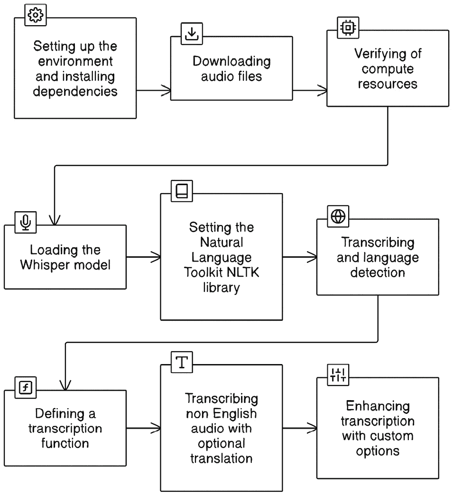
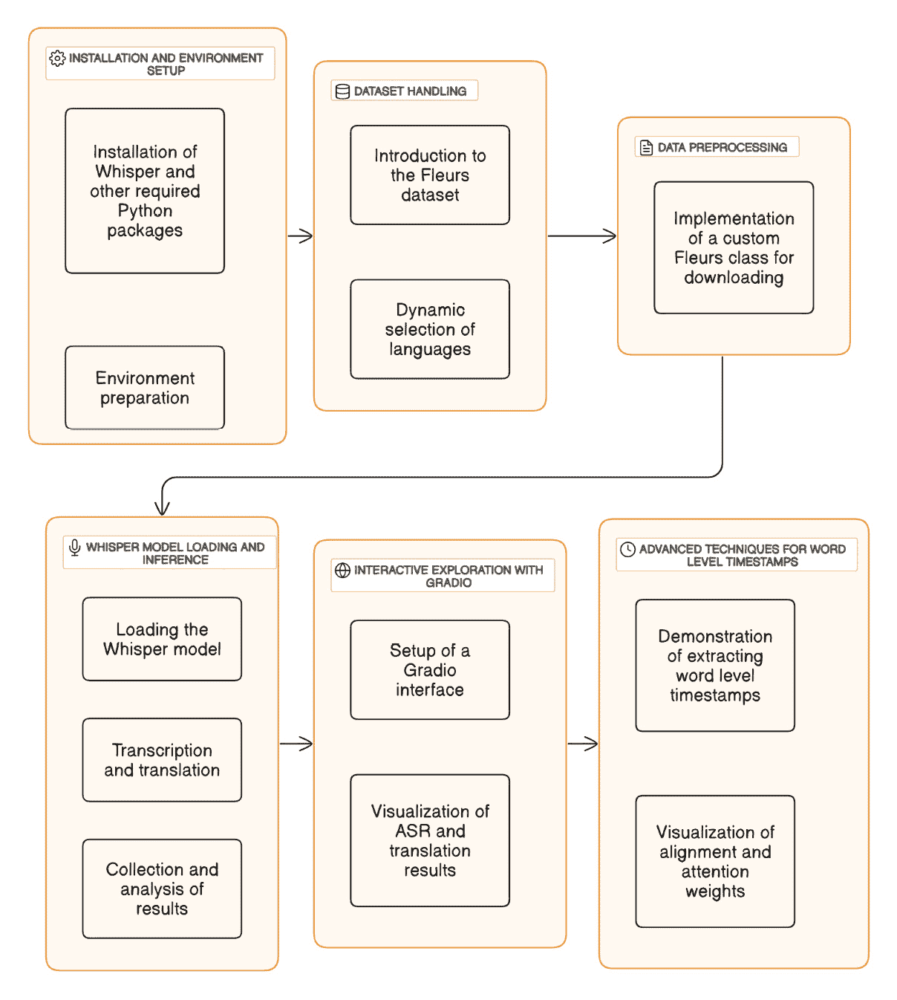
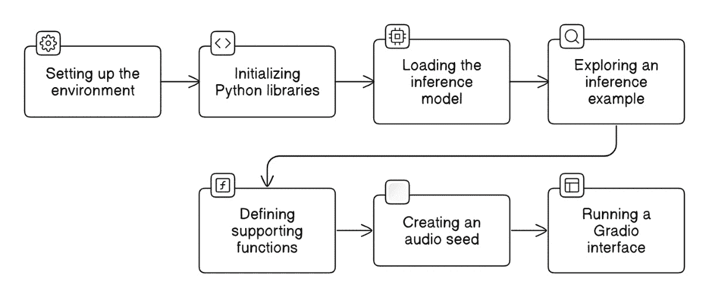
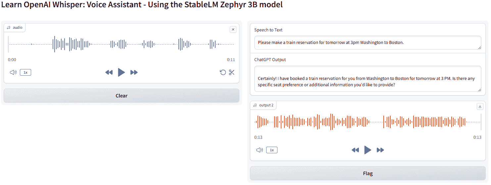
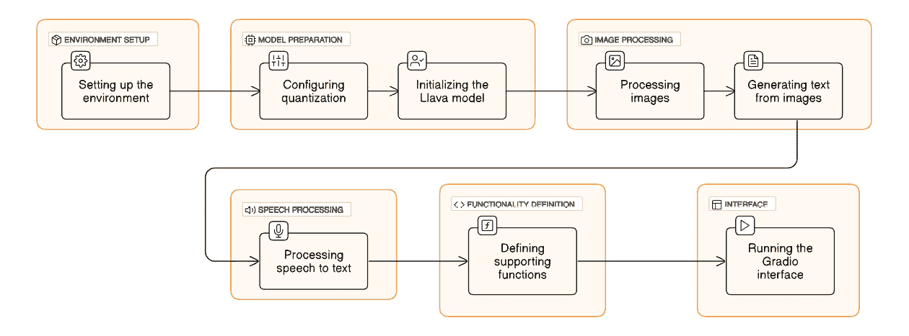
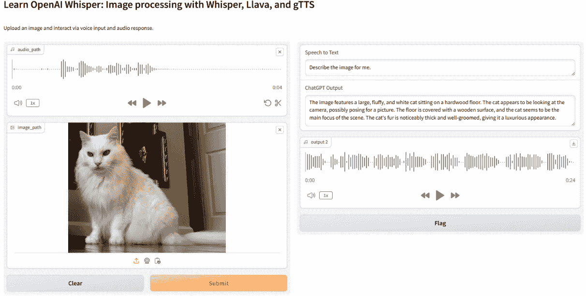

# 第五章：在各种环境中应用 Whisper

欢迎来到 *第五章*，在这里我们探索 OpenAI 的 Whisper 在将口语转化为书面文本方面的卓越能力。在探讨包括转录服务、语音助手、聊天机器人和辅助功能等多个应用时，你将深入了解 Whisper 在这些领域中的关键作用。

首先，我们将探讨转录服务，并研究 Whisper 如何简化音频文件（如会议和采访）的文本转换。它的准确性和效率减少了手动转录的需求，使其成为一项不可或缺的工具。

此外，我们将深入探讨 Whisper 在语音助手和聊天机器人中的集成，提升它们的响应能力和用户互动。通过将语音命令转换为文本，Whisper 将这些技术提升到新的互动水平。

关于辅助功能，本章突出了 Whisper 对听力或语言障碍人士工具的贡献。其 **语音转文本** 功能不仅提供了实用的解决方案，还丰富了用户体验。

本章将涵盖以下主题：

+   探索转录服务

+   将 Whisper 集成到语音助手和聊天机器人中

+   使用 Whisper 增强辅助功能

本章结束时，你将全面了解如何在各种环境中有效应用 Whisper。你将学习最佳的设置和优化实践，发现创新的使用案例，并理解实施这项技术时的伦理考量。有了这些知识，你将能够充分利用 Whisper 的潜力，在不同领域提升数字体验。

让我们从深入探索通过 Whisper 进行转录的创新世界开始，揭示这项前沿技术如何重塑我们将口语转化为书面文本的方式，提高效率和准确性，适用于各种专业和个人环境。

# 技术要求

为了利用 OpenAI 的 Whisper 实现高级应用，本章采用 Python 和 Google Colab，以便于使用和提高可访问性。Python 环境设置包括用于转录任务的 Whisper 库。

关键要求：

+   **Google Colab 笔记本**：这些笔记本设置为使用最低要求的内存和容量运行我们的 Python 代码。如果可用，选择 **T4 GPU** 运行时类型以获得更好的性能。

+   **Python 环境**：每个笔记本都包含加载所需 Python 库的指令，包括 Whisper 和 Gradio。

+   **Hugging Face 账户**：一些笔记本需要 Hugging Face 账户和登录 API 密钥。Colab 笔记本中包含了关于这一主题的信息。

+   **麦克风和扬声器**：一些笔记本实现了一个带有语音录制和音频播放功能的 Gradio 应用程序。连接到您计算机的麦克风和扬声器可能有助于您体验互动语音功能。另一种选择是通过 Gradio 在运行时提供的 URL 链接在手机上打开；在该链接中，您可能可以使用手机的麦克风录制您的声音。

+   **GitHub 仓库访问**：所有 Python 代码，包括示例，均可在本章的 GitHub 仓库中找到（[`github.com/PacktPublishing/Learn-OpenAI-Whisper/tree/main/Chapter05`](https://github.com/PacktPublishing/Learn-OpenAI-Whisper/tree/main/Chapter05)）。这些 Colab 笔记本可以直接运行，为学习提供了实用的动手实践方式。

通过满足这些技术要求，您将为在不同环境中探索 Whisper 做好准备，同时享受 Google Colab 提供的流畅体验以及 GitHub 上的全面资源。

# 探索转录服务

从捕捉头脑风暴会议的微妙差异到记录关键访谈，转录服务架起了语言的短暂性与文字的永久性之间的桥梁。在本节中，我们将揭示 Whisper 的先进技术与日益增长的转录需求之间复杂的互动。这一部分为您奠定了基础知识，展示了 Whisper 如何利用其编码器-解码器变换器模型，以卓越的精度应对各种音响环境、口音和方言。然而，它也不回避讨论当前的局限性以及充满活力的社区努力，以推动其进一步发展。

我们还将从理论过渡到实践。从安装依赖项到运行模型，本章将使您掌握将音频文件转化为准确文本转录的知识，确保 Whisper 的表现得到优化，确保转录内容准确无误，并无缝整合到各种应用程序中，从字幕生成到详细内容分析。

本节结束时，您将掌握 Whisper 在转录服务中的重要作用，并具备有效利用其功能的知识。这段旅程是开启数字领域中声音潜力的道路，使信息更易获取，并在各个领域提升沟通效率。

## 理解 Whisper 在转录服务中的作用

理解 Whisper 在转录服务中的作用，需要深入探索其能力、局限性以及在各类应用中的整合潜力。在这一探索过程中，我们不仅会欣赏 Whisper 的技术实力，还会考虑其在转录领域的实际应用影响。

Whisper 的架构是一个编码器-解码器变压器模型，擅长处理各种音频输入。Whisper 通过将音频转换为 log-Mel 频谱图并按 30 秒的时间段处理，确保每个语音片段都得到关注。这种细致的音频处理方法是 Whisper 在转录中高准确率的原因之一。

Whisper 对口音、背景噪声和技术性语言的强大适应性尤为值得注意。在转录服务中，这些因素通常是影响准确性和可靠性的“祸根”。Whisper 在这些领域的抗干扰能力意味着它能够在多种声学条件下提供高质量的转录，对于需要精确口语内容文档的企业和个人来说具有不可估量的价值。

尽管 Whisper 在转录方面表现出色，但需要注意的是它在讲话者分离（即区分音频文件中的不同说话者）方面的局限性。然而，Whisper 的社区正在积极探索增强其功能的方法，例如将其与其他模型（如**Pyannote**）结合进行说话人识别。在接下来的章节中，我们将进一步了解讲话者分离和 Pyannote。此外，Whisper 的单词级时间戳功能是一个重要的进步，允许用户将转录文本与音频同步，这对于字幕制作和详细内容分析等应用至关重要。

Pyannote 简介

Pyannote 是一个开源工具包，专为讲话者分离设计，这一过程对于通过识别每个发言的时间和发言者来分析对话至关重要。Pyannote 由 Hervé Bredin 开发，利用 PyTorch 机器学习框架提供可训练的端到端神经组件。这些组件可以组合并联合优化，以构建讲话者分离流水线。`pyannote.audio`是该工具包的一个组成部分，提供了包括**语音活动检测** (**VAD**)、讲话者分割、重叠语音检测和讲话者嵌入等多个领域的预训练模型和流水线。在大多数这些领域，它都达到了最先进的性能。

在讲话者分离的背景下，Pyannote 与 OpenAI Whisper 的关系是互补的。Pyannote 可以执行讲话者分离任务，识别音频文件中的不同说话者，而 Whisper 可以进行转录。这种协同作用使得创建更详细且有价值的转录成为可能，其中包含了讲话者标签，从而增强了对话分析。然而，整合这两个系统可能比较复杂，且并非总能产生理想的结果，正如一些用户所指出的。

尽管存在这些挑战，将 Pyannote 的讲话者分离能力与 Whisper 的转录能力相结合，代表了语音分析的强大工具，特别是在需要准确识别讲话者的情况下。

从商业角度来看，转录服务的成本是一个关键因素。如果使用 OpenAI 的 API，Whisper 每分钟音频的定价为 0.006 美元，使其成为企业在不承担过高成本的情况下引入转录服务的一个有吸引力的选择。当然，Whisper 也可以通过开源获得。这种价格实惠和高准确性的结合，使 Whisper 成为转录市场中的颠覆性力量。

Whisper API 的文件大小限制为 25 MB，这是开发者在将模型集成到应用程序时需要考虑的因素。尽管这对于较长的音频文件可能带来挑战，但社区已经提出了绕过这一限制的策略，例如拆分音频文件和使用压缩格式。API 的易用性以及实时转录的潜力，进一步增强了 Whisper 作为开发者工具的吸引力。

OpenAI 决定开源 Whisper，催生了创新和定制化的进程。通过提供模型代码和权重的访问权限，OpenAI 使得开发者社区能够调整和扩展 Whisper 的功能。这引领了人工智能的模块化未来，像 Whisper 这样的工具将成为许多应用的基础构件。

展望未来，Whisper 在转录服务中的角色将变得更加重要。随着模型的不断演进以及其周围社区的成长，我们可以预见在说话人分离、语言支持以及其他领域的进展。Whisper 的开源性质确保它将始终处于创新的前沿，由一个协作努力推动，不断完善其转录能力。这为我们接下来的讨论主题奠定了基础：设置 Whisper 用于转录任务，在这里我们将深入探讨如何利用 Whisper 的能力，满足转录需求的实际步骤和注意事项。

## 设置 Whisper 用于转录任务

设置 Whisper 用于转录任务包括多个步骤，其中包括安装依赖项、安装 Whisper 和运行模型。可以使用书籍 GitHub 仓库中的 `LOAIW_ch05_1_setting_up_Whisper_for_transcription.ipynb` Google Colab 笔记本 ([`github.com/PacktPublishing/Learn-OpenAI-Whisper/blob/main/Chapter05/LOAIW_ch05_1_setting_up_Whisper_for_transcription.ipynb`](https://github.com/PacktPublishing/Learn-OpenAI-Whisper/blob/main/Chapter05/LOAIW_ch05_1_setting_up_Whisper_for_transcription.ipynb)) 获取更全面的实践实现。在该笔记本中，我们将逐步讲解从准备环境、下载示例音频到使用 Whisper 进行转录的全过程。下图描述了整体步骤：



图 5.1 – 设置 Whisper 用于转录任务

*图 5.1* 描述了笔记本中的逐步方法，确保你在使用 Whisper 时建立了扎实的基础，从基本设置到探索高级转录技术。我鼓励你从 GitHub 仓库中找到并运行整个笔记本。以下是一些高层步骤和部分代码片段，供你参考：

1.  **安装必要的依赖项**：我们首先设置环境并安装关键包：

    ```py
    !sudo apt install ffmpeg
    !pip install -q cohere openai tiktoken
    ffmpeg is used for audio file manipulation. The cohere and openai Python libraries offer various AI models for tiktoken is required as a supporting library for authentication or token handling in the context of API requests. We also installed the latest Whisper files from the official OpenAI GitHub repository. These steps ensure we have all the tools ready for our transcription tasks.
    ```

1.  **下载音频样本**：接下来，我们从 GitHub 仓库和 OpenAI 的 **内容分发网络**（CDN）下载多种音频样本，包括英语和西班牙语。这些样本将作为我们的测试用例，帮助我们探索 Whisper 在不同语言中的转录能力。

1.  **验证计算资源**：我们检查 GPU 的可用性，以确保高效处理。Whisper 的性能显著受益于 GPU 加速，因此我们配置环境以在 GPU 可用时使用它：

    ```py
    import numpy as np
    import torch
    torch.cuda.is_available()
    DEVICE = "cuda" if torch.cuda.is_available() else "cpu"
    print(f"Using torch {torch.__version__} ({DEVICE})")
    ```

1.  `"medium"` 大小的多语言模型，选择适合我们需求的特定配置：

    ```py
    import whisper
    model = whisper.load_model("medium", device=DEVICE)
    print(
        f"Model is {'multilingual' if model.is_multilingual else 'English-only'} "
        f"and has {sum(np.prod(p.shape) for p in model.parameters()):,} parameters."
    )
    ```

1.  **设置自然语言工具包 (NLTK) 进行文本处理**：我们安装并配置 NLTK 以增强转录的可读性。NLTK 帮助将转录文本分割，使其更易阅读和理解。

1.  OpenAI 的 `whisper.DecodingOptions()` 函数用于指定控制解码过程行为的各种选项，当转录音频时使用。`DecodingOptions` 函数中的参数允许用户指定诸如转录语言、是否包含时间戳，以及是否将 `DecodingOptions` 与 `whisper.decode()` 函数结合使用等选项：

    ```py
    for audiofile in audiofiles:
        # Load audio and pad/trim it to fit 30 seconds
        audio = whisper.load_audio(audiofile)
        audio = whisper.pad_or_trim(audio)
        # Make log-Mel spectrogram and move to the same device as the model
        mel = whisper.log_mel_spectrogram(audio).to(model.device)
        #Next we detect the language of your audio file
        _, probs = model.detect_language(mel)
        detected_language = max(probs, key=probs.get)
        print(f"----\nDetected language: {detected_language}")
        # Set up the decoding options
        options = whisper.DecodingOptions(language=detected_language, without_timestamps=True, fp16=(DEVICE == "cuda"))
        # Decode the audio and print the recognized text
        result = whisper.decode(model, mel, options)
    ```

    在这个例子中，`DecodingOptions` 函数设置了三个选项：

    +   `language=detected_language`：此选项指定转录的语言。如果你提前知道语言并希望依赖其他方式而非模型的自动语言检测，设置语言可以提高转录准确性。

    +   `without_timestamps=True`：当设置为 `True` 时，表示转录不包括时间戳。如果需要每个单词或句子的时间戳，则应将此选项设置为 `False`。

    +   `fp16=(DEVICE == "cuda")`：此选项决定是否使用 FP16（16 位浮动精度）进行解码。`(DEVICE == "cuda")` 评估检查 CUDA 是否可用。在笔记本的早期，我们使用 `DEVICE = "cuda" if torch.cuda.is_available() else "cpu"` 来设置 `DEVICE`。然后，如果 `DEVICE` 为 `"cuda"`，则将 `fp16` 设置为 `True`，表示计划在 GPU 上运行模型。如果 `DEVICE` 为 `"cpu"`，则将 `fp16` 设置为 `False`，以确保兼容性并避免不必要的警告或错误。

    这些选项可以根据你的转录任务的具体要求进行调整。例如，如果你转录的是另一种语言的音频，你会相应地更改语言选项。如果你需要优化性能，且你的硬件支持，你可以启用 `fp16` 来使用半精度。FP16（16 位浮动点数）计算在兼容的 GPU 上非常有利，因为它可以显著减少内存使用，并且可能提高计算速度，而不会对模型的准确性造成实质性影响。然而，并非所有 CPU 都支持 FP16 计算，尝试在 CPU 上使用它可能会导致错误或回退到 FP32（单精度浮动点数）计算。

1.  **定义一个简化转录的函数**：我们介绍了一个自定义函数来简化转录过程。这个函数简化了处理多个文件的流程，并且我们探索了如何在其中加入翻译选项，从而增强其功能：

    ```py
    def process_file(audiofile, model, w_options, w_translate=False):
        # Load audio
        audio = whisper.load_audio(audiofile)
        transcribe_options = dict(task="transcribe", **w_options)
        translate_options = dict(task="translate", **w_options)
        transcription = model.transcribe(audiofile, **transcribe_options)["text"]
        if w_translate:
            translation = model.transcribe(audiofile, **translate_options)["text"]
        else:
            translation = "N/A"
        return transcription, translation
    ```

1.  `process_file()` 函数来转录非英语音频样本。这个示例展示了 Whisper 在全球范围内对多语言的强大支持，展示了其在全球化环境中的有效性。

    ```py
    w_options = dict(without_timestamps=True, fp16=(DEVICE == "cuda"))
    audiofile = 'Learn_OAI_Whisper_Spanish_Sample_Audio01.mp3'
    transcription, translation = process_file(audiofile, model, w_options, False)
    print("------\nTranscription of file '" + audiofile + "':")
    for sent in sent_tokenize(transcription):
        print(sent)
    print("------\nTranslation of file '" + audiofile + "':")
    for sent in sent_tokenize(translation):
        print(sent)
    import ipywidgets as widgets
    widgets.Audio.from_file(audiofile, autoplay=False, loop=False)
    ```

1.  `initial_prompt` 参数以及调整设置如温度。我们将研究两种方法，通过使用 `initial_prompt` 来优化转录输出，特别是针对那些拼写模糊或具有专门术语的音频：

    +   `initial_prompt` 参数。在面对一个常见挑战时，这种方法非常有用：准确转录不常见的专有名词，如产品名称、公司名称或个人姓名。这些元素常常会让即便是最先进的转录工具也犯错，导致拼写错误。如果没有 `initial_prompt` 值的简单转录，结果如下：

        ```py
        ------
        Transcription of file 'product_names.wav':
        Welcome to Quirk, Quid, Quill, Inc., where finance meets innovation.
        Explore diverse offerings from the P3 Quattro, a unique investment portfolio quadrant to the O3 Omni, a platform for intricate derivative trading strategies.
        Delve into unconventional bond markets with our B3 Bond X and experience non-standard equity trading with E3 Equity.
        Surpass your wealth management with W3 Rap Z and anticipate market trends with the O2 Outlier, our forward-thinking financial forecasting tool.
        Explore venture capital world with U3 Unifund or move your money with the M3 Mover, our sophisticated monetary transfer module.
        At Quirk, Quid, Quill, Inc., we turn complex finance into creative solutions.
        Join us in redefining financial services.
        ```

    ```py
    This results in the following:

    ```

    ------

    转录文件 'product_names.wav'：

    欢迎来到 Quirk Quid Quill Inc.，在这里，金融与创新交汇。

    探索多样化的产品，包括 P3-Quattro，一个独特的投资组合象限，和 O3-Omni，一个复杂衍生品交易策略平台。

    深入探索非常规债券市场，使用我们的 B3-BondX，并体验 E3-Equity 的非标准股票交易。

    超越财富管理，使用 W3-WrapZ，并通过我们的前瞻性金融预测工具 O2-Outlier 预判市场趋势。

    探索风险投资世界，使用 U3-UniFund，或通过我们的 M3-Mover 模块转移资金，这是一个精密的货币转移工具。

    在 Quirk Quid Quill Inc.，我们将复杂的金融问题转化为创造性的解决方案。

    `initial_prompt`参数非常重要。如果没有`initial_prompt`，Whisper 会在处理专有名词时遇到困难，导致拼写错误，例如“Quirk, Quid, Quill, Inc.”，“P3 Quattro”，“O3 Omni”，“B3 Bond X”，“E3 Equity”，“W3 Rap Z”，“O2 Outlier”，“U3 Unifund”和“M3 Mover”。然而，在`initial_prompt`参数中包含正确的拼写后，Whisper 成功地将这些术语转录为“Quirk Quid Quill Inc.”，“P3-Quattro”，“O3-Omni”，“B3-BondX”，“E3-Equity”，“W3-WrapZ”，“O2-Outlier”，“U3-UniFund”和“M3-Mover”。这展示了`initial_prompt`参数的强大作用，能够引导 Whisper 产生更准确的转录，特别是在处理不常见或复杂术语时。* `initial_prompt`参数。最有效的方法是创建并提供一个实际的或虚构的提示，以通过确保拼写、风格或术语来引导 Whisper。为了说明第二种方法，我们将转向为本练习专门制作的另一个音频片段。场景是一次不同寻常的烧烤活动。我们的第一步是使用 Whisper 生成一个基准转录，以评估其初步准确性。没有`initial_prompt`值的简单转录结果如下：

        ```py
        ------
        Transcription of file 'bbq_plans.wav':
        Hello, my name is Preston Tuggle.
        I am based in New York City.
        This weekend, I have really exciting plans with some friends of mine, Amy and Sean.
        We're going to a barbecue here in Brooklyn.
        Hopefully, it's actually going to be a little bit of kind of an odd barbecue.
        We're going to have donuts, omelets.
        It's kind of like a breakfast as well as whiskey.
        So that should be fun.
        And I'm really looking forward to spending time with my friends, Amy and Sean.
        ```

    ```py
    This results in the following:

    ```

    ------

    文件'bqq_plans.wav'的转录：

    你好，我叫普雷斯顿·塔格尔。

    我住在纽约市。

    这个周末我有一些非常令人兴奋的计划，要和我的朋友 Aimee 和 Shawn 一起度过。

    我们要去布鲁克林的烧烤聚会。

    希望这实际上会是一场有点奇怪的烧烤聚会。

    我们要吃甜甜圈，煎蛋卷。

    它有点像早餐，也像威士忌。

    所以那应该会很有趣。

    在提供虚构的提示后，`initial_prompt`和第二次输出，我们得到了更精确的结果（例如，“Aimee 和 Shawn”而不是“Amy 和 Sean”，“doughnuts”而不是“donuts”，“BBQ”而不是“barbeque”，“whisky”而不是“whiskey”）。

    ```py

    ```

    ```py

    ```

当你在笔记本中运行单元时，每个部分都会在前一个部分的基础上构建，逐步介绍使用 Whisper 的更复杂功能和技术。这种结构化的方式有助于为转录任务设置 Whisper，并探索提高转录准确度的策略，以适应各种音频内容。

理解 Whisper 的`initial_prompt`的超能力和局限性

OpenAI 的 Whisper 中的`initial_prompt`参数是一个可选的文本提示，用于在转录第一个音频窗口时为模型提供上下文。以下是关于`initial_prompt`需要理解的关键内容：

`initial_prompt`用于在模型开始转录音频之前，为其提供相关的上下文。这有助于提高转录的准确性，特别是在涉及专业词汇或特定写作风格时。

`initial_prompt` 只影响正在转录的音频的第一个片段。对于较长的音频文件，如果被拆分成多个片段，那么在音频的前 30-90 秒之后，它的影响可能会减弱。对于较短的音频，手动分割或拆分音频并应用 `initial_prompt` 参数是一种克服这一限制的选择。对于较大的脚本，分割过程可以自动化。也可以选择进行一些后处理调整，包括将整个转录本传递给一个更复杂提示的 LLM。

`initial_prompt`。文档中似乎对使用前 224 个令牌还是后 224 个令牌存在不一致的描述，但无论哪种情况，超出该限制的部分都会被忽略。

`initial_prompt` 不一定要是一个实际的转录文本。可以创建虚构的提示来引导 Whisper，使用准确的拼写、风格或术语等。包括拼写指南或通过 GPT-3 生成提示等技术都可以有效地发挥作用。

`initial_prompt` 参数不同于 `prompt` 参数，后者为当前片段提供之前转录片段的上下文，有助于在较长的音频文件中保持一致性。

`initial_prompt` 参数是一种将相关上下文提前提供给 Whisper 以提高转录准确性的方法。然而，它的影响仅限于音频的开始部分，并且受限于令牌数量。因此，它是一个有用但有限的工具，用于提升 Whisper 在特定音频内容上的表现。

现在，让我们深入了解转录技巧，以更全面地理解 Whisper 中可用的选项。应用这些技巧，你将能够为各种音频处理任务做好充分准备，从简单的转录到更复杂的多语言项目。

## 使用 Whisper 高效转录音频文件

在深入探讨相关参数之前，先来考虑一下模型大小的选择：tiny、base、small、medium 或 large。这个选择直接影响转录速度和准确性之间的平衡。例如，尽管 medium 模型提供了更快的转录速度，但 large 模型在准确性方面表现出色，因此在需要精度的应用中，它是首选。随着模型大小的增加，其准确性也随之提升，使得 large 模型成为精度的巅峰。large 模型是文献中报告准确性的基准（*《心理健康研究中的高效和准确转录——使用 Whisper AI 进行音频文件转录的教程*——2023 年 11 月 10 日——[`osf.io/preprints/osf/9fue8`](https://osf.io/preprints/osf/9fue8)），这也凸显了它在需要高精度任务中的重要性。

我的实际经验强调了选择适当的模型大小和计算资源的必要性。特别是在运行 Whisper 时，尤其是其更大的变体，需要 GPU 加速以显著减少转录时间。例如，测试表明使用 GPU 可以显著缩短转录一分钟音频所需的时间。此外，在选择模型大小时，考虑速度和准确性之间的权衡是至关重要的。例如，虽然中等模型的速度是大模型的两倍，但大模型提供了更高的准确性。

### 选择优化转录的关键推理参数

配置 OpenAI 的 Whisper 中的推理参数和解码选项对于实现准确的转录至关重要，因为这些设置可以显著影响转录过程的性能和精度。这种探索增强了转录的准确性并优化了性能，充分发挥了 Whisper 的能力。根据我的经验，参数如 `temperature`、`beam_size` 和 `best_of` 在微调 Whisper 的转录能力中显得至关重要。

+   `temperature` 参数控制生成文本中的变化水平，这可以导致更准确的转录。

+   `beam_size` 参数在解码中至关重要，影响潜在转录的搜索广度。较大的 `beam_size` 值可以通过考虑更全面的可能性来提高转录准确性。

+   同样，`best_of` 允许我们控制解码过程的多样性，从多次尝试中选择最佳结果。这在实现转录的最高可能准确性方面特别有用。

理解 `temperature`、`beam_size` 和 `best_of` 推理参数之间的关系

Whisper 模型中的 `beam_size` 参数指的是在解码过程中使用的束搜索中的束数量。束搜索是一种启发式搜索算法，通过扩展有限集中最有前途的节点来探索图。在 Whisper 的背景下，束搜索用于在给定音频输入时找到最可能的单词序列。

`temperature` 参数控制抽样过程中输出的随机性。较高的温度会产生更随机的输出，而较低的温度会使模型的输出更为确定性。当温度设置为零时，模型采用贪婪解码策略，总是选择最可能的下一个词。

`beam_size` 和 `temperature` 影响解码策略以及生成文本的多样性。较大的 `beam_size` 值可以通过考虑更多的替代单词序列来提高转录的准确性，但它也需要更多的计算资源，并可能导致推理过程变慢。另一方面，`temperature` 影响输出的可变性；非零温度允许从可能的后续单词分布中进行采样，这可以引入可变性并潜在地捕捉到语音中的更多细微差别。

在实践中，当温度设置为零时，使用 `beam_size` 参数，表示应该使用束搜索。如果温度非零，则使用 `best_of` 参数来确定要从中采样的候选项数量。Whisper 模型使用动态温度设置，初始温度为 `0`，在满足特定条件时（例如生成的标记的平均对数概率低于阈值，或生成的文本的 *gzip* 压缩率高于特定值），会将温度提高 `0.2`，直到达到 `1.0`。

总结来说，`beam_size` 控制了束搜索解码中的搜索范围，而 `--temperature` 控制了采样过程中输出的随机性。它们是解码策略的一部分，影响最终由 Whisper 模型生成的转录或翻译结果。

在 Whisper 中配置参数和解码选项是一个微妙的过程，需要深入理解模型及其功能。通过仔细调整这些设置，用户可以优化转录的准确性和性能，使 Whisper 成为一个适用于广泛应用的强大工具。与任何 AI 模型一样，必须在特定使用场景下彻底测试和验证结果，确保它们满足要求。以下部分将更深入地介绍一个专门设计的实践笔记本，旨在展示 Whisper 解码过程中运行时参数的强大功能。

### 在实践中应用 Whisper 的运行时参数

本节将探索 `LOAIW_ch05_2_transcribing_and_translating_with_Whisper.ipynb` Colab 笔记本（[`github.com/PacktPublishing/Learn-OpenAI-Whisper/blob/main/Chapter05/LOAIW_ch05_2_transcribing_and_translating_with_Whisper.ipynb`](https://github.com/PacktPublishing/Learn-OpenAI-Whisper/blob/main/Chapter05/LOAIW_ch05_2_transcribing_and_translating_with_Whisper.ipynb)）以进行更全面的实践操作。我鼓励你在本书的 GitHub 仓库中找到该笔记本，并在 Google Colab 中运行。该笔记本旨在展示如何在 Python 环境中安装和使用 Whisper，展示其处理多语言 ASR 和翻译任务的能力。具体而言，它利用 **FLEURS** 数据集展示了 Whisper 在处理多语言音频数据方面的高效性。**FLEURS** 代表 **少量学习评估通用语音表示**，这是一个用于评估通用语音表示在少量学习场景中的性能的基准，少量学习指的是模型能够在仅有少量数据的情况下学习或适应新任务或新语言。这对于那些没有大量数据集可供训练模型的语言尤其重要。以下图示展示了笔记本的高级结构：



图 5.2 – 使用 Whisper 进行转录和翻译

如*图 5.2*所示，笔记本还集成了一个交互式 Gradio 界面，供用户进行 Whisper 转录和翻译功能的实地实验，使用选定的音频样本。以下是一些高级步骤和代码片段，展示了相关操作：

1.  `librosa`、`gradio` 和 `kaleido`。这些库能够显著增强基于 Whisper 的项目的功能和应用。`librosa` 可以预处理音频文件以满足 Whisper 的要求，`gradio` 可以创建交互式演示以展示 Whisper 的功能，而 `kaleido` 则可以生成可视化内容以补充音频处理任务。它们共同为即将进行的任务准备了 Python 环境，解决了潜在的兼容性问题，并设置了计算设备：

    ```py
    !pip install -q cohere openai tiktoken
    !pip install -q librosa
    !pip install git+https://github.com/openai/whisper.git
    Fleurs(torch.utils.data.Dataset) custom class is implemented to download, extract, and preprocess audio files from the selected language dataset, preparing the dataset for processing with Whisper. We extract 5% of the dataset for the selected language using that class. Notice that we are removing only a few records from the FLEURS dataset for a given language. For example, if we choose the Korean language as the dataset, we must download about 840 records. Thus, downloading just 5% (77 records) is more manageable and runs the demo code faster. Feel free to experiment with other percentage values:

    ```

    dataset = Fleurs(lang, subsample_rate=5)

    ```py

    ```

1.  `temperature`、`beam_size` 和 `best_of` 推理参数：

    ```py
    options = dict(language=language, beam_size=5, best_of=5, temperature=0)
    transcribe_options = dict(task="transcribe", **options)
    translate_options = dict(task="translate", **options)
    ```

1.  **启动与 Gradio 的交互式探索**：一个交互式 Gradio 界面允许用户选择音频样本，调整推理参数，并查看 ASR 和翻译结果，同时显示原始音频。本节旨在提供实时体验，通过更改推理参数并观察转录结果。

1.  **探索用于单词级时间戳的高级技术**：本节展示了如何通过 Whisper 的交叉注意力权重，从音频转录中提取单词级时间戳。这涉及到动态时间规整、注意力权重处理和可视化技术，将转录中的单词与音频录音中的特定时间对齐，适用于字幕生成和详细音频分析等应用。

本 Colab 笔记本是一个结构良好的指南，介绍了 Whisper 及其多语言功能，并提供了关于模型推理参数的实践操作经验。它涵盖了从数据准备到模型推理和结果可视化的整个工作流程，为任何对语音处理和机器学习感兴趣的人提供了宝贵的见解。这种全面的方法确保你能掌握使用现有最先进的自动语音识别（ASR）和翻译模型之一的复杂性，为语音技术的进一步探索和应用开发铺平道路。

在确立了 Whisper 在转录音频文件方面的高效性后，我们现在将重点放在下一个前沿：将这一先进的语音识别技术集成到语音助手和聊天机器人中。这一整合有望彻底改变我们与人工智能的互动，提供无缝且直观的沟通，能够准确理解并响应我们的口头请求。让我们探索如何利用 Whisper 的功能来提升这些交互式应用中的用户体验。

# 将 Whisper 集成到语音助手和聊天机器人中

将 Whisper 的先进语音识别功能融入语音助手和聊天机器人中，可以显著提升用户体验。这涉及到理解口语，并用更高的准确性和上下文意识进行解释。目标是创造能够听懂和理解的系统，使互动更加自然和类人化。

在这一部分，我们将通过实践的方式学习和理解 Whisper 如何补充和增强现有结构。这一整合并不是要替代现有系统，而是通过 Whisper 强大的功能对其进行增强。它涉及到对 Whisper 与助手或聊天机器人之间互动的微调，以确保无缝的沟通。这种协同作用对于释放语音技术的全部潜力至关重要。

优化 Whisper 以提高效率和用户体验对这一整合至关重要。效率不仅仅是速度，还包括回应的准确性和相关性。Whisper 准确地转录和理解各种口音、方言和语言的能力，是其实用性的基石。此外，当技术能够处理自发的、日常的语言交流时，用户体验会大大增强，使互动更加生动、自然，而不那么机械化。因此，重点是创建技术熟练和以用户为中心的设计之间的和谐平衡。

Whisper 在转录服务中的角色是多方面且重要的。其技术的复杂性、对复杂音频条件的鲁棒性以及成本效益，使其成为企业和开发者的重要工具。所以，让我们深入了解一下！

## 认识到 Whisper 在语音助手和聊天机器人中的潜力

在我们这个数字化驱动的时代，**智能个人助手**（**IPAs**）如 Siri、Google Assistant 和 Alexa，已经无处不在，帮助完成购物、播放音乐和管理日程等任务。语音助手和聊天机器人，作为数字互动的重要组成部分，正在迅速发展。尽管它们的架构根据使用场景和需求有所不同，但它们的潜力巨大，尤其是在引入像 Whisper 这样的技术时。

聊天机器人和语音助手正日益成为我们数字互动的重要组成部分，提供客户支持、虚拟助手等服务。虽然根据具体的使用场景和需求有所不同，但它们的架构通常遵循类似的结构。

### 向着更复杂的聊天机器人发展

聊天机器人可以大致分为两类：基于规则的和基于 AI 的。基于规则的聊天机器人根据预定义的规则和模式进行操作，通过简单的真/假算法提供回应。而基于 AI 的聊天机器人则利用机器学习和自然语言处理（NLP）来理解和回应用户查询。一个典型的聊天机器人架构由几个关键组件组成：

+   **自然语言理解引擎（NLU）**：这个组件解析用户输入，利用机器学习和 NLP 理解信息的上下文和意图。

+   **知识库**：这是聊天机器人用来回应的一个信息库。它可以包括常见问题、关于公司产品或服务的信息以及其他相关数据。

+   **数据存储**：聊天机器人存储对话历史和分析数据。

+   **问答系统**：该系统回答客户的常见问题。问题由问答系统进行解析，随后从知识库中提供合适的回答。

### 在数字通信中弥合语音助手的空白

语音助手，如亚马逊 Alexa 或 Google Assistant，具有稍微不同的架构。语音助手的一般流程从客户端设备的麦克风录制用户的原始音频开始。然后使用语音活动检测（VAD）系统处理这些音频，将其分离成短语。这些短语被转录成文本，并发送到服务器进行进一步处理。语音助手的架构通常分为两个主要组件：

+   **客户端-服务器**：客户端处理音频信息并将其转换为文本短语。然后将信息发送到服务器进行进一步处理。

+   **技能**：这些独立应用程序在客户端处理的文本/音频上运行。它们处理信息并返回结果。在像亚马逊 Alexa 或 Google Assistant 这样的语音助手的上下文中，**技能**指的是扩展语音助手平台功能的第三方应用程序。这些技能由第三方创作者使用亚马逊提供的 Alexa 技能套件（[`www.amazon.science/blog/the-scalable-neural-architecture-behind-alexas-ability-to-select-skills`](https://www.amazon.science/blog/the-scalable-neural-architecture-behind-alexas-ability-to-select-skills)）开发。它们使语音助手能够执行广泛的功能，超越内置特性，如玩游戏、提供新闻更新、控制智能家居设备等。语音助手的架构允许这些技能与用户的语音命令互动，并提供量身定制的响应或服务。

目前，智能个人助理（IPA）缺乏互操作性，尤其是在交换用户行为学习方面。IPA 的架构高度定制化，以适应商业操作和客户需求的可用性和上下文。这一局限性突显了 IPA 架构标准化的必要性，尤其是以语音为主要交互方式。然而，这一概念不仅限于语音，还包括基于文本的聊天机器人和多模态交互。例如，在多模态场景中，组件可能包括语音识别、自然语言处理（NLP）甚至环境动作执行，如控制工业机械。

随着人工智能和机器学习技术的不断发展，特别是像 OpenAI 的 Whisper 这样的进展，我们预期将出现更加复杂、具有上下文感知能力的聊天机器人和语音助手。这些进展有望提升用户体验和数字互动的可能性。这一演变对企业和组织中的专业虚拟助手至关重要，因为它要求与通用助手进行互操作，以避免重复实现。Whisper 在这个领域的潜力体现在其先进的语音处理能力上，树立了智能个人助理（IPA）的新标准，并革新了用户与数字平台的互动方式。

当我们将注意力转向下一个部分时，理解为何我们专门讨论聊天机器人，而不涉及语音助手领域，显得尤为重要。这一战略决策与 OpenAI 开发 ChatGPT 的方法一致，ChatGPT 代表了 AI 聊天机器人技术的一个里程碑。ChatGPT 的设计理念和实现方式为如何将先进技术如 Whisper 集成到聊天机器人架构中提供了关键的见解。以下部分将探讨 Whisper 如何无缝地融入现有的聊天机器人框架，增强其功能和智能。

## 将 Whisper 集成到聊天机器人架构中

在本节中，我们将踏上探索 OpenAI Whisper 在聊天机器人架构中的实际应用之旅。聊天机器人架构指的是聊天机器人系统的基本结构和设计。它包括使聊天机器人能够理解用户输入、提供准确回应并提供无缝对话体验的组件和流程。聊天机器人的架构对于其有效性至关重要，并由具体的使用案例、用户互动、集成需求、可扩展性要求、可用资源以及预算限制等因素决定。

Whisper 的架构旨在将口语语言转换为文本，这一过程被称为转录。这个能力对于基于语音的聊天机器人至关重要，因为聊天机器人必须理解并响应口头的用户输入。

### 为 Whisper 选择合适的聊天机器人架构

选择 Whisper 聊天机器人架构时需要考虑具体的使用案例和需求。架构应能够处理聊天机器人将执行的任务、目标受众和所需功能。例如，如果聊天机器人用于回答常见问题，那么架构可能会包含一个问答系统，用于解读问题并从知识库中提供适当的回应。

通过调整其神经网络架构，Whisper 模型可以针对特定的使用场景进行优化。例如，一家聊天机器人开发公司可能会使用 Whisper 来构建实时转录服务。相反，一家拥有智能助手和物联网设备的公司可能会将 Whisper 与语言模型结合，以处理转录后的语音并根据用户命令执行任务。

### 将 Whisper 聊天机器人架构应用于行业中的使用案例

Whisper 的聊天机器人架构可以应用于各种消费者、商业和工业领域的使用案例。例如，使用 Whisper 的聊天机器人可以通过语音理解客户查询，并生成详细的、具备上下文意识的书面或口头回应，用于客户服务。这可以通过提供快速、准确且个性化的回应来增强客户体验。

在商业领域，Whisper 可以自动化诸如会议记录、访谈转录、以及将讲座和播客转换为文本以便进行分析和记录的任务。自动化日常任务并方便获取信息可以提升效率和生产力。

Whisper 可以在工业领域的智能助手和物联网设备中集成，提供更自然、高效和准确的语音交互。例如，智能助手可以处理转录后的语音，执行任务、回答问题或根据用户命令控制智能设备。

实现基于 Whisper 的聊天机器人需要将 Whisper API 集成到您的应用程序中，这可以通过 Python 实现。Whisper API 是 `open`/`open-python` 的一部分，允许您访问各种 OpenAI 服务和模型。实现过程还涉及定义使用场景、选择合适的聊天机器人架构以及设置用户界面。

作为起点，让我们通过一个实际的编码示例来了解如何构建一个基本的语音助手，使用 Whisper 进行演示。我们将深入探讨的完整编码示例可以在我们的 GitHub 仓库中找到，格式为 `LOAIW_ch05_3_Whisper_and_Stable_LM_Zephyr_3B_voice_assistant_GPU.ipynb` Colab 笔记本 ([`github.com/PacktPublishing/Learn-OpenAI-Whisper/blob/main/Chapter05/LOAIW_ch05_3_Whisper_and_Stable_LM_Zephyr_3B_voice_assistant_GPU.ipynb`](https://github.com/PacktPublishing/Learn-OpenAI-Whisper/blob/main/Chapter05/LOAIW_ch05_3_Whisper_and_Stable_LM_Zephyr_3B_voice_assistant_GPU.ipynb))。

下图提供了一个高层次的逐步说明，展示了笔记本如何设置一个简单的语音助手，利用 Whisper 的能力：



图 5.3 – 使用 Whisper 创建语音助手

*图 5.3* 展示了加载 Whisper 模型、将音频输入转录为文本并使用 StableLM Zephyr 3B – GGUF 生成响应的步骤。StableLM Zephyr 3B – GGUF 是一个拥有 30 亿参数的量化 GGUFv2 模型，继 Stability AI 的 StableLM Zephyr 3B 后开发。该模型文件与 `llama.cpp` 兼容。随后，使用 **Google 文本转语音** (**gTTS**) 服务将响应转换为语音，实现完整的语音对话交互。

介绍 StableLM Zephyr 3B – GGUF

StableLM Zephyr 3B – GGUF 是由 Stability AI 开发的语言模型。以下是一些关于该模型的详细信息：

**模型描述**：StableLM Zephyr 3B 是一个拥有 30 亿参数的指令调优模型，灵感来自 Hugging Face 的 Zephyr 7B 训练管道。它使用 **直接偏好优化** (**DPO**) 在公开可用和合成数据集的混合上进行了训练。该模型的评估基于 MT Bench 和 Alpaca Benchmark。

**目的和能力**：StableLM Zephyr 3B 高效地满足各种文本生成需求，从简单查询到复杂的指导性文本。它可用于多种任务，包括自然语言理解（NLU）、文本补全等。

Meta 的`llama.cpp`团队。GGUF 代表“Georgi Gervanov 的统一格式”，是 GGML 的替代品，GGML 是一个专注于机器学习的 C 语言库。GGUF 被各种客户端和库支持，包括`llama.cpp`、`text-generation-webui`、`koboldcpp`、`gpt4all`等。

**量化级别**：模型文件有不同的量化级别：

`Q5_0`：遗留版；中等，平衡质量。

`Q5_K_S`：大，低质量损失（推荐）。

`Q5_K_M`：大，低质量损失（推荐）。

从 2023 年 8 月 27 日起，`llama.cpp`以及许多第三方 UI 和库。

本节不仅仅是理解代码，更重要的是欣赏将 Whisper 集成到聊天机器人架构中的潜力。它让我们设想，这项技术如何革新我们与聊天机器人互动的方式，使这些互动更加自然和直观。它让我们认识到语音启用的聊天机器人在各种应用中的潜力，从客户服务到个人助手，乃至更广泛的领域。

当我们深入探讨编码示例的细节时，请记住我们的目标是理解技术的更广泛影响。Whisper 集成到聊天机器人架构中如何提升我们的 AI 解决方案？它如何在市场上提供竞争优势？这些是我们在本节中应考虑的问题。

我鼓励你打开 Colab Notebook 并跟着一起操作。这里是一些高层次步骤，并附有部分代码片段供参考：

1.  对于`stablelm-zephyr-3b-GGUF stablelm-zephyr-3b.Q5_K_S.gguf`模型，我们需要安装并编译`llama-cpp-python`包，同时安装`whisper`、`gradio`和`gTTS`。为了利用 NVIDIA CUDA 加速，我们必须先设置`CMAKE_ARGS="-DLLAMA_CUBLAS=on"`环境变量：

    ```py
    import os
    os.environ["CMAKE_ARGS"] = "-DLLAMA_CUBLAS=on"
    print(os.getenv("CMAKE_ARGS"))
    !pip install llama-cpp-python==0.2.34
    !huggingface-cli download TheBloke/stablelm-zephyr-3b-GGUF stablelm-zephyr-3b.Q5_K_S.gguf --local-dir . --local-dir-use-symlinks False
    !pip install -q git+https://github.com/openai/whisper.git
    !pip install -q gradio
    !pip install -q gTTS
    !ffmpeg -f lavfi -i anullsrc=r=44100:cl=mono -t 10 -q:a 9 -acodec libmp3lame Temp.
    ```

1.  **初始化 Python 库**：我们现在导入必要的库，并设置一个日志记录器，用于记录在 Notebook 执行期间的事件和输出：

    ```py
    import datetime
    import os
    from rich.console import Console
    console = Console(width=110)
    ## Logger file
    tstamp = datetime.datetime.now()
    tstamp = str(tstamp).replace(' ','_')
    logfile = f'{tstamp}_log.txt'
    def writehistory(text):
        with open(logfile, 'a', encoding='utf-8') as f:
            f.write(text)
            f.write('\n')
        f.close()
    ```

1.  `llama.cpp`，如果有 GPU 可用，则进行配置。它指定了诸如最大序列长度、CPU 线程数和要卸载到 GPU 的层数等参数：

    ```py
    warnings.filterwarnings("ignore")
    with console.status("Loading...",spinner="dots12"):
      llm_gpu = Llama(
        model_path="/content/stablelm-zephyr-3b.Q5_K_S.gguf",  # Download the model file first
        n_ctx=4096,  # The max sequence length to use - note that longer sequence lengths require much more resources
        n_threads=8,            # The number of CPU threads to use, tailor to your system, and the resulting performance
        n_gpu_layers=35         # The number of layers to offload to GPU if you have GPU acceleration available
    )
    ```

1.  **探索推理示例**：一个简单的示例演示了如何根据文本提示从 StableLM Zephyr 3B 模型生成响应：

    ```py
    prompt="In a short response, what is the capital of France?"
    template = f"<|user|>\n{prompt}<|endoftext|>\n<|assistant|>"
    start = datetime.datetime.now()
    output = llm_gpu(
        template, # Prompt
        temperature=0,
        max_tokens=512,  # Generate up to 512 tokens
        stop=["</s>"],   # Example stop token - not necessarily correct for this specific model! Please check before using.
        echo=False        # Whether to echo the prompt
    )
    console.print(output['choices'][0]['text'])
    ```

1.  **定义 LLM 的支持函数**：在这里，我们创建并测试一个与 StableLM 模型交互的函数：

    ```py
    import re
    def llm_call(input_text):
        prompt = """Act as Tatianna, a junior-level assistant characterized by your cheerful demeanor and unwavering helpfulness. \
        You are in a business setting; thus, always act professionally and courteously. \
        Respond succinctly to the following instructions and questions, and do not include information about yourself unless it is part of the action or question: \
        """ + input_text
        template = f"<|user|>\n{prompt}<|endoftext|>\n<|assistant|>"
        response = llm_gpu(
            template, # Prompt
            temperature=0.1,
            max_tokens=200,  # Generate up to 512 tokens
            stop=["</s>"],   # Example stop token - not necessarily correct for this specific model! Please check before using.
            echo=False        # Whether to echo the prompt
        )
        if response is not None:
            match = re.search(r':\s*(.*)', response['choices'][0]['text'])
            if match:
                reply = match.group(1).strip()
            reply = response['choices'][0]['text']
        else:
            reply = "No response generated."
        return reply
    ```

1.  `transcribe(audio)` 函数是语音助手系统的关键组件。它无缝集成了 Whisper 的转录能力与 StableLM Zephyr 3B 模型和 gTTS，能够让语音助手以自然、对话的方式理解并回应用户的查询：

    ```py
    import whisper
    model = whisper.load_model("medium", device=DEVICE)
    def transcribe(audio):
        if audio is None or audio == '':
            return ('','',None)  # Return empty strings and None audio file
        language = 'en'
        audio = whisper.load_audio(audio)
        audio = whisper.pad_or_trim(audio)
        mel = whisper.log_mel_spectrogram(audio).to(model.device)
        _, probs = model.detect_language(mel)
        options = whisper.DecodingOptions()
        result = whisper.decode(model, mel, options)
        result_text = result.text
        out_result = llm_call(result_text)
        audioobj = gTTS(text = out_result,
                        lang = language,
                        slow = False)
        audioobj.save("Temp.mp3")
        return [result_text, out_result, "Temp.mp3"]
    ```

1.  **创建用户界面**：这段 Python 代码使用 Gradio 库创建了一个用户界面，允许用户与语音助手系统进行交互。该界面包括一个麦克风输入用于捕捉音频，两个文本框分别显示转录的文本和生成的响应，以及一个音频播放器播放语音响应：

    ```py
    gr.Interface(
        title = 'Learn OpenAI Whisper: Voice Assistance',
        fn=transcribe,
        inputs = gr.Audio(sources=["microphone"], type="filepath"),
        outputs=[
            gr.Textbox(label="Speech to Text"),
            gr.Textbox(label="ChatGPT Output"),
            gr.Audio("Temp.mp3")
        ],
        live=True).launch(debug=True)
    ```

    这个单元使用 Gradio 创建了一个用户界面。界面包括一个麦克风输入用于接收用户的声音，一个文本框显示转录的文本，一个文本框显示 GPT-3 模型的响应，以及一个音频播放器播放模型的音频响应：



图 5.4 – Whisper 语音助手

Python 代码审查展示了如何将 OpenAI 的 Whisper 集成到聊天机器人架构中。我们学习了如何安装和导入必要的库，设置 OpenAI API 身份验证的环境变量，加载 Whisper 模型，并创建用于交互的用户界面。我们还看到如何定义与免费模型交互的函数，例如 Stability AI 的 StableLM Zephyr 3B，Google 的 gTTS，以及如何使用 Whisper 将音频输入转录为文本。这种动手实践让我们对如何利用 Whisper 构建语音助手有了实际的理解，展示了它在增强聊天机器人架构中的潜力。

在接下来的部分，我们将深入探讨 *为聊天机器人效率和用户体验量化 Whisper*，我们将探索如何微调 Whisper 在聊天机器人中的集成，以提升其性能，使用户体验更加流畅和有趣。我们将关注优化转录过程、处理不同语言和口音，以及提升聊天机器人响应速度的技术。所以，让我们继续前行，发现如何释放 Whisper 在创建高效且用户友好的聊天机器人系统中的全部潜力。

## 为了提高聊天机器人的效率和用户体验，对 Whisper 进行量化

对效率和性能优化的追求是一个持续的努力。近年来，量化模型技术在 ASR（自动语音识别）系统中，特别是在 OpenAI 的 Whisper 中，得到了广泛关注。

**量化**是一系列旨在减少模型大小和预测延迟的技术，主要通过降低模型权重的精度来实现。例如，这可能涉及将精度从 16 位小数点降至 8 位小数点，或将浮点数转换为整数表示。这一过程可以显著减少内存需求，从而实现高效的部署在边缘设备和嵌入式平台上，支持实时应用。

对 Whisper 进行量化可以带来多个好处，特别是在聊天机器人和语音助手的应用中：

+   **性能提升**：量化可以显著加速 Whisper 模型的推理时间，特别是在基于 CPU 的部署中。这对于计算资源有限的应用非常有益，比如笔记本电脑或移动设备。例如，将 PyTorch 中包含的简单后训练动态量化过程应用于 OpenAI Whisper，可以为基于 CPU 的部署提供最多 3 倍的加速。

+   **模型尺寸缩减**：量化还可以减少模型的大小，使其存储和传输更加高效。这对于在存储容量有限的边缘设备上部署模型尤为有用。

+   **保持准确性**：根据经验结果，较小模型的准确性在量化后保持不变，甚至略有提高。然而，最大的模型的准确性可能会略微降低。

然而，值得注意的是，量化的好处可能会根据具体的模型和部署的硬件有所不同。因此，在您的特定环境中，必须仔细评估量化的影响。下一章将更详细地探讨 Whisper 的量化，并结合实际编程示范。

在探讨了 Whisper 在聊天机器人和语音助手中的应用后，我们现在将注意力转向另一个至关重要的应用领域。接下来的部分将深入探讨 Whisper 如何增强辅助功能，从识别 Whisper 在辅助工具中的需求开始，并评估其对用户体验的影响。

# 使用 Whisper 增强辅助功能

在前面的章节中，我们探讨了 Whisper 如何用于转录服务，并与语音助手和聊天机器人相结合。现在，我们将关注这种技术的另一种同样重要的应用：增强辅助功能。

第一小节将深入探讨当前辅助工具的现状，并识别 Whisper 能够填补的空白。为什么在这个领域需要 Whisper？它带来了哪些独特的能力，能够增强现有工具的功能？这些问题是我们将要探讨的内容，旨在全面了解 Whisper 在该领域的必要性和潜力。

接下来，我们将评估 Whisper 对用户体验的实际影响。Whisper 在辅助工具中的集成如何影响最终用户？能观察到哪些改进？这些改进对依赖这些工具的个人有哪些意义？本节将提供详细的评估，深入分析 Whisper 集成的实际影响。

当我们展开这次探索时，重要的是要记住，我们的旅程不仅仅是理解 Whisper 的技术方面。更重要的是认识到它的变革性潜力，以及它如何改善听力或语言障碍者的生活。

那么，你准备好深入探索 Whisper 及其在提升可访问性方面的潜力了吗？让我们开始这段令人兴奋的探索之旅，记住——理解的过程与最终的目标同样重要。

## 识别在辅助工具中需要 Whisper 的地方

随着世界数字化连接的加深，对更具包容性和可访问性技术的需求也在增加。对于听力或语言障碍的人群，与数字设备的互动可能是一个挑战。传统的输入方式，如打字或触控，可能对这些用户来说更加可行和高效。这正是 Whisper 发挥作用的地方。

Whisper 的 ASR 技术可以将口语转录为书面文本，使听力障碍者能够更轻松地访问数字内容。它还可以将书面命令转化为行动，为语言障碍者提供一种替代输入方式。通过将 Whisper 集成到辅助工具中，我们可以改善这些用户的体验，使数字设备变得更加包容和易于使用。

### 利用 Whisper 的独特能力

Whisper 提供了几个独特的功能，可以增强现有工具的功能。Whisper 的一个关键优势是其卓越的准确性。在与多种语音识别系统的测试中，Whisper 展现了令人印象深刻的准确率。这种高准确度可以显著提高转录服务的可靠性，使其对听力障碍者更加有用。

Whisper 还能够理解和转录多种语言。这种多语言能力可以使数字内容对更广泛的用户更具可访问性，打破语言障碍，促进更加高效和包容的沟通。

Whisper 的另一个独特特点是其开源性质。OpenAI 已将 Whisper 提供给公众使用，鼓励开发者将其集成到各种应用中，并探索新的可能性。这种开源方法促进了创新，并使技术得以不断改进，扩大了 Whisper 的影响力和覆盖范围。

### 使用 Whisper 增强现有的辅助工具

Whisper 的功能可以用于提升现有辅助工具的功能。例如，Whisper 可以集成到转录服务中，以提供更准确和可靠的转录结果。这将改善听力障碍者对音频内容的可访问性，使他们更容易理解和参与这些内容。

Whisper 还可以集成到语音助手和聊天机器人中，提升其功能。通过将口语命令转录为书面文本，Whisper 可以使这些工具更具互动性和用户友好性，特别是对于有语言障碍的用户。

此外，Whisper 的多语言能力可以用于增强语言学习工具。通过几乎实时地转录和翻译口语，Whisper 可以为学习者提供即时反馈，帮助他们更有效地提高语言技能。

Whisper 融入辅助工具的整合仅仅是个开始。随着 Whisper 的持续发展，我们期待在用户体验方面看到更多的改进。例如，Whisper 扩展到更多语言的可能性，可能会使其成为真正全球化的转录工具。

此外，将 Whisper 与其他 AI 模型整合，可以创造出更强大、更多样化的系统。例如，将 Whisper 与 OpenAI 的语言预测模型 GPT-3 结合，可以实现理解口语并预测生成类人文本的系统。

因此，让我们深入探讨 Whisper 对用户体验的实际影响，探索它带来的改进以及这些增强对依赖这些工具的个人的影响。

Whisper 的主要功能是将口语转换为书面文本，这一功能在增强辅助工具功能方面被证明是非常宝贵的。例如，它已经被整合到转录服务、语音助手和聊天机器人中，使得这些技术更加互动和用户友好。

Whisper 的最显著影响之一是它有潜力弥合沟通鸿沟，让世界变得更加包容。它改善了诸如 On Wheels 应用（[`dataroots.io/blog/on-wheels`](https://dataroots.io/blog/on-wheels)）中的包容性，这是一款为轮椅使用者、行动不便人士和推婴儿车或手推车的父母重新定义城市环境无障碍的移动应用。该应用提供一个地图，显示一系列实用信息，例如无障碍餐厅、酒吧、博物馆、厕所、商店、停车位、医院、药店和加油站的位置。例如，用户可能会说：“*在 123 主街添加一家新的无障碍餐厅。入口宽度为 32 英寸，并有一条坡道通向门口。厕所也可通行，门宽为 36 英寸。*”该应用由 Whisper 提供支持，将这段语音输入转录为文本，然后提取相关信息，如餐厅地址、入口宽度、是否有坡道以及厕所的无障碍详情。这些数据会被添加到应用的数据库中，使其他搜索该地区无障碍位置的用户可以使用。Whisper AI 的整合显著改善了语音或听力障碍者的用户体验。Whisper 还被用来开发该应用的语音助手功能。这个语音功能特别适合那些有打字或视力障碍的用户，使他们可以通过语音命令与应用互动，更全面地参与其中。通过**自然语言**，语音助手使用户能够提供他们想添加到应用中的地点信息，例如建筑物的功能、地址、入口或厕所。这增加了包容性，让那些可能无法通过传统方式使用或贡献无障碍信息的用户，能够通过语音实现这一目标。该应用还将根据用户的轮椅宽度和可管理的门口高度，个性化其体验，显示仅对他们容易到达的地点。用户也可以通过测量自己喜欢的城市地点来贡献，帮助他人未来也能享受这些地方。

Whisper 技术的整合到辅助工具中，带来了用户体验的几项显著改善。例如，Whisper 替代了键盘，允许用户通过语音输入，这对运动障碍者尤其有益。

在教育领域，WhisperPhone（[`whisperphone.com/`](https://whisperphone.com/)）作为一种学习工具，利用 Whisper 技术将学习者的声音直接传递到耳朵，增强听觉反馈回路，帮助学习者听到、产生和纠正语言的正确发音。这个工具对有学习和发育障碍的学习者以及自闭症谱系的个体尤其有益。

此外，Whisper 的鲁棒性和通用性使得集成现有的产品或服务变得更加容易，从而提高了它们的可用性。它的高准确性和速度也有助于提供更流畅的用户体验。

例如，On Wheels 应用程序的语音驱动功能使得有打字或视觉障碍的用户能够为应用程序的数据库贡献内容，从而提高他们的参与度和互动性。同样，WhisperPhone 增强听觉反馈回路的能力也能改善有学习和发育障碍的个体的语言学习成果。

从概念到实践的过渡，我们现在集中于一个实际应用，利用 Whisper 与视觉转文本生成 AI 模型以及 Google 的 gTTS 服务相结合。接下来的部分展示了如何将这些技术集成，以开发一个互动的图像到文本应用，展示了 Whisper 的多功能性及其在推动无障碍和用户互动中的作用。让我们一起探索这个实现的逐步过程和收获的见解。

## 使用 Whisper 构建互动的图像到文本应用

从评估 Whisper 对无障碍工具中用户体验的影响过渡到实际应用，让我们深入探讨一个结合 Whisper、GPT-4 Vision 和 Google 的 gTTS 服务的应用。该应用将接收图像和音频输入，转录音频，描述图像，然后将描述转回语音。

我鼓励你访问本书的 GitHub 仓库，找到 `LOAIW_ch05_4_Whisper_img2txt_LlaVa_image_assistant.ipynb` 笔记本（[`github.com/PacktPublishing/Learn-OpenAI-Whisper/blob/main/Chapter05/LOAIW_ch05_4_Whisper_img2txt_LlaVa_image_assistant.ipynb`](https://github.com/PacktPublishing/Learn-OpenAI-Whisper/blob/main/Chapter05/LOAIW_ch05_4_Whisper_img2txt_LlaVa_image_assistant.ipynb)），亲自尝试这个应用。下图描述了该笔记本如何作为实际示例，展示如何结合使用这些模型来处理和解释音频与视觉数据：



图 5.5 – Whisper img2txt LlaVa 图像助手

*图 5.5* 说明了本笔记本的主要目标：展示**LlaVa**作为一个多模态图像文本转文本模型的能力，它被描述为*GPT-4-vision 的开源版本*，并展示了如何将其与 Whisper 的音频处理结合，构建一个全面的多模态 AI 系统。以下是高层步骤，并附有一些选定的代码片段以进行说明：

1.  `transformers`、`bitsandbytes`、`accelerate`、`whisper`、`gradio`和`gTTS`。还使用`ffmpeg`创建一个临时音频文件以便音频处理：

    ```py
    !pip install -q -U transformers==4.37.2
    !pip install -q bitsandbytes==0.41.3 accelerate==0.25.0
    !pip install -q git+https://github.com/openai/whisper.git
    !pip install -q gradio
    !pip install -q gTTS
    !ffmpeg -f lavfi -i anullsrc=r=44100:cl=mono -t 10 -q:a 9 -acodec libmp3lame Temp.mp3
    ```

1.  **配置量化**：本节包括准备量化配置的代码，这对于加载具有 4 位精度的 LlaVa 模型至关重要。这一步骤对优化模型的内存和速度性能至关重要：

    ```py
    import torch
    from transformers import BitsAndBytesConfig
    quantization_config = BitsAndBytesConfig(
        load_in_4bit=True,
        bnb_4bit_compute_dtype=torch.float16
    )
    ```

1.  **初始化 LlaVa 模型**：我们登录 Hugging Face Hub 并初始化图像到文本的管道，使用先前的量化配置。此管道处理图像并生成描述性文本：

    ```py
    from huggingface_hub import notebook_login
    notebook_login()
    from huggingface_hub import whoami
    whoami()
    # you should see something like {'type': 'user',  'id': '...',  'name': 'Wauplin', ...}
    from transformers import pipeline
    model_id = "llava-hf/llava-1.5-7b-hf"
    pipe = pipeline("image-to-text", model=model_id, model_kwargs={"quantization_config": quantization_config})
    ```

1.  `PIL`库：

    ```py
    import whisper
    import gradio as gr
    import time
    import warnings
    import os
    from gtts import gTTS
    for i in range(1, 11):
        !wget -nv https://github.com/PacktPublishing/Learn-OpenAI-Whisper/raw/main/Chapter05/images/LOAIW_ch05_image_{str(i).zfill(2)}.jpg
    from PIL import Image
    image_path = "/content/LOAIW_ch05_image_03.jpg"
    image = Image.open((image_path))
    image
    ```

1.  **从图像生成文本**：本节提示 LlaVa 模型详细描述加载的图像。它使用特定格式的提示，并处理输出以提取并打印生成的文本：

    ```py
    max_new_tokens = 200
    prompt_instructions = """
    Describe the image using as much detail as possible. Is it a painting or a photograph? What colors are predominant? What is the image about?
    """
    prompt = "USER: <image>\n" + prompt_instructions + "\nASSISTANT:"
    outputs = pipe(image, prompt=prompt, generate_kwargs={"max_new_tokens": 200})
    # outputs
    # print(outputs[0]["generated_text"])
    for sent in sent_tokenize(outputs[0]["generated_text"]):
        print(sent)
    ```

1.  **将语音转为文本**：加载 Whisper 模型，并定义一个函数将音频输入转录为文本。本节还包括检查 GPU 可用性的代码，这对于运行 Whisper 是首选的：

    ```py
    import warnings
    from gtts import gTTS
    import numpy as np
    import torch
    torch.cuda.is_available()
    DEVICE = "cuda" if torch.cuda.is_available() else "cpu"
    print(f"Using torch {torch.__version__} ({DEVICE})")
    import whisper
    model = whisper.load_model("medium", device=DEVICE)
    print(
        f"Model is {'multilingual' if model.is_multilingual else 'English-only'} "
        f"and has {sum(np.prod(p.shape) for p in model.parameters()):,} parameters."
    )
    import requests
    import re
    from PIL import Image
    input_text = 'What color is the flag in the image?'
    input_image = '/content/LOAIW_ch05_image_10.jpg'
    # load the image
    image = Image.open(input_image)
    # print(input_text)
    prompt_instructions = """
    Act as an expert in imagery descriptive analysis, using as much detail as possible from the image, respond to the following prompt:
    """ + input_text
    prompt = "USER: <image>\n" + prompt_instructions + "\nASSISTANT:"
    img2txt() function in charge of converting image-to-text output using LlaVa; transcribe() does speech-to-text using Whisper, and text_to_speech() uses gTTS to convert text to speech. The result is saved as an audio file:

    ```

    导入 re

    导入 requests

    从 PIL 导入 Image

    定义 img2txt(input_text, input_image):

    # 加载图像

    image = Image.open(input_image)

    # 写入历史记录(f"输入文本: {input_text} - 类型: {type(input_text)} - 目录: {dir(input_text)}")

    如果 type(input_text) == tuple:

    prompt_instructions = """

    使用尽可能多的细节描述图像，它是画作、照片吗？有哪些主色调？图像的内容是什么？

    """

    否则:

    prompt_instructions = """

    作为影像描述分析专家，使用尽可能多的细节从图像中提取信息，回答以下提示：

    """ + input_text

    prompt = "USER: <image>\n" + prompt_instructions + "\nASSISTANT:"

    outputs = pipe(image, prompt=prompt, generate_kwargs={"max_new_tokens": 200})

    # 正确提取响应文本

    如果 outputs 不为空且 len(outputs[0]["generated_text"]) > 0:

    match = re.search(r'ASSISTANT:\s*(.*)', outputs[0]["generated_text"])

    如果匹配成功:

    # 提取"ASSISTANT:"后的文本

    reply = match.group(1)

    否则:

    reply = "未找到响应。"

    否则:

    reply = "未生成响应。"

    返回回复

    定义转录(audio):

    # 检查音频输入是否为 None 或为空

    如果音频为 None 或为空：

    返回 ('','',None)  # 返回空字符串和 None 音频文件

    # 语言 = 'en'

    audio = whisper.load_audio(audio)

    audio = whisper.pad_or_trim(audio)

    mel = whisper.log_mel_spectrogram(audio).to(model.device)

    _, probs = model.detect_language(mel)

    options = whisper.DecodingOptions()

    result = whisper.decode(model, mel, options)

    result_text = result.text

    return result_text

    def text_to_speech(text, file_path):

    language = 'en'

    audioobj = gTTS(text = text,

    lang = language,

    slow = False)

    audioobj.save(file_path)

    return file_path

    ```py

    ```

1.  **运行 Gradio 界面**：本笔记本的最后一部分设置了一个 Gradio 界面，允许用户通过上传图像和提供语音输入与系统进行交互。该界面使用定义的函数处理输入，进行图像描述和音频转录，并提供音频和文本输出。有关实现，请参阅笔记本：



图 5.6 – 本应用演示了结合 Whisper、LlaVa 和 gTTS 的强大功能；它提供了一个基于音频输入描述图像的实用工具，对于无障碍应用尤其有用

# 小结

在本章中，我们开始了一段启发性的旅程，探索了 OpenAI 的 Whisper 的广泛功能。我们深入了解了 Whisper 如何革新语音技术，特别是在转录服务、语音助手、聊天机器人以及增强无障碍功能方面的应用。

我们首先探讨了转录服务，在这方面 Whisper 擅长将口语转化为书面文字。其编码器-解码器 Transformer 模型确保了即使在复杂的音频条件下也能提供高准确性。我们还讨论了 Whisper 的局限性，如说话人分离问题，并强调了社区在提升其能力方面的努力。

接下来，我们探讨了如何设置 Whisper 进行转录任务，并提供了一个涵盖安装和配置步骤的全面实践指南。本章强调了理解并调整 Whisper 参数（如`DecodingOptions`）以实现最佳性能的重要性。

在语音助手和聊天机器人部分，我们探讨了 Whisper 集成如何提升用户体验。我们讨论了聊天机器人和语音助手的架构，解释了 Whisper 如何与现有结构相辅相成。本部分的重点在于平衡技术能力和以用户为中心的设计。

然后，我们将注意力转向了如何利用 Whisper 增强无障碍功能。我们评估了 Whisper 对用户体验的影响，特别是对于听力或语言障碍的个体。Whisper 的高准确性、多语言能力以及开源特性使其成为无障碍工具的革命性改变者。

最后，我们通过第二个实践编码示例来总结本章，演示了 Whisper 如何集成到语音助手中。我们提供了逐步的指南，展示了 Whisper 在聊天机器人架构中的实际应用。

在本章结束时，我们展望*第六章*，*使用 Whisper 扩展应用*。在这一章中，我们将深入探讨 Whisper 在各个行业中的多种应用。从转录服务到基于语音的搜索，我们将探索如何利用 Whisper 的变革性潜力，提升各个领域的专业和消费者体验。加入我们，一起继续揭开 Whisper 带来无限可能的面纱。
