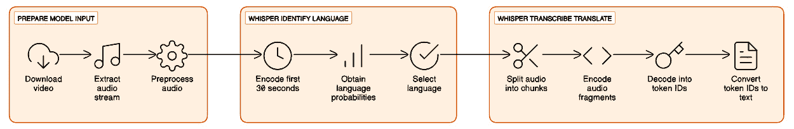

# 第六章：扩展 Whisper 的应用

本章将继续深入 OpenAI 的 Whisper 广泛应用领域。我们将探讨这项创新技术如何转变和提升各种应用，从精确的转录到跨多个语言和平台创建可访问且可搜索的内容。我们将探索如何在不同语言环境中实现高转录准确度，如何将 Whisper 与 YouTube 等平台集成以处理多语言内容，并使用**OpenVINO**等工具优化 ASR 模型部署。本章还将介绍如何利用 Whisper 将音频和视频内容转化为可搜索的文本，并与**FeedParser**结合使用，以便转录播客内容，提升 SEO 效果。通过实践示例和 Python 笔记本，你将获得实际经验，学习如何利用 Whisper 的功能克服自动语音识别中的挑战，并使多媒体内容更易访问且具有全球观众的吸引力。

本章将涵盖以下主要内容：

+   精确转录

+   提升与 Whisper 的互动和学习

+   优化环境以部署基于 Whisper 的 ASR 解决方案

这些部分旨在为你提供全面的理解和实际技能，帮助你在各种环境中有效地使用 Whisper，提高数字内容的价值和影响力。

到本章结束时，你将获得实践经验，并深入了解如何利用 Whisper 的功能解决来自音频和视频服务的自动转录挑战，同时处理多语言内容。你将学习如何将 Whisper 与 YouTube 等平台集成，并利用转录功能进行 SEO 优化，使你的内容更易被发现和更具吸引力。

# 技术要求

为了充分利用 OpenAI 的 Whisper 进行高级应用，本章将结合 Python、OpenVINO1（用于优化模型性能）以及 Google Colab（便于使用和访问）来讲解。Python 环境的设置包括 Whisper 库用于转录和翻译任务，OpenVINO 用于提升模型推理速度，以及其他特定应用的库，如 PyTube 和 FeedParser。

1 OpenVINO 是英特尔公司拥有的商标。

**关键要求**：

+   **Python 环境**：确保已安装 Whisper 和 OpenVINO。OpenVINO 对于优化 Whisper 在不同硬件上的性能至关重要。

+   **Google Colab 笔记本**：使用本书 GitHub 仓库中提供的 Google Colab 笔记本。这些笔记本已设置为运行我们的 Python 代码，所需的内存和容量最小。如果可用，选择**T4 GPU**运行时类型，以获得更好的性能。

+   **GitHub 仓库访问**：所有 Python 代码，包括集成 Whisper 与 OpenVINO 的示例，都可以在本章的 GitHub 仓库中找到：([`github.com/PacktPublishing/Learn-OpenAI-Whisper/tree/main/Chapter06`](https://github.com/PacktPublishing/Learn-OpenAI-Whisper/tree/main/Chapter06))。这些 Colab 笔记本已经可以直接运行，提供了一种实用且动手实践的学习方式。

通过满足这些技术要求，读者将为探索多语言转录、提升内容可发现性以及高效部署基于 Whisper 的自动语音识别（ASR）解决方案做好准备，同时享受 Google Colab 提供的简化体验和 GitHub 上提供的丰富资源。

在打下技术基础并准备好工具后，我们将转向深入探索 Whisper 的核心功能。精准转录是我们的下一个目标，我们将深入探讨如何在多语言和方言之间实现高准确度的转录。这一部分将是一次充实的旅程，旨在完善转录艺术，充分发挥 Whisper 的先进技术潜力。

# 精准转录

在本节中，我们将把 OpenAI 的 Whisper 的实用性提升到新的高度，展示它在处理各种语言挑战方面的多样性和强大能力。本部分将引导你了解如何利用 Whisper 进行转录，并真正理解和解读多语言内容，确保出色的准确性。从方言的细微差别到不同语言的节奏，Whisper 在转录方面的高效性为解锁内容的全球潜力提供了门户。

我们首先探索如何利用 Whisper 进行多语言转录。我们演示了 Whisper 的复杂算法如何应对多语言的复杂性，确保你的转录准确且在文化和语境上相关。这一点尤为重要，因为我们生活在一个以多样性和包容性为基础的世界中。

接下来，我们将把重点转向为提升内容可发现性而进行的索引处理。在这个数字化时代，信息的可访问性至关重要，而 Whisper 提供了一种创新的方法，使音频和视频内容能够被搜索。通过将口语转录为文本，Whisper 扩大了内容的传播范围，并增强了其在互联网上的可见性和互动性。

最后，我们将使用 FeedParser 和 Whisper 创建可搜索的文本。本节内容阐明了从 RSS 源中检索音频内容并将其转化为可搜索文本之间的协同作用，从而显著提升 SEO 和内容营销效果。通过实际示例和动手实践，你将学会如何利用这些工具扩大内容的数字足迹，使其更易被发现，并为更广泛的受众提供访问。

## 利用 Whisper 进行多语言转录

在全球沟通的丰富多彩的画卷中，我们无缝过渡到为多种语言配置 Whisper 的实际操作。这一步至关重要，是理论与实践的结合，使 Whisper 能轻松跨越语言障碍。在这里，我们将学习如何配置 Whisper，确保它成为你工具库中捕捉人类语言多样性的多功能工具。这一基础将为进一步探索 Whisper 在多语种环境中理解并准确转录内容的能力铺平道路。

### 为不同语言设置 Whisper

Whisper 支持多种语言，包括但不限于英语、印地语、西班牙语等。要为不同语言设置 Whisper，你可以使用 Whisper API，提供两个端点：转录和翻译。

对于仅支持英语的模型，可以手动将语言设置为 `en`（英语）。然而，多语种模型可以自动检测语言。可以使用命令 `whisper.load_model("base")` 加载 Whisper 模型，音频的语言可以通过 `model.detect_language(mel)` 方法检测。

比如，如果你想转录一份西班牙语的音频文件，你可以在进行转录时指定语言：`whisper japanese.wav --``language Spanish`。

在本书的 GitHub 仓库中 ([`github.com/PacktPublishing/Learn-OpenAI-Whisper/tree/main/Chapter06`](https://github.com/PacktPublishing/Learn-OpenAI-Whisper/tree/main/Chapter06))，你会找到一个名为 `LOAIW_ch06_1_Transcripting_translating_YouTube_with_Whisper.ipynb` 的笔记本 ([`github.com/PacktPublishing/Learn-OpenAI-Whisper/blob/main/Chapter06/LOAIW_ch06_1_Transcripting_translating_YouTube_with_Whisper.ipynb`](https://github.com/PacktPublishing/Learn-OpenAI-Whisper/blob/main/Chapter06/LOAIW_ch06_1_Transcripting_translating_YouTube_with_Whisper.ipynb))，其中包含了转录和翻译音频文件的示例。以下是来自该笔记本的代码片段，展示了如何使用 Whisper 进行语言检测，而不进行转录：

```py

Import whisper
import torch
model = whisper.load_model("small")
audio = whisper.load_audio(source_audio)
audio = whisper.pad_or_trim(audio)
mel = whisper.log_mel_spectrogram(audio).to(model.device)
# detect the spoken language
_, probs = model.detect_language(mel)
audio_lang = max(probs, key=probs.get)
print(f"Detected language: {audio_lang}")
```

下面是代码的逐步讲解，帮助我们更好地理解基础设置和交付流程：

1.  `whisper` 模块，包含 Whisper 模型、相关函数，以及用于处理张量的 `torch` 库（`PyTorch`）。

1.  `whisper.load_model("small")` 函数加载 Whisper 模型的 `"small"` 版本。Whisper 提供了不同的模型大小，`"small"` 模型是性能和资源使用之间的权衡。

1.  `whisper.load_audio(source_audio)` 函数加载由 `source_audio` 指定的音频文件。然后，使用 `whisper.pad_or_trim(audio)` 对音频进行填充或裁剪，以适应合适的长度。

1.  `whisper.log_mel_spectrogram(audio)` 函数将音频转换为对数 Mel 频谱图，这是 Whisper 模型用作输入的时频表示。然后，使用 `.to(model.device)` 将频谱图移到与模型相同的设备上，以确保兼容性。

1.  `model.detect_language(mel)` 函数用于检测音频中所说的语言。该函数返回一个元组，其中第二个元素是一个字典类型的对象，包含不同语言的概率值。`max(probs, key=probs.get)` 表达式用来找到概率最高的语言，假设它就是音频中所说的语言。

1.  **输出**：最后，检测到的语言将被打印出来。

通过回顾并在 *第四章* 中获得的见解，*针对特定领域和语言的微调 Whisper*，我们确定了微调 Whisper 提供了一种定制的方法，旨在解决特定口音和方言的细微挑战。这种定制使 Whisper 能够适应地区性语音模式的独特语音和节奏特征，从而提高转录准确性。在进入下一小节时，必须记住，微调不仅仅是一种策略，而是那些希望提升 Whisper 在多样化语言环境中表现的用户所必须采取的步骤。本节将深入探讨微调 Whisper 的实际操作和优势，确保它能满足您转录任务的具体需求。

### 克服口音和方言的挑战

像 Whisper 这样的 ASR 系统面临着理解和转录各种口音和方言的复杂任务。这些语音模式的变化由于其独特的发音、语调和重音模式而构成了显著的挑战。然而，Whisper 配备了处理这种多样性的能力，这得益于它在庞大的数据集上的广泛训练，涵盖了各种语言的细微差别。

正如我们在 *第四章* 中学到的，*针对特定领域和语言的微调 Whisper*，微调 Whisper 以适应特定的口音和方言需要采取量身定制的方法，考虑到地区性语音模式的独特语音和节奏特征。这种定制对于提高转录准确性至关重要，因为它使 Whisper 能够适应不同语言和方言的语音特征中的微小变化。

要微调 Whisper，必须深入研究目标口音或方言的语言细节。这涉及分析和理解定义口音的三个基本元素：**语调**、**节奏**和**重音模式**。

语调指的是讲话时声音的升降；节奏指的是声音和静默的模式，重音模式则表明某些音节或单词的强调。通过理解这些元素，可以调整 Whisper 的转录参数，更好地捕捉口语的本质。

例如，某种特定的方言可能有独特的语调模式，而 Whisper 的通用模型可能无法准确识别。通过对模型进行微调，使其适应这一特定的语调模式，Whisper 可以学习到这些细微差别，从而提高转录的准确性。同样，理解方言的节奏和重音模式，可以帮助 Whisper 区分不同方言中可能发音不同的同音词，从而减少转录错误。

微调可能需要通过精心策划的数据集来重新训练 Whisper，该数据集能显著代表目标口音或方言。该数据集应包含各种语音样本，捕捉方言中所有语言特征的全貌。通过将 Whisper 暴露于这种定向训练，模型可以更精确地识别和转录该方言。

此外，针对口音和方言对 Whisper 进行微调，不仅仅是提高单词识别率；它还涉及理解单词被说出的语境。口音和方言可以影响语言所传达的意义，微调后的 Whisper 模型可以更好地解读单词背后的意图。

在实践中，针对特定口音或方言对 Whisper 进行微调可能涉及以下步骤：

1.  **数据收集**：收集一个全面的音频录音数据集，准确地代表目标口音或方言

1.  **模型训练**：使用该数据集重新训练或调整 Whisper 的现有模型，重点关注口音或方言的独特特征

1.  **参数调整**：修改 Whisper 的解码参数，如语言和语音模型，以更好地适应目标语音模式

1.  **测试和评估**：在单独的验证集上评估微调后的模型表现，以确保目标口音或方言的转录准确性得到提升

1.  **迭代优化**：通过整合反馈和额外数据，持续优化模型，以进一步提高其准确性

通过采用这种量身定制的方法，Whisper 成为一个更强大的转录工具，能够从音频中提供准确可靠的文本，覆盖更广泛的语言和方言范围。这提升了与 ASR 系统交互的用户体验，并为在全球多元文化环境中应用语音识别技术开辟了新的可能性。

在深入探讨如何微调 Whisper，以巧妙应对各种口音和方言的挑战之后，我们现在将注意力转向旅程中的下一个重要步骤。将 **PyTube** 与 Whisper 集成进行多语言转录，为将 Whisper 的转录能力扩展到 YouTube 内容的广阔宝库提供了创新的路径。这一集成不仅拓宽了可访问信息的范围，还增强了多语言转录工作的丰富性。

### 将 PyTube 与 Whisper 集成进行多语言转录

YouTube 在数字内容生态系统中的重要性不容小觑。作为全球第二大搜索引擎和领先的视频内容平台，YouTube 是内容创作者接触广泛、不同观众的关键渠道。该平台承载了从教育讲座、操作指南到娱乐节目和公司通讯等各类内容。然而，内容的价值不仅仅体现在其视觉和听觉的吸引力上；视频中的口语内容是一个宝贵的信息宝库，一旦被转录，就能提高其可发现性和可访问性。

对 YouTube 视频进行转录有多重目的。它将视听内容转化为文本，使搜索引擎可以对其进行索引。这样的文本格式允许用户通过关键词搜索定位到特定内容，而光靠音频和视频是无法做到的。此外，转录文本还可以用于生成字幕和闭路字幕，进一步扩大内容的覆盖范围，帮助非母语观众和听力障碍人士获取信息。

要转录 YouTube 内容，首先必须提取音频。这时，Python 库 PyTube 就成为了一个至关重要的工具。PyTube 使得下载 YouTube 视频成为可能，为转录提供所需的原始音频。在本书的 GitHub 仓库中，你会找到名为 `LOAIW_ch06_1_Transcripting_translating_YouTube_with_Whisper.ipynb` 的笔记本 ([`github.com/PacktPublishing/Learn-OpenAI-Whisper/blob/main/Chapter06/LOAIW_ch06_1_Transcripting_translating_YouTube_with_Whisper.ipynb`](https://github.com/PacktPublishing/Learn-OpenAI-Whisper/blob/main/Chapter06/LOAIW_ch06_1_Transcripting_translating_YouTube_with_Whisper.ipynb))，其中包含了一个实用的、基础的 Python 代码示例，展示了如何使用 PyTube 下载 YouTube 视频的音频。以下是关键代码片段：

```py

import re
from pytube import YouTube
video_url = "<Place video URL here>" #@param {type:"string"}
drive_folder = "" #@param {type:"string"}
yt = YouTube(video_url)
episode_date = yt.publish_date.strftime('%Y%m%d-')
source_audio = drive_folder + episode_date + (re.sub('[^A-Za-z0-9 ]+', '', yt.title).replace(' ', '_')) + ".mp4"
audio_file = YouTube(video_url).streams.filter(only_audio=True).first().download(filename=source_audio)
print(f"Downloaded '{source_audio}")
```

这段代码片段实现了多个任务：

+   导入必要的 `"pytube"` 库，以便与 YouTube 内容进行交互

+   定义要下载的 YouTube 视频的 URL

+   根据视频的标题和发布日期创建下载音频的文件名，确保文件管理方法系统化

+   下载指定 YouTube 视频的音频流，使其可供转录使用

一旦获得音频，就可以使用 Whisper 进行转录。Whisper 能够处理各种语言和方言，使其成为转录 YouTube 多样化内容的理想工具。转录后的文本可以创建可搜索的索引，提高内容在搜索引擎中的可见性，并增强 YouTube 搜索算法中的曝光度。

转录文本不仅对索引有益，而且对 SEO 和内容营销策略也有帮助。从转录文本中提取的关键词可以用于优化网页、博客文章和社交媒体更新，从而提升内容在搜索引擎中的排名。此外，转录后的文本还可以重新用于不同的格式，如文章、信息图表和电子书，扩展内容的传播范围和互动潜力。

YouTube、PyTube 和 Whisper 之间的协同作用，代表了内容可发现性的未来的一个实际示例。随着视频内容继续主导数字领域，将这些内容转化为可搜索的文本将变得越来越重要。这个过程不仅通过提高内容的可访问性来增强用户体验，还为内容创作者提供了强大的工具，帮助他们优化内容以便搜索引擎抓取，并接触到更广泛的受众。

随着我们从 PyTube 与 Whisper 创新的整合中向前迈进，提升我们的多语言转录工具包，我们将注意力转向加强转录内容的可见性和可访问性。为提高可发现性而对内容进行索引，成为了一项关键策略，架起了未被充分利用的音频资源和可搜索的网络生态系统之间的桥梁。接下来的部分将指导我们优化转录内容，确保它被听到、轻松找到，并且能够被全球受众参与。

## 为提高可发现性而对内容进行索引

在这个时代，我们都面临着一个重大挑战：海量的在线内容令人震惊。为了在这片信息的浩瀚海洋中航行，搜索引擎使用了一种叫做索引的过程。索引是搜索引擎收集、评估和组织海量互联网信息的方式，包括网页、文档、图像、视频和其他类型的内容。这个过程使搜索引擎能够高效地检索并展示与用户查询相关的信息。其工作原理如下：

1.  **爬行**：搜索引擎部署了被称为爬虫或蜘蛛的机器人，用来发现互联网内容。这些机器人系统地浏览网页，按照链接从一个页面跳转到另一个页面。它们仔细检查每个 URL 的内容和代码，包括网页、图像、视频和 PDF 文件。

1.  **索引**：爬取之后，内容将被索引。这意味着爬虫发现的信息会存储并组织在一个庞大的数据库中，这个数据库被称为搜索引擎的索引。索引类似于一个巨大的在线文件管理系统，包含搜索引擎发现并认为值得提供给用户的每个网页和内容。

1.  **排名**：一旦内容被索引，它可以根据相关查询进行展示。搜索引擎通过相关性对这些内容进行排名，首先展示最相关的结果。排名涉及各种算法，考虑关键词、网站权威性和用户体验等因素。

网站管理员可以使用像**XML 网站地图**和**Google 搜索控制台**这样的工具来促进索引。XML 网站地图列出网站上的所有页面，并附上额外的详细信息，比如每个页面最后修改的时间。这些网站地图可以提交给搜索引擎，提醒它们内容的存在，并帮助爬虫理解网站结构。

搜索引擎根据“爬取预算”进行操作，即它们为爬取网站分配的资源。这个预算受到服务器速度和网站重要性等因素的影响。高价值、频繁更新内容的网站可能会比小型、不太重要的网站更频繁地被爬取。

索引过程还涉及使用倒排索引，这是一个包含指向包含这些元素的文档的指针的文本元素数据库。这个系统使得搜索引擎能够快速检索数据，而无需在单独的页面中查找关键词和主题。

搜索引擎的索引是一个复杂但至关重要的过程，涉及爬取网页以发现内容、存储内容、在索引中组织内容，然后对其进行排序，以向用户提供最相关的搜索结果。理解和优化这个过程是搜索引擎优化（SEO）的基础。

### 从音频和视频创建可搜索的文本

增强音频和视频内容可发现性的最有效方法之一是通过转录。转录是将语音转换为文本，使得无法搜索的语音变成可搜索的文本。转录本为搜索引擎提供了额外的数据用于索引，使其能够爬取音频或视频内容的完整文本。这可能会增加你的内容在自然搜索结果中的可见度。在你的视频内容中加入转录本，更有可能使其在搜索结果中排名更高，包括像 YouTube 这样的 платформ。

转录本还可以针对特定关键词进行优化，提升目标受众发现你内容的可能性。这一过程不仅使你的内容对更广泛的观众（包括聋人或听力受损者）更具可访问性，而且还使搜索引擎能够索引音频和视频文件的内容。

自动化和人工转录服务都可以将音频和视频内容转换为文本。这些服务可以处理各种类型的内容，从播客和访谈到讲座和商业通讯。一旦转录完成，搜索引擎便可以对这些文本进行索引，从而使您的音频和视频内容通过基于文本的搜索被发现。

### 利用转录进行 SEO 和内容营销

转录不仅能让您的内容更具可访问性和可搜索性；它还可以显著提升您的 SEO 和内容营销效果。在转录中加入关键词可以提升您内容在搜索引擎上的可见性。转录内容还可以被重新加工成其他形式的内容，如博客文章、案例研究和信息图表，从而进一步增强您的内容营销策略。

转录在内容营销中也扮演着至关重要的角色，通过提升客户互动和覆盖面。发布您的音频和视频内容的转录本，让观众能够将您的内容翻译成他们的语言，从而覆盖更广泛的受众。

此外，转录本还可以帮助满足偏好阅读文本的用户以及有听力障碍的用户，使您的内容更加包容和可访问。这种包容性提高了用户体验，并扩大了您的受众覆盖范围，可能带来更多的网页流量和更高的搜索排名。

为了提高可发现性，内容的索引化是数字内容策略中的关键方面。通过有效地对您的内容进行索引，并利用音频和视频内容的转录，您可以显著提高内容的可见性，接触到更广泛的受众，并增强您的 SEO 和内容营销效果。随着数字环境的不断发展，这些策略将继续是那些希望最大化在线存在并取得可衡量商业成果的企业的核心要素。

在探索了利用转录进行 SEO 和内容营销的重要性之后，我们的下一个目标是创建可搜索的文本，旨在通过使用播客内容作为基础示例，充分挖掘 Whisper 的潜力。这一创新的结合简化了将口语转化为已编制索引的文本的过程，并为在数字平台上提高内容的可发现性和互动性开辟了新途径。

## 利用 FeedParser 和 Whisper 创建可搜索的文本

FeedParser 和 Whisper 的结合在从音频和视频中创建可搜索的文本方面具有高度相关性，尤其是对于通过 RSS 订阅分发的内容，如播客。FeedParser 是一个 Python 库，可以轻松下载和解析联合订阅的源，包括**RSS**、**Atom**和**RDF**源。它在自动化音频内容从各种渠道的获取中起着重要作用，随后可以进行转录处理。

当 FeedParser 和 Whisper 结合使用时，能够实现一个简化的流程，将 RSS 订阅源中的音频内容自动获取、下载并转录为文本。该文本随后可以被搜索引擎索引，从而提升内容的可发现性。例如，一集本来无法被搜索引擎访问的播客节目，可以通过 FeedParser 下载，再由 Whisper 转录成文本，使得该集播客的内容可以通过音频中提到的关键词和短语进行搜索。这个过程不仅让内容对更广泛的受众更加可及，同时也便于与数字图书馆和内容管理系统更好地集成，后者的可搜索性至关重要。

由 Whisper 生成的转录文本，结合 FeedParser 提取的音频内容，对于 SEO 和内容营销工作有极大的帮助。具体如下：

+   **关键词优化**：转录的文本提供了丰富的相关关键词来源。这些关键词可以战略性地用于优化网页、博客文章和其他内容的搜索引擎排名。通过在元标签、描述以及内容本身中加入这些关键词，可以提高相关内容的 SEO 排名，使其更容易被正在搜索相关话题的用户发现。

+   **内容再利用**：转录的文本可以作为创建额外内容格式的基础。例如，播客中的关键见解可以转化为博客文章、信息图表，甚至一系列社交媒体帖子。这延长了原始内容的生命周期，并满足了不同受众的偏好，从而增加了整体的覆盖范围和互动性。

+   **增强用户体验**：在音频和视频内容旁提供转录文本，通过迎合不同的消费偏好来改善用户体验。有些用户可能更喜欢阅读而非听内容，转录文本让这一点成为可能。此外，转录文本使得内容对听障或有听力障碍的用户更具可及性，从而扩大潜在的受众群体。

+   **链接建设**：转录文本可以创造更多的内部和外部链接机会，这是 SEO 中的一个关键因素。通过在转录中链接相关的文章、资源和其他播客，内容创作者可以建立一个更加互联的网络存在，这也是搜索引擎所青睐的。

+   **分析与洞察**：转录文本使得更详细的内容分析成为可能，这有助于制定 SEO 和内容营销策略。通过分析转录内容，创作者可以洞察与受众产生共鸣的主题、话题和语言，并据此调整内容策略。

使用 FeedParser 从 RSS 订阅源提取音频并通过 Whisper 进行处理的基础示例，可以扩展到许多行业的商业案例中。例如，这种方法可以在媒体和娱乐行业中用于转录和索引大量的视听内容，使其可以被搜索，并开辟新的盈利渠道。在客户服务领域，转录并分析客户电话可以提高服务质量和客户满意度。

此外，在市场调研和竞争分析中，转录播客和行业讲座可以提供关于市场趋势和竞争对手策略的及时洞察。在法律和合规领域，能够转录并搜索数小时的法律程序和监管会议记录，可以简化工作流程并确保遵守法规。

通过建立一个系统化的音频内容提取和转录过程，企业可以构建一个强大的框架，适应其他各种数据源，例如视频流、网络研讨会和实时通信。这将提升现有内容的可发现性，并帮助组织准备好利用新兴数据流的潜力。

FeedParser 和 Whisper 的整合是 AI 和机器学习如何应用于解决现实商业挑战的一个典型例子。通过利用这些技术，企业可以构建一个可扩展和灵活的基础设施，适应不断变化的数字化环境，在信息驱动的经济中提供竞争优势。

现在，让我们通过一个实用的 Python 笔记本，增强我们的技术专长，演示 FeedParser 的实际应用！

### 将 FeedParser 和 Whisper 集成进行文本转录

该笔记本`LOAIW_ch06` `_2_Transcripting_translating_RSS_with_Whisper.ipynb` ([`github.com/PacktPublishing/Learn-OpenAI-Whisper/blob/main/Chapter06/LOAIW_ch06_2_Transcripting_translating_RSS_with_Whisper.ipynb`](https://github.com/PacktPublishing/Learn-OpenAI-Whisper/blob/main/Chapter06/LOAIW_ch06_2_Transcripting_translating_RSS_with_Whisper.ipynb))旨在弥合播客节目中锁定的大量知识与文本所提供的可访问性和分析潜力之间的差距。播客作为一种媒介，在过去几年里迅速普及，成为全球听众信息、娱乐和教育的丰富来源。然而，尽管播客的影响力不断扩大，但将内容转换为文本形式——这对于可访问性、可搜索性和进一步分析至关重要——仍然是一个挑战。这正是转录技术发挥作用的地方。

从 RSS 源中获取播客剧集——一种用于发布定期更新内容的标准联合格式——展示了如何自动化转录。这不仅让播客内容更具可访问性，还为内容创作者、研究人员和教育工作者提供了利用口语内容的全新途径。

通过结合 Python 编程，本笔记本将引导你完成安装必要的库、解析 RSS 源以列出可用的播客剧集、下载音频文件，并使用 Whisper 进行转录。这个过程展示了如何将不同技术整合，形成从音频到文本的无缝工作流：

1.  **设置** **环境**

    环境设置包括安装在笔记本中将使用的必要 Python 库和系统工具：

    ```py

    !pip install -q cohere openai tiktoken
    !apt-get install ffmpeg
    !pip install -q "git+https://github.com/openai/whisper.git"
    cohere, openai, tiktoken, ffmpeg, and whisper. Here’s what the following commands are doing:*   `feedparser`: This library is specifically designed for parsing RSS and Atom feeds. It simplifies working with feed data, such as extracting podcast information. Its role in the notebook is to parse the RSS feed provided by the user, enabling the extraction of details about the podcast episodes available for download and transcription.*   `requests`: A fundamental library for making HTTP requests in Python. It’s used in the notebook to download audio files from the URLs specified in the podcast’s RSS feed. The simplicity and flexibility of requests make it a go-to choice for web scraping tasks, API interactions, and downloading files over HTTP.
    ```

1.  **导入库**

    一旦环境设置完成，下一步是导入笔记本中使用的 Python 库：

    ```py

    import feedparser
    import requests
    import os
    import time
    from urllib.parse import urlparse
    import subprocess
    import re
    ```

    我们已经在前一部分了解了大部分这些库。让我们来看一下首次出现的库：

    +   `os`：这是一个标准 Python 库，用于与操作系统进行交互。它用于文件路径操作和环境变量访问，确保笔记本能够保存文件、浏览目录等。

    +   `time`：一个标准的 Python 库，这里用于处理与时间相关的任务。它可以包括在请求之间添加延迟，以避免过度负载服务器，或对操作进行计时以进行性能分析。

    +   `urlparse`：Python 标准库的一部分，用于解析 URL。`urlparse` 帮助拆解 URL 组件，这在从播客的 URL 中提取信息或确保 URL 格式正确后再进行请求时非常有用。

    +   `subprocess`：这个模块允许你生成新进程、连接它们的输入/输出/错误管道，并获取它们的返回码。笔记本调用外部命令，如 `ffmpeg`，来处理音频文件。

    +   `re`：这是 `requests` 库的简称。

    这些库共同构成了笔记本的核心，使其能够处理网页内容、处理音频文件，并高效地与文件系统和外部进程交互。这个准备工作对于顺利执行从解析 RSS 源到转录音频内容的后续任务至关重要。

1.  `list_episodes()` 帮助用户浏览播客系列中的可用内容，而 `download_episode()` 提供了访问特定剧集原始音频的方式。`download_episode_start_end()` 函数提供了更精细的下载内容的方法。让我们简要探讨一下笔记本中定义的三个函数：

    +   `list_episodes()`：此函数旨在解析给定的 RSS 源 URL，并列出所有可用的播客集。它系统地提取并整理每集的关键信息，如标题、URL（通常指向音频文件）和发布日期。以下是该函数的 Python 代码定义：

        ```py

        def list_episodes(feed_url):
            d = feedparser.parse(feed_url)
            episodes = []
            for entry in d.entries:
                title = entry.title
                published = time.strftime('%Y%m%d', time.gmtime(time.mktime(entry.published_parsed)))
                url = None
                for link in entry.links:
                    if link.type == "audio/mpeg":
                        url = link.href
                        break
                if url:
                    episodes.append((title, url, published))
            return episodes
        ```

    此函数作为用户查看播客系列内容的工具，使用户能够选择特定的集进行下载和转录。

    +   `download_episode()`：此函数用于下载特定的播客集。它需要输入播客集的 URL（通常从 `list_episodes()` 获取），并将音频文件保存到用户系统中的指定位置。以下是该函数的 Python 代码定义：

        ```py
        from urllib.parse import urlparse
        def download_episode(url, filename=None):
            # If a custom filename is provided, append the appropriate extension from the URL
            if filename:
                parsed_url = urlparse(url)
                # Extract only the base path without any query parameters
                base_path = os.path.basename(parsed_url.path)
                ext = os.path.splitext(base_path)[1]
                filename += ext
            else:
                filename = os.path.basename(parsed_url.path)
            response = requests.get(url, stream=True)
            response.raise_for_status()
            with open(filename, 'wb') as f:
                for chunk in response.iter_content(chunk_size=8192):
                    f.write(chunk)
            return filename
        ```

    此函数对于获取转录所需的原始音频数据至关重要。它确保用户能够直接访问感兴趣的内容并为进一步处理做好准备，例如使用 Whisper 进行转录。

    +   `download_episode_start_end()`：此函数是 `download_episode()` 的一个变种，具有额外的功能。它允许通过从给定的 URL 下载播客集并裁剪出从 `start_at` 秒到 `end_at` 秒的时间段来提取特定的时间片段。以下是该函数的 Python 代码定义：

        ```py
        def download_episode_start_end(url, filename=None, start_at=0, end_at=None):
            parsed_url = urlparse(url)
            if filename:
                # Ensure the filename has the correct extension
                ext = os.path.splitext(parsed_url.path)[1]
                filename += ext
            else:
                filename = os.path.basename(parsed_url.path)
            # Download the file
            response = requests.get(url, stream=True)
            response.raise_for_status()
            temp_filename = "temp_" + filename
            with open(temp_filename, 'wb') as f:
                for chunk in response.iter_content(chunk_size=8192):
                    f.write(chunk)
            # Use ffmpeg to trim the audio file
            trimmed_filename = "trimmed_" + filename
            command = ['ffmpeg', '-y', '-i', temp_filename, '-ss', str(start_at)]
            if end_at is not None and end_at != 0:
                command.extend(['-to', str(end_at)])
            command.extend(['-c', 'copy', trimmed_filename])
            subprocess.run(command, stdout=subprocess.PIPE, stderr=subprocess.PIPE)
            # Remove the original downloaded file
            os.remove(temp_filename)
            return trimmed_filename
        ```

    以下是输入参数的详细说明：

    +   `url`：播客集的 URL。

    +   `filename`：保存播客的期望文件名。如果未提供，它将使用 URL 的最后一部分。

    +   `start_at`：音频应从哪一秒开始裁剪的起始时间。

    +   `end_at`：音频应该裁剪到的结束时间（以秒为单位）。如果未提供或设置为 0，音频将裁剪到结束位置。

    在笔记本和实际演示中，`download_episode_start_end()` 函数允许我们处理音频文件的较小样本；在某些情况下，赞助商相关的内容对我们的学习和实验并不重要。这对于转录某一集的特定片段而非整个内容特别有用，能节省时间和计算资源。例如，如果播客每个片段的前 30 秒总是包含赞助广告，该函数可以直接下载其余部分的内容。

1.  **选择 RSS 源播客**

    然后，笔记本指定了播客的 RSS 源 URL 和要列出的集数。将此 URL 替换为您感兴趣的任何播客源：

    ```py

    # Gigantes Podcast Spanish
    podcast = '<Place RSS URL Here>'
    d = feedparser.parse(podcast)
    print(f"Podcast name:", d.feed.title)
    print(f"Number of episodes:", len(d.entries))
    # List episodes
    episodes = list_episodes(podcast)
    # Print the first ten episodes
    print("Episodes:")
    for idx, (title, url, published) in enumerate(episodes, 1):
        print(f"{idx}. {published}-{title}")
        if idx == 10:
            break
    ```

1.  **选择并下载** **一集**

    接下来，笔记本提示用户从源中选择一集并进行下载。用户设置该集的编号，相关的音频文件将被获取：

    ```py

    episode_num = 5 #@param {type:"integer"}
    drive_folder = "" #@param {type:"string"}
    start_at_seconds = 1300 #@param {type:"integer"}
    end_at_seconds = 0 #@param {type:"integer"}
    title, url, published = episodes[episode_num - 1]
    custom_filename = published + '-' + (re.sub('[^A-Za-z0-9 ]+', '', title[:75]).replace(' ', '_'))
    # Download the selected episode
    audio_file = download_episode_start_end(url, drive_folder + custom_filename, start_at_seconds, end_at_seconds) print(f"Downloaded '{title}' as {audio_file}.")
    ```

1.  **显示音频小部件**

    为了提供友好的用户界面，笔记本中显示了一个音频小部件，可以直接播放下载的播客集：

    ```py

    import ipywidgets as widgets
    widgets.Audio.from_file(audio_file, autoplay=False, loop=False)
    ```

1.  **使用 Whisper 转录**

    最后，笔记本展示了如何使用 Whisper 来转录下载的播客集：

    ```py

    import whisper
    import torch
    # NLTK helps to split the transcription sentence by sentence
    import nltk
    nltk.download('punkt')
    from nltk import sent_tokenize
    model = whisper.load_model("small")
    audio = whisper.load_audio(audio_file)
    audio = whisper.pad_or_trim(audio)
    # make log-Mel spectrogram and move to the same device as the model
    mel = whisper.log_mel_spectrogram(audio).to(model.device)
    # detect the spoken language
    _, probs = model.detect_language(mel)
    audio_lang = max(probs, key=probs.get)
    print(f"Detected language: {audio_lang}")
    # decode the audio
    options = whisper.DecodingOptions(fp16=torch.cuda.is_available(), language=audio_lang, task='transcribe')
    result = whisper.decode(model, mel, options)
    # print the recognized text
    print("----\nTranscription from audio:")
    for sent in sent_tokenize(result.text):
      print(sent)
    # decode the audio
    options = whisper.DecodingOptions(fp16=torch.cuda.is_available(), language=audio_lang, task='translate')
    result = whisper.decode(model, mel, options)
    # print the recognized text
    print("----\nTranslation from audio:")
    for sent in sent_tokenize(result.text):
      print(sent)
    ```

我鼓励你运行 Google Colab 笔记本，提升其功能，并找到一个与行业相关的实际应用案例，借助这一基础知识，快速利用 Whisper 获得成功！

我们的下一步是深入探讨客户服务和教育平台，在这些领域，Whisper 的能力在转录准确性以及创造更加互动、响应和丰富的用户体验方面表现出色。

# 使用 Whisper 提升互动和学习

现在，我们将更深入地探讨如何将 Whisper 定制并整合到客户服务工具和语言学习平台中。在下一章节中，我们将探索一个动手操作的笔记本，展示如何利用 Whisper 尽可能地实现实时转录。同时，让我们简要提醒您在进行实时转录时使用 Whisper 的一些注意事项。

## 使用 Whisper 实现实时 ASR 的挑战

尽管 Whisper 提供了先进的语音识别能力，但其缺乏原生的实时转录支持，给开发者和组织带来了显著的挑战。然而，通过第三方优化、自定义实现以及利用第三方提供的 API，仍然可以将 Whisper 调整为适用于实时 ASR 应用程序。尽管这些解决方案也存在一定的挑战和成本，但它们为组织在实时场景中利用 Whisper 的强大功能提供了一条可行的路径。

部署 Whisper 用于实时自动语音识别（ASR）应用程序面临若干重大挑战，包括以下几点：

+   **缺乏原生实时支持**：Whisper 本质上是一个批量语音转文本模型，并未设计用于流式或实时转录。这一局限性对于需要即时转录的应用程序，如实时客户服务互动或直播语言翻译服务来说，是一个重大挑战。

+   **基础设施和运营成本**：运行 Whisper，特别是较大且更精确的模型，需大量基于 GPU 的计算资源，这可能会非常昂贵。组织需要准备投资必要的硬件或云服务，以支持 Whisper 的计算需求，而这些需求在大规模应用时可能会迅速增加。

+   **内部 AI 专业知识**：为了有效部署 Whisper，公司必须拥有一支内部的机器学习工程团队，能够在生产环境中操作、优化和支持 Whisper。这还包括开发 Whisper 本身不提供的附加 AI 功能，如说话人分离和**个人身份信息**（**PII**）遮蔽。

尽管存在这些挑战，组织仍然可以采取一些解决方案和变通方法，以便利用 Whisper 实现实时 ASR：

+   **分块与批处理**：Whisper 可以与分块算法一起使用，用于转录任意长度的音频样本，以处理较长的音频。然而，这并不是一种原生的实时解决方案。

+   **第三方 API 提供商**：几家公司已对 Whisper 进行了规模优化，解决了核心性能参数，并添加了高价值功能，如实时转录和语者分离。

+   **定制实现**：开发人员可以创建定制的解决方案，录制短音频片段并通过 Whisper 将其发送到服务器进行转录，从而模拟接近实时的体验。

在探讨了使用 Whisper 实施实时 ASR 的挑战之后，让我们回到主题，深入探讨这项技术如何彻底改变客户服务，改善互动，并提升整体客户体验。

## 在客户服务中实施 Whisper

强调实时转录领域的不断发展是至关重要的。Whisper 在客户服务中的集成不仅仅是技术创新，它还为组织创造了重要的机会，以提升服务质量，使每一次客户互动更加有影响力、个性化和高效。

在接下来的章节中，我们将探讨如何利用 Whisper 接近实时的转录能力定制客户回复，以及如何将这项技术与现有的客户服务工具无缝集成，以提升整体效率和效果。

### 使用接近实时转录定制回复

定制回复使其尽可能接近实时转录的能力可以显著提高客户服务质量。Whisper 在将口语转录为文本方面的高精度，使客户服务代表能够更加有效和高效地理解并解决客户问题。将转录能力从接近实时转变为**实时**的努力仍在不断发展，并迅速变化。这一进程具有潜在的重大影响：通过实时转录，客户互动过程中没有任何细节被遗漏，从而提供更加个性化和准确的回复。例如，Whisper 在处理各种语言任务方面的熟练程度，如其 API 文档中所强调的，使得能够转录来自不同语言和方言的客户查询，确保了客户服务的包容性和可访问性。

此外，将 Whisper 与客户服务平台集成可以自动化转录过程，缩短响应时间并提高整体效率。通过利用 Whisper 先进的语音识别能力，企业可以创建一个更加动态和响应迅速的客户服务环境，以满足全球客户的需求。

### 将 Whisper 与现有的客户服务工具集成

将 Whisper 与现有的客户服务工具集成可以简化操作并提升客户体验。在企业层面上，存在着展示这种集成潜力的需求，这将使得在聊天机器人和客户支持软件中能够识别和转录语音信息。目标是使这些集成能够促进语音和基于文本的互动之间的无缝过渡，从而帮助客户服务人员更高效地管理和回应查询。

这些集成最终将实现客户语音信息的自动转录并生成基于文本的响应，从而减少人工工作量并提高响应速度。

## 使用 Whisper 促进语言学习

Whisper 在语言学习平台中的集成可以彻底改变学习者接收反馈的方式。通过转录口语练习，Whisper 能够对发音、流利度和语言使用提供即时而准确的反馈。这种即时反馈机制对语言学习者至关重要，使他们能够迅速识别和纠正错误，从而加速学习过程。

Whisper 还可以被用来开发更具互动性和吸引力的语言学习体验。通过转录和分析口语，语言学习平台可以创建动态练习，适应学习者的熟练程度和学习风格。这种个性化的语言学习方法可以显著增强学习者的参与感和动力。此外，Whisper 处理多语言内容和大量音频文件的能力，使其成为创造多样化和包容性语言学习材料的理想工具，以满足全球受众的需求。

将 Whisper 集成到客户服务和语言学习平台中提供了许多提升用户互动和教育体验的机会。企业可以通过实时转录定制响应，并将 Whisper 与现有工具集成，从而彻底改变客户服务操作。类似地，通过即时反馈和互动体验来改善语言学习，可以显著提高学习成果。随着我们不断探索和扩展 Whisper 的功能，改变数字互动和学习体验的潜力是无限的。

如我们所见，Whisper 在客户服务和语言学习平台中的集成提供了巨大的潜力，能够提升用户互动和教育体验。然而，要充分实现这些 ASR 解决方案的好处，优化部署环境至关重要。在下一部分，我们将探讨如何通过优化部署环境来显著提高使用 Whisper 构建的 ASR 解决方案的性能、效率和可扩展性，从而确保企业和教育机构能够充分利用这项强大技术的潜力。

# 优化部署基于 Whisper 构建的 ASR 解决方案的环境

像 Whisper 这样的 ASR 解决方案的部署代表了人机交互的新前沿，展示了一个未来的可能性：技术以前所未有的准确性和效率理解并响应我们的需求。像 OpenAI 的 Whisper 这样的 ASR 系统可以通过提供更加自然和直观的人机沟通方式，革新各个行业。然而，这些系统在现实应用中的真正效能，往往依赖于一个关键方面，而这一点在开发的兴奋中常常被忽视：优化部署环境。

优化部署环境以运行像 Whisper 这样的 ASR 解决方案尤为重要。Whisper 本质上是一个最先进的 ASR 模型，利用深度学习将语音从音频准确转录成文本。尽管其功能令人印象深刻，但 Whisper 在实际操作中的性能和效率取决于其部署环境。这时，类似于优化深度学习模型在不同硬件上性能的工具所使用的优化原则变得至关重要。优化部署环境对 ASR 解决方案（如 Whisper）的整体性能、效率和可用性至关重要，原因如下：

+   **计算效率和资源利用率**：部署 ASR 解决方案时，计算效率是首要考虑因素之一。ASR 模型计算密集型，需要大量的处理能力来分析音频数据，并实时或接近实时地生成准确的转录文本。资源利用率低效可能导致瓶颈、增加运营成本，并且由于转录延迟或不准确，降低用户体验。优化部署环境能够确保 ASR 模型充分利用可用硬件，提升性能并减少延迟。

+   **可扩展性和灵活性**：优化部署环境的另一个关键方面是可扩展性。ASR 解决方案通常在需求可变的情况下部署，从移动设备上的个人用户到处理成千上万并发请求的企业级应用。优化的环境允许动态扩展，在需求波动时调整资源分配，而不影响性能。这种灵活性对维持服务质量和有效管理成本至关重要。

+   **能源效率与可持续性**：在今天这个日益关注环保的世界里，能源效率不仅仅是操作成本的问题，更是环境责任的问题。优化 ASR 解决方案的部署环境有助于通过最小化处理所需的能源消耗来推动可持续发展。这一点对于数据中心和基于云的服务尤为重要，因为计算任务的能源足迹已经成为一个日益严重的问题。通过确保像 Whisper 这样的 ASR 模型能够更加高效地运行，组织可以在提供高质量服务的同时减少碳足迹。

尽管某些优化技术的具体细节并未明确提及，但很明显，它们所体现的原则在实现这些好处方面起到了关键作用。这些技术有助于将深度学习模型适配到各种硬件架构，提高其性能和效率。通过采用如模型压缩、精度降低和硬件特定优化等技术，它们能够让 ASR 解决方案即使在较弱的设备上也能更快、更高效地运行。

这种优化方法不仅仅是关于逐步改进，而是关于释放 ASR 技术（如 Whisper）的全部潜力。通过确保这些模型能够在从高端服务器到边缘设备的广泛硬件上高效运行，我们可以扩大语音识别技术的可访问性和适用性。这种技术的民主化为创新应用铺平了道路，以前由于硬件限制，这些应用是无法想象的。

然而，实现这一愿景不仅仅需要先进的算法；它还要求对部署环境进行精心优化。在现实世界应用中部署如此复杂的模型，必须要有一个优化过的环境，以确保性能、效率和可扩展性。这就是**OpenVINO**发挥作用的地方，它作为一个免费的关键蓝图，帮助优化和部署自动语音识别（ASR）解决方案。

## 引入 OpenVINO

**OpenVINO**由英特尔开发，代表着**开放视觉推理和神经网络优化**。它是一个工具包，旨在加速应用程序和解决方案在各种英特尔硬件上的部署，优化性能。OpenVINO 通过为开发人员提供优化深度学习模型以进行推理的工具，尤其是在英特尔 CPU、GPU 和神经计算棒上的优化来实现这一点。这种优化包括模型压缩、精度降低和利用特定硬件加速。尽管如此，关键问题是，为什么要使用 OpenVINO 优化我们为 Whisper 部署的环境？原因如下：

+   **最大化计算效率**：作为高级自动语音识别（ASR）模型，Whisper 需要大量计算资源来处理音频数据并生成准确的转录。OpenVINO 优化这些模型，使其能够更高效地在现有硬件上运行，显著减少计算负载。这种效率对于实时或接近实时处理应用至关重要，延迟可能会降低用户体验。

+   **增强可扩展性**：在从个人移动设备到企业级系统等多样环境中部署 ASR 解决方案，需要可扩展性。OpenVINO 使 Whisper 模型能够动态调整以适应不同的需求，而不损失性能。这种可扩展性确保 ASR 解决方案能够有效处理高峰负载，这对于经历变化的使用模式的服务至关重要。

+   **扩展可访问性**：通过 OpenVINO 进行优化，改善性能，并使在更广泛设备上部署高级 ASR 解决方案如 Whisper 变得可行。通过降低运行 Whisper 等模型的硬件要求，OpenVINO 使得使用尖端语音识别技术在更广泛领域内成为可能。这种可访问性可以推动辅助技术等领域的创新，使数字服务更具包容性。

+   **简化部署流程**：OpenVINO 通过提供支持多种英特尔硬件的统一工具包来简化部署流程。这种流程优化对于希望在不同平台上部署 Whisper 的开发人员尤为有益，确保了一致的性能并减少了管理多个部署环境的复杂性。

OpenVINO 的开源性质是其吸引力和在部署 Whisper 等 ASR 解决方案中实用性的基石。作为英特尔的产品，OpenVINO 得到了全球公司支持的可靠性和创新。然而，它保持了开源项目的灵活性和协作精神。虽然我们不支持英特尔的商业性质，但要认识到 OpenVINO 为技术专业人士提供了一个强大且可靠的基础，使他们能够部署像 Whisper 这样的尖端 ASR 解决方案。工具包在 Apache License 版本 2.0 下的开源许可证允许高度灵活性和协作，使像我们这样的技术专业人士能够在不受单一供应商约束的情况下进行适应和创新。

工具包的全面文档、可用资源和示例证明了其可靠性和对开发成功的承诺。这些资源旨在指导我们优化和部署 AI 模型，确保即使是新手也能实现快速且成功的部署。作为全球公司英特尔的支持进一步增强了工具包的可信度，保证了持续的开发和维护。英特尔的支持不仅限于文档和示例。

OpenVINO 社区是一个充满活力的生态系统，开发者可以在其中互动、分享见解，并保持对最新进展的了解。

根据我的经验，OpenVINO 是那些希望高效部署 Whisper 或其他 ASR 模型的人的一个有吸引力的选择。它的开源特性，加上强大的文档、示例和英特尔的全球支持，为开发者提供了一个坚实的基础。然而，是否选择使用 OpenVINO 应该通过全面评估所有可用选项来做出决策，确保所选解决方案与项目的独特需求和目标相符。

在探索 OpenVINO 的实际示例实现之前，让我们先更好地理解 OpenVINO 如何利用其模型优化器使得像 Whisper 这样的模型在可用硬件上运行得更加高效。

## 应用 OpenVINO 模型优化器到 Whisper

**OpenVINO 模型优化器**旨在将来自流行框架（如 TensorFlow 和 PyTorch）的深度学习模型转换为优化后的**中间表示**（**IR**）格式。此 IR 格式专为在英特尔硬件平台（如 CPU、GPU 和 VPU）上进行高效推理而量身定制。通过将模型优化器应用于 Whisper 模型，我们可以显著加速其性能，减少内存占用，并能够在不牺牲性能的情况下动态调整以应对不同的需求。

那么，这个优化过程在后台是如何工作的呢？模型优化器执行几个重要步骤：

1.  **转换模型**：它首先将 Whisper 模型从原始格式（例如 PyTorch）转换为 OpenVINO 的 IR 格式。这涉及分析模型架构、提取参数，并将操作映射到 OpenVINO 支持的原语。

1.  **融合模型层**：优化器识别可以合并为单一操作的相邻层，从而减少整体计算开销。例如，连续的卷积层和激活层可以融合。

1.  **折叠常量**：它预计算常量表达式并直接将其嵌入到模型图中。这消除了推理过程中冗余的计算，从而节省了宝贵的处理时间。

1.  **剪枝**：优化器删除所有不对模型输出有贡献的节点或层，包括无效分支和未使用的操作，从而使得模型更加精简和高效。

1.  **量化**：它可以选择性地将模型的权重和激活从浮动点精度转换为更低精度的数据类型，如 INT8。此量化显著减少了内存带宽和存储需求，同时保持了可接受的准确性。

一旦 Whisper 模型经过这些优化步骤，它就可以通过 OpenVINO 的推理引擎进行部署。优化后的模型能够充分利用英特尔的硬件架构，利用指令集扩展和并行处理能力。

将 OpenVINO 模型优化器应用于 Whisper 模型的影响非常显著。它使得在资源受限的边缘设备上实现实时语音识别成为可能，为汽车、医疗保健和智能家居自动化等领域的智能语音界面开辟了新的可能性。

此外，优化后的模型可以通过后训练量化和剪枝进行微调，使开发者能够在准确性和效率之间为特定的应用场景找到完美的平衡。

作为一个实际例子，我们从运行 Google Colab 笔记本 `LOAIW_ch06_3_Creating_YouTube_subtitles_with_Whisper_and_OpenVINO.ipynb`（[`github.com/PacktPublishing/Learn-OpenAI-Whisper/blob/main/Chapter06/LOAIW_ch06_3_Creating_YouTube_subtitles_with_Whisper_and_OpenVINO.ipynb`](https://github.com/PacktPublishing/Learn-OpenAI-Whisper/blob/main/Chapter06/LOAIW_ch06_3_Creating_YouTube_subtitles_with_Whisper_and_OpenVINO.ipynb)）开始，探索 OpenVINO 并理解其基础功能。

## 使用 Whisper 和 OpenVINO 生成视频字幕

在这一部分，我们将带您通过一个交互式演示，测试以下转录流程：我们提供一个 YouTube 链接，并选择转录或翻译音频，并为该视频返回自动生成的字幕。当然，YouTube 已经实现了自动字幕、转录和翻译功能。我们并不是试图复制这些现有功能，而是通过这个实践演示来展示如何在视频中创建和嵌入字幕的技术细节。

首先，我们将导入 Python 库并安装诸如 OpenVINO、transformers 和 Whisper 等依赖项。这些库为处理 AI 模型和语音数据提供了基础。

接下来，我们加载一个预训练的 Whisper 模型。让我们从基础模型开始。然后，我们将使用 OpenVINO 的模型转换工具来优化这些模型，并将结果保存到磁盘，方便以后重用。这个过程会跟踪模型、冻结参数，并转换为 OpenVINO 高效的 IR 格式。

最后，我们将使用优化后的模型构建我们的转录管道，提取视频中的音频，通过 Whisper 的编码器和解码器模型生成文本，并将结果保存为**SubRip**（**SRT**）字幕文件。我们还可以在一步中将其翻译成英文！

在后台，笔记本会下载视频、分离音频、利用 Whisper 和 OpenVINO 进行快速语音识别，准备 SRT 文件，并可以在原视频上显示字幕。

### 理解先决条件

我们首先通过以下命令从 GitHub 仓库导入一个名为 `utils.py` 的辅助 Python 工具模块：

```py

!wget -nv "https://github.com/PacktPublishing/Learn-OpenAI-Whisper/raw/main/Chapter06/utils.py" -O utils.py
```

该模块包含我们稍后用于预处理和后处理的函数。接下来，我们安装关键的软件依赖项，以便能够处理 AI 模型和语音数据：

```py

%pip install -q cohere openai tiktoken
%pip install -q "openvino>=2023.1.0"
%pip install -q "python-ffmpeg<=1.0.16" moviepy transformers --extra-index-url https://download.pytorch.org/whl/cpu
%pip install -q "git+https://github.com/garywu007/pytube.git"
%pip install -q gradio
%pip install -q "openai-whisper==20231117" --extra-index-url https://download.pytorch.org/whl/cpu
```

以下是相关方面的更多细节：

+   `openvino` 模块和 `ov` 核心对象。

+   **Transformers**: 一个 Pytorch 库，包含如 Whisper 这样的架构，用于自然语言处理和语音任务。它提供可重用的模型实现。我们依赖它加载预训练的 Whisper 基础模型进行语音识别。

+   `python-ffmpeg` 用于处理视频输入/输出并从视频中提取音频流。这些音频数据成为我们 Whisper 流水线的输入。它还包含 `moviepy`，使得在 Python 中编辑和分析视频/音频变得更加简单。

+   **Whisper**: OpenAI 的语音识别模型包包含模型实现、分词、解码和音频转录的实用函数。这些是我们所需要的关键功能！

+   **Pytube**: 用于从 YouTube 链接下载视频。它填充了启动每次语音识别运行的初始视频文件。

+   **Gradio**: 这个程序为我们的互动演示创建了用户界面。它允许用户提供 YouTube URL，并通过网页浏览器选择翻译/转录选项。

通过预先处理导入和依赖项，我们为核心工作流铺平了道路。辅助工具也是一个关键要素；它们封装了可重用的逻辑，使我们的主代码可以专注于 Whisper 集成。

### 实例化 Whisper 模型

让我们深入到笔记本的核心部分，在那里我们实例化 Whisper 模型。正如我们已经确定的，Whisper 是一个基于变压器的编码器-解码器模型，擅长将音频频谱特征转换为一系列文本标记。这个过程从原始音频输入开始，通过特征提取器转化为 log-Mel 频谱图。然后，变压器编码器接管，编码频谱图并生成一系列编码器隐藏状态。最后，解码器根据之前的标记和编码器的隐藏状态进行自回归预测文本标记。

为了在我们的笔记本中实现这个模型，我们首先选择适合我们需求的模型大小。我们为本教程选择了 Whisper *基础* 模型，尽管我们列出的步骤同样适用于 Whisper 系列中的其他模型。通过使用一个名为 `model_id` 的 `widgets` 对象，我们呈现了一个下拉菜单，允许选择不同的模型大小，确保对各种用例的灵活性和定制：

```py

from whisper import _MODELS
import ipywidgets as widgets
model_id = widgets.Dropdown(
 options=list(_MODELS),
 value='base',
 description='Model:',
 disabled=False,
)
model_id
```

一旦选择了模型大小，我们就加载它并设置为评估模式。这是准备模型进行推理的关键步骤，确保它的表现与训练时一致：

```py

import whisper
model = whisper.load_model(model_id.value, "cpu")
model.eval()
pass
```

随着我们的进展，我们将把 Whisper 的编码器和解码器转换为 OpenVINO IR，确保我们的模型能够进行高性能推理。正如我们在之前介绍的 OpenVINO IR 框架中提到的那样，IR 专为在 Intel 硬件平台（如 CPU、GPU 和 VPU）上进行高效推理而设计。通过应用 Model Optimizer 到 Whisper 模型，我们可以显著加速其性能、减少内存占用，并根据不同需求动态调整而不影响性能。这个转换过程不仅是技术上的必要性，也是在一个强大的预训练模型和可部署解决方案之间搭建桥梁的转型步骤。

在接下来的步骤中，我们将继续优化我们的管道，并准备进行转录过程。我们将选择推理设备，运行视频转录管道，并在为我们选择的视频生成字幕时见证我们的努力成果。

### 将模型转换为 OpenVINO IR 格式

笔记本中的下一部分是关于将 Whisper 模型转换为 OpenVINO IR 格式，以便与 OpenVINO 一起实现最佳性能。这个过程涉及将 Whisper 模型的编码器和解码器部分进行转换。转换过程从编码器开始：

```py

mel = torch.zeros((1, 80 if 'v3' not in model_id.value else 128, 3000))
audio_features = model.encoder(mel)
if not WHISPER_ENCODER_OV.exists():
    encoder_model = ov.convert_model(model.encoder, example_input=mel)
    ov.save_model(encoder_model, WHISPER_ENCODER_OV)
```

使用零张量创建一个示例输入。然后使用`ov.convert_model`函数将编码器模型转换为 OpenVINO 的 IR 格式。转换后的模型保存到磁盘以备将来使用。

接下来，解码器进行转换。由于解码器具有自回归性质，根据先前预测的令牌和编码器隐藏状态预测下一个令牌，因此这个过程稍微复杂些。为了处理这个问题，覆盖解码器注意力模块和残差块的前向方法以显式存储缓存值：

```py

tokens = torch.ones((5, 3), dtype=torch.int64)
logits, kv_cache = model.decoder(tokens, audio_features, kv_cache=None)
tokens = torch.ones((5, 1), dtype=torch.int64)
if not WHISPER_DECODER_OV.exists():
    decoder_model = ov.convert_model(model.decoder, example_input=(tokens, audio_features, kv_cache))
    ov.save_model(decoder_model, WHISPER_DECODER_OV)
```

然后使用`ov.convert_model`函数将解码器转换为 OpenVINO 的 IR 格式，示例输入包括令牌、音频特征和键/值缓存。转换后的解码器模型也保存到磁盘以备将来使用。

将 Whisper 模型转换为 OpenVINO IR 格式后，我们现在准备好准备推理管道。这是一个关键步骤，我们在这一步将转换后的模型集成到一个协调的管道中，该管道将处理音频并生成所需的字幕。

在运行转录管道之前，我们必须选择适当的推理设备。OpenVINO 让我们可以选择如 CPU、GPU 或专用加速器如 VPU 等元素。对于我们的目的，我们将使用`AUTO`选项，这允许 OpenVINO 自动选择最合适的设备：

```py

core = ov.Core()
device = widgets.Dropdown(
 options=core.available_devices + [AUTO»],
 value='AUTO',
 description='Device:',
 disabled=False,
)
device
```

通过选择推理设备，我们确保我们的管道针对手头的硬件进行了优化，这对于在推理过程中实现最佳性能至关重要。

使用所选设备，我们为 OpenVINO 推理修补 Whisper 模型。这包括用 OpenVINO 对应部件替换原始的 PyTorch 模型组件：

```py

from utils import patch_whisper_for_ov_inference, OpenVINOAudioEncoder, OpenVINOTextDecoder
patch_whisper_for_ov_inference(model)
model.encoder = OpenVINOAudioEncoder(core, WHISPER_ENCODER_OV, device=device.value)
model.decoder = OpenVINOTextDecoder(core, WHISPER_DECODER_OV, device=device.value)
```

这个补丁过程至关重要，因为它将 Whisper 模型适配到 OpenVINO 上，从而利用 OpenVINO 运行时的性能优势。

理解 OpenVINO IR 格式

推理模型通常是在多个平台上开发和训练的，可能会非常庞大且依赖于特定架构。为了在任何设备上高效推理并充分利用 OpenVINO 工具，模型可以转换为 OpenVINO IR 格式。

OpenVINO IR 是 OpenVINO 独有的，通过使用 API 进行模型转换生成的。这个过程将广泛使用的深度学习操作转换为 OpenVINO 内部等效的形式，并结合了原始训练模型的必要权重和偏置。转换过程会生成两个关键文件，这些文件具有以下文件扩展名：

+   `.xml` - 概述了模型的结构。

+   `.bin` - 存储模型的权重和二进制信息。

XML 文件通过 `<layer>` 标签概述了模型的结构，表示操作节点，并通过 `<edge>` 标签表示数据流之间的连接。每个操作节点都详细列出了指定操作特征的属性。例如，卷积操作的属性包括 `dilation`（膨胀），`stride`（步幅），`pads_begin`（开始填充）和 `pads_end`（结束填充）。

大的常数值，例如卷积权重，并不会直接存储在 XML 文件中。相反，这些值会引用二进制文件中的一个部分，并以二进制形式存储。

### 运行视频转录管道

现在，我们已经准备好进行视频转录。我们首先从 YouTube 选择一个视频，下载它并提取音频。*图 6.1* 展示了使用 Whisper 模型的视频转录管道：



图 6.1 – 运行视频转录管道

一旦提供了视频 URL，代码将自动下载视频并保存到本地文件系统。下载的视频文件将作为转录管道的输入。根据视频长度和网络速度，这个过程可能需要一些时间：

```py

from pytube import YouTube
from pathlib import Path
print(f"Downloading video {link.value} started")
output_file = Path("downloaded_video.mp4")
yt = YouTube(link.value)
yt.streams.get_highest_resolution().download(filename=output_file)
print(f"Video saved to {output_file}")
```

一旦我们获得了音频，就可以选择模型的任务（转录或翻译内容）：

```py

task = widgets.Select(
 options=["transcribe", "translate"],
 value="translate",
 description="Select task:",
 disabled=False
)
task
```

选择任务后，我们调用 `model.transcribe` 方法来执行转录：

```py

transcription = model.transcribe(audio, task=task.value)
```

转录结果将以 SRT 文件格式呈现，这是一个广泛使用的字幕格式，兼容许多视频播放器。这个文件可以在播放视频时将转录内容嵌入视频中，或者使用如 `ffmpeg` 等工具将其直接集成到视频文件中：

```py

from utils import prepare_srt
srt_lines = prepare_srt(transcription, filter_duration=duration)
# save transcription
with output_file.with_suffix(".srt").open("w") as f:
 f.writelines(srt_lines)
print("".join(srt_lines))
```

最后，我们可以查看带有生成字幕的视频，以验证转录管道的准确性和同步性：

```py

import gradio as gr
def video_with_srt(t_video, t_srt):
    return t_video, t_srt
demo = gr.Interface(
    fn=video_with_srt,  # Pass the function reference
    inputs=[
        gr.Textbox(label=»Video File Path»),
        gr.Textbox(label=»SRT File Path»)
    ],
    outputs="video",
    examples=[[‹downloaded_video.mp4›, ‹downloaded_video.srt›]],
    allow_flagging=»never»
)
try:
    demo.launch(debug=True)
except Exception as e:
    print(e)
    demo.launch(share=True, debug=True)
```

通过这些步骤，我们成功地驾驭了使用 OpenAI 的 Whisper 和 OpenVINO 搭建高效视频转录管道的复杂过程。此过程展示了 AI 在理解和处理人类语言方面的强大能力，并展示了此类技术在创建可访问内容中的实际应用。

# 摘要

我们的旅程已接近尾声。本章精心设计，旨在指导你通过使用 Whisper 处理多种任务的细致过程，强调在多个语言和方言中的转录精准度，与数字平台的集成以提升内容可访问性，以及创新地利用 Whisper 改善客户服务体验和教育内容传递。

旅程从深入探讨精确转录开始，我们在此过程中了解了 Whisper 在处理多语言转录方面的能力。本节突出了该技术对不同语言的适应性，展示了 Whisper 如何针对特定语言需求进行微调，从而扩大了其在全球平台上的适用范围。

我们还学会了如何利用 PyTube 作为一种新兴的战略方法，将 YouTube 内容与 Whisper 集成，重点介绍了下载和转录视频的过程。这一整合有助于访问大量信息库，并展示了 Whisper 在处理和转录来自不同来源的音频时的强大能力。

为了提高可发现性而对内容进行索引，我们将重点转向了转录音频和视频内容在 SEO 方面的好处。通过将口语转化为可搜索的文本，本节展示了 Whisper 如何显著影响内容的可见性和可访问性，使其成为内容创作者和营销人员提升数字足迹的关键工具。

利用 FeedParser 和 Whisper，我们进一步拓展了创建可搜索文本的探索，特别是针对播客内容。这个创新的组合为弥合音频内容与基于文本的搜索之间的鸿沟提供了解决方案，提供了关于如何将播客转录以改善 SEO 和观众互动的见解。

本章的一个关键方面是探索了使用 Whisper 进行近实时转录，承认了在实现即时转录需求方面的挑战和未来潜力。尽管实时转录代表了一个不断发展的前沿，但本章为理解当前的能力和局限性奠定了基础，为未来在这一领域的进展铺平了道路。

随着本章的结束，你现在已经具备了对 Whisper 当前应用的全面理解，并窥见了语音技术未来的潜在方向。通过所提供的笔记本完成的基础工作，展示了所讨论概念的实际应用，强化了学习体验。

展望未来，*第七章*预示着这次探索的激动人心的延续。它旨在深入研究 Whisper 量化以及使用 Whisper 进行近实时转录的可能性。下一章将为你提供知识和工具，进一步利用语音技术的进展，推动 Whisper 的潜力，开启语音识别和处理领域的突破性应用。
