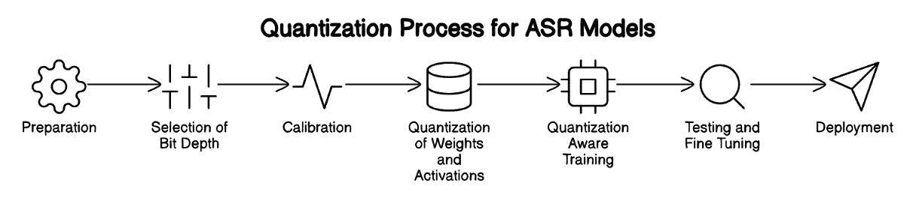
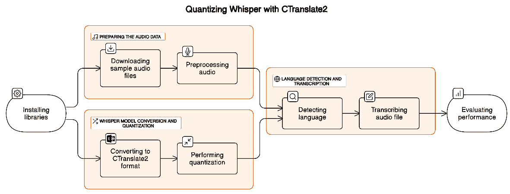
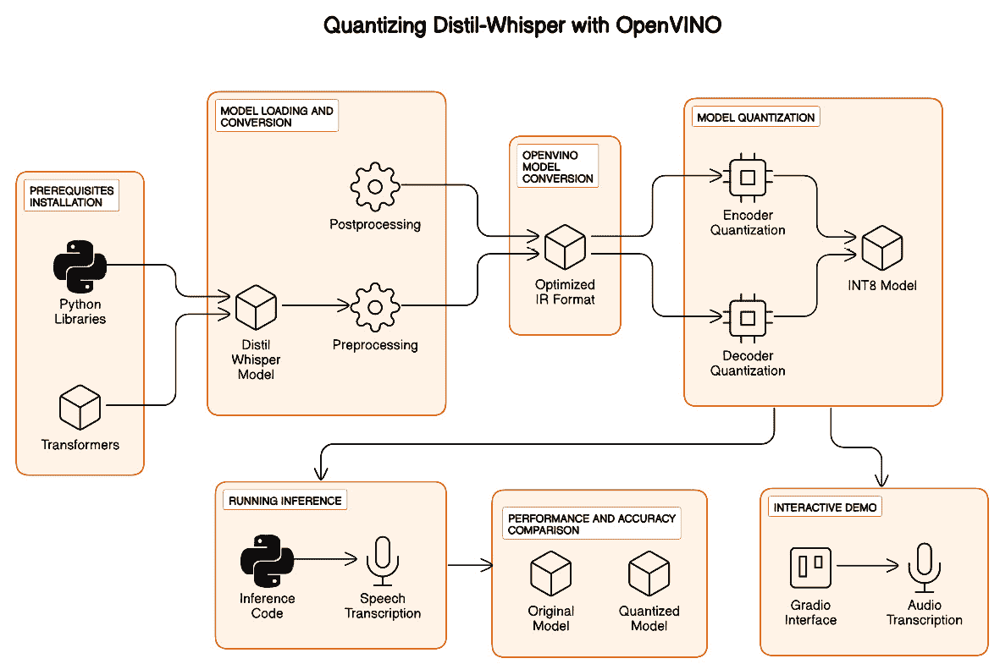

# 第七章：探索高级语音功能

欢迎来到*第七章*，在这里我们将开始一段激动人心的旅程，探索 OpenAI Whisper 的高级语音功能。本章将深入探讨提升 Whisper 性能的技术，例如 **量化**，并揭示其在实时语音识别中的潜力。

我们首先检查量化的力量，这是一种在保持准确性的同时减少模型大小和计算要求的技术。您将学习如何通过使用 **CTranslate2** 和 **Open Visual Inference and Neural Network Optimization**（**OpenVINO**）等框架将量化应用于 Whisper，从而在资源受限的设备上实现高效部署。

在上一章中，我们简要讨论了使用 Whisper 实现实时 ASR（自动语音识别）面临的挑战，而在本章中，我们将深入探讨当前的局限性以及正在进行的研究工作，以使实时转录成为现实。我们将探索使用 Whisper 和 Gradio 构建流式 ASR 演示的实验性方法，并提供实际示例，展示 Whisper 在实时语音识别中的潜力。

在本章中，我们将涵盖以下主要内容：

+   利用量化的力量

+   面对实时语音识别的挑战与机遇

到本章结束时，您将深入了解优化 Whisper 性能的高级技术，理解实时语音识别的潜力与挑战。您将掌握实用的知识和动手经验，将这些技术应用到您的项目中，突破 Whisper 的应用边界。

那么，让我们解锁 Whisper 高级语音功能的全部潜力，使您能够构建创新应用，改变我们在数字世界中与语言互动的方式。

# 技术要求

为了利用 OpenAI Whisper 的功能进行高级应用，本章使用 Python 和 Google Colab，旨在简化使用和提高可访问性。Python 环境设置包括用于转录任务的 Whisper 库。

**关键要求**：

+   **Google Colab 笔记本**：这些笔记本已经设置好，以最小所需的内存和计算能力运行我们的 Python 代码。如果 **T4 GPU** 运行时类型可用，请选择它以获得更好的性能。

+   **Python 环境**：每个笔记本都包含加载所需 Python 库的指令，包括 Whisper 和 Gradio。

+   **Hugging Face 账户**：某些笔记本需要 Hugging Face 账户和登录 API 密钥。Colab 笔记本中包含有关此主题的信息。

+   **麦克风和扬声器**：一些笔记本实现了一个 Gradio 应用，支持语音录制和音频播放。连接到计算机的麦克风和扬声器可以帮助你体验交互式语音功能。另一种选择是通过手机打开 Gradio 在运行时提供的 URL 链接；在那里，你可以使用手机的麦克风录制语音。

+   **GitHub 仓库访问**：所有 Python 代码，包括示例，都可以在本章的 GitHub 仓库中找到（[`github.com/PacktPublishing/Learn-OpenAI-Whisper/tree/main/Chapter07`](https://github.com/PacktPublishing/Learn-OpenAI-Whisper/tree/main/Chapter07)）。这些 Colab 笔记本已准备好运行，提供了一个实践性强、动手操作的学习方法。

通过满足这些技术要求，你将能够在不同的环境中探索 Whisper，同时享受 Google Colab 提供的流畅体验和 GitHub 上的全面资源。

随着我们深入了解 Whisper 的高级功能，我们必须探索一些技术，以优化其性能和效率。量化就是其中一个备受关注的技术。在这一部分中，我们将探索量化的强大功能，以及如何利用它来提升 Whisper 的部署能力。

# 利用量化的强大功能

机器学习中的量化，特别是在 ASR 中，指的是减少模型参数的精度。通常，通过将连续的浮点值范围映射到一个离散的值集合，通常是整数，来实现量化。量化的主要目标是减少模型的计算复杂性和内存占用，这对于将 ASR 系统部署到资源有限的设备（如手机或嵌入式系统）上至关重要。量化具有以下几个重要作用：

+   **减小模型尺寸**：使用低精度表示模型的权重可以显著减小模型的整体尺寸。这对于设备端部署尤为重要，因为设备的存储空间有限。

+   **提高推理速度**：在许多硬件平台上，低精度算术运算比高精度运算更快，特别是那些没有专用浮点单元的硬件。这可以加快推理时间，对于实时应用（如自动语音识别 ASR）至关重要。

+   **提高能效**：量化后的模型需要更少的计算资源，从而降低功耗。这对于电池供电的设备至关重要。

+   **扩展硬件兼容性**：许多边缘设备对整数计算进行了优化。量化使得模型能够利用这些硬件优化。

在 ASR 中，一些标准的机器学习量化技术包括 **向量量化**（**VQ**）、**int8 量化** 和 **低比特量化**。我们简要描述每一种技术：

*VQ* 是一种经典的技术，广泛应用于包括语音编码和识别在内的各个领域。它涉及将向量从一个充足的向量空间映射到有限数量的区域，这些区域可以用更少的比特有效表示。VQ 已经成功应用于语音识别系统，通过有效压缩特征空间来提高性能。

*INT8 量化* 是一种最近的方法，通过使用 8 位整数代替 32 位浮点数来表示模型的权重和激活。这种方法可以在不显著降低性能的情况下，将模型大小缩小 4 倍，因为它在类型之间进行精确的四舍五入，而不是简单地截断数据。

随着进一步的进展，出现了*低比特量化*技术，探索了甚至为 1 位的激进量化。尽管这可以显著减少存储和运行时，但可能会增加**词错误率**（**WER**）在 ASR 任务中的表现。然而，通过精心设计，例如 DistilHuBERT（[`huggingface.co/ntu-spml/distilhubert`](https://huggingface.co/ntu-spml/distilhubert)），可以实现模型压缩，同时保持最小的准确度损失。

请注意，量化会引入量化误差，如果管理不当，可能会降低模型的性能。为减轻这些影响，已经开发了如**量化感知训练**（**QAT**）和**训练后量化**（**PTQ**）等技术。QAT 在训练过程中模拟量化过程，使模型能够适应较低的精度。另一方面，PTQ 在训练后应用量化，使用校准技术调整量化参数，以实现最小的性能损失。

*图 7.1* 显示了 ASR 模型的量化过程的高层次视图：



图 7.1 – ASR 模型的量化过程

图中大致概述的步骤是通用的，旨在提供基础概览。让我们更详细地回顾每个步骤：

1.  **准备**：初始步骤是使用高精度（32 位浮点）表示法训练 ASR 模型。这确保了模型捕捉到准确语音识别所需的复杂模式。

1.  `int8`)，甚至更低。你的选择应考虑模型大小、计算效率和准确性。

    比特深度的选择直接影响模型大小、计算速度和准确度之间的权衡。较低的比特深度显著减少模型的内存占用并提高计算效率，但它们可能引入量化误差，从而可能降低模型性能。挑战在于选择一个最佳的比特深度，既能最小化这些误差，又能实现所需的效率提升。

1.  **校准**：使用一个代表性的数据集通过模型进行推理以进行 PTQ。此步骤有助于收集激活值的分布统计信息，这对于确定量化参数至关重要。

1.  **权重和激活量化**：使用收集到的统计信息，将模型的权重和激活量化到选定的位深度。这涉及使用比例因子和零点将高精度值映射到较低精度的空间。

1.  **QAT（可选）**：在某些情况下，模型会进行 QAT，即在训练过程中模拟量化效果。这有助于模型适应降低的精度，从而可能减轻准确度损失。

1.  **测试与微调**：量化后，评估模型的性能，以确保准确度保持在可接受范围内。如有必要，进行微调或调整量化参数。

1.  **部署**：量化后的模型被部署到目标硬件上，受益于减少的内存使用和更快的推理时间。这使得它适用于边缘设备或计算资源有限的环境。

有多个量化版本的 Whisper 可用，并且更多版本正在开发中。根据我的经验，我发现 Faster-Whisper 和 Distil-Whisper 提供了更优越且可靠的性能。以下是它们的简要描述：

+   **Faster-Whisper**在 CTranslate2 中实现了 Whisper 模型，这是一个用于高效推理 Transformer 模型的库。它通过各种方法提高效率，如权重量化、层融合和批量重排序。量化在 Faster-Whisper 中发挥了重要作用，通过减少模型的内存占用和加速推理，特别是在 GPU 上。我们将在*使用 WhisperX 和 NVIDIA 的 NeMo 进行语音分离*章节中体验 Faster-Whisper，因为 WhisperX 使用 Faster-Whisper 进行**语音转文本**（**STT**）转录。

+   `small.en`、`medium.en` 和 `large-v2`模型，它们在保持相当 WER 的同时更快且更小。量化可以进一步提高 Distil-Whisper 的效率，通过减少模型参数的精度，从而实现更快的处理速度和更低的内存需求。

在我们探索量化的强大功能时，让我们通过使用 CTranslate2 框架来深入了解一个实际示例。CTranslate2 提供了一种高效的方式来量化和优化 Whisper 模型，以便在资源受限的设备上部署。

## 使用 CTranslate2 量化 Whisper 并通过 Faster-Whisper 进行推理

请查找并打开`LOAIW_ch07_1_Quantizing_Whisper_with_CTranslate2.ipynb` Colab 笔记本（[`github.com/PacktPublishing/Learn-OpenAI-Whisper/blob/main/Chapter07/LOAIW_ch07_1_Quantizing_Whisper_with_CTranslate2.ipynb`](https://github.com/PacktPublishing/Learn-OpenAI-Whisper/blob/main/Chapter07/LOAIW_ch07_1_Quantizing_Whisper_with_CTranslate2.ipynb)）。该笔记本演示了如何使用 CTranslate2 和 Faster-Whisper 框架来加载量化模型并进行推理（转录或翻译）。你应先在 CPU 上运行笔记本，然后在 GPU 上运行。由于我们使用的是小型 Whisper 模型、短音频文件和量化，CPU 性能应该相对较快。*图 7.2*提供了量化过程的概览，从准备音频数据、转换和量化模型，到评估其在语言检测和转录任务中的表现。量化在优化模型以适应资源受限的环境中至关重要，它使得语音识别能力高效且准确：



图 7.2 – 使用 CTranslate2 框架量化 Whisper 过程的高层视图

以下步骤概述了量化过程。有关完整的端到端实现，请参考`LOAIW_ch07_1_Quantizing_Whisper_with_CTranslate2.ipynb`笔记本。本节将展示高层步骤和选定的代码片段来说明该过程。请记住，笔记本中包含了额外的细节和解释，帮助你全面理解量化工作流。以下是该过程的详细分解：

1.  `ctranslate2`、`transformers`和`faster-whisper`：

    ```py
    !pip install ctranslate2
    !pip install transformers[torch]>=4.23
    !pip install faster-whisper
    ```

    这些库对于量化以及充分利用 Whisper 模型的能力至关重要。

1.  **下载示例音频文件**：从我们的 GitHub 仓库下载两个文件，用于测试 Whisper 模型的转录能力：

    ```py
    !wget -nv https://github.com/PacktPublishing/Learn-OpenAI-Whisper/raw/main/Chapter01/Learn_OAI_Whisper_Sample_Audio01.mp3
    librosa:

    ```

    导入 ctranslate2

    从 IPython.display 导入 Audio

    导入 librosa

    导入 transformers

    # 加载并重采样音频文件。

    sampling_frequency = 16000

    audio, _ = librosa.load("Learn_OAI_Whisper_Sample_Audio01.mp3", sr=sampling_frequency, mono=True)

    Audio(audio, rate=sampling_frequency)

    ```py

    This step is crucial for ensuring that the audio data is in the correct format for processing by the Whisper model.
    ```

1.  `openai/whisper-tiny`) 被转换为 CTranslate2 格式，这是一种更高效的推理格式：

    ```py
    ct2-transformers-converter command converts models to the CTranslate2 format, optimized for fast inference. The core CTranslate2 implementation is framework-agnostic. The framework-specific logic is moved to a conversion step that loads supported models into a unified representation. The weights are then optionally quantized and saved into an optimized binary format for efficient storage and processing.When converting models using the CTranslate2 tool, the output directory typically contains several key files for the CTranslate2 engine to load and run the model. The command streamlines the process of preparing models for deployment in environments where computational efficiency is crucial and a preparatory step for quantization. While the exact output files can vary depending on the specific model being converted and the options used during conversion, standard files include the following:*   `config.json`: This JSON file contains configuration information about the model, such as its architecture, the size of its layers, and other hyperparameters. This information is crucial for the CTranslate2 engine to interpret the model’s binary weights and perform inference correctly.*   `model.bin`: This is the binary file containing the quantized weights of the model. Quantization reduces the precision of the model’s weights, which can significantly decrease the model size and improve inference speed, often with minimal impact on accuracy.*   `vocabulary.json` or similar vocabulary files (for example, `source.spm` and `target.spm` for models using `SentencePiece` tokenization): These files contain the mapping between tokens (words or subwords) and their corresponding indices in the model’s vocabulary. This mapping is essential for converting input text into a format that the model can process (tokenization) and converting the model’s output back into human-readable text (detokenization).These files represent the converted and optimized model and are ready for use with CTranslate2\. The conversion process might also include copying additional files necessary for the model’s operation, such as tokenization configuration (`tokenizer_config.json`), special tokens mapping (`special_tokens_map.json`), and others, depending on the model’s requirements and the conversion options you use.
    ```

1.  `INT8`）：

    ```py
    !ct2-transformers-converter --force --model openai/whisper-tiny --output_dir whisper-tiny-ct2-int8 \
    INT8)
    ```

1.  16 位整数（`INT16`）

1.  16 位浮动点（`FP16`）

1.  16 位大脑浮动点（`BF16`）

这一步显著减少了模型的大小和计算需求，使其更适合在资源有限的设备上部署。

1.  **检测语言**：量化模型检测所提供音频样本的语言：

    ```py
    # Detect the language.
    results = model.detect_language(features)
    language, probability = results[0][0]
    print("Detected language %s with probability %f" % (language, probability))
    ```

    这一步对于确保模型准确理解音频数据的上下文非常重要。

1.  `processor.tokenizer.convert_tokens_to_ids()`方法：

    ```py
    prompt = processor.tokenizer.convert_tokens_to_ids(
        [
            "<|startoftranscript|>",
            language,
            "<|transcribe|>",
            "<|notimestamps|>",  # Remove this token to generate timestamps.
        ]
    )
    # Load the model on device
    model = ctranslate2.models.Whisper("whisper-tiny-ct2-int8", device=this_device)
    # Run generation for the 30-second window.
    results = model.generate(features, [prompt])
    transcription = processor.decode(results[0].sequences_ids[0])
    print(transcription))
    ```

    这展示了模型即使在量化后也能准确转录语音的能力。

1.  **评估性能**：音频转录后，代码评估量化后模型的性能，如测量转录所用的时间：

    ```py
    # Print the end time and the delta in seconds and fractions of a second.
    end = time.time()
    print('start: ', start)
    print('end: ', end)
    print('delta: ', end - start)
    print('delta: ', datetime.timedelta(seconds=end - start))
    ```

    这一评估对于了解量化对模型效率和准确性的影响至关重要。

结果显示了实证证据，表明量化后的 Whisper 模型能够以更小的内存和处理足迹进行良好的转录。基于我们对量化的理解，让我们现在集中研究另一个强大的框架——OpenVINO。我们将探讨 OpenVINO 如何用于量化 Distil-Whisper 模型，提供一个更加全面和严格的量化过程。

## 使用 OpenVINO 量化 Distil-Whisper

这个实践练习依赖于`LOAIW_ch07_2_Quantizing_Distil_Whisper_with_OpenVINO.ipynb` Colab 笔记本 ([`github.com/PacktPublishing/Learn-OpenAI-Whisper/blob/main/Chapter07/LOAIW_ch07_2_Quantizing_Distil_Whisper_with_OpenVINO.ipynb`](https://github.com/PacktPublishing/Learn-OpenAI-Whisper/blob/main/Chapter07/LOAIW_ch07_2_Quantizing_Distil_Whisper_with_OpenVINO.ipynb))。由于 OpenVINO 的原因，我建议你在 Colab 中使用 CPU 和大内存运行此笔记本。即使存在 NVIDIA GPU，OpenVINO 也不会使用它，仅使用 Intel GPU。不过，OpenVINO 提供的库经过优化，可以在普通 CPU 上运行，因此在计算处理资源有限时，这也是一个显著的优势。然而，进行量化时你至少需要 50GB 的内存。该笔记本提供了利用 Distil-Whisper（基于 WhisperX），一个经过蒸馏的 Whisper 模型变体，与 OpenVINO 结合用于自动语音识别（ASR）的全面指南。Distil-Whisper 大大减少了参数数量（从`large-v2`中的 1,550 个参数减少到`distill-large-v2`中的 756 个参数，约减少 50%），并在保持与原始 Whisper 模型在 WER（字错误率）方面相近性能的同时，提高了推理速度。

*图 7.3*概述了将 Distil-Whisper 模型转换为 OpenVINO **中间表示**（**IR**）格式，应用 INT8 PTQ 以提高性能，并运行模型进行语音识别任务：



图 7.3 – 使用 OpenVINO 框架量化 Distil-Whisper 的高层架构图

以下子章节将描述使用 OpenVINO 框架量化 Distil-Whisper 模型的关键步骤。我们将安装必要的库，加载模型，将其转换为 OpenVINO 格式，并应用量化。我们还将探索如何使用 Optimum 库加载量化后的模型，并将其与 Hugging Face 管道集成。最后，我们将使用量化后的模型进行推理，并将其性能和准确性与原始模型进行比较。

### 安装库

首先，过程指导安装必要的 Python 库：

```py
%pip install -q "transformers>=4.35" onnx "git+https://github.com/huggingface/optimum-intel.git" "peft==0.6.2" --extra-index-url https://download.pytorch.org/whl/cpu
%pip install -q "openvino>=2023.2.0" datasets  "gradio>=4.0" "librosa" "soundfile"
%pip install -q "nncf>=2.6.0" "jiwer"
```

让我们更详细地查看每个库，重点介绍那些我们之前没有描述过的库：

+   **Transformers**：这个库用于处理自然语言处理任务，如文本分类、信息抽取和问答。它提供了访问预训练模型的功能，如 BERT、GPT-2，以及在本例中用于 ASR 的 Distil-Whisper 模型。

+   **Open Neural Network Exchange (ONNX)**：ONNX 是一个开放格式，用于表示机器学习模型。它使模型能够在不同的框架和工具之间转移，促进了互操作性。

+   **Optimum Intel**：这是 Hugging Face Optimum 库的一部分，专为 Intel 硬件量身定制。它将模型转换为 OpenVINO IR 格式，这种格式经过针对 Intel 硬件的优化，并执行如量化等任务，以提高模型性能。

+   **OpenVINO**：OpenVINO 工具包旨在促进在 Intel 硬件上快速高效地进行深度学习模型推理。它包括优化工具和库，用于加速各种计算机视觉和深度学习任务。

+   **Datasets**：这是 Hugging Face 生态系统的一部分，用于简单高效地加载和处理数据集。它对于需要处理大量数据的机器学习任务非常有用。

+   **Soundfile**：这个库提供了从音频文件读取和写入多种格式的功能。它处理音频数据的输入输出操作。

+   **神经网络压缩框架（NNCF）**：这是一个通过量化、剪枝和知识蒸馏优化深度学习模型的工具包。它提高了神经网络的性能，特别是在推理速度和内存使用方面。

+   **JiWER**：这是一个用于评估自动语音识别模型的库。它计算诸如 WER（词错误率）等指标，这是评估语音识别系统性能的标准方法。

每个库在运行和优化 Distil-Whisper 模型时都扮演着特定的角色，从模型转换和优化到性能评估和用户界面创建。

### 加载模型

在使用 `transformers` 库初始化 PyTorch Whisper 模型时，`AutoModelForSpeechSeq2Seq.from_pretrained` 方法是常用的方法：

```py
from transformers import AutoProcessor, AutoModelForSpeechSeq2Seq
processor = AutoProcessor.from_pretrained(model_id.value)
pt_model = AutoModelForSpeechSeq2Seq.from_pretrained(model_id.value)
pt_model.eval();
```

本教程将使用 `distil-whisper/distil-medium.en` 模型作为主要示例。值得注意的是，该模型在第一次运行时需要下载，可能需要一些时间。

如果你想探索其他模型，Distil-Whisper Hugging Face 集合提供了如 `distil-whisper/distil-large-v2` 或 `distil-whisper/distil-small.en` 等选项。基于原始 Whisper 架构的其他模型也有提供，你可以在提供的资源中找到更多信息。

强调预处理和后处理在此模型使用中的重要性至关重要。`AutoProcessor`类用于初始化`WhisperProcessor`，它在为模型准备音频输入数据时发挥了至关重要的作用。它负责将音频转换为 Mel-谱图，并使用分词器将预测的`token_ids`输出解码回字符串。

通过利用`AutoModelForSpeechSeq2Seq.from_pretrained`方法，并了解预处理和后处理步骤，你将能够有效地与 PyTorch Whisper 模型进行工作。

### 使用 Optimum 库加载 OpenVINO 模型

Hugging Face Optimum API 是一个强大的工具，可以简化将 Hugging Face Transformers 库中的模型转换和量化为 OpenVINO™ IR 格式的过程。如果你想了解更多深入的信息，[Hugging Face Optimum 文档](https://huggingface.co/docs/optimum/intel/inference)是一个很好的资源。

Optimum Intel 是加载来自 Hugging Face Hub 的优化模型并创建用于 OpenVINO Runtime 推理的管道时的好伙伴。Optimum 推理模型的一个优点是它们与 Hugging Face 的`transformers`模型 API 兼容。你可以毫不费力地将`AutoModelForXxx`类替换为相应的`OVModelForXxx`类：

```py
# Using HF transformers models
from transformers import AutoModelForSpeechSeq2Seq
from transformers import AutoTokenizer, pipeline
model_id = "distil-whisper/distil-large-v2"
model = AutoModelForSpeechSeq2Seq.from_pretrained(model_id)
# Using Optimum Inference models
from optimum.intel.openvino import OVModelForSpeechSeq2Seq
from transformers import AutoTokenizer, pipeline
model_id = "distil-whisper/distil-large-v2"
model = OVModelForSpeechSeq2Seq.from_pretrained(model_id, export=True)
```

你需要调用`from_pretrained`方法来初始化模型类。在下载和转换`transformers`模型时，包含`export=True`参数。这将确保平稳的转换过程。一旦你获得转换后的模型，就可以使用`save_pretrained`方法保存它：

```py
from pathlib import Path
from optimum.intel.openvino import OVModelForSpeechSeq2Seq
model_path = Path(model_id.value.replace('/', '_'))
ov_config = {"CACHE_DIR": ""}
if not model_path.exists():
    ov_model = OVModelForSpeechSeq2Seq.from_pretrained(
        model_id.value, ov_config=ov_config, export=True, compile=False, load_in_8bit=False
    )
    ov_model.half()
    ov_model.save_pretrained(model_path)
else:
    ov_model = OVModelForSpeechSeq2Seq.from_pretrained(
        model_path, ov_config=ov_config, compile=False
    )
```

值得一提的是，随模型分发的分词器和处理器也与 OpenVINO 模型兼容。这种兼容性允许你重复使用之前初始化的处理器，节省时间和精力。

使用 Hugging Face Optimum 库，我们还可以将 Distil-Whisper 模型转换为 OpenVINO 的优化 IR 格式。这一步骤对于利用 OpenVINO 的推理引擎来高效执行模型至关重要：

```py
-from transformers import AutoModelForSpeechSeq2Seq
+from optimum.intel.openvino import OVModelForSpeechSeq2Seq
from transformers import AutoTokenizer, pipeline
model_id = "distil-whisper/distil-large-v2"
-model = AutoModelForSpeechSeq2Seq.from_pretrained(model_id)
+model = OVModelForSpeechSeq2Seq.from_pretrained(model_id, export=True)
```

通过利用 Hugging Face Optimum API 和 Optimum Intel，你可以高效地转换和量化模型，加载优化后的模型，并创建用于 OpenVINO Runtime 推理的管道。API 兼容性以及能够重复使用初始化处理器的能力，使得整个过程更加简化。

### 使用 OpenVINO 模型与 Hugging Face 管道

通过将 OpenVINO 模型与 Hugging Face 管道接口结合，并利用 Distil-Whisper 的分块算法和批处理能力，你将能够以前所未有的速度和轻松度处理长时间的音频转录任务。

与原始的 PyTorch 模型一样，OpenVINO 模型与 Hugging Face 的 ASR 管道接口完美集成。这种兼容性使得你可以轻松地使用管道转录长时间的音频文件：

```py
from transformers import pipeline
ov_model.generation_config = pt_model.generation_config
pipe = pipeline(
    "automatic-speech-recognition",
    model=ov_model,
    tokenizer=processor.tokenizer,
    feature_extractor=processor.feature_extractor,
    max_new_tokens=128,
    chunk_length_s=15,
    batch_size=16,
)
```

Distil-Whisper 通过采用分块算法将其推向更高级别，显著加快了长形音频的转录过程。这种分块长形算法比 OpenAI 在其 Whisper 论文中提出的顺序算法快了惊人的九倍（[`cdn.openai.com/papers/whisper.pdf`](https://cdn.openai.com/papers/whisper.pdf))。

要利用分块的优势，您只需将`chunk_length_s`参数传递给管道即可。在使用 Distil-Whisper 时，将块长度设置为`15`秒是达到最佳性能的甜蜜点。但这还不是全部！如果您想利用批处理的能力，在调用管道时包括`batch_size`参数。这将使您能够同时处理多个音频块，进一步提升转录工作流的效率。

### 量化模型

量化是一种强大的技术，可以显著减少模型大小并提高推断速度。NNCF 使得实现 PTQ 变得比以往任何时候都更加简单。通过无缝集成量化层到模型图中，并利用训练数据集的子集来初始化这些额外层的参数，NNCF 确保对您原始训练代码的修改是最小的。

踏上优化之旅的第一步是创建专门为量化量身定制的校准数据集：

```py
%%skip not $to_quantize.value
from itertools import islice
from optimum.intel.openvino.quantization import InferRequestWrapper
def collect_calibration_dataset(ov_model: OVModelForSpeechSeq2Seq, calibration_dataset_size: int):
    # Overwrite model request properties, saving the original ones for restoring later
    original_encoder_request = ov_model.encoder.request
    original_decoder_with_past_request = ov_model.decoder_with_past.request
    encoder_calibration_data = []
    decoder_calibration_data = []
    ov_model.encoder.request = InferRequestWrapper(original_encoder_request, encoder_calibration_data)
    ov_model.decoder_with_past.request = InferRequestWrapper(original_decoder_with_past_request,
                                                             decoder_calibration_data)
    calibration_dataset = load_dataset("librispeech_asr", "clean", split="validation", streaming=True)
    for sample in tqdm(islice(calibration_dataset, calibration_dataset_size), desc="Collecting calibration data",
                       total=calibration_dataset_size):
        input_features = extract_input_features(sample)
        ov_model.generate(input_features)
    ov_model.encoder.request = original_encoder_request
    ov_model.decoder_with_past.request = original_decoder_with_past_request
    return encoder_calibration_data, decoder_calibration_data
```

由于 Whisper 编码器和解码器是分别量化的，为每个模型准备一个校准数据集至关重要。这就是`InferRequestWrapper`类发挥作用的地方。导入此类，您可以拦截并收集模型输入到列表中。然后，您将在少量音频样本上运行模型推断。请记住，增加校准数据集的大小通常会导致更好的量化质量，因此值得尝试找到适当的平衡。

一旦准备好校准数据集，就是时候释放`nncf.quantize`的力量了。这个函数是获得量化编码器和解码器模型的关键。在 Distil-Whisper 的情况下，您将在`encoder`和`decoder_with_past`模型上运行`nncf.quantize`。值得注意的是，第一步解码器因其对整体推断时间的贡献微不足道而未被量化：

```py
%%skip not $to_quantize.value
import gc
import shutil
import nncf
CALIBRATION_DATASET_SIZE = 50
quantized_model_path = Path(f"{model_path}_quantized")
def quantize(ov_model: OVModelForSpeechSeq2Seq, calibration_dataset_size: int):
    if not quantized_model_path.exists():
        encoder_calibration_data, decoder_calibration_data = collect_calibration_dataset(
            ov_model, calibration_dataset_size
        )
        print("Quantizing encoder")
        quantized_encoder = nncf.quantize(
            ov_model.encoder.model,
            nncf.Dataset(encoder_calibration_data),
            subset_size=len(encoder_calibration_data),
            model_type=nncf.ModelType.TRANSFORMER,
            # Smooth Quant algorithm reduces activation quantization error; optimal alpha value was obtained through grid search
            advanced_parameters=nncf.AdvancedQuantizationParameters(smooth_quant_alpha=0.50)
        )
        ov.save_model(quantized_encoder, quantized_model_path / "openvino_encoder_model.xml")
        del quantized_encoder
        del encoder_calibration_data
        gc.collect()
        print("Quantizing decoder with past")
        quantized_decoder_with_past = nncf.quantize(
            ov_model.decoder_with_past.model,
            nncf.Dataset(decoder_calibration_data),
            subset_size=len(decoder_calibration_data),
            model_type=nncf.ModelType.TRANSFORMER,
            # Smooth Quant algorithm reduces activation quantization error; optimal alpha value was obtained through grid search
            advanced_parameters=nncf.AdvancedQuantizationParameters(smooth_quant_alpha=0.95)
        )
        ov.save_model(quantized_decoder_with_past, quantized_model_path / "openvino_decoder_with_past_model.xml")
        del quantized_decoder_with_past
        del decoder_calibration_data
        gc.collect()
        # Copy the config file and the first-step-decoder manually
        shutil.copy(model_path / "config.json", quantized_model_path / "config.json")
        shutil.copy(model_path / "openvino_decoder_model.xml", quantized_model_path / "openvino_decoder_model.xml")
        shutil.copy(model_path / "openvino_decoder_model.bin", quantized_model_path / "openvino_decoder_model.bin")
    quantized_ov_model = OVModelForSpeechSeq2Seq.from_pretrained(quantized_model_path, ov_config=ov_config, compile=False)
    quantized_ov_model.to(device.value)
    quantized_ov_model.compile()
    return quantized_ov_model
ov_quantized_model = quantize(ov_model, CALIBRATION_DATASET_SIZE)
```

代码片段显示，最后一步是在量化后使用`openvino.save_model`函数序列化 INT8 模型。此步骤确保您的量化模型已准备好部署，并可以快速加载进行推断。

重要的是要记住，量化是一种计算密集型操作，可能既耗时又消耗内存。运行量化代码可能需要耐心，但模型尺寸减小和推断速度提高的好处使其绝对值得努力。

通过遵循这些步骤并利用 NNCF 的强大功能，您可以通过 PTQ 优化模型，从而实现更快、更高效的推理。

### 运行推理

这里，我们展示了如何使用量化模型进行推理，包括加载模型、准备输入样本以及执行模型进行语音转录。以下是详细步骤：

1.  来自 Hugging Face 的`librispeech_asr_dummy`，出自`datasets`库：

    ```py
    %%skip not $to_quantize.value
    dataset = load_dataset(
        "hf-internal-testing/librispeech_asr_dummy", "clean", split="validation"
    )
    sample = dataset[0]
    ```

1.  将`numpy`数组格式转换为模型可以处理的张量：

    ```py
    input_features = extract_input_features(sample)
    predicted_ids = ov_model.generate(input_features)
    ```

1.  **在原始模型上运行推理**：使用原始 OpenVINO 模型生成输入特征的预测。通过模型的处理器将预测的令牌 ID 解码为文本转录：

    ```py
    transcription_original = processor.batch_decode(predicted_ids, skip_special_tokens=True)
    ```

1.  **在量化模型上运行推理**：类似地，使用量化后的 OpenVINO 模型生成相同输入特征的预测。通过模型的处理器将预测的令牌 ID 解码为文本转录：

    ```py
    predicted_ids = ov_quantized_model.generate(input_features)
    transcription_quantized = processor.batch_decode(predicted_ids, skip_special_tokens=True)
    ```

1.  使用`Audio`类播放用于转录的音频文件：

    ```py
    display(ipd.Audio(sample["audio"]["array"], rate=sample["audio"]["sampling_rate"]))
    ```

1.  **打印转录文本**：打印来自原始模型和量化模型的转录文本以进行结果比较：

    ```py
    print(f"Original : {transcription_original[0]}")
    print(f"Quantized: {transcription_quantized[0]}")
    ```

在笔记本中运行此代码后，检查转录文本，并验证原始模型和量化模型的转录文本是否一致，确保量化没有显著影响模型的准确性。

此外，笔记本还包括如何通过 Hugging Face 的 ASR 管道接口使用模型，突出了用于长音频转录的分块算法的效率。

### 性能和准确性比较

接下来，我们将比较原始模型和量化后的 Distil-Whisper 模型在准确性（使用 WER）和性能（推理时间）方面的差异。这说明了量化在提高模型推理速度而不会显著降低准确性方面的好处。比较原始模型和量化模型的性能和准确性包括以下内容：

+   **衡量准确性**：我们使用*1 - WER*指标来衡量模型的准确性。这涉及将模型生成的转录文本与地面真实文本进行比较，以计算错误率。较低的 WER 表示更高的准确性：

    ```py
    word_accuracy = (1 - wer(ground_truths, predictions, reference_transform=wer_standardize,                         hypothesis_transform=wer_standardize)) * 100
    ```

+   **衡量性能**：推理时间分别为编码器、解码器-带有过去状态模型的前向推理以及整个模型推理进行测量。此步骤包括对模型的推理过程进行计时，以评估模型生成预测的速度。性能测量对于理解量化在提高效率方面的作用至关重要：

    ```py
    mean_whole_infer_time = sum(whole_infer_times)
    mean_encoder_infer_time = sum(encoder_infer_times)
    mean_decoder_with_time_infer_time = sum(decoder_with_past_infer_times)
    ```

+   **比较原始模型和量化模型**：笔记本直接比较了原始 Distil-Whisper 模型及其量化版本在准确性（*使用 1 - WER*）和性能（推理时间）方面的表现。这种比较有助于说明量化对模型效率和效果的影响：

    ```py
    print(f"Encoder performance speedup: {times_original[1] / times_quantized[1]:.3f}")
    print(f"Decoder with past performance speedup: {times_original[2] / times_quantized[2]:.3f}")
    print(f"Whole pipeline performance speedup: {times_original[0] / times_quantized[0]:.3f}")
    print(f"Whisper transcription word accuracy. Original model: {accuracy_original:.2f}%. Quantized model: {accuracy_quantized:.2f}%.")
    print(f"Accuracy drop: {accuracy_original - accuracy_quantized:.2f}%.")
    ```

基于运行笔记本后打印出来的对比结果，你可以得出量化的好处，比如模型推理时间的显著改善，而精度几乎没有显著下降。这些步骤为评估量化对 ASR 模型性能和精度的影响提供了一个全面的框架，尤其是在使用 OpenVINO 优化 Distil-Whisper 等模型时。目标是证明，量化可以显著提高模型效率，使其能够在资源受限的环境中部署，而不会大幅牺牲精度。

### 运行交互式演示

作为附加内容，交互式 Gradio 演示允许我们在他们的音频数据或录音上测试模型的能力。此部分展示了量化后的 Distil-Whisper 模型在用户友好方式下的实际应用。

我鼓励你运行并实验 Colab 笔记本。它是理解量化过程的基础工具，更重要的是，它是你实验或生产工作的重要蓝图。运行完笔记本后，我们开始了一个迷人的旅程，探索了在自动语音识别（ASR）中集成尖端技术。笔记本详细介绍了如何利用 Distil-Whisper 模型，它是 OpenAI 的 Whisper 模型的精简版，在显著减少参数的同时优化了性能，并通过英特尔的 OpenVINO 工具包进行部署，以提高推理速度和效率。

从这个笔记本中获得的一个关键学习是，不同库和框架之间的无缝协同工作，帮助实现了 ASR 任务的高效工作流。使用 Hugging Face Transformers 库访问预训练模型，并利用 Optimum Intel 库将模型转换为 OpenVINO 的 IR 格式，展示了模型部署的一种强大方法。这个过程简化了用户体验，为利用英特尔架构提供的硬件加速能力铺平了道路。

笔记本进一步探讨了使用 NNCF 进行模型量化的实际操作。这一步对于在不显著影响精度的情况下优化模型性能至关重要。准备校准数据集、运行量化并比较原始模型和量化模型的性能与精度的详细演示，提供了关于模型优化细节的宝贵见解。

笔记本中还强调了另一个重要方面，即使用 Gradio 创建交互式演示。这展示了 Distil-Whisper 模型在现实场景中的实际应用，允许用户在他们的音频数据上测试模型的能力。包括这样的演示突显了在开发和部署 AI 模型时，易用性和用户参与的重要性。

你应该寻求将此笔记本中的学习内容直接应用于你的实验或生产 ASR 任务。这些内容可以扩展到 AI 模型部署和优化的更广泛领域，突显了 AI 技术的不断发展和其实际应用。

虽然量化技术已被证明是优化 Whisper 性能和实现高效部署的强大手段，但另一个令人兴奋的前沿领域是探索使用 Whisper 进行实时语音识别的挑战与机遇。实时转录开启了许多可能性，从增强可访问性到促进即时沟通。然而，它也带来了独特的技术难题，必须加以克服。在接下来的部分，我们将深入探讨实时转录面临的当前限制和正在进行的研究工作，旨在使 Whisper 的实时转录成为现实。通过理解这些挑战和前景中的潜在解决方案，我们可以更好地认识到 Whisper 在重塑我们如何在实时场景中与口语互动方面的巨大潜力。

# 面对实时语音识别的挑战与机遇

追求使用 Whisper 进行实时转录打开了许多应用，这些应用能够惠及教育、医疗和客户服务等各个领域。实时转录可以增强听力障碍人士的可访问性，促进多语言环境中的即时沟通，并提供口头交流的即时文档记录。随着 Whisper 功能的不断发展，它作为通用翻译工具和可访问性工具的潜力变得越来越明显。

然而，目前仍有更多的限制和挑战阻碍着实时转录的实现。让我们深入探讨这些方面，重点关注实现实时转录的技术复杂性和前景：

+   **处理时间和延迟**：实现实时转录的主要挑战之一是 Whisper 操作的固有延迟和处理时间。正如 GitHub 和 Hugging Face 等平台上的讨论所揭示，Whisper 并非天生为实时语音转文字（STT）转换设计。虽然它在处理任意长度的音频文件时表现稳健，但系统架构在提供即时转录结果时遇到了障碍。这种延迟源于支撑 Whisper 的复杂神经网络模型，这些模型需要大量计算资源来准确分析和转录语音。

+   **提高准确性和上下文理解能力**：另一个限制在于 Whisper 转录的准确性和上下文知识。尽管 Whisper 在转录多种语言和口音方面表现出了非凡的能力，但实时应用仍然面临独特的挑战。系统必须准确识别语音，并理解对话中的上下文、习语和口语表达。这要求具备当前模型仍在努力完善的语言学和文化细微差别。

尽管存在这些限制，Whisper 在实时转录方面的潜力巨大。该技术当前的能力和不断发展的进展为我们展示了一个未来，届时这些挑战将变得可以克服：

+   **提升模型效率**：近期的研究集中于提高 Whisper 的效率并减少延迟，使实时转录成为一个切实可行的目标。例如，在 arXiv 上的一项研究《将 Whisper 转变为实时转录系统》（[`arxiv.org/abs/2307.14743`](https://arxiv.org/abs/2307.14743)）探讨了将 Whisper 转变为实时转录系统的方法。这些方法包括优化模型的架构以及利用更强大的计算资源。随着这些进展的持续，我们可以预见到处理时间将大幅减少，Whisper 将更接近实现无缝的实时转录。

+   **与边缘计算的整合**：Whisper 与边缘计算的整合为克服延迟问题提供了一个有前景的途径。通过在数据生成源附近处理数据，边缘计算可以显著减少音频转录所需的时间。这一方法加速了转录过程，缓解了带宽限制，使实时转录变得更加可行和高效。

尽管通过 Whisper 实现完美的实时转录之路充满了技术挑战，但它所带来的机遇无疑是令人振奋的。延迟、处理时间和上下文准确性方面的限制虽大，但可以管理。通过持续的研究、技术进步和创新应用，Whisper 正站在重新定义实时转录的风口浪尖。展望未来，Whisper 在我们日常生活中的整合不仅有望提升沟通和可访问性，还将推动人工智能领域的可能性边界。前方的道路充满挑战和激动人心的机会，突显了在这一动态领域持续探索和发展的重要性。

为了更好地理解 Whisper 在实时语音识别中的挑战和潜力，让我们深入一个实际的示例。在接下来的部分，我们将使用 Hugging Face 对 Whisper 的实现和用户友好的 Gradio 库构建一个互动式实时 ASR 演示。

## 使用 Hugging Face Whisper 构建实时 ASR 演示

在本节中，我们将利用 Gradio（一个用户界面库）的强大功能，快速构建一个 Whisper 模型的互动演示。这个演示将允许你或其他人通过设备上的麦克风测试模型的表现。让我们找到并运行 `LOAIW_ch07_3_Building_real_time_ASR_with_HF_Whisper.ipynb` 笔记本 ([`github.com/PacktPublishing/Learn-OpenAI-Whisper/blob/main/Chapter07/LOAIW_ch07_3_Building_real_time_ASR_with_HF_Whisper.ipynb`](https://github.com/PacktPublishing/Learn-OpenAI-Whisper/blob/main/Chapter07/LOAIW_ch07_3_Building_real_time_ASR_with_HF_Whisper.ipynb))。该笔记本分为三个主要部分：

+   `transformers` 库，用于为我们的演示准备 ASR 模型。

+   **创建完整上下文的 ASR 演示**：我们将构建一个演示，其中用户在 ASR 模型处理并生成转录之前讲述完整音频。

+   **创建流式 ASR 演示**：我们将扩展之前的演示，支持实时流式处理，让 ASR 模型在用户讲话时实时转录音频，提供更加互动的体验。

到本笔记本的最后，你将能够充分理解如何使用 Gradio 和 Hugging Face Transformers 库为语音识别模型创建引人入胜的演示。

### 准备开发环境

在开始构建语音识别演示之前，首先需要设置开发环境并安装必要的依赖项。在这一部分，我们将进行以下操作：

1.  安装所需的库，如 Gradio，以确保开发过程顺利进行。

1.  配置环境，以便与 Hugging Face Transformers 库无缝协作，允许我们利用预训练模型和强大的 NLP 工具。

通过正确设置环境，我们为整个笔记本提供了一个高效且无烦恼的编程体验基础。

为了将我们对实时 ASR 与 Whisper 的探索付诸实践，我们首先需要设置开发环境。让我们一起走过安装必要库和配置设置的过程，以确保能够与 Hugging Face Transformers 库无缝协作。

```py
%%capture
!pip -q install gradio
```

设置你的 Hugging Face 令牌对于确保在使用此笔记本时的流畅体验至关重要。该笔记本将从 Hugging Face 仓库加载 transformer 类和模型，这需要有效的令牌认证。

如果你还没有创建 Hugging Face 令牌，或者需要重新了解这一过程，请参考 [`github.com/PacktPublishing/Learn-OpenAI-Whisper/blob/main/Chapter03/LOAIW_ch03_working_with_audio_data_via_Hugging_Face.ipynb`](https://github.com/PacktPublishing/Learn-OpenAI-Whisper/blob/main/Chapter03/LOAIW_ch03_working_with_audio_data_via_Hugging_Face.ipynb)。该资源提供了创建和配置 Hugging Face 令牌的逐步说明。

通过正确设置您的令牌，您将能够轻松访问 Hugging Face 生态系统中可用的所有功能和模型，从而使您能够构建强大的语音识别演示：

```py
from huggingface_hub import notebook_login
notebook_login()
from huggingface_hub import whoami
whoami()
```

在设置好我们的开发环境后，让我们首先加载 transformers 的 ASR 模型，它将作为我们交互式应用程序的基础。

### 步骤 1 – 加载 transformers ASR 模型

我们首先需要一个 ASR 模型来开始构建我们的语音识别演示。您可以选择训练自己的模型或使用预训练模型。加载来自 Hugging Face `transformers`库的`"whisper"`模型非常简单。以下是实现此功能的代码片段：

```py
from transformers import pipeline
p = pipeline("automatic-speech-recognition", model="openai/whisper-base.en")
```

仅通过这两行代码，我们使用`"openai/whisper-base.en"`模型初始化了一个自动语音识别（ASR）管道。该管道抽象了直接使用模型时的复杂性，提供了一个高层次的接口来执行 ASR 任务。

通过利用像`"whisper"`这样的预训练模型，我们可以迅速开始构建演示，而无需进行大量的模型训练。这使我们能够专注于将模型集成到我们的应用程序中，并创造一个引人入胜的用户体验。

### 步骤 2 – 使用 transformers 构建全上下文的 ASR 演示

创建语音识别演示的第一步是构建一个*全上下文*的 ASR 演示。在这个演示中，用户将在 ASR 模型处理之前，先说完整个音频，模型生成转录文本。得益于 Gradio 直观的界面，构建这个演示变得非常简单：

```py
import gradio as gr
from transformers import pipeline
import numpy as np
transcriber = pipeline("automatic-speech-recognition", model="openai/whisper-base.en")
def transcribe(audio):
    sr, y = audio
    y = y.astype(np.float32)
    y /= np.max(np.abs(y))
    return transcriber({"sampling_rate": sr, "raw": y})["text"]
demo = gr.Interface(
    transcribe,
    gr.Audio(sources=["microphone"]),
    "text",
)
demo.launch(debug=True)
```

在前面的代码片段中，我们首先创建了一个封装我们先前初始化的`pipeline`对象的函数。这个函数是我们演示的核心，负责处理音频输入并生成转录文本。

然后，我们利用 Gradio 内置的`Audio`组件来捕获用户的音频输入。该组件将被配置为接受来自用户麦克风的输入，并返回录制音频的文件路径。我们将使用一个简单的`Textbox`组件来显示转录文本。

`transcribe`函数是我们演示的核心，它接收一个名为`audio`的参数。这个参数代表用户录制的音频数据，以`numpy`数组的形式存储。然而，`pipeline`对象期望音频数据为`float32`格式。为了确保兼容性，我们首先将音频数据转换为`float32`格式，然后通过其最大绝对值进行归一化。最后，我们将处理后的音频数据传递给`pipeline`对象，以获得转录文本。

### 步骤 3 – 增强演示，添加实时流式传输功能

要创建一个流式 ASR 演示，我们需要在 Python Gradio 脚本中进行以下更改：

1.  在`Audio`组件中设置`streaming=True`，以启用从用户麦克风连续捕获音频。

1.  在`Interface`组件中设置`live=True`，以确保界面在接收到新音频数据时能够动态更新。

1.  在接口中添加`state`变量，以存储记录的音频和前一个转录。

这些修改已经在脚本中应用：

```py
import gradio as gr
from transformers import pipeline
import numpy as np
transcriber = pipeline("automatic-speech-recognition", model="openai/whisper-base.en")
def transcribe(state, new_chunk):
    if state is None:
        stream = np.array([], dtype=np.float32)
        previous_text = ""
    else:
        stream, previous_text = state
    sr, y = new_chunk
    duration = len(y) / sr
    y = y.astype(np.float32)
    y /= np.max(np.abs(y))
    overlap = int(sr * 0.5)  # Half a second overlap
    if len(stream) > 0:
        stream = np.concatenate([stream[-overlap:], y])
    else:
        stream = y
    # Transcribe the current chunk
    new_text = transcriber({"sampling_rate": sr, "raw": stream})["text"]
    # Update the previous text based on the overlap
    if len(previous_text) > 0:
        overlap_text = previous_text[-int(len(previous_text) * 0.1):]  # Last 10% of previous text
        combined_text = previous_text[:-len(overlap_text)] + new_text
    else:
        combined_text = new_text
    return (stream, combined_text), combined_text
demo = gr.Interface(
    transcribe,
    ["state", gr.Audio(sources=["microphone"], streaming=True)],
    ["state", "text"],
    live=True,
)
demo.launch(debug=True)
```

在流式演示中，我们使用`state`变量来跟踪音频历史和前一个转录。每当收到一个新的小音频块时，都会调用`transcribe`函数，需要将新的音频块与之前记录的音频一起处理。

为了提高转录的准确性和连贯性，我们引入了基于新音频块持续时间的动态窗口大小，并在连续的窗口之间设置轻微的重叠。以下是`transcribe`函数的工作原理：

1.  如果`state`为`None`，初始化一个空的`numpy`数组（`stream`）来存储音频，和一个空字符串（`previous_text`）来存储前一个转录。

1.  从`new_chunk`中提取采样率（`sr`）和音频数据（`y`）。

1.  计算新的音频块的持续时间并规范化音频数据。

1.  在连续的窗口之间引入半秒的重叠，以确保转录的连续性。

1.  将新的音频块与现有流连接，考虑到重叠部分。

1.  使用`transcriber`对象转录整个流。

1.  更新`previous_text`，通过去除前一个转录的重叠部分，并将其与新的转录合并。

1.  返回更新后的`stream`和`combined_text`值作为状态，以及`combined_text`值作为转录输出。

通过使用动态窗口大小并在连续窗口之间引入重叠，我们可以提高流式转录的准确性和连贯性。小重叠有助于保持转录的连续性，并减少重叠或缺失单词的发生。

当然，这是一个简单的演示。它的设计目的是展示 Whisper 的实时功能并没有看起来那么遥不可及。我鼓励你增强和实验这个演示，并玩得开心！

# 摘要

在本章中，我们开始了对 OpenAI 的 Whisper 高级语音能力的激动人心的探索。我们深入研究了提升 Whisper 性能的强大技术，如量化，并揭示了其在实时语音识别中的潜力。

我们从研究量化的力量开始，量化可以减少模型的大小和计算需求，同时保持准确性。我们学会了如何使用 CTranslate2 和 OpenVINO 等框架将量化应用于 Whisper，实现了在资源受限设备上的高效部署。通过使用 CTranslate2 和 Distil-Whisper 与 OpenVINO 量化 Whisper 的实践经验，我们深入了解了如何优化模型以适应不同的部署场景。

此外，我们利用 Whisper 解决了实时语音识别的挑战和机遇。我们深入了解了当前的限制，如处理时间和延迟，并探索了使实时转录成为现实的持续研究努力。利用 Whisper 和 Gradio 构建流式 ASR 演示的实验方法，展示了实时语音识别未来可能性的一瞥。

在整个章节中，我们获得了优化 Whisper 性能的高级技术的扎实理解，并且认识到了实时语音识别的潜力和挑战。通过实际操作的编码示例和实用见解，我们掌握了应用这些技术到我们的项目中的知识和技能，推动了 Whisper 的可能性边界。

随着本章的结束，我们展望*第八章*，*使用 WhisperX 和 NVIDIA 的 NeMo 进行语音辨析*。虽然 Whisper 已被证明是一个强大的转录工具，但还有另一个关键的语音分析方面可以显著增强其效用：说话者辨析。通过增强 Whisper 的能力来识别和归因不同说话者的语音片段，我们为分析多说话者对话打开了新的可能性领域。请加入我在下一章，让我们探讨如何将 Whisper 与前沿的辨析技术结合，解锁这些功能。
