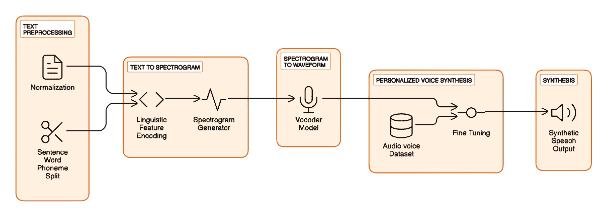
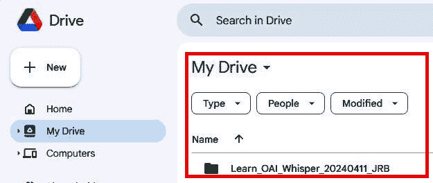

# 第九章：利用 Whisper 进行个性化语音合成

欢迎来到*第九章*，在这一章中，我们将深入探讨**个性化语音合成**（**PVS**）。这一领域涵盖了许多应用和技术，旨在根据个人偏好或需求创建合成语音。PVS 是一个多功能的过程，可以根据不同的目的进行定制，包括辅助技术、虚拟助手开发和数字内容创作。在这个背景下，OpenAI 的 Whisper 工具通过在预处理和注册过程中提供准确的语音数据转录，来实现语音合成。

在开始之前，我们需要区分语音克隆与 PVS。语音克隆涉及创建自然人的语音数字复制品。虽然这一技术有其有效的应用场景，但也带来了重大伦理问题。然而，PVS 专注于根据特定特征创造独特的声音，而不是直接复制某个人的声音。这一区别在讨论语音合成技术的伦理使用时至关重要。在本章中，我们将指导您如何利用 Whisper 的强大功能创建 PVS 模型，确保您掌握如何负责任地使用这项技术。

我们将首先探索**语音合成**和**文本转语音**（**TTS**）的基础知识。您将深入了解神经网络、音频处理和语音合成在这一领域中的作用。在此基础上，我们将指导您如何将音频文件转换为**LJSpeech**格式，这是一种在 TTS 任务中常用的标准化数据集结构。

接下来，我们将向您介绍**深度学习艺术学校**（**DLAS**）工具包，这是一个强大的框架，用于微调 PVS 模型。在这里，您的学习旅程将真正开始。您将了解如何设置训练环境、准备数据集和配置模型架构。通过利用 Whisper 准确的转录结果，您可以将音频片段与相应的文本对齐，创建一个适合用于训练 PVS 模型的数据集。本教程不仅是一个指南，更是您掌握使用 Whisper 进行 PVS 艺术创作的入门通道。准备好迎接启发与激励吧！

通过实际示例和代码片段，您将获得微调预训练 PVS 模型的实战经验，使用您的 LJSpeech 数据集。您将学习如何定制训练过程、选择适当的超参数并评估模型的性能。

最后，我们将测试您微调后的 PVS 模型，合成真实且富有表现力的语音。您将学习如何通过向模型提供文本输入来生成自然的语音，使 PVS 语音栩栩如生。

在本章中，我们将涵盖以下主要内容：

+   理解 PVS 中的 TTS

+   将音频文件转换为 LJSpeech 格式

+   使用 DLAS 工具包微调 PVS 模型

+   使用微调后的 PVS 模型合成语音

到本章结束时，你将全面了解如何利用 Whisper 实现 PVS。你将具备预处理音频数据、微调语音模型并使用 PVS 框架生成真实语音的知识和技能。无论你是语音技术领域的研究人员、开发者还是爱好者，本章将为你提供宝贵的见解和实用技巧，帮助你释放 OpenAI Whisper 在 PVS 中的潜力。

# 技术要求

为了利用 OpenAI 的 Whisper 实现高级应用，本章使用 Python 和 Google Colab 以便于使用和访问。Python 环境的设置包括用于转录任务的 Whisper 库。

**关键要求**：

+   **Google Colab 笔记本**：这些笔记本已设置为以最低所需内存和能力运行我们的 Python 代码。如果有 **T4 GPU** 运行类型可用，选择它可以获得更好的性能。

+   **Python 环境**：每个笔记本都包含加载所需 Python 库的指令。

+   **Hugging Face 账户**：某些笔记本需要 Hugging Face 账户和登录 API 密钥。Colab 笔记本中包含关于此主题的信息。

+   **Audacity**：Audacity 是一个免费的开源数字音频编辑和录音应用程序，支持 Windows、macOS、Linux 和其他类 Unix 操作系统。如果你想合成自己的声音，它是一个非常好的选择。

+   **麦克风和扬声器**：一些笔记本实现了语音录音和音频播放功能。连接到计算机的麦克风和扬声器可能会帮助你体验互动语音功能。

+   **GitHub 仓库访问**：所有 Python 代码，包括示例，均可在本章的 GitHub 仓库中找到（[`github.com/PacktPublishing/Learn-OpenAI-Whisper/tree/main/Chapter09`](https://github.com/PacktPublishing/Learn-OpenAI-Whisper/tree/main/Chapter09)）。这些 Colab 笔记本已经准备好运行，提供了一种实用的动手学习方法。

通过满足这些技术要求，你将能够在不同的环境中探索 Whisper，同时享受 Google Colab 提供的简化体验和 GitHub 上的丰富资源。

# 了解语音合成中的文本到语音

TTS 是语音合成过程中的关键组成部分，它可以将书面文本转化为语音。了解 TTS 的基本原理对于理解语音合成的工作原理以及如何在各种场景中应用它至关重要。*图 9.1* 展示了 TTS 在语音合成中的工作原理的高层次概述，并没有深入探讨技术细节：



图 9.1 – TTS 语音合成流程

TTS 语音合成流程中有五个组件：

1.  **文本预处理**：

    1.  输入文本首先会进行标准化和预处理。

    1.  数字、缩写和特殊字符会被展开成完整的单词。

    1.  文本被划分为单独的句子、单词和音素（独立的音频单位）。

1.  **文本到频谱图**：

    1.  规范化的文本被转化为一系列语言特征，并编码成向量表示。

    1.  一个频谱图生成模型，通常是一个深度学习模型，接收这个编码的文本并生成频谱图。

    1.  频谱图直观地表示了语音声音的频率和强度随时间的变化。

1.  **从频谱图到波形**：

    然后，频谱图被输入到声码器模型中。声码器是一个生成模型，经过训练能够将频谱图转化为可听的波形。它根据频谱图中的频率信息重建语音信号。

1.  **语音合成**：

    为了合成特定人物的声音，TTS 模型会在该人物的语音数据集上进行微调。这使得模型能够学习该人物声音的独特特征、语气和韵律。通过足够的训练数据，生成的语音将模仿目标声音。

1.  **合成**：

    最终，生成的波形被输出为可听的合成语音。结果是一个合成的声音，能够朗读原始输入文本。

现代 TTS 系统能够生成非常自然的语音，具备适当的语调和表现力。TTS 流程，通过文本处理、声学建模和语音合成的复杂互动，构成了 PVS 转型技术的基础。在我们探索语音合成的细节时，理解如何利用 TTS 系统创造个性化语音至关重要。

一种强大的 TTS 实现是 **TorToiSe-TTS-Fast**，它是一个高性能的 TTS 系统，利用神经网络的力量生成真实且富有表现力的语音。接下来的部分将深入探讨 TorToiSe-TTS-Fast 的功能，并展示它如何以惊人的准确性和自然感合成声音。

## 介绍 TorToiSe-TTS-Fast

在 *第五章* 中，我们使用了 gTTS Python 库，它是 Google 翻译 TTS API 的接口。gTTS 允许你使用 Google 的 TTS 引擎将文本转化为语音。这一次，我们将探索 TorToiSe-TTS-Fast 项目，这是一个高性能的 TTS 系统，利用神经网络合成真实语音，而无需微调。接下来，我们将学习如何初始化 `TextToSpeech` 模型，它是 TTS 系统的核心组件。我们将深入了解 `TextToSpeech` 类及其在将文本转化为语音中的作用。

TorToiSe-TTS-Fast 项目的一个令人兴奋的特点是能够使用给定声音的不同音频片段生成语音。该项目提供了一系列预打包的声音，这些声音作为音频片段组织在单独的文件夹中。这些音频片段用于确定声音合成输出的许多属性，如声音的音高和音调、说话速度，甚至说话缺陷，如口吃或结巴。我们将深入选择该预存在的声音样本集中的一个声音。*图 9.2*展示了 TorToiSe-TTS-Fast 语音处理：


图 9.2 – TorToiSe-TTS-Fast 语音处理流水线

通过遵循*图 9.2*的步骤，您可以将额外的声音集成到 TorToiSe 中，增强其多功能性：

1.  收集包含所需语音的音频样本。YouTube 上的访谈（可以使用`youtube-dl`或`pytube` Python 库下载，就像我们在*第六章*中所做的那样）、有声读物和播客都是很好的信息源。我推荐**Audacity**工具作为录制您的声音和处理音频文件的可行选择。

1.  将收集的音频分割成大约每个 10 秒的片段。至少需要 3 个片段，但建议使用更多片段以获得更好的结果。在测试过程中，我尝试了多达 5 个片段。

1.  将音频片段转换为浮点编码和 22,050 Hz 的 WAV 格式。

1.  稍后在本章中运行`LOAIW_ch09_1_Synthesizing_voices_with_tortoise_tts_fast.ipynb`笔记本后，您将看到一个名为`/tortoise/voices/`的目录结构，其中包含音频片段样本。这是 TorToiSe 用来存储和检索音频样本的默认文件夹。如果您创建自己的样本，请在该`/tortoise/voices/`目录中创建一个文件夹并将文件保存在那里。例如，我创建了`/tortoise/voices/josue`文件夹来存储我的音频文件。

1.  将处理过的音频片段转移到新创建的子目录中。

1.  要利用新的语音，请执行`tortoise`工具，并使用`--voice`标志，后面跟上您子目录的名称。

在探索 TorToiSe-TTS-Fast 流水线之后，可以明显感觉到高质量的音频数据是创造令人信服和自然音色的合成语音的基础。准备这些音频数据涉及创建新的录音或处理现有音频文件，以确保它们适合语音合成。这就是 Audacity 发挥作用的地方，作为音频创建、编辑和细化的强大工具。当然，我鼓励您使用其他您已经在音频处理中使用的工具；Audacity 和创建音频文件是可选的。

Audacity 是一个多功能工具，用于创建、编辑和处理音频文件，是语音合成流程中的关键步骤。它允许你录制语音样本、剪辑和分割音频片段、调整音频属性，如音调和速度，并导出多种兼容语音合成工具的格式。利用 Audacity 的功能，你可以准备适合语音合成要求的高质量音频数据。

## 使用 Audacity 进行音频处理

Audacity 的核心是一个多轨音频编辑器和录音机，支持许多操作系统，包括 Windows、macOS、GNU/Linux 和其他类 Unix 系统。它的开源特性确保它对所有用户免费，并培养了一个充满活力的开发者和音频爱好者社区，大家持续贡献其开发和改进。这种协作使 Audacity 拥有了各种功能，从基本的录音和编辑到更高级的特性，如噪声消除、频谱分析和支持多种音频格式。如果你偏好其他音频编辑软件，也可以选择它，使用 Audacity 是可选的。如果你决定安装，它这里有一步步的安装指南。

Audacity 的安装过程非常简单，无论你的操作系统是什么。详细的安装说明可以在 Audacity 网站上找到 ([`support.audacityteam.org/basics/downloading-and-installing-audacity`](https://support.audacityteam.org/basics/downloading-and-installing-audacity))。在这里，我们将介绍将 Audacity 安装并运行在你的机器上的基本步骤。

#### 安装 Audacity for Windows

按照以下步骤操作：

1.  **下载安装程序**：访问 Audacity 官方网站 ([`www.audacityteam.org/`](https://www.audacityteam.org/))，点击 Windows 版本的下载链接。网站会自动检测你的操作系统，但如果需要，你也可以手动选择版本。

1.  `Downloads` 文件夹中）并双击以启动安装。你可能会遇到一个安全提示，询问是否允许安装程序更改你的系统；点击**是**继续。

1.  **按照安装向导操作**：安装程序会引导你完成几个步骤。你将选择首选语言，同意许可协议，选择安装目录，并决定是否执行附加任务，如创建桌面快捷方式。

1.  **完成安装**：配置好你的偏好设置后，点击**安装**开始安装。安装完成后，你可以直接从安装程序启动 Audacity，或者在开始菜单中找到它。

#### 安装 Audacity for macOS

按照以下步骤操作：

1.  **下载 DMG 文件**：访问 Audacity 官网并下载 macOS 版本。网站应自动提供与你系统匹配的版本。

1.  将软件拖入`Applications` 文件夹进行安装。你可能需要使用管理员密码进行身份验证。

1.  `Applications`文件夹。macOS 可能会提示您确认是否信任该应用程序，特别是在第一次运行时。

#### 在 Linux 上安装 Audacity

Linux 用户可以从 Audacity 网站下载 AppImage，或者使用其发行版的包管理器安装 Audacity。对于 AppImage，请按照以下步骤操作：

1.  **使 AppImage 文件可执行**：下载后，右键单击文件，导航至**属性** | **权限**，并勾选使文件可执行的选项。

1.  **运行 Audacity**：双击 AppImage 文件以启动 Audacity。

或者，使用命令如`sudo apt install audacity`（适用于基于 Debian 的发行版）或`sudo yum install audacity`（适用于 Fedora/RHEL）通过终端安装 Audacity。

## 使用 TorToiSe-TTS-Fast 运行笔记本

在更详细了解 Audacity 作为音频创建、编辑和管理工具后，让我们动手使用 TorToiSe-TTS-Fast 进行操作。请找到并打开名为`LOAIW_ch09_1_Synthesizing_voices_with_tortoise_tts_fast.ipynb`的 Colab 笔记本（[`github.com/PacktPublishing/Learn-OpenAI-Whisper/blob/main/Chapter09/LOAIW_ch09_1_Synthesizing_voices_with_tortoise_tts_fast.ipynb`](https://github.com/PacktPublishing/Learn-OpenAI-Whisper/blob/main/Chapter09/LOAIW_ch09_1_Synthesizing_voices_with_tortoise_tts_fast.ipynb)）。该笔记本基于 TorToiSe-TTS-Fast（[`github.com/152334H/tortoise-tts-fast`](https://github.com/152334H/tortoise-tts-fast)）TTS 项目，该项目在不修改基础模型的情况下大幅提升了`TorToiSe`（[`github.com/neonbjb/tortoise-tts`](https://github.com/neonbjb/tortoise-tts)）的性能。

使用该笔记本，我们将通过初始化`TextToSpeech`模型和选择语音来从给定的文本中生成语音。此外，我们还将通过使用随机或自定义语音来探索 TorToiSe-TTS-Fast 项目的灵活性。我们可以通过上传和预处理 WAV 文件来为语音合成创建个性化的语音。

最后，我们将探索结合多种语音生成具有融合特征的语音的迷人能力。通过加载不同语音的样本和条件潜变量，我们可以创建独特而有趣的语音组合。

在本节结束时，您将对语音合成中的 TTS 有一个坚实的理解。您将掌握设置环境、初始化`TextToSpeech`模型、选择语音、生成语音以及使用 TorToiSe-TTS-Fast 项目创建自定义和组合语音的知识和实践技能。这个理解将为进一步探索语音合成的潜力及其在各个领域的应用打下基础。

让我们打开笔记本并运行单元，以更好地理解 TorToiSe-TTS-Fast 项目中的语音合成流程：

1.  **环境设置**：在这里，我们将安装并实例化几个库，每个库在项目设置中扮演着不同的角色：

    ```py
    !git clone https://github.com/152334H/tortoise-tts-fast
    %cd tortoise-tts-fast
    !pip3 install -r requirements.txt --no-deps
    !pip3 install -e .
    !pip3 install git+https://github.com/152334H/BigVGAN.git
    !pip install transformers==4.29.2
    !pip install voicefixer==0.1.2
    %cd tortoise-tts-fast
    from huggingface_hub import notebook_login
    notebook_login()
    from huggingface_hub import whoami
    whoami()
    ```

    让我们简要回顾一下每个库的作用：

    +   `torch`：这是 PyTorch 库，一个广泛使用的开源机器学习库，主要用于计算机视觉和自然语言处理应用。在本项目中，PyTorch 提供了构建和训练神经网络的基础框架，这些神经网络支撑了 TorToiSe-TTS-Fast 的语音合成功能。

    +   `torchaudio`：作为 PyTorch 的扩展，`torchaudio` 提供了在 PyTorch 框架内轻松访问音频处理工具的能力。它用于加载和保存音频文件，并对音频数据进行转换和增强，这些都是语音合成中的关键任务。

    +   `huggingface_hub`：这是 Hugging Face 提供的库，允许用户轻松地将模型和其他文件下载或上传到 Hugging Face Hub，其中可能包含 `TextToSpeech` 类所需的预训练模型或组件。`huggingface_hub` 库还提供了通过 `notebook_login()` 进行 Hub 认证的功能，并通过 `whoami()` 管理用户信息，方便访问 Hub 上存储的用于语音合成的模型和资源。

    +   `transformers (版本 4.29.2)`：这是 Hugging Face 提供的 `transformers` 库，提供了成千上万的预训练模型，涵盖各种自然语言处理任务，包括 TTS。此库支持 TorToiSe-TTS-Fast 项目中的 NLP 和 TTS 功能，提供访问最先进模型和工具的能力。

    +   `voicefixer (版本 0.1.2)`：该工具旨在修复和增强人声录音。`voicefixer` 在语音合成系统处理前改善语音样本的质量，确保合成语音的更高保真度。

    +   `BigVGAN`：TTS 模型使用 `BigVGAN` 库，在语音合成过程中发挥作用，增强生成语音的真实感或质量。

    这些库每个都为 TorToiSe-TTS-Fast 项目的整体功能做出贡献，提供了机器学习、音频处理、模型管理和语音增强的基础工具和框架。这些工具使得人声合成的高效与实用成为可能。

1.  用于合成语音的 `TextToSpeech` 模型。本节中的步骤旨在初始化 TTS 模型，使其能够处理文本输入并生成对应的语音输出，使用所选的声音：

    ```py
    from tortoise.api import TextToSpeech
    from tortoise.utils.audio import load_audio, load_voice, load_voices
    # This will download all the models Tortoise uses from the HuggingFace hub.
    tts = TextToSpeech()
    ```

    以下是前面代码中概述的步骤：

    +   `TextToSpeech``TextToSpeech` 类来自 `tortoise.api` 模块。该类是 TorToiSe-TTS-Fast 项目提供的 TTS 功能的主要接口。

    +   `TextToSpeech`：导入该类后，通过简单调用类构造函数（不带任何参数）创建一个 `TextToSpeech` 实例。这个实例被分配给 `tts` 变量。

    +   `TextToSpeech`，所需的模型会自动从 Hugging Face Hub 下载。此步骤确保所有用于语音合成的必要组件都已本地化。

    +   `TextToSpeech` 类封装了将文本转换为语音所需的功能。初始化它是为语音合成任务做好准备的关键步骤。一旦模型初始化完成，它可以在后续步骤中用于使用各种语音从文本生成语音。

1.  **选择语音**：此部分对于通过允许你选择各种预先存在的语音样本或上传的语音片段来个性化语音合成过程至关重要。

    ```py
    import os
    from ipywidgets import Dropdown
    voices_dir = "tortoise/voices"
    # Get a list of all directories in the voices directory
    voice_names = os.listdir(voices_dir)
    voice_folder = Dropdown(
        options=sorted(voice_names),
        description='Select a voice:',
        value='tom',
        disabled=False,
        style={'description_width': 'initial'},
    )
    voice_folder
    import os
    from ipywidgets import Dropdown
    voices_dir = f"tortoise/voices/{voice_folder.value}"
    # Get a list of all directories in the voices directory
    voice_files = os.listdir(voices_dir)
    voice = Dropdown(
        options=sorted(voice_files),
        description='Select a voice:',
        # value='tom',
        disabled=False,
        style={'description_width': 'initial'},
    )
    Voice
    #Pick one of the voices from the output above
    IPython.display.Audio(filename=f'tortoise/voices/{voice_folder.value}/{voice.value}')
    ```

    选择特定语音进行合成的步骤如下：

    +   `os` 模块用于与操作系统交互，并列出 `tortoise/voices` 目录下所有可用的语音文件夹。此步骤对于识别哪些语音可供合成至关重要。

    +   `Dropdown` 类来自 `ipywidgets` 库。这个小部件允许你从可用的文件夹列表中选择一个语音文件夹。`Dropdown` 小部件配置了由语音文件夹列表填充的选项、描述提示（`"Select a voice:"`）以及其他设置，确保其可用性。

    +   使用 `os.listdir` 函数，以及 `Dropdown` 小部件再次向你展示这些选项。

    +   `IPython.display.Audio` 类直接在 Colab 笔记本中播放选定的语音文件。此功能提供即时的听觉反馈，使你能够确认所选语音是否为期望的合成语音。

    这些步骤共同提供了一种用户友好且互动性强的方法，帮助你选择合成语音。它们确保你能够轻松浏览可用选项，并根据你的偏好或项目需求做出明智的选择。

1.  **生成带有选定语音的语音**：此笔记本部分根据你之前指定的语音从文本生成语音：

    ```py
    text = " Words, once silent, now dance on digital breath, speaking volumes through the magic of text-to-speech."
    preset = "ultra_fast"
    voice = voice_folder.value
    voice_samples, conditioning_latents = load_voice(voice)
    gen = tts.tts_with_preset(text, voice_samples=voice_samples, conditioning_latents=conditioning_latents, preset=preset)
    torchaudio.save(generated_filename, gen.squeeze(0).cpu(), 24000)
    IPython.display.Audio(generated_filename)
    ```

    本节的步骤旨在将你的输入文本转换为所选语音风格的口语。以下是代码中概述的步骤：

    +   `text`。该文本将被合成成语音。

    +   `"ultra_fast"`、`"fast"`、`"standard"` 和 `"high_quality"`。这些选项决定了生成速度与音频质量之间的权衡。

    +   `load_voice` 函数来自 `tortoise.utils.audio`，用于加载选定的语音。此函数返回两个项：`voice_samples` 和 `conditioning_latents`。这些项将调整 TTS 模型，以生成符合所选语音风格的语音。

    +   调用 `tts` 对象（`TextToSpeech` 类的实例）中的 `tts_with_preset` 方法，并传入文本、语音样本、条件潜变量和预设。这一方法根据给定参数合成语音。

    +   使用 `torchaudio.save` 函数。然后通过 `IPython.display.Audio` 播放文件，允许你听到合成的语音。

    这些步骤使你能够使用所选语音的特定特征创建文本的语音版本，实质上使用 PVS 模型进行语音合成。

1.  将 `voice_samples` 和 `conditioning_latents` 设置为 `None`，这将使用随机语音生成语音：

    ```py
    gen = tts.tts_with_preset(text, voice_samples=None, conditioning_latents=None, preset=preset)
    torchaudio.save(' synthetized_voice_sample.wav', gen.squeeze(0).cpu(), 24000)
    IPython.display.Audio('synthetized_voice_sample.wav')
    ```

1.  **使用自定义语音**：以下代码允许用户上传他们的 WAV 文件（时长 6-10 秒）以创建自定义语音：

    ```py
    CUSTOM_VOICE_NAME = "custom"
    import os
    from google.colab import files
    custom_voice_folder = f"tortoise/voices/{CUSTOM_VOICE_NAME}"
    os.makedirs(custom_voice_folder)
    for i, file_data in enumerate(files.upload().values()):
      with open(os.path.join(custom_voice_folder, f'{i}.wav'), 'wb') as f:
        f.write(file_data)
    # Generate speech with the custom voice.
    voice_samples, conditioning_latents = load_voice(CUSTOM_VOICE_NAME)
    gen = tts.tts_with_preset(text, voice_samples=voice_samples, conditioning_latents=conditioning_latents,
                              preset=preset)
    torchaudio.save(f'generated-{CUSTOM_VOICE_NAME}.wav', gen.squeeze(0).cpu(), 24000)
    IPython.display.Audio(f'generated-{CUSTOM_VOICE_NAME}.wav')
    ```

    它使用 `os.makedirs` 创建一个自定义语音文件夹，并将上传的文件保存在该文件夹中。然后加载自定义语音并用它来生成语音，类似于 *步骤 4* 和 *步骤 5*。

1.  `load_voices` 函数加载多个语音（在本例中为 `'pat'` 和 `'william'`）。`tts_with_preset` 方法结合语音样本和条件潜变量，生成具有两种语音特征的语音：

    ```py
    voice_samples, conditioning_latents = load_voices(['freeman', 'deniro'])
    gen = tts.tts_with_preset("Words, once silent, now dance on digital breath, speaking volumes through the magic of text-to-speech.",
                              voice_samples=voice_samples, conditioning_latents=conditioning_latents,
                              preset=preset)
    torchaudio.save('freeman_deniro.wav', gen.squeeze(0).cpu(), 24000)
    IPython.display.Audio('freeman_deniro.wav')
    ```

在对语音合成中的 TTS 基础知识有了初步了解，并探索了 TorToiSe-TTS-Fast 项目的强大功能后，我们将把注意力集中在为语音合成过程准备数据的关键步骤上：将音频文件转换为 LJSpeech 格式。

# PVS 步骤 1 – 将音频文件转换为 LJSpeech 格式

本节及随附的笔记本 `LOAIW_ch09_2_Processing_audio_to_LJ_format_with_Whisper_OZEN.ipynb` 代表了本章中 PVS 三步过程的初步步骤。此步骤以目标语音的音频样本为输入，并将其处理成 LJSpeech 数据集格式。该笔记本演示了如何使用 OZEN 工具包和 OpenAI 的 Whisper 来提取语音、转录并根据 LJSpeech 结构整理数据。最终得到的 LJSpeech 格式数据集，由分段的音频文件和相应的转录组成，作为第二步 *PVS 步骤 2 – 使用 DLAS 工具包微调离散变分自编码器* 的输入，在这一过程中，PVS 模型将使用该数据集进行微调。

LJSpeech 格式的数据集在 TTS 模型中至关重要，因为它为组织音频文件及其相应的转录提供了标准化结构。通过遵循 LJSpeech 格式，研究人员和开发者可以确保与各种 TTS 工具兼容，并促进训练。

LJSpeech 格式的数据集指的是按照**LJSpeech 数据集**（[`keithito.com/LJ-Speech-Dataset/`](https://keithito.com/LJ-Speech-Dataset/)）的结构和组织方式安排音频文件及其对应转录的特定结构。LJSpeech 数据集是一个公共领域的语音数据集，包含 13,100 个由单一发言人朗读七本非虚构书籍中的段落的短音频片段，每个片段都有相应的转录文本。这些音频片段的长度不一，总时长约为 24 小时。在为 TTS 模型训练准备 LJSpeech 格式的数据集时，建议使用以下结构：

+   音频片段应分割成单独的文件，并为每个文件提供相应的转录内容。

+   音频应使用 WAV 文件格式，以避免压缩伪影。

+   音频片段及其转录内容会被保存在名为`wavs`的文件夹中。

+   一个元数据文本文件将每个音频片段映射到其转录内容。该文件应具有通过特殊字符（通常是管道符号`|`）分隔的列，以区分音频文件名、转录文本和标准化转录文本。

+   元数据文件中使用的分隔符不应出现在转录文本中。

+   如果标准化转录不可用，则可以在两个列中使用相同的转录内容，后续流程中再进行标准化。

LJSpeech 格式数据集的文件夹结构如下所示：

```py
/MyDataset
---├── train.txt
---├── valid.txt
---├── /wavs
---------├── 0.wav
---------├── 1.wav
        ...
```

文本文件中的条目将按如下格式进行组织：

```py
wavs/0.wav|This is Josue Batista.
wavs/1.wav|I am the author of the book Learn OpenAI Whisper, Transform Your Understanding of Generative AI
wavs/2.wav|through robust and accurate speech processing solutions.
...
```

LJSpeech 格式被广泛使用，因为它受多种 TTS 工具的支持，例如 TorToiSe，它为 LJSpeech 数据集提供了相关工具。以这种方式格式化数据集，可以立即开始模型训练，而无需额外的格式化步骤。

现在我们了解了 LJSpeech 格式及其应用原因，接下来让我们将音频文件转换为这种格式。这样做将确保我们的数据集与各种 TTS 工具兼容，并为训练 PVS 模型做好准备。

一旦你有了想要合成的语音录音，下一步就是使用 OZEN 工具包预处理音频文件。该工具包简化了提取语音、使用 Whisper 转录并将结果保存为 LJSpeech 格式的过程。它可以处理单个音频文件或整个音频文件夹。

利用 OZEN 工具包和 Whisper，我们可以高效地将音频数据转换为 LJSpeech 格式。该工具包可以自动分割音频文件，生成相应的 WAV 文件，并创建必要的元数据文件（`train.txt` 和 `valid.txt`），将音频文件与它们的转录内容一一对应。

将音频文件转换为 LJSpeech 格式是语音合成流程中的一项关键技能，因为它确保了数据兼容性并促进了训练过程。掌握此技术将为你解决后续步骤，如微调 PVS 模型和语音合成，做好准备。

请查找并打开名为`LOAIW_ch09_2_Processing_audio_to_LJ_format_with_Whisper_OZEN.ipynb`的 Colab 笔记本（[`github.com/PacktPublishing/Learn-OpenAI-Whisper/blob/main/Chapter09/LOAIW_ch09_2_Processing_audio_to_LJ_format_with_Whisper_OZEN.ipynb`](https://github.com/PacktPublishing/Learn-OpenAI-Whisper/blob/main/Chapter09/LOAIW_ch09_2_Processing_audio_to_LJ_format_with_Whisper_OZEN.ipynb)）。该笔记本基于 OZEN Toolkit 项目（[`github.com/devilismyfriend/ozen-toolkit`](https://github.com/devilismyfriend/ozen-toolkit)）。给定一个文件夹或单个音频文件，它将提取语音，使用 Whisper 进行转录，并以 LJ 格式保存（分段音频文件以 WAV 格式存放在`wavs`文件夹中，转录内容存放在`train`和`valid`文件夹中）。让我们逐步解析代码，并提供代码示例：

1.  **克隆 OZEN Toolkit 仓库**：以下命令从 GitHub 克隆 OZEN Toolkit 仓库，其中包含处理音频文件所需的脚本和工具：

    ```py
    !git clone https://github.com/devilismyfriend/ozen-toolkit
    ```

1.  **安装所需的库**：以下命令将安装音频处理、语音识别和文本格式化所需的库。安装完依赖项后，建议重启会话，以确保已安装的包正确初始化：

    ```py
    !pip install transformers
    !pip install huggingface
    !pip install pydub
    !pip install yt-dlp
    !pip install pyannote.audio
    !pip install colorama
    !pip install termcolor
    ozen-toolkit directory:

    ```

    %cd ozen-toolkit

    ```py

    ```

1.  **下载示例音频文件**：如果你没有合成用的音频文件，可以使用此命令从指定的 URL 下载一个示例音频文件进行演示：

    ```py
    /content/ozen-toolkit to store the uploaded files and saves them in that directory:

    ```

    import os

    from google.colab import files

    custom_voice_folder = "./myaudiofile"

    os.makedirs(custom_voice_folder, exist_ok=True)  # 如果目录不存在，则创建

    for filename, file_data in files.upload().items():

    使用`with open(os.path.join(custom_voice_folder, filename), 'wb') as f:`

    f.write(file_data)

    %ls -l "$PWD"/{*,.*}

    ```py

    ```

1.  使用`configparser`库处理`"config.ini"`文件。它定义了各种设置，如 Hugging Face API 密钥、Whisper 模型、设备、分段和分割模型、验证比例以及分段参数：

    ```py
    import configparser
    config = configparser.ConfigParser()
    config['DEFAULT'] = {
        'hf_token': '<Your HF API key>',
        'whisper_model': 'openai/whisper-medium',
        'device': 'cuda',
        'diaization_model': 'pyannote/speaker-diarization',
        'segmentation_model': 'pyannote/segmentation',
        'valid_ratio': '0.2',
        'seg_onset': '0.7',
        'seg_offset': '0.55',
        'seg_min_duration': '2.0',
        'seg_min_duration_off': '0.0'
    }
    with open('config.ini', 'w') as configfile:
        config.write(configfile)
    ```

1.  使用`ozen.py`脚本并将示例音频文件作为参数（或上传的文件）：

    ```py
    ozen.py requires Hugging Face’s pyannote/segmentation model. This is a gated model; you MUST request access before attempting to run the next cell. Thankfully, getting access is relatively straightforward and fast. Here are the steps:1.  You must already have a Hugging Face account; if you do not have one, see the instructions in the notebook for *Chapter 3*: `LOAIW_ch03_working_with_audio_data_via_Hugging_Face.ipynb` ([`github.com/PacktPublishing/Learn-OpenAI-Whisper/blob/main/Chapter03/LOAIW_ch03_working_with_audio_data_via_Hugging_Face.ipynb`](https://github.com/PacktPublishing/Learn-OpenAI-Whisper/blob/main/Chapter03/LOAIW_ch03_working_with_audio_data_via_Hugging_Face.ipynb))2.  Visit [`hf.co/pyannote/segmentation`](https://hf.co/pyannote/segmentation) to accept the user conditions:
    ```


图 9.3 – Hugging Face 上的 pyannote/segmentation 门控模型

1.  在确保已访问 pyannote/segmentation 模型后运行该单元格。`ozen.py`脚本处理音频文件，提取语音，使用 Whisper 进行转录，并以 LJSpeech 格式保存输出。该脚本将 DJ 格式文件保存在名为`ozen-toolkit/output/<音频文件名+时间戳>/`的文件夹中。以下是预期文件结构的示例：

```py
ozen-toolkit/output/
---├── Learn_OAI_Whisper_Sample_Audio01.mp3_2024_03_16-16_36/
------------------├── valid.txt
------------------├── train.txt
------------------├── wavs/
--------------------------├── 0.wav
--------------------------├── 1.wav
--------------------------├── 2.wav
```

1.  **挂载 Google Drive**：以下代码行将你的 Google Drive 挂载到 Colab 环境中，允许访问 Google Drive 以保存检查点和加载数据集：

    ```py
    from google.colab import drive
    drive.mount('/content/gdrive')
    ```

1.  将 `ozen-toolkit/output` 目录保存到 Google Drive。运行单元格后，使用网页浏览器打开 Google Drive，如 *图 9.4* 所示；你会看到一个名为 `output` 的目录，其中包含 DJ 格式的数据集文件：

    ```py
    %cp -r /content/ozen-toolkit/output/ /content/gdrive/MyDrive/ozen-toolkit/output/
    ```

    以下是输出结果：


图 9.4 – 从 ozen.py 脚本中识别 DJ 格式文件的位置

运行单元格后，使用网页浏览器打开 Google Drive；你会看到一个名为 `output` 的目录，其中包含 DJ 格式的数据集文件：


图 9.5 – Google Colab 中 DJ 格式输出文件夹示例

`LOAIW_ch09_2_Processing_audio_to_LJ_format_with_Whisper_OZEN.ipynb` 笔记本中的 Python 代码演示了如何设置环境、安装依赖项、配置 OZEN 工具包、使用 Whisper 处理音频文件并将输出保存为 LJSpeech 格式。它提供了一个简化的工作流程，用于为进一步分析或下游任务准备音频数据。

现在我们的音频数据已转换为 LJSpeech 格式，我们已经做好了准备，进入语音合成过程的下一个关键阶段：使用强大的 DLAS 工具包微调 PVS 模型。`LOAIW_ch09_3_Fine-tuning_PVS_models_with_DLAS.ipynb` 笔记本将在下一节详细介绍这个过程。通过利用 DLAS 工具包的全面功能和结构化的 LJSpeech 数据集，我们可以创建一个个性化的语音模型，精准且自然地捕捉目标语音的独特特征。

# PVS 步骤 2 – 使用 DLAS 工具包微调 PVS 模型

微调 PVS 模型是创建个性化语音、捕捉语音独特特征的关键步骤。为了获得高质量的结果，必须使用一个强大的框架，利用最先进的技术，并提供灵活性来定制训练过程。DLAS 工具包成为微调 PVS 模型的综合解决方案，提供了多种功能和能力。

在开始微调过程之前，确保必要的组件和资源到位至关重要。这包括设置合适的训练环境，比如 Google Colab，它提供了强大的 GPU 和足够的 RAM 来处理 PVS 模型的计算需求。检查 NVIDIA GPU 的可用性和兼容性对于确保训练期间的最佳性能至关重要。

数据集准备阶段是微调 PVS 模型的另一个重要方面。DLAS 工具包要求具有特定仓库结构和依赖关系的数据集，必须在继续之前克隆和安装。此外，预训练模型检查点，如**离散变分自编码器**（**dVAE**），在学习语音数据的离散潜在表示中发挥关键作用。验证这些检查点的完整性对加速微调过程和获得更好结果至关重要。

基于数据集大小选择适当的超参数对于微调 PVS 模型至关重要。DLAS 工具包为超参数提供智能建议，如批量大小、学习率衰减步数和验证频率，所有这些建议都考虑了数据集的特定特征。理解这些超参数如何计算以及它们对训练过程的影响对于实现最佳结果至关重要。

定制化是使用 DLAS 工具包微调 PVS 模型的另一个关键方面。研究人员和开发人员通常对训练设置有特定的需求和偏好，例如实验名称、数据集名称以及开启或关闭某些功能。DLAS 工具包提供了修改这些设置的灵活性，允许根据具体需求和目标进行定制化微调过程。

DLAS 工具包利用 YAML 配置文件来确保微调过程根据所需规范进行配置。该文件作为训练过程的蓝图，指定了各种参数和设置。工具包使用复杂的 `sed` 命令将定制的训练设置应用于 YAML 文件，确保微调过程按特定要求进行，并实现实验的可重现性（`sed` 代表流编辑器，是一种强大的命令行实用程序，用于使用简单、紧凑的编程语言解析和转换文本）。

配置文件准备就绪后，可以通过运行 DLAS 工具包提供的 `train.py` 脚本启动训练过程。此脚本利用 GPU 的强大计算能力有效地微调 PVS 模型，利用优化算法和损失函数指导学习过程。监控训练进度并使用适当的指标评估模型的性能对于确保微调 PVS 模型的质量至关重要。

最后，保存和导出经过微调的 PVS 模型对于将来的使用和部署至关重要。DLAS 工具包提供了便捷的方法来存储训练模型的检查点和实验文件，确保数据的持久性，并促进研究协作。对微调模型的适当管理和组织对于无缝集成到各种应用程序中至关重要，如虚拟助手、有声读物朗读和个性化语音界面。

研究人员和开发人员可以通过理解细化 PVS 模型时所涉及的组件、过程和注意事项，利用 DLAS 工具包创建个性化的语音，捕捉其中的细微差别和特点。定制训练过程、选择合适的超参数以及利用预训练的检查点，使用户能够实现高质量的结果，并探索语音合成中的令人兴奋的可能性。

请查找并打开名为 `LOAIW_ch09_3_Fine-tuning_PVS_models_with_DLAS.ipynb` 的 Colab 笔记本 ([`github.com/PacktPublishing/Learn-OpenAI-Whisper/blob/main/Chapter09/LOAIW_ch09_3_Fine-tuning_PVS_models_with_DLAS.ipynb`](https://github.com/PacktPublishing/Learn-OpenAI-Whisper/blob/main/Chapter09/LOAIW_ch09_3_Fine-tuning_PVS_models_with_DLAS.ipynb))。

本笔记本使用 DLAS 工具包对 PVS 模型进行微调。它基于 *TorToiSe fine-tuning with DLAS* 项目，由 James Betker 开发 ([`github.com/152334H/DL-Art-School`](https://github.com/152334H/DL-Art-School))。我克隆并修改了代码，使其能在 Google Colab 上运行，并利用 NVIDIA GPU 进行训练。

让我们逐步浏览 `LOAIW_ch09_3_Fine-tuning_PVS_models_with_DLAS.ipynb` 笔记本中的步骤：

1.  `nvidia-smi` 命令。如果连接了 GPU，它会打印出 GPU 的信息：

    ```py
    gpu_info = !nvidia-smi
    gpu_info = '\n'.join(gpu_info)
    if gpu_info.find('failed') >= 0:
      print('Not connected to a GPU')
    else:
      print(gpu_info)
    ```

1.  `psutil` 库。如果它使用的是高内存的运行时，它会打印出一条消息：

    ```py
    from psutil import virtual_memory
    ram_gb = virtual_memory().total / 1e9
    print('Your runtime has {:.1f} gigabytes of available RAM\n'.format(ram_gb))
    if ram_gb < 20:
      print('Not using a high-RAM runtime')
    else:
      print('You are using a high-RAM runtime!')
    ```

1.  **挂载 Google Drive**：以下代码将您的 Google Drive 挂载，以便保存训练的检查点并加载数据集：

    ```py
    from google.colab import drive
    drive.mount('/content/gdrive')
    ```

1.  **安装依赖项**：它克隆了 DLAS 仓库，下载了预训练的模型检查点，并安装了所需的依赖项：

    ```py
    !git clone https://github.com/josuebatista/DL-Art-School.git
    %cd DL-Art-School
    !wget https://huggingface.co/Gatozu35/tortoise-tts/resolve/main/dvae.pth -O experiments/dvae.pth
    !wget https://huggingface.co/jbetker/tortoise-tts-v2/resolve/main/.models/autoregressive.pth -O experiments/autoregressive.pth
    Dataset_Training_Path and ValidationDataset_Training_Path, click on Google Colab’s Files option and search Google Drive for the directory where the DJ-format datasets were stored in the previous notebook. *Figure 9**.6* shows an example of where the DJ-format dataset is found. Keep in mind that *Figure 9**.6* is just an example. Do not search for that literal name. Instead, you must search for the directory name you set while creating the DJ-formatted files:
    ```


图 9.6 – 在前一个笔记本创建的输出目录中搜索 DJ 格式数据集的示例

以下是执行超参数计算的完整脚本。代码列出后将提供其工作原理的解释：

```py
from pathlib import Path
from math import ceil
DEFAULT_TRAIN_BS = 64
DEFAULT_VAL_BS = 32
Dataset_Training_Path = "/content/gdrive/MyDrive/Generative_AI/Deep_Fakes_Voice/output/Learn_OAI_Whisper_Sample_Audio01.mp3_2024_03_16-16_36/train.txt" #@param {type:"string"}
ValidationDataset_Training_Path = "/content/gdrive/MyDrive/Generative_AI/Deep_Fakes_Voice/output/Learn_OAI_Whisper_Sample_Audio01.mp3_2024_03_16-
if Dataset_Training_Path == ValidationDataset_Training_Path:
  print("WARNING: training dataset path == validation dataset path!!!")
  print("\tThis is technically okay but will make all of the validation metrics useless. ")
  print("it will also SUBSTANTIALLY slow down the rate of training, because validation datasets are supposed to be much smaller than training ones.")
def txt_file_lines(p: str) -> int:
  return len(Path(p).read_text().strip().split('\n'))
training_samples = txt_file_lines(Dataset_Training_Path)
val_samples = txt_file_lines(ValidationDataset_Training_Path)
if training_samples < 128: print("WARNING: very small dataset! the smallest dataset tested thus far had ~200 samples.")
if val_samples < 20: print("WARNING: very small validation dataset! val batch size will be scaled down to account")
def div_spillover(n: int, bs: int) -> int: # returns new batch size
  epoch_steps,remain = divmod(n,bs)
  if epoch_steps*2 > bs: return bs # don't bother optimising this stuff if epoch_steps are high
  if not remain: return bs # unlikely but still
  if remain*2 < bs: # "easier" to get rid of remainder -- should increase bs
    target_bs = n//epoch_steps
  else: # easier to increase epoch_steps by 1 -- decrease bs
    target_bs = n//(epoch_steps+1)
  assert n%target_bs < epoch_steps+2 # should be very few extra
  return target_bs
if training_samples < DEFAULT_TRAIN_BS:
  print("WARNING: dataset is smaller than a single batch. This will almost certainly perform poorly. Trying anyway")
  train_bs = training_samples
else:
  train_bs = div_spillover(training_samples, DEFAULT_TRAIN_BS)
if val_samples < DEFAULT_VAL_BS:
  val_bs = val_samples
else:
  val_bs = div_spillover(val_samples, DEFAULT_VAL_BS)
steps_per_epoch = training_samples//train_bs
lr_decay_epochs = [20, 40, 56, 72]
lr_decay_steps = [steps_per_epoch * e for e in lr_decay_epochs]
print_freq = min(100, max(20, steps_per_epoch))
val_freq = save_checkpoint_freq = print_freq * 3
print("===CALCULATED SETTINGS===")
print(f'{train_bs=} {val_bs=}')
print(f'{val_freq=} {lr_decay_steps=}')
print(f'{print_freq=} {save_checkpoint_freq=}')
```

让我们分解这一部分的目的和步骤：

+   代码导入了必要的库：`pathlib` 中的 `Path` 用于处理文件和目录，`ceil` 是内建 `math` 模块中的一个函数，用于将数字向上舍入到最接近的整数。

+   它定义了默认的训练和验证批量大小值：`DEFAULT_TRAIN_BS = 64 和 DEFAULT_VAL_BS =` `32`。

+   您需要提供训练和验证数据集的路径：`Dataset_Training_Path` 和 `ValidationDataset_Training_Path`。

+   代码检查训练和验证数据集路径是否相同。如果相同，它将打印出警告信息，指出验证指标将无用，并且训练速度将显著变慢。

+   代码定义了一个辅助函数 `txt_file_lines`，它以文件路径作为输入，并返回文件中的行数。

+   它通过调用 `txt_file_lines` 并传入相应的数据集路径来计算训练和验证样本。

+   如果数据集的大小较小，代码会打印警告信息：训练样本小于 128，验证样本小于 20。

+   它定义了一个辅助函数 `div_spillover`，该函数以样本数量（`n`）和批次大小（`bs`）作为输入，并返回调整后的批次大小，以最小化每个 epoch 中剩余样本的数量。

+   代码根据训练样本的数量计算训练批次大小（`train_bs`）。如果训练样本数量小于 `DEFAULT_TRAIN_BS`，则将 `train_bs` 设置为训练样本数量并打印警告信息。否则，它会调用 `div_spillover`，并使用训练样本数量和 `DEFAULT_TRAIN_BS` 来计算调整后的批次大小。

+   类似地，它根据验证样本的数量计算验证批次大小（`val_bs`）。如果验证样本数量小于 `DEFAULT_VAL_BS`，则将 `val_bs` 设置为验证样本数量。否则，它会调用 `div_spillover`，并使用验证样本数量和 `DEFAULT_VAL_BS` 来计算调整后的批次大小。

+   代码通过将训练样本数量除以训练批次大小来计算每个 epoch 的步数（`steps_per_epoch`）。

+   它通过 `lr_decay_epochs = [20, 40,` `56, 72]` 定义学习率衰减应该发生的 epochs。

+   代码通过将 `steps_per_epoch` 与 `lr_decay_epochs` 中的每个值相乘来计算学习率衰减的相应步数（`lr_decay_steps`）。

+   它根据每个 epoch 的步数计算打印训练进度的频率（`print_freq`），最小为 20，最大为 100。

+   代码将验证频率和保存检查点的频率（`val_freq` 和 `save_checkpoint_freq`）设置为 `print_freq` 值的三倍。

+   最后，代码打印计算出的设置：`train_bs`、`val_bs`、`val_freq`、`lr_decay_steps`、`print_freq` 和 `save_checkpoint_freq`。

+   来自 DLAS 训练器的创建者，`print_freq`、`val_freq` 和 `save_checkpoint_freq` 的值应该根据数据集的大小进行调整。Python 代码给出了推荐值：`val_freq == save_checkpoint_freq == print_freq*3`；`print_freq == min(epoch_steps,100)`。再次强调，这些是建议值；我鼓励你尝试不同的值并比较结果，以找到最佳的超参数设置。

通过计算这些超参数，代码旨在提供可以用于训练 PVS 模型的合理默认值。然而，如果需要，我们可以在后续的部分覆盖这些计算出的值。

1.  **训练设置**：这一部分允许我们根据需求和可用资源自定义训练设置。它提供了灵活性，可以命名实验、指定数据集名称、开启或关闭某些功能，并覆盖计算得出的设置。代码中还包括了注释和警告，指导你根据系统的存储和计算能力做出合适的选择：

    ```py
    Experiment_Name = "Learn_OAI_Whisper_20240316"
    Dataset_Training_Name= "TestDataset"
    ValidationDataset_Name = "TestValidation"
    SaveTrainingStates = False
    Keep_Last_N_Checkpoints = 0
    Fp16 = False
    Use8bit = True
    TrainingRate = "1e-5"
    TortoiseCompat = False
    TrainBS = ""
    ValBS = ""
    ValFreq = ""
    LRDecaySteps = ""
    PrintFreq = ""
    SaveCheckpointFreq = ""
    def take(orig, override):
      if override == "": return orig
      return type(orig)(override)
    train_bs = take(train_bs, TrainBS)
    val_bs = take(val_bs, ValBS)
    val_freq = take(val_freq, ValFreq)
    lr_decay_steps = eval(LRDecaySteps) if LRDecaySteps else lr_decay_steps
    print_freq = take(print_freq, PrintFreq)
    save_checkpoint_freq = take(save_checkpoint_freq, SaveCheckpointFreq)
    assert len(lr_decay_steps) == 4
    gen_lr_steps = ', '.join(str(v) for v in lr_decay_steps)
    ```

    让我们来分解这一部分的目的和步骤：

    +   你可以指定以下训练设置：

        +   `Experiment_Name`: 用于命名实验的字符串。

        +   `Dataset_Training_Name`: 用于命名训练数据集的字符串。

        +   `ValidationDataset_Name`: 用于命名验证数据集的字符串。

        +   `SaveTrainingStates`: 一个布尔值，用于指示是否保存训练状态。

        +   `Keep_Last_N_Checkpoints`: 一个整数滑块，用于指定要保留的检查点数量。将其设置为 0 表示保留所有保存的模型。

    +   代码提供了注释和警告：

        +   它提到，如果保持所有保存的模型（将`Keep_Last_N_Checkpoints`设置为 0），可能会导致存储不足的问题。

        +   没有训练状态时，`Fp16`: 一个布尔值，用于开启或关闭 16 位浮点精度。

        +   `Use8bit`: 一个布尔值，用于开启或关闭 8 位精度。

        +   `TrainingRate`: 用于指定学习率的字符串。

        +   `TortoiseCompat`: 一个布尔值，用于开启或关闭与 TorToiSe 模型的兼容性。建议在训练过程中开启它以引入破坏性更改，然后禁用它以重现旧的模型。

    +   计算得出的设置覆盖：

        +   你可以通过指定`TrainBS`、`ValBS`、`ValFreq`、`LRDecaySteps`、`PrintFreq`和`SaveCheckpointFreq`的值来手动覆盖前一单元格中计算得出的设置。

        +   如果为空，则使用前一单元格中计算得出的默认值。

    +   代码定义了一个`take`函数，用于覆盖计算得出的设置。如果覆盖值为空字符串，它将返回原始值；否则，返回覆盖后的值。

    +   代码将覆盖后的值或默认值分配给相应的变量：`train_bs`、`val_bs`、`val_freq`、`lr_decay_steps`、`print_freq`和`save_checkpoint_freq`。

    +   最后，代码提示你在编辑设置后运行该单元格。

1.  `sed`命令：

    ```py
    %cd /content/DL-Art-School
    # !wget https://raw.githubusercontent.com/152334H/DL-Art-School/master/experiments/EXAMPLE_gpt.yml -O experiments/EXAMPLE_gpt.yml
    !wget https://raw.githubusercontent.com/josuebatista/DL-Art-School/master/experiments/EXAMPLE_gpt.yml -O experiments/EXAMPLE_gpt.yml
    import os
    %cd /content/DL-Art-School
    !sed -i 's/batch_size: 128/batch_size: '"$train_bs"'/g' ./experiments/EXAMPLE_gpt.yml
    !sed -i 's/batch_size: 64/batch_size: '"$val_bs"'/g' ./experiments/EXAMPLE_gpt.yml
    !sed -i 's/val_freq: 500/val_freq: '"$val_freq"'/g' ./experiments/EXAMPLE_gpt.yml
    !sed -i 's/500, 1000, 1400, 1800/'"$gen_lr_steps"'/g' ./experiments/EXAMPLE_gpt.yml
    !sed -i 's/print_freq: 100/print_freq: '"$print_freq"'/g' ./experiments/EXAMPLE_gpt.yml
    !sed -i 's/save_checkpoint_freq: 500/save_checkpoint_freq: '"$save_checkpoint_freq"'/g' ./experiments/EXAMPLE_gpt.yml
    !sed -i 's+CHANGEME_validation_dataset_name+'"$ValidationDataset_Name"'+g' ./experiments/EXAMPLE_gpt.yml
    !sed -i 's+CHANGEME_path_to_validation_dataset+'"$ValidationDataset_Training_Path"'+g' ./experiments/EXAMPLE_gpt.yml
    if(Fp16==True):
      os.system("sed -i 's+fp16: false+fp16: true+g' ./experiments/EXAMPLE_gpt.yml")
    !sed -i 's/use_8bit: true/use_8bit: '"$Use8bit"'/g' ./experiments/EXAMPLE_gpt.yml
    !sed -i 's/disable_state_saving: true/disable_state_saving: '"$SaveTrainingStates"'/g' ./experiments/EXAMPLE_gpt.yml
    !sed -i 's/tortoise_compat: True/tortoise_compat: '"$TortoiseCompat"'/g' ./experiments/EXAMPLE_gpt.yml
    !sed -i 's/number_of_checkpoints_to_save: 0/number_of_checkpoints_to_save: '"$Keep_Last_N_Checkpoints"'/g' ./experiments/EXAMPLE_gpt.yml
    !sed -i 's/CHANGEME_training_dataset_name/'"$Dataset_Training_Name"'/g' ./experiments/EXAMPLE_gpt.yml
    !sed -i 's/CHANGEME_your_experiment_name/'"$Experiment_Name"'/g' ./experiments/EXAMPLE_gpt.yml
    !sed -i 's+CHANGEME_path_to_training_dataset+'"$Dataset_Training_Path"'+g' ./experiments/EXAMPLE_gpt.yml
    if (not TrainingRate=="1e-5"):
      os.system("sed -i 's+!!float 1e-5 # CHANGEME:+!!float '" + TrainingRate + "' #+g' ./experiments/EXAMPLE_gpt.yml")
    ```

    让我们来分解这一部分的目的和步骤：

    +   代码使用`%cd`魔法命令将当前目录更改为`/content/DL-Art-School`。

    +   它使用`wget`命令从 GitHub 仓库`152334H/DL-Art-School`下载一个名为`EXAMPLE_gpt.yml`的全新 YAML 配置文件，并将其保存在`experiments`目录中。

    +   代码接着使用一系列`sed`命令，根据用户定义的设置修改`EXAMPLE_gpt.yml`文件中的值：

        +   它用分别存储在`$train_bs`和`$val_bs`变量中的值替代训练和验证的`batch_size`值。

        +   它将`val_freq`值更新为存储在`$val_freq`中的值。

        +   它用 `$gen_lr_steps` 中存储的值替换学习率衰减步骤。

        +   它用 `$print_freq` 和 `$save_checkpoint_freq` 中存储的相应值更新 `print_freq` 和 `save_checkpoint_freq` 的值。

    +   该代码将 YAML 文件中的占位符替换为用户定义的值。

    +   最后，如果 `TrainingRate` 不等于默认值 `1e-5`，代码会使用 `sed` 将 YAML 文件中的 `CHANGEME:` 占位符替换为用户定义的 `TrainingRate` 值。

    通过修改 YAML 文件中的用户指定值，训练过程可以根据您的需求进行定制。这确保了训练过程是基于您的偏好和数据集规格配置的。

1.  使用配置好的 YAML 文件的 `train.py` 脚本。如果您对结果满意并看到以下输出，按下该单元格的停止按钮：

    ```py
    INFO:base:Saving models and training states
    ```

    *图 9.7* 显示了输出示例和 Google Colab **文件**界面中 `60_gtp.pht` 检查点的样子：


图 9.7 – 60 轮训练时检查点文件的示例

如果您的训练过程保存了很多模型，可能会超过 Google Colab 运行时的存储限制。为防止这种情况，请尝试在训练过程中通过文件资源管理器面板删除 `/content/DL-Art-School/experiments/$Experiment_Name/(models|training_state)/` 中的旧检查点。训练崩溃后恢复训练需要编辑配置文件，因此尽量避免这种情况发生：

```py
%cd /content/DL-Art-School/codes
!python3 train.py -opt ../experiments/EXAMPLE_gpt.yml
```

1.  将 `experiments` 文件夹上传到 Google Drive 以确保数据持久性：

    ```py
    Experiment_Name variable:
    ```



图 9.8 – Google Drive 中包含 DLAS 检查点文件的文件夹示例

您将在 `<Experiment_Name>/models` 文件夹中找到模型检查点——也就是带有 `.pth` 扩展名的文件：


图 9.9 – DLAS 检查点文件示例。在接下来的步骤中，您将需要一个检查点文件来合成经过微调的 PVS 模型。

这就结束了我们对使用 DLAS 工具包微调 PVS 的概述。那个 `.pth` 文件就是我们刚刚用 DLAS 创建的微调 PVS 模型。在接下来的步骤中，我们将使用该文件通过 TorToiSe-TTS-Fast 合成语音。

微调 PVS 模型 – 超参数与数据集大小

在微调 PVS 模型时，考虑超参数与数据集大小之间的关系至关重要。Google Colab 训练笔记本会根据提供的数据集大小自动建议合适的超参数，以确保最佳性能和结果。

需要记住的一个关键点是每个 epoch 的步数（`epoch_steps`）是根据`dataset_size // batch_size`计算得出的。训练器会丢弃部分批次，因此选择一个能够整除数据集的批次大小非常重要。

如果您的数据集相对较小（50-500 个样本），请考虑调整以下超参数：

**- 减小批次大小**：为了最小化丢弃样本，选择一个能够整除数据集大小的批次大小。

`gen_lr_steps`应小于`epoch_steps * 10`。实验表明，如果在第 20 个 epoch 没有衰减，损失可能会增加。

根据数据集的大小调整`print_freq`、`val_freq`和`save_checkpoint_freq`。推荐的设置是`val_freq == save_checkpoint_freq == print_freq*3`；`print_freq == min(epoch_steps,100)`。

通过根据数据集大小精确调节这些超参数，您可以优化微调过程，并在 PVS 模型中获得更好的结果。

成功使用 DLAS 工具包微调我们的 PVS 模型后，我们现在准备通过合成语音来测试我们的个性化语音，以捕捉目标语音的精髓。在下一部分中，我们将探索使用微调后的模型生成真实且富有表现力的语音，将合成的语音赋予生命，并开启各种令人兴奋的应用潜力。

# PVS 步骤 3 – 使用微调后的 PVS 模型合成语音

使用微调后的 PVS 模型合成语音是语音合成过程的高潮，此时个性化的语音被赋予生命。它是微调模型进行测试的阶段，生成真实且自然的语音。能够使用微调后的 PVS 模型合成语音，打开了各种应用场景，从创建虚拟助手、电子书旁白到个性化语音界面。

在开始语音合成之旅时，有几个关键组件和考虑因素需要注意。首先，必须具备适合的计算环境，能够处理语音合成的计算需求。这通常涉及到利用 GPU 的强大计算能力，特别是 NVIDIA GPU，这可以显著加速合成过程。检查 GPU 的可用性和兼容性对于确保语音生成的顺利和高效至关重要。

除了硬件要求外，语音合成过程还依赖于强大的软件堆栈。TorToiSe-TTS-Fast 项目是一个高性能的 TTS 系统，成为了一个强大的工具。为了使用 TorToiSe-TTS-Fast，必须克隆项目仓库并安装所需的依赖项，确保所有必要的库和包都已准备就绪。

加载经过微调的 PVS 模型是语音合成过程中的关键步骤。在微调阶段，我们将模型存储在**Google Drive**中作为检查点文件或序列化模型对象。微调模型的存储位置和格式可能会根据您在微调过程中使用的具体位置有所不同。

在加载完经过微调的 PVS 模型后，下一步是准备将要合成成语音的文本输入。根据所需的输出，文本输入可以是一个单句、一个段落或一份脚本。确保文本输入格式正确，并且没有任何可能影响合成语音质量的错误或不一致性是至关重要的。

语音合成过程包括将文本输入馈送到经过微调的 PVS 模型，并生成相应的音频输出。在这个过程中，模型运用其学到的知识将文本转化为模仿我们作为基础使用的声音的语音。合成过程可能涉及多种技术，如神经声码器，以生成高质量的音频波形。

根据具体要求和偏好，在语音合成过程中可以调整各种参数和设置。这些参数可能包括说话速率、音调、音量和生成语音的情感语气。微调这些参数可以更好地控制最终输出，并有助于实现合成语音的期望表现力和自然度。

一旦语音合成过程完成，生成的音频可以保存为适合播放的文件格式，如 WAV 或 MP3。这使我们能够轻松地将合成语音集成到各种应用和平台中。在选择输出文件格式时，需要考虑期望的音频质量和兼容性——即，`"ultra_fast"`、`"fast"`（默认）、`"standard"`或`"high_quality"`。

最后，评估合成语音的质量和自然性是过程中的关键步骤。这可以包括主观评估，例如由人工评估人员进行的听力测试，以及衡量生成语音各个方面的客观指标，如清晰度、自然性和与目标声音的相似度。根据评估结果进行迭代优化和微调，可以帮助提高合成语音的整体质量。

研究人员和开发者通过了解合成语音所涉及的组件、考虑事项和步骤，可以释放个性化语音生成的潜力。创造出能够捕捉声音本质的逼真且富有表现力的语音，为多个领域带来了激动人心的可能性，从娱乐和教育到无障碍技术及更多。通过正确的工具、技巧和对细节的关注，使用微调 PVS 模型的语音合成过程可以成为语音和音频处理领域中一项强大而具有变革性的技术。

请找到并打开名为 `LOAIW_ch09_4_Synthesizing_speech_using_fine-tuned_PVS_models.ipynb` 的 Colab 笔记本（[`github.com/PacktPublishing/Learn-OpenAI-Whisper/blob/main/Chapter09/LOAIW_ch09_4_Synthesizing_speech_using_fine-tuned_PVS_models.ipynb`](https://github.com/PacktPublishing/Learn-OpenAI-Whisper/blob/main/Chapter09/LOAIW_ch09_4_Synthesizing_speech_using_fine-tuned_PVS_models.ipynb)）。

本笔记本演示了如何检查 GPU 和 RAM，安装必要的库，加载微调的 PVS 模型，使用该模型合成语音，并播放生成的音频。代码依赖于 tortoise-TTS-Fast 项目来实现高性能的语音合成。接下来我们将逐步讲解 `LOAIW_ch09_4_Synthetizing_speech_using_fine-tuned_PVS_models.ipynb` 文件中的代码，包括解释和代码示例：

1.  `nvidia-smi` 命令。它会打印 GPU 信息，如果连接了 GPU，则显示相关信息；否则，会提示没有连接 GPU：

    ```py
    gpu_info = !nvidia-smi
    gpu_info = '\n'.join(gpu_info)
    if gpu_info.find('failed') >= 0:
      print('Not connected to a GPU')
    else:
      print(gpu_info)
    ```

1.  `psutil` 库。它会打印可用的 RAM 数量（单位为 GB），并指示是否使用高内存运行时：

    ```py
    from psutil import virtual_memory
    ram_gb = virtual_memory().total / 1e9
    print('Your runtime has {:.1f} gigabytes of available RAM\n'.format(ram_gb))
    if ram_gb < 20:
      print('Not using a high-RAM runtime')
    else:
      print('You are using a high-RAM runtime!')
    ```

1.  从 GitHub 获取 `tortoise-tts-fast` 仓库并使用 `pip3` 安装所需的依赖项：

    ```py
    !git clone **https://github.com/152334H/tortoise-tts-fast**
    %cd tortoise-tts-fast
    !pip3 install -r requirements.txt --no-deps
    transformers, voicefixer, and BigVGAN, using pip3:

    ```

    !pip3 install transformers==4.29.2

    !pip3 uninstall voicefixer

    !pip3 install voicefixer==0.1.2

    !pip3 install git+https://github.com/152334H/BigVGAN.git

    ```py

    ```

1.  **挂载 Google Drive**：我们必须挂载 Google Drive 以加载之前创建的微调 PVS 模型：

    ```py
    from google.colab import drive
    drive.mount('/content/gdrive')
    ```

1.  `gpt_path`) 和需要合成的文本（`text`）：

    ```py
    gpt_path = '/content/gdrive/MyDrive/<filepath/ filename_gpt.pth'
    .pth checkpoint file in Google Colab’s Copy Path:
    ```


图 9.10 – 在 Google Colab 中通过 DLAS 创建的检查点文件示例

1.  使用指定的参数运行 `tortoise_tts.py` 脚本，包括用于推理速度的 `--preset` 选项、用于微调模型路径的 `--ar_checkpoint` 选项、用于输出文件名的 `-o` 选项，以及需要合成的文本：

    ```py
    tortoise-tts-fast/scripts/results/ directory. You will find the generated audio from the voice synthesis model in that directory. We use IPython to display and play the synthesized audio file.

    ```

    import IPython

    IPython.display.Audio('/content/tortoise-tts-fast/scripts/results/random_00_00.wav')

    ```py

    *Figure 9**.11* shows an example of the directory structure and files created by TorToiSe-TTS-Fast:
    ```


图 9.11 – 使用微调的 PVS 模型检查点 .pth 文件通过 TorToiSe-TTS-Fast 创建的音频文件示例

我鼓励你仔细检查并运行本章中的所有笔记本。它们提供了利用微调 PVS 模型进行高质量、高效 TTS 合成的端到端实践理解。这些知识将使你能够创建 PVS 应用，并通过本书中学到的技术与 TorToiSe-TTS-Fast 项目相结合，探索个性化语音生成的潜力。

# 总结

在本章中，我们探索了使用 OpenAI 的 Whisper 进行 PVS。我们发现了如何利用其强大功能，创建捕捉声音独特特征或完全新声音的定制语音模型，开辟了广泛的激动人心的应用场景。

我们首先探索了语音合成中的 TTS 基础，深入了解了神经网络、音频处理和语音合成的作用。我们学习了如何使用 OZEN 工具包和 Whisper 将音频文件转换为 LJSpeech 格式，这是一种在 TTS 任务中常用的标准化数据集结构。这一实践经验为语音合成过程中的后续步骤奠定了坚实的基础。

接下来，我们深入研究了 DLAS 工具包，这是一个强大的框架，用于微调 PVS 模型。我们学习了如何设置训练环境、准备数据集和配置模型架构。通过利用 Whisper 的精准转录，我们将音频片段与相应的文本对齐，创建了一个适合训练个性化 PVS 模型的数据集。

通过实践示例和代码片段，我们获得了微调预训练 PVS 模型的实战经验，使用了我们的 LJSpeech 数据集。我们发现了如何定制训练过程、选择合适的超参数并评估模型的性能。这一经验使我们具备了创建高质量个性化 PVS 模型的知识和技能。

最后，我们通过合成逼真且富有表现力的语音来测试微调后的 PVS 模型。我们学习了如何通过向模型提供文本输入来生成自然的语音，赋予我们合成的声音生命。创建个性化语音的能力打开了广泛的应用场景，从虚拟助手和有声书解说到个性化语音界面。

随着本章的结束，我们展望了*第十章*，*与 Whisper 共同塑造未来*。在这一最终章中，我们将探索 ASR 领域的演变，以及 Whisper 在塑造未来中的作用。我们将深入研究未来趋势、预期功能、伦理考量以及语音技术的整体发展方向，包括先进的语音 TTS 微调技术。这一前瞻性的视角将为我们提供知识和远见，以为 ASR 和语音技术的未来做好准备和适应。
