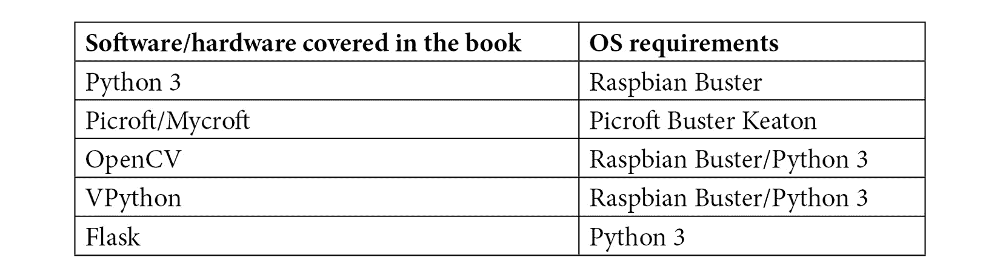

# 前言

*学习机器人编程*是关于构建和编程具有智能行为的机器人。它涵盖了制作和构建从部件组成的设备所需的技能，包括如何选择它们。这些部件包括传感器、电机、摄像头、麦克风、扬声器、灯光和树莓派。

本书继续介绍如何编写代码使这些部件做些有趣的事情。本书使用Python，以及一点HTML/CSS和JavaScript。

使用的科技旨在包括可获取且负担得起的东西，代码展示用于演示概念，因此它们可以被使用和组合，以创建更有趣的代码和机器人。

这些主题结合了程序员和机器人制造商的方面，还加入了一些专业主题，如计算机视觉和语音助手。

# 本书的目标读者

本书面向有一定编程经验的人，或者更有经验但希望将技能应用于硬件项目的人。你不需要是专家级程序员，但必须写过一些代码，并且对循环、条件和函数感到舒适。了解面向对象（类和对象）的编程不是必需的，但本书会介绍这一内容。

本书不需要专门的工坊，尽管会有一些焊接和组装东西的工作。这些内容将在本书的后面部分介绍。

你不需要有任何电子或制作东西的经验，但希望你能对学习有浓厚的兴趣，因为书中介绍了许多非常基础的概念。对构建机器人、让它做事情以及找出下一步该做什么可能是本书最重要的方面。

# 本书涵盖的内容

[*第1章*](B15660_01_Final_ASB_ePub.xhtml#_idTextAnchor019)，*机器人简介*，介绍了什么是机器人，在家和工业中找到例子，以及初学者构建的机器人类型。

[*第2章*](B15660_02_Final_ASB_ePub.xhtml#_idTextAnchor033)，*探索机器人构建模块 – 代码和电子学*，探讨了机器人的组成部分。我们将开始选择机器人的部件，并查看系统和代码的框图。

[*第3章*](B15660_03_Final_ASB_ePub.xhtml#_idTextAnchor050)，*探索树莓派*，介绍了树莓派及其连接以及我们将要在其上使用的Raspbian Linux操作系统，还涵盖了为机器人使用准备的SD卡。

[*第4章*](B15660_04_Final_ASB_ePub.xhtml#_idTextAnchor063)，*为机器人准备无头树莓派*，展示了如何设置一个无需连接的树莓派并无线与之通信。

[*第5章*](B15660_05_Final_ASB_ePub.xhtml#_idTextAnchor081)，*使用Git和SD卡副本备份代码*，展示了代码可能会丢失或损坏，以及保护你的工作和保留其历史的方法。

[*第6章*](B15660_06_Final_ASB_ePub.xhtml#_idTextAnchor096), *构建机器人基础 - 轮子、电源和布线*，介绍了购买和测试安装机器人底盘的权衡，然后组装它。

[*第7章*](B15660_07_Final_ASB_ePub.xhtml#_idTextAnchor131), *驱动和转向 - 使用Python移动电机*，展示了如何编写代码来移动机器人，为后续章节中的代码奠定了基础。

[*第8章*](B15660_08_Final_ASB_ePub.xhtml#_idTextAnchor150), *使用Python编程距离传感器*，添加传感器和代码，使机器人能够自主避开墙壁和障碍物。

[*第9章*](B15660_09_Final_ASB_ePub.xhtml#_idTextAnchor171), *在Python中编程RGB灯带*，为你的机器人添加多彩灯光。探索这个额外的输出，可用于调试或机器人上的娱乐。

[*第10章*](B15660_10_Final_ASB_ePub.xhtml#_idTextAnchor192), *使用Python控制伺服电机*，展示了如何使用这些电机定位传感器头部，以及它们可以在其他机器人的手臂或腿上使用的地方。

[*第11章*](B15660_11_Final_ASB_ePub.xhtml#_idTextAnchor219), *使用Python编程编码器*，演示了如何在代码中读取里程计/转速计轮，让你的机器人直线行驶、准确转向或记录行驶距离。本章还介绍了PID控制器。

[*第12章*](B15660_12_Final_ASB_ePub.xhtml#_idTextAnchor251), *使用Python进行IMU编程*，介绍了**惯性测量单元**（**IMU**），一套用于测量温度、加速度、转向速度和磁场的传感器。本章还介绍了焊接和VPython的基础知识。

[*第13章*](B15660_13_Final_ASB_ePub.xhtml#_idTextAnchor283), *机器人视觉 - 使用Pi摄像头和OpenCV*，展示了如何从摄像头获取数据并使用计算机视觉根据机器人所看到的进行移动。本章还将处理后的视频流式传输到浏览器。

[*第14章*](B15660_14_Final_ASB_ePub.xhtml#_idTextAnchor315), *在Python中使用摄像头进行循线*，演示了如何使用树莓派摄像头实现循线行为。

[*第15章*](B15660_15_Final_ASB_ePub.xhtml#_idTextAnchor344), *使用Mycroft进行机器人语音通信*，构建了一个语音控制代理来连接你的机器人，让你可以通过语音来控制它并接收语音反馈。

[*第16章*](B15660_16_Final_ASB_ePub.xhtml#_idTextAnchor374), *深入IMU*，将我们在[*第12章*](B15660_12_Final_ASB_ePub.xhtml#_idTextAnchor251)，*使用Python进行IMU编程*中学到的传感器结合起来，提供有关机器人方向的数据，构建响应指南针方向的行动。

[*第17章*](B15660_17_Final_ASB_ePub.xhtml#_idTextAnchor396), *使用手机和Python控制机器人*，从你的智能手机构建一个菜单系统和游戏风格的控制板，让你的机器人驾驶时可以看到机器人所看到的内容。

[*第18章*](B15660_18_Final_ASB_ePub.xhtml#_idTextAnchor428)，*将您的机器人编程技能提升到更高水平*，探讨了更广泛的机器人世界，有哪些社区，如何与其他机器人构建者和制造商取得联系，潜在的发展领域，以及在哪里与机器人竞争。

[*第19章*](B15660_19_Final_ASB_ePub.xhtml#_idTextAnchor449)，*规划您的下一个机器人项目——整合所有内容*，是本书的最后一章，我们将总结您在本书中看到的内容，同时鼓励您规划您下一个机器人的构建。 

# 为了充分利用本书

在开始阅读本书之前，您需要使用文本编程语言进行过一些编程。我假设您对变量、条件语句、循环和函数有一定的了解。

您需要一个运行macOS、Linux或Windows的计算机，互联网连接和Wi-Fi。

在手动技能方面，我假设您可以使用螺丝刀，可以处理偶尔的繁琐操作，并且不会因为焊接东西的可能性而过于害怕。

代码示例已在Python 3和Raspbian Buster以及Picroft Buster Keaton上测试过。本书将向您展示在需要时如何安装这些软件。本书还将向您展示在需要时如何选择和寻找机器人部件。



*在购买机器人硬件之前，请阅读适当的章节，了解权衡和建议。*

**如果您使用的是本书的数字版，我们建议您自己输入代码或通过GitHub仓库（下一节中提供链接）访问代码。这样做将帮助您避免与代码复制粘贴相关的任何潜在错误。**

*阅读本书后，请加入Twitter上的#piwars社区，参与许多机器人讨论。*

# 下载示例代码文件

您可以从[www.packt.com](http://www.packt.com)的账户下载本书的示例代码文件。如果您在其他地方购买了这本书，您可以访问[www.packtpub.com/support](http://www.packtpub.com/support)并注册，以便将文件直接通过电子邮件发送给您。

您可以通过以下步骤下载代码文件：

1.  在[www.packt.com](http://www.packt.com)登录或注册。

1.  选择**支持**标签。

1.  点击**代码下载**。

1.  在**搜索**框中输入书的名称，并遵循屏幕上的说明。

下载文件后，请确保使用最新版本的软件解压缩或提取文件夹：

+   Windows的WinRAR/7-Zip

+   Mac的Zipeg/iZip/UnRarX

+   Linux的7-Zip/PeaZip

本书代码包也托管在GitHub上，网址为[https://github.com/PacktPublishing/Learn-Robotics-Programming-Second-Edition](https://github.com/PacktPublishing/Learn-Robotics-Programming-Second-Edition)。如果代码有更新，它将在现有的GitHub仓库中更新。

我们还有其他来自我们丰富图书和视频目录的代码包，可在[https://github.com/PacktPublishing/](https://github.com/PacktPublishing/)找到。查看它们吧！

# 代码实战

本书的相关代码实战视频可在http://bit.ly/3bu5wHp查看。

# 下载彩色图像

我们还提供了一份包含本书中使用的截图/图表彩色图像的PDF文件。您可以从这里下载：[http://www.packtpub.com/sites/default/files/downloads/9781839218804_ColorImages.pdf](http://www.packtpub.com/sites/default/files/downloads/9781839218804_ColorImages.pdf)。

# 使用的约定

本书使用了多种文本约定。

`文本中的代码`：表示文本中的代码单词、数据库表名、文件夹名、文件名、文件扩展名、路径名、虚拟URL、用户输入和Twitter昵称。以下是一个示例：“这将设置一个LED在`led_number`处为指定的`color`。”

代码块设置如下：

```py
cyan_rgb = [int(c * 255) for c in cyan]
```

当我们希望您注意代码块中的特定部分时，相关的行或项目将以粗体显示：

```py
right_distance = self.robot.right_distance_sensor.distance
  # Display this
            self.display_state(left_distance, right_distance) 
```

任何命令行输入或输出都按照以下方式编写：

```py
>>> r.leds.show()
```

**粗体**：表示新术语、重要单词或您在屏幕上看到的单词。例如，菜单或对话框中的单词在文本中显示如下。以下是一个示例：“选择*`4`*为**其他USB麦克风**并尝试声音测试。”

提示或重要注意事项

看起来是这样的。

# 联系我们

我们始终欢迎读者的反馈。

**一般反馈**：如果您对本书的任何方面有疑问，请在邮件主题中提及书名，并通过[mailto:customercare@packtpub.com](mailto:customercare@packtpub.com)与我们联系。

**勘误**：尽管我们已经尽一切努力确保内容的准确性，但错误仍然可能发生。如果您在本书中发现错误，我们将不胜感激，如果您能向我们报告此错误。请访问[www.packtpub.com/support/errata](http://www.packtpub.com/support/errata)，选择您的书，点击勘误提交表单链接，并输入详细信息。

**盗版**：如果您在互联网上以任何形式遇到我们作品的非法副本，如果您能提供位置地址或网站名称，我们将不胜感激。请通过[mailto:copyright@packt.com](mailto:copyright@packt.com)与我们联系，并提供材料的链接。

**如果您有兴趣成为作者**：如果您在某个领域有专业知识，并且您有兴趣撰写或为本书做出贡献，请访问[authors.packtpub.com](http://authors.packtpub.com)。

# 评论

请留下评论。一旦您阅读并使用过本书，为何不在您购买本书的网站上留下评论？潜在读者可以查看并使用您的客观意见来做出购买决定，Packt可以了解您对我们产品的看法，我们的作者也可以看到他们对本书的反馈。谢谢！

如需了解更多关于Packt的信息，请访问[packt.com](http://packt.com)。
