# 第三章：探索机器人构建块 - 代码和电子

在本章中，我们将拆解一个机器人以查看其部件和系统。我们将探索机器人的组件，包括软件（代码、命令和库）和硬件，以及它们是如何组合在一起的。在开始制作机器人时，考虑你想要的部件以及它们之间的关系是非常有价值的。我建议绘制一个机器人计划——一个作为连接代码和部件指南的框图，我们将在本章中探讨这一点。

在本章中，我们将涵盖以下主题：

+   查看机器人内部的情况

+   探索机器人组件类型

+   探索控制器和 I/O

+   规划组件和代码结构

+   规划物理机器人

# 技术要求

对于本章，你需要以下内容：

+   简单的绘图材料，如钢笔和纸。

+   可选 - 图形软件，如 Draw.io（免费，见[https://app.diagrams.net](https://app.diagrams.net)）或 Inkscape（免费，见[https://inkscape.org](https://inkscape.org)）。

# 查看机器人内部的情况

我们可以从将机器人视为一个物理系统开始。在 *图 2.1* 中，我们可以看到一个简单的业余机器人：

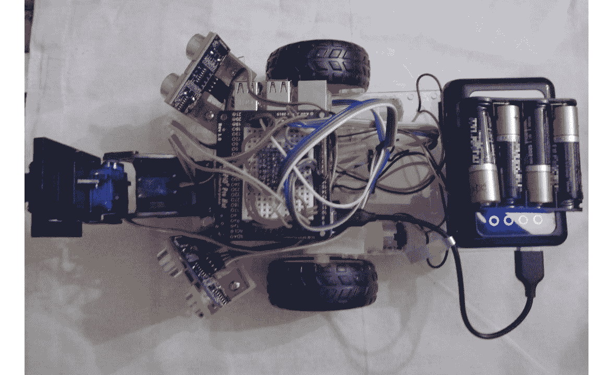

图 2.1 - 组装好的业余机器人

*图 2.2* 显示了它的拆解形式：

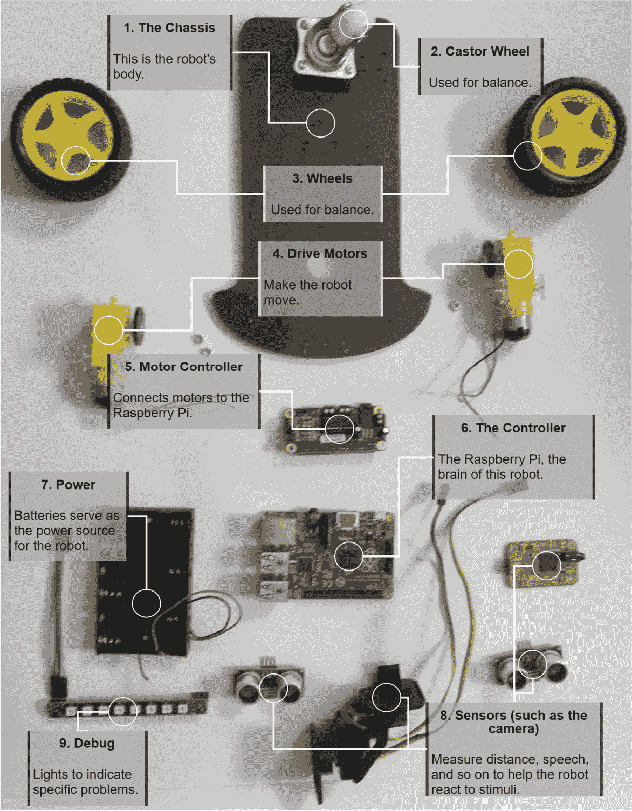

图 2.2 - 业余机器人的组件布局

*图 2.2* 中的组件组包括九种类型的组件：

1.  底盘或机身构成了机器人的主要结构；其他部件都附着在这里。

1.  一个滚轮平衡了这个机器人。

1.  两个驱动轮。其他机器人可能在这里使用更多的轮子或腿。

1.  电机对于机器人移动是必不可少的。

1.  一个电机控制器在控制器和连接的电机之间架起桥梁。

1.  一个控制器，这里是一个 Raspberry Pi，运行指令，从传感器获取信息，并处理这些信息以通过电机控制器驱动输出，如电机。

1.  所有机器人都必须有电源，通常是电池的一套或多套。

1.  传感器提供有关机器人环境或其物理系统状态的信息。

1.  最后，调试设备是允许机器人与人类沟通其代码正在做什么的输出，而且对于外观也很有用。

我们将在本章后面更详细地检查这些组件。

我们可以将机器人可视化为一个连接部件的框图（*图 2.3*）。框图使用简单的形状来展示事物可能连接的大致想法：

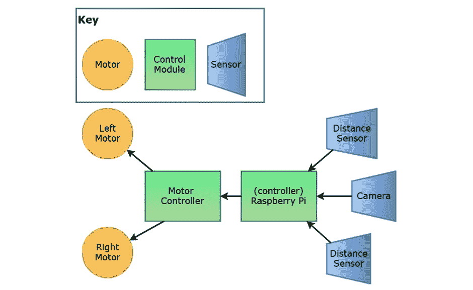

图 2.3 – 机器人框图

*图 2.3* 中的框图没有使用正式的符号。我创建的关键是从脑海中产生的，但它应该能够识别传感器、输出和控制器。它可能只是一个在废纸上的草图。关键因素是你可以在硬件中看到功能块，它们之间有高级的数据流。

您可以从这张图中制定更详细的计划，包括电气连接、电源需求、硬件以及所需空间的大小。绘制一个关于您想要创建的机器人的方块图是将其制作出来的第一步。

重要提示

方块图*不是*电路图，也不是完成机器人的比例图。它甚至不试图显示实际的电子连接。图片忽略了小细节，例如在超声波距离传感器响应之前如何发出信号。连接线给出了数据流的一般概念。方块图是显示电机和传感器的类型和数量的正确地方，以及它们可能需要的附加控制器。

这是对机器人组件的简要概述，我们看到一个与你将要构建的机器人相似的机器人，以及它被拆解成各个部分。我们查看了一个简单的机器人方块图及其意图。在下一节中，我们将更详细地查看机器人的每个组件，从电机开始。

# 探索机器人组件类型

在我们查看电机和传感器的类型之前，让我们简要了解它们各自是什么。

*电机*是一种在施加电力时旋转的输出设备。电机是称为*执行器*的一种机械的子集。它是一种从电能产生运动的输出设备。这种功率可以通过信号调节来控制运动。执行器的例子包括电磁阀、阀门和气缸。

*传感器*是一种向机器人提供输入的设备，使其能够感知其环境。传感器的类型比一本书能列出的要多，所以我们只关注常见且易于使用的那些。显示屏和指示器是调试输出设备，用于向人类用户/程序员提供有关机器人操作的反馈。本节将介绍其中的一些。

现在，让我们更详细地看看它们。

## 电机类型

机器人常用到的电机种类繁多。让我们看看每种电机的作用以及我们如何可能用于不同类型的运动：

重要提示

扭矩是一种旋转/扭转力，例如，电机为了转动轮子所需的力。如果扭矩增加，电机将需要更多的功率（即电流），在试图应对时会减慢速度。电机有一个极限，即**堵转扭矩**，此时它将停止移动。

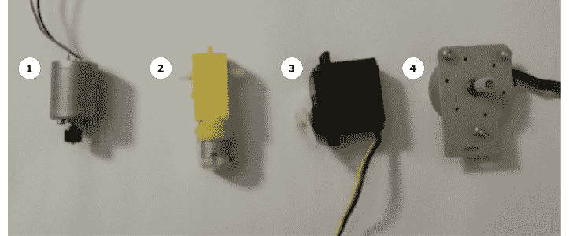

图2.4 – 不同类型的电机 – 直流电机、直流齿轮电机、伺服电机和步进电机

为了确定每种电机的作用，让我们详细地看看它们：

1.  **直流电机**：这是机器人中最简单的电机类型，是齿轮电机的基础。它使用**直流**电压，这意味着可以通过通过它的电压方向来简单地驱动它。电机的速度与通过它的电压成正比，与所需的扭矩成反比。像*图2.4*中的裸直流电机可能会转得太快而无法使用。它将没有多少扭矩，并且容易卡住。

1.  **直流齿轮电机**：这是一种配备变速箱的直流电机。这个变速箱降低了速度并增加了它可以处理的扭矩。这种机械优势增加了电机移动负载的能力。请注意，这种齿轮电机缺少焊接的引线！我推荐这些电机类型用于机器人轮子。我们将在[*第6章*](B15660_06_Final_ASB_ePub.xhtml#_idTextAnchor096)和[*第7章*](B15660_07_Final_ASB_ePub.xhtml#_idTextAnchor131)中使用这种类型的齿轮电机，*构建机器人基础 – 轮子、电源和布线*，以及*驱动和转向 – 使用Python移动电机*。

1.  **伺服电机**（或**伺服机构**）：这种电机将齿轮电机、传感器和内置控制器结合在一起，如*图2.5*所示。控制器接收到的信号表示电机位置，控制器使用传感器的反馈来尝试达到这个位置。伺服电机用于云台机构、机械臂和肢体。我们将在[*第10章*](B15660_10_Final_ASB_ePub.xhtml#_idTextAnchor192)中更详细地研究并编程伺服电机，*使用Python控制伺服电机*：

    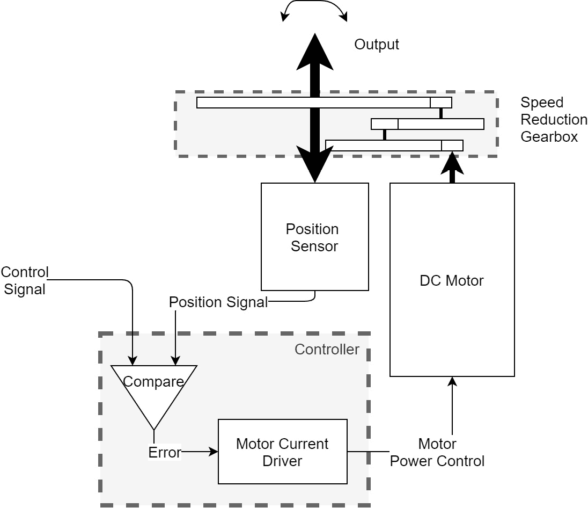

    图2.5 – 伺服电机机构的示意图

1.  **步进电机**：这些电机通过按顺序给线圈供电，使电机以一定数量的度数步进。当需要精确运动时，工程师会使用步进电机。与直流电机或伺服电机相比，步进电机通常速度较慢，产生的热量较多。你会在精密控制应用中找到这些电机，例如3D打印机和高端机械臂。它们比其他电机更重、更贵。

1.  **无刷电机**：这些在图中没有显示。它们由专用控制器驱动，可以达到高速和高扭矩。它们运行时更安静，在无人机中很受欢迎。没有齿轮电机等效物，因此可能需要创建变速箱。

    重要提示

    除了伺服电机外，所有电机都需要硬件来驱动，例如Raspberry Pi。这种硬件允许Pi在不破坏它们的情况下控制耗电设备。永远不要将直流电机、步进电机或电磁铁直接连接到Raspberry Pi！

接下来，让我们看看其他类型的执行器。

## 其他类型的执行器

线性执行器，如*图2.6*中所示，是将电信号转换为沿单轴运动的设备。这些可以是步进电机驱动固定封装中的螺钉，或者使用线圈和磁铁阵列：

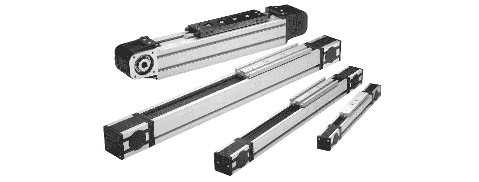

图2.6 – 线性执行器：由Rollon91提供，[图片来源：https://commons.wikimedia.org/wiki/File:Uniline.jpg?uselang=fr [CC BY-SA 3.0 (https://creativecommons.org/licenses/by-sa/3.0)]]

**电磁阀**是一种简单的线性执行器，使用带金属芯的电磁线圈，当通电时会被拉或推。这种类型的常见用途在液压或气动阀门中。液压和气动系统产生像挖掘机中看到的那种强大的运动。

## 状态指示器 – 显示屏、灯光和声音

另一个有用的输出设备是显示屏。单个LED（一个小型电子灯）可以指示机器人某些部分的状态。LED阵列可以显示更多信息并增加颜色。图形显示屏可以显示一些文本或图片，就像在手机上看到的那样。我们将在[*第9章*](B15660_09_Final_ASB_ePub.xhtml#_idTextAnchor171)，*Python中的RGB条带编程*中，将多彩LED条带连接到机器人作为显示屏。

扬声器和蜂鸣器可以通过发出声音使机器人与人类进行交流。这些设备的声音输出可以从简单的噪音到语音或播放音乐。

许多机器人没有显示屏，依赖于连接的手机或笔记本电脑来显示它们的状态。我们将在[*第17章*](B15660_17_Final_ASB_ePub.xhtml#_idTextAnchor396)，*使用手机和Python控制机器人*中，使用手机来控制和查看我们机器人的状态。

## 传感器类型

*图2.7*展示了在机器人中使用的传感器类型集合。它们与我们将在本书中探索和使用的传感器类似。让我们检查一些它们的用途。请注意，这些可能看起来与之前看到的相同类型的传感器不同 – 做同样工作的传感器有很大的差异。当我们把它们添加到机器人中时，我们将更详细地介绍它们的变体：

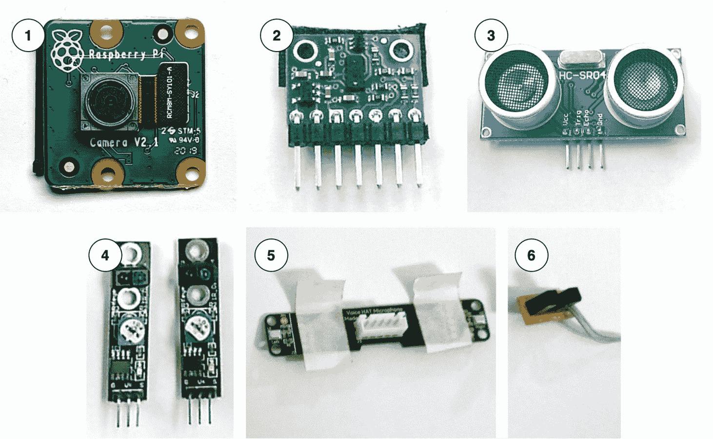

图2.7 – 我机器人中的传感器选择：1 - 一款树莓派摄像头，2 - 一款光学距离传感器，3 - 一款超声波距离传感器，4 - 线性传感器，5 - 麦克风，6 - 一款光学中断传感器

让我们详细了解一下图2.7中的每个传感器：

1.  **树莓派摄像头模块**：此模块连接到树莓派，为其提供成像能力。我们将在[*第13章*](B15660_13_Final_ASB_ePub.xhtml#_idTextAnchor283)，*机器人视觉 – 使用Pi摄像头和OpenCV*中进行视觉处理编程。此模块可以捕获图像或视频序列。它可以快速生成大量数据，这是与机器人视觉相关的问题之一。它对光照条件敏感。

1.  **光学距离传感器**：图2.7中的VL53L0X飞行时间激光测距传感器是一个距离传感器。它使用红外激光反射物体并检测它们有多远。它可能会受到光照条件的影响。

    VL53L0X 传感器使用 I2C 将检测到的距离发送到 Raspberry Pi，并且可以与许多其他设备共享它们的两个通信引脚。当您有许多传感器和输出，并且开始用完连接东西的地方时，I2C 非常有用。I2C 传感器可能是一个更昂贵的选项。

1.  **超声波距离传感器**: HC-SR04 是另一种距离/测距传感器，它通过从物体上反弹声脉冲来检测距离。它受物体材质类型的影响，可能无法检测某些表面，但对光照条件不敏感。例如，一些表面，如织物，吸收声音过多，永远不会将其反射回来，而其他表面，如网格或网状物，与声波相互作用不多，对传感器来说是透明的。

    HC-SR04 需要在控制器中精确计时以计时回声，这我们需要在代码中管理。它的测距范围比 VL53L0X 激光传感器长，且价格更低，但在近距离时灵敏度较低。我们将在[*第 8 章*](B15660_08_Final_ASB_ePub.xhtml#_idTextAnchor150)，“使用 Python 编程距离传感器”中编程基于声音的测距传感器。

1.  **线传感器**: 这些是一套三个线传感器，使用光来检测从光到暗的转变。它们可以调整以在不同的条件下感应。这些模块有几种变体。这些提供开或关的信号，取决于其下是光亮还是黑暗区域。它们是传感器中最简单的。

    **麦克风**: 第五个传感器是一对麦克风。这些可以直接连接到 Pi 的 PCM 引脚上。有些其他麦克风需要连接到电子设备上，以将它们的信号处理成 Raspberry Pi 可以使用的格式。我们将在[*第 15 章*](B15660_15_Final_ASB_ePub.xhtml#_idTextAnchor344)，“使用 Mycroft 与机器人进行语音通信”中使用麦克风进行语音处理。

1.  **光断路传感器**: 这检测通过两个柱子之间缝隙的红外光，感知柱子之间是否有物体中断了光束。这些与带凹槽的轮子一起使用，通过计数凹槽来检测旋转和速度。当与轮子一起使用时，它们也被称为编码器。我们在[*第 11 章*](B15660_11_Final_ASB_ePub.xhtml#_idTextAnchor219)，“使用 Python 编程编码器”中使用编码器。

还有更多传感器，包括检测肢体位置、光线、烟雾、热源和磁场的传感器。这些可以用来制造更先进的机器人，并添加更多令人兴奋的行为。

我们已经涵盖了电机、显示屏、指示器和传感器，包括一些关于它们类型的示例和一些细节。这些是允许我们的机器人与世界交互的部件。现在我们将继续到控制器，这是机器人中运行代码并将传感器和电机连接在一起的部件。

# 探索控制器和 I/O

在机器人框图中心，如图*图2.3*所示，是控制器。机器人通常有一个主要控制器，某种类型的计算机。它们也可能有一些辅助控制器，而一些更不寻常的机器人有多个控制器。本书使事情保持简单，您的代码在传统的中央控制器上运行。控制器将所有其他部分连接在一起，并形成它们交互的基础。

在我们查看控制器之前，我们需要更好地理解一个重要的组件，它将控制器连接到其他组件，即I/O引脚。

## I/O引脚

I/O引脚用于控制器输入和输出。它们赋予控制器连接到现实世界传感器和电机的功能。

控制器上的I/O引脚数量是限制您在不使用辅助控制器的情况下连接到机器人的因素之一。您也可能看到术语**通用输入输出**（**GPIO**）。控制器I/O引脚具有不同的功能。

最简单的I/O引脚只能输出或读取开/关信号，如图*图2.8*所示。这些被称为数字I/O引脚。它们可以通过信号定时编程执行复杂任务。这是HC-SR04距离传感器所使用的原理。在*图2.8*中，此图表示电压随时间的变化。因此，当我们沿着*x*轴移动时，电压在*y*轴上。较高的水平代表数字逻辑高（`1`，`True`，`On`）。较低的水平代表数字逻辑低（`0`，`False`，`Off`）。控制器将尝试将任何值解释为高或低：

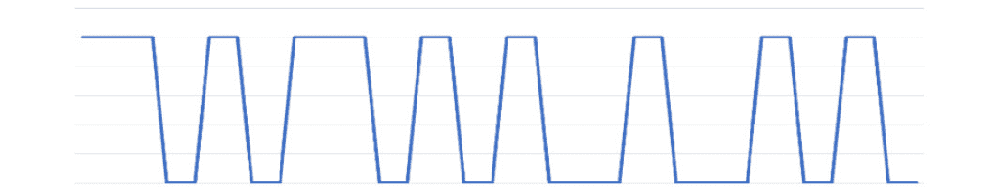

图2.8 – 一个数字信号

模拟输入引脚可以读取不同的级别，如*图2.9*中的信号，这是一个电压随时间变化的图表。如果一个传感器产生变化的电阻或连续的值范围，那么模拟引脚就适用。这种情况下有一个分辨率限制，例如，8位模拟输入将读取256个可能值：

图2.9 – 一个模拟信号

**脉冲宽度调制**（**PWM**）引脚输出一个循环的数字波形，如图*图2.10*所示。此图还显示了电压随时间的变化，尽管脉冲的定时代表了一个连续的水平，因此虚线显示了由定时产生的连续水平。PWM输出允许代码选择频率以及它们开启的时间。在一个周期中开启时间与关闭时间的长度变化以改变输出信号。这通常用于控制电机的速度：

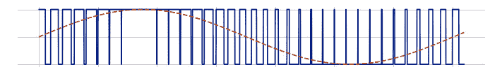

图2.10 – 蓝色表示的PWM信号，虚线显示其近似值

我们将在[*第6章*](B15660_06_Final_ASB_ePub.xhtml#_idTextAnchor096)“构建机器人基础 – 轮子、电源和布线”和[*第7章*](B15660_07_Final_ASB_ePub.xhtml#_idTextAnchor131)“驱动和转向 – 使用Python移动电机”中花费更多时间讨论PWM引脚。

一些I/O引脚可以用来形成数据传输线，例如串行、I2S、I2C和SPI总线。它们被称为数据总线。数据总线用于向其他控制器和智能传感器发送或接收数据。我们将在[*第9章*](B15660_09_Final_ASB_ePub.xhtml#_idTextAnchor171)，“使用Python编程RGB条带”中使用SPI数据总线。

微控制器引脚可用于数字或模拟输入和输出，或数据总线的一部分。许多控制器允许在运行的软件中配置引脚的使用模式，但某些功能仅限于特定引脚。

## 控制器

虽然使用适当的技能和裸微控制器芯片创建周围电子设备和自己的PCB板是可能的，但为了简化本书的内容，我们将使用控制器模块。这些通常以包装和易于使用的系统形式出现：

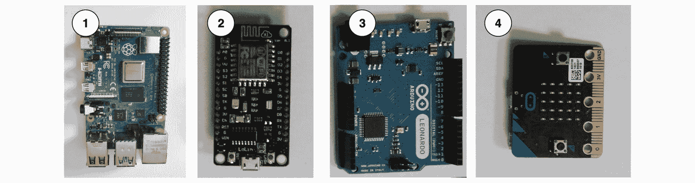

图2.11 – 控制器模块的选择：树莓派、NodeMCU、Arduino和micro:bit

*图2.11*展示了我的几个最喜欢的控制器。它们都可以通过USB连接供电。除了树莓派，其他所有设备都可以通过USB编程。它们都有连接器，便于访问它们的I/O引脚。对于每个控制器，让我们看看它们是什么，以及它们的优缺点：

1.  **树莓派**：它足够强大，可以进行视觉处理。它消耗的电量略多，价格也更高，但功能上类似于移动电话。它拥有最灵活的编程环境。有几种型号可供选择。它们有许多I/O引脚，但没有模拟输入引脚。

1.  **NodeMCU**：这是基于ESP8266控制器。这个控制器内置Wi-Fi，可以用Arduino C++、MicroPython或Lua编程。它有大量的I/O引脚，但只有一个可以读取模拟信号。它支持多种数据总线类型。它比Arduino快一些，可以存储更大的程序。它是这一系列中最便宜的控制器。

1.  **Arduino Leonardo**：这是基于Atmega 328芯片的。Arduino控制器模块构成了我2010-2012年左右大多数机器人的基础。Arduino因其能够通过USB轻松连接到PC并立即与连接到其I/O引脚的设备交互而变得非常重要。

    Arduino主要使用C++语言编程。它具有最灵活的内置I/O引脚——七个模拟引脚、许多数字引脚、PWM输出引脚，并且可以配置以处理大多数数据总线。Arduino的处理器非常简单；它无法执行视觉或语音处理任务。Arduino是这里展示的所有选项中功耗最低的。

1.  **micro:bit**：这款产品于 2015 年发布，用于教育目的，非常适合儿童。如果你需要比它随附的 3 个 I/O 引脚更多的引脚，那么在机器人中使用它需要额外的适配器，但仍然是一个相当强大的机器人控制器，并带有方便的内置 LED 矩阵。它可以使用 MicroPython、C、JavaScript 以及其他几种语言进行编程。

应该特别提一下未在此图中展示的 PIC 微控制器。这些在其他人之前很久就被用于业余机器人，并且有一个繁荣的社区。

下面是基于优缺点比较的控制器：

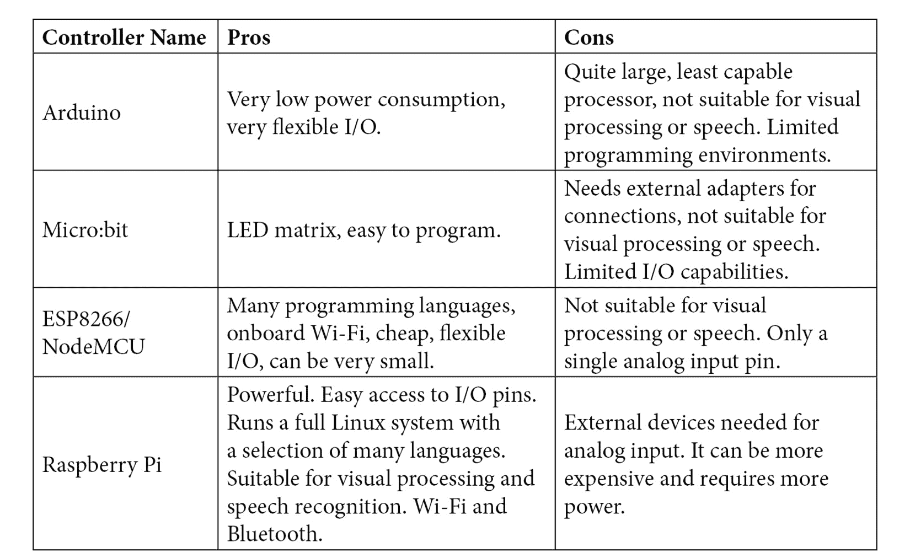

其他控制器可能运行简单的解释器或编译代码，而 Raspberry Pi 运行的是一个完整的操作系统。当前型号具有 Wi-Fi 和蓝牙功能，我们将使用这些功能使机器人无头并连接游戏控制器。

## 选择 Raspberry Pi

*图 2.12* 展示了一些当前的 Raspberry Pi 型号。随着新 Raspberry Pi 的发布，机器人制造商可能需要将其适应到最新版本。所有这些型号都具有 Wi-Fi 和蓝牙功能。Raspberry Pi 的 I/O 引脚支持许多数据总线类型和数字 I/O。对于模拟读取和一些其他 I/O 功能，需要外部控制器：

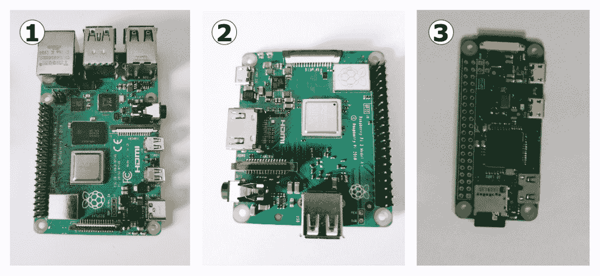

图 2.12 – Raspberry Pi 型号 – 4B、3A+ 和 Zero W

让我们逐一详细看看这些型号：

1.  **Raspberry Pi 4B**：这是在撰写本文时 Raspberry Pi 系列中的最新型号。作为最新型号，它是系列中最快、最强大的。它占用的空间更大，在这个群体中价格最高，并且消耗的功率最大。

1.  **Raspberry Pi 3A+**：这是我们为我们的机器人使用的控制器。它在尺寸和功率方面提供了极佳的折中方案。它能够通过摄像头进行视觉处理。它并不像 4B+ 那么快，但绝对足够我们使用。

1.  **Raspberry Pi Zero W**：这是其他 Raspberry Pi 型号的一个经济、轻便的替代品。摄像头和扬声器仍然得到支持。Zero WH 型号还包括 I/O 引脚。它的语音和视觉识别性能比 Raspberry Pi 3 和 4 慢。它们的小巧尺寸使它们也成为遥控板的有趣选择。

现在我们已经了解了每个型号，让我们比较一下它们的优缺点：

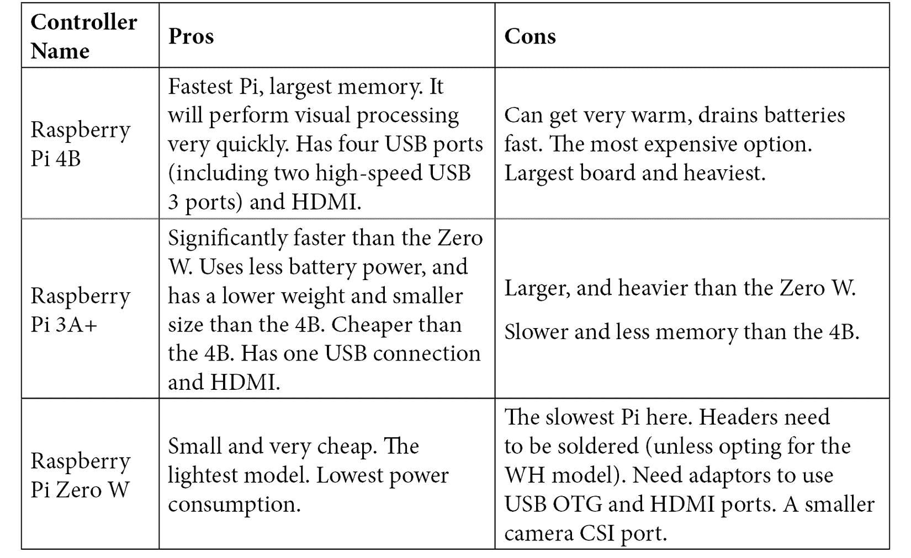

Raspberry Pi 4B 可能是最强大的，但 3A+ 的性能足够强大，可以响应这里所有的活动。

# 规划组件和代码结构

你现在已经简要地看到了一些你可能用于机器人的组件，并且你已经遇到了一个将这些组件组合起来的框图。这就是你开始采取下一步并进一步思考如何连接这些组件，以及你为它们编写的代码将如何结构化的地方。

当将代码视为逻辑块而不是一个大块时，推理起来更容易。以类似于硬件功能图的方式安排代码将有助于你在代码变得复杂时找到自己的路径。

因此，让我们回到*图2.3*中的机器人框图，来思考我们需要在代码中处理什么。该图有三个传感器和两个输出。每个组件（传感器、输出和控制板）可能需要一些代码来处理它，然后你需要一些代码来处理组合模块的行为。

电机控制器有多种类型。它们有不同的方式输出到电机，并且可能具有对电池电量的监控。一些智能电机控制器可以直接与轮编码器接口，以确保车轮已行驶了指定的距离。当我们为机器人编写行为时，如果我们更改电机控制器，可能不想重新编写它。将直接电机控制器代码与行为代码混合也会使推理变得更加困难。为此，我建议创建一个接口层，一个在真实电机控制器代码和标准接口之间的*抽象层*，这将使组件交换成为可能。我们将在[*第7章*](B15660_07_Final_ASB_ePub.xhtml#_idTextAnchor131)中看到这一点，*使用Python驱动和转向 – 移动电机*。

这对每个传感器都类似。它们将有一些代码来管理如何获取信号并将它们转换为可用的数据。所有这些设备都可能有一些设置和拆卸代码，需要在启动或停止连接到它们的操作时运行。相机是这种需求的复杂示例，需要处理以获取我们可以用来执行任务的数据值：

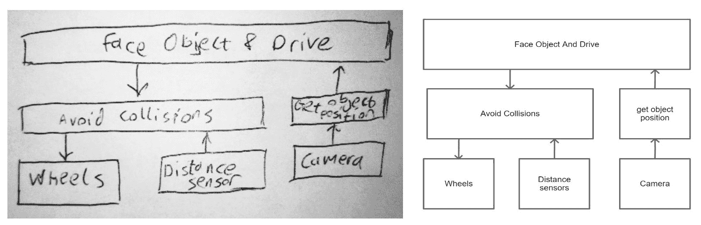

图2.13 – 一张快速的手绘软件框图，用笔在信封上绘制的，以及使用计算机绘制的相同图

就像硬件一样，一个简单的图可以表示软件。这可以在绘图程序中完成，或者在任何你手头的纸张上绘制。在*图2.13*中，我故意选择了一个手绘的版本，这样你就不会觉得你需要一个绘图工具来做这件事。这不会很整洁，但它可以快速重绘，甚至可以在外出就餐时在收据背面绘制。这里相关的事实是，如果你用铅笔，用钢笔或细线重新描一遍，这样它就不会褪色。为了使读者更容易理解，我还制作了一个计算机绘图，但你不必要这样做。

小贴士

扫描你的手绘文档。如果你有扫描仪，或者只是一部手机，我建议扫描或拍照你的草图，以供以后参考。将它们作为图像/PDF文件放入Evernote或OneNote等软件中，并添加有用的标签，这样你就可以快速查找它们。

在绘制手绘草图后，你可以使用软件工具。这会比手绘版本花费更长的时间，并且尽量不要被工具的怪癖和风格所分心。

在设计本身方面，这仍然是一个非常简化的视角。**轮子**框将是一块代码，处理请求轮子电机控制器执行事情。这可能位于电机控制器公司编写的代码之上，或者使用连接到控制器的I/O引脚。

**距离传感器**是代码块，用于从传感器读取距离，并在必要时触发它们。我们将查看两种不同的传感器并进行比较。通过在这个级别更改传感器，意味着其他代码不需要更改。

还有一个用于**摄像头**的代码块，执行诸如设置、分辨率、白平衡和其他我们将要讨论的部分。在这之上是一个将使用摄像头图像的层。该层可以获取彩色物体的位置，并将此位置返回到上层。

在电机和距离传感器之间有一个行为层，允许机器人避免碰撞，例如当它在一边低于某个阈值时。这将覆盖其他行为，使机器人避开那个障碍物并稍微驶离。

最顶层是另一个行为，它从**获取对象位置**代码中获取位置数据。使用这个位置来选择一个方向，然后指示电机驱动到该对象。如果这个行为通过了**避免碰撞**行为，可能会出现复杂的交互，导致机器人寻找正确的对象，同时避开障碍物并绕过物体。它也不会靠近检测到的对象，以免与之相撞。

每个模块相对简单，可能底层靠近硬件的部分更复杂，尤其是在摄像头的情况下。

将代码分解成这样的块意味着你可以一次处理一个块，测试和调整其行为，然后再专注于另一个。当你写出了这样的块时，你可以重用它们。你可能会需要多次使用电机代码，现在你不需要多次编写它。

使用这些块来描述我们的软件，让我们以不同的方式实现这些块及其交互。我们可以考虑是否将使用函数、类或服务来处理这些块。随着我们开始编写代码并展示不同的方法，我将花更多的时间在这上面。

# 规划物理机器人

现在我们将所有这些应用到实际中，并规划我们在这本书中制作的机器人物理部件的布局。当我们翻阅章节时，我们每次都会添加新的组件，并且在我们前进的过程中保持一个整体地图在我们的脑海中，这有助于我们了解自己的位置。想象机器人将要执行的所有事情是非常令人兴奋的。让我们从列出我们的机器人将要做什么和成为什么开始：

+   它将配备轮子，能够在地面上行驶。

+   它将配备一个Raspberry Pi 3A+控制器。

+   它将有一个用于轮子的电机控制器。

+   它将能够通过一组多色LED指示其状态。

+   机器人将使用一对伺服电机来实现俯仰和倾斜机构。

+   它将能够通过超声波或激光距离传感器避开墙壁并绕过障碍物。

+   它将为每个轮子配备一个编码器，以了解它移动了多远。

+   机器人将使用摄像头来感知彩色物体或人脸。

+   它将能够通过摄像头跟随线条。

+   机器人将配备麦克风和扬声器以处理语音命令。

+   它将配备游戏手柄作为遥控器。

+   它将需要为所有这些事物提供电力。

呼吁！这有很多功能。现在，我们需要绘制硬件模块。*图2.14*显示了我们的模块图。虽然是用Draw.io完成的，但一个简单的模块图草图是机器人规划的一个很好的开始。我的大多数机器人都是从这种方式开始的：

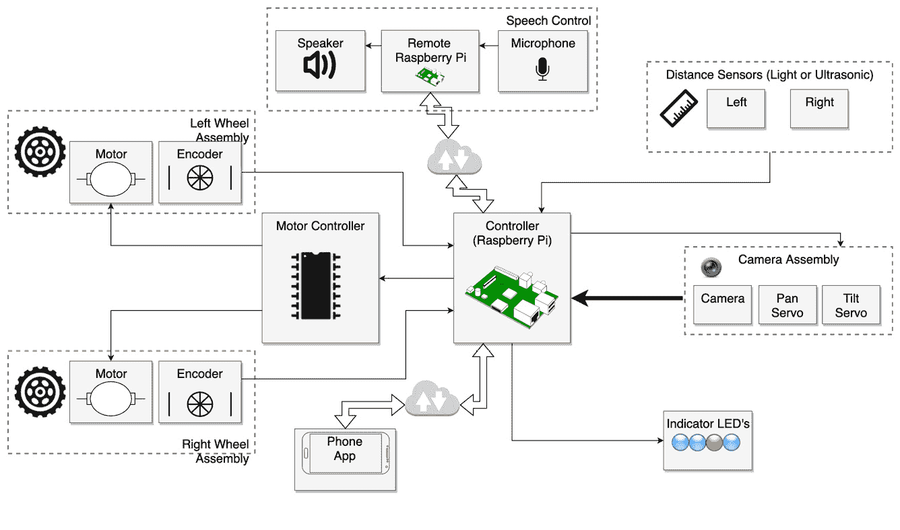

图2.14 – 使用draw.io网络应用创建的我们将构建的机器人的模块图

虽然这看起来像是一大堆机器人，但我们将在每一章中关注一个功能区域，并在转移到其他区域之前构建它。这里的注释并不是任何正式的符号，它只是可视化所有需要连接的部件的一种方式。与此相关，我通常大致绘制出我将物理放置传感器和部件的位置：

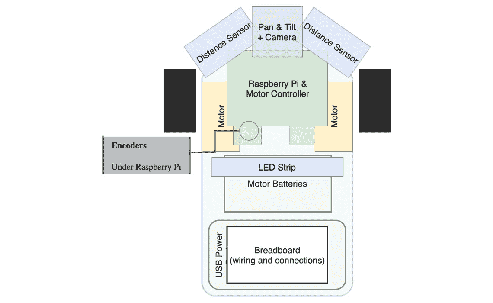

图2.15 – 使用Draw.io创建的机器人可能物理布局概述

*图2.15*中的草图并不详尽、准确或按比例，但它只是我想让部件最终到达位置的初步想法。注意以下图中的事项：

+   传感器有一个清晰的视野，距离传感器指向两侧。我将在相关的传感器章节中详细介绍为什么这很重要。

+   编码器被放置在轮子上，它们将在那里使用。

+   重物，特别是电池，应保持低位（低于重心）以避免机器人翻倒。

+   电池需要更换，因此要考虑它们的可访问性。

+   尽量保持直接连接的组件相当接近。

+   这是一个粗略的计划。它不需要这么详细，这也不是测试装配。实际尺寸、设计妥协和问题将意味着这会发生变化。这只是一个起点。

随着我们通过本书，我们将查看这些图中的细节，并开始完善真正的机器人，使一些内容不那么模糊。任何这样的图，在项目开始时，都应该被视为相当粗糙的。它不是按比例的，不应该盲目跟随。它是一个指南，或是一个快速地图，从这里开始工作。

# 摘要

在本章中，你已经能够看到组成机器人的多种不同组件，并通过一个作为计划的框图，开始可视化如何将这些模块组合成一个完整的机器人。你已经看到如何快速在信封上勾勒出你的机器人想法，以及电脑上的绘图工具可以用来制作更整洁的相同图示。你已经快速浏览了电机、传感器和控制器的相关知识，以及控制器与其他连接设备通信的几种方式，包括模拟、数字、PWM和数据总线。在此基础上，你已经看到了我们将在本书中构建的机器人的计划。

在下一章中，我们将探讨我们机器人中使用的Raspbian操作系统，并开始对其进行配置。

# 练习

1.  尝试为不同的机器人创建一个框图，考虑输入、输出和控制器的因素。

1.  Raspberry Pi 4B和3A+是否仍然是最新版本？你会使用其他型号吗？会有哪些权衡？

1.  激光测距传感器与超声波测距传感器相比有哪些缺点？

1.  尝试为不同类型的机器人绘制一个大致的物理布局图，并使用不同的控制器。

# 进一步阅读

+   *《Raspberry Pi 传感器》*，*鲁希·加贾尔*，*Packt Publishing*：学习如何将传感器集成到你的Raspberry Pi项目中，并让你的强大微控制器与物理世界互动。

+   *《Make 传感器：使用Arduino和Raspberry Pi监控真实世界的动手入门》*，*特罗·卡尔维宁*，*基莫·卡尔维宁*，*维莱·瓦尔特卡里*，*Maker Media, Inc.*：学习如何使用传感器将Raspberry Pi或Arduino控制器与真实世界连接起来。

+   *《Make: 电子元件：通过探索学习》*，*查尔斯·普拉特*，*Make Community, LLC*：如果你想要了解更多关于电子元件的信息，并深入探究各个单独的元件，这是一个有用的资源。
