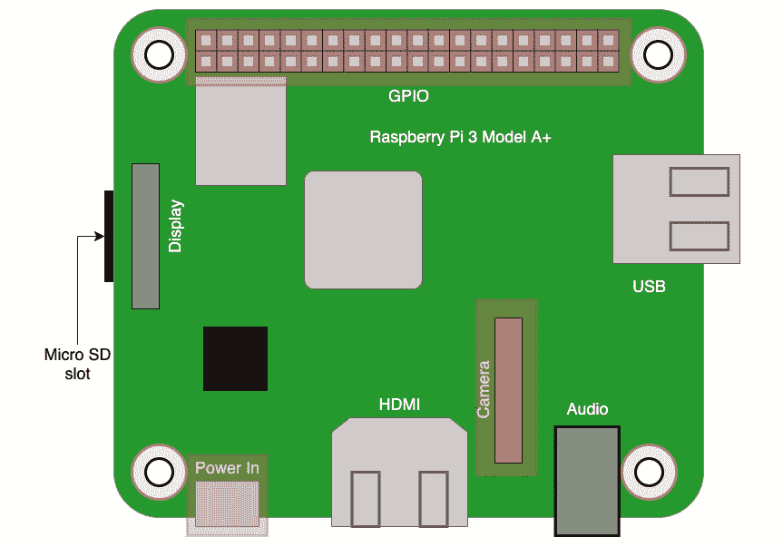
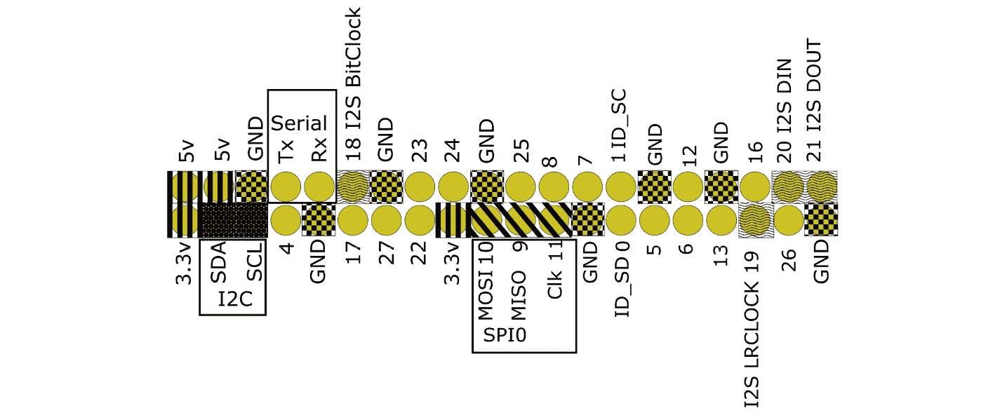
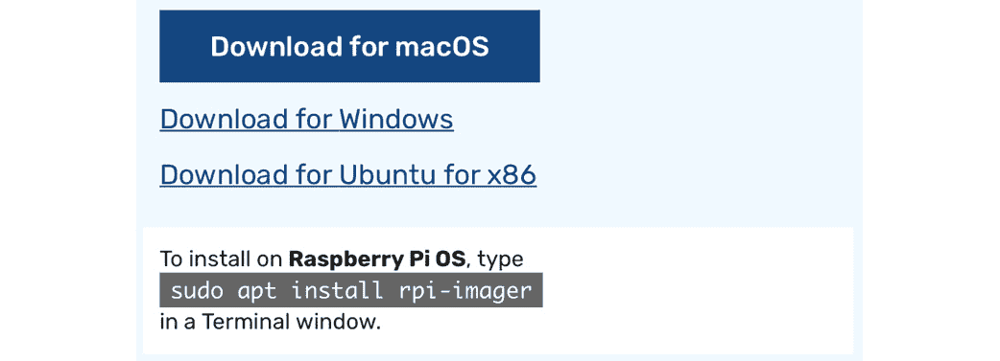
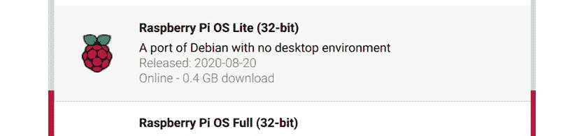

# 第四章：*第3章*: 探索树莓派

在上一章中，我们看到了树莓派在机器人拆解中的应用。因此，我们将使用**树莓派**来构建机器人，这并不令人惊讶。

在本章中，我们将使用**树莓派3A+**作为**控制器**。我们将检查这一选择的各种选项，并查看树莓派上的连接等特性，以及我们将如何使用它们来理解我们的决策。然后，我们将继续探索**树莓派操作系统**，并以准备操作系统在树莓派上使用而结束。

本章将涵盖以下主题：

+   探索树莓派的功能

+   选择连接

+   什么是树莓派操作系统？

+   准备带有树莓派操作系统的SD卡

# 技术要求

对于本章，你需要以下设备：

+   存储容量为16 GB或更多的Micro SD卡

+   树莓派3A+

+   一台连接到互联网、能够读取/写入SD卡的Windows、Linux或macOS计算机或笔记本电脑

查看以下视频，以查看代码的实际运行情况：[https://bit.ly/3bBJQt9](https://bit.ly/3bBJQt9)。

# 探索树莓派的功能

正如我们在[*第2章*](B15660_02_Final_ASB_ePub.xhtml#_idTextAnchor033)中看到的，《探索机器人构建模块 – 代码与电子学》，机器人使用的控制器可能是你做出的最关键的选择之一。这将决定你将有什么样的输入和输出，你的电子设备将有什么样的电源需求，你将能够使用哪些类型的传感器，以及你将运行什么代码。更换控制器可能意味着重写代码，重新设计控制器将放置的位置，以及改变电源需求。

树莓派是一系列专为教育用途设计的小型计算机。它具有I/O引脚，可以连接到定制硬件，同时作为一个完整的计算机，这使得它成为爱好者的最爱（一个指喜欢为爱好制作事物的人的术语，如机器人和小工具）。这得益于与标准计算设备相比，微控制器的相对便宜的价格和较小的尺寸。所有树莓派型号都具有连接摄像头、显示屏和键盘以及某种网络连接的能力。

## 速度和功率

树莓派足够强大，可以处理一些视觉处理任务，如面部识别和跟踪物体，较晚的型号能够更快地执行这些任务。同样，这也适用于语音识别任务。正因为如此，建议使用较快的4B、3B+和3A+型号。Zero和Zero W型号要慢得多，尽管系统仍然可以工作，但速度可能会令人沮丧。

Raspberry Pi 是一个 **单板计算机**（**SBC**），其功能强大到足以运行完整的电脑操作系统，特别是 **Linux** 的版本。我们将在 *什么是 Raspberry Pi OS* 部分中探讨这一点，但这也允许我们使用 **Python** 通过其他人员维护良好的库和工具来进行视觉处理和语音处理。微控制器，如 **Arduino**、**Esp8266** 和 **micro:bit**，根本无法执行这些任务。

一些可用的替代单板计算机（SBC）可以作为控制器运行 Linux，例如 **BeagleBone**、**CHIP**、**OnionIoT** 和 **Gumstix Linux** 计算机，但这些设备要么比 Raspberry Pi 贵，要么功能较弱。只有一些配备了摄像头集成。尽管 BeagleBone 拥有优越的模拟 I/O 连接性，但 Raspberry Pi 3A+ 更像一个全能选手，并且有许多扩展选项。

## 连接性和网络

Raspberry Pi 3A+ 还配备了 USB 端口和 HDMI 端口。我们计划在这本书中不使用它们，尽管在出现问题时它们对于调试和与机器人失去联系时很有用。考虑到这一点，建议准备一个额外的屏幕和键盘。

Raspberry Pi 4、3 和 Zero W 系列都内置了 Wi-Fi 和蓝牙。在这本书中，我们将使用 Wi-Fi 连接到机器人，因此我们建议选择具有此功能的型号。Wi-Fi 可以用来编程机器人、驱动它以及在其上启动代码。

Raspberry Pi 拥有 I/O 引脚，允许您将其连接到传感器。在 Raspberry Pi 3A+ 中，**通用输入/输出**（**GPIO**）连接已经准备好使用，因为引脚（称为引脚）已经预先焊接到位。Raspberry Pi Zero 和 Zero W 型号没有附带引脚。第一代 Raspberry Pi 板也配备了不同的 I/O 连接器。这些原因使得 3 和 4 系列的 Raspberry Pi 成为最佳选择。

## 选择 Raspberry Pi 3A+

将所有这些功能整合在一起，Raspberry Pi 3A+ 就是一个完整的电脑。以下列出的特性满足了我们的所有需求：

+   I/O

+   一个用于摄像头的连接器

+   能够进行视觉和语音处理

+   内置 Wi-Fi 和蓝牙

+   运行 Python 代码

+   预焊接的引脚，便于连接到机器人设备

+   小巧且相对便宜

此外，3A+ 配备了运行在 1.4 GHz 的四核 ARM 架构 CPU，这对于我们的使用场景来说已经足够。后续的 Raspberry Pi 版本可能会通过更快的处理速度和额外的功能来超越这个型号。

# 选择连接

在构建机器人时，我们将使用 Raspberry Pi 提供的连接子集。让我们看看这些连接是什么以及我们将如何使用它们。当我们将传感器和部件连接到 Raspberry Pi 时，我们将详细介绍这些连接，所以现在不需要记住这些。然而，以下引脚图可以作为这些连接的参考。

在 *图 3.1* 中，突出显示的区域显示了正在使用的连接：

图3.1 – Raspberry Pi连接

首先，我们将使用标记为**Power In**并位于图底部左边的电源连接器。它通过一个类似于许多手机的micro-USB连接器连接。我们在学习无头操作时将使用它，这是为机器人供电的一种选择。如果USB电池组可以提供正确的功率，我们可以将其插入此端口。Raspberry Pi建议使用2.5 A的电源供应器，尽管通常2 A以上的电源就足够了。

下方的突出显示的端口是相机（**Camera Serial Interface**（**CSI**））端口；这是用于**Pi相机**的，我们在准备进行视觉处理时将连接它。

我们将使用位于Raspberry Pi底部的Micro SD卡插槽来运行我们的代码。我们不会使用以太网或HDMI，因为我们将通过Wi-Fi与Raspberry Pi通信。*图3.1*顶部的较大连接器是GPIO端口：

图3.2 – Raspberry Pi GPIO端口（B+、2、3、3B+、Zero和Zero W）

*图3.2*显示了GPIO端口的特写，其中包含一些引脚的名称和用途。这是我们连接大多数传感器和电机的地方。外部设备可以连接到**SPI**、**I2C**、**串行**和**I2S**数据总线，或者连接到数字I/O引脚。

### 电源引脚

5 V和3.3 V引脚用于供电，以及标记为**GND**的引脚。GND是**ground**的缩写，相当于电池或电源的负极。5 V引脚可以用来从电池为Pi供电。5 V和3.3 V可以用来为小型电子设备或传感器供电。

### 数据总线

SPI、I2C和串行用于在控制器和智能设备之间发送控制和传感器数据。I2S用于将编码的数字音频信号（**PCM**）从Raspberry Pi发送和接收。可以通过配置启用这些数据总线的端口，或者当数据总线关闭时，可以使用引脚作为通用数字引脚。

标记为**SDA**和**SCL**的引脚是I2C数据总线。我们使用这个总线来连接传感器和电机控制板。指令通过这个端口发送。

**9**、**10**和**11**号引脚组成了SPI端口，我们使用它来驱动RGB LED。

虽然Raspberry Pi上有一个音频端口，但这并不适合驱动扬声器，因此我们将使用GPIO端口上的I2S引脚来完成这项工作。I2S引脚是**18**、**19**、**20**和**21**。因为它们也有音频输入引脚，所以我们使用这个引脚进行语音处理。

### 通用I/O

其他编号但没有特定文字或阴影类型的引脚是通用I/O引脚。通用I/O引脚用于数字输入和输出，与伺服电机、编码器和超声波传感器一起使用。

重要提示

为什么数字会混合？大多数Raspberry Pi文档中使用的数字是BCM编号，它们对应于主Broadcom芯片上的引脚。使用*图3.2*进行参考。

## Raspberry Pi HATs

**树莓派HAT**（也称为帽子）是为插入GPIO引脚而设计的电路板，可以方便地将树莓派连接到电机或传感器等设备。

一些板子带有GPIO引脚，以便其他板子/连接可以使用它们，而其他一些则需要扩展板才能访问引脚。

HAT使用GPIO引脚用于不同的目的；例如，音频HAT将使用I2S引脚进行音频接口，但一些电机控制器HAT将使用相同的引脚来控制电机。使用这些HAT可能会出现问题，因此在使用多个HAT或特定总线时请注意这一点。我们将在[*第6章*](B15660_06_Final_ASB_ePub.xhtml#_idTextAnchor096)“构建机器人基础 - 轮子、电源和布线”中进一步探讨这个问题，当我们选择电机控制器时。

# 什么是树莓派操作系统？

树莓派操作系统是我们用来驱动树莓派的软件选择，我们的代码将在其中运行。它是树莓派基金会的官方操作系统，并附带了一些软件，旨在使使用树莓派变得更加容易。树莓派操作系统可以支持完整的桌面或最小化命令行和网络仅系统。

树莓派操作系统基于**Debian** Linux发行版。Debian是一组软件集合，旨在一起运行，提供了许多功能性和许多可能性。像这样的Linux发行版是许多互联网服务器、移动电话和其他设备的基础。操作系统的软件针对树莓派硬件进行了优化，特别是内核和驱动程序，它们是专门为其制作的。它还有一些方便的方式来配置树莓派用户可能需要的专用功能。

我们将以比桌面更简洁的方式使用它，放弃键盘、鼠标和显示器支持。这种最小化版本被称为**树莓派操作系统轻量版**，因为它在不需要桌面软件时下载量更小，并且在micro SD卡上占用的空间也更少。不运行窗口管理器可以释放内存并减少树莓派的处理能力，使其可用于视觉处理等活动。我们将使用我们将用于编程机器人的软件和工具扩展树莓派操作系统轻量版。

在阅读本书的过程中，你将主要通过代码和命令行与机器人交互。Linux和树莓派操作系统都是考虑到通过网络使用命令行编写的，这对于机器人编程的无头特性来说是一个很好的匹配。

我们使用Linux对Python编程语言的强大支持以及Linux提供的网络工具。树莓派操作系统在树莓派社区中广泛使用，并且在需要帮助时找到答案最容易。它不是Pi的唯一操作系统，但它是初学者在树莓派上最有用的选择之一。

# 使用树莓派操作系统准备SD卡

要在树莓派上使用树莓派操作系统，你需要将软件以某种方式放入micro SD卡中，这样树莓派就可以加载它。

树莓派创建了树莓派图像器，以便将软件安装到SD卡上。让我们下载它，并将正确的图像放到我们的卡上：

1.  访问树莓派软件下载页面 [raspberrypi.org/software](http://raspberrypi.org/software)，并选择如以下截图所示的 **为** 按钮下载你的电脑版本：

    图3.3 – 下载树莓派图像器

    *图3.3* 展示了这将看起来是什么样子；它应该会突出显示你电脑的正确下载按钮。[]

1.  使用树莓派的使用说明进行安装。

1.  将你的微SD卡插入笔记本电脑的正确端口。你可能需要一个适配器。

1.  启动图像器。我们将从这里开始选择操作系统。选择 **选择操作系统** 按钮：

    图3.4 – 选择操作系统按钮

    *图3.4* 展示了位于图像屏幕右下角的 **选择操作系统** 按钮。

1.  当你选择此按钮时，它将弹出一个列表，显示可以闪存到卡上的操作系统：

    图3.5 – 操作系统列表

    *图3.5* 展示了图像提供的操作系统列表。选择 **树莓派操作系统（其他）**。

1.  在其他菜单下，还有更多树莓派操作系统版本的选项：

    图3.6 – 树莓派操作系统选择屏幕

    由于我们试图保持最小化，请从菜单中选择 **树莓派操作系统轻量版（32位）**。

1.  你现在应该点击 **选择SD卡**：

    图3.7 – 选择SD卡

1.  这将弹出一个SD卡列表，应该显示你正在使用的卡：

    图3.8 – SD卡选择

    选择此选项以继续。

1.  你现在可以写入这个了。点击 **写入** 按钮：

    图3.9 – 写入按钮

1.  它会在这里询问你是否确定；点击 **是** 以继续。下载和写入图像将需要一些时间。

你可以将它加载到带有屏幕和键盘的树莓派上，但在我们能够使用这个树莓派作为机器人之前，我们将在下一章中对你的电脑上的SD卡进行更改。

# 摘要

在本章中，你看到了更多关于树莓派是什么，以及我们将使用树莓派的哪些连接。

我们已经了解了树莓派操作系统，它是从Linux派生出来的，如何下载它，以及如何将此软件安装到用于树莓派的微SD卡上。

在下一章中，我们将使这张卡无头，这样我们就不需要屏幕、键盘或鼠标来使用这个树莓派，并从我们的电脑上访问它。

# 评估

1.  我推荐使用树莓派3A+。可能存在一些未被考虑的树莓派新模型。它们的权衡是什么？考虑成本、尺寸、功耗和计算速度。

1.  尝试其他树莓派操作系统或树莓派发行版；一些可能需要键盘和鼠标。在继续阅读本书之前，请确保返回到树莓派操作系统轻量版。

1.  我已经提到了相机（CSI）连接器、电源和GPIO端口。看看Raspberry Pi上的其他端口，也许你能看到它们能用来做什么。

# 进一步阅读

参考以下链接：

+   Raspberry Pi基金会关于安装Raspberry Pi操作系统的指南：[https://www.raspberrypi.org/documentation/installation/installing-images/README.md](https://www.raspberrypi.org/documentation/installation/installing-images/README.md)。

+   《*Raspberry Pi By Example*》，作者*Ashwin Pajankar*和*Arush Kakkar*，由*Packt Publishing*出版，其中包含关于Raspberry Pi替代操作系统的章节，以及许多令人兴奋的Raspberry Pi项目。

+   Raspberry Pi GPIO引脚图([https://pinout.xyz/](https://pinout.xyz/))：这描述了不同电路板如何根据它们实际使用的引脚连接到Raspberry Pi。了解大多数电路板只使用这些引脚的子集是有用的。
