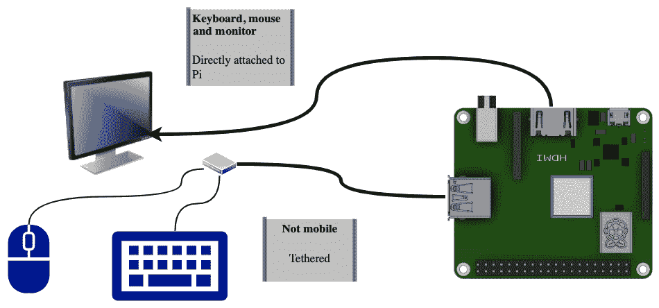
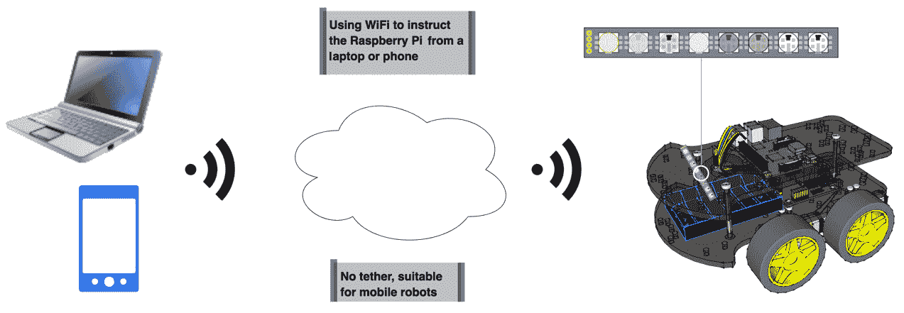
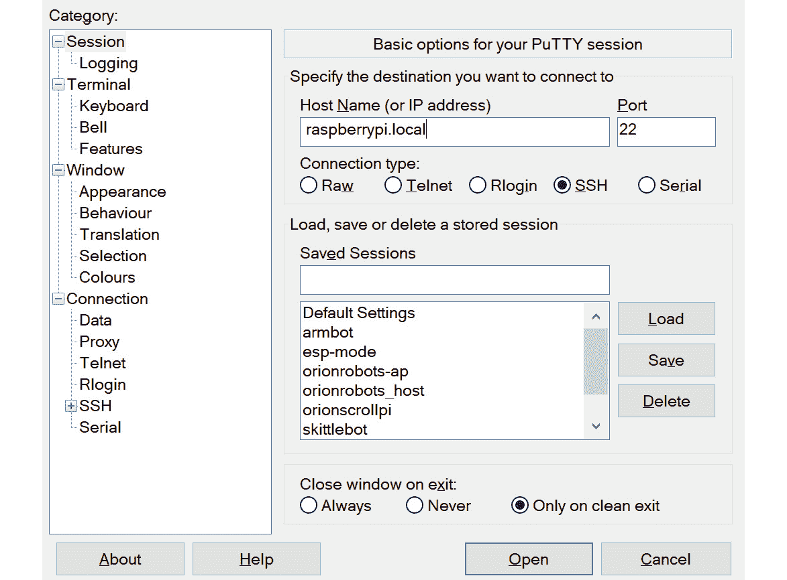
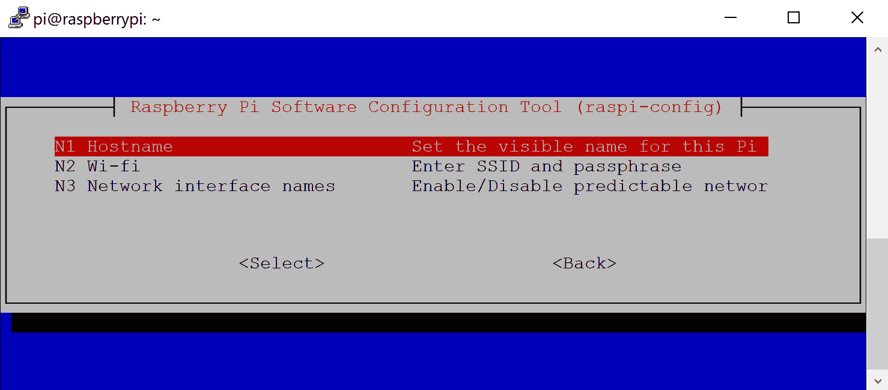
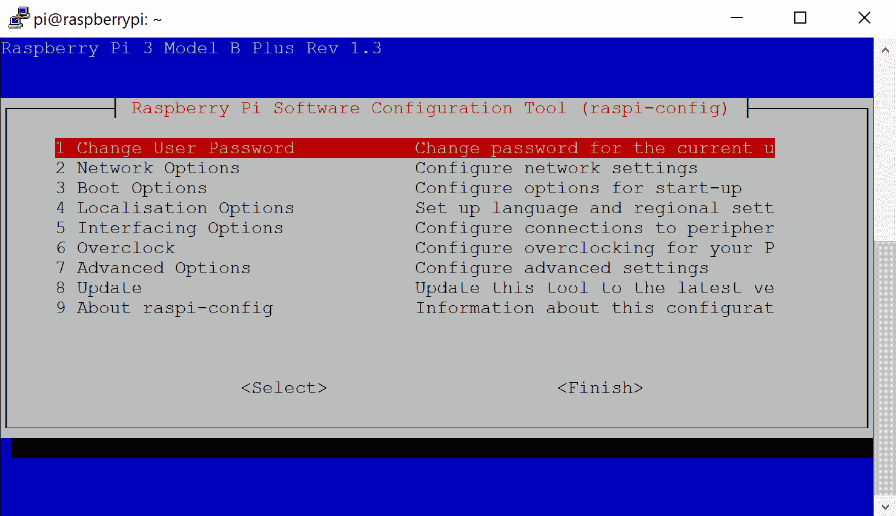
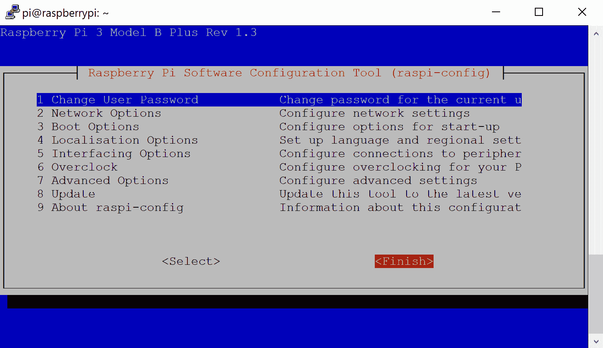
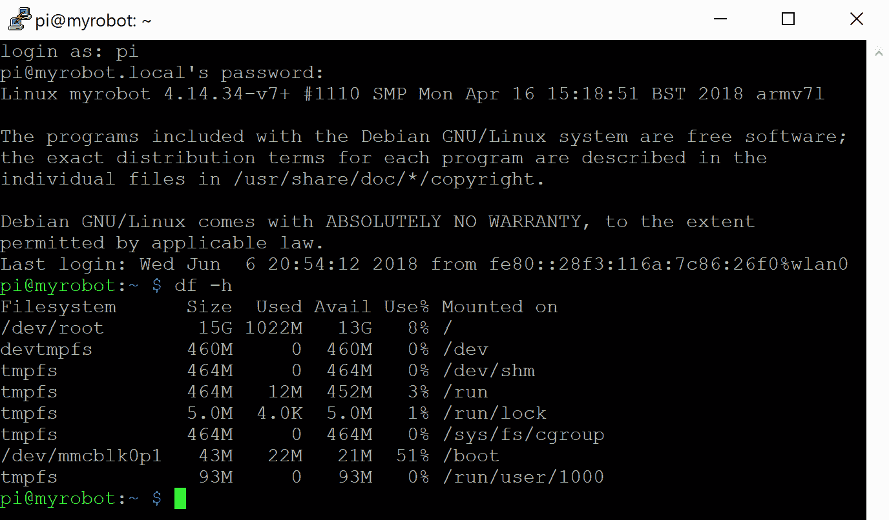

# 第五章：*第4章*：为机器人准备无头Raspberry Pi

在本章中，你将了解为什么机器人上的Raspberry Pi控制器应该是无线和无头（headless）的，无头意味着什么，以及为什么它在机器人技术中很有用。你将看到如何直接将Raspberry Pi设置为无头设备，以及如何在网络上一旦连接到这个Raspberry Pi，就发送你的第一条指令给它。到本章结束时，你将拥有自己的现成可用的Raspberry Pi，无需连接屏幕、键盘或有线网络，因此它可以作为机器人的移动设备。

本章我们将涵盖以下主题：

+   什么是无头系统，为什么它在机器人中很有用？

+   在Raspberry Pi上设置Wi-Fi并启用SSH

+   在网络上找到你的Raspberry Pi

+   使用PuTTY或SSH连接到你的Raspberry Pi

+   配置Raspberry Pi OS

# 技术要求

要完成本章的练习，你需要以下内容：

+   一个Raspberry Pi，最好是3A+（但Pi 3或4也可以）

+   具备2.1安培输出能力的USB电源和Micro-USB线

+   你在上一章中准备好的MicroSD卡

+   一台连接到互联网并能够读写SD卡的Windows、Linux或macOS计算机

+   计算机上的文本编辑器 – VS Code是一个合适的跨平台选项

+   Windows上的PuTTY软件（SSH软件已在Mac和Linux桌面上可用）

代码的GitHub链接如下：

[https://github.com/PacktPublishing/Learn-Robotics-Programming-Second-Edition/tree/master/chapter4](https://github.com/PacktPublishing/Learn-Robotics-Programming-Second-Edition/tree/master/chapter4)

查看以下视频以查看代码的实际应用：[https://bit.ly/3bErI1I](https://bit.ly/3bErI1I)

# 什么是无头系统，为什么它在机器人中很有用？

一个**无头系统**是一种设计为通过网络从另一台计算机操作计算机的系统，在键盘、屏幕和鼠标访问设备不方便的时间和地点。无头访问用于服务器系统、构建机器人和制作小工具：



图4.1 – 连接到屏幕、键盘和鼠标的Raspberry Pi

*图4.1*显示了一个有头的系统，用户可以坐在设备前面。你需要将屏幕、键盘和鼠标连接到你的机器人上，因此它不太灵活。你可能可以根据需要连接/断开它们，但这也很不方便。有便携式系统设计用来与像这样的Raspberry Pi对接，但当机器人移动时，你需要断开连接或与机器人一起移动。

在某些活动中，我见过带有微型车载屏幕的机器人，由无线键盘和鼠标控制。然而，在这本书中，我们使用一个作为无头设备的机器人：



图4.2 – 以无头配置在机器人上的Raspberry Pi

*图4.2*中的树莓派作为无头设备安装在一个机器人上。这个树莓派没有被屏幕和键盘拖累；这些由另一台计算机处理。代码、指令和信息通过笔记本电脑的无线网络发送到树莓派。许多代码示例可以自主运行，计算机可以启动/停止这些操作。我们在[*第9章*](B15660_09_Final_ASB_ePub.xhtml#_idTextAnchor171)中添加了指示LED，*用Python编程RGB条带*。我们还在[*第17章*](B15660_17_Final_ASB_ePub.xhtml#_idTextAnchor396)中向你展示了如何使用手机控制机器人，*用手机和Python控制机器人*。手机可以启动和停止自主行为，查看机器人的状态，或者无需连接笔记本电脑就可以直接驾驶它。这个树莓派摆脱了屏幕和键盘的束缚。

提示

虽然你通常不需要屏幕和键盘，但如果你与树莓派失去联系，并且它拒绝通过网络响应，那么拥有这些设备是值得的。然后你可以使用屏幕和键盘连接到它，查看发生了什么。

为了无头访问树莓派，我们将使用**安全外壳**（**SSH**）。SSH为你提供了一个命令行来向Pi发送指令，以及一个文件传输系统来将文件上传到它。

将树莓派设置为无头使其可以自由移动。它通过不需要携带或为屏幕和键盘供电来减轻机器人的重量。无头使机器人更小，因为显示器和键盘体积庞大。它还鼓励你，作为制造商，考虑自主行为，因为你不能总是向机器人输入命令。

# 在树莓派上设置Wi-Fi并启用SSH

现在你已经看到了无头系统可以得到什么，让我们修改SD卡，以便树莓派启动时可以作为无头设备使用。我们首先需要设置Wi-Fi：

1.  将我们之前制作的MicroSD卡从计算机中取出并重新插入，以便计算机可以识别驱动器的新状态。

1.  现在你将看到这张卡显示为两个磁盘驱动器。其中一个驱动器被称为`boot`；当Windows询问你时，请点击**取消**。SD卡的这个部分包含一个Windows无法读取的特定于Linux的文件系统。

1.  现在，在`boot`中创建以下两个文件。我建议使用VSCode等编辑器来处理纯文本文件，查看文件扩展名，并创建空文件：

    +   `ssh`：一个没有扩展名的空文件。

    +   `wpa_supplicant.conf`：此文件包含你的Wi-Fi网络配置，如下所示：

        ```py
        wpa_supplicant.conf file on your computer to use on other Raspberry Pi SD cards.Important noteThe `ssh` file must have no extension. It must not be `ssh.txt` or some other variation.
        ```

1.  弹出MicroSD卡。请记住使用菜单来这样做。这确保在移除之前文件已经完全写入。

1.  现在，有了这两个文件，你可以使用MicroSD卡来启动树莓派。将MicroSD卡插入树莓派底部的插槽中。它只能以正确的方向插入插槽。

1.  最后，将 Micro-USB 线缆插入树莓派的侧面并连接到电源。你应该会看到灯光闪烁，表明它正在启动。

    重要提示

    对于树莓派，你需要一个至少提供 2.1 安培电流的电源。

你的树莓派无头系统现在已经设置好了。有了这个，我们朝着移动化迈出了重要的一步。现在我们需要在我们的网络上找到它，以便我们可以连接到它。

# 在网络上找到你的 Pi

假设你的 SSID 和 PSK 是正确的，你的树莓派现在已经在你的 Wi-Fi 网络上注册。然而，现在你需要找到它。树莓派使用动态地址（DHCP）。每次你将其连接到网络时，它可能都会得到一个不同的地址。访问你的 Wi-Fi 路由器的管理页面并记下 IP 地址在短期内是有效的。每次地址更改时都这样做会令人沮丧，并且在某些情况下可能不可用。

幸运的是，树莓派使用了一种名为 `raspberrypi.local` 的技术，树莓派会响应地址以找到它。这也被称为 Zeroconf 和 Bonjour。因此，你需要做的第一件事是确保你的电脑可以做到这一点。

如果你使用的是 macOS，你的电脑已经运行了 Bonjour 软件，它已经具备 mDNS 功能。此外，Ubuntu 和 Fedora 桌面版本已经很长时间具备 mDNS 兼容性。在其他 Linux 桌面系统中，你需要查找它们的 Zeroconf 或 Avahi 指令。许多最新的系统默认已经启用此功能。

但如果你使用的是 Windows，你需要 Bonjour 软件。所以让我们看看如何设置它。

## 为 Microsoft Windows 设置 Bonjour

如果你安装了较新的 Skype 或 iTunes 版本，你将拥有此软件。你可以使用此指南检查它是否已经存在并启用它：[https://smallbusiness.chron.com/enable-bonjour-65245.html](https://smallbusiness.chron.com/enable-bonjour-65245.html)。

你可以使用以下命令在命令提示符中检查它是否已经工作：

```py
C:\Users\danny>ping raspberrypi.local
```

如果你看到这个，说明你已经安装了 Bonjour：

```py
PING raspberrypi.local (192.168.0.53) 56(84) bytes of data.
64 bytes from 192.168.0.53 (192.168.0.53): icmp_seq=1 ttl=64 time=0.113 ms
64 bytes from 192.168.0.53 (192.168.0.53): icmp_seq=2 ttl=64 time=0.079 ms
```

如果你看到这个，你需要安装它：

```py
Ping request could not find host raspberrypi.local. Please check the name and try again.
```

要这样做，浏览到 Apple Bonjour For Windows 网站 [https://support.apple.com/downloads/bonjour_for_windows](https://support.apple.com/downloads/bonjour_for_windows)，下载它，然后安装 **Download Bonjour Print Services for Windows**。一旦运行，Windows 将能够通过名称请求 mDNS 设备。

## 测试设置

树莓派的绿灯应该停止闪烁，只应看到一个红色的电源灯。这表明 Pi 已经完成启动并连接到网络。

在 Windows 中，通过按 Windows 键并在窗口搜索栏中输入 `CMD` 来召唤命令行。在 Linux 或 macOS 中，打开终端。从终端，我们将尝试 `ping` 树莓派，即在网络上找到 Pi 并发送一条简短的消息以获取响应：

```py
ping raspberrypi.local
```

如果一切顺利，计算机将显示它已连接到Pi：

```py
$ ping raspberrypi.local
PING raspberrypi.local (192.168.0.53) 56(84) bytes of data.
64 bytes from 192.168.0.53 (192.168.0.53): icmp_seq=1 ttl=64 time=0.113 ms
64 bytes from 192.168.0.53 (192.168.0.53): icmp_seq=2 ttl=64 time=0.079 ms
64 bytes from 192.168.0.53 (192.168.0.53): icmp_seq=3 ttl=64 time=0.060 ms
64 bytes from 192.168.0.53 (192.168.0.53): icmp_seq=4 ttl=64 time=0.047 ms
```

如果你无法连接到树莓派怎么办？在下一节中，我们将尝试一些故障排除步骤。

## 故障排除

如果看起来树莓派没有响应ping操作，以下是一些你可以采取的步骤来尝试诊断和修复问题。尝试以下操作：

1.  仔细检查你的连接。你应该看到几次绿灯闪烁和一个持续的红灯。如果没有，请拔掉电源，确保SD卡牢固地插入，并且电源供应可以提供2.1安培的电流，然后再次尝试。

1.  使用树莓派启动后的Wi-Fi接入点设置，看看它是否已经获取了那里的IP地址。

1.  如果你发现树莓派在你的Wi-Fi路由器上，这可能意味着你的计算机上mDNS没有正确运行。如果你还没有安装它，请返回并安装。在Windows上，如果同时安装了不同版本的Bonjour打印服务、Skype的Bonjour和iTunes的Bonjour，可能会发生冲突。使用Windows的添加/删除功能查看是否安装了多个Bonjour实例，然后删除所有Bonjour实例，然后再次安装官方版本。

1.  接下来，关闭电源，取出SD卡，将其放回你的电脑中，并再次确认`wpa_supplicant.conf`文件存在并且具有正确的Wi-Fi详情和国家代码。此文件中最常见的错误如下：

    a) 错误的Wi-Fi详情

    b) 缺少引号或缺少/错误的标点符号

    c) 错误或缺失的国家代码

    d) 关键字大小写错误（关键字应为小写，国家代码为大写）

1.  当树莓派启动时，SSH文件会被移除。如果你确定它曾经在那里并且已经被移除，这意味着Pi实际上已经启动了。

1.  最后，你可能需要将Pi与屏幕和键盘连接后启动，并尝试诊断问题。显示屏将告诉你是否有关于`wpa_supplicant.conf`或其他问题的其他问题。使用屏幕文本并在网上搜索答案。我无法在这里重现所有这些问题，因为这里可能发生许多不同类型的问题。我还建议使用标签`#raspberrypi`在Twitter上提问，在Stack Overflow上，或在树莓派论坛[https://www.raspberrypi.org/forums/](https://www.raspberrypi.org/forums/)上提问。

我们现在已经验证了我们的Pi已连接到网络，并在途中解决了故障排除问题。我们已经能够通过`ping`找到它。现在我们知道它在那里，让我们连接到它。

# 使用PuTTY或SSH连接到你的树莓派

之前，我们在树莓派的引导文件中添加了一个名为`ssh`的文件。这激活了树莓派上的SSH服务。如前所述，SSH是安全壳的缩写，旨在提供安全的网络访问。在这种情况下，我们并不是特别针对安全的加密功能，而是使用远程网络功能，在不接触树莓派的情况下发送和接收指令和文件。

重要提示

如果你已经使用SSH客户端，请注意，并非所有Windows命令行SSH客户端都支持mDNS。

PuTTY是一个方便的工具，用于访问SSH，适用于Windows、Linux和Mac。这些操作系统的安装信息可以在[https://www.ssh.com/ssh/putty/](https://www.ssh.com/ssh/putty/)找到。

一旦你从前面的链接安装了PuTTY，让我们将其连接到你的树莓派。请按照以下步骤操作：

1.  启动PuTTY。你将看到一个类似于*图4.3*的屏幕。在`raspberrypi.local`上点击**打开**以登录到你的树莓派：

    图4.3 – 连接到树莓派

1.  第一次这样做时，PuTTY会显示一个安全警告，要求你添加树莓派的密钥如果你信任它。点击**是**；如果出现具有相同主机名（例如，新的树莓派）但不同密钥的其他设备，它只会再次询问你。

1.  当你看到`pi`时，按*Enter*键，并使用密码`raspberry`。你现在将看到类似于*图4.4*的界面，显示你已经连接到树莓派：


图4.4 – 成功连接

在本节中，你已经使用PuTTY或你偏好的SSH客户端连接到树莓派，这让你可以配置它，向它发送命令，并与它交互。接下来，我们将看看如何配置它。

# 配置树莓派OS

现在我们已经连接上了，让我们做一些事情来为树莓派的使用做准备，比如更改用户密码和更改主机名以提高树莓派的安全性。

我们可以使用`raspi-config`工具执行许多这些任务，这是一个用于在树莓派OS上执行配置任务的菜单系统。我们通过另一个工具`sudo`启动它，它以root（主用户）的身份运行`raspi-config`。请参考以下命令：

```py
sudo raspi-config
```

`raspi-config`界面将显示，如图4.5所示：


图4.5 – raspi-config工具

现在我们已经访问了`raspi-config`，我们可以使用它来更改树莓派上的一些设置。

## 重命名你的树莓派

每个新的树莓派镜像都被称为 `myrobot`，但我相信你可以想到更好的名字。你稍后也可以更改它。它只能包含字母、数字和破折号字符。请按照以下步骤操作：

1.  在`raspi-config`中，选择**网络选项**，如图4.6所示。使用键盘上的箭头键突出显示并按*Enter*键选择条目：

    图4.6 – 网络选项

1.  现在选择**主机名**，如图4.7所示：

    图4.7 – 更改主机名

1.  你应该会看到一个等待输入主机名的屏幕。为你的机器人输入一个名字（我的是`myrobot`），然后按*Enter*键设置。请比我的名字更有创意。

你现在已经为你的机器人命名了，如果你有其他的Raspberry Pi，这将更加重要，同时也给机器人增添了一点个性。让我们也把密码改得更不常见一些。

## 保护你的Pi（一点点）

现在，你的Raspberry Pi与每个从镜像中新鲜安装的Raspberry Pi有相同的密码。建议你更改它。执行以下步骤：

1.  在`raspi-config`的顶部菜单中选择**更改用户密码**（*图4.8*）：

    图4.8 – 更改密码

1.  为你的机器人输入一个新的密码——一些你记得的，比`raspberry`更独特的东西。它不应该是你用于敏感事物（如电子邮件或银行）的任何密码。

更改密码个性化了你的机器人上的Raspberry Pi，并且大大降低了其他人连接到你的机器人并破坏你辛勤工作的可能性。现在我们已经进行了配置更改，我们需要重启Raspberry Pi以使更改生效。

## 重启并重新连接

是时候完成配置并重启Pi了：

1.  使用*Tab*键跳转到**完成**项（*图4.9*）并按*Enter*键：

    图4.9 – 选择完成

1.  下一屏会询问你是否想要重启Pi。选择**是**并按*Enter*键（*图4.10*）：

    图4.10 – 确认重启

    Raspberry Pi将开始重置，PuTTY会话也会在此时断开（如图4.11所示）。等待几分钟；Pi上的绿色活动灯会闪烁一下然后稳定下来。PuTTY会告诉你它已经失去了连接。Pi现在已关闭。红灯会一直亮着，直到你断开电源：

    

    图4.11 – PuTTY告诉你Pi连接已断开

    PuTTY只发送命令到机器人；它不理解这个命令已经关闭了Pi。它不期望连接关闭。我们比其他人更清楚，因为我们告诉Pi重启。点击**确定**以关闭错误。

1.  使用PuTTY再次连接到你的机器人，使用你为机器人提供的新的主机名（在我的例子中，是`myrobot`），以`.local`结尾，并使用新密码，如图*图4.12*所示：

    图4.12 – 重新连接到Raspberry Pi

1.  现在，你应该能够登录并看到你的提示符为**pi@myrobot**，或者你的机器人的名字是什么，如图*图4.13*所示：



图4.13 – 重新连接到Raspberry Pi

我们现在已重新连接到Raspberry Pi。我们可以尝试一个简单的Linux命令来查看我们使用了SD卡多少空间。Linux命令通常是你要让计算机执行的事情的缩写。

*图4.13* 中的 `df` 命令显示了连接到你的树莓派的各个存储位置所使用的空间。额外的 `-h` 使得 `df` 以人类可读的数字显示。它使用 `G`、`M` 和 `K` 后缀分别表示千兆字节、兆字节和千字节。输入 `df -h` 命令，如前一个屏幕截图所示，它将显示 `/dev/root` 接近SD卡的全尺寸，其他设备占据了剩余的空间。

## 更新你的树莓派软件

在这里要做的最后一件事是确保你的树莓派上安装了最新的软件。这是一个你可以开始并离开去吃饭的过程，因为它会花费一些时间。输入 `sudo apt update -y && sudo apt upgrade -y` 命令，你应该会看到以下类似的内容：

```py
pi@myrobot:~ $ sudo apt update – y && sudo apt upgrade -y
Hit:1 http://raspbian.raspberrypi.org/raspbian buster InRelease
Hit:2 http://archive.raspberrypi.org/debian buster InRelease
. 
.
Reading package lists... Done
Building dependency tree
Reading state information... Done
Calculating upgrade... Done
The following packages will be upgraded:
  bluez-firmware curl libcurl3 libcurl3-gnutls libprocps6 pi-bluetooth procps
  raspi-config wget
9 upgraded, 0 newly installed, 0 to remove and 0 not upgraded.
Need to get 1,944 kB of archives.
After this operation, 16.4 kB of additional disk space will be used. Get:1 http://archive.raspberrypi.org/debian buster/main armhf bluez-firmware all 1.2-3+rpt6 [126 kB]
.
.
.
```

请让Pi继续运行，直到这里完成，不要中断或关闭电源，直到 `pi@myrobot:~ $` 提示符重新出现。

小贴士

你可能已经在几个命令中看到了 `sudo` 的模式。此命令告诉树莓派以 *root* 用户（Linux管理员/超级用户）运行以下命令（如 `raspi-config` 或 `apt`）。你可以将其读作 *superuser do*。这对于将更改系统或执行更新的软件是必需的。尽管如此，对于用户程序通常不需要。

在积极进行项目工作的同时，每月进行一次此更新/升级步骤是值得的。当树莓派更新到最新状态时，你将能够为机器人代码安装额外的软件。当软件过时，`apt-get` 安装可能不会工作。通常更新可以解决这个问题。

## 关闭树莓派

当你完成Pi的会话时，按照以下方式关闭它：

```py
pi@myrobot:~ $ sudo poweroff 
```

等待绿灯活动停止；PuTTY 将检测到它已断开连接。你现在可以安全地断开电源。

重要提示

当树莓派未预期断电时，可能会导致文件丢失和SD卡损坏。你可能会丢失工作并损坏SD卡。始终使用正确的关机程序。

# 摘要

在本章中，你看到了如何通过使其无头从屏幕和键盘中解放树莓派。你设置SD卡以连接到你的Wi-Fi并启用SSH，以便你可以连接到它。你使用了 `raspi-config` 来个性化你的Pi并使用你自己的密码来保护它。然后，你迈出了探索它所运行的Linux系统的第一步。你还确保了树莓派是最新的，并运行了最新的软件。最后，我们看到了如何安全地将Pi置于关机模式，这样在拔掉电源时不会发生文件系统损坏。

现在，你已经学会了如何制作无头树莓派。你已经看到了如何保持其更新并连接到你的网络，树莓派现在可以开始构建了。你可以用它来构建树莓派供电的小工具，包括机器人。

在下一章中，我们将探讨如何确保在出现问题时不会丢失宝贵的代码或配置。我们将了解可能发生的问题以及如何使用 Git、SFTP 和 SD 卡备份来保护我们的辛勤工作。

# 评估

1.  你可以用无头树莓派构建哪些其他小工具或项目？

1.  尝试给你的树莓派设置一个不同的主机名，并使用 PuTTY 和 mDNS 在本地连接。

1.  尝试在树莓派上使用其他 Linux 命令，例如 `cd`，`ls`，`cat` 和 `man`。

1.  在尝试这些操作后，请正确关闭树莓派。

# 进一步阅读

请参考以下内容以获取更多信息：

+   *《树莓派3物联网》*，*马内什·拉奥*，*Packt 出版公司*：这本书使用有线无头树莓派进行其中的演示和实验。
