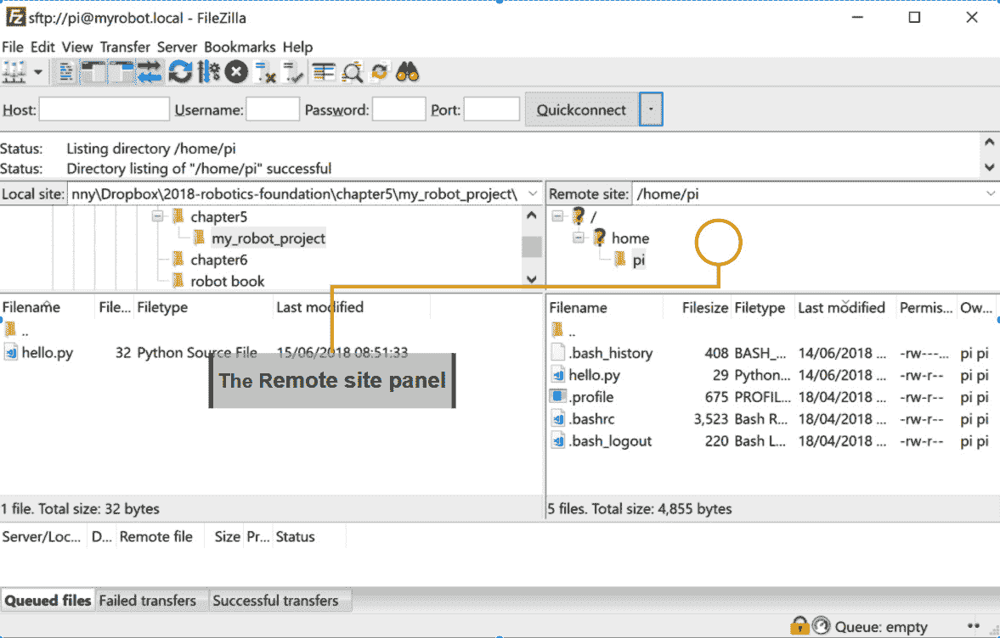
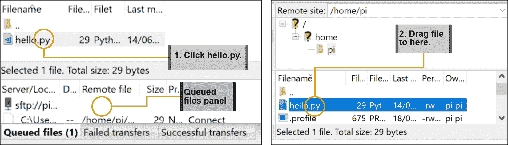
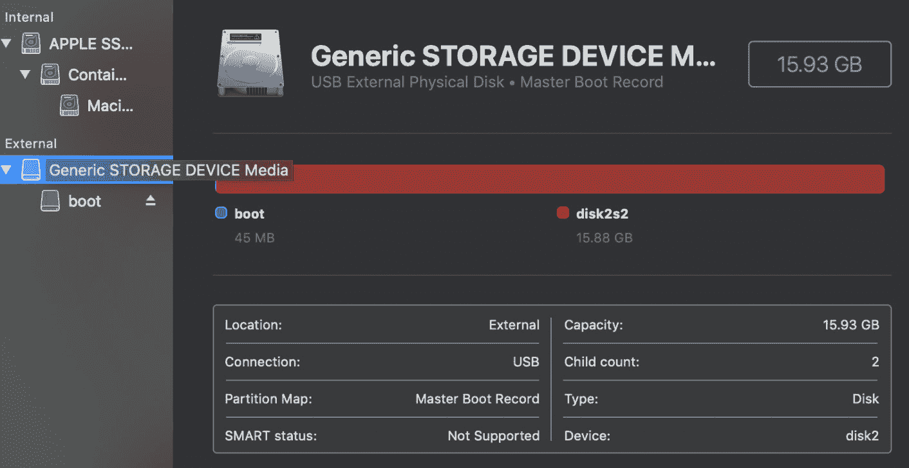

# 第六章：使用Git和SD卡副本备份代码

在你为你的机器人创建和定制代码的过程中，你将投入许多小时来让它做些令人惊叹的事情，除非你采取预防措施，否则所有这些事情都可能突然消失。程序并不是全部的故事，因为你已经开始了为机器人使用Raspberry Pi OS的配置。你希望在灾难发生时保留你的代码和配置，以便在做出你后悔的改变时能够回退。

本章将帮助你了解代码或配置如何具体地被破坏，以及在你为机器人定制代码时可能遇到的灾难。然后我们将探讨三种防止这种情况的策略。

在本章中，你将了解以下内容：

+   理解代码如何被破坏或丢失

+   策略1 – 在PC上保留代码并上传

+   策略2 – 使用Git回到过去

+   策略3 – 制作SD卡备份

# 技术要求

对于本章，你需要以下内容：

+   你在上一章准备好的Raspberry Pi和SD卡

+   你与Pi一起使用的USB电源和电缆

+   一台连接到互联网并能够读写SD卡的Windows、Linux或macOS计算机或笔记本电脑

+   软件：FileZilla和Git

+   在Windows上：Win32DiskImager

这是本章代码文件的GitHub链接：

[https://github.com/PacktPublishing/Learn-Robotics-Fundamentals-of-Robotics-Programming/tree/master/chapter5](https://github.com/PacktPublishing/Learn-Robotics-Fundamentals-of-Robotics-Programming/tree/master/chapter5)

查看以下视频以查看代码的实际应用：[https://bit.ly/3bAm94l](https://bit.ly/3bAm94l)

# 理解代码如何被破坏或丢失

代码及其紧密相关的配置需要时间和辛勤的工作。代码需要配置才能运行，例如Raspberry Pi OS配置、额外软件和必要的数据文件。两者都需要研究和学习，并需要设计、制作、测试和调试。

许多糟糕的情况可能导致代码丢失。这些事情发生在我将机器人带到展览会上的一周前，经过几周的工作，我艰难地学会了要非常认真地对待这个问题。那么，你的代码可能会发生什么？

## SD卡数据丢失和损坏

SD卡损坏是指用于存储你的代码、Raspberry Pi OS以及你准备在SD卡上的任何内容的SD卡数据被破坏。文件变得不可读，或者卡变得无法使用。SD卡上的信息可能会永久丢失。

如果Raspberry Pi意外断电，SD卡可能会损坏，导致数据丢失。一个过热的Pi会慢慢地烘烤SD卡，损坏它。Pi的视觉处理是一种它可能变热的方式。如果Pi通过GPIO引脚或其电源发生电学上的糟糕事情，SD卡可能会损坏。MicroSD卡也很小，如果不放在Pi中，很容易丢失。

## 代码或配置的更改

我们都会犯错误。编码意味着尝试新事物。虽然有些事情会成功，但有些不会，事情会出错。在这些时候，你将想要回顾一下你做了什么更改。你可能能够使用差异来找到错误，或者如果你的实验看起来像是死胡同，你可能想要回到一个已知的工作版本。

你也可以通过错误的配置使机器人失效，例如树莓派未连接到网络或无法再启动。系统包的升级可能会出错，导致代码无法工作或需要对其进行大量更改才能再次工作。

这些问题可能结合在一起导致真正的噩梦。我曾看到代码的更改导致机器人行为不当并损坏自己，以至于SD卡损坏。在我更新操作系统包时，我意外地拔掉了电源线，导致SD卡损坏，并在一个重要的机器人活动两周前破坏了Raspberry Pi OS，重建它非常痛苦。这是一次艰难的教训。

备份代码和备份SD卡配置。在本章的剩余部分，我们将探讨一些解决方案，以保护你的机器人软件免受各种灾难的影响。

# 策略1——在PC上保留代码并上传

**安全文件传输协议**（**SFTP**）允许你从计算机传输文件到Pi。此策略使你能够在计算机上编写代码，然后将其上传到树莓派。你可以选择你的编辑器，并拥有多个副本的安全感。

重要提示

但等等——哪个编辑器？编辑代码需要为这个目的设计的软件。对于Python的推荐是Mu、Microsoft VS Code、Notepad++和PyCharm。

SFTP使用SSH通过网络将文件从树莓派复制到其他设备。所以，让我们看看如何操作：

1.  首先，在PC上创建一个文件夹来存储你的机器人代码；例如，`my_robot_project`。

1.  在那个文件夹内，使用你的编辑器创建一个测试文件，该文件只会打印一些文本。将此代码放入名为`hello.py`的文件中：

    ```py
    print("Raspberry Pi is alive")
    ```

1.  我们将把这个文件复制到机器人上并运行它。你可以使用来自[https://filezilla-project.org](https://filezilla-project.org)的SFTP工具FileZilla进行复制。下载此工具并按照安装说明操作：

    图5.1 – FileZilla

1.  插入并开启你的树莓派。你会在右侧面板的底部（*图5.1*）注意到，FileZilla显示**未连接**。

1.  在`sftp://`；例如，`sftp://myrobot.local`。

1.  在`pi`，并在**密码**框中输入你之前设置的密码。

1.  点击**快速连接**按钮连接到树莓派。

1.  连接后，你将在右侧**远程站点**面板中看到树莓派上的文件，如*图5.2*所示：

    图5.2 – 连接的树莓派

1.  使用左侧**本地站点**面板转到你的计算机上的代码。

1.  现在点击左上角高亮的`hello.py`，将其拖动到右下角的面板上，以便将其放置在Raspberry Pi上！

    图5.3 – 文件传输

1.  当您拖动文件时，您应该能在**队列文件**部分看到它，如图5.3所示。由于此文件很小，它将仅在队列状态中存在一瞬间。您还可以使用相同的系统来处理整个文件夹。您很快就会在远程站点（Raspberry Pi）上看到文件，如图5.3右侧的面板所示。

1.  要运行此代码，请使用PuTTY登录到Pi并尝试以下命令：

    ```py
    pi@myrobot:~ $ python3 hello.py
    Raspberry Pi is alive
    ```

这种策略是使代码更安全的一个很好的开始。通过在您的笔记本电脑/PC上工作并将代码复制到Pi上，您已经确保除了机器人上的代码外，始终还有另一份副本。您还可以在PC上使用您喜欢的任何代码编辑器，并在代码到达Raspberry Pi之前发现一些错误。现在我们有了副本，让我们看看我们如何跟踪代码的更改以及我们做了哪些更改。

# 策略2 – 使用Git回到过去

**Git**是一种流行的源代码控制形式，它记录了您对代码所做的更改的历史。您可以回顾这些更改，查看它们是什么，恢复旧版本，并保留一个注释日志，说明您为什么做出这些更改。Git还允许您在多个位置存储代码，以防硬盘故障。Git将代码及其历史存储在仓库中，或称为repos。在Git中，您可以创建分支，即整个代码集的副本，以并行尝试您的代码中的想法，然后稍后将其合并回主分支。

我将为您开始，但本节只能触及Git所能做到的一小部分。让我们开始：

1.  按照以下网址的说明安装Git：[https://git-scm.com/book/en/v2/Getting-Started-Installing-Git](https://git-scm.com/book/en/v2/Getting-Started-Installing-Git)。

    小贴士

    如果您使用Windows或macOS，我建议您使用GitHub应用以简化设置。

1.  Git要求您使用电脑上的命令行设置您的身份信息：

    ```py
    > git config --global user.name "<Your Name>"
    > git config --global user.email <your email address>
    ```

1.  为了将此项目置于源代码控制之下，我们需要初始化它并提交我们的第一行代码。请确保您已进入电脑上的命令行中您的代码文件夹（`my_robot_project`），并输入以下命令：

    ```py
    git init . tells Git to make the folder into a Git repository. git add tells Git you want to store the hello.py file in Git. git commit stores this change for later, with -m <message> putting a message in the journal. Git responds to show you it succeeded.
    ```

1.  我们现在可以通过`git log`查看日志：

    ```py
    > git log
    commit 11cc8dc0b880b1dd8302ddda8adf63591bf340fe (HEAD -> master)
    Author: Your Name <your@email.com>
    Date: <todays date>
    Adding the starter code
    ```

1.  现在修改`hello.py`中的代码，将其更改为以下内容：

    ```py
    myrobot is alive! or whatever you set the hostname of your robot to be. However, we are interested in Git behavior. Note – more advanced Git usage could let you use Git to transfer code to the Raspberry Pi, but that is beyond the scope of this chapter. Let's see how this code is different from before: 

    ```

    打印行，然后在其位置添加一个导入语句和一个打印行。我们可以将此添加到Git中，以创建一个新版本，然后再次使用git log来查看两个版本：

    ```py
    > git add hello.py
    > git commit -m "Show the robot hostname"
    [master 912f4de] Show the robot hostname
     1 file changed, 2 insertions(+), 1 deletion(-)
    > git log
    commit 912f4de3fa866ecc9d2141e855333514d9468151 (HEAD -> master)
    Author: Your Name <your@email.com>
    Date: <the time of the next commit>
    Show the robot hostname
    commit 11cc8dc0b880b1dd8302ddda8adf63591bf340fe (HEAD -> master)
    Author: Your Name <your@email.com>
    Date: <todays date>
    Adding the starter code
    

    ```

使用这种方法，您可以回到以前的版本，或者只是比较版本，并保护自己免受可能后悔的更改。然而，我们刚刚只是触及了Git的强大功能。请参阅“进一步阅读”部分中的参考，了解如何创建分支、使用远程服务、回滚到以前的版本以及找到浏览Git历史中代码的工具。

现在我们可以在时间上前后移动（至少对于我们的代码来说），我们可以更有信心地进行更改。只需记住经常提交更改 – 尤其是在某件事开始工作之后！接下来，我们将探讨如何保持配置和已安装的软件包。

# 策略3 – 制作SD卡备份

Git和SFTP非常适合保持代码安全，但它们不能帮助你重新安装和重新配置SD卡上的Raspberry Pi OS。Windows、Linux和macOS的此过程相当不同。基本思路是将SD卡插入并使用工具将其整个克隆到称为镜像的文件中，当你需要恢复时，可以使用balenaEtcher进行恢复。

重要提示

你应该只将镜像恢复到相同大小或更大的卡上。将镜像放在较小的设备上可能会失败，从而创建一个损坏的SD卡。

在我们开始之前，请正确关闭Raspberry Pi，取出其SD卡，并将其放入你的电脑中。这些干净镜像很大，所以不要将它们放入你的Git仓库。这超出了本章的范围，但我建议找到一种方法来压缩这些文件，因为它们现在大部分是空的。在任何情况下，由于镜像的大小，预期此操作需要20-30分钟。

## Windows

对于Windows，我们将使用Win32DiskImager。因此，我们的第一步将是安装和设置此工具。请按照以下步骤操作：

1.  你可以在[https://sourceforge.net/projects/win32diskimager](https://sourceforge.net/projects/win32diskimager)获取此安装程序。

1.  运行此程序并按照安装说明进行操作。

    小贴士

    由于我们将立即使用它，我建议勾选**立即启动**复选框。

1.  在*图5.4*的右侧突出显示的是**设备**；这应该会自动找到SD卡设备。使用突出显示的文件夹图标选择镜像文件将存储的位置：

    图5.4 – Win32 Disk Imager

1.  在*图5.5*中，我在**文件名**框中命名我的镜像为`myrobot.img`。然后点击**打开**按钮以确认这一点：

    图5.5 – 选择位置

1.  点击**打开**后，你将看到一个类似于*图5.6*左侧的屏幕，其中**镜像文件**框中显示你的选择位置。点击**读取**按钮开始复制镜像。在读取镜像时，你会看到一个进度条和剩余时间的估计。当镜像完成时，Win32 Disk Imager会告诉你读取成功，然后你可以退出软件：


图5.6 – 读取镜像

现在你已经在SD卡上创建了一个数据完整副本。如果你遇到损坏或配置问题，你可以将此镜像写回SD卡以恢复到这个点。

## Mac

MacOS X有一个内置的方法来创建SD卡和磁盘镜像。这是通过使用内置的磁盘工具完成的。让我们看看它是如何工作的：

1.  启动**磁盘工具**工具。加载后，它应该看起来像*图5.7*：

    *图5.7 – 磁盘工具*

1.  点击**查看**菜单以显示*图5.8*：

    *图5.8 – 查看菜单*

1.  现在点击**显示所有设备**选项。

1.  你现在应该能看到*图5.9*中显示的屏幕。选择包含引导分区的设备！

    *图5.9 – 启用显示所有设备的磁盘工具*

1.  在菜单栏中，选择**文件** | **新建映像**（*图5.10*）：

    *图5.10 – 新建映像菜单*

1.  在此之下，选择**从<您的存储设备>创建映像**（*图5.11*）：

    *图5.11 – 存储设备图像*

1.  磁盘工具将显示一个对话框（*图5.12*）。设置文件名和位置，并将**格式**设置为**DVD/CD主盘**：

    *图5.12 – 保存对话框*

1.  磁盘工具给这些文件一个`.cdr`扩展名（*图5.13*）：

    *图5.13 – 扩展名为.cdr的文件*

1.  将其重命名为`.iso`：

    *图5.14 – 重命名为.iso*

1.  您需要确认您想要这样做（*图5.15*）：


*图5.15 – 确认扩展名更改*

您现在可以使用balenaEtcher在macOS上创建SD映像。

## Linux

在Linux的命令行中，通过使用`dd`命令来备份SD卡。在我们看到它是如何工作的之前，我们首先需要找到设备的位置。让我们开始：

1.  插入卡并输入以下内容以找到设备的位置：

    ```py
    $ dmesg
    ```

1.  此命令将输出很多内容，但您只对接近结尾的一行感兴趣，看起来如下所示：

    ```py
    [sdb], which may be different on your computer. The SD card location will be /dev/<drive location>, for example, /dev/sdb. Important noteBe careful to get the locations right, as you could destroy the contents of an SD card or your computer hard drive. If you are at all unsure, **do not** use this method.
    ```

1.  一旦您有了SD位置（例如`/dev/sdb`或`/dev/disk1`），您就可以使用`dd`命令开始克隆。此命令将数据从驱动器中转储到另一个驱动器：

    ```py
    $ sudo dd if=/dev/sdb of=~/myrobot.img bs=32M
    Password:
    474+2 records in
    474+2 records out
    15931539456 bytes (16 GB, 15 GiB) copied, 4132.13 s, 3.9 MB/s
    ```

`if`参数是`of`参数，是你将要克隆到卡中的`myrobot.img`文件。

`bs`参数是`32M`，会使操作更快。

为了启动此操作，您需要输入用户密码。`dd`命令将在您的家目录中创建一个`myrobot.img`文件，作为整个SD卡的克隆。`dd`命令在完成前不会给出任何输出，完成后会显示操作统计信息。

# 摘要

在本章中，您已经学习了如何照顾您的代码和配置。您已经看到了事情可能出错的方式，以及保护您的工作免受其害的策略。您有了Git、SFTP和SD卡备份的起点，您可以将它们一起使用，对您的机器人进行一些实验，并无所畏惧地改变它。您可以使用SFTP在您的计算机上编辑，这样您至少有一份除了机器人上的代码之外的副本，并让您使用强大的编辑器。您可以使用Git回到过去，这样您可以从错误和实验中恢复，或者只是查看差异。您可以使用SD卡备份来获取Raspberry Pi使用的存储的完整映像，并在出错时恢复它。

在下一章中，我们将开始构建一个基本的机器人。我们将组装带有电机和轮子的机器人底盘，确定要使用的电源系统，然后测试调整我们机器人的整体形状。带上螺丝刀！

# 评估

+   在你的电脑上尝试创建一个文件——一个简单的图片或文本文件。尝试使用 SFTP 将其发送到树莓派，然后使用 PuTTY，看看你是否可以使用 `ls` 命令列出该文件。该文件可以是一个简单的 Python 脚本，你可以在树莓派上尝试运行它。

+   对 `hello.py` 进行一个错误的更改。使用 `diff` 查看差异。使用 Git 资源（见 *进一步阅读* 部分）了解如何将其恢复到更改前的状态。

+   使用前面的说明备份你的树莓派 SD 卡，对 `/home/pi` 中的数据进行一些更改，然后使用 balenaEtcher 恢复镜像。你甚至可以将备份恢复到另一张 SD 卡，并将其插入树莓派，就像它是原始卡一样。

+   我建议了解 Git 如何用于管理你的代码，甚至作为将代码上传到树莓派的方法。使用 *进一步阅读* 部分了解更多关于 Git 的信息，以及如何将其融入你的编码工作流程。Git 可能很复杂，但它是一个值得学习的工具。

# 进一步阅读

请参考以下内容获取更多信息：

+   GitHub 上的 Git 手册：[https://guides.github.com/introduction/git-handbook/](https://guides.github.com/introduction/git-handbook/)。这份文档全面介绍了 Git 是什么，它解决的问题，以及使用其功能的起点。

+   使用 Git 进行动手式版本控制：[https://www.packtpub.com/application-development/hands-version-control-git-video](https://www.packtpub.com/application-development/hands-version-control-git-video)。这是一个关于使用 Git 的视频教程。

+   GitHub 指南：[https://guides.github.com/](https://guides.github.com/)。一系列关于如何充分利用 Git 和 GitHub 的指南。

+   GitLab 基础知识：[https://docs.gitlab.com/ee/gitlab-basics/](https://docs.gitlab.com/ee/gitlab-basics/)。GitLab 是 GitHub 的优秀替代品，拥有庞大的社区和一些关于使用 Git 的优秀指南。
