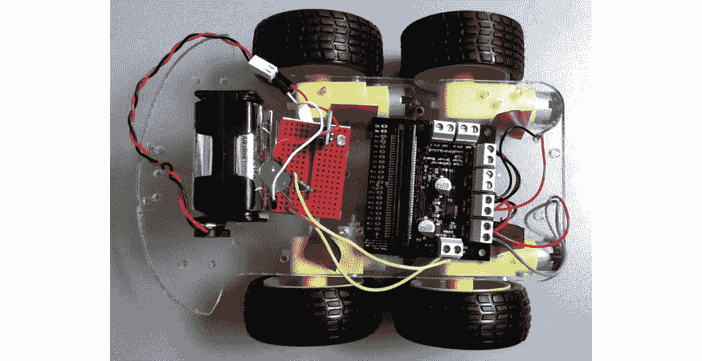
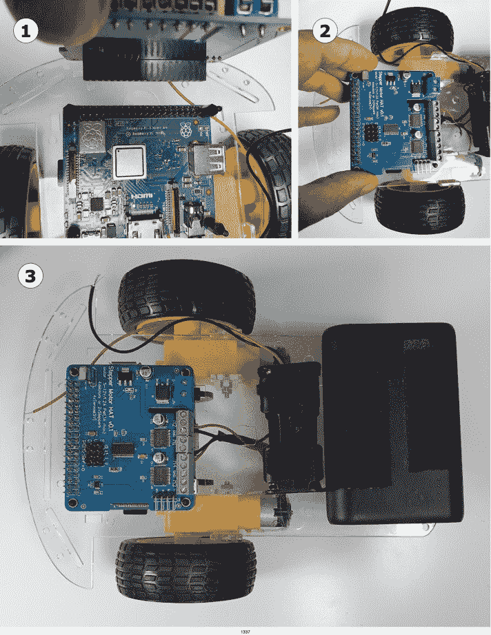
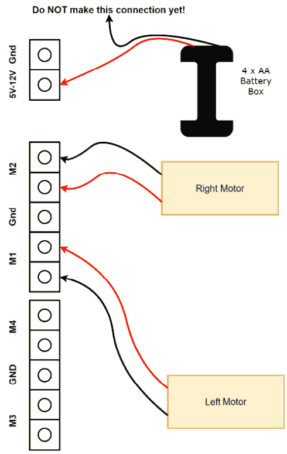
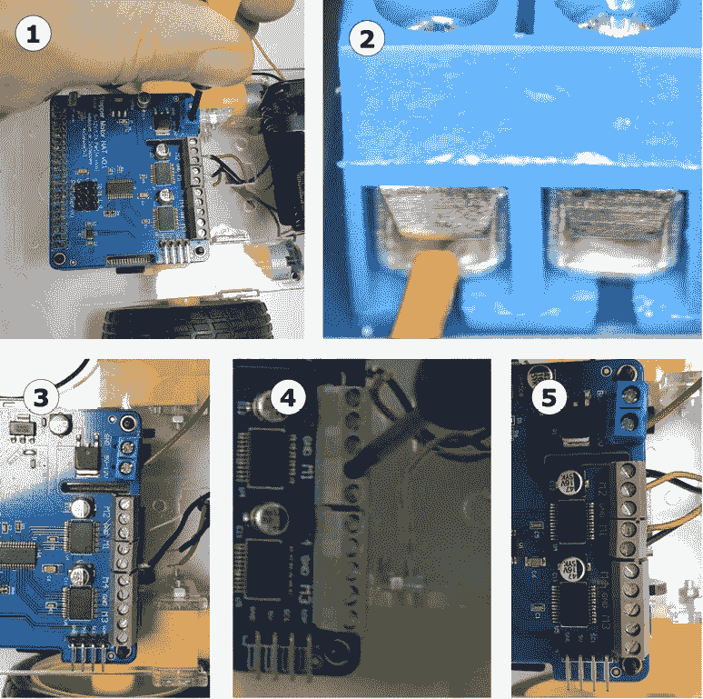
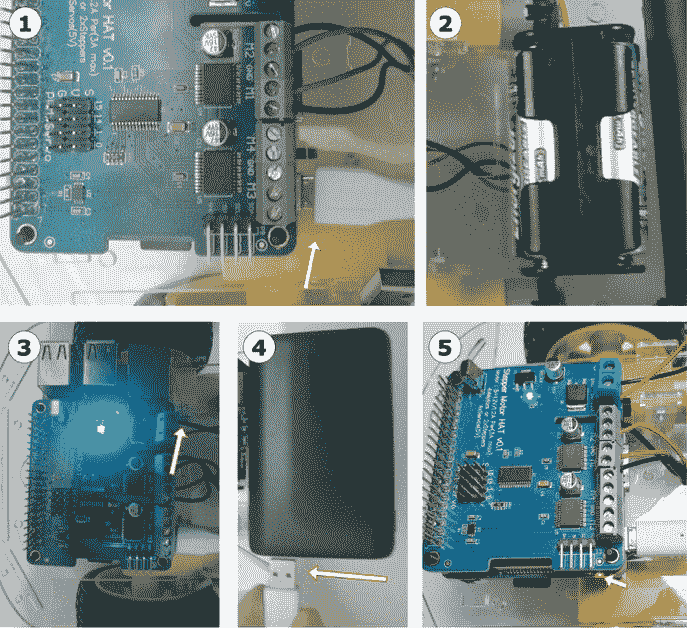
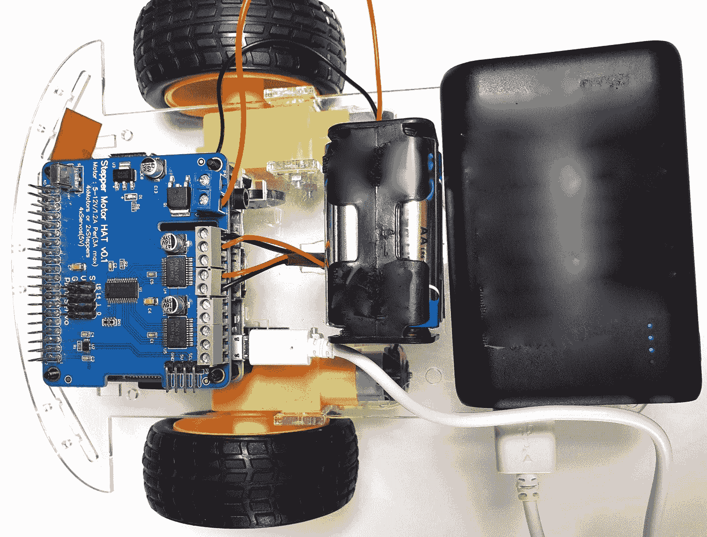

# 第八章：构建机器人基础 – 轮子、电源和布线

在本章中，我们将开始构建机器人。我们将选择带有轮子和电机的机器人底盘套件、电机控制器和一些为机器人供电的电源，讨论权衡和要避免的事项。我们将了解如何确保一切适配，然后构建机器人。到本章结束时，你将拥有一个基本的机器人结构准备就绪。

现在就确定权衡和计划，这将给你一个可以构建和实验的机器人，确保在购买之前知道组件是否合适。

在本章中，你将学习以下内容：

+   选择机器人底盘套件

+   选择电机控制器板

+   为机器人供电

+   测试安装机器人

+   组装底座

+   将电机连接到树莓派

# 技术要求

对于本章，你需要以下物品：

+   一台可以访问互联网的电脑。

+   树莓派和一张 SD 卡。

+   一套螺丝刀：M2.5、M3 斜口螺丝刀和一些珠宝匠螺丝刀。

+   一把长鼻钳。可选，一套微型公制扳手。

+   一些电工胶带。

+   挂钩和搭扣或魔术贴胶带。

+   绘图软件，如 [app.diagrams.net](http://app.diagrams.net)、Inkscape、Visio 或类似软件。

+   M2.5 和 M3 螺纹的尼龙支撑套件。

+   一些绝缘胶带。

+   四节 AA 电池，已充电。

    重要提示

    在本章中，你将选择并购买底盘、电机控制器和电池盒，但不要现在就购买。

观看以下视频以查看代码的实际应用：[https://bit.ly/3oLofCg](https://bit.ly/3oLofCg)

# 选择机器人底盘套件

底盘，就像控制器一样，是制作机器人的一个基本决定。虽然可以使用 3D 打印或玩具改造来自行制作，但最简单的开始方式是使用底盘套件。这些套件包含开始机器人构建所需的零件套件。底盘可以更换，但这将意味着重新构建机器人。

互联网上有许多底盘套件 – 太多了。那么，你如何选择一个呢？

## 尺寸

确定机器人的尺寸也很重要。如果机器人太小，你需要微型化电子技能；如果太大，你需要处理更多严重的电源。这两者都是初学者应该避免的事情：

图 6.1 – 机器人底盘尺寸比较

我们可以从 *图 6.1* 中的底盘照片比较不同尺寸的机器人：

+   **底盘 1** 的直径为 11 厘米，勉强可以装下一个控制器，但太小了。如此小巧使得构建机器人变得困难。将控制器、电源和所有传感器挤压到这个小空间需要超出初学者机器人构建范围的技术和经验。

+   **底盘2**是Armbot。这个更大的机器人宽33厘米，长30厘米，提供了大量的空间和额外的300毫米手臂伸展范围。它需要八个AA电池、大电机和强大的电机控制器。这些增加了成本，并且可能对新手在处理电力、重量和刚性方面造成问题。Armbot是我最昂贵的机器人之一，不包括手臂的成本！

+   **底盘3**适合Pi、电池和传感器，但不会很大或笨重。它的尺寸恰到好处，大约长15-20厘米，宽10-15厘米。那些有分层设计的可能适用，但不超过两层，因为三层或四层会使机器人顶部过重，导致其倾倒。底盘3有足够的空间，并且相对容易构建。

让我们来看看轮子的数量。

## 轮子数量

一些底盘套件有复杂的移动方式——腿、坦克履带、梅卡诺轮和三叉星轮，仅举几例。虽然这些很有趣，我也鼓励尝试它们，但这不是开始的地方。我建议在您的第一台机器人上使用彻底合理和基本的轮子。

有四轮驱动（如图6.2所示）和六轮驱动的套件。这些可能非常强大，需要更大的电机控制器。它们也可能消耗大量电池，并且增加了超载某物的可能性。额外的电机可能意味着更复杂的布线：

![图6.2 – 四轮驱动机器人

图6.2 – 四轮驱动机器人

两轮驱动最简单，通常需要一个第三轮来保持平衡。第三轮可以是万向轮（如图6.3所示）、滚球或仅为微型机器人设计的Teflon滑板。两个轮子也是最易于操控的，避免了使用四个或更多轮子的机器人所遇到的某些摩擦问题：

![图6.3 – 带有万向轮的两个轮子

图6.3 – 带有万向轮的两个轮子

两个轮子没有四轮或六轮驱动的牵引力，但它们简单且有效。它们也是最便宜的。

## 轮子和电机

对于初学者来说，套件应该包括轮子和电机。轮子应该有简单的橡胶轮胎。图6.4显示了低成本机器人轮子的常见样式。许多套件中都包含这些：

图6.4 – 常见的低成本机器人轮子

套件还应包括两个电机，一个用于每个轮子，并包括将其安装到底盘上的螺丝或部件。我建议使用直流齿轮电机，因为齿轮可以保持速度可用，同时增加机器人具有的机械推力。

重要的是，电机应该像图6.5中的第一个电机那样连接好电线：

![图6.5 – 有线和无线齿轮电机

图6.5 – 有线和无线齿轮电机

将这些电线焊接或连接到电机上的小标签上很棘手，而且连接不良的电线有令人沮丧的习惯，总是容易脱落。你想要开始使用的套件中已经包含了这些电线，如图*图6.6*所示：

![图6.6 – 编码器轮和插槽特写

![img/B15660_06_06.jpg]

图6.6 – 编码器轮和插槽特写

在电机安装的位置，套件应该有一些编码器轮和一个读取它们的插槽。编码器轮也被称为里程表、转速表或转速轮。

## 简单性

你不希望为你的第一个机器人搭建使用一个复杂或难以组装的套件。我反复强调，在两轮驱动的情况下，你想要两个带有焊接电线的电机。我避免使用大型机器人或独特而令人兴奋的移动系统，并不是因为它们有缺陷，而是因为从简单开始更好。这有一个限制，即购买时已经完全组装和封闭的机器人套件，留给学习和实验的空间很少。一个完全预制的机器人可能需要玩具黑客技能来定制。

## 成本

与简单性相关的是成本。你可以从大约15美元购买机器人底盘套件，到数千美元不等。更大、更复杂的机器人往往成本更高。对于这本书，我旨在保持较低的成本选项，或者至少展示它们是可能的。

## 结论

因此，现在你可以选择一个底盘套件，它包含两个轮子和一个万向轮，两个带有焊接电线的电机，插槽和编码器轮。这些激光切割的底盘并不昂贵，在流行的互联网购物网站上广泛可用，被称为*智能车底盘*，例如*2WD*：

![图6.7 – 我正在使用的机器人套件

![img/B15660_06_07.jpg]

图6.7 – 我正在使用的机器人套件

我正在使用的套件在没有Raspberry Pi组装时看起来像*图6.7*。

我们已经选择了一个底盘套件。这是一个中等大小的套件，不需要处理大量电力。它有一些空间限制，但并不小。我们可以使用这些属性来选择电机控制器。

# 选择电机控制器板

你接下来需要的重要部分是一个电机控制器。你不能直接将Raspberry Pi连接到直流电机，因为它们需要不同的电压和高电流，这会损坏GPIO引脚。电机控制器板还可以添加接口到其他设备，如传感器和其他类型的电机。

它是一个至关重要的机器人组件，将指导许多后续的决定。与电机一样，在购买之前有一些权衡和考虑：

![图6.8 – 电机控制板的选择

![img/B15660_06_08.jpg]

图6.8 – 电机控制板的选择

*图6.8*展示了一个小型的电机控制器板样本组。当我们比较我们电机板的需求时，我们参考那里展示的板作为例子。

## 集成程度

电机控制器可能只能控制一个电机（通常是2个），如 L298N，包含最基本的安全运行此芯片的配置。它们不是设计在 Raspberry Pi 上使用的，必须连接到 Pi 的 I/O 输出。

类似于 PiZMoto 的控制器安装在 Raspberry Pi 之上，减少了布线。它们仍然只包含一个电路来控制电机。它们还配有引脚，可以连接额外的设备，如距离传感器和线传感器，这些传感器会改变电压等级，我们稍后会看到。这和 L298N 都需要 Raspberry Pi 生成 PWM 信号来驱动电机。

在更高层次的集成中是全功能步进 HAT。它有一个专门用于 PWM 控制的芯片，能够驱动多个伺服电机和直流电机。这个 HAT 通过使用 I2C 释放了 Raspberry Pi 的 I/O 引脚。

PiConZero 是这里最集成的设备。它使用一个相当于 Arduino 的微控制器来控制直流电机和伺服电机，输出到灯光并从各种传感器接收输入。它还使用 I2C，减少了所需的引脚数量。

## 引脚使用

当在 Raspberry Pi HAT 形式购买电机控制器时，考虑正在使用的 I/O 引脚非常重要。使用相同引脚进行不兼容功能的板不会工作。

重要提示

虽然HAT插入了所有引脚，但这并不意味着它们都被使用。通常只有HAT上的一小部分引脚实际上被连接。

要了解不同板在 Raspberry Pi 上的引脚交互，请查看 [https://pinout.xyz](https://pinout.xyz)，它允许您选择 Raspberry Pi 板并查看它们的引脚配置。

使用 L298N 需要四个 I/O 引脚来控制直流电机，使用传感器或伺服电机则需要更多的引脚。PIZMoto 的功能与 L298N 类似，需要四个 I/O 引脚来控制直流电机。PIZMoto 还为线检测器分配了一个引脚，为距离感应分配了两个引脚，为LED分配了两个引脚，总共占用了九个 GPIO 引脚。PIZMoto 还需要额外的伺服电机支持。

PiConZero 和全功能步进 HAT 都使用 I2C 总线。使用 I2C 或串行总线可以有效地使用引脚，因为它们只使用两个引脚进行 I2C。多个设备可以共享 I2C 总线，因此这些引脚的使用也是共享的。PiConZero 将一些其他引脚分配给超声波设备等功能。全功能步进 HAT 在支持直流电机和5个伺服电机的同时，将所有其他引脚留出供使用，使其成为选择中最灵活的控制板之一。

## 尺寸

电机控制器的大小选择取决于底盘和您拥有的电机的大小。简单来说，底盘越大，所需的控制器就越大。我们指定电机控制器的功率处理能力为安培。对于像 *图6.7* 中所示的机器人，每个通道大约需要 1 到 1.5 安培。

电压过低可能导致机器人几乎无法移动，甚至起火。控制器过大对空间、重量和成本都有影响。散热器是一种保持控制器冷却并处理电流的方法，但会使控制器更大，如图 6.9 所示：

图 6.9 – 配有散热器的 L298N

集成度的高低也会影响尺寸。一个堆叠在 Pi 板上的小板比单独的板占用空间更少。

另一个需要考虑的尺寸或形状因素是板是否限制了 Raspberry Pi 摄像头端口的使用。一些板，如 Pimoroni Explorer HAT Pro，完全覆盖了摄像头插槽，使得使用变得很麻烦。一些板有摄像头端口的插槽，如 Full Function Stepper HAT，而其他的是半尺寸帽子（pHat），如 PiConZero 和 PizMoto，它们不覆盖该区域。

由于我们在本书中使用摄像头，因此摄像头端口必须是可访问的，无论是通过插槽还是通过作为半尺寸（PHat）板。

## 焊接

当你为机器人选择板时，请注意，一些板本身是套件，需要你在上面焊接部件。如果你有这方面的经验，这可能是一个选择，但会花费时间成本。一个小型引脚头将是一个非常快速和简单的工作。一个作为组件袋和裸板一起提供的板可能需要花费一个晚上的时间，并且可能需要调试。

小贴士

焊接是机器人构建的基本技能，但对于第一个机器人来说不是必需的，因此对于这本书，我主要推荐预组装模块。

## 电源输入

电机可能需要比 Raspberry Pi 使用的 5 V 电源不同的电压。它们也可能会消耗大量电流。我们将在后面讨论电源选择，但通常最好将电机电源与 Raspberry Pi 的电源分开。图 6.8 中的所有板都有独立的电机电源输入。

PiConZero 和 L298N 允许用户从电机电源为 Raspberry Pi 提供电源，但这可能导致复位和断电条件。一些电机接口板，如 Adafruit Crickit 和 Pimoroni Explorer HAT Pro，使用与电机相同的 5 V 电源为 Raspberry Pi 提供电源，需要高电流容量的 5 V 电源。我的建议是确保电机板有独立的电机电源输入。

## 连接器

与焊接和电源输入密切相关的是电机和电池的连接器。我倾向于更喜欢图 6.10 中所示的螺钉型连接器：

图 6.10 – 电机和电池连接的螺钉端子

其他类型可能需要特殊连接器的电机，或者机器人构建者需要具备压接技能。

## 结论

我们的机器人空间有限；因此，我们使用Raspberry Pi HAT类型的尺寸。我们还在努力减少它使用的引脚数量。基于I2C的HAT让我们做到了这一点。**全功能步进电机HAT**如图6.11所示。它也被称为全功能机器人扩展板，使我们能够访问所有Pi引脚，同时作为一个强大的电机控制器：

![图6.11 – 全功能步进电机HAT]

![img/B15660_06_11.jpg]

图6.11 – 全功能步进电机HAT

它在大多数国家都有售，有空间放置摄像头的带状线，并控制伺服电机。我推荐这本书中的机器人使用这个HAT。我们的代码与基于Full Function板上PCA9685芯片的板直接兼容。通过在代码和布线上进行一些小的修改，4tronix PiConZero也是一个合适的选择。

# 为机器人供电

机器人需要为其所有部件供电。我们必须考虑两个主要电源系统：所有数字部件的电源，如Raspberry Pi和传感器，然后是电机的电源。

电机需要单独的电源系统，原因有几个。首先，它们消耗的电能比机器人上大多数其他组件都要多。它们可能需要不同的电压；我见过低压、大电流的电机电源和高压电源。另一个原因是它们可以引起干扰。它们可以拉取足够的电力，导致其他电路出现电压降低。电压降低是指电路电压下降到足够低或持续时间足够长，以至于进入不一致或重置状态。重置可能导致Pi上的SD卡损坏。电机在使用时还可以向电源线引入电气噪声，这可能导致数字部件出现异常行为。

为带有电机的机器人供电有两种主要策略：

+   **双电池**：电机和机器人其余部分完全独立的电池组，确保它们的电源是独立的。

+   **电池消除器**：使用单个电池或设置BEC/稳压器。BEC是**电池消除电路**，如图6.12所示：

![图6.12 – BEC的图片]

![img/B15660_06_12.jpg]

图6.12 – BEC的图片

双电池是避免任何电压降低、断电或干扰问题的最可靠选择。这种选择比BEC占用更多空间。然而，为Raspberry Pi配备USB移动电源的双电源选项（如图6.13所示）是一种简单而有效的方法来避免电源问题。选择一个外壳尺寸小、功率评级高，例如10,000 mAh，输出至少2.1 A的电源：

![图6.13 – Armbot的USB移动电源 – 稍显陈旧且有些磨损，但仍然有效]

![img/B15660_06_13.jpg]

图6.13 – Armbot的USB移动电源 – 稍显陈旧且有些磨损，但仍然有效

请检查USB移动电源是否附带连接Raspberry Pi的电缆——Raspberry Pi 3（A+和B+）需要USB微型连接器，而Raspberry Pi 4需要USB-C连接器。移动电源的输出通常使用USB-A连接器。如果它们没有包含在移动电源中，您还需要购买这些电缆之一。

电机控制器板有时会提供电源来调节从电机电源到Pi的电力。这些通常输出额定值过低。它们可能非常低效，浪费大量电池电力。除非使用高电流处理电池，否则它们很可能导致电压降低，导致断电。

电池消除电路更轻，占用的空间更小。类型包括BEC、uBEC、开关电源或稳压器。电池消除器通常需要高功率电池，如锂离子电池。通过与电机共享电源，电池需要足够的电流容量，以避免电压下降导致控制器复位和线路噪声。这一要求影响了像Wide Input SHIM这样的开关电源Pi SHIM以及一些电机控制器中内置的电源。

您需要确保BEC输出至少可以处理2.1 A，最好是更多。3.4 A和4.2 A的电源银行很常见。5 A额定值的UBEC也很常见。

为了使这个机器人简单，并且不需要处理复位问题，我们采用双电池方案，并接受大量和重量上的成本：

图6.14 – 我们与电机一起使用的4 x AA电池盒

对于电机，4 x AA电池就足够了。我建议使用镍金属氢化物可充电电池。这不仅仅是因为您可以充电，还因为它们在需要时可以提供比碱性电池更多的电流。为了节省空间，我们使用*两个向上/两个向下*或*背对背*配置，就像*图6.14*中显示的电池盒一样。

总结来说，在我们的电池选择中，我们将为电机使用一个4 x AA金属氢化物电池组，并为Raspberry Pi和逻辑电路使用一个USB移动电源。

我们现在已经做出了零件选择。我们知道我们将使用哪种底盘、控制器和电池配置。我们已经看到了电机和轮子的尺寸，在前几章中，我们已经选择了一个Raspberry Pi型号来使用。在我们继续购买所有这些零件之前，我们应该进一步检查以确保它们都能安装。在下一节中，我们将学习如何测试安装机器人零件。

# 测试安装机器人

我建议在订购零件之前先进行测试安装。测试安装可以帮助构建者更有信心地确保组件匹配，并且您将大致知道这些组件的位置。这一步骤可以为您节省时间和金钱。

您可以使用纸张和笔进行测试装配，或者使用 [diagrams.net](http://diagrams.net) 这样的应用程序。首先，我找到了所有部件的尺寸。*图 6.15* 展示了从亚马逊获取产品尺寸的方法：

图 6.15 – 查找产品规格

需要进行一些信息挖掘才能找到这些尺寸。对于每个部件，首先找到一个可以购买的地方，例如亚马逊、几个在线商店或 eBay。然后，您可以搜索或询问有关每个板或物品尺寸的信息。确保您查看的是部件的尺寸，而不是其包装：

图 6.16 – 带尺寸的电池盒产品图纸

您可以在 *图 6.16* 中找到类似电池盒的图表，通过在尺寸或部件数据表中搜索图像。在这种情况下，尺寸以毫米为单位。正负号表示制造公差，即下一个数字的正负。在测试装配时，偏向较高的一侧，所以将 57±1 视为 58 mm。

因此，我拥有的尺寸如下：

+   Raspberry Pi 3a+：65 mm x 56 mm。

+   底盘：我的建议是 100 mm x 200 mm。请注意，这里的尺寸是外尺寸，包括车轮。

+   电机控制器覆盖在 Pi 上，因此它被计算为 Pi。这个控制器会使东西变高，但仅对多层机器人底盘有实际影响。

+   4 x AA 电池盒：我建议的类型是 58 mm x 31.5 mm。

+   USB 电源银行：60 mm x 90 mm。

对于此，按比例绘制矩形就足够详细了。在 [diagrams.net](http://diagrams.net) 中创建一个新的空白图表：

图 6.17 – 使用 diagrams.net 创建测试装配部件

您可以按照说明创建如图 6.17 所示的测试装配部件：

1.  使用左侧的通用调色板拖出矩形。

1.  明确标注每个部件很有帮助。双击矩形并输入标签。按 *Enter* 键接受标签。我在底盘的 *前面* 添加了一个文本标签。

1.  选择项目，使其具有蓝色高亮。点击右侧的选项卡以选择 **排列** 选项卡。

1.  这里，将您的尺寸（将毫米转换为点）输入到 **宽度** 和 **高度** 框中。

1.  您可以为所有项目重复 *步骤 1* 至 *4*，然后拖动部件：

图 6.18 – 测试装配

Pi 应该靠近机器人的前面，因为我们稍后会在这里放置传感器，电机线可以向前进入。在 *图 6.18* 中，我已经将矩形拖到适当的位置。[Draw.io](http://Draw.io) 通过显示用于居中和对齐对象的蓝色指南线来帮助您。我将电源银行放在后面，将 AA 电池放在 Pi 较近的位置，以便它们可以轻松地进入电机控制器。

这些部件看起来可以安装。虽然不是100%准确，但足够好，可以说这可能会工作。

现在，是时候购买部件了。我的购物清单如下：

+   底盘套件。

+   全功能步进电机HAT。

+   4个AA电池盒。

+   4个金属氢化物AA电池。如果你没有，你需要为这些电池也购买一个充电器。

+   1个能够提供3安培或更多电流的USB移动电源。

现在你已经选择了部件并做出了权衡。你随后通过测试安装它们来查看它们的布局并检查它们是否都适合。现在是时候你去购买你的部件和底盘了。一旦完成，请回来这里，因为那时我们可以开始我们的组装。

# 组装底盘

假设你购买了一个与我类似的底盘，你可以按照以下步骤组装它。对于完全不同的底盘，我强烈建议咨询组装说明文档。与这里推荐的大相径庭的底盘可能会使接下来的几章更难跟随。

一些部件可能被一层纸覆盖（如*图6.19*所示）。这层纸可以防止塑料划伤，可以安全地移除。你可以通过在下面放一根钉子或使用手工刀来完成这项工作。这不是必须的，但机器人看起来没有它更好：

![图6.19 – 移除机器人部件的保护背衬

![图片 B15660_06_19.jpg]

图6.19 – 移除机器人部件的保护背衬

对于使用黄色电机的激光切割套件，电机有两种主要的安装方式。一种类型有塑料支架，另一种有金属电机支架。鉴于你可能购买任何一种风格的套件，让我们看看套件可能有哪些不同。这种差异仅在组装步骤中才有意义，所以购买你能够买到的套件。

对于带有塑料电机支架的套件，你应该有*图6.20*中显示的部件：

![图6.20 – 机器人套件部件

![图片 B15660_06_20.jpg]

图6.20 – 机器人套件部件

在套件中，你应该有以下部件：

1.  两个轮子。

1.  编码器轮。

1.  一对带线的电机。

1.  一个万向轮。

1.  用于安装万向轮的螺栓和黄铜支架。我已经用非导电尼龙螺栓替换了一套。你应该可以从尼龙支架套件中做到同样的替换。

1.  底盘板。

1.  用于安装电机的塑料支架。你的套件可能有金属类型，它们的工作方式略有不同，并附带四个额外的螺丝。

1.  四个螺栓和螺母用于安装电机。

*图6.21* 展示了金属电机支架部件的不同之处：

![图6.21 – 金属类型电机支架

![图片 B15660_06_21.jpg]

图. 6.21 – 金属类型电机支架

在套件中，你应该有以下部件：

1.  金属支架替换了这里的塑料支架。

1.  底盘到支架螺栓 – 这些支架需要通过螺栓固定到底盘上。

1.  用于支架到电机的长螺栓仍然相同。

    重要提示

    其他未显示的部件将与这个非常相似。

现在，让我们看看如何安装编码器轮。

## 安装编码器轮

我们将首先将编码器轮安装到电机上。我们需要这些轮子用于后续章节中的传感器部分：

![图 6.22 – 编码器轮安装到电机上]

![图 B15660_06_22.jpg]

图 6.22 – 编码器轮安装到电机上

按照图 6.22 中的步骤操作：

1.  观察电线连接到它的哪一侧。编码器轮应该安装在电线相同的一侧。

1.  在编码器轮中找到带有扁平边的轴孔。

1.  电机上的轴形状与这个孔相匹配。

1.  将轴孔与电机的轴对齐，与电线在同一侧，轻轻推入。它应该有一点摩擦。对另一个电机重复此操作。

现在，你应该有两个带有编码器轮的电机，它们的轮子与电线在同一侧。接下来，我们将电机支架安装到机器人上。

## 安装电机支架

图中展示的激光切割底盘通常使用两种类型的电机支架。你应该使用与你所拥有的类型最相似的部件。

### 安装塑料电机支架

重要提示

如果你使用的是金属类型，则跳过此部分。

要安装塑料类型的支架，首先寻找将其安装的槽位，如图 6.23 所示：

![图 6.23 – 塑料电机支架]

![图 B15660_06_23.jpg]

图 6.23 – 塑料电机支架

要安装这些，请按照以下步骤操作：

1.  箭头指向槽位。将塑料支架推过槽位。

1.  将电机推到支架上。注意电线和编码器轮朝向内部。编码器应该位于底盘主体上的一个凹槽中。

1.  底盘上有一个槽位用于安装外置支架，将电机夹在中间。将另一个支架推入这个槽位。

1.  从外侧将长螺丝推入。

1.  然后，将螺母推到螺丝上，并使用螺丝刀将其拧紧。

1.  对于离底盘最近的螺母，其扁平的一边应该在你拧紧螺丝时将其固定在位。对于外部的螺母，请使用扳手或钳子。

1.  你需要为另一侧重复相同的步骤。

本节已涵盖使用塑料支架将电机安装到底盘上的过程。如果你有金属支架，你应该使用以下部分：

### 安装金属电机支架

如果你已经组装了塑料电机支架，请跳过此部分。金属类型的支架略有不同；图 6.24 展示了其组装过程：

![图 6.24 – 组装金属电机支架]

![图 B15660_06_24.jpg]

图 6.24 – 组装金属电机支架

要这样做，请执行以下步骤：

1.  你应该能够在支架顶部看到两个小螺丝孔；这些是螺纹的。每个支架有两个短螺丝。

1.  底盘在轮子支架区域有孔，与这些孔相匹配。将它们对齐，然后将短螺丝从底盘孔中穿过，拧入支架。

1.  拿起电机，确保电线远离你。将长螺丝从电机上的两个孔中推入。

1.  然后，将这个电机组件推入支架侧面的孔中。

1.  它应该这样安装进去。

1.  现在，将螺母推到支架另一端的螺纹上。

1.  你可以用钳子、扳手和螺丝刀拧紧离车架最远的螺母。较近的螺母卡在一边的平面上，所以你只需要螺丝刀。

1.  你现在有了完成的组装，需要为另一边重复这些步骤。

完成任意一套步骤后，你现在应该在每一边都安装了一个电机。我们将使用这些作为驱动轮。但首先，我们需要万向轮。

## 添加万向轮

接下来，是安装万向轮的时候了。万向轮平衡机器人。它不是被驱动的，所以会被机器人拖着走。重要的是它要有很小的摩擦。*图6.25*以及随后的步骤将教你如何完成这项工作：

![Figure 6.25 – 安装万向轮

![img/B15660_06_25.jpg]

图6.25 – 安装万向轮

使用这些步骤与图6.25一起：

1.  这就是万向轮。它有四个螺丝孔。

1.  你需要将一个金属螺丝推过孔，使螺纹朝向远离轮子的方向。

1.  现在，将一个黄铜支架拧入这个螺丝中。

1.  为其他四个侧面重复此操作。

1.  将支架的另一侧与车架上的四个孔对齐。注意，这个万向轮是矩形，不是正方形。确保轮子朝下。

1.  将一个螺丝推过并拧紧。

1.  我建议你拧紧对角线的角落。

1.  这样使得剩下的两个螺丝更容易安装。

1.  万向轮现在应该像这样固定在机器人上。

安装了万向轮后，机器人可以保持平衡，但它需要轮子才能移动，所以让我们添加轮子。

## 安装轮子

轮子现在需要按照图6.26所示推上去：

![Figure 6.26 – 安装轮子

![img/B15660_06_26.jpg]

图6.26 – 安装轮子

按照这些步骤进行：

1.  首先，注意它们在轴孔中有两个扁平侧面，就像编码器轮一样。

1.  将轮子与轴对齐，考虑到平边，并将它们推上去。不要推电线或编码器盘，因为它们可能会损坏。

1.  有时，旋转轮子直到它们推入会有帮助。你应该能够将轮子推上去，同时确保从另一侧支撑电机。完成此操作后，你可能想要重新调整编码器轮与它们的槽位。

轮子已经安装在电机上，机器人开始成形。现在，机器人应该能够坐在三个轮子上。你可以手动滚动它，但它还不太能自己驱动。

## 拉起电线

车架组装的最后一个小步骤是将电线拉起来。电机控制器将在机器人的顶部，所以电线也需要在车架之上：

![Figure 6.27 – 拉起电线

![img/B15660_06_27.jpg]

图6.27 – 拉起电线

按照图6.27中的步骤进行：

1.  首先，收集一个电机的两根线。找到底盘中间的小槽。

1.  将电线推过去。

1.  轻轻地将它们拉到底盘顶部，使它们像图中所示那样突出。为另一个电机重复此操作。

现在我们应该有一个看起来像*图6.28*（电机支架各异）的机器人：

图6.28 – 组装好的底盘

电机就位，轮子准备就绪，我们可以看到机器人将如何移动。你已经建成了机器人的机械部分。电线已经到位，我们现在准备添加电子设备。我们将从添加中央控制器，即Raspberry Pi开始。

## 安装Raspberry Pi

我们现在不会安装电机控制器——我们将在下一章中解决这个问题，但现在我们可以安装Raspberry Pi并准备将其连接到其他板子上。我们需要在Pi上放置支撑螺母，以便将其固定到底盘上，但要留出电机支架安装的空间，以及稍后放置在Pi下面的传感器：

图6.29 – 安装Raspberry Pi

按照*图6.29*中所示进行操作：

1.  你需要一个小的posidrive螺丝刀，一个小扳手或一把钳子，4 x M2.5 5mm螺丝，4 x M2.5 8mm带螺纹的支撑螺母，4 x M2.5 12mm支撑螺母，以及Raspberry Pi。

1.  将8毫米的支撑螺母螺纹从Pi的底部穿过螺丝孔推上去。

1.  然后，使用钳子/扳手将10毫米的支撑螺母拧到这些螺母的顶部，使螺纹向上，并用钳子/扳手固定支撑螺母。

1.  为所有四个角落重复此操作。

1.  将这两条线与底盘上的槽或螺丝孔对齐，并从下面拧紧。

1.  在我使用的底盘上，只有两个孔对齐，所以我拧紧了这些孔，并使用其他支撑螺母保持Pi的水平。

这个机器人现在有一个主控制器，它将能够运行代码并控制机器人。然而，在它能够做很多事情之前，控制器和电机需要电力。

## 添加电池

你购买了两套电池：4 x AA电池夹，如图*6.14*（配有一套可充电金属氢化物电池），以及一个USB充电宝，如图*6.13*。充电宝包含一个锂离子电池和一个USB充电系统。

我们将这些安装到机器人的后面，它们将平衡我们稍后要添加的一些传感器。

### 设置USB充电宝

还未将充电宝连接到Raspberry Pi（或者如果你已经连接了，在拔出电源线之前，请确保登录并正确关闭它）：

图6.30 – 安装充电宝

要将USB充电宝安装到底盘上，请按照以下说明和*图6.30*进行操作：

1.  对于这个充电宝，我们使用了一些钩子和粘带。

1.  看一下移动电源，并注意其中一侧有USB连接器。这个连接器最终应该位于机器人的左侧。如果它有一个LED充电显示，那么它应该位于顶部。

1.  测量两段钩扣带。将粗糙的一面粘贴在机器人上的两条条带上。

1.  将柔软的一面粘贴到移动电源上，并与机器人对齐。

1.  将电源推下，使钩扣带粘在一起。这个连接很牢固。

1.  这就是移动电源在机器人上的放置方式。

替代方案包括使用粘性胶带（用于便宜但脆弱的连接）、电缆扎带、双面胶带或橡皮筋来固定电池。这些适用于不同尺寸的电池。

### 安装AA电池托架

我们还将使用钩扣带添加一个AA电池托架作为电机电源。我们需要托架易于拆卸，以便更换电池。钩扣带是这种应用的便捷选择。添加AA电池托架如图*图6.31*所示：

![图6.31 – 安装AA电池托架

![img/B15660_06_31.jpg]

图6.31 – 安装AA电池托架

要安装AA电池托架，请使用*图6.31*并按照以下步骤操作：

1.  确保AA电池托架中还没有电池。

1.  在电池托架底部剪下一小条钩扣带，并将其粘贴上。

1.  将另一条钩扣带粘贴到机器人上，正好位于移动电源前方（为了清晰起见已移除 – 你不需要移除移动电源）。

1.  使用钩扣带将电池托架固定在这里。

在紧急情况下，可以使用粘性胶带，但请记住，AA电池盒需要可拆卸的，以便更换其中的电池。

## 完成的机器人底盘

现在，你已经完成了机器人底盘，它应该看起来像*图6.32*：

![图6.32 – 完成的底盘

![img/B15660_06_32.jpg]

图6.32 – 完成的底盘

现在，你已经搭建了你的第一个机器人底盘！希望这是许多中的第一个。随着机器人底盘的完成，配备了轮子、Raspberry Pi和电池仓，它几乎可以滚动了。它还需要连接到电机控制器和一些代码来真正地活跃起来。

# 将电机连接到Raspberry Pi

在本节中，我们将连接电机到Raspberry Pi。一旦连接好，我们就可以使用Raspberry Pi上的代码来控制电机，使机器人移动。*图6.33*是我们在本章中构建的机器人的框图。我们将使用全功能步进电机HAT作为控制器板，简称Motor HAT。

这个框图类似于在[*第3章*](B15660_03_Final_ASB_ePub.xhtml#_idTextAnchor050)中显示的类型，*探索Raspberry Pi*。首先，它从Raspberry Pi开始，这里用灰色表示，因为我们选择了它作为我们的控制器。Pi连接到Motor HAT，指令从Raspberry Pi流向该板。Motor HAT及其连接在本章中添加这些部件时被突出显示。在后续章节中构建这个框图时，现有组件将以灰色显示。添加的组件将以红色突出显示，以显示新内容。最后，两个电机被添加到Motor HAT的左右两侧，箭头从Motor HAT指向，表示它正在控制电机：

图6.33 – 机器人框图

连接电机的第一步是将Motor HAT安装到Raspberry Pi上。图6.34显示了Motor HAT：

图6.34 – 全功能步进电机HAT

让我们将这个HAT连接到我们的机器人上，并布线以便我们可以开始编程我们的机器人：

图6.35 – 安装电机控制器

参考图6.35，按照以下步骤操作：

1.  将电机板插座与Pi引脚对齐。角落的四个孔也应该与向上的螺丝螺纹对齐。

1.  轻轻且均匀地将电机板推到Raspberry Pi上，引导螺丝螺纹通过。继续直到板子牢固地安装在GPIO引脚上。

1.  机器人现在应该看起来像这样。

现在板子已经连接到Raspberry Pi上，我们可以开始布线了。

## 布线电机HAT

我们现在将布线Motor HAT，首先连接到电机，也部分连接到电机电池。我们布线电机电池，以便电机有自己的电源，不会在Raspberry Pi上引起低功耗复位条件。电机控制器需要连接到电机以供电和控制它们。

图6.36显示了如何布线。在我们准备好供电之前，不要布线电池上的地线（黑色）。我建议使用一小段绝缘胶带将地线的尖端粘在底盘的塑料部分上，以免钩住任何东西。不布线地线让我们可以用它作为一种临时开关：

重要提示

电池上的黑色线可能被称为地线、GND或负极。红色线可以被称为**正极**（**+ve**）、**vIn**（**电压输入**）或电压输入额定值，例如，5 V – 12 V。

图6.36 – 如何连接电机和电池

图6.37显示了连接步骤：

图6.37 – 连接电线步骤

参考图6.37执行以下步骤以连接电线：

1.  松开5 V – 12 V连接、GND、两个M2连接器和M1连接器的螺钉端子。

1.  将AA电池盒中的红色导线推入标记为5 V – 12 V的螺钉端子，确保导线的金属部分（导线芯）位于金属盖形成的槽中。

1.  紧固螺钉，确保导线不易被拉出。确保导线芯被夹紧，而不是塑料外层（其绝缘层）。

1.  对电机端子重复操作，连接如图像4所示的连接。

1.  结果应类似于图像5。

我们现在已将电机连接到控制器，因此它可以驱动它们。我们已部分连接了电池电源，但我们留下了一个连接空闲，这样我们可以将其用作电源开关。让我们尝试启动机器人。

## 独立电源

到目前为止，尽管我们已经设置了一个无头Raspberry Pi，但我们仍然一直在将其插入墙壁。现在是我们尝试独立供电的时候了。我们将从AA电池为电机供电，从USB移动电源为Raspberry Pi供电。我们将看到设备上的灯光，以告诉我们它们正在供电：

图6.38 – 转向独立电源

按照图6.38中所示步骤操作：

1.  将电缆的Micro USB（小）端插入Pi上由箭头指示的USB微型插座。

1.  安装四个AA电池；你可能需要在安装后再次抬起并放下电池盒。

1.  你现在可以给电机板供电。将电池盒中的黑色导线连接到箭头旁边的GND端子，位于5 V – 12 V旁边。当你这样做时，电机板上会出现一个灯，表明它处于活动状态。

1.  通过将USB A（宽）端插入移动电源来打开Pi。从现在起，目的是保持micro-USB小端连接，仅在给Pi供电时连接/断开USB A（宽）端。

1.  如图像5所示，Raspberry Pi和电机板现在已通电。

恭喜，你的机器人现在已使用独立电源运行，使Raspberry Pi摆脱了墙壁，并为电机供电：

图6.39 – 完整的[*第6章*](B15660_06_Final_ASB_ePub.xhtml#_idTextAnchor096)机器人

图6.39中的照片显示了到目前为止的我们的机器人。它底盘上有电机，安装了Raspberry Pi和电机控制板。机器人有一个为Raspberry Pi供电的电源 - 目前已通电。它还有一个为电机供电的电源，目前未连接，黑色地线被仔细地用胶带固定在机器人其他部分之外。电机已连接到控制板上。这已经足够让机器人开始移动了。

重要提示

SD卡在未关闭Pi的情况下断电可能会被损坏。关闭时，使用PuTTY登录并使用`sudo poweroff`在断电之前。

你的电机已经准备好驱动，树莓派也准备好了运行代码，无需连接到墙壁。将独立电源与无头Wi-Fi控制相结合意味着机器人可以通过来自电脑的指令进行驾驶。

# 摘要

在本章中，你现在已经学会了如何通过推理和做出一些重要的设计决策来选择机器人的部件。你使用了一个简单的工具来测试适配这些部件，在购买任何东西之前看看哪些是可行的。最后，你购买了部件并构建了你的起始机器人平台。

通过考虑权衡和再次测试适配，你已经获得了规划任何硬件项目的技能，包括在数据表/供应商网站上查找尺寸、制作一个简单的测试适配草图，以及考虑部件如何相互作用。你已经了解到机器人的大小如何影响电机和控制器的选择。你看到了如何使用搭扣和粘带使部件易于拆卸，并考虑了其他选项。

通过连接独立电源和电机，机器人拥有了在没有连接到墙壁的情况下自行移动所需的硬件。但它还没有任何移动的代码。在下一章中，我们将开始编写代码使这个机器人移动！

# 练习

+   在[*第二章*](B15660_02_Final_ASB_ePub.xhtml#_idTextAnchor033)《探索机器人构建模块——代码与电子》中，你为不同的机器人创建了框图。考虑它需要什么底盘、电源和部件。使用在线供应商寻找合适的部件。

+   考虑是否有适合你设计的树莓派帽或罩的组合。使用资源如 [https://pinout.xyz](https://pinout.xyz) 检查它们的引脚使用是否兼容。

+   对于你的新设计，哪些电源系统可能是合适的？

+   是否有需要易于拆卸的组件？你将如何处理？你能想出替代搭扣和粘带的方案吗？请保持简单。

+   为你的新机器人部件制作一个测试适配草图，检查它们是否使用部件尺寸适配。

# 进一步阅读

请参考以下信息以获取更多信息：

+   关于底盘设计的进一步阅读，可以考虑*《树莓派机器人蓝图》*，*理查德·格里姆特博士*，*Packt 出版公司*。这包括将遥控车改装成机器人。

+   对于更多机器人底盘类型，社区分享网站 [https://www.instructables.com](https://www.instructables.com) 有许多可构建的示例。其中一些非常有趣，比我们的机器人更先进。
