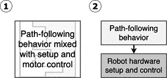

# 第九章：驱动和转向 – 使用Python移动电机

在本章中，我们将继续构建上一章开始构建的机器人，将电机连接到树莓派，并构建Python代码来使它们移动。我们将介绍编程技术，在物理机器人和其行为代码之间创建一个层，以减少硬件变化的影响。我们的代码和构建将使机器人移动！我们通过编程机器人驾驶一个小路径来结束。机器人代码层将作为我们所有机器人行为的基础，而设定的路径将展示如何使用它。

本章我们将涵盖以下主题：

+   编写代码来测试你的电机

+   驾驶机器人

+   创建一个`Robot`对象——我们的实验代码与机器人通信

+   编写一个脚本以遵循预定的路径

# 技术要求

要完成本章的实验，你需要以下条件：

+   一台可以访问互联网的电脑

+   在[*第6章*](B15660_06_Final_ASB_ePub.xhtml#_idTextAnchor096)，*构建机器人基础 – 轮子、电源和布线*中构建的底盘

+   在[*第6章*](B15660_06_Final_ASB_ePub.xhtml#_idTextAnchor096)，*构建机器人基础 – 轮子、电源和布线*中购买的电机控制器

+   为机器人驾驶提供一个2米乘2米的平坦空间

    重要提示

    如果你使用桌子，请准备好停止你的机器人从边缘驶过！最好使用地板。

查看以下视频以查看代码的实际操作：[https://bit.ly/39sHxWL](https://bit.ly/39sHxWL)

# 编写代码来测试你的电机

在我们开始使用电机做一些花哨的事情之前，我们需要设置并测试它们。这样，我们可以确保它们工作并消除任何问题。

我们需要下载库来与我们所选择的电机板一起工作。许多机器人部件，除了最简单的部件外，都有一个接口库来控制板上的电机和其他设备。现在是时候再次使用PuTTY登录到你的Pi了。

## 准备库

我们使用树莓派上的Git从GitHub上的一个项目下载此代码。因此，我们需要在Pi上安装Git；我们还需要I2C（`i2c-tools`和`python3-smbus`）和`pip`来将东西安装到Python中。输入以下命令：

```py
pi@myrobot:~ $ sudo apt-get install -y git python3-pip python3-smbus i2c-tools
```

为了获取电机板库`Raspi_MotorHAT`，我们使用Git从GitHub下载它，并使用以下命令将其安装以供任何脚本使用：

```py
pi@myrobot:~ $ pip3 install git+https://github.com/orionrobots/Raspi_MotorHAT
Collecting git+https://github.com/orionrobots/Raspi_MotorHAT
  Cloning https://github.com/orionrobots/Raspi_MotorHAT to /tmp/pip-c3sFoy-build
Installing collected packages: Raspi-MotorHAT
  Running setup.py install for Raspi-MotorHAT ... done
Successfully installed Raspi-MotorHAT-0.0.2
```

现在我们已经准备好了启动机器人的库。`Raspi_MotorHAT`库的文档很少，但可以在[https://github.com/orionrobots/Raspi_MotorHAT](https://github.com/orionrobots/Raspi_MotorHAT)找到，以及使用它的示例。

## 测试 – 找到电机板

树莓派使用I2C连接到这个电机板。`raspi-config`再次。我们在这里还启用了**串行外设接口**（**SPI**）。我们可能需要它来连接其他板和传感器。输入以下命令：

```py
$ sudo raspi-config
```

现在，我们使用此处的接口设置。*图7.1*显示了如何进行，如下所示：


图7.1 – 使用raspi-config启用SPI和I2C

参考图7.1中的截图并执行以下步骤：

1.  首先，选择**接口选项**。

1.  接下来，选择**I2C**。

1.  Pi会询问您是否想要启用此接口。选择**<是>**。

1.  然后，您将被带回到初始屏幕，需要再次导航到**接口选项**屏幕。从那里，选择**SPI**和**<是>**。

1.  一个确认屏幕告诉您现在SPI已被启用。选择**<确定>**。

1.  最后，按两次*Esc*以完成`raspi-config`。它会询问您是否想要重新启动。选择`sudo reboot`以重新启动它。

使用I2C，我们需要一种方法来选择我们正在与之通信的设备。就像沿着道路的房子一样，一个地址允许我们说出我们具体想要哪一个。

我们应该检查树莓派是否可以通过以下代码使用`sudo i2cdetect -y 1`看到电机HAT：

```py
pi@myrobot:~ $ sudo i2cdetect -y 1
     0 1 2 3 4 5 6 7 8 9 a b c d e f
00: -- -- -- -- -- -- -- -- -- -- -- -- --
10: -- -- -- -- -- -- -- -- -- -- -- -- -- -- -- --
20: -- -- -- -- -- -- -- -- -- -- -- -- -- -- -- --
30: -- -- -- -- -- -- -- -- -- -- -- -- -- -- -- --
40: -- -- -- -- -- -- -- -- -- -- -- -- -- -- -- --
50: -- -- -- -- -- -- -- -- -- -- -- -- -- -- -- --
60: -- -- -- -- -- -- -- -- -- -- -- -- -- -- -- 6f
70: 70 -- -- -- -- -- -- --
```

这扫描I2C总线`1`上连接到我们的树莓派的设备。如果找到，会在地址上显示数字。地址`6f`和`70`上的设备是我们的电机控制器。如果您看不到这个，请关闭树莓派的电源，并仔细检查电机HAT是否已正确插入，然后再次尝试。

地址是十六进制，其中每个数字计到16，使用数字`0`-`9`，然后是字母`A`-`F`，而不是只计算10。在代码中使用时，这些数字前面有一个`0x`前缀。这是一个*零*然后是一个小写的x。

我们已经启用了I2C（和SPI）总线，然后我们使用了`i2cdetect`工具来找到我们的电机设备。这首先确认它已连接并响应，其次确认我们有了正确的地址—`0x6f`。我们现在可以开始向它发送命令了。

## 测试 – 展示电机移动

我们需要一个测试文件来演示电机是否工作。执行以下步骤：

1.  创建以下文件，命名为`test_motors.py`：

    ```py
    from Raspi_MotorHAT import Raspi_MotorHAT
    import time
    import atexit
    mh = Raspi_MotorHAT(addr=0x6f)
    lm = mh.getMotor(1)
    rm = mh.getMotor(2)
    def turn_off_motors():
      lm.run(Raspi_MotorHAT.RELEASE)
      rm.run(Raspi_MotorHAT.RELEASE)
    atexit.register(turn_off_motors)
    lm.setSpeed(150)
    rm.setSpeed(150)
    lm.run(Raspi_MotorHAT.FORWARD)
    rm.run(Raspi_MotorHAT.FORWARD)
    time.sleep(1)
    ```

1.  使用在[*第5章*](B15660_05_Final_ASB_ePub.xhtml#_idTextAnchor081)中找到的方法将此文件上传到您的树莓派，*使用Git和SD卡副本备份代码*。

    重要提示

    将您的机器人从您的桌子移到地板上，进行下一步，因为当它移动时，它可能不会按照您预期的方向移动！

1.  要运行此代码，通过Pi上的PuTTY，键入以下内容：

    ```py
    pi@myrobot:~ $ python3 test_motors.py
    ```

您的机器人现在应该大致向前行驶。它可能稍微向一侧移动，但它不应该转弯或后退，并且两个电机都应该在移动。

## 故障排除

如果您看到任何问题，请尝试以下故障排除图表并返回：

.jpg)

到目前为止，您应该有一个能够向前行驶的机器人，已经看到它移动，并处理了前面的故障排除问题。

## 理解代码是如何工作的

现在，我们的电机正在移动，机器人使用`test_motors.py`代码进行驱动。但我们的电机测试代码实际上是如何工作的呢？在本节中，让我们仔细看看并理解这一点。

这里代码的前几行是导入：

```py
from Raspi_MotorHAT import Raspi_MotorHAT
import time
import atexit
```

导入是Python代码如何*拉入*其他代码库以供使用的方式。`Raspi_MotorHAT`库是我们为了与电机交互而安装的库。`time`库允许我们处理时间；在这种情况下，我们用它来在启动和停止电机之间设置延迟。`atexit`库允许我们在文件退出时运行代码。

在以下几行中，我们将库连接到电机帽和我们所连接的两个电机：

```py
mh = Raspi_MotorHAT(addr=0x6f)
lm = mh.getMotor(1)
rm = mh.getMotor(2)
```

这里的第一行创建了一个带有I2C地址`0x6f`的`Raspi_MotorHAT`对象，这个地址我们在扫描中看到了。我们将返回的对象称为`mh`，作为连接的`Raspi_MotorHAT`的简称。

我们然后创建快捷方式来访问电机：`lm`代表左电机，`rm`代表右电机。我们从`mh`对象中获取这些电机控制，使用板上显示的电机编号。电机1是左边的，电机2是右边的。

我们现在定义一个函数，`turn_off_motors`，它在这个板上的每个电机上运行`Raspi_MotorHAT.RELEASE`——这是一个使电机停止的指令，如下面的代码片段所示：

```py
def turn_off_motors():
  lm.run(Raspi_MotorHAT.RELEASE)
  rm.run(Raspi_MotorHAT.RELEASE)
atexit.register(turn_off_motors)
```

我们将这个传递给`atexit.register(turn_off_motors)`，这是一个在文件结束时运行（当Python退出时）的命令。`atexit`即使在出现错误时也会运行。如果没有这个，代码可能会以一种有趣的方式崩溃，机器人会继续驱动。没有这种保护的机器人有从桌子上开走并撞到墙的习惯。如果它们在电机卡住时继续尝试驱动，可能会损坏电机、电机控制器和电池，所以最好是停止。

这个控制器/库的电机速度范围从`0`到`255`。我们的代码将每个电机的速度设置为略高于一半的速度，然后运行`Raspi_MotorHAT.FORWARD`模式，这使得每个电机向前驱动，如下面的代码片段所示：

```py
lm.setSpeed(150)
rm.setSpeed(150)
lm.run(Raspi_MotorHAT.FORWARD)
rm.run(Raspi_MotorHAT.FORWARD)
```

最后，我们让代码等待1秒钟，如下所示：

```py
time.sleep(1)
```

`sleep`允许电机以正向驱动模式运行1秒钟。然后程序退出。由于我们告诉它在代码退出时停止电机，所以电机停止。

我们现在已经编写并理解了测试电机的代码。你也看到了它运行的情况。这证实了你有一个可行的机器人，并且你已经开始使用Python导入。你学习了使用`atexit`技巧来关闭事物，以及如何使用计时器，这样机器人在退出前有足够的时间运行。现在，我们来看看我们如何控制机器人。

# 控制机器人转向

现在，我们已经让机器人向前行驶。但我们是怎样控制它的？它是如何左转或右转的？为了理解这一点，我们首先需要了解一些重要的转向形式。让我们看看一些，确定我们的机器人使用的那个，并编写一些测试代码来演示它。

## 转向类型

驾驶轮式车辆（包括机器人）的最常见技术分为两大类——可转向轮和固定轮，如以下小节所述。每一类都带有几个稍微不寻常的变体。

### 可转向轮

在可移动轮设计中，机器人中的一个或多个轮子与其他轮子朝向不同的方向。当机器人行驶时，不同位置的轮子使机器人转向。机器人的可移动轮转向有两种常见风格，如*图7.2*所示：


图7.2 – 可转向轮类型

绿色箭头显示移动方向。白色箭头显示机器人形状的变化和车轮的角度。通过*图7.2*，我们可以注意以下几点：

1.  汽车通常使用**齿条和齿轮转向**。当直线行驶时，汽车会向前行驶。

1.  当下方的杆被移动时，由白色箭头所示，汽车会转向。

1.  另一种常见类型是**火车式转向**，用于家用赛车卡丁车。当直线行驶时，它会向前行驶。

1.  通过转动前杆，你可以转向车辆。

除了我们之前讨论的变体之外，还有其他变体。它们包括以下内容：

+   能够独立重新定位每个轮子并侧向行驶的机器人

+   阿克曼转向，其中每个轮子旋转的角度不同

+   后轮转向，其中前轮组和后轮组转向——用于长车辆

火车式转向的一个很好的例子是Unotron机器人，如*图7.3*所示。这是我的儿子用4tronix的Unotron底盘和Arduino Nano控制器制作的：


图7.3 – 火车式转向Unotron机器人

在Unotron设计中，有一个由电机驱动的单轮位于后方（在电机控制器下方）。伺服电机转动整个前板，从而转向两个前轮。

这种类型转向的缺点与空间、重量和复杂性有关。为可移动轮转向设置的底盘需要更多的活动部件和空间来容纳它们。Unotron是最简单的。其他设计中存在更多复杂性，这可能导致需要维护。

实现转向（称为转向半径）或对于具有可转向轮系统的机器人所需的距离更长，因为这些必须向前/向后行驶以转向。

你需要一个大型电机用于固定轴，因为你不能在两个电机之间分配动力，或者你需要复杂的机构来平衡输入。如果机构在转向后没有居中，那么机器人就会偏离方向。

### 固定轮子

固定转向轮在机器人中经常使用，其中车轮的轴线相对于底盘是固定的。每个车轮或一组车轮的相对速度决定了机器人的方向。也就是说，车轮不会从一侧转向另一侧；然而，通过一侧比另一侧更快，机器人可以转弯。这种典型用途被称为滑移转向，如下面的截图所示：


图7.4 – 固定转向轮或滑移转向

*图7.4* 展示了这一动作。白色箭头显示了电机的相对速度。绿色箭头显示了机器人的方向。

在前面的图中，我们可以看到以下内容：

1.  电机以相同的速度运行，因此机器人正在直线前进。

1.  右侧的电机转速快；左侧的电机转速慢。这个机器人正在向前和向左行驶。

这有几个优点。如果你打算使用坦克履带，你需要这种驱动系统。它在机械上很简单，因为每个车轮只需要一个驱动电机就可以转弯。滑移转向允许机器人原地转弯，在机器人最宽/最长部分的宽度内完成360度的转弯。

使用这种方法有一些缺点。当转向时，滑移转向系统可能会将车轮向侧面拖动，造成摩擦。此外，电机、它们的齿轮或控制器输出的任何微小差异都可能导致偏航。

### 其他转向系统

我们在机器人上使用的控制器允许我们控制四个电机通道。建造者可以使用四个电机来驱动特殊类型的轮子，称为麦轮。这些轮子允许滑移转向风格的运动以及蟹行运动，从而使机器人可以不转弯地左右行驶。从技术上讲，这仍然是固定转向轮。本图7.5中展示了带有麦轮的底盘：

![图7.5 – 由Gwpcmu提供的Uranus Pod上的麦轮 [CC BY 3.0

(https://creativecommons.org/licenses/by/3.0)]

](img/B15660_07_05.jpg)

图7.5 – 由Gwpcmu提供的Uranus Pod上的麦轮 [CC BY 3.0 (https://creativecommons.org/licenses/by/3.0)]

这些轮子非常灵活，但机械结构复杂，维护成本高，重量大，而且比普通轮子贵一些。然而，它们很有趣。

## 控制我们正在构建的机器人转向

基于我们选择的三个轮子底盘，其中有一个万向轮和每侧一个驱动轮，独立控制，我们正在使用滑移转向。通过改变这些轮子的速度和方向，我们控制我们的机器人。我们还可以用它旋转360度。万向轮抵消了在四轮和六轮滑移转向机器人上看到的拖动问题。

我们可以通过对之前的代码进行一次更改，使机器人原地旋转。让一个电机后退而另一个电机前进会使机器人旋转。让我们看看如何做到这一点，如下所示：

1.  在 `test_motors.py` 文件中找到以下行：

    ```py
    lm.run(Raspi_MotorHAT.FORWARD)
    rm.run(Raspi_MotorHAT.FORWARD)
    ```

1.  按照以下方式修改，以便一个电机向`BACKWARD`方向行驶：

    ```py
    lm.run(Raspi_MotorHAT.FORWARD)
    rm.run(Raspi_MotorHAT.BACKWARD)
    ```

1.  使用`python3 turn_motors.py`在Pi上运行此代码，现在你的机器人会向右旋转。交换它们，使左（`lm`）为`BACKWARD`，右（`rm`）为`FORWARD`，它会向相反方向旋转。

1.  关于不那么剧烈的转向，在前面的代码中，在方向行之前，我们也设置了每个电机的速度，如下所示：

    ```py
    lm and rm modes to FORWARD, and then making one of the speeds smaller than the other, like this:

    ```

    lm.setSpeed(100)

    rm.setSpeed(150)

    lm.run(Raspi_MotorHAT.FORWARD)

    rm.run(Raspi_MotorHAT.FORWARD)

    ```py

    This code makes the robot drive forward and turn gently to the left.
    ```

你现在已经看到了几种控制机器人的方法。基于我们机器人的设计，你已经将其中之一付诸实践，使机器人原地旋转，并且也能向前行驶和转向。在下一节中，我们将将其转化为不同行为可以使用机器人的层。

# 创建机器人对象 – 我们实验中与机器人通信的代码

现在我们已经看到了如何移动和转向我们的机器人，接下来我们将转向软件层，将一些硬件功能组合起来并将它们从**行为**中隔离出来。通过行为，我指的是使机器人以某种方式行为的代码，例如跟随线条或避开墙壁。我们为什么想要这种隔离？

当我们选择电机控制器时，我们做出了许多权衡，以找到适合我们项目的方案。当考虑因素改变或我们只是想要构建我们的下一个机器人时，电机控制器可能会改变。虽然控制两个电机的速度和方向是同一种操作，但每个控制器都以略微不同的方式执行。在控制器前面创建一个层让我们可以使用相同的命令，即使它发生了变化。这个层充当机器人功能的门面或接口。

每个控制器都有其特点。在这个控制器中，我们设置了一个运行模式和速度。许多控制器使用0表示停止，但这个控制器使用`RELEASE`模式，这与速度0略有不同，速度0会保持电机运行。控制器通常使用负数表示向后行驶；这个控制器有一个`BACKWARD`模式。这个控制器上的速度值从0到255。有些从-128到128，或从0到10。我们可以做的是创建一个具有接口的对象，以隐藏这个控制器特有的怪癖。

## 为什么创建这个对象？

你设计一个接口，以便你可以与其他代码进行交互。它可以简化或使不同的底层系统更加一致，使它们以相同的方式表现，就像所有提到的电机控制器类型一样。它还提供了一种将代码的不同部分干净地分离成层的方法。不同的层意味着你可以更改代码的一部分，而不会对另一部分造成重大变化，如下面的图所示：




图7.6 – 软件层

在*图7.6*中，面板1展示了一块代码，其中混合了不同的系统。这很难更改；在这个代码中添加新的行为或交换电机控制器会相当棘手。避免以这种方式混合责任是明智的。

代码块 2 表示两个独立系统之间的交互。它们之间存在一种关系，其中 *路径跟踪行为* 控制着 *机器人硬件设置和控制* 代码。

在整本书中，我们编写了许多行为，我们可以重用硬件控制库，偶尔扩展它。毕竟，谁愿意一遍又一遍地写相同的代码？当你扩展并创建新的行为时，你还可以再次使用这一层。

*图 7.6* 的第二面板中的机器人硬件设置/控制块是我们的 `Robot` 对象。它是隐藏 *全功能步进 HAT* 板怪癖的接口。

这个标准接口意味着我们可以在其他机器人上创建一个外观相同的对象，并且我们的行为仍然有效。一些严肃的机器人构建者使用接口来交换真实控制器和机器人模拟，以测试复杂的行为。

## 我们在机器人对象中放什么？

对象是 Python 中创建接口的构建块。对象有方法——我们可以调用它来执行任务。对象还有成员，即数据片段或对其他对象的引用。

下一节将在 `Robot` 对象中构建代码，以执行以下操作：

+   设置 Motor HAT 并将其电机存储为成员：`left_motor` 和 `right_motor`。

+   处理 `exit` 状态。

+   使用 `stop_motors` 方法停止电机。

+   让我们用百分比来表示速度——值为 0 到 100。我们将此映射到控制器想要的值。

+   模式是特定于这个控制器的。我们的接口使用负值表示向后移动。

+   在稍后的阶段，`Robot` 对象可以充当数据总线的守门人，这些总线需要代码对其执行独占锁，以及一些硬件。

+   我们的接口（因此我们的对象）不包含行为，除了退出时停止的保护措施。

我们将其放入一个名为 `robot.py` 的文件中，如下所示：

```py
from Raspi_MotorHAT import Raspi_MotorHAT
import atexit
class Robot:
    def __init__(self, motorhat_addr=0x6f):
        # Setup the motorhat with the passed in address
        self._mh = Raspi_MotorHAT(addr=motorhat_addr)
        # get local variable for each motor
        self.left_motor = self._mh.getMotor(1)
        self.right_motor  = self._mh.getMotor(2)
        # ensure the motors get stopped when the code exits
        atexit.register(self.stop_motors)
    def stop_motors(self):
        self.left_motor.run(Raspi_MotorHAT.RELEASE)
        self.right_motor.run(Raspi_MotorHAT.RELEASE)
```

这个 `class` 有一个 `__init__` 方法，这是一个特殊的方法，用于设置这一层。`__init__` 方法将 `Raspi_MotorHat` 库中 `getMotor` 方法的输出存储在 `left_motor` 和 `right_motor` 成员中。此方法还注册了一个停止系统。我添加了一些注释来说明代码片段的功能。

到目前为止，我们的 `Robot` 对象已经设置了我们的 Motor HAT，并且有一种停止电机的方法。代码与之前看到的设置代码相同，但结构略有不同。

我们可以在另一个名为 `behavior_line.py` 的文件中测试这一点，如下代码片段所示：

```py
import robot
from Raspi_MotorHAT import Raspi_MotorHAT
from time import sleep
r = robot.Robot()
r.left_motor.setSpeed(150)
r.right_motor.setSpeed(150)
r.left_motor.run(Raspi_MotorHAT.FORWARD)
r.right_motor.run(Raspi_MotorHAT.FORWARD)
sleep(1)
```

这首先通过导入我们刚刚创建的 `robot.py` 文件开始。它向前移动 1 秒然后停止。使用 `python3 behavior_line.py` 运行。

我们仍然必须设置特定于该板的特定速度（不是 100）。让我们在 `robot.py` 中修复这个问题（新代码用粗体表示），如下所示：

```py
from Raspi_MotorHAT import Raspi_MotorHAT
import atexit
class Robot(object):
    def __init__(self, motorhat_addr=0x6f):
        self._mh = Raspi_MotorHAT(addr=motorhat_addr)
        self.left_motor = self._mh.getMotor(1)
        self.right_motor  = self._mh.getMotor(2)
        atexit.register(self.stop_motors)
    def convert_speed(self, speed):
        return (speed * 255) // 100
    def stop_motors(self):
        self.left_motor.run(Raspi_MotorHAT.RELEASE)
        self.right_motor.run(Raspi_MotorHAT.RELEASE)
```

我们现在可以使用 `convert_speed` 来使用 0 到 100 的速度。这对于这个 Motor HAT 返回 0 到 255 的速度。对于其他电机板，它返回其他值。

我们将速度乘以255，然后除以100。这个公式是将百分比转换为255的分数的一种方法。我们首先乘以，因为我们正在进行整数（整数）数学，用整数除以80/100会得到0，但用(80*255)除以100会得到204。

尽管如此，这段代码仍然难以处理——要使用它，我们需要在`behavior_line.py`中包含以下内容：

```py
import robot
from Raspi_MotorHAT import Raspi_MotorHAT
from time import sleep
r = robot.Robot()
r.left_motor.setSpeed(r.convert_speed(80))
r.right_motor.setSpeed(r.convert_speed(80))
r.left_motor.run(Raspi_MotorHAT.FORWARD)
r.right_motor.run(Raspi_MotorHAT.FORWARD)
sleep(1)
```

这仍然使用了`Raspi_MotorHAT`库的`run`和`setSpeed`方法，这些方法仅适用于这块控制板。其他板子的工作方式不同。我们还可以稍微简化一下繁琐的转换。

我们首先修改`convert_speed`方法。对于机器人来说，使用负值表示电机向后运行可能很方便。我们仍然需要缩放速度，但还需要确定运行模式。

我们需要做以下两件事：

+   确定速度是高于、低于还是等于零，并为`run`函数设置模式。

+   从`setSpeed`中移除速度的符号，使其始终为正值。

在速度为零时，我们得到的默认模式是`RELEASE`或停止。如果速度高于0，我们返回`FORWARD`模式，如果速度低于0，我们返回`BACKWARD`模式。

我们可以使用简单的`if`语句来获取正确的`mode`。让我们将类中的`convert_speed`方法替换为返回模式和正值。我已经使用注释来显示这个函数的两个部分。在`robot.py`中修改如下：

```py
def convert_speed(self, speed):
        # Choose the running mode
        mode = Raspi_MotorHAT.RELEASE
        if speed > 0:
            mode = Raspi_MotorHAT.FORWARD
        elif speed < 0:
            mode = Raspi_MotorHAT.BACKWARD
        # Scale the speed
        output_speed = (abs(speed) * 255) // 100
        return mode, int(output_speed)
```

我们在速度计算中添加了一个额外的操作：`abs(speed)`。这个操作返回绝对值，从数字中移除了符号。例如，-80和80都会得到80，这意味着该方法始终有一个正输出。

接下来，我们添加了一些方法，可以直接设置机器人左右电机的速度和方向。这些方法调用`convert_speed`，并使用从中获得的模式和输出速度来调用`Raspi_MotorHAT`函数。

然后我们需要更改我们的电机移动方法，以使用这种速度转换，如下所示：

```py
    def set_left(self, speed):
        mode, output_speed = self.convert_speed(speed)
        self.left_motor.setSpeed(output_speed)
        self.left_motor.run(mode)
    def set_right(self, speed):
        mode, output_speed = self.convert_speed(speed)
        self.right_motor.setSpeed(output_speed)
        self.right_motor.run(mode)
```

因此，对于每个电机，我们从传入的速度中获取模式和输出速度，然后调用`setSpeed`和`run`。

现在的整个`robot.py`应该看起来如下：

```py
from Raspi_MotorHAT import Raspi_MotorHAT
import atexit
class Robot:
    def __init__(self, motorhat_addr=0x6f):
        # Setup the motorhat with the passed in address
        self._mh = Raspi_MotorHAT(addr=motorhat_addr)
        # get local variable for each motor
        self.left_motor = self._mh.getMotor(1)
        self.right_motor = self._mh.getMotor(2)
        # ensure the motors get stopped when the code exits
        atexit.register(self.stop_motors)
    def convert_speed(self, speed):
        # Choose the running mode
        mode = Raspi_MotorHAT.RELEASE
        if speed > 0:
            mode = Raspi_MotorHAT.FORWARD
        elif speed < 0:
            mode = Raspi_MotorHAT.BACKWARD
        # Scale the speed
        output_speed = (abs(speed) * 255) // 100
        return mode, int(output_speed)
    def set_left(self, speed):
        mode, output_speed = self.convert_speed(speed)
        self.left_motor.setSpeed(output_speed)
        self.left_motor.run(mode)
    def set_right(self, speed):
        mode, output_speed = self.convert_speed(speed)
        self.right_motor.setSpeed(output_speed)
        self.right_motor.run(mode)

    def stop_motors(self):
        self.left_motor.run(Raspi_MotorHAT.RELEASE)
        self.right_motor.run(Raspi_MotorHAT.RELEASE)
```

我们在`behavior_line.py`中的简单行为现在只有几行，如下面的代码片段所示：

```py
import robot
from time import sleep
r = robot.Robot()
r.set_left(80)
r.set_right(80)
sleep(1)
```

这种简化意味着我们可以在此基础上构建更多行为。我有一个通用接口，以及为我的其他机器人创建的`Robot`对象版本。一个令人兴奋的结果是，我可以在ArmBot（见[*第1章*](B15660_01_Final_ASB_ePub.xhtml#_idTextAnchor019)，*机器人简介*)或我的其他Raspberry Pi机器人上运行这个`behavior_lines.py`代码。它们都以80%的电机速度向前行驶1秒。

# 编写脚本以跟随预定路径

因此，我们现在得到了第一个感觉像机器人的行为。让我们快速绘制一条路径草图，以便我们的机器人能够跟随。例如，请参见这里的*图7.7*：


图 7.7 – 我们机器人的路径

在 *图 7.7* 中，我绘制了一条路径。直线是用于前进的；*`1`* 表示 1 秒。我们还没有考虑行驶距离的方法，只有时间。我们可能能够根据距离猜测时间，但这不是非常精确或可重复的。温柔的曲线是转弯，我们减慢一个电机的速度比另一个电机更多。

最后的螺旋意味着当路径完成时在原地胜利旋转——我们可以通过将一个电机反转而另一个电机前进来实现这一点。

让我们编写这段代码。首先，我们需要导入 `sleep` 和 `robot`。但在我们做任何事情之前，让我们为这种行为创建一些辅助函数。我把我的文件命名为 `behavior_path.py`，代码如下所示：

```py
import robot
from time import sleep
def straight(bot, seconds):
    bot.set_left(80)
    bot.set_right(80)
    sleep(seconds)
def turn_left(bot, seconds):
    bot.set_left(20)
    bot.set_right(80)
    sleep(seconds)
def turn_right(bot, seconds):
    bot.set_left(80)
    bot.set_right(20)
    sleep(seconds)
def spin_left(bot, seconds):
    bot.set_left(-80)
    bot.set_right(80)
    sleep(seconds)
```

辅助器使用我们用来描述行为的相同语言。我们有 `straight`、`turn_left`、`turn_right` 和 `spin_left`。这些不是在 `Robot` 对象中，因为其他行为可能需要比这更连续的行为。我现在把 `Robot` 对象称为 `bot`，因为当代码量增加时，像 `r` 这样的单字母变量名变得不那么容易找到、阅读或推理。

这些辅助器分别设置电机速度，然后睡眠一定数量的秒数。然后我们可以创建 `Robot` 对象，并通过向 `behavior_path.py` 添加以下代码来对它们进行排序：

```py
bot = robot.Robot()
straight(bot, 1)
turn_right(bot, 1)
straight(bot, 1)
turn_left(bot, 1)
straight(bot, 1)
turn_left(bot, 1)
straight(bot, 1)
spin_left(bot, 1)
```

现在，我们可以将其上传到 Raspberry Pi，并通过 PuTTY 运行，如下所示：

```py
$ python3 behavior_path.py
```

现在，如果你的机器人像我的一样，你看到它行驶并转弯，但转弯以某种方式超出了范围，机器人可能向一侧偏航。我们可以通过减少转弯步骤中的时间来解决这个问题，如下所示：

```py
bot = robot.Robot()
straight(bot, 1)
turn_right(bot, 0.6)
straight(bot, 1)
turn_left(bot, 0.6)
straight(bot, 1)
turn_left(bot, 0.6)
straight(bot, 1)
spin_left(bot, 1)
```

你需要调整这些值以接近 90 度的转弯。这种调整需要耐心：更改它们并上传。在代码中调整值是一种粗略的校准形式，以匹配我们机器人的特性。如果你在表面之间移动（例如，从木地板到地毯），那么时间将发生变化。

你可能能够通过调整一个电机在 `straight` 函数中的速度（根据你自己的机器人偏航进行调整）来解释一些偏航，如下所示：

```py
def straight(bot, seconds):
    bot.set_left(80)
    bot.set_right(70)
    sleep(seconds)
```

这段代码可以维持一段时间，但可能难以微调。为什么我们会得到这种偏航？

电机速度可能不同，即使是同一制造商的产品。其他引起微小变化的原因包括轮径、轴位置、重量分布、光滑或不平的表面、导线电阻和电机控制器变化。这种变化使得从这种方式获得一条完美的直线变得不太可能。根据我们使用哪些传感器，这可能是问题，也可能不是问题。为了解决这个问题，我们在后面的章节中引入编码器/速度传感器，并校准这些传感器以获得更精确的路径行为版本。

没有传感器，机器人无法确定自己的位置或是否撞到了任何东西。如果机器人撞到了墙，你可能需要去移动它，让它有足够的空间移动。

# 摘要

在本章中，我们学习了如何安装电机板的库并演示我们的电机是否工作。然后我们开始构建用于我们行为的第一层代码，同时注意我们如何为其他机器人构建类似层次。我们看到了我们的机器人沿着路径移动，并对其进行了调整，同时发现了使用无传感器的电机的一些不足。

现在，在开始任何硬件项目时，你可以使用这个方法：首先测试电机/输出设备，然后创建一个用于行为的层，以便如果它们的硬件以后发生变化，你只需要更改电机代码。

在接下来的章节中，我们开始添加传感器并使用这些传感器构建行为。

# 练习

尝试以下想法来增强你对本章内容的理解：

1.  绘制另一条简单的路径，并为机器人编写代码以跟随它。例如，尝试使用你的经验跟随一个8字形。

1.  如果你有额外的输出要控制，你会向`Robot`对象添加哪些方法？也许是一个单独的**发光二极管**（**LED**）？

1.  考虑如何为具有卡丁车式转向的机器人布局`Robot`对象。它会有哪些方法？你不需要立即编写代码，但有一个接口的想法是一个良好的开始。提示——它可能有一个用于驱动的电机速度和一个用于转向的电机位置。

# 进一步阅读

请参考以下内容以获取更多信息：

+   关于`Robot`对象使用的样式以及类似接口和类的使用，我推荐阅读*面向对象编程学习指南*，作者*加斯顿·希尔*，*Packt Publishing*。这本书不仅通过Python解释了这些概念，而且更广泛地展示了**面向对象**（**OO**）概念也适用于C#和JavaScript语言。
