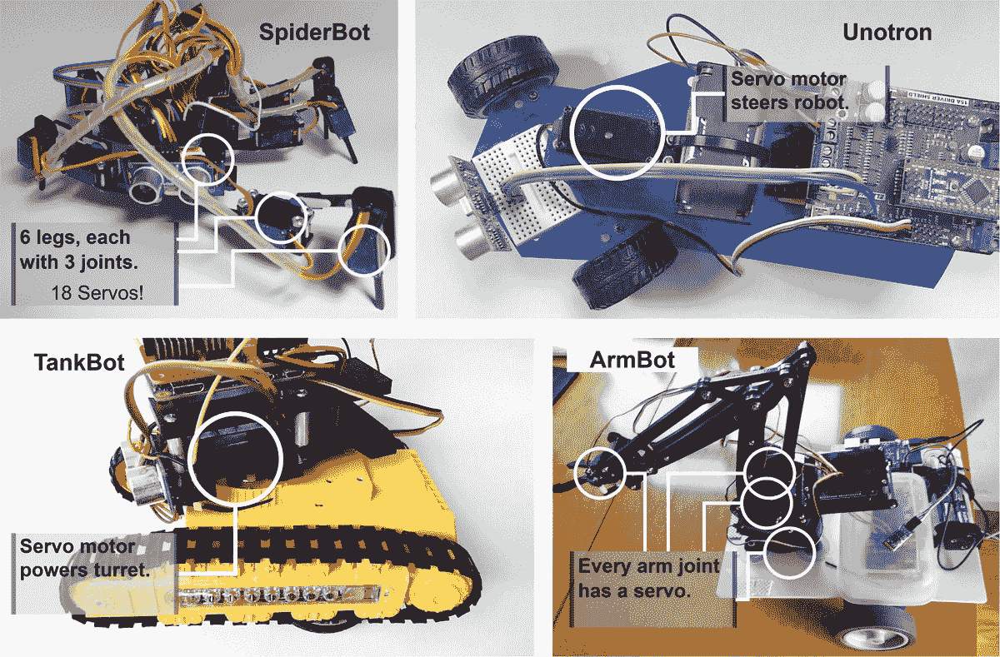

# 第十二章：使用 Python 控制伺服电机

伺服电机可以产生精确和可重复的运动。这种运动对于移动传感器、控制机器人腿或手臂并将它们移动到已知位置至关重要。其用途是工程师可以预测机器人行为，机器人可以在自动化中重复事物，或者代码可以将肢体移动到准确响应传感器指示的位置。Raspberry Pi 或附加板可以控制它们。在本章中，我们将使用这些电机构建一个俯仰-倾斜机构——一个用于定位传感器的头部。

在本章中，我们将涵盖以下主题：

+   什么是伺服电机？

+   使用 Raspberry Pi 定位伺服电机

+   添加俯仰和倾斜机构

+   创建俯仰和倾斜代码

# 技术要求

对于本章，你需要以下内容：

+   在前几章中构建了 Raspberry Pi 的机器人

+   螺丝刀——小型十字螺丝刀

+   小型钳子或一套微型扳手

+   尼龙螺栓和支架套件——2.5 毫米

+   一个两轴微型俯仰-倾斜微型伺服电机套件

+   两个微型 SG90/9g 或 MG90s 伺服电机，以及它们的硬件和伺服齿轮。俯仰-倾斜套件可能已经包括以下内容：

+   剪切钳或侧剪钳

+   安全眼镜

本章的代码可在[https://github.com/PacktPublishing/Learn-Robotics-Programming-Second-Edition/blob/master/chapter10/](https://github.com/PacktPublishing/Learn-Robotics-Programming-Second-Edition/blob/master/chapter10/)找到。

查看以下视频，了解代码的实际应用：[https://bit.ly/2LKh92g](https://bit.ly/2LKh92g)。

# 什么是伺服电机？

**伺服电机**，或称**伺服机构电机**，用于定位机器人附件，如手臂、夹爪、腿和传感器支架。它们在位置是主要因素的地方产生其他运动，与轮电机（直流电机）不同，轮电机以速度为控制因素。伺服电机用于需要（在一定精度范围内）转向特定位置的地方。你可以使用代码来控制这些精确的位置运动或一系列运动：


图 10.1 – 伺服电机的小型选择

伺服电机有多种尺寸，从小型约 20-30 毫米（如图 10.1 所示）到足够大以移动重型机械的尺寸。图 10.2 展示了我为我的机器人使用的某些微型爱好伺服电机：



图 10.2 – 机器人中伺服电机的小型选择

现在你已经看到了伺服电机的可能应用，我们可以进一步探讨伺服电机的工作原理。

## 查看伺服电机内部结构

在伺服电机的紧凑型结构中隐藏着控制器、直流电机、变速箱（通常带有停止装置）和传感器。这些电机具有内置的反馈系统。伺服电机从控制器接收输入，控制器指定电机要到达的位置。伺服控制器的内部传感器获取电机的当前方向。控制器将当前电机位置与请求的位置进行比较，生成一个误差——差异。基于这个差异，伺服驱动电机以尝试将这个误差减少到零。当电机移动时，传感器会改变，误差值也会改变，从而产生反馈，形成*图10.3*中显示的控制回路：


图10.3 – 伺服电机控制回路

一些类型的伺服电机，例如在ArmBot（*图10.2*）中使用的电机，有一个额外的输出，允许你在代码中读取位置传感器的状态。

## 向伺服电机发送输入位置

使用**脉冲宽度调制**（**PWM**）向伺服电机发送信号。PWM是我们在[*第2章*](B15660_02_Final_ASB_ePub.xhtml#_idTextAnchor033)中看到的相同系统，“探索机器人构建块 – 代码和电子”，并且在我们机器人上用于驱动轮电机。PWM是一个方波，只有两种状态，即*开启*或*关闭*。有趣的是，信号的定时，如*图10.4*所示。你可以将波形视为脉冲流，其中每个脉冲的时间长度编码了伺服控制器的位置信息。这些脉冲以周期或频率重复循环。人们通常将频率表示为每秒周期数或赫兹。较短的脉冲是较低值，较长的脉冲是较高值。控制器保持周期/频率不变，而改变的是占空比（开启时间与关断时间的比率）。对于伺服电机，脉冲长度是信息编码特征：


图10.4 – 伺服电机的PWM

在*图10.4*中，每个图表的`x`轴上都有时间。每个堆叠图表的`y`轴上，*`L`*代表逻辑低电平，*`H`*代表逻辑高电平。最上面的图表显示了短脉冲。底部的图表显示了脉冲时间的增加；然而，它们在重要方面有所不同。中间的图表中，关断时间没有改变，但周期已经改变。

在*图10.4*的底部图表中，周期与第一个图表相同，但脉冲时间更长，关断时间更短。伺服电机测量脉冲长度而不是频率，所以第三个图表的变化是正确的类型。

在我们的机器人中，电机控制器中已经有一个芯片，它执行固定周期的PWM样式。该芯片设计用于控制LED，但很高兴地控制其他PWM设备。我们可以控制在固定周期内关断时间和开启时间应该何时开始，这意味着它在较长的脉冲宽度下表现得像底部的图表。

脉宽控制自然引出下一节，我们将使我们的机器人生成PWM来定位伺服电机。让我们准备一个伺服电机，将其插入，并使其移动。

# 使用Raspberry Pi定位伺服电机

要定位伺服电机，我们需要设置一个**伺服电机臂**来观察其移动，然后将它插入电机控制器板。伺服电机臂是一个带有或多个臂的小颈套，通常用于将伺服电机轴连接到它们要移动的机构。*图10.5*展示了如何将臂连接到伺服电机：


图10.5 – 安装伺服电机臂

*图10.5*中的图像展示了如何安装伺服电机臂。执行以下步骤：

1.  伺服电机通常附带一些小型硬件袋，包含几种不同类型的臂和螺丝，用于将它们连接到伺服电机和它们要移动的部件。

1.  使用非常短的螺丝钉来做这件事，因为较长的螺丝钉可能会损坏伺服电机。

1.  将单臂伺服电机臂拧入伺服电机。电机臂的长颈套可以套在伺服电机的输出轴上。

1.  现在伺服电机应该看起来像这样。不要拧得太紧，因为你可能需要松开它并重新设置中间位置。

在下一张图片中，我们将伺服电机插入控制板进行测试：


图10.6 – 将伺服电机插入控制板

按照图10.6查看如何将伺服电机连接到机器人上的全功能电机HAT板。确保在连接之前完全关闭机器人的电源：

1.  这里轮廓箭头指示伺服连接器。伺服连接器有三个用实心箭头表示的引脚：棕色代表**地**（*`G`*）、红色代表**电压**（*`V`*）、黄色/橙色/白色代表**信号**（*`S`*）。

1.  此面板显示Motor HAT有一个标记为**PWM/Servo**的4 x 3连接器块，由箭头指示。四个伺服通道列分别编号为（*`0`*、*`1`*、**14**和**15**）。每个通道有三个引脚，标记为引脚标签（GVS）。**GVS**代表**地**、**电压**和**信号**。将伺服连接器的黄色线与S行对齐，将棕色线与G行对齐，红色线居中。将此伺服电机插入通道0。

连接方式类似于PiConZero等控制器，但可能需要在其他电机板上进行一些焊接工作。现在你已经将这个电机连接好了，我们需要编写一些代码来测试它。

## 编写控制伺服电机的代码

一些板库可以直接将度数转换为伺服电机移动脉冲。使用这个库，我们需要编写相应的代码。一些计算结果会产生一些常数，一旦我们知道我们使用的是哪个伺服控制器和伺服电机，这些常数就不会改变。我们可以将这些结果存储为常数并重复使用。

你可以将此类计算的结果存储在变量中，但让计算机来做有几个优点：

+   计算机在计算这些常数方面非常出色且快速。它可能会产生舍入误差，但可能比人从计算器复制时犯的错误要少。

+   很明显，这些数字是从哪里来的，以及如何计算它们。将来自计算器的“魔法数字”放入其中会使它更难看出其来源。

+   如果你更改调整因子，计算将保持最新。

+   如果你发现错误，在这里更改它很容易。

    小贴士

    在代码中设置计算时，使用描述性的变量名和注释——描述性有助于你理解代码并检查数学是否合理。你会在编写代码后多次阅读代码，因此这个原则适用于任何变量或函数名。

让我们编写一些测试代码，将伺服电机移动到用户输入的度数位置。将此代码放入 `servo_type_position.py` 文件中：

1.  我们用于机器人的 `Raspi_MotorHAT` 库有一个 `PWM` 模块，我们导入并创建一个对象来管理。我们再次使用 `atexit` 来确保控制器停止向电机发送信号：

    ```py
    from Raspi_MotorHAT.Raspi_PWM_Servo_Driver import PWM
    import atexit
    ```

1.  在设置PWM设备时，我们必须指定地址——它与我们用于电机的相同I2C设备，并且具有相同的地址：

    ```py
    pwm = PWM(0x6f)
    ```

1.  伺服电机以50 Hz的频率工作；然而，我们可以使用100 Hz，这样我们的电机也可以驱动。如果频率低，直流电机很容易卡住。这个频率将成为我们PWM频率的时间基准，我们将其保持在计算中使用：

    ```py
    # This sets the timebase for it all
    pwm_frequency = 100
    pwm.setPWMFreq(pwm_frequency)
    ```

1.  让我们将中间位置定义为0度。对于大多数伺服电机，旋转到-90度需要一个1毫秒的脉冲；移动到中心位置需要1.5毫秒：

    ```py
    m or p means far less than servo_mid_point_ms.
    ```

1.  旋转到90度需要一个2毫秒的脉冲；这是从中间点0.5毫秒，这为我们提供了90度的主校准点：

    ```py
    # What a deflection of 90 degrees is in pulse length in milliseconds
    deflect_90_in_ms = 0.5
    ```

1.  我们芯片上脉冲的长度也取决于频率。这个芯片将脉冲的大小指定为每周期的步数，使用4,096步（12位）来表示这一点。更高的频率需要脉冲中更多的步数来保持脉冲长度在毫秒内。我们可以为这个比率制作一个；每毫秒步数：

    ```py
    # Frequency is 1 divided by period, but working ms, we can use 1000
    period_in_ms = 1000 / pwm_frequency
    # The chip has 4096 steps in each period.
    pulse_steps = 4096
    # Steps for every millisecond.
    steps_per_ms = pulse_steps / period_in_ms 
    ```

1.  现在我们有了每毫秒的步数，并且知道90度脉冲应该有多少毫秒，我们可以得到每度步数的比率。我们也可以使用这个比率来重新定义我们的中间点为步数：

    ```py
    # Steps for a degree.
    steps_per_degree = (deflect_90_in_ms * steps_per_ms) / 90
    # Mid-point of the servo in steps
    servo_mid_point_steps = servo_mid_point_ms * steps_per_ms
    ```

1.  我们可以在 `convert_degrees_to_pwm` 函数中使用这些常数来获取任何角度所需的步数：

    ```py
    def convert_degrees_to_steps(position):
        return int(servo_mid_point_steps + (position * steps_per_degree))
    ```

1.  在移动任何东西之前，我们应该确保系统停止。我们通过将PWM设置为 `4096` 来停止。这个数字可能听起来很奇怪，但它不是提供一个长脉冲，而是在控制板上打开一个额外的位，这将完全关闭伺服引脚。关闭引脚会释放/放松伺服电机。否则，电机将试图寻找/保持我们给出的最后一个位置，直到断电。我们可以使用 `atexit` 来做这件事，就像我们停止电机时做的那样：

    ```py
    atexit.register(pwm.setPWM, 0, 0, 4096)
    ```

1.  我们现在可以在循环中请求用户输入。Python中的 `input` 函数会要求用户输入一些内容，并将其存储在一个变量中。我们将它转换为整数以使用：

    ```py
    while True:
        position = int(input("Type your position in degrees (90 to -90, 0 is middle): "))
    ```

1.  然后，我们可以使用之前的计算将位置转换为结束步数：

    ```py
        end_step = convert_degrees_to_steps(position)
    ```

1.  我们可以使用 `pwm.setPWM` 来以步进的方式设置脉冲。它需要伺服通道号、一个起始步数，我们将它保持在0，以及一个结束步数，这是我们之前计算过的：

    ```py
        pwm.setPWM(0, 0, end_step)
    ```

你现在可以打开机器人并给它发送这段代码。当你运行这段代码时，它会要求你输入一个数字。从数字0开始。当你按下 *Enter* 键时，你会听到伺服电机移动。

你现在可以尝试其他值，但不要给出-90到90度之外的值，因为这可能会损坏伺服电机。我们稍后会添加代码来防止这种损坏。如果这个系统工作正常，你应该看到伺服电机在各个不同值之间移动。

## 故障排除

如果你发现运行时出现问题，请尝试以下方法：

+   确保伺服电机已正确插入端口，并且方向正确。*`S`*引脚应插入大多数伺服电机上的黄色电缆。

+   如果出现很多抖动或无法到达正确位置的情况，可能意味着你的电池电量不足——请确保它们是充满电的。

+   当运行来自其他章节的直流电机行为时，如果伺服电机下垂，这也可能是由于电池电量较低。确保你使用金属氢化物充电电池。

在我们继续之前，这个电机HAT是如何控制伺服电机和直流电机的？让我们更仔细地看看它。

## 控制直流电机和伺服电机

我为这本书（以及读者可以选择其他）建议的HAT基于PCA9685芯片，它被广泛用于制造像这样的机器人。它是一个多通道PWM控制器。查看图解以了解它在机器人中的连接概述：


图10.7 – 电机板框图

*图10.7* 展示了全功能电机HAT的框图。这不是布线图，它仍然是一个功能框图，但它显示了板上的组件和连接。最左边是Raspberry Pi，有一条线连接到PCA9685芯片。这条线是进入帽子的I2C通信，由标记的灰色盒子表示。

PWM发生器有许多输出连接。其中八个输出连接到控制TB6612电机驱动器。这些驱动器有适合直流电机（或步进电机）的电源输出。它们仍然在灰色盒子中，因为它们是帽子的一部分。我们将这些电源输出连接到我们的右电机（m1）、左电机（m2），并为其他电机留有m3/m4连接空间。

伺服通道直接暴露了这四个PWM输出。我们将将摇杆伺服电机连接到一个输出，倾斜连接到另一个。

在前面的代码中，我提到以100 Hz而不是50 Hz驱动PWM芯片。这是因为如果我们结合伺服电机和直流电机，芯片的时间基准适用于所有PWM输出，即使占空比（开启时间与关闭时间的比率）发生变化。

现在你已经测试了基础知识，我们可以校准伺服电机，找到0位置并确保90度移动的量是正确的。

## 校准你的伺服电机

伺服电机臂允许你看到伺服电机的运动。0应该接近中间：

1.  首先，使用带有臂的螺丝刀将0与中间对齐。松开它，抬起它，将其移动到中间，然后再次按下。不要拧得太紧，因为我们很快就会再次移除它。

    重要提示

    如果伺服电机的运动受阻，包括尝试将其移动到其极限之外，它将拉高电流以尝试达到位置。这样卡住伺服电机可能会导致大量热量和损坏的电机。

1.  现在尝试输入90和-90。你可能发现两边没有达到90度，因为伺服电机可能会有轻微的差异。增加`deflect_90_in_ms`的值来调整电机范围。以小的0.1增量这样做，因为在这里走得太远可能会导致伺服电机损坏。

1.  当你校准了你的伺服电机后，在开始下一步之前让每个伺服电机移动到位置0是一个好主意。你可以通过将第二个伺服电机插入伺服电机的连接器上的通道1，然后交换每个调用`pwm.setPWM`方法的第一个参数从0到1来实现这一点。

你现在已经测试了一些基本的伺服代码，然后尝试了两个伺服电机和两个通道。现在我们可以使用伺服电机构建一个俯仰和倾斜机制来指向传感器。

# 添加俯仰和倾斜机制

现在我们将构建并添加一个俯仰和倾斜伺服电机机制到我们的机器人中。这个机制就像我们机器人的头部，可以将其上的传感器安装在上面。*俯仰和倾斜机制*，如图*图10.8*所示，在伺服电机的控制下通过两个轴移动传感器（或任何其他东西）。

*Pan*表示向左或向右转动。*Tilt*表示向上或向下倾斜：


图10.8 – 典型套件中的俯仰和倾斜机制

类似于*图10.8*的套件可以从Mouser购买，以及Adafruit的商店。你可能需要单独购买伺服电机。还有其他类型的俯仰-倾斜。确保它是使用两个伺服电机的类型，并在制造商的文档中查找不同之处。我们组装套件，将其安装到我们的机器人上，并将其插入控制器。

我们带有伺服电机的机器人框图看起来像*图10.9*：


图10.9 – 添加伺服电机后的机器人框图

*图10.9*中的框图通过添加俯仰和倾斜伺服电机扩展了前一章的框图。这些电机连接到电机HAT。

现在你已经看到了它在机器人框图中的位置，是时候构建它了！

## 组装套件

您需要您的云台套件、一把螺丝刀和一把剪刀。*图10.10*展示了机构的部件布局：


图10.10 – 云台-倾斜机构的部件

注意我在*图10.10*中使用的不同塑料部件的术语；我使用这些术语进行组装。这些螺丝旁边就是套件中附带的那几个。通常在伺服电机的硬件袋里会有自攻M2螺丝——请确保您有这些。

重要提示

这里的塑料可能会弹飞，所以请在没有安全眼镜的情况下不要这样做。注意房间里的其他人以及飞溅的小而尖锐的塑料碎片。请为此步骤戴上安全眼镜！

一旦您准备好了部件，我们将从组装底座开始：


图10.11 – 准备云台底座

让我们按照*图10.11*所示，在以下步骤的帮助下组装底座：

1.  测量并切割一个十字形的伺服电机叶片以适应底座。它必须适应底座中的凸脊。将伺服电机叶片的长臂缩短到略超过三个孔，并用剪刀使它们稍微薄一些。

1.  将伺服电机叶片对齐到底座上，使臂位于凹槽区域，伺服电机叶片领圈朝向底座。

1.  找到四个长M2自攻螺丝。

1.  将伺服电机叶片安装到底座上。请注意，对于一些伺服电机叶片，只有水平或垂直的螺丝可能对齐；两个就足够了，但四个更安全。

我们的基础现在准备好了。接下来，我们将组装左臂：


图10.12 – 组装左臂和倾斜板

要组装左臂，请执行以下步骤：

1.  将螺柱与倾斜板的孔对齐，如*图10.12*所示。

1.  将螺柱推入这个孔中；您需要在下一步中保持这个位置。

1.  取一个伺服电机和两个带领圈的螺丝。伺服电机 resting on the two brackets on the tilt plate，并且拧紧后，可以固定左臂。确保在拧紧之前，伺服电机的主轴与螺柱和孔对齐。

太好了！现在让我们继续组装右臂：


图10.13 – 组装右臂

按照以下步骤组装臂：

1.  要组装右臂，您需要另一个伺服电机叶片——这次是只有领圈和单一直臂的那种。如*图10.13*所示，伺服电机叶片需要修剪以适应右臂上的预定凹槽。使用一个M2自攻螺丝将这个叶片固定到机构的右臂上。您所安装的伺服电机叶片位于机构的前部。

1.  将这个组件翻转过来，并将另一个伺服电机（这是云台伺服电机）按照指示插入槽中。

1.  它应该使主轴朝向照片的底部，如第三面板所示。这个伺服电机朝下。

我们接下来的步骤是将我们刚刚创建的左右臂组合起来。请按照以下步骤进行：


图10.14 – 组合左臂和右臂

您需要遵循以下步骤来组合手臂：

1.  *图10.14*显示了如何将机构的左右臂组合在一起。在组合手臂时，右臂伺服电机螺母的套筒应该夹在您拧到倾斜板上的倾斜伺服电机上。

1.  左臂组装中的云台伺服电机适合到一个匹配的凹槽中。

1.  使用一个短螺丝将右臂的套筒固定到倾斜伺服电机上，保持倾斜板直立。

1.  使用两颗小细螺丝将两个手臂拧在一起。

我们几乎完成了。最后一部分是将我们最初创建的底座与机构的其余部分组合起来：


图10.15 – 将底座与机构组合

按照以下程序继续操作：

1.  *图10.15*显示了如何将机构连接到底座上。将固定在底座上的伺服电机螺母从伺服电机螺杆推到云台伺服电机的轴上。调整使其对齐，使底座的长轴与机构的底部对齐。

1.  使用非常短的螺丝将套筒固定到伺服电机上。

1.  最后一个面板显示了完全组装好的云台和倾斜机构。

您已经看到了云台和倾斜机构是如何围绕伺服电机组装的。组装这样的结构对于了解这些机构的工作原理以及了解伺服电机移动时的感觉非常有价值。现在云台和倾斜机构已经组装好，我们可以在移动头部之前将其连接到机器人上。

## 将云台和倾斜机构连接到机器人上

机构需要成为机器人的一部分。我们需要将其物理连接并接线，以便电机控制器可以发送信号给它。

*图10.16*显示了如何将云台和倾斜机构连接到机器人：


图10.16 – 将云台和倾斜机构连接到机器人

按照以下说明以及*图10.16*中显示的步骤操作：

1.  为了做到这一点，您需要两个长螺栓和两个螺母来将云台和倾斜机构连接到机器人上。

1.  将螺栓插入云台和倾斜底座的短端，使其指向下方。

1.  我推荐的底盘前方有一个槽，这对于线传感器来说非常方便。这个槽非常适合安装这个云台和倾斜机构，通过槽中的螺丝固定。在另一个底盘上，您可能需要测量并钻孔来安装这个。

1.  在机器人下方拧紧螺母。

1.  将伺服电机接线。倾斜（上下伺服电机）应插入伺服通道0，而云台（左右）应插入伺服通道1。

恭喜！您的机器人准备好了，硬件设置已完成。现在您可以编写代码并尝试为您的机器人测试新的头部。那么，让我们直接开始吧。

# 创建云台和倾斜代码

我们分层构建我们的俯仰和滚转代码。我们创建一个 `Servos` 类并将之前的计算放入其中。我们设置我们的机器人类以拥有 `Servos` 类的实例，以及访问用于俯仰和滚转的伺服器的方法。

## 创建伺服器对象

在这个类中，我们封装（内部管理）将角度转换为伺服器动作以及我们的伺服板的一些怪癖，如通道号。我们为了这个目的在 `servos.py` 文件中创建了一个 `Servos` 类：

1.  `servos.py` 文件以一个导入开始，然后直接进入构造函数（`__init__` 函数）：

    ```py
    deflect_90_in_ms so that it can be overridden with the value obtained while calibrating your servos.
    ```

1.  接下来，我们将添加一个注释，这样当我们使用 `Servos` 类时，我们可以看到我们的意图。这里的文本将作为某些代码编辑器中我们类的帮助信息显示：

    ```py
         """addr: The i2c address of the PWM chip.
    deflect_90_in_ms: set this to calibrate the servo motors. 
         it is what a deflection of 90 degrees is
         in terms of a pulse length in milliseconds."""
    ```

    构造函数顶部的三引号字符串是一种在 Python 中称为 **docstring** 的约定。任何在函数、方法、类或文件顶部声明的字符串都成为一种特殊的注释，许多编辑器使用它来显示库的更多帮助。这在任何类型的库层中都很有用。使用 docstring 的约定将补充我们从测试代码中携带的所有解释性注释。

1.  `__init__` 方法的下一部分应该看起来很熟悉。它设置了在 *编写控制伺服器的代码* 部分的 *步骤 3* 到 `7` 中创建的所有计算，在 `servos` 对象内部。我们将一些变量存储在 `self._pwm` 中以供以后使用，其余的是中间计算：

    ```py
            self._pwm = PWM(addr)
            # This sets the timebase for it all
            pwm_frequency = 100
            self._pwm.setPWMFreq(pwm_frequency)
            # Mid-point of the servo pulse length in milliseconds.
            servo_mid_point_ms = 1.5
            # Frequency is 1/period, but working ms, we can use 1000
            period_in_ms = 1000 / pwm_frequency
            # The chip has 4096 steps in each period.
            pulse_steps = 4096
            # Steps for every millisecond.
            steps_per_ms = pulse_steps / period_in_ms
            # Steps for a degree
            self.steps_per_degree = (deflect_90_in_ms * steps_per_ms) / 90
            # mid-point of the servo in steps
            self.servo_mid_point_steps = servo_mid_point_ms * steps_per_ms
    ```

1.  在 `__init__` 方法的最后部分，我们创建 `self._channels`；这个变量使我们能够使用通道号 0、1、2 和 3，并将它们映射到板上的怪异数字：

    ```py
            # Map for channels
            self._channels = [0, 1, 14, 15]
    ```

1.  接下来，我们想要一个安全功能来关闭所有伺服电机。发送没有任何脉冲即可做到这一点，并释放伺服器，保护电源并防止电机损坏。此功能使用了在 *编写控制伺服器的代码食谱* 的 *步骤 9* 中看到的技巧，设置开始时间为 `0` 和 `4096` 以生成无脉冲的关闭标志：

    ```py
        def stop_all(self):
            # 0 in start is nothing, 4096 sets the OFF bit.
            off_bit = 4096
            self._pwm.setPWM(self.channels[0], 0, off_bit)
            self._pwm.setPWM(self.channels[1], 0, off_bit)
            self._pwm.setPWM(self.channels[2], 0, off_bit)
            self._pwm.setPWM(self.channels[3], 0, off_bit)
    ```

1.  接下来是转换函数，我们在 *步骤 8* 的 *编写控制伺服器的代码* 部分中看到了它，但将其本地化到类中。我们只会在内部使用这个转换。Python 的惯例是在它前面加上下划线：

    ```py
        def _convert_degrees_to_steps(self, position):
            return int(self.servo_mid_point_steps + (position * self.steps_per_degree))
    ```

1.  此外，我们还需要一个方法来将伺服器移动到某个角度。它将接受一个通道号和一个角度。我在这个方法中使用了另一个 docstring 来解释它做什么以及限制是什么：

    ```py
        def set_servo_angle(self, channel, angle):
            """position: The position in degrees from the center. -90 to 90"""        
    ```

1.  下几行验证输入。它限制角度以保护伺服器免受超出范围的值的损害，如果超出范围，将引发 Python 异常。异常会将此类问题推送到调用系统，直到其中一个处理它，如果没有人处理，则终止代码：

    ```py
            # Validate
            if angle > 90 or angle < -90:
                raise ValueError("Angle outside of range")
    ```

1.  此方法最后两行设置位置：

    ```py
          # Then set the position
          off_step = self._convert_degrees_to_steps(angle)
          self._pwm.setPWM(self.channels[channel], 0, off_step)
    ```

您可以在[https://github.com/PacktPublishing/Learn-Robotics-Programming-Second-Edition/blob/master/chapter10/servos.py](https://github.com/PacktPublishing/Learn-Robotics-Programming-Second-Edition/blob/master/chapter10/servos.py)找到完整的代码。

这个类现在可以集成到我们的机器人中。让我们在下一节中这样做。

## 将伺服电机添加到机器人类中

在我们开始在行为中使用前面的`Servos`类之前，我们将将其集成到我们的`robot.py`文件中，并为特定的伺服电机分配特定的用途。这样，一个行为可以通过交换机器人类来使用配置不同的云台和倾斜机制的机器人：

1.  接下来，我们需要将其修补到`robot.py`中的`Robot`类中。首先，让我们在`leds`导入之后导入它：

    ```py
    import leds_led_shim
    from servos import Servos
    ...
    ```

1.  然后，在`Robot`的构造函数中设置`servos`对象，传递地址：

    ```py
    class Robot:
        def __init__(self, motorhat_addr=0x6f):
           # Setup the motorhat with the passed in address
           self._mh = Raspi_MotorHAT(addr=motorhat_addr)
           # get local variable for each motor
           self.left_motor = self._mh.getMotor(1)
           self.right_motor = self._mh.getMotor(2)
           # Setup the Leds
           self.leds = leds_led_shim.Leds()
           # Set up servo motors for pan and tilt.
           self.servos = Servos(addr=motorhat_addr)
           # ensure the motors get stopped when the code exits
           atexit.register(self.stop_all)
    ...
    ```

1.  现在，我们应该确保当机器人停止时它也停止，通过将其添加到`stop_all`代码中：

    ```py
        def stop_all(self):
            self.stop_motors()
            # Clear the display
            self.leds.clear()
            self.leds.show()
            # Reset the servos
            self.servos.stop_all()
    ...
    ```

1.  在`robot`中最后要做的就是在映射设置云台和倾斜值到实际的伺服电机：

    ```py
        def set_pan(self, angle):
            self.servos.set_servo_angle(1, angle)

        def set_tilt(self, angle):
            self.servos.set_servo_angle(0, angle)
    ```

我们的`Robot`对象现在有方法可以与机器人底盘上的云台和倾斜伺服电机交互。这为我们提供了对机器人上伺服电机的特定控制，并在行为中提供了一个使用层。在下一节中，我们将创建一个使用这些方法来制作圆圈的行为。

## 使云台和倾斜头旋转圆圈

在本节中，我们使云台和倾斜头以大约30度的微小圆圈移动。这种行为展示了机制和与之通信的代码部分。代码创建了一种重复的动画行为，它使用一个时间基准——当前时间。我们使用时间基准来绘制圆圈：

1.  创建一个新文件；我建议命名为`circle_pan_tilt_behavior.py`。

1.  我们从一系列导入开始；`Robot`对象、`math`库和一些计时：

    ```py
    math library as we are going to use sine and cosine to calculate that circle.
    ```

1.  由于我们的行为具有局部数据，我们将将其放入一个自己的类中。构造函数（`the__init__`方法）接受`Robot`对象：

    ```py
    class CirclePanTiltBehavior:
        def __init__(self, the_robot):
            self.robot = the_robot
    ```

1.  这个行为本质上是一种动画，因此它有一个时间和每个圆的*帧数*或位置。我们使用`frames_per_circle`变量来调整它经过的步数：

    ```py
            self.current_time = 0
            self.frames_per_circle = 50
    ```

1.  数学函数以弧度为单位工作。一个完整的圆周弧度是*2倍的π*。我们将这个值除以`frames_per_circle`，得到一个乘数，我们称之为`radians_per_frame`。我们可以用当前帧乘以这个值，以得到圆周的角度：

    ```py
    radians_per_frame.
    ```

1.  由于这是一个圆，它也应该有一个半径，表示我们的伺服电机从中间偏移的距离：

    ```py
            self.radius = 30
    ```

1.  行为中的下一个方法是`run`。这使行为进入一个`while True`循环，因此它将一直运行，直到用户停止它：

    ```py
        def run(self):
            while True:
    ```

1.  当我们的行为运行时，我们使用`frames_per_circle`对`current_time`进行取模（余数）操作，将其转换为帧数。取模操作将数字限制在零和帧数之间：

    ```py
                frame_number = self.current_time % self.frames_per_circle
    ```

1.  然后，我们将这个`frame_number`变量转换回弧度，即圆的位置，通过将其与`radians_per_frame`相乘。这个乘法给我们一个我们称之为`frame_in_radians`的值：

    ```py
                frame_in_radians = frame_number * self.radians_per_frame
    ```

1.  绘制圆的公式是将一个轴设置为角度的余弦值，乘以半径，另一个轴设置为角度的正弦值，乘以半径。因此，我们计算这个值，并将每个轴输入到伺服电机中：

    ```py
                self.robot.set_pan(self.radius * math.cos(frame_in_radians))
                self.robot.set_tilt(self.radius * math.sin(frame_in_radians))
    ```

1.  我们执行一个小的`sleep()`，给电机时间到达其位置，然后向当前时间添加一个值：

    ```py
                sleep(0.05)
                self.current_time += 1
    ```

1.  那个整个`run`方法（步骤7-11）如下：

    ```py
        def run(self):
            while True:
                frame_number = self.current_time % self.frames_per_circle
                frame_in_radians = frame_number * self.radians_per_frame
                self.robot.set_pan(self.radius * math.cos(frame_in_radians))
                self.robot.set_tilt(self.radius * math.sin(frame_in_radians))
                sleep(0.05)
                self.current_time += 1
    ```

1.  最后，我们只想启动并运行我们的行为：

    ```py
    bot = Robot()
    behavior = CirclePanTiltBehavior(bot)
    behavior.run()
    ```

因此，我们构建了一个`Servos`类，并将其集成到我们的`Robot`代码中，以控制俯仰和倾斜机构。您已经看到了以动画方式移动伺服电机的代码。我们可以在下一节中将这些与物理俯仰-倾斜结合起来，以查看其运行情况。

## 运行它

您需要通过SFTP将`servos.py`、`robot.py`和`circle_pan_tilt_behavior.py`发送到Raspberry Pi。在Raspberry Pi上，键入`python3 circle_pan_tilt_behaviour.py`以查看它。现在头部应该正在画圈。

这段代码是设备的演示代码，但将来可以通过在它上面安装摄像头来使用相同的设备追踪人脸。在这里使用帧来创建动画对于使机器人进行平滑的预定动作非常重要，控制随时间的小范围动作。

## 故障排除

如果这仍然无法运行，请尝试以下操作：

+   确保您已经按照*编写控制伺服电机的代码*部分所示测试了伺服电机。对于这个测试，没有必要拆卸俯仰-倾斜机构，但请确保您已经使用那里的代码使伺服电机移动，并遵循了那个故障排除部分。

+   如果在运行时看到错误，请确保您正在使用`python3`运行。请确保您已经检查了代码中的拼写错误。

+   如果代码无法导入任何内容，请确保您已经复制了所有前面的文件，并且您已经在前面的章节中安装/设置了库。

+   如果电机移动到极端位置，您可能错过了校准它们的步骤。您需要卸下每个伺服电机，将其从伺服齿轮上弹出，使用*编写控制伺服电机的代码*部分中的测试代码将其发送到位置0，然后在中立位置将其推回，并重新拧紧。

+   如果伺服电机完全拒绝移动，请检查它是否已经正确连接，确保G对应黑色伺服电线，V对应红色电线，S对应伺服电机的黄色信号线。机器人代码假设伺服电机连接到电机控制板的通道0和1。

+   确保电线或其绝缘没有断裂。我见过一批这种类型的伺服电机存在电线问题，不得不退货。您不应该看到任何裸露的电线部分。

+   确保连接器被牢固地推入。如果在这里松动，那么信号可能无法到达伺服电机。

+   再次强调：低电量会使伺服电机抖动或无法达到设定点。

现在，您应该已经排除了运行这个圆形伺服电机行为时常见的常见问题，并看到头部正在做小而慢的圆圈。我们将在后面的章节中使用这个系统来观察面部。

# 构建扫描声纳

使用我们在[*第8章*](B15660_08_Final_ASB_ePub.xhtml#_idTextAnchor150)中附加的距离传感器，*使用Python编程距离传感器*，与云台/倾斜机构一起，我们可以设置一个有趣的实验。如果我们将距离传感器连接到头部，然后缓慢地向一个方向（例如，倾斜方向）移动，我们就可以创建一个区域传感器的扫描。然后我们可以使用一些Python代码来绘制这个，制作一个机器人前方物体的小型地图。

与这种组合类似的传感器可以在高级机器人（如Boston Dynamics的产品）和自动驾驶汽车中找到。激光雷达和雷达传感器使用快速旋转的鼓和激光光或无线电频率来执行比我们的示例快得多的扫描。激光雷达传感器开始出现在业余市场上，但仍然有点昂贵。

为了可视化这一点，我们将使用一种特殊的图表 – 极坐标图。这种图表围绕一个圆圈绘制，其中`x`轴是我们围绕圆圈的位置（以弧度表示 – π的倍数）。`y`轴表示绘制点距离圆心的距离 – 因此，较大的值将更远离中心。这对于这个例子非常合适，因为我们正在通过角度扫描伺服电机并接收距离数据。我们必须考虑到伺服电机以度为单位工作，并将它们转换为弧度以供图表输出。

## 连接传感器

在这个步骤中，我们将延长传感器的电线并将传感器重新定位到云台/倾斜头上。首先关闭机器人的电源：


图10.17 – 弹出传感器并准备两根电线

按照以下步骤重新定位传感器，并参考图10.17：

1.  您需要将一个距离传感器从机器人前部的支架中弹出。我使用了左侧的。

1.  在那里的云台/倾斜头上，识别出小槽。

1.  制作两根单芯电线或三明治夹具。每根大约18厘米的长度应该足够了：

    

    图10.18 – 步骤4到6；将电线放入槽中

1.  对于每一侧，首先将电线穿过图10.18中所示的指示槽。

1.  稍微弯曲它，将两端几乎推到一起，这样它就不会直接掉出来。

1.  以相同的方式准备另一侧，这样两侧就都准备好了：

    

    图10.19 – 将电线缠绕在传感器下方

1.  将传感器放置到位，并将从头部顶部来的左电线弯曲到传感器的正面。

1.  现在按照*图10.19*中白色箭头所指的大圆形元件（超声波传感器）下弯。

1.  将下面伸出的线绕过传感器弯曲：

    

    图10.20 – 拧线并重复右侧

1.  将这根线绕在左侧传感器的顶部，并将两个线端合并在一起。

1.  将顶部和底部的端头拧在一起，如图*图10.20*所示。

1.  对右侧的线重复*步骤8*到*11*：

    

    图10.21 – 传感器临时固定在俯仰头

1.  现在传感器应该临时固定在俯仰头上，如图*图10.21*所示。你现在可以将其重新连线了：

    

    图10.22 – 延长线并插入线

    你可能需要延长跳线，如图*图10.22*所示。你很可能还有更多的公母跳线，所以使用四根这样的线来延长传感器。如果可能的话，使用相同的颜色来帮助确保你做出了相同的连接。

1.  现在将线连接到传感器上。请参考[*第8章*](B15660_08_Final_ASB_ePub.xhtml#_idTextAnchor150)，*使用Python编程距离传感器*，以获取参考。

我建议运行[*第8章*](B15660_08_Final_ASB_ePub.xhtml#_idTextAnchor150)，*使用Python编程距离传感器*中的`test_distance_sensor.py`代码，并在继续之前检查传感器是否工作。

现在你已经将传感器安装在了头上，当我们指令伺服电机移动时，它也会移动。让我们确保我们首先在Raspberry Pi上安装了编写代码所需的正确工具。

## 安装库

代码将使用Python工具`matplotlib`来输出数据。它制作一个**极坐标图**，从一点径向出发的图形，看起来可能像你在电影中看到的声纳扫描。为此，你需要在你的Raspberry Pi上安装Matplotlib（及其依赖项）。

通过SSH（putty）连接到Raspberry Pi，并输入以下命令以获取Matplotlib所需的包：

```py
$ sudo apt update
$ sudo apt install libatlas3-base libgfortran5
```

下一步你需要的是Matplotlib本身：

```py
$ pip3 install matplotlib
```

Matplotlib可能需要一些时间来安装，并且在安装过程中可能会安装许多辅助包。

安装完库后，你就可以开始编写代码了。

## 行为代码

为了制作图表并获取数据，代码将把传感器移动到一侧的完全范围，然后逐步移动回来（例如，每次5度），并在每次移动时进行测量。这个例子将展示如何使用传感器和伺服电机一起，并介绍其他查看传感器数据的方法。

创建一个名为`sonar_scan.py`的文件，并按照以下步骤添加其内容：

1.  我们将从一些导入开始；`time`导入，我们可以用它给电机和传感器一些工作时间，`math`将角度转换为弧度，`matplotlib`用于显示，以及`robot`用于与机器人接口：

    ```py
    import time
    import math
    import matplotlib.pyplot as plt
    from robot import Robot
    ```

1.  然后，我们有设置参数。我们将这些参数放在这里，以鼓励你尝试不同的转向速度和范围：

    ```py
    start_scan =0
    lower_bound = -90
    upper_bound = 90
    scan_step = 5
    ```

1.  接下来，让我们初始化`Robot`对象并确保倾斜方向水平：

    ```py
    the_robot = Robot()
    the_robot.set_tilt(0)
    ```

1.  我们需要准备一个存储扫描数据的地方。我们将使用一个从度数到感知值的字典映射：

    ```py
    scan_data = {}
    ```

1.  扫描循环从下限开始，以扫描步长递增，直到上限；这给出了我们的朝向范围：

    ```py
    for facing in range(lower_bound, upper_bound, scan_step):
    ```

1.  在循环中的每个朝向，我们需要指向传感器，并等待伺服电机移动以及传感器获取读数。我们在这里取反朝向，因为伺服电机旋转的方向与极坐标图相反：

    ```py
        the_robot.set_pan(-facing)
        time.sleep(0.1)
    ```

1.  然后，我们将传感器距离以厘米为单位存储在扫描数据的每个朝向中，使用朝向作为其键：

    ```py
        scan_data[facing] = the_robot.left_distance_sensor.distance * 100
    ```

1.  以下循环将朝向转换为弧度。伺服电机以度为单位工作，但Matplotlib的一个特性是极轴必须以弧度表示：

    ```py
    axis = [math.radians(facing) for facing in scan_data.keys()]
    ```

1.  现在我们制作极坐标图，告诉Matplotlib轴和数据，我们想要一条带有`g-`的绿色线：

    ```py
    plt.polar(axis, list(scan_data.values()), 'g-')
    ```

1.  最后一行将此图写入`png`图像文件，因此我们可以使用`scp`从树莓派下载并查看图表：

    ```py
    plt.savefig("scan.png")
    ```

将此代码放在树莓派上，将机器人放在距离不到一米的障碍物附近的地方，并使用`python3 sonar_scan.py`运行代码。你应该看到伺服电机在边界范围内进行扫描。

当运行时，`scan.png`输出应类似于*图10.23*：


图10.23 – 我实验室的声纳扫描图

*图10.23*显示了极坐标图上的声纳扫描输出。它以度为单位显示测量值，一条绿色线追踪传感器前方检测到的物品的轮廓。在这张图片中，我的下限是-90，上限是90，步长为2度，以获得略微更精细的分辨率。

选择更精细的分辨率（小于2度）将使其变慢。sleep值可以调整，但较低的值可能导致伺服电机未稳定或传感器未产生进一步的读数。

### 故障排除

如果在运行此工具时遇到问题，请尝试以下操作：

+   首先，通过遵循[*第8章*](B15660_08_Final_ASB_ePub.xhtml#_idTextAnchor150)中的故障排除和测试步骤来确保距离传感器工作，*使用Python编程距离传感器*。验证接线并使用测试代码。

+   验证伺服电机是否正常工作，如前文*创建俯仰和倾斜代码*部分所示。遵循那里的故障排除程序。

+   如果在运行代码时出现错误，请确保已安装所有必需的库。

+   检查你输入的代码中是否有错别字。

+   记住，文件输出将在树莓派上，所以你需要将其复制回来查看。

+   在将值放入`plt.polar`方法之前打印值可能会有所帮助。添加以下内容：

    ```py
    print(axis)
    print(scan_data.values())
    ```

现在你应该能够制作声纳扫描并获得上图所示的图表。我建议你尝试不同的值来创建不同的图表分辨率，并将不同的物体组合放在传感器前。

让我们总结一下本章中我们看到的内容。

# 摘要

在本章中，你学习了伺服电机、如何使用电机控制器控制它们以及它们的工作原理。你用它们构建了一个旋转和倾斜机制，并向`Robot`对象添加了代码以与之协同工作。最后，你通过环绕行为展示了所有部件。

你将能够使用你看到的代码来控制其他伺服电机系统，例如机械臂。动画风格技术对于平滑运动和圆形运动非常有用。我在控制SpiderBot腿部的18个电机时使用了类似这样的系统。

你已经看到了如何使用带有传感器头部伺服机构来制作某种世界地图，并将其与更大、更昂贵的机器人上使用的激光雷达系统相关联。

在下一章中，我们将探讨另一种使用编码器来绘制和观察世界的方法。这些传感器将检测我们的机器人上的轮子转动，以确定我们的机器人是如何移动的。

# 练习

1.  考虑你如何构建其他基于伺服的扩展。机器人臂至少需要四个伺服电机，但一个简单的夹爪/抓取器可以使用我们机器人剩余的两个通道。

1.  环顾四周，看看夹爪套件、带有钳子的设计，以及可能的上/下控制。

1.  你将如何编写这个夹爪的代码？你将向`Robot`对象添加什么？

1.  你将为这个夹爪制作什么样的演示行为？

1.  如果只是给夹爪一个不同的位置，它可能会移动得太猛烈。你将如何使其移动得更慢、更平稳？

# 进一步阅读

请参阅以下链接获取更多信息：

+   这个伺服电机控制帽基于PCA9685设备。PCA9685产品数据表([https://cdn-shop.adafruit.com/datasheets/PCA9685.pdf](https://cdn-shop.adafruit.com/datasheets/PCA9685.pdf))包含了关于操作此芯片的完整信息。我强烈建议参考此文档。

+   我还建议查看SG90伺服电机数据表([http://www.ee.ic.ac.uk/pcheung/teaching/DE1_EE/stores/sg90_datasheet.pdf](http://www.ee.ic.ac.uk/pcheung/teaching/DE1_EE/stores/sg90_datasheet.pdf))以获取有关它们操作的信息。

+   AdaFruit关于旋转和倾斜机制的指南([https://learn.adafruit.com/mini-pan-tilt-kit-assembly](https://learn.adafruit.com/mini-pan-tilt-kit-assembly))包含一套组装说明。它们的顺序与我的略有不同，但如果这很棘手，可能会提供不同的视角。
