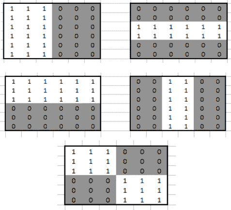

# 第十六章：机器人视觉 – 使用Pi摄像头和OpenCV

给机器人赋予看到事物的能力，使其能够以人类能够理解的方式行事。计算机视觉仍在积极研究中，但一些基础知识已经可用于我们的代码中，使用Pi摄像头和一点工作即可。

在本章中，我们将使用机器人和摄像头驱动到物体上，并使用我们的云台机构跟踪人脸。我们将再次使用PID算法，并将摄像头输出流式传输到网页上，这样你就可以看到你的机器人看到的内容。

本章将涵盖以下主题：

+   设置树莓派摄像头

+   设置计算机视觉软件

+   构建树莓派摄像头流应用程序

+   在流媒体传输时运行后台任务

+   使用Python跟踪彩色物体

+   使用Python跟踪人脸

# 技术要求

对于本章，你需要以下物品：

+   来自[*第11章*](B15660_11_Final_ASB_ePub.xhtml#_idTextAnchor219)，*使用Python编程编码器*的带有云台的机器人。

+   到[*第11章*](B15660_11_Final_ASB_ePub.xhtml#_idTextAnchor219)，*使用Python编程编码器*的机器人代码，您可以从GitHub上下载[https://github.com/PacktPublishing/Learn-Robotics-Programming-Second-Edition/tree/master/chapter11](https://github.com/PacktPublishing/Learn-Robotics-Programming-Second-Edition/tree/master/chapter11)。我们将扩展和修改它以实现新的功能。

+   一个树莓派摄像头。

+   一根300毫米长的Pi摄像头线，因为随摄像头附带的线太短了。确保该线不是为Pi Zero（它有不同连接器）准备的。

+   两个M2螺栓和一个M2螺母。

+   一小块薄薄的硬纸板——一个谷物箱就可以。

+   一把小珠宝螺丝刀。

+   一支铅笔。

+   一个儿童保龄球套装——带有不同颜色球柱（普通，没有图案）。

+   一个光线充足的区域，供机器人行驶。

+   互联网接入。

本章的代码在GitHub上，可在[https://github.com/PacktPublishing/Learn-Robotics-Programming-Second-Edition/tree/master/chapter13](https://github.com/PacktPublishing/Learn-Robotics-Programming-Second-Edition/tree/master/chapter13)找到。

查看以下视频以查看代码的实际应用：[https://bit.ly/39xfDJ9](https://bit.ly/39xfDJ9)

# 设置树莓派摄像头

在我们进入计算机视觉之前，我们需要在你的机器人上准备摄像头。这涉及到硬件安装和软件安装。

完成此安装后，我们的机器人框图将看起来像*图13.1*：


图13.1 – 添加摄像头后的我们的机器人框图

*图13.1*继续展示了我们在整本书中展示的框图，左侧突出了摄像头的添加及其与树莓派的连接。

我们首先将相机连接到俯仰机构。然后我们可以使用更长的线缆将相机连接到Pi。让我们开始准备安装相机。

## 将相机连接到俯仰机构

在[*第10章*](B15660_10_Final_ASB_ePub.xhtml#_idTextAnchor192)中，*使用Python控制伺服电机*，你为你的机器人添加了一个俯仰机构。你将把相机安装到这个机构的正面板上。有支架和套件，但它们并不普遍可用。如果你能将其适配到俯仰机构，请随意使用其中之一；如果不能，我有一些计划。

构建机器人需要创造性思维、适应性以及必要的技能。我在购买东西之前，经常查看我拥有的材料以寻找可能的解决方案。有时，你尝试的第一个方案可能不会成功，你需要计划B。我的计划A是直接将钩环式搭扣（如魔术贴）粘到相机上，但它并不很好地粘附在相机的背面。所以我不得不转向计划B，即使用方形纸板，在其上打孔以安装2毫米的螺丝，将相机固定到纸板上，然后使用钩环式搭扣将相机组件固定到Pi上。另一种可能性是在俯仰机构上钻更多的孔，使其与相机螺丝孔对齐。

小贴士

我能粘上这个吗？是的，就像我们大多数的机器人搭建一样，一些胶水——甚至强力胶——可以用来将相机粘接到俯仰和倾斜上。这可能会更容易搭建。然而，我很容易预见你会在某个时候需要更换或移除相机。原因可能是反转相机线或更换相机为另一个传感器，甚至是一个具有更好功能的更新相机。正因为如此，我在机器人搭建中通常避免使用胶水，寻找模块化和可更换的解决方案。

所需的部件如图*图13.2*所示：


图13.2 – 我们计划安装相机模块所需的部件

*图13.2*显示了摆放的工具和材料：一些薄纸板，2毫米螺栓和螺钉，Pi相机模块，一些剪刀，一个小扳手（或钳子），钩环式搭扣胶带，一个小螺丝刀。你还需要一支铅笔。

在制作这个时，请尽量不要触摸相机的镜头。那么，让我们开始吧。以下图示显示了安装相机的步骤：


图13.3 – 安装相机，步骤1-2

这是如何使用这些部件安装相机的：

1.  首先，剪下一小部分用于钩环式搭扣的一侧，并将其粘贴到俯仰机构上，如图*图13.3*所示。

1.  在相机略大的地方剪下一个小的方形纸板：

    图13.4 – 使用笔标记螺丝位置

1.  然后使用钢笔或铅笔在摄像头螺丝孔中戳一个点，如图 13.4 所示。然后拿一个尖锐的工具（例如十字螺丝刀的尖端或数学套件中的圆规），在一个坚固的表面上，在标记的位置打一个孔：

    图 13.5 – 将摄像头固定到纸板上

1.  使用几颗 M2 螺丝和螺母将摄像头固定到纸板载体上，如图 13.5 所示。注意，螺栓朝向的一侧在背面——这样任何突出的螺纹都不会干扰钩扣和搭扣：

    图 13.6 – 纸板/摄像头组件的背面，带有我们的钩扣式固定件

1.  现在，剪下一小段钩扣式织物，将这段织物固定在万向节机构上的材料上，并将其粘贴到纸板的背面，如图 13.6 所示。

注意，摄像头可能有一层薄膜覆盖在镜头上——请将其取下。

摄像头已经准备好可以粘贴到机器人上了。现在不要连接摄像头，因为我们首先需要连接电缆。让我们在下一节中看看如何操作。

## 连接摄像头

准备好连接摄像头，我们需要使用树莓派摄像头线将其连接到树莓派上。我们需要移动一些部件以便到达树莓派连接器，并将扁平电缆穿过。

*图 13.7* 中的图像序列显示了我们将如何进行接线：


图 13.7 – 摄像头连接器槽和电机板

*图 13.7* 中的步骤显示了我们将如何准备电缆连接器：

1.  树莓派有一个专门用于摄像头的槽——摄像头电缆可以插入这个槽中。我们将把摄像头连接到这个槽中，但电机板覆盖了我们的机器人上的这个槽。

1.  为了绕过被覆盖的槽，我们需要抬起树莓派上的其他板。你需要暂时卸下 **惯性测量单元**（**IMU**），这样电机板就不会被它覆盖。松开 IMU 顶部的螺母；然后你可以手动转动下方的垫圈柱，以卸下 IMU，留下 IMU 和支撑件组件完整。

1.  断开电机线（注意你之前是如何连接它们的，或者拍张照片以供以后参考）。

1.  现在，轻轻地将电机板从树莓派上抬起。

1.  当你将摄像头连接到树莓派时，长电缆需要穿过电机板。在执行下一步时，请记住这一点。

我建议遵循 *《官方树莓派摄像头指南》中的* “连接扁平电缆到摄像头” ([https://magpi.raspberrypi.org/books/camera-guide](https://magpi.raspberrypi.org/books/camera-guide))，使用长 300 毫米的电缆连接摄像头。按照指南操作后，你应该已经正确地将扁平电缆安装在摄像头中，然后穿过电机板上的槽，并正确地插入树莓派的端口。

在更换电机板之前，仔细检查你的连接是否正确，这将为你节省大量时间。

要完成重新组装，请查看*图 13.8*：


图 13.8 – 完成相机接口

按照以下步骤操作，并参考*图 13.8*：

1.  轻轻更换电机板，将其引脚推到 Raspberry Pi GPIO 引脚上，并将孔推到间隔器上。

1.  将 IMU 重新安装回去。

1.  根据你的参考重新连接电机电缆。

1.  将相机推到云台头的搭扣附件上，确保电缆向上。

你已经看到了如何连接 Raspberry Pi 相机。现在相机已经连接好，准备使用。接下来，我们将开始准备软件以从相机获取图像。

# 设置计算机视觉软件

在我们可以开始编写代码之前，我们需要设置驱动程序、工具和库，以便与相机和软件进行交互，以帮助进行计算机视觉。

在本节中，我们将激活 Raspberry Pi OS 中的相机，并获取一张测试照片。然后我们将添加库以开始与相机进行交互，进行视觉处理。

然后，我们将使用工具构建我们的第一个应用程序，以证明部件已就位，并为我们提供行为的一个起点。让我们开始设置软件。

## 设置 Pi 相机软件

为了使相机准备好使用，我们需要启用它：

1.  在此操作中，请使用外部电源（即插入 USB 墙式适配器）启动 Pi，暂时关闭电机电源。

1.  通过 SSH 登录。在终端中，键入以下内容：

    ```py
    pi@myrobot:~ $ sudo raspi-config
    ```

1.  现在，你应该能看到 `raspi-config`。使用光标键选择**接口选项**菜单项，然后按*Enter*。

1.  选择 `raspi-config` 将会询问你是否希望启用相机接口。选择**是**和**确定**，然后**完成**。

1.  你需要重新启动以使此更改生效：

    ```py
    pi@myrobot:~ $ sudo reboot
    ```

为了验证我们能否获取图片，我们需要 `picamera` 包。在撰写本文时，Raspberry Pi OS 中已经安装了 `picamera`。

现在，相机已启用，让我们尝试获取第一张图片。

## 从 Raspberry Pi 获取图片

我们需要做的第一件事是确认我们的设置是否成功，即要求 Pi 相机拍照。如果相机未检测到，请返回并检查电缆连接是否正确，是否已安装 `picamera`，以及是否在 `raspi-config` 中启用了 Raspberry Pi 相机：

1.  重新连接到 Raspberry Pi 并键入以下内容以获取图片：

    ```py
    raspistill command takes a still image, and the -o parameter tells it to store that image in test.jpg. This command may take a while; taking a still can be slow if light conditions are poor.
    ```

1.  然后，你可以使用你的 SFTP 客户端（我们在 [*第 4 章*](B15660_04_Final_ASB_ePub.xhtml#_idTextAnchor063)，*为机器人准备无头 Raspberry Pi*）下载此镜像并在你的电脑上验证它。你会注意到图片是颠倒的，这是由于相机安装方式造成的。不用担心——我们将通过软件进行纠正。

拍摄一张照片后，你知道相机是正常工作的。现在我们可以安装使用相机进行视觉处理应用所需的其余软件。

## 安装OpenCV和支持库

我们需要一些辅助库来完成视觉处理的繁重工作，并以有用的方式显示输出。**Open Computer Vision**（**OpenCV**）是一个包含用于操作图片和提取信息的工具集合的库。代码可以使用这些OpenCV工具一起制作有用的行为和图像处理管道。

要在树莓派上运行我们的代码，我们需要安装Python OpenCV库：

1.  OpenCV有一些依赖项需要首先安装：

    ```py
    pi@myrobot:~ $ sudo apt install -y libavcodec58 libilmbase23 libgtk-3-0 libatk1.0-0 libpango-1.0-0 libavutil56 libavformat58 libjasper1 libopenexr23 libswscale5 libpangocairo-1.0-0 libtiff5 libcairo2 libwebp6 libgdk-pixbuf2.0-0 libcairo-gobject2 libhdf5-dev
    pi@myrobot:~ $ sudo pip3 install "opencv_python_headless<4.5" "opencv_contrib_python_headless<4.5"
    ```

1.  树莓派操作系统需要为OpenCV工作而识别一个库。此行会在每次登录到Pi时识别该库。我们也应该为此会话做好准备：

    ```py
    pi@myrobot:~ $ echo export LD_PRELOAD=/usr/lib/arm-linux-gnueabihf/libatomic.so.1 >>.bashrc
    pi@myrobot:~ $ source .bashrc
    ```

1.  **Flask**是一个用于创建网络服务器的库，我们将使用它将视频数据流式传输到浏览器：

    ```py
    pi@myrobot:~ $ sudo pip3 install flask
    ```

1.  **NumPy**，这个数值Python库，非常适合处理大量数字。存储在计算机上的图像本质上是一大块数字，每个小点都有与我们在[*第9章*](B15660_09_Final_ASB_ePub.xhtml#_idTextAnchor171)，“用Python编程RGB LED灯带”中发送到LED的三色数字相似的内容：

    ```py
    pi@myrobot:~ $ sudo apt install -y libgfortran5 libatlas3-base
    pi@myrobot:~ $ sudo pip3 install numpy
    ```

1.  我们需要为`picamera`安装大型数组扩展。这将帮助我们将其数据转换为NumPy和OpenCV可以使用的形式：

    ```py
    pi@myrobot:~ $ sudo pip3 install picamera[array]
    ```

在接下来的几个操作中，我们将继续在外部电源上进行测试。

你现在已经准备好了软件库，并验证了相机可以拍照。接下来，我们将构建一个应用程序，从相机流式传输视频到你的浏览器。

# 构建树莓派相机流应用程序

一次下载一张图片是可以的，但我们需要在我们的机器人上对这些图片进行处理。我们还需要一种方便的方法来查看机器人如何使用相机数据。为此，我们将学习如何使用Flask网络服务器来提供我们的图片，这样我们就可以在手机或笔记本电脑上查看输出。我们可以使用此应用程序的核心来创建几种不同的行为。我们将保留基本应用程序以供使用。

视频或视频流是一系列图像，通常称为**帧**。

让我们设计我们的流服务器。

## 设计OpenCV相机服务器

*图13.9*中的图表展示了图像数据处理流程，从相机开始，经过处理，最终输出到我们的网页浏览器：


图13.9 – 图像服务器应用程序

*图13.9*中的图像服务器应用程序从相机开始。相机将图像数据馈送到一个“转换为OpenCV”步骤，提供原始照片。图像数据需要一些处理，以便OpenCV能够操作它。

**转换为OpenCV**将数据馈送到**处理帧**，这可以是任何我们需要的；在这个例子中，我们将应用一个颜色掩码，我们将在下一节中更深入地探讨。在**处理帧**步骤之上是一个使用红色颜色掩码后的图像示例。

原始帧和已处理帧进入下一步，**与原始帧合并**，这会创建一个包含两个图像的复合图像。在此步骤之上，是两个图像合并成单个更长的帧。

合并的图像进入`jpeg`，这是一种浏览器可以显示的图像编码，并且重要的是，可以显示为一系列帧的流媒体。

编码的数据通过**HTTP服务**发送，将数据放入你可以用网页浏览器查看的系统。它使用模板（一些布局和文本用于浏览器）来提供服务。

图像输出随后通过**HTTP服务**，通过网络传输到用户，浏览器。最后，浏览器将图像显示给用户。浏览器可以是笔记本电脑或手机。

是时候开始构建代码了。我们将将其分解为两个主要部分：首先是一个`CameraStream`对象，它将我们的帧发送到代码项目的第二部分，即`image_server.py`脚本。

## 编写CameraStream对象

作为我们系统的一部分，我们将创建一个辅助库来设置摄像头并从中获取数据流：

1.  以以下导入开始`camera_stream.py`文件：

    ```py
    PiCamera code needed to access our camera. cv2 is OpenCV, the computer vision library used to process the images. Here, NumPy is *aliased*, or nicknamed, np. 
    ```

1.  接下来的几行设置了捕获大小和图像质量的参数：

    ```py
    encode parameter. 
    ```

1.  添加一个设置摄像头的函数：

    ```py
    def setup_camera():
        camera = PiCamera()
        camera.resolution = size
        camera.rotation = 180
        return camera
    ```

    初始化摄像头后，我们将其分辨率设置为大小。我提到摄像头是颠倒的，因此我们将其旋转设置为180度以翻转图片。

1.  我们需要一个函数来开始捕获一系列图像（一个视频，但一次一个帧）：

    ```py
    PiRGBArray instance, a type for storing RGB images. We then set up the stream of data with capture_continuous, a picamera method to take photos repeatedly. We pass it to the image store and tell it to format the output data as bgr (blue, green, red), which is how OpenCV stores color data. The last parameter to this is use_video_port, which, when set to true, results in a reduction in image quality in exchange for faster production of frames. 
    ```

1.  我们可以循环遍历`cam_stream`直到我们选择停止。Python有一个概念，即`for`循环是一个生成器。每次循环都会产生流捕获的帧的原始`.array`。这意味着循环可以使用`start_stream`函数的输出，因此当循环遍历时，这个`for`循环中的代码将运行足够的时间以产生一个原始帧，然后是下一个，依此类推。Python生成器是构建处理管道的一种方式。

    循环的最后一行调用`truncate`以重置`image_storage`，使其准备好存储另一张图像。`PiRGBArray`可以按顺序存储许多图像，但我们只想保留最新的一张。在我们处理帧的同时，可能已经到达了多张图像，因此我们必须丢弃它们。

1.  我们添加到`camera_stream.py`脚本中的最后一件事是一个函数，用于将图像编码为`jpeg`然后转换为字节以发送，如下所示：

    ```py
    def get_encoded_bytes_for_frame(frame):
        result, encoded_image = cv2.imencode('.jpg', frame, encode_param)
        return encoded_image.tostring()
    ```

我们将使用`camera_stream`库来执行我们的某些行为，这使我们能够获取和编码摄像头帧，既可用于输入，也可用于显示。有了这些准备，让我们在一个测试应用程序中使用它来在浏览器中提供帧。

## 编写图像服务器主应用程序

应用程序的这一部分将设置 Flask，启动我们的相机流，并将它们连接起来。我们将把这个放在一个名为 `image_server.py` 的新脚本中：

1.  我们需要导入所有这些组件并设置一个 Flask 应用程序：

    ```py
    Flask app object, which handles routing; a way to render templates into output; and a way to make our web app response. We import the camera_stream library we've just made, and we import time so we can limit the frame rate to something sensible. After the imports, we create a Flask app object for us to register everything with.
    ```

1.  Flask 在路由中工作，这些路由是您击中 Web 服务器地址和注册的处理函数之间的链接。在我们的服务器应用程序中请求的匹配地址将运行相应的函数。让我们设置最基本的路由：

    ```py
    '/' route will be the index page, what you get by default if you just land on the robot's app server. Our function renders a template, which we'll write in the next section. 
    ```

1.  现在我们来到了一个棘手的部分，视频流。尽管 `camera_stream` 进行了一些编码，但我们还需要将帧转换为浏览器期望的连续数据流，即数据流。我将在 `frame_generator` 函数中实现这一点，我们稍后会对其进行分解。让我们先设置相机流：

    ```py
    time.sleep is here because we need to let the camera warm up after turning it on. Otherwise, we may not get usable frames from it. 
    ```

1.  接下来，我们需要遍历来自 `camera_stream` 的帧：

    ```py
    start_stream, encoding each frame to JPG. 
    ```

1.  为了将编码的帧字节发送回浏览器，我们使用另一个带有 `yield` 的生成器，这样 Flask 就会将其视为多部分流——由多个数据块组成的响应，这些块被延迟到稍后处理——这对于同一视频的多个帧来说很常见。注意，HTTP 内容声明是编码字节的序言：

    ```py
    b in front of this string to tell Python to treat this as raw bytes and not perform further encoding on the information. The \r and \n items are raw line-ending characters. That completes the frame_generator function. 
    ```

1.  下一个函数，命名为 `display`，将 Flask 路由到来自 `frame_generator` 的可循环 HTTP 帧流：

    ```py
    display route generates a response from frame_generator. As that is a generator, Flask will keep consuming items from that generator and sending those parts to the browser. The response also specifies a content type with a boundary between items. This boundary must be a string of characters. We have used `frame`. The boundary must match in `mimetype` and the boundary (`--frame`) in the content (*step 5*).
    ```

1.  现在，我们只需添加代码来启动 Flask。我已经将此应用程序放在端口 `5001`：

    ```py
    app.run(host="0.0.0.0", debug=True, port=5001)
    ```

应用程序几乎准备好了，但我们提到了一个模板——让我们用这个来描述相机流将在网页上显示的内容。

## 构建模板

Flask 使用 HTML 模板创建网页，这些模板将函数渲染到输出中，如果需要，在运行时替换一些元素。创建一个 `templates` 文件夹，然后在其中创建一个名为 `image_server.html` 的文件：

1.  我们的模板从 HTML 标签开始，有一个标题和一级标题：

    ```py
    <html>
        <head>
            <title>Robot Image Server</title>
        </head>
        <body>
            <h1>Robot Image Server</h1>
    ```

1.  现在，我们添加一个图像链接来显示服务器输出：

    ```py
    url_for here. Flask can use a template renderer, Jinja, to insert the URL from a route in Flask by its function name.
    ```

1.  最后，我们只需在模板中关闭标签：

    ```py
        </body>
    </html>
    ```

我们可以在主服务器应用程序中提供这个模板。

现在，我们可以上传这三个部分，确保您将模板上传到 Pi 的 `templates` 目录中。

服务器代码和模板准备就绪后，您应该能够运行图像服务器。

## 运行服务器

使用 `python3 image_server.py` 启动应用程序。

将您的浏览器指向应用程序，通过访问 `http://myrobot.local:5001`（或您的机器人地址），您应该会看到一个视频流，如图 *图13.10* 所示：


图13.10 – 机器人图像服务器的屏幕截图

*图13.10* 中的截图显示了在浏览器中我们的机器人图像服务器输出。顶部显示了浏览器搜索栏，其中包含 `myrobot.local:5001` 地址。下面是这个地址，是模板中的 **机器人图像服务器** 标题。标题下面是机器人相机拍摄的儿童红色保龄球柱的图像捕获——与视频流代码一起提供。

## 故障排除

如果您在运行服务器和查看图片时遇到问题，请尝试以下步骤：

+   如果在运行代码时看到错误，请执行以下操作：

    a) 确保可以使用 raspistill 捕获图像。

    b) 确保已安装所有必需的依赖项。

    c) 如果是关于 `libatomic` 的，请确保您已执行了之前的 `LD_PRELOAD` 导出。

    d) 检查代码是否正确。

+   如果图像是黑色的，请检查您的照明。树莓派摄像头对光照条件敏感，需要明亮的空间才能正常工作。请注意，如果摄像头没有获得足够的光线，以下任何跟踪都不会工作。

+   预期速度会较慢——这不是快速或高质量的捕获。

现在，您可以从树莓派将图像流式传输到浏览器。接下来，我们将向应用程序添加后台工作任务和控制机制，因为整个服务器都依赖于缓慢的浏览器请求周期。

# 在流式传输时运行后台任务

我们的形象服务虽然工作，但有一个显著的缺陷。目前它将在每个动作之间等待请求，但如果我们想让我们的机器人做些什么呢？为了做到这一点，我们需要能够在服务器并行运行一个行为。这个行为和服务器都需要访问图像数据。

我们将通过将 Flask 网络应用程序作为次要进程，将行为作为机器人运行时的主要进程来解决这个问题。Python 有一个方便的工具可以精确地实现这种结构，称为 multiprocessing。更多信息请访问 [https://docs.python.org/3/library/multiprocessing.html](https://docs.python.org/3/library/multiprocessing.html)。

在多个进程之间进行通信很复杂。如果两个进程同时尝试访问（读取或写入）相同的数据，结果可能是不可预测的，并可能导致奇怪的行为。因此，为了避免它们同时尝试访问数据，我们将使用多进程队列对象。队列允许一个进程在一端放入数据，另一个进程在另一端安全地消费它——这是一个信息单向流动。我们将使用一个队列将图像发送到服务器，另一个队列从浏览器中的用户交互获取控制数据。

*图13.11* 中的图表显示了数据将通过这些行为流动的方式：


图13.11 – 浏览器、服务器进程和机器人行为之间的数据流

在 *图13.11* 中，我们对 *图13.9* 中的某些部分进行了简化。首先，有来自摄像头的数据进入视觉处理行为（例如，跟踪一个对象）。这种行为将输出图像帧到图像队列。输出将是完全处理并合并的图像。

服务器进程，即网络应用程序，将从图像队列中获取图像并通过网络将它们发送到浏览器。然而，网络应用程序也将处理来自浏览器用户交互的命令。应用程序将它们作为消息放入控制队列。视觉处理行为将读取控制队列中的任何消息并对它们采取行动。

一些注意事项：视觉处理行为只有在图像队列空时才会将图像放入图像队列，因此队列将始终只包含一个图像。只允许一个可以防止视觉处理行为在服务器尝试输出图像时尝试覆盖共享内存中的图像。控制队列没有这样的限制；我们只期望用户交互不会产生比行为循环消耗它们更快的控制消息。

我们将把网络应用分为核心部分，然后基于它编写一个行为。我们可以多次使用网络应用核心。让我们编写这段代码。

### 编写网络应用核心

在这个设计中，网络应用核心将处理设置队列、运行服务器进程以及基于 Flask 的路由。我们将以 Flask 风格编写库，在模块中使用纯 Python 函数。

作为核心的接口，我们的其他行为将能够执行以下操作：

+   `start_server_process(template_name)` 将启动网络应用服务器，使用指定的模板。

+   `put_output_image(encoded_bytes)` 将图像放入显示队列。

+   `get_control_instruction()` 用于检查并返回控制队列中的指令。这个函数返回一个包含指令数据的字典。

应用程序的 Flask/web 服务器部分在行为上稍微独立一些，允许用户*调整*以查看其显示，但当用户不在场或浏览器卡住时，它不应该停止应用程序的运行：

1.  让我们从一些导入开始。我们将这段代码放在 `image_app_core.py` 文件中：

    ```py
    Queue and Process to create the process and communicate with it. We then use the same imports for Flask that we used previously. Note—we are *not* importing any of the camera parts in this module.
    ```

1.  接下来，我们定义我们的 Flask 应用和队列。我们实际上只想有一个帧排队，但以防在传输过程中出现故障，我们放入了一个——尽管我们可以检查 `Queue` 实例是否为空，但这并不总是100%可靠的，我们不希望应用程序的一部分等待另一部分：

    ```py
    app = Flask(__name__)
    control_queue = Queue()
    display_queue = Queue(maxsize=2)
    ```

1.  我们还将在这里定义一个全局的 `display_template`，在其中我们将存储主应用程序模板：

    ```py
    display_template = 'image_server.html'
    ```

1.  现在我们为这个 Flask 应用添加路由。索引路由只在其使用 `display_template` 方面有所不同：

    ```py
    @app.route('/')
    def index():
        return render_template(display_template)
    ```

1.  接下来，我们将创建获取帧的循环：`frame_generator` 的修改版。这个函数是我们的主要视频源。为了防止它*旋转*（即，在紧密的循环中非常快速地运行），我们加入了一个0.05秒的睡眠，以将帧率限制在每秒20帧：

    ```py
    def frame_generator():
        while True:
            time.sleep(0.05)
    ```

1.  睡眠之后，我们应该尝试从 `display_queue` 中获取数据（我们稍后会把帧放入队列）。就像在 `image_server` 中做的那样，这个循环也将我们的数据转换成多部分数据：

    ```py
            encoded_bytes = display_queue.get()
            yield (b'--frame\r\n'
                    b'Content-Type: image/jpeg\r\n\r\n' + encoded_bytes + b'\r\n')
    ```

1.  现在通过一个显示块使其可用：

    ```py
    @app.route('/display')
    def display():
        return Response(frame_generator(),
            mimetype='multipart/x-mixed-replace; boundary=frame')
    ```

1.  我们需要一种方法来向我们的应用程序发送控制消息。`control` 路由接受这些消息，获取它们的表单数据（一个包含指令的字典），并使用 `control_queue.put` 将其传递给机器人行为：

    ```py
    @app.route('/control', methods=['POST'])
    def control():
        control_queue.put(request.form)
        return Response('queued')
    ```

1.  这为我们提供了所有核心内部结构，但我们也需要启动服务器进程。之前启动我们服务器的应用程序部分，我们现在将其放入一个名为 `start_server_process` 的函数中：

    ```py
    template_name in the global display_template. The preceding index route uses the template. Instead of calling app.run, we create a Process object. The Process parameter target is a function to run (app.run), and some parameters need to be given to that function (the host and port settings). We then start the server process and return the process handle so our code can stop it later.
    ```

1.  下一个界面任务是将在*步骤1*中创建的队列中的图像放入队列。为了确保我们不会消耗太多内存，我们只打算让队列长度为1。这意味着第一个帧会过时，但下一个帧很快就会到达，不会影响用户：

    ```py
    def put_output_image(encoded_bytes):
        if display_queue.empty():
            display_queue.put(encoded_bytes)
    ```

1.  最后，对于这个界面，我们需要一个函数来获取控制消息。这个函数不会等待，如果有消息则返回消息，否则返回`None`表示没有消息：

    ```py
    def get_control_instruction():
        if control_queue.empty():
            return None
        else:
            return control_queue.get()
    ```

`image_app_core.py`文件为我们提供了一个可控的基础，我们可以用它来构建视觉处理机器人行为，或者实际上任何具有网络界面、控制指令、输出流和后台进程的行为。接下来，让我们用简单行为测试这个核心。

### 使行为可控

我们可以用一个将图像发送到网络服务并接受简单`exit`控制消息的行为来测试我们的核心：

1.  让我们创建一个名为`control_image_behavior.py`的新文件，从导入`image_app_core`接口和`camera_stream`开始：

    ```py
    import time
    from image_app_core import start_server_process, get_control_instruction, put_output_image
    import camera_stream
    ```

1.  然后，我们添加一个函数，在主循环中运行我们的简单行为。由于这个函数有点复杂，所以我将其拆分。首先，我们将设置摄像头并使用睡眠来给摄像头预热时间：

    ```py
    def controlled_image_server_behavior():
        camera = camera_stream.setup_camera()
        time.sleep(0.1)
    ```

1.  接下来，我们在`for`循环中从摄像头流中获取帧，并将这些帧作为编码的字节放在输出队列中：

    ```py
        for frame in camera_stream.start_stream(camera):
            encoded_bytes = camera_stream.get_encoded_bytes_for_frame(frame)
            put_output_image(encoded_bytes)
    ```

1.  在循环中，我们将尝试接受一个退出控制指令。通常指令将是`None`，表示没有等待的控制指令。但如果我们有消息，我们应该匹配其中的命令以退出：

    ```py
    return to stop the behavior when it receives the exit instruction from the control queue. 
    ```

1.  然后，我们需要启动服务器并开始我们的行为。我们总是希望停止网络服务器进程。通过将行为包裹在`try`和`finally`中，它将*总是*运行`finally`部分中的任何内容，在这种情况下，确保进程被终止（停止）：

    ```py
    process = start_server_process('control_image_behavior.html')
    try:
        controlled_image_server_behavior()
    finally:
        process.terminate()
    ```

现在我们有一个简单的可控行为；然而，它提到了`control_image_behavior.html`模板。我们需要提供这个模板。

### 制作控制模板

这个模板，在`templates/control_image_behavior.html`中，与之前的相同，但有两个重要的不同之处，这里用粗体标出：

```py
<html>
    <head>
        <script src="img/jquery-3.3.1.min.js"></script>
        <title>Robot Image Server</title>
    </head>
    <body>
        <h1>Robot Image Server</h1>
        <br>
        <a href="#" onclick="$.post('/control', {'command': 'exit'}); ">Exit</a>
    </body>
</html>
```

差异如下：

+   在这个模板中，我们在浏览器中加载了一个名为`jquery`的库，这对于交互式网页来说非常方便。jQuery在[https://api.jquery.com/](https://api.jquery.com/)有很好的文档。

+   我们有之前看到的图像和标题，但在这段代码中新增了一个`a`标签（用于锚点），当点击时，会将`exit`命令发送到我们的网络应用的`'/control'`路由。`<br>`创建一个换行，以在图像下方显示退出链接。

如果你想在没有互联网接入的地方运行这个程序，你需要服务器提供`jquery`库。这个模板告诉浏览器直接从互联网下载`jquery`。

现在我们有了组件，我们应该尝试运行我们的可控行为。

### 运行可控制图像服务器

现在我们有了组件，让我们运行它并尝试一下命令：

1.  要运行图像服务器，您需要上传所有三个文件：

    a) `image_app_core.py`

    b) `control_image_behavior.py`

    c) `templates/control_image_behavior.html`。

1.  在您的Pi上，使用`python3 control_image_behavior.py`来启动进程。

1.  将您的浏览器指向`http://myrobot.local:5001`（或您的机器人地址）。您将再次看到这些图片。

1.  如果您点击图片下方的**退出**链接，这将向您的应用发送控制指令，应用应该优雅地退出。

您现在已经看到了如何在行为中获取图像数据的同时将控制数据发送回行为。随着控制和流技术经过测试并准备就绪，以及一个用于它的框架，我们可以构建一个更有趣的行为。在下一节中，我们将使机器人跟随一个具有特定颜色的物体。

# 使用Python跟踪彩色物体

现在我们已经准备好了一些基础知识，我们可以用它来构建一些更有趣的行为。

我们将创建一个行为，使机器人追逐一个彩色物体，但不会离得太近。这种行为会使机器人看起来非常智能。我们将回顾在[*第9章*](B15660_09_Final_ASB_ePub.xhtml#_idTextAnchor171)中介绍的颜色模型，即*在Python中编程RGB条带*。我们将添加颜色掩码和过滤，并使用OpenCV轮廓工具检测图像中最大的彩色块，并将机器人指向它。

构建颜色追逐行为需要几个步骤。让我们从一张图开始，展示这个整个行为的概述，即*图13.12*：


图13.12 – 颜色追踪行为

*图13.12*中的数据流从**相机图像**开始。这些图像经过**视觉处理**以从图像中获取物体信息。**从图像中获取物体信息**输出物体的尺寸（基于围绕它的圆的半径）和物体的位置（包围圆的中心）并将帧放入图像队列，供Web应用/浏览器使用。

物体大小进入一个速度**比例积分微分**（PID）控制器，该控制器也有一个物体大小参考值作为其设定点。根据预期大小和实际大小的差异，这个PID将为电机输出一个速度，优化半径以与参考大小相同。这样，机器人将保持与已知大小的物体之间的距离。这是两个电机的基准速度。

物体位置有一个`x`分量和一个`y`分量。这个行为将转向以使物体居中，所以我们感兴趣的是`x`坐标。`x`坐标进入PID以控制方向/航向。这个PID接受一个参考位置——摄像头视口的中心。这个方向PID将产生一个输出，试图使这些坐标之间的差异为零。通过增加一个电机的速度并减少另一个电机的速度，机器人将转向面对物体（或者，如果你为了乐趣而交换它们，它将转向远离！）

这些图像通过使用应用核心的图像队列发送到浏览器。图中未显示的控制队列包含启动电机、停止电机和退出行为的消息。

这个系统的最后一部分，也许是最有趣的，就是颜色追踪。标记为**从图像获取对象信息**的框执行追踪操作。让我们看看它是如何工作的。

## 将图片转换为信息

我们正在使用儿童保龄球套件中的彩色针。它们有漂亮的鲜艳的原色。我将用绿色作为例子。我们从一个图片开始。然而，需要一组数据转换来将图片转换为机器人可以用来做出决策的信息。

管道是设计一组转换的好方法。让我们看看*图13.13*中的颜色追踪作为图像处理管道：


图13.13 – 从摄像头获取颜色对象信息

与其他管道一样，*图13.13*从摄像头开始。这被转换为低分辨率以保持速度。图示显示了这一步骤之上的摄像头图像。

这个过程将图像捕获的输出转换为HSV，这是我们提到的[*第9章*](B15660_09_Final_ASB_ePub.xhtml#_idTextAnchor171)，*在Python中编程RGB条带*中提到的色彩空间。我们使用HSV，因为这意味着过程可以过滤特定色调范围内的颜色，通过它们的亮度（非常暗的物体可能会让我们困惑），以及饱和度，因此它不会包括几乎灰色的物体。RGB（或BGR）图像过滤起来很棘手，因为获取特定色调（比如蓝色）的不同亮度和饱和度级别是不可行的。图示显示了这一步骤之上的色调颜色轮。

OpenCV有一个函数，`cv2.cvtColor`，可以将整个图像在不同色彩空间之间转换。请注意，OpenCV使用0–179作为色调范围，而不是0–359。这样做是为了使其适合一个字节（0–255），但如果你知道你想要的值，你可以通过简单地除以2来转换色调值。

在转换为HSV之后，我们使用掩码过滤图像中的颜色，突出显示特定范围内的像素。如果物体在该范围内，则输出白色，如果不在此范围内，则输出黑色。在此步骤之上，色调颜色轮上的无阴影区域显示了范围，掩码输出紧邻其旁。OpenCV有一个函数可以做到这一点：`cv2.inRange`。这给我们一个非常简单的二进制输出，一个掩码图像，我们可以用它来绘制我们的系统。

然后，我们的管道使用轮廓系统来绘制蒙版图像的周围。轮廓仅指定我们物体的边界点。OpenCV提供了一个`cv2.findContours`函数来执行此操作，它返回一个形状列表，每个形状由其轮廓定义。前面的图显示了从蒙版中提取的轮廓绘制在原始图像上。注意，由于光线和阴影的影响，保龄球瓶的底部有点粗糙，因为它并不完全符合蒙版。

处理管道随后取轮廓（轮廓）并使用`cv2.minEnclosingCircle`在它们周围绘制圆圈。然后我们将有一些圆，由中心`x`、`y`坐标和半径描述。前面的图显示了这些圆在原始图像上的投影。

我们的目标物体可能有高光，产生多个圆，其他物体也可能产生较小的圆。我们只对其中一个感兴趣，即这些圆中最大的一个，因此我们可以遍历这些圆，并只保留最大的一个。在**获取最大圆**步骤之上是只画了最大圆的原始图像。

这个最大圆的坐标和半径为我们机器人开始追逐物体提供了足够的信息。在上一个步骤之上，只是一个圆，上面有十字准星显示其位置。

重要提示

关于红色物体的注意事项：我们将使用绿色，因为红色稍微有点棘手，因为它需要两个蒙版。红色的色调跨越了179（我们色调范围的上限）和0（下限）之间的边界，因此我们不得不对图像进行两次蒙版处理，然后通过`or`操作将这些蒙版组合起来。你可以使用`cv2.bitwise_or`函数尝试对红色进行蒙版。

现在我们已经检查了管道的工作方式和其注意事项。我们看到了这个管道如何与PID控制器结合以创建有趣的行为。让我们构建这段代码。

## 增强PID控制器

我们将使用更多的PID控制器。我们仍然不需要微分组件，但我们将遇到积分组件在电机移动时积累的问题。如果存在恒定误差，积分的求和将开始增长。纠正这个误差是好的，但它可能导致大的超调。由于积分在机器人开始缓慢反应后仍然增长，这种超调称为**积分风上**。

我们可以通过向PID中引入风上限制来防止这个求和值变得过大：

1.  打开`pid_controller.py`文件，并在以下片段中做出粗体字的变化。首先，添加`windup_limit`参数，如果你不设置限制，它默认为`None`：

    ```py
    class PIController(object):
        def __init__(self, proportional_constant=0, integral_constant=0, windup_limit=None):
            self.proportional_constant = proportional_constant
            self.integral_constant = integral_constant
            self.windup_limit = windup_limit
            self.integral_sum = 0
    ```

1.  如果我们有上限并达到它，我们想要防止积分增长。如果以下任何一种情况发生，积分将改变：

    a) 没有风上限制（你将其设置为`None`）。

    b) 求和的绝对值低于风上限制。

    c) 误差的符号会减少求和（因为它与之相反）。

    这防止了我们在有上限的情况下超过这个限制。

    让我们看看代码示例——这段代码将替换之前的`handle_integral`方法：

    ```py
        def handle_integral(self, error):
            if self.windup_limit is None or \
                    (abs(self.integral_sum) < self.windup_limit) or \
                    ((error > 0) != (self.integral_sum > 0)):
                self.integral_sum += error
            return self.integral_constant * self.integral_sum
    ```

1.  我们可以从网页上`start`和`stop`这个行为。如果我们再次开始移动，我们不想让PID携带旧值。让我们添加一个`reset`函数来将积分总和清零：

    ```py
        def reset(self):
            self.integral_sum = 0
    ```

PID控制器现在可以重置，并且有一个防风振限制来停止大的超调。让我们构建使用它的其他行为组件。

## 编写行为组件

这个行为有两个文件——一个模板，用于将控制按钮传递给我们的应用核心，然后是主要的行为代码。让我们先编写模板。

### 编写控制模板

这个模板是为流应用设计的，有一些不同的控制项：

1.  将`templates/control_image_behavior.html`模板复制到`templates/color_track_behavior.html`。

1.  我们将添加两个额外的控制项，`start`和`stop`，这里用粗体显示：

    ```py
            <br>
            <a href="#" onclick="$.post('/control', {'command': 'start'});">Start</a>
            <a href="#" onclick="$.post('/control', {'command': 'stop'})">Stop</a><br>
            <a href="#" onclick="$.post('/control', {'command': 'exit'});">Exit</a>
    ```

    我们打算首先停止机器人运行程序，这样我们就可以用手机或浏览器进行微调，查看机器人检测到什么，然后点击**开始**按钮让它移动。

模板修改后，我们需要编写行为代码。

### 编写行为代码

我们将把这个新的行为放入一个名为`color_track_behavior.py`的文件中：

1.  没有什么奇怪的，我们首先开始导入。因为我们正在组合许多元素，所以有很多，但我们之前都见过：

    ```py
    import time
    from image_app_core import start_server_process, get_control_instruction, put_output_image
    import cv2
    import numpy as np
    import camera_stream
    from pid_controller import PIController
    from robot import Robot
    ```

1.  现在，我们添加`Behavior`类来寻找并接近一个彩色对象。我们传递这个`robot`对象：

    ```py
    class ColorTrackingBehavior:
        def __init__(self, robot):
            self.robot = robot
    ```

1.  这些值旨在针对颜色掩码和对象大小进行调整：

    ```py
    low_range and high_range values for the color filter (as seen in *Figure 13.13*). Colors that lie between these HSV ranges would be white in the masked image. Our hue is 25 to 80, which correspond to 50 to 160 degrees on a hue wheel. Saturation is 70 to 255—any lower and we'd start to detect washed out or gray colors. Light is 25 (very dark) to 255 (fully lit).The `correct_radius` value sets the size we intend to keep the object at and behaves as a distance setting. `center` should be half the horizontal resolution of the pictures we capture.
    ```

1.  这里设置的最后一个成员变量是`running`。当我们想让机器人移动时，它将被设置为`True`。当设置为`False`时，处理仍然发生，但电机和PID将停止：

    ```py
            self.running = False
    ```

1.  下一段代码是处理来自Web应用的任何控制指令：

    ```py
    start, stop, and exit buttons. It uses the running variable to start or stop the robot moving. 
    ```

1.  接下来，我们有代码来从一个帧中找到一个对象。这实现了*图13.13*中显示的管道。不过，我们将稍微分解这个函数：

    ```py
        def find_object(self, original_frame):
            """Find the largest enclosing circle for all contours in a masked image.
            Returns: the masked image, the object coordinates, the object radius"""
    ```

    因为这段代码很复杂，所以我们有一个文档字符串或**docstring**来解释它做什么以及它返回什么。

1.  接下来，这个方法将帧转换为HSV，这样就可以使用`inRange`进行过滤，只留下我们帧中的`masked`像素：

    ```py
            frame_hsv = cv2.cvtColor(original_frame, cv2.COLOR_BGR2HSV)
            masked = cv2.inRange(frame_hsv, self.low_range, self.high_range)
    ```

1.  现在我们有了掩码图像，我们可以在它周围绘制轮廓（轮廓点）：

    ```py
    RETR_LIST. OpenCV is capable of more detailed types, but they take more time to process. The last parameter is the method used to find the contours. We use the `CHAIN_APPROX_SIMPLE` method to simplify the outline to an approximate chain of points, such as four points for a rectangle. Note the `_` in the return values; there is optionally a hierarchy returned here, but we neither want nor use it. The `_` means ignore the hierarchy return value.
    ```

1.  下一步是找到每个轮廓的所有包围圆。我们使用一个微小的循环来完成这个操作。`minEnclosingCircle`方法获取完全包围轮廓中所有点的最小圆：

    ```py
    cv2 returns each circle as a radius and coordinates—exactly what we want. 
    ```

1.  然而，我们只想得到最大的一个。让我们过滤出来：

    ```py
    largest value of 0, and then we loop through the circles. If the circle has a radius larger than the circle we last stored, we replace the stored circle with the current circle. We also convert the values to int here, as minEnclosingCircle produces non-integer floating-point numbers.
    ```

1.  我们通过返回掩码图像、最大坐标和最大半径来结束这个方法：

    ```py
            return masked, largest[0], largest[1]
    ```

1.  我们下一个方法将接受原始帧和已处理帧，然后将它们转换成双屏显示（两个相同比例的水平拼接图像）并输出到队列，最终传递到Web应用：

    ```py
    np.concatenate function to join the two images, which are equivalent to NumPy arrays. You could change the axis parameter to 0 if you wanted screens stacked vertically instead of horizontally.
    ```

1.  下一个方法通过前面的函数处理一帧数据，找到对象并设置显示。然后，它以以下方式返回对象信息：

    ```py
    cvtColor to change the masked image to a three-channel image—the original frame and processed frame must use the same color system to join them into a display. We use cv2.circle to draw a circle around the tracked object on the original frame so we can see what our robot has tracked on the web app, too.
    ```

1.  下一个方法是将前面的坐标和半径转换为机器人运动的实际行为。当我们开始行为时，云台可能不会指向正前方。我们应该确保机制面向前方，将两个伺服电机设置为`0`，然后启动相机：

    ```py
        def run(self):
            self.robot.set_pan(0)
            self.robot.set_tilt(0)
            camera = camera_stream.setup_camera()
    ```

1.  当伺服电机移动且相机预热时，我们可以准备我们需要的两个PID控制器，用于速度（基于半径）和方向（基于水平中间的距离）：

    ```py
    speed_pid = PIController(proportional_constant=0.8, 
                integral_constant=0.1, windup_limit=100)
    direction_pid = PIController(proportional_constant=0.25, 
                integral_constant=0.05, windup_limit=400)
    ```

    这些值是通过大量调整得到的；你可能需要进一步调整这些值。*调整PID控制器设置*部分将介绍如何调整PID。

1.  现在，我们等待一会儿，让相机和云台伺服电机稳定下来，然后在中位位置关闭伺服电机：

    ```py
            time.sleep(0.1)
            self.robot.servos.stop_all()
    ```

1.  我们通过`print`语句通知用户，并输出一些调试标题：

    ```py
            print("Setup Complete")
            print('Radius, Radius error, speed value, direction error, direction value')
    ```

1.  然后，我们可以进入主循环。首先，我们从帧中获取处理后的数据。注意，我们使用括号将`coordinates`解包到`x`和`y`：

    ```py
            for frame in camera_stream.start_stream(camera):
                (x, y), radius = self.process_frame(frame)
    ```

1.  在这一点上，我们应该检查我们的控制消息。然后，我们检查我们是否被允许移动，或者是否有足够大的对象值得寻找。如果有，我们可以这样开始：

    ```py
                self.process_control()
                if self.running and radius > 20:
    ```

1.  现在我们知道机器人应该移动，所以让我们计算误差值来输入PID控制器。我们获取大小误差并将其输入到速度PID以获取速度值：

    ```py
                   radius_error = self.correct_radius - radius
                    speed_value = speed_pid.get_value(radius_error)
    ```

1.  我们使用中心坐标和当前对象`x`来计算方向误差，并将其输入到方向PID中：

    ```py
                    direction_error = self.center - x
                    direction_value = direction_pid.get_value(direction_error)
    ```

1.  这样我们就可以调试这个了；我们在这里打印一个与之前显示的标题匹配的调试信息：

    ```py
                    print(f"{radius}, {radius_error}, {speed_value:.2f}, {direction_error}, {direction_value:.2f}")
    ```

1.  我们可以使用速度和方向值来产生左右电机速度：

    ```py
                    self.robot.set_left(speed_value - direction_value)
                    self.robot.set_right(speed_value + direction_value)
    ```

1.  我们已经处理了电机运行时应该做什么。如果它们没有运行，或者没有值得检查的对象，那么我们应该停止电机。如果我们按下了**停止**按钮，我们还应该重置PID，这样它们就不会积累奇怪的价值：

    ```py
                else:
                    self.robot.stop_motors()
                    if not self.running:
                        speed_pid.reset()
                        direction_pid.reset()
    ```

1.  我们现在已经完成了这个函数和`ColorTrackingBehavior`类。现在，剩下的只是设置我们的行为和Web应用核心，然后启动它们：

    ```py
    print("Setting up")
    behavior = ColorTrackingBehavior(Robot())
    process = start_server_process('color_track_behavior.html')
    try:
        behavior.run()
    finally:
        process.terminate()
    ```

这段行为代码已经构建并准备好运行。你已经看到了如何转换图像，然后针对特定颜色进行掩码处理，以及如何围绕掩码中的blob绘制，然后找到最大的一个。我还展示了如何通过PID将这种视觉处理转换为机器人移动行为，通过输入这些数据并使用它们的输出控制电机运动。让我们试试吧！

## 运行行为

我相信你很想知道这个是如何工作的，并修复任何存在的问题。让我们开始吧：

1.  要运行此行为，你需要上传 `color_track_behavior.py`、修改后的 `pid_controller.py` 文件和位于 `templates/color_track_behavior.html` 的模板。我将假设你已经上传了 `robot.py` 和其他支持文件。

1.  使用 `python3 color_track_behavior.py` 启动应用程序，这将启动网络服务器并等待。

1.  在这一点上，你应该使用你的浏览器连接到 `http://myrobot.local:5001`，你应该能够看到你的机器人的图像流。

    你可以看到对象及其圆圈，以及控制机器人的链接，如 *图13.14* 中的截图所示：

    

    图13.14 – 颜色跟踪网络应用程序

    *图13.14* 展示了我们的应用程序服务器运行跟踪彩色对象的代码的截图。在地址栏和标题下方是一个双屏类型的输出。左侧是来自摄像头的直接视频流，中间靠近一个儿童绿色保龄球柱，一个蓝色圆圈勾勒出柱子，这是由行为生成的，以显示它正在跟踪最大的匹配对象。右侧是掩码的输出，因此我们可以看到图像的哪些部分匹配，并在需要时调整掩码值。在此之下是**开始**、**停止**和**退出**链接，用于启动电机、停止电机和退出程序。

1.  要使机器人开始移动，请按网页上的 **开始** 按钮。

    当机器人开始移动时，你将在控制台（PuTTY）中看到PID调试输出。这只有在机器人运行时才会显示。

1.  你可以按网页上的 **停止** 按钮停止机器人移动或按 **退出** 按钮退出行为。

机器人可能不会正确移动；动作可能不足或过度。你需要调整PID控制器以获得正确效果，如下一节所示。

调整PID控制器设置

我从比例常数0.1开始，使用 `nano` 在Pi上快速编辑，直到机器人开始过度射击——也就是说，它超过了目标，然后返回很远——然后我将这个比例常数值减半。

然后，它可能有一个恒定的误差，所以我开始将积分常数提高约0.01来抵消这个误差。调整PID是一个缓慢的过程：首先将对象移至中心附近，调整 `direction_pid` 直到它相当不错，然后回来调整 `speed_pid`。

重要提示

不要试图同时调整所有值——而是改变一件事并重试。

对于更深入的了解，请参阅 *进一步阅读* 部分的 *调整PID控制器*。

## 故障排除

颜色跟踪是一种棘手的行为，有些事情可能会出错：

+   如果电机停止或减速，最简单的修复方法是使用新电池。

+   如果有语法错误，请仔细检查你的代码。

+   确保网络应用程序示例与摄像头兼容，并解决那里出现的问题。

+   你需要良好的照明，因为掩码可能无法检测到光线不足的对象。

+   小心视野中可能匹配的其他物体；掩码可能会拾取除你想要的项目之外的东西。

+   使用网络应用检查你的物体是否在视野中，并且掩码主要显示为白色。如果不是，那么你可能需要调整HSV的上下范围。色调是最可能引起问题的因素，因为饱和度和值范围相当宽容。

+   如果机器人开始从一侧到另一侧编织，你可能需要调整方向PID。稍微减少比例元素。

+   如果机器人几乎不转动，你可以稍微增加比例元素。

+   如果机器人停止了但不是面向检测到的物体，那么增加方向PID的积分元素大约0.01。如果你在前后移动时遇到相同的问题，尝试应用相同的调整。

你已经看到了如何使用相机跟踪一个颜色鲜艳的物体，这是一种你可以用来在房间里定位物体，或者由工业机器人用来检测成熟水果的技术。观看起来非常令人印象深刻。然而，有些物体比颜色更微妙，例如，人脸。在下一节中，我们将探讨如何使用级联特征匹配来挑选出物体。

# 使用Python跟踪人脸

通过特征检测人脸（或其他物体）是一种智能行为。一旦我们的机器人开始检测人脸，它就会将俯仰和倾斜机制指向最近（好吧，最大的）人脸。

使用**Haar级联**是一种常见技术，在Paul Viola和Michael Jones（被称为*Viola Jones*）的一篇论文中有很好的记录。本质上，这意味着使用一系列特征匹配来搜索匹配的物体。我们将概述这项技术，然后将其应用于我们的机器人以创建一种有趣的行为。使用不同的级联模型文件，我们可以挑选出人脸或其他物体。

## 在图像中寻找物体

我们将使用OpenCV中实现的一个单一且有用的算法，这使得它非常容易使用。它提供了一种简单的方法来检测物体。更高级和复杂的方法涉及机器学习，但许多系统使用Haar级联，包括手机上的相机应用。我们的代码将图像转换为灰度（从黑到灰再到白）以进行这种检测方法。这里的每个像素都包含一个表示光强度的数字。

首先，让我们深入了解一种表示这些图像的方法：积分图像。

### 转换为积分图像

函数中应用了两个阶段。第一个阶段是生成一个**积分**图像，或称为**求和区域表**，如图*图13.15*所示：


图13.15 – 积分图像和求和区域表

*图13.15*的左侧显示了一个*笑脸*类型的图像，其中的数字像素代表阴影，数字越大颜色越浅。每种阴影都有一个数字。

在*图13.15*的右侧是积分图像。积分图像中的每个像素都是之前像素的总和或**积分**。它将自己添加到它上面的原始像素和左边的像素中。坐标2,2被圈出。它是3x3网格中的最后一个。这里的单元格值为44。44是突出显示的框中像素的总和（9 + 9 + 5 + 9 + 5 + 1 + 5 + 1 + 0）。

当代码对像素进行求和时，积分过程可以使用捷径并使用之前的总和。新的总和等于左边的像素加上上面的像素。例如，对于图像中较远的像素（8,8），也在图中用圆圈标出，我们可以添加所有数字，但重新使用我们已有的结果会更快。我们可以取像素值（1），加上上面的总和（166），再加上左边的总和（164）。这个总和将包括中间像素两次，所以我们需要减去这些像素，所以减去左上角的像素值（146）。这个总和将是1 + 164 + 166 – 146 = 185。计算机可以非常快速地完成这个操作。

这创建了一个与图像相同维度的数字数组。每个坐标是当前坐标和0,0之间所有像素强度的总和。

代码可以使用积分图像快速找到其中任何矩形区域的强度总和，无论其大小。你可以从图像的右下角像素开始，然后减去右上角的像素，留下右上角像素下方的像素总和。我们还想减去左下角的像素。这几乎将总和限制在只有矩形像素上，但我们已经两次减去了上方左上角的区域。为了纠正这一点，需要将左上角的像素值加回：


该方程适用于2x2的小矩形或300x200的大矩形。在*进一步阅读*部分查看Viola Jones论文以获取更多详细信息。好消息是，你不需要编写这段代码，因为它已经是OpenCV分类器的一部分。级联阶段可以使用这个积分图像快速执行其下一个强大的技巧。

### 扫描基本特征

这个谜题的下一部分是扫描图像以寻找特征。这些特征非常简单，涉及寻找两个矩形之间的差异，因此它们的应用非常快速。*图13.16*展示了这些基本特征的选择：



图13.16 – 简单矩形特征类型

*图13.16*的左上角显示了一个左右特征，其中左侧像素设置为**1**，右侧设置为**0**（并着色）。这将匹配垂直对比度特征。图的右上角有两行**0**（着色），两行**1**，然后是两行进一步着色的**0**；这将匹配水平条特征。中间的左侧将顶部三行设置为**1**，底部三行着色并设置为**0**，匹配水平对比度特征。图的中间右侧有两列着色的**0**，接着是两列**1**，然后是两行进一步着色的**0**；这将匹配垂直条特征。

底部图像显示一个特征，前几行是三个**1**，然后是三个**0**。接着是三行三个**0**和三个**1**。这形成了一个小棋盘图案，可以匹配具有对角线对比度的特征。

算法将以特定顺序和相对位置应用类似于*图13.16*中的矩形，然后每个匹配项将*级联*到进一步匹配另一个特征的尝试。文件将对象描述为一系列特征。有包含16,000个特征的人脸级联来应用。将每个特征应用到图像的每个部分将花费很长时间。因此，它们以组的形式应用，可能从只有一个开始。如果特征检查失败，则该图像部分将不再进行进一步的特征测试。相反，它们将级联到后续的组测试。这些组包括加权以及在不同角度应用这些特征的组。

如果所有特征检查都通过，则检查的区域被视为匹配。为此，我们需要找到将识别我们的对象的特征级联。幸运的是，OpenCV有一个为面部识别设计的文件，并且我们已经在我们的Raspberry Pi上安装了它。

应用累加区域，然后使用级联文件查找潜在匹配项的整个操作，都可通过两个OpenCV操作实现：

+   `cv2.CascadeClassifier(cascade_filename)` 将打开指定的级联文件，该文件描述了要测试的特征。该文件只需加载一次，并且可以在所有帧上使用。这是一个构造函数，返回一个`CascadeClassifier`对象。

+   `CascadeClassifier.detectMultiScale(image)` 将分类器检查应用于图像。

你现在对常见的（人脸和物体）识别技术有了基本了解。让我们利用现有的行为经验，通过级联分类器的视觉处理来规划人脸追踪行为。

## 规划我们的行为

我们可以使用与我们的颜色追踪行为相当相似的代码来追踪人脸。我们将设置机器人使用俯仰和倾斜机制来跟随相机中看到的最大人脸。*图13.17*中的框图显示了人脸行为的概述：


图13.17 – 人脸追踪行为

*图13.17*中的流程看起来非常熟悉。我们有相同的摄像头到视觉行为到图像队列，我们之前已经见过。这次，视觉处理是项目的`x`和`y`坐标。我们将位置`x`输入到中心为`x`的PID中，以获得一个平移位置，然后由平移伺服电机使用。位置`y`输入到中心为`y`的PID中，输出一个倾斜位置到倾斜伺服电机。伺服电机移动摄像头，创建一个视图移动的反馈循环。

差异在于我们发送给PID控制器的数据，以及每个PID控制不同的伺服电机。

现在我们有一个计划；让我们编写代码。

## 编写人脸跟踪代码

此行为的代码看起来非常熟悉——将先前行为代码适应此目的。可能重构会产生更多通用代码，但当前使用副本更简单。此代码将放入`face_track_behavior.py`文件。我甚至没有创建一个新的模板，因为颜色跟踪模板对此也适用：

1.  导入几乎与我们的`color_track_behavior`相同：

    ```py
    import time
    from image_app_core import start_server_process, get_control_instruction, put_output_image
    import cv2
    import os
    import camera_stream
    from pid_controller import PIController
    from robot import Robot
    ```

1.  行为类的`init`函数略有不同，它从加载Haar级联开始。同一目录下还有许多其他级联文件，你可以尝试跟踪除了人脸之外的其他事物。此代码使用`assert`来验证文件是否存在于此处，因为如果OpenCV找不到它，在`detectMultiscale`中会返回神秘的错误：

    ```py
    class FaceTrackBehavior:
        def __init__(self, robot):
            self.robot = robot
            cascade_path = "/usr/local/lib/python3.7/dist-packages/cv2/data/haarcascade_frontalface_default.xml"
            assert os.path.exists(cascade_path), f"File {cascade_path} not found"
            self.cascade = cv2.CascadeClassifier(cascade_path)
    ```

1.  调节参数包括中心位置和最小人脸大小。我还将PID控制器带到了类中，因此它们可以在这里调节，然后在控制处理程序中重置（你还可以将重置添加到先前的行为中）：

    ```py
            self.center_x = 160
            self.center_y = 120
            self.min_size = 20
            self.pan_pid = PIController(proportional_constant=0.1, integral_constant=0.03)
            self.tilt_pid = PIController(proportional_constant=-0.1, integral_constant=-0.03)
    ```

1.  我们的构造函数仍然跟踪行为是否正在运行电机：

    ```py
            self.running = False
    ```

1.  此处的流程控制不同；当接收到`stop`指令时，它停止电机并重置PID：

    ```py
        def process_control(self):
            instruction = get_control_instruction()
            if instruction:
                command = instruction['command']
                if command == "start":
                    self.running = True
                elif command == "stop":
                    self.running = False
                    self.pan_pid.reset()
                    self.tilt_pid.reset()
                    self.robot.servos.stop_all()
                elif command == "exit":
                    print("Stopping")
                    exit()
    ```

1.  此行为仍然有一个`find_object`方法，它接受原始帧。首先，我们将图像转换为灰度以减少搜索所需的数据量：

    ```py
        def find_object(self, original_frame):
            gray_img = cv2.cvtColor(original_frame, cv2.COLOR_BGR2GRAY)
    ```

1.  接下来，我们使用带有级联`detectMultiScale`方法的灰度图像来获取匹配项列表：

    ```py
    detectMultiScale method creates the integral image and applies the Haar cascade algorithm. It will return several objects as rectangles, with x, y, width, and height values. 
    ```

1.  我们可以使用类似于颜色跟踪行为的循环来通过面积找到最大的矩形。首先，我们需要设置一个存储当前最大矩形的存储库，在一个包含面积的数据结构中，然后是一个包含`x`、`y`、宽度和高度的子列表：

    ```py
    largest = 0, (0, 0, 0, 0) 
            for (x, y, w, h) in objects:
                item_area = w * h
                if item_area > largest[0]:
                    largest = item_area, (x, y, w, h)
    ```

1.  我们返回那个最大矩形的坐标和尺寸：

    ```py
            return largest[1]
    ```

1.  `make_display`方法比颜色跟踪行为简单，因为只有一个图像。尽管如此，它仍然需要编码图像：

    ```py
        def make_display(self, display_frame):
            encoded_bytes = camera_stream.get_encoded_bytes_for_frame(display_frame)
            put_output_image(encoded_bytes)
    ```

1.  `process_frame`方法找到对象，然后在帧上绘制一个矩形进行输出。`cv2.rectangle`函数需要两个坐标：起始`x`、`y`和结束`x`、`y`，以及一个颜色值。为了得到结束坐标，我们需要将宽度和高度加回来：

    ```py
        def process_frame(self, frame):
            (x, y, w, h) = self.find_object(frame)
            cv2.rectangle(frame, (x, y), (x + w, y + w), [255, 0, 0])
            self.make_display(frame)
            return x, y, w, h
    ```

1.  接下来是`run`函数。我们开始于摄像头设置和预热时间：

    ```py
        def run(self):
            camera = camera_stream.setup_camera()
            time.sleep(0.1)
            print("Setup Complete")
    ```

1.  与颜色跟踪行为一样，我们通过处理帧并检查控制指令来启动主循环：

    ```py
            for frame in camera_stream.start_stream(camera):
                (x, y, w, h) = self.process_frame(frame)
                self.process_control()
    ```

1.  我们只想在检测到足够大的对象（使用高度，因为人脸在这个维度上通常更大）并且机器人正在运行时移动：

    ```py
                if self.running and h > self.min_size:
    ```

1.  当我们知道机器人正在运行时，我们将PID和输出值直接发送到伺服电机，用于水平和垂直移动。请注意，为了找到对象的中心，我们取坐标并加上其宽度或高度的一半：

    ```py
                    pan_error = self.center_x - (x + (w / 2))
                    pan_value = self.pan_pid.get_value(pan_error)
                    self.robot.set_pan(int(pan_value))
                    tilt_error = self.center_y - (y + (h /2))
                    tilt_value = self.tilt_pid.get_value(tilt_error)
                    self.robot.set_tilt(int(tilt_value))
    ```

1.  为了跟踪这里发生的事情，建议使用调试`print`语句：

    ```py
                    print(f"x: {x}, y: {y}, pan_error: {pan_error}, tilt_error: {tilt_error}, pan_value: {pan_value:.2f}, tilt_value: {tilt_value:.2f}")
    ```

1.  最后，我们需要添加设置和运行我们行为的代码。请注意，我们仍然使用颜色跟踪模板：

    ```py
    print("Setting up")
    behavior = FaceTrackBehavior(Robot())
    process = start_server_process('color_track_behavior.html')
    try:
        behavior.run()
    finally:
        process.terminate()
    ```

代码准备就绪，包括设置函数，我们可以尝试运行并查看行为运行。

## 运行人脸跟踪行为

要运行此行为，您需要已经上传了颜色跟踪行为文件：

1.  上传`face_track_behavior.py`文件。

1.  开始使用`$ python3 face_track_behavior.py`。

1.  将您的浏览器导航到`http://myrobot.local:5001`。您应该看到一个摄像头的单帧画面，其中最大的脸周围有一个矩形轮廓。

1.  您必须按下**开始**按钮，机器人才能移动。

平移和倾斜机制上的伺服电机应该移动，试图将您的脸放在屏幕中间，这意味着摄像头正对着您。如果您四处移动头部，摄像头会（缓慢地）跟随您。如果您有人在您身后站立，行为不会检测到他们，但如果您用一只手遮住一半的脸，它将停止识别您，并转向他们的脸。

## 故障排除

从我们之前行为中提到的故障排除步骤开始——这应该能解决大部分问题——然后如果您需要，再尝试以下步骤：

+   如果应用程序找不到Haar级联文件，请检查文件所在位置。这些文件在OpenCV包装版本之间可能已经移动，也可能再次移动。请确认您没有输入错误。如果没有，那么请尝试以下命令：

    ```py
    $ find /usr/ -iname "haarcas*"
    ```

    此命令应显示Raspberry Pi上文件的位置。

+   如果摄像头无法在图片中检测到人脸，请确保区域有良好的照明。

+   检测算法仅适用于正对摄像头的人脸，任何遮挡人脸一部分的东西都会欺骗它。它有点挑剔，所以眼镜和帽子可能会使其困惑。

+   只有部分在帧中的人脸也可能被忽略。距离太远或太小的人脸会被过滤。降低最小参数将检测到更多对象，但也会从微小的类似人脸对象中产生误报。

+   请检查缩进是否匹配，因为这可能会改变Python中事件发生的意义。

您现在编写的代码将能够在摄像头视图中检测和跟踪人脸。人脸跟踪行为肯定会给人留下深刻印象。让我们总结一下本章所看到的内容。

# 摘要

在本章中，你看到了如何设置树莓派摄像头模块。然后你使用它来看到机器人看到的世界——机器人的视角。

你让机器人将摄像头作为手机或桌面上的Web应用显示，然后使用摄像头来驱动智能颜色和面部跟踪行为。我建议了增强这些行为的方法，并希望让你尝到计算机视觉能做什么。

在下一章中，我们将扩展我们的物体跟踪视觉处理，使用摄像头跟踪线条，看到更多使用摄像头的方法。

# 练习

这段代码很有趣，但你可以用很多方法来改进这些行为。以下是一些扩展此代码并加深你学习的建议方法：

+   使用控制管道允许用户从网页调整颜色过滤器、半径和PID值。也许初始PID值应该接近其他可调整的值？

+   有相当多的设置代码。你能把它放入一个函数/方法中吗？

+   能否将发送到网页的队列用于将调试数据发送到页面，而不是在控制台打印它们？数据能否在图表中绘制？

+   使用Pi摄像头进行跟踪的视野相当窄。一个广角镜头将大大提高视野，让机器人看到更多。

+   当环境变暗时，摄像头表现不佳。机器人有一个LED灯带，但它并没有提供太多照明。你能为摄像头添加一个明亮的LED作为头灯吗？

+   你可以通过尝试在树莓派上的`/usr/share/opencv/haarcascades`文件夹中找到的其他级联文件来跟踪其他物体。

+   也许你可以尝试交换两种行为的特征，使用伺服电机来跟踪彩色物体，或者追逐面部？

+   你能将俯仰机构与主轮结合来跟踪物体，然后启动主轮来追逐匹配的面部，同时保持摄像头中心对准并保持物体在视野中吗？这可能需要一些复杂的PID控制器思考。

有这些想法，你应该有足够多的方法来进一步挖掘这种视觉处理。

# 进一步阅读

视觉处理是一个深奥的话题，所以这只是一个你可以阅读更多关于使用摄像头进行视觉处理的小样本：

+   [官方树莓派摄像头指南](https://magpi.raspberrypi.org/books/camera-guide)是一个了解摄像头的极好资源，其中包含许多实用的项目。

+   要更深入地了解使用树莓派摄像头，我推荐PiCamera文档，可在[https://picamera.readthedocs.io/](https://picamera.readthedocs.io/)找到。

+   要深入了解更多技术，PyImageSearch网站[https://www.pyimagesearch.com](https://www.pyimagesearch.com)提供了丰富的资源。

+   OpenCV和视觉处理是一个复杂的话题，这里只是简要介绍。我推荐由*Alexey Spizhevoy*和*Aleksandr Rybnikov*所著，由*Packt Publishing*出版的*《OpenCV 3计算机视觉Python食谱》*，可在[https://www.packtpub.com/application-development/opencv-3-computer-vision-python-cookbook](https://www.packtpub.com/application-development/opencv-3-computer-vision-python-cookbook)找到，以获取更多信息。

+   通过Flask进行视频流是一个巧妙的技巧，在*Video Streaming with Flask*中有更深入的探讨，可在[https://blog.miguelgrinberg.com/post/video-streaming-with-flask](https://blog.miguelgrinberg.com/post/video-streaming-with-flask)找到。

+   我推荐[https://flaskbook.com/](https://flaskbook.com/)，以了解使用Flask从手机或笔记本电脑管理机器人的其他巧妙方法。

+   调整PID控制器——我们在[*第11章*](B15660_11_Final_ASB_ePub.xhtml#_idTextAnchor219)《使用Python编程编码器》中提到了这一点，本章需要更多内容。*《为机器人学家的机器人》| *PID控制*，可在[http://robotsforroboticists.com/pid-control/](http://robotsforroboticists.com/pid-control/)找到，虽然数学内容较多，但手动调整PID的部分非常出色。

+   *《使用简单特征增强的快速目标检测》*，由Paul Viola和Michael Jones所著，可在[https://www.cs.cmu.edu/~efros/courses/LBMV07/Papers/viola-cvpr-01.pdf](https://www.cs.cmu.edu/~efros/courses/LBMV07/Papers/viola-cvpr-01.pdf)找到。这篇2001年的论文更详细地讨论了我们使用的Haar级联目标检测技术。

+   一部介绍人脸追踪的好视频是*Detecting Faces (Viola Jones Algorithm) – Computerphile*，可在[https://www.youtube.com/watch?v=uEJ71VlUmMQ](https://www.youtube.com/watch?v=uEJ71VlUmMQ)找到，它深入探讨了所使用的各种技术的组合。

+   OpenCV的级联分类文档，位于[https://docs.opencv.org/2.4/modules/objdetect/doc/cascade_classification.html](https://docs.opencv.org/2.4/modules/objdetect/doc/cascade_classification.html)，提供了在人脸追踪行为中使用的库函数的参考。

+   OpenCV还有一个关于人脸追踪的教程（针对3.0版本），名为*OpenCV：使用Haar级联进行人脸检测*，可在[https://docs.opencv.org/3.3.0/d7/d8b/tutorial_py_face_detection.html](https://docs.opencv.org/3.3.0/d7/d8b/tutorial_py_face_detection.html)找到。
