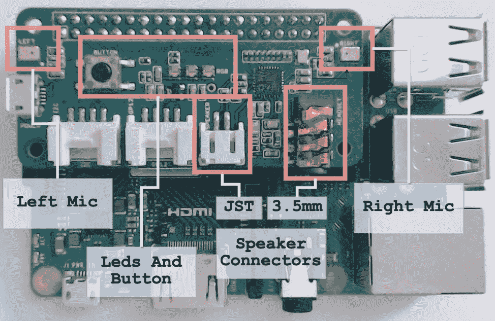
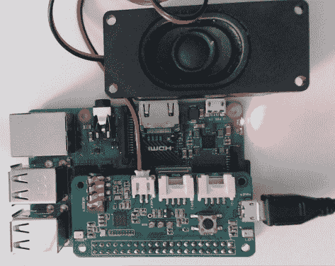
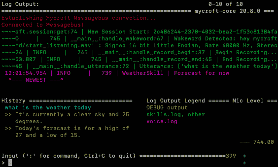
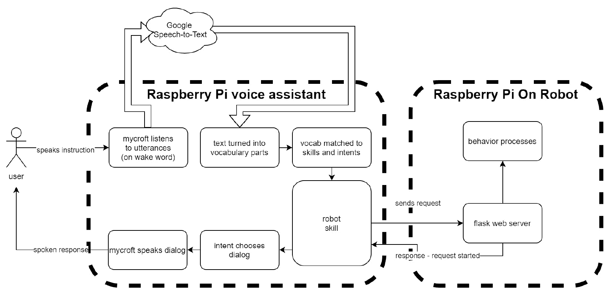
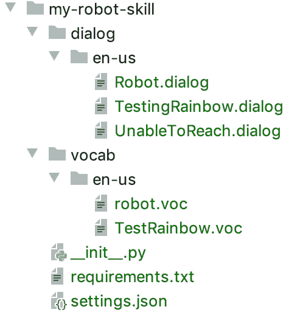

# 第十八章：使用 Mycroft 与机器人进行语音通信

使用我们的语音请求机器人做某事并接收语音响应长期以来被视为智能的标志。我们周围的设备，如使用 Alexa 和 Google Assistant 的设备，都有这些工具。能够编程我们的系统以集成这些工具，使我们能够访问强大的语音助手系统。Mycroft 是一个基于 Python 的开源语音系统。我们将通过将其连接到扬声器和麦克风来在树莓派上运行它，然后我们将根据我们说的词语在机器人上运行指令。

在本章中，我们将概述 Mycroft，然后学习如何将扬声器/麦克风板添加到树莓派上。然后我们将安装和配置树莓派以运行 Mycroft。

我们还将扩展我们对 Flask 编程的使用，构建具有更多控制点的 Flask API。

在本章的末尾，我们将创建我们自己的技能代码以将语音助手连接到我们的机器人。你将能够利用这些知识来创建更多的语音代理技能。

本章涵盖了以下主题：

+   介绍 Mycroft – 理解语音代理术语

+   在机器人上监听语音的限制

+   如何将扬声器/麦克风板添加到树莓派上

+   如何安装和配置树莓派以运行 Mycroft

+   编程 Flask 控制API

+   如何创建我们自己的技能代码以将语音助手连接到我们的机器人

# 技术要求

为了本章，你需要以下硬件：

+   另一个 Raspberry Pi 4（型号 B）。

+   一张 SD 卡（至少 8 GB）。

+   一台可以写入卡的 PC（带有 balenaEtcher 软件）。

+   ReSpeaker 2-Mics Pi HAT。

+   Mini Audio Magnet Raspberry Pi Speaker——一个带有 JST 连接器的微型扬声器或带有 3.5 毫米插孔的扬声器。

+   拥有一条 Micro-HDMI 到 HDMI 的电缆可能有助于故障排除。

+   Micro USB 电源。

+   上一章中的机器人（毕竟，我们打算让它动起来）。

本章的代码可在 GitHub 上找到：[https://github.com/PacktPublishing/Learn-Robotics-Programming-Second-Edition/tree/master/chapter15](https://github.com/PacktPublishing/Learn-Robotics-Programming-Second-Edition/tree/master/chapter15)。

查看以下视频以查看代码的实际应用：[https://bit.ly/2N5bXqr](https://bit.ly/2N5bXqr)

# 介绍 Mycroft – 理解语音代理术语

**Mycroft** 是一个名为 **语音助手** 的软件套件。Mycroft 监听语音命令并根据这些命令采取行动。Mycroft 代码是用 Python 编写的，是开源和免费的。它的大部分语音处理都在云端进行。在命令处理完毕后，Mycroft 将使用语音对人类进行回应。

Mycroft 在线有文档和用户社区。在尝试了 Mycroft 之后，你可以考虑其他替代方案——例如 Jasper、Melissa-AI 和 Google Assistant。

那么，语音助手的概念是什么呢？让我们在以下小节中看看它们。

## 语音转文本

**语音转文本**（**STT**）描述的是将包含人类语音的音频转换为计算机可以处理的单词序列的系统。

这些可以在本地运行，也可以在更强大的机器上云上运行。

## 唤醒词

语音助手通常有一个**唤醒词**——一个在命令其余部分之前说出的短语或单词，以引起语音助手的注意。例如，有“嘿，Siri”，“嗨，Google”和“Alexa”的表达。Mycroft使用单词“Mycroft”或短语“嘿，Mycroft”，但这可以更改。

语音助手通常只监听唤醒词，直到被唤醒才会忽略所有其他音频输入。唤醒词在设备上本地识别。唤醒词之后的样本声音被发送到语音转文本系统进行识别。

## 表达

**表达**是用户说的东西的术语。语音助手使用你定义的词汇来匹配表达与技能。特定的词汇将导致Mycroft调用意图处理器。

Mycroft中的词汇包括一个文件中可互换短语的列表。

一个好的例子是询问Mycroft关于天气：“嘿，Mycroft，天气怎么样？”

## 意图

**意图**是语音助手可以执行的任务，例如找出今天的天气。我们将构建意图与我们的机器人交互。意图是技能的一部分，定义了执行它的处理代码并选择一个对话框来响应。

以天气技能为例，表达“天气怎么样？”会触发获取配置位置当前天气的意图，然后向用户说出这些细节。对于我们机器人来说，一个例子是“让机器人测试LED”，这个意图会在机器人上启动LED彩虹行为（来自[*第9章*](B15660_09_Final_ASB_ePub.xhtml#_idTextAnchor171)，*在Python中编程RGB条带*)。

## 对话

在Mycroft术语中，**对话**是Mycroft对用户说的短语。例如，“好的，机器人已经启动了”，或者“今天，天气晴朗”。

技能包含一系列对话。这些对话有可以说的同义词组，并且可以使用不同的语言。

## 词汇

你说的表达，一旦转换为文本，就会与**词汇**相匹配。词汇文件，就像对话一样，是意图的一部分，将表达与动作相匹配。词汇文件包含同义词组，并且可以组织成语言集，使你的技能多语言。

这将使像“天气怎么样？”，“天气晴朗吗？”，“我需要伞吗？”或“会下雨吗？”这样的短语具有同义性。你可以将某些内容分开——例如，“让机器人做”作为一个词汇项，而“向前行驶”作为另一个。

## 技能

**技能**是用于话语、对话和*意图*的整个词汇表的容器。一个用于闹钟的技能可能包含设置闹钟、列出闹钟、删除闹钟或更改闹钟的意图。它将包含一个用于说闹钟设置完成或确认每个闹钟的对话。

在本章的后面部分，我们将构建一个带有使机器人移动和停止意图的`MyRobot`技能。

现在你已经了解了一些关于语音代理术语和部件的知识。接下来，我们需要考虑我们将要构建什么。扬声器和麦克风将放在哪里？

# 在机器人上监听语音的限制

在我们开始构建这个之前，我们应该考虑我们将要制作什么。扬声器和麦克风应该放在机器人上还是其他地方？处理是本地还是云端？

这里有一些需要考虑的事项：

+   **噪音**：带有电机的机器人是一个嘈杂的环境。如果麦克风靠近电机，它几乎就毫无用处。

+   **电源**：语音助手一直在监听。机器人已经有很多传感器在运行，对电源的需求已经很大。这种电源需求既包括电池功率，也包括CPU功率。

+   **尺寸和物理位置**：扬声器和语音HAT将增加机器人高度和布线复杂性，而这个机器人本身已经非常繁忙。

一个麦克风和扬声器的组合可以放在大型机器人的茎上——一个高支架上，那里还有一个第二个树莓派。但这对这个小而简单的机器人来说不合适。我们将创建一个独立的语音助手板，它将与我们的机器人通信，但我们不会直接将其放在机器人上。语音助手将是一个第二个树莓派。

我们还将使用一个发送到云端进行语音处理系统。虽然一个完全本地的系统会有更好的隐私性并且可以更快地响应，但在撰写本文时，还没有一个完整的打包语音助手适用于树莓派。Mycroft软件让我们在使用自己的技能时具有灵活性，并且有一个可插拔的后端用于语音处理，因此有一天它可能可以在本地运行。

现在我们已经选择了如何使用Mycroft和第二个树莓派来制作我们的语音代理，现在是时候开始构建它了。

# 为树莓派添加声音输入和输出

在我们能够使用语音处理/语音助手之前，我们需要给树莓派一些扬声器和麦克风。一些树莓派附加组件可以提供这些设备。我的推荐是带有麦克风阵列（以提高识别率）和扬声器连接的ReSpeaker 2-Mics Pi HAT，它非常容易获得。

下一张照片显示了ReSpeaker 2-Mics Pi HAT：



图15.1 – ReSpeaker 2-Mics Pi HAT

*图 15.1* 展示了 ReSpeaker 2-Mics Pi HAT 安装在 Raspberry Pi 上的照片。在左侧，我标记了左侧麦克风。该帽子有两个麦克风，每个侧面都有两个微小的矩形金属部件。下一个标签是 3 个 RGB LED 和一个连接到 GPIO 引脚的按钮。接下来是连接扬声器的两种方式 – 3.5mm 插孔或 JST 连接器。我建议您连接一个扬声器来听从这个 HAT 的输出。然后，最后一个标签突出了右侧麦克风。

我选择 ReSpeaker 2-Mic Pi HAT，因为它是一个便宜的设备，可以开始语音识别。非常便宜的 USB 麦克风对此不起作用。在 Mycroft 中有更好的支持的昂贵设备，但它们不会像帽子一样放在 Pi 上。这个 ReSpeaker 2-Mics Pi HAT 是一种权衡 – 对于硬件简单性和成本来说很好，但需要更多的软件设置。现在让我们看看如何物理安装这个 HAT。

## 硬件安装

ReSpeaker 2-Mics HAT 将直接安装在 Raspberry Pi 4 头部，板子悬在 Pi 上方。

扬声器将有一个微小的两针连接器（JST）类型，适合板上的单个两针插座，或者一个 3.5 mm 插孔。下一张照片显示了扬声器插入到其中：



图 15.2 – Mycroft 语音助手 ReSpeaker 设置

*图 15.2* 展示了我的 Mycroft 设置，ReSpeaker 2-Mics Pi HAT 已设置在我的桌子上。它已通电，Raspberry Pi 已点亮。我还连接了一个扬声器。 

您可以使用 Raspberry Pi 外壳或项目箱，但确保麦克风没有被遮挡。

您还需要一个 SD 卡和一个电源供应器。

重要提示

在接下来的几节中，我建议使用市电电源。不要插上电源并启动它。

现在我们已经准备好了硬件，它配备了扬声器和麦克风。在下一节中，我们将设置 Raspbian 和语音代理软件。

## 在 Raspberry Pi 上安装语音代理

Mycroft 为此准备了 Raspbian 发行版。让我们将其放入 SD 卡中：

1.  前往 Mycroft 网站，下载 *Picroft* 镜像：[https://mycroft-ai.gitbook.io/docs/using-mycroft-ai/get-mycroft/picroft](https://mycroft-ai.gitbook.io/docs/using-mycroft-ai/get-mycroft/picroft) – 该镜像基于 Raspbian Buster。选择 **稳定磁盘镜像**。

1.  将 SD 卡插入您的计算机。使用 [*第 3 章*](B15660_03_Final_ASB_ePub.xhtml#_idTextAnchor050) 中的程序，*探索 Raspberry Pi* 的 *在 balenaEtcher 中闪存卡* 部分。务必选择 Picroft 镜像而不是 Raspbian。

1.  确保此镜像可以无头运行，启用 SSH 和 Wi-Fi，就像我们在 [*第 4 章*](B15660_04_Final_ASB_ePub.xhtml#_idTextAnchor063) 中所做的那样，在 *为机器人准备无头 Raspberry Pi* 的 *在 Raspberry Pi 上设置无线并启用 SSH* 部分中。

准备好这张 SD 卡后，是时候尝试使用了。将其插入语音助手 Raspberry Pi，并使用 ReSpeaker 2-Mics Pi HAT 上的 USB 微型插座（而不是 Pi）供电。

重要提示

确保您通过 ReSpeaker 2-Mics Pi HAT 提供电源，而不是 Pi。该板需要电源来驱动其扬声器。该板的文档建议，如果您通过 Pi 为其供电，则扬声器不会输出声音。有关详细信息，请参阅 [https://wiki.seeedstudio.com/ReSpeaker_2_Mics_Pi_HAT/#hardware-overview](https://wiki.seeedstudio.com/ReSpeaker_2_Mics_Pi_HAT/#hardware-overview)。

其主机名最初为 `picroft.local`。您使用用户名 `pi` 和密码 `mycroft`。确保它已连接到 Wi-Fi，并且您可以通过 SSH（PuTTY）访问它。启动 Raspberry Pi 后，您就可以开始设置 Mycroft。

## 安装 ReSpeaker 软件

当您登录时，Mycroft 将显示安装指南。这将向您列出的问题进行提问：

1.  当询问是否要进行引导设置时，按 `Y` 表示是。Mycroft 安装将下载大量更新。留出 30 分钟到 1 小时的时间来完成。

1.  Mycroft 现在将询问您的音频输出设备：

    ```py
    3, to select USB speakers, which sets some basic defaults.
    ```

1.  按 *Ctrl* + `C` 退出引导设置并返回到 `$` 提示符。

1.  为了使安装生效，我们需要更新 SD 卡上的软件。在提示符下，输入 `sudo apt update -y && sudo apt upgrade -y`。更新可能需要一些时间。

1.  使用 `sudo reboot` 重启 Pi 以使更新生效。重启 Pi 后，使用 `ssh` 登录。您将再次处于引导设置中。再次按 *Ctrl* + `C`。

1.  使用以下命令安装 ReSpeaker 2-Mics Pi HAT 的音频驱动程序：

    ```py
    $ git clone https://github.com/waveshare/WM8960-Audio-HAT.git
    $ cd WM8960-Audio-HAT
    $ sudo ./install.sh
    ```

    Git 克隆可能需要一分钟左右。该板使用 WM8960 音频芯片。安装脚本将花费 20-30 分钟完成。

1.  再次重启。在退出引导模式后按 *Ctrl* + `C`。

    在我们继续之前，测试我们是否真的得到了音频是一个好主意。

1.  输入 `aplay -l` 以列出播放设备。在输出中，您应该看到以下内容：

    ```py
    card 1: wm8960soundcard [wm8960-soundcard], device 0: bcm2835-i2s-wm8960-hifi wm8960-hifi-0 [bcm2835-i2s-wm8960-hifi wm8960-hifi-0]
    ```

    这表明它已经找到了我们的卡。

1.  我们现在可以通过让这张卡播放一个音频文件来测试它是否能够播放音频。使用以下命令：`aplay -Dplayback /usr/share/sounds/alsa/Front_Left.wav`。

    此命令指定了带有设备 `-D` 标志的名为 `playback` 的设备，然后是要播放的文件。`playback` 设备是一个默认的 ALSA 处理器，它确保了混音的完成，并避免了比特率和通道数不匹配的问题。在 `/usr/share/sounds/alsa` 中还有其他测试音频文件。

1.  然后，我们可以使用 `arecord -l` 命令检查录音设备。在以下输出中，我们可以看到 `arecord` 已经找到了这张卡：

```py
card 1: wm8960soundcard [wm8960-soundcard], device 0: bcm2835-i2s-wm8960-hifi wm8960-hifi-0 [bcm2835-i2s-wm8960-hifi wm8960-hifi-0]
```

该卡现在已准备好使用。接下来，我们需要向 Mycroft 系统展示如何选择这张卡进行使用。

### 故障排除

如果您没有音频输出，有一些事情您可以检查：

1.  首先，输入`sudo poweroff`来关闭Raspberry Pi。当它关闭时，检查连接。确保电路板已完全连接到Pi的GPIO引脚。确保你已经将扬声器连接到ReSpeaker 2-Mics Pi HAT的正确端口。

1.  当你再次开机时，确保你使用的是ReSpeaker 2-Mics Pi HAT上的电源连接器，而不是Raspberry Pi。

1.  如果你使用的是耳机插槽而不是扬声器插槽，你可能需要增加音量。输入`alsamixer`，选择WM8960声卡，并将耳机音量调高。然后再次尝试播放测试。

1.  确保你已经执行了`apt update`和`apt upgrade`步骤。没有这些步骤，驱动程序的安装将无法进行。你需要在此之后重新启动，然后尝试重新安装驱动程序。

1.  在安装驱动程序时，如果Git步骤失败，请仔细检查你获取的地址。

1.  在尝试播放时，`-D`标志是区分大小写的。小写的`d`在这里不起作用。

如果这些步骤仍然没有帮助，请访问[https://github.com/waveshare/WM8960-Audio-HAT](https://github.com/waveshare/WM8960-Audio-HAT)网站，阅读他们的文档，或者提出一个问题。

现在我们已经检查了这一点，让我们尝试将声卡与Mycroft链接。

## 让Mycroft与声卡通信

现在你需要将Mycroft和声卡连接起来。通过编辑Mycroft配置文件来完成此操作：

1.  使用`sudo nano /etc/mycroft/mycroft.conf`以root权限打开Mycroft配置文件。

1.  文件中有描述Mycroft各个方面的行。然而，我们只对其中两行感兴趣：

    ```py
    aplay command on device hardware 0,0 (the Pi headphone jack) – written as hw:0,0. This will be the wrong device. The second specifies it will play mp3 files using the mpg123 command and on the same incorrect device. Using a direct hardware device may make assumptions about the format of the sound being played, so it needs to go through the mixer device. Let's fix these.
    ```

1.  将两个`hw:0,0`的出现更改为术语`playback`。这两行应该看起来像这样：

    ```py
       "play_wav_cmdline": "aplay -Dplayback %1",
       "play_mp3_cmdline": "mpg123 -a playback %1",
    ```

1.  按*Ctrl* + `X`来保存并退出。当被询问是否保存文件时，输入`Y`表示是。

1.  再次重启；当你回来时，不要退出指导模式。

1.  Mycroft会要求测试设备。按`T`来测试扬声器。可能需要几秒钟，但你将听到Mycroft对你说话。如果声音有点小，尝试输入数字`9`，然后再次测试。这是一个激动人心的时刻！按`D`表示你已经完成了测试。

1.  指导安装程序接下来会询问麦克风。选择`4`代表**其他USB麦克风**并尝试声音测试。安装程序会要求你对着麦克风说话，并且应该会回放你的声音。如果听起来不错，请按`1`。

1.  指导安装程序会询问你是否使用推荐设置；选择`1`以确认你想要使用它。将有一系列关于密码设置的问题。我建议不要添加sudo密码，而是将Pi的默认密码改为一个独特的密码。

1.  Mycroft将以大量紫色安装文本启动。

你已经配置并启动了Mycroft。它可以记录你的声音并回放给你听，你也已经听到了它的测试词。现在，是时候开始使用Mycroft并看看它能做什么了。

## 开始使用Mycroft

让我们稍微了解一下Mycroft，然后尝试与它交谈。我们将从调试界面、Mycroft客户端开始，它显示了系统正在发生的事情，然后我们将开始与它交谈。

### Mycroft客户端

当你连接到Mycroft时，你会看到如下所示的显示界面：



图15.3 – Mycroft客户端界面

*图15.3*中的截图是Mycroft客户端。它允许你看到Mycroft正在做什么，但你不需要连接到这个客户端，Mycroft才能听到你的声音。右上角显示了有多少消息以及你能看到多少。在截图上，你可以看到**0-10**条消息，总共**10**条消息。

主要的中间部分显示消息。*红色*和*紫色*消息来自Mycroft系统和插件。如果许多*紫色*消息快速闪过，说明Mycroft正在安装插件和更新，你可能需要等到它完成后再操作。*绿色*消息显示Mycroft与用户的交互。它显示当它检测到唤醒词、开始录音、结束录音以及它认为你所说的表述。如果它没有完全响应，你可以检查它是否正在拾取唤醒词以及表述是否与你试图说的相符。

在此之下，左侧是历史记录。在历史记录中，Mycroft从你的表述中处理的内容以*蓝色*显示。Mycroft所说的对话以*黄色*显示。你应该在扬声器上听到*黄色*文本的重复；然而，如果它非常忙碌，这可能需要一段时间。在右侧，它显示一个与日志文件颜色匹配的图例。更右边是一个麦克风扬声器电平计，除非Mycroft正在忙碌，或者你非常安静，否则你应该看到它在上下移动，因为它正在拾取房间内的噪音。注意 – 噪音太多，你可能会有困难与它交谈。

屏幕底部是一个输入区域，你可以在这里为Mycroft输入命令。

给系统大约30-40分钟的时间来完成所有安装。如果它没有响应，并不是卡住了，通常是在安装和编译额外的组件。

然后，Mycroft会告诉你需要在[mycroft.ai](http://mycroft.ai)进行配对。你需要使用它给出的代码来注册设备；这可以在Mycroft安装时完成。你需要在那里创建一个账户（或者如果这是一个第二设备/尝试，则登录）。请在继续之前完成此操作。

当你配对好Mycroft，并且它完成安装后，你就可以开始交互了。

### 与Mycroft交谈

现在你应该能够与你的语音助手交谈了：

1.  首先，为了引起它的注意，你必须使用唤醒词*Hey Mycroft*。如果它准备好了（并且没有还在忙碌），它将发出一个扬声器音调来显示*Mycroft*正在倾听。你需要站在大约一米的Raspberry Pi麦克风附近。它可能会回应说*请稍等，我正在完成启动*。给它一分钟，然后再次尝试。

1.  如果你听到声音，你现在可以要求它做某事。一个好的起点是告诉它：*说你好*。大约10秒后，Mycroft 应该会通过扬声器回应*你好*。你需要尽可能清晰地说话。我发现它需要你逐个发音；那些`t`和`n`的音是必不可少的。

现在既然它已经工作，你可以用它来玩一些有趣的事情！你可以将*嘿 Mycroft*缩短为*Mycroft*。你还可以说的其他事情包括以下内容：

+   *嘿 Mycroft，天气怎么样？*：这将使用天气技能并告诉你天气情况。可能不是你所在位置的天气；请使用 [mycroft.ai](http://mycroft.ai) 网站配置你的设备以适应你的位置。

+   *Mycroft，23 乘以 76 是多少*：这将使用 Wolfram 技能，它可以处理数学问题。

+   *Mycroft，wiki banana*：这将使用维基百科技能，Mycroft 将告诉你它关于香蕉的发现。

尝试这些来习惯与 Mycroft 交谈，以便它做出响应。它可能会说*我不明白*，日志会告诉你它听到了什么，这可以帮助你尝试调整发音以便于它理解。

我们现在可以创建一个技能，将 Mycroft 连接到我们的机器人。但首先，让我们检查是否有问题。

## 故障排除

如果无法让 Mycroft 说话或识别说话，请尝试以下方法：

+   确保你离麦克风足够近或声音足够大。这可以通过观察麦克风（麦克风）水平是否超过 Mycroft 控制台中的虚线来检查。

+   确保你的 Raspberry Pi 有良好的网络连接。Mycroft 只能在你可以访问互联网的地方工作。请参阅 Mycroft 文档了解如何处理代理。如果互联网连接不佳，Mycroft 可能无法正确启动。修复连接并重新启动可能会有所帮助。

+   在 Pi 启动时连接监视器可能会显示错误消息。

+   Mycroft 有一个以 *故障排除和已知错误* 开始的故障排除系统（[https://mycroft.ai/documentation/troubleshooting/](https://mycroft.ai/documentation/troubleshooting/)）。

+   Mycroft 正在积极开发中。使用最新的 Picroft 图像并应用 ReSpeaker 驱动程序可能会有所帮助。简而言之，安装和运行此软件可能会发生变化。

在 Mycroft 说话并做出响应的情况下，我们需要为 Mycroft 准备机器人以便与之交谈。

# 编程 Flask API

本章旨在使用 Mycroft 控制我们的机器人。为此，我们需要为我们的机器人提供一种接收来自其他系统命令的方式。服务器上的 **应用程序编程接口**（**API**）允许我们将此类系统解耦，以便通过网络向另一个系统发送命令并接收响应。Flask 系统非常适合构建此类系统。

基于网络的API有端点，其他系统会向其发送请求，并大致映射到Python模块中的函数或方法。正如你将看到的，我们将我们的API端点直接映射到Python `robot_modes` 模块中的函数。

在我们开始构建之前，让我们看看这个系统的设计——它还将揭示 Mycroft 的工作方式。

## Mycroft 控制机器人的概述

下面的图示展示了用户如何通过 Mycroft 控制机器人：



图15.4 – 机器人技能概述

*图15.4* 中的图示展示了数据在这个系统中的流动：

1.  在左侧，它从用户对 Mycroft 发出指令开始。

1.  在识别唤醒词后，Mycroft 将声音发送到 Google STT 引擎。

1.  Google STT 返回文本，一个语音输入，Mycroft 会将其与技能/意图中的词汇进行匹配。我们稍后会更深入地探讨这些内容。

1.  这将在机器人技能中触发意图，我们将构建这个技能。机器人技能将向机器人右侧的 Raspberry Pi 发送请求，作为对 Flask 控制API（网络）服务器的请求。

1.  那个控制 API 服务器将启动机器人进程，并响应表示已完成。

1.  机器人技能将选择对话来说明它已完成，并将此信息发送给 Mycroft。

1.  Mycroft 将然后向用户说出这个响应。

在这一点上，我们将在机器人上构建 Flask 服务器。你之前在视觉处理章节中已经见过 Flask，并且已经安装了这个库。

## 远程启动行为

我们将使用 HTTP 和一个网络服务器来完成这项工作，因为向其发送请求很简单，因此我们可以构建其他远程控制机器人的方法。HTTP 在 URL 中发送请求——首先，`http://` 协议标识符；服务器主机名，`myrobot.local`；路径，`/mode/foo`；之后可能还有额外的参数。我们使用 URL 的路径来确定机器人做什么。

就像我们处理其他系统一样，我们创建了一些逻辑部分和块来处理这个系统的不同方面：

+   管理机器人模式和启动/停止已知脚本的代码。它还可以给我们一个已知脚本的列表。

+   一个网络服务器来处理网络请求。

我们首先需要构建模式管理器。

### 管理机器人模式

我们可以通过启动和停止我们的行为脚本作为子进程来管理模式。让我们创建一个配置来告诉模式管理器关于模式的信息。这个配置将模式名称映射到一个文件——一个 Python 文件。请注意，我们指定了一个文件列表，而不是推断它。尽管我们可以将模式/路径部分添加 `.py` 来获取一个文件，但这有两个原因是不好的：

+   它将直接与脚本名称耦合；如果我们可以更改相同模式名称的底层脚本，那将很棒。

+   尽管机器人不是一个安全的环境，允许任意子进程运行是非常糟糕的；限制它可以使机器人更加安全。

让我们开始构建它：

1.  创建一个名为 `robot_modes.py` 的文件。这个文件包含一个名为 `RobotModes` 的类，用于处理机器人进程。

1.  文件以一些导入和一些类定义的顶部开始：

    ```py
    import subprocess
    class RobotModes(object):
    ```

1.  接下来，我们创建一些模式映射，将模式名称映射到文件名：

    ```py
        mode_config = {
            "avoid_behavior": "avoid_with_rainbows.py",
            "circle_head": "circle_pan_tilt_behavior.py",
            "test_rainbow": "test_rainbow.py"
        }
    ```

    模式名称是一个简短名称，也称为 *slug*，是可读性和机器可读性之间的折衷方案 – 它们通常仅限于小写和下划线字符，并且比完整的英文描述要短。我们的文件名已经相对接近 slug 名称。

1.  在固定配置之外，这个类还在管理作为进程的运行行为。它一次只能运行一个。因此，我们需要一个成员变量来跟踪当前进程并检查它是否正在运行：

    ```py
        def __init__(self):
            self.current_process = None
    ```

1.  我们应该能够检查是否有东西已经在运行或已完成：

    ```py
    subprocess is a way of running other processes and apps from within Python. We check whether we have a current process, and if so, whether it is still running. Processes have a return code, usually to say whether they completed or failed. However, if they are still running, it will be None. We can use this to determine that the robot is currently running a process.
    ```

1.  下一个函数是运行一个进程。函数参数包括一个模式名称。该函数检查进程是否正在运行，如果不是，则启动一个进程：

    ```py
    self.mode_config to map mode_name to a script name. We then use subprocess to start this script with Python. Popen creates a process, and the code stores a handle for it in self.current_process. This method returns True if we started it, and False if one was already running.
    ```

1.  该类需要一种方法来请求它停止一个进程。请注意，当进程未运行时，它不会尝试停止进程。当我们停止脚本时，我们可以使用 Unix 信号，这允许我们以允许它们运行 `atexit` 代码的方式请求它们停止。它发送 `SIGINT` 信号，这是 *Ctrl* + `C` 键盘组合的等效信号：

    ```py
        def stop(self):
            if self.is_running():
                self.current_process.send_signal( subprocess.signal.SIGINT)
                self.current_process = None
    ```

在我们发出信号后，我们将当前进程设置为 `None` – 丢弃句柄。

我们现在有了启动和停止进程的代码，它还将名称映射到脚本。我们需要将其封装在一个语音代理可以使用的网络服务中。

## 编程 Flask 控制API服务器

我们之前使用 Flask 创建了我们的视觉处理行为的网络服务器。这次我们将用它来做一些更简单的事情。

正如我们在图像服务器中的启动和停止按钮所看到的，Flask 允许我们为链接设置处理程序以执行任务。让我们编写一个脚本，作为我们的控制网络服务，它使用 `Flask` 和我们的 `RobotModes` 对象。

让我们按照以下步骤构建它：

1.  创建一个名为 `control_server.py` 的脚本。我们可以从导入 Flask 和我们的机器人模式开始：

    ```py
    from flask import Flask
    from robot_modes import RobotModes
    ```

1.  现在，我们创建一个 Flask 应用程序来包含路由和之前创建的 `RobotModes` 类的实例：

    ```py
    app = Flask(__name__)
    mode_manager = RobotModes()
    ```

1.  接下来，我们需要一个路由，或 API 端点，来运行应用程序。它将模式名称作为路由的一部分：

    ```py
    @app.route("/run/<mode_name>", methods=['POST'])
    def run(mode_name):
        mode_manager.run(mode_name)
        return "%s running"
    ```

    我们返回一个运行确认。

1.  我们还需要另一个 API 端点来停止正在运行的过程：

    ```py
    @app.route("/stop", methods=['POST'])
    def stop():
        mode_manager.stop()
        return "stopped"
    ```

1.  最后，我们需要启动服务器：

    ```py
    http for a web (hypertext) service. This is followed by a colon (:) and then two slashes // with a hostname or host address—the network address of the Raspberry Pi the resource will be on. As a host can have many services running, we can then have a port number, with a colon as a separator—in our case, :5000. After this, you could add a slash / then select a specific resource in the service.We can test this now:
    ```

1.  启动机器人并复制 `control_server.py` 和 `robot_modes.py` 文件到其中。

1.  通过 SSH 连接到机器人，并使用 `python3 control_server.py` 启动控制服务器。你应该看到以下内容：

    ```py
    $ python3 control_server.py
     * Serving Flask app "control_server" (lazy loading)
     * Environment: production
       WARNING: Do not use the development server in a production environment.
       Use a production WSGI server instead.
     * Debug mode: on
     * Running on http://0.0.0.0:5000/ (Press CTRL+C to quit)
    ```

1.  现在创建另一个 `ssh` 窗口进入 Mycroft Raspberry Pi – 我们可以测试它是否与另一个窗口通信。在 `pi@picroft.local` 中按一次 *Ctrl* + `C` 以进入 Linux 命令行（`$` 提示符）。

1.  `curl` 命令在像 Raspberry Pi 这样的 Linux 系统上经常被用来测试此类服务器。它向网络服务器发送请求，发送/接收数据，并显示结果。它非常适合测试此类 HTTP 控制API。

    我们打算发送一个 `post` 请求。输入以下命令：

    ```py
    curl -X POST http://myrobot.local:5000/run/test_rainbow
    ```

    这应该会启动彩虹灯的开关，使用来自[*第9章*](B15660_09_Final_ASB_ePub.xhtml#_idTextAnchor171)，*在Python中编程RGB灯带*的代码。`curl`命令指定我们使用`POST`方法发送请求，然后是一个包含端口号、机器人主机名、指令`run`和模式名称的URL。

1.  你可以用`curl -X POST http://myrobot.local:5000/stop`停止LED灯。这个URL有`stop`指令。机器人的LED彩虹灯应该会停止。

    注意这两个URL都是以`http://myrobot.local:5000/`开头的。这个地址可能因你的主机名而异。这是这个控制服务器的基准URL。

1.  你可以按*Ctrl* + `C`来停止它。

我们可以用这个来构建我们的 Mycroft 行为，但在继续之前，让我们检查一下是否有任何问题。

## 故障排除

如果这对你不起作用，我们可以检查一些事情来看看发生了什么：

+   如果你收到任何语法错误，请检查你的代码并再次尝试。

+   请验证你的机器人和你正在测试的设备都有互联网连接。

+   注意，当我们启动子进程时，我们正在启动Python 3。如果没有`3`，可能会发生一些意外的事情。

+   首先，记住控制服务器正在机器人的Raspberry Pi 3A+上运行。你需要在`curl`命令中用你的机器人地址替换它。

+   确保你已经安装了Flask，如[*第13章*](B15660_13_Final_ASB_ePub.xhtml#_idTextAnchor283)，*机器人视觉 – 使用Pi摄像头和OpenCV*中所示。

+   确保你已经将控制服务器和机器人模式脚本复制到了机器人上。你还需要在机器人上安装来自[*第9章*](B15660_09_Final_ASB_ePub.xhtml#_idTextAnchor171)，*在Python中编程RGB灯带*的代码来运行这个测试。

现在我们已经测试了控制服务器，你可以关闭Pi的电源。还有一些代码要写！让我们将其与Mycroft连接起来。

# 在Raspberry Pi上使用Mycroft编程语音代理

Flask控制系统提供的机器人后端足够我们创建Mycroft技能。

在*图15.4*中，你看到在你说出唤醒词后，Mycroft会将你发出的声音传输到Google STT系统。Google STT随后会返回文本。

Mycroft会将这些与你在该地区使用的词汇文件进行匹配，并将其与技能中设置的意图相匹配。一旦匹配，Mycroft将在技能中调用一个意图。我们的机器人技能有意图，会向为我们机器人创建的Flask控制服务器发送网络（HTTP）请求。当Flask服务器响应表示它已处理请求（可能是行为已启动）时，机器人技能将选择一个对话框对用户说话，以确认它已成功执行请求或发现问题。

我们将从简单的技能开始，有一个基本的意图，然后你可以扩展它以执行更多操作。我选择了彩虹 LED 测试（来自 [*第 9 章*](B15660_09_Final_ASB_ePub.xhtml#_idTextAnchor171)，*在 Python 中编程 RGB 条带*），因为它很简单。

值得注意的是，Google 处理语音所需的时间意味着这不适合紧急停止机器人；语音识别可能需要一些时间。你可以在意图中使用 `GPIOZero` 和 `when_pressed` 处理器来触发控制服务器的停止处理器。

## 构建意图

我们可以从意图开始，然后看看一些词汇。为了构建它，我们将使用 Mycroft 内置的名为 `adapt` 的库：

1.  创建一个名为 `my-robot-skill` 的文件夹，我们将在此文件夹中构建 Mycroft 技能。

1.  主要意图文件将是此文件夹中的 `__init__.py` 文件。此文件名意味着 Python 将将整个文件夹视为一个 Python 库，称为 `my-robot-skill/__init__.py`：

    ```py
    IntentBuilder to build and define intents around vocabulary. MycroftSkill is a base class to plug our code into Mycroft. intent_handler marks which parts of our code are intents, associating the code with IntentBuilder. We import LOG to write information out to the Mycroft console and see problems there.The last import, `requests`, is a tool to talk to our control server in Python remotely.
    ```

1.  接下来，我们将从 `MycroftSkill` 基类定义我们的技能。它需要设置其父类并准备设置：

    ```py
    super calls a method from a class we've made our base; in this case, __init__ so we can let it set things up.The only setting we have is a `base_url` member for our control server on the robot. It is consulting a settings file, which we'll see later. It's usually a good idea to separate the configuration from the code.
    ```

1.  下一步我们需要定义一个意图。我们通过一个 `handle_test_rainbow` 方法来实现，但你需要使用 `@intent_handler` 装饰器。在 Python 中，装饰器会将方法包装在进一步的处理中——在这种情况下，使其适合 Mycroft：

    ```py
    intent_handler decorator takes some parameters to configure the vocabulary we will use. We will define vocabulary in files later. We require a vocabulary matching *robot* first, then another part matching *TestRainbow* – which could match a few phrases.
    ```

1.  下一步，这个技能应该使用 `requests.post` 向机器人发送请求：

    ```py
    base_url variable, plus the run instruction and the test_rainbow mode.
    ```

1.  我们需要 Mycroft 说出一些话，表明它已经告诉机器人在这里做些什么：

    ```py
    speak_dialog method tells Mycroft to pick something to say from dialog files, which allows it to have variations on things to say.
    ```

1.  此请求可能因几个原因而失败，因此在代码片段的最后之前有 `try`。我们需要一个 `except` 来处理这种情况，并为用户说话一个对话框。我们还将 `LOG` 一个异常到 Mycroft 控制台：

    ```py
    Unable to reach the robot, while not inspecting the result code from the server other than if the voice skill contacted the robot.
    ```

1.  此文件需要提供一个 `create_skill` 函数，该函数位于类外部，Mycroft 预期在技能文件中找到：

    ```py
    def create_skill():
        return MyRobot()
    ```

代码是这个系统的一部分，但在使用它之前我们需要配置它。

### 设置文件

我们的意图首先加载一个设置。我们将将其放在 `my-robot-skill/settingsmeta.json` 中，并定义我们的控制服务器的基准 URL。

如果你的机器人树莓派的域名/地址不同，请使用该域名/地址。此文件对于这个设置来说有点长，但意味着你可以稍后配置 URL：

```py
{
    "skillMetadata": {
        "sections": [
            {
                "name": "Robot",
                "fields": [
                    {
                        "name": "base_url",
                        "type": "text",
                        "label": "Base URL for the robot control server",
                        "value": "http://myrobot.local:5000"
                    }
                ]
            }
        ]
    } 
}
```

我们已经设置了要使用的基准 URL，但我们需要配置 Mycroft 以加载我们的技能。

### 要求文件

我们的技能使用 `requests` 库。当 Mycroft 遇到我们的技能时，我们应该告诉它期待这个。在 Python 中，要求文件是这样做的一种标准方式。将以下内容放入 `my-robot-skill/requirements.txt`：

```py
requests
```

此文件并非仅限于 Mycroft，它还与许多 Python 系统一起使用，以安装应用程序所需的库。

现在，我们需要告诉 Mycroft 它需要监听什么，即词汇。

### 创建词汇文件

要定义词汇，我们需要定义词汇文件。你需要将它们放入一个遵循格式`my-robot-skill/vocab/<IETF语言和区域设置>`的文件夹中。语言/区域设置意味着我们应该能够为变体定义词汇，例如`en-us`代表美式英语和`zn-cn`代表简体中文；然而，在撰写本文时，`en-us`是最受支持的Mycroft语言。社区的一部分正在努力支持其他语言。

你使用一个或多个与词汇文件匹配的词汇部分来定义每个意图。词汇文件有代表预期话语方式的行。这允许人类自然地变化他们说话的方式，当机器无法以稍微不同的方式请求某事时，人们会注意到这一点。在为词汇文件想出类似短语时，有一些技巧。

我们需要为我们的意图定义两个词汇文件——一个用于`robot`同义词，另一个用于`TestRainbow`同义词：

1.  在`my-robot-skill`下创建`vocab`文件夹，然后在其中创建`en-us`文件夹。

1.  在那里创建一个路径和名称为`my-robot-skill/vocab/en-us/robot.voc`的文件。

1.  添加一些用于*请求机器人做某事*的短语：

    ```py
    robot in the intent handler.
    ```

1.  让我们创建用于测试彩虹的词汇。将其放入`my-robot-skill/vocab/en-us/TestRainbow.voc`：

    ```py
    test rainbow
    test the leds
    deploy rainbows
    turn on the lights
    ```

    重要提示

    注意，词汇文件名的首字母大小写必须与意图构建器匹配；我随后使用了将非共享词汇部分首字母大写的惯例。

在测试这个时，你不可避免地会尝试说出一个听起来合理的短语，但这个短语并不在那里。Mycroft会告诉你“抱歉，我不明白”，然后你会在上面的词汇表中添加另一个表达。

### 对话文件

我们还想要定义Mycroft会对你说的短语。到目前为止，我们有三个短语是我们意图所需的。这些短语将放入与词汇文件类似结构的`my-robot-skill/dialog/en-us`文件夹中。让我们来构建它们：

1.  在`my-robot-skill`下创建`dialog`文件夹，然后在其中创建`en-us`文件夹。

1.  在该文件夹中创建路径为`my-robot-skill/dialog/en-us/Robot.dialog`的文件。我们可以在其中添加一些短语：

    ```py
    The Robot
    Robot
    ```

1.  下一个对话我们需要的是同一文件夹中的`TestRainbow.dialog`：

    ```py
    is testing rainbows.
    is deploying rainbows.
    is starting rainbows.
    is lighting up.
    ```

1.  由于我们有一个错误处理器，我们也应该创建`UnableToReach.dialog`：

    ```py
    Sorry I cannot reach the robot.
    The robot is unreachable.
    Have you turned the robot on?
    Is the control server running on the robot?
    ```

通过定义多个可能的对话，Mycroft会随机选择一个，使其不那么重复。我们已经看到了如何制作词汇短语和对话短语。让我们简要回顾一下我们应该有什么。

### 当前技能文件夹

我们的技术文件夹应该看起来像以下截图：



图15.5 – 机器人技能文件夹截图

在 *图 15.5* 中，我们看到一个截图显示了名为 `my-robot-skill` 的文件夹中的技能。这个技能文件夹包含 `dialog` 文件夹，其中包含 `en-us` 子文件夹和这里的三个对话文件。下面是 `vocab` 文件夹，包含 `en-us` 文件夹和两个词汇文件。在 `vocab` 文件夹下面，我们有 `__init__.py` 文件，它定义了意图、Mycroft 安装它的要求和一个设置文件。哇 - 我们在这里创建了很多东西，但这一切都将是值得的！

我们现在需要将整个文件夹结构上传到我们的机器人：

1.  使用 SFTP（FileZilla），将此文件夹上传到你的 Mycroft Pi，在 `/opt/mycroft/skills` 文件夹中。

1.  Mycroft 将自动加载此技能；你将看到紫色文本在安装过程中闪烁。

1.  如果你需要更新代码，再次上传文件到这个位置将导致 Mycroft 重新加载它。

    加载或使用技能时遇到的问题将在 Mycroft 输出中显示。你还可以在 `/var/log/mycroft/skills.log` 中找到结果——`less` Linux 工具对于查看此类日志输出很有用，使用 *Shift* + `G` 跳到文件末尾或输入 `/myrobot` 跳到其输出。

    你也可以使用 `tail -f /var/log/mycroft/skills.log` 来查看问题发生时的状态。使用 *Ctrl* + `C` 来停止。

1.  现在，打开机器人的电源，使用 `ssh` 登录，并使用 `python3 control_server.py` 启动控制服务器。

1.  然后，你可以尝试使用 Mycroft 测试你的技能：*告诉机器人打开灯光*。

1.  Mycroft 应该发出哔哔声以向用户显示它已唤醒，一旦它从语音到文本转换中获取了单词，它将向机器人上的控制服务器发送 `/run/test_rainbow`。你应该听到 Mycroft 说出其中一个对话短语，例如 *机器人正在测试彩虹*，并看到 LED 灯亮起。

## 故障排除

如果你遇到意图响应的问题，请尝试以下操作：

+   首先，检查之前 Python 代码的语法和缩进。

+   确保你的机器人和语音助手 Raspberry Pi 在同一网络中；我发现一些 Wi-Fi 扩展器存在这个问题，需要使用 IP 地址而不是 `myrobot.local`。使用 `settingsmeta.json` 文件来配置此设置。

+   确保你已经将整个结构 - 包括 `vocab`、`dialog`、`settingsmeta.json` 和 `__init__.py` - 复制到语音助手 Raspberry Pi 的 `/opt/mycroft/skills` 文件夹中。

+   如果你的设置不正确，你需要在 [https://account.mycroft.ai/skills](https://account.mycroft.ai/skills) 页面上更改它们。查找 `My Robot` 技能并在此处更改。你需要保存更改，可能需要重新启动 Mycroft 或等待几分钟以使更改生效。

+   确保你与 Mycroft 对话的方式与你的词汇文件相匹配 - 否则它将无法识别你的单词。

+   如果你遇到它识别你的声音的问题，你也可以在 Mycroft 控制台中输入短语。

我们的第一种意图已经生效！你能够对语音助手说话，并且它已经指导机器人执行操作。然而，我们现在开始闪烁 LED，唯一停止它们的方法是使用那个不方便的 `curl` 命令。我们可能需要通过添加另一个意图来修复这个问题。

## 添加另一个意图

现在我们有了自己的技能，为它添加一个停止的第二个意图变得相对容易，使用机器人控制服务器中的另一个端点。

### 词汇和对话

我们需要添加词汇和对话，以便我们的新意图能够理解我们所说的话，并且有一些话可以回应：

1.  我们需要创建 `stop` 词汇；我们可以将其放在 `my-robot-skill/vocab/en-us/stop.voc` 中：

    ```py
    stop
    cease
    turn off
    stand down
    ```

1.  我们需要为 Mycroft 创建一个对话文件，以便在 `my-robot-skill/dialog/en-us/stopping.dialog` 中告诉机器人它正在停止：

    ```py
    is stopping.
    will stop.
    ```

这些就足够了，但如果你想到了更多的同义词，也可以添加。

### 添加代码

现在我们需要将意图代码添加到我们的技能中：

1.  我们将此放入 `my-robot-skill/__init__.py` 中的 `MyRobot` 类：

    ```py
    stop vocabulary, the handler name (which could be anything – but must not be the same as another handler), and the URL endpoint. Identical code like that is ripe for refactoring. Refactoring is changing the appearance of code without affecting what it does. This is useful for dealing with common/repeating code sections or improving how readable code is. Both the intents have the same try/catch and similar dialog with some small differences. 
    ```

1.  在同一文件中，添加以下内容：

    ```py
    end_point as a parameter and uses that in its request. It takes a dialog_verb parameter to say after the Robot bit. All of the other dialog and error handling we saw before is here. 
    ```

1.  这两个意图现在变得更为简单。将它们更改为以下内容：

    ```py
        @intent_handler(IntentBuilder("")
                        .require("Robot")
                        .require("TestRainbow"))
        def handle_test_rainbow(self, message):
            self.handle_control('/run/test_rainbow', 'TestingRainbow')
        @intent_handler(IntentBuilder("")
                        .require("Robot")
                        .require("stop"))
        def handle_stop(self, message):
            self.handle_control('/stop', 'stopping')
    ```

添加新的意图现在更容易，因为我们能够重用 `handle_control`。

### 使用新意图运行

你现在可以再次上传文件夹结构——因为 `vocab`、`dialog` 和 `__init__` 文件已经更改。当你这样做时，请注意 Mycroft 将自动重新加载更改后的技能（或显示尝试这样做时出现的任何问题），因此它立即可以投入使用。

通过说出 *Mycroft，告诉机器人停止* 来尝试一下。

你现在已向系统中添加了第二个意图，定义了更多的词汇和对话。你也已经重构了这段代码，因为看到了一些重复。现在，你的机器人已经开始具备语音控制功能。

# 摘要

在本章中，你学习了语音助手术语、语音转文本、唤醒词、意图、技能、话语、词汇和对话。你考虑了麦克风和扬声器的安装位置，以及它们是否应该安装在机器人上。

你随后看到了如何将扬声器/麦克风组合物理安装在 Raspberry Pi 上，然后准备软件以便 Pi 使用它。你安装了 Picroft – 一个 Mycroft Raspbian 环境，获取了语音代理软件。

你随后能够与 Mycroft 互动，让它响应不同的语音命令，并将其与基础注册。

你还看到了如何使机器人准备好接受外部代理，例如使用 Flask API 的语音代理来控制它。你能够创建多个与机器人通信的技能，为创建更多技能提供了良好的起点。

在下一章中，我们将回顾在第 12 章[*第 12 章*](B15660_12_Final_ASB_ePub.xhtml#_idTextAnchor251)中引入的 IMU，*使用 Python 进行 IMU 编程*，并让它做更多有趣的事情——我们将平滑和校准传感器，然后将它们组合起来为机器人获取航向，编程机器人始终朝北转。

# 练习

尝试这些练习以充分利用本章内容并扩展你的经验：

+   尝试从Mycroft网站安装一些其他Mycroft技能并与之互动。提示：说“Hey Mycroft，install pokemon”。

+   机器人模式系统有一个缺陷；它假设你要求停止的过程确实停止了。它应该等待并检查返回代码以查看是否已停止吗？

+   实现机器人模式的另一种方法可能是更新所有行为以干净地退出，这样你就可以导入它们而不是在子进程中运行。这会多么棘手？

+   在测试交互时，你是否觉得词汇量不足？也许你可以用更自然的短语来开始不同的行为。同样，你也可以使对话更有趣。

+   向技能添加更多意图，例如，避障。你可以添加一个停止意图，尽管响应时间可能会使这不太理想。

+   ReSpeaker 2-Mics Pi HAT上的RGB LED可以使用吗？项目[https://github.com/respeaker/mic_hat](https://github.com/respeaker/mic_hat)有一个LED演示。

有这些想法，有足够的空间来进一步探索这个概念。进一步的阅读也会有所帮助。

# 进一步阅读

请参阅以下信息以获取更多信息：

+   *《树莓派机器人项目》*，*理查德·格里姆特博士*，*Packt Publishing*，有一章介绍语音输入和输出。

+   *《语音用户界面项目》*，*亨利·李*，*Packt Publishing*，专注于系统的语音界面。它展示了如何使用Alexa和Google Home语音代理构建聊天机器人和应用程序。

+   *《Mycroft AI – 语音栈介绍》* – Mycroft AI的一份白皮书提供了更多关于Mycroft栈如何工作及其组件的详细信息。

+   Mycroft有一个庞大的社区支持并讨论这项技术，请参阅[https://community.mycroft.ai/](https://community.mycroft.ai/)。我建议咨询这个社区的故障排除信息。Mycroft正在积极开发中，既有许多怪癖，也有许多新功能。它也是一个分享你为它构建的技能的绝佳地方。

+   查看[https://github.com/respeaker/seeed-voicecard](https://github.com/respeaker/seeed-voicecard)以获取Seeed Studio，ReSpeaker 2-Mics Pi HAT的创造者，提供的关于此设备的文档和代码，以及更大型的四麦克风和六麦克风版本。
