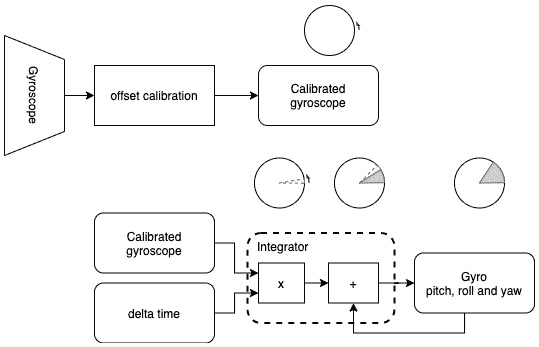
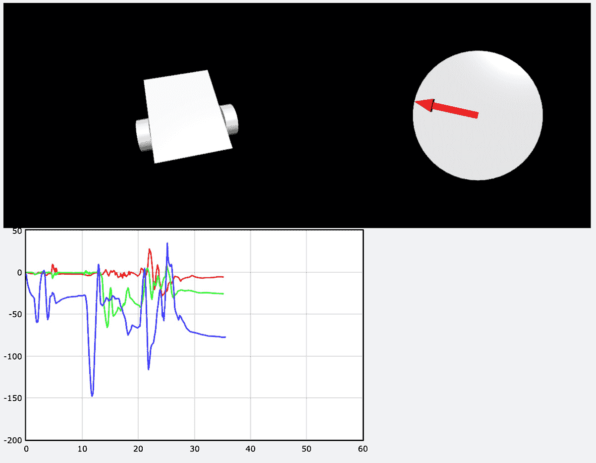

# 第十九章：*第16章*: 使用IMU深入探索

在[*第12章*](B15660_12_Final_ASB_ePub.xhtml#_idTextAnchor251)的*使用Python进行IMU编程*中，我们读取了来自**惯性测量单元**（**IMU**）的数据。我们现在对处理传感器数据、使用数学和管道进行决策有了更多的了解。

在本章中，我们将学习如何从IMU获取校准数据，结合传感器数据，并使用这些数据使机器人具有基于绝对方向的行性行为。在这个过程中，我们将看到用于提高精度/速度或准确性的算法。

到本章结束时，你将能够检测机器人的绝对方向，并在屏幕上显示，并将其与**比例-积分-微分**（**PID**）行为相结合。

本章我们将涵盖以下主要内容：

+   编程虚拟机器人

+   使用陀螺仪检测旋转

+   使用加速度计检测俯仰和滚转

+   使用磁力计检测航向

+   从磁力计获取大致航向

+   结合传感器进行方向检测

+   使用IMU数据驱动机器人

# 技术要求

对于本章，你需要以下物品：

+   来自至少[*第14章*](B15660_14_Final_ASB_ePub.xhtml#_idTextAnchor315)的机器人代码，*使用Python进行基于摄像头的循线*

+   来自[*第14章*](B15660_14_Final_ASB_ePub.xhtml#_idTextAnchor315)的机器人代码，*使用Python进行基于摄像头的循线*，在[https://github.com/PacktPublishing/Learn-Robotics-Programming-Second-Edition/tree/master/chapter14](https://github.com/PacktPublishing/Learn-Robotics-Programming-Second-Edition/tree/master/chapter14)

+   来自[*第12章*](B15660_12_Final_ASB_ePub.xhtml#_idTextAnchor251)的IMU代码，*使用Python进行IMU编程*，在[https://github.com/PacktPublishing/Learn-Robotics-Programming-Second-Edition/tree/master/chapter12](https://github.com/PacktPublishing/Learn-Robotics-Programming-Second-Edition/tree/master/chapter12)

+   在没有许多磁铁的广阔驾驶空间

+   磁罗盘

本章的完整代码请访问[https://github.com/PacktPublishing/Learn-Robotics-Programming-Second-Edition/tree/master/chapter16](https://github.com/PacktPublishing/Learn-Robotics-Programming-Second-Edition/tree/master/chapter16)。

查看以下视频，了解代码的实际应用：[https://bit.ly/2LztwOO](https://bit.ly/2LztwOO)

# 编程虚拟机器人

我们首先将检测我们的机器人方向；将其显示为3D机器人模型将很有用。这部分基于[*第12章*](B15660_12_Final_ASB_ePub.xhtml#_idTextAnchor251)中的*表示坐标和旋转系统*部分，*使用Python进行IMU编程*。在本节中，我们将使用VPython构建我们机器人的简单模型。

## 在VPython中建模机器人

我们将使用称为 **原语** 的形状来模拟机器人。它们具有位置、旋转、大小和颜色。高度和宽度参数与 VPython 世界坐标系匹配（参见 [*第 12 章*](B15660_12_Final_ASB_ePub.xhtml#_idTextAnchor251) 中的 *图 12.14 – 机器人身体坐标系*，*使用 Python 进行 IMU 编程*），因此我们必须旋转物体以匹配机器人身体坐标系。

首先，我们需要收集一些机器人测量值。以下图表显示了它们的位置。一旦完成主要测量，可以使用估计值进行较小测量：


图 16.1 – 虚拟机器人的测量值

*图 16.1* 展示了机器人的测量值。俯视图和左视图展示了覆盖不同方面的内容。这包括底座的宽度和高度——注意，我们在此目的将其视为矩形。需要测量或猜测车轮的大小和位置，以及万向轮的大小和位置。为你的机器人测量或猜测这些值。对我们来说，猜测就足够了。位置来自底盘的中间。

让我们编写代码来创建基本形状，如下所示：

1.  创建一个名为 `virtual_robot.py` 的文件，并添加 `vpython` 导入和我们的机器人视图来启动它，如下所示：

    ```py
    import vpython as vp
    from robot_pose import robot_view
    ```

1.  我们将虚拟机器人放入一个函数中，以便在几种不同的行为中使用，如下所示：

    ```py
    def make_robot():
    ```

1.  我们将 *图 16.1* 中的机器人测量值放入变量中。我使用了 **毫米**（**mm**）来表示所有这些值。代码如下所示：

    ```py
        chassis_width = 155
        chassis_thickness = 3
        chassis_length = 200
        wheel_thickness = 26
        wheel_diameter = 70
        axle_x = 30
        axle_z = -20
        castor_position = vp.vector(-80, -6, -30)
        castor_radius = 14
        castor_thickness = 12
    ```

1.  底座是一个默认位置为 (`0`, `0`, `0`) 的盒子。代码如下所示：

    ```py
        base = vp.box(length=chassis_length,
                      height=chassis_thickness,
                      width=chassis_width)
    ```

1.  将此盒子绕 `x` 轴旋转 90 度以匹配身体坐标系，将 `z` 轴向上，如下所示：

    ```py
    base.rotate(angle=vp.radians(90), 
                    axis=vp.vector(1, 0, 0))
    ```

1.  我们将使用两个圆柱体作为车轮。每个车轮到中间的距离大约是底盘宽度的一半。让我们用它来创建车轮的 `y` 位置，如下所示：

    ```py
       wheel_dist = chassis_width/2
    ```

1.  我们设置车轮位置以与电机轴的末端对齐。左轮有一个 `y` 坐标；`-wheel_dist` 将其移动到平台左侧，如下代码片段所示：

    ```py
    cylinder axis says which way it is pointing. We set *y* to *-1* to point it left.
    ```

1.  现在，我们设置右轮，`wheel_dist` 为正值，`y` 轴为 `1`，以便它指向右侧，如下代码片段所示：

    ```py
        wheel_r = vp.cylinder(radius=wheel_diameter/2,
              length=wheel_thickness,
              pos=vp.vector(axle_x, wheel_dist, axle_z),
              axis=vp.vector(0, 1, 0))
    ```

1.  我已经使用了一个圆柱体作为后轮的万向轮，如下代码片段所示：

    ```py
        castor = vp.cylinder(radius=castor_radius,
              length=castor_thickness,
              pos=castor_position,
              axis=vp.vector(0, 1, 0))
    ```

1.  现在，我们将所有这些部分组合成一个复合对象——一个单一的 3D 对象，如下所示：

    ```py
        return vp.compound([base, wheel_l, wheel_r, castor])
    ```

1.  为了测试它，让我们创建一个微小的 `main` 部分。此代码检查你是否直接启动了它，因此以下代码在将虚拟机器人作为库导入时不会运行：

    ```py
    if __name__ == "__main__":
    ```

1.  设置视图，将摄像机放置在机器人前方，如下所示：

    ```py
        robot_view()
    ```

1.  我们将添加轴来显示物品的位置，如下所示：

    ```py
        x_arrow = vp.arrow(axis=vp.vector(200, 0, 0), color=vp.color.red)
        y_arrow = vp.arrow(axis=vp.vector(0, 200, 0), color=vp.color.green)
        z_arrow = vp.arrow(axis=vp.vector(0, 0, 200), color=vp.color.blue)
    ```

1.  然后，我们将绘制机器人，如下所示：

    ```py
        make_robot()
    ```

1.  使用 `vpython virtual_robot.py` 上传并测试此代码。

1.  打开浏览器，查看您机器人上的端口 `9020` 以查看您的虚拟机器人。您应该看到以下类似的图像！

    图16.2 – VPython 3D虚拟机器人的截图

    在 *图16.2* 中，我们可以看到红色表示的 *x* 轴向前，绿色表示的 *y* 轴向右，蓝色表示的 *z* 轴向上。这遵循右手定则坐标系。它显示了从前方看到的虚拟机器人，两侧各有一个轮子。它是灰色、方形的，但对我们剩余的实验来说足够了。

1.  您可以右键单击并拖动它以获得另一个视角。鼠标滚轮也可以放大或缩小。以下截图显示了后轮：


图16.3 – 虚拟机器人的不同视角

*图16.3* 展示了该虚拟机器人的左侧视角。

关闭浏览器标签页，然后按 *Ctrl* + *C* 完成此程序。让我们检查一下你是否能跟上。

### 故障排除

如果您没有让这个工作，让我们检查以下几点：

1.  如果您收到显示 **没有这样的模块 vpython** 的错误，请确保您已遵循 [*第12章*](B15660_12_Final_ASB_ePub.xhtml#_idTextAnchor251) 中的 *简化 VPython 命令行* 部分，*使用 Python 进行 IMU 编程*，在 *读取温度* 部分。您需要 [*第12章*](B15660_12_Final_ASB_ePub.xhtml#_idTextAnchor251) 中的整个代码，*使用 Python 进行 IMU 编程*，以便本章工作。

1.  如果您收到显示 **没有这样的命令 vpython** 的错误，请确保您已遵循 [*第12章*](B15660_12_Final_ASB_ePub.xhtml#_idTextAnchor251) 中的 *简化 VPython 命令行* 部分。VPython 的别名对于能够看到显示是必要的。

1.  如果您看到语法错误，请检查您的代码是否有误。

1.  如果您无法到达显示屏（并且已经检查了 *步骤1*），请确保您在机器人上使用端口 `9020`（我的机器人是 [http://myrobot.local:9020](http://myrobot.local:9020)）。

1.  请耐心等待——VPython 启动可能需要一分钟或两分钟。

现在我们有一个可以玩耍的视觉机器人，我们可以重新审视陀螺仪，并尝试让屏幕上的机器人像我们的真实机器人一样移动。

# 使用陀螺仪检测旋转

我们已经从陀螺仪获得了一些原始数据，但为了更有效地使用它，我们需要执行两个操作，校准陀螺仪，然后将其积分，如下图中所示：



图16.4 – 陀螺仪数据流

*图16.4* 展示了数据流，我们将在本节稍后更详细地探讨这些概念。第一个操作显示在顶部，显示了陀螺仪数据经过偏移校准以去除误差。这给我们一个校准后的陀螺仪，以每秒度数的变化率（每轴）显示——由圆圈周围的箭头表示。陀螺仪进行相对测量。

图表的下半部分是第二个操作，将时间差与校准后的陀螺仪（gyro）结合。我们需要**积分**这个值以找到绝对测量值。积分器将输入值乘以时间差并添加到先前结果中。在这种情况下，我们将陀螺仪速率乘以时间差以产生该期间的移动（由框中的乘法符号表示）。上面的圆圈有一个小扇形，用虚线表示移动的量。

我们将移动量加到该轴的最后一个值上，由加号符号框表示。上面的圆圈显示了一个实心灰色扇形表示现有位置，以及一个带有虚线的新的扇形段。当它们相加时，它们构成了该轴的总值——由一个带有大实心灰色扇形的圆圈表示，表示加法的结果。系统将俯仰、滚转或偏航结果反馈到下一个循环。

在我们这样做之前，我们需要纠正陀螺仪的错误。

## 校准陀螺仪

由于它们是从工厂出来的，**微机电系统**（**MEMS**）陀螺仪通常有一些微小的缺陷，导致它们给出略微不准确的读数。这些缺陷将导致我们的积分出现漂移。

我们可以编写代码来检测这些并补偿；我们称之为**校准**。按照以下步骤进行：

1.  创建一个名为`calibrate_gyro.py`的文件。

1.  我们需要VPython来处理向量，time来稍微休息一下，以及设置IMU，如下面的代码片段所示：

    ```py
    from robot_imu import RobotImu
    import time
    import vpython as vp
    imu = RobotImu()
    ```

1.  我们需要向量来保存陀螺仪的最小和最大值，如下面的代码片段所示：

    ```py
    gyro_min = vp.vector(0, 0, 0)
    gyro_max = vp.vector(0, 0, 0)
    ```

1.  现在，对于循环，我们将在一段时间内进行多次读数，如下所示：

    ```py
    for n in range(500):
        gyro = imu.read_gyroscope()
    ```

1.  为了校准，我们需要测量一段时间以获取每个轴的最小和最大值。Python的`min`函数返回它给出的两个值中的较小值，如下所示：

    ```py
        gyro_min.x = min(gyro_min.x, gyro.x)
        gyro_min.y = min(gyro_min.y, gyro.y)
        gyro_min.z = min(gyro_min.z, gyro.z)
    ```

1.  我们对最大值也做同样的处理，使用Python的`max`函数，如下所示：

    ```py
        gyro_max.x = max(gyro_max.x, gyro.x)
        gyro_max.y = max(gyro_max.y, gyro.y)
        gyro_max.z = max(gyro_max.z, gyro.z)
    ```

1.  这些中间部分是我们距离零的估计值。我们可以通过将向量相加然后除以2来计算这个值，如下所示：

    ```py
        offset = (gyro_min + gyro_max) / 2
    ```

1.  在下一个循环之前稍微休息一下，如下所示：

    ```py
        time.sleep(.01)
    ```

1.  我们打印这些值以便使用，如下所示：

    ```py
    print(f"Zero offset: {offset}.")
    ```

1.  此代码已准备好运行。使用Python 3上传并运行此代码，直到程序退出之前，请确保机器人仍然位于平坦、稳定的表面上。

1.  你应该看到控制台输出以类似以下内容结束：

    ```py
    pi@myrobot:~ $ python3 calibrate_gyro.py
    Zero offset: <-0.583969, 0.675573, -0.530534>.
    ```

我们在这里测量的是当静止时陀螺仪平均变化了多少。这被计算为每个轴的偏移量。通过从测量值中减去这个值，我们将主要抵消陀螺仪的连续误差。让我们把它放在我们可以使用的地方，如下所示：

1.  创建一个名为`imu_settings.py`的文件。

1.  我们将导入`vector`类型，然后设置我们的校准读数。你可能只需要运行一次，或者如果你更换了IMU设备。请使用从你的机器人获得的读数。运行以下代码：

    ```py
    from vpython import vector
    gyro_offsets = vector(-0.583969, 0.675573, -0.530534)
    ```

1.  接下来，我们将我们的`RobotImu`类升级以处理这些偏移量——打开`robot_imu.py`。

1.  如果我们传递偏移量，我们的类将接受它们，或者如果我们不传递它们，则使用零。对`RobotImu`的`__init__`方法进行以下突出显示的更改：

    ```py
        def __init__(self, gyro_offsets=None):
            self._imu = ICM20948()
            self.gyro_offsets = gyro_offsets or vector(0, 0, 0)
    ```

1.  我们需要修改`read_gyroscope`方法来考虑这些偏移量，如下所示：

    ```py
        def read_gyroscope(self):
            _, _, _, gyro_x, gyro_y, gyro_z = self._imu.read_accelerometer_gyro_data()
            return vector(x, y, z) - self.gyro_offsets
    ```

现在，为了看看这行不行，让我们用它来移动一个虚拟机器人。

## 使用陀螺仪旋转虚拟机器人

我们提到了如何将陀螺仪测量值进行积分。看看以下图表，看看这是如何对单个轴起作用的：


图16.5 – 整合陀螺仪轴

*图16.5*显示了一个虚线圆圈，表示轴的旋转圆。穿过圆的十字线表示其中心。圆圈上方和左边的粗箭头表示当前的航向。阴影区域表示一段时间内旋转的变化（以度为单位），我们将这些变化加到当前航向上，以得到新的航向估计——另一个粗箭头。

我们将旋转速率乘以时间以获得移动；这是一个估计，因为我们没有中间值。

时间自上次测量以来的概念是一个重要的概念，在[*第14章*](B15660_14_Final_ASB_ePub.xhtml#_idTextAnchor315)中可以看到，即“Python中用摄像头进行路径跟踪”。它更常被称为时间差。

我们可以将我们对陀螺仪的了解与虚拟机器人结合起来，使其在屏幕上旋转。让我们用这个来旋转我们的虚拟机器人，如下所示：

1.  创建一个名为`visual_gyroscope.py`的新文件。我们在这里有很多导入，以便将组件组合在一起，如下面的代码片段所示：

    ```py
    import vpython as vp
    from robot_imu import RobotImu
    import time
    import imu_settings
    import virtual_robot
    ```

1.  这次，当我们设置`RobotImu`时，我们将使用我们设置的设置，如下所示：

    ```py
    imu = RobotImu(gyro_offsets=imu_settings.gyro_offsets)
    ```

1.  我们将要整合三个轴：`俯仰角`、`横滚角`和`偏航角`。让我们从零开始，如下所示：

    ```py
    pitch = 0
    roll = 0
    yaw = 0
    ```

1.  我们现在应该设置虚拟机器人和它的视图，如下所示：

    ```py
    model = virtual_robot.make_robot()
    virtual_robot.robot_view()
    ```

1.  我们将要跟踪时间差，所以我们首先获取最新的时间，如下所示：

    ```py
    latest = time.time()
    ```

1.  然后我们开始这个行为的主体循环。由于这是在VPython中动画化，我们需要设置循环速率并告诉它更新，如下所示：

    ```py
    while True:
        vp.rate(1000)
    ```

1.  我们现在计算时间差（`dt`），存储最新的时间，如下所示：

    ```py
        current = time.time()
        dt = current - latest
        latest = current
    ```

1.  代码读取`gyro`向量中的陀螺仪，如下所示：

    ```py
        gyro = imu.read_gyroscope()
    ```

1.  我们将当前速率（每秒度数）乘以`dt`（秒）进行积分，如下面的代码片段所示：

    ```py
        roll += gyro.x * dt
        pitch += gyro.y * dt
        yaw += gyro.z * dt
    ```

1.  我们将模型的朝向重置为准备旋转，如下所示：

    ```py
        model.up = vp.vector(0, 1, 0)
        model.axis = vp.vector(1, 0, 0)
    ```

1.  我们通过每个轴进行旋转。我们必须将这些转换为弧度，如下所示：

    ```py
    1, 0, 0).
    ```

1.  这段代码现在可以运行了；这将使虚拟机器人在现实世界中旋转时改变位置！上传文件并使用`vpython visual_gyroscope.py`运行。

1.  如前所述，等待一分钟或更长时间，并将您的浏览器指向`myrobot.local:9020`。您应该看到以下显示：

    图16.6 – 旋转的机器人

    *图16.6*显示了通过移动真实机器人使虚拟机器人旋转到一定角度。移动一下你的机器人——尽量接近你在这里看到的样子。

1.  你会注意到，当你移动机器人并将其放回原位时，它将不再正确对齐——这是陀螺仪积分造成的累积误差或漂移。

在这个实验中，虽然看到了一些很好的运动，但你同时也注意到仅使用陀螺仪无法准确跟踪旋转。我们将需要利用IMU设备中的其他传感器来提高这一点。

在继续之前，让我们检查它是否正常工作。

### 故障排除

如果它还没有完全工作，尝试以下步骤：

1.  此代码需要使用`vpython`命令和浏览器来查看结果。

1.  如果机器人静止时仍在移动，请重试校准和偏移。陀螺仪的特性是这不会完美——我们将在后面修复它。

1.  如果机器人看起来无法控制地旋转或跳跃，请确保你已经记得将其转换为弧度。

1.  如果机器人旋转的方向不正确（左右而不是上下），请检查旋转轴的参数。

现在你已经使它工作，让我们继续到加速度计，这样我们就可以看到作用在我们机器人上的力了！

# 使用加速度计检测俯仰和滚转

在[*第12章*](B15660_12_Final_ASB_ePub.xhtml#_idTextAnchor251)，“使用Python进行IMU编程”中，我们得到了加速度计的矢量，但我们需要计算角度以考虑与陀螺仪和磁力计一起使用。为了使用这个来旋转物体，我们需要将这个矢量转换为俯仰和滚转角度。

## 从加速度计矢量获取俯仰和滚转

加速度计描述了在**笛卡尔坐标系**中发生的事情。我们需要将这些转换为相互垂直的一对俯仰和滚转角度。在[*第12章*](B15660_12_Final_ASB_ePub.xhtml#_idTextAnchor251)，“使用Python进行IMU编程”中，*坐标和旋转系统*部分显示滚转发生在*x*轴周围，俯仰发生在*y*轴周围。

考虑这种方法的粗略但有效的方式是将其视为两个平面。当围绕*x*轴旋转时，你可以在*yz*平面取一个矢量并找到其角度。当围绕*y*轴旋转时，则考虑*xz*平面。看看下一个图：


图16.7 – 加速度计矢量和角度

在*图16.7*中，背景有*x*、*y*和*z*轴以及一个球体，周围有围绕*xz*和*yz*平面的圆圈。

加速度计矢量为**A**。仅使用*xz*分量，我们将此矢量投影到点**C**处的*xz*圆上；因此，从*z*轴到**C**的角度是俯仰。我们再次将**A**投影到点**B**处的*yz*圆上；从*z*轴到**B**的角度是滚转。

当我们在一个平面上有两个组件（例如 *x* 和 *z*）时，它们可以用在 `atan2` 函数（存在于大多数编程语言中）中以获取一个角度。这里的一个小问题是不同传感器组件的朝向意味着我们必须取俯仰的相反数。以下图表显示了这个过程：


图16.8 – 加速度计数据流

*图16.8* 显示了原始加速度计数据进入反正切函数以获取角度，并输出加速度计俯仰/滚转值。

让我们把加速度计读数转换成俯仰和滚转，然后放入图表中，如下所示：

1.  首先，打开 `robot_imu.py`。

1.  将导入扩展到包括三角函数，如下所示：

    ```py
    from vpython import vector, degrees, atan2
    ```

1.  在 `read_accelerometer` 方法之后，添加以下代码以执行所需的数学运算：

    ```py
        def read_accelerometer_pitch_and_roll(self):
            accel = self.read_accelerometer()
            pitch = degrees(-atan2(accel.x, accel.z))
            roll = degrees(atan2(accel.y, accel.z))
            return pitch, roll
    ```

1.  让我们在图表上显示这些角度，这将同时揭示使用加速度计时存在的重大缺陷。创建一个 `plot_pitch_and_roll.py` 文件。

1.  从导入开始，如下所示：

    ```py
    import vpython as vp
    import time
    from robot_imu import RobotImu
    imu = RobotImu()
    ```

1.  我们创建图表，如下所示：

    ```py
    vp.graph(xmin=0, xmax=60, scroll=True)
    graph_pitch = vp.gcurve(color=vp.color.red)
    graph_roll = vp.gcurve(color=vp.color.green)
    ```

1.  现在，我们设置一个起始时间，以便我们可以创建一个基于时间的图表，如下所示：

    ```py
    start = time.time()
    while True:
        vp.rate(100)
        elapsed = time.time() - start
    ```

1.  我们现在可以获取新的俯仰和滚转值，如下所示：

    ```py
        pitch, roll = imu.read_accelerometer_pitch_and_roll()
    ```

1.  然后，我们可以将这两组数据放入图表中，如下所示：

    ```py
        graph_pitch.plot(elapsed, pitch)
        graph_roll.plot(elapsed, roll)
    ```

1.  上传 `robot_imu.py` 和 `plot_pitch_and_roll.py` 文件。使用 `vpython plot_accel_pitch_and_roll.py` 运行，并将浏览器指向机器人的端口 `9020`。这应该会产生以下结果：

图16.9 – 加速度计俯仰和滚转图

*图16.9* 显示了图表的截图。图表中的红色曲线代表俯仰，围绕 *y* 轴，而绿色曲线代表滚转，围绕 *x* 轴。虽然它显示了+90和-90度之间的摆动，但也很明显的是，图表有很多噪声，以至于不到一秒的移动都被它抹去了。

我们需要清理一下。一个常见的做法是通过互补滤波器，将新值与旧值结合以过滤掉快速振动噪声。我们将创建这样的滤波器，但这会使采样变慢。

让我们检查一下这是否有效。

### 故障排除

如果它还没有完全工作，让我们尝试一些修复方法，如下所示：

1.  如果非常嘈杂，尝试更剧烈的转弯，并尽量保持双手稳定。这张图会因为加速度计本身的特性而嘈杂。

1.  如果你看到图表在0-90度范围外断裂或行为异常，请确保你正在使用 `atan2` 函数——这个函数在大多数编程语言中执行三角函数的 CAST 规则。

1.  注意，`read_accelerometer_pitch_and_roll` 方法在 `atan2` 函数前有一个负号。

1.  如果在180度处出现问题——这是这个系统已知且预期的问题——尽量避免触及这一点。

现在，我们有了俯仰和滚转，但它们相当粗糙——一个合适的修复方法是结合传感器通过滤波器。我们还有一个传感器，它给我们一个综合的俯仰和滚转值：陀螺仪。

## 平滑加速度计

我们可以将我们对积分陀螺仪和加速度计的知识结合起来，以实现平滑的组合。

由于我们将更多地使用时间差概念，一个帮助的类将节省我们以后的工作。

### 时间差

我们之前看到如何跟踪绘图所需的时间差和更新之间的时间差以进行积分。让我们创建以下代码来帮助：

1.  创建一个 `delta_timer.py` 文件，并首先导入 `time`，如下所示：

    ```py
    import time
    ```

1.  我们将创建一个 `DeltaTimer` 类来跟踪事物，如下所示：

    ```py
    last and start variables with the current time.
    ```

1.  这里的核心是一个 `update` 方法。每个循环都会调用这个方法；让我们先获取当前时间，如下所示：

    ```py
        def update(self):
            current = time.time()
    ```

1.  时间差将是当前时间和上次时间之间的差值，如下面的代码片段所示：

    ```py
            dt = current - self.last
    ```

1.  经过的时间是当前时间和开始时间之间的差值，如下面的代码片段所示：

    ```py
            elapsed = current - self.start
    ```

1.  现在，我们需要更新最后的时间以获取时间差并返回这些部分，如下所示：

    ```py
            self.last = current
            return dt, elapsed
    ```

我们可以在需要用于绘图的时间差和经过的时间时使用这个类。让我们先使用它来组合加速度计和陀螺仪。

## 融合加速度计和陀螺仪数据

通过组合传感器，我们可以让每个传感器补充对方的弱点。加速度计作为俯仰角和横滚角的绝对测量值，以抵消陀螺仪看到的漂移。陀螺仪不像加速度计那样经历相同的噪声，但可以进行快速测量。让我们看看如何在以下图中将它们组合起来：


图16.10 – 陀螺仪和加速度计融合数据流

*图16.10* 展示了数据流图，使用互补滤波器融合陀螺仪和加速度计数据。以俯仰角为例。首先，系统将陀螺仪数据和时间差输入到积分器中。积分器将这个值加到之前的位置上。然后我们可以用这个值的95%来解释较大的运动变化。滤波器的其他5%是加速度计的测量值。这5%将在滤波过程中将测量值拖到平均加速度计读数，同时滤除混沌噪声元素。输出是一个滤波后的俯仰角或横滚角，然后反馈到积分器进行下一周期。

让我们将这些放入代码中，从滤波器开始，如下所示：

1.  打开 `robot_imu.py`。

1.  添加 `ComplementaryFilter` 类，如下所示：

    ```py
    class ComplementaryFilter:
    ```

1.  我们可以使用左侧的值构建这个滤波器，存储这个值并计算其补数（左侧减一）来形成右侧，如下所示：

    ```py
        def __init__(self, filter_left=0.9):
            self.filter_left = filter_left
            self.filter_right = 1.0 - filter_left
    ```

1.  这个类有一个 `filter` 方法，它接受两个值并使用滤波器值将它们结合起来，如下所示：

    ```py
        def filter(self, left, right):
            return self.filter_left * left + \
                   self.filter_right * right
    ```

    这样就完成了滤波器。

1.  下一步，我们想要的是通过滤波器组合IMU传感器的代码 – 将它们融合在一起。我们将在 `robot_imu.py` 中添加一个类来实现这一点，如下所示：

    ```py
    class ImuFusion:
    ```

1.  在构造函数中，我们将存储 `RobotImu` 实例，创建一个滤波器，并初始化俯仰角和横滚值，如下所示：

    ```py
        def __init__(self, imu, filter_value=0.95):
            self.imu = imu
            self.filter = ComplementaryFilter(filter_value).filter
            self.pitch = 0
            self.roll = 0
    ```

1.  代码的核心部分是一个`update`函数。该函数接受一个`dt`（时间差）参数。它不会返回任何内容，只是更新俯仰/滚转成员，如下所示：

    ```py
        def update(self, dt):
    ```

1.  我们首先从加速度计获取俯仰和滚转值，如下所示：

    ```py
            accel_pitch, accel_roll = self.imu.read_accelerometer_pitch_and_roll()
    ```

1.  我们还想要陀螺仪的值，所以我们运行以下命令：

    ```py
            gyro = self.imu.read_gyroscope()
    ```

1.  现在，我们将陀螺仪的*y*读数和加速度计的俯仰值结合起来得到俯仰值，如下所示：

    ```py
            self.pitch = self.filter(self.pitch + gyro.y * dt, accel_pitch)
    ```

    注意这里来自先前数据流的乘法和加法操作。

1.  我们对滚转也做同样的处理，如下：

    ```py
            self.roll = self.filter(self.roll + gyro.x * dt, accel_roll)
    ```

现在，我们已经准备好了带有滤波器的`RobotImu`类，并融合了传感器。让我们用以下代码进行一次图形测试：

1.  在`plot_pitch_and_roll.py`文件中，我们将添加`DeltaTimer`、`ImuFusion`和陀螺仪校准导入。注意以下代码片段中已经移除了`import time`：

    ```py
    import vpython as vp
    from robot_imu import RobotImu, ImuFusion
    from delta_timer import DeltaTimer
    import imu_settings
    ```

1.  接下来，我们使用陀螺仪设置设置`RobotImu`，然后创建`fusion`实例，如下代码片段所示：

    ```py
    imu = RobotImu(gyro_offsets=imu_settings.gyro_offsets)
    fusion = ImuFusion(imu)
    ```

1.  我们需要一个`dt`（时间差）用于融合计算和一个用于图形的已过时间。`DeltaTimer`类提供了这些。我们在循环开始前将其放在这里，替换了`start`的赋值，如下所示：

    ```py
    timer = DeltaTimer()
    ```

1.  现在，在计算`elapsed`的循环中，我们使用delta定时器，如下所示：

    ```py
    while True:
        vp.rate(100)
        dt, elapsed = timer.update()
    ```

1.  现在，用代码替换加速度计的读数，以更新融合的delta时间，使其进行计算，如下所示：

    ```py
    fusion.update(dt)
    ```

1.  我们现在可以从`fusion`对象中获取俯仰和滚转值，如下所示：

    ```py
        graph_pitch.plot(elapsed, fusion.pitch)
        graph_roll.plot(elapsed, fusion.roll)
    ```

1.  将`robot_imu.py`、`delta_timer.py`和`plot_pitch_and_roll.py`上传到机器人。

1.  再次运行`vpython plot_pitch_and_roll.py`，并将你的浏览器指向机器人的`9020`端口。

表面上，它应该看起来与*图16.9*中的加速度计俯仰和滚转图相似。然而，当你移动机器人时，你应该注意到噪声少得多——图形更平滑——并且当你放下机器人或保持它静止时，它会水平。它应该能够快速处理快速转弯。系统平稳且准确！

### 故障排除

如果你有问题，尝试以下故障排除检查：

1.  总是如此，如果你看到语法错误或异常行为，请仔细检查代码。

1.  如果出现异常移动，确保你使用的是`0.95`（而不是`95`）作为滤波器值。

1.  确保你已经上传了所有文件。

1.  这个系统在图形开始后需要一两秒钟才能稳定下来。

你现在已经看到了如何从这些传感器获取准确和平滑的俯仰和滚转。一个轮式机器人可能不会遇到很多需要使用俯仰和滚转的原因，但其中之一将是使指南针工作。让我们进一步探讨磁力计。

# 使用磁力计检测航向

我们在 [*第12章*](B15660_12_Final_ASB_ePub.xhtml#_idTextAnchor251)，*使用Python进行IMU编程*中看到了如何从磁力计绘制向量，以及磁性金属（如钢和铁的碎片）如何干扰它。甚至IMU板上的引脚头也会干扰。我们可以校准以补偿这一点。

获取 *X*，*Y* 和 *Z* 分量并不那么有用；我们想要一个相对于磁北的航向。我们可以看到如何使用这个来进行精确的转向。

这个部分需要留出空间，因为磁铁非常少。笔记本电脑、手机、扬声器和磁盘驱动器会干扰这个传感器。使用指南针来揭示你空间中的磁场。我建议将机器人的支架*茎*尽可能长，允许的话多放一些支架；机器人的电机本身就有很强的磁场。

请避免以机器人面向南方开始——这会导致一些奇怪的结果，我们将在以后进行调查和修复。以机器人大致面向北方开始是个好主意。

## 校准磁力计

我们将执行一个称为**硬铁偏移计算**的校准。硬铁指的是任何与磁力计一起移动的磁性物体。我们将机器人移动到各个轴上来采样场强。我们将使用轴上所有读数的中间值来进行补偿，并将其添加到IMU设置中；这看起来与陀螺仪校准相似，但需要你移动机器人。

让我们编写代码，如下所示：

1.  创建一个名为 `magnetometer_calibration.py` 的文件，从导入和 `RobotImu` 设置开始，如下所示：

    ```py
    import vpython as vp
    from robot_imu import RobotImu
    imu = RobotImu()
    ```

1.  我们将找到最小和最大向量，就像我们在陀螺仪中做的那样，如下面的代码片段所示：

    ```py
    mag_min = vp.vector(0, 0, 0)
    mag_max = vp.vector(0, 0, 0)
    ```

1.  我们将展示系统作为一组带有彩色点集群的三维散点图。这三个集群中的每一个都是一个结合了两个轴的图表：*xy*，*yz*和*zx*。我们的目标是通过对设备进行校准使这些集合对齐，如下所示：

    ```py
    scatter_xy = vp.gdots(color=vp.color.red)
    scatter_yz = vp.gdots(color=vp.color.green)
    scatter_zx = vp.gdots(color=vp.color.blue) 
    ```

1.  我们开始主循环并读取磁力计，如下所示：

    ```py
    while True:
        vp.rate(100)
        mag = imu.read_magnetometer()
    ```

1.  现在，我们以与陀螺仪相同的方式更新最小值，如下所示：

    ```py
        mag_min.x = min(mag_min.x, mag.x)
        mag_min.y = min(mag_min.y, mag.y)
        mag_min.z = min(mag_min.z, mag.z)
    ```

1.  然后，我们以同样的方式更新最大值，如下所示：

    ```py
        mag_max.x = max(mag_max.x, mag.x)
        mag_max.y = max(mag_max.y, mag.y)
        mag_max.z = max(mag_max.z, mag.z)
    ```

1.  我们随后以与陀螺仪相同的方式计算偏移量，如下所示：

    ```py
        offset = (mag_max + mag_min) / 2
    ```

1.  这个 `print` 语句显示了当前值和偏移量：

    ```py
        print(f"Magnetometer: {mag}. Offsets: {offset}.")
    ```

1.  现在，我们创建图表。它们将指导你获取足够的校准数据，并显示轴不对齐的地方。代码如下所示：

    ```py
        scatter_xy.plot(mag.x, mag.y)
        scatter_yz.plot(mag.y, mag.z)
        scatter_zx.plot(mag.z, mag.x)
    ```

1.  上传此文件并使用VPython运行它。你应该看到以下屏幕：

    图16.11 – 初始磁力计校准屏幕

    *图16.11* 展示了集群作为三个彩色块——右下角是红色（代表 *xy*），顶部是蓝色（代表 *yz*），右边是绿色（代表 *zx*）。这些集群在你这里将从一个不同的位置开始，这取决于你机器人的方向。

1.  你需要移动机器人，慢慢地围绕整个 *y* 轴（围绕轮子）旋转。绿色图表应该更像一个椭圆，如下面的截图所示！[](img/B15660_16_12.jpg)

    图16.12 – 磁力计部分校准

    *图16.12* 展示了绿色值的椭圆，以及红色和蓝色散点图的更多数据。你越慢，数据越好。

1.  将机器人绕 *x* 轴（机器人的长度）旋转，然后绕 *z* 轴（其高度）旋转。你移动的角度越多，越好。通过制作 8 的三维图形来填补空白。最终，它应该看起来像以下截图中的图形！[](img/B15660_16_13.jpg)

    图16.13 – 磁力计校准：良好的组合

    *图16.13* 展示了良好的数据集合应该看起来像什么，有红色、绿色和蓝色的圆圈。注意，由于机器人太靠近其他磁铁而摆动，存在异常值——小心这些！

1.  你现在可以关闭浏览器了，因为你已经收集了大量校准数据。

1.  控制台将显示校准偏移量，如下所示：

    ```py
    Magnetometer: <30.6, -36.9, 10.35>. Offsets: <21.15, 3.15, 0.225>.
    Magnetometer: <31.5, -36.75, 11.25>. Offsets: <21.15, 3.15, 0.225>.
    ```

    开始时，这些偏移量变化很大；然而，随着你收集更多数据，它们将稳定下来，即使磁力计读数在变化。

我们现在有一些校准数字；我的例子给出了 `21.15, 3.15, 0.225`。让我们确保每个人都有一组值。

### 故障排除

这种校准可能不起作用——让我们看看原因如下：

1.  如果数字看起来没有稳定下来，继续移动机器人。你必须尝试用它进行完整的 360 度运动以获得完整的范围。

1.  如果奇怪的点出现在圆圈之外，请移动到其他地方并重新开始校准——这很可能是你测试时的磁场，并会影响你的结果。

1.  有可能你的浏览器在尝试这样做时会变慢或耗尽内存——虽然我说要慢慢来，但你不能在运行时将其搁置一边，因为它会继续添加点。

1.  如果你完全没有得到圆圈——线条或小块——请确保你有正确的 *xy*、*yz* 和 *zx* 绘图组合。

你现在应该正在获取校准偏移量。让我们使用这些值来对齐散点图。

### 测试校准值

为了看看这些是否有效，我们将它们放回代码中，并且相同的操作应该显示点簇对齐。它首先允许我们在 `RobotImu` 接口中设置偏移量。按照以下步骤进行：

1.  打开 `robot_imu.py` 文件。

1.  在 `__init__` 方法中，我们需要存储偏移量。我已经突出显示了新的代码，如下所示：

    ```py
      def __init__(self, gyro_offsets=None,
                   mag_offsets=None):
          self._imu = ICM20948()
          self.gyro_offsets = gyro_offsets or vector(0, 0, 0)
          self. mag_offsets = mag_offsets or vector(0, 0, 0)
    ```

1.  `read_magnetometer` 方法需要减去磁力计偏移量，如下所示：

    ```py
        def read_magnetometer(self):
            mag_x, mag_y, mag_z = self._imu.read_magnetometer_data()
            return vector(mag_x, -mag_z, -mag_y) - self. mag_offsets
    ```

我们现在可以将磁力计的偏移量包含在我们的脚本中。我们将把这些放在我们用于陀螺仪校准的相同设置文件中。按照以下步骤进行：

1.  打开 `imu_settings.py`。

1.  按照以下方式添加你的机器人上的磁力计校准读数：

    ```py
    from vpython import vector
    gyro_offsets = vector(0.557252, -0.354962, -0.522901)
    mag_offsets = vector(21.15, 3.15, 0.225)
    ```

1.  现在，我们可以在散点图中使用它们。打开`magnetometer_calibration.py`，并将我们的设置添加到导入中，如下所示：

    ```py
    import vpython as vp
    from robot_imu import RobotImu
    from imu_settings import mag_offsets
    ```

1.  当我们创建了我们的`RobotImu`后，我们可以应用偏移量，如下所示：

    ```py
    imu = RobotImu(mag_offsets=mag_offsets)
    ```

1.  将文件发送到机器人，并重新运行`magnetometer_calibration.py`。你需要再次进行旋转和8字形图样，以在不同方向上获得许多样本点。当你收集了数据后，你应该有重叠的圆圈，如下面的截图所示：


图16.14 – 校准磁力计

*图16.14*显示了叠加的红色、蓝色和绿色圆圈。恭喜你——你已经校准了你的磁力计！

使用你的校准磁力计，我们可以尝试进行更多有用值的进一步实验。但首先，让我们排除任何问题。

### 如果圆圈没有在一起，应该怎么做

你可能已经到达了这个点，但圆圈没有收敛。如果出现这种情况，请尝试以下故障排除步骤：

1.  你需要重新运行校准代码。在这样做之前，请注释掉应用于`RobotImu`类的偏移量应用（设置）行。在偏移量激活时运行校准代码会导致它偏移错误。

1.  仔细检查你的校准和IMU代码，确保没有错误。

1.  确保在机器人附近没有强磁铁或大块金属——例如扬声器或硬盘。尽量在离这些物体大约一米的地方做这个。甚至你的笔记本电脑或手机也可能产生干扰。

1.  确保你缓慢地通过每个轴，并尝试8字形图样。继续这样做，直到你能看到三个椭圆。

1.  你可以使用控制台输出，旋转机器人，并在每个方向上移动，然后看看这里输出的偏移值是否稳定。

1.  当输出稳定后，再次尝试应用偏移量，并运行校准以查看圆圈是否收敛。

经过这些步骤后，你应该有了继续所需的校准值。让我们将其放回我们已有的矢量输出中，并确定航向。

# 从磁力计获取粗略航向

现在我们已经获得了校准设置，我们可以开始使用磁力计读数来估计北方在哪里，就像指南针一样。*航向*和*yaw*意味着同一件事——相对于参考点的方向——在这种情况下，是磁北。让我们看看我们如何做到这一点。看看下面的截图：


图16.15 – 从磁力计获取近似航向

*图16.15*显示了我们将构建的方法。它使用校准数据应用了磁力计，并使用`atan2`，就像我们使用陀螺仪来近似航向一样。我们也可以添加一个粗略的指南针。

让我们这样做：

1.  创建一个`plot_mag_heading.py`文件。从导入开始，如下所示：

    ```py
    import vpython as vp
    from robot_imu import RobotImu
    from delta_timer import DeltaTimer
    import imu_settings
    ```

1.  我们可以用设置初始化`RobotImu`，如下所示：

    ```py
    imu = RobotImu(mag_offsets=imu_settings.mag_offsets)
    ```

1.  要制作指南针显示，我们需要一个红色刻度盘（圆柱体）和指针（箭头），如下所示：

    ```py
    vp.cylinder(radius=1, axis=vp.vector(0, 0, 1), 
                pos=vp.vector(0, 0, -1))
    needle = vp.arrow(axis=vp.vector(1, 0, 0), 
                      color=vp.color.red)
    ```

1.  接下来，让我们制作一个图表来显示航向，以及一个用于显示经过时间的delta计时器，如下所示：

    ```py
    vp.graph(xmin=0, xmax=60, scroll=True)
    graph_yaw = vp.gcurve(color=vp.color.blue)
    timer = DeltaTimer()
    ```

1.  我们以速率启动主循环并获取经过时间，如下所示：

    ```py
    while True:
        vp.rate(100)
        dt, elapsed = timer.update()
    ```

1.  现在，我们通过运行以下命令来读取磁力计：

    ```py
        mag = imu.read_magnetometer()
    ```

1.  我们可以取*xy*平面，并找到这些值的`atan2`函数以获得航向，如下所示：

    ```py
        yaw = -vp.atan2(mag.y, mag.x)
    ```

1.  然后，我们以度为单位在图表上绘制这个，如下所示：

    ```py
        graph_yaw.plot(elapsed, vp.degrees(yaw))
    ```

1.  我们还可以使用`sin`/`cos`将针轴设置为我们的方向，将其转换回一个单位方向，如下所示：

    ```py
        needle.axis = vp.vector(vp.sin(yaw), vp.cos(yaw), 0)
    ```

1.  保存，上传并在VPython中运行此代码。将你的浏览器发送到机器人的`9020`端口。

1.  如果你围绕机器人旋转，你会看到如下显示：


图16.16 – 磁力计航向估计

*图16.16*显示了一个指南针，顶部是机器人感知的北方，以及一个红色箭头。下面是一个蓝色图表，范围在+和-180度之间。当你移动机器人时，你会看到这个移动，0度是北方。不过，你需要确保机器人位于一个平坦的表面上。

注意，指南针是读取相对于机器人的北方，而不是机器人相对于北方的位置！

这个输出开始看起来合理。它可以指向北方并进行一些指南针测量，我们有一个航向。

这有点混乱，任何俯仰或横滚都可能使其错误。再次，通过将此数据与其他传感器的数据融合，我们可以改进这一点。

# 结合传感器进行定位

我们已经看到如何将加速度计和陀螺仪结合起来，以获得平稳的俯仰和横滚读数。我们还可以再次结合这些传感器，以正确地定位并平滑磁力计的读数。这个系统使我们能够近似机器人的绝对方向。

查看以下数据流以了解我们在做什么——它是基于之前阶段的：


图16.17 – 融合所有三个传感器

*图16.17*从左侧开始，显示我们之前阶段的数据。我们有灰色的滤波俯仰和横滚，因为它也是一个输出。有校准后的陀螺仪偏航、delta时间和校准后的磁力计作为输入。滤波后的俯仰和横滚通过倾斜补偿框，在那里我们旋转磁力计向量。磁力计数据然后通过一个*xy*-到极坐标框，使用`atan2`函数来获得航向。

在此之上，校准后的陀螺仪偏航和delta时间进入一个积分器，它将添加到之前的偏航读数。积分器和磁力计航向输出进入一个互补滤波器，其中积分器的输出占主导地位。这个滤波器的输出是一个航向/偏航输出，它将稳定且快速响应，并返回到绝对航向。我们现在有三个角度——俯仰、横滚和偏航！

让我们修改代码来实现这一点，如下所示；

1.  打开`robot_imu.py`并转到`ImuFusion`类。

1.  我们需要将其转换回弧度，因此我们需要将此添加到从VPython导入的内容中，如下所示：

    ```py
    from icm20948 import ICM20948
    from vpython import vector, degrees, atan2, radians
    ```

1.  在`__init__`方法中，我们应该添加一个变量来存储偏航，如下所示：

    ```py
        def __init__(self, imu, filter_value=0.95):
            self.imu = imu
            self.filter = ComplementaryFilter(filter_value).filter
            self.pitch = 0
            self.roll = 0
            self.yaw = 0
    ```

    我们现在将使用相同的滤波器。

1.  在`update`方法中，在计算俯仰和滚转之后，添加以下行以获取磁力计读数：

    ```py
            mag = self.imu.read_magnetometer()
    ```

1.  `mag`变量是一个向量。我们使用俯仰和倾斜来旋转这个向量，以使*xy*分量水平，如下所示：

    ```py
            mag = mag.rotate(radians(self.pitch), vector(0, 1, 0))
            mag = mag.rotate(radians(self.roll), vector(1, 0, 0))
    ```

1.  我们现在可以从这个计算磁力计偏航，如下所示：

    ```py
            mag_yaw = -degrees(atan2(mag.y, mag.x))
    ```

1.  为了稳定它，我们现在可以使用互补滤波器与陀螺仪，如下所示：

    ```py
            self.yaw = self.filter(self.yaw + gyro.z * dt, mag_yaw)
    ```

`self.yaw`值现在将具有补偿后的偏航（或航向）值，使这个IMU可以作为指南针使用。为了使用它，让我们以三种方式可视化它——作为图形、指南针和机器人的运动。按照以下步骤进行：

1.  将此代码放入一个名为`visual_fusion.py`的新文件中。代码将非常熟悉。只有磁力计偏移量和偏航值是新的。导入如下代码片段所示：

    ```py
    import vpython as vp
    from robot_imu import RobotImu, ImuFusion
    from delta_timer import DeltaTimer
    import imu_settings
    import virtual_robot
    ```

1.  准备带有磁力计偏移量的`RobotImu`，并初始化`fusion`，如下所示：

    ```py
    imu = RobotImu(gyro_offsets=imu_settings.gyro_offsets,
                   mag_offsets=imu_settings.mag_offsets)
    fusion = ImuFusion(imu)
    ```

1.  我们将使用一个VPython画布来表示虚拟机器人，并为指南针使用一个单独的画布。每个画布让我们包含一个3D场景。让我们将当前画布设置为机器人视图并将其放在左侧。机器人模型将与这个视图相关联。代码如下所示：

    ```py
    robot_view = vp.canvas(align="left")
    model = virtual_robot.make_robot()
    virtual_robot.robot_view()
    ```

1.  为了配合机器人视图，我们将创建一个`指南针`画布，使用与之前相同的圆柱和箭头。请注意，最新的画布与之后创建的形状相关联。代码如下所示：

    ```py
    compass = vp.canvas(width=400, height=400)
    vp.cylinder(radius=1, axis=vp.vector(0, 0, 1), 
                pos=vp.vector(0, 0, -1))
    needle = vp.arrow(axis=vp.vector(1, 0, 0), 
                      color=vp.color.red)
    ```

1.  按如下设置俯仰、滚动和偏航的图形：

    ```py
    vp.graph(xmin=0, xmax=60, scroll=True)
    graph_roll = vp.gcurve(color=vp.color.red)
    graph_pitch = vp.gcurve(color=vp.color.green)
    graph_yaw = vp.gcurve(color=vp.color.blue)
    ```

1.  创建一个delta计时器，启动循环，并获取时间更新，如下所示：

    ```py
    timer = DeltaTimer()
    while True:
        vp.rate(100)
        dt, elapsed = timer.update()
    ```

1.  现在，我们使用时间更新`fusion`（它将读取IMU并执行计算），如下所示：

    ```py
        fusion.update(dt)
    ```

1.  现在，在我们旋转它之前，我们需要重置虚拟机器人模型，如下所示：

    ```py
        model.up = vp.vector(0, 1, 0)
        model.axis = vp.vector(1, 0, 0)
    ```

1.  然后，我们需要执行三个旋转——滚动、俯仰和偏航，如下所示：

    ```py
        model.rotate(angle=vp.radians(fusion.roll), axis=vp.vector(1, 0, 0))
        model.rotate(angle=vp.radians(fusion.pitch), axis=vp.vector(0, 1, 0))
        model.rotate(angle=vp.radians(fusion.yaw), axis=vp.vector(0, 0, 1))
    ```

1.  我们定位指南针针——注意我们的偏航是以度为单位，因此我们需要将其转换，如下所示：

    ```py
        needle.axis = vp.vector(
    vp.sin(vp.radians(fusion.yaw)), 
    vp.cos(vp.radians(fusion.yaw)), 
                0)
    ```

1.  然后，我们绘制三个图形轴，如下所示：

    ```py
        graph_roll.plot(elapsed, fusion.roll)
        graph_pitch.plot(elapsed, fusion.pitch)
        graph_yaw.plot(elapsed, fusion.yaw)
    ```

1.  将`robot_imu.py`和`visual_fusion.py`上传到机器人。首先使用`vpython visual_fusion.py`，并将你的浏览器指向机器人的`9020`端口。

你应该能看到可视化的机器人、指南针以及所有三个轴的图形显示，每个都应该既相对稳定又响应迅速，如以下截图所示：



图16.18 – 俯仰、滚动和偏航图形

*图16.18*中的图形是显示的截图。左上角是虚拟机器人——你可以通过右键点击来更改其视图。左上角显示指南针。下面是滚转、俯仰和偏航的滚动图形。滚转用红色表示，俯仰用绿色表示，偏航用蓝色表示。图形最初会稳定，然后匹配你的机器人运动。当在一个轴上移动时，对其他轴有轻微的影响，但它们可以独立移动。

在±180度时，图表会表现不佳。让我们看看如何解决这个问题。

### 解决180度问题

需要认识到的是，圆上的角度是循环的；200度和-160度是等效的，-180度和180度也是相等的。我们没有让过滤器或代码意识到这一点，所以当我们达到180度点，`atan2`函数在-179.988和179.991（或一些非常接近的标记）之间翻转时，图表变得混乱，将小于1度的差异视为360度，然后尝试在这两者之间进行过滤。

为了解决这个问题，我们需要进行一些更改。首先，我们可以声明我们希望角度数值在-180度以下和180度以上，并以这种方式约束它们。由于我们打算使用角度的互补滤波器，我们可以对其进行特殊化，如下所示：

1.  在`robot_imu.py`的顶部，在`ComplementaryFilter`类内部，让我们添加一个格式化角度的方法，如下所示：

    ```py
        @staticmethod
        def format_angle(angle):
    ```

1.  如果角度低于-180度，我们希望通过加上`360`将其绕回，如下所示：

    ```py
            if angle < -180:
                angle += 360
    ```

1.  如果角度大于180度，我们将通过减去`360`将其绕回，如下所示：

    ```py
            if angle > 180:
                angle -= 360
            return angle
    ```

1.  我们将用某种更智能地约束这些角度的方法来替换`filter`函数的内部。当我们进行过滤时，我们首先按照以下方式格式化传入的角度：

    ```py
        def filter(self, left, right):
            left = self.format_angle(left)
            right = self.format_angle(right)
    ```

1.  我们还希望将过滤后的角度放在相同的范围内。如果差异超过350度，我们可以假设某些东西已经绕回；因此，我们将最低的一个加上360度来过滤它们，如下所示：

    ```py
            if left - right > 350:
                right += 360
            elif right - left > 350:
                left += 360
    filtered = self.filter_left * left + \
                   self.filter_right * right
    ```

1.  这个操作可能会得到一个超出范围的答案。因此，我们将其格式化回，如下所示：

    ```py
            return format_angle(filtered)
    ```

1.  这个过滤器已经在使用中，所以我们可以重新运行`visual_fusion.py`并尝试再次通过180度。当你将浏览器指向端口时，在稳定后，那里的机器人应该会随着你的旋转而旋转——并且稳定，不会漂移！

注意，这个系统在启动时处理面向南方的情况仍然不太好。我们已经至少解决了系统的一个问题，并平滑了其缺陷。

这种行为很令人兴奋：你现在可以在屏幕上得到一个机器人来镜像你的旋转。然而，尽管在屏幕上移动很有趣，但我们希望看到它在现实世界中得到应用。让我们启动一些电机！

# 从IMU数据驱动机器人

在前面的章节中，我们看到了如何使用PID算法，在本章中，我们将学习如何从磁力计检测俯仰、滚转和偏航。我们的机器人不能改变其俯仰或滚转，但它可以改变其航向。

在这个演示中，我们将让机器人保持在航向上——尝试无论我们将其转向何方都能追踪北方。让我们看看如何。看一下以下图表：


图16.19 – 航向驱动行为

*图16.19*显示了数据流。图的左侧从测量的航向开始，航向设定点进入PID——误差值将是两者的差值。测量的航向来自**IMU + 融合**算法。我们使用PID输出来驱动电机，使它们以固定速度加减该值移动，这样机器人就会转向以减少误差。机器人的移动将反馈到**IMU + 融合**算法中，通过PID循环。

让我们使用前面的流程来构建代码，如下所示：

1.  以以下导入开始`drive_north_behavior.py`文件：

    ```py
    from robot_imu import RobotImu, ImuFusion
    from delta_timer import DeltaTimer
    from pid_controller import PIController
    from robot import Robot
    import imu_settings
    ```

1.  我们现在初始化`RobotImu`、`fusion`和`DeltaTimer`，如下所示：

    ```py
    imu = RobotImu(mag_offsets=imu_settings.mag_offsets,
                   gyro_offsets=imu_settings.gyro_offsets)
    fusion = ImuFusion(imu)
    timer = DeltaTimer()
    ```

1.  我们可以设置PID（或PI）控制器和机器人，如下所示：

    ```py
    pid = PIController(0.7, 0.01)
    robot = Robot()
    ```

1.  然后，几个常数——机器人的基本速度，以及从北方起度的航向设定点，如下面的代码片段所示：

    ```py
    base_speed = 70
    heading_set_point = 0
    ```

1.  这里的主要循环更新计时器和IMU融合。注意在下面的代码片段中，这里没有视觉速率：

    ```py
    while True:
        dt, elapsed = timer.update()
        fusion.update(dt)
    ```

1.  我们现在计算误差，并将该误差和delta时间输入PID，如下所示：

    ```py
        heading_error = fusion.yaw - heading_set_point
        steer_value = pid.get_value(heading_error, delta_time=dt)
    ```

1.  我们打印值以进行调试，并设置电机速度，如下所示：

    ```py
        print(f"Error: {heading_error}, Value:{steer_value:2f}, t: {elapsed}")
        robot.set_left(base_speed + steer_value)
        robot.set_right(base_speed - steer_value)
    ```

将此上传到机器人，打开电机，用常规Python 3运行。机器人将尝试向北行驶。如果你偏离航线，它将纠正回北方，而你转得越多，电机尝试转回的速度就越快。玩这个行为相当有趣！

完成后按 *Ctrl* + *C* 停止，并尝试不同的航向设定点。

在本节中，你通过构建数据流图和从它们编写代码来巩固了这些技能。你通过将传感器数据转换为这样的数字，展示了如何使用它构建基于PID的行为。然后你使用了我们计算出的航向，并用它和PID一起创建从你的机器人来的基于指南针的运动。

# 摘要

在本章中，你看到了如何将IMU传感器组合起来以近似空间中的绝对方向。你看到了如何在图表中呈现这些信息，以及如何使用虚拟机器人将它们显示在屏幕上。然后你看到了如何将这个传感器系统连接到PID控制器和电机，以使机器人行驶。

你已经学到了一些必要的数学知识，用于在3D空间中转换向量分量和角度，以及如何使用互补滤波器来补偿一个系统中的噪声和另一个系统中的漂移。你已经开始看到多个传感器融合在一起，以对世界做出推断。你的框图和数据流技能得到了锻炼，你在PID算法方面也有了更多的实践。

在下一章中，我们将探讨如何使用智能手机控制你的机器人，并从菜单中选择行为。

# 练习

这里有一些想法可以帮助你进一步理解，并给你一些关于如何使用本章概念做更有趣的事情的想法：

+   读者可以使用更多颜色和复杂的形状来制作更好的机器人模型。这并非本章的目的，但这是一个有趣且有益的方法，可以让你更熟悉VPython。

+   我们的磁力计设置是硬编码的，直接写入Python文件中。从数据文件中加载设置是一种良好的实践。一个良好的起点可以在[http://zetcode.com/python/yaml/](http://zetcode.com/python/yaml/)找到。

+   能否使用视觉机器人来显示或调试其他传感器和集成？

+   你能否将这里的绝对定位与编码器结合起来，以实现非常精确的转弯的方形？

# 进一步阅读

关于本章涵盖的主题的更多信息，请参考以下内容：

+   **万维网联盟**（**W3C**）有一份关于浏览器中磁力计设备的指南，它不仅对技术进行了有趣的阅读，还介绍了智能手机上的代码可能如何执行这些相同的算法以获取手机方向：[https://www.w3.org/TR/magnetometer](https://www.w3.org/TR/magnetometer).

+   我多次提到了`atan2`函数；这个页面有关于它的更多信息：[https://en.wikipedia.org/wiki/Atan2](https://en.wikipedia.org/wiki/Atan2).

+   我推荐保罗·麦克沃特（Paul McWhorter）的基于IMU的Arduino实验，以及他对VPython的介绍——他的指南是本书研究过程中的一个关键部分：[https://toptechboy.com/arduino-based-9-axis-inertial-measurement-unit-imu-based-on-bno055-sensor/](https://toptechboy.com/arduino-based-9-axis-inertial-measurement-unit-imu-based-on-bno055-sensor/).

+   本文将内容进一步拓展，引入了一个**全球定位系统**（**GPS**）以实现更进一步的传感器融合：[https://www.researchgate.net/publication/51873462_Data_Fusion_Algorithms_for_Multiple_Inertial_Measurement_Units](https://www.researchgate.net/publication/51873462_Data_Fusion_Algorithms_for_Multiple_Inertial_Measurement_Units).

+   如果你想深入了解传感器融合，以及如何在滤波误差的同时将它们结合起来的算法，卡尔曼滤波器是最佳选择。这篇文章是一个起点：[https://towardsdatascience.com/sensor-fusion-part-1-kalman-filter-basics-4692a653a74c](https://towardsdatascience.com/sensor-fusion-part-1-kalman-filter-basics-4692a653a74c).
