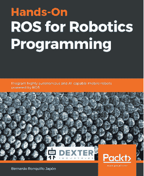
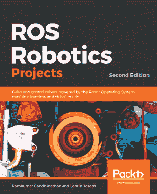

# 第二十四章：你可能还会喜欢的其他书籍

如果你喜欢这本书，你可能对 Packt 出版的以下其他书籍感兴趣：

**动手实践 ROS 机器人编程**

Bernardo Ronquillo Japón

ISBN: 978-1-83855-130-8

+   掌握开发环境感知机器人的技能

+   了解你的机器人在物理环境中的反应

+   将所需的行为分解为一系列机器人动作

+   将来自传感器的数据与上下文相关联以产生适应性响应

+   应用强化学习使你的机器人能够通过试错来学习

+   实施深度学习以使你的机器人能够识别其周围环境

**ROS 机器人项目 - 第二版**

Ramkumar Gandhinathan, Lentin Joseph

ISBN: 978-1-83864-932-6

+   掌握 ROS 的基础知识并了解 ROS 的应用

+   揭示 ROS-2 与 ROS-1 的不同之处

+   使用状态机处理复杂的机器人任务

+   与多个机器人通信并与之协作构建应用程序

+   使用最新的嵌入式板，如 Tinker Board S 和 Jetson Nano 探索 ROS 的功能

+   了解机器学习和深度学习技术在 ROS 中的应用

+   使用 ROS 构建一辆自动驾驶汽车

+   使用 Leap Motion 和 VR 头盔远程操作你的机器人

# 留下评论 - 让其他读者了解你的看法

请通过在购买书籍的网站上留下评论的方式与其他人分享你对这本书的看法。如果你从亚马逊购买了这本书，请在本书的亚马逊页面上留下一个诚实的评论。这对其他潜在读者来说至关重要，他们可以通过你的无偏见意见来做出购买决定，我们也可以了解客户对我们产品的看法，我们的作者也可以看到他们与 Packt 合作创作的标题的反馈。这只需要你几分钟的时间，但对其他潜在客户、我们的作者和 Packt 来说都非常有价值。谢谢！

## 目录

1.  [学习机器人编程](B15660_FM_Final_ASB_ePub.xhtml#_idParaDest-1)

1.  [第二版](B15660_FM_Final_ASB_ePub.xhtml#_idParaDest-2)

1.  [为什么订阅？](B15660_FM_Final_ASB_ePub.xhtml#_idParaDest-3)

1.  [贡献者](B15660_FM_Final_ASB_ePub.xhtml#_idParaDest-4)

1.  [关于作者](B15660_FM_Final_ASB_ePub.xhtml#_idParaDest-5)

1.  [关于审稿人](B15660_FM_Final_ASB_ePub.xhtml#_idParaDest-6)

1.  [Packt 正在寻找像你这样的作者](B15660_FM_Final_ASB_ePub.xhtml#_idParaDest-7)

1.  [前言](B15660_Preface_Final_ASB_ePub.xhtml#_idParaDest-8)

    1.  [本书面向的对象](B15660_Preface_Final_ASB_ePub.xhtml#_idParaDest-9)

    1.  [本书涵盖的内容](B15660_Preface_Final_ASB_ePub.xhtml#_idParaDest-10)

    1.  [如何充分利用本书](B15660_Preface_Final_ASB_ePub.xhtml#_idParaDest-11)

    1.  [下载示例代码文件](B15660_Preface_Final_ASB_ePub.xhtml#_idParaDest-12)

    1.  [代码实战](B15660_Preface_Final_ASB_ePub.xhtml#_idParaDest-13)

    1.  [下载彩色图像](B15660_Preface_Final_ASB_ePub.xhtml#_idParaDest-14)

    1.  [使用的约定](B15660_Preface_Final_ASB_ePub.xhtml#_idParaDest-15)

    1.  [取得联系](B15660_Preface_Final_ASB_ePub.xhtml#_idParaDest-16)

    1.  [评论](B15660_Preface_Final_ASB_ePub.xhtml#_idParaDest-17)

1.  [第1节：基础知识 - 准备机器人](B15660_Section_1_Final_ASB_ePub.xhtml#_idParaDest-18)

1.  [第1章：机器人简介](B15660_01_Final_ASB_ePub.xhtml#_idParaDest-19)

    1.  [机器人是什么意思？](B15660_01_Final_ASB_ePub.xhtml#_idParaDest-20)

    1.  [探索高级且令人印象深刻的机器人](B15660_01_Final_ASB_ePub.xhtml#_idParaDest-21)

        1.  [火星漫游车](B15660_01_Final_ASB_ePub.xhtml#_idParaDest-22)

    1.  [发现家中的机器人](B15660_01_Final_ASB_ePub.xhtml#_idParaDest-23)

        1.  [洗衣机](B15660_01_Final_ASB_ePub.xhtml#_idParaDest-24)

        1.  [其他家用机器人](B15660_01_Final_ASB_ePub.xhtml#_idParaDest-25)

    1.  [探索工业中的机器人](B15660_01_Final_ASB_ePub.xhtml#_idParaDest-26)

        1.  [机器人手臂](B15660_01_Final_ASB_ePub.xhtml#_idParaDest-27)

        1.  [仓库机器人](B15660_01_Final_ASB_ePub.xhtml#_idParaDest-28)

    1.  [竞技、教育和业余机器人](B15660_01_Final_ASB_ePub.xhtml#_idParaDest-29)

    1.  [摘要](B15660_01_Final_ASB_ePub.xhtml#_idParaDest-30)

    1.  [评估](B15660_01_Final_ASB_ePub.xhtml#_idParaDest-31)

    1.  [进一步阅读](B15660_01_Final_ASB_ePub.xhtml#_idParaDest-32)

1.  [第2章：探索机器人构建模块 - 代码和电子](B15660_02_Final_ASB_ePub.xhtml#_idParaDest-33)

    1.  [技术要求](B15660_02_Final_ASB_ePub.xhtml#_idParaDest-34)

    1.  [看看机器人内部是什么](B15660_02_Final_ASB_ePub.xhtml#_idParaDest-35)

    1.  [探索机器人组件的类型](B15660_02_Final_ASB_ePub.xhtml#_idParaDest-36)

        1.  [电机的类型](B15660_02_Final_ASB_ePub.xhtml#_idParaDest-37)

        1.  [其他类型的执行器](B15660_02_Final_ASB_ePub.xhtml#_idParaDest-38)

        1.  [状态指示器 - 显示屏、灯光和声音](B15660_02_Final_ASB_ePub.xhtml#_idParaDest-39)

        1.  [传感器的类型](B15660_02_Final_ASB_ePub.xhtml#_idParaDest-40)

    1.  [探索控制器和 I/O](B15660_02_Final_ASB_ePub.xhtml#_idParaDest-41)

        1.  [I/O 引脚](B15660_02_Final_ASB_ePub.xhtml#_idParaDest-42)

        1.  [控制器](B15660_02_Final_ASB_ePub.xhtml#_idParaDest-43)

        1.  [选择树莓派](B15660_02_Final_ASB_ePub.xhtml#_idParaDest-44)

    1.  [规划组件和代码结构](B15660_02_Final_ASB_ePub.xhtml#_idParaDest-45)

    1.  [规划物理机器人](B15660_02_Final_ASB_ePub.xhtml#_idParaDest-46)

    1.  [摘要](B15660_02_Final_ASB_ePub.xhtml#_idParaDest-47)

    1.  [练习](B15660_02_Final_ASB_ePub.xhtml#_idParaDest-48)

    1.  [进一步阅读](B15660_02_Final_ASB_ePub.xhtml#_idParaDest-49)

1.  [第3章：探索树莓派](B15660_03_Final_ASB_ePub.xhtml#_idParaDest-50)

    1.  [技术要求](B15660_03_Final_ASB_ePub.xhtml#_idParaDest-51)

    1.  [探索树莓派的能力](B15660_03_Final_ASB_ePub.xhtml#_idParaDest-52)

        1.  [速度和功率](B15660_03_Final_ASB_ePub.xhtml#_idParaDest-53)

        1.  [连接性和网络](B15660_03_Final_ASB_ePub.xhtml#_idParaDest-54)

        1.  [选择 Raspberry Pi 3A+](B15660_03_Final_ASB_ePub.xhtml#_idParaDest-55)

    1.  [选择连接](B15660_03_Final_ASB_ePub.xhtml#_idParaDest-56)

        1.  [电源引脚](B15660_03_Final_ASB_ePub.xhtml#_idParaDest-57)

            1.  [数据总线](B15660_03_Final_ASB_ePub.xhtml#_idParaDest-58)

            1.  [通用 IO](B15660_03_Final_ASB_ePub.xhtml#_idParaDest-59)

        1.  [Raspberry Pi HATs](B15660_03_Final_ASB_ePub.xhtml#_idParaDest-60)

    1.  [什么是 Raspberry Pi OS？](B15660_03_Final_ASB_ePub.xhtml#_idParaDest-61)

    1.  [使用 Raspberry Pi OS 准备 SD 卡](B15660_03_Final_ASB_ePub.xhtml#_idParaDest-62)

    1.  [总结](B15660_03_Final_ASB_ePub.xhtml#_idParaDest-63)

    1.  [评估](B15660_03_Final_ASB_ePub.xhtml#_idParaDest-64)

    1.  [进一步阅读](B15660_03_Final_ASB_ePub.xhtml#_idParaDest-65)

1.  [第 4 章：为机器人准备无头 Raspberry Pi](B15660_04_Final_ASB_ePub.xhtml#_idParaDest-66)

    1.  [技术要求](B15660_04_Final_ASB_ePub.xhtml#_idParaDest-67)

    1.  [什么是无头系统，为什么它在机器人中很有用？](B15660_04_Final_ASB_ePub.xhtml#_idParaDest-68)

    1.  [在 Raspberry Pi 上设置 Wi-Fi 并启用 SSH](B15660_04_Final_ASB_ePub.xhtml#_idParaDest-69)

    1.  [在网络中找到您的 Pi](B15660_04_Final_ASB_ePub.xhtml#_idParaDest-70)

        1.  [在 Microsoft Windows 上设置 Bonjour](B15660_04_Final_ASB_ePub.xhtml#_idParaDest-71)

        1.  [测试设置](B15660_04_Final_ASB_ePub.xhtml#_idParaDest-72)

        1.  [故障排除](B15660_04_Final_ASB_ePub.xhtml#_idParaDest-73)

    1.  [使用 PuTTY 或 SSH 连接到您的 Raspberry Pi](B15660_04_Final_ASB_ePub.xhtml#_idParaDest-74)

    1.  [配置 Raspberry Pi OS](B15660_04_Final_ASB_ePub.xhtml#_idParaDest-75)

        1.  [重命名您的 Pi](B15660_04_Final_ASB_ePub.xhtml#_idParaDest-76)

        1.  [保护您的 Pi（一点）](B15660_04_Final_ASB_ePub.xhtml#_idParaDest-77)

        1.  [重启和重新连接](B15660_04_Final_ASB_ePub.xhtml#_idParaDest-78)

        1.  [更新您的 Raspberry Pi 上的软件](B15660_04_Final_ASB_ePub.xhtml#_idParaDest-79)

        1.  [关闭您的 Raspberry Pi](B15660_04_Final_ASB_ePub.xhtml#_idParaDest-80)

    1.  [总结](B15660_04_Final_ASB_ePub.xhtml#_idParaDest-81)

    1.  [评估](B15660_04_Final_ASB_ePub.xhtml#_idParaDest-82)

    1.  [进一步阅读](B15660_04_Final_ASB_ePub.xhtml#_idParaDest-83)

1.  [第 5 章：使用 Git 和 SD 卡副本备份代码](B15660_05_Final_ASB_ePub.xhtml#_idParaDest-84)

    1.  [技术要求](B15660_05_Final_ASB_ePub.xhtml#_idParaDest-85)

    1.  [理解代码如何被破解或丢失](B15660_05_Final_ASB_ePub.xhtml#_idParaDest-86)

        1.  [SD 卡数据丢失和损坏](B15660_05_Final_ASB_ePub.xhtml#_idParaDest-87)

        1.  [代码或配置的更改](B15660_05_Final_ASB_ePub.xhtml#_idParaDest-88)

    1.  [策略 1 – 在 PC 上保留代码并上传](B15660_05_Final_ASB_ePub.xhtml#_idParaDest-89)

    1.  [策略 2 – 使用 Git 回到过去](B15660_05_Final_ASB_ePub.xhtml#_idParaDest-90)

    1.  [策略3 – 制作SD卡备份](B15660_05_Final_ASB_ePub.xhtml#_idParaDest-91)

        1.  [Windows](B15660_05_Final_ASB_ePub.xhtml#_idParaDest-92)

        1.  [Mac](B15660_05_Final_ASB_ePub.xhtml#_idParaDest-93)

        1.  [Linux](B15660_05_Final_ASB_ePub.xhtml#_idParaDest-94)

    1.  [总结](B15660_05_Final_ASB_ePub.xhtml#_idParaDest-95)

    1.  [评估](B15660_05_Final_ASB_ePub.xhtml#_idParaDest-96)

    1.  [进一步阅读](B15660_05_Final_ASB_ePub.xhtml#_idParaDest-97)

1.  [第2节：构建自主机器人 – 将传感器和电机连接到树莓派](B15660_Section_2_Final_ASB_ePub.xhtml#_idParaDest-98)

1.  [第6章：构建机器人基础 – 轮子、电源和布线](B15660_06_Final_ASB_ePub.xhtml#_idParaDest-99)

    1.  [技术要求](B15660_06_Final_ASB_ePub.xhtml#_idParaDest-100)

    1.  [选择机器人底盘套件](B15660_06_Final_ASB_ePub.xhtml#_idParaDest-101)

        1.  [尺寸](B15660_06_Final_ASB_ePub.xhtml#_idParaDest-102)

        1.  [轮子数量](B15660_06_Final_ASB_ePub.xhtml#_idParaDest-103)

        1.  [轮子和电机](B15660_06_Final_ASB_ePub.xhtml#_idParaDest-104)

        1.  [简单性](B15660_06_Final_ASB_ePub.xhtml#_idParaDest-105)

        1.  [成本](B15660_06_Final_ASB_ePub.xhtml#_idParaDest-106)

        1.  [结论](B15660_06_Final_ASB_ePub.xhtml#_idParaDest-107)

    1.  [选择电机控制器板](B15660_06_Final_ASB_ePub.xhtml#_idParaDest-108)

        1.  [集成级别](B15660_06_Final_ASB_ePub.xhtml#_idParaDest-109)

        1.  [引脚使用](B15660_06_Final_ASB_ePub.xhtml#_idParaDest-110)

        1.  [尺寸](B15660_06_Final_ASB_ePub.xhtml#_idParaDest-111)

        1.  [焊接](B15660_06_Final_ASB_ePub.xhtml#_idParaDest-112)

        1.  [电源输入](B15660_06_Final_ASB_ePub.xhtml#_idParaDest-113)

        1.  [连接器](B15660_06_Final_ASB_ePub.xhtml#_idParaDest-114)

        1.  [结论](B15660_06_Final_ASB_ePub.xhtml#_idParaDest-115)

    1.  [为机器人供电](B15660_06_Final_ASB_ePub.xhtml#_idParaDest-116)

    1.  [测试机器人适配](B15660_06_Final_ASB_ePub.xhtml#_idParaDest-117)

    1.  [组装底座](B15660_06_Final_ASB_ePub.xhtml#_idParaDest-118)

        1.  [安装编码器轮](B15660_06_Final_ASB_ePub.xhtml#_idParaDest-119)

        1.  [安装电机支架](B15660_06_Final_ASB_ePub.xhtml#_idParaDest-120)

            1.  [安装塑料电机支架](B15660_06_Final_ASB_ePub.xhtml#_idParaDest-121)

            1.  [安装金属电机支架](B15660_06_Final_ASB_ePub.xhtml#_idParaDest-122)

        1.  [添加万向轮](B15660_06_Final_ASB_ePub.xhtml#_idParaDest-123)

        1.  [安装轮子](B15660_06_Final_ASB_ePub.xhtml#_idParaDest-124)

        1.  [拉起电线](B15660_06_Final_ASB_ePub.xhtml#_idParaDest-125)

        1.  [安装树莓派](B15660_06_Final_ASB_ePub.xhtml#_idParaDest-126)

        1.  [添加电池](B15660_06_Final_ASB_ePub.xhtml#_idParaDest-127)

            1.  [设置USB移动电源](B15660_06_Final_ASB_ePub.xhtml#_idParaDest-128)

            1.  [安装AA电池夹](B15660_06_Final_ASB_ePub.xhtml#_idParaDest-129)

        1.  [完成的机器人底座](B15660_06_Final_ASB_ePub.xhtml#_idParaDest-130)

    1.  [将电机连接到树莓派](B15660_06_Final_ASB_ePub.xhtml#_idParaDest-131)

        1.  [连接 Motor HAT](B15660_06_Final_ASB_ePub.xhtml#_idParaDest-132)

        1.  [独立电源](B15660_06_Final_ASB_ePub.xhtml#_idParaDest-133)

    1.  [总结](B15660_06_Final_ASB_ePub.xhtml#_idParaDest-134)

    1.  [练习](B15660_06_Final_ASB_ePub.xhtml#_idParaDest-135)

    1.  [进一步阅读](B15660_06_Final_ASB_ePub.xhtml#_idParaDest-136)

1.  [第7章：驱动和转向 – 使用Python移动电机](B15660_07_Final_ASB_ePub.xhtml#_idParaDest-137)

    1.  [技术要求](B15660_07_Final_ASB_ePub.xhtml#_idParaDest-138)

    1.  [编写代码测试你的电机](B15660_07_Final_ASB_ePub.xhtml#_idParaDest-139)

        1.  [准备库](B15660_07_Final_ASB_ePub.xhtml#_idParaDest-140)

        1.  [测试 – 找到 Motor HAT](B15660_07_Final_ASB_ePub.xhtml#_idParaDest-141)

        1.  [测试 – 展示电机移动](B15660_07_Final_ASB_ePub.xhtml#_idParaDest-142)

        1.  [故障排除](B15660_07_Final_ASB_ePub.xhtml#_idParaDest-143)

        1.  [理解代码的工作原理](B15660_07_Final_ASB_ePub.xhtml#_idParaDest-144)

    1.  [控制机器人](B15660_07_Final_ASB_ePub.xhtml#_idParaDest-145)

        1.  [转向类型](B15660_07_Final_ASB_ePub.xhtml#_idParaDest-146)

            1.  [可转向的车轮](B15660_07_Final_ASB_ePub.xhtml#_idParaDest-147)

            1.  [固定车轮](B15660_07_Final_ASB_ePub.xhtml#_idParaDest-148)

            1.  [其他转向系统](B15660_07_Final_ASB_ePub.xhtml#_idParaDest-149)

        1.  [控制我们正在构建的机器人](B15660_07_Final_ASB_ePub.xhtml#_idParaDest-150)

    1.  [制作机器人对象 – 我们实验中与机器人通信的代码](B15660_07_Final_ASB_ePub.xhtml#_idParaDest-151)

        1.  [为什么要制作这个物体？](B15660_07_Final_ASB_ePub.xhtml#_idParaDest-152)

        1.  [我们在机器人对象中放什么？](B15660_07_Final_ASB_ePub.xhtml#_idParaDest-153)

    1.  [编写脚本以跟随预定路径](B15660_07_Final_ASB_ePub.xhtml#_idParaDest-154)

    1.  [总结](B15660_07_Final_ASB_ePub.xhtml#_idParaDest-155)

    1.  [练习](B15660_07_Final_ASB_ePub.xhtml#_idParaDest-156)

    1.  [进一步阅读](B15660_07_Final_ASB_ePub.xhtml#_idParaDest-157)

1.  [第8章：使用Python编程距离传感器](B15660_08_Final_ASB_ePub.xhtml#_idParaDest-158)

    1.  [技术要求](B15660_08_Final_ASB_ePub.xhtml#_idParaDest-159)

    1.  [在光学和超声波传感器之间选择](B15660_08_Final_ASB_ePub.xhtml#_idParaDest-160)

        1.  [光学传感器](B15660_08_Final_ASB_ePub.xhtml#_idParaDest-161)

        1.  [超声波传感器](B15660_08_Final_ASB_ePub.xhtml#_idParaDest-162)

        1.  [逻辑电平和移位](B15660_08_Final_ASB_ePub.xhtml#_idParaDest-163)

        1.  [为什么使用两个传感器？](B15660_08_Final_ASB_ePub.xhtml#_idParaDest-164)

    1.  [连接并读取超声波传感器](B15660_08_Final_ASB_ePub.xhtml#_idParaDest-165)

        1.  [将传感器固定到机器人上](B15660_08_Final_ASB_ePub.xhtml#_idParaDest-166)

        1.  [添加电源开关](B15660_08_Final_ASB_ePub.xhtml#_idParaDest-167)

        1.  [连接距离传感器](B15660_08_Final_ASB_ePub.xhtml#_idParaDest-168)

        1.  [安装Python库以与传感器通信](B15660_08_Final_ASB_ePub.xhtml#_idParaDest-169)

        1.  [读取超声波距离传感器](B15660_08_Final_ASB_ePub.xhtml#_idParaDest-170)

        1.  [故障排除](B15660_08_Final_ASB_ePub.xhtml#_idParaDest-171)

    1.  [避免墙壁 - 编写脚本以避免障碍物](B15660_08_Final_ASB_ePub.xhtml#_idParaDest-172)

        1.  [将传感器添加到机器人类中](B15660_08_Final_ASB_ePub.xhtml#_idParaDest-173)

        1.  [制作避障行为](B15660_08_Final_ASB_ePub.xhtml#_idParaDest-174)

            1.  [第一次尝试避障](B15660_08_Final_ASB_ePub.xhtml#_idParaDest-175)

            1.  [更复杂的物体避障](B15660_08_Final_ASB_ePub.xhtml#_idParaDest-176)

    1.  [总结](B15660_08_Final_ASB_ePub.xhtml#_idParaDest-177)

    1.  [练习](B15660_08_Final_ASB_ePub.xhtml#_idParaDest-178)

    1.  [进一步阅读](B15660_08_Final_ASB_ePub.xhtml#_idParaDest-179)

1.  [第9章：在Python中编程RGB灯带](B15660_09_Final_ASB_ePub.xhtml#_idParaDest-180)

    1.  [技术要求](B15660_09_Final_ASB_ePub.xhtml#_idParaDest-181)

    1.  [什么是RGB灯带？](B15660_09_Final_ASB_ePub.xhtml#_idParaDest-182)

    1.  [比较光带技术](B15660_09_Final_ASB_ePub.xhtml#_idParaDest-183)

        1.  [RGB值](B15660_09_Final_ASB_ePub.xhtml#_idParaDest-184)

    1.  [将光带连接到Raspberry Pi上](B15660_09_Final_ASB_ePub.xhtml#_idParaDest-185)

        1.  [将LED灯带连接到机器人上](B15660_09_Final_ASB_ePub.xhtml#_idParaDest-186)

    1.  [使机器人显示代码对象](B15660_09_Final_ASB_ePub.xhtml#_idParaDest-187)

        1.  [制作LED接口](B15660_09_Final_ASB_ePub.xhtml#_idParaDest-188)

        1.  [将LED添加到机器人对象中](B15660_09_Final_ASB_ePub.xhtml#_idParaDest-189)

        1.  [测试一个LED](B15660_09_Final_ASB_ePub.xhtml#_idParaDest-190)

            1.  [故障排除](B15660_09_Final_ASB_ePub.xhtml#_idParaDest-191)

    1.  [使用LED制作彩虹显示](B15660_09_Final_ASB_ePub.xhtml#_idParaDest-192)

        1.  [色彩系统](B15660_09_Final_ASB_ePub.xhtml#_idParaDest-193)

            1.  [色调](B15660_09_Final_ASB_ePub.xhtml#_idParaDest-194)

            1.  [饱和度](B15660_09_Final_ASB_ePub.xhtml#_idParaDest-195)

            1.  [值](B15660_09_Final_ASB_ePub.xhtml#_idParaDest-196)

            1.  [将HSV转换为RGB](B15660_09_Final_ASB_ePub.xhtml#_idParaDest-197)

        1.  [在LED上制作彩虹](B15660_09_Final_ASB_ePub.xhtml#_idParaDest-198)

    1.  [使用光带调试避障行为](B15660_09_Final_ASB_ePub.xhtml#_idParaDest-199)

        1.  [将基本LED添加到避障行为中](B15660_09_Final_ASB_ePub.xhtml#_idParaDest-200)

        1.  [添加彩虹](B15660_09_Final_ASB_ePub.xhtml#_idParaDest-201)

    1.  [总结](B15660_09_Final_ASB_ePub.xhtml#_idParaDest-202)

    1.  [练习](B15660_09_Final_ASB_ePub.xhtml#_idParaDest-203)

    1.  [进一步阅读](B15660_09_Final_ASB_ePub.xhtml#_idParaDest-204)

1.  [第10章：使用Python控制伺服电机](B15660_10_Final_ASB_ePub.xhtml#_idParaDest-205)

    1.  [技术要求](B15660_10_Final_ASB_ePub.xhtml#_idParaDest-206)

    1.  [伺服电机是什么？](B15660_10_Final_ASB_ePub.xhtml#_idParaDest-207)

        1.  [查看伺服电机内部](B15660_10_Final_ASB_ePub.xhtml#_idParaDest-208)

        1.  [向伺服电机发送输入位置](B15660_10_Final_ASB_ePub.xhtml#_idParaDest-209)

    1.  [使用Raspberry Pi定位伺服电机](B15660_10_Final_ASB_ePub.xhtml#_idParaDest-210)

        1.  [编写控制伺服的代码](B15660_10_Final_ASB_ePub.xhtml#_idParaDest-211)

        1.  [故障排除](B15660_10_Final_ASB_ePub.xhtml#_idParaDest-212)

        1.  [控制直流电机和伺服电机](B15660_10_Final_ASB_ePub.xhtml#_idParaDest-213)

        1.  [校准伺服](B15660_10_Final_ASB_ePub.xhtml#_idParaDest-214)

    1.  [添加俯仰和倾斜机构](B15660_10_Final_ASB_ePub.xhtml#_idParaDest-215)

        1.  [构建套件](B15660_10_Final_ASB_ePub.xhtml#_idParaDest-216)

        1.  [将俯仰和倾斜机构连接到机器人上](B15660_10_Final_ASB_ePub.xhtml#_idParaDest-217)

    1.  [创建俯仰和倾斜代码](B15660_10_Final_ASB_ePub.xhtml#_idParaDest-218)

        1.  [创建伺服对象](B15660_10_Final_ASB_ePub.xhtml#_idParaDest-219)

        1.  [将伺服添加到机器人类中](B15660_10_Final_ASB_ePub.xhtml#_idParaDest-220)

        1.  [环绕俯仰和倾斜头](B15660_10_Final_ASB_ePub.xhtml#_idParaDest-221)

        1.  [运行程序](B15660_10_Final_ASB_ePub.xhtml#_idParaDest-222)

        1.  [故障排除](B15660_10_Final_ASB_ePub.xhtml#_idParaDest-223)

    1.  [构建扫描声纳](B15660_10_Final_ASB_ePub.xhtml#_idParaDest-224)

        1.  [连接传感器](B15660_10_Final_ASB_ePub.xhtml#_idParaDest-225)

        1.  [安装库](B15660_10_Final_ASB_ePub.xhtml#_idParaDest-226)

        1.  [行为代码](B15660_10_Final_ASB_ePub.xhtml#_idParaDest-227)

            1.  [故障排除](B15660_10_Final_ASB_ePub.xhtml#_idParaDest-228)

    1.  [总结](B15660_10_Final_ASB_ePub.xhtml#_idParaDest-229)

    1.  [练习](B15660_10_Final_ASB_ePub.xhtml#_idParaDest-230)

    1.  [进一步阅读](B15660_10_Final_ASB_ePub.xhtml#_idParaDest-231)

1.  [第11章：使用Python编程编码器](B15660_11_Final_ASB_ePub.xhtml#_idParaDest-232)

    1.  [技术要求](B15660_11_Final_ASB_ePub.xhtml#_idParaDest-233)

    1.  [使用编码器测量行驶距离](B15660_11_Final_ASB_ePub.xhtml#_idParaDest-234)

        1.  [机器使用编码器的位置](B15660_11_Final_ASB_ePub.xhtml#_idParaDest-235)

        1.  [编码器的类型](B15660_11_Final_ASB_ePub.xhtml#_idParaDest-236)

        1.  [编码绝对或相对位置](B15660_11_Final_ASB_ePub.xhtml#_idParaDest-237)

        1.  [编码方向和速度](B15660_11_Final_ASB_ePub.xhtml#_idParaDest-238)

        1.  [我们使用的编码器](B15660_11_Final_ASB_ePub.xhtml#_idParaDest-239)

    1.  [将编码器连接到机器人上](B15660_11_Final_ASB_ePub.xhtml#_idParaDest-240)

        1.  [准备编码器](B15660_11_Final_ASB_ePub.xhtml#_idParaDest-241)

        1.  [抬起Raspberry Pi](B15660_11_Final_ASB_ePub.xhtml#_idParaDest-242)

        1.  [将编码器安装到车架上](B15660_11_Final_ASB_ePub.xhtml#_idParaDest-243)

        1.  [将编码器连接到Raspberry Pi](B15660_11_Final_ASB_ePub.xhtml#_idParaDest-244)

    1.  [在Python中检测行驶距离](B15660_11_Final_ASB_ePub.xhtml#_idParaDest-245)

        1.  [介绍日志记录](B15660_11_Final_ASB_ePub.xhtml#_idParaDest-246)

        1.  [简单计数](B15660_11_Final_ASB_ePub.xhtml#_idParaDest-247)

            1.  [故障排除](B15660_11_Final_ASB_ePub.xhtml#_idParaDest-248)

        1.  [将编码器添加到Robot对象中](B15660_11_Final_ASB_ePub.xhtml#_idParaDest-249)

            1.  [提取类](B15660_11_Final_ASB_ePub.xhtml#_idParaDest-250)

            1.  [将设备添加到Robot对象中](B15660_11_Final_ASB_ePub.xhtml#_idParaDest-251)

        1.  [将脉冲转换为毫米](B15660_11_Final_ASB_ePub.xhtml#_idParaDest-252)

    1.  [直线行驶](B15660_11_Final_ASB_ePub.xhtml#_idParaDest-253)

        1.  [使用PID纠正偏航](B15660_11_Final_ASB_ePub.xhtml#_idParaDest-254)

        1.  [创建Python PID控制器对象](B15660_11_Final_ASB_ePub.xhtml#_idParaDest-255)

        1.  [编写直线行驶的代码](B15660_11_Final_ASB_ePub.xhtml#_idParaDest-256)

        1.  [故障排除此行为](B15660_11_Final_ASB_ePub.xhtml#_idParaDest-257)

    1.  [驱动特定距离](B15660_11_Final_ASB_ePub.xhtml#_idParaDest-258)

        1.  [将单位转换重构到EncoderCounter类中](B15660_11_Final_ASB_ePub.xhtml#_idParaDest-259)

        1.  [设置常量](B15660_11_Final_ASB_ePub.xhtml#_idParaDest-260)

        1.  [创建驱动距离行为](B15660_11_Final_ASB_ePub.xhtml#_idParaDest-261)

    1.  [进行特定转向](B15660_11_Final_ASB_ePub.xhtml#_idParaDest-262)

        1.  [编写drive_arc函数](B15660_11_Final_ASB_ePub.xhtml#_idParaDest-263)

    1.  [总结](B15660_11_Final_ASB_ePub.xhtml#_idParaDest-264)

    1.  [练习](B15660_11_Final_ASB_ePub.xhtml#_idParaDest-265)

    1.  [进一步阅读](B15660_11_Final_ASB_ePub.xhtml#_idParaDest-266)

1.  [第12章：使用Python进行IMU编程](B15660_12_Final_ASB_ePub.xhtml#_idParaDest-267)

    1.  [技术要求](B15660_12_Final_ASB_ePub.xhtml#_idParaDest-268)

    1.  [了解更多关于IMU的信息](B15660_12_Final_ASB_ePub.xhtml#_idParaDest-269)

        1.  [建议的IMU模型](B15660_12_Final_ASB_ePub.xhtml#_idParaDest-270)

    1.  [焊接 – 将引脚连接到IMU](B15660_12_Final_ASB_ePub.xhtml#_idParaDest-271)

        1.  [制作焊接接头](B15660_12_Final_ASB_ePub.xhtml#_idParaDest-272)

    1.  [将IMU连接到机器人上](B15660_12_Final_ASB_ePub.xhtml#_idParaDest-273)

        1.  [物理放置](B15660_12_Final_ASB_ePub.xhtml#_idParaDest-274)

        1.  [将IMU连接到Raspberry Pi](B15660_12_Final_ASB_ePub.xhtml#_idParaDest-275)

    1.  [读取温度](B15660_12_Final_ASB_ePub.xhtml#_idParaDest-276)

        1.  [安装软件](B15660_12_Final_ASB_ePub.xhtml#_idParaDest-277)

        1.  [故障排除](B15660_12_Final_ASB_ePub.xhtml#_idParaDest-278)

        1.  [读取温度寄存器](B15660_12_Final_ASB_ePub.xhtml#_idParaDest-279)

            1.  [创建界面](B15660_12_Final_ASB_ePub.xhtml#_idParaDest-280)

            1.  [什么是VPython？](B15660_12_Final_ASB_ePub.xhtml#_idParaDest-281)

            1.  [绘制温度图](B15660_12_Final_ASB_ePub.xhtml#_idParaDest-282)

            1.  [运行温度绘图器](B15660_12_Final_ASB_ePub.xhtml#_idParaDest-283)

        1.  [故障排除](B15660_12_Final_ASB_ePub.xhtml#_idParaDest-284)

        1.  [简化VPython命令行](B15660_12_Final_ASB_ePub.xhtml#_idParaDest-285)

    1.  [在Python中读取陀螺仪](B15660_12_Final_ASB_ePub.xhtml#_idParaDest-286)

        1.  [理解陀螺仪](B15660_12_Final_ASB_ePub.xhtml#_idParaDest-287)

            1.  [表示坐标和旋转系统](B15660_12_Final_ASB_ePub.xhtml#_idParaDest-288)

        1.  [将陀螺仪添加到界面](B15660_12_Final_ASB_ePub.xhtml#_idParaDest-289)

        1.  [绘制陀螺仪](B15660_12_Final_ASB_ePub.xhtml#_idParaDest-290)

    1.  [在Python中读取加速度计](B15660_12_Final_ASB_ePub.xhtml#_idParaDest-291)

        1.  [理解加速度计](B15660_12_Final_ASB_ePub.xhtml#_idParaDest-292)

        1.  [将加速度计添加到界面](B15660_12_Final_ASB_ePub.xhtml#_idParaDest-293)

        1.  [以矢量形式显示加速度计](B15660_12_Final_ASB_ePub.xhtml#_idParaDest-294)

    1.  [与磁力计一起工作](B15660_12_Final_ASB_ePub.xhtml#_idParaDest-295)

        1.  [理解磁力计](B15660_12_Final_ASB_ePub.xhtml#_idParaDest-296)

        1.  [添加磁力计接口](B15660_12_Final_ASB_ePub.xhtml#_idParaDest-297)

        1.  [显示磁力计读数](B15660_12_Final_ASB_ePub.xhtml#_idParaDest-298)

    1.  [总结](B15660_12_Final_ASB_ePub.xhtml#_idParaDest-299)

    1.  [练习](B15660_12_Final_ASB_ePub.xhtml#_idParaDest-300)

    1.  [进一步阅读](B15660_12_Final_ASB_ePub.xhtml#_idParaDest-301)

1.  [第3节：听与看 – 为机器人提供智能传感器](B15660_Section_3_Final_ASB_ePub.xhtml#_idParaDest-302)

1.  [第13章：机器人视觉 – 使用Pi相机和OpenCV](B15660_13_Final_ASB_ePub.xhtml#_idParaDest-303)

    1.  [技术要求](B15660_13_Final_ASB_ePub.xhtml#_idParaDest-304)

    1.  [设置树莓派相机](B15660_13_Final_ASB_ePub.xhtml#_idParaDest-305)

        1.  [将相机连接到云台机构](B15660_13_Final_ASB_ePub.xhtml#_idParaDest-306)

        1.  [连接相机](B15660_13_Final_ASB_ePub.xhtml#_idParaDest-307)

    1.  [设置计算机视觉软件](B15660_13_Final_ASB_ePub.xhtml#_idParaDest-308)

        1.  [设置Pi相机软件](B15660_13_Final_ASB_ePub.xhtml#_idParaDest-309)

        1.  [从树莓派获取图片](B15660_13_Final_ASB_ePub.xhtml#_idParaDest-310)

        1.  [安装OpenCV和支持库](B15660_13_Final_ASB_ePub.xhtml#_idParaDest-311)

    1.  [构建树莓派相机流应用](B15660_13_Final_ASB_ePub.xhtml#_idParaDest-312)

        1.  [设计OpenCV相机服务器](B15660_13_Final_ASB_ePub.xhtml#_idParaDest-313)

        1.  [编写CameraStream对象](B15660_13_Final_ASB_ePub.xhtml#_idParaDest-314)

        1.  [编写图像服务器主应用](B15660_13_Final_ASB_ePub.xhtml#_idParaDest-315)

        1.  [构建模板](B15660_13_Final_ASB_ePub.xhtml#_idParaDest-316)

        1.  [运行服务器](B15660_13_Final_ASB_ePub.xhtml#_idParaDest-317)

        1.  [故障排除](B15660_13_Final_ASB_ePub.xhtml#_idParaDest-318)

    1.  [在流式传输时运行后台任务](B15660_13_Final_ASB_ePub.xhtml#_idParaDest-319)

        1.  [编写Web应用核心](B15660_13_Final_ASB_ePub.xhtml#_idParaDest-320)

            1.  [使行为可控](B15660_13_Final_ASB_ePub.xhtml#_idParaDest-321)

            1.  [制作控制模板](B15660_13_Final_ASB_ePub.xhtml#_idParaDest-322)

            1.  [运行可控图像服务器](B15660_13_Final_ASB_ePub.xhtml#_idParaDest-323)

    1.  [用Python跟踪彩色对象](B15660_13_Final_ASB_ePub.xhtml#_idParaDest-324)

        1.  [将图片转换为信息](B15660_13_Final_ASB_ePub.xhtml#_idParaDest-325)

        1.  [增强PID控制器](B15660_13_Final_ASB_ePub.xhtml#_idParaDest-326)

        1.  [编写行为组件](B15660_13_Final_ASB_ePub.xhtml#_idParaDest-327)

            1.  [编写控制模板](B15660_13_Final_ASB_ePub.xhtml#_idParaDest-328)

            1.  [编写行为代码](B15660_13_Final_ASB_ePub.xhtml#_idParaDest-329)

        1.  [运行行为](B15660_13_Final_ASB_ePub.xhtml#_idParaDest-330)

        1.  [故障排除](B15660_13_Final_ASB_ePub.xhtml#_idParaDest-331)

    1.  [用Python跟踪人脸](B15660_13_Final_ASB_ePub.xhtml#_idParaDest-332)

        1.  [在图像中查找对象](B15660_13_Final_ASB_ePub.xhtml#_idParaDest-333)

            1.  [转换为积分图像](B15660_13_Final_ASB_ePub.xhtml#_idParaDest-334)

            1.  [扫描基本特征](B15660_13_Final_ASB_ePub.xhtml#_idParaDest-335)

        1.  [规划我们的行为](B15660_13_Final_ASB_ePub.xhtml#_idParaDest-336)

        1.  [编写人脸追踪代码](B15660_13_Final_ASB_ePub.xhtml#_idParaDest-337)

        1.  [运行人脸追踪行为](B15660_13_Final_ASB_ePub.xhtml#_idParaDest-338)

        1.  [故障排除](B15660_13_Final_ASB_ePub.xhtml#_idParaDest-339)

    1.  [总结](B15660_13_Final_ASB_ePub.xhtml#_idParaDest-340)

    1.  [练习](B15660_13_Final_ASB_ePub.xhtml#_idParaDest-341)

    1.  [进一步阅读](B15660_13_Final_ASB_ePub.xhtml#_idParaDest-342)

1.  [第14章：使用Python进行线跟随](B15660_14_Final_ASB_ePub.xhtml#_idParaDest-343)

    1.  [技术要求](B15660_14_Final_ASB_ePub.xhtml#_idParaDest-344)

    1.  [线跟随简介](B15660_14_Final_ASB_ePub.xhtml#_idParaDest-345)

        1.  [什么是线跟随？](B15660_14_Final_ASB_ePub.xhtml#_idParaDest-346)

        1.  [工业应用](B15660_14_Final_ASB_ePub.xhtml#_idParaDest-347)

        1.  [线跟随的类型](B15660_14_Final_ASB_ePub.xhtml#_idParaDest-348)

    1.  [制作线跟随测试轨道](B15660_14_Final_ASB_ePub.xhtml#_idParaDest-349)

        1.  [准备测试轨道材料](B15660_14_Final_ASB_ePub.xhtml#_idParaDest-350)

        1.  [绘制线条](B15660_14_Final_ASB_ePub.xhtml#_idParaDest-351)

    1.  [跟随线计算机视觉管道](B15660_14_Final_ASB_ePub.xhtml#_idParaDest-352)

        1.  [相机线跟踪算法](B15660_14_Final_ASB_ePub.xhtml#_idParaDest-353)

        1.  [管道](B15660_14_Final_ASB_ePub.xhtml#_idParaDest-354)

    1.  [尝试使用测试图像进行计算机视觉](B15660_14_Final_ASB_ePub.xhtml#_idParaDest-355)

        1.  [为什么使用测试图像？](B15660_14_Final_ASB_ePub.xhtml#_idParaDest-356)

        1.  [捕获测试图像](B15660_14_Final_ASB_ePub.xhtml#_idParaDest-357)

        1.  [用Python编写代码查找线的边缘](B15660_14_Final_ASB_ePub.xhtml#_idParaDest-358)

        1.  [从边缘定位线条](B15660_14_Final_ASB_ePub.xhtml#_idParaDest-359)

        1.  [尝试没有清晰线条的测试图片](B15660_14_Final_ASB_ePub.xhtml#_idParaDest-360)

    1.  [使用PID算法进行循线](B15660_14_Final_ASB_ePub.xhtml#_idParaDest-361)

        1.  [创建行为流程图](B15660_14_Final_ASB_ePub.xhtml#_idParaDest-362)

        1.  [将时间添加到我们的PID控制器](B15660_14_Final_ASB_ePub.xhtml#_idParaDest-363)

        1.  [编写初始行为](B15660_14_Final_ASB_ePub.xhtml#_idParaDest-364)

        1.  [调整PID](B15660_14_Final_ASB_ePub.xhtml#_idParaDest-365)

        1.  [故障排除](B15660_14_Final_ASB_ePub.xhtml#_idParaDest-366)

    1.  [再次找到线条](B15660_14_Final_ASB_ePub.xhtml#_idParaDest-367)

    1.  [总结](B15660_14_Final_ASB_ePub.xhtml#_idParaDest-368)

    1.  [练习](B15660_14_Final_ASB_ePub.xhtml#_idParaDest-369)

    1.  [进一步阅读](B15660_14_Final_ASB_ePub.xhtml#_idParaDest-370)

1.  [第15章：使用Mycroft与机器人进行语音通信](B15660_15_Final_ASB_ePub.xhtml#_idParaDest-371)

    1.  [技术要求](B15660_15_Final_ASB_ePub.xhtml#_idParaDest-372)

    1.  [介绍Mycroft – 理解语音代理术语](B15660_15_Final_ASB_ePub.xhtml#_idParaDest-373)

        1.  [语音转文本](B15660_15_Final_ASB_ePub.xhtml#_idParaDest-374)

        1.  [唤醒词](B15660_15_Final_ASB_ePub.xhtml#_idParaDest-375)

        1.  [表述](B15660_15_Final_ASB_ePub.xhtml#_idParaDest-376)

        1.  [意图](B15660_15_Final_ASB_ePub.xhtml#_idParaDest-377)

        1.  [对话](B15660_15_Final_ASB_ePub.xhtml#_idParaDest-378)

        1.  [词汇](B15660_15_Final_ASB_ePub.xhtml#_idParaDest-379)

        1.  [技能](B15660_15_Final_ASB_ePub.xhtml#_idParaDest-380)

    1.  [在机器人上监听语音的限制](B15660_15_Final_ASB_ePub.xhtml#_idParaDest-381)

    1.  [将声音输入和输出添加到Raspberry Pi](B15660_15_Final_ASB_ePub.xhtml#_idParaDest-382)

        1.  [物理安装](B15660_15_Final_ASB_ePub.xhtml#_idParaDest-383)

        1.  [在Raspberry Pi上安装语音代理](B15660_15_Final_ASB_ePub.xhtml#_idParaDest-384)

        1.  [安装ReSpeaker软件](B15660_15_Final_ASB_ePub.xhtml#_idParaDest-385)

            1.  [故障排除](B15660_15_Final_ASB_ePub.xhtml#_idParaDest-386)

        1.  [让Mycroft与声卡通信](B15660_15_Final_ASB_ePub.xhtml#_idParaDest-387)

        1.  [开始使用Mycroft](B15660_15_Final_ASB_ePub.xhtml#_idParaDest-388)

            1.  [Mycroft客户端](B15660_15_Final_ASB_ePub.xhtml#_idParaDest-389)

            1.  [与Mycroft交谈](B15660_15_Final_ASB_ePub.xhtml#_idParaDest-390)

        1.  [故障排除](B15660_15_Final_ASB_ePub.xhtml#_idParaDest-391)

    1.  [编程Flask API](B15660_15_Final_ASB_ePub.xhtml#_idParaDest-392)

        1.  [Mycroft控制机器人的概述](B15660_15_Final_ASB_ePub.xhtml#_idParaDest-393)

        1.  [远程启动行为](B15660_15_Final_ASB_ePub.xhtml#_idParaDest-394)

            1.  [管理机器人模式](B15660_15_Final_ASB_ePub.xhtml#_idParaDest-395)

        1.  [编程Flask控制API服务器](B15660_15_Final_ASB_ePub.xhtml#_idParaDest-396)

        1.  [故障排除](B15660_15_Final_ASB_ePub.xhtml#_idParaDest-397)

    1.  [在树莓派上使用Mycroft编程语音代理](B15660_15_Final_ASB_ePub.xhtml#_idParaDest-398)

        1.  [构建意图](B15660_15_Final_ASB_ePub.xhtml#_idParaDest-399)

            1.  [设置文件](B15660_15_Final_ASB_ePub.xhtml#_idParaDest-400)

            1.  [需求文件](B15660_15_Final_ASB_ePub.xhtml#_idParaDest-401)

            1.  [创建词汇文件](B15660_15_Final_ASB_ePub.xhtml#_idParaDest-402)

            1.  [对话文件](B15660_15_Final_ASB_ePub.xhtml#_idParaDest-403)

            1.  [当前技能文件夹](B15660_15_Final_ASB_ePub.xhtml#_idParaDest-404)

        1.  [故障排除](B15660_15_Final_ASB_ePub.xhtml#_idParaDest-405)

        1.  [添加另一个意图](B15660_15_Final_ASB_ePub.xhtml#_idParaDest-406)

            1.  [词汇和对话](B15660_15_Final_ASB_ePub.xhtml#_idParaDest-407)

            1.  [添加代码](B15660_15_Final_ASB_ePub.xhtml#_idParaDest-408)

            1.  [使用新意图运行](B15660_15_Final_ASB_ePub.xhtml#_idParaDest-409)

    1.  [总结](B15660_15_Final_ASB_ePub.xhtml#_idParaDest-410)

    1.  [练习](B15660_15_Final_ASB_ePub.xhtml#_idParaDest-411)

    1.  [进一步阅读](B15660_15_Final_ASB_ePub.xhtml#_idParaDest-412)

1.  [第16章：使用IMU深入探索](B15660_16_Final_ASB_ePub.xhtml#_idParaDest-413)

    1.  [技术要求](B15660_16_Final_ASB_ePub.xhtml#_idParaDest-414)

    1.  [编程虚拟机器人](B15660_16_Final_ASB_ePub.xhtml#_idParaDest-415)

        1.  [在VPython中建模机器人](B15660_16_Final_ASB_ePub.xhtml#_idParaDest-416)

            1.  [故障排除](B15660_16_Final_ASB_ePub.xhtml#_idParaDest-417)

    1.  [使用陀螺仪检测旋转](B15660_16_Final_ASB_ePub.xhtml#_idParaDest-418)

        1.  [校准陀螺仪](B15660_16_Final_ASB_ePub.xhtml#_idParaDest-419)

        1.  [使用陀螺仪旋转虚拟机器人](B15660_16_Final_ASB_ePub.xhtml#_idParaDest-420)

            1.  [故障排除](B15660_16_Final_ASB_ePub.xhtml#_idParaDest-421)

    1.  [使用加速度计检测俯仰和滚转](B15660_16_Final_ASB_ePub.xhtml#_idParaDest-422)

        1.  [从加速度计向量获取俯仰和滚转](B15660_16_Final_ASB_ePub.xhtml#_idParaDest-423)

            1.  [故障排除](B15660_16_Final_ASB_ePub.xhtml#_idParaDest-424)

        1.  [平滑加速度计](B15660_16_Final_ASB_ePub.xhtml#_idParaDest-425)

            1.  [delta时间](B15660_16_Final_ASB_ePub.xhtml#_idParaDest-426)

        1.  [融合加速度计和陀螺仪数据](B15660_16_Final_ASB_ePub.xhtml#_idParaDest-427)

            1.  [故障排除](B15660_16_Final_ASB_ePub.xhtml#_idParaDest-428)

    1.  [使用磁力计检测航向](B15660_16_Final_ASB_ePub.xhtml#_idParaDest-429)

        1.  [校准磁力计](B15660_16_Final_ASB_ePub.xhtml#_idParaDest-430)

            1.  [故障排除](B15660_16_Final_ASB_ePub.xhtml#_idParaDest-431)

            1.  [测试校准值](B15660_16_Final_ASB_ePub.xhtml#_idParaDest-432)

            1.  [如果圆圈没有在一起时该怎么做](B15660_16_Final_ASB_ePub.xhtml#_idParaDest-433)

    1.  [从磁力计获取粗略航向](B15660_16_Final_ASB_ePub.xhtml#_idParaDest-434)

    1.  [结合传感器进行定位](B15660_16_Final_ASB_ePub.xhtml#_idParaDest-435)

        1.  [解决180度问题](B15660_16_Final_ASB_ePub.xhtml#_idParaDest-436)

    1.  [从IMU数据驾驶机器人](B15660_16_Final_ASB_ePub.xhtml#_idParaDest-437)

    1.  [总结](B15660_16_Final_ASB_ePub.xhtml#_idParaDest-438)

    1.  [练习](B15660_16_Final_ASB_ePub.xhtml#_idParaDest-439)

    1.  [进一步阅读](B15660_16_Final_ASB_ePub.xhtml#_idParaDest-440)

1.  [第17章：使用手机和Python控制机器人](B15660_17_Final_ASB_ePub.xhtml#_idParaDest-441)

    1.  [技术要求](B15660_17_Final_ASB_ePub.xhtml#_idParaDest-442)

    1.  [当语音控制不起作用时——为什么我们需要驾驶](B15660_17_Final_ASB_ePub.xhtml#_idParaDest-443)

    1.  [菜单模式 – 选择机器人的行为](B15660_17_Final_ASB_ePub.xhtml#_idParaDest-444)

        1.  [管理机器人模式](B15660_17_Final_ASB_ePub.xhtml#_idParaDest-445)

        1.  [故障排除](B15660_17_Final_ASB_ePub.xhtml#_idParaDest-446)

        1.  [网络服务](B15660_17_Final_ASB_ePub.xhtml#_idParaDest-447)

        1.  [模板](B15660_17_Final_ASB_ePub.xhtml#_idParaDest-448)

        1.  [运行它](B15660_17_Final_ASB_ePub.xhtml#_idParaDest-449)

        1.  [故障排除](B15660_17_Final_ASB_ePub.xhtml#_idParaDest-450)

    1.  [选择控制器——我们将如何驾驶机器人，以及为什么](B15660_17_Final_ASB_ePub.xhtml#_idParaDest-451)

        1.  [设计和概述](B15660_17_Final_ASB_ePub.xhtml#_idParaDest-452)

    1.  [为远程驾驶准备树莓派——启动基本驾驶系统](B15660_17_Final_ASB_ePub.xhtml#_idParaDest-453)

        1.  [增强图像应用核心](B15660_17_Final_ASB_ePub.xhtml#_idParaDest-454)

        1.  [编写手动驾驶行为](B15660_17_Final_ASB_ePub.xhtml#_idParaDest-455)

        1.  [模板（网页）](B15660_17_Final_ASB_ePub.xhtml#_idParaDest-456)

        1.  [样式表](B15660_17_Final_ASB_ePub.xhtml#_idParaDest-457)

        1.  [创建滑块的代码](B15660_17_Final_ASB_ePub.xhtml#_idParaDest-458)

        1.  [运行此程序](B15660_17_Final_ASB_ePub.xhtml#_idParaDest-459)

        1.  [故障排除](B15660_17_Final_ASB_ePub.xhtml#_idParaDest-460)

    1.  [使机器人完全可通过手机操作](B15660_17_Final_ASB_ePub.xhtml#_idParaDest-461)

        1.  [使菜单模式与Flask行为兼容](B15660_17_Final_ASB_ePub.xhtml#_idParaDest-462)

        1.  [加载视频服务](B15660_17_Final_ASB_ePub.xhtml#_idParaDest-463)

        1.  [美化菜单](B15660_17_Final_ASB_ePub.xhtml#_idParaDest-464)

            1.  [将菜单模板转换为按钮](B15660_17_Final_ASB_ePub.xhtml#_idParaDest-465)

    1.  [使菜单在Pi启动时启动](B15660_17_Final_ASB_ePub.xhtml#_idParaDest-466)

        1.  [向菜单服务器添加灯光](B15660_17_Final_ASB_ePub.xhtml#_idParaDest-467)

        1.  [使用systemd自动启动机器人](B15660_17_Final_ASB_ePub.xhtml#_idParaDest-468)

            1.  [故障排除](B15660_17_Final_ASB_ePub.xhtml#_idParaDest-469)

    1.  [总结](B15660_17_Final_ASB_ePub.xhtml#_idParaDest-470)

    1.  [练习](B15660_17_Final_ASB_ePub.xhtml#_idParaDest-471)

    1.  [进一步阅读](B15660_17_Final_ASB_ePub.xhtml#_idParaDest-472)

1.  [第4节：将机器人技术进一步发展](B15660_Section_4_Final_ASB_ePub.xhtml#_idParaDest-473)

1.  [第18章：进一步提升你的机器人编程技能](B15660_18_Final_ASB_ePub.xhtml#_idParaDest-474)

    1.  [在线机器人构建社区 - 论坛和社交媒体](B15660_18_Final_ASB_ePub.xhtml#_idParaDest-475)

        1.  [了解的YouTube频道](B15660_18_Final_ASB_ePub.xhtml#_idParaDest-476)

        1.  [技术问题 - 哪里可以获得帮助](B15660_18_Final_ASB_ePub.xhtml#_idParaDest-477)

    1.  [遇见机器人构建者 - 竞赛、创客空间和聚会](B15660_18_Final_ASB_ePub.xhtml#_idParaDest-478)

        1.  [创客空间](B15660_18_Final_ASB_ePub.xhtml#_idParaDest-479)

        1.  [创客市集、树莓派聚会和道场](B15660_18_Final_ASB_ePub.xhtml#_idParaDest-480)

        1.  [竞赛](B15660_18_Final_ASB_ePub.xhtml#_idParaDest-481)

    1.  [进一步技能的建议 - 3D打印、焊接、PCB和CNC](B15660_18_Final_ASB_ePub.xhtml#_idParaDest-482)

        1.  [设计技能](B15660_18_Final_ASB_ePub.xhtml#_idParaDest-483)

            1.  [用于说明和图表的2D设计](B15660_18_Final_ASB_ePub.xhtml#_idParaDest-484)

            1.  [3D CAD](B15660_18_Final_ASB_ePub.xhtml#_idParaDest-485)

        1.  [塑造和构建的技能](B15660_18_Final_ASB_ePub.xhtml#_idParaDest-486)

            1.  [机械技能和工具](B15660_18_Final_ASB_ePub.xhtml#_idParaDest-487)

            1.  [手工艺技能和工具](B15660_18_Final_ASB_ePub.xhtml#_idParaDest-488)

        1.  [电子技能](B15660_18_Final_ASB_ePub.xhtml#_idParaDest-489)

            1.  [电子原理](B15660_18_Final_ASB_ePub.xhtml#_idParaDest-490)

            1.  [进一步学习焊接](B15660_18_Final_ASB_ePub.xhtml#_idParaDest-491)

            1.  [自定义电路](B15660_18_Final_ASB_ePub.xhtml#_idParaDest-492)

    1.  [在计算机视觉方面获取更多信息](B15660_18_Final_ASB_ePub.xhtml#_idParaDest-493)

        1.  [书籍](B15660_18_Final_ASB_ePub.xhtml#_idParaDest-494)

        1.  [在线课程](B15660_18_Final_ASB_ePub.xhtml#_idParaDest-495)

        1.  [社交媒体](B15660_18_Final_ASB_ePub.xhtml#_idParaDest-496)

    1.  [扩展到机器学习](B15660_18_Final_ASB_ePub.xhtml#_idParaDest-497)

        1.  [机器人操作系统](B15660_18_Final_ASB_ePub.xhtml#_idParaDest-498)

    1.  [总结](B15660_18_Final_ASB_ePub.xhtml#_idParaDest-499)

    1.  [进一步阅读](B15660_18_Final_ASB_ePub.xhtml#_idParaDest-500)

1.  [第19章：规划你的下一个机器人项目 - 整合所有元素](B15660_19_Final_ASB_ePub.xhtml#_idParaDest-501)

    1.  [技术要求](B15660_19_Final_ASB_ePub.xhtml#_idParaDest-502)

    1.  [可视化你的下一个机器人](B15660_19_Final_ASB_ePub.xhtml#_idParaDest-503)

    1.  [制作框图](B15660_19_Final_ASB_ePub.xhtml#_idParaDest-504)

    1.  [选择零件](B15660_19_Final_ASB_ePub.xhtml#_idParaDest-505)

        1.  [测试装配图](B15660_19_Final_ASB_ePub.xhtml#_idParaDest-506)

            1.  [购买零件](B15660_19_Final_ASB_ePub.xhtml#_idParaDest-507)

            1.  [组装你的机器人](B15660_19_Final_ASB_ePub.xhtml#_idParaDest-508)

    1.  [为机器人编写代码的规划](B15660_19_Final_ASB_ePub.xhtml#_idParaDest-509)

        1.  [系统层](B15660_19_Final_ASB_ePub.xhtml#_idParaDest-510)

            1.  [数据流图](B15660_19_Final_ASB_ePub.xhtml#_idParaDest-511)

            1.  [正式图表](B15660_19_Final_ASB_ePub.xhtml#_idParaDest-512)

            1.  [编程机器人](B15660_19_Final_ASB_ePub.xhtml#_idParaDest-513)

    1.  [让世界知道](B15660_19_Final_ASB_ePub.xhtml#_idParaDest-514)

    1.  [摘要](B15660_19_Final_ASB_ePub.xhtml#_idParaDest-515)

1.  [你可能喜欢的其他书籍](B15660_BackMatter_Final_ASB_ePub.xhtml#_idParaDest-516)

    1.  [留下评论 - 让其他读者了解你的想法](B15660_BackMatter_Final_ASB_ePub.xhtml#_idParaDest-517)

## 地标

1.  [封面](Images/cover.xhtml)

1.  [目录](B15660_TOC_Final_ASB_ePub.xhtml#_idContainer003)
