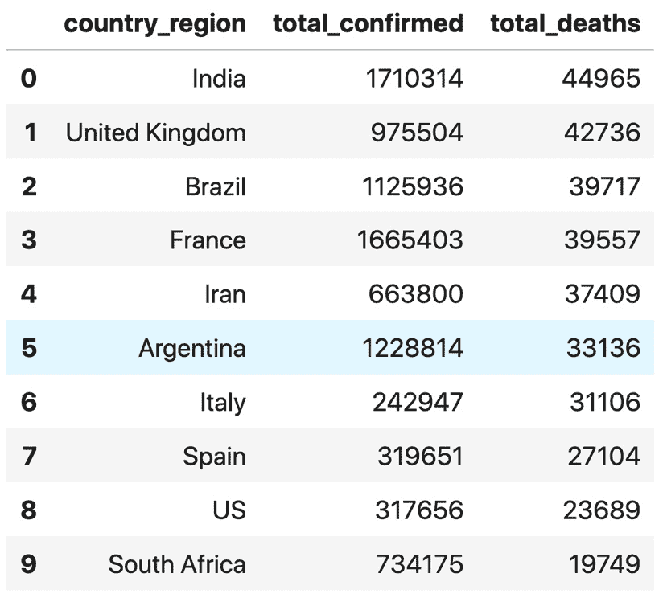

第二章：

# 第三章：在 Google AI 平台上运行 TensorFlow Enterprise

当前，TensorFlow Enterprise 发行版仅通过 Google Cloud AI 平台提供。本章将演示如何启动 AI 平台并将其用于 TensorFlow Enterprise。在 AI 平台中，TensorFlow Enterprise 可以通过各自的命令行工具以及简单的 API 与 Cloud Storage 和 BigQuery 进行交互，从而加载源数据。本章将展示如何启动 AI 平台，并且演示开始使用 TensorFlow Enterprise 发行版的简便方法。

我们将涵盖以下主要内容：

+   设置笔记本环境

+   从 BigQuery 轻松提取参数化数据

# 设置笔记本环境

TensorFlow Enterprise 仅在由 Google Cloud 托管的 JupyterLab 环境中提供。使用此 TensorFlow 发行版，有三种方式可以使用 JupyterLab：**Google Cloud** **AI 平台笔记本**，**Google Cloud** **深度学习虚拟机镜像（DLVM）**，以及在本地计算机上运行的**Google Cloud** **深度学习容器**（**Docker 镜像**）。无论您选择哪种方式，您将看到标准 JupyterLab 环境的相同界面，如下所示：


图 2.1 – JupyterLab 门户

那么，让我们来看看如何开始。

## AI 平台笔记本

这是开始使用 TensorFlow Enterprise 并使其在 Google Cloud 上运行的最简单、最不复杂的方式：

1.  只需进入 Google Cloud 门户，选择左侧面板中的**AI 平台**，然后选择**笔记本**选项：

    图 2.2 – AI 平台启动门户

1.  然后点击**新实例**，您将获得 TensorFlow Enterprise 的选择，可以选择**1.15**、**2.1**或**2.3**版本。您还可以选择使用一个**Tesla K4** GPU：

    图 2.3 – 在 AI 平台上创建新的笔记本实例

    对于本章中的示例，我们不需要使用 GPU。选择**无 GPU**即可。

1.  然后点击**创建**以接受默认节点选择，或点击**自定义**查看所有可用的设置选项：

    图 2.4 – 自定义计算实例

    在 AI 平台使用笔记本选项时，以下是可用的机器配置选择：

    

    图 2.5 – 可用的机器实例选项

    点击**创建**后，几分钟内笔记本实例将可用：

    

    图 2.6 – 实例上线并准备就绪

1.  当实例准备就绪时，**打开 JUPYTERLAB** 将被激活，您可以点击它。点击后会进入 JupyterLab 笔记本：


图 2.7 – JupyterLab 环境

我们将使用 Python 3 来展示所有示例。

## 深度学习虚拟机镜像

如果你希望有更多选项，例如不同的 GPU 选择，那么 DLVM 是更好的选择。你可能会发现以下参考资料有帮助：

+   [`cloud.google.com/ai-platform/deep-learning-vm/docs/quickstart-cli`](https://cloud.google.com/ai-platform/deep-learning-vm/docs/quickstart-cli)

+   [`cloud.google.com/ai-platform/deep-learning-vm/docs/quickstart-marketplace`](https://cloud.google.com/ai-platform/deep-learning-vm/docs/quickstart-marketplace)

按照以下步骤选择 DLVM：

1.  点击左侧面板中的 **市场**：

    图 2.8 – Google Cloud Platform 市场

1.  在查询框中搜索 `Deep Learning VM`，你将看到如下内容：

    图 2.9 – 启用 DLVM

    这里是你可以启动 DLVM 部署的地方。

1.  点击 **启动**，你将看到许多可用选项，包括 **机器类型**、**GPU 类型** 和 **GPU 数量**：

    图 2.10 – DLVM 配置门户

    此外，DLVM 除了 TensorFlow Enterprise 之外，还支持更多框架：

    

    图 2.11 – DLVM 和框架选项

1.  如果你选择其中一个 TensorFlow Enterprise 框架，然后点击

    **创建**，你将能够像之前一样访问 JupyterLab：


图 2.12 – JupyterLab 入口点

这是一个建议。为了最小化成本，完成工作后，停止实例非常重要。查看正在运行的实例的最快方式是选择左侧面板中的 **计算引擎**，然后选择 **VM 实例**：


图 2.13 – 订阅中的计算实例

从那里你将看到所有已创建的实例。完成后停止它们：


图 2.14 – 列出 VM 实例并管理其使用情况

用户有责任关注正在运行的实例。作为良好的实践，完成工作后，下载或提交你的笔记本以保存工作，并在不使用时删除实例。

## 深度学习容器 (DLC)

这是使用 TensorFlow Enterprise 的一种相对复杂的方式。使用此方法的一个重要原因是，在数据不存储在 Google Cloud 的情况下，你希望在本地或本地机器上运行 TensorFlow Enterprise。另一个原因是，对于企业使用，你可能希望将 DLC 作为基础 Docker 镜像来构建你自己的 Docker 镜像，以便为特定用途或在团队之间分发使用。这是运行 TensorFlow Enterprise 的方式，超出了 Google Cloud 的范围。由于它是一个 Docker 镜像，因此需要安装 Docker 引擎并运行守护进程。对 Docker 有一些基本了解将非常有帮助。你可以在[`console.cloud.google.com/gcr/images/deeplearning-platform-release`](https://console.cloud.google.com/gcr/images/deeplearning-platform-release)找到当前可用的 DLC 的完整列表。

目标是运行 TensorFlow Enterprise JupyterLab。但由于它是在本地计算机上运行，JupyterLab 的 URL 格式如下：

`localhost:<LOCAL_PORT>`

以下是我们可以如何实现这一目标（参考：[`cloud.google.com/ai-platform/deep-learning-containers/docs/getting-started-local`](https://cloud.google.com/ai-platform/deep-learning-containers/docs/getting-started-local)）：

1.  假设 Docker 守护进程正在运行，我们将执行以下命令来运行 TensorFlow Enterprise 容器：

    ```py
    docker run -d -p <LOCAL_PORT>:8080 -v <LOCAL_DIR>:/home <CONTAINER_REGISTRY>
    ```

    让我们通过以下表格了解前面命令的各个部分：

    

    ](img/Figure_2.15.jpg)

    图 2.15 – 解释运行 TensorFlow Enterprise 容器命令中的各个对象

    在前面的表格中，注意以下几点：

    +   `<LOCAL_PORT>` 指的是本地计算机上用于托管该 Docker 镜像实例的端口号。如果`8080`已被其他程序或进程占用，可以使用任何其他可用的端口号。

    +   `<LOCAL_DIR>` 是指存放训练数据和资产的顶级目录的路径。对于 Windows 机器，它可能是 `C:\Users\XXXX\Documents`。对于 Linux 或 Mac 机器，它可能是 `/home/XXXX/Documents`。

    +   `<CONTAINER_REGISTRY>` 是指 Docker 镜像在互联网上的位置，对于我们关心的 Docker 容器，它位于`gcr.io/deeplearning-platform-release/tf2-cpu.2-1`。

1.  将这些组合在一起形成一个命令，并从本地计算机的终端（如 Windows 命令提示符）运行：

    ```py
    8080 inside the Docker image. Notice that the preceding command maps local port 8080 to the Docker image's port 8080. The first 8080 is your local port, the second 8080 is the port number used by JupyterLab inside the Docker image environment. Again, the local port number doesn't have to be 8080.
    ```

1.  现在你可以通过浏览器访问本地端口：

    `localhost:8080`

    然后你将看到 JupyterLab 作为 Docker 容器运行，如下所示：

    

    图 2.16 – JupyterLab 在本地或本地环境中作为 Docker 镜像运行

    首先让我们看一下左侧面板。左侧面板显示了你指定为`<LOCAL_DIR>`的所有本地文件和文件夹。在这种情况下，它是`/temp/chapter2`

    `-v`（或`--volume`）选项将本地目录映射到 Docker 容器实例的`/home`目录。这就是本地内容如何访问 Docker 容器的方式。

1.  你可以点击`/home`：

    图 2.17 – JupyterLab 读取本地数据的 Docker 镜像

1.  你还可以将数据写入本地目录：

    ```py
    iris.to_csv('/home/iris-write-from-docker.csv', index=False)
    ```

    由于你将`/home`与本地目录映射，因此你也可以在本地文件资源管理器中找到该文件：

    

    图 2.19 – JupyterLab 在 Docker 镜像中运行时写入的本地数据

1.  完成后，为了关闭 Docker 镜像，你需要知道本地 Docker 守护进程为此实例分配的容器 ID。命令如下：

    ```py
    docker ps
    ```

    它将返回类似于以下的输出：

    ```py
    CONTAINER ID        IMAGE                                              COMMAND                  CREATED             STATUS              PORTS                    NAMES
    553cfd198067        gcr.io/deeplearning-platform-release/tf2-cpu.2-1   '/entrypoint.sh /run…'   44 minutes ago      Up 44 minutes       0.0.0.0:8080->8080/tcp   intelligent_goldwasser
    ```

1.  记下`CONTAINER ID`的值。然后使用以下命令来关闭它：

    ```py
    docker stop 553cfd198067
    ```

## 选择工作区的建议

前一节讨论的三种方法将你引导到运行 TensorFlow Enterprise 的 JupyterLab。每种方法都有一些差异和需要考虑的后果：

+   本地运行的 Docker 镜像更适合进行本地数据访问。

+   DLC 可以作为创建新的企业特定镜像的基础镜像。

    在本地运行的 Docker 镜像的优势在于它能直接访问本地环境或数据源。我们已经看到它如何轻松地在本地节点上读取和写入数据。显然，这在 AI 平台环境中无法轻松实现。因此，如果训练数据和输出需要保留在本地或本地环境中，那么这是最明智的选择。此方法的缺点是设置和管理自己的 Docker 环境的开销。使用 DLC 的另一个原因是，大型企业通常需要可定制的环境。它们可能希望在 DLC 基础上创建自己的 Docker 容器，并随后要求公司中的每个人都使用该容器与 Cloud AI Platform Notebook。Notebook 支持自定义容器模式，只要该容器是基于 DLC 的。

+   如果你想自定义计算实例核心、内存和磁盘资源，请使用 DLVM。

    如果你想为工作负载配置 CPU、GPU、内存或磁盘资源，那么 DLVM 是首选方法。

+   对于大多数一般需求，使用默认的笔记本环境。

    使用 AI 平台时，笔记本环境显然可以直接访问云存储，如存储桶容器或 BigQuery 表。如果不需要特别选择 CPU 或 GPU 配置，AI 平台的笔记本环境完全足够。

到目前为止，我们已经了解了三种不同的环境，供用户开始使用 Google 的 AI 平台并消费 TensorFlow Enterprise 发行版。总的来说，这些方法都提供了一致的用户体验和 TensorFlow Enterprise 库的运行时分发。选择方法的理由主要基于数据访问和计算资源配置的需求。如果训练数据存储在本地或本地磁盘上，那么 Docker 镜像是首选方法。如果计算资源和速度是主要关注点，那么 DLVM 是首选。

现在，已经进入 AI 平台及其笔记本环境，作为入门，我们将仔细查看一个常见的示例，演示如何使用 AI 平台访问 BigQuery 中的数据，并构建自己的训练数据。

# 从 BigQuery 中轻松提取参数化数据

很多时候，您的企业数据仓库包含了用于构建自己训练数据的来源，而简单的 SQL 查询命令就能满足行列选择和特征转换的需求。所以让我们看看一种方便、灵活、快速的方式，通过 SQL 查询选择和操作原始数据，其中查询结果是一个 pandas DataFrame。我们已经看到如何使用`%%bigquery`解释器执行查询并将结果返回为 pandas DataFrame。接下来，我们将学习如何传入查询参数，以便用户可以探索和选择适合模型训练的数据。以下示例使用的是一个公共数据集`covid19_juh_csse`及其`summary`表。

该表具有以下结构：


图 2.20 – 使用 BigQuery 显示的表结构

在前面提到的任何三种方法提供的 JupyterLab 环境中，您可以执行以下步骤来进行参数化查询：

1.  定义一组 JSON 兼容格式的参数，即键值对，如同 Python 字典：

    ```py
    params = {'min_death': 1000,
             		'topn': 10}
    ```

1.  构建查询并通过名称将其分配给 DataFrame。注意查询中每个参数键如何通过前缀`@`来引用：

    ```py
    %%bigquery myderiveddata  --params $params
    SELECT country_region,  MAX(confirmed) as total_confirmed, MAX(deaths) AS total_deaths 
    FROM `bigquery-public-data.covid19_jhu_csse.summary`
    GROUP BY country_region 
    HAVING (total_deaths > @min_death) 
    ORDER BY total_deaths DESC 
    LIMIT @topn 
    ```

1.  检查数据：

    ```py
    myderiveddata
    ```

以下是聚合命令的输出，显示了按国家汇总的结果：



图 2.21 – 从笔记本中聚合命令的输出

我们可以使用 Python 的`type`命令来确认数据对象的结构：

```py
type(myderiveddata) 
```

并确认该对象为 pandas DataFrame：


图 2.22 – type(myderiveddata)的输出

DataFrame 可以被序列化为 pickle 文件以供未来使用。一旦转换为 pickle 格式，你可以将其持久化存储在云存储中，如上一章所示。

以下是关键要点：

+   参数化查询使得数据选择和操作变得快速简便，适用于构建训练数据作为 pandas DataFrame。

+   参数被封装在 Python 字典中，并可以在执行过程中传递到查询字符串中。

+   查询字符串可以通过 `@` 运算符引用参数。

## 汇总

以下是我们刚刚处理的快速示例的完整代码片段：

```py
params = {'min_death': 1000,
```

```py
          'topn': 10}
```

```py
%%bigquery myderiveddata --params $params
```

```py
SELECT country_region,  MAX(confirmed) as total_confirmed, MAX(deaths) AS total_deaths 
```

```py
FROM `bigquery-public-data.covid19_jhu_csse.summary`
```

```py
GROUP BY country_region 
```

```py
HAVING (total_deaths > @min_death) 
```

```py
ORDER BY total_deaths DESC 
```

```py
LIMIT @topn
```

```py
print(myderiveddata)
```

输出如 *图 2.23* 所示：


图 2.23 – 来自 BigQuery 的输出及与 pandas DataFrame 格式的兼容性

如前面步骤所示，笔记本环境与 BigQuery 紧密集成。因此，使用 SQL 执行的内联查询将生成一个准备好在 Python 中使用的 DataFrame。这进一步展示了 Google Cloud AI Platform Notebook 环境的灵活性。

# 总结

在本章中，你已经学习了如何启动 JupyterLab 环境来运行 TensorFlow Enterprise。TensorFlow Enterprise 以三种不同的形式提供：AI Platform Notebook、DLVM 和 Docker 容器。这些方法使用的计算资源可以在 Google Cloud Compute Engine 面板中找到。这些计算节点不会自动关闭，因此在使用完毕后，务必停止或删除它们。

BigQuery 命令工具与 TensorFlow Enterprise 环境无缝集成。通过使用 SQL 查询字符串进行参数化数据提取，可以快速便捷地创建派生数据集并进行特征选择。

即使数据尚未存储在 Google Cloud 中，TensorFlow Enterprise 仍然可以工作。通过拉取并运行 TensorFlow Enterprise Docker 容器，你可以将其与本地或本地数据源一起使用。

现在你已经了解了如何利用数据的可用性和可访问性进行 TensorFlow Enterprise 的使用，接下来我们将探讨一些常见的数据转换、序列化和存储技术，这些技术经过优化，适用于 TensorFlow Enterprise 的使用和模型训练流程。
