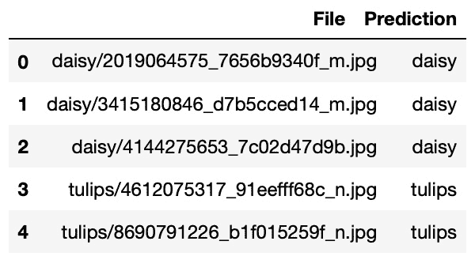
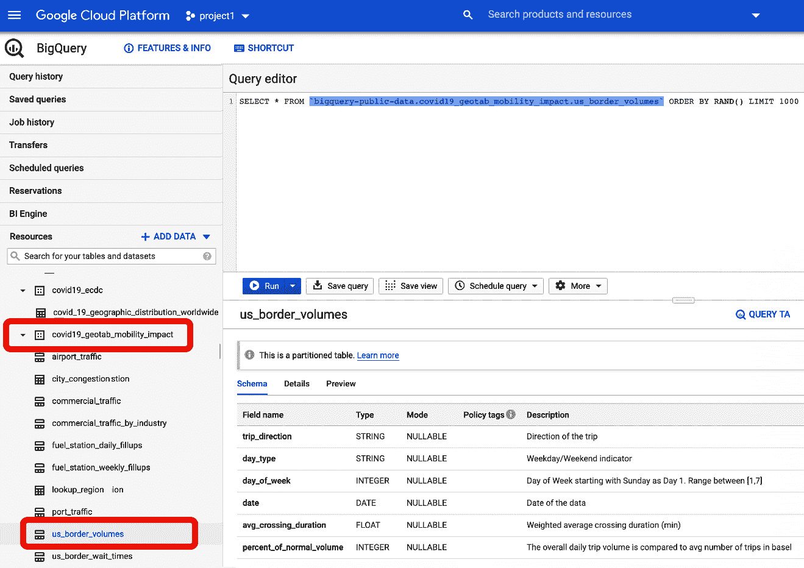
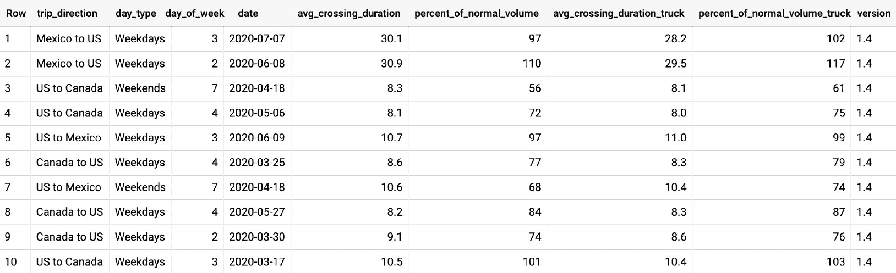

第四章：

# 第五章：可重用模型与可扩展数据管道

在本章中，你将学习如何使用 TensorFlow Enterprise 高级 API 中的预制模型元素，构建可扩展的数据摄取管道。这些选项提供了灵活性，适应不同的需求或风格，以便构建、训练和部署模型。掌握这些知识后，你将能够做出明智的选择，并理解不同模型开发方法之间的取舍。三种主要的方法是 TensorFlow Hub、TensorFlow Estimators API 和 TensorFlow Keras API。

TensorFlow Hub 是一个开源机器学习模型库。TensorFlow Estimators 和 `tf.keras` API 是包装器，可以视为可以配置和重用的高级元素，作为模型的构建块。从所需的代码量来看，TensorFlow Hub 模型需要最少的额外代码，而 Estimator 和 Keras API 属于较低级的构建块，因此使用 Estimator 或 Keras API 时需要更多的编码。但是无论如何，这三种方法都使 TensorFlow 更加易于学习和使用。接下来几节我们将学习这些方法如何与云存储中的可扩展数据摄取管道一起使用。

借助一个示例，我们将学习如何使用 *TensorFlow 数据集* 和 *TensorFlow I/O* 来摄取大量数据，而无需将其读取到 JupyterLab 的运行时内存中。本章将涵盖以下内容：

+   使用 TensorFlow Hub

+   应用 TensorFlow Hub 中的模型

+   利用 TensorFlow Keras API

+   使用 TensorFlow Estimators

# 使用 TensorFlow Hub

在这三种方法中（**TensorFlow Hub、Estimators API 和 Keras API**），TensorFlow Hub 相较于其他两者脱颖而出。它是一个开源机器学习模型库。TensorFlow Hub 的主要目的是通过迁移学习实现模型的重用。迁移学习是深度学习建模开发中非常实用且便捷的技术。其假设是，经过精心设计的模型（通过同行评审并由出版物推广）在训练过程中学习到了特征中的模式，这些模式可以被泛化，并应用于新的数据。因此，当我们有新的训练数据时，不需要重新训练模型。

以人类视觉为例，我们所看到的内容可以从简单到复杂的模式分解，顺序为线条、边缘、形状、层次，最终形成一个模式。事实证明，这也是计算机视觉模型识别人脸的方式。如果我们想象一个多层感知器模型，最开始，层次学习的是线条模式，然后是形状，随着深入到更深层次，我们可以看到学习到的模式是面部特征。

由于相同模式的层级结构可以用于分类其他图像，我们可以重用模型的架构（例如来自 TensorFlow Hub 的模型），并为我们自己的目的添加一个最终的分类层。在本章中，我们将利用这种迁移学习的方法。

# 应用来自 TensorFlow Hub 的模型

TensorFlow Hub 包含了许多可重用的模型。例如，在图像分类任务中，提供了诸如 Inception V3、不同版本的 ResNet 等预训练模型，以及可用的特征向量。在本章中，我们将学习如何加载和使用 ResNet 特征向量模型来进行我们自己图像的分类。这些图像包括五种花卉：雏菊、蒲公英、玫瑰、向日葵和郁金香。我们将使用`tf.keras` API 来获取这些图像：

1.  你可以使用 Google Cloud AI 平台的 JupyterLab 环境进行这项工作。一旦进入 AI 平台的 JupyterLab 环境，你可以通过导入必要的模块并下载图像来开始：

    ```py
    import tensorflow as tf
    import tensorflow_hub as hub
    import matplotlib.pyplot as plt
    import numpy as np
    data_dir = tf.keras.utils.get_file(
        'flower_photos',
        'https://storage.googleapis.com/download.tensorflow.
         org/example_images/flower_photos.tgz',
        untar=True)
    print(data_dir)
    ```

    你可以在你的 JupyterLab 运行时实例中找到这些花卉图像，路径为`/home/jupyter/.keras/datasets/flower_photos`。

1.  在一个新的单元格中，我们可以运行以下命令来查看数据的目录结构：

    ```py
    !ls -lrt {data_dir}
    ```

    前面的命令将返回以下结构：

    ```py
    -rw-r----- 1 jupyter jupyter 418049 Feb  9  2016 LICENSE.txt
    drwx------ 2 jupyter jupyter  45056 Feb 10  2016 tulips
    drwx------ 2 jupyter jupyter  36864 Feb 10  2016 sunflowers
    drwx------ 2 jupyter jupyter  36864 Feb 10  2016 roses
    drwx------ 2 jupyter jupyter  45056 Feb 10  2016 dandelion
    drwx------ 2 jupyter jupyter  36864 Feb 10  2016 daisy
    ```

    每个文件夹中，你会找到不同宽度和高度的彩色`.jpg`格式图像。在使用任何预构建模型之前，了解模型输入端所要求的数据形状非常重要。

1.  我们将使用在 imagenet 上预训练的 ResNet V2 特征向量作为我们的基础模型。该模型的 URL 是[`tfhub.dev/google/imagenet/resnet_v2_50/feature_vector/4`](https://tfhub.dev/google/imagenet/resnet_v2_50/feature_vector/4)。

    该文档指出，图像在模型入口点处的期望高度和宽度为`224`。让我们继续指定这些参数以及训练的批量大小：

    ```py
    pixels =224
    BATCH_SIZE = 32 
    IMAGE_SIZE = (pixels, pixels)  
    ```

现在我们已经了解了作为模型输入所期望的图像维度，接下来我们将处理下一步，即如何获取我们的训练图像。

## 创建一个生成器以大规模地提供图像数据

一种方便的将数据输入模型的方法是使用生成器。Python 生成器是一个迭代器，它会遍历数据目录并将数据批次传递给模型。当我们使用生成器遍历训练数据时，无需一次性加载整个图像集合，也不必担心计算节点的内存限制。相反，我们一次发送一批图像。因此，使用 Python 生成器比将所有数据作为一个巨大的 NumPy 数组传递要更加高效。

TensorFlow 提供了 API 和工作流，用于创建专门为 TensorFlow 模型消费设计的生成器。从高层次来看，它遵循以下过程：

1.  它通过`ImageDataGenerator`函数创建了一个对象。

1.  它使用这个对象调用`flow_from_directory`函数来创建一个 TensorFlow 生成器。

结果是，这个生成器知道训练数据存储的目录。

在处理图像时，我们需要为生成器指定一些关于数据的参数。输入图像的颜色值应在`0`和`1`之间。因此，我们必须通过将图像除以一个重新缩放因子`255`来对图像进行归一化，这是`.jpg`格式 RGB 图像中的最大像素值。我们还可以保留 20%的数据作为验证集。这被称为验证拆分因子。我们还需要指定符合 ResNet 标准的图像大小，选择一种插值方法将任何大小的图像转换为该大小，并指定批次中的数据量（批次大小）。必要的步骤如下：

1.  将这些因素组织成元组。这些因素作为输入关键字指定给`ImageDataGenerator`或`flow_from_directory`。我们可以将这些参数及其值作为元组传递给这些函数。在执行函数时，元组将被解包。这些参数存储在这些字典中：

    ```py
    datagen_kwargs = dict(rescale=1./255, 
                          validation_split=.20)
    dataflow_kwargs = dict(target_size=IMAGE_SIZE, 
                           batch_size=BATCH_SIZE,
                           interpolation='bilinear')
    ```

    如前述代码行所示，`datagen_kwargs`传递给`ImageDataGenerator`，而`dataflow_kwargs`传递给`flow_from_directory`。

1.  将这些元组传递给`ImageGenerator`。这些元组封装了所有这些因素。现在，我们将把这些元组传递给生成器，如下代码所示：

    ```py
    valid_datagen = tf.keras.preprocessing.image.ImageDataGenerator(
        **datagen_kwargs)
    valid_generator = valid_datagen.flow_from_directory(
    data_dir, subset='validation', shuffle=False, **dataflow_kwargs)
    ```

    你将看到交叉验证数据中图像和类别数量的输出：

    ```py
    Found 731 images belonging to 5 classes.
    ```

1.  对于训练数据，如果你愿意，可以考虑使用数据增强选项。如果是这样，我们可以在`ImageDataGenerator`中设置这些参数：

    ```py
    rotation_range
    horizontal_flip
    Width_shift_range
    height_shift_range
    Shear_range
    Zoom_range
    ```

    这些参数有助于将原始图像转换为不同的方向。这是一种典型的技术，用于增加更多训练数据以提高准确性。

1.  目前，我们暂时不需要处理这个问题，因此我们将`do_data_augmentation = False`，如下代码所示。如果你愿意，也可以将其设置为`True`。这里提供了建议的增强参数：

    ```py
    do_data_augmentation = False 
    if do_data_augmentation:
      train_datagen = tf.keras.preprocessing.image.ImageDataGenerator(
          rotation_range=40,
          horizontal_flip=True,
          width_shift_range=0.2, height_shift_range=0.2,
          shear_range=0.2, zoom_range=0.2,
          **datagen_kwargs)
    else:
      train_datagen = valid_datagen
    train_generator = 
    	train_datagen.flow_from_directory(
    		data_dir, subset='training', shuffle=True, 			**dataflow_kwargs)
    ```

    执行上述代码后，你将看到以下输出：

    ```py
    Found 731 images belonging to 5 classes.
    Found 2939 images belonging to 5 classes.
    ```

    我们的验证数据和训练数据生成器正确地识别了目录，并能够识别类别数量。

1.  和所有分类任务一样，标签会转换为整数索引。生成器使用`train_generator.class_indices`来映射标签：

    ```py
    labels_idx = (train_generator.class_indices)
    ```

1.  我们可以通过创建一个反向查找，轻松地将索引映射回标签，反向查找的形式也是一个字典。这可以通过反转`labels_idx`中的键值对来完成，其中键是索引，值是花卉类型：

    ```py
    idx_labels = dict((v,k) for k,v in labels_idx.items())
    print(idx_labels)
    {0: 'daisy', 1: 'dandelion', 2: 'roses', 3: 'sunflowers', 4: 'tulips'}
    ```

在本节中，我们学习了如何实现用于训练和验证数据的`ImageGenerator`。我们利用可选的输入参数对图像进行重新缩放和归一化。我们还学习了如何获取真实标签映射，以便解码模型的预测结果。

接下来，我们将学习通过重用 ResNet 特征向量来实现迁移学习，以完成我们自己的图像分类任务。

## 重用预训练的 ResNet 特征向量

现在我们准备构建模型。我们将使用 `tf.keras.sequential` API。它由三层组成——输入层、ResNet 层和一个全连接层——作为分类输出。我们还可以选择对 ResNet 进行微调或重新训练（这需要更长的训练时间）。定义模型架构的代码如下：

1.  我们将首先定义参数，如下所示：

    ```py
    FINE_TUNING_CHOICE = True
    NUM_CLASSES = len(idx_labels)
    ```

1.  接下来，我们将使用以下代码来构建模型：

    ```py
    mdl = tf.keras.Sequential([
        tf.keras.layers.InputLayer(input_shape=IMAGE_SIZE + 
                                   (3,)),
        hub.KerasLayer('https://tfhub.dev/google/imagenet/    
        resnet_v2_50/feature_vector/4', 
        trainable = FINE_TUNING_CHOICE),
        tf.keras.layers.Dense(NUM_CLASSES, 
        activation='softmax', name = 'custom_class')
    ])
    ```

1.  现在，让我们使用以下代码行来构建模型：

    ```py
    mdl.build([None, 224, 224, 3])
    ```

    ResNet 需要将 RGB 层作为第三维分开。因此，我们需要添加一个输入层，接受形状为 `[224, 224, 3]` 的 `input_shape`。此外，由于我们有五种花卉类型，这是一个多类分类问题。我们需要一个带有 softmax 激活的全连接层来为每个标签输出概率。

1.  我们可以通过以下代码行来确认模型架构：

    ```py
    mdl.summary()
    ```

    执行前面的代码行后，您将看到三个层的顺序及其预期的输出形状：

    ```py
    Model: 'sequential_1'
    _________________________________________________________________
    Layer (type)                 Output Shape              Param #   
    =================================================================
    keras_layer_1 (KerasLayer)   (None, 2048)              23564800  
    _________________________________________________________________
    custom_class (Dense)         (None, 5)                 10245     
    =================================================================
    Total params: 23,575,045
    Trainable params: 23,529,605
    Non-trainable params: 45,440
    _________________________________________________________________
    ```

    这表明模型的结构非常简单。它由我们从 TensorFlow Hub 下载的 ResNet 特征向量层组成，后面是一个包含五个节点的分类头（我们图像集合中有五种花卉类别）。

## 编译模型

现在我们已经用适当的输入和输出层封装了 ResNet 特征向量，我们准备好设置训练工作流了。首先，我们需要编译模型，在其中指定优化器（在此案例中，我们选择 `loss` 函数）。优化器使用梯度下降算法不断寻找权重和偏置，以最小化 `loss` 函数。由于这是一个多类分类问题，因此需要使用分类交叉熵。

如需更深入的讨论，请参阅 *TensorFlow 2.0 快速入门指南*，作者 *Tony Holroyd*，由 *Packt Publishing* 出版。您可以参考 *第四章* *使用 TensorFlow 2 的监督机器学习*，以及名为 *逻辑回归* 的部分，讨论有关损失函数和优化器的内容。这就是我们定义优化器的方法：

```py
my_optimizer = tf.keras.optimizers.SGD(lr=0.005, momentum=0.9)
```

由于我们希望为每个类别输出概率，因此我们设置 `from_logits = True`。同时，我们希望模型不要变得过于自信，因此我们将 `label_smoothing = 0.1` 作为正则化项，以惩罚极高的概率。我们可以按如下方式定义 `loss` 函数：

```py
my_loss_function = tf.keras.losses.CategoricalCrossentropy(from_logits=True, label_smoothing=0.1)
```

我们需要配置模型以进行训练。这是通过在模型的训练过程中定义 `loss` 函数和优化器来完成的，因为训练过程需要知道 `loss` 函数用于优化的目标是什么，以及使用什么优化器。要编译模型并指定优化器和 `loss` 函数，请执行以下代码：

```py
mdl.compile(
```

```py
  optimizer=my_optimizer,
```

```py
  loss=my_loss_function,
```

```py
  metrics=['accuracy'])
```

结果是一个准备好用于训练的模型架构。

## 训练模型

对于模型训练，我们将使用`tf.keras.fit`函数。我们只会训练五个周期：

```py
steps_per_epoch = train_generator.samples // train_generator.batch_size
```

```py
validation_steps = valid_generator.samples // valid_generator.batch_size
```

```py
hist = mdl.fit(
```

```py
    train_generator,
```

```py
    epochs=5, steps_per_epoch=steps_per_epoch,
```

```py
    validation_data=valid_generator,
```

```py
    validation_steps=validation_steps).history
```

训练结果应类似于此：

```py
Epoch 1/5
```

```py
91/91 [==============================] - 404s 4s/step - loss: 1.4899 - accuracy: 0.7348 - val_loss: 1.3749 - val_accuracy: 0.8565
```

```py
Epoch 2/5
```

```py
91/91 [==============================] - 404s 4s/step - loss: 1.3083 - accuracy: 0.9309 - val_loss: 1.3359 - val_accuracy: 0.8963
```

```py
Epoch 3/5
```

```py
91/91 [==============================] - 405s 4s/step - loss: 1.2723 - accuracy: 0.9704 - val_loss: 1.3282 - val_accuracy: 0.9077
```

```py
Epoch 4/5
```

```py
91/91 [==============================] - 1259s 14s/step - loss: 1.2554 - accuracy: 0.9869 - val_loss: 1.3302 - val_accuracy: 0.9020
```

```py
Epoch 5/5
```

```py
91/91 [==============================] - 403s 4s/step - loss: 1.2487 - accuracy: 0.9935 - val_loss: 1.3307 - val_accuracy: 0.8963
```

在每个训练周期中，`loss`函数值和训练数据的准确度都会显示出来。由于我们提供了交叉验证数据，模型在每个训练周期结束时也会使用验证数据集进行测试。`loss`函数和准确度测量通过 Fit API 在每个周期提供。这是每次训练运行的标准输出。

还值得一提的是，当在 AI Notebook 中使用 Nvidia Tesla T4 图形处理单元（GPU）和基本驱动节点（4 个 CPU，15GB 内存）执行上述代码时，总训练时间仅略超过 2 分钟，而如果在没有 GPU 的相同驱动节点中执行此训练过程，则可能需要超过 30 分钟才能完成训练。

GPU 非常适合深度学习模型的训练，因为它可以并行处理多个计算。GPU 通过大量核心实现并行处理。这意味着它拥有大带宽的内存和比 CPU 更快的梯度计算能力，可以处理深度学习架构中的所有可训练参数。

## 使用测试图像进行评分

现在，我们可以使用测试（保留）图像来测试模型。在这个例子中，我上传了五张花卉图像，我们需要将它们全部转换为`[224, 224]`的形状，并将像素值归一化到`[0, 1]`。按照惯例，测试图像会与训练和交叉验证图像分开存储。因此，通常会有一个不同的文件路径来存储测试图像：

1.  我们将为这些花卉类型下载一些测试图像。图像已经在以下链接中划分为训练、验证和测试图像：[`dataverse.harvard.edu/api/access/datafile/4159750`](https://dataverse.harvard.edu/api/access/datafile/4159750)

1.  所以，在下一个单元格中，你可以使用`wget`将其下载到你的笔记本中：

    ```py
    !wget https://dataverse.harvard.edu/api/access/datafile/4159750
    ```

1.  接着，解压它：

    ```py
    /flower_photos/small_test directory available in the left panel of your notebook instance. 
    ```

1.  创建一个数据生成器实例用于测试数据。由于我们的`train_datagen`已经知道如何实现这一点，我们可以重用该对象。确保你指定`working_dir`目录作为测试图像所在文件路径：

    ```py
    working_dir = ‘flower_photos/small_test’
    test_generator =     
    	train_datagen.flow_from_directory
    		(directory=working_dir,
                batch_size = 5,
                target_size = [224, 224],
                shuffle=False,
                classes = list(labels_idx))
    ```

1.  让我们记录下标签的索引：

    ```py
    print(test_generator.class_indices)
    ```

    输出结果表示每个标签在概率数组中的相对位置：

    ```py
    {'daisy': 0, 'dandelion': 1, 'roses': 2, 'sunflowers': 3, 'tulips': 4}
    ```

1.  我们还定义了一个辅助函数来绘制图像：

    ```py
    def plotImages(images_arr):
        fig, axes = plt.subplots(1, 5, figsize=(10,10))
        axes = axes.flatten()
        for img, ax in zip( images_arr, axes):
            ax.imshow(img)
            ax.axis('off')
        plt.tight_layout()
        plt.show()
    ```

1.  现在，我们来看一下测试图像及其对应的标签（真实标签）：

    ```py
    sample_test_images, ground_truth_labels = next(test_generator)
    print(ground_truth_labels)
    ```

    测试图像的输出结果如下所示。在前三行中，one-hot 编码在第一位置为`1`，根据`test_generator.class_indices`，这对应于`雏菊`，而在最后两行中，`1`位于最后位置，表示最后两张图像是`郁金香`：

    ```py
    [[1\. 0\. 0\. 0\. 0.]
     [1\. 0\. 0\. 0\. 0.]
     [1\. 0\. 0\. 0\. 0.]
     [0\. 0\. 0\. 0\. 1.]
     [0\. 0\. 0\. 0\. 1.]]
    ```

1.  然后，我们可以绘制这些图像：

    ```py
    plotImages(sample_test_images[:5])
    ```

    

    图 4.1 – 测试图像示例；前三个是雏菊，最后两个是郁金香

1.  要让模型对这些图像进行预测，请执行以下代码：

    ```py
    prediction = mdl.predict(sample_test_images[:5])
    ```

    预测的输出结果如下：

    ```py
    array([[9.9985600e-01, 3.2907694e-05, 2.3326173e-05,            
            6.8752386e-05, 1.8940274e-05],
           [9.9998152e-01, 7.6931758e-07, 9.4449973e-07, 
            1.6520202e-05, 2.8859478e-07],
           [9.9977893e-01, 2.0959340e-05, 6.2238797e-07,         
            1.8358800e-04, 1.6017557e-05],
           [6.7357789e-04, 5.8116650e-05, 3.0710772e-04, 
            6.2863214e-04, 9.9833256e-01],
           [1.9417066e-04, 1.3316995e-04, 6.2624150e-04, 
            1.4169540e-04, 9.9890471e-01]], dtype=float32)
    ```

该输出是每张图像每个类别的概率的 NumPy 数组。每一行对应一张图像，包含五个类别的概率。前三行的最大概率出现在第一列，后两行的最大概率出现在最后一列。这意味着根据`test_generator.class_indices`提供的映射，模型预测前三张图像为雏菊，最后两张图像为郁金香。

如果我们能将这些结果输出为更易读的格式，比如 CSV 文件，其中包含测试图像的文件名及其相应的预测结果，那就更有帮助了。

1.  让我们将概率大小与位置关联，并定义一个标签参考：

    ```py
    labelings = tf.math.argmax(prediction, axis = -1)
    label_reference = np.asarray(list(labels_idx))
    ```

1.  编写一个辅助函数，将位置映射到实际标签：

    ```py
    def find_label(idx):
        return label_reference[idx]
    ```

1.  现在我们可以映射每个观测值的最高概率位置：

    ```py
    predicted_idx = tf.math.argmax(prediction, axis = -1)
    ```

1.  我们可以查看 `predicted_idx`：

    ```py
    <tf.Tensor: shape=(5,), dtype=int64, numpy=array([0, 0, 0, 4, 4])>
    ```

    这意味着在前三张图像中，最大概率出现在位置 `0`，根据 `test_generator.class_indices` 该位置对应 `daisy`（雏菊）。同样，后两张图像的最大概率出现在位置 `4`，该位置对应 `tulips`（郁金香）。

1.  然后，将辅助函数应用于预测输出的每一行，并将测试图像的文件名（`test_generator.filenames`）与预测结果一起插入到格式良好的 pandas DataFrame 中：

    ```py
    import pandas as pd
    predicted_label = list(map(find_label, predicted_idx))
    file_name = test_generator.filenames
    results=pd.DataFrame({'File':file_name,
                          'Prediction':predicted_label})
    results
    ```

    结果应该类似于以下图示。现在，您可以将 pandas DataFrame 保存为任何您选择的格式，例如 CSV 文件或 pickle 文件：



图 4.2 – 以 DataFrame 格式显示的预测输出

这完成了使用来自 TensorFlow Hub 的预训练模型的演示，将其应用到我们自己的数据，重新训练模型并进行预测。我们还展示了如何利用生成器批量地将训练数据输入模型。

TensorFlow Hub 位于模型重用性的最高层次。在那里，你可以找到许多已经构建好的开源模型，可以通过一种称为迁移学习的技术进行使用。在本章中，我们使用 `tf.keras` API 构建了一个回归模型。以这种方式（自定义）构建模型实际上并不是一件简单的事。通常，你需要花费大量时间实验不同的模型参数和架构。如果你的需求涉及分类或回归问题，并且与预构建的开源模型兼容，那么 TensorFlow Hub 是寻找适合你数据的分类或回归模型的一站式商店。然而，对于这些预构建的模型，你仍然需要调查输入层所需的数据结构，并为你的目的提供最终的输出层。然而，重用 TensorFlow Hub 中的这些预构建模型将节省你在构建和调试自己模型架构上的时间。

在接下来的章节中，我们将看到 TensorFlow Keras API，它是最新的高级 API，提供了许多可重用的模型。

# 利用 TensorFlow Keras API

Keras 是一个深度学习 API，封装了 TensorFlow、Theano 和微软认知工具包（也称为 CNTK）等机器学习库。作为一个独立的 API，Keras 之所以受欢迎，源于它简洁的模型构建过程。从 2018 年起，TensorFlow 将 Keras 作为未来的高级 API 添加进来，现在被称为 `tf.keras`。自 2019 年发布 TensorFlow 2.0 版本以来，`tf.keras` 已成为官方的高级 API。

`tf.keras` 擅长建模复杂的深度学习架构，包含 `tf.keras` 密集层，用于构建一个回归模型，处理来自 BigQuery 的表格数据。

## 数据获取

我们将使用 Google Cloud 上的一个公开数据集作为本示例的工作数据：

1.  这是我们感兴趣的表格：

    ```py
    DATASET_GCP_PROJECT_ID = 'bigquery-public-data'
    DATASET_ID = 'covid19_geotab_mobility_impact'
    TABLE_ID = 'us_border_volumes'
    ```

    你可以在 BigQuery 中找到它：

    

    图 4.3 – BigQuery 门户和表格选择

1.  让我们通过运行以下查询来查看数据：

    ```py
    SELECT * FROM `bigquery-public-data.covid19_geotab_mobility_impact.us_border_volumes` ORDER BY RAND() LIMIT 1000
    ```

    上面的查询帮助我们检索了表格 `data.covid19_geotab_mobility_impact.us_border_volumes` 中的 1,000 行随机数据。

这是输出结果：



图 4.4 – us_border_volumes 表格的列

## 使用 us_border_volumes 表格解决数据科学问题

输出由从查询的表格中随机选出的行组成。你的输出将包含不同的值。

在`us_border_volumes`表中，每条记录表示一辆卡车在美国边境口岸的进出。每条记录中的属性有`trip_direction`、`day_type`、`day_of_week`、`date`、`avg_crossing_duration`、`percent_of_normal_volume`、`avg_crossing_duration_truck`和`percent_of_nortal_volume_truck`。我们希望构建一个模型，根据这些特征预测卡车通过边境所需的时间。

## 选择特征和目标进行模型训练

这是一个示例问题，我们将使用它来演示如何利用 TensorFlow I/O 管道为模型提供训练数据。

让我们将这个问题设置为一个回归问题，使用这些数据。我们将构建一个回归模型来预测卡车通过边境的平均时间（`avg_crossing_duration_truck`）。其他列（除了`date`）为特征。

## 流式训练数据

在接下来的例子中，我们将使用 Google AI 平台的 JupyterLab 笔记本，配备 TensorFlow Enterprise 2.1 发行版。你可以重新使用*第二章*中的项目 ID，*在 Google AI 平台上运行 TensorFlow Enterprise*。

确定数据源后，我们将构建一个流式工作流程，将训练数据传输到模型中。这不同于在 Python 运行时将表读取为 pandas DataFrame。我们希望通过批次流式传输训练数据，而不是耗尽为 Python 运行时分配的所有内存。因此，我们将使用 TensorFlow I/O 从 BigQuery 流式传输训练数据：

1.  我们将从以下代码开始，导入必要的库并设置环境变量：

    ```py
    import tensorflow as tf
    from tensorflow import feature_column
    from tensorflow_io.bigquery import BigQueryClient
    import numpy as np
    from google.cloud import bigquery
    client = BigQueryClient()
    PROJECT_ID = 'project1-XXXXX' 
    # A project ID in your GCP subscription.
    DATASET_GCP_PROJECT_ID = 'bigquery-public-data'
    DATASET_ID = 'covid19_geotab_mobility_impact'
    TABLE_ID = 'us_border_volumes'
    ```

1.  创建一个会话来读取 BigQuery：

    ```py
    read_session3 = client.read_session(
       'projects/' + PROJECT_ID,
       DATASET_GCP_PROJECT_ID, TABLE_ID, DATASET_ID,
       ['trip_direction',
        'day_type',
        'day_of_week',
        'avg_crossing_duration',
        'percent_of_normal_volume',
        'avg_crossing_duration_truck',
        'percent_of_normal_volume_truck'

        ],
       [tf.string,
        tf.string,
        tf.int64,
        tf.double,
        tf.int64,
        tf.double,
        tf.int64
        ],
         requested_streams=10
    )
    dataset3 = read_session3.parallel_read_rows()
    ```

1.  我们刚刚从 BigQuery 中的表中选择了感兴趣的字段。现在，表已经作为数据集被读取，我们需要将每一列指定为特征或目标。让我们使用这个辅助函数：

    ```py
    def transfrom_row(row_dict):
    	# Identify column names for features.
    	feature_dict = { column:
            (tf.strings.strip(tensor) if tensor.dtype ==   
                'string' else tensor)
                    	for (column,tensor) in row_dict.items()
                    	}
    	# Remove target column from data
    	target = feature_dict.pop
                              ('avg_crossing_duration_truck')
    	# Return a tuple of features and target
    	return (feature_dict, target)
    ```

1.  现在我们将这个函数应用于训练数据集的每一行。这本质上是对数据集的一次转换，因为我们应用了一个函数，它将数据集拆分为两个字典的元组——特征和目标：

    ```py
    transformed_ds = dataset3.map(transfrom_row)
    ```

1.  现在我们将对数据集进行洗牌并分批处理：

    ```py
    BATCH_SIZE = 32
    SHUFFLE_BUFFER = 1024
    training_dataset3 = transformed_ds.shuffle
                           (SHUFFLE_BUFFER).batch(BATCH_SIZE)
    ```

在这一部分，我们从 BigQuery 中识别了一个表，确定了特征和目标列，将表转换为 TensorFlow 数据集，对其进行了洗牌并分批。这是当你不确定数据量是否会导致内存使用问题时常用的技术。

在下一部分，我们将查看`tf.keras` API 以及如何使用它来构建和训练模型。

## 模型的输入

到目前为止，我们已经处理了在训练数据集中指定特征和目标的问题。现在，我们需要将每个特征指定为类别型或数值型。这需要我们设置 TensorFlow 的`feature_columns`对象。`feature_columns`对象是模型的输入：

1.  对于每个类别列，我们需要跟踪可能的类别。通过以下辅助函数来实现：

    ```py
    def get_categorical_feature_values(column):
        query = 'SELECT DISTINCT TRIM({}) FROM `{}`.{}.{}'. 	        format(column, DATASET_GCP_PROJECT_ID, 
                    DATASET_ID, TABLE_ID)
        client = bigquery.Client(project=PROJECT_ID)
        dataset_ref = client.dataset(DATASET_ID)
        job_config = bigquery.QueryJobConfig()
        query_job = client.query(query, 
                                 job_config=job_config)
        result = query_job.to_dataframe()
        return result.values[:,0]
    ```

1.  然后，我们可以使用以下代码片段创建`feature_columns`对象（实际上是一个 Python 列表）：

    ```py
    feature_columns = []
    # Numeric columns
    for header in ['day_of_week',     
                 'avg_crossing_duration',
                 'percent_of_normal_volume',
                 'percent_of_normal_volume_truck']:
     feature_columns.append
                      (feature_column.numeric_column(header))
    # Categorical columns
    for header in ['trip_direction', 'day_type']:
     categorical_feature = feature_column.categorical_column_with_vocabulary_list(
           header, get_categorical_feature_values(header))
     categorical_feature_one_hot = feature_column.indicator_column(categorical_feature)
     feature_columns.append(categorical_feature_one_hot)
    ```

    请注意，目标列不在`feature_columns`中。

1.  现在，我们只需创建一个层来作为模型的输入。第一个层是特征列输入模型的层，这是一个多层感知机，由一系列可重用的`Dense`层定义：

    ```py
    feature_layer = tf.keras.layers.DenseFeatures(feature_columns)
    Dense = tf.keras.layers.Dense
    model = tf.keras.Sequential(
     [
       feature_layer,
       Dense(100, activation=tf.nn.relu, 
       kernel_initializer='uniform'),
       Dense(75, activation=tf.nn.relu),
       Dense(50, activation=tf.nn.relu),
       Dense(25, activation=tf.nn.relu),
       Dense(1)
     ])  
    ```

在本节中，我们创建了一个流程，将数据集导入到模型的特征层。在此过程中，对于类别列，我们必须进行独热编码，因为这些列不是数值型的。接着，我们使用`tf.keras` API 构建了一个模型架构。

接下来，我们将编译这个模型并启动训练过程。

## 模型训练

在模型可用之前，我们需要对其进行编译。由于这是一个回归模型，我们可以指定`loss`函数，对于训练指标，我们将跟踪 MSE 以及**平均绝对误差**（**MAE**）：

1.  使用适当的`loss`函数和回归任务中使用的指标来编译模型：

    ```py
    model.compile(
       loss='mse',
       metrics=['mae', 'mse'])
    ```

1.  训练模型：

    ```py
    model.fit(training_dataset3, epochs=5)
    ```

1.  一旦模型训练完成，我们可以创建一个包含两个观测值的样本测试数据集。测试数据必须采用字典格式：

    ```py
    test_samples = {
       'trip_direction' : np.array(['Mexico to US', 
                                    'US to Canada']),
       'day_type' : np.array(['Weekdays', 'Weekends']),
       'day_of_week' : np.array([4, 7]),
       'avg_crossing_duration' : np.array([32.8, 10.4]),
       'percent_of_normal_volume' : np.array([102, 89]),
       'percent_of_normal_volume_truck' : np.array([106, 84])
    }
    ```

1.  为了对这个测试样本进行评分，执行以下代码：

    ```py
    model.predict(test_samples)
    ```

    上述代码的输出如下：

    ```py
    array([[29.453201],
           [10.395596]], dtype=float32)
    ```

    这表示预测的卡车过境平均等待时间（`avg_crossing_duration_truck`）。

我们刚刚学习了如何重用`tf.keras`的全连接层和顺序 API，并将其与一个由数据集流驱动的数据输入管道进行整合，使用`feature_column`对象进行特征编码。

`tf.keras`是一个高级 API，提供了一组专门用于深度学习问题的可重用元素。如果你的解决方案需要深度学习技术，那么`tf.keras`是推荐的起点。

在接下来的部分，我们将查看另一个高级 API——TensorFlow Estimators。在`tf.keras` API 成为 TensorFlow 的核心 API 之前，以及在 1.x 版本的 TensorFlow 中，TensorFlow Estimators 是唯一可用的高级 API。

所以，在接下来的部分，我们将查看它是如何工作的。

# 使用 TensorFlow Estimators

TensorFlow 估算器也是可复用的组件。估算器是更高层的 API，允许用户构建、训练和部署机器学习模型。它有几个预制的模型，可以节省用户创建计算图或会话的麻烦。这使得用户能够在有限的代码修改下快速尝试不同的模型架构。估算器并不像`tf.keras`那样专门面向深度学习模型。因此，你不会找到很多预制的深度学习模型。如果你需要使用深度学习框架，`tf.keras` API 是入门的正确选择。

在这个例子中，我们将设置相同的回归问题并构建一个回归模型。数据来源是我们在流式训练数据中使用的相同数据，通过 Google Cloud 的 BigQuery 提供：

```py
DATASET_GCP_PROJECT_ID = 'bigquery-public-data'
```

```py
DATASET_ID = 'covid19_geotab_mobility_impact'
```

```py
TABLE_ID = 'us_border_volumes'
```

这就是我们在`tf.keras`部分使用的同一个 BigQuery 表（*图 4.4*）。请参阅*图 4.4*，其中展示了从该表随机提取的几行数据。

就像我们在上一节中使用`tf.keras` API 一样，这里我们希望使用 TensorFlow Estimators 构建一个线性回归模型，来预测卡车过境的平均时间（`avg_crossing_duration_truck`）。其他列（除`date`外）是特征。

使用 TensorFlow Estimators API 构建和训练模型的模式如下。

通过调用估算器（即对于预制的估算器，如线性回归器）并指定`feature_columns`对象来创建`estimator`对象，这样模型就知道在特征数据中应该期待哪些数据类型。

使用`estimator`对象调用`.train()`并传递一个输入函数给它。这个输入函数负责解析训练数据和标签。由于我们正在设置一个回归问题，接下来以预制的线性回归估算器为例。这是训练过程的常见模式：

```py
linear_est = tf.estimator.LinearRegressor(feature_columns=feature_columns, model_dir=MODEL_DIR)
```

```py
linear_est.train(input_fn)
```

从前面的代码中，可以观察到以下内容：

+   首先，创建一个线性回归器实例`linear_est`，并使用`feature_columns`对象。这个对象提供关于每个特征的注释（数字或类别数据类型）。`model_dir`是保存模型检查点的指定目录。

+   接下来的代码是`linear_est.train(input_fn)`。这个实例调用`train()`方法来启动训练过程。`train()`方法接收一个函数`input_fn`，它负责将训练数据按批次流式传送并格式化到模型中。接下来我们会了解如何构建`input_fn`。换句话说，TensorFlow Estimators 将数据注解与训练工作流中的数据摄取过程分开。

## TensorFlow Estimators 的数据管道

像`tf.keras`一样，TensorFlow Estimators 在 TensorFlow 企业环境中运行时，可以利用流式数据管道，例如在 Google Cloud AI 平台上。在本节中，作为示例，我们将看到如何将训练数据（来自 BigQuery 中的一个表）流式传输到 TensorFlow Estimator 模型中。

以下是为 TensorFlow Estimator 构建 BigQuery 数据管道的步骤。

1.  通常，我们从所需库的`import`操作开始：

    ```py
    import tensorflow as tf
    from tensorflow_io.bigquery import BigQueryClient
    from tensorflow import feature_column
    from google.cloud import bigquery
    import pandas as pd
    import numpy as np
    import datetime, os
    import itertools
    ```

1.  现在我们为 BigQuery 中的目标表指定一些参数。确保指定你自己的`PROJECT_ID`：

    ```py
    PROJECT_ID = '<YOUR_PROJECT_ID>'
    DATASET_GCP_PROJECT_ID = 'bigquery-public-data'
    DATASET_ID = 'covid19_geotab_mobility_impact'
    TABLE_ID = 'us_border_volumes'
    ```

1.  接下来，我们将指定训练过程的输入函数。这个输入函数将通过`transform_row`函数处理读取操作、数据注解、转换，以及将目标与特征分离。这些操作与之前在*利用 TensorFlow Keras API*部分中描述的`tf.keras`示例完全相同。唯一的区别是我们现在将所有代码封装如下：

    ```py
    def input_fn():
     PROJECT_ID = 'project1-190517' # This is from what you created in your Google Cloud Account.
     DATASET_GCP_PROJECT_ID = 'bigquery-public-data'
     TABLE_ID = 'us_border_volumes'
     DATASET_ID = 'covid19_geotab_mobility_impact'  
     client = BigQueryClient()
     read_session = client.read_session(
       'projects/' + PROJECT_ID,
       DATASET_GCP_PROJECT_ID, TABLE_ID, DATASET_ID,
       ['trip_direction',
        'day_type',
        'day_of_week',
        'avg_crossing_duration',
        'percent_of_normal_volume',
        'avg_crossing_duration_truck',
        'percent_of_normal_volume_truck'

        ],
       [tf.string,
        tf.string,
        tf.int64,
        tf.double,
        tf.int64,
        tf.double,
        tf.int64
        ],
         requested_streams=10
       )
     dataset = read_session.parallel_read_rows()
    ```

    我们仍然在`input_fn`内部。继续处理`input_fn`：

1.  我们还重新组织了如何在数据中指定特征和目标，通过`input_fn`内部的`transform_row`函数。

    ```py
    def transform_row(row_dict):
       # Trim all string tensors
       feature_dict = { column:
           (tf.strings.strip(tensor) if tensor.dtype == 	 	           'string' else tensor)
           for (column,tensor) in row_dict.items()
       }
       # Extract target from features
       target = feature_dict.pop(
                               'avg_crossing_duration_truck')
       # return a tuple of features and target
       return (feature_dict, target)
     transformed_ds = dataset.map(transfrom_row)
     transformed_ds = transformed_ds.batch(32)
     return transformed_ds  
    ```

    这就是整个`input_fn`。此时，`input_fn`返回从`us_border_volumes`读取的数据集。

1.  就像我们在*利用 TensorFlow Keras API*部分中讨论的`tf.keras`示例一样，我们也需要构建一个`feature_columns`对象来进行特征注解。我们可以重用相同的代码：

    ```py
    feature_columns = []
    # Numeric columns
    for header in ['day_of_week',     
                 'avg_crossing_duration',
                 'percent_of_normal_volume',
                 'percent_of_normal_volume_truck']:
     feature_columns.append(
                       feature_column.numeric_column(header))
    # Categorical columns
    for header in ['trip_direction', 'day_type']:
     categorical_feature = feature_column.categorical_column_with_vocabulary_list(
           header, get_categorical_feature_values(header))
     categorical_feature_one_hot = feature_column.indicator_column(categorical_feature)
     feature_columns.append(categorical_feature_one_hot)
    ```

1.  现在，让我们设置一个目录来保存模型的检查点：

    ```py
    MODEL_DIR = os.path.join('models', datetime.datetime.now().strftime('%Y%m%d-%H%M%S'))
    ```

1.  使用以下命令创建目录：

    ```py
    %mkdir models
    %mkdir {MODEL_DIR}
    ```

1.  启动训练过程：

    ```py
    linear_est = tf.estimator.LinearRegressor(feature_columns=feature_columns, model_dir=MODEL_DIR)
    linear_est.train(input_fn)
    ```

这完成了模型训练过程。

由于`estimator`模型期望输入为一个函数，为了使用`estimator`进行评分，我必须传入一个函数，该函数接收测试数据，格式化它，并像训练数据一样将其输入到模型中。

训练的输入函数基本上做了两件事：

+   它查询了表格并获取了表格的数据集表示。

+   它通过将目标与特征分离来转换数据。

关于这里的评分情况，我们不需要担心。我们只需要获取测试数据的数据集表示：

1.  我们可以重用*模型训练*部分中展示的相同测试数据：

    ```py
    test_samples = {
       'trip_direction' : np.array(['Mexico to US', 
                                    'US to Canada']),
       'day_type' : np.array(['Weekdays', 'Weekends']),
       'day_of_week' : np.array([4, 7]),
       'avg_crossing_duration' : np.array([32.8, 10.4]),
       'percent_of_normal_volume' : np.array([102, 89]),
       'percent_of_normal_volume_truck' : np.array([106, 84])
    }
    ```

1.  创建一个辅助函数，通过以下代码将`test_samples`转换为数据集：

    ```py
    def scoring_input_fn():
     return tf.data.Dataset.from_tensor_slices(test_samples).batch(2)
    ```

1.  下一步是使用以下代码行对测试数据进行评分：

    ```py
    y = linear_est.predict(   
            input_fn=scoring_input_fn)
    ```

1.  最后，让我们打印预测结果，如下所示：

    ```py
    predictions = list(p['predictions'] for p in itertools.islice(y, 2))
    print('Predictions: {}'.format(str(predictions)))
    Above code prints the output:
    Predictions: [array([23.875168], dtype=float32), array([13.621282], dtype=float32)]   
    ```

    在前面的代码中，我们遍历了模型的输出，该输出是一个字典。为了引用与模型输出相关的值，我们需要通过名为 `prediction` 的键来访问它。为了提高可读性，我们将其转换为列表并以字符串的形式打印出来。它显示了第一辆卡车预计在 `23.87` 分钟内通过边境，而第二辆卡车预计在 `13.62` 分钟内通过边境。

在 `tf.keras` 成为 TensorFlow 发布的正式部分之前，TensorFlow Estimators 是唯一的高层 API。尽管它包含了许多预构建的模块，如线性回归器和不同版本的分类器，但它缺乏对一些常见深度学习模块的支持，包括 CNN、LSTM 和 GRU。但是，如果你的需求可以通过非深度学习回归器或分类器来解决，那么 TensorFlow Estimators 是一个不错的起点。它也可以与数据摄取管道进行集成。

# 概述

在本章中，你已经看到了三大可重用模型元素源如何与可扩展的数据管道集成。通过 TensorFlow 数据集和 TensorFlow I/O API，训练数据被流式传输到模型训练过程中。这使得模型能够在无需处理计算节点内存的情况下进行训练。

TensorFlow Hub 位于模型可重用性的最高层级。在这里，你将找到许多已经构建好的开源模型，这些模型可以通过一种称为迁移学习的技术进行使用。在本章中，我们使用 `tf.keras` API 构建了一个回归模型。以这种方式（自定义）构建模型实际上并不是一项简单的任务。通常，你需要花费大量时间来尝试不同的模型参数和架构。如果你的需求可以通过预构建的开源模型来满足，那么 TensorFlow Hub 就是你理想的选择。然而，对于这些预构建的模型，你仍然需要调查输入层所需的数据结构，并为你的目的提供最终的输出层。尽管如此，在 TensorFlow Hub 中重用这些预构建的模型将节省构建和调试自己模型架构的时间。

`tf.keras` 是一个高层次的 API，专门为深度学习问题提供一组可重用的元素。如果你的解决方案需要深度学习技术，那么 `tf.keras` 是推荐的起点。在一个示例的帮助下，我们已经看到了如何使用 `tf.keras` API 快速构建一个多层感知机，并与 TensorFlow I/O 模块结合，后者负责流式传输训练数据。

在下一章中，我们将继续探讨在这里学到的关于 `tf.keras` 和 TensorFlow Hub 的内容，并利用 Google Cloud AI Platform 将我们的模型训练流程作为云端训练任务来运行。
