第五章：

# 第六章：大规模训练

当我们构建和训练更复杂的模型，或在数据摄取管道中使用大量数据时，我们自然希望更高效地利用我们所拥有的所有计算时间和内存资源。这就是本章的主要目的，我们将把前几章学到的内容与在计算节点集群中运行的分布式训练技术结合起来。

TensorFlow 已经为分布式训练开发了一个高级 API。此外，这个 API 与 Keras API 的集成非常良好。事实证明，Keras API 现在已经成为 TensorFlow 生态系统中的一等公民。与估算器 API 相比，在分布式训练策略方面，Keras 获得了最多的支持。因此，本章将主要集中在如何使用 Keras API 和分布式训练策略。我们将利用 Google Cloud 资源，演示如何对我们已经熟悉的 Keras API 代码进行最小改动，并将其与分布式训练策略集成。

本章中，我们将学习如何利用 Google Cloud 的 AI Platform，并将 `TFRecordDataset` 融入模型训练工作流，指定用于 TPU 和 GPU 加速器的分布式训练策略。本章的所有代码都可以在 [`github.com/PacktPublishing/learn-tensorflow-enterprise/tree/master/chapter_05`](https://github.com/PacktPublishing/learn-tensorflow-enterprise/tree/master/chapter_05) 找到。

本章将涵盖以下主题：

+   通过 AI Platform 使用 Cloud TPU

+   通过 AI Platform 使用 Cloud GPU

# 通过 AI Platform 使用 Cloud TPU

在我们开始之前，让我们简要讨论一下你可能会在**Google Cloud Platform**（**GCP**）上产生的费用。这里的所有脚本和示例都是为了教学目的而设定的。因此，训练周期通常会设置为合理的最小值。考虑到这一点，仍然值得注意的是，当我们开始利用云资源时，我们需要牢记计算集群的成本。你可以在这里找到关于 AI Platform 训练费用的更多信息：[`cloud.google.com/ai-platform/training/pricing#examples_calculate_training_cost_using_price_per_hour`](https://cloud.google.com/ai-platform/training/pricing#examples_calculate_training_cost_using_price_per_hour)。

本书中的示例通常使用预定义的规模层级。在前述链接中的预定义规模层级列表中，你将看到不同层级的每小时价格。例如，`BASIC_TPU` 的价格远高于 `BASIC_GPU`。我们将在本章中同时使用这两者，因为我们将学习如何向 TPU 或 GPU 提交训练任务。根据我的经验，本书中的每个示例通常会在 20 到 60 分钟内完成运行，所使用的参数在书中或 GitHub 仓库中已有说明。你的体验可能会有所不同，这取决于你的区域和计算资源的可用性。

该费用不包括云存储的费用，云存储用于读取和写入数据或模型文件。请记得在不使用时删除云存储。供参考，与本书相关的内容和工作所需的云存储费用仅占整体费用的一小部分。

提示

有时候，当 GPU 需求量很大时，你可能想使用 TPU，TPU 是 GCP 提供的最快集群。它可能显著减少训练时间，从而减少你的开支。

如果你还没有这样做，请立即克隆这个仓库：

```py
git clone **https://github.com/PacktPublishing/learn-tensorflow-enterprise.git**
```

正如我们在前几章中所看到的，Google 的 AI 平台提供了一个便捷的开发环境，称为 JupyterLab。它可以通过 SDK 与其他 Google Cloud 服务（如 BigQuery 或云存储桶）集成。在本节中，我们将利用 Google Cloud 的 TPU 进行分布式训练工作负载。

TPU 是根据 Google 的规格和设计定制的 ASIC 加速器。它是专门优化用于处理深度学习计算和算法的加速器。因此，TPU 非常适合训练复杂的神经网络和机器学习模型，能够处理几乎无限量的训练数据。它可以在几分钟内完成训练过程，而在单节点机器上可能需要几个小时。

当前，有四种 TPU 配置：**V2**、**V2 Pod**、**V3** 和 **V3 Pod**。更多细节，请参考官方链接，其中包含了 Google Cloud 对 Cloud TPU 的优势描述：[`cloud.google.com/tpu/?_ga=2.138028336.-1825888872.1592693180`](https://cloud.google.com/tpu/?_ga=2.138028336.-1825888872.1592693180)。对于运行 TensorFlow Enterprise 2.1 或更高版本的 AI Platform 实例，V3 是首选配置。无论是 V2 还是 V3，**TPU pod**都由多个 TPU 组成。Pod 基本上是 TPU 集群。有关 TPU 和 TPU pod 的更多信息，请参考以下链接，描述了不同版本 TPU pod 的配置及其在不同机器学习训练任务中的运行时：[`cloud.google.com/tpu/docs/system-architecture#configurations`](https://cloud.google.com/tpu/docs/system-architecture#configurations)。每个 Pod，无论是 V2 还是 V3，都能达到 100 petaFLOPS 的性能。此性能数据可以在此链接中查看：[`techcrunch.com/2019/05/07/googles-newest-cloud-tpu-pods-feature-over-1000-tpus/`](https://techcrunch.com/2019/05/07/googles-newest-cloud-tpu-pods-feature-over-1000-tpus/)。

使用 Pod 相较于单个 TPU 的好处在于训练速度和你在训练流程中可用的内存。与 V2 Pod（512 个核心 = 每个 TPU 8 个核心 × 64 个 TPU）相比，每个 V2 TPU 由 8 个核心组成，每个核心是训练数据并行性的基本单元。在核心级别上，执行 TensorFlow 分布式训练策略。为了演示和教学目的，本节中的所有示例都会在 TPU 内部的 8 个核心之间分配训练策略。`tf.distribute.TPUStrategy` API 是在 TPU 中分配训练的手段。该策略实现了同步分布式训练，并结合了 TPU 在多个 TPU 核心之间的全归约操作。

我们将使用 Cloud TPU 并提交一个训练任务。在这个例子中，我们将展示如何使用 `tfrecord` 格式提交训练任务，图像保持原始尺寸。`tfrecord` 格式的图像存储在 Google Cloud 存储桶中（假设你的 `tfrecord` 已准备好；从原始图像生成 `tfrecord` 格式数据不在本章范围内）。

训练工作流将在训练完成时生成检查点并保存模型工件。这些项也会保存在存储桶中。因此，我们必须授予 TPU 对工作存储桶的读写权限。

在开始使用 TPU 之前，需要处理 Google Cloud 中的一些管理事项。让我们开始吧。

## 安装 Cloud SDK

要在客户端节点上安装 Cloud SDK，请下载并安装 Google Cloud SDK。Google Cloud SDK 提供了关于如何在不同操作系统（如 Mac、Linux 或 Windows）上安装的详细说明页面。强烈建议你按照此链接中的说明安装 Google Cloud SDK：[`cloud.google.com/sdk/docs#install_the_latest_cloud_sdk_version`](https://cloud.google.com/sdk/docs#install_the_latest_cloud_sdk_version)。安装完成后，你可以使用以下命令进行验证：

```py
gcloud --help
```

上述命令将返回以下输出：

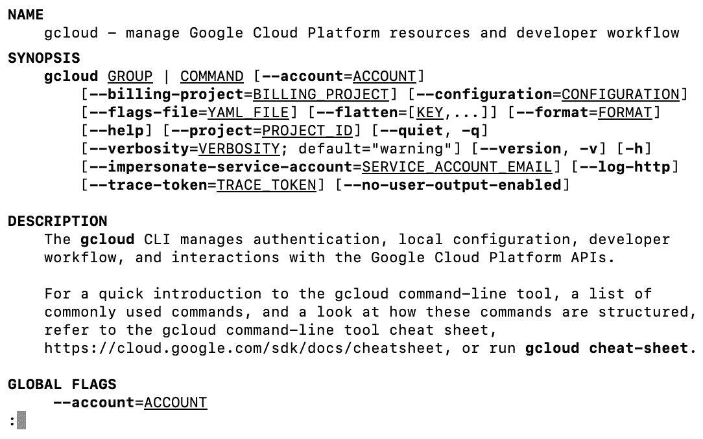

图 5.1 – gcloud SDK 验证

*图 5.1* 显示了 `gcloud` 命令的一般格式。使用 *Ctrl* + `C` 退出此模式并恢复命令提示符。

授予 Cloud TPU 访问你的项目权限

从这里开始，设置说明来自 Google Cloud 自己的文档网站，网址是：[`cloud.google.com/ai-platform/training/docs/using-tpus#tpu-runtime-versions`](https://cloud.google.com/ai-platform/training/docs/using-tpus#tpu-runtime-versions)：

1.  在此步骤中，我们将根据我们的项目 ID 检索云 TPU 服务账户名称。可以使用以下命令：

    ```py
    curl -H 'Authorization: Bearer $(gcloud auth print-access-token)'  \  https://ml.googleapis.com/v1/projects/<your-project-id>:getConfig
    ```

    上述命令将返回以下输出：

    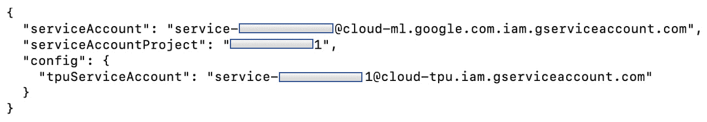

    图 5.2 – TPU 服务账户检索

1.  记下 `serviceAccountProject` 和 `tpuServiceAccount` 的详细信息。

1.  一旦我们知道 TPU 服务账户的信息，我们需要根据以下命令进行初始化：

    ```py
    curl -H 'Authorization: Bearer $(gcloud auth print-access-token)'  \  -H 'Content-Type: application/json' -d '{}'  \  https://serviceusage.googleapis.com/v1beta1/projects/<serviceAccountProject>/services/tpu.googleapis.com:generateServiceIdentity
    ```

前述命令会为你生成一个 Cloud TPU 服务账户。确保在 URL 中填写 `<serviceAccountProject>` 的详细信息。

将 TPU 服务账户添加为项目成员

我们使用的项目也必须知道 TPU 服务账户。在上一节的 *第 3 步* 中，我们将项目的 Bearer Token 传递给 TPU 服务账户，以便 TPU 可以访问我们的项目。基本上，这就像是将另一个成员添加到该项目中，在这种情况下，新的成员是 TPU 服务账户：

1.  我们可以使用 Google Cloud Console 来实现这一点，如 *图 5.3* 所示：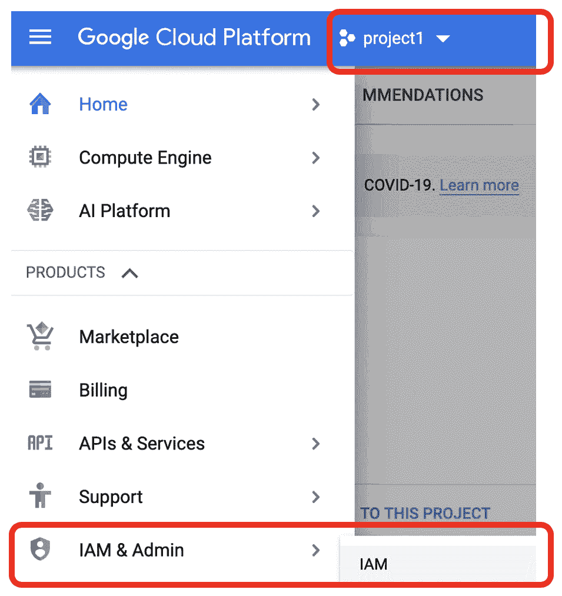

    图 5.3 – IAM & 管理入口

1.  在 **IAM** 屏幕上，点击 **添加** 按钮，将 TPU 添加到该项目，如 *图 5.4* 所示：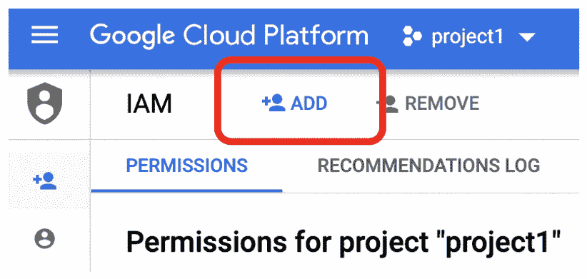

    图 5.4 – 向项目中添加成员

1.  然后，在 **新成员** 框中填写 TPU 服务账户的详细信息。在 **选择角色** 下，找到 **服务代理角色**，然后找到 **Cloud ML 服务代理**。如 *图 5.5* 所示：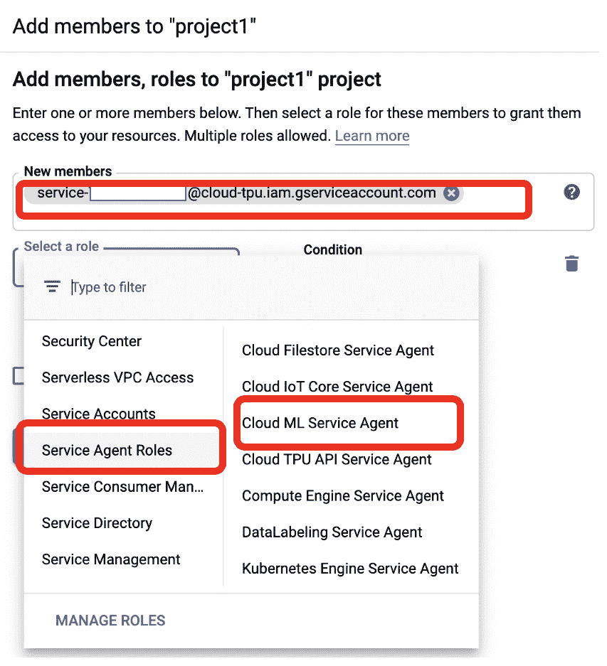

    图 5.5 – 为 TPU 服务账户分配 Cloud ML 服务代理角色

    我们还没有完成 TPU 服务账户的配置。我们还需要让它访问我们的训练数据，并将训练结果（如检查点和模型资产）写入存储。这意味着我们需要为 TPU 服务账户添加几个新的角色。

1.  我们点击 **添加另一个角色**，然后继续寻找 **项目**，如 *图 5.6* 所示：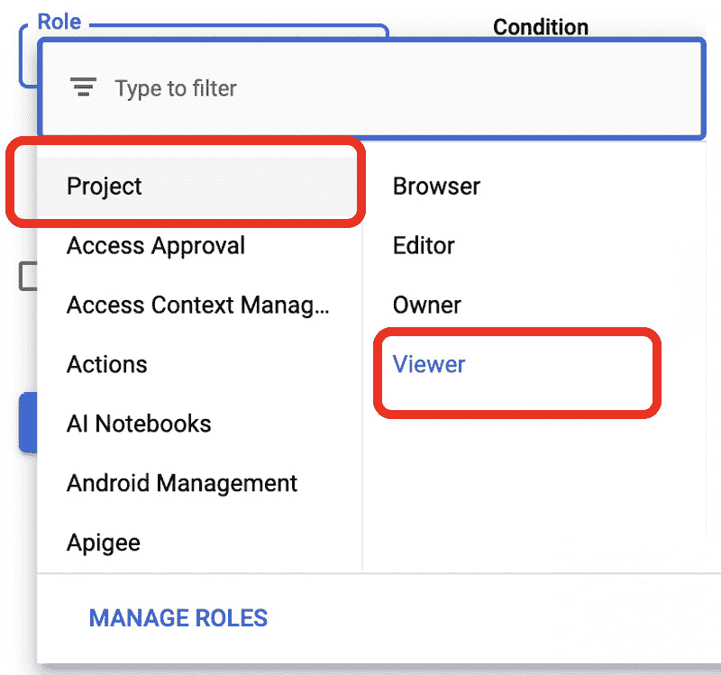

    图 5.6 – 为 TPU 服务账户分配项目查看者角色

1.  同样，我们还需要添加 **Cloud Storage Admin** 角色，如 *图 5.7* 所示：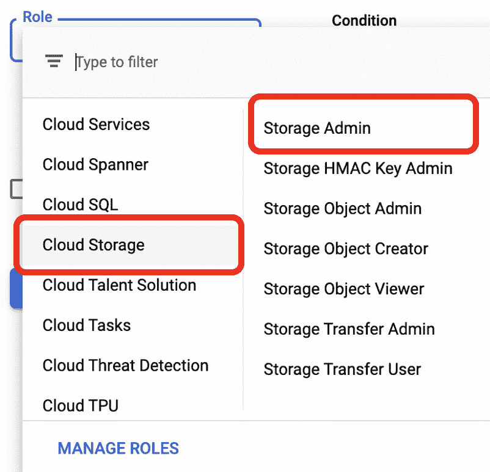

    图 5.7 – 为 TPU 服务账户分配存储管理员角色

1.  一旦设置好所有三个角色，点击 **保存**。

## 白名单访问以读取训练数据并写入工件（替代方案）

前述方法赋予 TPU 服务较为广泛的权限，允许 TPU 拥有对所有存储桶的管理员权限。如果你希望将 TPU 服务的权限限制为仅限某些存储桶，可以将 TPU 服务账户放入每个存储桶的 **访问控制列表**（**ACL**）中。你可以为训练数据存储桶执行此操作，如果希望训练任务将结果写入另一个存储桶，则也可以为该存储桶执行相同操作：

1.  我们可以从编辑存储桶权限开始，如 *图 5.8* 所示。选择 **权限** 标签页：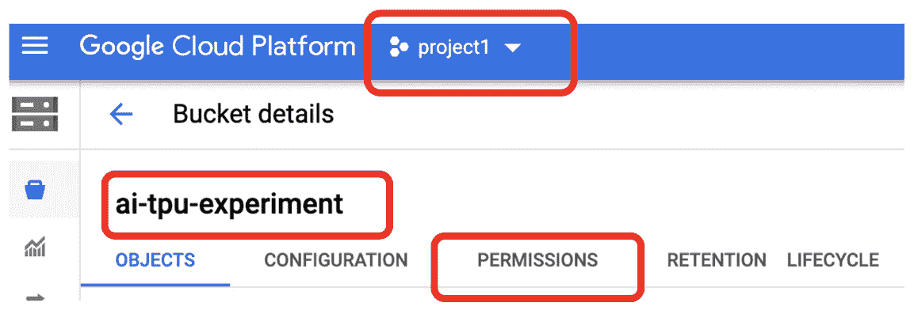

    图 5.8 – 编辑存储桶权限

1.  然后，点击 **添加**，如*图 5.9*所示：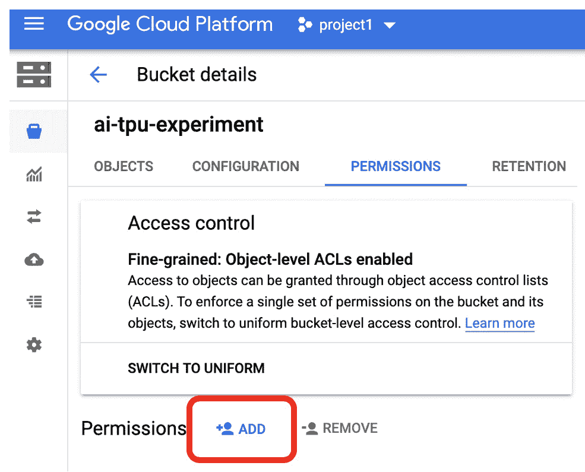

    图 5.9 – 将 TPU 服务账户添加到存储桶 ACL

1.  然后，通过填写服务账户名称，向 TPU 服务账户添加两个新角色，如*图 5.10*所示。在这个例子中，我们将使用相同的存储桶来托管训练数据和写入训练产物。因此，我们需要添加两个来自 **Cloud Storage Legacy** 的角色：**Storage Legacy Bucket Reader** 和 **Storage Legacy Bucket Writer**：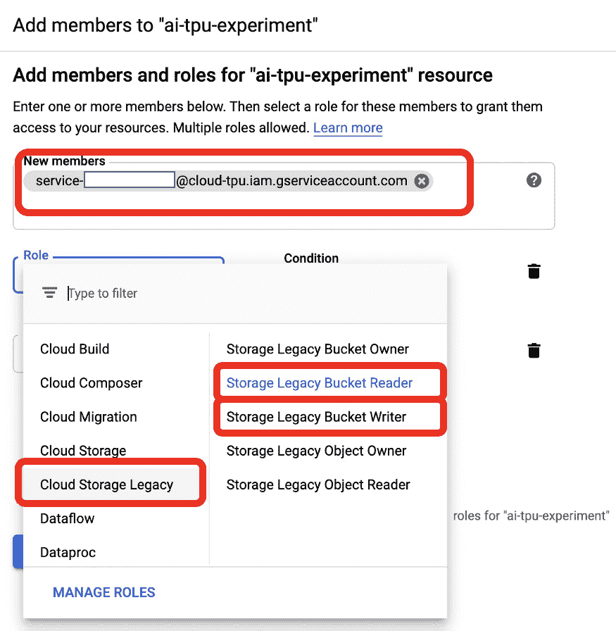

    图 5.10 – 将 TPU 服务账户列入存储桶的两个角色白名单

1.  一旦添加了这些角色，点击 **保存**。

我们已经完成了使用 Cloud TPU 进行模型训练工作流所需的最基本管理工作。在接下来的部分，我们将看到如何重构代码并设置 TPU 的分布式训练策略。

## 执行命令及格式

AI 平台还提供作为服务的模型训练功能。它允许用户从本地环境的命令行提交训练任务。该任务将在 Google Cloud 的计算集群上运行（提供不同定价层级的 CPU、TPU 或 GPU 选项）。如果你不熟悉作为服务的训练概念，可以参考此链接了解更多详情：[`cloud.google.com/ai-platform/training/docs/training-jobs`](https://cloud.google.com/ai-platform/training/docs/training-jobs)。

除了云端训练任务，AI 平台还可以执行云推理任务。我们即将运行的命令用于提交云端训练任务。你可以在跟随本章节的练习时保留这个链接作为参考：[`cloud.google.com/sdk/gcloud/reference/ai-platform/jobs/submit/training`](https://cloud.google.com/sdk/gcloud/reference/ai-platform/jobs/submit/training)。由于方法是将训练脚本保存在客户端节点（即安装了 Google Cloud SDK 的本地计算机）中，我们需要在执行 `gcloud ai-platform jobs submit training` 时，让 Google Cloud 运行时知道所有训练脚本的位置。此外，因为脚本中会导入一些库，我们还需要在名为 `setup.py` 的文件中指定信息，例如库的版本、名称等。为此，必须在工作目录中创建一个小的 `setup.py` 文件：

1.  在你的工作目录中的命令终端（对于 Mac OS X 或 Linux）中，输入以下内容：

    ```py
    setup.py. In install_requires, you will see a Python list that contains TensorFlow datasets or tensorflow_hub. This is where dependencies are added to the runtime in Google Cloud AI Platform.
    ```

1.  现在我们准备设置用于 Cloud TPU 的分布式训练命令，让我们首先看看命令及执行格式。回想一下，我们之前提到过，这个任务将在客户端运行的 Cloud SDK 中执行。一般来说，客户端节点将使用输入标志发出 `gcloud` 命令，格式如下：

    ```py
    gcloud ai-platform jobs submit training cloudtpu \
    --staging-bucket=gs://ai-tpu-experiment \
    --package-path=python \
    --module-name=python.ScriptProject.traincloudtpu_resnet_cache \
    --runtime-version=2.2 \
    --python-version=3.7 \
    --scale-tier=BASIC_TPU \
    --region=us-central1 \
    -- \
    --distribution_strategy=tpu \
    --model_dir=gs://ai-tpu-experiment/traincloudtpu_tfkd_resnet_cache \
    --train_epochs=10 \
    --data_dir=gs://ai-tpu-experiment/tfrecord-flowers
    ```

有比这里显示的更多标志（用户输入参数）。有关所有可能的输入参数的详细描述，请参阅 TensorFlow Google Cloud AI 平台参考文档([`cloud.google.com/sdk/gcloud/reference/ai-platform/jobs/submit/training`](https://cloud.google.com/sdk/gcloud/reference/ai-platform/jobs/submit/training))和 Cloud SDK 文档([`cloud.google.com/sdk/gcloud/reference/ai-platform`](https://cloud.google.com/sdk/gcloud/reference/ai-platform))。

## 云命令参数

示例命令（在本节后面讨论），说明了如图*5.11*所示的目录结构：

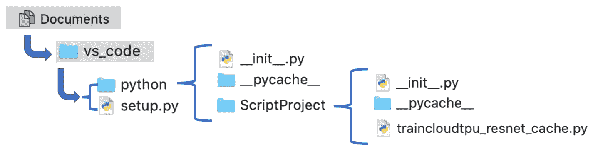

图 5.11 – 本地客户端示例训练运行的目录结构和文件组织

在前述图中的某些文件夹名称是个人选择：`vs_code`、`python`、`ScriptProject`。您可以根据自己的喜好命名这些文件夹。名为`traincloudtpu_resnet_cache`的训练脚本也是个人选择。

让我们看看这个示例命令。这个示例命令可以基于`-- \`分为两部分。命令的第一部分包括以下内容：

```py
gcloud ai-platform jobs submit training cloudtpu \
```

```py
--staging-bucket=gs://ai-tpu-experiment \
```

```py
--package-path=python \
```

```py
--module-name=python.ScriptProject.traincloudtpu_resnet_cache \
```

```py
--runtime-version=2.1 \
```

```py
--python-version=3.7 \
```

```py
--scale-tier=BASIC_TPU \
```

```py
--region=us-central1 \
```

这个命令在*图 5.11*中显示的`vs_code`目录中执行。在这个目录中，您会找到`setup.py`。这个文件告诉`gcloud`运行时有关训练脚本所需的依赖项或包。`cloudtpu`只是我们为这次训练运行提供的一个名称。我们还需要指定一个临时存储桶（云存储桶），用于在训练期间和训练后序列化模型工件。

`package-path`是组织项目的文件夹。在这种情况下，在此包中，我们有兴趣执行一个训练脚本，`traincloudtpu_resnet_cache.py`。为了让`gcloud`运行时找到它，我们需要指定以下内容：

```py
module-name=python.ScriptProject.traincloudtpu_resnet_cache
```

接下来，我们指定 TensorFlow Enterprise 版本为 2.1，Python 解释器版本为 3.7，这个示例应该足够使用`BASIC_TPU`规模级别。我们还将区域设置为`us-central1`。`BASIC_TPU`规模级别为我们提供了一个主 VM 和一个具有八个 TPU V2 核心的 TPU VM。

正如前面所述，`-- \`将`gcloud`系统标志与指定的任何其他用户定义的标志分隔开，并作为训练脚本的输入参数。这种分隔是必要且设计良好的。请勿混合系统标志和用户定义的标志。有关位置参数的详细信息，请参阅 SDK 参考文档([`cloud.google.com/sdk/gcloud/reference/ai-platform/jobs/submit/training`](https://cloud.google.com/sdk/gcloud/reference/ai-platform/jobs/submit/training))。

现在，让我们来看看这个命令的后半部分，其中包含用户定义的标志：

```py
--distribution_strategy=tpu \
```

```py
--model_dir=gs://ai-tpu-experiment/traincloudtpu_tfkd_resnet_cache \
```

```py
--train_epochs=10 \--data_dir=gs://ai-tpu-experiment/tfrecord-flowers
```

我们将 `distribution_strategy=tpu` 指定为用户定义的标志，因为我们可能会在条件逻辑中使用这个值来选择适当的分发策略。我们还指定了 `model_dir`，这是一个云存储路径，我们授予 TPU 服务写权限以序列化检查点和模型资源。然后，对于剩余的标志，我们指定了在 `train_epochs` 中进行训练的时期数，并指定了 `data_dir` 指示的训练数据路径，这也是一个云存储路径，我们授予 TPU 服务读权限。TPU 的分布式训练策略（[`www.tensorflow.org/guide/distributed_training#tpustrategy`](https://www.tensorflow.org/guide/distributed_training#tpustrategy)）实现了跨多个核心的所有必要操作。

## 组织训练脚本

本示例的训练脚本的一般结构采用了极简风格。在实践中，将 Python 代码组织到多个文件和模块中是很常见的。因此，我们将所有需要的内容放在一个 Python 脚本 `train.py` 中。其伪代码如下：

```py
def run( input parameters ):
```

```py
	# specify distribute strategy (https://cloud.google.com/
```

```py
	ai-platform/training/docs/using-tpus)
```

```py
	import tensorflow as tf
```

```py
	if distribution_strategy==TPU: 
```

```py
		resolver = tf.distribute.cluster_resolver.				TPUClusterResolver()
```

```py
	tf.config.experimental_connect_to_cluster(resolver)
```

```py
	tf.tpu.experimental.initialize_tpu_system(resolver)
```

```py
	strategy = tf.distribute.experimental.TPUStrategy(resolver)
```

```py
	# build data streaming pipeline with tf.io and tf.data.TFRecordDataset
```

```py
	# build model
```

```py
	# train model
```

```py
	# save results
```

```py
def main():
```

```py
run(input parameters)
```

```py
if __name__ == '__main__'
```

```py
app.run(main)
```

一旦运行了 `main()` 程序，它将调用 `run()`，在其中定义训练策略，然后构建数据流水线，接着构建和训练模型，最后将结果保存到云存储。

接下来，我们将深入研究 `train.py` 的实际代码。让我们从数据流水线开始。

## 数据流水线

当使用 Google Cloud AI Platform 时，目前唯一的数据流方式是通过 `tf.io` 和 `tf.dataTFRecordDataset`。

我们的数据集（TFRecord）已经在一个存储桶中。其组织结构如 *图 5.12* 所示：

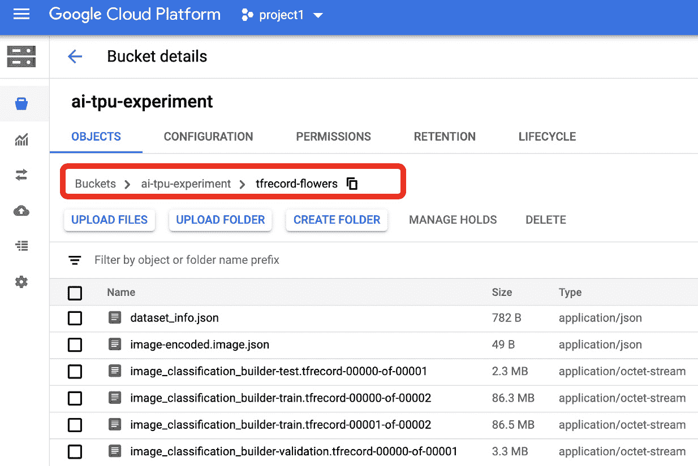

图 5.12 – 用于花卉图像分类数据集的云存储

1.  在我们训练脚本的 `run` 函数中，我们需要指定训练数据的云存储路径。我们可以利用 `tf.io.gfile` 对多个部分的文件名模式进行编码。接着，我们使用 `tf.data.TFRecordDataset` 实例化一个数据集对象：

    ```py
    root_dir = flags_obj.data_dir # this is gs://<bucket>/folder where tfrecord are stored
    train_file_pattern = '{}/image_classification_builder-train*.tfrecord*'.format(root_dir)
    val_file_pattern = '{}/image_classification_builder-validation*.tfrecord*'.format(root_dir)
    train_all_files = tf.data.Dataset.list_files( tf.io.gfile.glob(train_file_pattern))
    val_all_files = tf.data.Dataset.list_files( tf.io.gfile.glob(val_file_pattern))
    train_all_ds = tf.data.TFRecordDataset(train_all_files,num_parallel_reads=tf.data.experimental.AUTOTUNE)
    val_all_ds = tf.data.TFRecordDataset(val_all_files,num_parallel_reads=tf.data.experimental.AUTOTUNE)
    ```

    正如前面的代码所示，在编码数据集名称模式后，我们使用 `tf.data.Dataset.list_files` 来编码符合模式的所有文件名列表。然后，`tf.data.TFRecordDataset` 实例化一个数据集读取器对象。一旦在运行时执行了这些行，它有效地建立了 TPU 与云存储之间的连接。数据集对象在训练工作流中向模型流送数据。

    为什么我们不使用`tf.keras`生成器模式，比如`ImageDataGenerator`或`flow_from_directory`？实际上，这是因为`gcloud ai-platform jobs submit training`命令目前还不支持这种模式。这个模式在数据挂载或直接存储在文件系统中时非常方便，且通过用户输入的可选参数，能够轻松处理分类问题中的标签一热编码、图像归一化和标准化等过程。

1.  我们必须通过编写自己的函数来处理图像标准化（调整为不同的高度和宽度）。以下是一个在`TFRecordDataset`上执行这些操作的函数：

    ```py
        def decode_and_resize(serialized_example):
            # resized image should be [224, 224, 3] and have 	          value range [0, 255] 
            # label is integer index of class.

            parsed_features = tf.io.parse_single_example(
            serialized_example,
            features = {
            'image/channels' :  tf.io.FixedLenFeature([],    	                                           tf.int64),
            'image/class/label' :  tf.io.FixedLenFeature([], 	                                              tf.int64),
            'image/class/text' : tf.io.FixedLenFeature([], 	                                           tf.string),
            'image/colorspace' : tf.io.FixedLenFeature([], 	                                           tf.string),
            'image/encoded' : tf.io.FixedLenFeature([], 	                                                                                      	                                        tf.string),
            'image/filename' : tf.io.FixedLenFeature([], 	                                            	                                         tf.string),
            'image/format' : tf.io.FixedLenFeature([], 	                                                                                    	                                       tf.string),
            'image/height' : tf.io.FixedLenFeature([],  	                                         	                                        tf.int64),
            'image/width' : tf.io.FixedLenFeature([], 
                                            tf.int64)
            })
            image = tf.io.decode_jpeg(parsed_features[
                                'image/encoded'], channels=3)
            label = tf.cast(parsed_features[
                              'image/class/label'], tf.int32)
            label_txt = tf.cast(parsed_features[
                              'image/class/text'], tf.string)
            label_one_hot = tf.one_hot(label, depth = 5)
            resized_image = tf.image.resize(image, 
                                [224, 224], method='nearest')
            return resized_image, label_one_hot
    ```

    这个`decode_and_resize`函数解析数据集中的 JPEG 图像，并调整相应的颜色值范围，然后解析标签，对图像进行一热编码，并使用最近邻方法对图像进行调整大小，以将其标准化为 224×224 像素，适应我们选择的模型（ResNet）。该函数还提供了不同的方式返回标签，无论是纯文本还是整数。如果需要，你可以通过将感兴趣的标注添加到`return`元组中，返回不同格式和风格的标签：

    ```py
      return resized_image, label_one_hot, label_txt, label
    ```

    然后，根据返回元组在调用函数中的位置（如前述`return`语句所示的顺序）解包返回值。

1.  既然我们已经准备好了`decode_and_resize`函数，接下来就是如何将它应用到`dataset`对象中的每个元素：

    ```py
        dataset = train_all_ds.map(decode_and_resize)
    val_dataset = val_all_ds.map(decode_and_resize)
    ```

1.  然后，我们将每张图像的像素值重新缩放或归一化到`[0, 1]`范围内，以便所有图像的像素值范围一致，适合进行训练。让我们来创建一个`normalize`函数：

    ```py
    def normalize(image, label):
            #Convert `image` from [0, 255] -> [0, 1.0] floats 
            image = tf.cast(image, tf.float32) / 255\. + 0.5
            return image, label
    ```

    我们需要通过应用批处理操作来准备训练数据。我们使用以下函数来实现这一点：

    ```py
    def prepare_for_training(ds, cache=True, shuffle_buffer_size=1000):
            if cache:
                if isinstance(cache, str):
                    ds = ds.cache(cache)
                else:
                    ds = ds.cache()
            ds = ds.shuffle(buffer_size=shuffle_buffer_size)
            ds = ds.repeat()
            ds = ds.batch(BATCH_SIZE)
            AUTOTUNE = tf.data.experimental.AUTOTUNE
            ds = ds.prefetch(buffer_size=AUTOTUNE)
            return ds
    ```

    上述函数接受一个数据集，然后根据全局变量`BATCH_SIZE`对其进行洗牌和批处理，并为训练管道预取数据。

    我们再次使用`map`方法，将`normalize`操作应用到我们的训练集和验证集：

    ```py
    AUTOTUNE = tf.data.experimental.AUTOTUNE
    BATCH_SIZE = flags_obj.train_batch_size
    VALIDATION_BATCH_SIZE = flags_obj.validation_batch_size
    train_dataset = train_dataset.map(normalize, num_parallel_calls=AUTOTUNE)
    val_dataset = val_dataset.map(normalize, num_parallel_calls=AUTOTUNE)
    val_ds = val_dataset.batch(VALIDATION_BATCH_SIZE)   
    train_ds = prepare_for_training(train_dataset)
    ```

    这是`run`函数的数据管道部分。我们还没有完成`run`函数。

1.  接下来，我们将设置模型并进行训练。我们将利用流行的迁移学习技术，在我们的训练数据集上应用并训练一个预构建的模型。这里感兴趣的预构建模型是 ResNet-50 图像分类模型。记得我们之前已经为训练指定了基于 TPU 的分布式策略吗？我们可以在这里简单地将模型定义和优化器选择与该策略结合：

    ```py
    with strategy.scope():
      base_model = tf.keras.applications.ResNet50(
          input_shape=(224,224,3), include_top=False, 	   	      weights='imagenet')
      model = tf.keras.Sequential(
          [base_model,
           tf.keras.layers.GlobalAveragePooling2D(),
           tf.keras.layers.Dense(5, 
                                 activation='softmax', 
                                 name = 'custom_class')
           ])
      lr_schedule = \
      tf.keras.optimizers.schedules.ExponentialDecay(
          0.05, decay_steps=100000, decay_rate=0.96)
      optimizer = tf.keras.optimizers.SGD(
          learning_rate=lr_schedule)
    model.compile(optimizer=optimizer, 
      loss=tf.keras.losses.CategoricalCrossentropy(
          from_logits=True, label_smoothing=0.1),
          metrics=['accuracy'])
    ```

    上述代码描述了模型架构，指定了训练的优化策略，并编译了模型。我们使用 ResNet-50 特征向量作为分类五种花卉类型的基础模型。

1.  然后，我们通过以下代码来设置检查点和回调函数：

    ```py
    checkpoint_prefix = os.path.join(flags_obj.model_dir, 	                                          'ckpt_{epoch}')
        callbacks = [
        tf.keras.callbacks.ModelCheckpoint
    		(filepath=checkpoint_prefix,                                    
    		save_weights_only=True)]
    ```

    回调函数将在每个 epoch 训练过程中分别保存模型的权重和偏置作为检查点。

1.  接下来，我们需要在每个 epoch 设置训练和交叉验证的样本大小：

    ```py
    train_sample_size=0
        for raw_record in train_all_ds:
            train_sample_size += 1
        print('TRAIN_SAMPLE_SIZE = ', train_sample_size)
        validation_sample_size=0
        for raw_record in val_all_ds:
            validation_sample_size += 1
        print('VALIDATION_SAMPLE_SIZE = ', 
               validation_sample_size)
        steps_per_epoch = train_sample_size // BATCH_SIZE
        validation_steps = validation_sample_size 
                                     // VALIDATION_BATCH_SIZE
    ```

1.  最后，这里是训练过程的代码：

    ```py
    hist = model.fit(
            train_ds,
            epochs=flags_obj.train_epochs, 
                             steps_per_epoch=steps_per_epoch,
            validation_data=val_ds,
            validation_steps=validation_steps,
            callbacks=callbacks)
        model_save_dir = os.path.join(flags_obj.model_dir,  	                                            
    'save_model')
        model.save(model_save_dir)
    ```

    这就是 `run` 函数的结束。这个函数比较长，请确保注意所有正确的缩进标识。这只是 Google Cloud AI Platform 的一个最小示例。它包含了一个可扩展数据管道、分布式训练工作流和 TPU 使用的所有必要代码和模式。在实际应用中，您可以根据需要组织和重构代码，以提高代码的清晰性和可维护性。

## 提交训练脚本

现在是提交我们训练脚本的时候了。我们根据 *图 5.11* 中提到的本地目录结构，从 `vs_code` 目录提交它。Cloud AI Platform 中的 TensorFlow 运行时版本不一定是最新的，跟 Cloud AI Notebook 中的 TensorFlow 稳定版本相比。如我们所知，目前 Cloud Notebook 中的稳定版本是 TFE 2.3\，然而在 Cloud AI Platform 中，最新的版本是 2.2\。因此我们使用 `--runtime-version=2.2`。

您可以通过以下链接查看最新的运行时版本：[`cloud.google.com/ai-platform/prediction/docs/runtime-version-list`](https://cloud.google.com/ai-platform/prediction/docs/runtime-version-list)。

以下是命令和终端输出：

```py
vs_code % gcloud ai-platform jobs submit training traincloudtpu_tfk_resnet50 \
```

```py
--staging-bucket=gs://ai-tpu-experiment \
```

```py
--package-path=python \
```

```py
--module-name=python.ScriptProject.trainer \
```

```py
--runtime-version=2.2 \
```

```py
--python-version=3.7 \
```

```py
--scale-tier=BASIC_TPU \
```

```py
--region=us-central1 \
```

```py
-- \
```

```py
--distribution_strategy=tpu \
```

```py
--model_dir=gs://ai-tpu-experiment/traincloudtpu_tfk_resnet50 \
```

```py
--train_epochs=10 \
```

```py
--data_dir=gs://ai-tpu-experiment/tfrecord-flowers
```

```py
Job [traincloudtpu_tfk_resnet50] submitted successfully.
```

您的作业仍然处于活动状态。您可以使用以下命令查看作业的状态：

```py
  $ gcloud ai-platform jobs describe traincloudtpu_tfk_resnet50
```

或者，您可以使用以下命令继续流式传输日志：

```py
  $ gcloud ai-platform jobs stream-logs traincloudtpu_tfk_resnet50
```

```py
jobId: traincloudtpu_tfk_resnet50
```

```py
state: QUEUED
```

前面的命令将一段训练代码提交到 Cloud TPU。从当前目录（`vs_code`）来看，有一个子文件夹（`python`），其中包含一个 `ScriptProject` 模块。在 `ScriptProject` 中，有一部分脚本名为 `trainer.py`。您可以在 GitHub 仓库中查看 `trainer.py` 的内容，链接为：[`github.com/PacktPublishing/learn-tensorflow-enterprise/blob/master/chapter_05/cnn_on_tpu/custom_model_on_tpu/trainer.py`](https://github.com/PacktPublishing/learn-tensorflow-enterprise/blob/master/chapter_05/cnn_on_tpu/custom_model_on_tpu/trainer.py)。

我们还必须指定以下参数，这些参数在 `trainer.py` 中使用（[`github.com/PacktPublishing/learn-tensorflow-enterprise/blob/master/chapter_05/cnn_on_tpu/custom_model_on_tpu/trainer.py`](https://github.com/PacktPublishing/learn-tensorflow-enterprise/blob/master/chapter_05/cnn_on_tpu/custom_model_on_tpu/trainer.py)）：

```py
Job name: traincloudtpu_tfk_resnet50
```

```py
Staging bucket is gs://ai-tpu-experiment
```

```py
Bucket to save the model is gs://ai-tpu-experiment/traincloudtpu_tfk_resnet50
```

```py
Training data is in gs://tfrecord-dataset/flowers
```

一旦我们提交前面的命令，它将进入您的 Cloud AI Platform 实例队列中等待执行。要查看我们可以在哪里监控训练过程，可以运行`gcloud ai-platform` `jobs describe traincloudtpu_tfk_resnet50` 来获取正在运行日志的 URL：

```py
vs_code % gcloud ai-platform jobs describe traincloudtpu_tfk_resnet50
```

```py
createTime: ‚2020-08-09T20:59:16Z'
```

```py
etag: QMhh5Jz_KMU=
```

```py
jobId: traincloudtpu_tfk_resnet50
```

```py
state: PREPARING
```

```py
trainingInput:
```

```py
  args:
```

```py
  - --distribution_strategy=tpu
```

```py
  - --model_dir=gs://ai-tpu-experiment/traincloudtpu_tfk_resnet50
```

```py
  - --train_epochs=10
```

```py
  - --data_dir=gs://ai-tpu-experiment/tfrecord-flowers
```

```py
  packageUris:
```

```py
  - gs://ai-tpu-experiment/traincloudtpu_tfk_resnet50/XXXXXX/official-0.0.0.tar.gz
```

```py
  pythonModule: python.ScriptProject.trainer
```

```py
  pythonVersion: '3.7'
```

```py
  region: us-central1
```

```py
  runtimeVersion: '2.2'
```

```py
  scaleTier: BASIC_TPU
```

```py
trainingOutput: {}
```

你可以在 Cloud Console 中查看作业 [`console.cloud.google.com/mlengine/jobs/traincloudtpu_tfk_resnet50?project=project1-190517`](https://console.cloud.google.com/mlengine/jobs/traincloudtpu_tfk_resnet50?project=project1-190517)。

你可以在 [`console.cloud.google.com/logs?resource=ml_job%2Fjob_id%2Ftraincloudtpu_tfk_resnet50&project=project1-190517`](https://console.cloud.google.com/logs?resource=ml_job%2Fjob_id%2Ftraincloudtpu_tfk_resnet50&project=project1-190517) 查看日志。

根据前面的代码和高亮输出，我们可以在浏览器中访问日志 URL，并观察训练进度。以下是一些示例摘录（参见 *图 5.13* 和 *图 5.14*）：

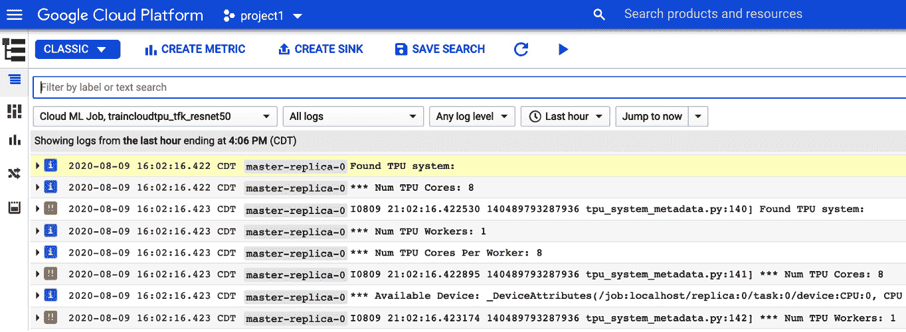

图 5.13 – Google Cloud AI Platform TPU 训练日志示例摘录 1

这是一个较长的日志，直到训练作业完成才会停止。接近训练结束时，日志看起来像这样：

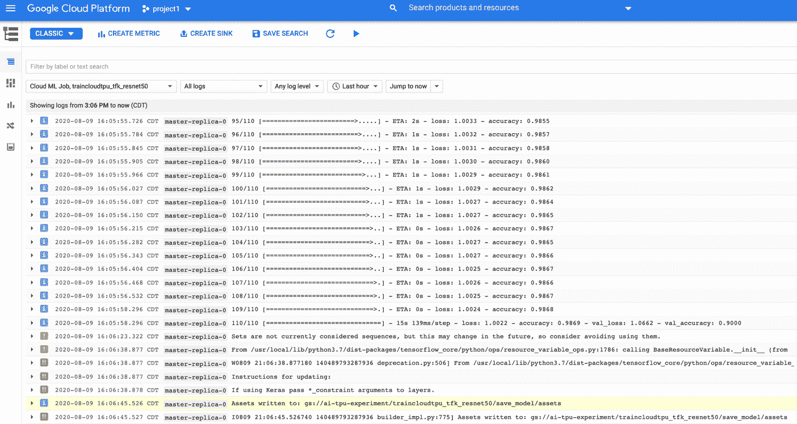

图 5.14 – Google Cloud AI Platform TPU 训练日志示例摘录 2

在存储桶中，我们看到由训练工作流创建的文件夹（*图 5.15*）：

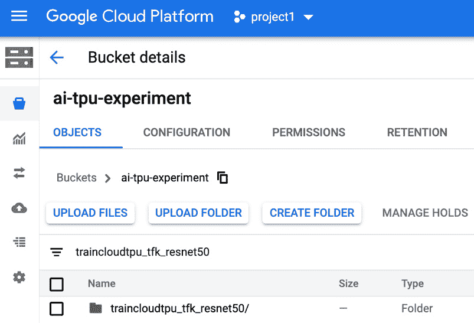

图 5.15 – TPU 训练工作流创建的文件夹

在这个存储桶里，我们看到了检查点和模型资产（*图 5.16*）：

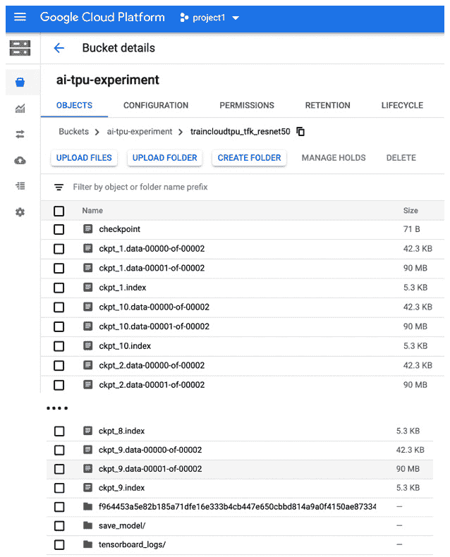

图 5.16 – TPU 完成训练工作流后的模型检查点和资产

它与在本地独立机器上训练时完全相同。完整的 `trainer.py` 文件可在 [`github.com/PacktPublishing/learn-tensorflow-enterprise/blob/master/chapter_05/cnn_on_tpu/custom_model_on_tpu/trainer.py`](https://github.com/PacktPublishing/learn-tensorflow-enterprise/blob/master/chapter_05/cnn_on_tpu/custom_model_on_tpu/trainer.py) 获取。

接下来，我们将查看如何重用我们在这里学到的内容。事实证明，如果我们想要使用 TensorFlow Hub 中可用的模型，我们可以重用训练模式、文件组织和工作流。但是，稍微需要进行一些调整。这是因为目前 TPU 无法直接访问 TensorFlow Hub 的模块 URL。

## 在 TensorFlow Hub 中使用模型

TensorFlow Hub 托管了大量预训练模型。然而，要使用这些模型，用户或客户端代码必须能够连接到 Hub 并通过 RESTful API 下载模型到客户端的 TensorFlow 运行时。目前，TPU 无法直接进行此操作。因此，我们必须先从 TensorFlow Hub 下载我们感兴趣的模型到本地计算机，然后将其上传到云存储，以便 TPU 可以访问。通常情况下，以下是使用 `tf.keras` API 从 TensorFlow Hub 实现预训练模型的步骤：

```py
m = tf.keras.Sequential([
```

```py
    hub.KerasLayer('https://tfhub.dev/google/imagenet/resnet_v2_50/feature_vector/4', trainable=False),  
```

```py
    tf.keras.layers.Dense(num_classes, activation='softmax')
```

```py
])
```

```py
m.build([None, 224, 224, 3])  # Batch input shape.
```

如前述代码所示，预训练模型的 URL 会传递给 `KerasLayer`。然而，目前，运行在 Cloud AI Platform 上的 TPU 无法直接访问 TensorFlow Hub 的 URL。为了下载模型，请按照 TensorFlow Hub 网站上的简单说明操作，如*图 5.17*所示：

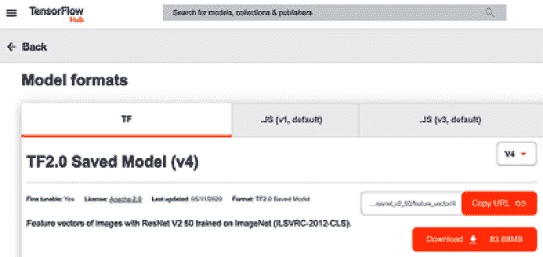

图 5.17 – 从 TensorFlow Hub 下载预训练模型

模型已被压缩。解压后，您将看到如*图 5.18*所示的内容：

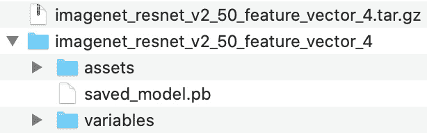

图 5.18 – 从 TensorFlow Hub 下载的预训练模型

下载并解压模型后，让我们将其上传到 TPU 服务帐户可以访问的存储桶，如*图 5.19*所示：

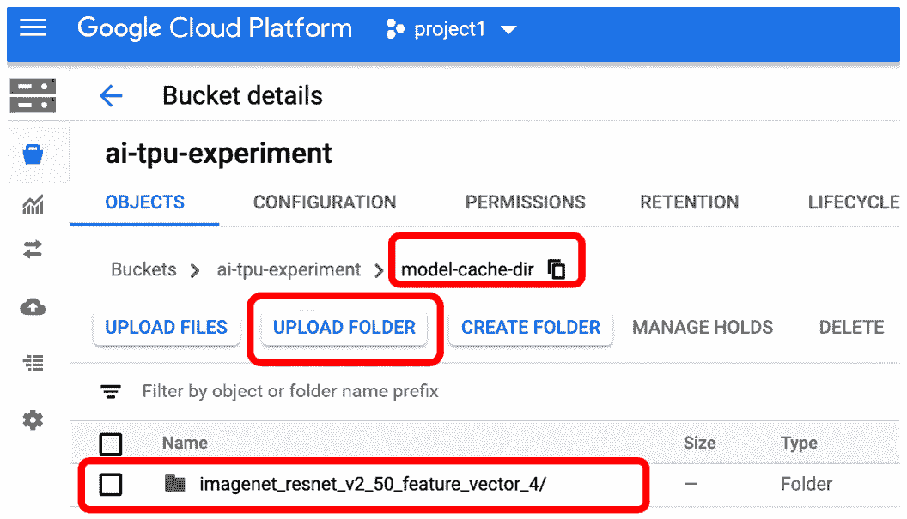

图 5.19 – 将预训练模型上传至云存储

请注意，我们在存储桶中创建了一个`model-cache-dir`文件夹，然后选择了**上传文件夹**，现在该模型文件夹已可供 TPU 使用。

然后，在 `run` 函数内部，我们需要利用环境变量来告诉 TPU 在哪里找到这个模型：

```py
os.environ['TFHUB_CACHE_DIR'] = 'gs://ai-tpu-experiment/model-cache-dir/imagenet_resnet_v2_50_feature_vector_4'
```

这行代码可以插入到 `run` 函数中的模型定义之前。在模型定义中，我们将像往常一样使用 `hub.KerasLayer` 来指定模型架构：

```py
with strategy.scope():
```

```py
  model = tf.keras.Sequential([
```

```py
     tf.keras.layers.InputLayer(input_shape=IMAGE_SIZE + (3,)),
```

```py
     hub.KerasLayer('https://tfhub.dev/google/imagenet/resnet_v2_50/feature_vector/4',
```

```py
                   trainable=flags_obj.fine_tuning_choice),
```

```py
            tf.keras.layers.Dense(5, activation='softmax', 
```

```py
                                         name = 'custom_class')
```

```py
        ])
```

由于我们已经在环境变量中定义了`TFHUB_CACHE_DIR`，并指定了云存储名称和路径，因此当 TPU 执行模型架构代码中的`hub.KerasLayer`部分时，TPU 运行时会首先从`TFHUB_CACHE_DIR`查找模型，而不是尝试通过 RESTful API 调用来获取模型。对训练脚本进行这些小的修改后，我们可以将其重命名为`trainer_hub.py`。训练工作可以通过类似的调用方式启动：

```py
vs_code % gcloud ai-platform jobs submit training traincloudtpu_tfhub_resnet50 \
```

```py
--staging-bucket=gs://ai-tpu-experiment \
```

```py
--package-path=python \
```

```py
--module-name=python.ScriptProject.trainer_hub \
```

```py
--runtime-version=2.2 \
```

```py
--python-version=3.7 \
```

```py
--scale-tier=BASIC_TPU \
```

```py
--region=us-central1 \
```

```py
-- \
```

```py
--distribution_strategy=tpu \
```

```py
--model_dir=gs://ai-tpu-experiment/traincloudtpu_tfhub_resnet50 \
```

```py
--train_epochs=10 \
```

```py
--data_dir=gs://ai-tpu-experiment/tfrecord-flowers
```

```py
Job [traincloudtpu_tfhub_resnet50] submitted successfully.
```

您的任务仍在进行中。您可以使用以下命令查看任务的状态

```py
  $ gcloud ai-platform jobs describe traincloudtpu_tfhub_resnet50
```

或继续使用命令流式传输日志

```py
  $ gcloud ai-platform jobs stream-logs traincloudtpu_tfhub_resnet50
```

```py
jobId: traincloudtpu_tfhub_resnet50
```

```py
state: QUEUED
```

完整的 `trainer_hub.py` 代码可在 [`github.com/PacktPublishing/learn-tensorflow-enterprise/blob/master/chapter_05/tfhub_on_tpu/tfhub_resnet_fv_on_tpu/trainer_hub.py`](https://github.com/PacktPublishing/learn-tensorflow-enterprise/blob/master/chapter_05/tfhub_on_tpu/tfhub_resnet_fv_on_tpu/trainer_hub.py) 查阅。

接下来，我们将看看如何使用`gcloud ai-platform`命令利用 GPU 进行类似的训练工作。

# 通过 AI Platform 使用 Google Cloud GPU

在完成了上一节中关于使用 AI Platform 的 Cloud TPU 的部分后，我们准备好使用 GPU 进行同样的操作。事实证明，训练脚本和调用命令的格式非常相似。除了增加一些参数和在分布式策略定义上有些许差异外，其他一切都保持不变。

目前有几种分布式策略（[`www.tensorflow.org/guide/distributed_training#types_of_strategies`](https://www.tensorflow.org/guide/distributed_training#types_of_strategies)）可供选择。对于 Google AI Platform 中的 TensorFlow Enterprise 版本，`MirroredStrategy`和`TPUStrategy`是唯一完全支持的策略。其他策略都处于实验阶段。因此，在本节的示例中，我们将使用`MirroredStrategy`。该策略在每个 GPU 上创建模型中所有变量的副本。由于这些变量在每次梯度下降步骤时都会更新，值的更新会同步复制到每个 GPU。默认情况下，该策略使用`NVIDIA NCCL`的全归约实现。现在，我们将从以下步骤开始：

1.  我们可以从对上一节使用的 TPU 训练脚本进行小的修改开始。让我们实现一个条件，根据选择 TPU 或 GPU 来选择分布式策略：

    ```py
        if flags_obj.distribution_strategy == 'tpu':
            resolver = tf.distribute.cluster_resolver.TPUClusterResolver()
            tf.config.experimental_connect_to_cluster(resolver)
            tf.tpu.experimental.initialize_tpu_system(resolver)
            strategy = tf.distribute.experimental.TPUStrategy(resolver)
            strategy_scope = strategy.scope()
            print('All devices: ', tf.config.list_logical_devices('TPU'))
        elif flags_obj.distribution_strategy == 'gpu': 
            devices = ['device:GPU:%d' % i for i in range(flags_obj.num_gpus)]
            strategy = tf.distribute.MirroredStrategy(device=devices)
            strategy_scope = strategy.scope()
    ```

    使用`MirroredStrategy`与 GPU 一起使用的训练脚本的完整实现可以在[`github.com/PacktPublishing/learn-tensorflow-enterprise/blob/master/chapter_05/tfhub_on_gpu/tfhub_resnet_fv_on_gpu/trainer_hub_gpu.py`](https://github.com/PacktPublishing/learn-tensorflow-enterprise/blob/master/chapter_05/tfhub_on_gpu/tfhub_resnet_fv_on_gpu/trainer_hub_gpu.py)找到。

    对于`MirroredStrategy`，我们将`scale-tier`设置为`BASIC_GPU`。这将为我们提供一个包含一块 NVIDIA Tesla K80 GPU 的单个工作实例。使用`trainer_hub_gpu.py`启动训练的命令如下：

    ```py
    vs_code % gcloud ai-platform jobs submit training traincloudgpu_tfhub_resnet_gpu_1 \
    --staging-bucket=gs://ai-tpu-experiment \
    --package-path=python \
    --module-name=python.ScriptProject.trainer_hub \
    --runtime-version=2.2 \
    --python-version=3.7 \
    --scale-tier=BASIC_GPU \
    --region=us-central1 \
    -- \
    --distribution_strategy=gpu \
    --model_dir=gs://ai-tpu-experiment/traincloudgpu_tfhub_resnet_gpu_1 \
    --train_epochs=10 \
    --data_dir=gs://ai-tpu-experiment/tfrecord-flowers
    Job [traincloudtpu_tfhub_resnet_gpu_1] submitted successfully.
    ```

您的工作仍在进行中。您可以使用命令查看工作状态

```py
  $ gcloud ai-platform jobs describe traincloudgpu_tfhub_resnet_gpu_1
```

或者使用命令继续流式传输日志

```py
  $ gcloud ai-platform jobs stream-logs traincloudtpu_tfhub_resnet_gpu_1
```

```py
jobId: traincloudgpu_tfhub_resnet_gpu_1
```

```py
state: QUEUED
```

注意到我们将`scale-tier`更改为`BASIC_GPU`。我们将特定于脚本的`distribution_strategy`标志设置为`gpu`。这就是我们指定所需计算实例和分发策略的方式。

# 总结

从我们在本章中涵盖的所有示例中，我们学会了如何通过 AI Platform 利用 TPU 和 GPU 的分布式训练策略，该平台运行在 TensorFlow Enterprise 2.2 版本上。AI Platform 是一个封装 TPU 或 GPU 加速硬件的服务，并管理您的训练作业的配置和设置。

目前，在 Google AI Platform 中，数据摄取管道依赖于`TFRecordDataset`将训练数据批量流式传输到模型训练工作流中。我们还学习了如何通过使用`TFHUB_CACHE_DIR`环境变量来利用从 TensorFlow Hub 下载的预构建模型。这也是将自己保存的模型从离线环境导入到 Google AI Platform 的方式。总体来说，在该平台上，我们使用 TensorFlow Enterprise 2.2 发行版来实现可扩展的数据流和在 Google Cloud 的 TPU 或 GPU 上进行分布式训练，并将所有模型检查点和资产序列化并回传至云存储。

在下一章，我们将使用 Cloud AI Platform 提交一个超参数调优作业。超参数调优通常非常耗时且资源密集。我们将看到如何利用 Cloud TPU 的计算能力来加速这个过程。
