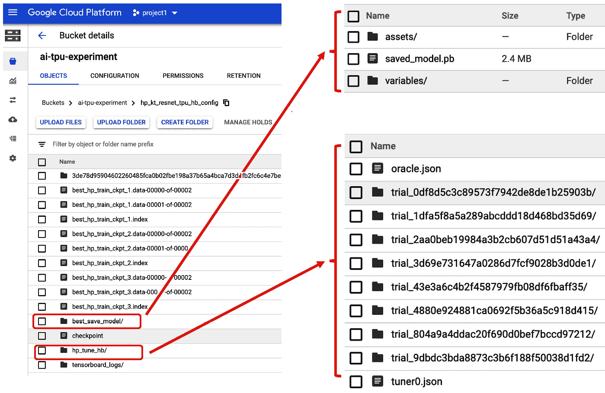

第六章：

# 第七章：超参数调优

本章我们将首先介绍三种不同的超参数调优算法——Hyperband、贝叶斯优化和随机搜索。这些算法已在`tf.keras` API 中实现，使它们相对容易理解。通过这个 API，你现在可以使用简化的接口来调用这些我们在本章中会遇到的复杂和先进的算法。我们将学习如何实现这些算法，并使用我们能找到的最佳超参数来构建和训练图像分类模型。我们还将学习其学习过程的细节，以便知道需要搜索和优化哪些超参数。我们将从获取和准备数据开始，然后将算法应用于数据。在此过程中，我们还将尝试理解关键原理和逻辑，以便将用户选择的这些算法作为输入，同时我们将学习如何在 GCP Cloud TPU 中提交调优和训练作业的模板。

本章我们将涵盖以下主题：

+   划分超参数类型

+   理解 Keras Tuner 的语法和使用方法

+   划分超参数搜索算法

+   在本地环境中提交调优作业

+   在 Google 的 AI 平台上提交调优作业

# 技术要求

本章的完整代码库可以在以下 GitHub 仓库中找到，请克隆到你的环境中：

[`github.com/PacktPublishing/learn-tensorflow-enterprise/blob/master/chapter_06/`](https://github.com/PacktPublishing/learn-tensorflow-enterprise/blob/master/chapter_06/)

这可以通过命令行环境来完成：

```py
git clone https://github.com/PacktPublishing/learn-tensorflow-enterprise.git
```

# 划分超参数类型

在我们开发模型及其训练过程时，我们定义变量并设置其值，以决定训练流程和模型结构。这些值（例如多层感知器中某层的隐藏节点数，或者优化器和损失函数的选择）被称为超参数。这些参数由模型创建者指定。机器学习模型的性能通常依赖于模型架构和在训练过程中选择的超参数。为模型找到一组最优的超参数并非易事。完成这一任务的最简单方法是网格搜索，也就是在搜索空间内构建所有可能的超参数值组合，并比较这些组合的评估指标。虽然这种方法直接且全面，但它是一个繁琐的过程。我们将看到新版本的`tf.keras` API 是如何实现三种不同的搜索算法的。

在模型训练的背景下，有两种类型的超参数：

+   **模型超参数**：这些参数与模型层的结构直接相关，比如层中节点的数量。

+   **算法超参数**：这些参数是执行学习算法所必需的，例如在梯度下降过程中使用的损失函数中的学习率，或者损失函数的选择。

如果你想使用网格搜索技术，扫描两种类型的超参数所需的代码修改将非常复杂。在这种情况下，一个更高效、更全面的框架对于超参数调优非常有帮助。

在本章中，我们将看到 TensorFlow 生态系统中最新的超参数调优框架——Keras Tuner。顾名思义，它是为使用 TensorFlow 2.x Keras API 开发的模型而设计的。此框架的最低要求是 TensorFlow 2.0+ 和 Python 3.6。它作为 TensorFlow 2.3 发行版的一部分发布。如果你还没有使用 TensorFlow 2.3，那么只要你使用的是 TensorFlow 2.x，Keras Tuner 就可以通过以下命令安装：

```py
pip install keras-tuner
```

一旦安装了 Keras Tuner，你可以在你的 Python 代码中加载它。

注意

在导入 `keras-tuner` 时，你不需要在其中加上破折号 `-`。它将这样导入：`import kerastuner as kt`。

Keras Tuner 是一个可分发的超参数优化框架，有助于定义超参数集合的搜索空间。它还包括以下三种内置算法，帮助找到最佳超参数：

+   Hyperband

+   贝叶斯优化

+   随机搜索

对于 Keras Tuner，无论是模型超参数还是算法超参数，这些超参数的语法或定义方式没有区别。因此，你在选择调优哪些超参数时具有极大的灵活性，无需复杂的编码模式或循环。

Keras Tuner 框架使我们可以轻松修改训练脚本。虽然涉及到一些更改和重构，但 API 格式和逻辑流程与 Keras 风格和实现保持高度一致。在进入示例之前，我们先花一些时间了解这个框架，并看看如何扩展我们的训练代码来适应它。

# 理解 Keras Tuner 的语法和用法

就 Keras Tuner 而言，超参数通常可以通过以下三种数据类型来描述：整数、浮动点和从离散值或对象列表中选择的选项。在接下来的子章节中，我们将更详细地了解如何在模型架构和训练工作流的不同部分中使用这些数据类型定义超参数。

## 使用 hp.Int 定义超参数

Keras Tuner 以非常简单直观的方式定义了一个搜索空间。要定义给定层中可能的节点数量，通常你会像这样定义一个层：

```py
tf.keras.layers.Dense(units = hp_units, activation = 'relu')
```

在前面的代码行中，`hp_units` 是该层的节点数量。如果您希望将 `hp_units` 作为超参数进行搜索，那么您只需定义该超参数搜索空间的定义。下面是一个示例：

```py
hp = kt.HyperParameters()
```

```py
hp_units = hp.Int('units', min_value = 64, max_value = 256, step = 16)
```

`hp` 是表示 `kerastuner` 实例的对象。

这仅仅是一个在 `64` 和 `256` 之间以 `16` 为增量的整数数组。当应用于 `Dense` 层时，它变成了 `hp_units` 的搜索空间中的可能值数组。

## 使用 `hp.Choice` 进行超参数定义

如果您有一组预定值，并且这些值不是增量的，您可以像下面的代码行一样指定一个值列表：

```py
hp_units = hp.Choice('units', values = [64, 80, 90])
```

`hp_Choice` 是一种灵活的超参数类型。它也可以用来定义算法的超参数，如激活函数。所需的只是可能激活函数的名称。不同激活函数的搜索空间可能如下所示：

```py
hp_activation = hp.Choice('dense_activation', values=['relu', 'tanh', 'sigmoid'])
```

然后，使用该超参数的层的定义将是：

```py
tf.keras.layers.Dense(units = hp_units, activation = hp_activation)
```

`hp.Choice` 可能应用的另一个地方是当您想尝试不同的优化器时：

```py
hp_optimizer = hp.Choice('selected_optimizer', ['sgd', 'adam'])
```

然后，在模型编译步骤中，指定优化器时，您只需将 `optimizer` 定义为 `hp_optimizer`：

```py
model.compile(optimizer = hp_optimizer, loss = …, metrics = …)
```

在前面的示例中，我们将 `hp_optimizer` 传递到模型编译步骤中，作为我们在训练过程中使用的优化器的选择。

## 使用 `hp.Float` 进行超参数定义

浮动点数通常出现在训练工作流中的参数，例如优化器的学习率。这里是一个示例，展示了如何在优化器的学习率作为超参数的情况下进行定义：

```py
hp_learning_rate = hp.Float('learning_rate', min_value = 1e-4, max_value = 1e-2, step = 1e-3)
```

```py
optimizer=tf.keras.optimizers.SGD(lr=hp_learning_rate, momentum=0.5)
```

在前面的代码中，我们为优化器的学习率定义了一个搜索空间。然后，我们将 `hp_learning_rate` 对象传递到优化器定义中。

作为示例，我创建了一个 `model_builder` 函数。此函数接受定义超参数搜索空间的 `hp 对象`，然后将 `hp 对象` 传递到模型架构中。该函数返回完成的模型。下面是 `model_builder` 函数：

```py
def model_builder(hp):
```

```py
    hp_units = hp.Int('units', min_value = 64, max_value = 256, 
```

```py
                                                     step = 64) 
```

```py
    hp_activation = hp.Choice('dense_activation', 
```

```py
        values=['relu', 'tanh', 'sigmoid'])
```

```py
    IMAGE_SIZE = (224, 224)
```

```py
    model = tf.keras.Sequential([
```

```py
    tf.keras.layers.InputLayer(input_shape=IMAGE_SIZE + (3,)), 
```

```py
    hub.KerasLayer('https://tfhub.dev/google/imagenet/resnet_v2_50/feature_vector/4', trainable=False),
```

```py
    tf.keras.layers.Flatten(),
```

```py
    tf.keras.layers.Dense(units = hp_units, 
```

```py
                          activation = hp_activation, 
```

```py
                          kernel_initializer='glorot_uniform'),
```

```py
    tf.keras.layers.Dense(5, activation='softmax', 
```

```py
                                         name = 'custom_class')
```

```py
    ])
```

```py
    model.build([None, 224, 224, 3])
```

```py
    model.compile(
```

```py
        optimizer=tf.keras.optimizers.SGD(lr=1e-2, 
```

```py
                                                momentum=0.5), 
```

```py
        loss=tf.keras.losses.CategoricalCrossentropy(
```

```py
                        from_logits=True, label_smoothing=0.1),
```

```py
        metrics=['accuracy'])
```

```py
return model
```

使用 Keras Tuner API，搜索空间格式和在模型层或训练算法中引用搜索空间的方式非常直观，并且提供了很大的灵活性。所做的只是定义一个搜索空间，然后将包含搜索空间的对象传递到模型定义中。如果按照网格搜索方法处理条件逻辑，将会是一项艰巨的任务。

接下来，我们将看看如何使用 Keras Tuner 类来指定以下三种不同的搜索算法：

+   Hyperband

+   贝叶斯优化

+   随机搜索

# 描述超参数搜索算法

在这一部分，我们将更深入地了解三种遍历超参数搜索空间的算法。这些算法是通过 `tf.keras` API 实现的。

## Hyperband

超参数搜索本身是一个繁琐的过程，需要一个预算 `B` 来测试有限数量的超参数配置 `n`。在这个过程中，预算只是表示计算时间（由 epoch 和训练数据子集大小来指示）。Hyperband 算法利用早停和连续减半的策略，使其能够在给定的时间和硬件资源下评估更多的超参数配置。早停有助于在投入过多训练时间之前，剔除那些性能差的配置。

连续减半方法非常直观：对于一组超参数配置，将它们通过相同的预算（即：epoch、内存和训练数据子集大小）运行。然后我们对这些配置的性能进行排名，丢弃性能最差的一半配置。这个过程会一直重复，直到只剩下一个配置。这类似于淘汰赛制，在每一轮比赛中，半数配置被淘汰，直到只剩下一个。

Hyperband 算法中有两个 `for` 循环：

+   内部循环执行连续减半，丢弃一部分超参数配置，从而减少搜索空间。

+   外部循环，遍历不同的 `B` 和 `n` 的组合。

在早期迭代中，有许多候选配置。每个候选配置都会分配一定的预算 `B` 来进行训练，早停策略确保在浪费过多训练时间之前，提前丢弃这些配置中的一半（即，性能最差的一半）。随着连续减半，比赛轮次逐渐减少，剩下的候选配置越来越少，因此每个候选配置获得更多预算 `B` 的可能性更大。这个过程会一直持续，直到最后一个超参数配置剩下。因此，你可以将 Hyperband 算法看作是一种通过尽早丢弃低性能配置来选择最佳超参数配置的方法。

以下是 Hyperband 算法的更多信息参考：[`openreview.net/pdf?id=ry18Ww5ee`](https://openreview.net/pdf?id=ry18Ww5ee)。

现在让我们来看一下如何定义一个使用 Hyperband 算法的调优器实例（有关 API 及其参数的详细说明，请参见 [`keras-team.github.io/keras-tuner/documentation/tuners/`](https://keras-team.github.io/keras-tuner/documentation/tuners/)）。下面是一个示例：

```py
import kerastuner as kt
```

```py
import tensorflow_hub as hub
```

```py
import tensorflow as tf
```

```py
from absl import flags
```

```py
flags_obj = flags.FLAGS
```

```py
strategy = tf.distribute.MirroredStrategy()
```

```py
tuner = kt.Hyperband(
```

```py
            hypermodel = model_builder,
```

```py
            objective = 'val_accuracy', 
```

```py
            max_epochs = 3,
```

```py
            factor = 2,
```

```py
            distribution_strategy=strategy,
```

```py
            directory = flags_obj.model_dir,
```

```py
            project_name = 'hp_tune_hb',
```

```py
            overwrite = True)
```

以下是参数描述：

+   `hypermodel`：构建模型架构的类函数。

+   `objective`：评估的性能指标。

+   `max_epoch`：训练模型的最大 epoch 数。

+   `factor`：每轮比赛中 epoch 数和模型数量的减少比例。它选择排名在所有配置中前 1/`factor` 的配置。`factor` 值越大，剪枝越多，因此搜索过程越快，可以识别出最佳表现的配置。

+   `distribution_strategy`：如果硬件可用于分布式训练，则使用此选项。

+   `directory`：目标目录或路径，用于保存搜索结果。

+   `project_name`：用于作为调优器保存文件的前缀名称。

+   `overwrite`：这是一个布尔值。如果为 `True`，则超参数搜索将从头开始。让我们稍微详细解释一下这个 API。在此情况下，`kt` 是调优器对象。在 Hyperband 定义中，`hypermodel` 指定了构建模型架构的函数。

在这个示例中，我们将定义模型架构中间 `Dense` 层节点数（`hp_units`）的搜索空间，以及该层激活函数（`hp_activation`）的搜索空间。在这些定义之后，我们构建模型架构，将这些 `hp` 对象传入目标层，编译模型并返回模型。

注意函数签名中的 `hp`。它表示这是模型结构定义的入口函数，其中指定了超参数。在此示例中，有两个超参数：

```py
hp_units = hp.Int('units', min_value = 64, max_value = 256, step = 64)
```

```py
hp_activation = hp.Choice('dense_activation', values=['relu', 'tanh', 'sigmoid'])
```

在模型的顺序 API 定义中，您将会在某个 `Dense` 层中找到这些超参数：

```py
tf.keras.layers.Dense(units = hp_units, activation = hp_activation, kernel_initializer='glorot_uniform'),
```

在退出此函数之前，您需要编译模型并将模型返回给调优器实例。现在让我们开始 Hyperband 超参数的训练：

1.  现在已经定义了调优器和其搜索算法，以下是您如何设置搜索的方法：

    ```py
    tuner.search(train_ds,
            steps_per_epoch=STEPS_PER_EPOCHS,
            validation_data=val_ds,
            validation_steps=VALIDATION_STEPS,
            epochs=30,
            callbacks=[tf.keras.callbacks.EarlyStopping(
                                            'val_accuracy')])
    ```

    在此示例中，`train_ds` 是训练数据集，而 `val_ds` 是交叉验证数据集。其余参数与典型的训练流程相同。

1.  搜索完成后，您可以通过一个对象检索最佳的超参数配置：

    ```py
    best_hps = tuner.get_best_hyperparameters(num_trials = 1)[0]
    print(f'''
            The hyperparameter search is done. 
            The best number of nodes in the dense layer is {best_hps.get('units')}.
            The best activation function in mid dense layer is {best_hps.get('dense_activation')}.
            ''')
    ```

    默认情况下，`num_trials = 1` 表示将返回最佳模型。由于这是一个列表对象，我们通过列表的第一个索引（即 `0`）来检索它。`print` 语句展示了如何引用 `best_hps` 中的项目。

1.  建议在获得 `best_hps` 后，您应使用这些参数重新训练您的模型。我们将从使用 `best_hps` 初始化的 `tuner` 对象开始：

    ```py
    model = tuner.hypermodel.build(best_hps)
    ```

1.  然后我们可以为正式训练定义检查点和回调函数：

    ```py
    checkpoint_prefix = os.path.join(flags_obj.model_dir, 'best_hp_train_ckpt_{epoch}')
        callbacks = [
        tf.keras.callbacks.ModelCheckpoint(
    		filepath=checkpoint_prefix,
    		save_weights_only=True)]
    ```

1.  现在让我们调用 `fit` 函数，开始使用最佳超参数配置进行训练：

    ```py
    model.fit(
            train_ds,
            epochs=30, steps_per_epoch=STEPS_PER_EPOCHS,
            validation_data=val_ds,
            validation_steps=VALIDATION_STEPS,
            callbacks=callbacks)
    ```

1.  一旦训练完成，保存训练好的模型：

    ```py
    model_save_dir = os.path.join(flags_obj.model_dir, 
                                           'best_save_model')
    model.save(model_save_dir)
    ```

    现在，通过 Hyperband 超参数搜索训练得到的模型已保存在 `model_save_dir` 指定的文件路径中。接下来，我们将介绍另一种超参数搜索算法：贝叶斯优化。

## 贝叶斯优化

该方法利用从初始训练样本中学到的知识，并推动超参数值朝着搜索空间的有利方向变化。实际上，从初始训练样本中学到的是一个概率函数，它模拟了我们目标函数的值。这个**概率**函数，也叫做**代理**函数，以高斯过程的形式模拟了我们目标（即验证损失）的分布。有了代理函数，接下来的超参数配置候选值将被选择，使其最有可能改善（即最小化，如果目标是验证损失）代理函数。

`tuner`实例以直接的方式调用该算法。以下是一个示例：

```py
tuner = kt.BayesianOptimization(
```

```py
            hypermodel = model_builder,
```

```py
            objective ='val_accuracy',
```

```py
            max_trials = 50,
```

```py
            directory = flags_obj.model_dir,
```

```py
            project_name = 'hp_tune_bo',
```

```py
            overwrite = True
```

```py
            )
```

这一行代码定义了一个`tuner`对象，我设置它使用贝叶斯优化算法作为超参数优化的方法。与 Hyperband 类似，它需要一个`hypermodel`的函数定义。在这种情况下，再次使用 Hyperband 中的`model_builder`。优化标准是验证准确度。最大试验次数设置为`50`，我们将在作业提交过程中指定保存模型的目录。`model_dir`的用户输入通过`flags_obj.model_dir`传递。

如`BayesianOptimization` API 所示，与 Hyperband 相比，函数签名没有太大差异。`max_trials`是要尝试的最大超参数配置数。如果搜索空间耗尽，此值可能会被预先占用或忽略。

下一步与在*Hyperband*部分中看到的启动搜索过程相同：

```py
tuner.search(train_ds,
```

```py
        steps_per_epoch=STEPS_PER_EPOCHS,
```

```py
        validation_data=val_ds,
```

```py
        validation_steps=VALIDATION_STEPS,
```

```py
        epochs=30,
```

```py
        callbacks=[tf.keras.callbacks.EarlyStopping(
```

```py
                                              'val_accuracy')])
```

其余部分，例如检索最佳超参数配置并使用此配置训练模型，与*Hyperband*部分完全相同。

## 随机搜索

随机搜索简单来说就是在超参数配置搜索空间中随机选择。以下是一个示例定义：

```py
tuner = kt.RandomSearch(
```

```py
            hypermodel = model_builder, 
```

```py
            objective='val_accuracy',
```

```py
            max_trials = 5,
```

```py
            directory = flags_obj.model_dir,
```

```py
            project_name = 'hp_tune_rs',
```

```py
            overwrite = True)
```

在前面的代码中的`RandomSearch` API 中，我们将`model_builder`函数定义为`hypermodel`。该函数包含我们的超参数对象，这些对象保存超参数名称和搜索空间的定义。`hypermodel`指定了我们的函数名称，该函数将接受搜索找到的最佳超参数，并使用这些值构建模型。我们的目标是找到最大化验证准确度的最佳超参数集合，并将`max_trials`设置为`5`。保存模型的目录由用户输入提供。`model_dir`的用户输入由`flags_obj.model_dir`对象捕获。

关于`directory`的简短说明

`directory`参数在所有三种算法类型中都是必需的。它是搜索结果存储的目标。这个参数接受一个文本字符串，使用非常灵活。这个文本字符串可以表示输入标志传递的文本（例如`flags_obj.model_dir`），当代码以脚本形式运行时。或者，如果你使用的是笔记本环境，这个字符串可能是一个文件路径或云存储桶路径。

# 在本地环境中提交调优任务

由于超参数调优过程本质上是耗时的，最好从脚本中运行它，而不是在笔记本环境中运行。此外，虽然在某种意义上，超参数调优过程包括多个模型训练任务，但调优 API 和搜索工作流要求特定的代码重构风格。最明显的一点是，我们必须将模型结构包装成一个函数（在我们的示例中，命名为`model_builder`），其函数签名表明预计会在模型结构中引用超参数数组。

你可以在 GitHub 仓库中找到代码和说明：[`github.com/PacktPublishing/learn-tensorflow-enterprise/blob/master/chapter_06/localtuningwork`](https://github.com/PacktPublishing/learn-tensorflow-enterprise/blob/master/chapter_06/localtuningwork)

在以下代码的帮助下，我们将设置用户输入或标志，并在必要时为这些标志分配默认值。我们来快速回顾一下如何在 Python `script.absl`库中处理和定义用户输入，以及常用的 API 来处理用户输入：

1.  导入`absl`库和相关的 API：

    ```py
    from absl import flags
    from absl import logging
    from absl import app
    ```

1.  接下来，我们将使用以下代码行来指示用户输入或标志：

    ```py
    tf.compat.v1.flags.DEFINE_string('model_dir', 'default_model_dir', 'Directory or bucket for storing checkpoint model.')
    tf.compat.v1.flags.DEFINE_bool('fine_tuning_choice', False, 'Retrain base parameters')
    tf.compat.v1.flags.DEFINE_integer('train_batch_size', 32, 'Number of samples in a training batch')
    tf.compat.v1.flags.DEFINE_integer('validation_batch_size', 40, 'Number of samples in a validation batch')
    tf.compat.v1.flags.DEFINE_float('learning_rate', 0.01, 'Initial learning rate.')
    tf.compat.v1.flags.DEFINE_string('tuner_type', 'Hyperband', 'Type of tuner. Default is hyperband')
    ```

    第一个参数是输入标志的名称，接着是其默认值，然后是说明。前面的示例展示了常用的类型转换：`string`、`Boolean`、`integer`和`float`。

1.  在代码中，我们如何引用并使用这些标志呢？原来我们需要在使用输入标志的函数中使用一个`flags.FLAGS`对象。这个函数可以是`main()`或任何其他函数。为了方便和提高可读性，通常我们会将这个对象赋值给一个变量：

    ```py
     flags_obj = flags.FLAGS
    ```

1.  现在，为了引用`model_dir`，我们只需要执行以下操作：

    ```py
    flags_obj.model_dir
    ```

    这实际上将`model_dir`属性解码为一个文本字符串。

1.  现在让我们看看一个示例脚本。我们将从`import`语句开始，将所有需要的库引入到作用域中：

    ```py
    import kerastuner as kt
    import tensorflow as tf
    import tensorflow_hub as hub
    import tensorflow_datasets as tfds
    import os
    import IPython
    from kerastuner import HyperParameters
    from absl import flags
    from absl import logging
    from absl import app
    ```

1.  定义用户输入参数的名称、默认值和简短说明：

    ```py
    tf.compat.v1.flags.DEFINE_string('model_dir', 'default_model_dir', 'Directory or bucket for storing checkpoint model.')
    tf.compat.v1.flags.DEFINE_bool('fine_tuning_choice', False, 'Retrain base parameters')
    tf.compat.v1.flags.DEFINE_integer('train_batch_size', 32, 'Number of samples in a training batch')
    tf.compat.v1.flags.DEFINE_integer('validation_batch_size', 40, 'Number of samples in a validation batch')
    ```

1.  定义一个加载工作数据的函数。在这个例子中，为了方便，我们将直接从 TensorFlow 加载数据：

    ```py
    def get_builtin_data():
        data_dir = tf.keras.utils.get_file(
    'flower_photos', 'https://storage.googleapis.com/download.tensorflow.org/example_images/flower_photos.tgz',
        	untar=True)
        return data_dir
    ```

    这个函数调用`tf.keras` API 来获取 TensorFlow 自带的图像数据。它托管在 Google 的公共存储中。由于它是压缩格式的，所以我们需要将`untar`设置为`True`。

1.  我们还创建了一个名为`make_generators`的函数。这是一个我们将用来制作数据生成器并将图像数据流入模型训练过程的函数：

    ```py
    def make_generators(data_dir, flags_obj):
        BATCH_SIZE = flags_obj.train_batch_size
        IMAGE_SIZE = (224, 224)
        datagen_kwargs = dict(rescale=1./255, 
                                        validation_split=.20)
        dataflow_kwargs = dict(target_size=IMAGE_SIZE, 
                               batch_size=BATCH_SIZE,
                               interpolation='bilinear')
        valid_datagen = tf.keras.preprocessing.image.ImageDataGenerator(
            **datagen_kwargs)
        valid_generator = valid_datagen.flow_from_directory(
            data_dir, subset='validation', shuffle=False, **dataflow_kwargs)
    ```

    上述代码中的函数接受数据路径和用户输入。`train_batch_size`是用户输入之一。这个值用于定义该函数中的`BATCH_SIZE`。首先创建验证生成器。我们可能有不同的训练数据偏好，比如数据增强的选项。

1.  继续进行`make_generators`函数。在这个例子中，默认情况下我们不会对训练数据进行数据增强。在该函数的最后，`train_generator`与`valid_generator`一起返回：

    ```py
        do_data_augmentation = False 
        if do_data_augmentation:
            train_datagen = tf.keras.preprocessing.image.ImageDataGenerator(
                rotation_range=40,
                horizontal_flip=True,
                width_shift_range=0.2, 
                height_shift_range=0.2,
                shear_range=0.2, zoom_range=0.2,
                **datagen_kwargs)
        else:
            train_datagen = valid_datagen
            train_generator = train_datagen.flow_from_directory(
                data_dir, subset='training', shuffle=True, **dataflow_kwargs)
    return train_generator, valid_generator
    ```

    该函数将创建两个生成器：一个用于训练数据，另一个用于交叉验证数据。有关更多详情，请参见*第四章*，*可重用模型和可扩展数据管道*，以及*在大规模中创建图像数据生成器*部分。

1.  接下来，我们定义一个函数来检索索引到标签的映射。由于模型输出的是预测，预测的形式是`0`到`4`之间的整数。每个整数对应花卉类别的名称：

    ```py
    def map_labels(train_generator):
        labels_idx = (train_generator.class_indices)
        idx_labels = dict((v,k) for k,v in labels_idx.items())
    return idx_labels
    ```

    上述代码中的函数遍历花卉类型索引和相应的花卉类型名称，并创建一个字典作为查找表。现在让我们继续构建模型架构。

1.  以下函数构建了模型架构，如*Hyperband*部分所述：

    ```py
    def model_builder(hp):
    os.environ['TFHUB_CACHE_DIR'] =      
             '/Users/XXXXX/Downloads/imagenet_resnet_v2_50_feature_vector_4'
        hp_units = hp.Int('units', min_value = 64, 
                                  max_value = 256, step = 64)
        IMAGE_SIZE = (224, 224)
        model = tf.keras.Sequential([
        tf.keras.layers.InputLayer(input_shape=IMAGE_SIZE + (3,)), 
        hub.KerasLayer('https://tfhub.dev/google/imagenet/resnet_v2_50/feature_vector/4', trainable=False),
        tf.keras.layers.Flatten(),
        tf.keras.layers.Dense(units = hp_units, 
                                         activation = 'relu', 
                        kernel_initializer='glorot_uniform'),
        tf.keras.layers.Dense(5, activation='softmax', 
                                       name = 'custom_class')
        ])
        model.build([None, 224, 224, 3])
        hp_learning_rate = hp.Choice('learning_rate', 
                                       values = [1e-2, 1e-4])
        model.compile(
            optimizer=tf.keras.optimizers.SGD(
                          lr=hp_learning_rate, momentum=0.5), 
            loss=tf.keras.losses.CategoricalCrossentropy(
                      from_logits=True, label_smoothing=0.1),
            metrics=['accuracy'])
        return model
    ```

1.  定义一个对象来清除屏幕，以便在超参数搜索在搜索空间中移动时：

    ```py
    class ClearTrainingOutput(tf.keras.callbacks.Callback):
            def on_train_end(*args, **kwargs):
                IPython.display.clear_output(wait = True)
    ```

    这将有助于在搜索过程中清除一些打印输出。它被传递到回调中。

1.  这是训练脚本的主要驱动程序：

    ```py
    def main(_):
        flags_obj = flags.FLAGS
        strategy = tf.distribute.MirroredStrategy()
        data_dir = get_builtin_data()
        train_gtr, validation_gtr = make_generators(data_dir, 	                                               flags_obj)
        idx_labels = map_labels(train_gtr)
    ```

    在上述代码中，我们设置了分布式训练策略，定义了数据源，并创建了训练和验证数据生成器。同时，获取了标签映射。

在下面的条件代码逻辑块中，我们处理超参数搜索算法的选择。所有三种选择都已列出：贝叶斯优化、随机搜索和 Hyperband。默认选择是 Hyperband。在每个选择中，都有一个`hypermodel`属性。该属性指定将采用最佳超参数来构建模型的函数名称：

```py
    '''Runs the hyperparameter search.'''
```

```py
    if(flags_obj.tuner_type.lower() == 'BayesianOptimization'.lower()):
```

```py
        tuner = kt.BayesianOptimization(
```

```py
            hypermodel = model_builder,
```

```py
            objective ='val_accuracy',
```

```py
            tune_new_entries = True,
```

```py
            allow_new_entries = True,
```

```py
            max_trials = 5,
```

```py
            directory = flags_obj.model_dir,
```

```py
            project_name = 'hp_tune_bo',
```

```py
            overwrite = True
```

```py
            )
```

```py
    elif (flags_obj.tuner_type.lower() == 'RandomSearch'.lower()):
```

```py
        tuner = kt.RandomSearch(
```

```py
            hypermodel = model_builder, 
```

```py
            objective='val_accuracy',
```

```py
            tune_new_entries = True, 
```

```py
            allow_new_entries = True,
```

```py
            max_trials = 5,
```

```py
            directory = flags_obj.model_dir,
```

```py
            project_name = 'hp_tune_rs',
```

```py
            overwrite = True)
```

除非通过输入指定使用贝叶斯优化或随机搜索，否则默认选择是 Hyperband。这在下面代码的`else`块中有所指示：

```py
else: 
```

```py
    # Default choice for tuning algorithm is hyperband.
```

```py
        tuner = kt.Hyperband(
```

```py
            hypermodel = model_builder,
```

```py
            objective = 'val_accuracy', 
```

```py
            max_epochs = 3,
```

```py
            factor = 2,
```

```py
            distribution_strategy=strategy,
```

```py
            directory = flags_obj.model_dir,
```

```py
            project_name = 'hp_tune_hb',
```

```py
            overwrite = True)
```

现在根据前面的代码逻辑执行搜索算法；我们需要传递最佳超参数。为了自己的方便，我们可以使用`get_gest_hyperparameters` API 来打印出最佳超参数。我们将通过以下代码获得最优超参数：

```py
    best_hps = tuner.get_best_hyperparameters(num_trials = 1)[0]
```

```py
    print(f'''
```

```py
        The hyperparameter search is done. 
```

```py
        The best number of nodes in the dense layer is {best_hps.get('units')}.
```

```py
        The optimal learning rate for the optimizer is       {best_hps.get('learning_rate')}.
```

```py
        ''')
```

现在我们可以将这些最佳超参数`best_hp`传递给模型，并使用这些值训练模型。`tuner.hypermodel.build` API 负责将这些值传递给模型。

在以下代码中，我们将设置训练和验证数据批次，创建回调对象，并使用`fit` API 开始训练：

```py
    # Build the model with the optimal hyperparameters and train it on the data
```

```py
    model = tuner.hypermodel.build(best_hps)
```

```py
    checkpoint_prefix = os.path.join(flags_obj.model_dir, 'best_hp_train_ckpt_{epoch}')
```

```py
    callbacks = [
```

```py
    tf.keras.callbacks.ModelCheckpoint(filepath=checkpoint_prefix,
```

```py
                                       save_weights_only=True)]
```

```py
    steps_per_epoch = train_gtr.samples // train_gtr.batch_size
```

```py
    validation_steps = validation_gtr.samples // validation_gtr.batch_size
```

```py
    model.fit(
```

```py
        train_gtr,
```

```py
        epochs=3, steps_per_epoch=steps_per_epoch,
```

```py
        validation_data=validation_gtr,
```

```py
        validation_steps=validation_steps,
```

```py
        callbacks=callbacks)
```

在这里，我们将目标目录中保存的模型的输出日志显示在屏幕上：

```py
logging.info('INSIDE MAIN FUNCTION user input model_dir %s', 	                                           flags_obj.model_dir)
```

```py
    # Save model trained with chosen HP in user specified bucket location
```

```py
    model_save_dir = os.path.join(flags_obj.model_dir, 
```

```py
                                             'best_save_model')
```

```py
    model.save(model_save_dir)
```

```py
if __name__ == '__main__':
```

```py
    app.run(main)
```

要将其作为脚本运行（`hp_kt_resnet_local.py`），你可以通过以下命令简单地调用它：

```py
python3 hp_kt_resnet_local_pub.py \
```

```py
--model_dir=resnet_local_hb_output  \
```

```py
--train_epoch_best=2 \
```

```py
--tuner_type=hyperband
```

在前面的命令中，我们调用`python3`运行时来执行训练脚本`hp_kt_resnet_local.py`。`model_dir`是我们希望保存模型的地方。`Tuner_type`指定选择的超参数搜索算法。你可以尝试的其他算法选择包括*贝叶斯优化和随机搜索*。

# 在 Google 的 AI 平台提交调优任务

现在我们准备使用 Google 的 AI 平台进行超参数训练。你可以从本章的 GitHub 仓库下载所有需要的内容。对于本节中的 AI 平台代码，你可以参考 GitHub 仓库中本章文件夹中的`gcptuningwork`文件。

在云端，我们可以访问强大的计算机，这些计算机能加速我们的搜索过程。总体而言，我们将采用的方法与前一节提交本地 Python 脚本训练任务时看到的方法非常相似。我们将使用`tf.compat.v1.flag`方法来处理用户输入或标志。其余的脚本结构类似，唯一不同的是数据处理部分，因为我们将使用`TFRecord`代替`ImageGenerator`，并使用条件标志来指定分布式训练策略。

由于调优任务是从远程节点（即你的本地计算环境）提交到 AI 平台的，因此需要满足一些先决条件（请参见*第五章*，*大规模训练*）：

1.  在将要调用调优任务的目录中，需要更新`setup.py`以包含`keras-tuner`。同时，我们也将添加 IPython。所以，请按以下方式编辑`setup.py`文件：

    ```py
    from setuptools import find_packages
    from setuptools import setup
    setup(
        name='official',
        install_requires=['IPython', 'keras-tuner', 'tensorflow-datasets~=3.1', 'tensorflow_hub>=0.6.0'],
        packages=find_packages()
    )
    ```

    这是`setup.py`的全部内容。在这个文件中，我们指定了训练任务所需的库，并通过`find_packages`函数指示运行时找到这些库。

1.  现在你已经准备好提交调优任务。在以下命令中，任务被提交到 Cloud TPU 并在分布式训练策略下运行：

    ```py
    gcloud ai-platform jobs submit training hp_kt_resnet_tpu_hb_test \
    --staging-bucket=gs://ai-tpu-experiment \
    --package-path=tfk \
    --module-name=tfk.tuner.hp_kt_resnet_tpu_act \
    --runtime-version=2.2 \
    --python-version=3.7 \
    --scale-tier=BASIC_TPU \
    --region=us-central1 \
    --use-chief-in-tf-config='true' \
    -- \
    --distribution_strategy=tpu \
    --data_dir=gs://ai-tpu-experiment/tfrecord-flowers \
    --model_dir=gs://ai-tpu-experiment/hp_kt_resnet_tpu_hb_test \
    --tuner_type=hyperband
    ```

请注意前面的代码中`-- \`的分隔符，在`-- \`之前，它们是 Google Cloud 特有的参数。我们从我们的环境提交训练脚本到 Cloud TPU。对于训练脚本，我们需要指定包路径和模块名称。Python 版本和 TensorFlow 运行时也需要选择。我们将使用`BASIC_TPU`，并选择位于`us-central1`区域的 Cloud TPU。

在 `-- \` 后面是训练脚本的自定义参数。这些参数是为训练脚本定义并使用的。我们为分布式训练策略选择了 `tpu` 作为值。此外，训练数据的位置由 `data_dir` 指定。一旦训练作业完成，模型将保存在 `model_dir` 中。最后，我们选择 `HYPERBAND` 作为超参数调优算法的 `tuner_type`。

并且从当前目录（前述命令被调用的目录）中，训练脚本存储在 `/python/ScriptProject/hp_kt_resnet_tpu_act.py` 文件夹中。

这个训练脚本执行了两个超参数的搜索：我们图像分类模型中间 `Dense` 层的单元数量和激活函数。添加的 `tuner_type` 标志允许用户选择算法：Hyperband、贝叶斯优化或随机搜索。一旦搜索完成，它将使用最佳超参数配置训练模型，并将模型保存到存储桶中。

注意

代码较长，因此你可以在以下 GitHub 仓库中找到完整的代码和说明：[`github.com/PacktPublishing/learn-tensorflow-enterprise/tree/master/chapter_06/gcptuningwork`](https://github.com/PacktPublishing/learn-tensorflow-enterprise/tree/master/chapter_06/gcptuningwork)。

训练的主驱动脚本可以在 [`github.com/PacktPublishing/learn-tensorflow-enterprise/blob/master/chapter_06/gcptuningwork/tfk/tuner/hp_kt_resnet_tpu_act.py`](https://github.com/PacktPublishing/learn-tensorflow-enterprise/blob/master/chapter_06/gcptuningwork/tfk/tuner/hp_kt_resnet_tpu_act.py) 中找到。

训练完成后，你将在由 `model_dir` 指定的云存储中看到输出，如图 6.1 所示：



图 6.1 – 超参数调优和训练作业输出

在存储桶中，有使用最佳超参数配置进行训练的模型资产，保存在 `best_save_model` 文件夹中。此外，我们还可以看到，超参数调优工作流的每次试验也保存在 `hp_tune_hb` 文件夹中。

在所有搜索算法中，Hyperband 是最新的方法，它基于一种开发-探索策略，提供了高效且有效的搜索体验。它通常是最快收敛到最佳配置的算法。从硬件选择的角度来看，对于这个例子，Cloud TPU 提供了最短的运行时间。然而，由于超参数搜索本身是一个耗时的过程，数据规模和数据 I/O 也是影响搜索速度的重要因素。有时候，最好从较小的数据集或较小的搜索空间开始，以从进一步分析中排除一些选择。

# 摘要

在本章中，我们学习了如何在 Google Cloud AI Platform 上使用 Keras Tuner。我们学习了如何运行超参数搜索，并了解了如何使用最佳超参数配置训练模型。我们还看到，采用典型的 Keras 风格，将 Keras Tuner 集成到我们现有的模型训练工作流中是非常简单的，特别是将超参数作为某种数据类型的数组来简单处理。这真正扩展了超参数的选择范围，而且我们不需要实现搜索逻辑或复杂的条件循环来跟踪结果。

在下一章中，我们将看到最新的模型优化技术，这些技术可以减小模型的体积。这样，我们的模型可以变得更加精简和紧凑。
