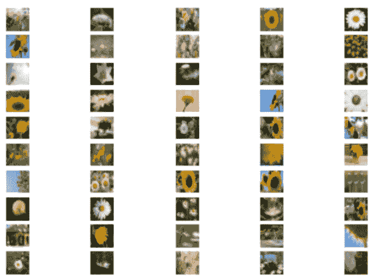
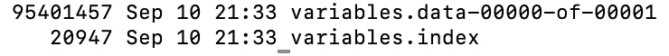
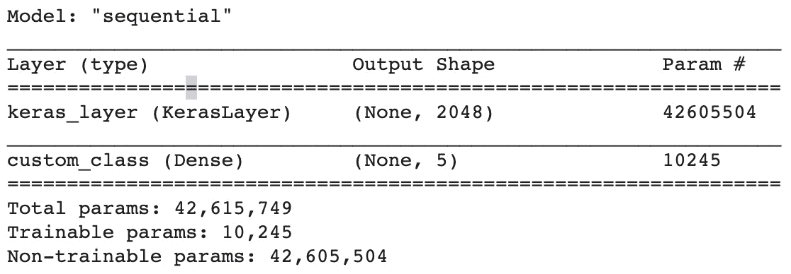

第七章：

# 第八章：模型优化

在本章中，我们将通过量化技术了解模型优化的概念。这一点很重要，因为即使在云环境中，计算和内存等容量问题不那么突出，但延迟和吞吐量始终是影响模型输出质量和数量的因素。因此，优化模型以减少延迟和最大化吞吐量有助于降低计算成本。在边缘环境中，许多约束与内存、计算、电力消耗和带宽等资源相关。

在本章中，你将学习如何使你的模型尽可能精简且高效，同时确保模型精度的变化在可接受范围内。换句话说，我们将减少模型的大小，以便让模型在更少的电力和计算资源下运行，而不会对其性能产生过大影响。在本章中，我们将探讨最近的进展和一种适用于 TensorFlow 的方法：TFLite 量化。

在本章中，我们将讨论以下主题：

+   理解量化概念

+   为评分准备完整的原始模型

+   将完整模型转换为减少的 float16 模型

+   将完整模型转换为减少的混合量化模型

+   将完整模型转换为整数量化模型

# 技术要求

你可以在[`github.com/PacktPublishing/learn-tensorflow-enterprise.git`](https://github.com/PacktPublishing/learn-tensorflow-enterprise.git)找到所有源代码。

你可以在命令终端使用`git`命令克隆它：

```py
git clone https://github.com/PacktPublishing/learn-tensorflow-enterprise.git
```

本章的所有资源都可以在 GitHub 链接中的`chapter_07`文件夹中找到。

# 理解量化概念

量化是一种将模型大小减小并因此提高其效率的技术。这项技术对于构建适用于移动设备或边缘部署的模型非常有用，因为这些场景下计算资源或电源供应是有限的。由于我们的目标是使模型尽可能高效运行，我们也接受这样一个事实：模型必须变得更小，因此精度也会比原始模型低。这意味着我们正在将模型转化为其原始版本的轻量化形式，而转化后的模型是原始模型的近似值。

量化可以应用于已训练的模型。这称为后训练量化 API。在这种类型的量化中，有三种方法：

+   将`float 32 位`操作转换为`float 16`操作。

+   `8 位`，同时保持偏差和激活为`32 位`操作。

+   `8 位`，而偏差和激活可能是`8`或`16 位`。

前述方法适用于使用传统手段构建和训练的 TensorFlow 模型。另一种方法是在执行优化的同时训练模型。这被称为**量化感知训练**，在此过程中，我们应用 API 来模拟在深度学习训练的前向传播阶段进行的量化操作。

结果模型包含量化值。这是相对较新的，且目前只有整数量化 API 可用。量化感知训练目前只适用于自定义构建的模型，而不适用于来自 TensorFlow Hub 的模型（这些模型是预训练的）。如果你希望使用这些著名的预训练模型的量化版本，可以在此处找到这些模型：[`www.tensorflow.org/lite/guide/hosted_models`](https://www.tensorflow.org/lite/guide/hosted_models)。

## 训练基准模型

让我们开始训练一个包含五类花卉的图像分类模型。我们将利用 TensorFlow Hub 上托管的预训练 ResNet 特征向量（[`tfhub.dev/google/imagenet/resnet_v2_50/feature_vector/4`](https://tfhub.dev/google/imagenet/resnet_v2_50/feature_vector/4)），你可以从这里下载 TFRecord 格式的花卉图像：[`dataverse.harvard.edu/dataset.xhtml?persistentId=doi:10.7910/DVN/1ECTVN`](https://dataverse.harvard.edu/dataset.xhtml?persistentId=doi:10.7910/DVN/1ECTVN)。

或者，如果你克隆了本书的代码库，训练基准模型的源代码和 TFRecord 数据集可以在[`github.com/PacktPublishing/learn-tensorflow-enterprise/tree/master/chapter_07/train_base_model`](https://github.com/PacktPublishing/learn-tensorflow-enterprise/tree/master/chapter_07/train_base_model)找到。

以下是一个训练脚本`default_trainer.py`文件，用于使用 TFRecord 数据集训练此模型：

1.  我们通过一个`import`语句开始这个训练脚本，导入我们所需的所有库：

    ```py
    import tensorflow as tf
    import tensorflow_hub as hub
    import tensorflow_datasets as tfds
    import os
    import IPython
    import time
    from absl import flags
    from absl import logging
    from absl import app
    ```

    `Absl`是一个有用的库。在这个库中，`flags` API 用于定义用户输入。这特别方便，因为我们通过用户命令调用此脚本，而不是以笔记本的形式运行它。

1.  配备了`flags` API 的`import`语句后，我们将为`flags.FLAGS`定义一个简短的别名，并定义一系列我们将传递给脚本的用户输入。这是通过`tf.compat.v1.flags` API 实现的。请注意，我们可以为用户输入定义数据类型，并提供默认值，以便用户无需指定每个输入：

    ```py
    FLAGS = flags.FLAGS
    # flag name, default value, explanation/help.
    tf.compat.v1.flags.DEFINE_string('model_dir', 'default_model_dir', 'Directory or bucket for storing checkpoint model.')
    tf.compat.v1.flags.DEFINE_bool('fine_tuning_choice', False, 'Retrain base parameters')
    tf.compat.v1.flags.DEFINE_integer('train_batch_size', 32, 'Number of samples in a training batch')
    tf.compat.v1.flags.DEFINE_integer('validation_batch_size', 40, 'Number of samples in a validation batch')
    tf.compat.v1.flags.DEFINE_string('distribution_strategy', 'tpu', 'Distribution strategy for training.')
    tf.compat.v1.flags.DEFINE_integer('train_epochs', 3, 'Number of epochs for training')
    tf.compat.v1.flags.DEFINE_string('data_dir', 'tf_datasets/flower_photos', 'training data path')
    tf.compat.v1.flags.DEFINE_integer('num_gpus', 4, 'Number of GPU per worker')
    tf.compat.v1.flags.DEFINE_string('cache_dir', '../imagenet_resnet_v2_50_feature_vector_4' , 'Location of cached model')
    ```

    有一些用户标志值得进一步解释。`data-dir`标志定义了训练数据的文件路径。在这种情况下，它指向当前目录`train_base_model`下的文件夹路径`tf_datasets/flower_photos`。另一个用户标志是`cache_dir`，它是我们下载的 ResNet 特征向量模型的路径。尽管我们可以通过互联网直接访问 TensorFlow Hub，但在某些情况下，网络连接可能会出现问题。因此，下载模型并将其放在本地环境中是个不错的选择。

1.  我们可能会在以下函数中封装模型架构和编译过程：

    ```py
    def model_default():
        flags_obj = flags.FLAGS
        os.environ['TFHUB_CACHE_DIR'] = flags_obj.cache_dir
        IMAGE_SIZE = (224, 224)
        model = tf.keras.Sequential([
        tf.keras.layers.InputLayer(input_shape=IMAGE_SIZE + (3,)), 
        hub.KerasLayer('https://tfhub.dev/google/imagenet/resnet_v2_50/feature_vector/4', trainable=flags_obj.fine_tuning_choice),
        tf.keras.layers.Flatten(),
        tf.keras.layers.Dense(units = 64, 
                                         activation = 'relu', 
                        kernel_initializer='glorot_uniform'),
        tf.keras.layers.Dense(5, activation='softmax', 
                                       name = 'custom_class')
        ])
        model.build([None, 224, 224, 3])
         model.compile(
            optimizer=tf.keras.optimizers.SGD(lr=1e-2, 	                 
                                               momentum=0.5), 
            loss=tf.keras.losses.CategoricalCrossentropy(
                      from_logits=True, label_smoothing=0.1),
            metrics=['accuracy'])
      return model
    ```

    这个函数负责构建模型并使用合适的`optimizer`和`loss`函数进行编译。它返回一个用于训练的模型对象。

1.  至于图像数据的输入管道，这个管道需要处理数据解析。可以通过以下函数来实现：

    ```py
    def decode_and_resize(serialized_example):
        # resized image should be [224, 224, 3] and normalized to value range [0, 255] 
        # label is integer index of class.
            parsed_features = tf.io.parse_single_example(
        serialized_example,
        features = {
        'image/channels' :  tf.io.FixedLenFeature([],  	 	                                                tf.int64),
        'image/class/label' :  tf.io.FixedLenFeature([], 	 	                                                tf.int64),
        'image/class/text' : tf.io.FixedLenFeature([], 	 	                                               tf.string),
        'image/colorspace' : tf.io.FixedLenFeature([], 	 	                                               tf.string),
        'image/encoded' : tf.io.FixedLenFeature([], 	 	                                               tf.string),
        'image/filename' : tf.io.FixedLenFeature([], 	 	                                               tf.string),
        'image/format' : tf.io.FixedLenFeature([], 	 	     	                                               tf.string),
        'image/height' : tf.io.FixedLenFeature([], tf.int64),
        'image/width' : tf.io.FixedLenFeature([], tf.int64)
        })
        image = tf.io.decode_jpeg(parsed_features[
                                'image/encoded'], channels=3)
        label = tf.cast(parsed_features['image/class/label'],  
                                                    tf.int32)
        label_txt = tf.cast(parsed_features[
                              'image/class/text'], tf.string)
        label_one_hot = tf.one_hot(label, depth = 5)
        resized_image = tf.image.resize(image, [224, 224], 
                                             method='nearest')
        return resized_image, label_one_hot
    ```

    正如函数名所示，这个函数接收一个存储在 TFRecord 中的样本。它通过特征描述解析，并且样本图像（这是一个`byte string`）会解码为 JPEG 图像。至于图像标签，函数也会解析标签名称（`image`/`class`/`text`），并将其转换为独热向量。JPEG 图像会被调整为`224` x `224`的大小。因此，这个函数返回一个元组。该元组包含一个调整大小后的图像及其标签。

1.  我们还需要将图像像素值归一化到[0, 1.0]的范围内。可以通过以下函数来实现：

    ```py
    def normalize(image, label):
        #Convert `image` from [0, 255] -> [0, 1.0] floats 
        image = tf.cast(image, tf.float32) / 255.
        return image, label
    ```

    在`normalize`函数中，一个表示为 NumPy 数组的 JPEG 图像会被归一化到`[0, 1.0]`的范围。同时，尽管我们没有对标签做任何处理，但最好将标签与图像一起传递，并将它们作为元组返回，以便你能够将图像和标签一起追踪。

1.  然后我们在以下函数中对训练数据应用洗牌和批处理操作：

    ```py
    def prepare_for_training(ds, cache=True, shuffle_buffer_size=1000):
        # This is a small dataset, only load it once, and keep it in memory.
        # use `.cache(filename)` to cache preprocessing work for datasets that don't
        # fit in memory.
        flags_obj = flags.FLAGS
        if cache:
            if isinstance(cache, str):
                ds = ds.cache(cache)
            else:
                ds = ds.cache()
        ds = ds.shuffle(buffer_size=shuffle_buffer_size)
        # Repeat forever
        ds = ds.repeat()
        ds = ds.batch(flags_obj.train_batch_size)
        # `prefetch` lets the dataset fetch batches in the background while the model
        # is training.
        AUTOTUNE = tf.data.experimental.AUTOTUNE
        ds = ds.prefetch(buffer_size=AUTOTUNE)
    return ds
    ```

    这个函数返回一个附带了洗牌、重复、批处理和预取操作的数据集。这是为训练准备数据集的标准方法。

1.  现在我们来到了这段代码的主要驱动部分：

    ```py
    def main(_):
        flags_obj = flags.FLAGS
           if flags_obj.distribution_strategy == 'tpu':
            resolver = tf.distribute.cluster_resolver.TPUClusterResolver()
            tf.config.experimental_connect_to_cluster(resolver)
            tf.tpu.experimental.initialize_tpu_system(resolver)
            strategy = tf.distribute.experimental.TPUStrategy(resolver)
            strategy_scope = strategy.scope()
            print('All devices: ', tf.config.list_logical_devices('TPU'))
        elif flags_obj.distribution_strategy == 'gpu':
            strategy = tf.distribute.MirroredStrategy()
            strategy_scope = strategy.scope()
            devices = ['device:GPU:%d' % i for i in 
                        range(flags_obj.num_gpus)]
        else:
            strategy = tf.distribute.MirroredStrategy()
            strategy_scope = strategy.scope()
     print('NUMBER OF DEVICES: ', 
                               strategy.num_replicas_in_sync)
    ```

    在`main()`函数的这一部分，我们提供了分布式训练策略的逻辑。

1.  接着在`main()`中，数据路径通过`tf.data` API 进行识别和处理：

    ```py
        ## identify data paths and sources
        root_dir = flags_obj.data_dir # this is gs://<bucket>/folder or file path where tfrecord is found
        file_pattern = '{}/image_classification_builder-train*.tfrecord*'.format(root_dir)
        val_file_pattern = '{}/image_classification_builder-validation*.tfrecord*'.format(root_dir)
        file_list = tf.io.gfile.glob(file_pattern)
        all_files = tf.data.Dataset.list_files( 
                              tf.io.gfile.glob(file_pattern))
        val_file_list = tf.io.gfile.glob(val_file_pattern)
        val_all_files = tf.data.Dataset.list_files( 
                          tf.io.gfile.glob(val_file_pattern))
        train_all_ds = tf.data.TFRecordDataset(all_files, 
            num_parallel_reads=tf.data.experimental.AUTOTUNE)
    val_all_ds = tf.data.TFRecordDataset(val_all_files, 
            num_parallel_reads=tf.data.experimental.AUTOTUNE)
    ```

    在前面的代码中，所有三个数据源——训练、验证和测试——都被标识并引用。回想一下，文件名模式中的通配符符号`*`帮助这个管道具有可扩展性。无论你有多少个 TFRecord 数据部分，这个管道都能处理。

1.  继续在`main()`函数中，现在我们需要对训练和验证数据集中的每个样本应用特征工程和归一化函数。通过`map`函数来完成：

    ```py
        # perform data engineering 
        dataset = train_all_ds.map(decode_and_resize)
        val_dataset = val_all_ds.map(decode_and_resize)
        # Create dataset for training run
        BATCH_SIZE = flags_obj.train_batch_size
        VALIDATION_BATCH_SIZE = 
                              flags_obj.validation_batch_size
        dataset = dataset.map(normalize, 
            num_parallel_calls=tf.data.experimental.AUTOTUNE)
        val_dataset = val_dataset.map(normalize, 
            num_parallel_calls=tf.data.experimental.AUTOTUNE)
    val_ds = val_dataset.batch(VALIDATION_BATCH_SIZE)
        AUTOTUNE = tf.data.experimental.AUTOTUNE
        train_ds = prepare_for_training(dataset)
    ```

    根据相应的用户标志，训练和验证数据集会被批处理。如果没有给定标志，则使用默认值。

1.  现在我们需要为训练和验证设置一些参数：

    ```py
        NUM_CLASSES = 5
        IMAGE_SIZE = (224, 224)
            train_sample_size=0
        for raw_record in train_all_ds:
            train_sample_size += 1
        print('TRAIN_SAMPLE_SIZE = ', train_sample_size)
        validation_sample_size=0
        for raw_record in val_all_ds:
            validation_sample_size += 1
        print('VALIDATION_SAMPLE_SIZE = ', 
                                      validation_sample_size)
        STEPS_PER_EPOCHS = train_sample_size // BATCH_SIZE
    VALIDATION_STEPS = validation_sample_size 
                                     // VALIDATION_BATCH_SIZE
    ```

    在前面的代码中，我们将类别数和图像大小设置为变量，并将其传递到模型训练过程中。然后我们确定每个训练周期和交叉验证的步骤数。

1.  继续使用`main()`，我们现在可以通过调用`model_default`函数来创建模型：

    ```py
        model = model_default()
        checkpoint_prefix = os.path.join(flags_obj.model_dir, 
                                        'train_ckpt_{epoch}')
        callbacks = [
        tf.keras.callbacks.TensorBoard(log_dir=os.path.join(flags_obj.model_dir, 'tensorboard_logs')),
        tf.keras.callbacks.ModelCheckpoint(
                                  filepath=checkpoint_prefix,
            save_weights_only=True)]
    ```

    在前面的代码中，我们调用`model_default`函数来构建和编译我们的模型。我们还为训练检查点设置了回调。

1.  继续使用`main()`，我们现在可以启动训练过程：

    ```py
         model.fit(
            train_ds,
            epochs=flags_obj.train_epochs, 
            steps_per_epoch=STEPS_PER_EPOCHS,
            validation_data=val_ds,
            validation_steps=VALIDATION_STEPS,
            callbacks=callbacks)
    ```

    在前面的代码中，我们将训练集和验证集传递给`fit`函数。训练周期数由用户输入决定。如果没有提供，则使用默认值。

1.  继续使用`main()`，我们可以在执行此脚本的终端中将输出记录为`STDOUT`：

    ```py
        logging.info('INSIDE MAIN FUNCTION user input model_dir %s', flags_obj.model_dir)
            timestr = time.strftime('%Y%m%d-%H%M%S')
        output_folder = flags_obj.model_dir + '-' + timestr
        if not os.path.exists(output_folder):
            os.mkdir(output_folder)
            print('Directory ' , output_folder , ' Created ')
        else:
            print('Directory ' , output_folder , ' already exists')   
        model_save_dir = os.path.join(output_folder, 
                                                'save_model')
        model.save(model_save_dir)
    if __name__ == '__main__':
        app.run(main)
    ```

    在前面的代码中，我们还利用了时间戳值来构建文件夹名称，其中每次构建的模型可能会根据训练完成的时间保存。

这标志着`main()`的结束。模型保存在`model_save_dir`中。要调用此脚本，你只需在你的 Python 环境中运行以下命令：

```py
python3 default_trainer.py \
```

```py
--distribution_strategy=default \
```

```py
--fine_tuning_choice=False \
```

```py
--train_batch_size=32 \
```

```py
--validation_batch_size=40 \
```

```py
--train_epochs=5 \
```

```py
--data_dir=tf_datasets/flower_photos \
```

```py
--model_dir=trained_resnet_vector
```

从存储此脚本的目录中，你会找到一个以`trained_resnet_vector`为前缀的子文件夹，后面跟着一个日期和时间戳，如`20200910-213303`。该子文件夹包含保存的模型。我们将使用此模型作为我们的基准模型。训练完成后，你会在以下目录中找到保存的模型：

`trained_resnet_vector-20200910-213303/save_model/assets`

这个保存的模型与`default_trainer.py`文件存储在同一目录下。现在我们有了一个训练好的 TensorFlow 模型，在下一节中，我们将用训练好的模型对测试数据进行评分。

# 准备一个完整的原始模型进行评分

完成完整模型的训练后，我们将在本仓库中使用一个`Scoring` Jupyter 笔记本演示如何使用完整模型进行评分。这个笔记本可以在[`github.com/PacktPublishing/learn-tensorflow-enterprise/blob/master/chapter_07/train_base_model/Scoring.ipynb`](https://github.com/PacktPublishing/learn-tensorflow-enterprise/blob/master/chapter_07/train_base_model/Scoring.ipynb)找到。

对于原始模型，它以`savedModel` Protobuf 格式存储。我们需要按照以下方式加载它：

```py
import tensorflow as tf
```

```py
import numpy as np
```

```py
import matplotlib.pyplot as plt
```

```py
from PIL import Image, ImageOps
```

```py
import IPython.display as display
```

```py
path_saved_model = 'trained_resnet_vector-unquantized/save_model'
```

```py
trained_model = tf.saved_model.load(path_saved_model)
```

我们刚刚训练的完整模型现在已加载到 Jupyter 笔记本的运行时中，命名为`trained_model`。对于评分，还需要做一些额外的步骤。我们必须找到用于预测的模型签名：

```py
signature_list = list(trained_model.signatures.keys())
```

```py
signature_list
```

它显示此列表中只有一个签名：

```py
['serving_default']
```

我们将创建一个`infer`包装函数并将签名传递给它：

```py
infer = trained_model.signatures[signature_list[0]]
```

这里，`signature_list[0]`等同于`serving_default`。现在让我们打印输出：

```py
print(infer.structured_outputs)
```

让我们看看前面函数的输出：

```py
{'custom_class': TensorSpec(shape=(None, 5), dtype=tf.float32, name='custom_class')}
```

输出是一个`shape=(None, 5)`的 NumPy 数组。这个数组将保存模型预测的类别概率。

现在让我们处理测试数据。此处提供的测试数据是 TFRecord 格式。我们将其转换为形状为 `[None, 224, 224, 3]` 的 NumPy 数组形式的图像批次。

## 准备测试数据

这部分与我们在*第六章*中看到的非常相似，*超参数调优*，在那时我们广泛使用 TFRecord 作为模型训练的输入格式。这里使用的 TFRecord 可以在[`github.com/PacktPublishing/learn-tensorflow-enterprise/tree/master/chapter_07/train_base_model/tf_datasets/flower_photos`](https://github.com/PacktPublishing/learn-tensorflow-enterprise/tree/master/chapter_07/train_base_model/tf_datasets/flower_photos)找到。

## 加载测试数据

让我们从加载 TFRecord 数据开始：

```py
root_dir = ' tf_datasets/flower_photos'
```

```py
test_pattern = '{}/image_classification_builder-test.tfrecord*'.format(root_dir)
```

```py
test_all_files = tf.data.Dataset.list_files( tf.io.gfile.glob(test_pattern))
```

```py
test_all_ds = tf.data.TFRecordDataset(test_all_files,
```

```py
num_parallel_reads=tf.data.experimental.AUTOTUNE)
```

我们将使用以下代码检查图像的样本大小：

```py
sample_size = 0
```

```py
for raw_record in test_all_ds:
```

```py
    sample_size += 1
```

```py
print('Sample size: ', sample_size)
```

这是输出结果：

```py
Sample size:  50
```

这表明我们在测试数据中有 50 个样本。

这个测试数据集中有 `50` 张图像。我们将重用来自*第六章*的辅助函数，*超参数调优*，来解码 TFRecord 及其中的元数据，然后对像素值进行归一化处理：

```py
def decode_and_resize(serialized_example):
```

```py
    # resized image should be [224, 224, 3] and normalized to value range [0, 255] 
```

```py
    # label is integer index of class.
```

```py
        parsed_features = tf.io.parse_single_example(
```

```py
    serialized_example,
```

```py
    features = {
```

```py
    'image/channels' :  tf.io.FixedLenFeature([], tf.int64),
```

```py
    'image/class/label' :  tf.io.FixedLenFeature([], tf.int64),
```

```py
    'image/class/text' : tf.io.FixedLenFeature([], tf.string),
```

```py
    'image/colorspace' : tf.io.FixedLenFeature([], tf.string),
```

```py
    'image/encoded' : tf.io.FixedLenFeature([], tf.string),
```

```py
    'image/filename' : tf.io.FixedLenFeature([], tf.string),
```

```py
    'image/format' : tf.io.FixedLenFeature([], tf.string),
```

```py
    'image/height' : tf.io.FixedLenFeature([], tf.int64),
```

```py
    'image/width' : tf.io.FixedLenFeature([], tf.int64)
```

```py
    })
```

```py
    image = tf.io.decode_jpeg(parsed_features['image/encoded'], 	                                                    channels=3)
```

```py
    label = tf.cast(parsed_features['image/class/label'],         	                                                      tf.int32)
```

```py
    label_txt = tf.cast(parsed_features['image/class/text'], 	                                                     tf.string)
```

```py
    label_one_hot = tf.one_hot(label, depth = 5)
```

```py
    resized_image = tf.image.resize(image, [224, 224],  	     	                                              method='nearest')
```

```py
    return resized_image, label_one_hot
```

```py
def normalize(image, label):
```

```py
    #Convert `image` from [0, 255] -> [0, 1.0] floats 
```

```py
    image = tf.cast(image, tf.float32) / 255\. 
```

```py
   return image, label
```

`decode_and_resize` 函数解析图像，将其调整为 `224` x `224` 像素，同时对图像的标签进行一热编码。`decode_and_resize` 然后返回图像和对应标签作为一个元组，确保图像和标签始终一起处理。

`normalize` 函数通过将图像像素值除以 `255`，将像素范围归一化到 `[0, 1.0]`。尽管标签本身没有做任何处理，但必须将图像和标签一起跟踪，确保它们始终一起存在。

现在我们可以应用前述的辅助函数来解码、标准化和归一化 TFRecord 数据集中的图像：

```py
decoded = test_all_ds.map(decode_and_resize)
```

```py
normed = decoded.map(normalize)
```

请注意，我们通过 `np.expand_dims` 在第一个维度引入了一个额外的维度。这个额外的维度是为了变量批大小的需要：

```py
np_img_holder = np.empty((0, 224, 224,3), float)
```

```py
np_lbl_holder = np.empty((0, 5), int)
```

```py
for img, lbl in normed:
```

```py
    r = img.numpy() # image value extracted
```

```py
    rx = np.expand_dims(r, axis=0) 
```

```py
    lx = np.expand_dims(lbl, axis=0) 
```

```py
    np_img_holder = np.append(np_img_holder, rx, axis=0) 
```

```py
np_lbl_holder = np.append(np_lbl_holder, lx, axis=0) 
```

现在测试数据已经是 NumPy 格式，具有标准化的维度，像素值在 `0` 到 `1` 之间，并且进行了批处理，标签也是如此。

我们现在将检查这些图像。为此，我们可以使用以下代码，在图 7.1 中将 NumPy 数组 `np_img_holder` 作为图像显示：

```py
%matplotlib inline
```

```py
plt.figure()
```

```py
for i in range(len(np_img_holder)):
```

```py
    plt.subplot(10, 5, i+1)
```

```py
    plt.axis('off')
```

```py
plt.imshow(np.asarray(np_img_holder[i]))
```

在之前的代码片段中，我们遍历图像数组，并将每张图像放置在子图中的一个位置。共有 50 张图像（10 行，每行 5 个子图），如下图所示：



图 7.1 – 测试数据集中五种花卉类别的 50 张图像

## 使用完整模型评分单张图像

现在我们来看一下测试数据的形状，并理解将测试数据转换为模型所需的形状的过程：

1.  我们将首先使用一张图像测试我们的评分流程。就像我们通过在第一维添加一个新维度来创建图像批次一样，我们也将通过相同的方式创建一个样本大小为`1`的图像批次：

    ```py
    x = np.expand_dims(np_img_holder[0], axis=0)
    x.shape
    (1, 224, 224, 3)
    ```

1.  现在维度是正确的，这是一个包含一张图像的批次。我们将其转换为`float32`类型的张量：

    ```py
    xf = tf.dtypes.cast(x, tf.float32)
    ```

    然后，将此传递给`infer`函数进行评分：

    ```py
    prediction = infer(xf)
    ```

    你会记得，我们模型的最后一层是一个名为`custom_class`的全连接层，包含五个节点，并且每个节点的激活函数都是 softmax，这样我们就可以得到五个类别的概率。

1.  现在我们将检查预测的内容：

    ```py
    prediction.get('custom_class')
    ```

    输出结果应类似于以下内容：

    ```py
    <tf.Tensor: shape=(1, 5), dtype=float32, numpy=
    array([[1.5271275e-04, 2.0515859e-05, 1.0230409e-06, 2.9591745e-06, 9.9982280e-01]], dtype=float32)>
    ```

    数组中的这些值代表概率。数组中的每个位置代表一种花卉类型的类别。如你所见，最高的概率位于数组的最后一个位置；与这个位置对应的索引是`4`。我们需要将`4`映射到纯文本名称。

    现在我们将其转换为 NumPy 数组，以便我们可以找到预测最大概率的位置：

    ```py
    predicted_prob_array = prediction.get('custom_class').numpy()
    idx = np.argmax(predicted_prob_array)
    print(idx)
    ```

1.  第四个位置的索引是预测最大概率的位置。现在我们需要通过将此索引映射到标签来了解它代表的是什么。我们需要创建一个反向查找字典，将概率映射回标签。我们刚刚找到了最大概率所在的索引。接下来的步骤是将`idx`映射到正确的花卉类型。为此，我们需要从 TFRecord 中提取该信息：

    ```py
    feature_description = {
        'image/channels' :  tf.io.FixedLenFeature([], 	 	                                                tf.int64),
        'image/class/label' :  tf.io.FixedLenFeature([], 	 	                                                tf.int64),
        'image/class/text' : tf.io.FixedLenFeature([], 	 	                                               tf.string),
        'image/colorspace' : tf.io.FixedLenFeature([], 	 	                                               tf.string),
        'image/encoded' : tf.io.FixedLenFeature([], 	 	                                               tf.string),
        'image/filename' : tf.io.FixedLenFeature([], 	 	                                               tf.string),
        'image/format' : tf.io.FixedLenFeature([], 	 	 	                                               tf.string),
        'image/height' : tf.io.FixedLenFeature([], tf.int64),
        'image/width' : tf.io.FixedLenFeature([], tf.int64)
    }
    def _parse_function(example_proto):
      return tf.io.parse_single_example(example_proto, 	 	                                     feature_description)
    parsd_ds = test_all_ds.map(_parse_function)
    val_label_map = {}
    # getting label mapping
    for image_features in parsd_ds.take(50):
        label_idx = image_features[
                                 'image/class/label'].numpy()
        label_str = image_features[
                         'image/class/text'].numpy().decode()
        if label_idx not in val_label_map:
            val_label_map[label_idx] = label_str
    ```

    在前面的代码中，我们使用了相同的特征描述符（`feature_description`）来解析`test_all_ds`。一旦通过`_parse_function`进行解析，我们遍历整个测试数据集。我们需要的信息位于`image/class/label`和`image/class/text`中。

1.  我们简单地创建一个字典，其中键是`label_idx`，值是`label_str`。结果是`val_label_map`。如果我们按如下方式检查它：

    ```py
    val_label_map
    ```

    输出结果如下：

    ```py
    {4: 'tulips', 3: 'dandelion', 1: 'sunflowers', 2: 'daisy', 0: 'roses'}
    ```

    然后我们评估`idx`：

    ```py
    print(val_label_map.get(idx))
    ```

    这是输出结果：

    ```py
    tulip
    ```

    这将我们的图像映射到`tulip`类别。

## 使用完整模型对批量图像进行评分

在上一节中，我们查看了如何对单张图像进行评分。现在我们想对一批图像进行评分。在我们的测试数据中，有 50 张图像：

1.  在上一节中，我们创建了正确形状的图像批次，形状为`[50, 224, 224, 3]`。现在可以进行评分了：

    ```py
    batched_input = tf.dtypes.cast(np_img_holder, tf.float32)
    batch_predicted_prob_array = infer(batched_input)
    ```

    让我们创建一个函数，帮助在给定 NumPy 数组和查找字典时查找标签名称：

    ```py
    def lookup(np_entry, dictionary):
      	class_key = np.argmax(np_entry)
    	return dictionary.get(class_key)
    ```

    该函数接受一个 NumPy 数组，映射出最大值的位置，然后通过字典将该位置映射到标签。

1.  这是一个包含我们真实标签的列表，如`np_lbl_holder`所示：

    ```py
    actual = []
    for i in range(len(np_lbl_holder)):
        plain_text_label = lookup(np_lbl_holder[i], 
                                               val_label_map)
        actual.append(plain_text_label)
    ```

    `actual`包含所有 50 个测试样本的真实标签（纯文本格式）。

1.  这是我们如何获得包含预测标签的列表：

    ```py
    predicted_label = []
    for i in range(sample_size):
    batch_prediction = batch_predicted_prob_array.get('custom_class').numpy()
    plain_text_label = lookup(batch_prediction[i], 
                                               val_label_map)
    predicted_label.append(plain_text_label)
    ```

    `predicted_label`包含所有 50 个测试样本的预测结果，以纯文本形式存储，因为我们利用`lookup`函数将概率映射到花卉类型名称。

1.  我们将比较`predicted_label`和`actual`来计算模型的准确率：

    ```py
    from sklearn.metrics import accuracy_score
    accuracy=accuracy_score(actual, predicted_label)
    print(accuracy)
    0.82
    ```

这表明我们完整模型的准确率为 82%。这是通过使用`sklearn`中的`accuracy_score` API，简单地将`actual`与`predicted_label`进行比较得出的。

注意

预计你的模型准确率会略有不同于这里打印的名义值。每次训练基础模型时，模型的准确率都不会完全相同。然而，它不应该与名义值相差太多。影响模型准确率重现性的另一个因素是训练时使用的迭代次数；在本例中，为了演示和教学目的，仅进行了五个 epoch。更多的训练 epoch 将使你的模型准确率更好，方差更小。

# 将完整模型转换为减少版的`float16`模型

在本节中，我们将加载我们刚刚训练的模型，并将其量化为一个减少版的`float16`模型。为了方便逐步讲解和提升你的学习体验，建议你使用 JupyterLab 或 Jupyter Notebook 跟随本文的说明：

1.  让我们首先加载训练好的模型：

    ```py
    import tensorflow as tf
    import pathlib
    import os
    import numpy as np
    from matplotlib.pyplot import imshow
    import matplotlib.pyplot as plt
    root_dir = '../train_base_model'
    model_dir = ' trained_resnet_vector-unquantized/save_model'
    saved_model_dir = os.path.join(root_dir, model_dir)
    trained_model = tf.saved_model.load(saved_model_dir)
    ```

    `tf.saved_model.load` API 帮助我们加载我们已构建并训练好的保存模型。

1.  然后，我们将创建一个`converter`对象，使用以下代码来引用`savedModel`目录：

    ```py
    converter = tf.lite.TFLiteConverter.from_saved_model(saved_model_dir)
    ```

    对于`converter`对象，我们将选择`DEFAULT`优化策略，以最佳方式提高模型的大小和延迟：

    ```py
    converter.optimizations = [tf.lite.Optimize.DEFAULT]
    ```

    替代方案包括`OPTIMIZE_FOR_LATENCY`或`OPTIMIZE_FOR_SIZE`。有关详细信息，请参阅 [`www.tensorflow.org/api_docs/python/tf/lite/Optimize`](https://www.tensorflow.org/api_docs/python/tf/lite/Optimize)。

1.  接下来，我们将设置`float16`作为模型参数的目标类型，并开始转换过程：

    ```py
    converter.target_spec.supported_types = [tf.float16]
    tflite_model = converter.convert()
    ```

    我们将使用以下代码设置目录路径来保存量化后的模型：

    ```py
    root_dir = ''
    tflite_model_dir = trained_resnet_vector-unquantized
    to_save_tflite_model_dir = os.path.join(root_dir, 
                                            tflite_model_dir)
    ```

1.  现在，我们将创建一个`pathlib`对象来表示我们想要保存量化模型的目录：

    ```py
    saved_tflite_model_dir = pathlib.Path(
                                    to_save_tflite_model_dir)
    ```

    让我们创建一个目录来保存量化后的模型：

    ```py
    saved_tflite_model_dir.mkdir(exist_ok=True, parents=True) 
    ```

1.  我们现在将创建一个`pathlib`对象`tgt`来表示量化模型文件：

    ```py
    tgt = pathlib.Path(tflite_models_dir, 
                            'converted_model_reduced.tflite')
    ```

    我们现在将使用`pathlib`对象`tgt`来写入量化后的模型：

    ```py
    tgt.write_bytes(tflite_model)
    ```

    这将显示以字节为单位写入的输出大小：

    ```py
    47487392
    ```

    使用最后一条命令，你将看到量化后的模型大小略大于`47` MB，具体为`47,487,392`字节。请前往以下目录：`../trained_resnet_vector-unquantized/save_model/variables.`

    这显示了原始模型的权重和偏差文件稍微超过 95 MB（结果可能有所不同，如果你重新训练，它可能不会完全相同；但是，它应该非常接近 95 MB），如以下图所示：



图 7.2 – 原始模型的权重和偏差文件大小

量化模型的大小约为原始模型的一半。这是预期中的结果，因为该模型是从 `float32` 格式转换为 `float16` 格式的。接下来，我们将使用降低为 `float16` 的模型对测试数据进行评分。

## 准备减小的 float16 模型进行评分

在本节中，我们将使用量化后的模型（降低为`float16`）来对上一节中使用的相同测试数据集进行评分。我们将通过 TensorFlow Lite 解释器接口执行评分（推理）：

1.  我们将从由`tflite_models_dir`表示的文件路径加载量化模型。在上一节中，我们创建了一个`pathlib`对象` tgt` 来表示量化模型文件：

    ```py
    tgt = pathlib.Path(tflite_models_dir, 
                            'converted_model_reduced.tflite')
    ```

1.  接着我们需要获取`input_details`和`output_details`张量：

    ```py
    input_details = interpreter.get_input_details()
    output_details = interpreter.get_output_details()
    ```

1.  从这些张量中，我们将检查输入和输出中 NumPy 数组的形状：

    ```py
    input_details[0]['shape']
    array([  1, 224, 224,   3], dtype=int32)
    output_details[0]['shape']
    array([1, 5], dtype=int32)
    ```

我们验证了模型的输入和输出应该是一个批量，因为这些张量中有四个维度。接下来，我们将通过对测试数据进行评分来查看这个模型的表现如何。

## 使用量化模型对单张图像进行评分

现在我们可以开始使用 TFLite 量化模型进行评分。在接下来的步骤中，我们首先扩展样本，包含一个批量维度，将输入数据传递给解释器，进行输入数据的评分，然后获取预测结果的输出：

```py
input_data = np.array(np.expand_dims(np_img_holder[0], axis=0), dtype=np.float32)
```

```py
interpreter.set_tensor(input_details[0]['index'], input_data)
```

```py
interpreter.invoke()
```

```py
output_data = interpreter.get_tensor(output_details[0]['index'])
```

```py
print(output_data)
```

输出如下：

```py
[[1.5181543e-04 2.0090181e-05 1.0022727e-06 2.8991076e-06 9.9982423e-01]]
```

要将`output_data`映射回原始标签，请执行以下命令：

```py
lookup(output_data, val_label_map)
```

输出如下：

```py
'tulips'
```

## 使用量化模型对批量图像进行评分

当前，TFLite 模型的批量评分是通过单张图像的迭代评分过程来实现的。对于我们包含 50 张测试图像的示例，我们可以创建一个辅助函数来封装整个单张图像评分过程：

1.  这是一个处理批量评分的函数：

    ```py
    def batch_predict(input_raw, input_tensor, output_tensor, dictionary):
        input_data = np.array(np.expand_dims(input_raw, 
                                   axis=0), dtype=np.float32)
        interpreter.set_tensor(input_tensor[0]['index'], 
                                                  input_data)
        interpreter.invoke()
        interpreter_output = interpreter.get_tensor(
                                   output_tensor[0]['index'])
        plain_text_label = lookup(interpreter_output, 
                                                   dictionary)
        return plain_text_label
    ```

    这个函数将原始图像维度扩展为批量，然后将批量图像传递给解释器进行评分。解释器的输出通过`lookup`函数映射为明文名称，返回的明文即为预测标签。

1.  接下来，我们将遍历测试数据，调用`batch_predict`：

    ```py
    batch_quantized_prediction = []
    for i in range(sample_size):
        plain_text_label = batch_predict(np_img_holder[i], input_details, output_details, val_label_map)
        batch_quantized_prediction.append(plain_text_label)
    ```

    结果存储在`batch_quantized_prediction`列表中。

1.  就像我们衡量原始模型预测准确性一样，我们也可以使用`accuracy_score`来获取 TFLite 量化模型的准确性：

    ```py
    quantized_accuracy = accuracy_score(actual, batched_quantized_prediiction)
    print(quantized_accuracy)
    ```

    输出如下：

    ```py
    0.82
    ```

    这里的输出显示也是 82%。如果你重新训练了模型，结果可能会有所不同，但根据我的经验，它与基础模型的准确性完全相同。

    注意

    预计你的模型精度会与此处打印的名义值略有不同。每次训练基础模型时，模型精度不会完全相同。然而，它不应该与名义值相差太大。另一个影响模型精度可重复性的因素是训练时使用的周期数；在这种情况下，仅使用了五个周期作为演示和教学目的。更多的训练周期会为你提供更好、更精确的模型精度。

到目前为止开发的函数、例程和工作流程将在本章剩余部分中用于演示模型优化的过程和结果。我们已经学会了如何对原始模型进行评分，将原始模型转换为 TFLite 量化模型并对量化模型进行评分。接下来，我们将使用相同的转换和评估过程将原始模型转换为不同的格式。

# 将完整模型转换为减少的混合量化模型

在上一部分中，我们将一个完整模型转换为一个减少的`float16` TFLite 模型，并演示了其评分和评估过程。现在我们将尝试第二种支持的量化类型，即混合方法。

混合量化通过将模型转换为 8 位整数权重、32 位浮动偏置和激活来优化模型。由于它同时包含整数和浮点计算，因此被称为混合量化。这是为了在准确性和优化之间做出权衡。

对于混合量化，我们需要做一个小的修改。只有一行的区别，如下所述。在上一部分中，这是我们如何将完整模型量化为一个减少的`float16` TFLite 模型：

```py
converter.optimizations = [tf.lite.Optimize.DEFAULT]
```

```py
converter.target_spec.supported_types = [tf.float16]
```

```py
tflite_model = converter.convert()
```

对于混合量化，我们只需删除关于`supported_types`的中间一行：

```py
converter.optimizations = [tf.lite.Optimize.DEFAULT]
```

```py
tflite_model = converter.convert()
```

其他部分基本保持不变。以下是混合量化和评分的完整笔记本：

1.  和往常一样，我们将指定必要的库和模型路径：

    ```py
    import tensorflow as tf
    import pathlib
    import os
    import numpy as np
    from matplotlib.pyplot import imshow
    import matplotlib.pyplot as plt
    root_dir = ''
    model_dir = 'trained_resnet_vector-unquantized/save_model'
    saved_model_dir = os.path.join(root_dir, model_dir)
    ```

    现在，模型的路径已在`saved_model_dir`中指定。

1.  然后我们为`saved_model_dir`创建一个`converter`对象，并用它来转换我们的模型：

    ```py
    converter = tf.lite.TFLiteConverter.from_saved_model(saved_model_dir)
    converter.optimizations = [tf.lite.Optimize.DEFAULT]
    tflite_model = converter.convert()
    ```

    现在，转换器将完整模型转换为混合量化模型。

1.  现在我们将保存我们的混合量化模型：

    ```py
    root_dir = ''
    tflite_models_dir = 'trained_resnet_vector-unquantized/tflite_hybrid_model'
    to_save_tflite_model_dir = os.path.join(root_dir,           tflite_models_dir)
    saved_tflite_models_dir = pathlib.Path(to_save_tflite_model_dir) 
    saved_tflite_models_dir.mkdir(exist_ok=True, parents=True
    tgt = pathlib.Path(to_save_tflite_model_dir, 'converted_model_reduced.tflite')
    tgt.write_bytes(tflite_model)
    ```

    输出显示模型的大小，以字节为单位：

    ```py
    24050608
    ```

这比原始基础模型的 95MB 小得多。接下来，让我们看看这个更小的混合量化模型在测试数据上的表现如何。

## 准备测试数据进行评分

我们将像处理减少的`float16`模型一样开始加载测试数据：

1.  我们可以加载 TFRecord 数据，就像我们之前做的那样：

    ```py
    root_dir = '../train_base_model/tf_datasets/flower_photos'
    test_pattern = '{}/image_classification_builder-test.tfrecord*'.format(root_dir)
    test_all_files = tf.data.Dataset.list_files( tf.io.gfile.glob(test_pattern))
    test_all_ds = tf.data.TFRecordDataset(test_all_files, num_parallel_reads=tf.data.experimental.AUTOTUNE)
    ```

    现在，`test_all_ds`表示指向我们测试数据路径的数据集对象。

1.  我们可以通过遍历数据集并跟踪样本数量来确定样本大小：

    ```py
    sample_size = 0
    for raw_record in test_all_ds:
        sample_size += 1
    print('Sample size: ', sample_size)
    ```

    这将显示样本大小为`50`。

1.  我们使用在简化的 `float16` 模型部分中看到的相同辅助函数来标准化图像大小和像素值：

    ```py
    def decode_and_resize(serialized_example):
        # resized image should be [224, 224, 3] and normalized to value range [0, 255] 
        # label is integer index of class.
            parsed_features = tf.io.parse_single_example(
        serialized_example,
        features = {
        'image/channels' :  tf.io.FixedLenFeature([], 	 	                                                tf.int64),
        'image/class/label' :  tf.io.FixedLenFeature([], 	 	                                                tf.int64),
        'image/class/text' : tf.io.FixedLenFeature([], 	 	                                               tf.string),
        'image/colorspace' : tf.io.FixedLenFeature([], 	  	                                               tf.string),
        'image/encoded' : tf.io.FixedLenFeature([], 	 	                                               tf.string),
        'image/filename' : tf.io.FixedLenFeature([], 	 	                                               tf.string),
        'image/format' : tf.io.FixedLenFeature([], 	 	       	                                               tf.string),
        'image/height' : tf.io.FixedLenFeature([], tf.int64),
        'image/width' : tf.io.FixedLenFeature([], tf.int64)
        })
        image = tf.io.decode_jpeg(parsed_features[
                                'image/encoded'], channels=3)
        label = tf.cast(parsed_features['image/class/label'], 
                                                     tf.int32)
        label_txt = tf.cast(parsed_features[
                              'image/class/text'], tf.string)
        label_one_hot = tf.one_hot(label, depth = 5)
        resized_image = tf.image.resize(image, [224, 224], 
                                             method='nearest')
        return resized_image, label_one_hot
    def normalize(image, label):
        #Convert `image` from [0, 255] -> [0, 1.0] floats 
        image = tf.cast(image, tf.float32) / 255\. 
        return image, label
    ```

    `decode_and_resize` 函数解析一张图像，将其调整为 `224` x `224` 像素，并同时对图像的标签进行独热编码。`decode_and_resize` 然后返回图像和对应标签作为一个元组，以确保图像和标签始终一起保存。

    `normalize` 函数将图像像素值除以 `255`，以将像素范围调整为 `[0, 1.0]`。尽管标签本身没有做任何处理，但仍有必要将图像和标签作为元组跟踪，以确保它们始终一起保存。

1.  接下来，我们将使用以下辅助函数应用转换：

    ```py
    decoded = test_all_ds.map(decode_and_resize)
    normed = decoded.map(normalize)
    ```

1.  让我们将 TFRecord 转换为 NumPy 数组进行评分：

    ```py
    np_img_holder = np.empty((0, 224, 224,3), float)
    np_lbl_holder = np.empty((0, 5), int)
    for img, lbl in normed:
        r = img.numpy() # image value extracted
        rx = np.expand_dims(r, axis=0) 
        lx = np.expand_dims(lbl, axis=0) 
        np_img_holder = np.append(np_img_holder, rx, axis=0) 
        np_lbl_holder = np.append(np_lbl_holder, lx, axis=0) 
    ```

    现在，所有测试图像都已是 NumPy 格式，具有标准的 `(224, 224, 3)` 维度，像素值介于 `0` 和 `1` 之间，图像是批处理的，标签也以批次形式存在。

1.  我们现在需要提取真实标签，以便我们能够衡量预测的准确性：

    ```py
    actual = []
    for i in range(len(np_lbl_holder)):
        class_key = np.argmax(np_lbl_holder[i])
        actual.append(val_label_map.get(class_key))
    ```

    在前面的代码中，`actual` 是一个包含每个测试图像类名的列表。

1.  我们可以使用以下代码检查 NumPy 数组 `np_img_holder` 中的图像，产生如 *图 7.1* 中所示的图像：

    ```py
    %matplotlib inline
    plt.figure()
    for i in range(len(np_img_holder)):
        plt.subplot(10, 5, i+1)
        plt.axis('off')
    imshow(np.asarray(np_img_holder[i]))
    ```

    在前面的代码片段中，我们遍历图像数组，将每张图像放入子图中，同时有 50 张图像（10 行，每行 5 个子图）。输出图像应以 10 行显示，每行有 5 张图像，正如 *图 7.1* 中所示。

    对于单个测试文件评分，我们需要为样本添加一个维度。由于给定的图像形状为 `(224, 224, 3)`，我们需要将其转换为 `(1, 224, 224, 3)`，以便模型能够接受并进行评分。这就是我们在将 TFRecord 转换为 NumPy 时使用 `np.expand_dim` 的原因。由于模型是为批量评分设计的，因此它期望四个维度，第一个维度是样本大小。

## 将预测映射到类别名称

从 TFRecord 中，我们需要创建一个反向查找字典，将概率映射回标签。换句话说，我们需要找到数组中最大概率所对应的索引。然后，我们将这个位置索引映射到花卉种类。

为了创建查找字典，我们将解析带有特征描述的 TFRecord 文件，提取标签索引和名称，如下代码所示：

```py
feature_description = {
```

```py
    'image/channels' :  tf.io.FixedLenFeature([], tf.int64),
```

```py
    'image/class/label' :  tf.io.FixedLenFeature([], tf.int64),
```

```py
    'image/class/text' : tf.io.FixedLenFeature([], tf.string),
```

```py
    'image/colorspace' : tf.io.FixedLenFeature([], tf.string),
```

```py
    'image/encoded' : tf.io.FixedLenFeature([], tf.string),
```

```py
    'image/filename' : tf.io.FixedLenFeature([], tf.string),
```

```py
    'image/format' : tf.io.FixedLenFeature([], tf.string),
```

```py
    'image/height' : tf.io.FixedLenFeature([], tf.int64),
```

```py
    'image/width' : tf.io.FixedLenFeature([], tf.int64)
```

```py
}
```

```py
def _parse_function(example_proto):
```

```py
  return tf.io.parse_single_example(example_proto, 
```

```py
                                           feature_description)
```

```py
parsd_ds = test_all_ds.map(_parse_function)
```

```py
val_label_map = {}
```

```py
# getting label mapping
```

```py
for image_features in parsd_ds.take(50):
```

```py
    label_idx = image_features['image/class/label'].numpy()
```

```py
    label_str = image_features['image/class/text'].numpy().decode()
```

```py
    if label_idx not in val_label_map:
```

```py
        val_label_map[label_idx] = label_str
```

在前面的代码中，我们使用 `feature_description` 解析 `test_all_ds`。一旦通过 `_parse_function` 解析，我们就遍历整个测试数据集。我们想要的信息可以在 `image/class/label` 和 `image/class/text` 中找到。

我们还可以检查 `val_label_map`：

```py
{4: 'tulips', 3: 'dandelion', 1: 'sunflowers', 2: 'daisy', 0: 'roses'}
```

这是一个查找表，用于将索引映射到明文名称。

## 使用混合量化模型进行评分

与减少的`float16`模型一样，我们希望查看混合量化模型在测试数据上的表现。现在我们可以开始使用混合量化模型对测试图像进行评分：

1.  我们将按常规步骤加载模型并分配张量，代码如下：

    ```py
    interpreter = tf.lite.Interpreter(model_path=str(tgt))
    interpreter.allocate_tensors()
    ```

    现在，混合量化模型已加载。

1.  为了确定模型操作的张量的输入和输出形状，我们可以通过以下方式获取输入和输出张量：

    ```py
    input_details = interpreter.get_input_details()
    output_details = interpreter.get_output_details()
    ```

    在前面的代码中，`get_input_details`和`get_output_details`方法将检索这些张量的详细信息，例如`name`、`shape`和数据类型，并分别将其存储在`input_details`和`output_details`中。

## 评分单张图像

我们将通过扩展图像的维度来评分单张图像，就像这是一批只有一张图像一样，将其传递给 TFLite 解释器，然后获取输出：

1.  我们可以开始处理图像数组，并扩展其维度以形成批次：

    ```py
    input_data = np.array(np.expand_dims(np_img_holder[0], axis=0), dtype=np.float32)
    interpreter.set_tensor(input_details[0]['index'], input_data)
    interpreter.invoke()
    output_data = interpreter.get_tensor(output_details[0]['index'])
    print(output_data)
    ```

    前面的代码将图像扩展为批次维度，然后将其传递给解释器进行预测。前面代码的输出如下：

    ```py
    [[1.1874483e-04 1.3445899e-05 8.4869811e-07 2.8064751e-06 9.9986410e-01]]
    ```

    这些是每种花卉类型的概率。我们需要将概率最高的位置映射到其纯文本名称。这就是我们再次使用`lookup`函数的地方。

1.  我们使用一个辅助函数（`lookup`）将概率转换为最可能的类别名称：

    ```py
    def lookup(np_entry, dictionary):
        class_key = np.argmax(np_entry)
        return dictionary.get(class_key)
    lookup(output_data, val_label_map)
    ```

    输出如下：

    ```py
    'tulips'
    ```

    在`lookup`函数中，NumPy 数组`np_entry`是我们模型的输出。它包含每个类别的概率。我们希望将数组中概率最高的位置索引映射到类别名称。为此，函数通过键将其映射到字典。在这个例子中，概率数组中具有最高概率的是最后一个位置（即位置`4`）。`4`被映射到`tulips`。

## 批量图像评分

目前，TFLite 模型中的批量评分是通过对单张图像的迭代评分过程来实现的。对于我们 50 张测试图像的示例，我们可以创建一个辅助函数来封装整个单图像评分过程，就像我们在前面“评分单张图像”部分中使用混合量化模型所做的那样：

1.  我们将通过以下代码迭代整个数据集来评分批次：

    ```py
    def batch_predict(input_raw, input_tensor, output_tensor, dictionary):
        input_data = np.array(np.expand_dims(input_raw, 	  	                               axis=0), dtype=np.float32)
        interpreter.set_tensor(input_tensor[0]['index'], 	 	                                              input_data)
        interpreter.invoke()
        interpreter_output = interpreter.get_tensor(
                                   output_tensor[0]['index'])
        plain_text_label = lookup(interpreter_output, 	 	                                               dictionary)
        return plain_text_label
    ```

    `batch_predict()`函数将原始图像维度扩展为批次，然后将批量图像传递给解释器进行评分。解释器的输出将通过`lookup`函数映射为纯文本名称，并返回该纯文本作为预测标签。

1.  然后，我们需要迭代我们的测试数据，以调用`batch_predict`：

    ```py
    batch_quantized_prediction = []
    for i in range(sample_size):
        plain_text_label = batch_predict(np_img_holder[i], input_details, output_details, val_label_map)
    batch_quantized_prediction.append(plain_text_label)
    ```

    我们可以使用`accuracy_score`函数在 sklearn 库中评估模型的准确性：

    ```py
    accuracy=accuracy_score(actual, batch_quantized_prediction)
    print(accuracy)
    ```

    它的输出如下：

    ```py
    0.82
    ```

    这里的输出显示准确率也是 82%。如果重新训练模型，结果可能会有所不同，但根据我的经验，它与基础模型的准确度是相同的。

    注意

    预计你的模型准确度会略有不同于此处显示的名义值。每次训练基本模型时，模型的准确度可能不会完全相同。然而，它不应与名义值相差太远。影响模型准确度再现性的另一个因素是训练过程中使用的 epoch 数量；在本示例中，仅使用了五个 epoch 进行演示和教学目的。更多的训练 epoch 将使模型准确度的方差更小，结果更稳定。

到目前为止，我们已经学习了两种后训练量化技术，即减少`float16`量化和混合量化。两种技术都使 TFLite 模型比原始模型小得多。当模型部署在边缘设备或计算能力或功耗资源较低的设备时，这一点尤为重要。

在这两种策略中，我们量化了中间层，并保留了输入和输出层不变。因此，输入和输出层没有被量化，仍保持原始数据类型。然而，在一些专为加速和轻量化优化的设备上，如边缘 TPU 或只能处理整数操作的设备上，我们需要将输入和输出层量化为整数类型。

在接下来的部分中，我们将学习第三种量化策略——整数量化，它将精确地完成此任务。

# 将完整模型转换为整数量化模型

这种策略需要`int8`表示。这种量化策略将尝试为所有操作或算子使用`int8`表示。若无法使用`int8`，则这些操作将保持原始精度（换句话说，即`float32`）。

这种量化策略需要一些代表性数据。此数据代表了模型通常期望的数据类型，具体表现为数值范围。换句话说，我们需要为整数量化过程提供一些训练或验证数据。这可能是已使用的数据，如训练或验证数据的一个子集。通常，建议提供大约 100 个样本。我们将使用 80 个验证数据样本，因为在此情况下足够。

在这一部分，我们将构建一个使用预训练 ResNet 特征向量的模型，该特征向量来自 TensorFlow Hub。训练完成后，我们将再次使用交叉验证数据作为代表性数据集。这个数据集将帮助模型调整输入和输出层的参数为整数。

## 训练完整模型

我们将使用与[`github.com/PacktPublishing/learn-tensorflow-enterprise/tree/master/chapter_07/train_base_model/tf_datasets`](https://github.com/PacktPublishing/learn-tensorflow-enterprise/tree/master/chapter_07/train_base_model/tf_datasets)相同的花卉数据集。

这是你用于减少`float16`和混合量化的相同数据集。让我们开始吧：

1.  和往常一样，我们首先导入库并加载数据集：

    ```py
    import tensorflow as tf
    import tensorflow_hub as hub
    import numpy as np
    import os
    import pathlib
    root_dir = '../train_base_model/tf_datasets/flower_photos'
    file_pattern = '{}/image_classification_builder-train*.tfrecord*'.format(root_dir)
    val_file_pattern = '{}/image_classification_builder-validation*.tfrecord*'.format(root_dir)
    file_list = tf.io.gfile.glob(file_pattern)
    all_files = tf.data.Dataset.list_files( tf.io.gfile.glob(file_pattern))
    val_file_list = tf.io.gfile.glob(val_file_pattern)
    val_all_files = tf.data.Dataset.list_files( tf.io.gfile.glob(val_file_pattern))
    train_all_ds = tf.data.TFRecordDataset(all_files, num_parallel_reads=tf.data.experimental.AUTOTUNE)
    val_all_ds = tf.data.TFRecordDataset(val_all_files, num_parallel_reads=tf.data.experimental.AUTOTUNE)
    ```

    在前面的代码中，我们使用`tf.io` API 来封装文件路径和我们将使用的所有文件名，包括训练、验证和测试数据。一旦我们将文件路径进行编码，我们就使用`tf.data.TFRecordDataset`来引用这些文件。此过程适用于训练数据，通过`train_all_ds`引用，和验证数据，通过`val_all_ds`引用。

1.  然后我们将需要以下辅助函数来解码和标准化图像，规范化像素值，并设置训练数据集：

    ```py
    def decode_and_resize(serialized_example):
        # resized image should be [224, 224, 3] and normalized to value range [0, 255] 
        # label is integer index of class.
            parsed_features = tf.io.parse_single_example(
        serialized_example,
        features = {
        'image/channels' :  tf.io.FixedLenFeature([], 	 	                                                tf.int64),
        'image/class/label' :  tf.io.FixedLenFeature([], 	 	                                                tf.int64),
        'image/class/text' : tf.io.FixedLenFeature([], 	 	                                               tf.string),
        'image/colorspace' : tf.io.FixedLenFeature([],  	  	                                               tf.string),
        'image/encoded' : tf.io.FixedLenFeature([],  	   	                                               tf.string),
        'image/filename' : tf.io.FixedLenFeature([], 	 	                                               tf.string),
        'image/format' : tf.io.FixedLenFeature([],  	 	                                               tf.string),
        'image/height' : tf.io.FixedLenFeature([], tf.int64),
        'image/width' : tf.io.FixedLenFeature([], tf.int64)
        })
        image = tf.io.decode_jpeg(parsed_features[
                                'image/encoded'], channels=3)
        label = tf.cast(parsed_features['image/class/label'],  	                                                tf.int32)
        label_txt = tf.cast(parsed_features[
                              'image/class/text'], tf.string)
        label_one_hot = tf.one_hot(label, depth = 5)
        resized_image = tf.image.resize(image, [224, 224], 	                                         method='nearest')
        return resized_image, label_one_hot
    def normalize(image, label):
        #Convert `image` from [0, 255] -> [0, 1.0] floats 
        image = tf.cast(image, tf.float32) / 255\. + 0.5
        return image, label
    ```

    `decode_and_resize`函数解析图像，将其调整为`224`x`224`像素，同时对图像的标签进行独热编码。`decode_and_resize`然后返回图像和相应的标签作为一个元组，这样图像和标签始终保持在一起。

    `normalize`函数通过`255`来除以图像像素值，从而将像素范围调整为`[0, 1.0]`。尽管对标签没有进行任何处理，但有必要将图像和标签保持为元组，以确保它们始终在一起。

1.  现在我们需要定义一个函数来打乱和获取训练数据集。以下是实现此功能的函数：

    ```py
    def prepare_for_training(ds, cache=True, shuffle_buffer_size=1000):
        # This is a small dataset, only load it once, and
        # keep it in memory.
        # use `.cache(filename)` to cache preprocessing work
        # for datasets that don't fit in memory.
        if cache:
            if isinstance(cache, str):
                ds = ds.cache(cache)
            else:
                ds = ds.cache()
        ds = ds.shuffle(buffer_size=shuffle_buffer_size)
        # Repeat forever
        ds = ds.repeat()
        ds = ds.batch(32)
        # `prefetch` lets the dataset fetch batches in the
        # background while the model is training.
        AUTOTUNE = tf.data.experimental.AUTOTUNE
        ds = ds.prefetch(buffer_size=AUTOTUNE)
        return ds
    ```

    此函数返回一个附带有洗牌、重复、批量和预取操作的数据集。这是一种准备数据集以进行训练的标准方法。

1.  现在我们可以对训练数据集中的每个元素应用以下步骤：

    ```py
    # perform data engineering 
    dataset = train_all_ds.map(decode_and_resize)
    val_dataset = val_all_ds.map(decode_and_resize)
    ```

    所以现在，`decode_and_resize`被应用到`train_all_ds`和`val_all_ds`中的每张图像。得到的数据集分别为`dataset`和`val_dataset`。

1.  我们还需要对验证数据集进行标准化，并最终确定训练数据集，以便进行训练过程：

    ```py
    # Create dataset for training run
    BATCH_SIZE = 32
    VALIDATION_BATCH_SIZE = 40
    dataset = dataset.map(normalize, 
            num_parallel_calls=tf.data.experimental.AUTOTUNE)
    val_dataset = val_dataset.map(normalize, 
            num_parallel_calls=tf.data.experimental.AUTOTUNE)
    val_ds = val_dataset.batch(VALIDATION_BATCH_SIZE)
        AUTOTUNE = tf.data.experimental.AUTOTUNE
    train_ds = prepare_for_training(dataset)
    ```

    在前面的代码中，我们使用`map`函数将`decode_and_resize`函数应用于数据集中的每张图片。对于训练数据集，我们还应用`prepare_for_training`来预取数据集并用于数据处理。

1.  现在我们将设置交叉验证的参数：

    ```py
    NUM_CLASSES = 5
    IMAGE_SIZE = (224, 224)
        train_sample_size=0
    for raw_record in train_all_ds:
        train_sample_size += 1
    print('TRAIN_SAMPLE_SIZE = ', train_sample_size)
    validation_sample_size=0
    for raw_record in val_all_ds:
        validation_sample_size += 1
    print('VALIDATION_SAMPLE_SIZE = ', 
                                      validation_sample_size)
    STEPS_PER_EPOCHS = train_sample_size // BATCH_SIZE
    VALIDATION_STEPS = validation_sample_size // 
                                        VALIDATION_BATCH_SIZE
    ```

    在前面的代码中，我们将类别数量和图像大小设置为变量，并传递给模型训练过程。然后我们确定每个训练轮次和交叉验证的步数。

    输出应如下所示：

    ```py
    TRAIN_SAMPLE_SIZE =  3540
    VALIDATION_SAMPLE_SIZE =  80
    ```

    这表明我们有一个训练数据样本大小为`3540`，而交叉验证数据样本大小为`80`。

1.  现在我们将使用以下代码构建模型：

    ```py
    model = tf.keras.Sequential([
        tf.keras.layers.InputLayer(input_shape=IMAGE_SIZE + (3,)),
        hub.KerasLayer(
        https://tfhub.dev/google/imagenet/resnet_v1_101/feature_vector/4',
        trainable=False),
        tf.keras.layers.Dense(NUM_CLASSES, 
                 activation='softmax', name = 'custom_class')
    ])
    model.build([None, 224, 224, 3])
    model.compile(
      optimizer=tf.keras.optimizers.SGD(lr=0.005, 
                                               momentum=0.9), 
      loss=tf.keras.losses.CategoricalCrossentropy(
                      from_logits=True, label_smoothing=0.1),
      metrics=['accuracy'])
    model.summary()
    ```

    在前面的代码中，我们使用 TensorFlow Hub 的 ResNet 特征向量作为中间层来构建和编译模型，输出是一个分类层，由一个具有五个输出的全连接层表示，每个输出节点提供一种五种花卉类型的概率。

    这是模型摘要，它由一个来自*resnet_v1_101*特征向量的层组成，后面跟着一个分类头，如*图 7.3*所示：

    

    图 7.3 – 用于花卉类型分类的模型总结

    然后，我们将使用 `fit` API 来训练这个模型，利用提供的训练数据和交叉验证数据。

1.  模型的权重和偏置结果保存在 `checkpoint_prefix` 目录中。这是我们开始训练模型以识别五种不同花卉图像的方式：

    ```py
    checkpoint_prefix = os.path.join('trained_resnet_vector', 'train_ckpt_{epoch}')
    callbacks = [
        tf.keras.callbacks.ModelCheckpoint(
                                  filepath=checkpoint_prefix,
        save_weights_only=True)]
    model.fit(
            train_ds,
            epochs=3, 
            steps_per_epoch=STEPS_PER_EPOCHS,
            validation_data=val_ds,
            validation_steps=VALIDATION_STEPS,
            callbacks=callbacks)
    ```

    在前面的代码中，调用了 `fit` API 来训练模型。`train_ds` 和 `val_ds` 分别是训练数据和交叉验证数据。在每个 epoch 结束时，权重和偏置会作为检查点进行存储。这是通过回调函数来指定的。为了节省训练时间，我们将只训练三轮。

1.  接下来，我们将使用以下代码行来保存模型：

    ```py
    saved_model_path = os.path.join(root_dir, 'custom_cnn/full_resnet_vector_saved_model')
    tf.saved_model.save(model, saved_model_path)
    ```

    我们可以使用以下命令检查权重矩阵文件，以了解模型的大小：

    ```py
    SavedModel format. In order to properly quantize the input and output layers, we need to provide some typical data. We will use the validation data, which contains 80 samples of 5 classes of flower images: 
    ```

1.  让我们对验证图像进行标准化和归一化处理：

    ```py
    decoded = val_all_ds.map(decode_and_resize)
    normed = decoded.map(normalize)
    ```

1.  接下来，我们通过一个维度扩展来批处理图像。这个额外的维度是为可变批次大小设计的：

    ```py
    np_img_holder = np.empty((0, 224, 224,3), float)
    np_lbl_holder = np.empty((0, 5), int)
    for img, lbl in normed:
        r = img.numpy()
        rx = np.expand_dims(r, axis=0) 
        lx = np.expand_dims(lbl, axis=0) 
        np_img_holder = np.append(np_img_holder, rx, axis=0) 
        np_lbl_holder = np.append(np_lbl_holder, lx, axis=0) 
    ```

    图像现在通过一个维度扩展，表示第一个维度保存的是图像的数量，即图像批次的大小，接着对标准化后的图像进行迭代。每当我们遍历一张图像时，我们将图像值作为 NumPy 数组和相应标签一起捕捉，并分别附加到 `np_img_holder` 和 `np_lbl_holder`。

1.  现在我们已经将图像转化为 NumPy 数组，接下来我们需要构建一个生成器，将这些代表性数据输入到转换过程中：

    ```py
    def data_generator():
      for input_tensor in tf.data.Dataset.from_tensor_slices(np_img_holder.astype(np.float32)).batch(1).take(sample_size):
        yield [input_tensor]
    ```

    我们需要指定一个生成器函数，在转换过程中流式传输代表性数据。这个过程通过 `data_generator` 函数来完成。该函数调用了一个生成器，用于流式传输 NumPy 数组。

1.  让我们确认我们的样本大小：

    ```py
    sample_size = 0
    for raw_record in val_all_ds:
        sample_size += 1
    print('Sample size: ', sample_size)
    ```

    上面 `print` 语句的输出如下：

    ```py
    Sample size:  80
    ```

    上面的代码会遍历一个验证数据集，并在 `for` 循环中跟踪样本计数。每次遇到一张图像时，计数器（`sample_size`，初始化为 `0`）会增加 1。目前，这是了解数据集中样本大小的唯一方法。我们刚刚确认了验证数据集中有 80 个样本。

1.  现在我们可以开始转换过程了：

    ```py
    converter = tf.lite.TFLiteConverter.from_keras_model(model)
    converter.optimizations = [tf.lite.Optimize.DEFAULT]
    converter.representative_dataset = data_generator
    ```

    在前面的代码中，我们像在混合量化中一样设置了转换器实例和优化器，然后为代表性数据集设置了一个数据生成器对象。

1.  如果有任何操作未能量化，我们还希望抛出错误标志：

    ```py
    converter.target_spec.supported_ops = [tf.lite.OpsSet.TFLITE_BUILTINS_INT8]
    ```

    在前面的代码中，我们为模型设置的支持数据类型是 8 位整数（`INT8`）。

1.  现在，我们指定输入和输出张量的数据类型为 `INT8`：

    ```py
    converter.inference_input_type = tf.uint8
    converter.inference_output_type = tf.uint8
    tflite_model_quant = converter.convert()
    ```

    现在，模型已经转换为整数量化模型。该模型期望输入数据类型为 8 位整数（`INT8`），并将输出 8 位整数（`INT8`）的数据类型。

1.  一旦前面的代码执行完毕，我们可以检查并验证现在与输入和输出层关联的数据类型，应该为无符号 `INT8`：

    ```py
    interpreter = tf.lite.Interpreter(model_content=tflite_model_quant)
    input_type = interpreter.get_input_details()[0]['dtype']
    print('input: ', input_type)
    output_type = interpreter.get_output_details()[0]['dtype']
    print('output: ', output_type)
    ```

    在前面的代码中，我们首先需要获取 TFLite 模型的解释器接口。解释器对象是 TFLite 模型中执行推理的组件。它有像 `get_input_details` 和 `get_output_details` 这样的方法，帮助我们查看模型在推理过程中预期的数据类型。

    以下是前面代码的输出：

    ```py
    input:  <class 'numpy.uint8'>
    output:  <class 'numpy.uint8'>
    ```

    该模型期望输入数据类型为 8 位整数（`INT8`），并将输出数据类型设为 8 位整数（`INT8`）。

1.  现在我们可以保存量化后的模型：

    ```py
    tflite_models_dir = 'quantized_resnet_vector/tflite_int8_model'
    to_save_tflite_model_dir = os.path.join(root_dir, tflite_models_dir)
    saved_tflite_models_dir = pathlib.Path(to_save_tflite_model_dir) 
    saved_tflite_models_dir.mkdir(exist_ok=True, parents=True) 
    tgt = pathlib.Path(to_save_tflite_model_dir, 'converted_model_reduced.tflite')
    tgt.write_bytes(tflite_model_quant)
    ```

    现在，借助前面的代码，我们设置了一个目录路径并将路径编码为一个 `string`。这个字符串表示我们将要写入整数量化模型的路径。最后，`write_bytes` API 完成写入过程，并将我们的整数量化模型保存到字符串 `tflite_models_dir` 所定义的路径中。

    这显示模型的大小如下：

    ```py
    44526000
    ```

    前面的输出显示我们的整数量化模型大约为 44 MB。

接下来，我们将通过对测试数据进行评分，看看这个模型的表现如何。

## 使用整数量化模型进行评分

对于评分，我们需要准备测试数据集和一个查找表，将模型输出映射到类名。我们的测试数据集包含作为索引编码的标签及其相应的类名。因此，我们将使用测试数据集中的标签和类名作为实际值。然后，将其与模型的预测结果进行比较。

## 准备用于评分的测试数据集

正如我们对减少的 `float16` 和混合量化模型所做的那样，我们希望看看整数量化模型在测试数据上的表现。现在我们可以开始使用整数量化模型对测试图像进行评分的过程：

1.  我们将通过加载 TFRecord 测试数据集来进行：

    ```py
    test_pattern = '{}/image_classification_builder-test.tfrecord*'.format(root_dir)
    test_all_files = tf.data.Dataset.list_files( tf.io.gfile.glob(test_pattern))
    test_all_ds = tf.data.TFRecordDataset(test_all_files, num_parallel_reads=tf.data.experimental.AUTOTUNE)
    ```

    在前面的代码中，我们使用 `tf.io` API 封装文件路径和我们将使用的所有文件名，也就是测试数据。获取文件路径编码后，我们使用 `tf.data.TFRecordDatasedt` 来引用数据。这个过程是针对测试数据进行的，数据通过 `test_all_ds` 来引用。

1.  接下来，我们可以验证样本大小：

    ```py
    sample_size = 0
    for raw_record in test_all_ds:
        sample_size += 1
    print('Sample size: ', sample_size)
    ```

    这将显示样本大小为`50`。前面的代码通过遍历验证数据集，并在 `for` 循环中跟踪样本数量。每当遇到一个图像时，计数器（`sample_size`，初始化为`0`）就会增加 1。目前，这是了解数据集中样本大小的唯一方法。我们刚刚确认验证数据集中有 80 个样本。

1.  由于我们的模型已经量化为处理整数运算，我们不希望将像素值标准化为浮点数值。我们只需要标准化图像的大小：

    ```py
    decoded = test_all_ds.map(decode_and_resize)
    ```

    然后，我们将 TFRecord 转换为图像数据和标签的 NumPy 数组。

1.  我们还需要扩展数据的维度，以处理图像的批量数据：

    ```py
    np_img_holder = np.empty((0, 224, 224,3), float)
    np_lbl_holder = np.empty((0, 5), int)
    for img, lbl in decoded:
        r = img.numpy() 
        rx = np.expand_dims(r, axis=0) 
        lx = np.expand_dims(lbl, axis=0) 
        np_img_holder = np.append(np_img_holder, rx, axis=0) 
        np_lbl_holder = np.append(np_lbl_holder, lx, axis=0) 
    ```

    现在，图像的维度被扩展了一个，表示第一维存储的是图像的数量，即图像批次的大小，然后对标准化后的图像进行迭代。每当我们遍历每一张图像时，我们将图像的值捕捉为 NumPy 数组及其对应的标签，并分别附加到`np_img_holder`和`np_lbl_holder`中。

1.  为了创建一个查找字典，将标签索引映射到类别名称，我们可以遍历 TFRecord 数据集来创建一个字典`val_label_map`，但首先，我们需要了解如何解析 TFRecord 数据集。这意味着我们需要正确捕捉 TFRecord 数据集中的张量。因此，我们需要使用以下的`feature_description`：

    ```py
    feature_description = {
        'image/channels' :  tf.io.FixedLenFeature([], 	 	                                                tf.int64),
        'image/class/label' :  tf.io.FixedLenFeature([], 	 	                                                tf.int64),
        'image/class/text' : tf.io.FixedLenFeature([], 	 	                                               tf.string),
        'image/colorspace' : tf.io.FixedLenFeature([], 	 	                                               tf.string),
        'image/encoded' : tf.io.FixedLenFeature([], 	 	                                               tf.string),
        'image/filename' : tf.io.FixedLenFeature([], 	 	                                               tf.string),
        'image/format' : tf.io.FixedLenFeature([], 	 	   	                                               tf.string),
        'image/height' : tf.io.FixedLenFeature([], tf.int64),
        'image/width' : tf.io.FixedLenFeature([], tf.int64)
    }
    ```

    `The` `feature_description` 在前面的代码中是一个键值对集合。每一对键值对定义了一段表示为张量的元数据：

    ```py
    def _parse_function(example_proto):
      return tf.io.parse_single_example(example_proto, 
                                         feature_description)
    parsd_ds = test_all_ds.map(_parse_function)
    ```

    前面的代码展示了如何使用提供的`feature_description`解析`test_all_ds`。结果是一个已解析的数据集（`parsd_ds`），其中包含所有定义和解析的必要张量：

    ```py
    val_label_map = {}
    # getting label mapping
    for image_features in parsd_ds.take(30):
        label_idx = image_features[
                                 'image/class/label'].numpy()
        label_str = image_features[
                         'image/class/text'].numpy().decode()
        if label_idx not in val_label_map:
            val_label_map[label_idx] = label_str
    ```

    我们现在需要找出数据集如何为类别标签分配索引。做到这一点的一种方式是遍历整个数据集或其部分。在每次迭代时，我们捕捉标签索引和对应的明文标签，并将其更新为字典中的键值对，例如`val_label_map`。这在前面的代码中有展示。

1.  我们可以通过在笔记本单元中输入`val_label_map`来检查字典：

    ```py
    val_label_map
    ```

    你可能会发现`val_label_map`是一个类似于以下内容的字典：

    ```py
    {0: 'roses', 1: 'sunflowers', 2: 'daisy', 3: 'dandelion', 4: 'tulips'}
    ```

    键是花卉类别的索引，值是花卉类别的明文名称。

1.  我们将创建一个帮助函数来处理查找：

    ```py
    def lookup(np_entry, dictionary):
        class_key = np.argmax(np_entry)
        return dictionary.get(class_key)
    ```

    在`lookup`函数中，NumPy 数组`np_entry`是我们模型的输出。它包含每个类别的概率。我们希望将数组中概率最高的位置索引映射到类别名称。为此，函数通过键将其映射到字典中。

1.  接下来，我们创建一个包含真实花卉类别名称的列表：

    ```py
    actual = []
    for i in range(len(np_lbl_holder)):
        class_key = np.argmax(np_lbl_holder[i])
        actual.append(val_label_map.get(class_key))
    ```

    我们可以创建一个表，将标签的整数值映射到对应的明文名称。在前面的代码中，我们首先设置一个空列表`actual`，然后使用`for`循环遍历整个标签持有者`np_lbl_holder`。接下来的步骤是找到该记录中最大值的位置，并将其赋值给`class_key`。`class_key`是用于查找`val_label_map`的索引，它将该键映射到相应的明文名称。然后，明文名称被添加到`actual`中。然后，`for`循环将继续处理`np_lbl_holder`中找到的下一个记录。

## 对批量图像进行评分

批量评分需要一个辅助函数。这与我们在混合型和减少的`float16`量化模型中使用的类似。唯一的区别在于 NumPy 数组维度扩展的数据类型。由于我们使用的是整数量化构建的模型，因此需要将数据类型转换为无符号 8 位整数（`uint8`）：

1.  这是一个将输入 NumPy 数组视为无符号 8 位整数（`uint8`）的 `batch_predict` 函数：

    ```py
    def batch_predict(input_raw, input_tensor, output_tensor, dictionary):
        input_data = np.array(np.expand_dims(input_raw, 	
                                     axis=0), dtype=np.uint8)
        interpreter.set_tensor(input_tensor['index'], 
                                                  input_data)
        interpreter.invoke()
        interpreter_output = interpreter.get_tensor(
                                      output_tensor['index'])
        plain_text_label = lookup(interpreter_output, 
                                                   dictionary)
        return plain_text_label
    ```

    这就结束了 `batch_predict` 函数。该函数接收 `input_raw` 数组，并使用我们的解释器对其进行评分。解释器的输出随后通过 `lookup` 函数映射到一个明文标签。

1.  现在让我们加载整数量化模型，并设置输入和输出张量：

    ```py
    interpreter = tf.lite.Interpreter(model_path=str(tgt))
    interpreter.allocate_tensors()
    # Get input and output tensors.
    input_details = interpreter.get_input_details()[0]
    output_details = interpreter.get_output_details()[0]
    ```

    在前面的代码中，我们初始化了量化模型并为输入张量分配了内存，按照该模型的要求。`get_input_details` 和 `get_output_details` 方法将获取这些张量的详细信息，例如名称、形状和数据类型。

1.  然后，我们可以进行批量预测：

    ```py
    batch_quantized_prediction = []
    for i in range(sample_size):
        plain_text_label = batch_predict(np_img_holder[i], 
                input_details, output_details, val_label_map)
        batch_quantized_prediction.append(plain_text_label)
    ```

    在前面的代码中，我们遍历了测试图像，对其进行评分，并将结果存储在名为 `batch_quantized_prediction` 的列表中。

1.  我们可以使用 `sklearn` 的 `accuracy_score` 来计算准确度：

    ```py
    from sklearn.metrics import accuracy_score
    accuracy_score(actual, batch_quantized_prediction)
    ```

    上述函数基本上是将 `actual` 列表与 `batch_quantized_prediciton` 列表进行比较。

    在这个特定情况下，准确度如下：

    ```py
    0.86
    ```

    注意

    预计您的模型准确性将略有不同于此处打印的名义值。每次训练基础模型时，模型的准确性都不会完全相同。然而，它不应该与名义值相差太多。影响模型准确性可重复性的另一个因素是训练时使用的 epochs 数量；在此示例中，仅使用了五个 epochs，目的是为了演示和教学。如果增加训练 epochs，您将获得更好、更稳定的模型准确性。

如果您重新训练了整个模型，结果可能会有所不同，但不应该与此值相差太多。此外，根据我对这些数据的经验，整数量化模型的性能与原始完整模型相当。前面的代码表明，我们的 TFLite 模型的表现与原始模型一样好。通过量化减少模型大小时，我们仍然能够保持模型的准确性。在这个例子中，模型的准确性不会因为模型变得更加紧凑而受到影响。

# 总结

在这一章中，我们学习了如何通过使训练后的模型变得更小、更紧凑来优化模型。因此，当我们将这些模型部署到各种硬件或资源受限的环境时，我们有了更多的灵活性。优化对于在资源受限的环境中部署模型非常重要，例如在计算、内存或电力资源有限的边缘设备上。我们通过量化实现了模型优化，在量化过程中，我们通过改变权重、偏置和激活层的数值类型，减少了模型的存储占用。

我们学习了三种量化策略：减少的`float16`、混合量化和整数量化。在这三种策略中，整数量化目前需要升级到 TensorFlow 2.3 版本。

选择量化策略取决于多个因素，如目标计算能力、资源、模型大小限制和模型精度。此外，还需要考虑目标硬件是否只支持整数运算（换句话说，是否支持 TPU）。如果是，那么整数量化显然是最佳选择。在所有的示例中，我们了解到模型优化策略不会影响模型的精度。量化后，模型的大小是原来的一个小分数。这证明了模型优化的价值，特别是在部署场景需要高效利用计算和电力资源时。

在下一章，我们将更详细地探讨模型构建过程中的一些常见实践。这些实践包括数据摄取管道设计以及如何避免模型过拟合。
