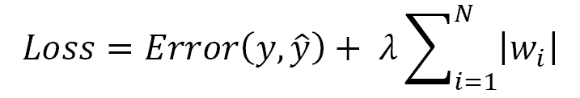
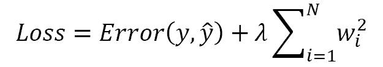
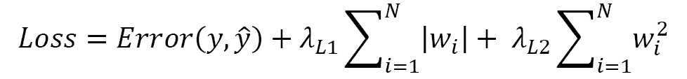

第八章：

# 第九章：模型训练和性能的最佳实践

为了使一个监督式机器学习模型得到良好的训练，需要大量的训练数据。在本章中，我们将查看处理输入数据的一些常见示例和模式。我们将特别学习如何访问训练数据，不论其大小，并使用这些数据训练模型。之后，我们将看看有助于防止过拟合的正则化技术。拥有大量的训练数据并不能保证得到一个良好的训练模型。为了防止过拟合，我们可能需要在训练过程中应用各种正则化技术。我们将逐步探讨这些技术，从典型的 Lasso（**L1**）、Ridge（**L2**）和弹性网正则化开始，然后深入到一种现代的正则化技术——对抗正则化。通过这些技术的应用，我们可以在减少训练过程中的过拟合方面处于有利地位。

在谈到正则化时，并没有一种简单的方法来确定哪种方法最有效。这肯定取决于其他因素，例如特征的分布或稀疏性以及数据的体量。本章的目的是提供各种示例，并为您在自己的模型训练过程中提供多种选择。在本章中，我们将涵盖以下主题：

+   加载数据的输入处理

+   正则化以减少过拟合

# 加载数据的输入处理

我们通常看到的许多常见示例往往侧重于建模方面，比如如何使用 TensorFlow 构建一个深度学习模型，并结合不同的层次和模式。在这些示例中，所使用的数据几乎总是直接加载到运行时内存中。只要训练数据足够小，这没问题。但如果数据远远超过了您的运行时内存处理能力怎么办呢？解决方案是数据流技术。我们在前几章中已经使用了这种技术将数据输入到模型中，接下来我们将更详细地探讨数据流，并将其推广到更多的数据类型。

数据流技术非常类似于 Python 生成器。数据是按批次输入到模型训练过程中，也就是说，所有数据并不会一次性发送。在本章中，我们将使用一个花卉图像数据的示例。尽管这些数据本身并不大，但它在教学和学习方面是一个非常方便的工具。该数据集是多类别的，并包含不同大小的图像。这反映了我们在实际应用中通常需要处理的情况，即可用的训练图像可能是众包的，或提供的尺度和尺寸各不相同。此外，模型训练过程的前端还需要一个高效的数据摄取工作流。

## 使用生成器

在生成器方面，TensorFlow 现在提供了一个非常方便的 `ImageDataGenerator` API，极大简化并加速了代码开发过程。根据我们在使用预训练模型进行图像分类的经验，我们发现通常需要对图像尺寸（以像素数衡量的高度和宽度）进行标准化，并将图像像素值归一化到特定范围内（从 [`0`，`255`] 到 [`0`，`1`]）。

`ImageDataGenerator` API 提供了可选的输入参数，使得这些任务几乎成为常规操作，并减少了编写自定义函数来执行标准化和归一化的工作。那么，接下来我们来看看如何使用这个 API：

1.  组织原始图像。让我们首先设置我们的图像集合。为了方便起见，我们将直接使用 `tf.keras` API 提供的花卉图像：

    ```py
    import tensorflow as tf
    import tensorflow_hub as hub
    data_dir = tf.keras.utils.get_file(
        'flower_photos', 'https://storage.googleapis.com/download.tensorflow.org/example_images/flower_photos.tgz',
        untar=True)
    ```

    在前面的代码中，我们使用 `tf.keras` API 下载五种花卉类型的图像。

1.  接下来，我们将使用 `flow_from_directory` 设置 `ImageDataGenerator` 和流对象。在这个步骤中，我们定义了几个操作：

    a. 图像像素强度被缩放到 [`0`，`255`] 范围内，并且伴随有交叉验证分数。`ImageDataGenerator` API 提供了可选的输入参数，包括重新缩放和 `validation_split`。这些参数需要以字典格式提供。因此，我们可以将重缩放（归一化）因子和交叉验证的比例一起组织到 `datagen_kwargs` 中。

    b. 图像的高度和宽度都被重新格式化为 `224` 像素。`flow_from_directory` API 包含可选的 `target_size`、`batch_size` 和 `interpolation` 参数。这些参数以字典格式设计。我们可以使用这些输入参数来设置图像尺寸标准化、批量大小和重采样插值算法在 `dataflow_kwargs` 中。

    c. 前述设置传递给生成器实例。然后，我们将这些设置传递给 `ImageDataGenerator` 和 `flow_from_directory`：

    ```py
    pixels =224
    BATCH_SIZE = 32 
    IMAGE_SIZE = (pixels, pixels)
    NUM_CLASSES = 5
    datagen_kwargs = dict(rescale=1./255, validation_split=.20)
    dataflow_kwargs = dict(target_size=IMAGE_SIZE, 
                           batch_size=BATCH_SIZE,
                       interpolation="bilinear")
    valid_datagen = tf.keras.preprocessing.image.ImageDataGenerator(
        **datagen_kwargs)
    valid_generator = valid_datagen.flow_from_directory(
        data_dir, subset="validation", shuffle=False, **dataflow_kwargs)
    train_datagen = valid_datagen
    train_generator = train_datagen.flow_from_directory(
    data_dir, subset="training", shuffle=True, **dataflow_kwargs)
    ```

    上述代码展示了创建图像生成器的典型工作流，将训练数据传递到模型中。定义了两个字典并存储我们需要的参数。接着调用了 `ImageDataGenerator` API，随后调用 `flow_from_directory` API。对于训练数据，流程也会重复进行。最后，我们通过 `train_generator` 和 `valid_generator` 设置了一个用于训练和交叉验证数据的摄取工作流。

1.  检索标签映射。由于我们使用 `ImageDataGenerator` 创建训练数据管道，我们也可以使用它来检索图像标签：

    ```py
    labels_idx = (train_generator.class_indices)
    idx_labels = dict((v,k) for k,v in labels_idx.items())
    print(idx_labels)
    ```

    在前面的代码中，`idx_labels` 是一个字典，将分类模型的输出（即索引）映射到 `flower` 类。以下是 `idx_labels`：

    ```py
    {0: 'daisy', 1: 'dandelion', 2: 'roses', 3: 'sunflowers', 4: 'tulips'}
    ```

    由于这是一个多类分类问题，我们的模型预测将是一个包含五个概率的数组。因此，我们需要获取概率最高类别的位置，然后使用`idx_labels`将该位置映射到相应类别的名称。

1.  构建并训练模型。这个步骤与我们在前一章*第七章*中执行的相同，*模型优化*，在其中我们将通过迁移学习构建一个模型。选择的模型是 ResNet 特征向量，最终的分类层是一个包含五个节点的密集层（`NUM_CLASSES`定义为`5`，如*步骤 2*所示），这五个节点输出每个类别的概率：

    ```py
    mdl = tf.keras.Sequential([
        tf.keras.layers.InputLayer(input_shape=IMAGE_SIZE + (3,)),
    hub.KerasLayer("https://tfhub.dev/google/imagenet/resnet_v1_101/feature_vector/4", trainable=False),
        tf.keras.layers.Dense(NUM_CLASSES, 
                 activation='softmax', name = 'custom_class')
    ])
    mdl.build([None, 224, 224, 3])
    mdl.compile(
      optimizer=tf.keras.optimizers.SGD(lr=0.005, 
                                               momentum=0.9), 
      loss=tf.keras.losses.CategoricalCrossentropy(from_logits=True, label_smoothing=0.1),
      metrics=['accuracy'])
    steps_per_epoch = train_generator.samples 
                                // train_generator.batch_size
    validation_steps = valid_generator.samples 
                                // valid_generator.batch_size
    mdl.fit(
        train_generator,
        epochs=5, steps_per_epoch=steps_per_epoch,
        validation_data=valid_generator,
        validation_steps=validation_steps)
    ```

    上述代码展示了通过训练设置模型架构的基本流程。我们首先使用`tf.keras`的顺序 API 构建了一个`mdl`模型。一旦指定了`loss`函数和优化器，就编译了模型。由于我们希望将交叉验证作为训练流程的一部分，我们需要设置`step_per_epoch`，即生成器为每个 epoch 生成的总数据批次数。这个过程会为交叉验证数据重复执行。然后，我们调用 Fit API 启动五个 epoch 的训练过程。

上述步骤展示了如何从`ImageDataGenerator`开始，构建一个将图像数据从图像目录通过`flow_from_directory`流入的管道，我们还能够处理图像标准化和归一化过程，作为输入参数。

## TFRecord 数据集 – 数据摄取管道

训练过程中，另一种将训练数据流入模型的方式是通过 TFRecord 数据集。TFRecord 是一种协议缓冲格式。以这种格式存储的数据可以在**Python**、**Java**和**C++**中使用。在企业或生产系统中，这种格式可能提供灵活性，并促进数据在不同应用程序中的重用。TFRecord 的另一个注意事项是，如果你希望使用 TPU 作为计算目标，并希望使用管道摄取训练数据，那么 TFRecord 就是实现这一目标的方式。目前，TPU 不支持生成器。因此，通过管道流式传输数据的唯一方法是使用 TFRecord。再次强调，实际上该数据集的大小并不需要 TFRecord，这仅用于学习目的。

我们将从已经准备好的 TFRecord 数据集开始。它包含了与前一节中看到的相同的花卉图像和类别。此外，这个 TFRecord 数据集已被划分为训练、验证和测试数据集。该 TFRecord 数据集可以在本书的 GitHub 仓库中找到。你可以使用以下命令克隆该仓库：

```py
git clone https://github.com/PacktPublishing/learn-tensorflow-enterprise.git
```

一旦该命令完成，请进入以下路径：

```py
 learn-tensorflow-enterprise/tree/master/chapter_07/train_base_model/tf_datasets/flower_photos
```

你将看到以下 TFRecord 数据集：

```py
image_classification_builder-train.tfrecord-00000-of-00002
```

```py
image_classification_builder-train.tfrecord-00001-of-00002
```

```py
image_classification_builder-validation.tfrecord-00000-of-00001
```

```py
image_classification_builder-test.tfrecord-00000-of-00001
```

记下这些数据集存储的文件路径。

我们将把这个路径称为`<PATH_TO_TFRECORD>`。这可以是你本地系统中的路径，或者是你上传并挂载这些 TFRecord 文件的任何云端笔记本环境中的路径：

1.  设置文件路径。如你所见，在这个 TFRecord 集合中，有多个部分（两个）`train.tfrecord`。我们将使用通配符（`*`）符号来表示遵循相同命名模式的多个文件名。我们可以使用`glob`来跟踪模式，将其传递给`list_files`以创建文件列表，然后让`TFRecordDataset`创建数据集对象。

1.  识别并编码文件名约定。我们希望拥有一个能够处理数据导入过程的管道。因此，我们必须创建变量来保存文件路径和命名约定：

    ```py
    import tensorflow as tf
    import tensorflow_hub as hub
    import tensorflow_datasets as tfds
    root_dir = '<PATH_TO_TFRECORD>'
    train_file_pattern = "{}/image_classification_builder-train*.tfrecord*".format(root_dir)
    val_file_pattern = "{}/image_classification_builder-validation*.tfrecord*".format(root_dir)
    test_file_pattern = "{}/image_classification_builder-test*.tfrecord*".format(root_dir)
    ```

    在这里，我们将训练、验证和测试数据的文件路径以文本字符串的形式编码到`train_file_pattern`、`val_file_pattern`和`test_file_pattern`变量中。注意，我们使用了通配符操作符`*`来处理多个文件部分（如果有的话）。这是实现数据导入管道可扩展性的一个重要方法。无论有多少个文件，因为现在你有了一种通过路径模式找到所有文件的方法。

1.  创建文件列表。为了创建一个能够处理多个部分 TFRecord 文件的对象，我们将使用`list_files`来跟踪这些文件：

    ```py
    train_all_files = tf.data.Dataset.list_files( tf.io.gfile.glob(train_file_pattern))
    val_all_files = tf.data.Dataset.list_files( tf.io.gfile.glob(val_file_pattern))
    test_all_files = tf.data.Dataset.list_files( tf.io.gfile.glob(test_file_pattern))
    ```

    在前面的代码中，我们使用`tf.io` API 引用了训练、验证和测试文件。这些文件的路径由`train_file_pattern`、`val_file_pattern`和`test_file_pattern`定义。

1.  创建数据集对象。我们将使用`TFRecordDataset`从训练、验证和测试列表对象创建数据集对象：

    ```py
    train_all_ds = tf.data.TFRecordDataset(train_all_files, num_parallel_reads = AUTOTUNE)
    val_all_ds = tf.data.TFRecordDataset(val_all_files, num_parallel_reads = AUTOTUNE)
    test_all_ds = tf.data.TFRecordDataset(test_all_files, num_parallel_reads = AUTOTUNE)
    ```

    `TFRecordDataset` API 读取由文件路径变量引用的`TFRecord`文件。

1.  检查样本大小。到目前为止，尚无快速方法来确定每个 TFRecord 中的样本大小。唯一的方法是通过迭代它：

    ```py
    print("Sample size for training: {0}".format(sum(1 for _ in tf.data.TFRecordDataset(train_all_files)))
         ,'\n', "Sample size for validation: {0}".format(sum(1 for _ in tf.data.TFRecordDataset(val_all_files)))
         ,'\n', "Sample size for test: {0}".format(sum(1 for _ in tf.data.TFRecordDataset(test_all_files)))) 
    ```

    上面的代码打印并验证了我们每个 TFRecord 数据集中的样本大小。

    输出应如下所示：

    ```py
    Sample size for training: 3540 
    Sample size for validation: 80 
    Sample size for test: 50
    ```

    由于我们能够统计 TFRecord 数据集中的样本数，我们知道我们的 TFRecord 数据管道已经正确设置。

## TFRecord 数据集 - 特征工程与训练

当我们使用生成器作为数据导入管道时，生成器在训练过程中会负责批处理和数据与标签的匹配。然而，与生成器不同，为了使用 TFRecord 数据集，我们必须自己解析它并执行一些必要的特征工程任务，例如归一化和标准化。TFRecord 的创建者必须提供一个特征描述字典作为**模板**来解析样本。在这种情况下，提供了以下特征字典：

```py
features = {
```

```py
    'image/channels' :  tf.io.FixedLenFeature([], tf.int64),
```

```py
    'image/class/label' :  tf.io.FixedLenFeature([], tf.int64),
```

```py
    'image/class/text' : tf.io.FixedLenFeature([], tf.string),
```

```py
    'image/colorspace' : tf.io.FixedLenFeature([], tf.string),
```

```py
    'image/encoded' : tf.io.FixedLenFeature([], tf.string),
```

```py
    'image/filename' : tf.io.FixedLenFeature([], tf.string),
```

```py
    'image/format' : tf.io.FixedLenFeature([], tf.string),
```

```py
    'image/height' : tf.io.FixedLenFeature([], tf.int64),
```

```py
    'image/width' : tf.io.FixedLenFeature([], tf.int64)
```

```py
    })
```

我们将通过以下步骤来解析数据集，执行特征工程任务，并提交数据集进行训练。这些步骤是在完成*TFRecord 数据集 - 导入管道*部分后进行的：

1.  解析 TFRecord 并调整图像大小。我们将使用前面的字典来解析 TFRecord，以提取单张图像作为 NumPy 数组及其对应的标签。我们将定义一个`decode_and_resize`函数来执行此操作：

    ```py
    def decode_and_resize(serialized_example):
        # resized image should be [224, 224, 3] and 	 	    # normalized to value range [0, 255]
        # label is integer index of class.

        parsed_features = tf.io.parse_single_example(
          serialized_example,
          features = {
        'image/channels' :  tf.io.FixedLenFeature([], 	 	                                                tf.int64),
        'image/class/label' :  tf.io.FixedLenFeature([], 	 	                                                tf.int64),
        'image/class/text' : tf.io.FixedLenFeature([], 	 	                                               tf.string),
        'image/colorspace' : tf.io.FixedLenFeature([], 	 	                                               tf.string),
        'image/encoded' : tf.io.FixedLenFeature([], 	 	                                               tf.string),
        'image/filename' : tf.io.FixedLenFeature([], 	 	                                               tf.string),
        'image/format' : tf.io.FixedLenFeature([], 	 	        	                                               tf.string),
        'image/height' : tf.io.FixedLenFeature([], tf.int64),
        'image/width' : tf.io.FixedLenFeature([], tf.int64)
        })
        image = tf.io.decode_jpeg(parsed_features[
                                'image/encoded'], channels=3)
        label = tf.cast(parsed_features[
                              'image/class/label'], tf.int32)
        label_txt = tf.cast(parsed_features
                             ['image/class/text'], tf.string)
        label_one_hot = tf.one_hot(label, depth = 5)
        resized_image = tf.image.resize(image, [224, 224], 
                                             method='nearest')
        return resized_image, label_one_hot
    ```

    `decode_and_resize`函数接受 TFRecord 格式的数据集，解析它，提取元数据和实际图像，然后返回图像及其标签。

    在该函数的更详细层面内，TFRecord 数据集使用`parsed_feature`进行解析。这是我们从数据集中提取不同元数据的方法。图像通过`decode_jpeg` API 进行解码，并调整为 224 x 224 像素。至于标签，它被提取并进行独热编码。最后，函数返回调整后的图像和相应的独热标签。

1.  标准化像素值。我们还需要将像素值标准化到[`0`, `255`]范围内。这里，我们定义了一个`normalize`函数来实现这一目标：

    ```py
    def normalize(image, label):
        #Convert `image` from [0, 255] -> [0, 1.0] floats 
        image = tf.cast(image, tf.float32) / 255.
        return image, label
    ```

    在这里，图像按像素进行重新缩放，范围为[`0`, `1.0`]，方法是将每个像素值除以`255`。结果被转换为`float32`，以表示浮动点值。该函数返回重新缩放后的图像及其标签。

1.  执行这些函数。这些函数（`decode_and_resize`和`normalize`）被设计为应用于 TFRecord 中的每个样本。我们使用`map`来完成这一任务：

    ```py
    resized_train_ds = train_all_ds.map(decode_and_resize, num_parallel_calls=AUTOTUNE)
    resized_val_ds = val_all_ds.map(decode_and_resize, num_parallel_calls=AUTOTUNE)
    resized_test_ds = test_all_ds.map(decode_and_resize, num_parallel_calls=AUTOTUNE)
    resized_normalized_train_ds = resized_train_ds.map(normalize, num_parallel_calls=AUTOTUNE)
    resized_normalized_val_ds = resized_val_ds.map(normalize, num_parallel_calls=AUTOTUNE)
    resized_normalized_test_ds = resized_test_ds.map(normalize, num_parallel_calls=AUTOTUNE)
    ```

    在这里，我们对所有数据集应用`decode_and_resize`，然后在像素级别对数据集进行标准化。

1.  批量处理用于训练过程的数据集。对 TFRecord 数据集执行的最后一步是批量处理。我们将为此定义一些变量，并定义一个函数`prepare_for_model`来进行批量处理：

    ```py
    pixels =224
    IMAGE_SIZE = (pixels, pixels)
    TRAIN_BATCH_SIZE = 32
    # Validation and test data are small. Use all in a batch.
    VAL_BATCH_SIZE = sum(1 for _ in tf.data.TFRecordDataset(val_all_files))
    TEST_BATCH_SIZE = sum(1 for _ in tf.data.TFRecordDataset(test_all_files))
    def prepare_for_model(ds, BATCH_SIZE, cache=True, TRAINING_DATA=True, shuffle_buffer_size=1000):
      if cache:
        if isinstance(cache, str):
          ds = ds.cache(cache)
        else:
          ds = ds.cache()
      ds = ds.shuffle(buffer_size=shuffle_buffer_size)
      if TRAINING_DATA:
        # Repeat forever
        ds = ds.repeat()
      ds = ds.batch(BATCH_SIZE)
      ds = ds.prefetch(buffer_size=AUTOTUNE)
      return ds
    ```

    交叉验证和测试数据没有被分成批次。因此，整个交叉验证数据集是一个单独的批次，测试数据集也是如此。

    `prepare_for_model`函数接受一个数据集，然后将其缓存在内存中并进行预取。如果此函数应用于训练数据，它还会无限次重复数据，以确保在训练过程中不会用完数据。

1.  执行批量处理。使用`map`函数来应用`batching`函数：

    ```py
    NUM_EPOCHS = 5
    SHUFFLE_BUFFER_SIZE = 1000
    prepped_test_ds = prepare_for_model(resized_normalized_test_ds, TEST_BATCH_SIZE, False, False)
    prepped_train_ds = resized_normalized_train_ds.repeat(100).shuffle(buffer_size=SHUFFLE_BUFFER_SIZE)
    prepped_train_ds = prepped_train_ds.batch(TRAIN_BATCH_SIZE)
    prepped_train_ds = prepped_train_ds.prefetch(buffer_size = AUTOTUNE)
    prepped_val_ds = resized_normalized_val_ds.repeat(NUM_EPOCHS).shuffle(buffer_size=SHUFFLE_BUFFER_SIZE)
    prepped_val_ds = prepped_val_ds.batch(80)
    prepped_val_ds = prepped_val_ds.prefetch(buffer_size = AUTOTUNE)
    ```

    前面的代码设置了训练、验证和测试数据的批次。这些数据已经准备好可以输入到训练过程中。我们现在已经完成了数据输入管道。

1.  构建和训练模型。这部分与前面的部分没有区别。我们将构建并训练一个与生成器中看到的架构相同的模型：

    ```py
    FINE_TUNING_CHOICE = False
    NUM_CLASSES = 5
    IMAGE_SIZE = (224, 224)
    mdl = tf.keras.Sequential([
        tf.keras.layers.InputLayer(input_shape=IMAGE_SIZE + 
                                   (3,), name='input_layer'),
        hub.KerasLayer("https://tfhub.dev/google/imagenet/resnet_v1_101/feature_vector/4", trainable=FINE_TUNING_CHOICE, name = 'resnet_fv'), 
        tf.keras.layers.Dense(NUM_CLASSES, 
                 activation='softmax', name = 'custom_class')
    ])
    mdl.build([None, 224, 224, 3])
    mdl.compile(
      optimizer=tf.keras.optimizers.SGD(lr=0.005, 
                                               momentum=0.9), 
      loss=tf.keras.losses.CategoricalCrossentropy(
                      from_logits=True, label_smoothing=0.1),
      metrics=['accuracy'])
    mdl.fit(
        prepped_train_ds,
        epochs=5, steps_per_epoch=100,
        validation_data=prepped_val_ds,
        validation_steps=1)
    ```

    请注意，训练数据集和验证数据集分别作为`prepped_train_ds`和`prepped_val_ds`传递给模型。在这方面，它与我们在训练时将生成器传递给模型的方式没有区别。然而，相较于生成器，我们在解析、标准化和规范化这些数据集方面所做的额外工作要复杂得多。

TFRecord 的好处在于，如果您有大型数据集，那么将其分成多个部分并将其存储为 TFRecord，将比使用生成器更快地将数据流入模型。此外，如果您的计算目标是 TPU，那么您不能使用生成器来流式传输训练数据；您将必须使用 TFRecord 数据集来流式传输训练数据到模型进行训练。

# 正则化

在训练过程中，模型正在学习找到最佳的权重和偏置集合，以最小化 `loss` 函数。随着模型架构变得更复杂或者简单地开始增加更多层次，模型正在装配更多的参数。尽管这可能有助于在训练期间产生更好的拟合，但使用更多的参数也可能导致过拟合。

在本节中，我们将深入探讨一些可以在 `tf.keras` API 中直接实现的正则化技术。

## L1 和 L2 正则化

传统方法解决过拟合问题涉及在 `loss` 函数中引入惩罚项。这称为正则化。惩罚项直接与模型复杂性相关，主要由非零权重的数量决定。更具体地说，机器学习中通常使用三种传统的正则化类型：

+   `loss` 函数与 L1 正则化：

它使用权重 `w` 的绝对值之和，乘以用户定义的惩罚值 `λ`，来衡量复杂性（即模型拟合的参数数量表明其复杂性）。其思想是，使用的参数或权重越多，施加的惩罚就越高。我们希望用尽可能少的参数得到最佳模型。

+   `loss` 函数与 L2 正则化：



它使用权重 `w` 的平方和，乘以用户定义的惩罚值 `λ`，来衡量复杂性。

+   `loss` 函数与 L1 和 L2 正则化：



它使用 L1 和 L2 的组合来衡量复杂性。每个正则化项都有自己的惩罚因子。

（参考：*pp. 38-39*，*Antonio Gulli 和 Sujit Pal*，*Deep Learning with Keras*，*Packt 2017*，[`www.tensorflow.org/api_docs/python/tf/keras/regularizers/`](https://www.tensorflow.org/api_docs/python/tf/keras/regularizers/)）

这些是模型层定义的关键字输入参数，包括密集或卷积层，例如 Conv1D、Conv2D 和 Conv3D：

+   `kernel_regularizer`：应用于权重矩阵的正则化器

+   `bias_regularizer`：应用于偏置向量的正则化器

+   `activity_regularizer`：应用于层输出的正则化器

（参考：*p. 63*，*Antonio Gulli 和 Sujit Pal*，*Deep Learning with Keras*，*Packt 2017*，[`www.tensorflow.org/api_docs/python/tf/keras/regularizers/Regularizer`](https://www.tensorflow.org/api_docs/python/tf/keras/regularizers/Regularizer)）

现在我们将看看如何实现其中一些参数。例如，我们将利用前一节中构建的模型架构，即 ResNet 特征向量层，后跟密集层作为分类头部：

```py
KERNEL_REGULARIZER = tf.keras.regularizers.l2(l=0.1)
```

```py
ACTIVITY_REGULARIZER = tf.keras.regularizers.L1L2(l1=0.1,l2=0.1)
```

```py
mdl = tf.keras.Sequential([
```

```py
    tf.keras.layers.InputLayer(input_shape=IMAGE_SIZE + (3,)),
```

```py
    hub.KerasLayer("https://tfhub.dev/google/imagenet/resnet_v2_50/feature_vector/4",trainable=FINE_TUNING_CHOICE), 
```

```py
    tf.keras.layers.Dense(NUM_CLASSES 
```

```py
                         ,activation='softmax'
```

```py
                         ,kernel_regularizer=KERNEL_REGULARIZER
```

```py
                          ,activity_regularizer = 
```

```py
                          ACTIVITY_REGULARIZER
```

```py
                          ,name = 'custom_class')
```

```py
])
```

```py
mdl.build([None, 224, 224, 3])
```

请注意，我们使用别名来定义我们感兴趣的正则化器。这将使我们能够调整决定正则化项如何惩罚潜在过度拟合的超参数（`l1`，`l2`）：

```py
KERNEL_REGULARIZER = tf.keras.regularizers.l2(l=0.1)
```

```py
ACTIVITY_REGULARIZER = tf.keras.regularizers.L1L2(l1=0.1,l2=0.1)
```

然后在密集层定义中添加这些`regularizer`定义：

```py
tf.keras.layers.Dense(NUM_CLASSES 
```

```py
                      ,activation='softmax'
```

```py
                      ,kernel_regularizer=KERNEL_REGULARIZER
```

```py
                      ,activity_regularizer = 
```

```py
                                           ACTIVITY_REGULARIZER
```

```py
                      ,name = 'custom_class')
```

这些是在前一节使用的代码中所需的唯一更改。

## 对抗正则化

一个有趣的技术被称为对抗学习于 2014 年出现（如果感兴趣，请阅读*Goodfellow et al*., *2014*发表的开创性论文）。这个想法源于这样一个事实，即如果输入比预期稍微嘈杂，机器学习模型的准确性可能会大大降低，从而产生错误预测。这种噪声称为对抗扰动。因此，如果训练数据集增加了一些数据的随机变化，我们可以利用这种技术使我们的模型更加健壮。

TensorFlow 的`AdversarialRegularization` API 旨在补充`tf.keras` API 并简化模型构建和训练过程。我们将重新使用下载的 TFRecord 数据集作为原始训练数据。然后我们将对该数据集应用数据增强技术，最后我们将训练模型。为此，请按照以下步骤操作：

1.  下载并解压训练数据（如果您在本章开头没有这样做）。您需要下载 flower_tfrecords.zip，即我们将从 Harvard Dataverse 使用的 TFRecord 数据集（[`dataverse.harvard.edu/dataset.xhtml?persistentId=doi:10.7910/DVN/1ECTVN`](https://dataverse.harvard.edu/dataset.xhtml?persistentId=doi:10.7910/DVN/1ECTVN)）。将其放置在您打算使用的计算节点上。它可以是您的本地计算环境或云计算环境，如 Google AI 平台的 JupyterLab 或 Google Colab。下载后解压文件，并记下其路径。我们将称此路径为`<PATH_TO_TFRECORD>`。在此路径中，您将看到这些 TFRecord 数据集：

    ```py
    image_classification_builder-train.tfrecord-00000-of-00002
    image_classification_builder-train.tfrecord-00001-of-00002
    image_classification_builder-validation.tfrecord-00000-of-00001
    image_classification_builder-test.tfrecord-00000-of-00001
    ```

1.  安装库。我们需要确保神经结构化学习模块在我们的环境中可用。如果您还没有这样做，应使用以下`pip`命令安装此模块：

    ```py
    !pip install --quiet neural-structured-learning
    ```

1.  为数据管道创建文件模式对象。有多个文件（两个）。因此，在数据摄取过程中，我们可以利用文件命名约定和通配符`*`限定符：

    ```py
    import tensorflow as tf
    import neural_structured_learning as nsl
    import tensorflow_hub as hub
    import tensorflow_datasets as tfds
    AUTOTUNE = tf.data.experimental.AUTOTUNE
    root_dir = './tfrecord-dataset/flowers'
    train_file_pattern = "{}/image_classification_builder-train*.tfrecord*".format(root_dir)
    val_file_pattern = "{}/image_classification_builder-validation*.tfrecord*".format(root_dir)
    test_file_pattern = "{}/image_classification_builder-test*.tfrecord*".format(root_dir)
    ```

    为了方便起见，TFRecord 文件的路径被指定为以下变量：`train_file_pattern`、`val_file_pattern`和`test_file_pattern`。这些路径以文本字符串的形式表示。通配符`*`用于处理多个文件部分，以防有多个文件。

1.  清点所有文件名。我们可以使用`glob` API 创建一个数据集对象，用于追踪文件的所有部分：

    ```py
    train_all_files = tf.data.Dataset.list_files( tf.io.gfile.glob(train_file_pattern))
    val_all_files = tf.data.Dataset.list_files( tf.io.gfile.glob(val_file_pattern))
    test_all_files = tf.data.Dataset.list_files( tf.io.gfile.glob(test_file_pattern))
    ```

    在这里，我们使用`tf.io` API 引用前一步中指示的文件路径。`tf.io`的`glob` API 所引用的文件名将通过`tf.data`的`list_files` API 编码成文件名列表。

1.  建立加载管道。现在我们可以通过`TFRecordDataset`建立与数据源的引用：

    ```py
    train_all_ds = tf.data.TFRecordDataset(train_all_files, num_parallel_reads = AUTOTUNE)
    val_all_ds = tf.data.TFRecordDataset(val_all_files, num_parallel_reads = AUTOTUNE)
    test_all_ds = tf.data.TFRecordDataset(test_all_files, num_parallel_reads = AUTOTUNE)
    ```

    在这里，我们使用`TFRecordDataset` API 从源数据创建各自的数据集。

1.  为了检查我们是否完全看到了数据，我们将统计每个数据集中的样本大小：

    ```py
    train_sample_size = sum(1 for _ in tf.data.TFRecordDataset(train_all_files))
    validation_sample_size = sum(1 for _ in tf.data.TFRecordDataset(val_all_files))
    test_sample_size = sum(1 for _ in tf.data.TFRecordDataset(test_all_files))
    print("Sample size for training: {0}".format(train_sample_size)
         ,'\n', "Sample size for validation: {0}".format(validation_sample_size)
         ,'\n', "Sample size for test: {0}".format(test_sample_size))
    ```

    目前，了解 TFRecord 文件中有多少样本的方法是通过遍历文件。在代码中：

    ```py
    sum(1 for _ in tf.data.TFRecordDataset(train_all_files))
    ```

    我们使用`for`循环遍历数据集，并通过累加迭代次数来获得最终的样本大小。此编码模式也用于确定验证集和测试集的样本大小。然后，这些数据集的大小将存储为变量。

    上述代码的输出将如下所示：

    ```py
    Sample size for training: 3540 
    Sample size for validation: 80 
    Sample size for test: 50
    ```

1.  关于数据转换，我们需要将所有图像转换为相同的大小，即高度为`224`像素，宽度为`224`像素。每个像素的强度值应在[`0`，`1`]的范围内。因此，我们需要将每个像素的值除以`255`。我们需要以下两个函数来进行这些转换操作：

    ```py
    def decode_and_resize(serialized_example):
        # resized image should be [224, 224, 3] and 	 	    # normalized to value range [0, 255]
        # label is integer index of class.

        parsed_features = tf.io.parse_single_example(
          serialized_example,
          features = {
        'image/channels' :  tf.io.FixedLenFeature([], 	  	                                                tf.int64),
        'image/class/label' :  tf.io.FixedLenFeature([], 	 	                                                tf.int64),
        'image/class/text' : tf.io.FixedLenFeature([], 	 	                                               tf.string),
        'image/colorspace' : tf.io.FixedLenFeature([], 	 	                                               tf.string),
        'image/encoded' : tf.io.FixedLenFeature([], 	 	                                               tf.string),
        'image/filename' : tf.io.FixedLenFeature([], 	 	                                               tf.string),
        'image/format' : tf.io.FixedLenFeature([], 	 	    	                                               tf.string),
        'image/height' : tf.io.FixedLenFeature([], tf.int64),
        'image/width' : tf.io.FixedLenFeature([], tf.int64)
        })
        image = tf.io.decode_jpeg(parsed_features[
                                'image/encoded'], channels=3)
        label = tf.cast(parsed_features['image/class/label'], 
                                                     tf.int32)
        label_txt = tf.cast(parsed_features[
                              'image/class/text'], tf.string)
        label_one_hot = tf.one_hot(label, depth = 5)
        resized_image = tf.image.resize(image, [224, 224], 
                                             method='nearest')
    return resized_image, label_one_hot
    ```

    `decode_and_resize`函数接受 TFRecord 格式的数据集，解析数据，提取元数据和实际图像，并返回图像及其标签。更具体地，在该函数内部，TFRecord 数据集通过`parsed_feature`进行解析。通过这种方式，我们提取数据集中的不同元数据。图像通过`decode_jpeg` API 解码，并调整大小为`224`×`224`像素。至于标签，它会被提取并进行独热编码。

1.  最后，函数返回调整大小后的图像及其对应的独热标签。

    ```py
    def normalize(image, label):
        #Convert `image` from [0, 255] -> [0, 1.0] floats 
        image = tf.cast(image, tf.float32) / 255.
        return image, label
    ```

    这个函数接受一张 JPEG 图像，并将像素值（将每个像素值除以`255`）归一化到[`0`，`1.0`]范围内，并将其转换为`tf.float32`表示浮动值。它返回归一化后的图像及其对应的标签。

1.  执行数据转换。我们将使用`map`函数将之前的转换操作应用到数据集中的每个元素：

    ```py
    resized_train_ds = train_all_ds.map(decode_and_resize, num_parallel_calls=AUTOTUNE)
    resized_val_ds = val_all_ds.map(decode_and_resize, num_parallel_calls=AUTOTUNE)
    resized_test_ds = test_all_ds.map(decode_and_resize, num_parallel_calls=AUTOTUNE)
    resized_normalized_train_ds = resized_train_ds.map(normalize, num_parallel_calls=AUTOTUNE)
    resized_normalized_val_ds = resized_val_ds.map(normalize, num_parallel_calls=AUTOTUNE)
    resized_normalized_test_ds = resized_test_ds.map(normalize, num_parallel_calls=AUTOTUNE)
    ```

    在之前的代码中，我们将`decode_and_resize`应用于每个数据集，然后通过对每个像素应用`normalize`函数来重新缩放数据集。

1.  定义训练参数。我们需要指定数据集的批量大小，以及定义周期的参数：

    ```py
    pixels =224
    IMAGE_SIZE = (pixels, pixels)
    TRAIN_BATCH_SIZE = 32
    VAL_BATCH_SIZE = validation_sample_size
    TEST_BATCH_SIZE = test_sample_size
    NUM_EPOCHS = 5
    SHUFFLE_BUFFER_SIZE = 1000
    FINE_TUNING_CHOICE = False
    NUM_CLASSES = 5
    prepped_test_ds = resized_normalized_test_ds.batch(TEST_BATCH_SIZE).prefetch(buffer_size = AUTOTUNE)
    prepped_train_ds = resized_normalized_train_ds.repeat(100).shuffle(buffer_size=SHUFFLE_BUFFER_SIZE)
    prepped_train_ds = prepped_train_ds.batch(TRAIN_BATCH_SIZE)
    prepped_train_ds = prepped_train_ds.prefetch(buffer_size = AUTOTUNE)
    prepped_val_ds = resized_normalized_val_ds.repeat(NUM_EPOCHS).shuffle(buffer_size=SHUFFLE_BUFFER_SIZE)
    prepped_val_ds = prepped_val_ds.batch(80)
    prepped_val_ds = prepped_val_ds.prefetch(buffer_size = AUTOTUNE)
    ```

    在前面的代码中，我们定义了设置训练过程所需的参数。数据集也会被批量化并提取出来以供使用。

    现在我们已经构建了数据集管道，每次都会获取一批数据并输入到模型训练过程中。

1.  构建你的模型。我们将使用 ResNet 特征向量来构建一个图像分类模型：

    ```py
    mdl = tf.keras.Sequential([
        tf.keras.layers.InputLayer(input_shape=IMAGE_SIZE + (3,)),
        hub.KerasLayer("https://tfhub.dev/google/imagenet/resnet_v2_50/feature_vector/4",trainable=FINE_TUNING_CHOICE), 
        tf.keras.layers.Dense(NUM_CLASSES, activation='softmax', name = 'custom_class')
    ])
    mdl.build([None, 224, 224, 3])
    ```

    我们使用`tf.keras`的顺序 API 来构建一个图像分类模型。首先使用输入层接受训练数据，尺寸为`224`乘`224`乘`3`像素。接着我们利用`ResNet_V2_50`的特征向量作为中间层。我们将其保持原样（`trainable` = `FINE_TUNING_CHOICE`。`FINE_TUNING_CHOICE`在前一步已设为`False`，如果你愿意，也可以将其设置为`True`，但这样会显著增加训练时间）。最后，输出层由一个具有五个节点的全连接层表示（`NUM_CLASSES = 5`）。每个节点表示各类花卉类型的概率值。

    到目前为止，还没有涉及到对抗正则化。从下一步开始，我们将通过构建一个配置对象来指定对抗训练数据并启动训练过程。

1.  将训练样本转换为字典。对抗正则化的一个特殊要求是将训练数据和标签合并为一个字典，并将其流式传输到训练过程中。这可以通过以下函数轻松实现：

    ```py
    def examples_to_dict(image, label):
      return {'image_input': image, 'label_output': label}
    ```

    该函数接受图像和对应的标签，然后将其重新格式化为字典中的键值对。

1.  将数据和标签集合转换为字典。对于批量数据集，我们可以再次使用`map`函数，将`examples_to_dict`应用于数据集中的每个元素：

    ```py
    train_set_for_adv_model = prepped_train_ds.map(examples_to_dict)
    val_set_for_adv_model = prepped_val_ds.map(examples_to_dict)
    test_set_for_adv_model = prepped_test_ds.map(examples_to_dict)
    ```

    在这段代码中，数据集中的每个样本也会被转换为字典。这是通过`map`函数实现的。`map`函数将`examples_to_dict`函数应用到数据集中的每个元素（样本）上。

1.  创建对抗正则化对象。现在我们准备创建一个指定对抗配置的`adv_config`对象。然后我们将前一步创建的`mdl`基础模型与`adv_config`进行包装：

    ```py
    adv_config = nsl.configs.make_adv_reg_config()
    adv_mdl = nsl.keras.AdversarialRegularization(mdl,
    label_keys=['label_output'],
    adv_config=adv_config)
    ```

    现在我们有了一个模型，`adv_mdl`，它包含了由`mdl`定义的基础模型结构。`adv_mdl`包括了对抗配置`adv_config`的知识，该配置将在训练过程中用于生成对抗图像。

1.  编译并训练模型。这部分与之前我们做的类似，训练基础模型时也是如此，唯一的不同在于输入数据集：

    ```py
    adv_mdl.compile(optimizer=tf.keras.optimizers.SGD(lr=0.005, momentum=0.9), 
        loss=tf.keras.losses.CategoricalCrossentropy(
                      from_logits=True, label_smoothing=0.1),
        metrics=['accuracy'])
    adv_mdl.fit(
        train_set_for_adv_model,
        epochs=5, steps_per_epoch=100,
        validation_data=val_set_for_adv_model,
        validation_steps=1)
    ```

    请注意，现在传递给`fit`函数的训练输入是`train_set_for_adv_model`和`val_set_for_adv_model`，这两个数据集会将每个样本作为字典流式传输到训练过程中。

使用`tf.keras`和对抗性正则化 API 设置对抗性正则化并不需要很多工作。基本上，只需要额外一步将样本和标签重新格式化为字典。然后，我们使用`nsl.keras.AdversarialRegularization` API 包装我们的模型，该 API 封装了模型架构和对抗性正则化对象。这使得实现这种类型的正则化变得非常简单。

# 总结

本章介绍了一些增强和改善模型构建与训练过程的常见实践。在处理训练数据时，最常见的问题之一是以高效和可扩展的方式流式传输或获取训练数据。在本章中，你已经看到两种方法帮助你构建这样的数据获取管道：生成器和数据集。每种方法都有其优点和用途。生成器能够很好地管理数据转换和批处理，而数据集 API 则是为 TPU 目标而设计的。

我们还学习了如何使用传统的 L1 和 L2 正则化技术，以及一种现代的正则化技术——对抗性正则化，它适用于图像分类。对抗性正则化还会为你处理数据转换和增强，省去你生成噪声图像的麻烦。这些新的 API 和功能增强了 TensorFlow Enterprise 的用户体验，并帮助节省开发时间。

在下一章，我们将学习如何使用 TensorFlow Serving 服务 TensorFlow 模型。
