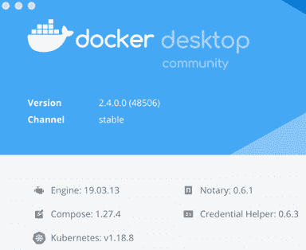

第九章:

# 第十章：提供 TensorFlow 模型

现在，在学习了前面所有章节之后，您已经看到了**TensorFlow Enterprise (TFE)**模型构建过程的许多方面。现在是时候总结我们所做的工作，并看看如何服务我们构建的模型了。在本章中，我们将研究通过本地主机中的 RESTful API 提供 TensorFlow 模型的基础知识。开始的最简单方式是使用**TensorFlow Serving (TFS)**。TFS 是一个用于提供使用 TensorFlow 构建的机器学习模型的系统，尽管它目前尚未得到 TFE 的官方支持，但您会发现它适用于由 TFE 2 构建的模型。它可以作为服务器运行，也可以作为 Docker 容器运行。为了我们的方便起见，我们将使用 Docker 容器，因为这确实是开始使用 TFS 的最简单方式，无论您的本地环境如何，只要您有可用的 Docker 引擎。在本章中，我们将涵盖以下主题：

+   运行本地服务

+   了解使用 Docker 的 TFS

+   下载 TFS Docker 镜像

# 技术要求

要按照本章进行操作，并尝试此处的示例代码：https://github.com/PacktPublishing/learn-tensorflow-enterprise，您需要克隆此书的 GitHub 存储库，并导航到`chapter_09`文件夹。您可以使用以下命令克隆存储库：

```py
git clone https://github.com/PacktPublishing/learn-tensorflow-enterprise.git
```

我们将从名为`chapter_09`的文件夹开始工作。在此文件夹中，有一个包含源代码的 Jupyter 笔记本。您还会在`flowerclassifier/001`目录中找到一个`saved_model.pb`文件，准备好供您使用。在`raw_images`目录中，您会找到一些用于测试的原始 JPG 图像。

# 运行本地服务

服务模型的先决条件是对模型结构及其资产（如权重和偏差矩阵）进行序列化。训练过的 TensorFlow 模型通常以`SavedModel`格式保存。`SavedModel`格式包含具有权重、偏差和计算操作的完整 TensorFlow 程序。这是通过低级`tf.saved_model` API 完成的。

通常，在使用 Fit 进行模型训练过程时，您最终会得到类似这样的东西：

```py
mdl.fit(
```

```py
    train_dataset,
```

```py
    epochs=5, steps_per_epoch=steps_per_epoch,
```

```py
    validation_data=valid_dataset,
```

```py
    validation_steps=validation_steps)
```

在执行了上述代码之后，您将拥有一个名为`mdl`的模型对象，可以通过以下语法保存：

```py
saved_model_path = ''
```

```py
tf.saved_model.save(mdl, saved_model_path)
```

如果您查看当前目录，您会在那里找到一个`saved_model.pb`文件。

为了方便起见，本练习提供了一个`saved_model`文件。在`flowerclassifier/001`目录中，您会找到以下输出：

```py
-rw-r--r--  1 2405393 Oct 12 22:02 saved_model.pb
```

```py
drwxr-xr-x@ 2      64 Oct 12 22:02 assets
```

```py
drwxr-xr-x@ 4     128 Oct 12 22:02 variables
```

请注意，`save_model_path`被定义为`null`。这表示模型将保存在当前目录中。如果您有另一个要使用的目录，您需要为该目录指定完整或相对路径。

`saved_model.pb`是模型结构的 Protobuf 格式。`assets`文件夹包含词汇表或任何查找表等对象，这些是模型执行所必需的。如果没有创建或需要这些对象，它可能为空。`variables`文件夹包含训练结果的权重和偏差值。这些项目构成了`SavedModel`。我们将看看如何调用`SavedModel`对测试数据进行评分。现在，让我们关注本章 GitHub 仓库中的 Jupyter notebook：

1.  如果你只是想使用 Python 脚本调用`SavedModel`，这非常简单。你需要做的就是按照以下方式加载模型：

    ```py
    path_saved_model =  'flowerclassifier/001'
    working_model = tf.saved_model.load(path_saved_model)
    ```

1.  每个`SavedModel`都有一个默认的模型签名，用于描述模型的输入和输出结构。该签名还关联了一个名称。我们需要找出这个名称是什么：

    ```py
    print(list(working_model.signatures.keys()))
    ```

    由于在保存过程中没有指定签名名称，签名名称的输出如下：

    ```py
    ['serving_default']
    ```

1.  接下来，我们需要创建一个推理对象`infer`，然后找到模型输出的名称及其形状，这些在使用模型对测试数据进行评分时是必需的：

    ```py
    infer = working_model.signatures['serving_default']
    print(infer.structured_outputs)
    ```

    这将输出以下内容：

    ```py
    {'custom_class': TensorSpec(shape=(None, 5), dtype=tf.float32, name='custom_class')}
    ```

    输出的名称为`custom_class`，它是一个形状为`shape=(None, 5)`的浮点型 NumPy 数组张量。这表示输出是一个五种花卉类型的概率数组。数组中概率最高的索引位置是我们需要映射到花卉类型的地方。我们在*第七章*《模型优化》中看到了这个映射，在那里我们学习了如何处理 TFRecord 来构建和训练这个模型。这个映射如下：

    ```py
    {4: 'tulips', 3: 'dandelion', 1: 'sunflowers', 2: 'daisy', 0: 'roses'}
    ```

    如果`custom_class`输出数组中最高的概率在第一个位置，则预测结果映射为`roses`。如果它在第五个位置，则预测结果映射为`tulips`。

1.  另一个我们需要确认的是模型期望的输入形状。我们可以使用`save_model_cli`来获取这些信息。我们可以在 Jupyter notebook 单元格中执行以下内联命令：

    ```py
    !saved_model_cli show --dir {path_saved_model} --all
    ```

    你将看到该命令的输出包括以下内容：

    ```py
    signature_def['serving_default']:
      The given SavedModel SignatureDef contains the following input(s):
        inputs['input_4'] tensor_info:
            dtype: DT_FLOAT
            shape: (-1, 224, 224, 3)
    ```

    注意`shape`的要求。我们知道（`224`，`224`，`3`）指的是图像的尺寸。第一维中的`-1`表示此输入设置为处理多个（批次）(`224`，`224`，`3`)图像数组。因此，如果我们想对一张图像进行评分，我们需要通过添加一个维度来扩展该图像。

1.  我们使用`raw_image`目录中的一张测试图像，并通过`nvision`库的`imread`读取图像：

    ```py
    jpg1 = 'raw_images2440874162_27a7030402_n.jpg'
    img1_np = nv.imread(jpg1, resize=(224,224),normalize=True)
    img1_np = nv.expand_dims(img1_np,axis=0)
    ```

    注意，我们只需要提供图像的高度和宽度，以便将图像调整到每个维度的正确像素数。

1.  使用`infer`对象对该图像进行评分：

    ```py
    prediction = infer(tf.constant(img1_np))
    ```

    这会为每个五种花卉类型生成预测结果，给定`img1_np`：

    ```py
    prediction['custom_class'].numpy()
    ```

    这将生成以下输出：

    ```py
    array([[2.4262092e-06, 5.6151916e-06, 1.8000206e-05, 1.4342861e-05, 9.9995959e-01]], dtype=float32)
    ```

    在第五个位置，最高的概率值为`9.9995959e-01`。因此，基于*步骤 3*中提到的映射，这张图片被映射为`tulips`。

我们已经看过如何使用`SavedModel`进行推理。这要求我们在 Python 运行时中加载模型、读取图片，并将其传递给模型进行评分。然而，在生产或应用环境中，通常是通过 TFS 来调用模型。在下一节中，我们将了解如何让这个模型通过这种方式工作。

# 使用 Docker 了解 TensorFlow Serving

TFS 的核心实际上是一个运行模型 Protobuf 文件的 TensorFlow 模型服务器。安装模型服务器并不简单，因为它有很多依赖项。为了方便起见，TensorFlow 团队还提供了一个包含所有必要依赖项（即库或模块）并在隔离环境中运行的 Docker 容器平台，这个平台在操作系统级别使用虚拟化。

因此，部署 TensorFlow `SavedModel`最简单的方式是通过 TFS 和 Docker 容器。要安装 Docker，你可以参考 Docker 网站的安装说明（[`docs.docker.com/install/`](https://docs.docker.com/install/)），包括 Mac、Windows 或 Linux 安装的具体指导。对于本章内容，社区版已经足够。我们将使用在 macOS Catalina 10.15.6 上运行的 Docker Desktop 2.4，具体配置如*图 9.1*所示：



图 9.1 – 本章使用的 Docker 版本

假设你已经正确安装并运行了 Docker Desktop。在高层次上，我们将下载一个 TFS Docker 镜像，添加我们的模型，并在基础镜像 TFS 之上构建一个新的 Docker 镜像。最终的镜像通过 TCP/IP 端口暴露，用于处理来自客户端的 RESTful API 调用。

# 下载 TensorFlow Serving Docker 镜像

一旦 Docker 引擎启动并运行，你就可以执行以下步骤：

1.  你可以使用以下 Docker 命令拉取最新的 TFS Docker 镜像：

    ```py
    docker pull tensorflow/serving
    ```

1.  这就是我们当前的基础镜像。为了在这个镜像上添加我们的模型，我们需要先运行这个基础镜像：

    ```py
    docker run -d --name serv_base_img tensorflow/serving
    ```

在前面的命令中，我们调用了`tensorflow/serving`镜像，并且现在它作为一个 Docker 容器在运行。我们还将这个容器命名为`serv_base_img`。

## 创建一个包含模型的新镜像并提供服务

现在我们来看一下这里的文件目录。对于这个示例，目录结构如下面的图所示：


图 9.2 – 创建自定义 Docker 容器的目录结构

我们将在与`Tensorflow_Serving.ipynb`相同的目录下执行以下命令。

在将 TFS 基础 Docker 镜像启动并运行为容器后，我们准备将我们自己的`SavedModel`放入该容器：

1.  基本上，我们需要将模型复制到 TFS 容器的`model`文件夹中：

    ```py
    flowerclassifier is the directory name two levels up from the saved_model.pb file. In between the two, you will notice that there is a directory, 001. This hierarchy is required by TFS, and so is the naming convention for the middle directory, which has to be an integer. It doesn't have to be 001, as long as it is all integers.The preceding command copies our model into the base image's `/model` directory.
    ```

1.  现在我们将更改提交到基础镜像，并为容器命名，使其与我们的模型目录匹配：

    ```py
    docker commit --change "ENV MODEL_NAME flowermodel" serv_base_img flowermodel
    ```

1.  我们不再需要运行基础镜像。现在，我们可以直接停止它：

    ```py
    flowermodel, which is deployed in a TFS container. Once we launch the TFS container, it brings our model up for serving.
    ```

1.  为了服务图像并对我们的测试图像进行评分，我们将运行以下命令：

    ```py
    8501, and map it to the Docker container's port, 8501. If your local port 8501 is not available, you may try another local port, say 8502. Then the command would take on -p 8502:8501. The source of our model is in the current directory (as indicated by the inline `$PWD` command) and followed by `flowerclassifier`. This folder also defines an environment variable, `MODEL_NAME`. `-t tensorflow/serving` indicates we want the container to be ready for `STDIN` from `tensorflow/serving`. 
    ```

在您的命令终端，您将看到如下图所示的输出：


图 9.3 – Docker 容器运行自定义构建的模型

请注意前面的截图中的以下内容：**成功加载可服务版本 {name: flowerclassifier version: 1}**。

这一行表示容器成功找到了我们的模型`flowerclassifier`，以及命名层级中的下一个目录`001`。这是 TFS 所需的一种通用模式，以便与您构建的自定义模型一起使用 TFS。

现在模型已被服务。在接下来的部分，我们将看到如何构建调用该模型的客户端，使用 Python 的 JSON 库。

## 通过 RESTful API 进行评分

现在让我们返回到 Jupyter 环境。我们将看到如何从我们在本地服务中所做的工作继续进行。回想一下，我们使用`nvision`库来规范化和标准化我们的测试图像。我们还需要扩展图像的维度，因为模型期望在输入中有一个批次维度。完成这些步骤后，正如在本地服务中一样，我们将得到一个正确形状的 NumPy 数组`img1_np`。现在让我们将这个数组构建成一个 JSON 负载，并通过 RESTful API 将负载传递给我们的模型，按照以下步骤进行：

1.  我们将使用以下命令构建 JSON 负载：

    ```py
    data = json.dumps({ 
        "instances": img1_np.tolist()
    })
    headers = {"content-type": "application/json"}
    ```

    在前面的代码中，我们将测试图像转换为 JSON 负载格式，并为我们的 RESTful API 调用定义了一个头部，指示负载是 JSON 格式，供应用程序使用。

    根据 TFS 的要求，负载必须通过实例的键名对和要转换为列表的 NumPy 数组来编码评分数据作为输入。我们还需要为 JSON 负载定义一个头部。

1.  我们将用以下命令为这个数据评分，使用我们的测试图像`img1_np`：

    ```py
    response = requests.post('http://localhost:8501/v1/models/flowerclassifier:predict', data=data, headers=headers)
    ```

    上面的命令会从 TFS 容器返回一个`response`负载。

1.  我们将使用以下命令检查`response`负载：

    ```py
    response.json()
    ```

    以下是前面命令的输出：

    ```py
    {'predictions': [[2.42621149e-06,
       5.61519164e-06,
       1.80002226e-05,
       1.43428879e-05,
       0.999959588]]}
    ```

    这是一个字典，包含键`prediction`以及每种花卉类型的概率值。这些值与我们在本地服务中看到的相同。因此，我们知道该模型已经通过 TFS 在 Docker 容器中正确服务。

# 总结

在这一章中，你学习了如何部署 TensorFlow `SavedModel`。这绝不是企业部署中最常用的方法。在企业部署场景中，许多因素决定了部署管道应该如何构建，并且根据用例的不同，从那里开始，部署模式和选择可能会迅速发生变化。例如，一些组织使用 AirFlow 作为其编排工具，而有些可能更喜欢 KubeFlow，另外还有很多组织仍然使用 Jenkins。

本书的目标是从数据科学家/机器学习模型构建者的角度，向你展示如何利用最新且最可靠的 TensorFlow Enterprise 实现。

从这里开始，依据你的兴趣或优先事项，你可以根据本书中的学习内容，继续探索其他主题，如 MLOps、模型编排、漂移监控和重新部署。这些是任何企业机器学习讨论中，从用例角度来看，一些重要的议题。用例、IT 基础设施和业务考量通常决定了一个模型如何实际提供服务。进一步的考量包括服务管道必须满足什么样的服务水平协议，以及与身份验证和模型安全相关的安全性和合规性问题。
