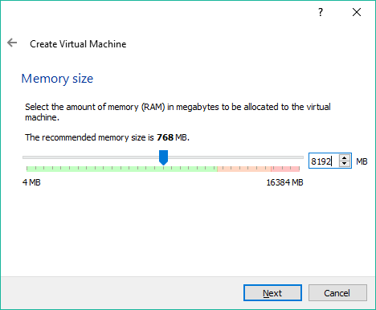

# 第一章：开始使用 TensorFlow

大型公共数据集的普及、低廉的 GPU 价格和开放的开发者文化在近年来彻底改变了机器学习的努力。训练数据——机器学习的命脉——近年来变得广泛可用且易于获取。计算能力也让小企业甚至个人都能拥有所需的算力。对于数据科学家而言，当前的十年是极其激动人心的。

行业内使用的一些顶级平台包括 Caffe、Theano 和 Torch。尽管这些底层平台在积极开发并开放共享，但由于安装困难、配置不直观以及在生产环境中的应用难度，使用者主要是机器学习从业者。

2015 年底和 2016 年带来了更多平台的加入——**TensorFlow**（来自谷歌）、**CNTK**（来自微软）以及**Veles**（来自三星）等。谷歌的 TensorFlow 因为多个原因而尤为引人注目。

TensorFlow 是所有平台中安装最简便的之一，将机器学习能力引入了普通爱好者和初学者程序员的领域。同时，像多 GPU 支持这样的高性能特性，也使得该平台对经验丰富的数据科学家和工业应用同样具有吸引力。TensorFlow 还提供了一个重新构想的流程和多个用户友好的工具，例如**TensorBoard**，以帮助管理机器学习工作。最后，平台得到了全球最大的机器学习巨头——谷歌的强力支持和社区支持。这一切发生在我们甚至还没讨论其背后强大的技术优势之前，我们稍后会深入探讨。

本章将涵盖以下主题：

+   macOS X

+   Microsoft Windows 和 Linux，包括核心软件和所有依赖项

+   启动虚拟机以启用 Windows 安装

# 当前的使用情况

虽然 TensorFlow 公开发布仅两年，但已有大量社区努力成功地将现有的机器学习项目移植过来。一些例子包括手写识别、语言翻译、动物分类、医学影像分诊和情感分析。机器学习广泛应用于多个行业和问题，总是让人感到好奇。使用 TensorFlow，这些问题不仅可行，而且容易实现。事实上，我们将在本书中逐一解决上述问题！

# 安装 TensorFlow

TensorFlow 便捷地提供了几种安装类型，并支持多种操作系统。基本安装仅限于 CPU，而更高级的安装则通过将计算任务推送到显卡，甚至多块显卡，来释放强大的计算能力。我们建议您先从基本的 CPU 安装开始。更复杂的 GPU 和 CUDA 安装将在附录中讨论，*高级安装*。

即使只有基本的 CPU 安装，TensorFlow 也提供了多种选项，具体如下：

+   基本的 Python `pip`安装

+   通过 Virtualenv 进行隔离的 Python 安装

+   通过 Docker 进行完全隔离的容器化安装

我们推荐通过 Virtualenv 进行 Python 安装，但我们的示例将使用基本的 Python `pip`安装，帮助您专注于任务的核心内容，即使 TensorFlow 运行起来。再次强调，更高级的安装类型将在附录中讨论，*高级安装*。

TensorFlow 可以在 Linux 和 macOS 上与 Python 2.7 和 3.5 一起完全运行。在 Windows 上，我们只能使用 Python 3.5.x 或 3.6.x 版本的 TensorFlow。通过运行**Linux 虚拟机**（**VM**），TensorFlow 也可以在 Windows 上轻松使用。使用 Ubuntu 虚拟机时，我们可以在 Python 2.7 环境下使用 TensorFlow。但在虚拟机中，无法使用 GPU 支持的 TensorFlow。从 TensorFlow 1.2 版本开始，TensorFlow 不再在 macOS 上提供 GPU 支持。因此，如果您想在 macOS 上使用 GPU 支持的 TensorFlow，您必须从源代码进行编译，这超出了本章的讨论范围。否则，您仍然可以使用 TensorFlow 1.0 或 1.1，这些版本在 macOS 上提供开箱即用的 GPU 支持。Linux 和 Windows 用户可以同时使用 CPU 和 GPU 支持的 TensorFlow。

# Ubuntu 安装

Ubuntu 是最适合与 TensorFlow 配合使用的 Linux 发行版之一。我们强烈推荐您使用 Ubuntu 机器，特别是如果您打算使用 GPU。我们大部分的工作将在 Ubuntu 终端上进行。我们将从通过以下命令安装`python-pip`和`python-dev`开始：

```py
sudo apt-get install python-pip python-dev
```

成功安装后的输出将如下所示：


如果您发现缺少软件包，可以通过以下命令来修复它们：

```py
sudo apt-get update --fix-missing
```

然后，您可以继续安装`python`和`pip`。

我们现在准备安装 TensorFlow。我们将进行 CPU-only 的安装，如果您希望进行 GPU 支持的高级安装，我们将在附录中讨论，*高级安装*。

CPU 安装通过以下命令启动：

```py
sudo pip install tensorflow
```

成功安装后的输出将如下所示：


# macOS 安装

如果你使用 Python，你可能已经安装了 Python 包管理器`pip`。但是，如果没有，你可以通过运行`easy_install pip`命令轻松安装它。你会注意到我们实际上执行了`sudo easy_install pip`—因为安装需要管理员权限，所以需要加上`sudo`前缀。

我们假设你已经有了基本的包管理器`easy_install`；如果没有，你可以从[`pypi.python.org/pypi/setuptools`](https://pypi.python.org/pypi/setuptools)安装它。成功安装后，将显示如下截图：


接下来，我们将安装`six`包：

```py
sudo easy_install --upgrade six
```

成功安装后，将显示如下截图：


令人惊讶的是，这就是 TensorFlow 的两个前提条件，现在我们可以安装核心平台了。我们将使用前面提到的`pip`包管理器，并直接从 Google 的站点安装 TensorFlow。截止到写本书时，最新版本是 v1.3，但你应该根据需要更改为你想使用的最新版本：

```py
sudo pip install tensorflow
```

`pip`安装程序将自动收集所有其他必需的依赖项。你将看到每个独立的下载和安装，直到软件完全安装完成。

成功安装后，将显示如下截图：


就这样！如果你已经完成了到这里的步骤，你可以开始训练并运行你的第一个模型。跳转到第二章，*你的第一个分类器*，开始训练你的第一个模型。

希望完全隔离安装的 macOS X 用户可以使用虚拟机（VM），如 Windows 安装部分所述。

# Windows 安装

如前所述，TensorFlow 与 Python 2.7 在 Windows 上无法原生运行。在本节中，我们将指导你通过安装 Python 3.5 的 TensorFlow，并为你提供如何设置 Linux 虚拟机以使用 Python 2.7 版 TensorFlow 的说明。

首先，我们需要从以下链接安装 Python 3.5.x 或 3.6.x 64 位版本：

[`www.python.org/downloads/release/python-352/`](https://www.python.org/downloads/release/python-352/)

[`www.python.org/downloads/release/python-362/`](https://www.python.org/downloads/release/python-362/)

请确保下载包含`amd64`的 64 位版本的 Python，如`python-3.6.2-amd64.exe`。Python 3.6.2 的安装界面如下：


我们将选择“Add Python 3.6 to PATH”并点击“Install Now”。安装过程完成后，将显示以下屏幕：


我们将点击禁用路径长度限制，然后点击关闭完成 Python 安装。现在，让我们在 Windows 菜单下打开 Windows PowerShell 应用程序。我们将使用以下命令安装仅 CPU 版本的 TensorFlow：

```py
pip3 install tensorflow
```


安装结果如下所示：


恭喜，您现在可以在 Windows 上使用 Python 3.5.x 或 3.6.x 支持的 TensorFlow。在接下来的部分，我们将向您展示如何设置虚拟机并使用 Python 2.7 配置 TensorFlow。如果您不需要 Python 2.7，可以跳到 第二章的 *测试安装* 部分，*您的第一个分类器*。

现在，我们将向您展示如何在 Linux 上设置虚拟机并使用 Python 2.7 配置 TensorFlow。我们推荐使用免费的 VirtualBox 系统，可以在 [`www.virtualbox.org/wiki/Downloads`](https://www.virtualbox.org/wiki/Downloads) 下载。本文写作时的最新稳定版本是 v5.0.14，下载链接如下：

[`download.virtualbox.org/virtualbox/5.1.28/VirtualBox-5.1.28-117968-Win.exe`](http://download.virtualbox.org/virtualbox/5.1.28/VirtualBox-5.1.28-117968-Win.exe)

成功的安装将允许您运行 Oracle VM VirtualBox 管理器仪表盘，仪表盘如下所示：


# 虚拟机设置

Linux 有许多不同的版本，但由于 TensorFlow 文档大多数提到了 Ubuntu，我们将使用 Ubuntu Linux。您可以使用任何 Linux 版本，但需要注意，不同版本和每个版本的细节会有所不同。大多数差异无关紧要，但有些差异可能会导致安装或使用 TensorFlow 时出现问题。

即使选择了 Ubuntu，仍然有许多版本和配置，您可以在 [`cdimage.ubuntu.com/ubuntu-gnome/releases/14.04/release/`](http://cdimage.ubuntu.com/ubuntu-gnome/releases/14.04/release/) 查看一些。

我们将安装最流行的版本，即 Ubuntu 14.04.4 LTS（确保下载适合您计算机的版本）。标有 x86 的版本设计用于 32 位机器，而标有 64 位变体的版本则设计用于 64 位机器。大多数现代机器是 64 位的，因此如果不确定，请选择后者。

安装是通过 ISO 文件进行的，ISO 文件本质上是安装光盘的文件版本。Ubuntu 14.04.4 LTS 的 ISO 文件是 `ubuntu-gnome-14.04-desktop-amd64.iso`。

一旦下载了安装 ISO 文件，我们将设置虚拟机，并使用该 ISO 文件在虚拟机上安装 Ubuntu Linux。

在 Oracle VM VirtualBox 管理器上设置虚拟机相对简单，但请注意，默认选项不足以满足 TensorFlow 的要求。您将经历以下七个界面，最后系统会提示您输入刚刚下载的安装文件。

我们将首先设置操作系统类型，并配置分配给虚拟机的 **随机访问内存** (**RAM**)：

1.  注意，我们选择了 64 位安装，因为我们使用的是该镜像；如果需要，你可以选择使用 32 位镜像：


1.  分配多少 RAM 取决于你的机器有多少。在以下截图中，我们将把一半的内存（8 GB）分配给我们的虚拟机。请记住，这仅在运行虚拟机时消耗内存，因此我们可以大胆分配。至少可以分配 4 GB：

1.  我们的虚拟机需要一个硬盘。我们将创建一个 **虚拟硬盘** (**VHD**)，如以下截图所示：

1.  然后，我们将选择虚拟机的硬盘类型，即 VDI（VirtualBox 磁盘镜像），如以下截图所示：

1.  接下来，我们将选择为 VHD 分配多少空间。这一点非常重要，因为我们很快将处理非常大的数据集：

1.  我们将分配 12 GB，因为 TensorFlow 和典型的 TensorFlow 应用程序有许多依赖项，例如 `NumPy`、`SciPy` 和 `Pandas`。我们的练习还将下载大型数据集，用于训练：

1.  设置虚拟机后，它将出现在左侧的虚拟机列表中。选择它并点击启动。这相当于启动计算机：


1.  当机器第一次启动时，插入安装 CD（在我们的例子中，是我们之前下载的 Ubuntu ISO 文件）：


按照安装说明操作，你将完成 Ubuntu Linux 的完整安装并准备好使用！之后，你可以按照本章开头的 Ubuntu 安装指南进行操作。

# 测试安装

在本节中，我们将使用 TensorFlow 来计算一个简单的数学运算。首先，在 Linux/macOS 上打开终端，或者在 Windows 上打开 PowerShell。

现在，我们需要运行 `python` 来使用 TensorFlow，执行以下命令：

```py
python
```

在 Python shell 中输入以下程序：

```py
import tensorflow as tf
a = tf.constant(1.0)
b = tf.constant(2.0)
c = a + b
sess = tf.Session()
print(sess.run(c))
```

结果将类似于以下屏幕，其中 `3.0` 会出现在末尾：


# 摘要

本章介绍了在三大主要操作系统上安装 TensorFlow，因此所有读者都应该已经顺利运行该平台。Windows 用户遇到了额外的挑战，因为 TensorFlow 在 Windows 上只支持 Python 3.5.x 或 Python 3.6.x 64 位版本。然而，现在即使是 Windows 用户也应该能顺利运行了。恭喜你，现在有趣的部分开始了！

现在你已经安装了 TensorFlow。接下来的直接步骤是通过一个内置的训练样本来测试安装情况。接下来，我们将从零开始编写我们的第一个分类器——一个手写识别器。

在接下来的章节中，我们将回顾 TensorFlow 工具，并在我们的项目中使用它们。我们还将回顾主要的深度学习概念，并在项目的背景下使用每一个概念。你将有机会尝试多个行业的项目，涵盖从金融到医疗再到语言等领域。
