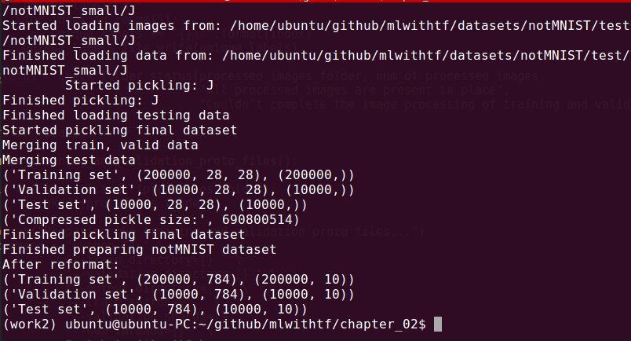
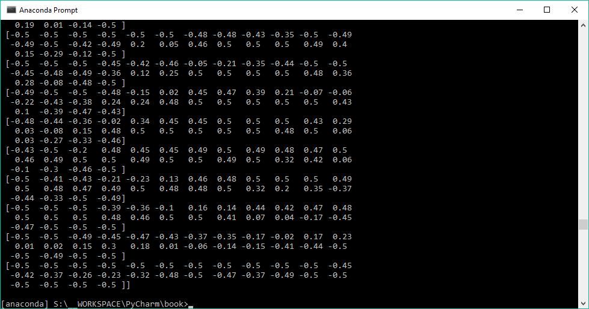
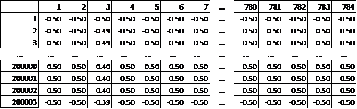
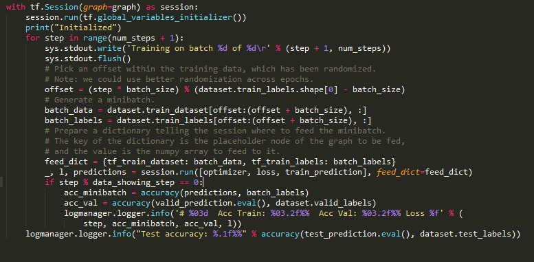
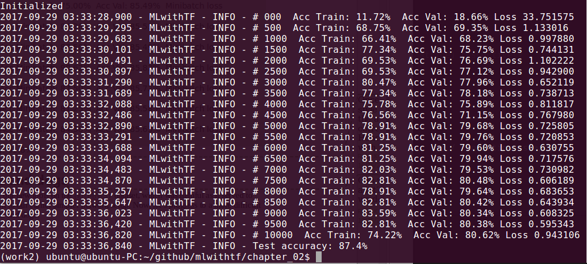
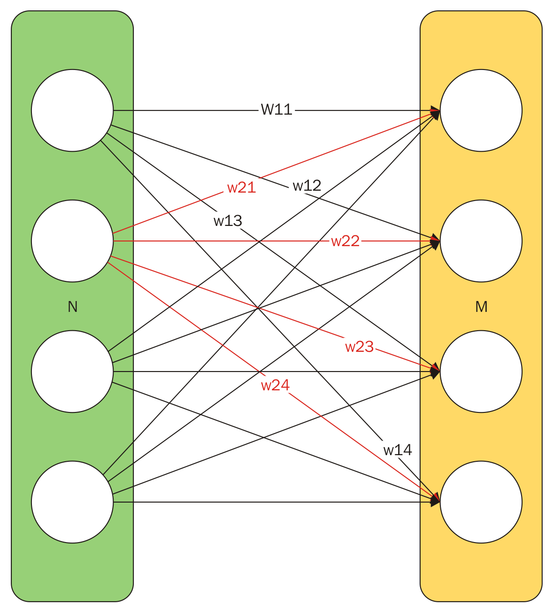

# 第二章：你的第一个分类器

TensorFlow 安装完成后，我们需要开始实践。我们将通过编写第一个分类器并从头到尾进行训练和测试来进行实践！

我们的第一个分类器将是一个手写识别器。最常用的训练数据集之一是**MNIST**手写数字数据集。我们将使用一个类似的数据集，名为`notMNIST`，它包含了英文字母表中的前十个字母。

# 关键部分

大多数机器学习分类器有三个关键部分，分别如下：

+   训练流程

+   神经网络设置和训练输出

+   使用流程

训练流程获取数据，对数据进行分阶段处理、清洗、标准化，并将其转化为神经网络可接受的格式。不要惊讶，最初训练流程可能占用你 80%到 85%的工作量——这是大多数机器学习工作的现实。通常，训练数据越真实，训练流程所花费的时间就越多。在企业环境中，训练流程可能是一个持续的工作，不断进行增强。随着数据集的增大，这一点尤为真实。

第二部分是神经网络的设置和训练，对于常规问题，训练过程可能很快，但对于更难的问题，则可能需要进行研究级的努力。你可能会发现自己反复调整网络设置，直到最终达到所需的分类器精度。训练是计算最为密集的部分，因此需要时间才能评估每次增量修改的结果。

一旦初始设置完成，并且网络训练到足够的精度，我们就可以反复使用它。在第十章，*Go Live and Go Big*中，我们将探索更多的高级话题，如持续学习，甚至使用过程本身也可以反馈进一步训练分类器。

# 获取训练数据

机器学习需要训练数据——通常需要大量的训练数据。机器学习的一大优点是可以使用标准的训练数据集。这些数据集通常用于基准测试节点模型和配置，并提供一致的标准来衡量与之前进展的性能对比。许多数据集也用于年度全球比赛。

本章使用的训练数据由机器学习研究员 Yaroslav Bulatov 慷慨提供。

# 下载训练数据

你应该从以下链接下载训练数据：

+   [`yaroslavvb.com/upload/notMNIST/notMNIST_small.tar.gz`](http://yaroslavvb.com/upload/notMNIST/notMNIST_small.tar.gz)

+   [`yaroslavvb.com/upload/notMNIST/notMNIST_large.tar.gz`](http://yaroslavvb.com/upload/notMNIST/notMNIST_large.tar.gz)

我们将通过编程下载数据，但首先应该手动下载数据集，先大致了解一下数据和归档的结构。这在我们编写数据流水线时非常重要，因为我们需要理解数据结构，以便操作数据。

这个小数据集非常适合快速查看。你可以通过以下命令行操作，或者直接使用浏览器下载文件，利用解压工具提取文件（我建议你熟悉命令行，因为所有这些操作都需要自动化处理）：

```py
cd ~/workdir
wget http://yaroslavvb.com/upload/notMNIST/notMNIST_small.tar.gz
tar xvf notMNIST_small.tar.gz
```

前面的命令行将显示一个名为`notMNIST_small`的容器文件夹，下面有十个子文件夹，每个字母（从`a`到`j`）对应一个文件夹。在每个字母文件夹下，有成千上万张 28x28 像素的字母图片。另外，需要注意的是，每个字母图像的文件名（`QnJhbmRpbmcgSXJvbi50dGY=`）表明它是一个随机字符串，并不包含有用信息。

# 理解类

我们正在编写的分类器旨在将未知图像分配到某个类。类可以是以下几种类型：

+   猫科动物与犬科动物

+   二与七

+   肿瘤与正常

+   微笑与皱眉

在我们的案例中，我们将每个字母作为一个类别，共有 10 个类别。训练集将显示 10 个子文件夹，每个子文件夹下有成千上万的图像。子文件夹的名称很重要，因为它是每张图像的标签。这些细节将被流水线用于准备 TensorFlow 的数据。

# 自动化训练数据设置

理想情况下，我们希望整个过程都能自动化。这样，无论我们在哪台电脑上使用，都可以轻松地端到端地运行这个过程，而不需要携带额外的资产。这个过程在后续会很重要，因为我们通常会在一台电脑（开发机）上进行开发，然后在另一台电脑（生产服务器）上进行部署。

我已经为本章节以及其他所有章节写好了代码，代码可以在[`github.com/mlwithtf/MLwithTF`](https://github.com/mlwithtf/MLwithTF)找到。我们的方法是边理解边重写代码。像这样直接的部分可以跳过。我建议你分叉这个仓库，并为你的项目克隆一份本地副本：

```py
cd ~/workdir
git clone https://github.com/mlwithtf/MLwithTF
cd chapter_02
```

本节的代码可通过以下链接获取——[`github.com/mlwithtf/mlwithtf/blob/master/chapter_02/download.py.`](https://github.com/mlwithtf/mlwithtf/blob/master/chapter_02/download.py)

准备数据集是训练过程中的一个重要部分。在深入代码之前，我们将运行`download.py`来自动下载并准备数据集：

```py
python download.py
```

结果将如下所示：

****

现在，我们将查看几个在`download.py`中使用的函数。你可以在这个文件中找到代码：

[`github.com/mlwithtf/mlwithtf/blob/master/data_utils.py`](https://github.com/mlwithtf/mlwithtf/blob/master/data_utils.py)

以下`downloadFile`函数将自动下载文件并验证文件大小是否符合预期：

```py
 from __future__ import print_function 
 import os 
 from six.moves.urllib.request import urlretrieve 
 import datetime 
 def downloadFile(fileURL, expected_size): 
    timeStampedDir=datetime.datetime.now()
     .strftime("%Y.%m.%d_%I.%M.%S") 
    os.makedirs(timeStampedDir) 
    fileNameLocal = timeStampedDir + "/" +     
    fileURL.split('/')[-1] 
    print ('Attempting to download ' + fileURL) 
    print ('File will be stored in ' + fileNameLocal) 
    filename, _ = urlretrieve(fileURL, fileNameLocal) 
    statinfo = os.stat(filename) 
    if statinfo.st_size == expected_size: 
        print('Found and verified', filename) 
    else: 
        raise Exception('Could not get ' + filename) 
    return filename 
```

该函数可以按如下方式调用：

```py
 tst_set = 
 downloadFile('http://yaroslavvb.com/upload/notMNIST/notMNIST_small
 .tar.gz', 8458043) 
```

提取内容的代码如下（请注意，额外的导入是必需的）：

```py
 import os, sys, tarfile 
 from os.path import basename 

 def extractFile(filename): 
    timeStampedDir=datetime.datetime.now()
     .strftime("%Y.%m.%d_%I.%M.%S") 
    tar = tarfile.open(filename) 
    sys.stdout.flush() 
    tar.extractall(timeStampedDir) 
    tar.close() 
    return timeStampedDir + "/" + os.listdir(timeStampedDir)[0] 
```

我们按顺序调用`download`和 extract 方法，代码如下：

```py
 tst_src='http://yaroslavvb.com/upload/notMNIST/notMNIST_small.tar.
 gz' 
 tst_set = downloadFile(tst_src, 8458043) 
 print ('Test set stored in: ' + tst_set) 
 tst_files = extractFile(tst_set) 
 print ('Test file set stored in: ' + tst_files) 
```

# 额外的设置

下一部分将重点介绍图像处理和操作。这需要一些额外的库，可能你还没有安装。此时，最好安装所有常见的科学计算所需的包，可以按以下方式完成：

```py
sudo apt-get install python-numpy python-scipy python-matplotlib 
ipython ipython-notebook python-pandas python-sympy python-nose
```

此外，安装图像处理库、一些外部矩阵数学库及其底层依赖，方法如下：

```py
sudo pip install ndimage
sudo apt-get install libatlas3-base-dev gcc gfortran g++
```

# 将图像转换为矩阵

机器学习的很多工作其实就是在矩阵上进行操作。接下来，我们将通过将图像转换成一系列矩阵来开始这个过程——本质上是一个 3D 矩阵，其宽度与我们拥有的图像数量相同。

本章及全书中几乎所有的矩阵操作都将使用 NumPy——Python 科学计算领域最流行的库。你可以在[`www.numpy.org/`](http://www.numpy.org/)找到 NumPy。你应该在运行接下来的操作之前安装它。

以下代码打开图像并创建数据矩阵（请注意现在需要额外的三个导入）：

```py
 import numpy as np 
 from IPython.display import display, Image 
 from scipy import ndimage 

 image_size = 28  # Pixel width and height. 
 pixel_depth = 255.0  # Number of levels per pixel. 
 def loadClass(folder): 
  image_files = os.listdir(folder) 
  dataset = np.ndarray(shape=(len(image_files), 
  image_size, 
   image_size), dtype=np.float32) 
  image_index = 0 
  print(folder) 
  for image in os.listdir(folder): 
    image_file = os.path.join(folder, image) 
    try: 
      image_data =  
     (ndimage.imread(image_file).astype(float) -  
                    pixel_depth / 2) / pixel_depth 
      if image_data.shape != (image_size, image_size): 
        raise Exception('Unexpected image shape: %s' % 
     str(image_data.shape)) 
      dataset[image_index, :, :] = image_data 
      image_index += 1 
     except IOError as e: l
      print('Could not read:', image_file, ':', e, '-   
      it\'s ok, 
       skipping.') 
     return dataset[0:image_index, :, :] 
```

我们已经从上一节中提取了文件。现在，我们可以对所有提取的图像执行这个过程，代码如下：

```py
 classFolders = [os.path.join(tst_files, d) for d in 
 os.listdir(tst_files) if os.path.isdir(os.path.join(tst_files, 
 d))] 
 print (classFolders) 
 for cf in classFolders: 
    print ("\n\nExaming class folder " + cf) 
    dataset=loadClass(cf) 
    print (dataset.shape) 
```

该过程基本上将字母加载到一个类似于这样的矩阵中：


然而，观察矩阵会揭示出更多微妙之处。可以通过打印堆栈中的某一层来查看（例如，`np.set_printoptions(precision=2); print(dataset[47])`）。你会发现一个不是由位组成的矩阵，而是由浮点数组成的：



图像首先会被加载到一个值范围为 0 到 255 的矩阵中：


这些图像将被缩放到-0.5 到 0.5 之间，稍后我们将回顾为什么这样做。最后，我们将得到一个看起来像这样的图像堆栈：


这些都是灰度图像，因此我们只处理一个层级。我们将在后续章节处理中彩色图像；在那些情况下，每张照片将具有三行的矩阵，并且分别包含红色、绿色和蓝色的矩阵。

# 合理的停止点

下载我们的训练文件花费了很长时间。即使提取所有图像也花费了一些时间。为了避免重复这些步骤，我们将尽量只做一次所有的工作，然后创建**pickle 文件**——这些是 Python 数据结构的存档。

以下过程会遍历我们的训练集和测试集中的每个类，并为每个类创建一个单独的`pickle`文件。在以后的运行中，我们将直接从这里开始：

```py
 def makePickle(imgSrcPath): 
    data_folders = [os.path.join(tst_files, d) for d in 
     os.listdir(tst_files) if os.path.isdir(os.path.join(tst_files, 
     d))] 
    dataset_names = [] 
    for folder in data_folders: 
        set_filename = folder + '.pickle' 
        dataset_names.append(set_filename) 
        print('Pickling %s.' % set_filename) 
        dataset = loadClass(folder) 
        try: 
            with open(set_filename, 'wb') as f: 
                pickle.dump(dataset, f, pickle.HIGHEST_PROTOCOL) 
        except Exception as e: 
            print('Unable to save data to', set_filename, ':', e) 
    return dataset_names 
```

`Pickle` 文件本质上是可持久化并可重建的字典转储。

# 机器学习公文包

我们刚刚创建了漂亮、干净的`pickle`文件，里面是经过预处理的图像，用于训练和测试我们的分类器。然而，我们最终得到了 20 个`pickle`文件。这有两个问题。首先，我们有太多文件，难以轻松管理。其次，我们只完成了管道的一部分，即处理了我们的图像集，但还没有准备好一个 TensorFlow 可用的文件。

现在，我们需要创建三个主要的数据集——训练集、验证集和测试集。训练集将用于训练我们的分类器，验证集用于评估每次迭代的进展。测试集将在训练结束后保密，届时会用来测试我们训练模型的效果。

实现这些操作的代码比较长，所以我们将让你自行查看 Git 仓库。请特别注意以下三个函数：

```py
 def randomize(dataset, labels): 
    permutation = np.random.permutation(labels.shape[0]) 
    shuffled_dataset = dataset[permutation, :, :] 
    shuffled_labels = labels[permutation] 
    return shuffled_dataset, shuffled_labels  

 def make_arrays(nb_rows, img_size): 
    if nb_rows: 
        dataset = np.ndarray((nb_rows, img_size, img_size),   
 dtype=np.float32) 
        labels = np.ndarray(nb_rows, dtype=np.int32) 
    else: 
        dataset, labels = None, None 
    return dataset, labels 

 def merge_datasets(pickle_files, train_size, valid_size=0): 
  num_classes = len(pickle_files) 
  valid_dataset, valid_labels = make_arrays(valid_size,  
  image_size) 
  train_dataset, train_labels = make_arrays(train_size,  
  image_size) 
  vsize_per_class = valid_size // num_classes 
  tsize_per_class = train_size // num_classes 

  start_v, start_t = 0, 0 
  end_v, end_t = vsize_per_class, tsize_per_class 
  end_l = vsize_per_class+tsize_per_class 
  for label, pickle_file in enumerate(pickle_files): 
    try: 
      with open(pickle_file, 'rb') as f: 
        letter_set = pickle.load(f) 
        np.random.shuffle(letter_set) 
        if valid_dataset is not None: 
          valid_letter = letter_set[:vsize_per_class, :, :] 
          valid_dataset[start_v:end_v, :, :] = valid_letter 
          valid_labels[start_v:end_v] = label 
          start_v += vsize_per_class 
          end_v += vsize_per_class 

        train_letter = letter_set[vsize_per_class:end_l, :, :] 
        train_dataset[start_t:end_t, :, :] = train_letter 
        train_labels[start_t:end_t] = label 
        start_t += tsize_per_class 
        end_t += tsize_per_class 
    except Exception as e: 
      print('Unable to process data from', pickle_file, ':', e) 
      raise 

  return valid_dataset, valid_labels, train_dataset, train_labels 
```

这三部分完成了我们的管道方法。但是，我们仍然需要使用这个管道。为此，我们首先将定义训练、验证和测试集的大小。你可以更改这些参数，但当然应该保持它们小于可用的完整大小：

```py
     train_size = 200000 
     valid_size = 10000 
     test_size = 10000 
```

然后，这些尺寸将用于构建合并后的（即，合并我们所有的类别）数据集。我们将传入`pickle`文件的列表作为数据源，并获取一个标签向量和一个图像矩阵堆栈。最后，我们会打乱数据集，如下所示：

```py
 valid_dataset, valid_labels, train_dataset, train_labels = 
  merge_datasets( 
   picklenamesTrn, train_size, valid_size) 
 _, _, test_dataset, test_labels = merge_datasets(picklenamesTst, 
  test_size) 
 train_dataset, train_labels = randomize(train_dataset, 
  train_labels) 
 test_dataset, test_labels = randomize(test_dataset, test_labels) 
 valid_dataset, valid_labels = randomize(valid_dataset, 
  valid_labels) 
```

我们可以通过以下方式查看我们新合并的数据集：

```py
 print('Training:', train_dataset.shape, train_labels.shape) 
 print('Validation:', valid_dataset.shape, valid_labels.shape) 
 print('Testing:', test_dataset.shape, test_labels.shape) 
```

哎呀！这真是太费劲了，我们以后不想再重复这些工作了。幸运的是，我们不必再做这些，因为我们会将三个新数据集重新打包成一个巨大的`pickle`文件。今后，所有的学习都将跳过前面的步骤，直接从这个巨大的`pickle`文件开始：

```py
 pickle_file = 'notMNIST.pickle' 

 try: 
   f = open(pickle_file, 'wb') 
   save = { 
      'datTrn': train_dataset, 
    'labTrn': train_labels, 
    'datVal': valid_dataset, 
    'labVal': valid_labels, 
    'datTst': test_dataset, 
    'labTst': test_labels, 
     } 
   pickle.dump(save, f, pickle.HIGHEST_PROTOCOL) 
   f.close() 
 except Exception as e: 
   print('Unable to save data to', pickle_file, ':', e) 
   raise 

 statinfo = os.stat(pickle_file) 
 print('Compressed pickle size:', statinfo.st_size) 
```

将矩阵输入 TensorFlow 的理想方式其实是作为一维数组；因此，我们将把 28x28 的矩阵重新格式化为 784 个小数的字符串。为此，我们将使用以下`reformat`方法：

```py
 def reformat(dataset, labels): 
   dataset = dataset.reshape((-1, image_size * 
    image_size)).astype(np.float32) 
   labels = (np.arange(num_labels) == 
    labels[:,None]).astype(np.float32) 
   return dataset, labels 
```

我们的图像现在看起来是这样的，每一行代表训练集、验证集和测试集中的一张图像：



最后，为了打开并操作`pickle`文件的内容，我们只需读取之前选定的变量名，并像操作哈希图一样提取数据：

```py
 with open(pickle_file, 'rb') as f: 
   pkl = pickle.load(f) 
   train_dataset, train_labels = reformat(pkl['datTrn'], 
    pkl['labTrn']) 
   valid_dataset, valid_labels = reformat(pkl['datVal'], 
    pkl['labVal']) 
   test_dataset, test_labels = reformat(pkl['datTst'], 
    pkl['labTst']) 
```

# 训练日

现在，我们来到了有趣的部分——神经网络。训练这个模型的完整代码可以通过以下链接查看：[`github.com/mlwithtf/mlwithtf/blob/master/chapter_02/training.py`](https://github.com/mlwithtf/mlwithtf/blob/master/chapter_02/training.py)

为了训练模型，我们将导入更多的模块：

```py
 import sys, os
 import tensorflow as tf
 import numpy as np
 sys.path.append(os.path.realpath('..'))
 import data_utils
 import logmanager 
```

然后，我们将定义一些用于训练过程的参数：

```py
 batch_size = 128
 num_steps = 10000
 learning_rate = 0.3
 data_showing_step = 500
```

之后，我们将使用`data_utils`包加载前一部分中下载的数据集：

```py
 dataset, image_size, num_of_classes, num_of_channels =  
 data_utils.prepare_not_mnist_dataset(root_dir="..")
 dataset = data_utils.reformat(dataset, image_size, num_of_channels,   
 num_of_classes)
 print('Training set', dataset.train_dataset.shape,  
 dataset.train_labels.shape)
 print('Validation set', dataset.valid_dataset.shape,  
 dataset.valid_labels.shape)
 print('Test set', dataset.test_dataset.shape,  
 dataset.test_labels.shape)
```

我们将从一个完全连接的网络开始。目前，只需相信网络的设置（我们稍后会深入探讨网络的设置理论）。我们将在下面的代码中将神经网络表示为一个图，称为`graph`：

```py
 graph = tf.Graph()
 with graph.as_default():
 # Input data. For the training data, we use a placeholder that will  
 be fed
 # at run time with a training minibatch.
 tf_train_dataset = tf.placeholder(tf.float32,
 shape=(batch_size, image_size * image_size * num_of_channels))
 tf_train_labels = tf.placeholder(tf.float32, shape=(batch_size,  
 num_of_classes))
 tf_valid_dataset = tf.constant(dataset.valid_dataset)
 tf_test_dataset = tf.constant(dataset.test_dataset)
 # Variables.
 weights = {
 'fc1': tf.Variable(tf.truncated_normal([image_size * image_size *  
 num_of_channels, num_of_classes])),
 'fc2': tf.Variable(tf.truncated_normal([num_of_classes,  
 num_of_classes]))
 }
 biases = {
 'fc1': tf.Variable(tf.zeros([num_of_classes])),
 'fc2': tf.Variable(tf.zeros([num_of_classes]))
 }
 # Training computation.
 logits = nn_model(tf_train_dataset, weights, biases)
 loss = tf.reduce_mean(
 tf.nn.softmax_cross_entropy_with_logits(logits=logits,  
 labels=tf_train_labels))
 # Optimizer.
 optimizer =  
 tf.train.GradientDescentOptimizer(learning_rate).minimize(loss)
 # Predictions for the training, validation, and test data.
 train_prediction = tf.nn.softmax(logits)
 valid_prediction = tf.nn.softmax(nn_model(tf_valid_dataset,  
 weights, biases))
 test_prediction = tf.nn.softmax(nn_model(tf_test_dataset, weights,  
 biases))
 The most important line here is the nn_model where the neural  
 network is defined:
 def nn_model(data, weights, biases):
 layer_fc1 = tf.matmul(data, weights['fc1']) + biases['fc1']
 relu_layer = tf.nn.relu(layer_fc1)
 return tf.matmul(relu_layer, weights['fc2']) + biases['fc2']
```

用于训练模型的`loss`函数也是这个过程中的一个重要因素：

```py
 loss = tf.reduce_mean(
 tf.nn.softmax_cross_entropy_with_logits(logits=logits,  
 labels=tf_train_labels))
 # Optimizer.
 optimizer =  
 tf.train.GradientDescentOptimizer(learning_rate).minimize(loss)
```

这是使用的优化器（随机梯度下降），以及`learning_rate (0.3)`和我们试图最小化的函数（带交叉熵的 softmax）。

真实的操作，且最耗时的部分，发生在接下来的最终阶段——训练循环：



我们可以在`chapter_02`目录中使用以下命令运行这个训练过程：

```py
python training.py
```

运行该过程会生成以下输出：



我们正在进行数百次的循环，并且每 500 次循环打印一次指示性结果。当然，你可以修改任何这些设置。重要的是要理解循环的过程：

+   我们将多次循环执行这个过程。

+   每次，我们都会创建一个小批量的照片，这些照片是完整图像集的一个切割部分。

+   每一步都会运行 TensorFlow 会话，产生一个损失值和一组预测结果。每一步还会对验证集进行预测。

+   在迭代周期的最后，我们将在之前一直保密的测试集上做最终预测。

+   对于每次做出的预测，我们将通过预测准确度来观察我们的进展。

我们之前没有讨论`accuracy`方法。这个方法简单地将预测标签与已知标签进行比较，从而计算出一个百分比得分：

```py
 def accuracy(predictions, labels): 
  return (100.0 * np.sum(np.argmax(predictions, 1) == 
   np.argmax(labels, 1)) 
          / predictions.shape[0])
```

仅仅运行前面的分类器就能获得大约 85%的准确率。这是相当了不起的，因为我们才刚刚开始！我们仍然可以继续进行更多的调整。

# 为了持续使用，保存模型

为了将 TensorFlow 会话中的变量保存以便将来使用，你可以使用`Saver()`函数，代码如下：

```py
 saver = tf.train.Saver() 
```

之后，你可以通过恢复以下检查点来获取模型的状态，避免繁琐的重新训练：

```py
 ckpt = tf.train.get_checkpoint_state(FLAGS.checkpoint_dir) 
 if ckpt and ckpt.model_checkpoint_path: 
 saver.restore(sess, ckpt.model_checkpoint_path) 
```

# 为什么要隐藏测试集？

注意，我们直到最后一步才使用测试集。为什么不早点使用？这是一个相当重要的细节，确保测试集能够保持良好。随着我们在训练集上迭代并微调分类器的行为，我们有时会*将分类器包裹在图像中*或过度训练。当你学习训练集而非每个类别内的特征时，这种情况就会发生。

当我们过度训练时，训练集的迭代轮次中的准确度看起来很有希望，但那完全是虚假的希望。拥有一个从未见过的测试集应该将现实带回到过程当中。在训练集上表现出色却在测试集上结果不佳，通常意味着过拟合。

这就是为什么我们保留了一个单独的测试集。它帮助指示分类器的真实准确性。这也是为什么你绝对不应将数据集混合或与测试集打乱的原因。

# 使用分类器

我们将使用`notMNIST_small.tar.gz`来演示分类器的使用，它将作为测试集。对于分类器的持续使用，你可以自己提供图像，并通过类似的管道对其进行测试，而非训练。

你可以自己创建一些 28x28 的图像，并将它们放入测试集中进行评估。你会感到惊喜的！

在实际应用中，遇到的一个问题是野外图像的异质性。你可能需要找到图像、裁剪它们、缩小它们，或者进行其他一系列变换。这些都属于我们之前讨论过的使用管道的一部分。

另一种处理大图像的技术是，在图像上滑动一个小窗口，并将图像的每个子部分输入分类器进行分类，这适用于像在页面尺寸的图像上查找字母这样的任务。

在未来的章节中，我们将把模型投入生产环境，但作为预览，一种常见的配置是将训练好的模型迁移到云端服务器上。系统的外观可能是一个智能手机应用程序，用户拍照后，照片会被发送到后台进行分类。在这种情况下，我们会用一个网络服务将整个程序包装起来，接受传入的分类请求并进行程序化响应。流行的配置有很多，我们将在第九章中探讨其中的几个，*巡航控制 - 自动化*。

# 深入探索神经网络

注意我们是如何达到 86%的准确率的。对于仅仅两小时的工作，这个结果已经很不错，但我们能做得更好。未来的潜力大部分来自于改变神经网络。我们之前的应用使用的是**全连接**设置，在这种设置中，每一层的节点都与上一层的节点相连，形状如下：



正如你将在后续章节中学到的，随着网络结构变得更复杂，这种设置虽然快速，但并不理想。最大的问题是参数的数量庞大，这可能导致模型在训练数据上过拟合。

# 学到的技能

你应该在本章中学到了这些技能：

+   准备训练数据和测试数据

+   创建一个 TensorFlow 可消费的训练集

+   设置基本的神经网络图

+   训练 TensorFlow 分类器

+   验证分类器

+   输入真实世界数据

# 总结

进展非常顺利！我们刚刚构建了一个十年前也可以被认为是世界级的手写字分类器。此外，我们围绕这个过程构建了一个完整的管道，能够完全自动化训练设置和执行。这意味着我们的程序几乎可以迁移到任何服务器上，并继续正常运行，几乎是开箱即用。
