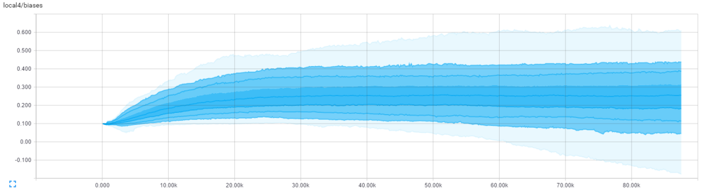

# 第三章：TensorFlow 工具箱

大多数机器学习平台面向的是学术或工业领域的科学家和从业人员。因此，尽管它们功能强大，但往往比较粗糙，缺乏许多用户体验功能。

在各个阶段查看模型并查看和汇总不同模型和运行的性能是需要付出相当多的努力的。即使是查看神经网络，所需的努力也可能比预期的要多。

虽然在神经网络简单且仅有几层时，这样做是可以接受的，但今天的网络要深得多。2015 年，微软使用一款具有 152 层的深度网络赢得了年度 **ImageNet** 大赛。可视化这样深的网络可能会很困难，查看权重和偏差可能会让人不知所措。

从业者们开始使用自建的可视化工具和引导工具来分析他们的网络并进行性能评估。TensorFlow 通过在整体平台发布时直接发布 TensorBoard 改变了这一点。TensorBoard 开箱即用，无需额外安装或设置。

用户只需要根据他们想要捕捉的内容来为代码添加监控。它具有绘制事件、学习率和损失随时间变化的图表；权重和偏差的直方图；以及图像。图形浏览器允许交互式地查看神经网络。

在本章中，我们将重点讨论以下几个领域：

+   我们将从使用四个常见模型和数据集作为示例，介绍为 TensorBoard 提供输入所需的监控内容，并突出所需的更改。

+   然后，我们将回顾捕捉到的数据和如何解读它们。

+   最后，我们将回顾图形浏览器可视化的常见图形。这将帮助您可视化常见的神经网络设置，这些设置将在后续章节和项目中介绍。这也是对常见网络的可视化入门。

# 快速预览

即使没有安装 TensorFlow，您也可以尝试 TensorBoard 的参考实现。您可以从这里开始：

[`www.tensorflow.org/tensorboard/index.html#graphs.`](https://www.tensorflow.org/tensorboard/index.html#graphs)

您可以在这里跟随代码：

[`github.com/tensorflow/tensorflow/blob/master/tensorflow/model

s/image/cifar10/cifar10_train.py.`](https://github.com/tensorflow/models/blob/master/tutorials/image/cifar10/cifar10_train.py)

该示例使用 **CIFAR-10** 图像集。CIFAR-10 数据集包含 60,000 张图像，分为 10 类，由 Alex Krizhevsky、Vinod Nair 和 Geoffrey Hinton 编制。该数据集已成为机器学习领域的几个标准学习工具和基准之一。

我们从图形浏览器开始。我们可以立即看到正在使用卷积网络。这并不令人惊讶，因为我们在这里尝试对图像进行分类：


这只是图形的其中一种视图。您也可以尝试使用图形浏览器。它允许深入查看单个组件。

我们在快速预览中的下一站是**EVENTS**标签页。该标签页展示了随时间变化的标量数据。不同的统计信息被分组到右侧的单独标签中。以下截图展示了多个网络部分的常见标量统计数据，例如损失、学习率、交叉熵和稀疏度：


**HISTOGRAMS**标签页是一个近亲，它展示了随时间变化的张量数据。尽管名字是直方图，但从 TensorFlow v0.7 开始，它实际上并不显示直方图。相反，它通过百分位数来展示张量数据的汇总信息。

总结视图如下图所示。就像在**EVENTS**标签页中一样，数据被分组到右侧的标签中。可以切换不同的运行，并且可以将多个运行叠加显示，便于进行有趣的对比。

它展示了三次运行，我们可以在左侧看到，我们将只查看`softmax`函数及其相关参数。

暂时不必太担心这些的含义，我们只需要看看我们为自己的分类器能做到什么：


然而，总结视图无法充分体现**HISTOGRAMS**标签页的实用性。相反，我们将放大单个图表，观察具体情况。如下图所示：



请注意，每个直方图图表展示了九条时间序列线。顶部是最大值，中间是中位数，底部是最小值。中位数上下的三条线分别表示 1½标准差、1 标准差和½标准差的位置。

显然，这确实表示了多模态分布，因为它不是一个直方图。然而，它确实提供了一个快速的概览，否则这些数据将会是需要翻阅的大量数据。

有几点需要注意：数据如何按运行收集和分隔，如何收集不同的数据流，如何放大视图，以及如何缩放到每个图表。

够了，先放下这些图形，让我们跳进代码中，亲自运行一下吧！

# 安装 TensorBoard

TensorFlow 已经预装了 TensorBoard，因此它会自动安装。它作为本地提供的 Web 应用程序运行，通过浏览器访问`http://0.0.0.0:6006`。方便的是，不需要任何服务器端的代码或配置。

根据路径的不同，您可能能够直接运行它，如下所示：

```py
tensorboard --logdir=/tmp/tensorlogs
```

如果路径不正确，您可能需要根据需要在应用程序前加上前缀，如以下命令行所示：

```py
tf_install_dir/ tensorflow/tensorboard --
logdir=/tmp/tensorlogs
```

在 Linux 上，您可以将其在后台运行，并让它保持运行，如下所示：

```py
nohup tensorboard --logdir=/tmp/tensorlogs &
```

不过，目录结构应当谨慎考虑。仪表板左侧的“Runs”列表是由`logdir`位置中的子目录驱动的。以下图片展示了两个运行——`MNIST_Run1`和`MNIST_Run2`。组织良好的`runs`文件夹可以帮助并排绘制连续的运行结果，从而查看不同之处：


在初始化`writer`时，您需要将日志的目录作为第一个参数传递，示例如下：

```py
   writer = tf.summary.FileWriter("/tmp/tensorlogs",   
   sess.graph) 
```

考虑保存一个基础位置，并为每次运行附加特定的子目录。这将有助于组织输出，而无需再多加思考。我们稍后会进一步讨论这一点。

# 将 hooks 集成到我们的代码中

使用 TensorBoard 的最佳方法是通过借用现有的工作示例并用 TensorBoard 所需的代码进行标记。我们将针对几个常见的训练脚本进行这样的操作。

# 手写数字

让我们从典型的机器学习入门例子——MNIST 手写数字分类练习开始。

正在使用的 MNIST 数据库包含 60,000 张用于训练的图像和 10,000 张用于测试的图像。该数据最初由 Chris Burges 和 Corinna Cortes 收集，并由 Yann LeCun 进行了增强。您可以在 Yann LeCun 的官方网站上了解更多关于数据集的信息（[`yann.lecun.com/exdb/mnist/`](http://yann.lecun.com/exdb/mnist/)）。

TensorFlow 方便地提供了一个测试脚本，演示了如何使用 MNIST 手写数据集构建卷积神经网络，代码可以在[`github.com/tensorflow/models/blob/master/tutorials/image/mnist/convolutional.py`](https://github.com/tensorflow/models/blob/master/tutorials/image/mnist/convolutional.py)找到。

让我们修改这个脚本以便使用 TensorBoard。如果您希望提前查看、下载金标准或查看更改，完整的修改集可以在本书的 GitHub 仓库中找到（[`github.com/mlwithtf/mlwithtf`](https://github.com/mlwithtf/mlwithtf)）。

目前，我们建议您跟着教程一步步修改，以理解整个过程。

在`main`类的早期，我们将定义`convn_weights`、`convn_biases`和其他参数的占位符。紧接着，我们将编写以下代码，将它们添加到`histogram`中：

```py
    tf.summary.histogram('conv1_weights', conv1_weights) 
    tf.summary.histogram('conv1_biases', conv1_biases) 
    tf.summary.histogram('conv2_weights', conv2_weights) 
    tf.summary.histogram('conv2_biases', conv2_biases) 
    tf.summary.histogram('fc1_weights', fc1_weights) 
    tf.summary.histogram('fc1_biases', fc1_biases) 
    tf.summary.histogram('fc2_weights', fc2_weights) 
    tf.summary.histogram('fc2_biases', fc2_biases) 
```

前面的几行捕获了“HISTOGRAMS”标签页中的值。请注意，捕获的值会在“HISTOGRAMS”标签页上形成子部分，以下截图展示了这一点：


接下来，让我们记录一些`loss`数据。我们有如下代码作为起点：

```py
    loss += 5e-4 * regularizers 
```

我们将在前面的行之后为`loss`数字添加一个`scalar`汇总：

```py
    tf.summary.scalar("loss", loss) 
```

同样，我们将从计算`learning_rate`的标准代码开始：

```py
     learning_rate = tf.train.exponential_decay( 
        0.01,  # Base learning rate. 
        batch * BATCH_SIZE,  # Current index into the    
        dataset. 
        train_size,  # Decay step. 
        0.95,  # Decay rate. 
        staircase=True) 
```

我们将为`learning_rate`数据添加一个`scalar`汇总，代码如下：

```py
    tf.summary.scalar("learning_rate", learning_rate) 
```

就这两行代码，帮助我们在“EVENTS”标签页中捕获这两个重要的标量指标：


最后，让我们指示脚本保存图形设置。我们来找到创建`session`的脚本部分：

```py
    # Create a local session to run the training. 
    start_time = time.time() 
    with tf.Session() as sess: 
```

在定义`sess`句柄之后，我们将如下捕获图形：

```py
    writer = tf.summary.FileWriter("/tmp/tensorlogs",  
    sess.graph) 
    merged = tf.summary.merge_all() 
```

我们在运行会话时需要添加我们的`merged`对象。我们原本有以下代码：

```py
    l, lr, predictions = sess.run([loss, learning_rate,  
    train_prediction], feed_dict=feed_dict) 
```

我们将在运行会话时添加我们的`merged`对象，如下所示：

```py
    # Run the graph and fetch some of the nodes.       
    sum_string, l, lr, predictions = sess.run([merged,  
    loss,  
    learning_rate, train_prediction],  
    feed_dict=feed_dict) 
```

最后，我们需要在指定步骤写入摘要，就像我们通常定期输出验证集的准确度一样。因此，我们在计算`sum_string`后添加了一行：

```py
    writer.add_summary(sum_string, step) 
```

就是这样！我们刚刚捕获了我们的损失和学习率、神经网络的关键中间参数以及图形结构。我们已经查看了 EVENTS 和 HISTOGRAMS 标签，现在让我们看看 GRAPH 标签：


# AlexNet

任何参与图像深度学习的人都应该熟悉 AlexNet。该网络是在 Alex Krizhevsky、Ilya Sutskever 和 Geoffrey E. Hinton 的标志性论文《*ImageNet Classification with Deep Convolutional Neural Networks*》中介绍的。论文可以在[`www.cs.toronto.edu/~fritz/absps/imagenet.pdf`](http://www.cs.toronto.edu/~fritz/absps/imagenet.pdf)查看。

该网络架构在当时的 ImageNet 年度竞赛中取得了创纪录的准确率。该架构在他们的论文中有所描述，如下图所示。我们将在后续章节中使用此网络架构，但现在，让我们通过 TensorBoard 浏览网络：


我们不会逐行审查现有的 AlexNet 代码更改，但读者可以通过注意 Google 提供的原始模型代码与我们包含在书本代码库中的修订代码之间的差异，轻松看到更改。

来自 Google 的原始 AlexNet TensorFlow 实现可以在以下位置找到：

[`github.com/tensorflow/models/blob/master/tutorials/image/alexnet/alexnet_benchmark.py.`](https://github.com/tensorflow/models/blob/master/tutorials/image/alexnet/alexnet_benchmark.py)

修订后的 AlexNet TensorFlow 实现与 TensorBoard 工具集成可以在以下位置找到：

[`github.com/mlwithtf/mlwithtf/blob/master/chapter_03/alexnet_benchmark.py.`](https://github.com/mlwithtf/mlwithtf/blob/master/chapter_03/alexnet_benchmark.py)

所做的更改与我们为 MNIST 示例所做的非常相似。

首先，找到以下代码的位置：

```py
    sess = tf.Session(config=config) 
    sess.run(init) 
```

然后，用以下代码替换它：

```py
    sess = tf.Session(config=config) 
    writer = tf.summary.FileWriter("/tmp/alexnet_logs",  
    sess.graph) 
    sess.run(init) 
```

最后，您可以运行 Python 文件`alexnet_benchmark.py`并使用 TensorBoard 命令来可视化图形：

```py
python alexnet_benchmark.py
tensorboard --logdir /tmp/alexnet_logs
```

本节的重点是图形部分。下图显示了 Graph Explorer 的一个部分。我们深入研究了第 3 层卷积层，正在查看该层的权重和偏差。

点击图中的权重节点很有趣，因为我们可以看到形状等细节：`{"shape":{"dim":[{"size":3},{"size":3},{"size":192},{"size":384}]}}`。我们可以将这些细节与原始论文和之前提到的图表进行匹配！我们还可以追溯这些细节到代码中的网络设置：

```py
    with tf.name_scope('conv3') as scope: 
      kernel = tf.Variable(tf.truncated_normal([3, 3, 192, 384], 
                               dtype=tf.float32, 
                               stddev=1e-1), name='weights') 
      conv = tf.nn.conv2d(pool2, kernel, [1, 1, 1, 1], 
       padding='SAME') 
      biases = tf.Variable(tf.constant(0.0, shape=[384], 
       dtype=tf.float32), 
                         trainable=True, name='biases') 
      bias = tf.nn.bias_add(conv, biases) 
      conv3 = tf.nn.relu(bias, name=scope) 
      parameters += [kernel, biases] 
```

图形浏览器和代码中的细节是等价的，但使用 TensorBoard 可以更直观地查看数据流。你还可以轻松地折叠重复的部分，展开感兴趣的部分：


图形是本节最有趣的部分，当然，你也可以运行我们修改过的脚本并查看训练性能，以及我们捕获的其他大量数据。你甚至可以捕获更多的数据。试试看吧！

# 自动化运行

在训练分类器时，我们通常会遇到多个我们不知道合适设置的变量。查看类似问题的解决方案所使用的值是一个很好的起点。然而，我们通常会面临一组需要测试的可能值。更复杂的是，我们通常有多个这样的参数，这将导致需要测试的组合数量大大增加。

对于这种情况，我们建议将感兴趣的参数保留为可以传递给训练器的值。然后，`wrapper` 脚本可以传递不同的参数组合，并带有一个可能带有描述性名称的唯一输出日志子目录。

这将使得跨多个测试结果和中间值的比较变得简单。下图展示了四次运行的损失曲线图。我们可以轻松看到表现不佳和表现过好的组合：


# 总结

在本章中，我们覆盖了 TensorBoard 的主要区域——EVENTS、HISTOGRAMS 和查看 GRAPH。我们修改了流行模型，以查看 TensorBoard 启动所需的精确变化。这应该展示了启动 TensorBoard 所需的非常少的工作量。

最后，我们通过查看流行模型的网络设计进行了重点研究。我们通过在代码中插入 TensorBoard hooks，并使用 TensorBoard 图形浏览器深入了解网络设置来实现这一点。

读者现在应该能够更有效地使用 TensorBoard，评估训练性能，计划运行并修改训练脚本。

接下来，我们将深入探讨卷积网络。我们将使用之前工作的部分内容，以便可以迅速开始。但我们将集中精力在更高级的神经网络设置上，以获得更好的准确性。对训练准确度的关注反映了大多数从业者的努力方向，因此，这是我们面临挑战的时刻。
